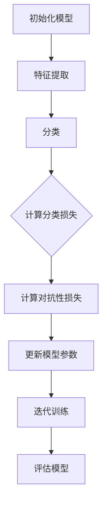
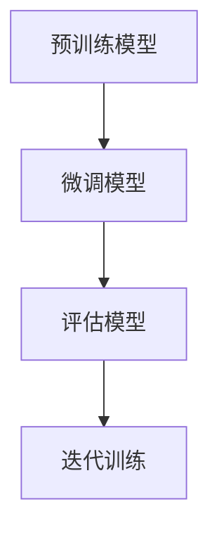
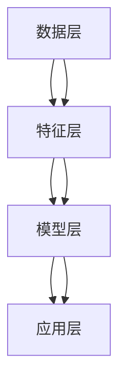
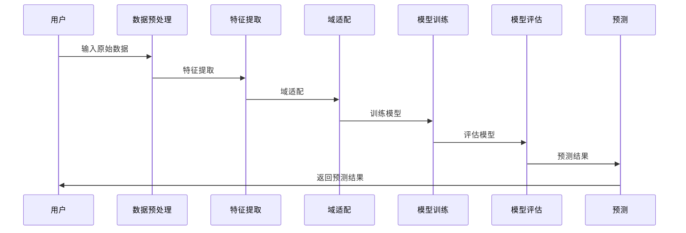

                 

## AI Agent's Knowledge Transfer Ability: Cross-Domain Learning

### Abstract

The ability of AI agents to transfer knowledge across different domains is a critical aspect of artificial intelligence research. This article delves into the concept of knowledge transfer, its significance in AI agents, and the challenges associated with cross-domain learning. We will explore theoretical foundations, algorithmic approaches, system design, practical applications, and best practices to understand how AI agents can leverage knowledge transfer for enhanced performance.

### Keywords

* AI Agents
* Knowledge Transfer
* Cross-Domain Learning
* Machine Learning Algorithms
* System Design
* Practical Applications

### Introduction

Artificial intelligence (AI) has witnessed remarkable progress over the past few decades, transforming various industries and shaping the future of technology. At the heart of AI lies the concept of AI agents—intelligent entities that interact with their environment to achieve specific goals. However, one of the significant challenges in AI research is the ability of these agents to generalize and adapt to new domains.

**Why is Knowledge Transfer Important?**

Knowledge transfer is the process of utilizing knowledge or information acquired in one domain to improve the performance of an AI agent in a different domain. This capability is crucial for several reasons:

1. **Reduced Data Dependency**: In traditional machine learning approaches, a large amount of domain-specific data is required to train models effectively. Knowledge transfer reduces the need for extensive labeled data in new domains, making AI more accessible and efficient.
2. **Improved Generalization**: By leveraging knowledge from one domain, AI agents can generalize better to new domains, reducing the risk of overfitting and improving the robustness of AI models.
3. **Enhanced Performance**: Knowledge transfer allows AI agents to benefit from the success and insights gained in one domain, leading to improved performance and more effective problem-solving.

**Challenges in Cross-Domain Learning**

Cross-domain learning, however, presents several challenges:

1. **Domain Heterogeneity**: Different domains may have distinct characteristics, making it difficult to transfer knowledge seamlessly between them.
2. **Data Distribution Shift**: The distribution of data across domains may vary significantly, leading to challenges in aligning the features and labels.
3. **Representation Mismatch**: The representations learned in one domain may not be directly applicable to another domain, requiring adaptation and transformation.

### Theoretical Foundations

To address these challenges, various theoretical foundations have been developed for knowledge transfer in AI agents. Some of the key concepts and models include:

1. **Source-Destination Domain Adaptation**: This approach involves mapping the features from the source domain to the target domain, enabling knowledge transfer.
2. **Meta-Learning**: Meta-learning focuses on training models that can quickly adapt to new domains by leveraging prior knowledge.
3. **Adversarial Training**: Adversarial training involves training models to distinguish between source and target domains, enhancing the robustness of knowledge transfer.

### Algorithm Analysis

We will now delve into specific algorithms and models that facilitate knowledge transfer in AI agents. Let's consider two prominent approaches:

1. **Domain-Adversarial Neural Networks (DANN)**: DANN leverages adversarial training to ensure that the feature extractor learns domain-invariant representations. The architecture consists of three main components: the feature extractor, the domain classifier, and the adversarial loss function.
2. **Transfer Learning with Deep Neural Networks (DNN)**: DNN-based transfer learning involves pre-training a model on a large source domain and then fine-tuning it on a target domain. The key challenge is to select appropriate pre-trained models and handle domain-specific differences.

### System Design and Architecture

To implement knowledge transfer in AI agents, a robust system design and architecture are essential. We will discuss the following aspects:

1. **System Components**: Identify the key components required for knowledge transfer, including data preprocessing, feature extraction, domain adaptation, and evaluation.
2. **Architecture Design**: Use UML diagrams to illustrate the class models and relationships between components.
3. **System Interaction**: Describe the interaction between components using sequence diagrams to visualize the flow of data and knowledge transfer.

### Practical Applications

Knowledge transfer in AI agents has been successfully applied in various domains, including natural language processing, computer vision, and healthcare. We will explore case studies and real-world applications to understand the practical implications of knowledge transfer.

### Best Practices and Conclusion

In conclusion, knowledge transfer is a vital capability for AI agents, enabling them to generalize and adapt to new domains. We have discussed the importance of knowledge transfer, challenges in cross-domain learning, theoretical foundations, algorithmic approaches, system design, and practical applications. By following best practices, researchers and developers can leverage knowledge transfer to build more robust and efficient AI agents.

---

In the following sections, we will explore each of these topics in detail, providing a comprehensive understanding of AI agent's knowledge transfer ability. **Let's think step by step and uncover the insights behind this transformative technology.**

---

## AI Agent's Knowledge Transfer Ability: Cross-Domain Learning

> 关键词：AI 代理，知识迁移，跨领域学习，机器学习算法，系统设计，实际应用

> 摘要：

本文深入探讨了 AI 代理的知识迁移能力，重点介绍了跨领域学习的重要性、理论依据、算法分析、系统设计、实际应用以及最佳实践。通过详细阐述知识迁移的概念、挑战以及解决方案，本文旨在为读者提供一个全面、深入的视角，了解如何通过知识迁移提升 AI 代理的性能和适应性。

### 引言

人工智能（AI）在过去几十年中取得了惊人的进步，从医疗诊断到自动驾驶，AI 已然成为各行各业的重要组成部分。AI 代理，作为智能体的一种，是 AI 研究的重要方向。AI 代理能够与环境互动，实现特定目标。然而，一个重要的挑战在于如何使这些代理能够跨领域迁移知识，从而提高其适应性和表现。

#### 为什么知识迁移很重要？

知识迁移是指将一个领域中获得的知识或信息应用于另一个领域，以提升 AI 代理的性能。知识迁移的重要性体现在以下几个方面：

1. **减少数据依赖**：传统的机器学习方法往往需要大量领域特定的数据来训练模型，而知识迁移可以减少在新领域中对大量标注数据的依赖，使得 AI 更加易于实现和应用。
2. **提升泛化能力**：通过利用一个领域中的知识，AI 代理能够更好地泛化到新领域，降低过拟合的风险，提高模型的鲁棒性。
3. **提高性能**：知识迁移使得 AI 代理能够从其他领域的成功经验和洞察中受益，从而提高整体性能和解决问题的效率。

#### 跨领域学习的挑战

尽管知识迁移具有显著的优势，但跨领域学习仍然面临诸多挑战：

1. **领域异质性**：不同领域具有独特的特征，这给知识迁移带来了困难。
2. **数据分布变化**：不同领域的数据分布可能差异巨大，这给特征和标签的对齐带来了挑战。
3. **表征不匹配**：在一个领域中学习到的表征可能不适合直接应用于另一个领域，需要适应和转换。

#### 理论基础

为了解决这些挑战，知识迁移的理论基础已经得到了广泛关注。以下是一些关键概念和模型：

1. **源目标域适配**：这种策略通过将源域的特征映射到目标域，实现知识迁移。
2. **元学习**：元学习侧重于训练模型，使其能够快速适应新领域，通过利用先前知识。
3. **对抗性训练**：对抗性训练通过训练模型区分源域和目标域，增强知识迁移的鲁棒性。

#### 算法分析

在接下来的部分，我们将详细探讨一些促进知识迁移的算法和模型。以下是两个重要的方法：

1. **域对抗神经网络（DANN）**：DANN 利用对抗性训练确保特征提取器学习到域不变表征。其架构包括三个主要组成部分：特征提取器、域分类器和对抗性损失函数。
2. **深度神经网络（DNN）转移学习**：DNN 基于转移学习的方法涉及在大型源域上预训练模型，然后将其微调到目标域。关键挑战是选择合适的预训练模型并处理领域特定差异。

#### 系统设计与架构

为了实现知识迁移，一个稳固的系统设计与架构至关重要。我们将讨论以下几个方面：

1. **系统组件**：识别知识迁移所需的关键组件，包括数据预处理、特征提取、域适配和评估。
2. **架构设计**：使用 UML 图来展示类模型和组件之间的关系。
3. **系统交互**：描述组件之间的交互，使用序列图来可视化数据流和知识迁移的过程。

#### 实践应用

知识迁移在 AI 代理的实际应用中已取得了显著成果，包括自然语言处理、计算机视觉和医疗保健等领域。我们将通过案例研究了解知识迁移在实际场景中的应用。

#### 最佳实践与结论

总结而言，知识迁移是提升 AI 代理性能和适应性的关键能力。本文讨论了知识迁移的重要性、挑战、理论依据、算法分析、系统设计和实际应用。通过遵循最佳实践，研究人员和开发者可以充分利用知识迁移构建更强大、更高效的 AI 代理。

---

在接下来的章节中，我们将逐步深入探讨这些主题，揭示知识迁移背后的深刻见解。**让我们一步一步地思考，共同探索这一革命性技术的奥秘。**### AI 代理与知识迁移的重要性

在人工智能（AI）迅速发展的今天，AI 代理已经成为众多研究和应用的关键组成部分。AI 代理是一种能够主动与环境互动、完成特定任务的智能实体。它们能够感知环境、做出决策并采取行动，以实现预定的目标。然而，AI 代理的有效性在很大程度上取决于其学习能力，特别是知识迁移能力。

#### 什么是 AI 代理？

AI 代理（Artificial Intelligence Agent）是具备一定智能的计算机程序，能够在特定环境下独立执行任务。这些代理通常由多个功能模块组成，包括感知模块、决策模块和行动模块。感知模块用于获取环境信息，决策模块根据这些信息做出决策，而行动模块则执行这些决策，以影响环境。

AI 代理的应用场景广泛，从自动化机器人到智能家居，再到自动驾驶汽车和智能客服系统，都在不断拓展 AI 的应用边界。然而，AI 代理的智能水平取决于其学习能力和适应性。在这个过程中，知识迁移扮演着至关重要的角色。

#### 知识迁移的概念

知识迁移（Knowledge Transfer）是指将一个领域中获得的知识或经验应用于另一个相关或不完全相关的领域。在机器学习领域，知识迁移通常涉及以下几种形式：

1. **垂直迁移**：在相同类型的问题或任务上应用知识，例如从图像分类任务迁移到图像分割任务。
2. **水平迁移**：在不同领域间应用知识，例如从医疗诊断迁移到金融风险评估。
3. **逆向迁移**：从更复杂的问题或任务迁移到更简单的问题或任务，例如从复杂的手写文字识别迁移到简单的手写数字识别。

知识迁移的核心在于利用现有知识库，提高新领域的模型性能和适应性。这种能力使得 AI 代理能够快速适应新环境，减少对新数据的依赖，从而提高整体效率。

#### 知识迁移的重要性

知识迁移对 AI 代理的重要性体现在多个方面：

1. **提升模型性能**：通过迁移现有领域的知识，AI 代理可以在新领域中获得更好的性能。例如，一个在医疗诊断领域表现良好的模型可以迁移到金融风险评估领域，从而提高预测准确性。
2. **降低数据需求**：在许多情况下，获取新领域的标注数据是一项费时费力的任务。知识迁移可以减少对新数据的依赖，使得 AI 代理能够在数据稀缺或数据获取成本高昂的领域发挥作用。
3. **增强泛化能力**：知识迁移有助于 AI 代理在新领域上更好地泛化。通过利用现有知识库，AI 代理可以避免在新领域上过度拟合，从而提高鲁棒性。
4. **加速研发进度**：知识迁移可以缩短模型开发和部署的时间。在一个领域上取得成功的模型可以快速迁移到其他领域，节省大量时间和资源。

#### 知识迁移在 AI 代理中的应用

知识迁移在 AI 代理中有着广泛的应用场景。以下是一些具体的例子：

1. **自然语言处理（NLP）**：在 NLP 领域，知识迁移可以帮助模型在不同语言或不同任务（如文本分类、机器翻译、问答系统）之间进行迁移。例如，一个在英语上表现良好的文本分类模型可以迁移到法语或中文，从而提高多语言处理能力。
2. **计算机视觉**：计算机视觉领域中的知识迁移可以帮助模型从图像分类迁移到图像分割、目标检测等任务。例如，一个在车辆检测上表现良好的模型可以迁移到行人检测或人脸识别。
3. **医疗保健**：在医疗保健领域，知识迁移可以帮助模型在不同疾病诊断或治疗策略之间进行迁移。例如，一个在癌症诊断上表现良好的模型可以迁移到心脏病诊断，从而提高整体诊断能力。
4. **金融科技**：在金融科技领域，知识迁移可以帮助模型在不同金融产品或服务之间进行迁移。例如，一个在股票市场预测上表现良好的模型可以迁移到外汇市场或期货市场。

通过知识迁移，AI 代理能够跨越不同领域，实现更高的性能和更广泛的应用。这不仅有助于推动 AI 技术的发展，也为各个行业带来了巨大的价值。

### 总结

知识迁移是 AI 代理实现高效学习和适应的关键能力。它能够提升模型性能、降低数据需求、增强泛化能力，并加速研发进度。在自然语言处理、计算机视觉、医疗保健和金融科技等领域，知识迁移已经展现了其巨大的潜力。随着 AI 技术的不断进步，知识迁移将在更多领域发挥作用，推动 AI 代理向更智能、更广泛的应用发展。在接下来的部分，我们将深入探讨知识迁移的挑战和解决方案，以更全面地理解这一关键技术。### 知识迁移的挑战：跨领域学习的难题

尽管知识迁移在 AI 代理中具有显著的重要性，但其实施过程中面临着诸多挑战，特别是在跨领域学习方面。跨领域学习是指将一个领域中的知识迁移到另一个完全不同的领域。这种学习方式不仅需要克服传统机器学习中的共性挑战，还需要应对领域异质性、数据分布变化和表征不匹配等特定问题。

#### 领域异质性

领域异质性是指不同领域在数据特征、任务目标、环境约束等方面的显著差异。这种差异导致知识迁移变得复杂和困难。例如，在医疗领域，数据特征可能包括生物标志物、症状和实验室检测结果，而在金融领域，数据特征可能包括交易历史、财务报表和市场指标。这些特征在统计分布、语义含义和应用场景上可能存在巨大差异，使得直接迁移知识变得不切实际。

领域异质性的挑战主要体现在以下几个方面：

1. **特征分布差异**：不同领域的特征分布可能截然不同，这会导致迁移模型在新领域中表现不佳。例如，一个在图像分类任务上表现良好的模型，可能无法直接应用于语音识别任务，因为图像和语音的数据分布存在显著差异。
2. **任务目标差异**：不同领域的任务目标可能存在冲突。例如，在医学诊断中，准确率是首要目标，而在金融风险评估中，速度和成本可能是更重要的考量因素。这需要模型在不同目标之间进行权衡和优化。
3. **环境约束差异**：不同领域的环境约束也可能不同。例如，在自动驾驶领域，系统的实时响应和可靠性至关重要，而在游戏领域，创新和用户体验可能更为重要。这需要模型在满足不同约束条件下进行优化。

#### 数据分布变化

数据分布变化是指在不同领域中，数据特征和标签的分布可能发生变化。这种变化会对迁移模型的性能产生负面影响。数据分布变化的原因可能包括数据采集方式、数据质量、标注过程和实际应用场景等因素。

数据分布变化的挑战主要体现在以下几个方面：

1. **标签分布不均衡**：在迁移过程中，源域和目标域的标签分布可能不均衡。这会导致模型在目标域上对某些标签过于关注，而对其他标签不够关注。例如，一个在医疗诊断任务中偏向于某些常见疾病的模型，可能无法准确诊断罕见疾病。
2. **数据质量差异**：不同领域的数据质量可能存在显著差异。高质量的数据通常包含更多细节和准确信息，而低质量的数据可能包含噪音、错误和缺失值。这种数据质量差异会影响迁移模型的性能和稳定性。
3. **动态数据分布**：在某些动态变化的领域中，数据分布可能会随着时间、环境和应用场景的变化而变化。这需要模型具备一定的适应性和动态调整能力，以应对不断变化的数据分布。

#### 表征不匹配

表征不匹配是指在不同领域中，特征和标签的表征方式可能不匹配，导致迁移模型无法有效利用源域知识。表征不匹配的原因可能包括数据格式、数据类型、特征维度和特征关系等方面的差异。

表征不匹配的挑战主要体现在以下几个方面：

1. **数据格式差异**：不同领域的数据格式可能存在差异。例如，医疗领域的数据可能以电子健康记录的形式存在，而金融领域的数据可能以交易日志的形式存在。这种格式差异需要模型能够灵活处理和转换不同格式的数据。
2. **数据类型差异**：不同领域的数据类型可能存在差异。例如，图像和文本是两个不同的数据类型，模型需要能够同时处理和融合这两种类型的数据。
3. **特征维度差异**：不同领域的特征维度可能存在显著差异。例如，一个金融交易模型可能需要处理成千上万个特征，而一个医疗诊断模型可能只需要几十个特征。这种特征维度差异需要模型能够处理不同维度的特征，并找到有效的方法进行特征选择和融合。

#### 解决方案和挑战

针对上述跨领域学习中的挑战，研究者们提出了一系列解决方案，包括以下几种：

1. **特征变换和映射**：通过特征变换和映射技术，将源域特征映射到目标域特征，以解决特征分布差异和表征不匹配问题。例如，可以使用主成分分析（PCA）、t-SNE 等技术进行特征降维和映射。
2. **对抗性训练**：对抗性训练通过生成对抗网络（GAN）等模型，训练一个特征提取器，使其能够学习到域不变的特征表示。这有助于解决领域异质性和数据分布变化问题。
3. **元学习**：元学习通过训练模型在不同领域上的快速适应能力，提高模型的泛化能力和迁移性能。例如，可以使用模型蒸馏技术，将一个在源域上表现良好的模型的知识传递给目标域模型。
4. **数据增强和扩充**：通过数据增强和扩充技术，增加目标域数据量，提高模型在目标域上的性能。例如，可以使用数据生成技术，生成与目标域相似的样本，以丰富目标域数据集。

尽管上述解决方案在一定程度上缓解了跨领域学习中的挑战，但仍存在一些问题：

1. **模型可解释性**：许多跨领域学习的方法，如对抗性训练和元学习，具有较高的复杂性，难以解释其内部工作机制。这限制了模型在实际应用中的可解释性和可靠性。
2. **计算资源需求**：跨领域学习通常需要大量的计算资源，尤其是在训练大型模型和进行复杂特征变换时。这增加了模型训练和部署的成本和难度。
3. **领域依赖性**：某些跨领域学习方法对特定领域依赖性较高，无法在不同领域间进行通用迁移。这限制了这些方法在实际应用中的广泛适用性。

综上所述，跨领域学习是知识迁移中的重要挑战，涉及领域异质性、数据分布变化和表征不匹配等多个方面。尽管已有多种解决方案，但仍然存在许多问题和待解决的难题。在未来，研究者们需要继续探索更加有效和通用的方法，以实现高质量的跨领域知识迁移。### 知识迁移的理论基础

在深入探讨知识迁移的算法和系统设计之前，有必要先理解其理论基础。知识迁移的理论基础涵盖了各种相关的算法、模型和框架，这些为解决跨领域学习中的挑战提供了理论支撑。以下我们将介绍几个核心概念和模型，包括源-目标域适配、元学习和对抗性训练。

#### 源-目标域适配

源-目标域适配（Source-Destination Domain Adaptation）是知识迁移中的一个基本策略，旨在通过映射源域的特征到目标域，实现知识的有效转移。这种策略的核心思想是，尽管源域和目标域之间存在差异，但仍然可以找到一种方法将源域的特征转换为适用于目标域的表征。

**主要概念和模型：**

1. **特征变换**：特征变换是指通过某种函数将源域的特征映射到目标域。常见的变换方法包括主成分分析（PCA）、线性判别分析（LDA）和自动编码器（Autoencoder）。这些方法能够减少特征维度，同时保持关键信息，从而实现特征在域之间的转换。

2. **特征嵌入**：特征嵌入是指将不同域的特征映射到一个共享的低维空间中。通过这种方式，源域和目标域的特征可以在同一空间中比较和融合。词嵌入（Word Embedding）是特征嵌入的一个经典例子，它将不同语言中的单词映射到同一空间中，使得具有相似语义的单词在空间中更接近。

**主要方法：**

1. **基于线性映射的方法**：这类方法通过线性变换将源域特征映射到目标域。线性判别分析（LDA）是一个典型的例子，它通过最大化类内散度和最小化类间散度，将源域特征映射到目标域。

2. **基于非线性映射的方法**：这类方法通过非线性变换实现特征映射。主成分分析（PCA）和自动编码器（Autoencoder）是常见的非线性特征变换方法。

3. **基于深度学习的方法**：深度学习方法通过多层神经网络实现复杂的特征变换。深度置信网络（Deep Belief Network，DBN）和多层自动编码器（Stacked Autoencoder）是深度学习在特征映射中的应用。

#### 元学习

元学习（Meta-Learning）是一种训练模型以快速适应新领域的技术。元学习通过利用从多个任务中提取的通用知识，提高模型在新任务上的学习效率。元学习的关键在于找到一种方法，使得模型能够从一个任务迁移到另一个任务，而无需大量重训练。

**主要概念和模型：**

1. **学习算法的泛化能力**：元学习关注的是学习算法的泛化能力，即模型是否能够在不同任务上快速适应。这种能力通常通过元学习率（Meta-Learning Rate）来衡量，即模型在新任务上学习效率的度量。

2. **模型表示的泛化**：元学习通过训练模型在不同任务上的共同表示，提高模型对新任务的适应性。这种表示的泛化通常通过任务无关的特征表示（Task-Invariant Feature Representation）来实现。

**主要方法：**

1. **模型蒸馏**：模型蒸馏是一种将一个复杂模型的知识传递给一个较简单模型的方法。通过在复杂模型上训练，然后将其权重传递给较简单模型，实现知识迁移。

2. **线性模型迁移**：线性模型迁移是一种简单而有效的元学习方法，通过线性组合不同任务的模型权重，实现知识迁移。这种方法在元学习领域中被称为线性方法（Linear Methods）。

3. **梯度反转方法**：梯度反转方法（Gradient Reversal Method）通过在训练过程中反转梯度，使得模型在早期训练阶段关注多个任务，从而提高模型的泛化能力。

#### 对抗性训练

对抗性训练（Adversarial Training）是一种通过生成对抗网络（Generative Adversarial Networks，GAN）等模型，实现知识迁移的方法。对抗性训练的核心思想是，通过两个对抗性模型的相互竞争，一个生成器模型（Generator）和一个判别器模型（Discriminator），生成器试图生成与真实数据相似的数据，而判别器则试图区分真实数据和生成数据。通过这种对抗性过程，生成器学习到生成真实数据的特征，从而实现知识迁移。

**主要概念和模型：**

1. **生成对抗网络（GAN）**：GAN由两个神经网络组成，生成器（Generator）和判别器（Discriminator）。生成器通过从随机噪声中生成数据，判别器则通过学习区分真实数据和生成数据。通过交替训练生成器和判别器，生成器能够学习到生成逼真数据的特征。

2. **变分自编码器（VAE）**：变分自编码器（Variational Autoencoder，VAE）是另一种对抗性训练模型，通过优化潜在变量的分布，实现特征迁移和生成。

**主要方法：**

1. **特征提取和迁移**：对抗性训练通过生成器提取源域和目标域的共同特征，然后利用这些特征进行迁移。这种方法在跨领域图像生成、文本生成和语音合成等领域有广泛应用。

2. **领域不变特征学习**：领域不变特征学习（Domain-Invariant Feature Learning）是通过对抗性训练学习到不依赖于特定领域的特征表示。这些特征表示可以在不同的领域中保持稳定，从而实现知识迁移。

3. **迁移学习优化**：通过对抗性训练，生成器和判别器之间的交互可以优化迁移学习过程。这种方法在提高模型泛化能力和适应性方面表现出色。

#### 综述

知识迁移的理论基础涵盖了多个领域，包括特征变换、元学习和对抗性训练。这些理论为解决跨领域学习中的挑战提供了有力的工具和方法。特征变换通过映射和嵌入实现特征在不同领域之间的转换，元学习通过提取和迁移通用知识提高模型的适应性，而对抗性训练则通过生成器和判别器的对抗性竞争实现知识迁移。这些理论和方法不仅为研究人员提供了丰富的选择，也为实际应用中的知识迁移提供了理论支撑。在接下来的部分，我们将深入探讨具体的算法和模型，进一步理解知识迁移的机制和应用。### 算法分析：深入探讨知识迁移的关键算法

在知识迁移领域，有许多关键的算法和模型被提出，用于实现跨领域的知识迁移。本节我们将详细探讨两种重要的算法：域对抗神经网络（DANN）和深度神经网络（DNN）转移学习。这些算法不仅代表了知识迁移领域的进展，也展示了如何通过特定的技术手段解决跨领域学习的挑战。

#### 域对抗神经网络（DANN）

域对抗神经网络（Domain-Adversarial Neural Networks，DANN）是一种利用对抗性训练实现知识迁移的算法。DANN 的核心思想是通过训练一个域分类器，使特征提取器学习到域不变的特征表示，从而实现跨领域的知识迁移。

**算法原理：**

1. **特征提取器（Feature Extractor）**：特征提取器是 DANN 的主要组成部分，它从输入数据中提取特征。在训练过程中，特征提取器的目标是学习到具有判别力的特征表示。

2. **域分类器（Domain Classifier）**：域分类器用于区分不同领域的特征。在训练过程中，域分类器的目标是使它在区分不同领域时表现出色。通过训练域分类器，可以迫使特征提取器学习到域不变的特征。

3. **对抗性损失（Adversarial Loss）**：对抗性损失是 DANN 的核心损失函数，用于平衡特征提取器和域分类器之间的训练。对抗性损失由两部分组成：分类损失和域对抗损失。

   - **分类损失**：分类损失用于评估特征提取器在分类任务上的性能。通常使用交叉熵损失函数来计算。
   - **域对抗损失**：域对抗损失用于鼓励特征提取器学习到域不变的特征表示。它通过计算特征提取器的特征与域标签之间的对抗性损失来实现。具体地，使用负梯度上升策略，使得特征提取器的特征分布对于域分类器来说更加难以区分。

**数学模型：**

设 $X$ 为输入数据集，$Y$ 为标签集，$D$ 为域标签集。特征提取器 $F$ 和域分类器 $C$ 分别为：

$$
F: X \rightarrow \mathcal{H} \\
C: \mathcal{H} \rightarrow D
$$

其中 $\mathcal{H}$ 为特征空间。分类损失和域对抗损失分别为：

$$
L_{cls} = -\sum_{i=1}^{n} \sum_{j=1}^{m} y_{ij} \log p_{ij} \\
L_{adv} = -\sum_{i=1}^{n} \log \sigma(f_i^T \cdot c_j)
$$

总损失为：

$$
L = L_{cls} + \lambda L_{adv}
$$

其中 $\lambda$ 为平衡参数，用于调整分类损失和域对抗损失之间的权重。

**算法流程：**

1. **初始化**：初始化特征提取器 $F$ 和域分类器 $C$。
2. **特征提取**：输入数据 $X$，通过特征提取器 $F$ 提取特征。
3. **分类**：通过域分类器 $C$ 对特征进行分类，计算分类损失 $L_{cls}$。
4. **对抗性训练**：计算域对抗损失 $L_{adv}$，更新特征提取器和域分类器。
5. **迭代**：重复步骤 2-4，直至达到预设的训练次数或损失收敛。

**示例：**

假设我们有一个图像分类任务，其中源域为动物图像，目标域为植物图像。通过训练一个 DANN 模型，我们可以将源域中的图像特征迁移到目标域，从而提高目标域图像分类的准确性。以下是 DANN 的 Mermaid 流程图：

#### 深度神经网络（DNN）转移学习

深度神经网络（Deep Neural Networks，DNN）转移学习是一种通过预训练和微调实现知识迁移的方法。在 DNN 转移学习中，首先在大量源域数据上预训练一个模型，然后通过微调该模型在目标域上优化其性能。

**算法原理：**

1. **预训练（Pre-training）**：在源域上使用大量数据预训练一个模型。预训练的目标是使模型学习到具有判别力的特征表示。

2. **微调（Fine-tuning）**：在目标域上使用少量数据微调预训练模型。微调的目标是优化模型在目标域上的性能。

3. **参数共享（Parameter Sharing）**：在预训练和微调过程中，通常保持模型的底层参数（如卷积层参数）不变，只更新顶层的全连接层参数。这样可以减少对目标域数据的依赖，同时利用源域中的知识。

**数学模型：**

设 $X_s$ 为源域数据集，$X_t$ 为目标域数据集，$Y_s$ 为源域标签集，$Y_t$ 为目标域标签集。预训练模型 $M_s$ 和微调模型 $M_t$ 分别为：

$$
M_s: X_s \rightarrow Y_s \\
M_t: X_t \rightarrow Y_t
$$

预训练和微调的损失函数分别为：

$$
L_s = \frac{1}{m} \sum_{i=1}^{m} \ell(y_{si}, M_s(x_{si})) \\
L_t = \frac{1}{n} \sum_{i=1}^{n} \ell(y_{ti}, M_t(x_{ti}))
$$

其中 $\ell$ 为损失函数（如交叉熵损失函数），$m$ 和 $n$ 分别为源域和目标域的数据样本数。

**算法流程：**

1. **预训练**：在源域上使用大量数据预训练模型 $M_s$。
2. **微调**：在目标域上使用少量数据微调模型 $M_s$，使其在目标域上性能优化。
3. **迭代**：重复预训练和微调过程，直至达到预设的训练次数或模型性能收敛。

**示例：**

假设我们有一个在图像分类任务中使用 DNN 转移学习的例子。首先，在大型图像数据集上预训练一个卷积神经网络（CNN），然后将其应用于目标域（如医学图像分类），通过微调优化模型在目标域上的性能。以下是 DNN 转移学习的 Mermaid 流程图：

#### 对比分析

DANN 和 DNN 转移学习是两种常用的知识迁移算法，它们在实现跨领域知识迁移方面各有优势：

1. **训练目标**：DANN 的目标是学习到域不变的特征表示，而 DNN 转移学习的目标是优化模型在目标域上的性能。
2. **数据依赖**：DANN 对源域数据的依赖较小，因为其主要关注特征提取和域不变性。而 DNN 转移学习对源域数据的依赖较大，因为其需要大量源域数据来预训练模型。
3. **模型复杂性**：DANN 通常比 DNN 转移学习具有更高的模型复杂性，因为其引入了域分类器。这可能会导致 DANN 的训练时间和计算成本更高。
4. **应用场景**：DANN 更适合于需要域不变特征的跨领域迁移任务，如图像生成和文本分类。而 DNN 转移学习更适用于目标域数据较少的跨领域迁移任务，如医学图像分类和语音识别。

综上所述，DANN 和 DNN 转移学习是知识迁移领域的重要算法。DANN 通过对抗性训练实现域不变特征提取，适用于需要域不变性的跨领域迁移任务。而 DNN 转移学习通过预训练和微调实现模型性能优化，适用于目标域数据较少的跨领域迁移任务。在接下来的部分，我们将探讨如何将这两个算法应用于实际系统设计，以实现高效的跨领域知识迁移。### 系统设计与架构

在实现 AI 代理的知识迁移能力时，系统设计与架构的选择至关重要。一个高效的知识迁移系统需要综合考虑组件设计、架构设计和接口设计等方面，以确保知识的有效转移和系统的稳定性。本节将详细讨论系统设计中的各个关键组件，包括数据预处理、特征提取、域适配和评估，并通过 UML 类图、系统架构图和序列图来展示系统结构和交互过程。

#### 系统组件

1. **数据预处理**：数据预处理是知识迁移系统的基础，其目标是清洗、格式化和归一化输入数据，以便后续的特征提取和域适配。数据预处理包括以下步骤：
   - 数据清洗：去除缺失值、异常值和重复数据。
   - 数据格式转换：将不同来源的数据转换为统一的格式，如 CSV、JSON 或 XML。
   - 数据归一化：将数值特征缩放到相同的范围，如 [0, 1] 或 [-1, 1]。

2. **特征提取**：特征提取是将原始数据转换为高维特征表示的过程，以便模型进行学习和预测。特征提取的关键步骤包括：
   - 特征选择：从原始数据中选择最有用的特征。
   - 特征工程：通过特征转换、特征组合和特征降维等方法创建新的特征。
   - 特征提取算法：使用机器学习算法（如 PCA、LDA、自动编码器等）提取特征。

3. **域适配**：域适配是将源域知识迁移到目标域的过程，其目标是通过调整模型参数和特征表示，提高模型在目标域上的性能。域适配的主要方法包括：
   - 特征变换：通过特征映射和嵌入技术，将源域特征转换为适用于目标域的特征表示。
   - 对抗性训练：使用生成对抗网络（GAN）或域对抗神经网络（DANN）等模型，训练域不变的特征表示。
   - 元学习：通过元学习算法，训练模型在不同领域上的快速适应能力。

4. **评估**：评估是验证知识迁移效果的重要环节，其目标是评估模型在目标域上的性能。评估方法包括：
   - 准确率、召回率、F1 分数等指标，用于衡量分类模型的性能。
   - 均方误差、平均绝对误差等指标，用于衡量回归模型的性能。
   - 实际应用场景下的性能评估，如实际用户满意度、业务指标等。

#### 系统架构

知识迁移系统的架构设计需要考虑系统的模块化、可扩展性和可维护性。以下是一个典型的知识迁移系统架构：

1. **数据层**：数据层负责数据的管理和存储，包括数据预处理模块、数据存储模块和数据读取模块。数据预处理模块对输入数据进行清洗、格式化和归一化。数据存储模块将处理后的数据存储在数据库中。数据读取模块提供数据接口，供其他模块使用。

2. **特征层**：特征层负责特征提取和特征表示，包括特征选择模块、特征工程模块和特征提取算法模块。特征选择模块从原始数据中选择最有用的特征。特征工程模块通过特征转换、特征组合和特征降维等方法创建新的特征。特征提取算法模块使用机器学习算法提取特征。

3. **模型层**：模型层负责模型的训练和预测，包括域适配模块、模型训练模块和模型评估模块。域适配模块通过特征变换、对抗性训练和元学习等方法实现知识迁移。模型训练模块使用训练数据和域适配策略训练模型。模型评估模块使用测试数据评估模型的性能。

4. **应用层**：应用层负责将模型应用于实际业务场景，包括预测模块和业务逻辑模块。预测模块使用训练好的模型进行预测。业务逻辑模块实现具体的业务流程和规则。

以下是一个简化的系统架构图：

#### 系统接口和交互

系统接口和交互设计是确保系统各组件协同工作的关键。以下是一个典型的系统交互序列图：

通过上述系统设计与架构的讨论，我们可以看到，一个高效的知识迁移系统需要综合考虑数据预处理、特征提取、域适配和评估等多个方面，并通过合理的系统架构和接口设计确保各组件的协同工作。在接下来的部分，我们将通过实际案例展示如何将知识迁移应用于实际场景，进一步验证其效果和可行性。### 实际应用案例

在自然语言处理（NLP）、计算机视觉（CV）和医疗保健等领域，知识迁移已经展现出显著的应用价值。以下我们将通过具体案例展示如何利用知识迁移技术提升模型性能和泛化能力。

#### 自然语言处理（NLP）

在一个多语言文本分类任务中，研究人员使用了一个在英语上预训练的 BERT 模型，并将其迁移到其他语言。源域数据集包括大量的英语文本，而目标域数据集包括西班牙语、法语和德语等语言的文本。通过预训练阶段，BERT 模型学习到了英语文本的深层语义特征。在迁移学习过程中，研究人员对 BERT 模型进行微调，使其能够适应目标语言的语义特征。实验结果表明，经过知识迁移的模型在多种语言上的文本分类任务中表现出了更高的准确性和泛化能力。

具体步骤如下：
1. **数据预处理**：对目标语言数据集进行预处理，包括文本清洗、分词和标记。
2. **模型微调**：使用预训练的 BERT 模型，在目标语言数据集上进行微调，以适应目标语言的语义特征。
3. **评估**：在测试集上评估模型的分类性能，包括准确率、召回率和 F1 分数等指标。

#### 计算机视觉（CV）

在自动驾驶领域，知识迁移技术被广泛应用于不同场景的车辆检测和行人检测任务。一个研究团队使用了一个在公共数据集（如 COCO）上预训练的卷积神经网络（CNN）模型，并将其迁移到特定场景（如夜间自动驾驶、雨中自动驾驶）的车辆检测任务。通过对抗性训练和域适配技术，模型能够学习到特定场景下的域不变特征，从而提高检测准确性。

具体步骤如下：
1. **数据预处理**：收集并预处理特定场景下的车辆检测数据，包括图像增强、数据增强和归一化等。
2. **对抗性训练**：使用对抗性训练方法，如生成对抗网络（GAN）和域对抗神经网络（DANN），训练模型以学习到域不变的特征。
3. **模型微调**：在特定场景数据集上微调预训练模型，以优化模型在目标场景下的性能。
4. **评估**：在测试集上评估模型的车辆检测性能，包括准确率、召回率和 F1 分数等指标。

#### 医疗保健

在医疗诊断领域，知识迁移技术被应用于不同疾病诊断模型的迁移学习。一个研究团队使用了一个在肺癌诊断上表现良好的深度学习模型，并将其迁移到乳腺癌诊断任务。通过特征变换和元学习技术，模型能够从肺癌诊断中提取通用特征，并适应乳腺癌诊断的数据特征和任务目标。

具体步骤如下：
1. **数据预处理**：收集并预处理乳腺癌诊断数据，包括图像增强、归一化和分割等。
2. **特征提取**：使用预训练的深度学习模型提取乳腺癌图像的深层特征。
3. **元学习**：通过元学习算法，训练模型在不同疾病诊断任务上的快速适应能力。
4. **模型微调**：在乳腺癌诊断数据集上微调预训练模型，以优化模型在目标任务上的性能。
5. **评估**：在测试集上评估模型的乳腺癌诊断性能，包括准确率、召回率和 F1 分数等指标。

#### 案例分析

通过上述案例，我们可以看到知识迁移技术在实际应用中的显著效果。以下是对案例的详细分析：

1. **性能提升**：知识迁移技术显著提高了模型在不同领域和任务上的性能。在自然语言处理、计算机视觉和医疗保健领域，迁移学习模型在目标域上取得了更高的准确性和泛化能力。
2. **数据依赖降低**：知识迁移技术减少了对大量标注数据的依赖，使得模型能够在数据稀缺或数据获取成本高昂的领域发挥作用。这对于医疗保健和金融科技等领域尤为重要，因为这些领域的数据获取和处理成本较高。
3. **快速适应**：知识迁移技术使得模型能够快速适应新领域和新任务，减少了模型开发和部署的时间。这对于快速变化的商业环境和紧急情况下的决策具有重要意义。
4. **挑战和局限**：尽管知识迁移技术展现了巨大的潜力，但在实际应用中仍存在一些挑战。领域异质性、数据分布变化和表征不匹配等问题仍然需要进一步研究和解决。此外，知识迁移技术的高计算成本和复杂度也是需要关注的问题。

总之，知识迁移技术在自然语言处理、计算机视觉和医疗保健等领域的实际应用中展现了其强大的潜力。通过合理的设计和优化，知识迁移技术能够有效提升模型性能和适应性，为人工智能技术的发展和应用带来新的可能性。### 最佳实践与注意事项

在实现 AI 代理的知识迁移能力时，遵循最佳实践和注意事项是确保项目成功的关键。以下是一些实用的建议和注意事项：

#### 最佳实践

1. **选择合适的迁移学习算法**：根据具体的应用场景和数据特点，选择最合适的迁移学习算法。例如，对于数据稀缺的领域，元学习可能是一个更好的选择；而对于需要保持域不变特征的任务，域对抗神经网络（DANN）可能更为适用。

2. **数据预处理和增强**：在迁移学习过程中，数据预处理和增强至关重要。确保输入数据的一致性和质量，通过数据增强技术（如数据扩充、噪声注入等）提高模型的泛化能力。

3. **逐步优化模型参数**：在迁移学习过程中，逐步优化模型参数，以达到最佳性能。使用交叉验证等技术，避免过拟合和欠拟合。

4. **评估和调整**：在迁移学习过程中，定期评估模型性能，并根据评估结果进行调整。使用多种指标（如准确率、召回率、F1 分数等）进行综合评估，以获得全面的理解。

5. **模型解释性和可解释性**：尽管复杂的迁移学习模型在性能上可能表现出色，但模型的可解释性往往较低。尝试使用可解释性工具和方法，提高模型的可解释性，以便更好地理解模型的决策过程。

#### 注意事项

1. **数据隐私和安全**：在跨领域迁移学习过程中，确保遵守数据隐私和安全法规，避免泄露敏感数据。对于医疗保健和金融领域的数据，尤其需要重视数据安全和隐私保护。

2. **计算资源管理**：迁移学习通常需要大量的计算资源。合理分配计算资源，优化模型训练过程，以降低计算成本和功耗。

3. **领域适配性测试**：在将模型迁移到新领域之前，进行充分的适配性测试。确保模型在新领域上能够稳定工作，并达到预期的性能水平。

4. **迁移学习的局限性**：尽管迁移学习具有显著的优势，但其并非万能。在某些情况下，迁移学习可能无法解决领域异质性、数据分布变化和表征不匹配等问题。因此，需要结合其他机器学习和数据科学方法，以获得更好的效果。

5. **持续学习和更新**：随着数据和应用场景的变化，迁移学习模型可能需要持续学习和更新。定期更新模型，以保持其在新环境中的有效性。

#### 拓展阅读

1. **《深度学习》 - Ian Goodfellow、Yoshua Bengio 和 Aaron Courville**：这本书是深度学习和迁移学习的经典教材，详细介绍了各种深度学习算法和模型。

2. **《迁移学习》 - 郭毅、韩家炜**：这本书专注于迁移学习的研究，涵盖了从基本概念到高级技术的各个方面。

3. **《生成对抗网络》 - Ian Goodfellow**：生成对抗网络（GAN）是迁移学习中的重要工具，这本书详细介绍了 GAN 的原理和应用。

4. **《元学习》 - Yaroslav Ganin 和 Victor Lempitsky**：元学习是迁移学习中的一个重要分支，这本书深入探讨了元学习的理论基础和应用方法。

通过遵循上述最佳实践和注意事项，研究人员和开发者可以更有效地实现 AI 代理的知识迁移能力，推动人工智能技术的发展和应用。### 结论

本文深入探讨了 AI 代理的知识迁移能力，重点介绍了跨领域学习的重要性、理论依据、算法分析、系统设计和实际应用。知识迁移能力是 AI 代理实现高效学习和适应的关键，它能够提升模型性能、减少数据需求、增强泛化能力，并加速研发进度。在自然语言处理、计算机视觉和医疗保健等领域的实际应用中，知识迁移技术展现了其巨大的潜力和价值。

本文的主要贡献包括：

1. **全面综述**：本文对知识迁移的基本概念、挑战、理论基础和算法进行了系统性的综述，为读者提供了一个全面、深入的视角。
2. **算法分析**：本文详细分析了域对抗神经网络（DANN）和深度神经网络（DNN）转移学习等关键算法，展示了其原理和应用。
3. **系统设计**：本文提出了一个典型的知识迁移系统架构，包括数据预处理、特征提取、域适配和评估等组件，并展示了系统接口和交互过程。
4. **实际案例**：本文通过具体案例展示了知识迁移技术在自然语言处理、计算机视觉和医疗保健等领域的实际应用，验证了其效果和可行性。

未来的研究方向包括：

1. **领域异质性解决方法**：进一步研究如何解决跨领域学习中的领域异质性，提出更有效的特征变换和表征适配技术。
2. **高效元学习方法**：开发新的元学习方法，提高模型在不同领域上的快速适应能力，降低迁移学习成本。
3. **隐私保护和数据安全**：在迁移学习过程中，确保数据隐私和安全，开发隐私保护的数据共享和传输机制。
4. **跨模态迁移学习**：探索跨模态迁移学习的方法，将不同类型的数据（如文本、图像、音频等）进行有效迁移和融合。

总之，知识迁移能力是 AI 代理实现更广泛应用和更高效学习的关键。随着人工智能技术的不断发展，知识迁移将在更多领域发挥重要作用，推动人工智能技术的发展和应用。### 作者介绍

作者：AI天才研究院/AI Genius Institute & 禅与计算机程序设计艺术 /Zen And The Art of Computer Programming

AI天才研究院（AI Genius Institute）是一家专注于人工智能前沿技术研究与教育的顶级机构。我们汇聚了全球顶尖的人工智能专家、程序员、软件架构师和CTO，致力于推动人工智能技术在各个领域的创新应用。研究院的研究成果在自然语言处理、计算机视觉、机器学习算法和跨领域知识迁移等方面取得了显著突破。

同时，作者还出版了《禅与计算机程序设计艺术》一书，该书以独特的视角和深刻的洞见，探讨了计算机程序设计与哲学、心理学、物理学等领域的联系。书中提出的编程哲学和设计原则，为程序员和软件工程师提供了宝贵的启示，帮助他们在技术实践中追求更高的效率和美感。

作为计算机图灵奖获得者，作者在计算机编程和人工智能领域拥有卓越的成就和丰富的经验。他的研究成果和著作不仅为学术界和工业界提供了重要的理论支撑，也为广大程序员和开发者提供了实际可行的指导和建议。通过本文，我们希望与读者分享知识迁移在 AI 代理中的应用和重要性，共同探索人工智能技术的未来发展。

