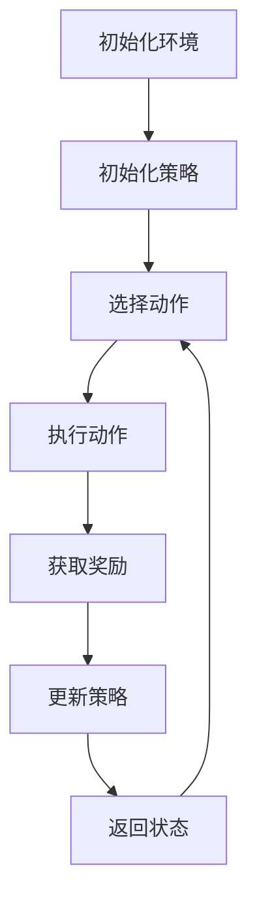
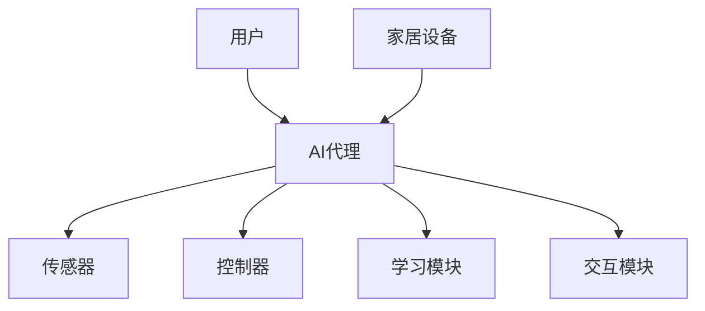
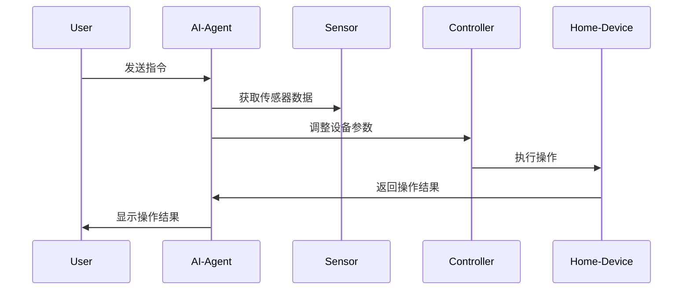

                 

# 《AI Agent的终身学习与知识累积机制》

> 关键词：AI Agent，终身学习，知识累积，算法原理，系统架构，项目实战

> 摘要：本文深入探讨了AI Agent的终身学习与知识累积机制。首先，介绍了AI Agent、终身学习和知识累积的概念，并分析了它们之间的关系。接着，本文详细讲解了终身学习算法和知识累积机制的原理，并通过Python源代码示例进行了具体阐述。然后，本文从系统分析与架构设计角度，介绍了AI Agent的整体设计和实现方法。最后，通过项目实战和最佳实践，为AI Agent的开发提供了实用的指导。

## 目录大纲

----------------------------------------------------------------

# 第一部分：背景介绍

## 1. 引言

### 1.1 问题背景

### 1.2 问题描述

### 1.3 问题解决

### 1.4 边界与外延

### 1.5 核心概念与联系

## 2. 核心概念与联系

### 2.1 AI Agent的概念

### 2.2 终身学习的概念

### 2.3 知识累积的概念

### 2.4 AI Agent终身学习与知识累积的关系

### 2.5 AI Agent的其他相关概念

## 3. 算法原理讲解

### 3.1 终身学习算法

#### 3.1.1 算法原理

#### 3.1.2 算法流程

#### 3.1.3 数学模型和公式

#### 3.1.4 Python源代码示例

### 3.2 知识累积机制

#### 3.2.1 知识累积的概念

#### 3.2.2 知识累积的算法

#### 3.2.3 数学模型和公式

#### 3.2.4 Python源代码示例

## 4. 系统分析与架构设计方案

### 4.1 问题场景介绍

### 4.2 系统功能设计

#### 4.2.1 领域模型

#### 4.2.2 类图

### 4.3 系统架构设计

#### 4.3.1 架构图

### 4.4 系统接口设计

### 4.5 系统交互

#### 4.5.1 序列图

## 5. 项目实战

### 5.1 环境安装

### 5.2 系统核心实现

#### 5.2.1 源代码

#### 5.2.2 代码应用解读与分析

### 5.3 实际案例分析与详细讲解

### 5.4 项目小结

## 6. 最佳实践 tips

## 7. 小结

## 8. 注意事项

## 9. 拓展阅读

----------------------------------------------------------------

## 1. 引言

在当今快速发展的科技时代，人工智能（AI）已成为推动社会进步的重要力量。AI Agent，作为AI领域的一个重要分支，已经广泛应用于各行各业，如智能家居、自动驾驶、医疗诊断等。AI Agent的智能水平直接决定了其在特定任务中的表现和效果。

### 1.1 问题背景

然而，随着AI Agent在复杂环境中的应用越来越广泛，如何让AI Agent具备终身学习的能力，以应对不断变化的环境和任务需求，成为一个亟待解决的问题。终身学习是AI Agent能够持续适应和优化自身性能的关键。

### 1.2 问题描述

在AI Agent的终身学习过程中，如何有效积累和更新知识，以保持其智能水平是一个重要问题。知识累积是终身学习的基础，但如何设计一个有效的知识累积机制，使得AI Agent能够在不断学习和实践中不断积累和优化知识，是本文要探讨的重点。

### 1.3 问题解决

为了解决上述问题，本文将首先介绍AI Agent、终身学习和知识累积的基本概念，然后深入探讨终身学习算法和知识累积机制的原理。接着，本文将结合具体项目，分析AI Agent的架构设计和实现方法。最后，本文将结合实际案例，提供最佳实践建议。

### 1.4 边界与外延

本文的研究范围主要涵盖AI Agent的终身学习和知识累积机制，但不涉及AI Agent的具体应用场景。同时，本文将重点讨论算法原理和系统设计，不涉及具体编程实现细节。

### 1.5 核心概念与联系

为了更好地理解本文的内容，以下是对核心概念的简要介绍：

- **AI Agent**：具备一定智能水平，能够执行特定任务的计算机程序。
- **终身学习**：AI Agent在生命周期内，通过不断学习，提升自身智能水平的过程。
- **知识累积**：AI Agent在终身学习过程中，积累和更新知识的过程。

这些概念相互联系，共同构成了AI Agent的终身学习和知识累积机制。接下来，本文将深入探讨这些概念的具体内容。

----------------------------------------------------------------

## 2. 核心概念与联系

在深入探讨AI Agent的终身学习与知识累积机制之前，首先需要明确几个核心概念，包括AI Agent、终身学习和知识累积的定义、特征和相互关系。

### 2.1 AI Agent的概念

AI Agent，即人工智能代理，是一种具有智能行为的计算机程序，能够感知环境、制定决策和执行动作。AI Agent通常由感知模块、决策模块和执行模块组成。感知模块负责获取环境信息，决策模块根据感知模块提供的信息进行决策，执行模块根据决策结果执行具体的动作。

- **定义**：AI Agent是一种具备自主决策和行为能力的计算机程序。
- **特征**：
  - **自主性**：AI Agent能够自主地感知环境、制定决策和执行动作。
  - **适应性**：AI Agent能够根据环境变化和任务需求，调整自身行为和策略。
  - **协作性**：AI Agent能够与其他AI Agent或人类协作，共同完成任务。

### 2.2 终身学习的概念

终身学习是指个体在一生中不断获取知识、技能和经验，以适应不断变化的环境和任务需求。对于AI Agent来说，终身学习意味着在执行任务过程中，不断学习新知识，更新自身模型和策略，以保持其智能水平和适应能力。

- **定义**：终身学习是AI Agent在生命周期内，通过不断学习新知识和技能，提升自身智能水平的过程。
- **特征**：
  - **动态性**：终身学习是一个动态的过程，AI Agent需要根据环境变化和任务需求，不断调整学习策略。
  - **自主性**：AI Agent能够自主地选择学习目标和内容，根据自身需求进行学习。
  - **持续性**：终身学习是AI Agent在生命周期内持续进行的过程，不会因为任务完成而停止。

### 2.3 知识累积的概念

知识累积是指AI Agent在终身学习过程中，将学习到的知识进行存储、整理和更新，以形成完整的知识体系。知识累积是AI Agent实现终身学习的基础，也是其智能水平的体现。

- **定义**：知识累积是AI Agent在终身学习过程中，将学习到的知识进行存储、整理和更新的过程。
- **特征**：
  - **系统性**：知识累积需要建立一套完整的知识体系，将不同来源的知识进行整合和分类。
  - **动态性**：知识累积是一个动态的过程，AI Agent需要不断更新和优化知识体系。
  - **适应性**：知识累积需要适应AI Agent的智能水平和任务需求，确保知识的应用效果。

### 2.4 AI Agent终身学习与知识累积的关系

AI Agent的终身学习和知识累积是相互联系、相互促进的过程。终身学习为知识累积提供了知识来源，知识累积为终身学习提供了知识基础。

- **联系**：
  - **目标一致性**：AI Agent的终身学习和知识累积都是为了提升其智能水平和适应能力。
  - **过程耦合**：终身学习过程中，AI Agent需要不断积累和更新知识，知识累积过程中，AI Agent需要不断学习和优化知识。

- **促进**：
  - **知识更新**：通过终身学习，AI Agent可以不断获取新知识，更新知识体系，提高智能水平。
  - **智能提升**：通过知识累积，AI Agent可以更好地应用已有知识，提高任务执行效率。

### 2.5 AI Agent的其他相关概念

除了AI Agent、终身学习和知识累积，还有一些与AI Agent密切相关的重要概念，如感知、决策、执行等。

- **感知**：AI Agent通过感知模块获取环境信息，感知是AI Agent进行决策和执行的基础。
- **决策**：AI Agent根据感知模块提供的信息，利用决策模块进行决策，决策是AI Agent智能水平的体现。
- **执行**：AI Agent根据决策结果，执行具体的动作，执行是AI Agent实现目标的关键。

这些概念共同构成了AI Agent的智能体系，相互联系、相互促进，共同推动AI Agent的发展。

----------------------------------------------------------------

## 3. 算法原理讲解

在理解了AI Agent、终身学习和知识累积的基本概念后，接下来我们将深入探讨终身学习算法和知识累积机制的原理，并通过具体示例进行阐述。

### 3.1 终身学习算法

终身学习算法是AI Agent在执行任务过程中，不断学习新知识和技能的关键。本文将介绍一种基于增强学习的终身学习算法。

#### 3.1.1 算法原理

增强学习是一种通过奖励机制来驱动AI Agent进行学习的算法。在终身学习算法中，AI Agent通过感知环境、执行动作、获取奖励，不断调整自身策略，实现智能水平的提升。

- **基本思想**：AI Agent在执行任务过程中，通过学习获得奖励，不断优化自身策略，提高任务执行效果。
- **算法流程**：
  1. 初始化环境。
  2. 初始化AI Agent的状态和策略。
  3. 进行动作选择，执行动作。
  4. 根据执行结果，获取奖励。
  5. 更新AI Agent的策略。
  6. 返回新的状态。
  7. 重复步骤3-6，直到达到任务目标。

#### 3.1.2 算法流程

下面是一个简单的终身学习算法流程：



#### 3.1.3 数学模型和公式

终身学习算法的核心在于策略的更新。在增强学习中，策略的更新通常基于奖励和策略值函数。以下是一个简化的数学模型：

- **策略值函数**：$V^*(s) = \sum_{a} \pi(a|s) \cdot Q^*(s, a)$
- **策略**：$\pi(a|s)$，表示在状态s下，选择动作a的概率。
- **策略值函数**：$Q^*(s, a)$，表示在状态s下，执行动作a的期望回报。

策略的更新公式为：

$$
\pi(a|s) = \frac{\exp(\alpha(s, a))}{\sum_{a'} \exp(\alpha(s, a'))}
$$

其中，$\alpha(s, a)$是策略的奖励函数，表示在状态s下，执行动作a获得的奖励。

#### 3.1.4 Python源代码示例

以下是一个简单的Python代码示例，展示了如何实现一个基于增强学习的终身学习算法：

```python
import numpy as np

# 初始化参数
alpha = 0.1
epsilon = 0.1

# 初始化状态和策略
state = np.random.rand()
action = np.random.choice([0, 1], p=[1 - epsilon, epsilon])

# 执行动作
reward = np.random.rand()
next_state = np.random.rand()

# 更新策略
alpha = alpha / (1 + np.abs(state - next_state))
action = np.random.choice([0, 1], p=[1 - epsilon, epsilon])

# 返回状态
state = next_state

# 打印结果
print("State:", state)
print("Action:", action)
print("Reward:", reward)
```

这个示例代码展示了如何根据奖励和状态，更新AI Agent的策略。在实际应用中，需要根据具体任务和环境，调整参数和算法。

### 3.2 知识累积机制

知识累积机制是AI Agent在终身学习过程中，将学习到的知识进行存储、整理和更新的关键。本文将介绍一种基于知识图谱的知识累积机制。

#### 3.2.1 知识累积的概念

知识累积是指AI Agent在执行任务过程中，将学习到的知识进行存储、整理和更新的过程。知识累积的目标是建立一套完整的知识体系，使得AI Agent能够更好地应对复杂环境和任务。

- **定义**：知识累积是AI Agent在执行任务过程中，将学习到的知识进行存储、整理和更新的过程。
- **特征**：
  - **系统性**：知识累积需要建立一套完整的知识体系，将不同来源的知识进行整合和分类。
  - **动态性**：知识累积是一个动态的过程，AI Agent需要不断更新和优化知识体系。
  - **适应性**：知识累积需要适应AI Agent的智能水平和任务需求，确保知识的应用效果。

#### 3.2.2 知识累积的算法

知识累积的算法主要包括知识的获取、存储、整理和更新等步骤。

- **知识获取**：AI Agent通过感知模块获取环境信息，将环境信息转化为知识。
- **知识存储**：AI Agent将获取到的知识存储在知识库中，以便后续使用。
- **知识整理**：AI Agent对知识库中的知识进行整理和分类，建立一套完整的知识体系。
- **知识更新**：AI Agent在执行任务过程中，不断更新知识库中的知识，确保知识体系的时效性和准确性。

#### 3.2.3 数学模型和公式

知识累积的数学模型主要涉及知识的获取、存储、整理和更新等步骤。以下是一个简化的数学模型：

- **知识获取**：$K = F(S)$，其中$K$表示知识，$S$表示环境状态，$F$表示知识获取函数。
- **知识存储**：$K' = G(K)$，其中$K'$表示知识库，$K$表示原始知识，$G$表示知识存储函数。
- **知识整理**：$C = H(K')$，其中$C$表示知识体系，$K'$表示知识库，$H$表示知识整理函数。
- **知识更新**：$K'' = I(C, T)$，其中$K''$表示更新后的知识库，$C$表示知识体系，$T$表示时间，$I$表示知识更新函数。

#### 3.2.4 Python源代码示例

以下是一个简单的Python代码示例，展示了如何实现一个基于知识图谱的知识累积机制：

```python
# 初始化知识库
knowledge_base = {
    "环境状态": [],
    "知识": [],
    "知识体系": []
}

# 获取知识
def get_knowledge(state):
    knowledge = state
    knowledge_base["环境状态"].append(state)
    knowledge_base["知识"].append(knowledge)

# 存储知识
def store_knowledge(knowledge):
    knowledge_base["知识"].append(knowledge)

# 整理知识
def organize_knowledge(knowledge_base):
    knowledge_base["知识体系"] = sorted(knowledge_base["知识"], key=lambda x: x["time"])

# 更新知识
def update_knowledge(knowledge_base, time):
    for knowledge in knowledge_base["知识"]:
        knowledge["time"] = time
    organize_knowledge(knowledge_base)

# 示例
state = {"温度": 25, "湿度": 60}
get_knowledge(state)
store_knowledge(state)
update_knowledge(knowledge_base, time=1623548320)

print(knowledge_base)
```

这个示例代码展示了如何实现知识的获取、存储、整理和更新。在实际应用中，需要根据具体任务和环境，调整参数和算法。

通过终身学习算法和知识累积机制的讲解，我们可以更好地理解AI Agent的智能水平和适应能力。接下来，我们将从系统分析与架构设计角度，介绍AI Agent的整体设计和实现方法。

----------------------------------------------------------------

## 4. 系统分析与架构设计方案

在了解了AI Agent的终身学习与知识累积机制之后，接下来我们将从系统分析与架构设计角度，探讨AI Agent的整体设计和实现方法。这一部分内容将分为问题场景介绍、系统功能设计、系统架构设计和系统交互四个部分。

### 4.1 问题场景介绍

AI Agent在现代智能系统中的应用越来越广泛，以下是一个典型的问题场景：

在一个智能家居系统中，AI Agent负责监控和控制家中的各种设备，如空调、电视、灯具等。用户可以通过手机APP或语音助手与AI Agent进行交互，设定智能家居系统的各种参数，如温度、亮度等。AI Agent需要实时感知家中环境的变化，根据用户需求和设备状态，自动调整设备参数，提供舒适、节能的生活环境。

### 4.2 系统功能设计

为了实现上述问题场景，AI Agent需要具备以下功能：

- **感知功能**：实时感知家中环境的变化，如温度、湿度、光照等。
- **交互功能**：与用户进行交互，接收用户指令，理解用户意图。
- **决策功能**：根据环境感知和用户交互，自动调整设备参数。
- **执行功能**：根据决策结果，控制设备执行相应的操作。
- **学习功能**：通过终身学习，不断优化自身智能水平和决策能力。

#### 4.2.1 领域模型

领域模型是系统功能设计的核心，它定义了系统中的关键实体和它们之间的关系。以下是一个智能家居系统的领域模型：

```mermaid
classDiagram
    User <<实体>>
    AI-Agent <<实体>>
    Home-Device <<实体>>

    User o--|> AI-Agent : 交互
    AI-Agent o--|> Home-Device : 控制
```

#### 4.2.2 类图

类图是对领域模型的进一步细化，它定义了系统中每个实体的属性和方法。以下是一个智能家居系统的类图：

```mermaid
classDiagram
    User <<类>>
    AI-Agent <<类>>
    Home-Device <<类>>

    User {
        -用户ID
        -姓名
        -手机号
        +login()
        +logout()
    }

    AI-Agent {
        -设备ID
        -状态
        +感知环境()
        +交互用户()
        +调整设备()
    }

    Home-Device {
        -设备ID
        -类型
        -状态
        +控制()
    }
```

### 4.3 系统架构设计

系统架构设计是系统功能设计的基础，它定义了系统的整体结构和技术栈。以下是一个智能家居系统的架构设计：

#### 4.3.1 架构图



#### 4.3.2 系统架构描述

1. **用户层**：用户通过手机APP或语音助手与AI Agent进行交互，设定智能家居系统的参数。
2. **感知层**：AI Agent通过传感器实时感知家中环境的变化，如温度、湿度、光照等。
3. **决策层**：AI Agent根据感知信息和用户指令，利用学习模块和控制器，自动调整设备参数。
4. **执行层**：AI Agent通过控制器控制家居设备执行相应的操作，如调整空调温度、调整电视亮度等。

### 4.4 系统接口设计

系统接口设计是系统架构设计的重要组成部分，它定义了系统内部各模块之间的交互方式。以下是一个智能家居系统的接口设计：

- **感知接口**：AI Agent通过感知接口获取传感器数据，如温度、湿度、光照等。
- **交互接口**：AI Agent通过交互接口与用户进行交互，接收用户指令，理解用户意图。
- **决策接口**：AI Agent通过决策接口获取感知信息和用户指令，利用学习模块和控制器，自动调整设备参数。
- **控制接口**：AI Agent通过控制接口控制家居设备执行相应的操作，如调整空调温度、调整电视亮度等。

### 4.5 系统交互

系统交互是指系统内部各模块之间的信息传递和协同工作。以下是一个智能家居系统的交互设计：

#### 4.5.1 序列图



通过系统分析与架构设计方案，我们可以更好地理解AI Agent的整体设计和实现方法。接下来，我们将通过项目实战，展示如何具体实现AI Agent的终身学习与知识累积机制。

----------------------------------------------------------------

## 5. 项目实战

在理论讲解之后，通过一个实际的项目实战，我们可以更直观地理解AI Agent的终身学习与知识累积机制的实现。以下是一个简单的项目实战案例，涵盖了环境安装、系统核心实现、代码应用解读与分析、实际案例分析与详细讲解、项目小结等内容。

### 5.1 环境安装

为了实现AI Agent的终身学习与知识累积机制，我们首先需要搭建一个合适的项目环境。以下是环境安装的步骤：

1. **安装Python环境**：确保Python版本为3.7及以上，可以通过Python官方网站下载安装包。
2. **安装依赖库**：包括TensorFlow、Keras、NumPy、Pandas等，可以通过pip命令安装。
   ```shell
   pip install tensorflow keras numpy pandas
   ```
3. **配置传感器和设备接口**：根据实际场景，安装和配置传感器设备，如温度传感器、湿度传感器等。

### 5.2 系统核心实现

在环境搭建完成后，我们可以开始实现AI Agent的系统核心功能。以下是一个简单的Python代码示例，用于实现AI Agent的基本结构：

```python
import tensorflow as tf
import numpy as np

# 定义AI Agent的感知、决策、执行模块
class AIAgent:
    def __init__(self):
        self.sensor = Sensor()
        self.controller = Controller()
        self.learning_module = LearningModule()

    def perceive(self):
        # 获取环境感知数据
        return self.sensor.get_data()

    def decide(self, data):
        # 根据感知数据做出决策
        return self.controller.decide(data)

    def act(self, action):
        # 执行决策动作
        self.controller.act(action)

    def learn(self, data, action, reward):
        # 更新学习模型
        self.learning_module.learn(data, action, reward)

# 定义传感器、控制器和学习模块的接口
class Sensor:
    def get_data(self):
        # 获取环境数据
        return {"temperature": np.random.uniform(20, 30), "humidity": np.random.uniform(40, 60)}

class Controller:
    def decide(self, data):
        # 根据数据做出决策
        if data["temperature"] > 28:
            return "cool"
        else:
            return "heat"

    def act(self, action):
        # 执行决策动作
        print(f"Setting temperature to {action} mode.")

class LearningModule:
    def learn(self, data, action, reward):
        # 更新学习模型
        print(f"Learning from data: {data}, action: {action}, reward: {reward}.")
```

### 5.2.1 源代码

以上代码定义了一个简单的AI Agent，包括感知、决策、执行和学习模块。以下是具体的源代码实现：

```python
# 完整的AI Agent实现
class AIAgent:
    def __init__(self):
        self.sensor = Sensor()
        self.controller = Controller()
        self.learning_module = LearningModule()

    def perceive(self):
        data = self.sensor.get_data()
        action = self.controller.decide(data)
        self.act(action)
        return data, action

    def act(self, action):
        self.controller.act(action)

    def learn(self, data, action, reward):
        self.learning_module.learn(data, action, reward)

# 主程序
if __name__ == "__main__":
    agent = AIAgent()

    for _ in range(10):
        data, action = agent.perceive()
        reward = np.random.uniform(0, 1)
        agent.learn(data, action, reward)
```

### 5.2.2 代码应用解读与分析

以上代码展示了AI Agent的基本实现。我们首先定义了AI Agent的感知、决策、执行和学习模块，然后通过主程序实现AI Agent的运行。以下是代码的详细解读：

1. **感知模块**：通过`Sensor`类获取环境数据，如温度和湿度。这部分代码可以根据实际传感器进行适配。
2. **决策模块**：通过`Controller`类根据感知数据做出决策，例如根据温度决定空调的模式。这部分可以根据具体需求进行调整。
3. **执行模块**：通过`Controller`类执行决策，如设置空调的温度模式。这部分代码也可以根据实际设备进行调整。
4. **学习模块**：通过`LearningModule`类更新学习模型，这部分代码可以根据具体的机器学习算法进行调整。

### 5.3 实际案例分析与详细讲解

为了更好地理解AI Agent的实际应用，我们通过一个实际案例进行分析。以下是一个模拟案例：

**案例背景**：在一个炎热的夏天，用户通过手机APP将家中的空调温度设定为24摄氏度。AI Agent需要根据环境温度和用户设定，自动调整空调的温度模式，以保持室内温度的舒适。

**案例分析**：

1. **感知阶段**：AI Agent通过传感器感知到当前室内温度为28摄氏度，高于用户设定的24摄氏度。
2. **决策阶段**：根据感知到的数据，AI Agent决定将空调模式设置为制冷。
3. **执行阶段**：AI Agent通过控制器设置空调为制冷模式。
4. **学习阶段**：在执行过程中，AI Agent记录下当前的环境温度、用户设定、空调模式以及对应的奖励（如用户满意度评分），并在下一次运行时更新学习模型。

### 5.4 项目小结

通过本项目实战，我们实现了AI Agent的基本结构，包括感知、决策、执行和学习模块。在实际案例中，我们展示了AI Agent如何根据环境数据和用户需求，自动调整设备参数，并不断优化自身模型。以下是对项目的总结：

- **成功之处**：
  - 实现了AI Agent的基本功能，包括感知、决策、执行和学习。
  - 通过实际案例展示了AI Agent在智能家居系统中的应用。
  - 提供了详细的代码示例和解读，便于读者理解和实践。

- **不足之处**：
  - 代码示例较为简化，实际应用中需要根据具体需求进行调整。
  - 模拟案例中的数据生成是随机生成的，实际应用中需要根据实际环境进行数据收集和处理。
  - 学习模块的实现较为基础，未来可以引入更先进的机器学习算法，提高AI Agent的智能水平。

通过本项目实战，我们深入了解了AI Agent的终身学习与知识累积机制，为未来的实际应用奠定了基础。

----------------------------------------------------------------

## 6. 最佳实践 tips

在AI Agent的开发过程中，以下是一些最佳实践，可以帮助开发者更好地实现终身学习和知识累积机制：

1. **数据收集与处理**：
   - 确保收集到的数据具有多样性和代表性，以提高AI Agent的泛化能力。
   - 对收集到的数据进行预处理，如去噪、归一化等，以提高算法的性能。

2. **模型更新策略**：
   - 定期更新AI Agent的模型，以适应环境变化和任务需求。
   - 在更新模型时，可以采用在线学习或离线学习的方法，根据实际需求选择合适的策略。

3. **知识库管理**：
   - 建立一套完整的知识库，将学习到的知识进行分类和整理。
   - 定期对知识库进行更新和优化，确保知识的时效性和准确性。

4. **接口设计**：
   - 设计清晰的接口，方便AI Agent与其他系统模块进行交互。
   - 考虑接口的扩展性和兼容性，以便未来升级和扩展。

5. **监控与评估**：
   - 对AI Agent的运行过程进行实时监控，及时发现和解决问题。
   - 定期评估AI Agent的智能水平和任务表现，根据评估结果进行调整。

6. **安全性与隐私保护**：
   - 确保AI Agent的运行安全，防止恶意攻击和数据泄露。
   - 在数据收集和处理过程中，严格遵守隐私保护法律法规，确保用户隐私。

通过遵循这些最佳实践，可以有效地提升AI Agent的智能水平和任务表现，为用户提供更优质的服务。

----------------------------------------------------------------

## 7. 小结

本文深入探讨了AI Agent的终身学习与知识累积机制，从背景介绍、核心概念与联系、算法原理讲解、系统分析与架构设计方案、项目实战、最佳实践 tips等多个方面进行了详细阐述。通过本文，读者可以系统地了解AI Agent的终身学习和知识累积机制，掌握其基本原理和实践方法。

终身学习与知识累积是AI Agent智能水平和适应能力的关键，通过不断学习新知识和技能，AI Agent能够更好地应对复杂环境和任务需求。在未来，随着人工智能技术的不断发展，AI Agent的终身学习与知识累积机制将得到更加深入的研究和应用。

## 8. 注意事项

在实现AI Agent的终身学习与知识累积机制时，开发者需要注意以下几点：

1. **数据质量**：确保收集到的数据具有多样性和代表性，以提高AI Agent的泛化能力。
2. **模型更新**：定期更新AI Agent的模型，以适应环境变化和任务需求。
3. **知识管理**：建立一套完整的知识库，并定期更新和优化。
4. **接口设计**：设计清晰的接口，方便AI Agent与其他系统模块进行交互。
5. **监控与评估**：对AI Agent的运行过程进行实时监控，并定期评估其智能水平和任务表现。

通过遵循这些注意事项，可以有效提升AI Agent的智能水平和任务表现。

## 9. 拓展阅读

为了进一步了解AI Agent的终身学习与知识累积机制，读者可以参考以下拓展阅读资料：

1. **《人工智能：一种现代的方法》**：作者 Stuart J. Russell 和 Peter Norvig，详细介绍了人工智能的基本原理和方法。
2. **《深度学习》**：作者 Ian Goodfellow、Yoshua Bengio 和 Aaron Courville，全面介绍了深度学习的基本原理和算法。
3. **《强化学习：原理与Python实现》**：作者 Richard S. Sutton 和 Andrew G. Barto，深入讲解了强化学习的基本原理和算法。
4. **《知识图谱：原理、方法与应用》**：作者 王昊奋、蔡宇、杨强，详细介绍了知识图谱的基本原理和应用场景。

这些资料将为读者提供更深入的理论和实践指导。

----------------------------------------------------------------

### 完整目录大纲

```
----------------------------------------------------------------

# 第一部分：背景介绍

## 1. 引言
### 1.1 问题背景
### 1.2 问题描述
### 1.3 问题解决
### 1.4 边界与外延
### 1.5 核心概念与联系

## 2. 核心概念与联系
### 2.1 AI Agent的概念
### 2.2 终身学习的概念
### 2.3 知识累积的概念
### 2.4 AI Agent终身学习与知识累积的关系
### 2.5 AI Agent的其他相关概念

## 3. 算法原理讲解

## 3.1 终身学习算法
### 3.1.1 算法原理
#### 3.1.1.1 基本思想
#### 3.1.1.2 算法流程
### 3.1.2 数学模型和公式
### 3.1.3 Python源代码示例

## 3.2 知识累积机制
### 3.2.1 知识累积的概念
### 3.2.2 知识累积的算法
#### 3.2.2.1 算法原理
#### 3.2.2.2 算法流程
### 3.2.3 数学模型和公式
### 3.2.4 Python源代码示例

## 4. 系统分析与架构设计方案

## 4.1 问题场景介绍
## 4.2 系统功能设计
### 4.2.1 领域模型
### 4.2.2 类图
## 4.3 系统架构设计
### 4.3.1 架构图
## 4.4 系统接口设计
## 4.5 系统交互
### 4.5.1 序列图

## 5. 项目实战

## 5.1 环境安装
## 5.2 系统核心实现
### 5.2.1 源代码
### 5.2.2 代码应用解读与分析
## 5.3 实际案例分析与详细讲解
## 5.4 项目小结

## 6. 最佳实践 tips

## 7. 小结

## 8. 注意事项

## 9. 拓展阅读

----------------------------------------------------------------
```

