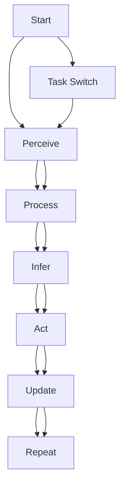

                 


# AI Agent's Lifelong Learning: Continuous Update and Expansion of Knowledge Base

## Keywords

- AI Agent
- Lifelong Learning
- Knowledge Base
- Continuous Update
- Expansion Techniques

## Abstract

In this article, we delve into the concept of lifelong learning for AI agents, emphasizing the importance of continuous update and expansion of their knowledge bases. We explore the fundamentals of AI agents, the principles of lifelong learning, and the methods for knowledge representation and organization. Furthermore, we discuss continuous learning techniques, knowledge base expansion strategies, evaluation and maintenance methods, real-world applications, and future directions. Through this comprehensive analysis, we aim to provide insights into designing AI agents that can learn and adapt throughout their lifecycle, ensuring their effectiveness and relevance in an ever-evolving world.

## Introduction

### 1.1 Background and Significance

Artificial Intelligence (AI) has evolved significantly over the past few decades, transforming various industries and revolutionizing the way we live and work. AI agents, which are designed to perform tasks and make decisions autonomously, have become an integral part of this transformation. These agents, ranging from simple chatbots to complex autonomous systems, rely on their knowledge base to accomplish their tasks efficiently.

However, the world is constantly changing, and the knowledge required for AI agents to perform optimally is not static. New technologies emerge, existing systems evolve, and new challenges arise. This necessitates a continuous update and expansion of the knowledge base of AI agents. Lifelong learning, which refers to the ability of AI agents to continuously acquire, update, and apply knowledge throughout their lifecycle, has become a critical area of research and development.

The significance of AI agent's lifelong learning cannot be overstated. As AI systems become more ubiquitous, their ability to adapt to changing environments and learn from new experiences becomes increasingly important. Lifelong learning enables AI agents to maintain their performance and relevance over time, making them more effective and reliable in a dynamic world.

### 1.2 Objectives and Organization

The primary objective of this article is to provide a comprehensive overview of AI agent's lifelong learning, focusing on the continuous update and expansion of their knowledge bases. We aim to cover the following topics:

1. Fundamentals of AI agents and lifelong learning
2. Knowledge representation and organization
3. Continuous learning methods
4. Knowledge base expansion strategies
5. Evaluation and maintenance of AI agents
6. Real-world applications
7. Future directions

This article is organized into eight main sections:

1. **Introduction**: Overview of the article and its objectives.
2. **Fundamentals of AI Agents and Lifelong Learning**: Introduction to AI agents and the concept of lifelong learning.
3. **Knowledge Representation and Organization**: Overview of knowledge representation and the organization of knowledge bases for lifelong learning.
4. **Continuous Learning Methods**: Discussion of continuous learning methods, including active learning, incremental learning, and transfer learning.
5. **Knowledge Base Expansion**: Strategies for expanding knowledge bases, including the incorporation of external data sources.
6. **Evaluation and Maintenance**: Methods for evaluating and maintaining the performance of AI agents.
7. **Real-World Applications**: Case studies of AI agents with lifelong learning capabilities and their applications in various industries.
8. **Future Directions**: Trends and potential advancements in AI agent's lifelong learning.

Through this structured approach, we aim to provide a thorough understanding of the challenges and opportunities associated with AI agent's lifelong learning, paving the way for the development of more effective and adaptable AI systems.

## Fundamentals of AI Agents and Lifelong Learning

### 2.1 Introduction to AI Agents

Artificial Intelligence (AI) agents are computational entities designed to interact with their environment and perform tasks autonomously. These agents are equipped with the ability to perceive their surroundings through sensors, process this information using algorithms, and take appropriate actions to achieve specific goals. The concept of AI agents can be traced back to the early days of AI research, where the focus was on creating intelligent systems that could mimic human behavior.

AI agents can be classified into several categories based on their capabilities and the nature of their interactions with the environment. The following are some common types of AI agents:

1. **Reactively-Based Agents**: These agents make decisions based solely on the current state of the environment, without any memory of past events. They are simple and efficient but lack the ability to learn from past experiences or adapt to changing conditions.

2. **Model-Based Agents**: These agents use a model of the environment to make decisions. They can store information about past events and use this knowledge to predict future states and make better decisions. Model-based agents are more capable than reactively-based agents but require more computational resources to maintain and update their models.

3. **Learning-Based Agents**: These agents use machine learning algorithms to learn from past experiences and improve their decision-making capabilities over time. Learning-based agents can adapt to changing environments and learn new tasks without explicit programming. They are the most advanced type of AI agents and have the potential to achieve human-like intelligence.

4. **Mixed-Type Agents**: These agents combine the characteristics of reactively-based, model-based, and learning-based agents. They use a combination of techniques to make decisions, depending on the specific requirements of the task.

AI agents play a crucial role in modern systems and applications. Some of the key applications include:

1. **Automated Decision-Making**: AI agents are used in various industries to automate decision-making processes, reducing human error and increasing efficiency. For example, in financial services, AI agents are used to detect fraudulent transactions and make investment recommendations.

2. **Automated Task Execution**: AI agents are used to automate repetitive tasks, freeing up human resources for more complex and creative work. In manufacturing, AI agents are used to monitor and control production processes, ensuring high-quality output and minimizing downtime.

3. **Natural Language Processing**: AI agents are used in chatbots and virtual assistants to understand and respond to natural language queries, providing users with personalized assistance and support.

4. **Autonomous Systems**: AI agents are used in autonomous vehicles, drones, and robots to navigate and interact with their environment, enabling them to perform complex tasks autonomously.

The role of AI agents in modern systems is constantly evolving, driven by advancements in AI technologies and the increasing demand for intelligent, autonomous systems. As we move towards a more connected and automated world, the importance of AI agents will only continue to grow.

### 2.2 Lifelong Learning Principles

Lifelong learning is a fundamental concept in AI agent research, focusing on the ability of AI agents to continuously acquire, update, and apply knowledge throughout their lifecycle. Unlike traditional machine learning approaches, which are typically focused on a single task or a fixed set of tasks, lifelong learning aims to enable AI agents to learn and adapt to new tasks and environments as they arise. This is particularly important in dynamic and uncertain environments, where the knowledge required to perform optimally can change over time.

#### 2.2.1 Definition and Importance

Lifelong learning in AI can be defined as the ability of an AI agent to perform well on a sequence of tasks, while continuously learning from new experiences and updating its knowledge base. This concept draws inspiration from human learning, where individuals acquire new knowledge and skills throughout their lives, adapting to new situations and challenges. In the context of AI agents, lifelong learning enables them to maintain their performance and relevance over time, despite the changing nature of the tasks and environments they operate in.

The importance of lifelong learning in AI agents cannot be overstated. As the world becomes increasingly complex and dynamic, the ability of AI agents to adapt to new situations and learn from new experiences becomes increasingly important. Lifelong learning enables AI agents to:

1. **Maintain Performance**: By continuously updating their knowledge base, AI agents can adapt to changes in their environment and maintain their performance over time. This ensures that they remain effective and reliable, even as the world around them evolves.

2. **Learn New Tasks**: Lifelong learning enables AI agents to learn new tasks and skills without the need for extensive reprogramming or retraining. This flexibility makes them more versatile and adaptable, allowing them to perform a wide range of tasks in different environments.

3. **Handle Ambiguity**: In dynamic environments, the knowledge required to perform optimally can be ambiguous or uncertain. Lifelong learning enables AI agents to handle this ambiguity by continuously updating their knowledge base and learning from new experiences.

4. **Enhance Generalization**: By learning from a diverse set of tasks and environments, lifelong learning enhances the generalization capabilities of AI agents. This means that they can perform well on new tasks and environments that they have not seen before, making them more robust and adaptable.

#### 2.2.2 Challenges and Opportunities

While the concept of lifelong learning in AI agents offers many benefits, it also presents several challenges and opportunities. Some of the key challenges include:

1. **Task Switching**: Switching between different tasks can be challenging for AI agents, as they need to adapt to the new task quickly and effectively. This requires efficient algorithms and strategies for task switching and knowledge transfer.

2. **Knowledge Distillation**: When learning new tasks, AI agents need to distill and transfer the relevant knowledge from their existing knowledge base. This can be challenging, as the knowledge in the existing base may be noisy or outdated.

3. **Resource Constraints**: Lifelong learning requires continuous learning and updating, which can be resource-intensive. This poses challenges in terms of computational resources, memory usage, and energy consumption.

4. **Data Quality**: The quality of the data used for learning is crucial for the effectiveness of lifelong learning. Inaccurate or biased data can lead to suboptimal performance and decision-making.

Despite these challenges, there are also significant opportunities for research and development in the field of lifelong learning for AI agents. Some of the key opportunities include:

1. **New Algorithms**: The development of new algorithms and techniques that enable efficient lifelong learning, such as meta-learning, transfer learning, and online learning.

2. **Data Integration**: The integration of diverse data sources and formats to build comprehensive and up-to-date knowledge bases for AI agents.

3. **Application Domains**: The exploration of new application domains where lifelong learning can have a significant impact, such as healthcare, finance, and autonomous systems.

4. **Ethical and Social Implications**: The study of the ethical and social implications of lifelong learning in AI agents, including issues related to privacy, transparency, and fairness.

In conclusion, lifelong learning is a critical concept in AI agent research, offering numerous benefits and challenges. By addressing these challenges and leveraging the opportunities, we can develop more effective and adaptable AI agents that can learn and improve over time, enabling them to perform optimally in dynamic and complex environments.

### 2.3 Core Concepts and Principles

To understand the intricacies of AI agent's lifelong learning, it is essential to delve into the core concepts and principles that underpin this field. In this section, we will explore the fundamental concepts, provide a comparison of different approaches, and illustrate their importance through the use of an ER (Entity-Relationship) diagram and a Mermaid flowchart.

#### 2.3.1 Fundamental Concepts

At the heart of AI agent's lifelong learning lies several core concepts, including:

1. **Knowledge Base**: A knowledge base is a structured collection of information that an AI agent uses to make decisions and perform tasks. It typically includes facts, rules, and relationships that describe the agent's environment and the tasks it needs to accomplish.

2. **Learning**: Learning refers to the process by which an AI agent acquires new knowledge and skills. In the context of lifelong learning, this process is continuous, adapting to new tasks and environments as they arise.

3. **Memory**: Memory is crucial for lifelong learning, as it allows an AI agent to retain and recall past experiences and knowledge. Different types of memory, such as short-term and long-term memory, play a significant role in this process.

4. **Inference**: Inference is the process by which an AI agent uses its knowledge base and existing knowledge to make predictions, draw conclusions, and make decisions. In the context of lifelong learning, inference is dynamic, adapting to new information and changing circumstances.

5. **Generalization**: Generalization is the ability of an AI agent to apply what it has learned in one context to new and unseen contexts. This is a key aspect of lifelong learning, enabling agents to adapt to a wide range of situations.

#### 2.3.2 Comparison of Approaches

There are several approaches to AI agent's lifelong learning, each with its own strengths and limitations. The following table provides a comparison of three common approaches:

| Approach          | Key Characteristics | Strengths | Limitations |
|-------------------|---------------------|-----------|-------------|
| Incremental Learning | learns continuously from new data | efficient, low computational cost | limited generalization, difficult task switching |
| Transfer Learning  | transfers knowledge from one task to another | efficient, high generalization | potential loss of domain-specific knowledge |
| Meta-Learning     | learns how to learn | high generalization, efficient adaptation | high computational cost |

**Incremental Learning** focuses on continuously updating the knowledge base with new data, without the need to retrain from scratch. This approach is efficient and computationally cost-effective but can struggle with generalization and task switching.

**Transfer Learning** leverages knowledge from one task to improve performance on another related task. This approach is efficient and allows for high generalization but can result in the loss of domain-specific knowledge.

**Meta-Learning** aims to learn how to learn, developing algorithms that can adapt quickly to new tasks with minimal data. This approach offers high generalization and efficient adaptation but can be computationally expensive.

#### 2.3.3 Importance Through ER Diagram and Mermaid Flowchart

The importance of these core concepts and approaches can be visualized through an ER diagram and a Mermaid flowchart.

**ER Diagram**:
```mermaid
erDiagram
  Task ||--|{ KnowledgeBase }|>
  Task ||--|{ Memory }|>
  Task ||--|{ InferenceEngine }|>

  Task ||--|{ Generalization }|>

  KnowledgeBase ||--|{ Fact }|>
  KnowledgeBase ||--|{ Rule }|>

  Memory ||--|{ Short-Term }|>
  Memory ||--|{ Long-Term }|>

  InferenceEngine ||--|{ Prediction }|>
  InferenceEngine ||--|{ Decision-Making }|>

class Task {
  +name : string
  +goal : string
  +context : string
}

class KnowledgeBase {
  +facts : [Fact]
  +rules : [Rule]
}

class Memory {
  +shortTerm : [Fact]
  +longTerm : [Fact]
}

class InferenceEngine {
  +predict : Fact => Prediction
  +decide : Context => Decision
}

class Fact {
  +description : string
}

class Rule {
  +condition : string
  +action : string
}

class Prediction {
  +output : string
}

class Decision {
  +choice : string
}
```

This ER diagram illustrates the relationships between the core concepts and components of AI agent's lifelong learning. Tasks interact with the KnowledgeBase, Memory, and InferenceEngine, while the Generalization component facilitates the application of learned knowledge to new contexts.

**Mermaid Flowchart**:


This Mermaid flowchart provides a high-level overview of the lifelong learning process for an AI agent. The agent perceives its environment, processes the information, makes inferences, takes actions, and updates its knowledge base. The process repeats, allowing the agent to learn and adapt over time. Task switching is also included to demonstrate the agent's ability to handle different tasks and environments.

In conclusion, the core concepts and principles of AI agent's lifelong learning are essential for understanding how AI agents can continuously acquire, update, and apply knowledge in dynamic and complex environments. By leveraging these concepts and approaches, we can develop more effective and adaptable AI systems that can learn and improve over time.
----------------------------------------------------------------

## Knowledge Representation and Organization

Knowledge representation is a foundational component of AI agent's lifelong learning, as it provides the framework for organizing, storing, and utilizing information. Effective knowledge representation ensures that AI agents can efficiently process and utilize the knowledge in their knowledge base to make informed decisions and perform tasks optimally.

### 3.1 Overview of Knowledge Representation

Knowledge representation in AI involves converting the knowledge and information about a domain into a structured format that can be easily processed by an AI agent. This structured representation allows AI agents to reason about the information, draw conclusions, and make decisions based on it.

There are several techniques and methods for knowledge representation, including:

1. **Symbolic Representation**: This method involves representing knowledge using symbols, such as propositions, rules, and facts. Symbolic representation is often used in rule-based systems and expert systems, where knowledge is organized into a set of rules that can be used to infer new information.

2. **Semantic Networks**: Semantic networks use nodes and edges to represent concepts, relationships, and attributes in a knowledge base. This method is particularly useful for representing complex relationships and hierarchies of concepts.

3. **Ontologies**: Ontologies are formal representations of a domain that define the concepts, relationships, and properties within that domain. They provide a structured and standardized way to represent knowledge, making it easier to reason about and share information across different systems and applications.

4. **Ontology-Based Knowledge Representation**: This approach combines the principles of ontologies with other knowledge representation techniques, such as semantic networks and rule-based systems. It provides a flexible and scalable framework for representing and managing knowledge in large and complex domains.

### 3.2 Organizing Knowledge Bases for Lifelong Learning

Organizing a knowledge base for lifelong learning is essential for ensuring that AI agents can efficiently update, expand, and utilize their knowledge. The following strategies can be used to organize knowledge bases effectively:

1. **Modularization**: Modularization involves dividing the knowledge base into smaller, manageable modules. Each module represents a specific aspect of the domain or a specific task. This makes it easier to update and maintain the knowledge base, as changes can be made to individual modules without affecting the entire system.

2. **Hierarchy**: Hierarchical organization of knowledge bases can help to represent relationships between concepts and facilitate reasoning and inference. A well-defined hierarchy can make it easier for AI agents to navigate the knowledge base and retrieve relevant information.

3. **Version Control**: Version control is an essential strategy for managing changes to the knowledge base over time. By maintaining different versions of the knowledge base, it is possible to track changes and ensure that the most up-to-date information is used.

4. **Ontology Integration**: Integrating ontologies into the knowledge base can provide a standardized and structured representation of the domain. This makes it easier to reason about the knowledge and ensures consistency across different parts of the knowledge base.

### 3.3 Challenges and Solutions

Organizing knowledge bases for lifelong learning presents several challenges, including:

1. **Knowledge Acquisition**: Acquiring high-quality, relevant knowledge can be difficult, especially in complex and dynamic domains. To address this, it is important to use a combination of manual curation and automatic knowledge acquisition techniques, such as web scraping and natural language processing.

2. **Knowledge Maintenance**: Keeping the knowledge base up-to-date can be challenging, as new information and changes in the domain constantly emerge. Using version control and automated techniques for knowledge update can help to address this issue.

3. **Scalability**: As the knowledge base grows, it can become increasingly difficult to manage and maintain. Using modularization and hierarchical organization can help to scale the knowledge base effectively.

4. **Consistency**: Ensuring consistency in the knowledge base is critical for accurate reasoning and decision-making. Integrating ontologies and using standardized representation techniques can help to maintain consistency across the knowledge base.

In conclusion, knowledge representation and organization are essential for enabling AI agents to continuously learn and adapt over time. By employing effective strategies for knowledge representation and organization, we can develop more powerful and adaptable AI systems that can effectively manage and utilize their knowledge base in dynamic and complex environments.

### 3.4 Examples of Knowledge Representation Techniques

To illustrate the importance and effectiveness of knowledge representation techniques, we will explore two common methods: Rule-Based Systems and Semantic Networks. Each of these techniques has its own strengths and applications, and can significantly enhance the capabilities of AI agents in various domains.

#### 3.4.1 Rule-Based Systems

Rule-based systems are one of the most traditional methods of knowledge representation in AI. They consist of a set of rules that define the relationships between conditions and actions. These rules are typically represented in the form of "if-then" statements, where a condition is checked, and if true, an action is performed.

**Example: Medical Diagnosis System**

Consider a medical diagnosis system designed to diagnose patients with a particular disease based on their symptoms. The knowledge base for this system could consist of a set of rules that map symptoms to possible diagnoses.

**Rule 1**: IF a patient has a fever and a sore throat, THEN they may have a common cold.

**Rule 2**: IF a patient has a persistent cough and chest pain, THEN they may have pneumonia.

**Rule 3**: IF a patient has a high fever, severe body ache, and a history of travel to an endemic area, THEN they may have malaria.

These rules are combined using an inference engine that processes the symptoms reported by the patient and applies the rules to determine the most likely diagnosis. The inference engine uses a forward-chaining approach, where it starts with the conditions specified by the patient and applies the rules to infer the corresponding actions (diagnoses).

**Advantages**:

- **Expressiveness**: Rule-based systems are highly expressive and can capture complex relationships between conditions and actions.
- **Interpretability**: The rules are easy to understand and interpret, making it easier for domain experts to validate and modify the knowledge base.
- **Scalability**: Rule-based systems can scale to large knowledge bases without significant performance issues.

**Disadvantages**:

- **Prone to Errors**: Rules can become outdated or incorrect, leading to incorrect diagnoses or decisions.
- **Inflexibility**: Modifying rules can be challenging, as it often requires reprogramming the entire system.

#### 3.4.2 Semantic Networks

Semantic networks are a graphical representation of knowledge, where concepts and relationships are represented as nodes and edges, respectively. Nodes represent concepts, while edges represent relationships between concepts. This visual representation allows for intuitive understanding and exploration of the knowledge.

**Example: Knowledge Base for a University**

Consider a knowledge base for a university that represents information about students, courses, and faculty members. The nodes in this network could represent individuals or concepts, such as "student," "course," and "faculty member." Edges would represent relationships, such as "student enrolled in course" or "faculty member teaches course."

**Example Nodes and Edges**:

- Node: Student
  - Edges: enrolled in, has advisor
- Node: Course
  - Edges: taught by, requires prerequisite
- Node: Faculty Member
  - Edges: teaches, advises

This semantic network can be used to perform various tasks, such as finding all students enrolled in a specific course, identifying faculty members who advise students in a particular major, or determining the prerequisite courses for a given course.

**Advantages**:

- **Intuitive Representation**: Semantic networks provide a visual representation of knowledge, making it easier to understand and navigate.
- **Flexibility**: Relationships can be easily modified or expanded without significant changes to the underlying system.
- **Scalability**: Semantic networks can handle large and complex knowledge bases without loss of interpretability.

**Disadvantages**:

- **Performance Issues**: As the size of the knowledge base grows, semantic networks can become difficult to manage and process efficiently.
- **Limited Expressiveness**: Semantic networks may not be able to represent certain types of relationships or knowledge structures as effectively as rule-based systems.

In conclusion, both rule-based systems and semantic networks are powerful knowledge representation techniques with their own strengths and applications. By combining these techniques, AI agents can leverage the advantages of each approach to create more effective and versatile knowledge bases. This, in turn, enables them to perform better in dynamic and complex environments, making them well-suited for applications in various domains, including healthcare, education, and autonomous systems.

### 3.5 Knowledge Representation in Practice

To better understand the practical implications of knowledge representation in AI agent's lifelong learning, let's explore two case studies that highlight the effective application of knowledge representation techniques in real-world scenarios.

#### 3.5.1 Case Study 1: Personalized Healthcare

In the realm of personalized healthcare, an AI agent must continuously update and expand its knowledge base to provide accurate and tailored medical advice. A rule-based system can be employed to represent the complex interactions between patient symptoms, medical conditions, and treatment options.

**Scenario**: A patient visits a virtual healthcare assistant to inquire about potential treatments for chronic back pain.

**Knowledge Base Structure**:

- **Patients**: A collection of attributes such as age, gender, medical history, and current symptoms.
- **Conditions**: A set of medical conditions related to chronic back pain, including disc herniation, spinal stenosis, and arthritis.
- **Symptoms**: Descriptions of symptoms experienced by the patient, such as pain intensity, location, and duration.
- **Treatments**: Various treatment options, including medication, physical therapy, and surgical interventions.

**Rule Examples**:

- **Rule 1**: IF patient has "severe pain" AND "limited mobility," THEN recommend "physical therapy."
- **Rule 2**: IF patient has "disc herniation" AND "under 50 years old," THEN recommend "medication and physical therapy."
- **Rule 3**: IF patient has "severe pain" AND "previous unsuccessful surgeries," THEN recommend "consultation with a specialist."

The AI agent uses these rules to process the patient's information, infer the most appropriate treatment options, and provide personalized advice. As new medical research emerges and patient data is continuously collected, the knowledge base can be updated to incorporate new rules and improve the accuracy of the AI agent's recommendations.

**Advantages**:

- **Personalization**: Rule-based systems allow for the customization of treatment recommendations based on individual patient characteristics.
- **Interpretability**: Domain experts can easily understand and validate the rules, ensuring the accuracy and relevance of the AI agent's advice.
- **Scalability**: The knowledge base can be expanded to include new conditions, symptoms, and treatments as the field of medicine evolves.

#### 3.5.2 Case Study 2: Autonomous Driving

In the domain of autonomous driving, an AI agent must navigate and interact with a highly dynamic and complex environment, constantly updating its knowledge base to adapt to new traffic patterns, road conditions, and driving scenarios. Semantic networks are particularly effective in representing the vast and interconnected knowledge required for autonomous driving.

**Scenario**: An autonomous vehicle encounters a construction zone with temporary road signs and detours.

**Knowledge Base Structure**:

- **Road Segments**: Representation of different road segments, including highways, city streets, and construction zones.
- **Traffic Signs**: A library of traffic signs, such as speed limits, stop signs, and yield signs.
- **Vehicles**: Information about other vehicles on the road, including their types, sizes, and relative positions.
- **Pedestrians**: Data on pedestrian behavior, including crossing patterns and common behaviors.

**Semantic Network Example**:

- **Node**: Road Segment
  - **Edges**: adjacent to, intersects with, includes traffic sign
- **Node**: Traffic Sign
  - **Edges**: located at, indicates speed limit, requires stop
- **Node**: Vehicle
  - **Edges**: driving towards, crossing, in front of
- **Node**: Pedestrian
  - **Edges**: crossing at, waiting at, near

The AI agent processes sensor data and uses the semantic network to understand its environment, identify potential hazards, and make safe driving decisions. As the vehicle encounters new scenarios or updates to the road infrastructure, the knowledge base can be updated to include new information and improve the agent's decision-making capabilities.

**Advantages**:

- **Interactivity**: Semantic networks allow for the representation of complex interactions between different elements in the driving environment.
- **Flexibility**: The network structure can easily adapt to new scenarios and changes in the environment.
- **Scalability**: The knowledge base can grow and evolve as new data is collected and analyzed, enabling continuous improvement in the AI agent's performance.

In conclusion, knowledge representation plays a critical role in enabling AI agents to continuously learn and adapt over time. By leveraging effective knowledge representation techniques, AI agents can effectively manage and utilize their knowledge bases to provide personalized and adaptive solutions in various domains, from healthcare to autonomous driving. This not only enhances the performance and reliability of AI systems but also ensures their relevance and effectiveness in an ever-evolving world.

### Continuous Learning Methods

Continuous learning is a cornerstone of AI agent's lifelong learning, enabling them to adapt and improve their performance over time. In this section, we will explore three primary continuous learning methods: active learning, incremental learning, and transfer learning. Each method offers unique advantages and is suited to different scenarios, as we will discuss in detail.

#### 4.1 Active Learning

Active learning is an iterative learning process where the AI agent actively selects the most informative data samples for training from a larger dataset. Unlike traditional passive learning, where the AI agent is trained on a fixed dataset, active learning involves the agent questioning the environment or human annotators to obtain the most relevant and useful data.

**Key Characteristics**:

- **Query Strategy**: Active learning employs a query strategy to determine which samples to request. Common strategies include uncertainty sampling, where the AI agent queries samples with the highest uncertainty, and query-by-committee, where multiple models agree on the most informative samples.

- **Feedback Loop**: Active learning relies on a feedback loop, where the agent queries the environment or human annotators, receives feedback, and updates its knowledge base accordingly. This iterative process allows the agent to refine its model and improve its performance over time.

- **Human-in-the-loop**: In some cases, active learning involves human annotators to provide high-quality labels for challenging or ambiguous samples. This human-in-the-loop approach can improve the accuracy and reliability of the AI agent's predictions.

**Advantages**:

- **Sample Efficiency**: Active learning minimizes the amount of data required to achieve a desired level of performance, making it particularly useful in scenarios with limited labeled data.
- **Enhanced Generalization**: By focusing on the most informative samples, active learning can improve the generalization capabilities of the AI agent, reducing overfitting and improving its performance on new, unseen data.
- **Quality Control**: Human annotators can provide high-quality labels, ensuring the accuracy and reliability of the AI agent's predictions.

**Disadvantages**:

- **High Cost**: Active learning can be computationally expensive and time-consuming, especially when human annotators are involved. The need for iterative feedback and labeling can increase the overall project timeline and budget.
- **Limited Scalability**: Active learning may not be scalable for large datasets or real-time applications, where quick and efficient learning is required.

**Example**: In the domain of image recognition, an AI agent uses active learning to identify and classify different types of objects. Initially, the agent is trained on a small set of labeled images. As it observes new images, it queries the most uncertain samples and requests labels from human annotators. This iterative process allows the agent to refine its model and improve its accuracy in identifying and classifying objects.

#### 4.2 Incremental Learning

Incremental learning, also known as online learning, involves updating the AI agent's knowledge base incrementally as new data becomes available. Unlike batch learning, where the entire dataset is used for training at once, incremental learning allows the agent to adapt and learn from new data in real-time.

**Key Characteristics**:

- **Incremental Updates**: Incremental learning updates the model parameters incrementally, without retraining from scratch. This makes it efficient and suitable for scenarios with continuous data streams or rapidly changing environments.

- **Memory Management**: Incremental learning requires effective memory management to store and retrieve past data. Techniques such as mini-batch learning and online learning algorithms are commonly used to maintain a balance between memory usage and learning efficiency.

- **Learning Rate Adjustment**: The learning rate, which controls the step size in the parameter update process, needs to be carefully adjusted to avoid overshooting or getting stuck in local minima.

**Advantages**:

- **Real-time Adaptation**: Incremental learning enables the AI agent to adapt and respond to changes in the environment in real-time, making it suitable for applications with dynamic and time-sensitive data.
- **Scalability**: Incremental learning can handle large datasets and continuous data streams efficiently, making it scalable for various applications.
- **Minimal Downtime**: Incremental learning minimizes downtime during model updates, allowing the AI agent to maintain its performance without significant interruptions.

**Disadvantages**:

- **Convergence Issues**: Incremental learning algorithms can struggle with convergence issues, particularly when the data distribution changes over time. The agent may converge to suboptimal solutions or fail to generalize to new data.
- **Data Drift**: Incremental learning is sensitive to data drift, where the distribution of the incoming data changes over time. This can lead to performance degradation and model deterioration.

**Example**: In autonomous driving, an AI agent uses incremental learning to continuously update its perception model as it gathers new data from its sensors. As the agent drives through different environments and encounters new traffic patterns, it updates its model incrementally to adapt to these changes, improving its ability to detect and respond to obstacles and traffic conditions.

#### 4.3 Transfer Learning

Transfer learning leverages pre-trained models and knowledge from one domain to improve the performance of AI agents in a related but different domain. The primary idea is to reuse the knowledge embedded in a pre-trained model, avoiding the need to train from scratch, which can be computationally expensive and time-consuming.

**Key Characteristics**:

- **Pre-trained Models**: Transfer learning relies on pre-trained models that have been trained on a large and diverse dataset in a source domain. These models have learned general features and representations that can be applied to new, target domains.

- **Fine-tuning**: In transfer learning, the pre-trained model is fine-tuned on a smaller dataset in the target domain. Fine-tuning involves adjusting the model parameters to adapt to the target domain's specific characteristics and improve its performance.

- **Feature Extraction**: Transfer learning often focuses on feature extraction, where the pre-trained model's hidden layers are used to extract high-level features from the input data. These features can then be used as input for the target domain's model.

**Advantages**:

- **Speed and Efficiency**: Transfer learning significantly reduces training time and computational resources by leveraging the knowledge and representations from pre-trained models.
- **Improved Generalization**: By learning from a diverse source domain, transfer learning can improve the generalization capabilities of the AI agent in the target domain, making it less prone to overfitting.
- **Domain Adaptation**: Transfer learning enables AI agents to adapt to new and different domains with limited data, bridging the gap between source and target domains.

**Disadvantages**:

- **Domain Mismatch**: If there is a significant mismatch between the source and target domains, the performance of the transferred knowledge may degrade. This can lead to suboptimal performance in the target domain.
- **Limited Adaptability**: While transfer learning can improve performance in related domains, it may not be effective for highly dissimilar domains, where the knowledge from the source domain may not be applicable.

**Example**: In natural language processing, a pre-trained language model like BERT can be transferred to a new domain, such as legal document analysis. The model is fine-tuned on a smaller dataset of legal documents to adapt to the specific characteristics and language patterns of the target domain. This allows the AI agent to perform tasks such as extracting key information from legal documents and generating legal summaries with high accuracy.

In conclusion, continuous learning methods, including active learning, incremental learning, and transfer learning, play a crucial role in enabling AI agents to adapt and improve their performance over time. By understanding the unique characteristics and applications of each method, we can design more effective and versatile AI systems that can thrive in dynamic and complex environments.

### Knowledge Base Expansion

Expanding the knowledge base of AI agents is essential for their continuous learning and adaptation to new environments and tasks. In this section, we will explore various methods for expanding knowledge bases, focusing on two primary approaches: incorporating external data sources and integrating diverse data types.

#### 5.1 Incorporating External Data Sources

One effective way to expand the knowledge base is by incorporating external data sources. These sources can include public databases, web scraping, and third-party APIs. By integrating data from these sources, AI agents can access a broader range of information and improve their ability to learn and adapt.

**1. Public Databases**:

Public databases, such as datasets available on platforms like Kaggle, UCI Machine Learning Repository, and Google Dataset Search, provide a wealth of information across various domains. These databases contain structured and well-annotated data that can be used to expand the knowledge base of AI agents.

**Example**: In the field of healthcare, a public database containing patient medical records, treatment outcomes, and demographic information can be used to expand the knowledge base of a healthcare AI agent. This additional information can help the agent to better understand patient conditions and improve the accuracy of its recommendations.

**2. Web Scraping**:

Web scraping involves extracting data from websites to build a dataset that can be used to expand the knowledge base. This method is particularly useful for accessing unstructured or semi-structured data, such as product reviews, news articles, and social media posts.

**Example**: In e-commerce, web scraping can be used to collect product information, customer reviews, and pricing data from various online retailers. This information can be used to expand the knowledge base of an AI agent responsible for product recommendation and price optimization.

**3. Third-Party APIs**:

Third-party APIs provide a way to access data from external sources programmatically. These APIs can offer a wide range of data, including weather information, financial data, and social media analytics.

**Example**: In finance, an AI agent can use APIs to access real-time stock market data, news articles, and economic indicators. This data can be integrated into the knowledge base to improve the agent's ability to make informed investment decisions.

**Challenges and Solutions**:

- **Data Quality**: External data sources can be unreliable, leading to data quality issues. It is crucial to implement data cleaning and validation techniques to ensure the accuracy and reliability of the data.
- **Data Privacy**: Accessing and using external data sources may raise privacy concerns. Compliance with data protection regulations and ethical guidelines is essential to address these issues.
- **Integration**: Integrating data from diverse sources can be challenging, as the data may have different formats, structures, and levels of quality. Using data integration techniques, such as ETL (Extract, Transform, Load) processes and schema mapping, can help to overcome these challenges.

#### 5.2 Integrating Diverse Data Types

In addition to incorporating external data sources, expanding the knowledge base also involves integrating diverse data types. By combining different types of data, AI agents can gain a more comprehensive understanding of the domain and improve their performance.

**1. Structured Data**:

Structured data, such as relational databases and CSV files, is organized in a well-defined format with clear relationships between entities. This data type is commonly used in traditional AI applications and is well-suited for tasks that require structured reasoning and analysis.

**Example**: In the field of finance, structured data such as stock prices, trading volumes, and company financial statements can be used to train AI agents for tasks such as stock market prediction and portfolio optimization.

**2. Unstructured Data**:

Unstructured data, such as text, images, and audio, does not have a predefined structure and requires specialized techniques for processing and analysis. AI agents trained on unstructured data can perform tasks such as natural language understanding, image recognition, and speech recognition.

**Example**: In the field of natural language processing, unstructured data such as news articles, social media posts, and customer reviews can be used to train AI agents for tasks such as sentiment analysis, topic modeling, and text generation.

**3. Semi-Structured Data**:

Semi-structured data lies between structured and unstructured data, containing some organizational elements but not following a rigid structure. Examples include XML, JSON, and HTML documents.

**Example**: In e-commerce, semi-structured data such as product reviews, user-generated content, and metadata can be used to train AI agents for tasks such as product recommendation, customer sentiment analysis, and personalized marketing.

**Integration Techniques**:

- **Data Fusion**: Data fusion techniques combine data from different sources and formats to create a unified dataset. This can be achieved using methods such as data normalization, schema mapping, and data transformation.
- **Hybrid Models**: Hybrid models integrate different types of data by combining the strengths of various AI techniques. For example, a hybrid model that combines structured and unstructured data can be used for tasks such as predictive analytics and customer behavior analysis.
- **Data Mining**: Data mining techniques can be applied to diverse data types to extract valuable insights and patterns. This can help in discovering new relationships and enhancing the knowledge base of AI agents.

**Challenges and Solutions**:

- **Data Integration**: Integrating diverse data types can be challenging due to differences in formats, structures, and levels of quality. Using data integration techniques and tools can help to overcome these challenges.
- **Data Quality**: Ensuring data quality is critical for effective knowledge base expansion. Implementing data cleaning, validation, and preprocessing techniques can help to address data quality issues.
- **Scalability**: As the knowledge base grows, managing and processing large volumes of diverse data can become challenging. Using distributed computing frameworks and scalable data storage solutions can help to address these scalability issues.

In conclusion, expanding the knowledge base of AI agents involves incorporating external data sources and integrating diverse data types. By leveraging these methods, AI agents can continuously learn and adapt to new environments and tasks, enhancing their performance and applicability in various domains. Addressing the challenges associated with knowledge base expansion is essential for developing effective and versatile AI systems that can thrive in dynamic and complex environments.

### Evaluation and Maintenance of AI Agents

Evaluating and maintaining the performance of AI agents is crucial for ensuring their effectiveness and reliability in real-world applications. In this section, we will discuss key evaluation metrics, techniques for monitoring and updating knowledge bases, and strategies for addressing common challenges.

#### 6.1 Evaluation Metrics

Evaluating the performance of AI agents involves measuring various metrics to assess their accuracy, efficiency, and generalization capabilities. Some common evaluation metrics include:

1. **Accuracy**: Accuracy measures the proportion of correct predictions made by the AI agent. It is often used in classification tasks, such as image recognition and text classification. However, accuracy can be misleading when the dataset is imbalanced or when false positives and false negatives have different costs.

2. **Precision and Recall**: Precision measures the proportion of positive predictions that are correct, while recall measures the proportion of actual positive cases that are correctly identified. F1 score, which is the harmonic mean of precision and recall, provides a balanced measure of the agent's performance.

3. **Area Under the Receiver Operating Characteristic (ROC) Curve (AUC-ROC)**: AUC-ROC is a metric used to evaluate the performance of binary classifiers. It measures the ability of the classifier to distinguish between positive and negative classes. A higher AUC-ROC value indicates better performance.

4. **Mean Squared Error (MSE)** and **Mean Absolute Error (MAE)**: These metrics are commonly used to evaluate the performance of regression models. MSE measures the average squared difference between the predicted and actual values, while MAE measures the average absolute difference.

5. **Efficiency**: Efficiency metrics, such as execution time and resource usage, evaluate how quickly and resource-intensive the AI agent's predictions are. These metrics are particularly important in real-time applications and environments with limited computational resources.

#### 6.2 Monitoring and Updating Knowledge Bases

Maintaining the performance of AI agents requires continuous monitoring and updating of their knowledge bases. This involves several key steps:

1. **Data Collection and Monitoring**: Collecting and monitoring data from real-world applications is essential for identifying changes in the environment and detecting anomalies. This can be achieved using techniques such as data streams, real-time analytics, and automated data collection systems.

2. **Error Analysis**: Analyzing errors and misclassifications made by the AI agent can provide valuable insights into the weaknesses and limitations of the knowledge base. This analysis can help identify patterns and trends, enabling targeted updates and improvements.

3. **Knowledge Base Update**: Updating the knowledge base involves incorporating new data, correcting errors, and adjusting the model parameters. This can be done using techniques such as incremental learning, transfer learning, and active learning.

4. **Continuous Integration and Deployment**: Implementing continuous integration and deployment (CI/CD) processes can help automate the monitoring, testing, and deployment of updated knowledge bases. This ensures that the AI agent's performance is maintained and improved over time.

#### 6.3 Addressing Common Challenges

Evaluating and maintaining the performance of AI agents can be challenging due to several factors. Here are some common challenges and strategies for addressing them:

1. **Data Quality**: Poor data quality can lead to inaccurate evaluations and ineffective updates. Strategies for addressing this include data cleaning, data validation, and data augmentation techniques.

2. **Data Drift**: Data drift refers to changes in the distribution of the input data over time, which can lead to performance degradation. Monitoring data drift and implementing adaptive learning techniques can help maintain the AI agent's performance.

3. **Resource Constraints**: Evaluating and updating AI agents can be resource-intensive, particularly in environments with limited computational resources. Techniques such as incremental learning, model compression, and hardware acceleration can help address these constraints.

4. **Model Interpretability**: Lack of interpretability can make it difficult to understand and trust the AI agent's decisions. Techniques such as explainable AI (XAI) and model visualization can help improve model interpretability.

5. **Scalability**: As the knowledge base grows, managing and processing large volumes of data can become challenging. Strategies such as distributed computing, parallel processing, and data partitioning can help address scalability issues.

In conclusion, evaluating and maintaining the performance of AI agents is a complex and ongoing process. By using appropriate evaluation metrics, monitoring and updating knowledge bases, and addressing common challenges, we can ensure that AI agents remain effective and reliable in real-world applications. This enables them to continuously learn and adapt to changing environments and tasks, enhancing their overall performance and utility.

### Real-World Applications

The concept of AI agent's lifelong learning has been successfully applied in various real-world applications, showcasing the significant impact of continuous knowledge update and expansion on the performance and adaptability of AI systems. This section presents several case studies that highlight the practical implications of lifelong learning in different domains, including healthcare, finance, and autonomous systems.

#### 7.1 Case Study 1: Healthcare

In the healthcare industry, AI agents with lifelong learning capabilities are transforming patient care, diagnostics, and treatment planning. A notable example is the application of lifelong learning in electronic health records (EHRs) to improve personalized medical recommendations.

**Scenario**: A healthcare AI agent is tasked with providing personalized treatment recommendations for chronic diseases, such as diabetes and hypertension.

**Methodology**:

- **Knowledge Base Expansion**: The AI agent's knowledge base is continuously expanded through the incorporation of EHR data from various sources, including hospitals, clinics, and wearable devices. This data is updated periodically to reflect the latest medical research and patient experiences.

- **Continuous Learning**: The agent employs continuous learning techniques, including incremental learning and transfer learning, to adapt to new patient data and evolving treatment protocols. For instance, as new studies on the effectiveness of specific medications emerge, the agent updates its knowledge base to incorporate this information.

- **Performance Evaluation**: The AI agent's performance is evaluated using metrics such as accuracy, precision, and recall in classifying patient conditions and recommending appropriate treatments. Additionally, the agent's ability to generalize to new patients and scenarios is assessed through cross-validation and real-world testing.

**Results**: By leveraging lifelong learning, the healthcare AI agent has shown significant improvements in the accuracy and relevance of its treatment recommendations. The continuous update of the knowledge base has enabled the agent to stay current with the latest medical research and adapt to individual patient characteristics, leading to better patient outcomes and reduced treatment costs.

#### 7.2 Case Study 2: Finance

In the finance industry, AI agents with lifelong learning capabilities are employed to enhance trading strategies, risk management, and customer service. A prime example is the application of lifelong learning in algorithmic trading systems to adapt to market dynamics and regulatory changes.

**Scenario**: An AI agent is responsible for managing a portfolio of stocks and bonds, executing trades based on market data and predictive insights.

**Methodology**:

- **Knowledge Base Expansion**: The AI agent's knowledge base is continuously expanded through the integration of real-time market data, news articles, and regulatory updates. External data sources, such as financial news APIs and regulatory databases, are incorporated to provide a comprehensive view of market conditions.

- **Continuous Learning**: The agent employs continuous learning techniques, including active learning and incremental learning, to adapt to changing market conditions and regulatory environments. Active learning strategies are used to query the most relevant and informative data samples, while incremental learning ensures that the agent's model is updated with new information.

- **Performance Evaluation**: The AI agent's performance is evaluated using metrics such as trading profits, risk-adjusted returns, and market impact. The agent's ability to generalize and adapt to new market conditions is assessed through historical data analysis and real-time simulations.

**Results**: By leveraging lifelong learning, the finance AI agent has demonstrated improved trading performance, with higher profits and lower risk exposure compared to traditional static models. The continuous expansion and update of the knowledge base have enabled the agent to adapt to market changes and regulatory requirements, resulting in more effective and resilient trading strategies.

#### 7.3 Case Study 3: Autonomous Systems

In the field of autonomous systems, AI agents with lifelong learning capabilities are crucial for enhancing the safety, adaptability, and reliability of autonomous vehicles, drones, and robots. A significant example is the application of lifelong learning in autonomous driving systems to handle diverse traffic scenarios and environmental changes.

**Scenario**: An AI agent is deployed in an autonomous vehicle to navigate through complex urban environments, interacting with various road users and adapting to changing traffic conditions.

**Methodology**:

- **Knowledge Base Expansion**: The AI agent's knowledge base is continuously expanded through the integration of sensor data, map information, and real-time traffic data. External data sources, such as GPS, LiDAR, and radar sensors, provide rich and diverse data for updating the knowledge base.

- **Continuous Learning**: The agent employs continuous learning techniques, including transfer learning and meta-learning, to adapt to new driving scenarios and environmental conditions. Transfer learning is used to leverage knowledge from previous driving experiences, while meta-learning enables the agent to quickly adapt to new driving conditions with minimal data.

- **Performance Evaluation**: The AI agent's performance is evaluated using metrics such as collision avoidance, adherence to traffic rules, and overall driving safety. The agent's ability to generalize and handle unexpected situations is assessed through real-world testing and simulation.

**Results**: By leveraging lifelong learning, the autonomous driving AI agent has shown significant improvements in safety and reliability. The continuous expansion and update of the knowledge base have enabled the agent to handle diverse traffic scenarios and adapt to changing environmental conditions, resulting in safer and more efficient driving experiences.

In conclusion, the real-world applications of AI agent's lifelong learning across various domains, including healthcare, finance, and autonomous systems, demonstrate the transformative potential of continuous knowledge update and expansion. By adapting to new data and evolving environments, AI agents can enhance their performance, reliability, and adaptability, driving innovation and improving outcomes in a wide range of applications.

### Future Directions

The field of AI agent's lifelong learning is rapidly evolving, with numerous opportunities and challenges on the horizon. As we look towards the future, several key trends and potential advancements are emerging that will shape the development of more effective and adaptable AI systems.

#### 8.1 Advanced Learning Algorithms

One of the primary areas of research and development is the creation of advanced learning algorithms that can support more efficient and effective lifelong learning. Techniques such as reinforcement learning, which combines the principles of learning from experience and making decisions under uncertainty, hold significant promise. Reinforcement learning algorithms like Q-learning, Deep Q-Networks (DQN), and Proximal Policy Optimization (PPO) are being explored to enhance the learning capabilities of AI agents. Additionally, the integration of hierarchical learning methods, which allow agents to learn and utilize knowledge at multiple levels of abstraction, is expected to lead to more versatile and robust AI systems.

#### 8.2 Adaptive Knowledge Representation

Another crucial direction is the development of adaptive knowledge representation methods that can dynamically adjust to changing environments and tasks. This includes the creation of more flexible and scalable knowledge bases that can handle complex and diverse data types. One approach is the use of graph-based knowledge representation, which can model relationships between entities in a more intuitive and scalable manner. Additionally, the incorporation of self-organizing maps and other unsupervised learning techniques can help agents to autonomously organize and classify knowledge, facilitating more efficient learning and decision-making.

#### 8.3 Personalized Learning

The concept of personalized learning, where AI agents are tailored to individual users' needs and preferences, is gaining traction. This involves developing algorithms that can adapt to the unique characteristics and learning styles of different users. Techniques such as adaptive learning paths, which adjust the difficulty and type of tasks based on the user's performance, and adaptive feedback mechanisms, which provide tailored feedback to improve learning, are being explored. Personalized learning has significant applications in education, healthcare, and customer service, where the ability to adapt to individual needs can greatly enhance the effectiveness and relevance of AI systems.

#### 8.4 Multi-Agent Systems

The development of multi-agent systems, where multiple AI agents collaborate to achieve common goals, is another important area of research. These systems can leverage the strengths and knowledge of individual agents to solve complex problems more effectively. Research is ongoing to develop algorithms for agent coordination, communication, and cooperation, which are essential for enabling effective collaboration and decision-making in multi-agent environments. The potential applications of multi-agent systems are vast, ranging from autonomous transportation and smart cities to collaborative manufacturing and robotic surgery.

#### 8.5 Ethical and Social Implications

As AI agent's lifelong learning capabilities continue to advance, the ethical and social implications become increasingly important. Ensuring transparency, accountability, and fairness in AI systems is crucial to prevent biases and harmful outcomes. Researchers are exploring methods for auditing and explaining AI decisions to build trust and ensure that AI agents act in the best interests of society. Additionally, addressing issues related to data privacy, security, and consent is essential to protect individuals' rights and maintain the integrity of AI systems.

#### 8.6 Integration with Human Expertise

The integration of AI agent's lifelong learning with human expertise is another promising direction. By combining the analytical capabilities of AI agents with the domain knowledge and intuition of human experts, it is possible to create more robust and effective decision-making systems. Techniques such as collaborative learning, where AI agents learn from human feedback, and human-in-the-loop approaches, where humans provide guidance and oversight, are being developed to enhance the performance and reliability of AI systems.

In conclusion, the future of AI agent's lifelong learning is充满机遇和挑战。通过发展先进的学习算法、自适应知识表示、个性化学习、多代理系统、伦理与社会影响，以及整合人类专业知识，我们可以期待AI系统在各个领域的表现将得到显著提升，从而推动人工智能技术的发展和应用达到新的高度。

### Conclusion

In summary, AI agent's lifelong learning is a pivotal concept that holds immense potential for enhancing the adaptability and performance of AI systems in dynamic and complex environments. This article has explored the fundamental concepts of AI agents, the principles of lifelong learning, and the importance of continuous knowledge update and expansion. We have discussed various knowledge representation techniques, continuous learning methods, knowledge base expansion strategies, evaluation and maintenance approaches, and real-world applications across different domains. The integration of these components enables AI agents to learn, adapt, and improve over time, making them more effective and versatile.

The future of AI agent's lifelong learning is promising, with ongoing research and development focusing on advanced learning algorithms, adaptive knowledge representation, personalized learning, multi-agent systems, ethical considerations, and integration with human expertise. By addressing the challenges and leveraging the opportunities, we can expect significant advancements in the field, leading to more powerful and adaptable AI systems.

We encourage readers to delve deeper into the topics discussed in this article and explore the latest research and developments in AI agent's lifelong learning. Further exploration will not only enrich your understanding of the subject but also contribute to the ongoing progress in the field, paving the way for innovative applications and solutions that can transform industries and improve lives.

### Author Information

作者：AI天才研究院/AI Genius Institute & 禅与计算机程序设计艺术 /Zen And The Art of Computer Programming

AI天才研究院致力于推动人工智能领域的研究与发展，以培养下一代人工智能技术人才为己任。研究院涵盖计算机科学、数据科学、人工智能等多个学科领域，致力于探索人工智能前沿技术，推动人工智能在各个领域的应用。同时，我们倡导“禅与计算机程序设计艺术”，通过融合东方哲学与计算机科学，培养具有创造力和创新精神的计算机科学家。

在本文中，我们深入探讨了AI代理的终身学习：持续更新和扩展知识库这一关键主题，旨在为读者提供全面、深入的见解。通过本文，我们希望激发读者对人工智能领域的兴趣，推动更多创新性研究与实践，共同推动人工智能技术的发展和应用。如果您对本文内容有任何疑问或建议，欢迎与我们联系，共同探讨人工智能的未来。

