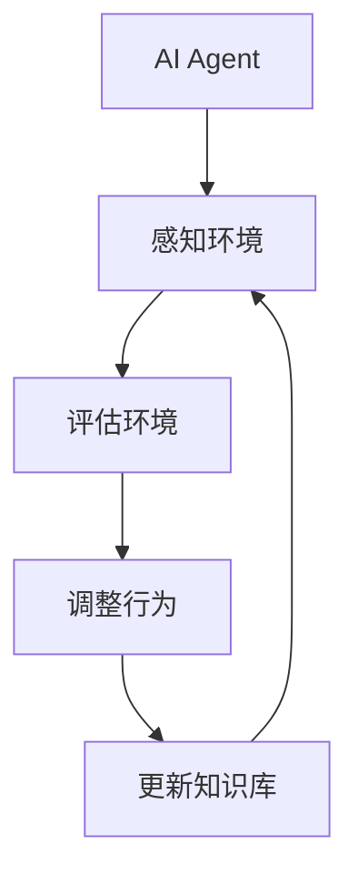
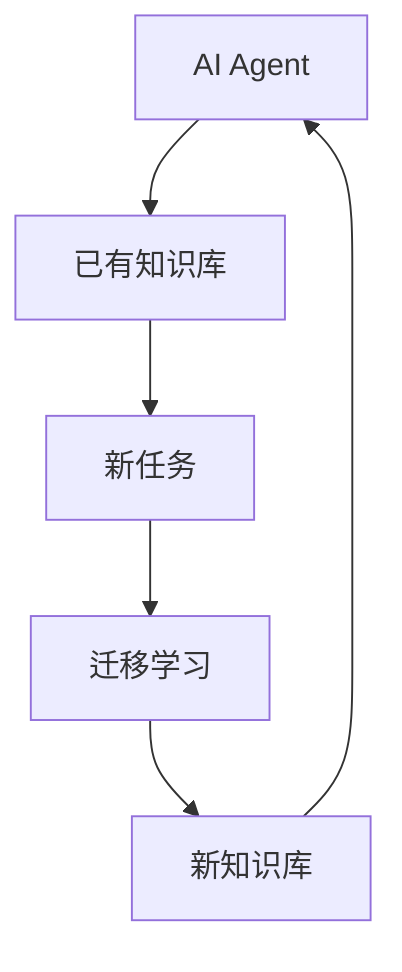
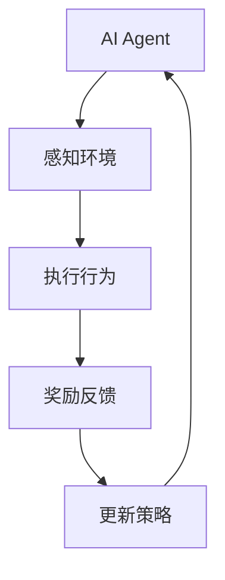

                 


### AI Agent的终身学习：持续适应新知识

---

#### 关键词：AI Agent，终身学习，自适应学习，迁移学习，强化学习，持续适应，新知识

---

#### 摘要：

本文将探讨AI Agent的终身学习，即AI Agent如何持续适应新知识，保持其智能和效能。我们将从背景、核心概念、算法原理、数学模型、系统分析与架构设计、项目实战和最佳实践等方面，逐步深入分析AI Agent终身学习的关键要素。

---

#### 目录：

1. **AI Agent终身学习概述**
    - 第1章：AI Agent终身学习背景
    - 第2章：AI Agent终身学习核心概念
    - 第3章：自适应学习算法原理
    - 第4章：迁移学习算法原理
    - 第5章：强化学习算法原理
    - 第6章：AI Agent终身学习系统分析与架构设计
    - 第7章：AI Agent终身学习项目实战
    - 第8章：最佳实践与总结

---

### 第一步：背景介绍

#### 1.1 问题的提出

随着人工智能技术的发展，AI Agent在各个领域的应用日益广泛。然而，传统的机器学习模型在应对动态环境和新知识时存在局限性。例如，模型在训练后难以适应新的数据分布，或者在面对新任务时需要重新训练。这种局限性促使我们探讨AI Agent的终身学习，即如何在不断变化的环境中持续更新和优化AI Agent的知识。

#### 1.2 AI Agent终身学习的必要性

AI Agent需要具备以下能力：
- **适应性**：能够适应环境变化和新任务。
- **持续性**：能够长期保持学习和优化的能力。
- **效率**：在有限资源和时间内高效地学习新知识。

终身学习是实现这些能力的必要途径。通过不断学习新知识，AI Agent可以保持其智能和效能，从而在复杂和动态的环境中发挥作用。

#### 1.3 问题描述

AI Agent终身学习面临的主要问题包括：
- **知识更新**：如何在新知识出现时及时更新AI Agent的知识库。
- **效率优化**：如何在有限资源和时间内高效地学习新知识。
- **知识融合**：如何将新知识与已有知识有效融合，避免知识冲突和冗余。

#### 1.4 问题解决

解决AI Agent终身学习问题需要从以下几个方面入手：
- **自适应学习**：使AI Agent能够根据环境变化自适应地调整其行为。
- **迁移学习**：利用已有知识解决新任务，减少重新训练的需求。
- **强化学习**：通过奖励机制引导AI Agent学习，提高其学习效率。

### 第二步：核心概念解析

#### 2.1 自适应学习

**概念**：自适应学习是指AI Agent能够根据环境变化自适应地调整其行为和学习策略。

**属性特征对比表格**：

| 特征                | 自适应学习           | 传统机器学习           |
|---------------------|----------------------|------------------------|
| 学习目标            | 适应环境变化         | 解决特定问题           |
| 学习过程            | 不断调整             | 单次训练               |
| 对环境依赖程度      | 高                  | 低                    |
| 应用场景            | 动态环境             | 静态环境               |

**ER实体关系图架构**：

```
[AI Agent] --<适应环境>--> [环境]
```

**Mermaid 流程图**：



#### 2.2 迁移学习

**概念**：迁移学习是指利用已有知识解决新任务，减少重新训练的需求。

**属性特征对比表格**：

| 特征                | 迁移学习           | 传统机器学习           |
|---------------------|----------------------|------------------------|
| 学习目标            | 解决新任务         | 解决特定问题           |
| 学习过程            | 利用已有知识       | 单次训练               |
| 对环境依赖程度      | 低                  | 高                    |
| 应用场景            | 多样性              | 针对特定场景           |

**ER实体关系图架构**：

```
[AI Agent] --<迁移学习>--> [知识库]
```

**Mermaid 流流程图**：



#### 2.3 强化学习

**概念**：强化学习是指通过奖励机制引导AI Agent学习，提高其学习效率。

**属性特征对比表格**：

| 特征                | 强化学习           | 传统机器学习           |
|---------------------|----------------------|------------------------|
| 学习目标            | 提高学习效率       | 解决特定问题           |
| 学习过程            | 奖励反馈           | 单次训练               |
| 对环境依赖程度      | 高                  | 低                    |
| 应用场景            | 动态环境             | 静态环境               |

**ER实体关系图架构**：

```
[AI Agent] --<强化学习>--> [环境]
```

**Mermaid 流流程图**：



---

在接下来的章节中，我们将深入探讨这些核心概念背后的算法原理，并通过数学模型和Python源代码实现，详细讲解AI Agent终身学习的方法和技术。

---

### 下一步：

在了解了AI Agent终身学习的背景和核心概念后，我们将进入第二部分，解析自适应学习、迁移学习和强化学习等算法原理。这些算法是AI Agent终身学习的关键技术，通过逐步深入分析，我们将揭示AI Agent如何在动态环境中持续适应新知识。敬请期待！

