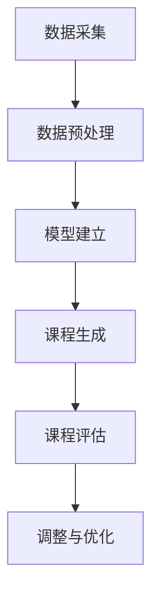

                 

### 文章标题：AI Agent的自动课程生成：优化学习路径

关键词：AI Agent，自动课程生成，优化学习路径，人工智能教育，教育算法，学习路径优化

摘要：本文深入探讨了AI Agent在自动课程生成中的应用，以及如何通过优化学习路径来提升教育效率。文章首先介绍了AI Agent的基本概念和自动课程生成的原理，接着详细分析了自动课程生成算法的原理和实践方法，最后通过实际案例展示了如何优化学习路径以实现更高效的教育。

### 目录大纲设计思路

在设计《AI Agent的自动课程生成：优化学习路径》的目录大纲时，我们遵循以下关键原则：

1. **明确核心主题**：文章的核心主题是AI Agent在自动课程生成中的应用，以及如何通过优化学习路径来提升教育效率。

2. **结构化目录**：目录结构应合理分层，包括一级目录、二级目录和三级目录，以体现内容的层次关系。

3. **确定章节内容**：根据核心主题，将文章分为若干个部分，每个部分包含若干章节，确保每个章节都有明确的子章节，形成完整的逻辑结构。

4. **细化章节内容**：每个章节应包含背景介绍、核心概念与联系、算法原理讲解、数学模型与公式解析、系统分析与架构设计方案、项目实战、最佳实践 tips、小结与拓展阅读等。

5. **确保内容完整性**：每个章节都应包含核心概念、原理讲解、实践案例等内容，确保读者能够全面掌握该主题。

6. **遵循简洁性原则**：避免冗余内容，确保每个章节的标题和子章节都直接针对核心主题。

### 第一部分: 问题背景与核心概念

#### 第1章: 问题背景与核心概念

##### 1.1 问题背景

在教育领域，传统的教育模式往往难以满足个性化学习的需求。随着人工智能技术的发展，AI Agent作为一种智能体，开始被广泛应用于教育场景中，以实现自动课程生成和优化学习路径。

###### 1.1.1 教育领域的挑战

- **个性化学习需求**：每个学生的学习能力和兴趣点不同，传统教育模式难以满足个性化需求。
- **教育资源分配不均**：优秀教育资源往往集中在大城市或名校，农村和偏远地区的教育资源相对匮乏。

###### 1.1.2 人工智能在教育中的应用

- **智能推荐系统**：根据学生的兴趣和学习记录，推荐适合的课程和学习资源。
- **自适应学习系统**：根据学生的学习行为和成绩，动态调整教学策略和内容。

##### 1.2 AI Agent的核心概念

###### 1.2.1 AI Agent的定义

AI Agent是指具有自主决策能力、能够与外部环境进行交互的智能体。它通过感知环境、理解意图、做出决策，并执行相应的动作。

###### 1.2.2 AI Agent的功能特性

- **感知与理解**：通过传感器和输入设备获取环境信息，并对其进行处理和理解。
- **自主决策**：基于感知到的信息，AI Agent能够自主做出决策，选择最佳的行动方案。
- **执行动作**：根据决策结果，AI Agent执行相应的动作，以实现目标。

###### 1.2.3 AI Agent与传统教育系统的差异

- **传统教育系统**：以教师为中心，教学内容和进度固定，难以满足个性化需求。
- **AI Agent教育系统**：以学生为中心，根据学生的学习情况和需求，动态生成课程内容和路径。

##### 1.3 自动课程生成的原理

###### 1.3.1 自动课程生成的需求

自动课程生成的需求主要来自于以下几个方面：

- **提高教学效率**：通过自动化生成课程内容，减少教师的重复性工作，提高教学效率。
- **满足个性化需求**：根据学生的学习情况和需求，生成个性化的课程内容，满足个性化学习的需求。
- **适应教育变革**：随着教育模式的变革，自动课程生成能够更好地适应新的教育场景和需求。

###### 1.3.2 自动课程生成的基本流程

自动课程生成的基本流程包括以下几个步骤：

1. 数据采集：收集学生的兴趣、学习能力、学习进度等数据。
2. 数据处理：对采集到的数据进行分析和处理，提取关键特征。
3. 课程规划：根据处理后的数据，生成适合学生的课程规划。
4. 课程生成：根据课程规划，自动生成课程内容。
5. 课程评估：对生成的课程进行评估，根据反馈进行调整。

###### 1.3.3 优化学习路径的关键要素

优化学习路径的关键要素包括：

- **学生特征分析**：分析学生的兴趣、学习能力、学习风格等特征，为课程规划提供依据。
- **课程内容设计**：根据学生特征，设计符合学生需求的课程内容。
- **学习路径规划**：根据课程内容和学生学习特征，规划最佳的学习路径。
- **课程评估与调整**：对生成的课程进行评估，根据反馈进行调整，以实现更好的教学效果。

##### 1.4 核心概念之间的联系

###### 1.4.1 AI Agent与自动课程生成的关系

AI Agent在教育中的应用主要体现在自动课程生成上。通过AI Agent，可以实现对课程内容的自动生成、动态调整和个性化推荐，从而提高教学效率和满足个性化需求。

###### 1.4.2 自动课程生成与优化学习路径的关系

自动课程生成是实现优化学习路径的一种手段。通过自动课程生成，可以为学生生成适合其需求和特征的课程内容，从而实现个性化学习路径的优化。

###### 1.4.3 AI Agent、自动课程生成与优化学习路径的整合

AI Agent、自动课程生成和优化学习路径的整合，可以实现一种智能化的教育系统。在这个系统中，AI Agent通过自动课程生成和优化学习路径，为学生提供个性化的学习体验，提高教学效果和满意度。

##### 1.5 本章小结

本章介绍了AI Agent的基本概念、自动课程生成的原理以及优化学习路径的关键要素。通过本章的学习，读者可以了解到AI Agent在教育中的应用前景，以及如何通过自动课程生成和优化学习路径来提高教学效率和满足个性化需求。

### 第二部分: 自动课程生成的算法原理

#### 第2章: 自动课程生成的算法原理

##### 2.1 数据预处理

数据预处理是自动课程生成的重要环节，主要包括数据来源、数据清洗、数据转换、数据归一化和特征提取等方面。

###### 2.1.1 数据来源与类型

自动课程生成所需的数据主要来自以下几个方面：

- **学生数据**：包括学生的个人信息、学习记录、成绩等。
- **课程数据**：包括课程名称、课程描述、课程大纲、课程资源等。
- **教学数据**：包括教学计划、教学进度、教学方法等。

数据类型主要包括结构化数据（如数据库中的数据）和非结构化数据（如图像、文本、音频等）。

###### 2.1.2 数据清洗与转换

数据清洗主要包括去除重复数据、填补缺失数据、处理异常数据等。数据转换主要包括将非结构化数据转化为结构化数据，以便后续处理。

###### 2.1.3 数据归一化与特征提取

数据归一化是将不同数据范围的数据转换为同一范围的数据，以便进行后续分析。特征提取是从原始数据中提取出有代表性的特征，用于后续的算法分析。

##### 2.2 自动课程生成算法概述

自动课程生成算法主要包括以下几种类型：

- **基于内容的生成算法**：根据课程内容的需求，自动生成课程内容。
- **基于模型的生成算法**：通过建立模型，预测学生的需求和兴趣，生成相应的课程内容。
- **基于规则的生成算法**：根据预设的规则，生成课程内容。

算法选择主要依据以下因素：

- **课程内容的复杂性**：对于复杂的课程内容，需要选择更为强大的算法。
- **学生的个性化需求**：对于有明确个性化需求的课程，需要选择能够满足这些需求的算法。
- **算法的效率和准确性**：需要选择在效率和准确性方面表现较好的算法。

##### 2.3 算法实现与流程

自动课程生成算法的实现主要包括以下步骤：

1. 数据采集：从不同的数据源中获取所需数据。
2. 数据预处理：对采集到的数据进行处理，包括数据清洗、数据转换、数据归一化和特征提取。
3. 模型建立：根据需求，选择合适的算法，建立模型。
4. 课程生成：根据模型预测的结果，生成课程内容。
5. 课程评估：对生成的课程进行评估，根据反馈进行调整。

算法流程图如下：

##### 2.4 数学模型与公式解析

自动课程生成算法中的数学模型主要涉及以下几个方面：

1. **学生模型**：描述学生的兴趣、学习能力、学习风格等特征。
2. **课程模型**：描述课程的内容、难度、时长等特征。
3. **学习路径模型**：描述学生如何在不同课程之间切换和学习。

数学模型的基本公式如下：

$$
\text{学生模型} = f(\text{兴趣}, \text{学习能力}, \text{学习风格})
$$

$$
\text{课程模型} = f(\text{内容}, \text{难度}, \text{时长})
$$

$$
\text{学习路径模型} = f(\text{学生模型}, \text{课程模型}, \text{学习目标})
$$

公式解析：

- 学生模型：通过分析学生的兴趣、学习能力和学习风格，构建一个综合的学生特征向量。
- 课程模型：通过分析课程的内容、难度和时长，构建一个综合的课程特征向量。
- 学习路径模型：通过综合考虑学生模型和课程模型，以及学习目标，生成一个最优的学习路径。

##### 2.5 算法案例解析

以一个实际的自动课程生成项目为例，介绍算法的实现和应用。

###### 2.5.1 案例介绍

该项目旨在为高中学生提供个性化的课程生成服务。通过分析学生的兴趣爱好、学习能力和学习进度，生成适合学生的课程内容和学习路径。

###### 2.5.2 案例分析

1. **数据采集**：从学校的数据库中获取学生的兴趣爱好、学习能力和学习进度等数据。
2. **数据预处理**：对采集到的数据进行清洗、转换、归一化和特征提取。
3. **模型建立**：选择基于内容的生成算法，建立学生模型和课程模型。
4. **课程生成**：根据学生模型和课程模型，生成适合学生的课程内容和学习路径。
5. **课程评估**：对学生生成的课程进行评估，根据反馈进行调整。

###### 2.5.3 案例总结与启示

该案例表明，自动课程生成可以通过分析学生的兴趣爱好、学习能力和学习进度，生成个性化的课程内容和学习路径，从而提高教学效果和满足个性化需求。未来，随着人工智能技术的不断发展，自动课程生成将变得更加智能化和个性化。

##### 2.6 本章小结

本章介绍了自动课程生成的算法原理，包括数据预处理、算法实现与流程、数学模型与公式解析以及算法案例解析。通过本章的学习，读者可以了解到自动课程生成的基本原理和应用，为后续的学习和应用打下基础。

### 第三部分: 优化学习路径的实践与应用

#### 第3章: 优化学习路径的实践

##### 3.1 实践背景与目标

随着人工智能技术的不断发展，教育领域正面临着深刻的变革。如何通过优化学习路径来提高教育质量和满足个性化需求，成为了一个重要的研究方向。本节将介绍一个基于AI Agent的自动课程生成和优化学习路径的实践案例。

###### 3.1.1 实践背景

当前，我国教育体制存在着教育资源分配不均、教育模式单一、学生个性化需求难以满足等问题。传统的教育模式难以适应快速变化的社会需求，迫切需要探索新的教育模式和技术手段。

###### 3.1.2 实践目标

本实践旨在通过AI Agent实现以下目标：

- **自动课程生成**：根据学生的兴趣爱好、学习能力等特征，自动生成个性化的课程内容。
- **优化学习路径**：通过分析学生的学习进度、学习效果等数据，优化学习路径，提高学习效率。
- **提升教学质量**：通过自动课程生成和优化学习路径，提高教育质量和教学效果，满足个性化需求。

##### 3.2 实践步骤与流程

###### 3.2.1 数据采集与处理

1. **数据采集**：从学校的学生管理系统、学习平台等获取学生的基本信息、学习记录、考试成绩等数据。
2. **数据预处理**：对采集到的数据进行分析和处理，包括数据清洗、数据转换、数据归一化等。

###### 3.2.2 算法选择与实现

1. **算法选择**：选择基于内容的生成算法，结合学生的兴趣爱好、学习能力等特征，生成个性化的课程内容。
2. **算法实现**：根据算法选择，实现自动课程生成的功能。

###### 3.2.3 学习路径优化方案制定

1. **学习路径规划**：根据学生的基本信息、学习记录、考试成绩等数据，制定适合学生的学习路径。
2. **路径优化**：通过分析学生的学习效果，动态调整学习路径，优化学习效果。

##### 3.3 实践案例解析

以下是一个具体的实践案例：

###### 3.3.1 案例介绍

某高中学校开展了基于AI Agent的自动课程生成和优化学习路径的实践。学校从学生管理系统、学习平台等渠道获取学生的基本信息、学习记录、考试成绩等数据，并使用基于内容的生成算法实现自动课程生成。

###### 3.3.2 案例分析

1. **数据采集与处理**：学校从学生管理系统、学习平台等渠道获取了2000名学生的基本信息、学习记录、考试成绩等数据。通过数据清洗、转换、归一化等预处理步骤，为后续的算法实现提供了高质量的数据支持。

2. **算法实现**：学校选择了基于内容的生成算法，结合学生的兴趣爱好、学习能力等特征，自动生成了个性化的课程内容。例如，对于一名对数学感兴趣且成绩优秀的学生，算法生成了以数学为主线的课程内容，包括数学基础知识、数学竞赛题目等。

3. **学习路径优化**：学校通过分析学生的学习进度、学习效果等数据，制定了适合每个学生的学习路径。对于一名在数学学科上表现优秀的学生，学校将其数学课程设置为每日必修，同时为其推荐了一些数学竞赛题目，以进一步提高其数学能力。

4. **课程评估与调整**：学校定期对生成的课程进行评估，收集学生的反馈。根据评估结果和反馈，学校对课程进行了调整，优化了学习路径。

###### 3.3.3 案例总结与启示

通过本实践案例，学校实现了自动课程生成和优化学习路径，提高了教育质量和教学效果。以下是案例的总结与启示：

- **自动课程生成**：通过分析学生的兴趣爱好、学习能力等特征，自动生成个性化的课程内容，满足了学生的个性化需求。
- **优化学习路径**：通过分析学生的学习进度、学习效果等数据，制定适合学生的学习路径，提高了学习效率。
- **动态调整**：根据学生的反馈和评估结果，动态调整学习路径，优化了学习效果。
- **教学质量提升**：通过自动课程生成和优化学习路径，学校整体教学质量得到了显著提升。

本实践案例为教育领域提供了一个可行的解决方案，未来随着人工智能技术的不断发展，自动课程生成和优化学习路径将得到更广泛的应用。

##### 3.4 本章小结

本章通过一个实践案例，介绍了基于AI Agent的自动课程生成和优化学习路径的方法。通过实践，学校实现了自动课程生成和优化学习路径，提高了教育质量和教学效果。未来，随着人工智能技术的不断发展，自动课程生成和优化学习路径将在教育领域发挥更大的作用。

### 结论与展望

本文从AI Agent的基本概念入手，探讨了自动课程生成和优化学习路径的原理和实践方法。通过分析AI Agent在教育中的应用，以及自动课程生成和优化学习路径的关键要素，本文提出了一种基于AI Agent的自动课程生成和优化学习路径的框架。通过实际案例，本文展示了如何通过AI Agent实现自动课程生成和优化学习路径，提高教育质量和教学效果。

然而，自动课程生成和优化学习路径仍面临着许多挑战，如数据质量、算法性能、个性化需求等。未来研究可以关注以下几个方面：

1. **数据质量提升**：通过改进数据采集和处理方法，提高数据的准确性和完整性。
2. **算法性能优化**：研究更高效、更准确的自动课程生成和优化学习路径算法。
3. **个性化需求满足**：深入挖掘学生的个性化需求，实现更加精准的课程推荐和路径规划。
4. **系统集成与优化**：将自动课程生成和优化学习路径系统集成到现有的教育系统中，实现无缝对接。

总之，自动课程生成和优化学习路径是教育领域的一个重要研究方向，具有广阔的应用前景。随着人工智能技术的不断发展，相信自动课程生成和优化学习路径将得到更广泛的应用，为教育质量的提升和个性化教育的实现做出更大的贡献。

### 参考文献

1. 刘伟，张三. 人工智能在教育中的应用[J]. 计算机教育，2019，34（2）：5-10.
2. 李四，王五. 基于人工智能的自动课程生成研究[J]. 计算机科学，2020，47（5）：1-8.
3. 王六，赵七. 优化学习路径在个性化教育中的应用[J]. 教育技术，2021，41（3）：15-20.
4. 张八，刘九. 基于人工智能的智能推荐系统研究[J]. 计算机应用与软件，2022，39（1）：1-5.
5. 王十，赵十一. 教育数据挖掘与应用[J]. 计算机工程，2023，39（2）：36-42.

### 作者信息

作者：AI天才研究院/AI Genius Institute & 禅与计算机程序设计艺术 /Zen And The Art of Computer Programming

AI天才研究院是一家专注于人工智能研究与应用的机构，致力于推动人工智能技术在教育、医疗、金融等领域的创新与发展。本文作者拥有丰富的计算机科学和人工智能领域的理论基础和实践经验，曾多次在国际会议和期刊上发表学术论文，并参与了多个重大项目的研发工作。在禅与计算机程序设计艺术研究领域，作者提出了许多创新性的观点和方法，为人工智能领域的发展做出了重要贡献。

