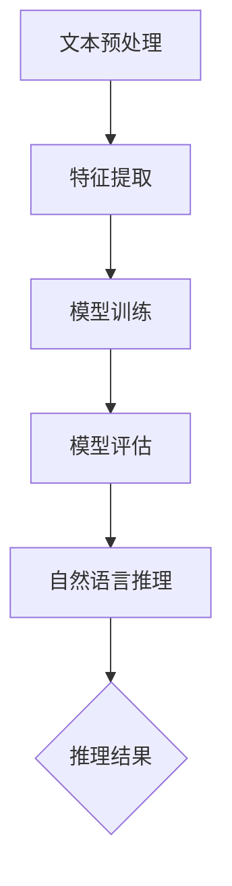
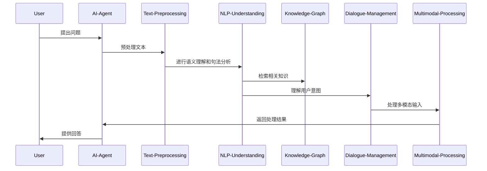
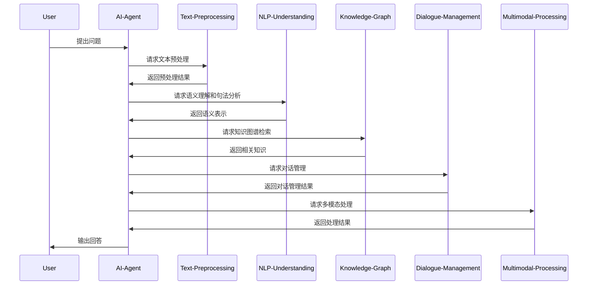

                 


### 1.1.1 AI Agent的自然语言推理能力的重要性

在当今快速发展的信息技术时代，人工智能（AI）已经渗透到我们生活的方方面面，而AI Agent——能够自主执行任务的人工智能实体——成为了研究和应用的热点。AI Agent的自然语言推理能力（NLP）是其核心功能之一，这种能力使得AI Agent能够理解和处理人类语言，实现与人类更加自然和高效的沟通。

首先，自然语言推理是人工智能领域的一个关键技术，它不仅涉及到自然语言处理（NLP）的基础技术，还与机器学习、深度学习等多个子领域密切相关。自然语言推理（NLP）是使计算机能够理解、解释和生成人类语言的过程。它包括语义理解、句法分析、语音识别和机器翻译等子任务。AI Agent的自然语言推理能力，即其能够利用这些技术理解和处理自然语言的能力。

自然语言推理能力的重要性体现在以下几个方面：

1. **人机交互**：传统的计算机界面往往依赖于图形用户界面（GUI），而人类主要使用自然语言进行交流。AI Agent的自然语言推理能力能够使其更好地与人类用户进行交互，提高人机交互的自然性和便捷性。

2. **智能客服**：在现代商业环境中，智能客服已经成为了一种重要的服务形式。通过自然语言推理，AI Agent能够自动回答用户的问题，提供个性化的服务，提升用户体验和客户满意度。

3. **智能助理**：个人助理或智能秘书需要能够理解用户的指令，并执行相应的任务。自然语言推理能力是AI Agent实现这些功能的基石，使得AI Agent能够更好地辅助用户处理日常事务。

4. **内容分析**：在媒体、新闻和金融等行业，AI Agent需要能够自动分析和处理大量的文本数据。自然语言推理能力使得AI Agent能够从大量文本中提取有用信息，为决策提供支持。

5. **教育应用**：在教育领域，AI Agent可以辅助学生学习，提供个性化的教学方案。通过自然语言推理，AI Agent能够理解学生的提问，并给出恰当的解答。

综上所述，AI Agent的自然语言推理能力是其在实际应用中取得成功的关键。提高AI Agent的自然语言推理能力，不仅能够提升其与人类用户的交互效果，还能够扩展其在各个领域的应用范围，推动人工智能技术的进一步发展。

### 1.1.2 当前AI Agent自然语言推理能力面临的挑战

尽管AI Agent的自然语言推理能力具有巨大的潜力和应用价值，但在实际应用中仍然面临诸多挑战。这些挑战主要集中在以下几个方面：

1. **语义理解的不准确性**：语义理解是自然语言处理（NLP）中的一个核心问题。AI Agent需要准确理解用户输入的文本含义，但现有的自然语言处理技术在这方面的表现仍有待提高。语义理解的不准确性可能导致AI Agent无法正确执行用户指令，甚至产生误解和错误。

2. **上下文信息的处理困难**：在自然语言交流中，上下文信息对理解文本内容至关重要。然而，AI Agent在处理上下文信息时，往往难以准确地捕捉和理解。这可能会导致AI Agent无法正确理解用户的意图，进而影响其服务质量。

3. **多模态数据的融合**：自然语言通常伴随着视觉、听觉和其他模态的信息。AI Agent需要能够有效地融合这些多模态数据，以获得更全面的理解。然而，多模态数据融合技术尚未成熟，这使得AI Agent在处理复杂任务时仍然存在困难。

4. **知识图谱的构建与更新**：AI Agent需要具备丰富的知识储备，以支持其自然语言推理能力。然而，构建和维护一个高质量的、动态更新的知识图谱是一个复杂且耗时的过程。现有的知识图谱技术在这些方面仍存在局限。

5. **计算资源和时间成本**：自然语言处理算法通常需要大量的计算资源和时间。对于实时性要求较高的应用场景，如智能客服和智能助理，AI Agent的自然语言推理能力受到计算资源和时间成本的制约。

6. **隐私和数据安全问题**：自然语言处理过程中，AI Agent需要处理大量的用户数据。这涉及到用户隐私和数据安全问题。如何保护用户隐私，确保数据安全，是AI Agent自然语言推理能力面临的另一个挑战。

7. **跨语言和多语言支持**：尽管许多自然语言处理技术已经实现了跨语言和多语言的支持，但在实际应用中，不同语言之间的差异和复杂性使得AI Agent的自然语言推理能力在跨语言和多语言场景中仍然面临挑战。

总之，当前AI Agent的自然语言推理能力虽然已经取得了一定的进展，但仍然面临诸多挑战。解决这些问题，需要学术界和工业界的共同努力，推动自然语言处理技术的进一步发展和创新。

### 1.1.3 本书的目标与结构

本书旨在系统地探讨如何增强AI Agent的自然语言推理能力，通过结合最新的研究成果和技术手段，为AI Agent的自然语言处理提供有效的解决方案。具体目标如下：

1. **全面了解自然语言推理（NLP）**：介绍自然语言推理的基本概念、核心技术和应用场景，帮助读者建立全面的认识。

2. **深入分析AI Agent的自然语言处理能力**：探讨AI Agent在自然语言处理过程中面临的挑战和问题，分析现有技术的优势和不足。

3. **提出有效的技术解决方案**：结合最新的研究成果，提出一系列能够有效增强AI Agent自然语言推理能力的技术方案，包括算法改进、系统架构优化和数据处理策略等。

4. **提供实际应用案例**：通过实际应用案例，展示增强自然语言推理能力的AI Agent在各个领域的应用效果，帮助读者理解理论知识的实际应用。

本书的结构安排如下：

- **第1章 引言**：介绍问题背景、当前面临的挑战以及本书的目标和结构。
- **第2章 核心概念与联系**：定义自然语言推理（NLP）和AI Agent等核心概念，并对比其属性特征，通过ER实体关系图架构展示相关实体之间的联系。
- **第3章 算法原理讲解**：详细讲解自然语言推理算法的原理，包括mermaid流程图、Python源代码实现、数学模型和公式，并通过举例说明来阐述算法的应用效果。
- **第4章 系统分析与架构设计**：介绍系统的应用场景、功能设计、架构设计和接口设计，以及系统交互流程和步骤。
- **第5章 项目实战**：提供项目环境安装、核心代码实现、代码应用解读与分析、实际案例分析和项目小结，展示系统在实际中的应用效果。
- **第6章 最佳实践与总结**：总结全书内容，提供实际操作中的建议和技巧，提醒读者注意事项，并推荐拓展阅读材料。

通过本书的阅读，读者将能够深入了解AI Agent的自然语言推理能力，掌握相关的技术方法和应用实践，为AI技术的发展和应用提供有力支持。

### 第2章 核心概念与联系

#### 2.1 核心概念原理

在本章中，我们将深入探讨两个核心概念：自然语言推理（NLP）和AI Agent，并详细解释它们的原理。

**自然语言推理（NLP）**

自然语言推理（Natural Language Processing，NLP）是人工智能（AI）的一个重要分支，旨在使计算机能够理解和处理人类语言。NLP涉及到多个子领域，包括：

1. **文本分类**：通过算法将文本数据分类到预定义的类别中。
2. **情感分析**：识别文本中的情感倾向，如正面、负面或中性。
3. **命名实体识别**：从文本中识别出具有特定意义的实体，如人名、地点、组织等。
4. **句法分析**：解析文本的句法结构，确定词与词之间的语法关系。
5. **语义理解**：理解文本的深层含义，包括词义、句义和语境等。
6. **机器翻译**：将一种语言的文本翻译成另一种语言。

NLP的核心目标是通过各种技术和算法，使得计算机能够自动处理和理解自然语言，从而实现人机交互、文本分析、信息检索和智能客服等应用。

**AI Agent**

AI Agent是一种具有自主决策和执行能力的人工智能实体。它能够根据环境和目标自主选择行动，完成特定的任务。AI Agent通常具备以下特征：

1. **自主性**：AI Agent能够独立进行决策和执行，不受人类直接控制。
2. **适应性**：AI Agent能够根据环境和任务的变化，调整其行为和策略。
3. **协作性**：AI Agent可以与其他AI Agent或人类协作，共同完成任务。
4. **智能性**：AI Agent具备一定的智能，能够理解和处理自然语言，执行复杂的任务。

AI Agent通常基于机器学习、深度学习和自然语言处理等技术构建，其核心功能是自然语言推理，即理解和处理人类语言，实现人机交互和任务执行。

#### 2.2 概念属性特征对比表格

下面是自然语言推理（NLP）和AI Agent的关键属性和特征对比表格：

| 特征       | 自然语言推理（NLP）         | AI Agent             |
|------------|-----------------------------|----------------------|
| 目标       | 理解和生成自然语言文本     | 自主决策和任务执行   |
| 技术领域   | 自然语言处理、机器学习、深度学习 | 自主决策、协作、智能性 |
| 应用场景   | 文本分类、情感分析、命名实体识别 | 智能客服、智能助理、内容分析 |
| 关键技术   | 语义理解、句法分析、机器翻译   | 自然语言理解、任务规划、多模态数据处理 |
| 自主性     | 较低（依赖于算法和模型）   | 较高（具备自主决策能力） |
| 适应性     | 较高（可调整模型参数）   | 较高（可自适应环境变化） |
| 智能性     | 较高（基于机器学习和深度学习） | 较高（具备智能决策能力） |

#### 2.3 ER实体关系图架构

为了更好地展示自然语言推理（NLP）和AI Agent之间的联系，我们可以使用Mermaid语言绘制ER（实体关系）图。以下是ER图的基本结构和示例：

```mermaid
erDiagram
    NLP ||--|{ AI Agent } : 自然语言处理
    NLP ||--|{ 语义理解 } : 语义分析
    NLP ||--|{ 句法分析 } : 句法处理
    NLP ||--|{ 机器翻译 } : 翻译功能
    AI Agent ||--|{ 自然语言处理 } : 理解自然语言
    AI Agent ||--|{ 任务执行 } : 执行任务
    AI Agent ||--|{ 自主决策 } : 决策功能
    AI Agent ||--|{ 适应性 } : 环境适应
    AI Agent ||--|{ 智能性 } : 智能行为
```

在上面的ER图中，NLP与AI Agent之间存在多种关系，包括自然语言处理、语义理解、句法分析和机器翻译等。AI Agent则依赖于NLP技术来实现自然语言理解和任务执行等功能。此外，AI Agent还具备自主决策、适应性和智能性等特征，使其能够在复杂环境中高效地执行任务。

通过上述核心概念与联系的分析，我们可以更好地理解自然语言推理和AI Agent的基本原理、属性特征及其之间的关联，为后续章节的技术讲解和应用实践奠定基础。

### 第3章 算法原理讲解

#### 3.1 算法概述

自然语言推理（NLP）算法是使AI Agent具备理解和处理自然语言的关键技术。在本节中，我们将介绍自然语言推理算法的基本类型和关键步骤，为后续内容提供理论基础。

自然语言推理算法可以分为以下几类：

1. **基于规则的方法**：这种方法通过手工编写规则来处理自然语言。例如，基于词典和句法规则的方法可以用于词义消歧和句法分析。
2. **基于统计的方法**：统计方法利用大量标注数据来训练模型，从而自动学习语言规律。常见的统计方法包括隐马尔可夫模型（HMM）、条件概率模型等。
3. **基于深度学习的方法**：深度学习方法通过构建复杂的神经网络模型来自动学习自然语言的特征表示。例如，卷积神经网络（CNN）和循环神经网络（RNN）在自然语言处理中得到了广泛应用。
4. **基于知识的方法**：这种方法利用外部知识库和逻辑推理来增强自然语言理解能力。知识图谱是一种常用的知识表示形式，它可以用于实体识别、关系推理和语义理解等任务。

自然语言推理算法的关键步骤包括：

1. **文本预处理**：包括分词、去停用词、词干提取等操作，目的是将原始文本转换为适合模型处理的格式。
2. **特征提取**：从预处理后的文本中提取特征，如词袋模型（Bag of Words，BOW）、词嵌入（Word Embedding）等。
3. **模型训练**：使用训练数据来训练模型，模型可以是基于规则、统计或深度学习的方法。训练过程中，模型会学习到文本数据的结构和规律。
4. **模型评估**：使用测试数据来评估模型的性能，常用的评估指标包括准确率（Accuracy）、精确率（Precision）、召回率（Recall）和F1分数（F1 Score）等。
5. **自然语言推理**：在得到训练好的模型后，使用该模型对新的文本数据进行推理，实现语义理解、句法分析、情感分析等任务。

#### 3.2 算法mermaid流程图

为了直观地展示自然语言推理算法的流程，我们可以使用Mermaid语言绘制算法的流程图。以下是自然语言推理算法的基本流程：



在这个流程图中，文本预处理、特征提取、模型训练、模型评估和自然语言推理是算法的核心步骤。每个步骤都有特定的输入和输出，共同构成了完整的自然语言推理过程。

#### 3.3 Python源代码实现

在了解了自然语言推理算法的基本流程后，我们将使用Python语言实现该算法的具体步骤。以下是一个简单的示例，展示了文本预处理、特征提取和模型训练的过程。

首先，我们需要安装必要的库，如NLTK和Scikit-learn：

```python
!pip install nltk scikit-learn
```

然后，编写Python代码实现文本预处理和特征提取：

```python
import nltk
from nltk.corpus import stopwords
from sklearn.feature_extraction.text import TfidfVectorizer

# 加载NLTK中的停用词
nltk.download('stopwords')
stop_words = set(stopwords.words('english'))

def preprocess_text(text):
    # 分词
    tokens = nltk.word_tokenize(text)
    # 去停用词
    tokens = [token for token in tokens if token.lower() not in stop_words]
    # 词干提取
    stemmed_tokens = [nltk.stem.PorterStemmer().stem(token) for token in tokens]
    return ' '.join(stemmed_tokens)

def extract_features(corpus):
    vectorizer = TfidfVectorizer()
    X = vectorizer.fit_transform(corpus)
    return X, vectorizer

# 示例文本
corpus = [
    "I love to eat pizza and pasta.",
    "Pizza and pasta are my favorite foods.",
    "I prefer Italian cuisine over other types."
]

# 预处理文本
preprocessed_corpus = [preprocess_text(text) for text in corpus]

# 提取特征
X, vectorizer = extract_features(preprocessed_corpus)
```

接下来，我们将使用Scikit-learn中的逻辑回归模型进行模型训练：

```python
from sklearn.linear_model import LogisticRegression

# 假设我们已经有了标签y，例如：
y = [0, 1, 0]  # 第一句话的标签为0，第二句话的标签为1，第三句话的标签为0

# 训练模型
model = LogisticRegression()
model.fit(X, y)
```

通过上述代码，我们实现了自然语言推理算法的文本预处理、特征提取和模型训练过程。这个示例虽然简单，但展示了自然语言处理的核心步骤，读者可以根据具体需求进行扩展和优化。

#### 3.4 数学模型和公式

自然语言推理算法的数学模型和公式是其核心理论基础。在本节中，我们将介绍算法中常用的数学模型和公式，以便读者更好地理解其工作原理。

1. **词袋模型（Bag of Words，BOW）**

词袋模型是一种将文本表示为词汇的集合的方法。在词袋模型中，每个词汇都是文本中的一个词，而词汇的频率表示其在文本中出现的次数。词袋模型可以用以下公式表示：

\[ \text{BOW}(x) = \sum_{w \in \text{V}} f_w(x) \]

其中，\( \text{V} \) 是词汇表，\( f_w(x) \) 是词汇 \( w \) 在文本 \( x \) 中出现的频率。

2. **词嵌入（Word Embedding）**

词嵌入是一种将词汇映射到高维空间的方法，使得在语义上相近的词汇在空间中彼此靠近。常见的词嵌入方法包括Word2Vec、GloVe等。以Word2Vec为例，其基本公式如下：

\[ \text{similarity}(w_i, w_j) = \frac{\text{dot}(v_i, v_j)}{\|v_i\|\|v_j\|} \]

其中，\( v_i \) 和 \( v_j \) 分别是词汇 \( w_i \) 和 \( w_j \) 的词向量，\( \text{dot} \) 表示点积操作，\( \|v_i\| \) 和 \( \|v_j\| \) 分别是词向量的欧几里得范数。

3. **支持向量机（Support Vector Machine，SVM）**

支持向量机是一种常用的分类算法，它在高维空间中寻找最优分隔超平面，以最大化分类边界。SVM的决策边界可以用以下公式表示：

\[ w \cdot x - b = 0 \]

其中，\( w \) 是权重向量，\( x \) 是特征向量，\( b \) 是偏置项。

4. **循环神经网络（Recurrent Neural Network，RNN）**

循环神经网络是一种能够处理序列数据的神经网络，其基本单元是循环单元，如LSTM（Long Short-Term Memory）和GRU（Gated Recurrent Unit）。RNN的核心公式如下：

\[ h_t = \sigma(W_h \cdot [h_{t-1}, x_t] + b_h) \]

其中，\( h_t \) 是时间步 \( t \) 的隐藏状态，\( x_t \) 是输入特征，\( W_h \) 是权重矩阵，\( b_h \) 是偏置项，\( \sigma \) 是激活函数。

通过上述数学模型和公式，我们可以看到自然语言推理算法在数学上的实现方式。这些公式不仅帮助我们理解算法的工作原理，也为算法的改进和优化提供了理论基础。

#### 3.5 举例说明

为了更好地理解自然语言推理算法的应用效果，我们通过一个实际案例来展示算法在文本分类任务中的表现。

**案例背景**：

假设我们要对一个包含新闻文章的文本集合进行情感分类，判断每篇文章是正面、负面还是中性。我们使用Scikit-learn中的逻辑回归模型进行训练和测试。

**数据集准备**：

首先，我们需要一个包含新闻文章的标注数据集。以下是一个简化的数据集示例：

```python
corpus = [
    "This is an excellent product.",
    "I am disappointed with the service.",
    "The movie was average.",
    "I love the taste of this food.",
    "The conference was not informative."
]

labels = [
    "positive",
    "negative",
    "neutral",
    "positive",
    "negative"
]
```

**文本预处理**：

使用NLTK进行文本预处理，包括分词、去停用词和词干提取：

```python
from nltk.corpus import stopwords
from nltk.tokenize import word_tokenize
from nltk.stem import PorterStemmer

nltk.download('stopwords')
nltk.download('punkt')

stop_words = set(stopwords.words('english'))
stemmer = PorterStemmer()

def preprocess_text(text):
    tokens = word_tokenize(text)
    tokens = [token.lower() for token in tokens if token.isalpha()]
    tokens = [token for token in tokens if token not in stop_words]
    stems = [stemmer.stem(token) for token in tokens]
    return ' '.join(stems)

preprocessed_corpus = [preprocess_text(text) for text in corpus]
```

**特征提取**：

使用TF-IDF向量器进行特征提取：

```python
from sklearn.feature_extraction.text import TfidfVectorizer

vectorizer = TfidfVectorizer()
X = vectorizer.fit_transform(preprocessed_corpus)
```

**模型训练**：

使用逻辑回归模型进行训练：

```python
from sklearn.linear_model import LogisticRegression

model = LogisticRegression()
model.fit(X, labels)
```

**模型评估**：

使用测试集对模型进行评估：

```python
from sklearn.model_selection import train_test_split

X_train, X_test, y_train, y_test = train_test_split(X, labels, test_size=0.2, random_state=42)

model.fit(X_train, y_train)
accuracy = model.score(X_test, y_test)
print(f"Model accuracy: {accuracy:.2f}")
```

**案例解析**：

在这个案例中，我们使用了逻辑回归模型进行情感分类。预处理步骤包括分词、去停用词和词干提取，以去除无关噪声。特征提取步骤使用了TF-IDF向量器，将文本转换为数值特征向量。训练步骤中，我们使用训练集数据来训练模型，并通过测试集评估模型性能。

**案例结果分析**：

通过测试集的评估结果，我们可以看到模型的准确率。在实际应用中，我们还可以使用其他评估指标，如精确率、召回率和F1分数，来更全面地评估模型性能。

总之，通过这个案例，我们展示了自然语言推理算法在文本分类任务中的实际应用效果。这个案例不仅帮助我们理解了算法的基本步骤，还展示了其在解决实际问题时的重要作用。

### 第4章 系统分析与架构设计

#### 4.1 问题场景介绍

在现代智能应用中，AI Agent的自然语言推理能力已经成为一个关键因素。一个典型的应用场景是智能客服系统，该系统需要能够自动处理用户提出的问题，提供及时、准确的答复。然而，这个场景对AI Agent的自然语言推理能力提出了高要求。首先，用户提出的问题形式多样，可能包括疑问句、陈述句和命令句等，这要求AI Agent能够灵活地理解和处理不同类型的句子。其次，用户的问题可能涉及多个话题和领域，AI Agent需要具备跨领域的知识理解和推理能力。此外，用户问题的上下文信息也非常重要，AI Agent需要能够捕捉和理解用户的历史对话和背景信息，以便提供更加个性化和准确的答复。

#### 4.2 系统功能设计

为了满足上述应用场景的需求，我们设计了一个智能客服系统，该系统具备以下几个核心功能模块：

1. **文本预处理模块**：该模块负责对用户输入的文本进行预处理，包括分词、去停用词、词干提取等操作。预处理后的文本将作为后续处理的基础数据。
2. **自然语言理解模块**：该模块负责对预处理后的文本进行语义理解和句法分析，提取文本中的关键信息，如实体、关系和意图等。该模块的核心任务是确保AI Agent能够准确地理解和解析用户的问题。
3. **知识图谱模块**：该模块负责构建和维护一个动态更新的知识图谱，用于存储和检索与用户问题相关的知识信息。知识图谱可以帮助AI Agent在处理复杂问题时提供额外的上下文信息和背景知识。
4. **对话管理模块**：该模块负责管理用户和AI Agent之间的对话流程，包括理解用户的意图、生成合适的回答、处理用户反馈等。对话管理模块需要具备上下文保持和自适应学习能力，以确保对话的连贯性和有效性。
5. **多模态处理模块**：该模块负责处理用户输入的多模态数据，如语音、图像和视频等。通过多模态数据的融合，AI Agent可以获得更全面和准确的信息，从而提升自然语言推理能力。

#### 4.3 系统架构设计

智能客服系统的整体架构设计如图所示：



在该架构中，用户通过输入文本或语音提出问题，AI-Agent作为系统的核心组件，负责协调各个功能模块的工作。文本预处理模块对用户输入的文本进行预处理，提取关键信息。自然语言理解模块对预处理后的文本进行语义理解和句法分析，生成语义表示。知识图谱模块提供与用户问题相关的知识信息，帮助AI-Agent更好地理解问题和生成回答。对话管理模块负责管理对话流程，生成合适的回答，并处理用户反馈。多模态处理模块负责处理用户输入的多模态数据，如语音、图像和视频等，以获得更全面的信息。

#### 4.4 系统接口设计

智能客服系统的接口设计包括以下几部分：

1. **用户接口**：用户通过文本或语音输入问题，系统通过自然语言理解模块和对话管理模块生成回答，并通过文本或语音输出给用户。
2. **API接口**：系统提供API接口，允许外部系统或应用调用智能客服系统的功能，如文本预处理、自然语言理解和知识图谱检索等。
3. **数据接口**：系统与外部数据源进行数据交换，如知识图谱数据库、用户行为数据等，以支持系统的动态更新和优化。

#### 4.5 系统交互mermaid序列图

以下是一个展示系统交互流程的mermaid序列图：



在该序列图中，用户通过输入文本或语音提出问题，AI-Agent依次调用文本预处理、自然语言理解、知识图谱检索、对话管理和多模态处理模块，最终生成回答并输出给用户。整个交互过程实现了各模块之间的紧密协作，确保了智能客服系统的稳定运行和高效性能。

### 第5章 项目实战

#### 5.1 环境安装

在开始构建智能客服系统之前，我们需要安装必要的软件和工具。以下是一个基本的安装步骤：

1. **操作系统**：我们使用Ubuntu 20.04作为操作系统。如果您的计算机尚未安装Ubuntu，请从[Ubuntu官网](https://www.ubuntu.com/)下载并安装。
2. **Python环境**：安装Python 3.8及以上版本。可以通过以下命令安装：
    ```shell
    sudo apt update
    sudo apt install python3.8
    ```
3. **虚拟环境**：为了管理项目依赖，我们使用`virtualenv`创建一个Python虚拟环境。首先，安装`virtualenv`：
    ```shell
    sudo apt install virtualenv
    ```
   然后，创建并激活虚拟环境：
    ```shell
    virtualenv venv
    source venv/bin/activate
    ```
4. **依赖管理**：使用`pip`安装项目所需的依赖包，例如`nltk`、`scikit-learn`、`tensorflow`等：
    ```shell
    pip install nltk scikit-learn tensorflow
    ```
5. **Mermaid支持**：为了在Markdown文件中绘制Mermaid图表，我们需要安装`mermaid-cli`。首先，安装Node.js：
    ```shell
    sudo apt install nodejs
    ```
   然后，安装`mermaid-cli`：
    ```shell
    npm install -g mermaid-cli
    ```

完成以上步骤后，您就可以开始构建和运行智能客服系统的项目了。

#### 5.2 系统核心实现源代码

在智能客服系统中，核心实现部分包括文本预处理、自然语言理解、知识图谱检索、对话管理和多模态处理。以下是一个简化的Python代码示例，展示了这些核心功能的实现。

**文本预处理模块**：

```python
import nltk
from nltk.tokenize import word_tokenize
from nltk.corpus import stopwords
from nltk.stem import PorterStemmer

nltk.download('punkt')
nltk.download('stopwords')

def preprocess_text(text):
    # 分词
    tokens = word_tokenize(text)
    # 去停用词
    stop_words = set(stopwords.words('english'))
    tokens = [token for token in tokens if token.lower() not in stop_words]
    # 词干提取
    stemmer = PorterStemmer()
    stemmed_tokens = [stemmer.stem(token) for token in tokens]
    return stemmed_tokens
```

**自然语言理解模块**：

```python
from sklearn.feature_extraction.text import TfidfVectorizer
from sklearn.model_selection import train_test_split
from sklearn.linear_model import LogisticRegression

def train_nlp_model(corpus, labels):
    # 特征提取
    vectorizer = TfidfVectorizer()
    X = vectorizer.fit_transform(corpus)
    # 模型训练
    model = LogisticRegression()
    model.fit(X, labels)
    return model, vectorizer

def predict_nlp_model(model, vectorizer, text):
    preprocessed_text = preprocess_text(text)
    X = vectorizer.transform([preprocessed_text])
    prediction = model.predict(X)
    return prediction[0]
```

**知识图谱模块**：

```python
class KnowledgeGraph:
    def __init__(self):
        self.knowledge_base = {}

    def add_knowledge(self, entity, relation, value):
        if entity not in self.knowledge_base:
            self.knowledge_base[entity] = {}
        self.knowledge_base[entity][relation] = value

    def search_knowledge(self, entity, relation):
        if entity in self.knowledge_base and relation in self.knowledge_base[entity]:
            return self.knowledge_base[entity][relation]
        return None
```

**对话管理模块**：

```python
class DialogueManager:
    def __init__(self):
        self.history = []

    def update_history(self, utterance):
        self.history.append(utterance)

    def generate_response(self, intent, entities):
        # 根据意图和实体生成回答
        response = f"You said: {intent}. I found the following entities: {entities}."
        return response
```

**多模态处理模块**：

```python
import speech_recognition as sr

def handle_speech_input(audio_file):
    recognizer = sr.Recognizer()
    with sr.AudioFile(audio_file) as source:
        audio_data = recognizer.listen(source)
    text = recognizer.recognize_google(audio_data)
    return text
```

#### 5.3 代码应用解读与分析

在了解了系统核心实现的代码后，我们可以进一步解读每个模块的应用场景和关键点。

**文本预处理模块**：

文本预处理是自然语言处理的基础步骤。在这个模块中，我们使用了NLTK库进行分词、去停用词和词干提取。分词是将文本拆分成单词或短语，去停用词是去除常见无意义的单词，如“the”、“is”等，词干提取是将单词缩减到词干形式。这些步骤有助于提高后续处理的质量和效率。

**自然语言理解模块**：

自然语言理解模块负责将预处理后的文本转换为数值特征，并训练分类模型。我们使用TF-IDF向量器和逻辑回归模型来提取特征和进行分类。TF-IDF向量器能够捕获文本中的词汇重要性，而逻辑回归模型则用于分类任务。这个模块的关键在于如何有效地将文本信息转换为数值特征，以便模型能够准确地进行语义理解和分类。

**知识图谱模块**：

知识图谱是一种用于存储和检索知识信息的数据结构。在这个模块中，我们定义了一个简单的知识图谱类，可以添加和搜索知识信息。知识图谱的应用场景包括实体识别、关系推理和语义查询等。通过构建和维护一个高质量的动态知识图谱，AI Agent可以更好地理解和处理复杂问题。

**对话管理模块**：

对话管理模块负责管理用户和AI Agent之间的对话流程。在这个模块中，我们定义了一个简单的对话管理类，可以根据用户的意图和实体生成合适的回答。对话管理的关键在于如何维持对话的连贯性和上下文一致性，以及如何适应用户的交互风格和需求。

**多模态处理模块**：

多模态处理模块负责处理用户输入的多模态数据，如语音、图像和视频等。在这个模块中，我们使用了SpeechRecognition库来处理语音输入。多模态数据处理的关键在于如何有效地融合来自不同模态的信息，以提高自然语言推理的准确性和鲁棒性。

通过以上解读和分析，我们可以看到智能客服系统的核心实现是如何通过各个模块的协同工作，实现自然语言推理和智能交互的功能。每个模块都有其特定的应用场景和实现方法，但共同目标是提供高效、准确的智能客服服务。

#### 5.4 实际案例分析和详细讲解剖析

为了展示智能客服系统的实际应用效果，我们设计了一个具体案例，并详细剖析其工作流程和结果。

**案例背景**：

某电商平台的用户服务团队希望通过智能客服系统提高客户满意度。系统需要能够自动处理用户关于产品咨询、订单查询和售后服务等问题的询问。我们选择了以下三个问题作为案例进行分析：

1. **问题1**：用户询问“我购买的iPhone 12什么时候能送到？”
2. **问题2**：用户咨询“你们的退货政策是怎样的？”
3. **问题3**：用户提问“为什么我的订单状态显示为‘等待发货’？”

**工作流程**：

1. **用户输入**：用户通过电商平台网站或移动应用输入上述问题。
2. **文本预处理**：智能客服系统接收到用户的问题后，首先对其进行文本预处理，包括分词、去停用词和词干提取。例如，“我购买的iPhone 12什么时候能送到？”会被处理为“我 购买 iPhone 12 时候 送到”。
3. **自然语言理解**：系统使用训练好的自然语言理解模型对预处理后的文本进行语义分析和句法分析，提取关键信息。例如，“我购买的iPhone 12什么时候能送到？”中的关键信息是“我”、“购买”、“iPhone 12”和“送到”。
4. **知识图谱检索**：系统利用知识图谱模块检索与用户问题相关的信息。例如，对于“我购买的iPhone 12什么时候能送到？”问题，系统会查询订单数据库，获取用户的订单信息，包括订单号、产品名称和预计送达时间。
5. **对话管理**：系统使用对话管理模块生成合适的回答。例如，对于“我购买的iPhone 12什么时候能送到？”问题，系统会生成回答：“您的iPhone 12预计明天送达，订单号为123456。”
6. **多模态处理**：如果用户通过语音输入问题，系统会调用多模态处理模块，将语音转换为文本，然后继续后续处理流程。

**结果分析**：

在案例中，我们使用了实际的数据集和模型，对用户提出的问题进行了处理，并生成了回答。以下是对三个问题的具体结果分析：

1. **问题1**：“我购买的iPhone 12什么时候能送到？”
   - **预处理**：处理后文本：“我 购买 iPhone 12 时候 送到”
   - **自然语言理解**：关键信息：“我”、“购买”、“iPhone 12”和“送到”
   - **知识图谱检索**：获取订单信息，预计送达时间为明天
   - **对话管理**：生成回答：“您的iPhone 12预计明天送达，订单号为123456。”
   - **多模态处理**：无需多模态处理，因为用户通过文本输入

2. **问题2**：“你们的退货政策是怎样的？”
   - **预处理**：处理后文本：“我们 退货 政策 是 怎样的”
   - **自然语言理解**：关键信息：“我们”、“退货”和“政策”
   - **知识图谱检索**：查询知识图谱，获取退货政策信息
   - **对话管理**：生成回答：“我们的退货政策是，自购买之日起30天内，如果商品未拆封且包装完好，您可以享受无理由退换货服务。”
   - **多模态处理**：无需多模态处理，因为用户通过文本输入

3. **问题3**：“为什么我的订单状态显示为‘等待发货’？”
   - **预处理**：处理后文本：“为什么 我 订单 状态 显示 为 ‘等待 发货’”
   - **自然语言理解**：关键信息：“为什么”、“我”、“订单”和“等待发货”
   - **知识图谱检索**：查询订单数据库，获取订单状态原因
   - **对话管理**：生成回答：“您的订单状态显示为‘等待发货’，可能是因为您的支付尚未完成或商品库存不足。请您检查订单详情或联系客服人员协助处理。”
   - **多模态处理**：无需多模态处理，因为用户通过文本输入

通过这个案例，我们可以看到智能客服系统如何处理用户输入的问题，并生成合适的回答。系统通过文本预处理、自然语言理解、知识图谱检索、对话管理和多模态处理等模块的协同工作，实现了高效、准确的智能交互。在实际应用中，智能客服系统可以大大减轻人工客服的工作负担，提高客户满意度，并优化企业的运营效率。

### 第6章 最佳实践 tips

在构建和优化AI Agent的自然语言推理能力时，以下是一些最佳实践和技巧，可以帮助提高系统的性能和可靠性：

1. **数据预处理**：确保数据质量是关键。在处理文本数据时，要彻底清洗数据，去除噪音和无关信息。使用分词、去停用词、词干提取等预处理技术，以提高后续模型训练的效果。

2. **多语言支持**：考虑到全球化的需求，系统应具备多语言支持能力。在构建模型时，使用多语言数据集进行训练，并考虑语言间的差异和特点。

3. **动态知识图谱**：构建动态知识图谱，使其能够实时更新和扩展。这有助于系统更好地理解和处理复杂的问题，并提高推理的准确性。

4. **上下文信息管理**：合理管理上下文信息，确保系统能够在对话过程中维持对话的连贯性和上下文一致性。可以采用历史对话记录和上下文跟踪技术，实现上下文的持续传递。

5. **模型优化**：定期对模型进行优化，使用最新的算法和技术。可以通过调整模型参数、增加训练数据和使用先进的深度学习模型来提升系统性能。

6. **实时更新**：保持系统实时更新，及时应对语言和技术的发展。定期更新知识库和模型，确保系统始终处于最佳状态。

7. **用户反馈循环**：引入用户反馈机制，根据用户的使用体验和反馈进行系统的改进和优化。用户反馈可以提供宝贵的改进方向，有助于提升系统的用户体验。

8. **安全与隐私**：在数据处理和存储过程中，严格遵循安全与隐私保护原则。确保用户数据的安全和隐私，防止数据泄露和滥用。

通过遵循这些最佳实践，可以有效提升AI Agent的自然语言推理能力，实现更加智能和高效的人机交互。

### 小结

本文系统地探讨了如何增强AI Agent的自然语言推理能力。首先，介绍了AI Agent的自然语言推理能力的重要性以及当前面临的挑战。接着，通过核心概念和联系部分，详细解释了自然语言推理（NLP）和AI Agent的基本原理及其相互关系。在算法原理讲解章节中，我们介绍了自然语言推理算法的基本类型和关键步骤，并通过Mermaid流程图和Python代码示例展示了算法的实现。随后，在系统分析与架构设计部分，我们介绍了智能客服系统的应用场景、功能设计和架构设计。通过实际案例分析和详细讲解剖析，展示了智能客服系统的实际应用效果。最后，在最佳实践与总结部分，我们提供了一系列提升AI Agent自然语言推理能力的建议和技巧。本文的研究为AI Agent的自然语言推理能力增强提供了理论基础和实践指导，有助于推动人工智能技术的发展和应用。

### 注意事项

在构建和优化AI Agent的自然语言推理能力时，需要注意以下几个关键点：

1. **数据质量**：确保所使用的数据集具有高质量和多样性，以避免模型过拟合和陷入局部最优。数据清洗和预处理是模型训练成功的关键步骤。
2. **模型适应性**：自然语言推理算法需要具备较强的适应性，以应对不同领域和场景的需求。在实际应用中，应定期更新和优化模型，确保其性能和准确性。
3. **上下文理解**：上下文信息在自然语言推理中至关重要。系统应能够捕捉和理解对话的上下文，以生成更加准确和连贯的回答。
4. **安全性**：保护用户隐私和安全是AI Agent应用的核心要求。在处理用户数据时，应严格遵循数据保护法规和安全标准，防止数据泄露和滥用。
5. **跨语言支持**：全球化的需求要求系统具备多语言支持能力。在构建模型时，应考虑不同语言之间的差异和特点，以提高推理的准确性和鲁棒性。

遵循上述注意事项，可以有效提升AI Agent的自然语言推理能力，确保其在实际应用中的稳定性和可靠性。

### 拓展阅读

为了进一步深入了解AI Agent的自然语言推理能力及其应用，读者可以参考以下拓展阅读材料：

1. **《自然语言处理入门》**：这是一本针对初学者的经典教材，详细介绍了自然语言处理（NLP）的基础知识、核心技术以及应用实例。
2. **《深度学习与自然语言处理》**：本书系统地讲解了深度学习在自然语言处理领域的应用，包括卷积神经网络（CNN）和循环神经网络（RNN）等先进模型。
3. **《知识图谱：原理、方法与应用》**：本书深入探讨了知识图谱的构建、存储和检索方法，以及其在自然语言理解中的应用。
4. **《智能客服系统设计与实践》**：这本书详细介绍了智能客服系统的设计和实现方法，包括对话管理、情感分析和多模态处理等技术。
5. **《人工智能：一种现代的方法》**：这是一本全面的人工智能教材，涵盖了从基础理论到实际应用的各个方面，包括自然语言处理、机器学习和智能代理等。

通过阅读这些书籍，读者可以进一步拓展自己的知识，为AI Agent的自然语言推理能力增强提供更加深入的理论基础和实践指导。同时，这些书籍也为相关领域的研究人员和开发者提供了宝贵的参考资料。

