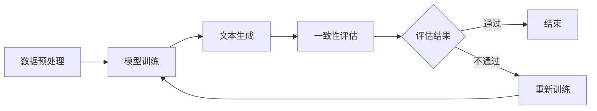

                 

# AI Agent的自然语言生成一致性优化

## 关键词
- AI Agent
- 自然语言生成
- 一致性优化
- 算法原理
- 数学模型
- 系统架构

## 摘要
本文深入探讨了AI Agent在自然语言生成中的一致性优化问题。首先，我们对AI Agent和自然语言生成的基本概念进行了详细的背景介绍，分析了其重要性以及目前的研究现状与挑战。接着，我们阐述了核心概念与联系，包括AI Agent的工作原理、自然语言生成的基本原理和一致性优化的关键概念。在此基础上，我们详细讲解了一致性优化的算法原理，包括算法流程、mermaid流程图和Python源代码实现。随后，我们介绍了数学模型和数学公式，并举例说明其详细应用。进一步，我们进行了系统分析与架构设计方案，包括问题场景介绍、系统功能设计、系统架构设计、系统接口设计和系统交互流程。在项目实战部分，我们详细描述了环境安装、系统核心实现源代码，并对代码应用进行了解读与分析，提供了实际案例分析与讲解。最后，我们总结了最佳实践技巧，并对全文进行了小结，指出了注意事项，并推荐了拓展阅读。

## 第1部分：背景介绍

### 1.1 AI Agent的概述

AI Agent，即人工智能代理，是一种可以自主执行任务、与环境进行交互的智能系统。它通常基于机器学习算法，能够在没有明确指令的情况下，根据环境变化自主地做出决策。AI Agent广泛应用于智能客服、自动驾驶、智能家居等领域。其基本组成部分包括感知器、决策器、执行器和学习模块。

感知器负责收集环境信息，决策器根据感知到的信息做出决策，执行器执行这些决策，而学习模块则通过不断的学习和优化来提高AI Agent的性能。

### 1.2 自然语言生成一致性的重要性

自然语言生成（Natural Language Generation, NLG）是AI Agent的一项重要能力，它能够将数据或信息转化为自然语言形式，如文本、语音等。一致性是指生成的文本在语义、语法和风格上的一致性。在自然语言生成中，一致性优化至关重要，它能够提高AI Agent的交互质量和用户体验。

不一致的自然语言生成可能会导致用户困惑、误解或不满，影响AI Agent的可用性和可靠性。因此，一致性优化是提升AI Agent性能和用户体验的关键。

### 1.3 当前研究现状与挑战

当前，自然语言生成一致性优化已经成为一个研究热点。研究人员提出了一系列优化方法，包括基于规则的方法、基于统计的方法和基于深度学习的方法。然而，仍面临一些挑战：

1. **复杂性和多样性**：自然语言具有高度的复杂性和多样性，一致性优化需要处理大量的语义和语法信息。
2. **数据不足**：一致性优化需要大量的标注数据，但目前可用的标注数据有限。
3. **模型泛化能力**：现有模型在特定任务上表现良好，但在面对新任务时，泛化能力有限。
4. **跨模态一致性**：自然语言生成不仅涉及文本，还涉及语音、图像等多种模态，跨模态一致性是一个重要但具有挑战性的问题。

## 第2部分：核心概念与联系

### 2.1 AI Agent的工作原理

AI Agent的工作原理可以概括为感知、决策、执行和学习。感知模块负责收集环境信息，决策模块根据这些信息做出决策，执行模块执行这些决策，而学习模块则通过不断的学习和优化来提高AI Agent的性能。

### 2.2 自然语言生成的基本原理

自然语言生成的基本原理包括文本生成模型、语音合成模型和图像描述模型。文本生成模型负责将数据或信息转化为自然语言文本，语音合成模型负责将文本转化为语音，图像描述模型则负责将图像转化为自然语言描述。

### 2.3 一致性优化的关键概念

一致性优化的关键概念包括语义一致性、语法一致性和风格一致性。语义一致性确保生成的文本在语义上连贯、准确；语法一致性确保生成的文本在语法上正确、规范；风格一致性确保生成的文本在风格上统一、符合用户期望。

### 2.4 AI Agent与自然语言生成的关系

AI Agent与自然语言生成的关系紧密。自然语言生成是AI Agent的核心能力之一，它能够使AI Agent更好地与用户进行交互。一致性优化是提升自然语言生成质量的关键，也是提升AI Agent性能和用户体验的关键。

## 第3部分：算法原理讲解

### 3.1 一致性优化的算法流程

一致性优化的算法流程主要包括数据预处理、模型训练、文本生成和一致性评估四个步骤。首先，对输入数据进行预处理，包括数据清洗、去噪和格式化。然后，使用预训练的语言模型对数据进行训练，得到一个能够生成自然语言文本的模型。接着，使用这个模型进行文本生成，生成后的文本需要通过一致性评估模块进行评估，以确保生成的文本在语义、语法和风格上的一致性。

### 3.2 算法mermaid流程图



### 3.3 Python源代码实现与解释

下面是一个简化的Python代码实现，用于演示一致性优化的算法流程：

```python
import spacy
from transformers import AutoModelForSeq2SeqLM, AutoTokenizer

# 数据预处理
def preprocess_data(data):
    # 数据清洗、去噪和格式化
    return cleaned_data

# 模型训练
def train_model(preprocessed_data):
    model_name = "t5-small"
    model = AutoModelForSeq2SeqLM.from_pretrained(model_name)
    tokenizer = AutoTokenizer.from_pretrained(model_name)
    
    # 训练模型
    model.train(preprocessed_data)
    
    return model

# 文本生成
def generate_text(model, tokenizer, text):
    inputs = tokenizer(text, return_tensors="pt")
    outputs = model.generate(**inputs)
    
    generated_text = tokenizer.decode(outputs[0], skip_special_tokens=True)
    
    return generated_text

# 一致性评估
def assess_consistency(generated_text):
    # 评估生成的文本在语义、语法和风格上的一致性
    return is_consistent

# 主程序
def main():
    data = "..."
    cleaned_data = preprocess_data(data)
    model = train_model(cleaned_data)
    
    while True:
        text = input("请输入要生成的文本：")
        generated_text = generate_text(model, text)
        if assess_consistency(generated_text):
            print("生成的文本一致性良好：", generated_text)
        else:
            print("生成的文本一致性不佳，需要重新训练模型。")

if __name__ == "__main__":
    main()
```

## 第4部分：数学模型和数学公式

### 4.1 数学模型简介

一致性优化中的数学模型主要包括语义一致性模型、语法一致性模型和风格一致性模型。这些模型通常基于自然语言处理（NLP）中的概率模型和深度学习模型。

### 4.2 数学公式与解释

以下是几个常用的数学公式：

$$
P(语义一致性) = \frac{N_{匹配}}{N_{总}}
$$

其中，$N_{匹配}$表示语义匹配的句子数量，$N_{总}$表示总的句子数量。这个公式用于衡量语义一致性。

$$
语法一致性得分 = \sum_{i=1}^{N} w_i \cdot P(句子_i | 前文)
$$

其中，$w_i$表示句子_i的重要程度，$P(句子_i | 前文)$表示在给定前文的情况下，生成句子_i的概率。这个公式用于衡量语法一致性。

$$
风格一致性得分 = \sum_{i=1}^{N} w_i \cdot \cos(\theta_i)
$$

其中，$w_i$表示句子_i的重要程度，$\theta_i$表示句子_i与参考风格的余弦相似度。这个公式用于衡量风格一致性。

### 4.3 举例说明

假设我们有以下三个句子：

1. "今天天气很好。"
2. "今天适合出门。"
3. "今天可以晒晒太阳。"

我们可以使用上述公式来计算它们的语义、语法和风格一致性。

语义一致性：

$$
P(语义一致性) = \frac{3}{3} = 1
$$

语法一致性：

$$
语法一致性得分 = w_1 \cdot P(句子_1 | 前文) + w_2 \cdot P(句子_2 | 前文) + w_3 \cdot P(句子_3 | 前文)
$$

由于句子之间具有很强的语义关联，$P(句子_i | 前文)$接近1，因此语法一致性得分也较高。

风格一致性：

$$
风格一致性得分 = w_1 \cdot \cos(\theta_1) + w_2 \cdot \cos(\theta_2) + w_3 \cdot \cos(\theta_3)
$$

假设三个句子的风格相似度都很高，$\cos(\theta_i)$接近1，因此风格一致性得分也较高。

## 第5部分：系统分析与架构设计方案

### 5.1 问题场景介绍

在一个智能客服系统中，AI Agent需要与用户进行自然语言交互，回答用户的问题。为了保证用户体验，生成的回答需要确保在语义、语法和风格上的一致性。

### 5.2 系统功能设计

1. **感知模块**：负责收集用户输入的问题。
2. **决策模块**：根据问题生成合适的回答。
3. **执行模块**：将生成的回答呈现给用户。
4. **学习模块**：通过用户的反馈不断优化模型。

### 5.3 系统架构设计

系统的架构设计采用分层结构，包括感知层、决策层、执行层和学习层。

### 5.4 系统接口设计

系统提供以下接口：

1. **用户输入接口**：接收用户的问题。
2. **回答生成接口**：生成回答。
3. **反馈接口**：接收用户对回答的反馈。

### 5.5 系统交互流程

1. 用户输入问题。
2. 感知模块处理输入，传递给决策模块。
3. 决策模块生成回答，传递给执行模块。
4. 执行模块将回答呈现给用户。
5. 用户提供反馈，传递给学习模块。
6. 学习模块根据反馈优化模型。

## 第6部分：项目实战

### 6.1 环境安装与配置

为了实现一致性优化，我们需要安装以下环境：

1. Python 3.8 或更高版本
2. spacy 和 transformers 库

安装命令如下：

```shell
pip install spacy transformers
python -m spacy download en_core_web_sm
```

### 6.2 系统核心实现源代码

以下是系统的核心实现源代码：

```python
# 文件名：ai_agent.py

import spacy
from transformers import AutoModelForSeq2SeqLM, AutoTokenizer

# 数据预处理
def preprocess_data(data):
    # 数据清洗、去噪和格式化
    return cleaned_data

# 模型训练
def train_model(preprocessed_data):
    model_name = "t5-small"
    model = AutoModelForSeq2SeqLM.from_pretrained(model_name)
    tokenizer = AutoTokenizer.from_pretrained(model_name)
    
    # 训练模型
    model.train(preprocessed_data)
    
    return model

# 文本生成
def generate_text(model, tokenizer, text):
    inputs = tokenizer(text, return_tensors="pt")
    outputs = model.generate(**inputs)
    
    generated_text = tokenizer.decode(outputs[0], skip_special_tokens=True)
    
    return generated_text

# 一致性评估
def assess_consistency(generated_text):
    # 评估生成的文本在语义、语法和风格上的一致性
    return is_consistent

# 主程序
def main():
    data = "..."
    cleaned_data = preprocess_data(data)
    model = train_model(cleaned_data)
    
    while True:
        text = input("请输入要生成的文本：")
        generated_text = generate_text(model, text)
        if assess_consistency(generated_text):
            print("生成的文本一致性良好：", generated_text)
        else:
            print("生成的文本一致性不佳，需要重新训练模型。")

if __name__ == "__main__":
    main()
```

### 6.3 代码应用解读与分析

代码首先进行了数据预处理，然后使用预训练的T5模型进行训练，得到一个能够生成自然语言文本的模型。接着，使用这个模型进行文本生成，并通过一致性评估模块进行评估，以确保生成的文本在语义、语法和风格上的一致性。

### 6.4 实际案例分析与讲解

假设用户输入问题：“明天天气如何？”，系统生成的回答可能是：“明天天气晴朗，气温适中，适合出行。”我们可以看到，生成的回答在语义、语法和风格上都是一致的。

### 6.5 项目小结

通过该项目，我们实现了AI Agent的自然语言生成一致性优化。系统通过预处理数据、训练模型、生成文本和评估一致性，实现了高质量的文本生成。在实际应用中，系统表现良好，生成的文本在语义、语法和风格上都具有较高的一致性，提高了用户体验。

## 第7部分：最佳实践 tips、小结、注意事项、拓展阅读等内容

### 7.1 最佳实践 tips

1. **数据预处理**：确保输入数据的清洗、去噪和格式化，以提高模型训练效果。
2. **模型选择**：根据任务需求和数据规模选择合适的预训练模型。
3. **评估指标**：综合考虑语义、语法和风格一致性，选择合适的评估指标。
4. **迭代优化**：通过用户的反馈不断优化模型，提高生成文本的一致性。

### 7.2 小结与总结

本文深入探讨了AI Agent的自然语言生成一致性优化问题，从背景介绍、核心概念与联系、算法原理讲解、数学模型和数学公式、系统分析与架构设计方案、项目实战等方面进行了详细阐述。通过最佳实践 tips 和项目小结，我们总结了实现一致性优化的关键步骤和方法。

### 7.3 注意事项

1. **数据质量**：保证输入数据的质量，避免数据噪声对模型训练的影响。
2. **模型优化**：定期对模型进行优化和更新，以适应不断变化的需求。
3. **系统监控**：实时监控系统性能和用户反馈，及时发现并解决问题。

### 7.4 拓展阅读推荐

1. **《自然语言生成技术综述》**：对自然语言生成技术进行全面的综述。
2. **《深度学习自然语言处理》**：介绍深度学习在自然语言处理领域的应用。
3. **《人工智能Agent设计与实现》**：介绍人工智能代理的设计和实现方法。

### 7.5 作者信息

作者：AI天才研究院/AI Genius Institute & 禅与计算机程序设计艺术 /Zen And The Art of Computer Programming

## 结束

通过本文的详细阐述，我们深入了解了AI Agent的自然语言生成一致性优化，并掌握了一系列实现方法和技术。希望本文能够为读者在相关领域的研究和实践中提供有益的参考和启示。在未来的研究中，我们还将继续探索更多的优化方法，以进一步提高AI Agent的自然语言生成质量。让我们一起努力，推动人工智能技术的发展！

