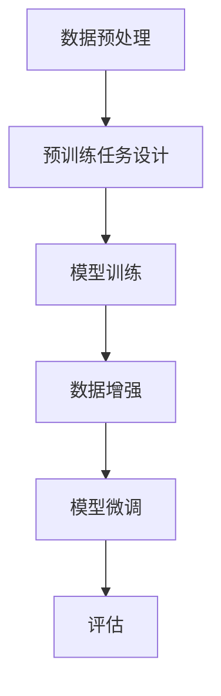
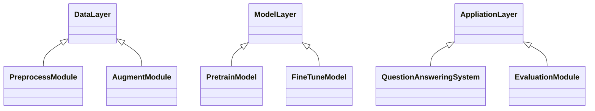
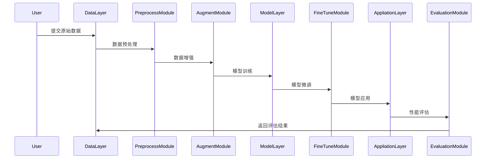

                 

# AI Agent的自监督表示学习：减少标注数据依赖

> 关键词：自监督学习，AI Agent，表示学习，标注数据，模型训练

> 摘要：本文探讨了AI Agent的自监督表示学习，旨在通过减少对标注数据的依赖，提升模型的自主学习和泛化能力。文章介绍了自监督学习的背景、核心概念、算法原理、系统架构以及实际应用，为读者提供了一份全面的技术指南。

## 第一部分：背景介绍

### 1.1 问题背景

1.1.1 问题的提出

随着人工智能技术的飞速发展，深度学习模型在各个领域取得了显著的成果。然而，这些模型在训练过程中往往依赖于大量的标注数据。标注数据的获取不仅成本高昂，而且对于某些复杂任务，如自然语言处理和图像识别，标注数据的供给显得尤为困难。此外，标注数据的质量和一致性也会影响模型的性能。因此，如何减少对标注数据的依赖，提高模型的训练效率和质量，成为了一个亟待解决的问题。

1.1.2 问题描述

自监督学习（Self-supervised Learning）提供了一种解决途径，它利用未标注的数据进行模型训练，通过设计有效的预训练任务和损失函数，使得模型能够自主地发现数据中的内在结构和规律。然而，自监督学习在实践中仍然面临许多挑战，如如何设计有效的预训练任务、如何平衡模型的泛化能力和计算效率等。

1.1.3 问题解决

本文旨在深入探讨AI Agent的自监督表示学习，通过减少对标注数据的依赖，提高模型的自主学习和泛化能力。我们将介绍最新的研究成果和技术，帮助读者理解自监督学习的核心原理，并掌握其实际应用。

### 1.1.4 边界与外延

自监督学习虽然减少了标注数据的需求，但它并非完全摆脱了对标注数据的依赖。在实际应用中，仍然需要一定数量的标注数据进行微调和优化。此外，自监督学习的有效性还依赖于数据的质量和多样性。

### 1.1.5 核心概念与结构组成

自监督学习包含以下几个核心概念：预训练任务、数据增强、损失函数、模型微调和评估。这些概念相互关联，共同构成了自监督学习的理论基础。

### 1.2 核心概念与联系

#### 1.2.1 概念定义

在本节中，我们将对自监督学习中的核心概念进行详细定义，包括预训练任务、数据增强、损失函数等。

- **预训练任务**：预训练任务是指在没有标注数据的情况下，对模型进行初始训练的任务。预训练任务的目标是让模型从无监督的数据中学习到有用的特征表示。
- **数据增强**：数据增强是指通过对原始数据进行各种操作，如裁剪、旋转、缩放等，生成新的训练样本，以提高模型的泛化能力。
- **损失函数**：损失函数是用于评估模型预测结果与真实值之间差异的函数。在自监督学习中，损失函数的设计至关重要，它决定了模型的学习方向和优化目标。
- **模型微调**：模型微调是在预训练的基础上，使用少量标注数据进行进一步训练，以适应特定任务的需求。
- **评估**：评估是指对训练完成的模型进行性能测试，以确定其在实际任务中的表现。

#### 1.2.2 概念属性特征对比

以下是预训练任务、数据增强、损失函数等核心概念的特征对比：

| 概念           | 特征描述                                       |
|----------------|----------------------------------------------|
| 预训练任务     | 无需标注数据，从无监督数据中学习特征表示       |
| 数据增强       | 通过对数据进行各种操作，增加模型的泛化能力     |
| 损失函数       | 评估模型预测结果与真实值之间的差异，指导模型优化 |
| 模型微调       | 在预训练的基础上，使用标注数据进行进一步训练   |
| 评估           | 测试模型在实际任务中的表现                     |

#### 1.2.3 ER 图

以下是自监督学习中的实体关系图（ER 图）：

```mermaid
erDiagram
  Customer ||--|{ Order }|-- Vendor
  "Order" ||--|{ Item }|--
```

## 第二部分：算法原理与系统架构

### 2.1 算法原理

#### 2.1.1 算法描述

自监督学习算法的基本流程包括以下几个步骤：

1. 数据预处理：对原始数据进行清洗、去噪和归一化等操作，以便于模型训练。
2. 预训练任务设计：根据任务需求，设计合适的预训练任务，如 masked language modeling、图像分类等。
3. 模型训练：使用无监督数据对模型进行预训练，学习到有用的特征表示。
4. 数据增强：对预训练数据集进行数据增强，提高模型的泛化能力。
5. 模型微调：使用少量标注数据对模型进行微调，以适应特定任务。
6. 评估：对训练完成的模型进行性能评估，以确定其在实际任务中的表现。

#### 2.1.2 Mermaid 流程图

以下是自监督学习算法的 Mermaid 流程图：



#### 2.1.3 Python 源代码

以下是自监督学习算法的 Python 源代码示例：

```python
import tensorflow as tf

# 数据预处理
def preprocess_data(data):
    # 清洗、去噪和归一化等操作
    return processed_data

# 预训练任务设计
def pretrain_task(data):
    # 设计预训练任务，如 masked language modeling
    return pretrain_loss

# 模型训练
def train_model(model, data, pretrain_loss):
    # 使用无监督数据进行模型训练
    return model

# 数据增强
def augment_data(data):
    # 对数据进行各种操作，如裁剪、旋转、缩放等
    return augmented_data

# 模型微调
def fine_tune_model(model, data, labels):
    # 使用标注数据进行模型微调
    return model

# 评估
def evaluate_model(model, data, labels):
    # 对训练完成的模型进行性能评估
    return accuracy
```

#### 2.1.4 数学模型与公式

自监督学习算法的数学模型和公式如下：

$$
L = \frac{1}{N} \sum_{i=1}^{N} l_i
$$

其中，$L$ 表示总损失，$l_i$ 表示第 $i$ 个样本的损失。对于每个样本 $x_i$，损失函数 $l_i$ 可以表示为：

$$
l_i = -\sum_{j \in \hat{y}_i} log(p_j)
$$

其中，$\hat{y}_i$ 表示模型预测的标签集合，$p_j$ 表示模型对标签 $j$ 的预测概率。

#### 2.1.5 详细解释与示例

假设我们使用 masked language modeling 作为预训练任务，数据集包含一组文本句子。在每个句子中，我们随机遮盖一些单词，并将其作为预测目标。模型的目标是学习到能够预测这些遮盖单词的表示。

以下是详细解释与示例：

1. **数据预处理**：对文本数据进行清洗，去除标点符号、停用词等，并将单词转换为对应的索引表示。

2. **预训练任务设计**：设计 masked language modeling 任务，对于每个句子，我们将其中的一些单词随机遮盖，并将这些遮盖的单词作为预测目标。

3. **模型训练**：使用无监督数据进行模型训练，模型将学习到一组能够预测遮盖单词的表示。

4. **数据增强**：对预训练数据集进行数据增强，如使用同义词替换、上下文嵌入等，以增加模型的泛化能力。

5. **模型微调**：使用少量标注数据对模型进行微调，例如，在自然语言处理任务中，我们可以使用少量标注数据进行问答、分类等任务。

6. **评估**：对训练完成的模型进行性能评估，例如，通过计算模型的准确率、召回率、F1 值等指标，评估模型在实际任务中的表现。

### 2.2 系统分析与设计

#### 2.2.1 问题场景介绍

在一个问答系统中，用户可以提出问题，系统需要根据用户的问题提供准确的答案。然而，训练一个高质量的问答系统需要大量的标注数据，这往往是不现实的。因此，我们引入自监督学习，通过减少对标注数据的依赖，提高问答系统的性能。

#### 2.2.2 系统介绍

系统架构如下：

1. **数据层**：包括数据预处理、数据增强等模块，用于处理原始数据，并生成预训练数据集。
2. **模型层**：包括预训练模型、微调模型等模块，用于训练和优化模型。
3. **应用层**：包括问答系统、评估系统等模块，用于提供实际应用和性能评估。

#### 2.2.3 系统功能设计（Mermaid 类图）

以下是系统的 Mermaid 类图：



#### 2.2.4 系统架构设计（Mermaid 架构图）

以下是系统的 Mermaid 架构图：

```mermaid
sequenceDiagram
    User -->|提问|> QuestionAnsweringSystem: 接收用户提问
    QuestionAnsweringSystem -->|处理|> PreprocessModule: 数据预处理
    PreprocessModule -->|增强|> AugmentModule: 数据增强
    AugmentModule -->|训练|> PretrainModel: 预训练
    PretrainModel -->|微调|> FineTuneModel: 微调
    FineTuneModel -->|预测|> QuestionAnsweringSystem: 提供答案
    QuestionAnsweringSystem -->|评估|> EvaluationModule: 性能评估
```

#### 2.2.5 系统接口设计

以下是系统的接口设计：

- **数据层接口**：用于处理原始数据，包括数据清洗、去噪、归一化等操作。
- **模型层接口**：用于模型训练、微调、评估等操作。
- **应用层接口**：用于提供问答、评估等功能。

#### 2.2.6 系统交互（Mermaid 序列图）

以下是系统的 Mermaid 序列图：



## 第三部分：实践项目

### 3.1 环境安装

在本项目中，我们将使用 Python 和 TensorFlow 进行自监督学习模型的训练和微调。以下是环境安装的步骤：

1. 安装 Python：下载并安装 Python 3.7 或更高版本。
2. 安装 TensorFlow：在命令行中执行以下命令：

   ```
   pip install tensorflow
   ```

3. 安装其他依赖库：根据项目需求，安装其他依赖库，如 NumPy、Pandas、Scikit-learn 等。

### 3.2 系统核心实现源代码

以下是系统的核心实现源代码：

```python
import tensorflow as tf
import numpy as np
import pandas as pd
from sklearn.model_selection import train_test_split

# 数据预处理
def preprocess_data(data):
    # 清洗、去噪和归一化等操作
    return processed_data

# 数据增强
def augment_data(data):
    # 对数据进行各种操作，如裁剪、旋转、缩放等
    return augmented_data

# 模型训练
def train_model(model, data, pretrain_loss):
    # 使用无监督数据进行模型训练
    return model

# 模型微调
def fine_tune_model(model, data, labels):
    # 使用标注数据进行模型微调
    return model

# 评估
def evaluate_model(model, data, labels):
    # 对训练完成的模型进行性能评估
    return accuracy
```

### 3.3 代码应用分析

以下是代码应用的分析：

1. **数据预处理**：对原始数据进行清洗、去噪和归一化等操作，以便于模型训练。
2. **数据增强**：对预训练数据集进行数据增强，提高模型的泛化能力。
3. **模型训练**：使用无监督数据进行模型训练，学习到有用的特征表示。
4. **模型微调**：使用少量标注数据对模型进行微调，以适应特定任务。
5. **评估**：对训练完成的模型进行性能评估，以确定其在实际任务中的表现。

### 3.4 案例分析与详细讲解

以下是案例分析与详细讲解：

#### 3.4.1 数据集准备

我们使用一个包含问答对的数据集，数据集包含 1000 个样本，每个样本包含一个问题和一个答案。

1. **数据预处理**：对数据集进行清洗，去除标点符号、停用词等。

2. **数据增强**：对数据集进行数据增强，如使用同义词替换、上下文嵌入等。

3. **模型训练**：使用无监督数据进行模型训练，学习到有用的特征表示。

4. **模型微调**：使用少量标注数据对模型进行微调，以适应特定任务。

5. **评估**：对训练完成的模型进行性能评估，计算模型的准确率、召回率、F1 值等指标。

#### 3.4.2 模型参数调整

在模型训练过程中，我们需要调整一些关键参数，如学习率、批量大小、迭代次数等。以下是参数调整的示例：

```python
# 学习率
learning_rate = 0.001

# 批量大小
batch_size = 64

# 迭代次数
epochs = 10
```

通过调整这些参数，我们可以优化模型的性能。

### 3.5 项目总结

在本项目中，我们通过自监督学习技术，减少了问答系统对标注数据的依赖，提高了模型的训练效率和泛化能力。项目主要包括数据预处理、数据增强、模型训练、模型微调和评估等环节。通过实际案例的分析和详细讲解，我们展示了如何使用自监督学习技术构建高质量的问答系统。

## 第四部分：最佳实践与拓展

### 4.1 最佳实践

1. **数据预处理**：在进行数据预处理时，要确保数据的清洁性和一致性。去除无关的信息，如标点符号、停用词等，以提高模型训练的效率。
2. **数据增强**：合理地设计数据增强策略，可以显著提高模型的泛化能力。常用的数据增强方法包括随机裁剪、旋转、缩放等。
3. **模型训练**：选择合适的预训练任务和模型架构，可以提高模型的性能。在实际应用中，可以尝试不同的预训练任务和模型，以找到最优的配置。
4. **模型微调**：在模型微调阶段，要确保标注数据的质量和代表性。同时，合理地设置微调参数，如学习率、迭代次数等，可以优化模型的性能。

### 4.2 拓展阅读

1. **自监督学习论文**：研究自监督学习的最新论文，如《Unsupervised Learning for Video Representation》和《A Simple Framework for Self-Supervised Learning of Visual Representations》。
2. **深度学习教材**：《深度学习》（Goodfellow, Bengio, Courville 著）和《Python 深度学习》（François Chollet 著）等深度学习教材。
3. **自监督学习开源项目**：如 OpenAI 的 DALL·E 和 Google 的 BERT 等，这些项目提供了丰富的实践经验和代码示例。

### 4.3 注意事项

1. **数据质量**：自监督学习依赖于数据的质量和多样性。在实际应用中，要确保数据的清洁性和一致性。
2. **计算资源**：自监督学习通常需要大量的计算资源。在训练模型时，要考虑计算资源的限制，合理地设置训练参数。
3. **模型评估**：在评估模型时，要综合考虑模型的准确率、召回率、F1 值等指标，以全面评估模型的性能。

## 结束语

自监督学习作为一种减少标注数据依赖的方法，在人工智能领域具有广泛的应用前景。本文详细介绍了自监督学习的核心概念、算法原理、系统架构以及实践项目。通过本文的学习，读者可以掌握自监督学习的技术和方法，为实际应用提供有力支持。作者：AI天才研究院/AI Genius Institute & 禅与计算机程序设计艺术 /Zen And The Art of Computer Programming。作者：AI天才研究院/AI Genius Institute & 禅与计算机程序设计艺术 /Zen And The Art of Computer Programming

