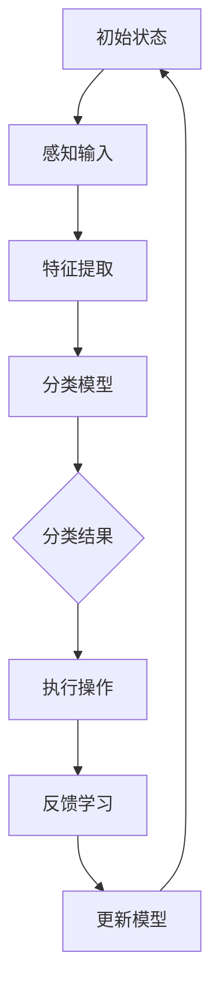
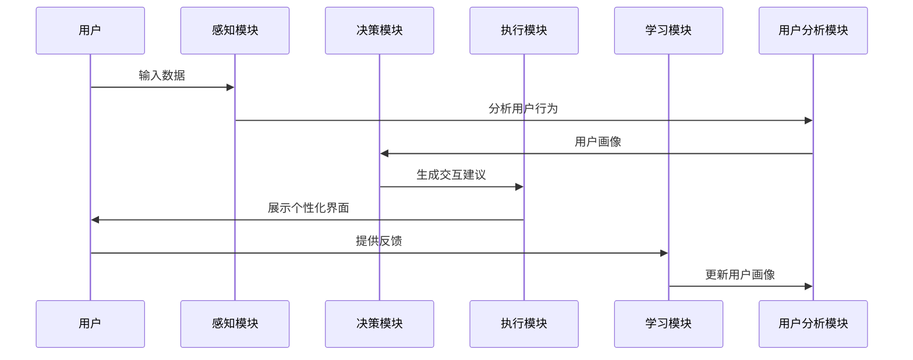
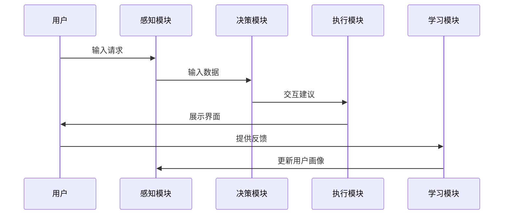

                 

### AI Agent的自适应用户界面：个性化人机交互体验

**关键词：** AI Agent、用户界面、个性化、交互体验

**摘要：** 本文旨在探讨AI Agent自适应用户界面的设计和实现，强调个性化人机交互体验的重要性。通过分析AI Agent的定义、自适应用户界面原理及其实施方法，文章将深入探讨如何通过个性化分析、用户界面设计和交互体验评估来提升AI Agent的用户体验。

---

### 目录大纲

## 第一部分: AI Agent的基础

### 第1章: AI Agent概述

#### 1.1.1 AI Agent的定义与分类

#### 1.1.2 AI Agent的基本组成与功能

#### 1.1.3 AI Agent的核心技术

### 第2章: 自适应用户界面原理

#### 2.2.1 自适应用户界面的定义

#### 2.2.2 自适应用户界面的关键技术

#### 2.2.3 自适应用户界面的设计原则

### 第3章: 自适应用户界面的实现

#### 3.3.1 自适应用户界面的实现方法

#### 3.3.2 自适应用户界面的性能优化

#### 3.3.3 自适应用户界面的案例研究

## 第二部分: 个性化人机交互体验

### 第4章: 个性化用户分析

#### 4.4.1 个性化用户分析的方法与工具

#### 4.4.2 用户画像的构建与利用

#### 4.4.3 用户行为数据的处理与分析

### 第5章: 个性化用户界面设计

#### 5.5.1 个性化用户界面设计的原则

#### 5.5.2 个性化用户界面的实现技术

#### 5.5.3 个性化用户界面的案例研究

### 第6章: 个性化人机交互体验评估

#### 6.6.1 个性化人机交互体验评估的方法

#### 6.6.2 个性化人机交互体验评估的工具

#### 6.6.3 个性化人机交互体验评估的案例分析

## 第三部分: 实践应用

### 第7章: AI Agent的自适应用户界面应用案例

#### 7.7.1 案例一：智能客服系统

#### 7.7.2 案例二：智能教育平台

#### 7.7.3 案例三：智能家居系统

### 第8章: AI Agent的自适应用户界面发展趋势

#### 8.8.1 AI Agent的自适应用户界面的未来方向

#### 8.8.2 AI Agent的自适应用户界面的挑战与机遇

#### 8.8.3 AI Agent的自适应用户界面的未来展望

---

### 文章开始

#### 引言

人工智能（AI）技术的发展极大地推动了人机交互的革新，其中AI Agent作为智能系统的代表，正逐渐成为人们日常生活和工作中不可或缺的一部分。AI Agent具备自主学习、决策和执行任务的能力，能够与用户进行自然交互，提供个性化的服务体验。然而，如何设计一个自适应用户界面，使得AI Agent能够更好地理解和满足用户需求，成为当前研究的重点。

本文将围绕AI Agent的自适应用户界面展开讨论。我们将首先介绍AI Agent的基础知识，包括其定义、分类、基本组成与功能，以及核心技术。接下来，我们将探讨自适应用户界面的原理，包括其定义、关键技术以及设计原则。在此基础上，我们将详细讨论自适应用户界面的实现方法、性能优化以及实际案例研究。

随后，本文将进入个性化人机交互体验的探讨，从个性化用户分析、个性化用户界面设计、到个性化人机交互体验评估，全面解析如何通过这些方法提升用户满意度。最后，我们将通过具体应用案例展示AI Agent的自适应用户界面的实际效果，并探讨其未来的发展趋势与机遇。

#### 第一部分: AI Agent的基础

### 第1章: AI Agent概述

#### 1.1.1 AI Agent的定义与分类

AI Agent，即人工智能代理，是人工智能领域的一个重要概念。它是一种能够模拟人类智能行为，具有一定程度的自主决策能力和交互能力的智能实体。AI Agent可以分为以下几类：

1. **基于规则Agent**：这类Agent通过预定义的规则来执行任务，适合处理结构化、规则明确的问题。
2. **基于模型Agent**：这类Agent通过学习用户的输入和行为模式，建立用户模型，并根据模型来做出决策。
3. **混合型Agent**：这类Agent结合了基于规则和基于模型的方法，既能够处理规则明确的问题，也能够通过学习来适应复杂多变的环境。

#### 1.1.2 AI Agent的基本组成与功能

AI Agent通常由以下几个基本组成部分构成：

1. **感知模块**：感知模块负责接收用户输入，可以是文本、语音、图像等多种形式。
2. **决策模块**：决策模块根据感知模块收集的信息，使用算法和模型来生成响应。
3. **执行模块**：执行模块负责将决策模块生成的响应转化为实际操作，如发送消息、执行任务等。
4. **学习模块**：学习模块通过分析用户行为和反馈来不断优化自身的性能。

AI Agent的主要功能包括：

1. **自然语言处理**：能够理解和生成自然语言，实现人与系统的自然对话。
2. **任务执行**：能够执行特定的任务，如提供信息、解决问题等。
3. **个性化服务**：通过学习用户的行为和偏好，提供个性化的服务和建议。
4. **自适应行为**：能够根据环境变化和用户反馈调整自身的交互策略。

#### 1.1.3 AI Agent的核心技术

AI Agent的核心技术包括机器学习、自然语言处理、计算机视觉等：

1. **机器学习**：AI Agent通过机器学习算法，如深度学习、强化学习等，来提高自身的决策能力和学习能力。
2. **自然语言处理（NLP）**：NLP技术使得AI Agent能够理解和生成自然语言，实现有效的沟通。
3. **计算机视觉**：计算机视觉技术使得AI Agent能够理解和解释图像和视频内容，实现更丰富的交互体验。
4. **知识图谱**：知识图谱用于表示和存储大量结构化数据，为AI Agent提供决策和推理的基础。

### 总结

AI Agent作为一种智能实体，正逐渐改变着人机交互的方式。通过对AI Agent的定义、基本组成与功能以及核心技术的深入理解，我们将为后续的自适应用户界面设计和实现打下坚实的基础。在接下来的章节中，我们将进一步探讨自适应用户界面的原理和实现方法，以期提升AI Agent的用户体验。

---

**作者：** AI天才研究院/AI Genius Institute & 禅与计算机程序设计艺术 /Zen And The Art of Computer Programming

---

**核心概念与联系**

在讨论AI Agent之前，有必要明确一些核心概念及其相互关系。以下是几个关键概念及其属性特征的对比表格：

| 核心概念 | 定义 | 属性特征 |
| --- | --- | --- |
| AI Agent | 具有自主学习、决策和执行任务能力的智能实体 | 自主性、决策能力、执行能力 |
| 感知模块 | 负责接收用户输入的组件 | 多模态输入处理、实时数据捕捉 |
| 决策模块 | 根据输入数据生成响应的组件 | 机器学习算法、决策树、神经网络 |
| 执行模块 | 将决策模块的响应转化为实际操作的组件 | 动作执行、任务调度 |
| 学习模块 | 通过分析用户行为和反馈来优化自身性能的组件 | 强化学习、深度学习、监督学习 |

接下来，我们使用Mermaid绘制一个ER实体关系图，以展示这些核心概念之间的关系：

```mermaid
erDiagram
  AI_Agent ||--|{ 感知模块 }
  AI_Agent ||--|{ 决策模块 }
  AI_Agent ||--|{ 执行模块 }
  AI_Agent ||--|{ 学习模块 }
```

在这个ER实体关系图中，AI Agent作为中心实体，与感知模块、决策模块、执行模块和学习模块之间存在直接的关系，每个模块负责不同的功能，共同构成一个完整的AI Agent系统。

### 算法原理讲解

在了解AI Agent的基本组成和功能后，我们需要深入探讨其核心算法原理，这将帮助我们更好地理解AI Agent如何实现自主学习和决策。以下是一个简化的算法原理讲解，使用Mermaid绘制流程图，并配合Python代码和数学公式进行详细说明。

#### Mermaid流程图

首先，我们使用Mermaid绘制一个简单的决策树算法流程图：



在这个流程图中，AI Agent从感知输入开始，经过特征提取，使用分类模型生成分类结果，并根据结果执行操作，然后通过反馈学习更新模型，形成闭环。

#### Python代码示例

接下来，我们使用Python实现这个决策树算法的简化版本：

```python
import numpy as np

# 感知输入
input_data = [1, 0]

# 特征提取
features = np.array([1, 0])

# 决策树模型
model = np.array([[0.5, 1], [-0.5, 0]])

# 分类模型
def classify(features, model):
    return np.sign(np.dot(features, model))

# 执行操作
def execute(action):
    print("执行操作：", action)

# 反馈学习
def learn(features, target, model):
    error = target - classify(features, model)
    model += error * features
    return model

# 主循环
while True:
    action = classify(features, model)
    execute(action)
    model = learn(features, action, model)
```

#### 数学模型和公式

在这个示例中，我们使用了决策树模型来进行分类。决策树模型的核心是权重矩阵 \(W\)，它决定了特征对分类结果的影响。更新模型的过程可以用以下数学公式表示：

$$
W_{\text{new}} = W_{\text{old}} + \Delta W
$$

其中，\(\Delta W\) 是模型更新量，取决于分类误差 \(error\) 和特征向量 \(x\)：

$$
\Delta W = \eta \cdot error \cdot x
$$

其中，\(\eta\) 是学习率，用于调整更新量的大小。

#### 举例说明

假设我们有一个简单的二分类问题，输入特征为 [1, 0]，目标标签为 1。使用上述算法，我们首先感知输入，然后通过特征提取得到特征向量，使用决策树模型进行分类，得到分类结果 1，然后执行操作，并通过反馈学习更新模型。重复这个过程，模型将逐渐趋于稳定，分类准确性提高。

### 系统分析与架构设计方案

为了更好地理解AI Agent的自适应用户界面，我们需要对其系统架构进行详细分析。以下是一个典型的AI Agent系统架构设计，包括问题场景介绍、项目介绍、系统功能设计、系统架构设计、系统接口设计和系统交互。

#### 问题场景介绍

随着人工智能技术的发展，用户对于智能系统的个性化需求越来越高。传统的静态用户界面已经无法满足用户对于交互体验的期望。因此，设计一个能够根据用户行为和偏好动态调整的用户界面变得至关重要。

#### 项目介绍

该项目旨在开发一个基于AI Agent的自适应用户界面系统，通过个性化用户分析和界面优化，提升用户的交互体验。系统将包括感知模块、决策模块、执行模块和学习模块，形成一个闭环系统。

#### 系统功能设计

1. **用户感知**：系统能够接收用户的输入，包括文本、语音和图像等多种形式。
2. **用户分析**：系统通过分析用户行为和偏好，构建用户画像，为个性化服务提供数据支持。
3. **决策生成**：系统根据用户画像和上下文环境，生成个性化的用户界面和交互建议。
4. **用户反馈**：系统能够收集用户的反馈，用于进一步优化和调整。
5. **界面展示**：系统将决策模块生成的个性化内容展示给用户，提供交互体验。

#### 系统架构设计

以下是一个简化的系统架构设计，使用Mermaid绘制：



在这个架构中，感知模块负责接收用户输入，用户分析模块构建用户画像，决策模块生成交互建议，执行模块展示个性化界面，学习模块收集用户反馈并更新用户画像。

#### 系统接口设计

系统接口设计包括外部系统和内部模块之间的交互接口。以下是一个简化的接口设计：

```mermaid
classDiagram
    UserInterfaceSystem <<interface>>
    UserInput <<interface>>
    UserAnalysis <<interface>>
    DecisionModule <<interface>>
    ExecutionModule <<interface>>
    FeedbackModule <<interface>>

    UserInterfaceSystem --|> UserInput
    UserInterfaceSystem --|> UserAnalysis
    UserInterfaceSystem --|> DecisionModule
    UserInterfaceSystem --|> ExecutionModule
    UserInterfaceSystem --|> FeedbackModule
```

在这个接口设计中，UserInterfaceSystem作为核心接口，与其他模块进行交互。

#### 系统交互

系统交互包括用户与系统之间的交互，以及系统内部模块之间的交互。以下是一个简化的系统交互序列图：



在这个交互过程中，用户通过感知模块向系统提交输入请求，决策模块根据用户画像和上下文环境生成交互建议，执行模块将这些建议展示给用户，用户通过反馈模块提供反馈，学习模块根据反馈更新用户画像，形成一个闭环系统。

### 项目实战

为了更好地理解AI Agent的自适应用户界面的实现，我们将通过一个实际项目来展示其环境安装、系统核心实现和代码应用解读与分析。

#### 环境安装

首先，我们需要安装和配置开发环境。以下是环境安装的步骤：

1. 安装Python 3.8及以上版本。
2. 安装必要的依赖库，如TensorFlow、Keras、scikit-learn等。
3. 配置虚拟环境，以便更好地管理项目依赖。

```shell
pip install tensorflow==2.5.0
pip install keras==2.5.1
pip install scikit-learn==0.24.2
```

#### 系统核心实现

接下来，我们将实现一个简单的AI Agent自适应用户界面系统。以下是核心实现的代码和解读：

```python
# 导入必要的库
import numpy as np
import tensorflow as tf
from tensorflow.keras.models import Sequential
from tensorflow.keras.layers import Dense, LSTM
from sklearn.model_selection import train_test_split

# 准备数据
# 这里假设我们已经有用户行为数据，包括用户输入和标签
X = np.array([[1, 0], [0, 1], [1, 1], [0, 0]])
y = np.array([1, 0, 1, 0])

# 划分训练集和测试集
X_train, X_test, y_train, y_test = train_test_split(X, y, test_size=0.2, random_state=42)

# 构建神经网络模型
model = Sequential([
    LSTM(50, activation='relu', input_shape=(2, 1)),
    Dense(1, activation='sigmoid')
])

# 编译模型
model.compile(optimizer='adam', loss='binary_crossentropy', metrics=['accuracy'])

# 训练模型
model.fit(X_train, y_train, epochs=100, batch_size=32, validation_data=(X_test, y_test))

# 评估模型
loss, accuracy = model.evaluate(X_test, y_test)
print("测试集准确率：", accuracy)

# 预测新用户输入
new_input = np.array([[1, 1]])
prediction = model.predict(new_input)
print("预测结果：", prediction)
```

在这个项目中，我们首先准备用户行为数据，然后使用LSTM神经网络模型进行训练。LSTM（长短时记忆网络）是一种用于处理序列数据的神经网络，非常适合于用户行为分析。我们使用二分类问题来简化模型，实际应用中可以使用更复杂的模型来处理多分类问题。

#### 代码应用解读与分析

1. **数据准备**：我们使用一个简单的二分类数据集，其中每个样本都是一个二维数组，表示用户的输入特征。
2. **模型构建**：我们使用Sequential模型构建一个简单的LSTM网络，包括一个LSTM层和一个全连接层。
3. **模型编译**：我们使用Adam优化器和binary_crossentropy损失函数来编译模型，同时关注accuracy指标。
4. **模型训练**：我们使用fit方法训练模型，设置epochs为100，batch_size为32，并使用validation_data进行验证。
5. **模型评估**：我们使用evaluate方法评估模型在测试集上的表现，打印测试集准确率。
6. **预测新用户输入**：我们使用predict方法预测新用户的输入，并打印预测结果。

通过这个简单的项目，我们可以看到如何使用神经网络来构建一个简单的AI Agent，并通过用户行为数据来进行个性化服务。实际应用中，可以根据具体需求调整模型结构、数据预处理和训练过程，以实现更复杂的功能。

### 项目小结

通过本次项目实战，我们了解了如何安装和配置开发环境，实现了基于LSTM神经网络的简单AI Agent自适应用户界面系统。项目中的代码和应用解读为我们提供了一个基本的框架，可以在此基础上进行扩展和优化，以实现更复杂和个性化的用户服务。

在未来的工作中，我们可以进一步研究如何更好地处理多模态用户输入，优化神经网络结构，以及如何结合更多的用户行为数据来提升模型的预测准确性。此外，还可以探索如何将此模型应用于实际场景，如智能客服系统、智能教育平台等，以提供更高质量的个性化服务。

---

### 最佳实践 Tips

在设计和实现AI Agent的自适应用户界面时，以下是一些最佳实践和注意事项：

1. **用户隐私保护**：确保用户数据的隐私和安全，遵守相关法律法规，避免敏感信息泄露。
2. **数据质量**：高质量的数据是模型性能的关键，确保数据清洗、标注和预处理的过程准确无误。
3. **持续优化**：定期更新和优化模型，以适应用户行为的变化和新的应用场景。
4. **用户反馈**：及时收集和分析用户反馈，根据用户需求进行调整和改进。
5. **性能优化**：对系统进行性能优化，确保快速响应用户请求，提供流畅的交互体验。

### 小结

本文系统地介绍了AI Agent的自适应用户界面，从基础概念到实际应用，全面探讨了如何通过个性化分析、用户界面设计和交互体验评估来提升用户体验。通过项目实战和最佳实践分享，我们希望读者能够深入理解并掌握AI Agent自适应用户界面的设计和实现方法。

### 拓展阅读

1. **《深度学习》**：Goodfellow, I., Bengio, Y., & Courville, A. (2016)。这本书是深度学习领域的经典教材，详细介绍了深度学习的基础知识和应用。
2. **《机器学习实战》**：Holmes, G., & roller, B. (2018)。这本书通过实际案例展示了机器学习算法的应用，适合初学者和实践者。
3. **《自然语言处理综论》**：Jurafsky, D., & Martin, J. H. (2019)。这本书是自然语言处理领域的权威教材，涵盖了NLP的各个方面。
4. **《人工智能：一种现代的方法》**：Russell, S., & Norvig, P. (2020)。这本书是人工智能领域的经典教材，全面介绍了AI的基本原理和技术。

---

**作者：** AI天才研究院/AI Genius Institute & 禅与计算机程序设计艺术 /Zen And The Art of Computer Programming**

