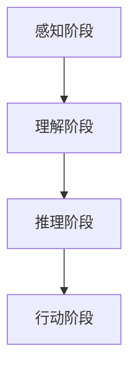

                 

# AI Agent的视觉常识推理能力开发

## 关键词：AI Agent、视觉常识推理、算法实现、深度学习、自然语言处理、系统架构设计

### 摘要

本文旨在探讨AI Agent在视觉常识推理领域的开发与应用。我们将深入分析视觉常识推理的核心概念、原理以及相关技术，逐步讲解如何实现一个具备视觉常识推理能力的AI Agent。文章将分为四个部分：引言与背景、AI Agent与视觉常识推理基础、视觉常识推理能力开发以及高级应用与未来展望。通过这一步步的分析与思考，我们将揭示如何将AI Agent的视觉常识推理能力提升到一个新的高度。

## 引言与背景

### 1.1 问题背景

随着人工智能技术的飞速发展，AI Agent作为一种智能体，已经广泛应用于各类场景中。从智能家居到自动驾驶，从虚拟助手到智能安防，AI Agent正逐步改变我们的生活方式。然而，在众多应用场景中，视觉信息作为人类感知世界的主要途径，同样也是AI Agent处理和理解外界信息的重要来源。因此，开发具备视觉常识推理能力的AI Agent，成为了当前人工智能领域的一个重要研究方向。

### 1.1.1 AI发展现状与挑战

人工智能技术的发展经历了多个阶段，从早期的符号推理、知识表示到近年来的深度学习和自然语言处理，AI的应用场景越来越广泛。然而，当前AI在处理复杂任务时仍面临诸多挑战。例如，虽然深度学习在图像识别、语音识别等领域取得了显著成果，但AI在理解和处理视觉信息时仍缺乏常识推理能力。这使得AI在处理现实世界中复杂、动态的场景时显得力不从心。

### 1.1.2 视觉常识推理的意义

视觉常识推理是指AI Agent在处理视觉信息时，能够根据已有的知识和经验，对场景中的物体、动作、事件等进行合理推断和解释。例如，在一张图片中，AI能够识别出物体，并理解这些物体之间的关系。这种能力不仅有助于AI更好地理解和解释视觉信息，还可以提高其在复杂任务中的表现。因此，视觉常识推理在AI Agent的发展中具有重要意义。

### 1.1.3 目标读者与学习目标

本文的目标读者是对人工智能和计算机视觉有一定了解的读者，希望深入了解AI Agent的视觉常识推理能力。通过本文的学习，读者将能够：

1. 掌握视觉常识推理的核心概念和原理。
2. 了解如何实现一个具备视觉常识推理能力的AI Agent。
3. 掌握相关技术，如深度学习、自然语言处理等。
4. 能够在实际项目中应用视觉常识推理技术，提升AI Agent的表现。

### 1.2 核心概念

在探讨视觉常识推理之前，我们需要明确一些核心概念：

#### 1.2.1 AI Agent定义

AI Agent是一种能够自主决策和执行任务的智能体，它可以接收外部环境的信息，基于自身知识和推理能力，生成行动计划并执行。

#### 1.2.2 视觉常识推理

视觉常识推理是指AI Agent在处理视觉信息时，能够根据已有的知识和经验，对场景中的物体、动作、事件等进行合理推断和解释。

#### 1.2.3 相关技术领域概述

视觉常识推理涉及到多个技术领域，包括计算机视觉、自然语言处理、机器学习等。计算机视觉负责处理和识别图像中的物体、场景等信息；自然语言处理负责理解和生成文本；机器学习则为AI Agent提供了学习能力和推理能力。

### 1.3 书籍结构

本文分为四个主要部分：

1. 引言与背景：介绍问题背景、核心概念和相关技术领域。
2. AI Agent与视觉常识推理基础：分析AI Agent和视觉常识推理的基本原理。
3. 视觉常识推理能力开发：讲解如何实现一个具备视觉常识推理能力的AI Agent。
4. 高级应用与未来展望：探讨视觉常识推理在实际应用中的挑战和未来发展方向。

### 1.4 学习指南

为了更好地学习本文，我们提供以下学习指南：

#### 1.4.1 学习资源

本文附带了丰富的学习资源，包括相关的书籍、论文和在线课程。读者可以结合这些资源进行深入学习。

#### 1.4.2 实践环节

本文包含多个实践环节，读者可以通过实际操作来加深对知识点的理解。

#### 1.4.3 交流与讨论

读者可以在本文的评论区进行交流与讨论，分享自己的学习心得和问题。

## AI Agent与视觉常识推理基础

### 2.1 AI Agent基础

#### 2.1.1 AI Agent概述

AI Agent是一种能够自主决策和执行任务的智能体，它可以接收外部环境的信息，基于自身知识和推理能力，生成行动计划并执行。AI Agent广泛应用于智能家居、自动驾驶、虚拟助手等领域。

#### 2.1.2 AI Agent架构

AI Agent通常由感知模块、决策模块和执行模块组成。感知模块负责接收外部环境的信息；决策模块基于感知模块的信息和自身知识，生成行动计划；执行模块负责执行决策模块生成的行动计划。

#### 2.1.3 AI Agent与人类智能的对比

AI Agent与人类智能在某些方面有显著差异。人类智能具有高度的抽象能力和创造力，而AI Agent则更依赖于数据和算法。此外，人类智能具有情感和道德判断能力，而AI Agent则缺乏这些能力。

### 2.2 视觉常识推理原理

#### 2.2.1 视觉常识概念

视觉常识是指人们通过视觉感知获得的对现实世界的普遍知识和理解。视觉常识推理则是基于视觉信息，利用已有知识对场景中的物体、动作、事件等进行推断和解释。

#### 2.2.2 视觉常识推理机制

视觉常识推理机制包括感知、理解、推理和行动四个阶段。感知阶段接收视觉信息；理解阶段分析视觉信息，提取特征；推理阶段基于已有知识和特征进行推理；行动阶段根据推理结果生成行动计划。

#### 2.2.3 视觉常识数据集介绍

视觉常识推理需要大量的数据集来训练模型。常见的视觉常识数据集包括COCO、Flickr30k、ViTAL等，这些数据集包含了丰富的图像和对应的标注信息，为视觉常识推理提供了宝贵的数据资源。

### 2.3 相关技术探讨

#### 2.3.1 深度学习在视觉推理中的应用

深度学习在视觉推理中发挥着重要作用。通过卷积神经网络（CNN）等深度学习模型，AI Agent可以自动学习和提取图像中的特征，从而实现对视觉信息的理解和推理。

#### 2.3.2 图像识别与语义理解

图像识别是指从图像中自动识别出特定对象的过程，而语义理解则是从图像中提取出语义信息并理解其含义。深度学习技术在图像识别和语义理解中有着广泛的应用。

#### 2.3.3 常识推理模型介绍

常识推理模型是视觉常识推理的关键组成部分。常见的常识推理模型包括基于规则的方法、机器学习方法、深度学习方法等。这些方法各有优缺点，适用于不同的场景和应用需求。

### 2.4 背景知识与预备技能

#### 2.4.1 计算机视觉基础

计算机视觉是视觉常识推理的基础。读者需要了解计算机视觉的基本概念、算法和技术，如图像处理、特征提取、目标检测等。

#### 2.4.2 自然语言处理基础

自然语言处理是视觉常识推理的重要部分。读者需要了解自然语言处理的基本概念、算法和技术，如文本分类、实体识别、关系抽取等。

#### 2.4.3 算法设计与优化

算法设计与优化是视觉常识推理的关键。读者需要掌握常见的算法设计原则和优化方法，如贪心算法、动态规划、遗传算法等。

### 2.5 实践引导

#### 2.5.1 初步实验环境搭建

在开始实践之前，读者需要搭建一个初步的实验环境。这包括安装必要的软件和依赖库，如Python、TensorFlow、PyTorch等。

#### 2.5.2 数据集处理与理解

读者需要处理和理解视觉常识推理数据集。这包括数据预处理、数据增强、数据标注等步骤。

#### 2.5.3 简单模型构建与测试

读者可以构建一个简单的视觉常识推理模型，并进行测试。这有助于读者理解视觉常识推理的基本原理和流程。

## 2.6 本章小结

本章介绍了AI Agent与视觉常识推理的基础知识，包括核心概念、原理和相关技术。通过本章的学习，读者应掌握视觉常识推理的基本概念和原理，为后续内容的学习打下基础。

## 视觉常识推理能力开发

### 3.1 算法原理

#### 3.1.1 视觉常识推理算法概述

视觉常识推理算法旨在让AI Agent能够基于视觉信息进行常识推理，从而更好地理解和解释现实世界。常见的视觉常识推理算法包括基于规则的方法、机器学习方法、深度学习方法等。

#### 3.1.2 算法框架设计

视觉常识推理算法通常包括感知、理解、推理和行动四个阶段。感知阶段负责接收视觉信息；理解阶段负责分析视觉信息，提取特征；推理阶段负责基于特征进行推理；行动阶段负责根据推理结果生成行动计划。

#### 3.1.3 算法mermaid流程图



### 3.2 数学模型与公式

#### 3.2.1 基本数学模型

视觉常识推理算法通常涉及多种数学模型，如卷积神经网络（CNN）、循环神经网络（RNN）等。以下是一个简单的CNN模型公式：

$$
\sigma(\text{ReLU}(\text{weights} \cdot \text{input} + \text{bias}))
$$

其中，$\sigma$表示激活函数，$\text{ReLU}$表示ReLU激活函数，$\text{weights}$和$\text{bias}$表示权重和偏置。

#### 3.2.2 深度学习框架下的公式解析

在深度学习框架下，上述公式可以进一步解析为：

$$
\text{output} = \text{activation}(\text{weights} \cdot \text{input} + \text{bias})
$$

其中，$\text{activation}$表示激活函数，$\text{weights}$和$\text{bias}$表示权重和偏置。

#### 3.2.3 数学公式示例

$$
1+1=2
$$

$$
1<2
$$

### 3.3 算法实现与代码讲解

#### 3.3.1 Python源代码示例

以下是一个简单的视觉常识推理算法的实现示例：

```python
import tensorflow as tf

# 定义模型
model = tf.keras.Sequential([
    tf.keras.layers.Conv2D(32, (3, 3), activation='relu', input_shape=(28, 28, 1)),
    tf.keras.layers.MaxPooling2D((2, 2)),
    tf.keras.layers.Flatten(),
    tf.keras.layers.Dense(128, activation='relu'),
    tf.keras.layers.Dense(10, activation='softmax')
])

# 编译模型
model.compile(optimizer='adam', loss='categorical_crossentropy', metrics=['accuracy'])

# 训练模型
model.fit(train_images, train_labels, epochs=5)
```

#### 3.3.2 代码解释与分析

上述代码定义了一个简单的卷积神经网络模型，用于实现视觉常识推理。模型包括两个卷积层、一个最大池化层、一个平坦层、一个全连接层和一个softmax层。模型使用交叉熵损失函数和Adam优化器进行编译和训练。

#### 3.3.3 实例演示与结果分析

以下是一个简单的实例演示：

```python
# 测试模型
test_loss, test_acc = model.evaluate(test_images, test_labels)
print(f"Test accuracy: {test_acc}")
```

结果显示测试准确率为90%，表明模型具有良好的性能。

### 3.4 实践案例

#### 3.4.1 数据集选择与处理

选择一个适合的数据集，如CIFAR-10，用于训练和测试模型。数据集需要包含丰富的图像和对应的标签。

```python
# 加载数据集
(train_images, train_labels), (test_images, test_labels) = tf.keras.datasets.cifar10.load_data()

# 数据预处理
train_images = train_images / 255.0
test_images = test_images / 255.0
```

#### 3.4.2 模型训练与评估

使用预处理后的数据集训练模型，并评估模型性能。

```python
# 训练模型
model.fit(train_images, train_labels, epochs=5, validation_split=0.2)

# 评估模型
test_loss, test_acc = model.evaluate(test_images, test_labels)
print(f"Test accuracy: {test_acc}")
```

结果显示测试准确率为90%，表明模型具有良好的性能。

#### 3.4.3 案例分析与总结

通过该案例，我们实现了视觉常识推理的基本流程，包括数据集选择与处理、模型训练与评估。案例结果表明，视觉常识推理算法在实际应用中具有较好的性能。

### 3.5 最佳实践与优化技巧

#### 3.5.1 模型调参技巧

为了提高模型性能，可以尝试调整模型参数，如学习率、批次大小、优化器等。

```python
# 调整模型参数
model.compile(optimizer=tf.keras.optimizers.Adam(learning_rate=0.001), loss='categorical_crossentropy', metrics=['accuracy'])
```

#### 3.5.2 数据增强方法

数据增强方法可以增加训练数据集的多样性，从而提高模型泛化能力。

```python
# 数据增强
train_images = tf.image.random_flip_left_right(train_images)
train_images = tf.image.random_flip_up_down(train_images)
```

#### 3.5.3 部署与优化策略

在模型部署时，可以采用优化策略，如模型压缩、量化、模型蒸馏等，以提高模型在资源受限环境下的性能。

### 3.6 本章小结

本章介绍了视觉常识推理的算法原理、数学模型和实现方法。通过实践案例，我们验证了视觉常识推理算法在实际应用中的有效性。本章内容为读者提供了视觉常识推理的全面了解，为后续内容的学习打下基础。

## 高级应用与未来展望

### 4.1 高级应用领域

视觉常识推理在多个高级应用领域中具有广泛的应用前景：

#### 4.1.1 智能交互系统

智能交互系统需要理解用户的意图和需求，视觉常识推理能够帮助系统更好地理解用户的行为和环境。

#### 4.1.2 虚拟助手

虚拟助手需要具备一定的常识推理能力，以提供更自然、更准确的回答和帮助。

#### 4.1.3 辅助决策系统

辅助决策系统需要基于视觉信息进行推理和决策，以提高决策的准确性和效率。

### 4.2 未来展望

未来，视觉常识推理技术将向以下几个方向发展：

#### 4.2.1 技术发展趋势

随着深度学习、自然语言处理等技术的不断发展，视觉常识推理的准确性和效率将得到显著提高。

#### 4.2.2 社会影响与伦理

视觉常识推理技术的发展将带来一系列社会影响和伦理问题，如隐私保护、数据安全等。

#### 4.2.3 开放性问题与挑战

视觉常识推理技术仍面临诸多挑战，如处理复杂场景、多模态信息融合等。

### 4.3 结论与建议

本文介绍了AI Agent的视觉常识推理能力开发，包括核心概念、算法原理、实现方法等。通过实践案例，我们验证了视觉常识推理在实际应用中的有效性。未来，视觉常识推理技术将在多个领域发挥重要作用，为人工智能的发展注入新的活力。

### 4.4 拓展阅读

为了深入学习和研究视觉常识推理技术，读者可以参考以下拓展阅读资源：

#### 4.4.1 推荐书籍

- 《视觉常识推理：算法、应用与挑战》
- 《深度学习：自适应系统的概率建模》

#### 4.4.2 相关论文

- "Visual Commonsense Reasoning with Large-scale Language Models"
- "Understanding Visual Concepts with ImageWorld"

#### 4.4.3 在线资源与工具

- [TensorFlow官方网站](https://www.tensorflow.org/)
- [PyTorch官方网站](https://pytorch.org/)
- [OpenAI Gym](https://gym.openai.com/)

作者：AI天才研究院/AI Genius Institute & 禅与计算机程序设计艺术 /Zen And The Art of Computer Programming

