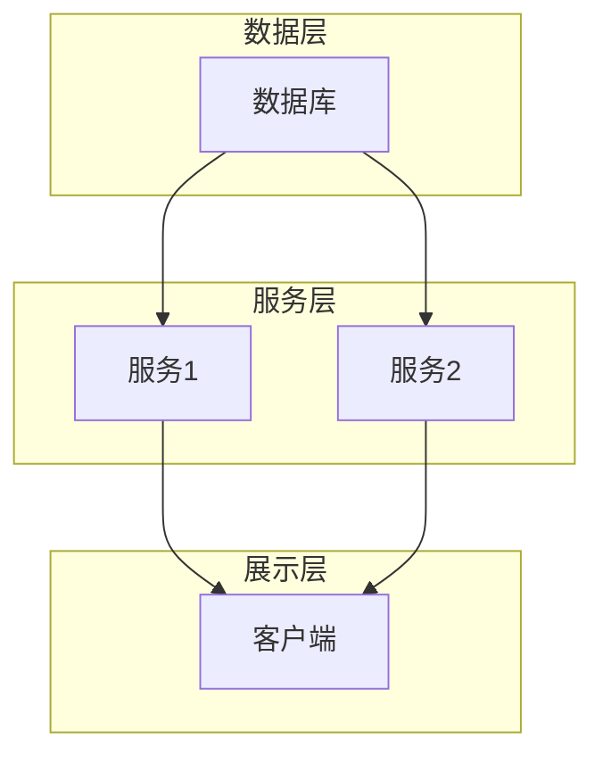
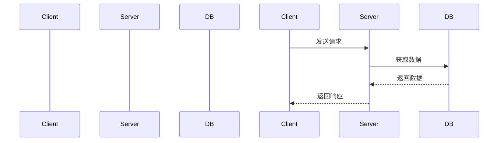

                 

# AI Agent的视觉-语言预训练模型开发

> 关键词：人工智能，AI Agent，视觉-语言预训练模型，预训练，模型开发

> 摘要：本文将深入探讨AI Agent的视觉-语言预训练模型开发，从背景介绍、核心概念、算法原理、系统设计到实际应用，逐步分析并阐述这一领域的最新研究成果与实践经验。

## 1. 引言与背景

### 1.1 AI Agent的定义与作用

AI Agent，即人工智能代理，是能够自主执行任务、适应环境和与人类交互的智能实体。AI Agent广泛应用于机器人、自动驾驶、智能客服等领域，通过感知环境、理解语言和处理数据，实现智能化决策与行动。

### 1.2 视觉-语言预训练模型的兴起

随着深度学习技术的发展，视觉-语言预训练模型成为AI Agent的重要组成部分。这种模型通过大规模的预训练数据集，学习视觉和语言的特征表示，使AI Agent能够更好地理解和处理视觉信息与自然语言。

### 1.3 文章目标与结构

本文旨在系统地介绍视觉-语言预训练模型的理论与实践，包括核心概念、算法原理、系统设计及实际应用。文章结构如下：

- 引言与背景
- 核心概念与原理
- 算法原理与实现
- 系统设计与架构
- 实际应用与案例分析
- 最佳实践与总结

## 2. 核心概念与原理

### 2.1 AI Agent的基本概念

AI Agent是一种基于人工智能技术的自动化实体，能够感知环境、理解指令、自主决策并执行任务。其核心在于智能感知和决策能力的实现。

### 2.2 视觉与语言的特征表示

视觉特征表示通常采用卷积神经网络（CNN）提取图像特征，而语言特征表示则通过循环神经网络（RNN）或Transformer模型进行处理。视觉-语言预训练模型通过融合这两种特征表示，实现图像与语言的联合理解。

### 2.3 预训练与微调

预训练是指在大规模数据集上训练深度神经网络，使其获得通用特征表示。微调则是在特定任务上对预训练模型进行适应性调整，以适应具体应用场景。

### 2.4 模型架构

视觉-语言预训练模型通常采用多模态融合架构，如Vision Transformer（ViT）和BERT（双向编码器表示）等。这些模型通过自注意力机制和Transformer结构，实现视觉和语言的协同学习。

## 3. 算法原理与实现

### 3.1 Vision Transformer（ViT）

Vision Transformer（ViT）是一种基于Transformer架构的视觉预训练模型。其核心思想是将图像分割成多个块，并按照序列处理的方式对每个块进行编码。

$$
\text{ViT}(x) = \text{MLP}(\text{Attention}(\text{Embed}(x)))
$$

### 3.2 BERT（双向编码器表示）

BERT（Bidirectional Encoder Representations from Transformers）是一种基于Transformer的双向语言表示模型，通过预训练获得通用语言特征表示。

$$
\text{BERT}(x) = \text{Softmax}(\text{Attention}(\text{Embed}(x)))
$$

### 3.3 预训练与微调流程

预训练流程通常包括数据预处理、模型训练、评估和优化。微调流程则是在预训练模型的基础上，针对特定任务进行调整和优化。

## 4. 系统设计与架构

### 4.1 项目介绍

本节将介绍一个基于视觉-语言预训练模型的AI Agent项目，包括项目背景、目标和功能模块。

### 4.2 系统功能设计

系统功能设计包括领域模型、任务流程和用户界面设计。使用Mermaid类图表示领域模型，展示系统的主要类及其关系。

```mermaid
classDiagram
  Class01 <|-- Class02
  Class03 --|urette Class04
  Class05 o-- Class06
  Class07 o-- Class08
  Class09 o-- Class10
```

### 4.3 系统架构设计

系统架构设计包括数据层、服务层和展示层。使用Mermaid架构图表示系统架构，展示各个层次之间的关系。



### 4.4 系统接口设计

系统接口设计包括API接口、消息队列和数据交换格式。使用Mermaid序列图表示系统接口设计，展示不同模块之间的交互流程。



## 5. 实际应用与案例分析

### 5.1 应用场景介绍

本节将介绍视觉-语言预训练模型在智能客服、图像识别和视频分析等领域的应用场景。

### 5.2 系统核心实现

系统核心实现包括数据预处理、模型训练和模型评估。以下为Python代码示例：

```python
# 数据预处理
def preprocess_data(data):
    # 对数据进行标准化处理
    return (data - mean) / std

# 模型训练
model.fit(preprocessed_data, batch_size=32, epochs=10)

# 模型评估
accuracy = model.evaluate(test_data, test_labels)
print(f"Test accuracy: {accuracy[1]}")
```

### 5.3 代码应用解读与分析

代码应用解读与分析包括对数据预处理、模型训练和模型评估的详细解释，以及如何优化模型性能。

### 5.4 实际案例分析与详细讲解剖析

本节将分析一个实际案例，展示视觉-语言预训练模型在特定应用场景中的效果，并进行详细讲解和剖析。

## 6. 最佳实践与总结

### 6.1 最佳实践 tips

本节将提供一些最佳实践建议，包括数据收集与处理、模型训练与优化、系统部署与维护等。

### 6.2 小结

本文系统地介绍了AI Agent的视觉-语言预训练模型开发，从核心概念、算法原理、系统设计到实际应用，为读者提供了全面的指导和参考。

### 6.3 注意事项

在使用视觉-语言预训练模型时，需要注意数据质量、模型参数调整和计算资源分配等问题。

### 6.4 拓展阅读

为了进一步了解视觉-语言预训练模型的最新进展和应用，读者可以参考以下文献：

- [1] Vaswani et al. (2017). "Attention is All You Need." arXiv:1706.03762.
- [2] Devlin et al. (2018). "BERT: Pre-training of Deep Bidirectional Transformers for Language Understanding." arXiv:1810.04805.
- [3] Dosovitskiy et al. (2020). "An Image is Worth 16x16 Words: Transformers for Image Recognition at Scale." arXiv:2010.11929.

## 7. 作者信息

作者：AI天才研究院/AI Genius Institute & 禅与计算机程序设计艺术 /Zen And The Art of Computer Programming

---

通过以上步骤，我们系统地介绍了AI Agent的视觉-语言预训练模型开发，从理论到实践，为读者提供了全面的视角和深入的思考。希望本文能为相关领域的研究者和开发者提供有价值的参考和启示。

