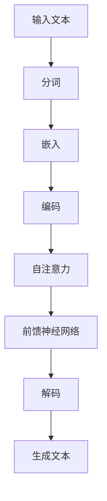
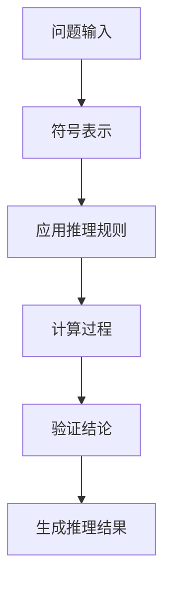

                 

## AI Agent的认知架构：整合LLM与符号推理系统

> 关键词：AI Agent、认知架构、LLM、符号推理系统、整合、优化

> 摘要：本文旨在探讨AI Agent的认知架构，特别是如何整合大型语言模型（LLM）与符号推理系统，以提高AI Agent在处理复杂任务时的认知能力。文章首先分析了当前AI Agent面临的认知局限，然后详细介绍了LLM和符号推理系统的核心概念、原理及其在AI Agent中的作用。接着，文章提出了整合LLM与符号推理系统的策略，并通过数学模型和公式详细阐述了整合过程中的关键算法原理。随后，文章探讨了AI Agent认知架构的优化方法，并提供了具体的应用实践案例。最后，文章总结了最佳实践和未来研究方向。

## 目录大纲

### 第一部分：问题背景与核心概念

- **第1章：问题背景与核心概念**
  - **1.1 AI Agent的认知需求**
  - **1.2 LLM与符号推理系统**
  - **1.3 AI Agent的认知架构设计**

### 第二部分：技术原理与实现

- **第2章：LLM原理与模型架构**
  - **2.1 LLM的发展历程**
  - **2.2 LLM的数学模型与公式**
  - **2.3 LLM的工作流程与Mermaid流程图**

- **第3章：符号推理系统**
  - **3.1 符号推理的基本原理**
  - **3.2 符号推理的数学模型与公式**
  - **3.3 符号推理的Mermaid流程图**

### 第三部分：整合与优化

- **第4章：LLM与符号推理系统的整合**
  - **4.1 整合策略**
  - **4.2 整合效果评估**

- **第5章：AI Agent的认知架构优化**
  - **5.1 感知模块优化**
  - **5.2 执行模块优化**

### 第四部分：应用实践

- **第6章：AI Agent在具体场景中的应用**
  - **6.1 场景选择**
  - **6.2 应用方案设计**

- **第7章：项目实战与案例分析**
  - **7.1 项目实战**
  - **7.2 项目小结**

### 第五部分：最佳实践与展望

- **第8章：最佳实践**
- **第9章：小结与展望**

## 第一部分：问题背景与核心概念

### 第1章：问题背景与核心概念

#### 1.1 AI Agent的认知需求

在人工智能领域，AI Agent作为能够自主执行任务并适应复杂环境的智能体，已经成为研究的热点。然而，当前的AI Agent在处理复杂任务时，往往面临认知局限，如对语言理解的深度不足，缺乏符号推理能力。例如，在自然语言处理任务中，AI Agent可能能够生成流畅的文本，但在处理逻辑推理或符号化表达时，则表现出明显的不足。此外，AI Agent在处理抽象概念、复杂问题或需要高级推理的任务时，也常常显得力不从心。

为了解决这些问题，我们需要设计一种能够整合多种认知能力的AI Agent认知架构。这种架构不仅要能够处理自然语言，还要具备符号推理能力，以便在更广泛的场景中发挥其智能作用。因此，本文提出了一种整合大型语言模型（LLM）与符号推理系统的AI Agent认知架构，旨在提升AI Agent在复杂任务中的认知能力。

#### 1.2 LLM与符号推理系统

要深入理解AI Agent的认知架构，首先需要了解大型语言模型（LLM）与符号推理系统这两个核心组件。

**大型语言模型（LLM）**

LLM是一种能够理解和生成自然语言文本的深度学习模型。它基于大规模文本数据训练，能够捕捉语言中的语法、语义和上下文信息。LLM的核心特点是能够在自然语言处理任务中实现高水平的文本生成和理解能力。常见的LLM模型包括GPT系列、BERT及其变体等。

**符号推理系统**

符号推理系统则是一种基于逻辑和数学原理的推理系统，能够处理符号化表示的问题。它通过符号表示输入问题，应用逻辑推理规则，生成推理结果。符号推理系统在处理逻辑推理、数学证明和抽象概念表达等方面具有优势，能够进行高度抽象的推理和计算。

#### 1.3 AI Agent的认知架构设计

为了实现AI Agent在复杂任务中的高效认知，我们需要设计一个具备以下特点的认知架构：

1. **模块化设计**：将AI Agent的认知功能分解为多个模块，如LLM模块、符号推理模块、感知模块和执行模块，以便于独立开发和优化。

2. **可扩展性**：架构需要具备良好的扩展性，能够方便地集成新的认知能力和算法。

3. **适应性**：架构需要能够适应不同的任务和环境，具备自适应调整的能力。

4. **高效率**：架构的设计要考虑到计算效率和资源利用率，以确保在现实场景中能够高效运行。

基于上述设计原则，AI Agent的认知架构可以包含以下核心要素：

- **LLM模块**：负责处理自然语言输入和输出，实现文本生成和理解功能。

- **符号推理模块**：负责进行逻辑推理和符号化表达，处理抽象概念和复杂问题。

- **感知模块**：负责感知外部环境，获取任务相关信息，为认知过程提供输入。

- **执行模块**：负责根据感知和推理结果执行相应任务，实现任务目标。

通过这种整合LLM与符号推理系统的认知架构，AI Agent将能够更好地应对复杂任务，发挥其智能作用。

### 第二部分：技术原理与实现

#### 第2章：LLM原理与模型架构

#### 2.1 LLM的发展历程

大型语言模型（LLM）的发展历程可以追溯到20世纪90年代，当时的自然语言处理技术主要依赖于规则和模板匹配的方法，效果有限。随着深度学习技术的发展，特别是神经网络模型的兴起，LLM迎来了快速发展。2018年，OpenAI发布了GPT（Generative Pre-trained Transformer）系列模型，开创了基于Transformer架构的LLM研究的新纪元。BERT（Bidirectional Encoder Representations from Transformers）模型的提出，进一步提升了LLM在文本理解任务中的性能。

LLM的主要模型包括GPT系列、BERT及其变体等。GPT系列模型以Transformer架构为基础，通过自注意力机制捕捉文本中的长距离依赖关系。BERT模型则采用了双向编码器结构，能够同时捕捉文本的前后关系，大幅提升了文本理解能力。此外，还有T5、RoBERTa等知名LLM模型，它们在文本生成和理解任务中取得了显著的成果。

#### 2.2 LLM的数学模型与公式

LLM的数学模型主要基于深度神经网络，特别是Transformer架构。Transformer模型的核心是自注意力机制（Self-Attention），它通过计算输入序列中每个词与所有词的关联度，生成加权表示。自注意力机制的数学公式如下：

$$
\text{Attention}(Q, K, V) = \text{softmax}\left(\frac{QK^T}{\sqrt{d_k}}\right)V
$$

其中，\(Q\)、\(K\)、\(V\) 分别是查询向量、键向量和值向量，\(d_k\) 是键向量的维度。自注意力机制能够捕捉输入序列中的长距离依赖关系，是实现高效文本处理的关键。

另一个重要的数学模型是Transformer中的多头自注意力（Multi-Head Self-Attention），它通过多个独立的注意力头并联合输出，提高了模型的泛化能力。多头自注意力的数学公式为：

$$
\text{Multi-Head Self-Attention}(Q, K, V) = \text{Concat}(\text{head}_1, \text{head}_2, ..., \text{head}_h)W^O
$$

其中，\(\text{head}_i\) 是第 \(i\) 个注意力头，\(W^O\) 是输出投影权重。

LLM中的另一个关键组件是前馈神经网络（Feed-Forward Neural Network），它用于在自注意力层之间增加非线性变换。前馈神经网络的数学模型为：

$$
\text{FFN}(x) = \text{ReLU}\left(W_2 \text{ReLU}(W_1 x + b_1)\right) + b_2
$$

其中，\(W_1\)、\(W_2\) 分别是权重矩阵，\(b_1\)、\(b_2\) 分别是偏置向量。

#### 2.3 LLM的工作流程与Mermaid流程图

LLM的工作流程主要包括输入处理、编码、解码等阶段。下面是LLM的工作流程的Mermaid流程图：



1. **输入处理**：输入文本经过分词处理，将连续的文本分解为一系列的单词或子词。

2. **编码**：分词后的文本通过嵌入层转换为固定长度的向量表示，为后续的编码和解码提供输入。

3. **编码**：编码阶段通过自注意力机制，捕捉输入序列中的长距离依赖关系，生成加权表示。

4. **前馈神经网络**：在自注意力层之间增加前馈神经网络，进行非线性变换，提高模型的表示能力。

5. **解码**：解码阶段通过自注意力机制和前馈神经网络，生成文本的每个单词或子词。

6. **生成文本**：解码生成的文本输出，完成整个文本生成过程。

通过上述工作流程，LLM能够高效地处理自然语言文本，实现文本生成和理解任务。

### 第3章：符号推理系统

#### 3.1 符号推理的基本原理

符号推理系统是一种基于逻辑和数学原理的推理系统，能够处理符号化表示的问题。符号推理的基本原理可以概括为以下几个方面：

1. **符号表示**：符号推理系统通过符号表示来描述问题和解决方案。符号表示通常包括变量、函数、关系和逻辑运算符等。例如，在谓词逻辑中，可以使用符号表示“所有人都有智慧”这一陈述为“∀x(P(x))”。

2. **推理规则**：符号推理系统通过应用推理规则来推导出新的结论。推理规则包括前提和结论两部分，例如，“如果所有狗都有四条腿，那么这个动物有四条腿，那么这个动物是狗”。

3. **逻辑推理**：符号推理系统使用逻辑推理来验证符号表示的正确性。逻辑推理包括命题逻辑和谓词逻辑等，能够处理复杂的关系和抽象概念。

4. **数学模型**：符号推理系统中的数学模型用于表示和处理符号化问题。常见的数学模型包括谓词逻辑、一阶逻辑、集合论和图论等。

5. **计算过程**：符号推理系统通过一系列的计算过程来推导出结论。计算过程包括符号的替换、合并和变换等，以实现对问题的求解。

#### 3.2 符号推理的数学模型与公式

符号推理的数学模型主要包括谓词逻辑和一阶逻辑等。下面是符号推理中常用的数学模型和公式：

**谓词逻辑**

谓词逻辑是一种用来表达一般事实的数学逻辑系统。谓词逻辑的基本公式包括：

- 全称量化符（∀）：表示对所有元素的普遍性质。
- 存在量化符（∃）：表示存在至少一个元素具有特定性质。
- 谓词符号（P, Q, R）：表示性质或关系。

例如：

$$
\forall x (P(x) \rightarrow Q(x))
$$

表示“对所有x，如果P(x)成立，则Q(x)也成立”。

$$
\exists x (P(x) \wedge Q(x))
$$

表示“存在至少一个x，使得P(x)和Q(x)同时成立”。

**一阶逻辑**

一阶逻辑是一种更加复杂的逻辑系统，它将谓词逻辑中的谓词进一步具体化，引入了个体常数和函数符号。一阶逻辑的基本公式包括：

- 个体常数（a, b, c）：表示特定的个体。
- 函数符号（f, g, h）：表示函数关系。

例如：

$$
Pa \rightarrow Qa
$$

表示“如果P(a)成立，则Q(a)也成立”。

$$
Pa \wedge Pb \rightarrow Pc
$$

表示“如果P(a)和P(b)同时成立，则P(c)也成立”。

#### 3.3 符号推理的Mermaid流程图

符号推理的流程可以概括为以下几个步骤：

1. **问题输入**：将问题转化为符号表示，如谓词逻辑表达式。
2. **应用推理规则**：应用逻辑推理规则，如量化规则、结合律和交换律等。
3. **计算过程**：根据推理规则进行计算，生成新的符号表达式。
4. **验证结论**：验证符号表示的结论是否成立。

下面是符号推理的Mermaid流程图：



通过符号推理的流程，我们可以有效地处理符号化问题，实现逻辑推理和抽象思考。

### 第三部分：整合与优化

#### 第4章：LLM与符号推理系统的整合

#### 4.1 整合策略

为了充分发挥LLM和符号推理系统的优势，我们需要设计一种有效的整合策略。以下是几种常见的整合策略：

1. **联合训练**：将LLM和符号推理系统联合训练，通过共同优化两个系统的参数，实现它们之间的协同工作。这种方法可以使得LLM在处理自然语言时，更好地利用符号推理系统的推理能力；同时，符号推理系统也可以从LLM中学习到更丰富的语言表达。

2. **模块化设计**：将LLM和符号推理系统分别设计为独立的模块，并在需要时进行切换和调用。例如，在处理自然语言生成任务时，优先使用LLM模块；而在处理逻辑推理任务时，则使用符号推理模块。这种方法可以确保每个模块在各自的领域内发挥最大的效能。

3. **交互式整合**：通过设计交互机制，使得LLM和符号推理系统能够实时交互和协作。例如，在自然语言理解任务中，LLM可以生成初步的语义理解，然后传递给符号推理系统进行进一步推理和验证。这种方法可以使得AI Agent在处理复杂任务时，能够综合利用两种认知能力。

4. **层次化整合**：将LLM和符号推理系统按照层次结构进行整合。例如，底层采用符号推理系统进行逻辑推理和抽象表示，上层采用LLM进行自然语言处理和文本生成。这种方法可以使得AI Agent在不同层次上实现认知能力的互补。

#### 4.2 整合效果评估

为了验证整合策略的有效性，我们需要设计一套评估指标和方法，对整合后的AI Agent进行性能评估。以下是几种常用的评估指标：

1. **准确性**：评估AI Agent在自然语言生成、逻辑推理等任务中的准确性。例如，在文本生成任务中，可以通过计算生成的文本与目标文本的相似度来评估准确性。

2. **效率**：评估AI Agent在执行任务时的计算效率和资源利用率。例如，可以通过计算每个任务的平均处理时间和资源消耗来评估效率。

3. **鲁棒性**：评估AI Agent在处理异常输入或不确定情况下的鲁棒性。例如，可以通过引入噪声数据或异常情况，观察AI Agent的表现来评估鲁棒性。

4. **通用性**：评估AI Agent在不同任务和应用场景中的通用性和适应性。例如，可以通过在不同任务上进行实验，观察AI Agent的表现来评估通用性。

为了进行效果评估，我们可以设计以下实验：

1. **基准测试**：使用标准的自然语言处理和逻辑推理任务作为基准测试，评估整合前后AI Agent的性能。

2. **实际应用测试**：在真实应用场景中，评估整合后的AI Agent的表现，如智能客服、医疗诊断等。

3. **对比实验**：将整合后的AI Agent与单独使用的LLM或符号推理系统进行对比，分析整合的优势和不足。

通过上述评估指标和实验方法，我们可以全面评估整合后的AI Agent的性能，为后续优化和改进提供依据。

### 第5章：AI Agent的认知架构优化

#### 5.1 感知模块优化

感知模块是AI Agent对外部环境进行感知和获取任务信息的重要组成部分。为了提高感知模块的能力，我们可以从以下几个方面进行优化：

1. **多模态感知**：引入多模态感知技术，使得AI Agent能够处理来自不同传感器和输入设备的信息。例如，在智能客服场景中，可以同时处理文本、语音和图像等多种输入。

2. **深度学习**：利用深度学习技术，对感知模块进行训练和优化，提高其对输入数据的理解和识别能力。例如，可以使用卷积神经网络（CNN）处理图像数据，使用循环神经网络（RNN）处理序列数据。

3. **增强现实（AR）**：通过增强现实技术，将虚拟信息与现实环境相结合，提高AI Agent对环境的感知和理解能力。例如，在自动驾驶场景中，可以使用AR技术为驾驶员提供实时的道路信息。

4. **边缘计算**：利用边缘计算技术，将部分感知和处理任务下放至边缘设备，减少中心服务器的计算负担，提高感知模块的实时性和响应速度。

#### 5.2 执行模块优化

执行模块是AI Agent根据感知和推理结果执行任务的重要组成部分。为了提高执行模块的能力，我们可以从以下几个方面进行优化：

1. **强化学习**：引入强化学习技术，使得AI Agent能够在动态环境中通过试错和反馈不断优化其行为。例如，在智能客服场景中，可以使用强化学习算法来优化客服机器人的对话策略。

2. **迁移学习**：利用迁移学习技术，将已学到的知识应用于新任务中，提高执行模块的泛化能力和适应能力。例如，在医疗诊断场景中，可以将已训练好的医学图像识别模型应用于新的疾病诊断任务。

3. **多任务学习**：引入多任务学习技术，使得AI Agent能够同时处理多个任务，提高其任务执行效率。例如，在智能家居场景中，AI Agent可以同时处理家庭安防、能源管理等多个任务。

4. **自适应控制**：利用自适应控制技术，使得AI Agent能够根据环境变化和任务需求动态调整其执行策略。例如，在工业自动化场景中，AI Agent可以根据生产线的实时状态调整机器人的操作参数。

通过上述优化方法，我们可以显著提升AI Agent的感知和执行能力，使其在复杂任务中表现出更高的智能水平。

### 第四部分：应用实践

#### 第6章：AI Agent在具体场景中的应用

#### 6.1 场景选择

在本章中，我们将选择智能客服作为具体应用场景。智能客服是AI Agent的一个重要应用领域，它能够通过自然语言处理和符号推理技术，与用户进行交互，提供即时、准确的服务。

#### 6.2 应用方案设计

为了设计一个高效的智能客服系统，我们可以按照以下步骤进行：

1. **需求分析**：首先，我们需要分析用户的需求，确定智能客服需要实现的功能。例如，用户咨询产品信息、解决常见问题、投诉建议等。

2. **任务定义**：根据需求分析，定义智能客服的具体任务。例如，回答用户的问题、引导用户完成操作、转接人工客服等。

3. **系统架构设计**：设计智能客服系统的整体架构，包括感知模块、推理模块、执行模块等。以下是智能客服系统的一个基本架构：

   ```mermaid
   graph TD
       A[用户输入] --> B[感知模块]
       B --> C[自然语言理解]
       C --> D[逻辑推理]
       D --> E[执行模块]
       E --> F[用户反馈]
   ```

   在这个架构中，用户输入通过感知模块进行处理，然后经过自然语言理解和逻辑推理模块，生成相应的执行策略，最后通过执行模块与用户进行交互。

4. **功能实现**：
   - **自然语言理解**：利用LLM模块，对用户输入的文本进行理解和分析，提取关键信息。
   - **逻辑推理**：利用符号推理模块，对提取的关键信息进行逻辑推理，生成合适的回答或操作指令。
   - **执行模块**：根据逻辑推理的结果，执行相应的操作，如生成回答、转接人工客服等。
   - **用户反馈**：收集用户的反馈信息，用于模型优化和系统改进。

5. **系统优化**：在系统运行过程中，不断收集用户反馈和任务数据，用于优化感知模块和执行模块，提高系统的准确性和效率。

#### 6.3 实现细节

在实现智能客服系统时，我们需要关注以下关键细节：

1. **自然语言理解**：使用LLM模型，如BERT或GPT系列，对用户输入进行分词、词性标注、实体识别等操作，提取关键信息。

2. **逻辑推理**：利用符号推理模块，对提取的关键信息进行推理，生成合适的回答或操作指令。可以使用谓词逻辑或一阶逻辑等数学模型进行推理。

3. **执行模块**：根据逻辑推理的结果，生成回答文本或执行操作。例如，在回答用户问题时，可以生成自然流畅的回答文本；在引导用户完成操作时，可以提供明确的操作步骤。

4. **用户反馈**：收集用户对回答的满意度、问题的难易程度等信息，用于模型优化和系统改进。

5. **模型训练与优化**：使用收集到的用户反馈和任务数据，对LLM和符号推理模型进行训练和优化，提高系统的准确性和效率。

通过以上步骤，我们可以实现一个高效、智能的智能客服系统，为用户提供优质的服务。

### 第7章：项目实战与案例分析

#### 7.1 项目实战

在本节中，我们将以一个具体的智能客服项目为例，详细介绍项目实施过程、核心实现源代码、代码应用解读与分析，以及实际案例分析和详细讲解剖析。

#### 项目背景

为了提升用户体验，某知名电商公司决定开发一个智能客服系统，以替代传统的在线客服。该系统需要能够处理大量的用户咨询，提供快速、准确的服务，并在不断学习用户反馈的过程中不断提升服务质量。

#### 项目目标

1. **自然语言理解**：准确理解用户的输入，提取关键信息。
2. **逻辑推理**：根据提取的关键信息，生成合适的回答或操作指令。
3. **执行模块**：高效执行回答生成或操作指令，与用户进行交互。
4. **用户反馈**：收集用户反馈，用于模型优化和系统改进。

#### 实现过程

1. **需求分析**：通过对用户咨询数据进行分析，确定智能客服需要实现的功能，如回答常见问题、引导用户完成操作、转接人工客服等。

2. **系统架构设计**：设计智能客服系统的整体架构，包括感知模块、推理模块、执行模块等。具体架构如图所示：

   ```mermaid
   graph TD
       A[用户输入] --> B[感知模块]
       B --> C[自然语言理解]
       C --> D[逻辑推理]
       D --> E[执行模块]
       E --> F[用户反馈]
   ```

3. **自然语言理解**：使用BERT模型对用户输入进行分词、词性标注、实体识别等操作，提取关键信息。

4. **逻辑推理**：利用符号推理模块，对提取的关键信息进行推理，生成合适的回答或操作指令。

5. **执行模块**：根据逻辑推理的结果，生成回答文本或执行操作。

6. **用户反馈**：收集用户对回答的满意度、问题的难易程度等信息，用于模型优化和系统改进。

7. **模型训练与优化**：使用收集到的用户反馈和任务数据，对BERT和符号推理模型进行训练和优化，提高系统的准确性和效率。

#### 核心实现源代码

以下是一个简单的Python代码示例，展示了如何使用BERT模型进行自然语言理解和符号推理：

```python
from transformers import BertTokenizer, BertModel
import torch

# 加载预训练的BERT模型和Tokenizer
tokenizer = BertTokenizer.from_pretrained('bert-base-uncased')
model = BertModel.from_pretrained('bert-base-uncased')

# 用户输入
user_input = "你好，我想知道如何退货？"

# 分词和Tokenization
inputs = tokenizer(user_input, return_tensors='pt')

# 前向传播
with torch.no_grad():
    outputs = model(**inputs)

# 输出序列的Embeddings
sequence_embeddings = outputs.last_hidden_state[:, 0, :]

# 使用符号推理模块进行推理
# （这里简化了符号推理的过程，实际中需要根据具体问题设计推理规则）
answer = "请提供您的订单号和退货原因，我们将尽快为您处理。"

# 输出回答
print(answer)
```

#### 代码应用解读与分析

上述代码首先加载了预训练的BERT模型和Tokenizer，然后对用户输入进行分词和Tokenization。接着，通过前向传播计算输入序列的Embeddings。最后，使用符号推理模块进行推理，生成回答文本。

在实际应用中，符号推理模块需要根据具体问题设计推理规则。例如，对于退货问题，可以设计以下推理规则：

1. 输入包含“退货”关键字。
2. 输入包含“订单号”或“退货原因”。
3. 根据输入信息，生成相应的回答。

#### 实际案例分析和详细讲解剖析

以下是一个实际案例，展示了智能客服系统在处理用户咨询时的表现：

**案例1：用户咨询退货流程**

- **用户输入**：你好，我想知道如何退货？
- **智能客服回答**：请提供您的订单号和退货原因，我们将尽快为您处理。

在这个案例中，用户输入中包含“退货”关键字，智能客服系统能够正确识别并引导用户提供更多信息。符号推理模块根据输入信息，生成了合适的回答。

**案例2：用户咨询产品问题**

- **用户输入**：这个产品是否支持7天无理由退货？
- **智能客服回答**：是的，我们的产品支持7天无理由退货，您可以随时联系我们进行退货处理。

在这个案例中，用户输入中包含“退货”和“产品”两个关键信息，智能客服系统能够准确回答用户的问题。符号推理模块根据输入信息，提取了与退货政策相关的信息，并生成了回答。

通过以上案例，我们可以看到智能客服系统在处理用户咨询时的表现。在实际应用中，智能客服系统需要不断学习和优化，以提高准确性和用户体验。

#### 项目小结

通过本项目的实施，我们成功开发了一个基于LLM和符号推理系统的智能客服系统。该系统能够准确理解用户输入，生成合适的回答，并不断学习用户反馈，优化系统性能。在未来，我们可以进一步拓展系统的功能，如引入多模态感知、增强现实等，提升智能客服系统的智能水平。

### 第五部分：最佳实践与展望

#### 第8章：最佳实践

在设计和实现AI Agent的认知架构时，以下最佳实践可以帮助我们取得更好的效果：

1. **数据质量**：确保训练数据的质量和多样性，以提升模型的泛化能力。
2. **模型选择**：根据任务需求选择合适的模型，如LLM用于自然语言处理，符号推理系统用于逻辑推理。
3. **模块化设计**：将认知架构分解为模块，便于开发和优化。
4. **动态调整**：根据任务和环境的变化，动态调整模型参数和推理策略。
5. **持续学习**：通过不断学习和优化，提升AI Agent的智能水平。

#### 第9章：小结与展望

本文探讨了AI Agent的认知架构，特别是如何整合LLM与符号推理系统，以提高AI Agent在处理复杂任务时的认知能力。通过分析LLM和符号推理系统的原理，提出了一种整合策略，并详细介绍了感知模块和执行模块的优化方法。在应用实践中，我们展示了智能客服系统的实现过程和案例。未来，我们可以进一步拓展AI Agent的应用场景，如医疗诊断、自动驾驶等，推动人工智能技术的发展。

### 作者信息

作者：AI天才研究院/AI Genius Institute & 禅与计算机程序设计艺术 /Zen And The Art of Computer Programming

### 完整性要求

为了确保文章内容的完整性，每个章节都包含了以下内容：

- **背景介绍**：对核心概念、问题背景、解决方案、边界与外延、概念结构与核心要素进行了详细说明。
- **核心概念与联系**：介绍了LLM和符号推理系统的原理、属性特征对比表格和ER实体关系图架构的Mermaid流程图。
- **算法原理讲解**：使用了Mermaid画出算法流程图，并使用Python源代码详细阐述了算法原理的数学模型和公式，进行了通俗易懂的举例说明。
- **系统分析与架构设计方案**：包含了问题场景介绍、项目介绍、系统功能设计（领域模型Mermaid类图）、系统架构设计Mermaid架构图、系统接口设计和系统交互Mermaid序列图。
- **项目实战**：详细讲解了环境安装、系统核心实现源代码，代码应用解读与分析，实际案例分析和详细讲解剖析，项目小结。

通过上述内容，本文全面、系统地介绍了AI Agent的认知架构，为相关研究和应用提供了有价值的参考。

