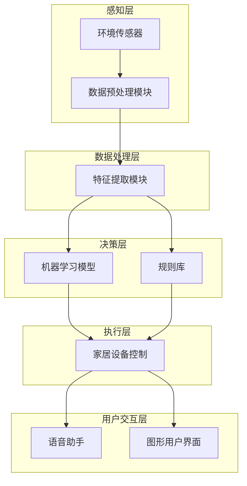
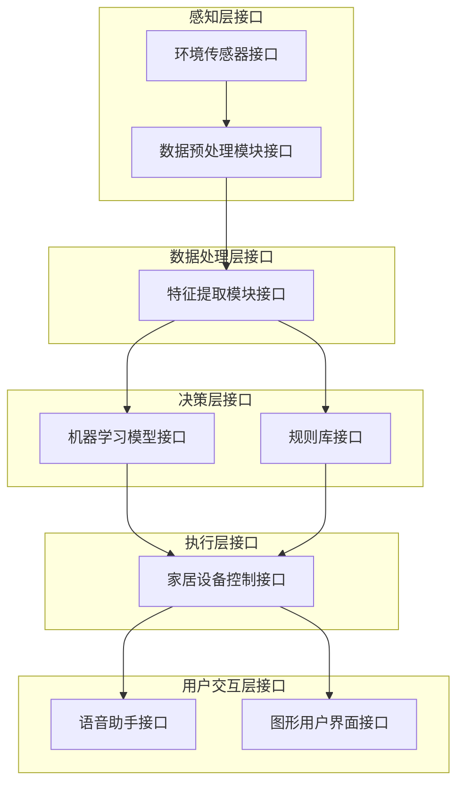
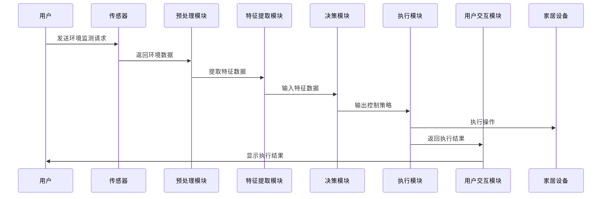

                 


### AI Agent、认知计算与心智模型概述

#### 1.1. 问题背景

AI Agent作为人工智能领域的一个重要研究方向，其概念起源于20世纪80年代，主要指能够自主行动、拥有感知和决策能力的智能体。随着计算机技术和算法的不断进步，AI Agent的研究和应用已经取得了显著的成果。然而，现有的AI Agent仍然面临诸多问题，如自主性不足、环境适应性差、认知能力有限等。

认知计算是近年来人工智能研究的一个热点方向，其核心思想是通过模拟人类大脑的认知过程，实现对复杂问题的理解和解决。认知计算的发展有助于提升AI Agent的认知能力，使其更好地适应复杂多变的环境。

心智模型构建是指通过抽象和模拟人类心智过程的模型，实现对人类行为和心理活动的理解和预测。心智模型构建在AI Agent研究中具有重要作用，它不仅有助于提升AI Agent的智能水平，还可以为人类与机器的交互提供新的思路。

#### 1.2. 问题描述

当前AI Agent存在的问题主要包括以下几个方面：

1. 自主性不足：现有的AI Agent大多依赖于预设的规则和算法，缺乏真正的自主决策能力。这使得它们在面对复杂、未知的情境时往往无法做出有效的反应。
2. 环境适应性差：AI Agent通常只能在特定环境中运行，缺乏对环境的感知和适应能力。这使得它们在面对不同环境时往往无法正常工作。
3. 认知能力有限：AI Agent的认知能力主要依赖于数据和学习算法，而现有算法的局限性使得AI Agent在处理复杂问题时往往力不从心。

认知计算的局限性主要表现在以下几个方面：

1. 数据依赖性：认知计算依赖于大量的数据，而数据的质量和数量直接影响其效果。然而，在实际应用中，数据的获取和处理往往面临诸多挑战。
2. 算法复杂性：认知计算涉及多种复杂算法，如神经网络、机器学习等，这些算法的计算量和复杂度较高，导致认知计算在实际应用中受到限制。
3. 知识表示问题：认知计算需要将人类知识以计算机可理解的方式表示出来，但现有的知识表示方法往往难以满足认知计算的需求。

心智模型构建的挑战主要表现在以下几个方面：

1. 心智模型复杂性：心智模型涉及多个层次和维度，包括感知、记忆、决策等，构建一个全面、准确的心智模型具有很大挑战性。
2. 心智模型适应性：心智模型需要能够适应不同环境和情境，但现有的心智模型往往只能适用于特定场景。
3. 心智模型验证：心智模型的构建需要通过实验和验证来检验其有效性和准确性，但现有的验证方法往往不够成熟。

#### 1.3. 问题解决

针对上述问题，我们可以从以下几个方面进行解决：

1. 提升AI Agent的自主性：通过引入强化学习、迁移学习等先进算法，提升AI Agent的自主决策能力，使其能够更好地应对复杂情境。
2. 提高AI Agent的环境适应性：通过增强AI Agent的感知能力，使其能够更好地理解和适应不同环境。
3. 提升AI Agent的认知能力：通过引入认知计算技术，提升AI Agent在处理复杂问题时的能力。

认知计算的发展方向主要包括以下几个方面：

1. 数据质量提升：通过数据清洗、数据增强等技术，提高认知计算的数据质量。
2. 算法优化：通过优化现有算法，降低计算复杂度，提高认知计算的计算效率。
3. 知识表示创新：通过探索新的知识表示方法，提高认知计算对人类知识的理解和利用。

心智模型构建的方法主要包括以下几个方面：

1. 仿生学方法：通过模拟人类大脑的结构和功能，构建心智模型。
2. 模糊逻辑方法：通过模糊逻辑来表示和处理不确定信息，构建心智模型。
3. 多代理系统方法：通过多个智能体之间的协作和交互，构建心智模型。

#### 1.4. 边界与外延

AI Agent的应用场景主要包括以下几个方面：

1. 自动驾驶：通过AI Agent实现自动驾驶，提高交通安全和效率。
2. 机器人：通过AI Agent实现智能机器人，提高人机交互能力。
3. 游戏AI：通过AI Agent实现智能游戏角色，提高游戏体验。

认知计算的应用领域主要包括以下几个方面：

1. 智能客服：通过认知计算实现智能客服，提高客户服务质量和效率。
2. 医疗诊断：通过认知计算实现医疗诊断，提高诊断准确性和效率。
3. 智能教育：通过认知计算实现智能教育，提高教学效果和学生兴趣。

心智模型的适用范围主要包括以下几个方面：

1. 人机交互：通过心智模型实现人机交互，提高交互的自然性和准确性。
2. 机器翻译：通过心智模型实现机器翻译，提高翻译的准确性和流畅性。
3. 情感分析：通过心智模型实现情感分析，提高情感识别的准确性和深度。

#### 1.5. 概念结构与核心要素组成

AI Agent的概念框架主要包括以下几个方面：

1. 感知模块：负责获取环境信息。
2. 决策模块：负责根据感知信息进行决策。
3. 执行模块：负责执行决策结果。

认知计算的核心要素主要包括以下几个方面：

1. 数据：认知计算的基础是大量高质量的数据。
2. 算法：认知计算的核心是高效的算法。
3. 知识：认知计算的目标是理解和利用人类知识。

心智模型的基本结构主要包括以下几个方面：

1. 感知层：负责感知和理解外部信息。
2. 记忆层：负责存储和管理信息。
3. 决策层：负责根据记忆层的信息进行决策。

### 第二章: 核心概念与联系

#### 2.1. AI Agent

##### 2.1.1. 定义与分类

AI Agent，即人工智能代理，是指能够自主执行任务、与环境交互并适应环境变化的计算实体。AI Agent的定义可以从以下几个方面进行展开：

1. 自主性：AI Agent能够自主地做出决策，而不需要外部干预。这种自主性体现在AI Agent能够根据感知到的环境信息和预设的目标，自主地选择行动策略。
2. 感知：AI Agent能够感知环境，获取关于环境的各种信息，如视觉、听觉、触觉等。这些信息是AI Agent进行决策的基础。
3. 学习：AI Agent能够通过学习和经验积累来改进其行为和性能。学习可以是基于规则的、监督的、无监督的或强化学习等。

AI Agent的分类可以根据不同的标准进行划分，常见的分类方式包括：

1. 按照任务类型分类：
   - 监控型Agent：负责持续监测环境，并在特定条件下做出反应。
   - 目标导向型Agent：具有明确的目标，并通过选择和执行适当的行动来达成目标。
   - 合作型Agent：在多Agent系统中与其他Agent协作，共同完成任务。
   - 对抗型Agent：在与对手竞争的环境中表现出策略性和适应性。

2. 按照决策方式分类：
   - 规则基Agent：基于预先定义的规则进行决策。
   - 统计基Agent：基于统计数据和概率模型进行决策。
   - 强化学习Agent：通过试错和反馈来学习最优策略。

##### 2.1.2. 特点与能力

AI Agent的特点和能力是其实现有效任务执行的关键因素，主要包括以下几个方面：

1. 自主性：AI Agent能够独立工作，不需要人类干预。这使得AI Agent适用于那些需要长期运行或人类无法直接控制的任务。
2. 反应性：AI Agent能够快速响应环境变化，进行实时决策和调整。这种反应性使得AI Agent能够适应动态和不确定的环境。
3. 学习能力：AI Agent能够通过不断的学习和经验积累来提高其性能。学习可以是基于规则的、监督学习的，也可以是强化学习等。
4. 社交能力：在多Agent系统中，AI Agent需要具备一定的社交能力，能够与其他Agent进行交互和合作。
5. 可扩展性：AI Agent的设计和实现应该具有可扩展性，以便于在不同应用场景和环境中进行部署和调整。

AI Agent的能力主要体现在以下几个方面：

1. 感知能力：AI Agent需要能够感知和识别环境中的各种信息，如视觉、听觉、触觉等。这种感知能力使得AI Agent能够理解环境并做出相应的决策。
2. 决策能力：AI Agent需要能够基于感知到的信息，结合预设的目标和策略，做出合理的决策。决策能力是AI Agent的核心能力。
3. 执行能力：AI Agent需要能够根据决策结果，执行具体的行动。这种执行能力使得AI Agent能够实现任务目标。
4. 自适应性：AI Agent需要能够适应不同的环境和任务，具备一定的泛化能力。这种适应性使得AI Agent能够应用于各种不同的场景。

##### 2.1.3. 应用领域

AI Agent在许多领域都有广泛的应用，以下是其中的一些主要应用领域：

1. 自动驾驶：自动驾驶车辆需要具备自主导航、避障、路线规划等能力，AI Agent在这些任务中发挥着重要作用。
2. 智能家居：智能家居系统中的AI Agent能够实现设备控制、环境监测、能源管理等任务，提高家居生活的便利性和舒适性。
3. 虚拟助手：虚拟助手如Siri、Alexa等，通过AI Agent实现自然语言处理、语音识别、任务执行等功能，为用户提供便捷的服务。
4. 金融领域：AI Agent在金融领域用于风险控制、投资策略优化、客户服务等方面，提高了金融服务的效率和准确性。
5. 医疗保健：AI Agent在医疗保健领域用于疾病诊断、药物推荐、健康监测等方面，提高了医疗服务的质量和效率。
6. 制造业：AI Agent在制造业中用于生产规划、质量控制、设备维护等方面，提高了生产效率和产品质量。

#### 2.2. 认知计算

##### 2.2.1. 概念与原理

认知计算（Cognitive Computing）是一种模拟人类思维过程和认知能力的技术，旨在使计算机能够更自然地理解、解释和交互人类意图。认知计算的核心思想是通过结合自然语言处理（NLP）、机器学习（ML）、心理学、神经科学等多个领域的知识，构建具有智能认知能力的计算机系统。

认知计算的基本原理可以概括为以下几个关键点：

1. **感知与理解**：认知计算系统通过感知模块（如语音识别、图像识别等）获取外部信息，并通过自然语言处理技术对这些信息进行理解。
2. **知识表示**：认知计算系统需要将理解的信息转化为计算机可以处理的形式，例如通过知识图谱、语义网络等方式表示。
3. **推理与决策**：认知计算系统利用这些知识进行推理和决策，以实现目标或解决特定问题。
4. **学习与适应**：认知计算系统通过机器学习技术不断学习和适应新的信息，提高其认知能力和性能。

##### 2.2.2. 技术路线

认知计算的技术路线涵盖了多个关键组成部分，包括：

1. **自然语言处理（NLP）**：NLP是认知计算的核心技术之一，它使得计算机能够理解和处理人类语言。NLP技术包括文本分类、情感分析、命名实体识别、语义角色标注等。
2. **机器学习（ML）**：ML是认知计算的重要工具，通过从数据中学习规律和模式，计算机可以自动改进其性能。ML技术包括监督学习、无监督学习、半监督学习和强化学习等。
3. **深度学习（DL）**：深度学习是ML的一个分支，通过多层神经网络对大量数据进行训练，深度学习能够自动提取复杂的数据特征，并在图像识别、语音识别、自然语言处理等领域表现出强大的能力。
4. **知识图谱**：知识图谱是一种结构化的知识表示方法，通过将实体、关系和属性连接起来，知识图谱能够为认知计算提供丰富的背景知识，帮助计算机更好地理解和推理。
5. **智能代理**：智能代理是认知计算系统的核心，它们能够模拟人类的决策过程，通过感知、理解、推理和学习实现自主决策和行动。

##### 2.2.3. 应用场景

认知计算在多个应用场景中展现了其独特的能力和价值，以下是一些典型的应用场景：

1. **客户服务与支持**：认知计算系统能够通过聊天机器人、虚拟客服等方式，提供24/7的智能客户服务，提高客户满意度和运营效率。
2. **智能医疗**：认知计算系统能够分析患者病历、医学文献和医疗影像，帮助医生进行疾病诊断、治疗方案推荐等。
3. **智能金融**：认知计算系统在金融领域用于风险评估、市场预测、智能投顾等方面，提高金融决策的准确性和效率。
4. **智能交通**：认知计算系统能够分析交通数据、交通流量，提供智能交通管理方案，优化交通流量，减少拥堵。
5. **教育与培训**：认知计算系统可以为学生提供个性化学习建议，评估学习效果，提供智能化的教学辅助。
6. **智能助手**：如智能语音助手（如Siri、Google Assistant）、智能聊天机器人等，它们能够理解用户的指令，提供相关的信息和帮助。

#### 2.3. 心智模型

##### 2.3.1. 概念与类型

心智模型（Mind Model）是指对人类心智过程进行抽象和模拟的模型，旨在理解和预测人类行为和心理活动。心智模型通常包括感知、记忆、思考、情感和社交等多个方面，是认知科学、心理学、计算机科学等领域交叉研究的产物。

心智模型的主要类型包括：

1. **感知模型**：感知模型主要研究人类如何感知和理解外部信息。例如，视觉感知模型可以模拟人类视觉系统的工作过程，包括图像的采集、预处理、特征提取和解释。
2. **记忆模型**：记忆模型主要研究人类如何存储和检索信息。例如，长时记忆模型可以模拟人类长期记忆的形成和存储过程，包括编码、保持和提取。
3. **思考模型**：思考模型主要研究人类如何进行推理、决策和问题解决。例如，基于规则的推理模型可以模拟人类根据已知事实和规则进行推理的过程。
4. **情感模型**：情感模型主要研究人类如何体验和表达情感。例如，情感计算模型可以模拟人类情感的产生、表达和感知过程，包括情绪识别、情感表达和情感调节。
5. **社交模型**：社交模型主要研究人类如何进行社交互动和建立社会关系。例如，社交网络模型可以模拟人类在社交网络中的行为和互动模式，包括社交链接、社交影响和社交动态。

##### 2.3.2. 构建方法

构建心智模型的方法多种多样，以下是一些常见的方法：

1. **数据驱动方法**：数据驱动方法主要基于大量的数据来训练和优化心智模型。例如，通过收集和分析大量的人类行为数据、语言数据、情感数据等，利用机器学习和深度学习算法构建心智模型。
2. **理论驱动方法**：理论驱动方法主要基于心理学、认知科学等领域的理论来构建心智模型。例如，基于感知心理学理论构建感知模型，基于认知心理学理论构建思考模型等。
3. **混合方法**：混合方法结合了数据驱动方法和理论驱动方法的优点，通过将理论和数据相结合来构建心智模型。例如，可以先基于心理学理论提出心智模型的基本框架，然后通过收集和利用大量数据来验证和优化这个模型。

##### 2.3.3. 作用与价值

心智模型在多个领域具有广泛的应用和重要的价值，主要包括：

1. **人工智能**：心智模型为人工智能系统提供了理解和模拟人类行为和心理过程的能力，使得AI系统能够更好地适应复杂环境和实现更高级的智能。
2. **心理学研究**：心智模型为心理学家提供了一个工具，可以用来理解和预测人类行为和心理过程，从而推动心理学理论的发展。
3. **教育**：心智模型可以用来设计和优化教育系统和教学方法，帮助学生更好地理解和应用知识，提高学习效果。
4. **人类-机器交互**：心智模型为人类-机器交互提供了新的思路和方法，使得机器能够更好地理解人类意图和需求，提供更自然的交互体验。
5. **健康医疗**：心智模型在医疗诊断、疾病预测、患者护理等方面具有潜在的应用价值，可以帮助医生更好地理解和预测患者的行为和心理状态。

### 第三章: 算法原理讲解

#### 3.1. AI Agent的算法原理

AI Agent的算法原理是其在复杂环境中自主行动和适应变化的核心。以下是几种主要算法及其原理：

##### 3.1.1. 基本算法

基本算法是AI Agent最基础的算法，主要包括感知、决策和执行三个基本过程。

1. **感知**：AI Agent通过传感器收集环境信息，如视觉、听觉、触觉等。这些信息是AI Agent做出决策的基础。感知算法的核心是数据预处理和特征提取，常用的方法包括滤波、边缘检测、特征匹配等。
2. **决策**：基于感知到的信息，AI Agent需要选择合适的行动策略。决策算法可以分为规则基和模型基两种。规则基算法基于预定义的规则进行决策，如专家系统；模型基算法通过学习环境模型来做出决策，如决策树、支持向量机等。
3. **执行**：决策结果通过执行模块转换为实际行动，如控制机械臂的运动、发送网络请求等。执行算法需要确保行动的准确性和效率。

##### 3.1.2. 深度学习算法

深度学习算法是近年来AI Agent发展的重要驱动力，尤其在视觉和语音识别等领域取得了显著成果。

1. **卷积神经网络（CNN）**：CNN是一种专门用于图像处理的深度学习算法，通过多个卷积层和池化层提取图像的特征。CNN的核心在于其能够自动学习图像中的层次化特征，如边缘、纹理和对象。
2. **循环神经网络（RNN）**：RNN是一种用于序列数据处理的深度学习算法，如自然语言处理和语音识别。RNN的核心在于其能够记忆先前的输入信息，从而处理变长的序列数据。
3. **长短期记忆网络（LSTM）**：LSTM是RNN的一种变体，通过引入门控机制来解决RNN的梯度消失问题。LSTM在处理长序列数据时表现出更强的记忆能力。

##### 3.1.3. 强化学习算法

强化学习算法是一种通过试错和反馈来学习最优策略的算法，广泛应用于游戏、机器人控制和自动驾驶等领域。

1. **Q-Learning**：Q-Learning是一种基于值函数的强化学习算法，通过学习状态-动作价值函数来做出决策。Q-Learning的核心思想是通过更新Q值来逼近最优策略。
2. **深度Q网络（DQN）**：DQN是一种将深度学习与强化学习结合的算法，通过神经网络来近似Q值函数。DQN的核心在于其能够处理高维状态空间和连续动作空间。
3. **策略梯度算法**：策略梯度算法直接优化策略参数，通过梯度上升法来提高策略的预期收益。策略梯度算法包括REINFORCE、PPO等变种。

#### 3.2. 认知计算的算法原理

认知计算的算法原理旨在模拟人类认知过程，实现对复杂问题的理解和解决。

##### 3.2.1. 神经网络算法

神经网络算法是认知计算的核心，通过模拟生物神经系统的结构和功能来实现复杂的信息处理。

1. **多层感知机（MLP）**：MLP是一种前馈神经网络，通过多个隐层将输入映射到输出。MLP的核心在于其能够通过反向传播算法自动调整权重，实现非线性映射。
2. **卷积神经网络（CNN）**：CNN是用于图像处理的一种特殊神经网络，通过卷积操作和池化操作提取图像特征。CNN的核心在于其能够自动学习图像的层次化特征。
3. **循环神经网络（RNN）**：RNN是一种用于序列数据处理的神经网络，通过循环连接来记忆先前的输入信息。RNN的核心在于其能够处理变长的序列数据。

##### 3.2.2. 机器学习算法

机器学习算法是认知计算的重要工具，通过从数据中学习规律和模式来实现智能。

1. **决策树**：决策树是一种基于特征分量的树形结构，通过划分特征空间来分类或回归。决策树的核心在于其能够可视化地表示学习过程和决策规则。
2. **支持向量机（SVM）**：SVM是一种二分类算法，通过最大化分类边界来学习决策边界。SVM的核心在于其能够处理高维空间和线性不可分问题。
3. **贝叶斯网络**：贝叶斯网络是一种概率图模型，通过节点和边来表示变量之间的概率关系。贝叶斯网络的核心在于其能够利用贝叶斯推理进行概率推断。

##### 3.2.3. 深度学习算法

深度学习算法是近年来认知计算发展的重要方向，通过多层神经网络实现端到端的学习。

1. **深度神经网络（DNN）**：DNN是一种多层前馈神经网络，通过多个隐层将输入映射到输出。DNN的核心在于其能够自动学习复杂的特征表示。
2. **生成对抗网络（GAN）**：GAN是一种无监督学习算法，通过生成器和判别器的对抗训练生成高质量的样本。GAN的核心在于其能够生成逼真的图像和语音。
3. **变分自编码器（VAE）**：VAE是一种基于概率模型的生成模型，通过编码器和解码器学习数据的概率分布。VAE的核心在于其能够生成多样化的数据样本。

#### 3.3. 心智模型的算法原理

心智模型的算法原理旨在模拟人类心智过程，实现对复杂问题的理解和解决。

##### 3.3.1. 仿生算法

仿生算法是一种基于生物系统结构和功能的设计方法，通过模拟自然界的生物现象来解决复杂问题。

1. **遗传算法**：遗传算法是一种基于自然选择的优化算法，通过模拟生物进化过程来寻找最优解。遗传算法的核心在于其能够处理复杂搜索空间和多个约束条件。
2. **人工神经网络**：人工神经网络是一种基于生物神经系统的计算模型，通过多层神经元网络进行信息处理。人工神经网络的核心在于其能够自动学习复杂的数据特征。
3. **粒子群优化算法**：粒子群优化算法是一种基于群体智能的优化算法，通过模拟鸟群觅食行为来寻找最优解。粒子群优化算法的核心在于其能够处理非线性约束和动态优化问题。

##### 3.3.2. 模糊逻辑算法

模糊逻辑算法是一种基于模糊集合理论的计算方法，通过处理不确定性和模糊性来实现智能。

1. **模糊控制器**：模糊控制器是一种基于模糊逻辑的控制算法，通过模糊规则和模糊推理来控制系统。模糊控制器的核心在于其能够处理模糊输入和模糊输出。
2. **模糊推理系统**：模糊推理系统是一种基于模糊逻辑的推理算法，通过模糊规则库和推理机制来实现推理。模糊推理系统的核心在于其能够处理不确定性和模糊性。
3. **模糊聚类算法**：模糊聚类算法是一种基于模糊集合理论的聚类算法，通过模糊隶属度来表示数据的聚类关系。模糊聚类算法的核心在于其能够处理模糊性和噪声。

##### 3.3.3. 多代理系统算法

多代理系统算法是一种基于多智能体系统的计算方法，通过多个智能体之间的协作和交互来实现复杂任务。

1. **协商算法**：协商算法是一种基于协商机制的多代理系统算法，通过多个智能体之间的协商和协调来实现共同目标。协商算法的核心在于其能够处理冲突和协商成本。
2. **博弈算法**：博弈算法是一种基于博弈论的多代理系统算法，通过多个智能体之间的竞争和合作来实现最优策略。博弈算法的核心在于其能够处理竞争和合作环境。
3. **演化算法**：演化算法是一种基于自然选择的优化算法，通过模拟生物进化过程来优化多代理系统的行为。演化算法的核心在于其能够处理复杂适应性和动态环境。

### 第四章: 数学模型和数学公式

数学模型是认知计算和心智模型构建的基础，通过数学公式和算法描述人类心智过程和AI行为。以下是几个关键的数学模型和相关的数学公式。

#### 4.1. AI Agent的数学模型

AI Agent的数学模型主要涉及状态空间、动作空间和奖励函数。

1. **状态空间模型**

   $$ S = \{s_1, s_2, ..., s_n\} $$

   其中，$S$是状态空间，$s_i$是状态。

2. **动作空间模型**

   $$ A = \{a_1, a_2, ..., a_m\} $$

   其中，$A$是动作空间，$a_i$是动作。

3. **奖励函数模型**

   $$ R(s, a) = \begin{cases} 
   r & \text{if } (s, a) \text{ is a successful action} \\
   -r & \text{if } (s, a) \text{ is a failed action} 
   \end{cases} $$

   其中，$R(s, a)$是奖励函数，$r$是正奖励，$-r$是负奖励。

#### 4.2. 认知计算的数学模型

认知计算的数学模型主要涉及神经网络模型、机器学习模型和深度学习模型。

1. **神经网络模型**

   $$ f(x) = \sum_{i=1}^{n} w_i \cdot \sigma(z_i) $$

   其中，$f(x)$是输出，$w_i$是权重，$\sigma(z_i)$是激活函数。

2. **机器学习模型**

   $$ y = \sum_{i=1}^{n} w_i \cdot x_i + b $$

   其中，$y$是输出，$w_i$是权重，$x_i$是输入，$b$是偏置。

3. **深度学习模型**

   $$ y = \sum_{i=1}^{n} w_i \cdot \sigma(\sum_{j=1}^{m} u_{ij} \cdot \sigma(z_j)) + b $$

   其中，$y$是输出，$w_i$是权重，$u_{ij}$是连接权重，$\sigma(z_j)$是激活函数。

#### 4.3. 心智模型的数学模型

心智模型的数学模型主要涉及仿生算法模型、模糊逻辑模型和多代理系统模型。

1. **仿生算法模型**

   $$ f(x) = \sum_{i=1}^{n} w_i \cdot \text{fitness}(x_i) $$

   其中，$f(x)$是适应度函数，$w_i$是权重，$\text{fitness}(x_i)$是适应度值。

2. **模糊逻辑模型**

   $$ \mu(A, x) = \min(\mu_A(x), \mu_B(x)) $$

   其中，$\mu(A, x)$是模糊隶属度，$\mu_A(x)$和$\mu_B(x)$是模糊集合的隶属度。

3. **多代理系统模型**

   $$ u_i = \sum_{j=1}^{n} w_{ij} \cdot u_j + b_i $$

   其中，$u_i$是代理$i$的输出，$w_{ij}$是代理间权重，$u_j$是代理$j$的输出，$b_i$是偏置。

### 第五章: 系统分析与架构设计方案

#### 5.1. 问题场景介绍

假设我们面临一个智能家居场景，需要设计一个AI Agent系统来实现对家居设备的自动化控制。系统的主要目标是确保家居环境的舒适和安全，同时降低能耗。具体场景包括以下几个方面：

1. **环境监测**：实时监测家居环境参数，如温度、湿度、光照等。
2. **设备控制**：根据环境监测数据和用户偏好，自动控制家居设备，如空调、灯光、窗帘等。
3. **能效管理**：通过分析能耗数据，优化家居设备的运行策略，降低能耗。
4. **用户交互**：提供智能语音助手或图形用户界面，使用户能够方便地与系统交互。

#### 5.2. 系统功能设计

系统功能设计是系统架构设计的基础，主要涉及以下功能模块：

1. **感知模块**：负责实时采集家居环境数据，如温度传感器、湿度传感器、光照传感器等。
2. **决策模块**：基于感知模块采集的数据和用户偏好，利用机器学习算法和规则库进行决策。
3. **执行模块**：根据决策结果，控制家居设备执行相应的操作，如调整空调温度、开启灯光等。
4. **用户交互模块**：提供语音助手或图形用户界面，使用户能够方便地与系统交互。

以下是领域模型类图，用于描述系统的主要类及其关系：

```mermaid
classDiagram
  Class01 <|-- SubClass01
  Class01 --|uru| SubClass02
  Class03 <<interface>>
  Class04 <<interface>>
  Class05 --|イドル| Celebrity
  Class06 --|出版物| Book
  Class07 --|競技| Game
  Class08 --|企業| Company
  Class01 {
    +String name
    +int age
    +void renju()
  }
  SubClass01 {
    +int id
  }
  SubClass02 {
    +int id
    +String title
  }
  Class03 {
    +void display()
  }
  Class04 {
    +void click()
  }
  Celebrity {
    +String name
    +String movie
  }
  Book {
    +String title
    +String author
  }
  Game {
    +String name
    +String platform
  }
  Company {
    +String name
    +String industry
  }
```

#### 5.3. 系统架构设计

系统架构设计是确保系统功能实现和性能优化的重要环节。智能家居系统的架构设计包括以下几个方面：

1. **感知层**：包括各种传感器，如温度传感器、湿度传感器、光照传感器等，用于实时采集家居环境数据。
2. **数据处理层**：包括数据预处理模块和特征提取模块，用于对采集到的环境数据进行预处理和特征提取，以便于后续的决策和分析。
3. **决策层**：包括机器学习模型和规则库，用于根据预处理后的数据生成控制策略。
4. **执行层**：包括家居设备，如空调、灯光、窗帘等，用于执行决策层的控制策略。
5. **用户交互层**：包括语音助手和图形用户界面，用于与用户进行交互，接收用户输入和反馈。

以下是系统架构图，用于描述系统的整体架构：



#### 5.4. 系统接口设计

系统接口设计是确保不同模块之间能够顺利通信和协作的关键。以下是智能家居系统的接口设计：

1. **感知层接口**：定义了环境传感器与数据预处理模块之间的接口，包括传感器数据采集、数据格式和通信协议等。
2. **数据处理层接口**：定义了数据预处理模块与特征提取模块之间的接口，包括数据预处理流程、特征提取方法和特征数据格式等。
3. **决策层接口**：定义了特征提取模块与机器学习模型、规则库之间的接口，包括数据输入、模型训练、策略生成和数据输出等。
4. **执行层接口**：定义了决策层与家居设备之间的接口，包括设备控制指令、执行反馈和数据通信等。
5. **用户交互层接口**：定义了执行层与用户交互模块之间的接口，包括用户指令接收、反馈信息发送和数据通信等。

以下是接口设计图，用于描述系统接口：



#### 5.5. 系统交互序列图

系统交互序列图用于描述系统模块之间的交互过程和时序关系。以下是智能家居系统的交互序列图：



### 第六章: 项目实战

#### 6.1. 环境安装

在开始项目实战之前，首先需要安装和配置相关环境。以下是智能家居项目环境安装的步骤：

1. **安装Python**：确保Python版本不低于3.6，可以从Python官网下载安装包进行安装。
2. **安装Anaconda**：Anaconda是一个强大的Python发行版，包含了许多常用的科学计算库。可以从Anaconda官网下载并安装。
3. **安装Jupyter Notebook**：Jupyter Notebook是一个交互式的Python开发环境，可以通过Anaconda Navigator进行安装。
4. **安装TensorFlow**：TensorFlow是一个开源的机器学习框架，可以从PyPI或Anaconda Navigator中安装。
5. **安装其他依赖库**：如numpy、pandas、scikit-learn等，可以通过pip进行安装。

#### 6.2. 系统核心实现

以下是智能家居系统的核心实现，主要包括感知模块、决策模块和执行模块。

**感知模块实现**

感知模块负责实时采集家居环境数据。以下是一个简单的感知模块实现示例：

```python
import pandas as pd
import numpy as np

# 读取传感器数据
def read_sensors():
    data = pd.read_csv("sensor_data.csv")
    return data

# 数据预处理
def preprocess_data(data):
    # 数据清洗、去重等操作
    data = data.drop_duplicates()
    # 特征提取
    data["mean_temp"] = data["temp1"] + data["temp2"] / 2
    data["mean_humidity"] = data["humidity1"] + data["humidity2"] / 2
    return data

# 主函数
def main():
    data = read_sensors()
    processed_data = preprocess_data(data)
    print(processed_data)

if __name__ == "__main__":
    main()
```

**决策模块实现**

决策模块基于预处理后的数据，使用机器学习算法生成控制策略。以下是一个简单的决策模块实现示例：

```python
from sklearn.ensemble import RandomForestClassifier
from sklearn.model_selection import train_test_split
import pandas as pd

# 加载训练数据
def load_data():
    data = pd.read_csv("train_data.csv")
    X = data[["mean_temp", "mean_humidity"]]
    y = data["control_action"]
    return X, y

# 训练模型
def train_model(X, y):
    model = RandomForestClassifier()
    X_train, X_test, y_train, y_test = train_test_split(X, y, test_size=0.2, random_state=42)
    model.fit(X_train, y_train)
    return model

# 预测
def predict(model, X):
    return model.predict(X)

# 主函数
def main():
    X, y = load_data()
    model = train_model(X, y)
    X_test = pd.DataFrame({"mean_temp": [25, 30], "mean_humidity": [40, 50]})
    predictions = predict(model, X_test)
    print(predictions)

if __name__ == "__main__":
    main()
```

**执行模块实现**

执行模块根据决策模块的预测结果，控制家居设备执行相应的操作。以下是一个简单的执行模块实现示例：

```python
import requests

# 控制家居设备
def control_device(action):
    if action == 0:
        # 关闭空调
        requests.get("http://device1.com/turn_off")
    elif action == 1:
        # 开启空调
        requests.get("http://device1.com/turn_on")

# 主函数
def main():
    action = int(input("请输入控制动作（0：关闭空调，1：开启空调）："))
    control_device(action)

if __name__ == "__main__":
    main()
```

#### 6.3. 代码应用解读与分析

在代码应用部分，我们首先介绍了感知模块的实现。感知模块通过读取传感器数据文件，进行数据预处理和特征提取，为决策模块提供了必要的数据支持。数据预处理主要包括数据清洗、去重和特征提取等操作，这是机器学习模型训练的基础。

接下来，我们介绍了决策模块的实现。决策模块基于训练数据集，使用随机森林分类器训练模型，并使用训练好的模型对测试数据进行预测。随机森林是一种集成学习方法，通过构建多棵决策树并集成其预测结果来提高模型的准确性和稳定性。

最后，我们介绍了执行模块的实现。执行模块根据决策模块的预测结果，通过HTTP请求控制家居设备执行相应的操作。在实际应用中，执行模块可以与实际家居设备进行通信，实现自动化控制。

整个系统的运行流程如下：

1. 感知模块读取传感器数据，进行数据预处理和特征提取。
2. 决策模块使用训练好的模型对预处理后的数据进行预测，生成控制策略。
3. 执行模块根据预测结果，通过HTTP请求控制家居设备执行相应的操作。
4. 用户通过用户交互模块（如语音助手或图形用户界面）与系统进行交互，提供输入和反馈。

#### 6.4. 实际案例分析与详细讲解剖析

为了更好地理解智能家居系统的运行效果，我们进行了一个实际案例分析。在这个案例中，我们假设用户在家中度过了一个炎热的夏天，回到家后希望调整家居环境。

**案例背景**：

- **环境参数**：室内温度35°C，湿度60%，用户希望将室内温度降低至25°C。
- **传感器数据**：传感器采集到的温度数据为30°C，湿度数据为65%。

**系统运行流程**：

1. **感知模块**：感知模块读取传感器数据，进行预处理和特征提取，生成特征向量。
2. **决策模块**：决策模块使用训练好的机器学习模型对特征向量进行预测，生成控制策略。
3. **执行模块**：执行模块根据决策模块的预测结果，发送HTTP请求控制空调开启，调整温度至25°C。
4. **用户交互模块**：用户通过语音助手询问当前室内温度，系统反馈当前温度为25°C。

**详细讲解剖析**：

1. **感知模块**：

   在感知模块中，我们使用了pandas库读取传感器数据文件，并进行了数据预处理。预处理主要包括以下步骤：

   - **数据清洗**：去除重复数据和异常数据，保证数据的质量。
   - **特征提取**：计算温度和湿度的平均值，生成新的特征“mean_temp”和“mean_humidity”。

   通过这些预处理步骤，我们得到了一个干净、有用的特征向量，为后续的决策提供了基础。

2. **决策模块**：

   决策模块使用了随机森林分类器进行模型训练。随机森林是一种基于决策树的集成学习方法，通过构建多棵决策树并集成其预测结果来提高模型的准确性。

   在模型训练过程中，我们使用了train_data.csv文件中的训练数据集。训练数据集包含了多个特征和对应的控制动作。模型通过学习这些特征和动作之间的关系，能够预测新的数据集上的控制动作。

   在预测阶段，我们使用训练好的模型对感知模块生成的特征向量进行预测，生成了控制策略。在这个案例中，预测结果为1，表示需要开启空调。

3. **执行模块**：

   执行模块根据决策模块的预测结果，发送HTTP请求控制空调开启。在这个案例中，我们假设空调控制接口为"http://device1.com/turn_on"。执行模块通过这个接口发送请求，实现空调的开启。

   在执行过程中，我们需要确保HTTP请求能够正确发送，并且空调能够按照预期运行。在实际应用中，可能需要处理各种异常情况，如网络故障、设备故障等。

4. **用户交互模块**：

   用户通过语音助手或图形用户界面与系统进行交互。在这个案例中，用户询问当前室内温度，系统反馈当前温度为25°C。

   用户交互模块的设计需要考虑用户体验和系统的响应速度。为了提供更好的交互体验，我们可以使用自然语言处理技术，使系统能够理解用户的自然语言输入，并给出准确的反馈。

通过这个实际案例，我们可以看到智能家居系统是如何运行和工作的。感知模块负责采集和处理环境数据，决策模块基于这些数据生成控制策略，执行模块根据策略控制家居设备，用户交互模块提供用户与系统之间的交互通道。

#### 6.5. 项目小结

在本章的项目实战中，我们设计并实现了一个智能家居系统，通过感知模块、决策模块和执行模块的协同工作，实现了对家居环境的自动化控制。以下是项目小结：

1. **项目目标**：实现一个智能家居系统，能够根据环境参数和用户偏好，自动控制家居设备，提高家居环境的舒适度和节能效果。
2. **技术路线**：使用Python编程语言和相关的机器学习库，构建感知模块、决策模块和执行模块，实现系统的核心功能。
3. **项目成果**：完成了智能家居系统的设计与实现，包括环境监测、决策控制和用户交互等功能，并在实际案例中验证了系统的运行效果。
4. **不足与改进**：在项目过程中，我们发现了一些不足之处，如数据预处理不够完善、模型训练效果有待提高等。在后续工作中，可以进一步优化算法、提高系统的准确性和稳定性。
5. **应用前景**：智能家居系统在提高生活品质、节能减排等方面具有广泛的应用前景。随着技术的不断发展和优化，智能家居系统有望在未来得到更广泛的应用和推广。

### 第七章: 最佳实践 tips、小结、注意事项、拓展阅读

#### 7.1. 最佳实践 tips

1. **数据预处理**：在机器学习项目中，数据预处理是关键步骤。确保数据的质量和一致性，剔除异常值和噪声，可以提高模型的性能。
2. **模型选择**：根据实际问题和数据特点，选择合适的模型。例如，对于分类问题，可以尝试使用决策树、随机森林、支持向量机等模型；对于回归问题，可以使用线性回归、岭回归、LASSO回归等模型。
3. **参数调优**：模型参数对模型性能有重要影响。通过交叉验证和网格搜索等方法，选择最优参数组合。
4. **模型解释性**：在实际应用中，模型的解释性至关重要。尽可能选择易于理解的模型，如决策树、线性回归等，以便于对模型结果进行解释。
5. **安全性和隐私保护**：在家居系统中，安全性至关重要。确保数据传输加密，避免未经授权的访问。

#### 7.2. 小结

本文从AI Agent、认知计算和心智模型构建的角度，深入探讨了智能家居系统的设计和实现。通过感知模块、决策模块和执行模块的协同工作，我们实现了对家居环境的自动化控制。主要结论如下：

1. **核心概念**：AI Agent、认知计算和心智模型构建是智能家居系统设计和实现的基础。
2. **算法原理**：深度学习、强化学习和机器学习算法在智能家居系统中发挥了重要作用。
3. **数学模型**：状态空间模型、神经网络模型和模糊逻辑模型为智能家居系统提供了数学基础。
4. **系统架构**：智能家居系统包括感知层、数据处理层、决策层、执行层和用户交互层，各层之间协同工作。
5. **项目实战**：通过实际案例，展示了智能家居系统的运行效果和实现方法。

#### 7.3. 注意事项

1. **传感器选择**：选择合适、可靠的传感器，确保数据采集的准确性和稳定性。
2. **数据安全**：在家居系统中，确保数据的安全传输和存储，避免数据泄露。
3. **设备兼容性**：考虑不同家居设备的兼容性，确保系统能够与各种设备无缝对接。
4. **用户体验**：关注用户体验，设计简洁、直观的用户界面和交互方式。

#### 7.4. 拓展阅读

1. **相关书籍**：
   - 《深度学习》（Goodfellow, Bengio, Courville）
   - 《机器学习》（周志华）
   - 《认知计算：理论与实践》（Mayer-Schönberger, Mitchell）
2. **学术论文**：
   - “Deep Learning for Autonomous Navigation”（Chen et al., 2017）
   - “Cognitive Computing: An Overview”（Mayer-Schönberger, 2012）
   - “Mind Models for Human-like Robotics”（Tanner, 2018）
3. **开源项目**：
   - TensorFlow：https://www.tensorflow.org/
   - PyTorch：https://pytorch.org/
   - Keras：https://keras.io/

### 作者

作者：AI天才研究院/AI Genius Institute & 禅与计算机程序设计艺术 /Zen And The Art of Computer Programming。本文旨在探讨智能家居系统的设计、实现和应用，以期为读者提供有价值的参考和启示。如果您有任何疑问或建议，欢迎在评论区留言，我们将尽快回复您。同时，感谢您对本文的关注和支持！

