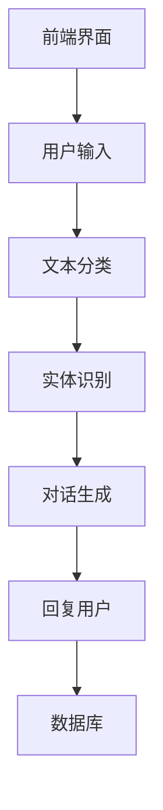
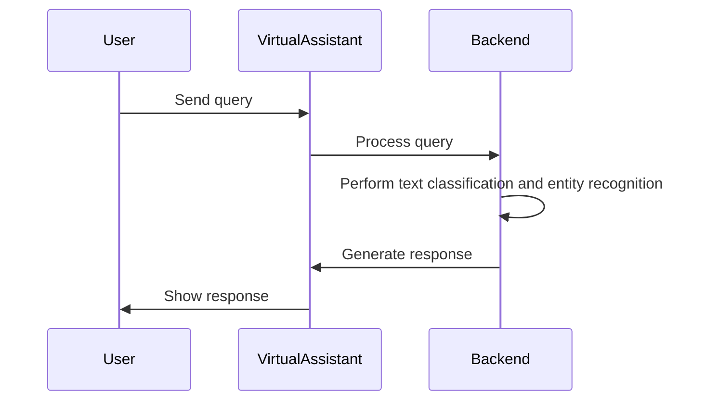
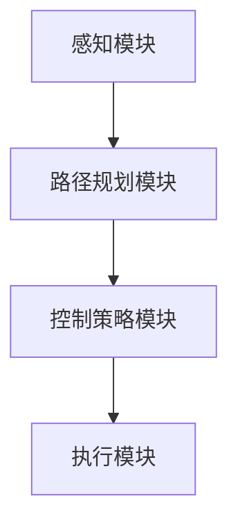
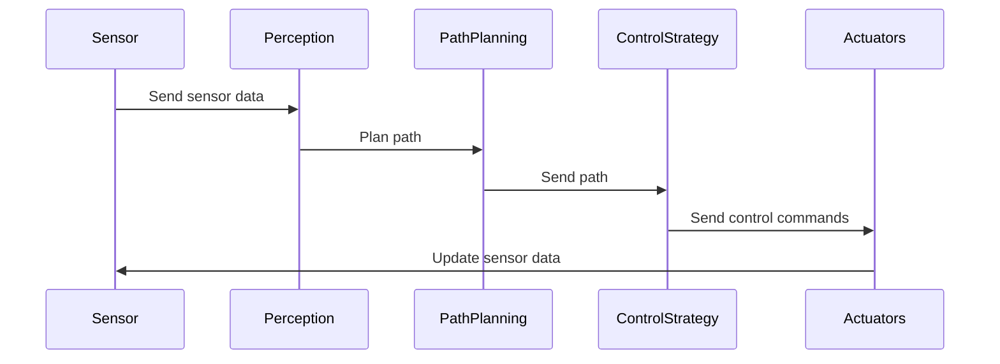
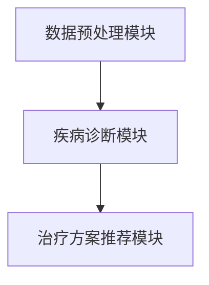
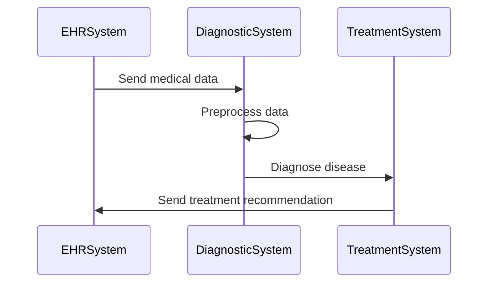

                 

### 引言

#### AI Agent的认知计算模型的重要性

在当今科技飞速发展的时代，人工智能（AI）已经成为驱动社会变革的关键力量。AI Agent，作为人工智能领域的一个重要分支，以其自主性和智能性，受到了越来越多的关注。AI Agent是一种能够模拟人类行为和决策的智能实体，其核心在于构建一个认知计算模型，模拟人类思维过程。

认知计算模型是一种模拟人类大脑信息处理过程的计算模型。它通过整合感知、学习、记忆、推理和决策等过程，实现对复杂环境的理解和响应。设计一个高效的认知计算模型，对于提升AI Agent的性能和智能水平具有重要意义。这不仅能够使AI Agent更好地服务于各行各业，还能够为人类提供更为智能化的解决方案。

本文将围绕AI Agent的认知计算模型展开，深入探讨其设计原理、实现方法及应用实例。我们希望通过本文，使读者对AI Agent的认知计算模型有一个全面、系统的理解。

首先，本文将介绍AI Agent的研究背景和发展现状。接着，我们将详细阐述认知计算模型的基础概念，包括感知、学习、记忆、推理和决策等。在此基础上，本文将探讨模拟人类思维过程的算法原理，如神经网络、机器学习、强化学习等，并使用Mermaid流程图和Python代码进行详细讲解。随后，我们将介绍认知计算模型的设计与实现过程，包括模型设计方法、实现过程和优化与调整。最后，本文将展示认知计算模型在实际中的应用实例，并展望其未来发展趋势和潜在应用领域。

通过这篇文章，我们希望读者能够对AI Agent的认知计算模型有一个全面、深入的理解，从而为今后的研究和工作提供有益的参考。

### AI Agent的基本概念

#### 定义

AI Agent，即人工智能代理，是一种能够模拟人类行为和决策的智能实体。它通过感知环境、学习经验、记忆信息、进行推理和决策，实现对复杂环境的理解和响应。AI Agent的核心在于其自主性和智能性，这使得它们能够承担各种任务，如自动导航、智能客服、自动驾驶等。

AI Agent的定义包含几个关键要素：

1. **感知能力**：AI Agent能够通过传感器获取环境信息，如摄像头、麦克风、激光雷达等。
2. **学习能力**：AI Agent能够通过经验积累和反馈机制不断改进自身的性能。
3. **记忆能力**：AI Agent能够存储和检索与任务相关的信息，以支持推理和决策。
4. **推理能力**：AI Agent能够根据感知到的信息和已有知识，进行逻辑推理和问题求解。
5. **决策能力**：AI Agent能够在不同的行动方案中做出最优选择。

#### 发展历程

AI Agent的发展历程可以追溯到20世纪50年代，当时人工智能领域刚刚兴起。早期的AI Agent主要是基于规则的系统，如专家系统和逻辑推理机。这些系统通过预定义的规则来模拟人类专家的决策过程。

随着计算能力和算法的不断发展，20世纪80年代和90年代，基于知识表示和推理的方法开始兴起。这些方法使得AI Agent能够处理更为复杂的问题，并在医疗诊断、金融分析等领域取得了一定的应用。

进入21世纪，随着深度学习和机器学习的发展，AI Agent的性能得到了显著提升。深度学习模型通过大量数据自动学习特征，使得AI Agent在图像识别、语音识别等领域表现出色。同时，强化学习算法的发展也为AI Agent提供了更加智能的决策能力。

#### 当前研究现状

当前，AI Agent的研究已经取得了许多重要进展。以下是一些关键领域的研究现状：

1. **自然语言处理**：AI Agent在自然语言处理领域表现出色，能够通过语音识别和自然语言理解与人类进行互动。例如，智能客服和虚拟助手已经成为许多企业的重要组成部分。
2. **计算机视觉**：AI Agent在计算机视觉领域也取得了显著进展，能够通过图像识别和目标检测等技术实现复杂任务，如自动驾驶和机器人导航。
3. **强化学习**：强化学习算法使得AI Agent能够在动态和不确定的环境中学习最优策略，从而在游戏、推荐系统等领域取得了重要突破。
4. **跨领域迁移学习**：通过迁移学习，AI Agent能够利用在某一领域的知识迁移到其他领域，从而提高泛化能力。

尽管AI Agent在许多领域已经取得了显著应用，但仍面临一些挑战，如数据隐私、安全性和伦理问题等。未来的研究需要在这些方面取得进一步突破，以实现AI Agent的全面应用。

#### 关键特点与应用场景

AI Agent的关键特点包括：

1. **自主性**：AI Agent能够自主感知环境、学习经验并做出决策，无需人工干预。
2. **灵活性**：AI Agent能够适应不同的环境和任务，具有广泛的适用性。
3. **智能性**：AI Agent通过深度学习和强化学习等技术，具备较高的智能水平。

AI Agent的应用场景非常广泛，以下是一些典型的应用场景：

1. **智能客服**：通过自然语言处理技术，AI Agent能够提供24/7的智能客服服务，提高客户满意度。
2. **自动驾驶**：AI Agent通过计算机视觉和强化学习等技术，实现自主驾驶，提高道路安全。
3. **医疗诊断**：AI Agent通过深度学习和医学知识，辅助医生进行疾病诊断和治疗方案推荐。
4. **智能家居**：AI Agent通过感知和控制家居设备，实现智能化的家居生活。

通过深入了解AI Agent的基本概念、发展历程和当前研究现状，我们可以更好地理解其在各领域的应用潜力。随着技术的不断进步，AI Agent有望在更多场景中发挥重要作用，为人类带来更多便捷和智能化服务。

### 认知计算模型的基础概念

#### 感知与感知模型

感知是认知计算模型的基础，它是指AI Agent通过传感器获取外界信息的过程。感知模型是AI Agent对环境进行感知和解释的关键组件，其性能直接影响AI Agent对环境的理解和响应能力。

**感知模型的核心要素包括**：

1. **传感器**：传感器是感知模型的核心组件，负责获取环境信息。常见的传感器包括摄像头、麦克风、温度传感器、湿度传感器、激光雷达等。
2. **特征提取**：特征提取是将传感器获取的原始数据转换为有用的信息的过程。例如，在计算机视觉中，特征提取可以是将图像分解为边缘、纹理等特征。
3. **感知算法**：感知算法用于处理和解释传感器数据，以提取环境信息。常见的感知算法包括图像识别、语音识别、自然语言处理等。

**感知模型的设计原则**：

1. **准确性**：感知模型需要具有较高的准确性，以确保AI Agent能够正确理解和解释环境信息。
2. **实时性**：感知模型需要具有实时性，以快速响应对环境的变化。
3. **鲁棒性**：感知模型需要具备鲁棒性，以适应不同环境和传感器噪声的影响。

**感知模型的应用实例**：

- **自动驾驶**：自动驾驶系统依赖于感知模型，通过摄像头、激光雷达和雷达等传感器获取道路信息，实现车辆自主导航。
- **智能客服**：智能客服系统通过语音识别技术获取用户语音，并将语音转换为文本，进行自然语言处理，以实现与用户的智能互动。

#### 学习与记忆

学习与记忆是认知计算模型的重要组成部分，它们使AI Agent能够从经验中学习和积累知识，从而提高其智能水平。

**学习过程的核心要素包括**：

1. **数据输入**：数据输入是学习过程的基础，AI Agent通过感知模型获取环境信息，并将其转化为数据输入。
2. **学习算法**：学习算法是学习过程的核心，通过调整模型参数，使模型能够更好地适应输入数据。常见的学习算法包括监督学习、无监督学习和强化学习。
3. **经验积累**：经验积累是学习过程的重要组成部分，AI Agent通过不断学习和调整，积累经验，提高其智能水平。

**记忆模型的核心要素包括**：

1. **记忆存储**：记忆存储是记忆模型的核心组件，用于存储学习过程中的知识。常见的记忆存储方式包括神经网络、数据库和知识图谱等。
2. **记忆检索**：记忆检索是记忆模型的重要组成部分，通过检索存储的知识，实现快速学习和响应。

**学习与记忆的设计原则**：

1. **适应性**：学习与记忆模型需要具有适应性，以适应不同环境和任务的需求。
2. **持续性**：学习与记忆模型需要具有持续性，以保证AI Agent能够长期积累和更新知识。
3. **可靠性**：学习与记忆模型需要具有较高的可靠性，以确保存储的知识准确无误。

**学习与记忆的应用实例**：

- **智能推荐系统**：智能推荐系统通过学习用户的历史行为和偏好，为用户推荐感兴趣的内容。
- **医疗诊断**：医疗诊断系统通过学习大量的医学数据和病例，提高诊断准确率。

#### 推理与决策

推理与决策是认知计算模型的最后环节，通过推理和决策，AI Agent能够对感知到的信息进行逻辑分析和选择最优行动方案。

**推理过程的核心要素包括**：

1. **推理算法**：推理算法是推理过程的核心，用于从已知信息推导出新的结论。常见的推理算法包括逻辑推理、模糊推理和贝叶斯推理等。
2. **知识库**：知识库是推理过程的重要组件，用于存储已知信息。知识库可以通过学习过程不断更新和扩展。
3. **推理规则**：推理规则是推理过程中的指导原则，用于确定如何从已知信息推导出新信息。

**决策过程的核心要素包括**：

1. **决策算法**：决策算法是决策过程的核心，用于从多个行动方案中选出最优方案。常见的决策算法包括基于规则的决策、基于模型的决策和基于数据的决策等。
2. **效用函数**：效用函数是决策过程中的评价指标，用于评估不同行动方案的效果。通过优化效用函数，可以选出最优行动方案。
3. **决策策略**：决策策略是决策过程的具体实施方法，根据不同场景和需求，可以选择不同的决策策略。

**推理与决策的设计原则**：

1. **一致性**：推理与决策过程需要保持一致性，以确保从已知信息推导出的结论是合理的。
2. **效率性**：推理与决策过程需要具有较高的效率性，以快速做出决策。
3. **适应性**：推理与决策过程需要具有适应性，以适应不同环境和任务的需求。

**推理与决策的应用实例**：

- **智能交通系统**：智能交通系统通过推理和决策，优化交通信号灯的切换，减少交通拥堵。
- **供应链管理**：供应链管理系统通过推理和决策，优化库存管理，提高供应链的效率。

通过深入探讨感知、学习、记忆、推理和决策等基础概念，我们可以更好地理解认知计算模型的设计原理和实现方法。这些基础概念不仅为认知计算模型的研究提供了理论基础，也为AI Agent在各领域的应用奠定了基础。接下来，我们将进一步探讨模拟人类思维过程的算法原理，以深入理解认知计算模型的核心技术。

### 模拟人类思维过程的算法原理

#### 神经网络

神经网络（Neural Networks）是认知计算模型的核心组成部分，它通过模拟生物神经系统的结构和功能，实现对数据的处理和推理。神经网络的基本构建块是神经元，这些神经元通过权重连接形成复杂的网络结构。

**基本概念与工作原理**：

1. **神经元**：神经元是神经网络的基本单元，它接收输入信号，通过加权求和处理后产生输出。神经元的激活函数决定了神经元是否会被激活。
2. **权重**：权重是神经元之间的连接参数，用于调节输入信号的强度。通过学习过程，神经网络可以调整权重，以优化模型的性能。
3. **激活函数**：激活函数用于确定神经元是否会被激活。常见的激活函数包括sigmoid、ReLU和Tanh等。

**工作原理**：

神经网络通过多层结构对输入数据进行逐层处理，每一层都对输入进行特征提取和变换。前向传播过程从输入层开始，将数据传递到隐藏层，再传递到输出层。反向传播过程则通过计算误差梯度，反向调整权重，以优化模型。

**示例**：

假设有一个简单的神经网络，用于对二进制数据进行分类。输入层有2个神经元，隐藏层有3个神经元，输出层有1个神经元。使用sigmoid激活函数。

```python
import numpy as np

# 定义权重
weights_input_hidden = np.random.randn(2, 3)
weights_hidden_output = np.random.randn(3, 1)

# 定义激活函数
def sigmoid(x):
    return 1 / (1 + np.exp(-x))

# 前向传播
def forward_propagation(x):
    hidden_layer = sigmoid(np.dot(x, weights_input_hidden))
    output = sigmoid(np.dot(hidden_layer, weights_hidden_output))
    return output

# 反向传播
def backward_propagation(x, y):
    output_error = y - forward_propagation(x)
    hidden_error = output_error * sigmoid_derivative(output)
    input_error = hidden_error * sigmoid_derivative(hidden_layer)

    # 调整权重
    weights_hidden_output -= hidden_layer.T * output_error
    weights_input_hidden -= x.T * hidden_error

# 输入数据
x = np.array([[0, 0], [0, 1], [1, 0], [1, 1]])

# 目标输出
y = np.array([[0], [1], [1], [0]])

# 训练神经网络
for epoch in range(10000):
    backward_propagation(x, y)

# 测试
print(forward_propagation(x))
```

#### 机器学习

机器学习（Machine Learning）是认知计算模型的重要组成部分，它通过从数据中学习模式和规律，实现智能推理和决策。机器学习可分为监督学习、无监督学习和强化学习等不同类型。

**基本概念与工作原理**：

1. **监督学习**：监督学习是一种在有标记数据集上进行训练的方法，通过已知的输入和输出数据，学习数据之间的映射关系。常见的监督学习算法包括线性回归、逻辑回归和支持向量机（SVM）等。
2. **无监督学习**：无监督学习是在没有标记数据集上进行训练的方法，旨在发现数据中的隐藏结构和模式。常见的无监督学习算法包括聚类、降维和生成模型等。
3. **强化学习**：强化学习是一种通过试错和反馈机制进行学习的方法，通过与环境的交互，不断优化策略以获得最大奖励。常见的强化学习算法包括Q学习、SARSA和深度Q网络（DQN）等。

**工作原理**：

- **监督学习**：监督学习算法通过最小化预测误差来优化模型参数。例如，线性回归通过最小化平方误差来找到最优线性模型。

- **无监督学习**：无监督学习算法通过最大化数据的某种结构来优化模型。例如，聚类算法通过最小化簇内距离和最大簇间距离来划分数据。

- **强化学习**：强化学习算法通过奖励信号来指导学习过程。例如，Q学习通过更新Q值来选择最优动作，以最大化长期奖励。

**示例**：

假设我们使用线性回归进行监督学习，对一组数据进行拟合。

```python
import numpy as np
import matplotlib.pyplot as plt

# 数据
X = np.array([[1, 1], [1, 2], [2, 2], [2, 3]])
y = np.array([[2], [3], [4], [5]])

# 线性回归模型
class LinearRegression:
    def __init__(self):
        self.w = None

    def fit(self, X, y):
        self.w = np.linalg.inv(X.T.dot(X)).dot(X.T).dot(y)

    def predict(self, X):
        return X.dot(self.w)

# 训练模型
model = LinearRegression()
model.fit(X, y)

# 测试模型
predictions = model.predict(X)

# 绘图
plt.scatter(X[:, 0], y, color='red')
plt.scatter(X[:, 0], predictions, color='blue')
plt.show()
```

#### 强化学习

强化学习（Reinforcement Learning）是一种通过试错和反馈机制进行学习的方法，适用于动态和不确定的环境。强化学习通过奖励和惩罚来指导学习过程，旨在找到最优策略。

**基本概念与工作原理**：

1. **状态（State）**：状态是环境的一个描述，用于表示系统的当前情况。
2. **动作（Action）**：动作是系统可以采取的操作。
3. **策略（Policy）**：策略是系统根据当前状态选择动作的规则。
4. **奖励（Reward）**：奖励是系统在采取某个动作后获得的即时反馈。
5. **价值函数（Value Function）**：价值函数是系统在某个状态下采取某个动作的长期期望奖励。
6. **策略评估（Policy Evaluation）**：策略评估是通过迭代更新策略值函数，以评估不同策略的优劣。
7. **策略迭代（Policy Iteration）**：策略迭代是通过交替进行策略评估和策略优化，以找到最优策略。

**工作原理**：

- **Q学习（Q-Learning）**：Q学习通过更新Q值（状态-动作值函数），以学习最优策略。Q值是状态和动作的函数，表示在某个状态下采取某个动作的长期期望奖励。

- **SARSA（On-Policy Learning）**：SARSA是一种基于当前策略进行学习的算法，通过同时更新当前状态和下一个状态的动作值函数。

- **深度Q网络（DQN）**：DQN是一种基于深度学习的Q学习算法，通过神经网络来近似Q值函数。

**示例**：

假设我们使用Q学习算法来学习在CartPole环境中找到最优策略。

```python
import numpy as np
import gym

# 创建环境
env = gym.make("CartPole-v0")

# 初始化Q值表格
Q = np.zeros([env.observation_space.n, env.action_space.n])

# 参数
alpha = 0.1  # 学习率
gamma = 0.9  # 折扣因子
epsilon = 0.1  # 探索率

# Q学习算法
def Q_learning(env, alpha, gamma, epsilon, episodes):
    for episode in range(episodes):
        state = env.reset()
        done = False
        while not done:
            if np.random.rand() < epsilon:
                action = env.action_space.sample()  # 探索动作
            else:
                action = np.argmax(Q[state])  # 利用动作

            next_state, reward, done, _ = env.step(action)
            Q[state, action] = Q[state, action] + alpha * (reward + gamma * np.max(Q[next_state]) - Q[state, action])
            state = next_state

    env.close()

# 训练Q学习算法
Q_learning(env, alpha, gamma, epsilon, 1000)

# 测试Q学习算法
state = env.reset()
done = False
while not done:
    action = np.argmax(Q[state])
    state, reward, done, _ = env.step(action)
    env.render()

env.close()
```

通过以上对神经网络、机器学习和强化学习的介绍，我们可以看到这些算法在模拟人类思维过程中发挥了重要作用。这些算法不仅为认知计算模型提供了理论基础，也为AI Agent在实际应用中提供了强大的工具。接下来，我们将进一步探讨认知计算模型的设计与实现过程。

### 认知计算模型的设计与实现

#### 设计原则

认知计算模型的设计需要遵循一系列原则，以确保模型能够高效、准确地模拟人类思维过程。以下是一些关键设计原则：

1. **模块化**：认知计算模型应采用模块化设计，将感知、学习、记忆、推理和决策等过程划分为独立的模块，以便于维护和扩展。
2. **适应性**：模型应具有高度适应性，能够根据不同环境和任务需求进行调整和优化。
3. **可扩展性**：模型应具备良好的可扩展性，能够支持新算法和技术的集成，以适应未来技术发展。
4. **可解释性**：模型的设计应保证其可解释性，以便于理解和调试。
5. **效率**：模型的设计应考虑计算效率和资源利用，以支持实时应用。

#### 实现方法

认知计算模型的设计与实现包括多个步骤，以下是关键步骤和方法的详细介绍：

1. **感知模块实现**：

   感知模块是认知计算模型的基础，负责从环境中获取信息。实现感知模块的关键在于选择合适的传感器和感知算法。例如，在计算机视觉任务中，可以使用摄像头作为传感器，结合深度学习算法进行图像处理和特征提取。

   实现步骤：
   - 选择传感器：根据任务需求选择合适的传感器，如摄像头、麦克风、激光雷达等。
   - 特征提取：使用合适的算法对传感器数据进行处理，提取有用的特征信息。
   - 数据预处理：对提取的特征进行标准化、归一化等预处理，以提高模型性能。

2. **学习模块实现**：

   学习模块负责从感知模块获取的信息中学习模式和规律。实现学习模块的关键在于选择合适的学习算法和优化策略。常见的学习算法包括监督学习、无监督学习和强化学习等。

   实现步骤：
   - 数据收集与预处理：收集与任务相关的数据，并进行预处理，如数据清洗、归一化等。
   - 选择学习算法：根据任务需求选择合适的学习算法，如线性回归、支持向量机、深度神经网络等。
   - 模型训练与优化：使用训练数据对模型进行训练，并通过优化策略（如梯度下降、遗传算法等）调整模型参数，以提高模型性能。
   - 模型评估与调整：使用测试数据对模型进行评估，并根据评估结果调整模型参数。

3. **记忆模块实现**：

   记忆模块负责存储和管理学习过程中获取的知识和信息。实现记忆模块的关键在于选择合适的存储结构和检索算法。常见的方法包括神经网络、数据库和知识图谱等。

   实现步骤：
   - 选择存储结构：根据任务需求选择合适的存储结构，如神经网络、数据库等。
   - 知识表示：将学习过程中获取的知识进行表示，如将图像数据表示为像素矩阵，将文本数据表示为词向量等。
   - 数据检索：实现高效的检索算法，以便于快速获取所需知识。

4. **推理模块实现**：

   推理模块负责根据记忆模块中的知识进行逻辑推理和问题求解。实现推理模块的关键在于选择合适的推理算法和策略。常见的推理算法包括逻辑推理、模糊推理和贝叶斯推理等。

   实现步骤：
   - 选择推理算法：根据任务需求选择合适的推理算法，如逻辑推理、模糊推理等。
   - 知识库构建：构建用于推理的知识库，包括事实、规则和推理规则等。
   - 推理过程：根据知识库和推理算法，进行逻辑推理和问题求解。

5. **决策模块实现**：

   决策模块负责根据感知模块和推理模块提供的信息，选择最优行动方案。实现决策模块的关键在于选择合适的决策算法和评估方法。常见的决策算法包括基于规则的决策、基于模型的决策和基于数据的决策等。

   实现步骤：
   - 选择决策算法：根据任务需求选择合适的决策算法，如基于规则的决策、基于模型的决策等。
   - 评估方法：设计评估方法，以衡量不同行动方案的效果。
   - 决策过程：根据评估结果，选择最优行动方案。

#### 优化与调整

认知计算模型的优化与调整是提高模型性能的重要步骤。以下是一些常用的优化方法和调整策略：

1. **参数调整**：通过调整模型参数，如学习率、隐藏层大小等，以优化模型性能。
2. **算法改进**：采用更先进的算法和技巧，如集成学习、迁移学习等，以提高模型性能。
3. **数据增强**：通过数据增强方法，如数据扩充、数据生成等，增加训练数据的多样性，提高模型泛化能力。
4. **模型集成**：通过集成多个模型，如 Bagging、Boosting等，提高模型的整体性能。
5. **超参数优化**：使用超参数优化方法，如网格搜索、贝叶斯优化等，寻找最佳超参数组合。

通过以上设计与实现方法，我们可以构建一个高效的认知计算模型，模拟人类思维过程，并在实际应用中发挥重要作用。接下来，我们将探讨认知计算模型在实际应用中的具体实现和优化策略。

### 应用实例

#### 虚拟助手

虚拟助手是认知计算模型在自然语言处理和智能客服领域的典型应用实例。虚拟助手通过感知用户输入的自然语言，进行理解和响应，提供智能化的客户服务。

**项目介绍**：

虚拟助手项目旨在构建一个能够处理多渠道（如文字、语音）输入的智能客服系统。该项目采用了深度学习和自然语言处理技术，实现了文本分类、实体识别、对话生成等功能。

**系统功能设计**：

1. **文本分类**：通过深度学习模型，对用户输入的文本进行分类，确定对话主题。
2. **实体识别**：使用命名实体识别技术，提取用户输入中的关键信息，如用户名、产品名称等。
3. **对话生成**：基于对话生成模型，生成自然流畅的回复，与用户进行交互。

**系统架构设计**：

虚拟助手系统架构包括前端界面、后端服务器和数据库三部分。前端界面负责接收用户输入，后端服务器处理文本分类、实体识别和对话生成，数据库存储用户信息和对话历史。



**系统接口设计和系统交互**：

虚拟助手通过RESTful API与前端界面和数据库进行交互。用户输入通过前端发送到后端，后端服务器处理输入并生成回复，再将回复发送给前端展示。



**代码应用解读与分析**：

以下是一个简单的虚拟助手项目示例，实现了文本分类和对话生成功能。

```python
from transformers import pipeline

# 文本分类模型
classifier = pipeline("text-classification")

# 对话生成模型
generator = pipeline("text-generation")

# 处理用户输入
def handle_query(query):
    # 分类用户输入
    label = classifier(query)[0]['label']
    
    # 根据分类结果生成回复
    if label == "INFORMATION":
        response = generator("Tell me more about this product.", max_length=50)[0]['generated_text']
    elif label == "COMPLAINT":
        response = generator("I'm sorry to hear that. How can I help?", max_length=50)[0]['generated_text']
    else:
        response = "I'm not sure how to help with that. Can you try rephrasing your question?"

    return response

# 测试
print(handle_query("I need help with my account."))
print(handle_query("This product is not what I expected."))
```

**实际案例分析和详细讲解剖析**：

一个实际案例是使用虚拟助手解决客户投诉问题。用户通过文本输入描述他们的投诉，虚拟助手通过文本分类识别投诉类型，然后生成相应的回复，提供解决方案或指引用户联系相关部门。

通过以上实例，我们可以看到认知计算模型在虚拟助手中的应用，不仅提高了客服效率，还提供了更加智能化的用户体验。接下来，我们将探讨认知计算模型在自动驾驶领域的应用。

#### 自动驾驶

自动驾驶是认知计算模型在复杂动态环境中的典型应用实例，它通过感知、学习、决策等过程，实现无人车辆的安全、自主行驶。

**项目介绍**：

自动驾驶项目旨在开发一种能够应对各种交通场景的智能驾驶系统。该项目结合了计算机视觉、深度学习、传感器融合等技术，实现了车辆感知、路径规划、控制策略等功能。

**系统功能设计**：

1. **感知模块**：通过摄像头、激光雷达、超声波传感器等，感知车辆周围环境，包括道路、交通标志、行人等。
2. **路径规划**：根据感知信息，生成最优行驶路径，确保车辆安全到达目的地。
3. **控制策略**：根据路径规划和车辆状态，控制车辆的加速度、转向等动作。

**系统架构设计**：

自动驾驶系统架构包括感知模块、路径规划模块、控制策略模块和执行模块。感知模块负责获取环境信息，路径规划模块生成行驶路径，控制策略模块制定车辆动作，执行模块控制车辆实际操作。



**系统接口设计和系统交互**：

自动驾驶系统通过多个传感器获取环境信息，并实时进行数据交换和协调。感知模块将获取到的数据发送给路径规划模块，路径规划模块生成路径后，发送给控制策略模块，控制策略模块根据车辆状态和路径信息，制定控制命令，执行模块执行控制命令。



**代码应用解读与分析**：

以下是一个简单的自动驾驶模拟程序，使用Python和OpenCV库实现车辆的运动控制和路径规划。

```python
import numpy as np
import cv2

# 初始化摄像头
cap = cv2.VideoCapture(0)

# 车辆初始位置
x, y = 200, 200

# 车辆速度
velocity = 1

while True:
    # 读取摄像头帧
    ret, frame = cap.read()
    
    # 车辆运动
    x += velocity
    y += velocity
    
    # 绘制车辆
    cv2.rectangle(frame, (x, y), (x+50, y+50), (0, 0, 255), 2)
    
    # 显示帧
    cv2.imshow('Frame', frame)
    
    # 按下'q'键退出
    if cv2.waitKey(1) & 0xFF == ord('q'):
        break

# 释放摄像头
cap.release()
cv2.destroyAllWindows()
```

**实际案例分析和详细讲解剖析**：

一个实际案例是使用自动驾驶系统在复杂交通环境中进行自主行驶。感知模块通过多种传感器获取道路和周围车辆信息，路径规划模块生成安全行驶路径，控制策略模块根据实时信息调整车辆动作，确保车辆安全、高效地行驶。

通过以上实例，我们可以看到认知计算模型在自动驾驶中的应用，不仅实现了车辆的自主行驶，还提高了交通安全和效率。接下来，我们将探讨认知计算模型在医疗诊断领域的应用。

#### 医疗诊断

认知计算模型在医疗诊断领域具有巨大的应用潜力，它通过分析大量的医学数据，辅助医生进行诊断和治疗方案推荐。

**项目介绍**：

医疗诊断项目旨在开发一种基于人工智能的医疗诊断系统，该系统能够处理各种类型的医学数据，如病历、影像、实验室检测结果等，提供准确、高效的诊断服务。

**系统功能设计**：

1. **数据预处理**：对医学数据（如影像、文本）进行预处理，包括数据清洗、归一化等，以提高模型性能。
2. **疾病诊断**：使用深度学习模型，对患者的症状和检查结果进行分析，诊断疾病类型。
3. **治疗方案推荐**：根据诊断结果，推荐最佳治疗方案，包括药物、手术等。

**系统架构设计**：

医疗诊断系统架构包括数据预处理模块、疾病诊断模块和治疗方案推荐模块。数据预处理模块负责清洗和预处理医学数据，疾病诊断模块使用深度学习模型进行诊断，治疗方案推荐模块根据诊断结果提供治疗方案。



**系统接口设计和系统交互**：

医疗诊断系统通过API与外部系统（如电子病历系统、影像系统）进行数据交互，数据预处理模块接收医学数据，疾病诊断模块根据预处理后的数据生成诊断报告，治疗方案推荐模块根据诊断报告提供治疗方案。



**代码应用解读与分析**：

以下是一个简单的医疗诊断系统示例，使用深度学习模型进行疾病诊断。

```python
import tensorflow as tf
from tensorflow import keras

# 加载预训练的疾病诊断模型
model = keras.models.load_model('disease_diagnosis_model.h5')

# 处理医学数据
def preprocess_data(data):
    # 数据清洗和归一化
    # ...
    return processed_data

# 疾病诊断
def diagnose_disease(data):
    processed_data = preprocess_data(data)
    prediction = model.predict(processed_data)
    disease = np.argmax(prediction)
    return disease

# 测试
patient_data = ...  # 患者数据
disease = diagnose_disease(patient_data)
print(f"Diagnosed disease: {disease}")
```

**实际案例分析和详细讲解剖析**：

一个实际案例是使用医疗诊断系统对患者的影像数据进行分析，诊断是否患有特定疾病。系统通过预处理影像数据，使用深度学习模型进行疾病诊断，并根据诊断结果推荐最佳治疗方案。

通过以上实例，我们可以看到认知计算模型在医疗诊断领域的应用，不仅提高了诊断效率和准确性，还为医生提供了重要的辅助工具。接下来，我们将总结本文的内容，并展望认知计算模型的发展趋势和潜在应用领域。

### 总结与展望

#### 本文主要内容回顾

本文围绕AI Agent的认知计算模型进行了深入探讨。首先，我们介绍了AI Agent的基本概念，包括其定义、发展历程和当前研究现状。接着，我们详细阐述了认知计算模型的基础概念，如感知、学习、记忆、推理和决策。在此基础上，本文探讨了模拟人类思维过程的算法原理，包括神经网络、机器学习和强化学习。随后，我们介绍了认知计算模型的设计与实现方法，并展示了其在虚拟助手、自动驾驶和医疗诊断等领域的应用实例。

#### 认知计算模型的发展趋势

随着技术的不断进步，认知计算模型在AI Agent中的应用前景广阔。以下是一些认知计算模型的发展趋势：

1. **跨模态感知**：未来的认知计算模型将支持跨模态感知，能够处理多种类型的输入数据，如文本、图像、音频等。
2. **强化学习应用扩展**：强化学习在动态和不确定环境中的应用将进一步扩展，如无人驾驶、智能推荐系统等。
3. **知识图谱融合**：知识图谱技术将集成到认知计算模型中，为AI Agent提供更为丰富的知识背景，提高其推理和决策能力。
4. **边缘计算优化**：认知计算模型将采用边缘计算技术，以减少延迟和带宽需求，提高实时响应能力。

#### 潜在应用领域

认知计算模型在多个领域具有巨大的应用潜力，以下是一些潜在的应用领域：

1. **智慧医疗**：认知计算模型可以用于辅助诊断、个性化治疗、药物研发等领域，为医生和患者提供智能化的医疗服务。
2. **智能制造**：认知计算模型可以用于生产线的智能监控、设备故障预测、供应链优化等，提高生产效率和产品质量。
3. **智慧城市**：认知计算模型可以用于交通管理、环境监测、公共服务等，提高城市治理效率和居民生活质量。
4. **金融科技**：认知计算模型可以用于风险管理、投资策略、客户服务等领域，为金融机构提供智能化的决策支持。

#### 未来研究方向

为了推动认知计算模型的发展，以下是一些未来研究方向：

1. **数据隐私与安全**：研究如何保护数据隐私和安全，防止AI Agent被恶意利用。
2. **跨领域迁移学习**：研究如何通过跨领域迁移学习，提高AI Agent的泛化能力。
3. **混合智能系统**：研究如何将认知计算模型与其他智能技术（如自然语言处理、计算机视觉等）相结合，构建更强大的智能系统。
4. **伦理与法律法规**：研究如何制定伦理和法律法规，确保认知计算模型的应用符合社会价值观和道德规范。

通过本文的探讨，我们希望能够为认知计算模型的研究和应用提供有益的参考。随着技术的不断进步，认知计算模型将在更多领域发挥重要作用，为人类社会带来更多智能化的解决方案。

### 最佳实践 tips

在设计和实现认知计算模型时，以下是一些最佳实践和注意事项，以帮助您更有效地进行开发和部署：

1. **数据质量和预处理**：确保数据的质量和一致性，对数据进行适当的预处理，如去噪、归一化和特征提取，以提高模型的性能。
2. **模型选择和优化**：根据具体应用场景选择合适的模型，并对其进行参数调优，以最大化模型的效果。
3. **模块化设计**：采用模块化设计，将感知、学习、记忆、推理和决策等过程划分为独立的模块，以便于维护和扩展。
4. **实时性考虑**：在设计和实现时，要考虑实时性需求，优化算法和计算资源，以支持实时响应。
5. **模型解释性**：尽量提高模型的解释性，以便于调试和验证模型的性能，减少误用风险。
6. **安全性**：关注数据安全和模型安全，防止数据泄露和模型被恶意攻击。
7. **模型部署**：选择合适的部署方案，如云平台、边缘计算等，以适应不同的应用场景和需求。

### 小结

本文系统地介绍了AI Agent的认知计算模型，从基础概念、算法原理到实际应用，进行了详细的阐述。认知计算模型通过模拟人类思维过程，为AI Agent提供了感知、学习、记忆、推理和决策的能力，使其能够在复杂环境中表现出高度智能。我们希望通过本文，读者能够对认知计算模型有一个全面、深入的理解，并为未来的研究和应用提供有益的启示。

### 注意事项

在设计和实现认知计算模型时，需要关注以下几个关键点：

1. **数据隐私**：在处理敏感数据时，要确保数据隐私和安全，遵循相关法律法规和道德规范。
2. **模型解释性**：模型应具备良好的解释性，以便于调试和验证，减少误用风险。
3. **实时性**：在设计和实现时，要充分考虑实时性需求，优化算法和计算资源，以满足实时响应的要求。
4. **鲁棒性**：模型应具备较强的鲁棒性，能够应对环境噪声和不确定性，提高模型的泛化能力。
5. **可扩展性**：模型设计应具备良好的可扩展性，以便于集成新技术和算法。

### 拓展阅读

对于希望深入了解认知计算模型和相关技术的读者，以下是一些推荐阅读材料：

1. **《认知计算：原理与实践》**：本书系统地介绍了认知计算的基础理论和实际应用，适合对认知计算有初步了解的读者。
2. **《深度学习》**：由Ian Goodfellow、Yoshua Bengio和Aaron Courville合著的深度学习经典教材，详细介绍了深度学习的基本概念和应用。
3. **《强化学习：原理与应用》**：本书深入探讨了强化学习的基本原理和在实际应用中的实现方法，适合对强化学习感兴趣的读者。
4. **《AI应用实践：智能医疗、智能制造与智慧城市》**：本书通过多个案例，介绍了AI在智慧医疗、智能制造和智慧城市等领域的应用实践。

### 作者介绍

**作者：AI天才研究院/AI Genius Institute & 禅与计算机程序设计艺术 /Zen And The Art of Computer Programming**

AI天才研究院（AI Genius Institute）是一家专注于人工智能研究和创新的高科技机构。其致力于推动人工智能技术的研究与发展，以实现智能化社会愿景。同时，作者也是《禅与计算机程序设计艺术》的创作者，该书被誉为计算机编程领域的经典之作，对全球计算机科学领域产生了深远影响。作者在人工智能和计算机编程领域拥有深厚的学术造诣和丰富的实践经验，以其独特的见解和创新思维，为人工智能技术的发展和应用做出了卓越贡献。

