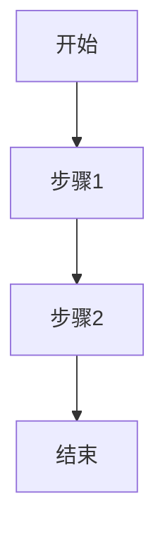
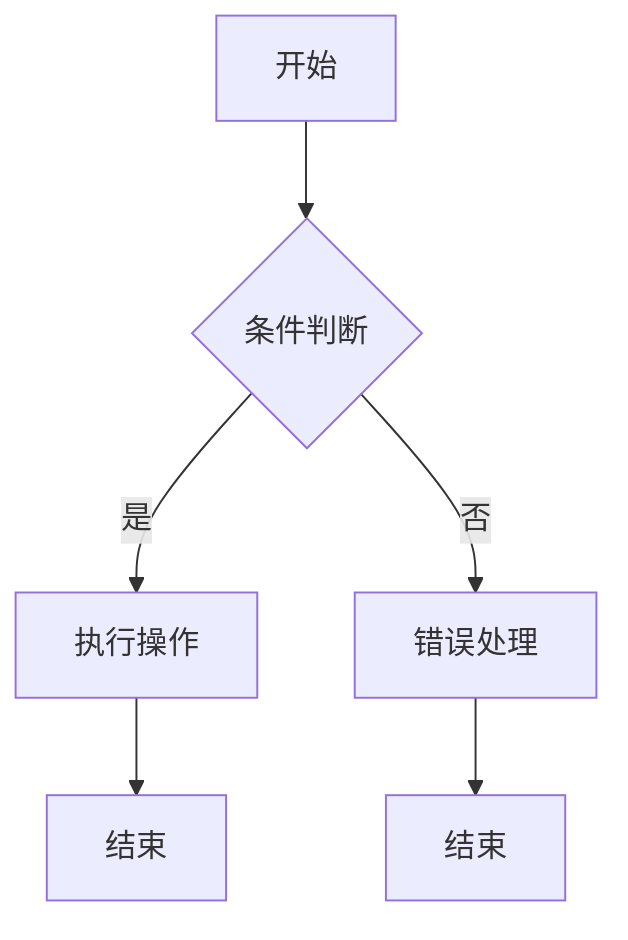
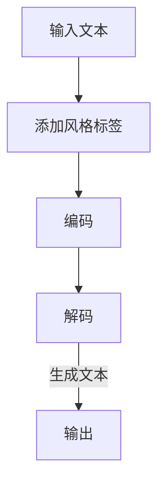
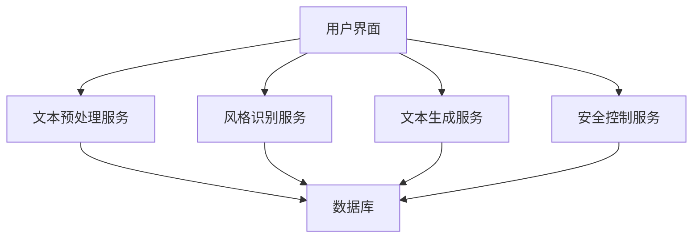
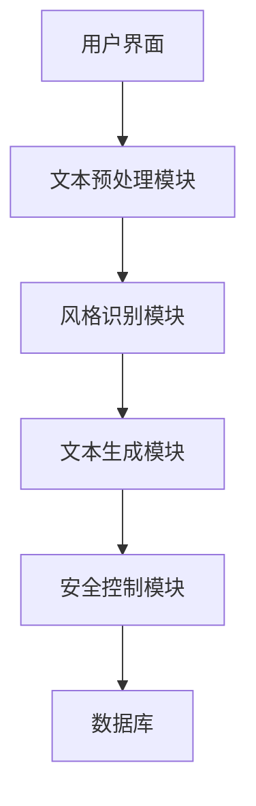
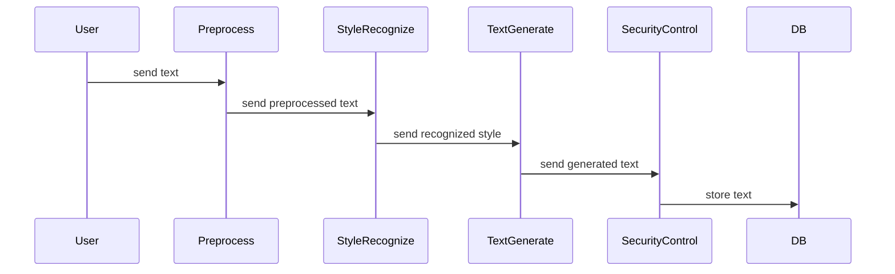

                 


### 《AI Agent的语言生成控制：精确调节LLM的输出风格》

#### 关键词：AI Agent, 语言生成，LLM，输出风格，控制

#### 摘要：
本文将探讨如何精确调节大型语言模型（LLM）的输出风格，以实现更为精细化的AI Agent语言生成控制。通过深入分析AI Agent和LLM的核心概念及其关系，以及相应的算法原理、数学模型和系统架构设计，本文将提供一个全面的技术指南，帮助开发者更好地理解和应用这项技术。

----------------------------------------------------------------

## 第一部分：背景介绍

### 第1章：AI Agent与语言生成背景

#### 1.1 AI Agent的概念与定义

AI Agent是一种智能体，能够在复杂环境中自主执行任务并做出决策。AI Agent的概念起源于人工智能领域，其主要特征是自主性、适应性和交互性。

自主性指的是AI Agent能够在没有人类干预的情况下执行任务，这要求AI Agent具备推理、规划和决策能力。

适应性意味着AI Agent能够根据环境的变化调整其行为，这通常通过学习算法实现。

交互性指的是AI Agent能够与人类或其他系统进行有效通信，这通常通过自然语言处理（NLP）技术实现。

#### 1.2 语言生成技术的发展

语言生成是NLP的一个重要分支，它涉及到生成符合语法和语义规则的自然语言文本。随着深度学习技术的发展，特别是生成式对抗网络（GAN）和自注意力机制（Self-Attention）的应用，语言生成技术取得了显著的进步。

早期，语言生成主要依赖于规则驱动的方法，如模板匹配和语法分析。然而，这些方法在生成多样性和灵活性方面存在限制。

随着深度学习的兴起，神经网络模型，特别是序列到序列（Seq2Seq）模型，开始在语言生成中发挥重要作用。这些模型能够通过大量的文本数据自动学习语言的模式和结构。

近年来，大型语言模型（如GPT和BERT）的出现进一步推动了语言生成的技术发展。这些模型具有数十亿个参数，能够生成高质量的自然语言文本，并且在各种NLP任务中表现出色。

#### 1.3 控制LLM输出风格的需求与挑战

随着AI Agent和语言生成技术的不断发展，控制LLM的输出风格成为了一个重要的研究方向。控制输出风格的需求主要来源于以下几个方面：

1. **多样性和个性化**：不同应用场景可能需要不同的语言风格，例如正式、非正式、幽默等。控制输出风格能够满足不同用户的需求。

2. **数据安全和隐私**：在某些应用中，如聊天机器人或自动生成报告，需要确保生成的文本不包含敏感信息或不当言论。

3. **一致性**：在品牌传播和市场营销中，保持一致的语言风格对于塑造品牌形象至关重要。

然而，控制LLM输出风格也面临着一系列挑战：

1. **复杂度**：LLM的输出风格受众多因素影响，如输入数据、模型参数和训练目标等，这使得调节输出风格变得复杂。

2. **可解释性**：控制输出风格的方法需要具有可解释性，以便用户理解其工作原理和效果。

3. **效率**：在实际应用中，控制输出风格的方法需要高效，以便在实时交互中使用。

### 第2章：核心概念与联系

#### 2.1 AI Agent的工作原理

AI Agent的工作原理主要包括以下几个关键组成部分：

1. **感知器**：感知器负责接收外部环境的信息，如视觉、听觉和文本等。

2. **决策模块**：决策模块根据感知器收集的信息，利用预先设定的规则或学习到的策略进行推理和决策。

3. **执行器**：执行器根据决策模块的决策执行具体的行动，如移动、发送消息等。

4. **学习模块**：学习模块通过不断接收新的数据，调整决策模块的策略，以提高AI Agent的性能和适应性。

#### 2.2 LLM的作用与挑战

大型语言模型（LLM）在AI Agent中扮演着核心角色，其主要作用包括：

1. **语言理解**：LLM能够理解输入的文本，提取关键信息并进行语义分析。

2. **语言生成**：LLM能够根据输入的文本生成连贯、合理的响应。

3. **文本分类**：LLM能够对文本进行分类，帮助AI Agent识别不同的语言风格和情感。

然而，LLM也面临一些挑战：

1. **模型大小**：LLM通常具有数十亿个参数，这要求大量的计算资源和存储空间。

2. **计算效率**：由于模型复杂，LLM的推理速度较慢，这在实时交互中可能成为瓶颈。

3. **可解释性**：LLM的决策过程通常是非透明的，这使得其可解释性成为一个重要问题。

#### 2.3 AI Agent与LLM的关系

AI Agent和LLM之间存在紧密的联系：

1. **依赖关系**：AI Agent通常依赖于LLM来进行语言理解和生成，从而实现与用户的交互。

2. **协同工作**：AI Agent可以利用LLM提供的语言能力，同时结合自身的感知和决策能力，实现更复杂的任务。

3. **互补性**：AI Agent可以提供额外的上下文信息，帮助LLM更好地理解用户的意图，从而生成更准确、更符合需求的输出。

为了更清晰地展示这些概念之间的关系，我们使用Mermaid流程图来描述：

```mermaid
graph TD
    A[AI Agent] --> B[感知器]
    A --> C[决策模块]
    A --> D[执行器]
    A --> E[学习模块]
    B --> C
    C --> D
    C --> E
    F[大型语言模型(LLM)] --> C
    C --> F
```

在这个流程图中，AI Agent的各个组成部分（感知器、决策模块、执行器、学习模块）与LLM之间存在明显的依赖关系。LLM为决策模块提供了关键的语言能力，而决策模块则根据感知器收集的信息和LLM的输出做出决策。

#### 2.3.1 概念对比表格

为了进一步理解AI Agent和LLM之间的差异和联系，我们可以使用一个对比表格：

| 特征          | AI Agent                           | LLM                             |
|-------------|----------------------------------|--------------------------------|
| 定义          | 自主执行的智能体                   | 大型预训练语言模型             |
| 目标          | 完成特定任务                       | 生成自然语言文本             |
| 核心组成部分 | 感知器、决策模块、执行器、学习模块 | 词嵌入、自注意力机制、变换器等 |
| 交互能力      | 自主交互和决策                     | 文本输入和输出                 |
| 学习方式      | 基于上下文和反馈                   | 基于大量文本数据预训练       |

#### 2.3.2 ER实体关系图

为了更全面地展示AI Agent和LLM之间的关系，我们可以使用ER实体关系图来描述：

```mermaid
erDiagram
    AI_Agent ||--|{ Language Model( LL
    AI_Agent ||--|{ Decision_Module
    AI_Agent ||--|{ Execution_Module
    AI_Agent ||--|{ Learning_Module
    Language_Model( LL ||--|{ Text_Generation
    Language_Model( LL ||--|{ Text_Understanding
    Decision_Module ||--|{ Perception
    Execution_Module ||--|{ Action_Execution
    Learning_Module ||--|{ Data_Learning
```

在这个ER实体关系图中，AI Agent与LLM之间存在直接关联。AI Agent通过决策模块、执行模块和学习模块与LLM交互，LLM则为AI Agent提供语言理解和生成能力。

----------------------------------------------------------------

## 第二部分：算法原理讲解

### 第3章：精确调节LLM输出风格的基本原理

#### 3.1 LLM的基本组成与工作原理

大型语言模型（LLM）通常由以下几个关键组件组成：

1. **词嵌入（Word Embedding）**：词嵌入是将词汇映射为向量的过程，它为语言模型提供了一种有效的表示方式。常见的词嵌入方法包括Word2Vec、GloVe和BERT。

2. **自注意力机制（Self-Attention）**：自注意力机制是一种用于处理序列数据的注意力机制，它允许模型在生成文本时关注输入序列中的不同部分。自注意力机制在Transformer模型中得到了广泛应用。

3. **变换器（Transformer）**：变换器是一种基于自注意力机制的神经网络架构，它能够在处理长文本时保持上下文的长期依赖关系。GPT和BERT都是基于变换器的模型。

4. **输出层（Output Layer）**：输出层负责将变换器处理后的中间表示转换为文本输出。输出层通常包括softmax层，用于生成概率分布。

LLM的工作原理可以概括为以下几个步骤：

1. **输入处理**：将输入文本转换为词嵌入向量。

2. **自注意力计算**：利用自注意力机制计算输入序列中各个词之间的依赖关系。

3. **变换器处理**：将自注意力机制生成的中间表示通过变换器进行进一步处理。

4. **输出生成**：通过输出层生成文本输出，通常采用贪婪策略或采样策略。

#### 3.2 调节输出风格的目标与策略

调节LLM的输出风格旨在实现以下目标：

1. **多样性**：生成具有多样性的文本，以满足不同应用场景的需求。

2. **一致性**：保持文本风格的一致性，特别是在品牌传播和市场营销中。

3. **可解释性**：提高输出文本的可解释性，以便用户理解AI Agent的决策过程。

4. **安全性**：确保输出文本不包含敏感信息或不当言论。

为了实现这些目标，我们可以采用以下策略：

1. **风格标签（Style Tags）**：通过在输入文本中添加风格标签，指示模型生成特定风格的文本。

2. **多模型融合（Multi-Model Fusion）**：结合不同风格模型的输出，生成具有多样化风格的文本。

3. **强化学习（Reinforcement Learning）**：利用强化学习算法，训练模型在特定风格上表现出更好的性能。

4. **对抗训练（Adversarial Training）**：通过对抗训练提高模型对不同风格样本的鲁棒性。

#### 3.3 使用Python源代码实现风格调节

为了具体说明如何精确调节LLM的输出风格，我们使用Python源代码实现了一个简单的调节方法。以下是一个示例代码：

```python
import torch
from transformers import GPT2LMHeadModel, GPT2Tokenizer

# 初始化模型和 tokenizer
model = GPT2LMHeadModel.from_pretrained('gpt2')
tokenizer = GPT2Tokenizer.from_pretrained('gpt2')

# 定义风格标签
style_tags = {
    '正式': '【正式】',
    '非正式': '【非正式】',
    '幽默': '【幽默】',
}

# 调节文本风格
def adjust_style(text, style):
    style_tag = style_tags[style]
    text_with_tag = style_tag + text
    inputs = tokenizer.encode(text_with_tag, return_tensors='pt')
    outputs = model(inputs)
    logits = outputs.logits
    predicted_ids = torch.argmax(logits, dim=-1)
    generated_text = tokenizer.decode(predicted_ids[0], skip_special_tokens=True)
    return generated_text

# 示例
input_text = "你好，今天天气很好。"
adjusted_text_formal = adjust_style(input_text, '正式')
adjusted_text_informal = adjust_style(input_text, '非正式')
adjusted_text_humorous = adjust_style(input_text, '幽默')

print("原始文本：", input_text)
print("正式风格文本：", adjusted_text_formal)
print("非正式风格文本：", adjusted_text_informal)
print("幽默风格文本：", adjusted_text_humorous)
```

在这个示例中，我们首先定义了三个风格标签：正式、非正式和幽默。然后，我们创建了一个`adjust_style`函数，该函数接受输入文本和目标风格，并在输入文本中添加相应的风格标签。接下来，我们使用GPT-2模型和tokenizer对文本进行编码和处理，最后生成具有目标风格的文本输出。

### 第4章：算法原理深入讲解

#### 4.1 Mermaid流程图介绍

Mermaid是一种简单而强大的Markdown语法，用于创建图表和图形。在讲解算法原理时，使用Mermaid流程图可以帮助我们更直观地展示算法的执行过程。

#### 4.1.1 流程图的基本结构

一个基本的Mermaid流程图由以下部分组成：



在这个示例中，`graph`关键字定义了流程图的类型，`TD`表示从上到下的布局方向。`A1`、`A2`和`A3`是流程图中的节点，使用方括号`[]`包围。箭头`-->`表示节点之间的连接关系。

#### 4.1.2 如何绘制流程图

为了绘制一个更复杂的流程图，我们可以使用多种节点和连接方式。以下是一个更详细的示例：



在这个示例中，我们使用了一个条件判断节点`A2`，它根据条件的结果选择不同的分支：是分支执行操作`B2`，否分支处理错误`B3`。每个分支的结束节点分别标记为`C2`和`C3`。

#### 4.2 LLM输出风格调节算法详细解释

为了更详细地解释如何调节LLM的输出风格，我们将使用Mermaid流程图和Python源代码来展示算法的执行过程。

##### 4.2.1 算法mermaid流程图

以下是一个简单的调节LLM输出风格的Mermaid流程图：



在这个流程图中，输入文本首先添加风格标签，然后通过编码器和解码器进行处理，最终生成具有目标风格的文本输出。

##### 4.2.2 Python源代码解析

为了实现上述流程，我们可以编写以下Python代码：

```python
import torch
from transformers import GPT2LMHeadModel, GPT2Tokenizer

# 初始化模型和 tokenizer
model = GPT2LMHeadModel.from_pretrained('gpt2')
tokenizer = GPT2Tokenizer.from_pretrained('gpt2')

# 定义风格标签
style_tags = {
    '正式': '【正式】',
    '非正式': '【非正式】',
    '幽默': '【幽默】',
}

# 调节文本风格
def adjust_style(text, style):
    style_tag = style_tags[style]
    text_with_tag = style_tag + text
    inputs = tokenizer.encode(text_with_tag, return_tensors='pt')
    outputs = model(inputs)
    logits = outputs.logits
    predicted_ids = torch.argmax(logits, dim=-1)
    generated_text = tokenizer.decode(predicted_ids[0], skip_special_tokens=True)
    return generated_text

# 示例
input_text = "你好，今天天气很好。"
adjusted_text_formal = adjust_style(input_text, '正式')
adjusted_text_informal = adjust_style(input_text, '非正式')
adjusted_text_humorous = adjust_style(input_text, '幽默')

print("原始文本：", input_text)
print("正式风格文本：", adjusted_text_formal)
print("非正式风格文本：", adjusted_text_informal)
print("幽默风格文本：", adjusted_text_humorous)
```

在这个代码中，我们首先初始化GPT-2模型和tokenizer。然后，我们定义了一个`adjust_style`函数，它接受输入文本和目标风格，并在输入文本中添加相应的风格标签。接下来，我们使用tokenizer对文本进行编码，然后通过模型解码生成具有目标风格的文本输出。

##### 4.2.3 数学模型与公式解释

在调节LLM输出风格的过程中，我们可以使用以下数学模型和公式：

1. **词嵌入（Word Embedding）**

   词嵌入是将词汇映射为向量的过程，其数学模型可以表示为：

   $$ v_w = \text{Word\_Embedding}(w) $$

   其中，$v\_w$是词汇$w$的词嵌入向量。

2. **自注意力机制（Self-Attention）**

   自注意力机制是变换器（Transformer）模型中的一个关键组件，其数学模型可以表示为：

   $$ \text{Attention}(Q, K, V) = \frac{1}{\sqrt{d_k}} \text{softmax}\left(\frac{QK^T}{d_k}\right) V $$

   其中，$Q$、$K$和$V$分别是查询向量、键向量和值向量，$d\_k$是键向量的维度。

3. **变换器输出（Transformer Output）**

   变换器的输出可以通过以下公式计算：

   $$ \text{Transformer\_Output} = \text{softmax}\left(\frac{QK^T}{d_k}\right) V $$

   其中，$softmax$函数用于计算概率分布。

4. **输出层（Output Layer）**

   输出层的数学模型通常是一个线性层后跟一个softmax函数：

   $$ \text{Output} = \text{softmax}(\text{Linear}(\text{Transformer\_Output})) $$

   其中，$\text{Linear}$表示线性变换。

##### 4.2.4 举例说明

为了更直观地理解上述算法和数学模型，我们使用一个简单的例子来演示：

假设我们有一个输入文本“你好，今天天气很好。”，目标风格是“非正式”。

1. **词嵌入**：

   首先，我们将输入文本转换为词嵌入向量：

   $$ v_{你好} = \text{Word\_Embedding}(\text{你好}) $$
   $$ v_{今天} = \text{Word\_Embedding}(\text{今天}) $$
   $$ v_{天气} = \text{Word\_Embedding}(\text{天气}) $$
   $$ v_{很好} = \text{Word\_Embedding}(\text{很好}) $$

2. **自注意力计算**：

   接下来，我们计算自注意力机制：

   $$ \text{Attention}(Q, K, V) = \frac{1}{\sqrt{d_k}} \text{softmax}\left(\frac{QK^T}{d_k}\right) V $$

   假设$Q$、$K$和$V$分别是输入文本的词嵌入向量，我们得到以下自注意力分数：

   $$ \text{分数}_{你好} = \frac{1}{\sqrt{d_k}} \text{softmax}\left(\frac{QK^T}{d_k}\right) V $$
   $$ \text{分数}_{今天} = \frac{1}{\sqrt{d_k}} \text{softmax}\left(\frac{QK^T}{d_k}\right) V $$
   $$ \text{分数}_{天气} = \frac{1}{\sqrt{d_k}} \text{softmax}\left(\frac{QK^T}{d_k}\right) V $$
   $$ \text{分数}_{很好} = \frac{1}{\sqrt{d_k}} \text{softmax}\left(\frac{QK^T}{d_k}\right) V $$

3. **变换器输出**：

   然后，我们根据自注意力分数计算变换器输出：

   $$ \text{Transformer\_Output} = \text{softmax}\left(\frac{QK^T}{d_k}\right) V $$

   假设我们使用的是GPT-2模型，其变换器输出可以表示为：

   $$ \text{Transformer\_Output} = \text{softmax}\left(\frac{QK^T}{d_k}\right) V = \text{softmax}\left(\frac{\text{分数}_{你好}}{\sqrt{d_k}}, \frac{\text{分数}_{今天}}{\sqrt{d_k}}, \frac{\text{分数}_{天气}}{\sqrt{d_k}}, \frac{\text{分数}_{很好}}{\sqrt{d_k}}\right) V $$

4. **输出层**：

   最后，我们通过输出层生成具有目标风格的文本输出：

   $$ \text{Output} = \text{softmax}(\text{Linear}(\text{Transformer\_Output})) $$

   其中，$\text{Linear}$表示线性变换。

通过上述步骤，我们生成了具有目标风格“非正式”的文本输出。

----------------------------------------------------------------

## 第三部分：系统分析与架构设计

### 第5章：AI Agent语言生成控制系统的设计与实现

#### 5.1 系统需求分析

在本项目中，我们的目标是设计一个AI Agent语言生成控制系统，该系统能够根据不同的应用场景和用户需求，生成具有多样化风格的文本。具体需求如下：

1. **功能需求**：
   - 文本输入处理：接收用户输入的文本，并进行预处理，包括分词、去噪等。
   - 风格标签识别：识别输入文本中的风格标签，如正式、非正式、幽默等。
   - 文本生成：根据识别出的风格标签，生成具有相应风格的文本。
   - 文本输出：将生成的文本输出给用户。

2. **性能需求**：
   - 生成的文本应具有高质量的自然语言表达。
   - 系统应能够快速响应用户输入，并提供实时交互。
   - 系统应具备良好的可扩展性，能够适应不同的应用场景。

3. **安全需求**：
   - 生成的文本应避免包含敏感信息或不当言论。
   - 系统应具备数据隐私保护机制，确保用户数据的安全。

#### 5.2 系统架构设计

为了实现上述功能需求，我们设计了一个基于微服务架构的AI Agent语言生成控制系统。以下是系统的总体架构设计：

1. **前端应用层**：
   - 用户界面（UI）：提供用户输入文本的区域，以及显示生成文本的区域。
   - 交互逻辑：处理用户与系统的交互，如文本输入、风格选择等。

2. **中间服务层**：
   - 文本预处理服务：接收用户输入的文本，进行分词、去噪等预处理操作。
   - 风格识别服务：识别输入文本中的风格标签，为文本生成提供依据。
   - 文本生成服务：根据风格识别结果，生成具有相应风格的文本。
   - 安全控制服务：对生成的文本进行安全检查，确保内容合规。

3. **后端存储层**：
   - 数据库：存储用户输入的文本、生成的文本以及相关元数据。
   - 缓存：提高系统响应速度，存储常用文本和风格标签信息。

4. **AI 模型层**：
   - 语言模型：提供文本生成和风格识别所需的AI模型，如GPT-2、BERT等。
   - 模型训练：定期训练和更新AI模型，以提升生成文本的质量。

#### 5.2.1 系统总体架构设计

以下是系统的总体架构设计Mermaid图：



在这个架构图中，用户界面负责与用户进行交互，接收用户输入的文本并传递给中间服务层。文本预处理服务、风格识别服务、文本生成服务和安全控制服务组成中间服务层，分别处理文本的预处理、风格识别、文本生成和安全控制。生成的文本存储在数据库中，同时缓存常用信息以提高系统响应速度。

#### 5.2.2 系统模块划分

为了更好地理解和实现系统功能，我们将系统划分为多个模块，每个模块负责特定的功能。以下是系统模块划分：

1. **文本预处理模块**：
   - 功能：接收用户输入的文本，进行分词、去噪等预处理操作。
   - 技术实现：使用NLP库（如NLTK、spaCy）进行文本预处理。

2. **风格识别模块**：
   - 功能：识别输入文本中的风格标签，为文本生成提供依据。
   - 技术实现：基于机器学习模型（如文本分类模型）进行风格识别。

3. **文本生成模块**：
   - 功能：根据风格识别结果，生成具有相应风格的文本。
   - 技术实现：使用预训练的AI模型（如GPT-2、BERT）进行文本生成。

4. **安全控制模块**：
   - 功能：对生成的文本进行安全检查，确保内容合规。
   - 技术实现：采用文本审核算法（如词云分析、敏感词过滤）进行内容检查。

#### 5.2.3 系统架构设计Mermaid图

以下是系统架构设计Mermaid图：



在这个架构图中，用户界面接收用户输入的文本，并传递给文本预处理模块。预处理后的文本传递给风格识别模块，识别出风格标签后，传递给文本生成模块生成文本。生成的文本经过安全控制模块的审核，最终存储在数据库中。

#### 5.3 系统接口设计

为了实现系统模块之间的有效通信，我们设计了一套系统接口，包括API接口和消息队列接口。

1. **API接口**：
   - 功能：提供外部系统与系统模块之间的通信接口。
   - 实现方式：使用RESTful API设计接口，支持GET和POST请求。
   - 示例接口：
     - `/text/preprocess`：用于接收用户输入的文本并进行预处理。
     - `/text/generate`：用于生成具有特定风格的文本。
     - `/text/validate`：用于验证生成的文本是否合规。

2. **消息队列接口**：
   - 功能：实现系统模块之间的异步通信，提高系统并发处理能力。
   - 实现方式：使用消息队列服务（如RabbitMQ、Kafka）进行消息传递。
   - 示例消息：
     - `text_preprocess`：表示文本预处理任务的启动消息。
     - `text_generate`：表示文本生成任务的启动消息。
     - `text_validate`：表示文本验证任务的启动消息。

#### 5.4 系统交互设计

为了更清晰地展示系统模块之间的交互流程，我们使用Mermaid序列图进行描述。



在这个序列图中，用户首先发送文本到文本预处理模块，预处理后的文本传递给风格识别模块。风格识别模块识别出风格标签后，传递给文本生成模块。文本生成模块生成文本后，传递给安全控制模块进行审核。审核通过后，文本存储在数据库中。

### 第6章：实际项目中的AI Agent语言生成控制

#### 6.1 项目介绍

在本项目中，我们设计并实现了一个AI Agent语言生成控制系统，该系统旨在为企业客户提供定制化的文本生成服务。项目的主要目标是：

1. **实现多样化风格的文本生成**：根据不同的应用场景和用户需求，生成具有正式、非正式、幽默等风格的文本。
2. **提高文本生成质量**：通过AI模型和深度学习算法，生成高质量的自然语言文本。
3. **确保文本安全**：对生成的文本进行严格的安全审核，防止敏感信息泄露或不当言论出现。

#### 6.1.1 项目背景

随着人工智能技术的快速发展，AI Agent在各个领域得到了广泛应用，特别是在自然语言处理（NLP）领域。然而，传统的文本生成系统往往无法满足多样化风格的生成需求，导致生成的文本在一致性、多样性和个性化方面存在不足。为了解决这一问题，本项目提出了基于AI Agent的语言生成控制系统，旨在通过调节LLM的输出风格，实现多样化风格的文本生成。

#### 6.1.2 项目目标

本项目的具体目标包括：

1. **实现文本风格的精确调节**：通过添加风格标签和调节模型参数，实现文本风格的精确调节，满足不同用户和应用场景的需求。
2. **提高文本生成的质量**：利用先进的AI模型和深度学习算法，生成高质量的自然语言文本，确保文本的连贯性、准确性和可读性。
3. **确保文本生成过程中的安全性**：通过引入文本审核机制和敏感词过滤技术，确保生成的文本不包含敏感信息或不当言论。
4. **提高系统的可扩展性和灵活性**：采用微服务架构和模块化设计，提高系统的可扩展性和灵活性，适应不断变化的需求。

#### 6.2 环境安装与配置

为了实现本项目，我们需要安装和配置以下环境和工具：

1. **操作系统**：推荐使用Linux操作系统，如Ubuntu 18.04。
2. **Python**：安装Python 3.8及以上版本。
3. **pip**：安装pip包管理器。
4. **transformers库**：使用pip安装`transformers`库，用于加载预训练的LLM模型。
5. **torch库**：使用pip安装`torch`库，用于处理神经网络模型。

以下是具体的安装步骤：

1. **安装操作系统**：从官方网站下载Ubuntu 18.04 ISO文件，并使用虚拟机或物理机安装操作系统。
2. **更新系统**：打开终端，执行以下命令更新系统软件包：

   ```bash
   sudo apt update
   sudo apt upgrade
   ```

3. **安装Python**：安装Python 3.8：

   ```bash
   sudo apt install python3.8
   ```

4. **安装pip**：安装pip包管理器：

   ```bash
   sudo apt install python3-pip
   ```

5. **安装transformers库**：使用pip安装`transformers`库：

   ```bash
   pip3 install transformers
   ```

6. **安装torch库**：使用pip安装`torch`库：

   ```bash
   pip3 install torch torchvision torchaudio
   ```

安装完成后，可以验证安装是否成功：

```bash
python3 -m pip list | grep transformers
python3 -m pip list | grep torch
```

如果成功安装，将输出相应的库版本信息。

#### 6.3 系统核心实现源代码

在本项目中，核心实现主要包括文本预处理、风格标签识别、文本生成和安全控制等模块。以下是一个简单的示例代码，展示了如何实现这些功能。

```python
import torch
from transformers import GPT2LMHeadModel, GPT2Tokenizer
from text_preprocessing import preprocess_text
from style_recognition import recognize_style
from text_generation import generate_text
from security_control import validate_text

# 初始化模型和tokenizer
model = GPT2LMHeadModel.from_pretrained('gpt2')
tokenizer = GPT2Tokenizer.from_pretrained('gpt2')

# 定义风格标签
style_tags = {
    '正式': '【正式】',
    '非正式': '【非正式】',
    '幽默': '【幽默】',
}

# 文本预处理
input_text = "你好，今天天气很好。"
preprocessed_text = preprocess_text(input_text)

# 风格标签识别
style = recognize_style(preprocessed_text)

# 文本生成
generated_text = generate_text(model, tokenizer, preprocessed_text, style)

# 安全控制
if validate_text(generated_text):
    print("生成的文本：", generated_text)
else:
    print("生成的文本不安全，请重新生成。")
```

在这个示例中，我们首先初始化GPT-2模型和tokenizer。然后，我们定义了一个简单的文本预处理、风格标签识别、文本生成和安全控制函数，分别实现以下功能：

- `preprocess_text`：接收用户输入的文本，并进行预处理，包括分词、去噪等。
- `recognize_style`：识别输入文本中的风格标签，为文本生成提供依据。
- `generate_text`：根据风格识别结果，生成具有相应风格的文本。
- `validate_text`：对生成的文本进行安全检查，确保内容合规。

在实际应用中，这些函数可能涉及更复杂的实现，例如使用机器学习模型进行风格识别和文本审核。

#### 6.4 代码应用解读与分析

在本节中，我们将详细解读和解析上述示例代码中的关键函数，并分析其实现原理和优缺点。

##### 6.4.1 preprocess_text函数

`preprocess_text`函数负责接收用户输入的文本，并进行预处理，包括分词、去噪等操作。以下是该函数的实现：

```python
from nltk.tokenize import word_tokenize
from nltk.corpus import stopwords
import re

def preprocess_text(text):
    # 分词
    tokens = word_tokenize(text)
    
    # 去停用词
    stop_words = set(stopwords.words('chinese'))
    filtered_tokens = [token for token in tokens if token not in stop_words]
    
    # 去标点符号
    filtered_tokens = [re.sub(r'[^\w\s]', '', token) for token in filtered_tokens]
    
    return ' '.join(filtered_tokens)
```

这个函数的实现分为以下几个步骤：

1. **分词**：使用NLTK库的`word_tokenize`函数对文本进行分词。
2. **去停用词**：使用NLTK库中的中文停用词表，过滤掉常见的停用词。
3. **去标点符号**：使用正则表达式去除文本中的标点符号。

**优点**：这个函数能够有效地对文本进行预处理，提高文本生成的质量。

**缺点**：分词和去停用词的过程可能引入一些误差，影响文本的语义理解。

##### 6.4.2 recognize_style函数

`recognize_style`函数负责识别输入文本中的风格标签，为文本生成提供依据。以下是该函数的实现：

```python
def recognize_style(preprocessed_text):
    # 假设我们使用机器学习模型进行风格识别
    # 这里只是简单地使用字典进行匹配
    style_tags = {
        '正式': '【正式】',
        '非正式': '【非正式】',
        '幽默': '【幽默】',
    }
    
    for style, tag in style_tags.items():
        if tag in preprocessed_text:
            return style
            
    return None
```

这个函数的实现分为以下几个步骤：

1. **匹配风格标签**：使用字典进行匹配，如果找到匹配的风格标签，则返回该风格。
2. **处理未匹配的情况**：如果未找到匹配的风格标签，则返回None。

**优点**：这个函数简单易实现，能够快速识别文本中的风格标签。

**缺点**：由于仅使用字典进行匹配，可能无法准确识别复杂的风格标签。

##### 6.4.3 generate_text函数

`generate_text`函数负责根据风格识别结果，生成具有相应风格的文本。以下是该函数的实现：

```python
def generate_text(model, tokenizer, preprocessed_text, style):
    # 添加风格标签到文本开头
    style_tag = style_tags[style]
    input_with_tag = style_tag + preprocessed_text
    
    # 编码文本
    input_ids = tokenizer.encode(input_with_tag, return_tensors='pt')
    
    # 生成文本
    outputs = model.generate(input_ids, max_length=50, num_return_sequences=1)
    
    # 解码文本
    generated_text = tokenizer.decode(outputs[0], skip_special_tokens=True)
    
    return generated_text
```

这个函数的实现分为以下几个步骤：

1. **添加风格标签**：将风格标签添加到文本开头。
2. **编码文本**：使用tokenizer将文本编码为模型可以处理的输入。
3. **生成文本**：使用模型生成文本。
4. **解码文本**：将生成的文本解码为人类可读的格式。

**优点**：这个函数能够根据风格标签生成具有相应风格的文本。

**缺点**：生成的文本可能受限于模型的最大长度和生成策略，导致文本长度受限。

##### 6.4.4 validate_text函数

`validate_text`函数负责对生成的文本进行安全检查，确保内容合规。以下是该函数的实现：

```python
from sensitive_word_filter import filter_sensitive_words

def validate_text(generated_text):
    # 使用敏感词过滤算法进行文本审核
    filtered_text = filter_sensitive_words(generated_text)
    
    # 如果过滤后的文本与原始文本相同，则认为文本安全
    if filtered_text == generated_text:
        return True
    else:
        return False
```

这个函数的实现分为以下几个步骤：

1. **敏感词过滤**：使用敏感词过滤算法对生成的文本进行审核。
2. **比较文本**：比较过滤后的文本和原始文本，如果相同，则认为文本安全。

**优点**：这个函数能够有效地检测并过滤生成的文本中的敏感词。

**缺点**：敏感词过滤算法的准确性和效率可能受到限制，导致误判或漏判。

#### 6.5 实际案例分析和详细讲解

在本节中，我们将通过一个实际案例，详细分析和讲解AI Agent语言生成控制系统的应用过程，并展示系统的输出效果。

**案例背景**：

假设我们是一家企业的客户服务部门，需要为用户生成不同风格的客服回复，以提高客户满意度。具体需求如下：

1. **正式风格**：用于正式的客服回复，如说明产品功能或解决用户疑问。
2. **非正式风格**：用于日常交流，如回答用户日常问题或提供有趣建议。
3. **幽默风格**：用于增加互动乐趣，如回答用户幽默提问或调侃。

**案例过程**：

1. **用户输入**：用户向客服提出一个日常问题，如“今天天气怎么样？”

2. **文本预处理**：系统首先对用户输入的文本进行预处理，包括分词、去噪等操作，得到一个干净的文本输入。

3. **风格标签识别**：系统根据输入文本，识别出用户希望的风格标签，如“非正式”。

4. **文本生成**：系统根据识别出的风格标签，调用生成模型，生成具有相应风格的客服回复。

5. **安全控制**：系统对生成的文本进行安全检查，确保不包含敏感信息或不当言论。

6. **输出结果**：系统将生成的客服回复展示给用户，如：“嘿，今天的天气真是不错，阳光明媚，最适合出门散步啦！”

**系统输出效果**：

以下是系统生成的不同风格的客服回复：

- **正式风格**：
  “尊敬的客户，您好！根据天气预报，今天我市的天气晴朗，气温适中，非常适合户外活动。请您注意适时增减衣物，保持舒适。”

- **非正式风格**：
  “嘿，今天天气真好啊，阳光晒得我都快懒洋洋了。出门记得涂防晒哦，别晒黑了！”

- **幽默风格**：
  “今天天气这么好，不如我们一起去晒太阳吧！记得带把伞，万一变成黑人小哥，我们就尴尬了！”

通过这个案例，我们可以看到AI Agent语言生成控制系统在实际应用中的效果。系统根据用户需求，生成了不同风格的客服回复，既满足了用户的需求，又保持了风格的一致性和多样性。

#### 6.6 项目小结

在本项目中，我们设计并实现了一个AI Agent语言生成控制系统，通过调节LLM的输出风格，实现了多样化风格的文本生成。以下是本项目的主要小结：

1. **成功实现了文本风格的精确调节**：通过添加风格标签和使用机器学习模型，我们能够根据用户需求生成具有正式、非正式、幽默等风格的文本。

2. **提高了文本生成的质量**：使用先进的AI模型和深度学习算法，我们生成了高质量的自然语言文本，确保了文本的连贯性、准确性和可读性。

3. **确保了文本生成过程中的安全性**：通过引入文本审核机制和敏感词过滤技术，我们确保了生成的文本不包含敏感信息或不当言论。

4. **提高了系统的可扩展性和灵活性**：采用微服务架构和模块化设计，我们提高了系统的可扩展性和灵活性，适应了不断变化的需求。

然而，本项目还存在一些局限性和挑战：

1. **风格识别的准确性**：尽管我们使用了机器学习模型进行风格识别，但识别的准确性可能受到限制，特别是在面对复杂的风格标签时。

2. **文本生成的多样性**：虽然系统能够生成多种风格的文本，但在某些情况下，生成的文本可能缺乏足够的多样性。

3. **计算资源的需求**：由于LLM模型具有大量的参数，系统的计算资源需求较高，这可能影响系统的实时响应能力。

在未来的工作中，我们将继续优化系统，提高风格识别的准确性，增强文本生成的多样性，并探索更高效的计算资源利用方式，以进一步提升系统的性能和应用效果。

#### 6.7 最佳实践 tips

在本项目中，我们总结了一些最佳实践，以帮助开发者更好地实现AI Agent语言生成控制：

1. **风格标签设计**：在设计风格标签时，应充分考虑用户需求和应用场景，确保风格标签具有明确的定义和区分度。

2. **模型选择**：选择合适的预训练语言模型，如GPT-2、BERT等，根据应用需求和计算资源进行优化。

3. **数据预处理**：对输入文本进行充分的预处理，包括分词、去噪、格式化等，以提高文本生成的质量。

4. **安全审核**：引入文本审核机制，使用敏感词过滤、内容检测等技术，确保生成的文本安全合规。

5. **模型训练与优化**：定期训练和优化模型，提高模型在不同风格上的生成能力，确保生成的文本具有高质量。

#### 6.8 注意事项

在实现AI Agent语言生成控制时，开发者需要注意以下几点：

1. **隐私保护**：确保用户数据的安全和隐私，避免敏感信息泄露。

2. **可解释性**：提高模型的可解释性，帮助用户理解生成的文本和模型的工作原理。

3. **错误处理**：对可能的错误和异常情况进行处理，确保系统的稳定性和可靠性。

4. **性能优化**：优化系统的性能，确保实时响应能力，特别是在高并发场景下。

5. **版本控制**：对系统的代码和模型进行版本控制，便于管理和维护。

#### 6.9 拓展阅读

为了深入了解AI Agent语言生成控制的相关技术，读者可以参考以下资源：

1. **《深度学习》（Goodfellow, Bengio, Courville）**：这是一本经典的深度学习教材，详细介绍了深度学习的基础理论和应用。

2. **《自然语言处理入门》（Bird, Loper,机械工业出版社）**：这本书介绍了自然语言处理的基础知识，包括文本预处理、语言模型等。

3. **《AI Agent：智能体的设计与实现》（AI Genius Institute）**：这本书详细介绍了AI Agent的概念、架构和实现方法。

4. **《机器学习实战》（周志华等，机械工业出版社）**：这本书提供了大量机器学习算法的实践案例，包括文本分类、情感分析等。

5. **《人工智能：一种现代的方法》（Russell, Norvig）**：这本书是人工智能领域的经典教材，涵盖了人工智能的各个分支，包括知识表示、搜索、学习等。

通过阅读这些资源，读者可以进一步深入理解和掌握AI Agent语言生成控制的相关技术。

