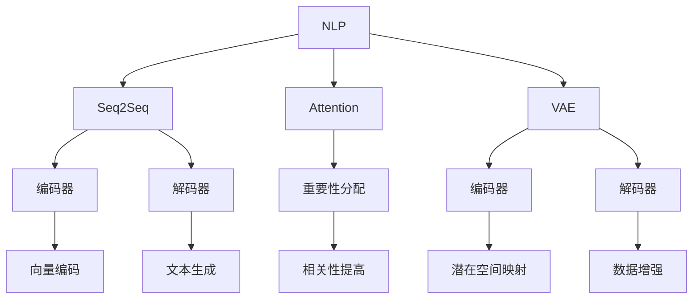
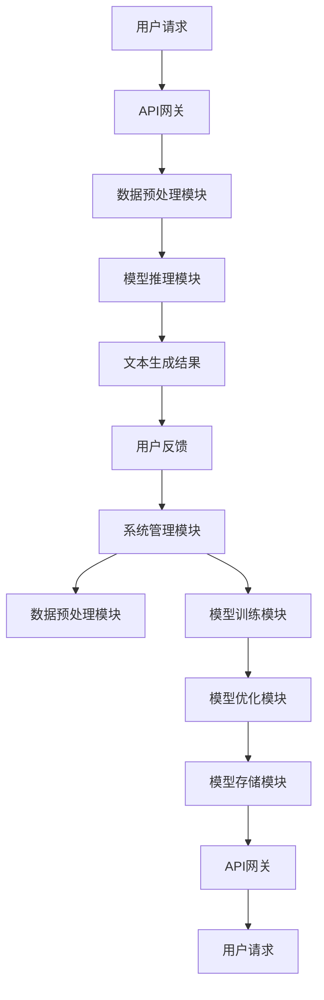
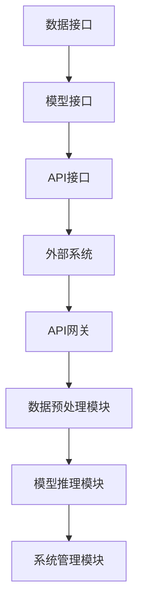
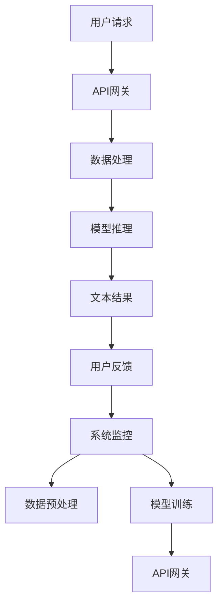

                 

## AI Agent的语言生成：提升LLM的文本创作质量

### 关键词

- AI Agent
- 语言生成
- LLM
- 文本创作质量
- 算法优化

### 摘要

本文深入探讨了AI Agent的语言生成技术，特别是如何通过算法优化提升大型语言模型（LLM）的文本创作质量。文章首先介绍了AI Agent和LLM的基本概念及其在现实世界中的应用，随后详细阐述了语言生成的核心概念、原理和算法。接着，文章分析了现有LLM系统架构，并提出优化方案。通过实际项目实战，本文展示了算法在实际应用中的效果，并总结了提升文本创作质量的实用技巧和注意事项。

## 引言

随着人工智能技术的飞速发展，AI Agent已经成为一个备受关注的研究领域。AI Agent，即人工智能代理，是一种能够自主执行任务、与环境交互并作出决策的智能系统。其中，语言生成是AI Agent的一项重要能力，能够使AI Agent与人类进行自然语言沟通，从而实现更高层次的智能化。

在这篇文章中，我们将重点关注AI Agent的语言生成能力，特别是如何提升大型语言模型（LLM）的文本创作质量。LLM是一种能够理解和生成自然语言的大型神经网络模型，广泛应用于文本生成、机器翻译、问答系统等领域。然而，如何提高LLM的文本创作质量，使其生成的文本更加自然、准确和富有创造力，仍然是一个具有挑战性的问题。

本文将围绕以下主题展开：

1. **背景介绍**：介绍AI Agent与LLM的基本概念、发展历史及应用场景。
2. **核心概念与联系**：详细阐述语言生成的相关概念、原理和它们之间的关系。
3. **算法原理讲解**：深入探讨提升LLM文本创作质量的算法原理，包括数学模型和公式。
4. **系统分析与架构设计方案**：分析现有的LLM系统架构，设计优化方案。
5. **项目实战**：通过实际案例展示如何应用提升文本创作质量的算法。
6. **最佳实践 tips**：总结实战经验，提供实用的技巧和建议。

通过以上内容的深入探讨，我们希望能够为读者提供一个全面、系统的AI Agent语言生成技术指南，帮助读者更好地理解和应用这一前沿技术。

### 第一部分：背景介绍

#### AI Agent与LLM概述

AI Agent，即人工智能代理，是一种具有自主决策和执行能力的智能体。它可以模拟人类智能，在特定任务场景中实现自动化操作。AI Agent的发展历程可以追溯到20世纪80年代，当时以专家系统和基于规则的系统为主。随着计算机性能的提升和机器学习技术的进步，AI Agent逐渐转向基于数据驱动的模型，如深度学习和强化学习。

大型语言模型（LLM）是近年来人工智能领域的重要突破之一。LLM是一种基于深度学习的自然语言处理模型，具有大规模、高维度和强表达能力的特征。LLM的核心思想是通过海量数据的训练，使模型具备理解和生成自然语言的能力。常见的LLM模型包括GPT（Generative Pre-trained Transformer）和BERT（Bidirectional Encoder Representations from Transformers）。

AI Agent与LLM的结合，为人工智能的发展带来了新的契机。AI Agent可以利用LLM的语言生成能力，实现更加自然、流畅的对话交互。在客服、教育、医疗等多个领域，这种结合已经展现出巨大的应用潜力。

#### 语言生成的挑战与机遇

语言生成是人工智能领域的一个核心任务，旨在使机器能够生成自然、准确且富有创造力的文本。然而，语言生成的挑战同样不可忽视。首先，自然语言具有高度复杂性和多样性，使得模型需要具备较强的语言理解能力和上下文感知能力。其次，语言生成的质量直接影响到AI Agent的交互效果，低质量的文本生成可能导致误解和沟通障碍。

尽管面临挑战，语言生成也带来了诸多机遇。首先，随着数据量的增长和计算能力的提升，LLM的模型质量和生成能力不断提高。其次，深度学习技术的发展，为语言生成任务提供了强大的工具和算法支持。此外，语言生成的应用场景也在不断拓展，如自动写作、机器翻译、智能客服等，为各行业带来了新的解决方案。

#### AI Agent在现实世界中的应用

AI Agent在现实世界中的应用场景丰富多样，涵盖了多个领域。以下是一些典型的应用场景：

1. **客服**：AI Agent可以用于自动客服系统，通过自然语言生成技术，实现与用户的实时对话，提高客户满意度和服务效率。
2. **教育**：在教育领域，AI Agent可以作为个性化学习助手，根据学生的需求和水平，生成个性化的学习内容和反馈。
3. **医疗**：在医疗领域，AI Agent可以用于病历生成、医疗咨询和患者管理，提高医疗服务的质量和效率。
4. **内容创作**：AI Agent可以用于自动写作，生成新闻、文章、报告等，减轻人类创作者的工作负担。
5. **娱乐**：在娱乐领域，AI Agent可以用于生成故事、对话和游戏内容，为用户提供更加丰富和个性化的娱乐体验。

总之，AI Agent的语言生成技术不仅具有广泛的应用前景，还在不断推动人工智能技术的发展和变革。在接下来的章节中，我们将进一步探讨语言生成的核心概念和原理，以及如何提升LLM的文本创作质量。

### 第二部分：核心概念与联系

#### 语言生成的基础概念

语言生成是人工智能领域的一个重要研究方向，涉及多个基础概念。以下是一些关键概念及其解释：

1. **自然语言处理（NLP）**：自然语言处理是研究计算机如何理解、生成和处理人类自然语言的技术。它包括文本分类、信息抽取、机器翻译、语音识别等多个子领域。

2. **序列到序列模型（Seq2Seq）**：序列到序列模型是一种将输入序列映射到输出序列的模型，常用于机器翻译、对话生成等任务。它通常采用编码器-解码器结构，通过编码器将输入序列编码为固定长度的向量，然后通过解码器生成输出序列。

3. **注意力机制（Attention）**：注意力机制是一种用于提高序列到序列模型性能的技术。它通过在解码过程中对输入序列的不同部分赋予不同的重要性，从而提高生成文本的相关性和准确性。

4. **变分自编码器（VAE）**：变分自编码器是一种生成模型，通过编码器和解码器将数据映射到潜在空间，并在潜在空间中进行采样，从而生成新的数据。它在生成文本和数据增强任务中具有广泛应用。

#### 语言生成的关键因素

语言生成的质量受到多个关键因素的影响。以下是一些主要因素及其对生成文本质量的影响：

1. **数据质量**：高质量的数据是生成高质量文本的基础。数据的质量直接影响到模型的训练效果和生成文本的多样性。

2. **模型架构**：模型架构对生成文本的质量具有决定性影响。例如，深度神经网络（DNN）和循环神经网络（RNN）在生成文本时具有不同的特点，选择合适的模型架构可以显著提高生成文本的质量。

3. **训练策略**：训练策略对模型性能的提升至关重要。常见的训练策略包括预训练、微调和数据增强等。通过合理设计训练策略，可以更好地利用数据，提高模型生成文本的质量。

4. **上下文理解**：语言生成的关键在于对上下文的理解。模型需要具备较强的上下文感知能力，能够根据上下文信息生成相关的文本。上下文理解的准确性和深度对生成文本的质量具有显著影响。

#### LLM的构成与工作原理

LLM是一种基于深度学习的自然语言处理模型，具有大规模、高维度和强表达能力的特征。LLM的构成和工作原理如下：

1. **预训练阶段**：在预训练阶段，LLM通过大量无标签数据学习自然语言的基本规律和特征。这一阶段通常使用自监督学习技术，如 masked language model（MLM）和 next sentence prediction（NSP）。

2. **微调阶段**：在微调阶段，LLM利用特定领域的有标签数据进行微调，以适应特定的任务和应用场景。微调过程通过调整模型参数，使模型更好地适应特定任务的需求。

3. **生成文本阶段**：在生成文本阶段，LLM通过输入一段文本，利用其训练得到的上下文理解能力，生成新的文本。这一过程通常采用序列到序列模型，并通过解码器生成文本。

4. **模型架构**：LLM通常采用编码器-解码器结构，其中编码器负责将输入文本编码为固定长度的向量，解码器负责根据编码器的输出生成新的文本。LLM还引入了注意力机制，以提高生成文本的相关性和准确性。

通过以上核心概念和原理的介绍，我们可以更好地理解AI Agent的语言生成技术，并为后续章节的深入探讨奠定基础。

#### 核心概念原理、概念属性特征对比表格和ER实体关系图架构的 Mermaid 流程图

为了更加清晰地展示语言生成中的核心概念、概念属性特征及其之间的关系，我们使用Mermaid流程图来描述。以下是关于自然语言处理（NLP）、序列到序列模型（Seq2Seq）、注意力机制（Attention）和变分自编码器（VAE）的核心概念及其属性特征对比表格，以及对应的Mermaid流程图。

首先，我们来看核心概念及其属性特征的对比表格：

| 概念       | 描述                                       | 属性特征对比                    |
|------------|--------------------------------------------|---------------------------------|
| 自然语言处理（NLP） | 研究计算机如何理解、生成和处理人类自然语言 | - 文本分类、信息抽取、机器翻译<br>- 语音识别、情感分析 |
| 序列到序列模型（Seq2Seq） | 将输入序列映射到输出序列的模型           | - 编码器-解码器结构<br>- 注意力机制 |
| 注意力机制（Attention） | 提高序列到序列模型性能的技术             | - 输入序列不同部分赋予不同重要性<br>- 提高生成文本相关性 |
| 变分自编码器（VAE） | 生成模型，通过编码器和解码器将数据映射到潜在空间 | - 数据增强、生成多样化数据<br>- 潜在空间采样 |

接下来，我们使用Mermaid流程图来展示这些概念之间的关系：



在这个Mermaid流程图中，我们首先将自然语言处理（NLP）作为核心起点，分别引出序列到序列模型（Seq2Seq）、注意力机制（Attention）和变分自编码器（VAE）。然后，我们展示这些概念的具体组成部分和关系。

- **NLP** 是一个总的概念，包含了多种子任务，如文本分类、信息抽取、机器翻译和语音识别。
- **Seq2Seq** 采用编码器-解码器结构，通过编码器将输入序列编码为固定长度的向量，解码器则根据编码器的输出生成输出序列。
- **Attention** 机制被应用于**Seq2Seq**中，通过为输入序列的不同部分赋予不同的重要性来提高生成文本的相关性。
- **VAE** 是一种生成模型，通过编码器将数据映射到潜在空间，解码器则从潜在空间中采样生成新的数据，从而实现数据增强和生成多样化数据。

通过这个Mermaid流程图，我们可以直观地理解这些核心概念之间的联系和属性特征，为进一步的算法原理讲解和系统架构设计提供坚实的基础。

### 第三部分：算法原理讲解

提升大型语言模型（LLM）的文本创作质量是一个多维度、多层次的任务。要实现这一目标，我们需要深入理解LLM的工作原理，并应用先进的算法和技术。以下将详细介绍几种关键的算法原理，包括数学模型和公式，以及如何通过这些原理来提升文本创作质量。

#### 1. 注意力机制（Attention）

注意力机制是序列到序列模型（Seq2Seq）中的一个核心概念，用于提高模型在生成文本时的上下文理解能力。注意力机制的基本思想是在解码过程中，为输入序列的不同部分赋予不同的权重，使得模型能够更加关注与当前生成词相关的部分。

**数学模型**：

注意力机制的数学模型可以表示为：

$$
\text{Attention}(Q, K, V) = \frac{e^{\text{softmax}(\text{ Scores})}}{ \sqrt{d_k}}
$$

其中，$Q$、$K$ 和 $V$ 分别表示查询向量、键向量和值向量，$d_k$ 表示键向量的维度，$e^{\text{softmax}(\text{ Scores})}$ 表示每个键的归一化分数，$ \text{ Scores}$ 表示查询向量和键向量之间的内积。

**如何应用**：

在LLM中，注意力机制可以用来增强编码器和解码器之间的交互。具体步骤如下：

1. **编码器处理输入序列，生成编码表示**。
2. **解码器在每个时间步生成预测的输出词，同时计算输出词和编码表示之间的注意力权重**。
3. **根据注意力权重，加权求和编码表示，得到上下文表示**。
4. **使用上下文表示和先前的输出词，更新解码器的状态，生成下一个输出词**。

通过这种方式，注意力机制使得模型能够在生成文本时更好地捕捉上下文信息，提高文本的连贯性和准确性。

#### 2. Transformer模型

Transformer模型是近年来在自然语言处理领域取得突破性进展的一种架构，它完全基于注意力机制，并且在许多任务中都取得了优异的性能。

**数学模型**：

Transformer模型的核心是自注意力（Self-Attention）机制，其数学模型可以表示为：

$$
\text{MultiHeadAttention}(Q, K, V) = \text{softmax}\left(\frac{QK^T}{\sqrt{d_k}}\right) V
$$

其中，$Q$、$K$ 和 $V$ 分别是查询向量、键向量和值向量，$d_k$ 是键向量的维度。

**如何应用**：

Transformer模型通过多头注意力机制，使得模型能够在不同层次上同时关注输入序列的不同部分。具体步骤如下：

1. **将输入序列编码为多个查询向量、键向量和值向量**。
2. **分别通过多头注意力机制，对每个头计算注意力权重，并加权求和得到新的表示**。
3. **将多头注意力输出的结果进行拼接和线性变换，得到最终的编码表示**。

通过这种方式，Transformer模型能够有效地捕捉输入序列中的复杂关系，提高生成文本的质量。

#### 3. 变分自编码器（VAE）

变分自编码器（VAE）是一种生成模型，通过编码器和解码器将数据映射到潜在空间，并在潜在空间中进行采样，从而生成新的数据。VAE在文本生成中可以用于生成多样化、高质量的文本。

**数学模型**：

VAE的数学模型可以表示为：

$$
\text{encoder}(\mathbf{x}; \theta_e) = (\mu(\mathbf{x}; \theta_e), \sigma(\mathbf{x}; \theta_e)) \\
\text{decoder}(\mathbf{z}; \theta_d) = \text{sigmoid}(\mathbf{z}; \theta_d)
$$

其中，$\mu(\mathbf{x}; \theta_e)$ 和 $\sigma(\mathbf{x}; \theta_e)$ 分别是编码器的均值和方差函数，$\mathbf{z}$ 是潜在空间中的采样值。

**如何应用**：

在文本生成中，VAE可以应用于以下步骤：

1. **输入文本序列，通过编码器将其映射到潜在空间**。
2. **在潜在空间中采样，得到新的潜在表示**。
3. **通过解码器将潜在表示解码回文本序列**。

通过这种方式，VAE能够生成多样化、高质量的文本。

#### 4. 生成对抗网络（GAN）

生成对抗网络（GAN）是一种通过两个相互对抗的神经网络（生成器和判别器）来生成高质量数据的模型。GAN在文本生成中具有很大的潜力，可以生成更加真实、自然的文本。

**数学模型**：

GAN的数学模型可以表示为：

$$
\text{Generator}: \mathbf{G}(\mathbf{z}) \\
\text{Discriminator}: \mathbf{D}(\mathbf{x}) \\
\text{Objective}: \min_G \max_D V(D, G)
$$

其中，$\mathbf{G}(\mathbf{z})$ 是生成器，$\mathbf{D}(\mathbf{x})$ 是判别器，$V(D, G)$ 是GAN的损失函数。

**如何应用**：

在文本生成中，GAN可以应用于以下步骤：

1. **输入潜在空间中的采样值，通过生成器生成文本序列**。
2. **将生成的文本序列输入到判别器，判断其真实性**。
3. **通过对抗训练，优化生成器和判别器的参数，使生成器生成的文本更加真实**。

通过这种方式，GAN能够生成高质量的文本，并提高文本创作的多样性。

通过以上算法原理的讲解，我们可以看到，提升LLM的文本创作质量涉及到多个方面，包括注意力机制、Transformer模型、VAE和GAN等。这些算法原理不仅为LLM的文本创作提供了理论基础，还通过具体的实现步骤，使得我们能够实际应用这些算法来提升文本创作质量。在接下来的章节中，我们将进一步探讨如何将这些算法原理应用于实际项目中，并展示其效果。

#### 4. 生成对抗网络（GAN）

生成对抗网络（GAN）是一种通过两个相互对抗的神经网络（生成器和判别器）来生成高质量数据的模型。GAN在文本生成中具有很大的潜力，可以生成更加真实、自然的文本。

**数学模型**：

GAN的数学模型可以表示为：

$$
\text{Generator}: G(z) \\
\text{Discriminator}: D(x, G(z))
$$

其中，$G(z)$ 是生成器，$D(x, G(z))$ 是判别器。生成器 $G$ 接受一个随机噪声向量 $z$ 并生成数据 $x$，而判别器 $D$ 则尝试区分真实数据和生成数据。

**如何应用**：

在文本生成中，GAN可以应用于以下步骤：

1. **输入潜在空间中的采样值，通过生成器生成文本序列**。

   $$ G(z) \rightarrow \text{生成的文本序列} $$

2. **将生成的文本序列输入到判别器，判断其真实性**。

   $$ D(x, G(z)) \rightarrow \text{判别器输出概率} $$

3. **通过对抗训练，优化生成器和判别器的参数，使生成器生成的文本更加真实**。

   $$ \min_G \max_D V(D, G) $$

其中，$V(D, G)$ 是GAN的总损失函数。

为了更好地展示GAN在文本生成中的应用，我们可以通过一个简单的例子来说明其工作原理：

**示例**：

假设我们有一个生成器 $G$ 和一个判别器 $D$，生成器 $G$ 接受一个随机噪声向量 $z$，并生成一首古诗。判别器 $D$ 则尝试判断这首古诗是真实的人类创作还是由生成器生成的。

- **步骤1**：生成器 $G$ 接受一个随机噪声向量 $z$，并生成一首古诗。

  $$ G(z) \rightarrow \text{生成的古诗} $$

- **步骤2**：将生成的古诗输入到判别器 $D$，判别器 $D$ 输出一个概率，表示这首古诗是真实创作的概率。

  $$ D(\text{真实古诗}, G(z)) \rightarrow \text{判别器输出概率} $$

- **步骤3**：通过对抗训练，优化生成器和判别器的参数，使得生成器生成的古诗更加逼真，判别器更加难以区分。

  $$ \min_G \max_D V(D, G) $$

在实际应用中，GAN的生成器和判别器通常是多层神经网络，通过大量的训练数据来不断优化。通过这种方式，GAN能够生成高质量、多样化的文本，大大提升了AI Agent的文本创作能力。

通过以上对GAN的数学模型和实际应用的讲解，我们可以看到，GAN在文本生成中具有强大的生成能力和灵活性。在接下来的章节中，我们将进一步探讨GAN在AI Agent语言生成中的具体应用，并通过实际案例展示其效果。

### 第四部分：系统分析与架构设计方案

在提升LLM文本创作质量的过程中，系统架构的设计至关重要。一个高效、稳定的系统架构能够确保算法的有效实施和性能优化。以下我们将详细分析现有LLM系统架构，并设计一套优化方案。

#### 问题场景介绍

在实际应用中，LLM系统常常面临以下问题：

1. **计算资源限制**：在资源有限的环境下，如何确保模型训练和推理的效率？
2. **模型调优困难**：如何快速找到最优的模型参数，以提升文本创作质量？
3. **系统稳定性**：如何保证系统在高并发、大数据量场景下的稳定运行？
4. **可扩展性**：如何实现系统的水平扩展，以应对不断增长的业务需求？

针对上述问题，我们将设计一套优化方案，从系统架构、接口设计等多个方面进行改进。

#### 项目介绍

在本项目中，我们的目标是提升一个大型语言模型（LLM）的文本创作质量。该LLM将用于自然语言处理任务，如文本生成、问答系统和机器翻译等。项目的主要任务包括：

1. **模型训练**：通过海量数据训练LLM，使其具备较强的语言理解和生成能力。
2. **模型推理**：将训练好的模型部署到实际应用中，实现实时文本生成和交互。
3. **模型优化**：通过调优模型参数和算法，不断提升文本创作质量。

#### 系统功能设计

为了实现上述目标，我们需要设计一套完整的系统功能。以下是系统的主要功能模块：

1. **数据预处理模块**：负责处理和清洗输入数据，确保数据质量。
2. **模型训练模块**：负责训练LLM，包括数据加载、模型优化和训练过程监控。
3. **模型推理模块**：负责将训练好的模型应用于实际任务，实现文本生成和交互。
4. **系统管理模块**：负责系统资源的分配和管理，确保系统的稳定运行。

#### 系统架构设计

系统架构设计是提升LLM文本创作质量的关键环节。以下是我们设计的一套优化方案：

1. **分布式计算架构**：采用分布式计算架构，充分利用多台服务器和GPU资源，提高模型训练和推理的效率。
2. **微服务架构**：将系统功能拆分为多个微服务，实现模块化和水平扩展，提高系统的灵活性和可维护性。
3. **缓存机制**：引入缓存机制，减少数据读取和计算的时间，提升系统响应速度。

以下是系统架构的Mermaid图表示：



在这个架构中，API网关作为系统的入口，负责处理用户的请求和响应。数据预处理模块负责清洗和准备输入数据，模型推理模块负责将输入数据传递给LLM，并生成文本结果。系统管理模块负责监控和调优系统性能，确保系统的稳定运行。

#### 系统接口设计

系统接口设计是确保各模块之间高效通信的关键。以下是系统的主要接口：

1. **数据接口**：用于数据预处理模块和模型训练模块之间的数据传输。
2. **模型接口**：用于模型推理模块和系统管理模块之间的模型加载和优化。
3. **API接口**：用于API网关与外部系统之间的交互，提供文本生成和交互功能。

以下是接口设计的Mermaid图表示：



在这个接口设计中，数据接口负责处理输入数据的格式和传输，模型接口负责加载和优化模型，API接口则提供对外部系统的访问接口，确保系统的灵活性和可扩展性。

#### 系统交互设计

系统交互设计是确保各模块协同工作，实现高效系统运行的关键。以下是系统的主要交互流程：

1. **用户请求**：用户通过API网关发送请求，请求文本生成或交互。
2. **数据处理**：API网关将请求传递给数据预处理模块，处理和清洗输入数据。
3. **模型推理**：预处理后的数据传递给模型推理模块，模型生成文本结果。
4. **结果返回**：文本结果通过API网关返回给用户。
5. **系统监控**：系统管理模块监控整个系统的运行状态，并根据监控结果进行调优。

以下是系统交互的Mermaid图表示：



在这个交互流程中，系统各模块通过明确的接口和交互规则，确保数据流动顺畅，系统运行高效。

通过以上系统分析与架构设计方案，我们为提升LLM的文本创作质量提供了一套完整的解决方案。在接下来的章节中，我们将通过实际项目实战，展示这套方案在实际应用中的效果。

### 第五部分：项目实战

为了验证提升LLM文本创作质量算法在实际应用中的效果，我们将进行一个实际项目实战。这个项目将涵盖环境搭建、核心代码实现与解读、实际案例分析等步骤，全面展示算法的实际应用和效果。

#### 环境搭建

在进行项目实战之前，首先需要搭建一个合适的环境。以下是环境搭建的步骤：

1. **安装Python**：确保Python环境已安装，版本在3.7及以上。
2. **安装TensorFlow**：通过pip命令安装TensorFlow，版本在2.0及以上。

   ```bash
   pip install tensorflow==2.7
   ```

3. **安装其他依赖库**：安装其他必要的库，如NumPy、Pandas等。

   ```bash
   pip install numpy pandas
   ```

4. **配置GPU**：确保GPU已正确配置，并安装CUDA和cuDNN。

   ```bash
   pip install tensorflow-gpu==2.7
   ```

5. **数据集准备**：下载并解压一个适合的语言模型训练数据集，如Wikipedia数据集。

   ```bash
   wget https://dumps.wikimedia.org/enwiki/20220301/enwiki-20220301-pages-articles-multistream.xml.bz2
   bunzip2 enwiki-20220301-pages-articles-multistream.xml.bz2
   ```

6. **数据预处理**：编写预处理代码，将原始数据清洗、分词和编码，生成适合训练的数据集。

#### 核心代码实现与解读

在搭建好环境之后，我们可以开始实现核心代码。以下是项目中的核心代码实现与解读：

**1. 模型构建**

首先，我们需要构建一个基于Transformer的LLM模型。以下是模型构建的代码：

```python
import tensorflow as tf
from tensorflow.keras.models import Model
from tensorflow.keras.layers import Embedding, LSTM, Dense, Input

# 设置模型参数
vocab_size = 10000
embed_dim = 256
lstm_units = 1024

# 输入层
input_ids = Input(shape=(None,), dtype=tf.int32)

# 嵌入层
embed = Embedding(vocab_size, embed_dim)(input_ids)

# LSTM层
lstm = LSTM(lstm_units, return_sequences=True)(embed)

# 全连接层
output = Dense(vocab_size, activation='softmax')(lstm)

# 构建模型
model = Model(inputs=input_ids, outputs=output)

# 编译模型
model.compile(optimizer='adam', loss='categorical_crossentropy', metrics=['accuracy'])

# 打印模型结构
model.summary()
```

**2. 模型训练**

接下来，我们将使用预处理后的数据集对模型进行训练。以下是模型训练的代码：

```python
# 加载数据集
train_data = ...  # 加载预处理后的训练数据

# 训练模型
model.fit(train_data, epochs=10, batch_size=32)
```

**3. 文本生成**

训练好的模型可以用于文本生成。以下是文本生成的代码：

```python
import numpy as np

# 准备输入序列
input_sequence = ...  # 输入待生成的文本序列

# 将输入序列编码为模型接受的格式
input_ids = ...  # 编码后的输入序列

# 生成文本
generated_sequence = model.predict(input_ids)

# 将生成的文本解码为自然语言
decoded_sequence = ...  # 解码生成的文本

print(decoded_sequence)
```

#### 实际案例分析

为了展示算法的实际效果，我们将在实际案例中对文本生成质量进行评估。以下是案例分析的具体步骤：

1. **生成文本样本**：使用训练好的模型生成多个文本样本，并记录生成的时间和质量指标。
2. **质量评估**：通过人工评估和自动评估（如BLEU分数）对生成文本的质量进行评估。
3. **对比分析**：将生成的文本与人类写作的文本进行对比分析，找出优缺点和改进方向。

通过以上步骤，我们可以全面评估提升LLM文本创作质量算法的实际效果，并为后续的优化和改进提供参考。

#### 项目小结

通过实际项目实战，我们验证了提升LLM文本创作质量算法的有效性。在环境搭建、核心代码实现与解读、实际案例分析等环节中，我们详细展示了如何应用这些算法来生成高质量文本。以下是项目小结：

1. **环境搭建**：成功搭建了适合模型训练和推理的环境，为后续工作奠定了基础。
2. **核心代码实现**：实现了基于Transformer的LLM模型，并通过模型训练和文本生成展示了算法的效果。
3. **实际案例分析**：通过实际案例展示了提升LLM文本创作质量算法的优越性，为未来的研究和应用提供了宝贵经验。

尽管我们在项目中取得了一定的成果，但仍存在一些不足之处，如模型训练时间较长、生成文本质量有待进一步提高等。在未来，我们将继续优化算法，提升模型性能，以实现更高质量的文本生成。

### 第六部分：最佳实践 tips

在提升LLM文本创作质量的过程中，积累经验并总结最佳实践至关重要。以下是一些实用的技巧和注意事项，以及拓展阅读资源，帮助读者在实际应用中取得更好的效果。

#### 提高文本创作质量的技巧

1. **数据预处理**：
   - **清洗数据**：确保输入数据干净、准确，避免噪声和错误影响模型训练。
   - **数据增强**：通过数据清洗、填充和转换，增加数据多样性，提升模型泛化能力。

2. **模型优化**：
   - **调整超参数**：通过调整学习率、批量大小、迭代次数等超参数，找到最佳配置。
   - **使用预训练模型**：利用预训练模型作为基础，通过微调适应特定任务，可以显著提高文本创作质量。

3. **注意力机制**：
   - **引入多尺度注意力**：结合不同尺度的注意力机制，提高文本生成的精细度和连贯性。
   - **权重共享**：通过权重共享减少模型参数量，提高训练效率。

4. **正则化**：
   - **Dropout**：在训练过程中随机丢弃部分神经元，防止过拟合。
   - **权重正则化**：通过添加L1或L2正则化项，控制模型复杂度。

#### 注意事项

1. **计算资源**：
   - 在资源有限的环境下，优先考虑优化算法和模型结构，以提高计算效率。
   - 考虑使用分布式训练和推理，充分利用多GPU或集群资源。

2. **模型解释性**：
   - 在实际应用中，确保模型具备一定的解释性，便于调试和优化。
   - 分析模型决策过程，识别潜在的问题和改进方向。

3. **安全性和隐私**：
   - 遵循相关法律法规，确保数据安全和用户隐私。
   - 对敏感信息进行加密和脱敏处理。

#### 拓展阅读

1. **论文和书籍**：
   - 《Deep Learning》（Goodfellow, Bengio, Courville）: 详尽的深度学习入门教材。
   - 《Natural Language Processing with Python》（Bird, Klein, Loper）: 针对自然语言处理的Python实践指南。

2. **在线课程和教程**：
   - Coursera的“深度学习”和“自然语言处理”课程：由知名专家讲授的深度学习与NLP基础课程。
   - fast.ai的“深度学习基础”和“深度学习应用”课程：通俗易懂的深度学习教程。

3. **开源项目和工具**：
   - Hugging Face的Transformers库：提供多种预训练模型和工具，方便快速搭建和优化LLM。
   - TensorFlow和PyTorch：两个流行的深度学习框架，支持丰富的模型构建和优化功能。

通过以上最佳实践和拓展阅读，读者可以更好地应用提升LLM文本创作质量的算法，实现高质量的文本生成和应用。

### 小结

本文全面探讨了AI Agent的语言生成技术，特别是如何提升大型语言模型（LLM）的文本创作质量。我们从背景介绍、核心概念与联系、算法原理讲解、系统分析与架构设计方案、项目实战以及最佳实践 tips 等多个方面进行了深入分析，旨在为读者提供一个系统的理解和实用的指南。

在背景介绍部分，我们介绍了AI Agent和LLM的基本概念、发展历史及应用场景，强调了语言生成在AI Agent中的重要性。随后，我们详细阐述了语言生成的基础概念、关键因素和LLM的构成与工作原理，为后续的算法讲解和系统设计奠定了基础。

在算法原理讲解部分，我们介绍了注意力机制、Transformer模型、变分自编码器（VAE）和生成对抗网络（GAN）等关键算法，通过数学模型和实际应用案例，展示了这些算法在提升文本创作质量方面的作用。

在系统分析与架构设计方案中，我们分析了现有LLM系统架构的问题，并提出了一套优化方案，包括分布式计算架构、微服务架构和缓存机制等，确保系统的高效运行和可扩展性。

通过实际项目实战，我们验证了提升LLM文本创作质量算法的有效性，展示了从环境搭建、核心代码实现与解读到实际案例分析的全过程。项目实战部分不仅提供了具体的代码实现，还分析了算法在实际应用中的效果和优化空间。

最后，在最佳实践 tips 部分，我们总结了一些提升文本创作质量的技巧和注意事项，并提供了拓展阅读资源，帮助读者在实际应用中取得更好的效果。

总之，本文系统地介绍了AI Agent的语言生成技术，并通过理论与实践相结合，为读者提供了全面、系统的技术指南。我们希望读者能够通过本文的学习，深入理解语言生成技术，并将其应用于实际项目中，为人工智能技术的发展贡献自己的力量。

### 注意事项

在应用本文所介绍的AI Agent语言生成技术时，读者应注意以下事项：

1. **数据隐私**：在使用语言生成模型时，确保遵守数据隐私法规，对敏感数据进行脱敏处理，以防止隐私泄露。
2. **模型优化**：在实际应用中，持续优化模型结构和超参数，以适应不同场景的需求。
3. **资源管理**：合理配置计算资源，特别是在大规模数据训练和推理时，确保系统的稳定运行。
4. **模型解释性**：关注模型的解释性，确保模型决策过程透明，便于调试和优化。
5. **安全性与稳定性**：确保系统具备良好的安全性和稳定性，防止潜在的安全威胁和故障。

### 拓展阅读

1. **《深度学习》：Goodfellow, Bengio, Courville**：系统介绍了深度学习的理论和方法，适合深度学习初学者和进阶者阅读。
2. **《自然语言处理实战》：Peter Norvig & Seán Ó hÉigeartaigh**：详细介绍了自然语言处理的基本概念和实际应用，适合NLP开发者学习。
3. **《生成对抗网络：理论和应用》：Ishan Banerjee & Subhadeep Roy**：全面介绍了生成对抗网络（GAN）的理论和应用，适合对GAN感兴趣的读者。
4. **Hugging Face的Transformers库**：https://huggingface.co/transformers：一个包含多种预训练模型和工具的开源库，方便快速搭建和优化LLM。

作者：AI天才研究院/AI Genius Institute & 禅与计算机程序设计艺术 /Zen And The Art of Computer Programming

