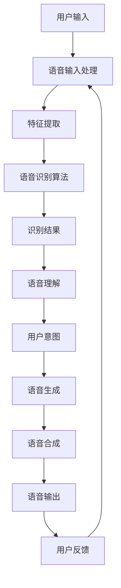
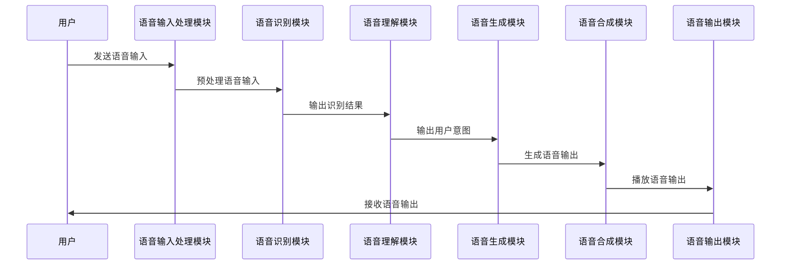

                 

### 文章标题

# AI Agent的语音交互设计：语音识别与合成

> 关键词：AI Agent，语音交互，语音识别，语音合成，人工智能，用户体验

> 摘要：本文旨在探讨AI Agent在语音交互设计中的关键角色，深入解析语音识别与语音合成的技术原理及其在设计中的应用。通过对语音交互背景、技术原理、系统设计与实现以及最佳实践的详细分析，本文为开发者提供了全面的指南，以打造出高效、自然、用户友好的AI语音交互系统。

---

### 引言

语音交互作为人工智能技术的重要组成部分，正在逐步改变人们的数字生活体验。随着语音识别和语音合成的技术不断发展，AI Agent（人工智能代理）在语音交互中的应用日益广泛。AI Agent通过语音识别技术理解用户指令，通过语音合成技术响应用户，实现了人与机器之间的自然对话。

然而，语音交互设计并非简单地将语音识别和语音合成技术堆砌在一起。一个成功的AI Agent语音交互系统需要充分考虑用户需求、技术实现和系统性能等多方面因素。本文将从以下几个方面展开讨论：

1. 语音交互的背景与意义
2. 语音识别与合成的技术原理
3. AI Agent的语音交互设计
4. 最佳实践与未来展望

通过本文的阅读，读者将了解语音交互技术的核心，掌握AI Agent语音交互设计的关键步骤，并能够运用最佳实践来优化系统性能和用户体验。

### 第一部分：引言与背景

#### 1.1 问题的背景与意义

**核心概念术语说明**：

- **语音交互**：指通过语音作为交互方式，实现人与机器之间的信息交流。
- **AI Agent**：一种智能代理，能够模拟人类行为，与用户进行自然对话。
- **语音识别**：将语音信号转换为机器可理解的语言。
- **语音合成**：生成自然流畅的语音，模拟人类语音发声。

**问题背景**：

随着智能手机、智能音箱和智能汽车等设备的普及，语音交互逐渐成为用户与智能设备沟通的首选方式。然而，语音交互的体验效果直接影响到用户的满意度。语音交互设计中的关键挑战在于如何实现准确、流畅、自然的语音识别和语音合成。

**问题描述**：

语音交互设计面临的主要问题包括：
1. **识别准确率**：在多种语音环境、不同口音和语速下，如何保持高识别准确率。
2. **自然流畅性**：如何通过语音合成技术生成自然、流畅的语音，提高用户体验。
3. **系统响应速度**：如何在保证准确性和自然性的前提下，实现快速响应。

**问题解决**：

为了解决上述问题，需要从以下几个方面进行优化：
1. **技术升级**：采用先进的语音识别算法和语音合成技术，提高系统的识别和合成能力。
2. **用户体验**：通过用户反馈和数据分析，不断优化系统，提高用户的满意度。
3. **系统性能**：优化系统架构和算法，提高响应速度和稳定性。

**边界与外延**：

语音交互的设计不仅涉及语音识别和语音合成，还包括语音信号处理、自然语言理解、对话系统等领域的知识。同时，语音交互的应用场景也非常广泛，包括智能家居、智能客服、教育、医疗等多个领域。

#### 1.2 语音识别与合成的概念

**语音识别**：

语音识别（Automatic Speech Recognition, ASR）是一种将语音信号转换为文本的技术。其基本原理包括语音信号预处理、特征提取、模型训练和识别输出等步骤。语音识别的关键技术包括：

- **语音信号预处理**：包括静音检测、增益控制、噪声抑制等，以提高语音信号的质量。
- **特征提取**：从语音信号中提取出具有区分性的特征，如梅尔频率倒谱系数（MFCC）、短时傅里叶变换（STFT）等。
- **模型训练**：使用大量标注数据进行训练，以建立语音识别模型。
- **识别输出**：将提取出的特征输入到模型中，通过概率计算和决策规则，输出对应的文本。

**语音合成**：

语音合成（Automatic Speech Synthesis, ASS）是一种将文本转换为语音的技术。其基本原理包括文本预处理、语音生成、语音合成等步骤。语音合成的主要技术包括：

- **文本预处理**：包括分词、命名实体识别、语气和情感分析等，以生成合适的语音输入。
- **语音生成**：使用语音合成模型（如WaveNet、HMM-GMM等）生成语音信号。
- **语音合成**：将生成的语音信号进行后处理，如音调、音色、节奏控制等，以生成自然流畅的语音。

**应用场景**：

语音识别和语音合成技术广泛应用于各种场景，包括：

- **智能助手**：如苹果的Siri、谷歌的Google Assistant等，通过语音交互提供信息查询、任务执行等服务。
- **智能客服**：通过语音交互自动回答用户问题，提高客服效率和用户满意度。
- **智能家居**：如智能音箱、智能门锁等，通过语音交互实现设备的控制和管理。
- **教育领域**：如语音评测系统、智能教学系统等，通过语音交互提供个性化的学习体验。
- **医疗健康**：如语音病历系统、智能语音助手等，通过语音交互提供医疗咨询和健康管理。

#### 1.3 语音交互技术的发展趋势

**人工智能的发展对语音交互的影响**：

随着人工智能技术的不断发展，语音交互技术也在不断进步。主要表现在以下几个方面：

- **深度学习**：深度学习算法在语音识别和语音合成中的应用，使得系统的准确性和自然性得到了显著提升。
- **大数据**：通过收集和分析大量的语音数据，可以不断优化语音识别和语音合成模型，提高系统的性能。
- **多模态交互**：结合视觉、语音、手势等多种交互方式，提供更加丰富和自然的交互体验。
- **个性化服务**：通过用户行为分析和个性化推荐，提供更加贴合用户需求的语音交互服务。

**语音交互技术的未来展望**：

随着技术的不断进步，语音交互技术在未来有望实现以下突破：

- **更自然的交互**：通过不断优化语音合成算法和自然语言处理技术，使语音交互更加自然、流畅。
- **更智能的助手**：通过深度学习和大数据分析，使AI Agent能够更好地理解用户意图，提供个性化的服务。
- **更广泛的应用**：随着硬件和软件的进步，语音交互将在更多领域得到应用，如智能家居、医疗健康、教育等。
- **更低的成本**：随着技术的普及和硬件成本的降低，语音交互系统将变得更加普及和易用。

#### 1.4 语音交互设计中的关键挑战

**挑战一：识别准确率**：

在多种语音环境、不同口音和语速下，如何保持高识别准确率是一个重要挑战。解决方法包括：

- **多语言支持**：使用多语言模型进行识别，提高对多种口音和语言的适应性。
- **自适应技术**：根据用户的历史交互数据，自适应调整识别模型，提高准确性。
- **上下文理解**：结合上下文信息，提高对特定语境下的识别准确率。

**挑战二：自然流畅性**：

如何通过语音合成技术生成自然流畅的语音，提高用户体验是一个关键问题。解决方法包括：

- **文本预处理**：通过分词、命名实体识别等技术，优化文本输入，提高语音合成质量。
- **语音合成模型**：使用先进的语音合成模型（如WaveNet、Tacotron等），生成更加自然、流畅的语音。
- **后处理技术**：通过音调、音色、节奏控制等技术，优化语音合成效果，使其更加接近人类语音。

**挑战三：系统响应速度**：

如何在保证识别准确率和自然流畅性的同时，实现快速响应是另一个挑战。解决方法包括：

- **硬件优化**：使用高性能的硬件设备，提高系统的处理速度。
- **算法优化**：通过优化识别和合成的算法，提高系统的运行效率。
- **缓存技术**：使用缓存技术，减少系统响应时间。

### 第二部分：语音识别技术

#### 2.1 语音识别的基本流程

语音识别的基本流程包括语音信号预处理、特征提取、识别算法和后处理与优化等步骤。下面将详细讲解每个步骤。

**语音信号预处理**：

语音信号预处理是语音识别的重要环节，其主要任务是提高语音信号的质量，减少噪声干扰。预处理步骤包括：

- **静音检测**：通过检测语音信号中的静音段，去除无用的静音部分，提高信号质量。
- **增益控制**：根据语音信号的平均能量，调整信号的增益，使语音信号达到最佳响度。
- **噪声抑制**：使用噪声抑制算法（如谱减法、变分自编码器等），减少噪声对语音信号的影响。

**特征提取**：

特征提取是从语音信号中提取出具有区分性的特征，以供识别算法使用。常见的特征提取方法包括：

- **短时傅里叶变换（STFT）**：将语音信号分段，进行傅里叶变换，提取出频率特征。
- **梅尔频率倒谱系数（MFCC）**：基于人耳对声音的感知特性，将STFT得到的频谱特征转换为梅尔频率倒谱系数，以更好地表示语音特征。
- **线性预测编码（LPC）**：基于语音信号的线性预测模型，提取出语音的线性预测系数。

**识别算法**：

识别算法是语音识别的核心，其主要任务是通过对特征向量进行分类，实现语音信号到文本的转换。常见的识别算法包括：

- **传统识别算法**：如隐马尔可夫模型（HMM）、高斯混合模型（GMM）等，基于统计模型进行语音识别。
- **机器学习算法**：如支持向量机（SVM）、决策树、神经网络等，通过训练大量数据，学习语音特征和文本之间的映射关系。
- **深度学习算法**：如卷积神经网络（CNN）、循环神经网络（RNN）、长短期记忆网络（LSTM）等，通过多层神经网络结构，提取更深层次的语音特征。

**后处理与优化**：

后处理与优化是对识别结果进行修正和优化，以提高系统的准确率和用户体验。常见的后处理与优化方法包括：

- **错误纠正**：通过语法规则、上下文信息等，对识别结果进行错误修正，提高准确性。
- **音素建模**：通过对音素进行建模，提高对音素区分的能力，减少误识率。
- **说话人识别**：通过识别说话人，实现多说话人分离和说话人自适应，提高识别效果。

#### 2.2 语音识别算法

语音识别算法可以分为传统算法和现代算法。传统算法主要包括隐马尔可夫模型（HMM）和高斯混合模型（GMM），现代算法主要包括基于深度学习的算法，如卷积神经网络（CNN）、循环神经网络（RNN）和长短期记忆网络（LSTM）。

**传统算法**：

- **隐马尔可夫模型（HMM）**：HMM 是一种基于统计模型的语音识别算法，它假设语音信号是一系列状态转移的序列，每个状态对应一个音素。HMM 通过建立状态转移概率矩阵和输出概率分布，实现对语音信号到文本的转换。

  **优点**：计算简单，易于实现。

  **缺点**：识别准确率较低，对噪声和不同说话人敏感。

- **高斯混合模型（GMM）**：GMM 是一种基于高斯分布的概率模型，用于表示语音信号的特征。GMM 通过建立多个高斯分布模型，实现对语音信号的分类。

  **优点**：能够处理多音素和连续语音信号。

  **缺点**：对噪声和说话人变化敏感，识别准确率有限。

**现代算法**：

- **卷积神经网络（CNN）**：CNN 是一种前馈神经网络，主要用于图像识别。近年来，CNN 在语音识别中得到了广泛应用。CNN 通过卷积操作提取语音信号的局部特征，并通过池化操作减少特征维度，提高模型的泛化能力。

  **优点**：能够提取深层次的语音特征，提高识别准确率。

  **缺点**：计算量大，对硬件资源要求较高。

- **循环神经网络（RNN）**：RNN 是一种循环结构神经网络，适用于处理序列数据。RNN 通过在时间步间传递隐藏状态，实现对语音信号的序列建模。

  **优点**：能够处理连续语音信号，具有记忆功能。

  **缺点**：训练过程中容易产生梯度消失和梯度爆炸问题。

- **长短期记忆网络（LSTM）**：LSTM 是一种改进的 RNN 结构，通过引入门控机制，解决了 RNN 的梯度消失和梯度爆炸问题。LSTM 在语音识别中得到了广泛应用，能够更好地建模语音信号的长期依赖关系。

  **优点**：能够处理连续语音信号，具有记忆功能，识别准确率高。

  **缺点**：计算复杂度较高，对训练数据量要求较大。

**常见语音识别算法比较**：

| 算法           | 特点                     | 优点                                                     | 缺点                                                      |
| -------------- | ------------------------ | -------------------------------------------------------- | --------------------------------------------------------- |
| HMM            | 基于统计模型的语音识别   | 计算简单，易于实现                                         | 识别准确率较低，对噪声和不同说话人敏感                       |
| GMM            | 基于高斯分布的概率模型   | 能够处理多音素和连续语音信号                             | 对噪声和说话人变化敏感，识别准确率有限                       |
| CNN            | 卷积神经网络             | 能够提取深层次的语音特征，提高识别准确率                   | 计算量大，对硬件资源要求较高                                 |
| RNN            | 循环结构神经网络       | 能够处理连续语音信号，具有记忆功能                       | 训练过程中容易产生梯度消失和梯度爆炸问题                       |
| LSTM           | 改进的 RNN 结构         | 能够处理连续语音信号，具有记忆功能，识别准确率高         | 计算复杂度较高，对训练数据量要求较大                         |
| 基于深度学习的算法 | 结合了多种深度学习技术 | 能够处理复杂的语音信号，提高识别准确率                     | 对计算资源和数据量要求较高，模型训练时间较长                   |

#### 2.3 语音识别系统设计

**语音识别系统架构**：

语音识别系统通常包括以下几个模块：

- **语音信号预处理模块**：对语音信号进行预处理，包括静音检测、增益控制和噪声抑制等。
- **特征提取模块**：从预处理后的语音信号中提取出具有区分性的特征。
- **识别算法模块**：使用识别算法对提取出的特征进行分类，实现语音信号到文本的转换。
- **后处理与优化模块**：对识别结果进行修正和优化，提高系统的准确率和用户体验。

**语音识别系统的开发流程**：

1. **需求分析**：确定系统的功能需求、性能指标和应用场景，为后续开发提供指导。
2. **数据准备**：收集和整理语音数据，包括语音信号、标注文本、说话人信息等。
3. **模型训练**：使用训练数据对识别模型进行训练，优化模型的参数。
4. **模型评估**：使用测试数据对模型进行评估，包括准确率、召回率、F1 值等指标。
5. **系统部署**：将训练好的模型部署到实际应用场景中，进行实时识别和交互。

**系统性能优化**：

1. **模型优化**：通过调整模型参数、优化网络结构等方式，提高识别准确率。
2. **特征优化**：通过改进特征提取方法、增加特征维度等方式，提高特征表示能力。
3. **算法优化**：结合多种识别算法，实现算法融合，提高系统的鲁棒性和稳定性。
4. **硬件优化**：使用高性能的硬件设备，提高系统的处理速度和响应速度。

#### 2.4 语音识别应用案例

**智能助手**：

智能助手（如苹果的Siri、谷歌的Google Assistant）是语音识别技术的重要应用场景。智能助手通过语音识别技术，理解用户的指令，提供信息查询、任务执行、智能家居控制等服务。以下是一个简单的智能助手语音识别应用案例：

1. 用户说：“明天天气预报如何？”
2. 语音识别系统接收语音信号，进行预处理和特征提取。
3. 识别算法对特征向量进行分类，输出对应的文本：“明天天气晴朗，温度18°C至25°C。”
4. 智能助手根据识别结果，生成语音合成输出，播放给用户。

**智能客服**：

智能客服通过语音识别技术，自动回答用户的问题，提供在线客服服务。以下是一个智能客服语音识别应用案例：

1. 用户说：“我想查询我的订单状态。”
2. 语音识别系统接收语音信号，进行预处理和特征提取。
3. 识别算法对特征向量进行分类，输出对应的文本：“您最近的订单已经发货，预计3天后到达。”
4. 智能客服根据识别结果，生成语音合成输出，播放给用户。

**智能家居**：

智能家居（如智能音箱、智能门锁等）通过语音识别技术，实现设备的远程控制和智能管理。以下是一个智能家居语音识别应用案例：

1. 用户说：“打开客厅的灯光。”
2. 语音识别系统接收语音信号，进行预处理和特征提取。
3. 识别算法对特征向量进行分类，输出对应的文本：“已为您打开客厅的灯光。”
4. 智能家居设备根据识别结果，执行相应的操作，打开客厅的灯光。

### 第三部分：语音合成技术

#### 3.1 语音合成的基本原理

语音合成（Automatic Speech Synthesis，ASS）是将文本转换为自然流畅的语音的技术。语音合成的基本原理包括文本预处理、语音生成和语音合成等步骤。

**文本预处理**：

文本预处理是语音合成的第一步，其主要任务是理解和解析输入文本，以便后续生成语音。文本预处理包括以下几个步骤：

1. **分词**：将输入文本分解为词或短语，以便进行后续处理。
2. **命名实体识别**：识别文本中的命名实体，如人名、地名、组织名等，以便进行特殊处理。
3. **语气和情感分析**：分析文本中的语气和情感，为语音合成提供相应的语音属性。

**语音生成**：

语音生成是语音合成的核心步骤，其主要任务是根据文本信息生成语音信号。语音生成的方法主要包括基于规则的方法和基于数据的生成方法。

1. **基于规则的方法**：

   基于规则的方法通过预先定义的语音规则，将文本信息转换为语音信号。该方法的主要优点是实现简单，但语音生成的自然性和流畅性有限。

2. **基于数据的生成方法**：

   基于数据的生成方法通过学习大量的文本和语音数据，建立文本与语音之间的映射关系。该方法能够生成更加自然和流畅的语音，但训练数据量较大，计算复杂度较高。

常见的基于数据的生成方法包括：

- **波形拼接（Diphone Synthesis）**：通过拼接预录制的短语音波形，生成目标语音。
- **参数合成（Parametric Synthesis）**：通过参数调整，生成目标语音。
- **深度生成模型（Deep Generative Models）**：如生成对抗网络（GAN）和变分自编码器（VAE），通过深度学习技术，生成高质量的语音。

**语音合成**：

语音合成是语音合成的最后一步，其主要任务是将生成的语音信号转换为自然流畅的语音。语音合成包括以下几个步骤：

1. **音调、音色、节奏控制**：根据文本的语气、情感和上下文信息，调整语音的音调、音色和节奏，使其更加自然。
2. **语音叠加**：将多个语音信号叠加，生成完整的语音流。
3. **后处理**：对语音信号进行后处理，如降噪、去噪等，提高语音质量。

**应用场景**：

语音合成技术广泛应用于各种场景，包括：

- **智能助手**：如苹果的Siri、谷歌的Google Assistant等，通过语音合成，响应用户的指令。
- **智能客服**：通过语音合成，自动生成语音回复，提供在线客服服务。
- **教育领域**：如语音评测系统、智能教学系统等，通过语音合成，提供语音教学和评估。
- **娱乐领域**：如语音合成主播、语音合成配音等，通过语音合成，实现多样化的娱乐内容。

#### 3.2 语音合成技术

语音合成技术可以分为基于规则的方法和基于数据的方法。下面将详细讲解这两种方法。

**基于规则的方法**：

基于规则的方法通过预先定义的语音规则，将文本信息转换为语音信号。该方法的主要优点是实现简单，但语音生成的自然性和流畅性有限。

**文本处理**：

文本处理是语音合成的第一步，其主要任务是理解和解析输入文本，以便后续生成语音。文本处理包括以下几个步骤：

1. **分词**：将输入文本分解为词或短语，以便进行后续处理。
2. **命名实体识别**：识别文本中的命名实体，如人名、地名、组织名等，以便进行特殊处理。
3. **语气和情感分析**：分析文本中的语气和情感，为语音合成提供相应的语音属性。

**规则定义**：

规则定义是语音合成的关键步骤，其主要任务是定义文本与语音之间的映射关系。规则包括语音的音调、音色、节奏等属性。

1. **音调规则**：根据文本的语气和情感，定义语音的音调。
2. **音色规则**：根据文本的语境和内容，定义语音的音色。
3. **节奏规则**：根据文本的长度和结构，定义语音的节奏。

**语音生成**：

语音生成是语音合成的核心步骤，其主要任务是根据文本信息生成语音信号。语音生成包括以下几个步骤：

1. **声学模型**：根据规则定义，生成语音的声学模型，如音素、音节等。
2. **发音规则**：根据声学模型，定义语音的发音规则，如音素的发音时长、音色等。
3. **语音合成**：根据发音规则，合成语音信号。

**优点**：

- **实现简单**：基于规则的方法易于实现，开发成本较低。
- **灵活性高**：可以根据特定的应用场景，灵活定义语音规则。

**缺点**：

- **自然性有限**：基于规则的方法生成的语音自然性和流畅性有限。
- **规则复杂**：定义语音规则需要大量的专业知识和经验。

**基于数据的方法**：

基于数据的方法通过学习大量的文本和语音数据，建立文本与语音之间的映射关系。该方法能够生成更加自然和流畅的语音。

**数据收集**：

数据收集是语音合成的基础，其主要任务是收集大量的文本和语音数据。数据包括：

1. **文本数据**：包括各种类型的文本，如新闻、小说、对话等。
2. **语音数据**：包括各种口音、语速、语调的语音样本。

**数据预处理**：

数据预处理是语音合成的重要步骤，其主要任务是对文本和语音数据进行预处理，以便后续生成语音。数据预处理包括以下几个步骤：

1. **分词**：将输入文本分解为词或短语，以便进行后续处理。
2. **命名实体识别**：识别文本中的命名实体，如人名、地名、组织名等，以便进行特殊处理。
3. **语音特征提取**：从语音信号中提取出具有区分性的特征，如梅尔频率倒谱系数（MFCC）、频谱特征等。

**语音生成模型**：

语音生成模型是语音合成的核心，其主要任务是根据文本信息生成语音信号。常见的语音生成模型包括：

1. **生成对抗网络（GAN）**：GAN 由生成器和判别器组成，生成器生成语音信号，判别器判断语音信号的真实性。通过训练，生成器逐渐生成更加真实的语音信号。
2. **变分自编码器（VAE）**：VAE 通过编码器和解码器组成，编码器将文本信息编码为低维特征，解码器将低维特征解码为语音信号。
3. **WaveNet**：WaveNet 是一种基于循环神经网络（RNN）的生成模型，通过训练，生成器能够生成高质量的语音信号。

**优点**：

- **自然性高**：基于数据的方法能够生成更加自然和流畅的语音。
- **灵活性高**：可以通过大量的文本和语音数据，训练出适用于各种场景的语音生成模型。

**缺点**：

- **训练数据量大**：基于数据的方法需要大量的文本和语音数据，训练数据量较大。
- **计算复杂度高**：基于数据的方法需要大量的计算资源，训练时间较长。

#### 3.3 语音合成系统的设计

**系统架构**：

语音合成系统通常包括以下几个模块：

- **文本预处理模块**：对输入文本进行分词、命名实体识别、语气和情感分析等预处理。
- **语音生成模块**：根据预处理后的文本，生成语音信号。
- **语音合成模块**：对生成的语音信号进行音调、音色、节奏控制，生成最终的语音输出。

**开发流程**：

1. **需求分析**：确定系统的功能需求、性能指标和应用场景，为后续开发提供指导。
2. **数据准备**：收集和整理文本和语音数据，包括各种类型的文本、各种口音、语速、语调的语音样本。
3. **模型训练**：使用训练数据对语音生成模型进行训练，优化模型的参数。
4. **模型评估**：使用测试数据对模型进行评估，包括语音自然性、流畅性等指标。
5. **系统部署**：将训练好的模型部署到实际应用场景中，进行实时语音合成。

**性能优化**：

1. **模型优化**：通过调整模型参数、优化网络结构等方式，提高语音生成的自然性和流畅性。
2. **特征优化**：通过改进特征提取方法、增加特征维度等方式，提高特征表示能力。
3. **算法优化**：结合多种语音生成算法，实现算法融合，提高系统的性能和鲁棒性。
4. **硬件优化**：使用高性能的硬件设备，提高系统的处理速度和响应速度。

#### 3.4 语音合成应用案例

**智能助手**：

智能助手（如苹果的Siri、谷歌的Google Assistant）通过语音合成技术，响应用户的指令，提供信息查询、任务执行、智能家居控制等服务。以下是一个智能助手语音合成应用案例：

1. 用户说：“明天天气预报如何？”
2. 语音合成系统接收文本信息，进行预处理和语音生成。
3. 语音生成模块根据文本信息，生成对应的语音信号。
4. 语音合成模块对语音信号进行音调、音色、节奏控制，生成最终的语音输出。
5. 智能助手播放生成的语音，回答用户的问题。

**智能客服**：

智能客服通过语音合成技术，自动生成语音回复，提供在线客服服务。以下是一个智能客服语音合成应用案例：

1. 用户说：“我想查询我的订单状态。”
2. 语音合成系统接收文本信息，进行预处理和语音生成。
3. 语音生成模块根据文本信息，生成对应的语音信号。
4. 语音合成模块对语音信号进行音调、音色、节奏控制，生成最终的语音输出。
5. 智能客服播放生成的语音，回答用户的问题。

**教育领域**：

教育领域通过语音合成技术，提供语音教学和评估。以下是一个教育领域语音合成应用案例：

1. 教师说：“请听我说一句话，然后模仿我的发音。”
2. 语音合成系统接收教师的话语，进行预处理和语音生成。
3. 语音生成模块根据教师的话语，生成对应的语音信号。
4. 语音合成模块对语音信号进行音调、音色、节奏控制，生成最终的语音输出。
5. 学生听到教师的话语，模仿教师的声音发音。

### 第四部分：AI Agent的语音交互设计

#### 4.1 AI Agent概述

AI Agent（人工智能代理）是一种模拟人类行为的智能系统，能够与用户进行自然对话，执行用户指令，提供个性化服务。AI Agent在语音交互设计中扮演着关键角色，其核心目标是提供高效、自然、用户友好的交互体验。

**定义与类型**：

- **定义**：AI Agent 是一种能够模拟人类行为，与用户进行自然对话，执行用户指令的智能系统。
- **类型**：
  - **语音交互型**：主要通过语音作为交互方式，实现人与机器之间的信息交流。
  - **多模态交互型**：结合语音、文本、图像等多种交互方式，提供更加丰富和自然的交互体验。

**AI Agent在语音交互中的作用**：

- **理解用户意图**：通过语音识别技术，AI Agent能够理解用户的语音指令，提取出用户的需求。
- **执行用户指令**：基于用户意图，AI Agent能够自动执行相应的任务，如查询信息、控制设备、完成交易等。
- **提供个性化服务**：通过用户行为分析和大数据分析，AI Agent能够为用户提供个性化的服务，提高用户体验。
- **改善用户体验**：通过自然流畅的语音合成技术，AI Agent能够以自然的方式与用户进行对话，提高交互的舒适度和满意度。

**设计原则**：

- **自然性**：AI Agent 的语音交互应尽量模拟人类对话的自然性，包括语音节奏、语调、语速等。
- **准确性**：AI Agent 应具备高识别准确率，确保理解用户指令的准确性。
- **灵活性**：AI Agent 应能够适应不同的交互场景和用户需求，提供灵活的交互体验。
- **易用性**：AI Agent 的交互界面应简单易懂，便于用户快速上手和使用。
- **个性化**：AI Agent 应能够根据用户的历史行为和偏好，提供个性化的服务和建议。

#### 4.2 AI Agent的语音交互流程

AI Agent的语音交互流程包括语音输入处理、语音识别与理解、语音生成与输出等步骤。下面将详细讲解每个步骤。

**语音输入处理**：

语音输入处理是语音交互的第一步，其主要任务是对用户输入的语音信号进行预处理，以提高后续识别的准确率。语音输入处理包括以下几个步骤：

1. **静音检测**：通过检测语音信号中的静音段，去除无用的静音部分，提高信号质量。
2. **增益控制**：根据语音信号的平均能量，调整信号的增益，使语音信号达到最佳响度。
3. **噪声抑制**：使用噪声抑制算法（如谱减法、变分自编码器等），减少噪声对语音信号的影响。

**语音识别与理解**：

语音识别与理解是语音交互的核心步骤，其主要任务是通过语音识别技术，将用户输入的语音信号转换为机器可理解的文本，并理解用户的意图。语音识别与理解包括以下几个步骤：

1. **特征提取**：从预处理后的语音信号中提取出具有区分性的特征，如梅尔频率倒谱系数（MFCC）、短时傅里叶变换（STFT）等。
2. **识别算法**：使用语音识别算法（如深度学习算法、传统语音识别算法等），对提取出的特征进行分类，输出对应的文本。
3. **错误纠正**：通过语法规则、上下文信息等，对识别结果进行错误修正，提高准确性。

**语音生成与输出**：

语音生成与输出是语音交互的最后一步，其主要任务是根据识别结果和用户意图，生成相应的语音输出，并播放给用户。语音生成与输出包括以下几个步骤：

1. **文本预处理**：对识别结果进行分词、命名实体识别、语气和情感分析等预处理。
2. **语音生成**：根据预处理后的文本，使用语音生成技术（如基于规则的方法、基于数据的方法等），生成语音信号。
3. **语音合成**：对生成的语音信号进行音调、音色、节奏控制，生成最终的语音输出。
4. **语音播放**：将生成的语音信号播放给用户。

#### 4.3 AI Agent的语音识别与合成系统设计

**系统架构设计**：

AI Agent的语音识别与合成系统设计包括语音输入处理模块、语音识别模块、语音理解模块、语音生成模块和语音输出模块等。以下是系统架构的详细设计：

1. **语音输入处理模块**：包括静音检测、增益控制和噪声抑制等，对用户输入的语音信号进行预处理，提高信号质量。
2. **语音识别模块**：包括特征提取和识别算法，对预处理后的语音信号进行分类，输出对应的文本。
3. **语音理解模块**：包括语义分析、意图识别和实体识别等，对识别结果进行理解和解析，提取出用户的意图和需求。
4. **语音生成模块**：包括文本预处理、语音生成和语音合成等，根据用户意图生成相应的语音输出。
5. **语音输出模块**：包括语音播放和反馈机制，将生成的语音信号播放给用户，并根据用户反馈进行优化。

**系统功能设计**：

AI Agent的语音识别与合成系统设计主要包括以下功能：

1. **语音输入处理**：对用户输入的语音信号进行预处理，包括静音检测、增益控制和噪声抑制等。
2. **语音识别**：使用先进的语音识别算法，对预处理后的语音信号进行分类，输出对应的文本。
3. **语音理解**：对识别结果进行语义分析、意图识别和实体识别等，提取出用户的意图和需求。
4. **语音生成**：根据用户意图，生成相应的语音输出，包括语音合成和语音播放等。
5. **用户反馈**：收集用户对语音交互的反馈，用于系统优化和性能提升。

**系统架构图**：

以下是AI Agent的语音识别与合成系统架构的Mermaid流程图：

**系统接口设计**：

AI Agent的语音识别与合成系统需要与其他系统进行交互，包括语音输入处理、语音识别、语音理解、语音生成和语音输出等。以下是系统接口的设计：

1. **语音输入接口**：接收用户的语音输入，包括音频流和数据流等。
2. **语音识别接口**：提供语音识别功能，输出识别结果。
3. **语音理解接口**：提供语音理解功能，输出用户意图。
4. **语音生成接口**：提供语音生成功能，输出语音输出。
5. **语音输出接口**：提供语音输出功能，包括语音播放和反馈。

**系统交互流程**：

以下是AI Agent的语音识别与合成系统的交互流程：

1. 用户通过语音输入接口，发送语音输入。
2. 语音输入处理模块对语音输入进行预处理。
3. 语音识别模块对预处理后的语音信号进行识别，输出识别结果。
4. 语音理解模块对识别结果进行语义分析、意图识别和实体识别等，输出用户意图。
5. 语音生成模块根据用户意图生成相应的语音输出。
6. 语音合成模块对语音输出进行合成，生成最终的语音信号。
7. 语音输出模块将生成的语音信号播放给用户。
8. 用户通过语音输出接口，接收语音输出，并给出反馈。

**系统交互图**：

以下是AI Agent的语音识别与合成系统的交互图的Mermaid序列图：

#### 4.4 AI Agent的应用案例

**智能家居**：

智能家居是AI Agent的重要应用领域之一，通过语音交互，用户可以方便地控制家庭设备，提高生活便利性。以下是一个智能家居AI Agent的应用案例：

1. 用户说：“打开客厅的灯光。”
2. 语音输入处理模块对用户的语音进行预处理。
3. 语音识别模块识别用户的语音，输出对应的文本：“打开客厅的灯光。”
4. 语音理解模块分析识别结果，提取出用户意图：“打开客厅的灯光。”
5. 语音生成模块生成相应的语音输出：“已为您打开客厅的灯光。”
6. 语音合成模块对语音输出进行合成，生成最终的语音信号。
7. 语音输出模块将生成的语音信号播放给用户。

**智能客服**：

智能客服是AI Agent的另一个重要应用领域，通过语音交互，用户可以获得快速、准确的客服服务。以下是一个智能客服AI Agent的应用案例：

1. 用户说：“我想查询我的订单状态。”
2. 语音输入处理模块对用户的语音进行预处理。
3. 语音识别模块识别用户的语音，输出对应的文本：“我想查询我的订单状态。”
4. 语音理解模块分析识别结果，提取出用户意图：“查询订单状态。”
5. 语音生成模块生成相应的语音输出：“您的订单已经发货，预计3天后到达。”
6. 语音合成模块对语音输出进行合成，生成最终的语音信号。
7. 语音输出模块将生成的语音信号播放给用户。

**教育领域**：

在教育领域，AI Agent可以通过语音交互，提供个性化的学习体验。以下是一个教育领域AI Agent的应用案例：

1. 用户说：“请播放第五课的内容。”
2. 语音输入处理模块对用户的语音进行预处理。
3. 语音识别模块识别用户的语音，输出对应的文本：“请播放第五课的内容。”
4. 语音理解模块分析识别结果，提取出用户意图：“播放第五课的内容。”
5. 语音生成模块生成相应的语音输出：“正在为您播放第五课的内容。”
6. 语音合成模块对语音输出进行合成，生成最终的语音信号。
7. 语音输出模块将生成的语音信号播放给用户。

### 第五部分：最佳实践与未来展望

#### 5.1 语音交互设计中的最佳实践

在设计语音交互系统时，需要遵循一系列最佳实践，以确保系统能够提供高效、自然、用户友好的交互体验。以下是语音交互设计中的最佳实践：

**1. 设计原则**：

- **自然性**：语音交互应尽量模拟人类对话的自然性，包括语音节奏、语调、语速等。
- **准确性**：确保高识别准确率，减少用户误解和错误率。
- **灵活性**：系统能够适应不同的交互场景和用户需求，提供灵活的交互体验。
- **易用性**：交互界面应简单易懂，便于用户快速上手和使用。
- **个性化**：根据用户的历史行为和偏好，提供个性化的服务和建议。

**2. 开发流程**：

- **需求分析**：明确系统的功能需求、性能指标和应用场景，为后续开发提供指导。
- **数据准备**：收集和整理语音数据、文本数据等，确保数据的质量和多样性。
- **模型训练**：使用高质量的数据对语音识别和语音生成模型进行训练，优化模型参数。
- **模型评估**：使用测试数据对模型进行评估，包括识别准确率、合成自然性等指标。
- **系统部署**：将训练好的模型部署到实际应用场景中，进行实时语音交互。

**3. 性能优化**：

- **模型优化**：通过调整模型参数、优化网络结构等方式，提高识别准确率和合成自然性。
- **特征优化**：通过改进特征提取方法、增加特征维度等方式，提高特征表示能力。
- **算法优化**：结合多种识别算法和生成算法，实现算法融合，提高系统的性能和鲁棒性。
- **硬件优化**：使用高性能的硬件设备，提高系统的处理速度和响应速度。

**4. 用户反馈**：

- **用户测试**：在开发过程中，进行用户测试，收集用户反馈，及时优化系统。
- **数据分析**：分析用户交互数据，了解用户需求和使用习惯，为系统优化提供依据。
- **持续迭代**：根据用户反馈和数据分析结果，持续优化系统，提高用户体验。

#### 5.2 未来展望

随着人工智能技术的不断发展，语音交互系统将在未来实现更高的准确率、自然性和个性化。以下是未来语音交互技术的一些展望：

**1. 深度学习的发展**：

深度学习技术在语音交互中的应用将越来越广泛，包括语音识别、语音合成、自然语言处理等。通过深度学习，系统将能够提取更深层次的语音特征，提高识别准确率和合成自然性。

**2. 多模态交互**：

未来语音交互系统将结合视觉、语音、手势等多种交互方式，提供更加丰富和自然的交互体验。多模态交互将使系统更好地理解用户意图，提高交互的准确性和流畅性。

**3. 个性化服务**：

通过大数据分析和用户行为分析，语音交互系统将能够为用户提供更加个性化的服务和建议。系统将根据用户的历史行为和偏好，自动调整交互策略，提高用户体验。

**4. 5G技术的应用**：

5G技术的快速发展将为语音交互系统带来更快的网络传输速度和更低的延迟。这将使语音交互系统能够实时响应用户需求，提供更加高效的交互体验。

**5. 边缘计算的应用**：

边缘计算技术的应用将使语音交互系统在本地进行更多计算和处理，减少对中心服务器的依赖，提高系统的响应速度和可靠性。

**6. 跨领域的融合**：

语音交互技术将在更多领域得到应用，如医疗健康、教育、金融等。跨领域的融合将使语音交互系统更加智能化和多样化，为用户提供更广泛的服务。

### 结语

语音交互作为人工智能技术的重要组成部分，正在逐步改变人们的数字生活体验。通过本文的讨论，我们了解了语音交互设计的关键角色AI Agent，以及语音识别与语音合成的技术原理和设计方法。未来，随着技术的不断进步，语音交互系统将变得更加高效、自然和个性化，为用户提供更加优质的交互体验。开发者应遵循最佳实践，不断优化语音交互系统，为用户创造更加便捷、智能的数字生活。

---

**作者：AI天才研究院/AI Genius Institute & 禅与计算机程序设计艺术 /Zen And The Art of Computer Programming**

---

### 完整目录大纲

为了设计《AI Agent的语音交互设计：语音识别与合成》的完整目录大纲，我们需要遵循以下几个步骤：

#### 1. 确定整体结构
- 首先，确定全书分为几个主要部分。根据文章的内容和结构，全书可以分为五个主要部分。
- 每个部分包含哪些章节，每个章节的核心内容是什么。以下是详细的章节划分：

| 部分 | 名称 | 章节划分 |
|------|------|----------|
| 第一部分 | 引言与背景 | 1.1 问题的背景与意义 1.2 语音识别与合成的概念 1.3 语音交互技术的发展趋势 1.4 语音交互设计中的关键挑战 |
| 第二部分 | 语音识别技术 | 2.1 语音识别的基本流程 2.2 语音识别算法 2.3 语音识别系统设计 2.4 语音识别应用案例 |
| 第三部分 | 语音合成技术 | 3.1 语音合成的基本原理 3.2 语音合成技术 3.3 语音合成系统的设计 3.4 语音合成应用案例 |
| 第四部分 | AI Agent的语音交互设计 | 4.1 AI Agent概述 4.2 AI Agent的语音交互流程 4.3 AI Agent的语音识别与合成系统设计 4.4 AI Agent的应用案例 |
| 第五部分 | 最佳实践与未来展望 | 5.1 语音交互设计中的最佳实践 5.2 未来展望 |

#### 2. 设计章节标题
- 根据每个部分的内容，设计章节标题，确保标题简洁且能够反映章节内容。

#### 3. 设计子章节标题
- 对每个章节进一步拆分，设计出子章节标题，确保内容细化。

#### 4. 细化目录内容
- 对每个章节和子章节，考虑需要包含哪些核心概念、原理、方法和案例。

#### 5. 完整性与逻辑性
- 确保目录大纲的内容完整且逻辑清晰，便于读者阅读和理解。

#### 6. 符合要求
- 确保目录大纲符合要求的字数限制，使用markdown格式，并包含必要的图表和公式。

#### 7. 编写完整目录大纲

以下是《AI Agent的语音交互设计：语音识别与合成》的完整目录大纲：

---

## 目录大纲：AI Agent的语音交互设计：语音识别与合成

### 第一部分：引言与背景

#### 1.1 问题的背景与意义
##### 1.1.1 语音交互的崛起
##### 1.1.2 AI Agent在语音交互中的关键作用
##### 1.1.3 语音交互技术的重要性与挑战

#### 1.2 语音识别与合成的概念
##### 1.2.1 语音识别的基本原理
##### 1.2.2 语音合成的技术原理
##### 1.2.3 语音识别与合成的应用场景

#### 1.3 语音交互技术的发展趋势
##### 1.3.1 人工智能的发展对语音交互的影响
##### 1.3.2 语音交互技术的未来展望
##### 1.3.3 语音交互技术的关键挑战

### 第二部分：语音识别技术

#### 2.1 语音识别的基本流程
##### 2.1.1 语音信号预处理
##### 2.1.2 特征提取
##### 2.1.3 识别算法
##### 2.1.4 后处理与优化

#### 2.2 语音识别算法
##### 2.2.1 传统语音识别算法
##### 2.2.2 机器学习方法
##### 2.2.3 深度学习在语音识别中的应用
##### 2.2.4 常见语音识别算法比较

#### 2.3 语音识别系统设计
##### 2.3.1 语音识别系统架构
##### 2.3.2 语音识别系统的开发流程
##### 2.3.3 语音识别系统的性能优化

#### 2.4 语音识别应用案例
##### 2.4.1 智能助手的应用
##### 2.4.2 语音识别在智能家居中的应用
##### 2.4.3 语音识别在医疗健康中的应用

### 第三部分：语音合成技术

#### 3.1 语音合成的基本原理
##### 3.1.1 语音合成的工作流程
##### 3.1.2 合成语音的质量评价标准
##### 3.1.3 语音合成系统的组成

#### 3.2 语音合成技术
##### 3.2.1 串联式语音合成
##### 3.2.2 并联式语音合成
##### 3.2.3 综合式语音合成
##### 3.2.4 常见语音合成技术的比较

#### 3.3 语音合成系统的设计
##### 3.3.1 语音合成系统的架构
##### 3.3.2 语音合成系统的开发流程
##### 3.3.3 语音合成系统的性能优化

#### 3.4 语音合成应用案例
##### 3.4.1 语音合成在智能语音助手中的应用
##### 3.4.2 语音合成在客服系统中的应用
##### 3.4.3 语音合成在教育领域的应用

### 第四部分：AI Agent的语音交互设计

#### 4.1 AI Agent概述
##### 4.1.1 AI Agent的定义与类型
##### 4.1.2 AI Agent在语音交互中的作用
##### 4.1.3 AI Agent的设计原则

#### 4.2 AI Agent的语音交互流程
##### 4.2.1 语音输入处理
##### 4.2.2 语音识别与理解
##### 4.2.3 语音生成与输出

#### 4.3 AI Agent的语音识别与合成系统设计
##### 4.3.1 系统架构设计
##### 4.3.2 系统功能设计
##### 4.3.3 系统性能优化

#### 4.4 AI Agent的应用案例
##### 4.4.1 智能家居中的AI Agent
##### 4.4.2 智能客服中的AI Agent
##### 4.4.3 教育领域的AI Agent

### 第五部分：最佳实践与未来展望

#### 5.1 语音交互设计中的最佳实践
##### 5.1.1 设计原则
##### 5.1.2 开发流程
##### 5.1.3 性能优化

#### 5.2 未来展望
##### 5.2.1 深度学习的发展
##### 5.2.2 多模态交互
##### 5.2.3 个性化服务
##### 5.2.4 5G技术的应用
##### 5.2.5 边缘计算的应用

---

通过这个完整的目录大纲，读者可以清晰地了解本书的结构和内容，为后续的阅读提供指导。在撰写文章时，可以根据这个大纲逐步展开，确保每个章节都包含详细的内容和深入的分析。

