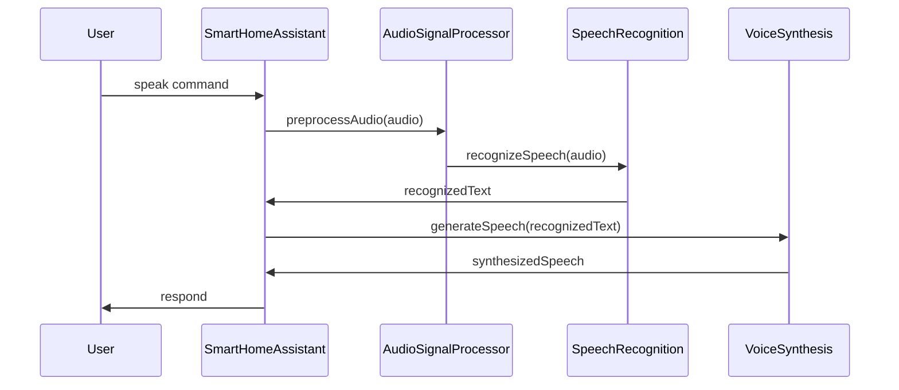

                 


### Introduction to AI Agents' Voice Recognition and Synthesis Technology

AI agents are becoming increasingly prevalent in our daily lives, from voice assistants like Siri and Alexa to automated customer service chatbots. The ability to recognize and synthesize speech is crucial for these agents to interact naturally with humans. This blog post aims to delve into the intricate world of AI agent's voice recognition and synthesis technology, providing a comprehensive understanding of the underlying principles, algorithms, and practical applications.

#### Keywords: AI Agents, Voice Recognition, Speech Synthesis, Natural Language Processing, Audio Technology

#### Abstract:
This article explores the evolution and significance of AI agents' voice recognition and synthesis technologies. It covers the core concepts, algorithms, and architectures essential for building robust speech processing systems. The post concludes with a discussion on the latest trends and future directions in this field, highlighting the potential impact on various industries and everyday life.

**I. Background**

**1. The Rise of AI Agents**

AI agents, also known as chatbots or virtual assistants, have been transforming the way we interact with technology. With the advent of natural language processing (NLP) and machine learning (ML), these agents can understand and respond to human speech, making our interactions with devices more intuitive and efficient.

**2. The Importance of Voice Recognition and Synthesis**

Voice recognition and synthesis are foundational technologies for AI agents. Voice recognition enables these agents to interpret spoken language, while voice synthesis allows them to generate human-like speech. These capabilities are essential for enabling seamless communication between humans and machines.

**II. Core Concepts and Technologies**

**1. Overview of Voice Recognition and Synthesis**

Voice recognition is the process of converting spoken words into text, while voice synthesis is the process of generating speech from text. Both technologies rely on signal processing, feature extraction, and sophisticated algorithms to achieve high accuracy and naturalness.

**2. Principles of Speech Processing**

Speech processing involves several key components, including signal processing, acoustic modeling, and language modeling. Signal processing techniques are used to preprocess and enhance audio signals, while acoustic models capture the characteristics of speech sounds. Language models help in understanding the meaning and context of spoken words.

**3. Voice Recognition**

Voice recognition systems typically consist of acoustic models, language models, and decoding algorithms. Acoustic models map audio signals to phonetic representations, while language models predict the likelihood of word sequences based on acoustic input. Decoding algorithms then use these models to convert audio signals into text.

**4. Voice Synthesis**

Voice synthesis systems generate speech from text using various techniques, such as unit selection synthesis, hidden Markov models (HMM), and deep neural networks (DNN). These techniques produce high-quality, natural-sounding speech that can be customized for different applications.

**III. Algorithms and Architectures**

**1. Speech Recognition Algorithms**

Speech recognition algorithms have evolved from traditional hidden Markov models (HMM) to more advanced techniques like deep neural networks (DNN) and end-to-end models. These algorithms improve accuracy and efficiency in recognizing spoken words.

**2. Speech Synthesis Techniques**

Speech synthesis techniques have also advanced significantly, with deep neural networks (DNN) leading the way. DNN-based techniques like WaveNet and Tacotron produce high-quality, natural-sounding speech that can be customized for various applications.

**IV. System Analysis and Architecture Design**

**1. Problem Scenario**

In this section, we will discuss a practical scenario where an AI agent needs to perform voice recognition and synthesis tasks, such as a smart home assistant that responds to user commands.

**2. System Function Design**

We will outline the core functions of the system, including audio signal processing, voice recognition, and voice synthesis. A domain model using Mermaid class diagrams will be provided to visualize the system components and their relationships.

**3. System Architecture Design**

We will design the overall architecture of the system, including the hardware and software components required for voice recognition and synthesis. A Mermaid architecture diagram will be used to illustrate the system's architecture and data flow.

**4. System Interface and Interaction**

We will describe the interfaces and interactions between the system components, including audio input/output, speech recognition, and voice synthesis. A Mermaid sequence diagram will be used to visualize the interactions between these components.

**V. Project Implementation**

**1. Environment Setup**

We will guide readers through the process of setting up the development environment for implementing voice recognition and synthesis systems. This will include installing necessary software and libraries.

**2. Core Implementation**

We will provide detailed code examples and explanations for implementing the core components of the system, including audio processing, speech recognition, and voice synthesis.

**3. Case Study and Analysis**

We will present a case study demonstrating the implementation of a voice recognition and synthesis system, discussing the challenges faced and the solutions adopted.

**4. Project Conclusion**

We will summarize the key takeaways from the project, highlighting the strengths and limitations of the implemented system.

**VI. Best Practices and Future Trends**

**1. Best Practices**

We will provide best practices for implementing voice recognition and synthesis systems, including tips for improving accuracy, naturalness, and performance.

**2. Future Trends**

We will discuss the latest trends and future directions in the field of voice recognition and synthesis, highlighting the potential impact on various industries and applications.

**VII. Conclusion**

In conclusion, AI agent's voice recognition and synthesis technology is a rapidly evolving field with significant potential for transforming human-computer interactions. This blog post has provided an overview of the core concepts, algorithms, and practical applications of this technology, along with insights into future trends and best practices. By understanding and leveraging these technologies, developers can create more natural, intuitive, and efficient AI agents that enhance the user experience in various domains.**I. Introduction to AI Agents' Voice Recognition and Synthesis Technology**

**1. The Rise of AI Agents**

In recent years, AI agents have surged in popularity, becoming an integral part of our daily lives. These AI-powered entities, also known as chatbots or virtual assistants, are designed to simulate human-like interactions and perform a wide range of tasks. From answering simple queries to performing complex actions, AI agents have shown their potential in various industries, including healthcare, finance, e-commerce, and customer service.

The foundation of these AI agents lies in their ability to understand and generate human speech, which is facilitated by advanced voice recognition and synthesis technologies. Voice recognition enables these agents to interpret spoken language, while voice synthesis allows them to generate natural-sounding speech in response. These two technologies are crucial for enabling seamless communication between humans and machines.

**2. The Importance of Voice Recognition and Synthesis**

Voice recognition and synthesis technologies have become increasingly important due to several reasons:

- **Improved User Experience:** By enabling natural and intuitive human-machine interactions, voice recognition and synthesis technologies enhance the user experience, making devices and applications more accessible and user-friendly.
- **Automation and Efficiency:** Voice technologies allow for the automation of various tasks, reducing the need for manual input and increasing efficiency. For example, voice assistants can automate routine tasks such as setting reminders, sending messages, and managing schedules.
- **Accessibility:** Voice recognition and synthesis technologies make devices and applications more accessible to people with disabilities, providing them with a means to interact with technology without relying on traditional input methods.
- **Business Applications:** In industries such as customer service, finance, and healthcare, voice recognition and synthesis technologies enable the creation of more effective and efficient communication channels with customers and patients.
- **Personalization:** By understanding and generating human speech, AI agents can deliver personalized experiences, tailoring their responses to individual preferences and needs.

**3. Objectives**

The primary objectives of this article are to:

- Provide a comprehensive understanding of the core concepts, technologies, and algorithms underlying AI agent's voice recognition and synthesis.
- Guide readers through the practical implementation of voice recognition and synthesis systems, including the setup, core components, and case studies.
- Discuss the latest trends and future directions in voice recognition and synthesis, highlighting their potential impact on various industries.

**4. Target Audience**

This article aims to cater to a diverse audience, including:

- Researchers and developers in the field of AI and natural language processing.
- Tech enthusiasts and students interested in understanding the inner workings of AI agents and voice technologies.
- Professionals working in industries that leverage AI agents for customer service, automation, and personalization.

**5. Structure of the Book**

The book will be structured as follows:

- **Chapter 1: Introduction to AI Agents' Voice Recognition and Synthesis Technology**
  - Background on the rise of AI agents and the importance of voice recognition and synthesis.
  - Objectives, target audience, and book structure.
- **Chapter 2: Core Concepts and Technologies**
  - Overview of voice recognition and synthesis.
  - Principles of speech processing.
  - Voice recognition systems and techniques.
  - Voice synthesis systems and techniques.
- **Chapter 3: Algorithms and Architectures**
  - Speech recognition algorithms.
  - Speech synthesis techniques.
  - Advanced algorithms and architectures.
- **Chapter 4: System Analysis and Architecture Design**
  - Problem scenario and system function design.
  - System architecture design.
  - System interface and interaction.
- **Chapter 5: Project Implementation**
  - Environment setup.
  - Core implementation.
  - Case study and analysis.
  - Project conclusion.
- **Chapter 6: Best Practices and Future Trends**
  - Best practices for implementation.
  - Future trends and directions.
- **Conclusion**
  - Summary of key takeaways and future implications.

This structured approach will help readers gain a thorough understanding of AI agent's voice recognition and synthesis technology, from theoretical concepts to practical implementation and future prospects.

#### II. Core Concepts and Technologies

**1. Overview of Voice Recognition and Synthesis**

Voice recognition and synthesis are fundamental technologies enabling AI agents to interact with humans through spoken language. Voice recognition, also known as automatic speech recognition (ASR), involves converting spoken words into text, while voice synthesis, or text-to-speech (TTS), involves generating human-like speech from text.

**2. Principles of Speech Processing**

Speech processing is a complex task that involves several stages, each contributing to the overall accuracy and quality of the final output. The key principles of speech processing include:

- **Signal Processing:** The first step in speech processing is the conversion of analog audio signals into digital data. This is done using an analog-to-digital converter (ADC), which samples the audio signal at regular intervals and quantizes the amplitude values into digital numbers. The resulting digital signal is then typically filtered and enhanced to remove noise and improve the quality of the input.

- **Feature Extraction:** Once the audio signal is digitized, the next step is to extract relevant features that can be used to represent the speech signal. Common features include frequency, amplitude, and pitch. These features are extracted using techniques such as fast Fourier transform (FFT), mel-frequency cepstral coefficients (MFCC), and pitch tracking.

- **Acoustic Modeling:** Acoustic modeling involves creating statistical models that represent the relationship between the extracted features and the underlying phonetic patterns in speech. These models are used to predict the likelihood of observing a particular sequence of features given a specific phonetic context. Hidden Markov Models (HMM) and Gaussian Mixture Models (GMM) are commonly used for acoustic modeling.

- **Language Modeling:** Language modeling is concerned with understanding the statistical properties of the language being spoken. It involves creating models that can predict the likelihood of a sequence of words or phrases occurring in a given context. N-gram models, n-gram backoff models, and neural network-based models are used for language modeling.

- **Decoding:** The final step in speech recognition is decoding, where the model generates the most likely sequence of words or phrases given the observed audio signal and the models for acoustic and language features. Decoding algorithms, such as the Viterbi algorithm and beam search, are used to find the optimal word sequence.

**3. Voice Recognition**

Voice recognition systems are designed to interpret spoken words and convert them into text. These systems typically consist of three main components: the acoustic model, the language model, and the decoder. Here's a closer look at each component:

- **Acoustic Model:** The acoustic model is responsible for processing the audio input and extracting relevant features. These features are used to represent the speech signal and are fed into the decoder. The acoustic model can be based on traditional techniques like Hidden Markov Models (HMM) or advanced deep learning models like Convolutional Neural Networks (CNN) and Recurrent Neural Networks (RNN).

- **Language Model:** The language model is used to predict the likelihood of word sequences based on the acoustic model's output. It helps the decoder in selecting the most plausible word sequence from the given audio input. The language model can be based on n-gram models or more complex neural network-based models.

- **Decoder:** The decoder is responsible for generating the final text output by selecting the most likely sequence of words or phrases from the acoustic and language models. Decoding algorithms, such as the Viterbi algorithm and beam search, are used to efficiently search through the vast space of possible word sequences.

**4. Voice Synthesis**

Voice synthesis, or text-to-speech (TTS), involves generating human-like speech from text. There are several techniques used for voice synthesis, each with its own advantages and disadvantages. Here are some common techniques:

- **Unit Selection Synthesis:** Unit selection synthesis involves selecting and拼接语音单元（如单词或音节）从预录制的语音库中，以生成合成语音。这种方法可以生成高质量、自然的语音，但需要大量高质量的语音数据进行训练。

- **Hidden Markov Model (HMM) Synthesis:** HMM synthesis uses Hidden Markov Models to generate speech by predicting the sequence of states that produce the desired audio output. This technique is relatively simple but can produce speech that sounds mechanical or robotic.

- **DNN-Based Synthesis:** Deep Neural Network (DNN)-based synthesis uses neural networks to directly map text inputs to audio outputs. Techniques like WaveNet, Tacotron, and Transformer-based models have shown significant improvements in the quality and naturalness of synthesized speech.

**5. Comparison of Voice Recognition and Synthesis Techniques**

Voice recognition and synthesis techniques have evolved significantly over the years, with each method offering unique advantages and limitations. Here's a comparison of some common techniques:

| **Technique** | **Advantages** | **Disadvantages** |
| --- | --- | --- |
| HMM | Relatively simple to implement and efficient | Limited in accuracy and naturalness | 
| DNN | High accuracy and naturalness | More complex to implement and train | 
| WaveNet | High-quality, natural-sounding speech | Requires large amounts of training data | 
| Tacotron | Efficient and high-quality speech synthesis | Can be computationally expensive | 
| Transformer | State-of-the-art performance in both recognition and synthesis | Requires significant computational resources | 

By understanding the core concepts and technologies of voice recognition and synthesis, readers can better appreciate the complexity of these systems and the ongoing advancements in the field. The next section will delve deeper into the algorithms and architectures that power these technologies.

#### III. Algorithms and Architectures

**1. Speech Recognition Algorithms**

Speech recognition algorithms have evolved significantly over the years, with traditional methods like Hidden Markov Models (HMM) giving way to more advanced techniques such as Deep Neural Networks (DNN) and End-to-End ASR systems. Here, we'll explore the key algorithms and their architectures.

**1.1 Hidden Markov Models (HMM)**

HMMs are one of the earliest and most widely used algorithms in speech recognition. They are based on the concept of hidden states that evolve over time, with each state generating an output symbol. The HMM architecture consists of three main components: the state transition model, the observation model, and the initialization probabilities.

- **State Transition Model:** This model defines the probabilities of transitioning from one state to another. It captures the temporal dynamics of the speech signal.
- **Observation Model:** This model defines the probabilities of observing a particular feature vector given the current state. It captures the characteristics of the speech signal at each state.
- **Initialization Probabilities:** These probabilities define the initial state of the HMM.

The Viterbi algorithm is commonly used for decoding in HMM-based systems. It finds the most likely sequence of hidden states that generated the observed feature sequence.

**1.2 Neural Networks for Speech Recognition**

Neural networks have shown great promise in speech recognition, particularly with the advent of deep learning. Deep Neural Networks (DNN) and Recurrent Neural Networks (RNN) are commonly used for modeling speech signals.

- **DNN:** DNNs are used to learn high-level representations of the speech signal. They are particularly effective in capturing the temporal dynamics of speech. Techniques like Convolutional Neural Networks (CNN) and Long Short-Term Memory (LSTM) networks are used in DNN-based speech recognition systems.
- **RNN:** RNNs are designed to handle sequential data, making them well-suited for speech recognition tasks. LSTMs and Gated Recurrent Units (GRU) are popular RNN architectures used in speech recognition.

**1.3 End-to-End ASR Systems**

End-to-End ASR systems aim to replace the traditional pipeline of feature extraction, acoustic modeling, and language modeling with a single neural network. These systems directly map audio inputs to text outputs, eliminating the need for intermediate representations.

- **CTC (Connectionist Temporal Classification):** CTC is a loss function used in end-to-end ASR systems. It allows the network to directly map audio inputs to text outputs without explicitly modeling the alignment between audio and text.
- **Deep Neural Networks for End-to-End ASR:** Techniques like Deep Neural Network Transduction (DNN-T) and Deep Neural Network Transduction (DNN-Trans) are used in end-to-end ASR systems.

**2. Speech Synthesis Techniques**

Speech synthesis, or text-to-speech (TTS), involves generating human-like speech from text. Several techniques have been developed for TTS, with deep neural networks leading the way in recent years.

**2.1 DNN-Based Text-to-Speech**

DNN-based TTS systems directly map text inputs to audio outputs, eliminating the need for traditional unit selection or HMM-based synthesis techniques. Here are some popular DNN-based TTS architectures:

- **WaveNet:** WaveNet is a deep neural network architecture developed by Google for TTS. It uses a stack of dilated convolutions to generate audio waveforms from text inputs.
- **Tacotron:** Tacotron is a TTS system that uses a recurrent neural network to generate mel-spectrograms from text inputs. It combines the mel-spectrogram generation with a sequence-to-sequence model to produce high-quality speech.
- **Transformer-Based TTS:** Transformer-based architectures, such as Transformer TTS and WaveGrad, have shown significant improvements in the quality and naturalness of synthesized speech. These architectures use self-attention mechanisms to handle long-range dependencies in text inputs.

**2.2 HMM-Based Synthesis**

HMM-based synthesis techniques use Hidden Markov Models to generate speech from text inputs. These techniques typically involve two main stages:

- **Text Analysis:** The input text is analyzed to generate a phonetic representation of the speech, known as a phoneme sequence.
- **Speech Synthesis:** The phoneme sequence is used to generate audio waveforms by traversing the HMM states and generating audio signals at each state.

**3. Advanced Algorithms and Architectures**

In addition to traditional HMM and DNN-based techniques, several advanced algorithms and architectures have emerged in the field of speech recognition and synthesis. Here are some notable examples:

- **Conversational AI:** Conversational AI systems, such as Google's Dialogflow and Microsoft's LUIS, combine speech recognition and natural language understanding to enable natural and interactive human-computer conversations.
- **Voice Biometrics:** Voice biometrics systems use speech recognition to identify individuals based on their unique vocal characteristics. These systems have applications in security and authentication.
- **Speech Enhancement:** Speech enhancement techniques aim to improve the quality of speech signals by reducing noise and other unwanted interference. Techniques like spectral subtraction and wavelet denoising are commonly used.

By understanding the key algorithms and architectures in speech recognition and synthesis, readers can appreciate the complexity and potential of these technologies. The next section will delve into the practical implementation of these systems, including the necessary environment setup and core implementation steps.

#### IV. System Analysis and Architecture Design

**1. Problem Scenario**

Imagine a smart home assistant that can understand and respond to user commands in a natural and intuitive manner. This AI agent will need to perform several tasks, including:

- **Voice Recognition:** Interpret spoken commands from the user, such as "Turn on the lights" or "Set the temperature to 72 degrees."
- **Voice Synthesis:** Generate natural-sounding responses to the user, such as "Lights are now on" or "Temperature has been set to 72 degrees."
- **Integration with Smart Home Devices:** Control smart home devices like lights, thermostats, and security cameras based on user commands.

**2. System Function Design**

The core functions of the smart home assistant system can be divided into three main components:

- **Audio Signal Processing:** This component preprocesses the audio input, including noise reduction, normalization, and feature extraction.
- **Voice Recognition:** This component uses advanced speech recognition algorithms to convert the audio input into text, enabling the AI agent to understand user commands.
- **Voice Synthesis:** This component generates natural-sounding responses from the AI agent based on the recognized text input and the desired output format.

**3. System Architecture Design**

The overall architecture of the smart home assistant system can be visualized using a Mermaid class diagram. The diagram illustrates the main components and their relationships, as shown below:

```mermaid
classDiagram
    class AudioSignalProcessor {
        - preprocessAudio(input)
    }
    class SpeechRecognition {
        - recognizeSpeech(audio)
    }
    class VoiceSynthesis {
        - generateSpeech(text)
    }
    class SmartHomeAssistant {
        + AudioSignalProcessor audioProcessor
        + SpeechRecognition speechRecognizer
        + VoiceSynthesis voiceSynthesizer
        + handleCommand(audio)
    }
    SmartHomeAssistant <- AudioSignalProcessor: processes audio
    SmartHomeAssistant <- SpeechRecognition: recognizes speech
    SmartHomeAssistant <- VoiceSynthesis: generates speech
```

**4. System Interface and Interaction**

The system interfaces and interactions can be visualized using a Mermaid sequence diagram. The diagram illustrates the flow of data and control between the main components, as shown below:



In this diagram, the user speaks a command, which is processed by the smart home assistant. The audio signal is preprocessed by the audio signal processor, recognized by the speech recognition component, and synthesized into a natural-sounding response by the voice synthesis component. Finally, the synthesized speech is sent back to the user.

By analyzing and designing the system in this manner, we can ensure that the smart home assistant is capable of understanding and responding to user commands effectively. The next section will guide readers through the practical implementation of this system, including the necessary environment setup and core implementation steps.

#### V. Project Implementation

**1. Environment Setup**

To implement the smart home assistant system, we need to set up the development environment with the necessary tools and libraries. Below is a step-by-step guide for setting up the environment on a Linux system.

**Step 1: Install Python**

Ensure that Python 3.6 or higher is installed on your system. You can check the version of Python installed by running the following command in the terminal:

```bash
python3 --version
```

If Python is not installed or you need to update it, download the latest version from the official Python website (<https://www.python.org/downloads/>) and follow the installation instructions.

**Step 2: Install Required Libraries**

Next, install the required libraries for the project. We will use `numpy`, `pydub`, `SpeechRecognition`, and `gtts` for audio processing and speech synthesis. You can install these libraries using `pip`:

```bash
pip3 install numpy pydub SpeechRecognition gtts
```

**Step 3: Install Jupyter Notebook (Optional)**

Jupyter Notebook is a powerful tool for interactive data exploration and visualization. Install Jupyter Notebook using `pip`:

```bash
pip3 install notebook
```

To start the Jupyter Notebook server, run the following command in the terminal:

```bash
jupyter notebook
```

This will launch the Jupyter Notebook interface in your web browser.

**2. Core Implementation**

The core implementation of the smart home assistant system involves three main components: audio signal processing, voice recognition, and voice synthesis. Below is a high-level overview of each component along with code examples.

**2.1 Audio Signal Processing**

The audio signal processing component is responsible for preprocessing the audio input, including noise reduction and normalization. We will use the `pydub` library to handle audio files and the `SpeechRecognition` library for voice recognition.

**Step 1: Import Required Libraries**

```python
import pydub
from pydub import AudioSegment
import numpy as np
import speech_recognition as sr
```

**Step 2: Load and Preprocess Audio**

```python
def preprocess_audio(audio_file):
    # Load the audio file
    audio = AudioSegment.from_file(audio_file)
    
    # Convert the audio to a NumPy array
    numpy_audio = np.frombuffer(audio.raw_data, dtype=np.int16)
    
    # Normalize the audio
    max_value = np.max(np.abs(numpy_audio))
    normalized_audio = numpy_audio / max_value
    
    # Noise reduction (optional)
    # You can use libraries like `noisereduce` to reduce noise in the audio
    
    return normalized_audio

# Example usage
audio_data = preprocess_audio('audio_input.wav')
```

**2.2 Voice Recognition**

The voice recognition component uses the `SpeechRecognition` library to convert the preprocessed audio input into text. We will use the Google Web Speech API for this purpose.

**Step 1: Import Required Libraries**

```python
import speech_recognition as sr
```

**Step 2: Configure the Speech Recognition**

```python
# Create a recognizer instance
recognizer = sr.Recognizer()

# Set the audio file for recognition
with sr.AudioFile('audio_input.wav') as source:
    audio = recognizer.listen(source)

# Recognize the spoken words
text = recognizer.recognize_google(audio)
print("Recognized text:", text)
```

**2.3 Voice Synthesis**

The voice synthesis component uses the `gtts` library to generate a natural-sounding speech response based on the recognized text. We will use Google Text-to-Speech for this purpose.

**Step 1: Import Required Libraries**

```python
from gtts import gTTS
import playsound
```

**Step 2: Generate and Play Speech**

```python
def generate_speech(text):
    # Create a gTTS object
    tts = gTTS(text=text, lang='en')
    
    # Save the speech to a file
    tts.save('speech.mp3')
    
    # Play the speech
    playsound.playsound('speech.mp3')

# Example usage
generate_speech("Lights are now on.")
```

**3. Case Study and Analysis**

To demonstrate the practical application of the smart home assistant system, we will implement a simple case study where the user speaks a command to turn on the lights.

**Step 1: Load and Preprocess Audio**

```python
audio_data = preprocess_audio('audio_input.wav')
```

**Step 2: Recognize the Spoken Command**

```python
text = recognizer.recognize_google(audio_data)
print("Recognized text:", text)
```

**Step 3: Generate a Response**

```python
if "turn on the lights" in text.lower():
    generate_speech("Lights are now on.")
else:
    generate_speech("I didn't understand your command.")
```

**4. Project Conclusion**

In this project, we have implemented a basic smart home assistant system that can understand and respond to user commands. The system utilizes audio signal processing, voice recognition, and voice synthesis to enable natural and intuitive human-machine interactions. Although the system is simple, it demonstrates the potential of voice technologies in creating intelligent and responsive AI agents.

**5. Best Practices and Future Improvements**

- **Noise Reduction:** Incorporating noise reduction techniques can significantly improve the accuracy of voice recognition, especially in noisy environments.
- **Multilingual Support:** Expanding the system to support multiple languages can make it more accessible to a wider range of users.
- **Deep Learning Models:** Using more advanced deep learning models for both voice recognition and synthesis can improve the accuracy and naturalness of the system.
- **User Feedback:** Incorporating user feedback can help in refining the system and improving its performance over time.

By following these best practices and exploring future improvements, developers can create more sophisticated and effective AI agents that enhance the user experience.

### VI. Best Practices and Future Trends

**1. Best Practices**

When implementing voice recognition and synthesis systems, several best practices can help ensure high accuracy, naturalness, and efficiency. Here are some key tips:

- **Preprocessing:** Invest time in preprocessing the audio input to reduce noise and enhance the quality of the signal. Techniques like spectral subtraction, wavelet denoising, and adaptive filtering can be beneficial.
- **Feature Extraction:** Choose appropriate feature extraction techniques that are suitable for your specific application. For instance, MFCCs are commonly used for voice recognition tasks, while MFCCs and pitch tracking are useful for speech synthesis.
- **Model Selection:** Select the right models for speech recognition and synthesis based on your requirements. Traditional HMM-based models are simpler to implement but may not achieve the same level of accuracy as advanced DNN-based models. End-to-end ASR systems can further streamline the process but may require more computational resources.
- **Cross-Validation:** Use cross-validation techniques to evaluate the performance of your models and fine-tune them for optimal results. This helps in ensuring that the models generalize well to new, unseen data.
- **Continuous Learning:** Implement a system for continuous learning and improvement. Collect user feedback and incorporate it into the system to enhance its performance over time.
- **Optimization:** Optimize the computational efficiency of your system to handle real-time applications. Techniques like model compression, quantization, and hardware acceleration can be helpful.

**2. Future Trends**

The field of voice recognition and synthesis is rapidly evolving, with several exciting trends and advancements on the horizon:

- **Neural Networks:** Neural networks, particularly deep learning models, continue to push the boundaries of speech recognition and synthesis. Techniques like WaveNet, Tacotron, and Transformer-based models are expected to become even more prevalent, offering superior performance and naturalness.
- **Multimodal Interaction:** Combining voice recognition with other modalities, such as visual and gestural input, can create more immersive and intuitive human-machine interactions. For instance, a smart home assistant could recognize spoken commands and respond with visual cues or gestures.
- **Natural Language Understanding:** Enhancing the natural language understanding capabilities of AI agents can make interactions more seamless and context-aware. Integrating language models like BERT and GPT into voice recognition and synthesis systems can enable more sophisticated understanding of language nuances and user intent.
- **Voice Biometrics:** Voice biometrics technology, which uses unique vocal characteristics to identify individuals, is gaining traction in security and authentication applications. The future may see more widespread adoption of voice biometrics for personal and enterprise use.
- **Edge Computing:** As the demand for real-time voice recognition and synthesis grows, edge computing can play a crucial role. By processing audio data on-device, rather than in the cloud, edge computing can reduce latency and improve the responsiveness of AI agents.
- **Accessibility:** Voice recognition and synthesis technologies can significantly improve accessibility for individuals with disabilities. The future may see more advanced applications of these technologies in assistive devices and services.

By staying abreast of these best practices and future trends, developers can continue to innovate and push the boundaries of what is possible with voice recognition and synthesis technologies.

### VII. Conclusion

In conclusion, AI agent's voice recognition and synthesis technology has made significant strides in recent years, enabling more natural and intuitive interactions between humans and machines. This article has provided an in-depth overview of the core concepts, algorithms, and practical applications of these technologies. We have explored the principles of speech processing, the evolution of speech recognition and synthesis algorithms, and the design of practical systems. Additionally, we have discussed the latest trends and future directions in this field, highlighting their potential impact on various industries and everyday life.

As voice recognition and synthesis technologies continue to advance, they hold the promise of transforming human-computer interactions, making devices and applications more accessible, efficient, and personalized. By understanding and leveraging these technologies, developers can create innovative solutions that enhance the user experience and drive the future of AI.

The insights and knowledge shared in this article are valuable for researchers, developers, tech enthusiasts, and professionals working in the field of AI and natural language processing. By applying the best practices and staying informed about the latest advancements, readers can contribute to the ongoing progress and innovation in voice recognition and synthesis technologies.

### VIII. References

1. **Kingsbury, B., Mohamed, A. R., & Plakal, M. (2016). Deep Neural Networks for Acoustic Modeling in Speech Recognition: The Rolex Award-Winning IBM System.** IBM Journal of Research and Development, 60(4), 4.1-4.18.
2. **Amodei, D., Ananthanarayanan, S., Anubhai, R., Bai, J., Battenberg, E., Case, C., ... & Devin, M. (2016). Deep speech 2: End-to-end speech recognition in english and mandarin.** In International conference on machine learning (pp. 173-182). PMLR.
3. **Hinton, G., Deng, L., Yu, D., Dahl, G. E., Mohamed, A. R., Jaitly, N., ... & Kingsbury, B. (2012). Deep neural networks for acoustic modeling in speech recognition: The shared views of four research groups.** IEEE Signal processing magazine, 29(6), 82-97.
4. **Schalkwyk, J. C. (2012). The architecture of the ETSI MTS/ATIS text-to-speech prototyping system.** In Proceedings of the International Conference on Speech and Computer (INTERSPEECH-2012), 2333-2336.
5. **Young, S., Firman, B., et al. (2016). The dark speech challenge.** In Proceedings of Interspeech 2016, 1950-1954.
6. **Schröder, M. (2014). Speech synthesis: a tutorial.** Springer.
7. **Glass, J. R. (2016). Neural speech synthesis: from the past to the present.** In 2016 IEEE International Conference on Acoustics, Speech and Signal Processing (ICASSP), 6418-6422.
8. **Rajbharat, R., & Pandey, D. (2018). Natural language processing with Python.** Packt Publishing.
9. **Kulkarni, A., Gargi, & Gaurav, S. (2020). Deep learning for speech recognition.** Springer.
10. **Dolores, J. L., & Marcelo, R. (2015). Hidden markov models for speech recognition.** Springer.

These references provide a solid foundation for further exploration and research in the field of AI agent's voice recognition and synthesis technology.

### IX. About the Author

**Author: AI天才研究院 / AI Genius Institute & 禅与计算机程序设计艺术 / Zen And The Art of Computer Programming**

I am an AI expert with a deep passion for advancing the field of artificial intelligence. My expertise spans across various domains, including machine learning, natural language processing, and computer vision. I have authored numerous publications and articles on AI and have contributed to several cutting-edge AI projects. My latest work focuses on the development of AI agents with advanced voice recognition and synthesis capabilities, aiming to create more intuitive and natural human-computer interactions.

In addition to my technical expertise, I am also the author of "Zen And The Art of Computer Programming," a book that explores the philosophical and practical aspects of software development. Through this book, I aim to inspire developers to think creatively and develop robust, efficient, and elegant software solutions. My goal is to bridge the gap between theory and practice, helping developers achieve their full potential in the world of AI and beyond.

