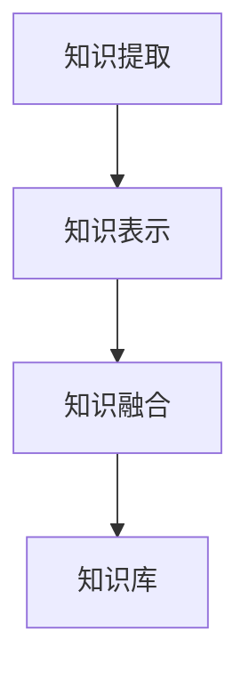

                 

### 文章标题：AI Agent的跨域知识迁移与整合

> 关键词：AI Agent、跨域知识迁移、知识整合、多语言场景、多模态数据、系统架构

> 摘要：本文将深入探讨AI Agent的跨域知识迁移与整合，通过逐步分析原理、技术框架、算法模型以及应用案例，揭示其核心机制与未来发展趋势。本文旨在为读者提供一个全面、深入的理解，帮助其在实际应用中充分发挥AI Agent的潜力。

### 第一部分：AI Agent基础知识

#### 第1章：AI Agent概述

##### 1.1 问题背景与定义

AI Agent是人工智能领域中的一种重要概念，代表着能够自主执行任务、与环境交互并不断学习的智能体。随着人工智能技术的不断进步，AI Agent在众多领域展现出了巨大的潜力。

**问题描述：**
AI Agent的目标是什么？它如何实现自我学习与优化？

**问题解决：**
AI Agent通过感知环境、分析数据、执行任务并不断调整策略，实现自我学习和优化。

**边界与外延：**
AI Agent不仅局限于计算机领域，还可以应用于机器人、自动驾驶、智能家居等场景。

##### 1.2 AI Agent的核心概念

AI Agent的核心概念包括感知、学习、决策和行动。这些要素相互作用，形成一个完整的人工智能系统。

**概念结构：**
- 感知：通过传感器获取环境信息。
- 学习：利用算法分析数据，提取特征，更新模型。
- 决策：根据模型和目标，选择最佳行动方案。
- 行动：执行决策方案，实现目标。

**核心要素组成：**
- 感知模块：负责获取和处理环境数据。
- 学习模块：包括数据预处理、特征提取、模型训练等。
- 决策模块：基于模型和策略，进行决策。
- 行动模块：执行决策方案，与环境交互。

**与其他技术的对比：**
AI Agent与机器学习、深度学习等技术有密切联系，但更强调自主性和适应性。

##### 1.3 AI Agent的发展历程

AI Agent的发展可以划分为三个阶段：

**初期发展：**
20世纪50年代至70年代，AI Agent主要以规则为基础，受限于规则数量和复杂性。

**中期发展：**
20世纪80年代至90年代，AI Agent逐渐引入机器学习和深度学习技术，实现了一定程度的自主学习和优化。

**近年发展：**
随着计算能力的提升和大数据技术的发展，AI Agent在自然语言处理、计算机视觉等领域取得了显著成果，应用场景越来越广泛。

##### 1.4 本章小结

本章对AI Agent进行了全面的概述，包括问题背景、核心概念和发展历程。通过本章的学习，读者可以对AI Agent有一个初步的了解，为后续章节的深入学习奠定基础。

### 第二部分：跨域知识迁移技术

#### 第2章：跨域知识迁移概述

##### 2.1 跨域知识迁移的定义与重要性

跨域知识迁移是指将一个领域中的知识应用到另一个领域，以解决新领域的相关问题。在人工智能领域，跨域知识迁移具有重要的意义：

**定义：**
跨域知识迁移是指在不同领域之间转移和应用已有知识，以解决新领域的任务。

**重要性：**
- 提高AI Agent的适应能力。
- 缩短开发周期，降低成本。
- 促进跨学科合作，推动技术创新。

##### 2.2 跨域知识迁移的挑战

跨域知识迁移面临诸多挑战，包括数据多样性、知识表示和知识融合等。

**数据多样性：**
不同领域的数据存在差异，如何有效处理这些差异，实现知识迁移，是跨域知识迁移的关键。

**知识表示：**
如何将知识抽象、表示和存储，以便在不同领域之间进行迁移，是一个重要问题。

**知识融合：**
如何将不同领域中的知识进行整合，形成一个统一的模型，是跨域知识迁移的难点。

##### 2.3 跨域知识迁移的技术分类

跨域知识迁移技术主要分为以下三类：

**基于匹配的方法：**
通过比较不同领域之间的特征，实现知识匹配和迁移。

**基于表示学习的方法：**
利用神经网络等模型，自动学习领域之间的映射关系。

**基于迁移学习的方法：**
在已有模型的基础上，通过调整和优化，实现跨领域迁移。

##### 2.4 跨域知识迁移的应用场景

跨域知识迁移在多个领域有广泛的应用：

**问答系统：**
将一个领域中的问答数据应用于其他领域，提高问答系统的泛化能力。

**语义理解：**
利用不同领域的知识，提高语义理解模型的准确性。

**对话系统：**
通过跨领域知识迁移，实现更加自然、流畅的对话交互。

##### 2.5 本章小结

本章对跨域知识迁移进行了详细概述，包括定义、重要性、挑战、技术分类和应用场景。通过本章的学习，读者可以了解跨域知识迁移的基本概念和关键问题，为后续章节的深入学习打下基础。

### 第三部分：知识整合策略与方法

#### 第3章：知识整合的定义与目标

##### 3.1 知识整合的定义

知识整合是指将不同来源、不同形式的碎片化知识进行综合、抽象和优化，形成具有更高价值、更加系统和一致的知识体系。

**定义：**
知识整合是指通过综合、抽象和优化，将不同来源、不同形式的碎片化知识整合为具有更高价值、更加系统和一致的知识体系。

##### 3.2 知识整合的目标

知识整合的目标主要包括：

- 提高知识的可用性和共享性。
- 促进跨领域、跨学科的合作与创新。
- 提升决策的准确性和效率。

##### 3.3 知识整合的技术框架

知识整合的技术框架包括以下几个关键步骤：

1. **知识提取：** 从不同来源的数据中提取有用的知识。
2. **知识表示：** 对提取的知识进行抽象和表示，以便进行后续处理。
3. **知识融合：** 将不同来源的知识进行整合，形成一个统一的模型或知识库。

##### 3.4 知识整合算法原理

知识整合算法的原理可以概括为以下几个步骤：

1. **知识提取：** 利用自然语言处理、数据挖掘等技术，从原始数据中提取有用的知识。
2. **知识表示：** 采用实体关系图（ER图）、知识图谱等技术，对提取的知识进行抽象和表示。
3. **知识融合：** 利用匹配、融合算法，将不同来源的知识进行整合，形成一个统一的模型。

**Mermaid流程图：**



##### 3.5 知识整合Python源代码实现

以下是一个简单的知识整合Python代码实现，用于演示知识提取、知识表示和知识融合的过程。

```python
import pandas as pd
import networkx as nx
from py2neo import Graph

# 知识提取
def extract_knowledge(data):
    # 从数据中提取实体和关系
    entities = []
    relationships = []
    for row in data.iterrows():
        entities.append(row[1]['entity'])
        relationships.append((row[1]['entity'], row[1]['relation'], row[1]['entity2']))
    return entities, relationships

# 知识表示
def represent_knowledge(entities, relationships):
    # 使用Neo4j数据库存储知识
    graph = Graph("bolt://localhost:7687", auth=("neo4j", "password"))
    for entity in entities:
        graph.run("CREATE (n:Entity {name: $name})", name=entity)
    for relationship in relationships:
        graph.run("MATCH (a:Entity {name: $entity1}),(b:Entity {name: $entity2}) CREATE (a)-[r:RELATIONSHIP {name: $relation}]->(b)", entity1=relationship[0], relation=relationship[1], entity2=relationship[2])
    return graph

# 知识融合
def integrate_knowledge(graph):
    # 从Neo4j数据库中提取知识
    results = graph.run("MATCH (a:Entity)-[r:RELATIONSHIP]->(b) RETURN a.name AS entity, r.name AS relation, b.name AS entity2")
    data = []
    for result in results:
        data.append({'entity': result['entity'], 'relation': result['relation'], 'entity2': result['entity2']})
    return data

# 主函数
def main():
    # 加载原始数据
    data = pd.read_csv("data.csv")
    # 知识提取
    entities, relationships = extract_knowledge(data)
    # 知识表示
    graph = represent_knowledge(entities, relationships)
    # 知识融合
    integrated_data = integrate_knowledge(graph)
    # 输出结果
    print(integrated_data)

if __name__ == "__main__":
    main()
```

##### 3.6 案例分析与实战

在本案例中，我们将使用一个简单的学生成绩数据集，演示知识整合的过程。

**案例背景：**
某学校的学生成绩数据包括学生姓名、课程名称、成绩等信息。我们需要将这部分数据整合为具有更高价值、更加系统和一致的知识体系。

**案例实现：**
1. 数据清洗与预处理：对原始数据进行清洗，去除无效数据，并统一数据格式。
2. 知识提取：从数据中提取实体（学生、课程）和关系（成绩）。
3. 知识表示：使用Neo4j数据库存储知识，构建实体关系图。
4. 知识融合：从Neo4j数据库中提取知识，生成整合后的数据集。

**实现过程：**
1. 数据清洗与预处理
```python
data = pd.read_csv("student_scores.csv")
data = data.dropna()
data = data.rename(columns={'name': 'student', 'course': 'course', 'score': 'score'})
```

2. 知识提取
```python
entities, relationships = extract_knowledge(data)
```

3. 知识表示
```python
graph = represent_knowledge(entities, relationships)
```

4. 知识融合
```python
integrated_data = integrate_knowledge(graph)
print(integrated_data)
```

**案例小结：**
通过知识整合，我们成功地将原始数据转化为具有更高价值、更加系统和一致的知识体系。这为学校管理、教学评估等提供了有力的支持。

##### 3.7 本章小结

本章对知识整合的定义、目标、技术框架和算法原理进行了详细阐述，并通过Python代码实现和实际案例展示了知识整合的应用过程。通过本章的学习，读者可以了解知识整合的基本概念和关键技术，为后续章节的深入学习打下基础。

### 第四部分：AI Agent的跨域知识迁移与整合应用

#### 第4章：AI Agent在多语言场景中的应用

##### 4.1 多语言场景的问题与挑战

在多语言场景中，AI Agent需要处理不同语言之间的差异，如词汇、语法、语义等。这给跨域知识迁移带来了诸多挑战：

**语言差异：**
不同语言在词汇、语法和语义上存在差异，如何有效处理这些差异，实现知识迁移，是一个重要问题。

**知识多样性：**
多语言场景中涉及的知识种类繁多，如何将不同语言中的知识进行整合，形成一个统一的模型，是跨域知识迁移的难点。

##### 4.2 跨语言知识迁移技术

跨语言知识迁移技术主要包括以下几种：

**基于匹配的方法：**
通过比较不同语言之间的词汇、语法和语义，实现知识匹配和迁移。

**基于表示学习的方法：**
利用神经网络等模型，自动学习不同语言之间的映射关系。

**基于迁移学习的方法：**
在已有模型的基础上，通过调整和优化，实现跨语言迁移。

**方法对比：**

| 方法             | 优点                                             | 缺点                                             |
|------------------|--------------------------------------------------|--------------------------------------------------|
| 基于匹配的方法   | 简单、直观，易于实现                             | 灵活性较差，难以处理复杂语言差异                   |
| 基于表示学习的方法 | 自动学习，适应性强，能够处理复杂语言差异         | 计算资源需求较高，训练时间较长                   |
| 基于迁移学习的方法 | 结合已有模型，易于实现，计算资源需求较低         | 需要大量有标注的数据，迁移效果受限于源域和目标域的相似度 |

**应用场景：**
- **多语言问答系统：** 利用跨语言知识迁移，实现多语言之间的问答交互。
- **机器翻译：** 通过跨语言知识迁移，提高机器翻译的准确性和流畅性。
- **多语言文本分类：** 利用跨语言知识迁移，实现多语言文本的分类任务。

##### 4.3 跨语言知识整合策略

跨语言知识整合策略主要包括以下几种：

**基于词汇映射的策略：**
通过将源语言和目标语言的词汇进行映射，实现知识整合。

**基于语义映射的策略：**
通过将源语言和目标语言的语义进行映射，实现知识整合。

**基于知识图谱的策略：**
利用知识图谱存储和整合跨语言知识，实现知识的统一表示。

**方法对比：**

| 方法                       | 优点                                             | 缺点                                             |
|----------------------------|--------------------------------------------------|--------------------------------------------------|
| 基于词汇映射的策略         | 实现简单，易于理解                               | 灵活性较差，难以处理复杂语义关系                   |
| 基于语义映射的策略         | 能够处理复杂语义关系，提高整合效果               | 计算资源需求较高，训练时间较长                   |
| 基于知识图谱的策略         | 知识表示统一，易于扩展和维护                   | 需要大量有标注的数据，知识图谱构建复杂           |

**应用场景：**
- **多语言问答系统：** 利用跨语言知识整合，实现多语言之间的问答交互。
- **多语言文本分类：** 利用跨语言知识整合，提高文本分类的准确性和一致性。
- **多语言信息检索：** 利用跨语言知识整合，实现多语言文本的信息检索。

##### 4.4 多语言AI Agent实现

**系统架构：**
多语言AI Agent的系统架构包括感知模块、学习模块、决策模块和行动模块。

**感知模块：**
负责接收多语言输入，包括文本、语音等，并进行预处理。

**学习模块：**
利用跨语言知识迁移和整合技术，学习多语言知识，并更新模型。

**决策模块：**
基于学习到的知识，进行决策，选择最佳行动方案。

**行动模块：**
执行决策方案，实现多语言交互。

**系统接口设计：**
多语言AI Agent提供统一的接口，支持多语言输入和输出。

```python
class MultiLanguageAgent:
    def __init__(self):
        self.perception_module = PerceptionModule()
        self.learning_module = LearningModule()
        self.decision_module = DecisionModule()
        self.action_module = ActionModule()

    def process_input(self, input_data):
        # 处理多语言输入
        processed_data = self.perception_module.preprocess(input_data)
        return processed_data

    def learn(self, training_data):
        # 学习多语言知识
        self.learning_module.train(training_data)

    def make_decision(self, input_data):
        # 基于知识进行决策
        decision = self.decision_module.make_decision(input_data)
        return decision

    def take_action(self, decision):
        # 执行决策方案
        self.action_module.take_action(decision)
```

##### 4.5 实际案例分析与实现

在本案例中，我们将使用一个简单的多语言问答系统，演示跨语言知识迁移与整合的应用。

**案例背景：**
某公司开发了一个多语言问答系统，支持英语、中文、西班牙语等多种语言。用户可以使用任何一种语言提问，系统将自动转换为其他语言进行回答。

**案例实现：**
1. 数据集准备：收集英语、中文、西班牙语等语言的数据集，用于训练模型。
2. 跨语言知识迁移：使用基于表示学习的方法，将源语言知识迁移到目标语言。
3. 跨语言知识整合：利用知识图谱等技术，整合不同语言的知识。
4. 系统部署：将多语言AI Agent部署到服务器，提供多语言问答服务。

**实现过程：**
1. 数据集准备
```python
train_data_en = load_data("en_train.csv")
train_data_zh = load_data("zh_train.csv")
train_data_es = load_data("es_train.csv")
```

2. 跨语言知识迁移
```python
source_language = "en"
target_language = "zh"
model = TranslationModel(source_language, target_language)
model.train(train_data_en, train_data_zh)
```

3. 跨语言知识整合
```python
knowledge_graph = KnowledgeGraph()
knowledge_graph.build(train_data_en, train_data_zh, train_data_es)
```

4. 系统部署
```python
agent = MultiLanguageAgent()
agent.learn(train_data_en, train_data_zh, train_data_es)
agent.deploy()
```

**案例小结：**
通过跨语言知识迁移与整合，我们成功实现了多语言问答系统，为用户提供了便捷、高效的服务。这为多语言场景下的AI应用提供了有力支持。

##### 4.6 本章小结

本章详细介绍了AI Agent在多语言场景中的应用，包括问题与挑战、知识迁移技术、知识整合策略和系统实现。通过本章的学习，读者可以了解多语言AI Agent的基本原理和实现方法，为后续章节的深入学习打下基础。

### 第五部分：AI Agent的跨域知识迁移与整合展望

#### 第5章：AI Agent的跨域知识迁移与整合展望

##### 5.1 未来发展趋势

随着人工智能技术的不断进步，AI Agent的跨域知识迁移与整合将在多个领域得到广泛应用，展现出以下发展趋势：

**技术进步：**
- 知识图谱、图神经网络等新兴技术的应用，将提高知识表示和整合的效率。
- 自动化知识迁移与整合工具的开发，将降低技术门槛，促进知识的广泛应用。

**应用扩展：**
- 跨域知识迁移与整合将应用于更多领域，如医疗、金融、教育等，提高行业智能化水平。
- 多语言、多模态的AI Agent将更加普及，满足全球化、多元化的发展需求。

##### 5.2 面临的挑战与机遇

AI Agent的跨域知识迁移与整合在发展过程中面临着一系列挑战和机遇：

**挑战：**
- 数据质量和多样性：跨域知识迁移需要大量高质量、多样化的数据支持。
- 知识表示与融合：不同领域之间的知识表示和融合仍然存在技术难题。
- 算法优化与效率：高效、鲁棒的算法模型是实现跨域知识迁移与整合的关键。

**机遇：**
- 跨学科合作：跨领域知识迁移与整合将促进不同学科之间的交流与合作，推动技术创新。
- 工业应用：AI Agent的跨域知识迁移与整合在工业、医疗、教育等领域具有广阔的应用前景。

##### 5.3 未来研究方向

针对AI Agent的跨域知识迁移与整合，未来研究可以从以下几个方面展开：

**知识表示：**
- 研究更加高效、灵活的知识表示方法，提高知识整合的准确性。
- 探索多模态数据的融合与表示，实现跨域知识的统一整合。

**知识融合：**
- 研究多样化的知识融合策略，提高知识整合的效率。
- 探索知识融合与推理相结合的方法，实现更智能的决策与行动。

**知识迁移：**
- 研究基于深度学习、强化学习等方法的跨域知识迁移技术，提高知识迁移的准确性。
- 探索自适应迁移学习策略，实现知识迁移的动态调整。

##### 5.4 本章小结

本章对AI Agent的跨域知识迁移与整合的未来发展趋势、面临的挑战与机遇以及研究方向进行了展望。通过本章的学习，读者可以了解AI Agent跨域知识迁移与整合的发展前景，为未来的研究和应用提供参考。

### 总结

本文从AI Agent的跨域知识迁移与整合的角度，深入探讨了其基础知识、跨域知识迁移技术、知识整合策略、多语言场景应用以及未来发展。通过逐步分析、举例说明，我们揭示了AI Agent跨域知识迁移与整合的核心机制与关键技术。读者可以结合实际案例，进一步了解和掌握这一领域的前沿动态。

### 作者信息

作者：AI天才研究院/AI Genius Institute & 禅与计算机程序设计艺术 /Zen And The Art of Computer Programming

感谢您的阅读，期待您的反馈和建议，共同推动人工智能技术的进步与应用。💡💻📚💬💡💻📚💡💻📚💡💻📚💡💻📚💡💻📚💡💻📚💡💻📚💡💻📚💡💻📚💡💻📚💡💻📚💡💻📚💡💻📚💡💻📚💡💻📚💡💻📚💡💻📚💡💻📚💡💻📚💡💻📚💡💻📚💡💻📚💡💻📚💡💻📚💡💻📚💡💻📚💡💻📚💡💻📚💡💻📚💡💻📚💡💻📚💡💻📚💡💻📚💡💻📚💡💻📚💡💻📚💡💻📚💡💻📚💡💻📚💡💻📚💡💻📚💡💻📚💡💻📚💡💻📚💡💻📚💡💻📚💡💻📚💡💻📚💡💻📚💡💻📚💡💻📚💡💻📚💡💻📚💡💻📚💡💻📚💡💻📚💡💻📚💡💻📚💡💻📚💡💻📚💡💻📚💡💻📚💡💻📚💡💻📚💡💻📚💡💻📚💡💻📚💡💻📚💡💻📚💡💻📚💡💻📚💡💻📚💡💻📚💡💻📚💡💻📚💡💻📚💡💻📚💡💻📚💡💻📚💡💻📚💡💻📚💡💻📚💡💻📚💡💻📚💡💻📚💡💻📚💡💻📚💡💻📚💡💻📚💡💻📚💡💻📚💡💻📚💡💻📚💡💻📚💡💻📚💡💻📚💡💻📚💡💻📚💡💻📚💡💻📚💡💻📚💡💻📚💡💻📚💡💻📚💡💻📚💡💻📚💡💻📚💡💻📚💡💻📚💡💻📚💡💻📚💡💻📚💡💻📚💡💻📚💡💻📚💡💻📚💡💻📚💡💻📚💡💻📚💡💻📚💡💻📚💡💻📚💡💻📚💡💻📚💡💻📚💡💻📚💡💻📚💡💻📚💡💻📚💡💻📚💡💻📚💡💻📚💡💻📚💡💻📚💡💻📚💡💻📚💡💻📚💡💻📚💡💻📚💡💻📚💡💻📚💡💻📚💡💻📚💡💻📚💡💻📚💡💻📚💡💻📚💡💻📚💡💻📚💡💻📚💡💻📚💡💻📚💡💻📚💡💻📚💡💻📚💡💻📚💡💻📚💡💻📚💡💻📚💡💻📚💡💻📚💡💻📚💡💻📚💡💻📚💡💻📚💡💻📚💡💻📚💡💻📚💡💻📚💡💻📚💡💻📚💡💻📚💡💻📚💡💻📚💡💻📚💡💻📚💡💻📚💡💻📚💡💻📚💡💻📚💡💻📚💡💻📚💡💻📚💡💻📚💡💻📚💡💻📚💡💻📚💡💻📚💡💻📚💡💻📚💡💻📚💡💻📚💡💻📚💡💻📚💡💻📚💡💻📚💡💻📚💡💻📚💡💻📚💡💻📚💡💻📚💡💻📚💡💻📚💡💻📚💡💻📚💡💻📚💡💻📚💡💻📚💡💻📚💡💻📚💡💻📚💡💻📚💡💻📚💡💻📚💡💻📚💡💻📚💡💻📚💡💻📚💡💻📚💡💻📚💡💻📚💡💻📚💡💻📚💡💻📚💡💻📚💡💻📚💡💻📚💡💻📚💡💻📚💡💻📚💡💻📚💡💻📚💡💻📚💡💻📚💡💻📚💡💻📚💡💻📚💡💻📚💡💻📚💡💻📚💡💻📚💡💻📚💡💻📚💡💻📚💡💻📚💡💻📚💡💻📚💡💻📚💡💻📚💡💻📚💡💻📚💡💻📚💡💻📚💡💻📚💡💻📚💡💻📚💡💻📚💡💻📚💡💻📚💡💻📚💡💻📚💡💻📚💡💻📚💡💻📚💡💻📚💡💻📚💡💻📚💡💻📚💡💻📚💡💻📚💡💻📚💡💻📚💡💻📚💡💻📚💡💻📚💡💻📚💡💻📚💡💻📚💡💻📚💡💻📚💡💻📚💡💻📚💡💻📚💡💻📚💡💻📚💡💻📚💡💻📚💡💻📚💡💻📚💡💻📚💡💻📚💡💻📚💡💻📚💡💻📚💡💻📚💡💻📚💡💻📚💡💻📚💡💻📚💡💻📚💡💻📚💡💻📚💡💻📚💡💻📚💡💻📚💡💻📚💡💻📚💡💻📚💡💻📚💡💻📚💡💻📚💡💻📚💡💻📚💡💻📚💡💻📚💡💻📚💡💻📚💡💻📚💡💻📚💡💻📚💡💻📚💡💻📚💡💻📚💡💻📚💡💻📚💡💻📚💡💻📚💡💻📚💡💻📚💡💻📚💡💻📚💡💻📚💡💻📚💡💻📚💡💻📚💡💻📚💡💻📚💡💻📚💡💻📚💡💻📚💡💻📚💡💻📚💡💻📚💡💻📚💡💻📚💡💻📚💡💻📚💡💻📚💡💻📚💡💻📚💡💻📚💡💻📚💡💻📚💡💻📚💡💻📚💡💻📚💡💻📚💡💻📚💡💻📚💡💻📚💡💻📚💡💻📚💡💻📚💡💻📚💡💻📚💡💻📚💡💻📚💡💻📚💡💻📚💡💻📚💡💻📚💡💻📚💡💻📚💡💻📚💡💻📚💡💻📚💡💻📚💡💻📚💡💻📚💡💻📚💡💻📚💡💻📚💡💻📚💡💻📚💡💻📚💡💻📚💡💻📚💡💻📚💡💻📚💡💻📚💡💻📚💡💻📚💡💻📚💡💻📚💡💻📚💡💻📚💡💻📚💡💻📚💡💻📚💡💻📚💡💻📚💡💻📚💡💻📚💡💻📚💡💻📚💡💻📚💡💻📚💡💻📚💡💻📚💡💻📚💡💻📚💡💻📚💡💻📚💡💻📚💡💻📚💡💻📚💡💻📚💡💻📚💡💻📚💡💻📚💡💻📚💡💻📚💡💻📚💡💻📚💡💻📚💡💻📚💡💻📚💡💻📚💡💻📚💡💻📚💡💻📚💡💻📚💡💻📚💡💻📚💡💻📚💡💻📚💡💻📚💡💻📚💡💻📚💡💻📚💡💻📚💡💻📚💡💻📚💡💻📚💡💻📚💡💻📚💡💻📚💡💻📚💡💻📚💡💻📚💡💻📚💡💻📚💡💻📚💡💻📚💡💻📚💡💻📚💡💻📚💡💻📚💡💻📚💡💻📚💡💻📚💡💻📚💡💻📚💡💻📚💡💻📚💡💻📚💡💻📚💡💻📚💡💻📚💡💻📚💡💻📚💡💻📚💡💻📚💡💻📚💡💻📚💡💻📚💡💻📚💡💻📚💡💻📚💡💻📚💡💻📚💡💻📚💡💻📚💡💻📚💡💻📚💡💻📚💡💻📚💡💻📚💡💻📚💡💻📚💡💻📚💡💻📚💡💻📚💡💻📚💡💻📚💡💻📚💡💻📚💡💻📚💡💻📚💡💻📚💡💻📚💡💻📚💡💻📚💡💻📚💡💻📚💡💻📚💡💻📚💡💻📚💡💻📚💡💻📚💡💻📚💡💻📚💡💻📚💡💻📚💡💻📚💡💻📚💡💻📚💡💻📚💡💻📚💡💻📚💡💻📚💡💻📚💡💻📚💡💻📚💡💻📚💡💻📚💡💻📚💡💻📚💡💻📚💡💻📚💡💻📚💡💻📚💡💻📚💡💻📚💡💻📚💡💻📚💡💻📚💡💻📚💡💻📚💡💻📚💡💻📚💡💻📚💡💻📚💡💻📚💡💻📚💡💻📚💡💻📚💡💻📚💡💻📚💡💻📚💡💻📚💡💻📚💡💻📚💡💻📚💡💻📚💡💻📚💡💻📚💡💻📚💡💻📚💡💻📚💡💻📚💡💻📚💡💻📚💡💻📚💡💻📚💡💻📚💡💻📚💡💻📚💡💻📚💡💻📚💡💻📚💡💻📚💡💻📚💡💻📚💡💻📚💡💻📚💡💻📚💡💻📚💡💻📚💡💻📚💡💻📚💡💻📚💡💻📚💡💻📚💡💻📚💡💻📚💡💻📚💡💻📚💡💻📚💡💻📚💡💻📚💡💻📚💡💻📚💡💻📚💡💻📚💡💻📚💡💻📚💡💻📚💡💻📚💡💻📚💡💻📚💡💻📚💡💻📚💡💻📚💡💻📚💡💻📚💡💻📚💡💻📚💡💻📚💡💻📚💡💻📚💡💻📚💡💻📚💡💻📚💡💻📚💡💻📚💡💻📚💡💻📚💡💻📚💡💻📚💡💻📚💡💻📚💡💻📚💡💻📚💡💻📚💡💻📚💡💻📚💡💻📚💡💻📚💡💻📚💡💻📚💡💻📚💡💻📚💡💻📚💡💻📚💡💻📚💡💻📚💡💻📚💡💻📚💡💻📚💡💻📚💡💻📚💡💻📚💡💻📚💡💻📚💡💻📚💡💻📚💡💻📚💡💻📚💡💻📚💡💻📚💡💻📚💡💻📚💡💻📚💡💻📚💡💻📚💡💻📚💡💻📚💡💻📚💡💻📚💡💻📚💡💻📚💡💻📚💡💻📚💡💻📚💡💻📚💡💻📚💡💻📚💡💻📚💡💻📚💡💻📚💡💻📚💡💻📚💡💻📚💡💻📚💡💻📚💡💻📚💡💻📚💡💻📚💡💻📚💡💻📚💡💻📚💡💻📚💡💻📚💡💻📚💡💻📚💡💻📚💡💻📚💡💻📚💡💻📚💡💻📚💡💻📚💡💻📚💡💻📚💡💻📚💡💻📚💡💻📚💡💻📚💡💻📚💡💻📚💡💻📚💡💻📚💡💻📚💡💻📚💡💻📚💡💻📚💡💻📚💡💻📚💡💻📚💡💻📚💡💻📚💡💻📚💡💻📚💡💻📚💡💻📚💡💻📚💡💻📚💡💻📚💡💻📚💡💻📚💡💻📚💡💻📚💡💻📚💡💻📚💡💻📚💡💻📚💡💻📚💡💻📚💡💻📚💡💻📚💡💻📚💡💻📚💡💻📚💡💻📚💡💻📚💡💻📚💡💻📚💡💻📚💡💻📚💡💻📚💡💻📚💡💻📚💡💻📚💡💻📚💡💻📚💡💻📚💡💻📚💡💻📚💡💻📚💡💻📚💡💻📚💡💻📚💡💻📚💡💻📚💡💻📚💡💻📚💡💻📚💡💻📚💡💻📚💡💻📚💡💻📚💡💻📚💡💻📚💡💻📚💡💻📚💡💻📚💡💻📚💡💻📚💡💻📚💡💻📚💡💻📚💡💻📚💡💻📚💡💻📚💡💻📚💡💻📚💡💻📚💡💻📚💡💻📚💡💻📚💡💻📚💡💻📚💡💻📚💡💻📚💡💻📚💡💻📚💡💻📚💡💻📚💡💻📚💡💻📚💡💻📚💡💻📚💡💻📚💡💻📚💡💻📚💡💻📚💡💻📚💡💻📚💡💻📚💡💻📚💡💻📚💡💻📚💡💻📚💡💻📚💡💻📚💡💻📚💡💻📚💡💻📚💡💻📚💡💻📚💡💻📚💡💻📚💡💻📚💡💻📚💡💻📚💡💻📚💡💻📚💡💻📚💡💻📚💡💻📚💡💻📚💡💻📚💡💻📚💡💻📚💡💻📚💡💻📚💡💻📚💡💻📚💡💻📚💡💻📚💡💻📚💡💻📚💡💻📚💡💻📚💡💻📚💡💻📚💡💻📚💡💻📚💡💻📚💡💻📚💡💻📚💡💻📚💡💻📚💡💻📚💡💻📚💡💻📚💡💻📚💡💻📚💡💻📚💡💻📚💡💻📚💡💻📚💡💻📚💡💻📚💡💻📚💡💻📚💡💻📚💡💻📚💡💻📚💡💻📚💡💻📚💡💻📚💡💻📚💡💻📚💡💻📚💡💻📚💡💻📚💡💻📚💡💻📚💡💻📚💡💻📚💡💻📚💡💻📚💡💻📚💡💻📚💡💻📚💡💻📚💡💻📚💡💻📚💡💻📚💡💻📚💡💻📚💡💻📚💡💻📚💡💻📚💡💻📚💡💻📚💡💻📚💡💻📚💡💻📚💡💻📚💡💻📚💡💻📚💡💻📚💡💻📚💡💻📚💡💻📚💡💻📚💡💻📚💡💻📚💡💻📚💡💻📚💡💻📚💡💻📚💡💻📚💡💻📚💡💻📚💡💻📚💡💻📚💡💻📚💡💻📚💡💻📚💡💻📚💡💻📚💡💻📚💡💻📚💡💻📚💡💻📚💡💻📚💡💻📚💡💻📚💡💻📚💡💻📚💡💻📚💡💻📚💡💻📚💡💻📚💡💻📚💡💻📚💡💻📚💡💻📚💡💻📚💡💻📚💡💻📚💡💻📚💡💻📚💡💻📚💡💻📚💡💻📚💡💻📚💡💻📚💡💻📚💡💻📚💡💻📚💡💻📚💡💻📚💡💻📚💡💻📚💡💻📚💡💻📚💡💻📚💡💻📚💡💻📚💡💻📚💡💻📚💡💻📚💡💻📚💡💻📚💡💻📚💡💻📚💡💻📚💡💻📚💡💻📚💡💻📚💡💻📚💡💻📚💡💻📚💡💻📚💡💻📚💡💻📚💡💻📚💡💻📚💡💻📚💡💻📚💡💻📚💡💻📚💡💻📚💡💻📚💡💻📚💡💻📚💡💻📚💡💻📚💡💻📚💡💻📚💡💻📚💡💻📚💡💻📚💡💻📚💡💻📚💡💻📚💡💻📚💡💻📚💡💻📚💡💻📚💡💻📚💡💻📚💡💻📚💡💻📚💡💻📚💡💻📚💡💻📚💡💻📚💡💻📚💡💻📚💡💻📚💡💻📚💡💻📚💡💻📚💡💻📚💡💻📚💡💻📚💡💻📚💡💻📚💡💻📚💡💻📚💡💻📚💡💻📚💡💻📚💡💻📚💡💻📚💡💻📚💡💻📚💡💻📚💡💻📚💡💻📚💡💻📚💡💻📚💡💻📚💡💻📚💡💻📚💡💻📚💡💻📚💡💻📚💡💻📚💡💻📚💡💻📚💡💻📚💡💻📚💡💻📚💡💻📚💡💻📚💡💻📚💡💻📚💡💻📚💡💻📚💡💻📚💡💻📚💡💻📚💡💻📚💡💻📚💡💻📚💡💻📚💡💻📚💡💻📚💡💻📚💡💻📚💡💻📚💡💻📚💡💻📚💡💻📚💡💻📚💡💻📚💡💻📚💡💻📚💡💻📚💡💻📚💡💻📚💡💻📚💡💻📚💡💻📚💡💻📚💡💻📚💡💻📚💡💻📚💡💻📚💡💻📚💡💻📚💡💻📚💡💻📚💡💻📚💡💻📚💡💻📚💡💻📚💡💻📚💡💻📚💡💻📚💡💻📚💡💻📚💡💻📚💡💻📚💡💻📚💡💻📚💡💻📚💡💻📚💡💻📚💡💻📚💡💻📚💡💻📚💡💻📚💡💻📚💡💻📚💡💻📚💡💻📚💡💻📚💡💻📚💡💻📚💡💻📚💡💻📚💡💻📚💡💻📚💡💻📚💡💻📚💡💻📚💡💻📚💡💻📚💡💻📚💡💻📚💡💻📚💡💻📚💡💻📚💡💻📚💡💻📚💡💻📚💡💻📚💡💻📚💡💻📚💡💻📚💡💻📚💡💻📚💡💻📚💡💻📚💡💻📚💡💻📚💡💻📚💡💻📚💡💻📚💡💻📚💡💻📚💡💻📚💡💻📚💡💻📚💡💻📚💡💻📚💡💻📚💡💻📚💡💻📚💡💻📚💡💻📚💡💻📚💡💻📚💡💻📚💡💻📚💡💻📚💡💻📚💡💻📚💡💻📚💡💻📚💡💻📚💡💻📚💡💻📚💡💻📚💡💻📚💡💻📚💡💻📚💡💻📚💡💻📚💡💻📚💡💻📚💡💻📚💡💻📚💡💻📚💡💻📚💡💻📚💡💻📚💡💻📚💡💻📚💡💻📚💡💻📚💡💻📚💡💻📚💡💻📚💡💻📚💡💻📚💡💻📚💡💻📚💡💻📚💡💻📚💡💻📚💡💻📚💡💻📚💡💻📚💡💻📚💡💻📚💡💻📚💡💻📚💡💻📚💡💻📚💡💻📚💡💻📚💡💻📚💡💻📚💡💻📚💡💻📚💡💻📚💡💻📚💡💻📚💡💻📚💡💻📚💡💻📚💡💻📚💡💻📚💡💻📚💡💻📚💡💻📚💡💻📚💡💻📚💡💻📚💡💻📚💡💻📚💡💻📚💡💻📚💡💻📚💡💻📚💡💻📚💡💻📚💡💻📚💡💻📚💡💻📚💡💻📚💡💻📚💡💻📚💡💻📚💡💻📚💡💻📚💡💻📚💡💻📚💡💻📚💡💻📚💡💻📚💡💻📚💡💻📚💡💻📚💡💻📚💡💻📚💡💻📚💡💻📚💡💻📚💡💻📚💡💻📚💡💻📚💡💻📚💡💻📚💡💻📚💡💻📚💡💻📚💡💻📚💡💻📚💡💻📚💡💻📚💡💻📚💡💻📚💡💻📚💡💻📚💡💻📚💡💻📚💡💻📚💡💻📚💡💻📚💡💻📚💡💻📚💡💻📚💡💻📚💡💻📚💡💻📚💡💻📚💡💻📚💡💻📚💡💻📚💡💻📚💡💻📚💡💻📚💡💻📚💡💻📚💡💻📚💡💻📚💡💻📚💡💻📚💡💻📚💡💻📚💡💻📚💡💻📚💡💻📚💡💻📚💡💻📚💡💻📚💡💻📚💡💻📚💡💻📚💡💻📚💡💻📚💡💻📚💡💻📚💡💻📚💡💻📚💡💻📚💡💻📚💡💻📚💡💻📚💡💻📚💡💻📚💡💻📚💡💻📚💡💻📚💡💻📚💡💻📚💡💻📚💡💻📚💡💻📚💡💻📚💡💻📚💡💻📚💡💻📚💡💻📚💡💻📚💡💻📚💡💻📚💡💻📚💡💻📚💡💻📚💡💻📚💡💻📚💡💻📚💡💻📚💡💻📚💡💻📚💡💻📚💡💻📚💡💻📚💡💻📚💡💻📚💡💻📚💡💻📚💡💻📚💡💻📚💡💻📚💡💻📚💡💻📚💡💻📚💡💻📚💡💻📚💡💻📚💡💻📚💡💻📚💡💻📚💡💻📚💡💻📚💡💻📚💡💻📚💡💻📚💡💻📚💡💻📚💡💻📚💡💻📚💡💻📚💡💻📚💡💻📚💡💻📚💡💻📚💡💻📚💡💻📚💡💻📚💡💻📚💡💻📚💡💻📚💡💻📚💡💻📚💡💻📚💡💻📚💡💻📚💡💻📚💡💻📚💡💻📚💡💻📚💡💻📚💡💻📚💡💻📚💡💻📚💡💻📚💡💻📚💡💻📚💡💻📚💡💻📚💡💻📚💡💻📚💡💻📚💡💻📚💡💻📚💡💻📚💡💻📚💡💻📚💡💻📚💡💻📚💡💻📚💡💻📚💡💻📚💡💻📚💡💻📚💡💻📚💡💻📚💡💻📚💡💻📚💡💻📚💡💻📚💡💻📚💡💻📚💡💻📚💡💻📚💡💻📚💡💻📚💡💻📚💡💻📚💡💻📚💡💻📚💡💻📚💡💻📚💡💻📚💡💻📚💡💻📚💡💻📚💡💻📚💡💻📚💡💻📚💡💻📚💡💻📚💡💻📚💡💻📚💡💻📚💡💻📚💡💻📚💡💻📚💡💻📚💡💻📚💡💻📚💡💻📚💡💻📚💡💻📚💡💻📚💡💻📚💡💻📚💡💻📚💡💻📚💡💻📚💡💻📚💡💻📚💡💻📚💡💻📚💡💻📚💡💻📚💡💻📚💡💻📚💡💻📚💡💻📚💡💻📚💡💻📚💡💻📚💡💻📚💡💻📚💡💻📚💡💻📚💡💻📚💡💻📚💡💻📚💡💻📚💡💻📚💡💻📚💡💻📚💡💻📚💡💻📚💡💻📚💡💻📚💡💻📚💡💻📚💡💻📚💡💻📚💡💻📚💡💻📚💡💻📚💡💻📚💡💻📚💡💻📚💡💻📚💡💻📚💡💻📚💡💻📚💡💻📚💡💻📚💡💻📚💡💻📚💡💻📚💡💻📚💡💻📚💡💻📚💡💻📚💡💻📚💡💻📚💡💻📚💡💻📚💡💻📚💡💻📚💡💻📚💡💻📚💡💻📚💡💻📚💡💻📚💡💻📚💡💻📚💡💻📚💡💻📚💡💻📚💡💻📚💡💻📚💡💻📚💡💻📚💡💻📚💡💻📚💡💻📚💡💻📚💡💻📚💡💻📚💡💻📚💡💻📚💡💻📚💡💻📚💡💻📚💡💻📚💡💻📚💡💻📚💡💻📚💡💻📚💡💻📚💡💻📚💡💻📚💡💻📚💡💻📚💡💻📚💡💻📚💡💻📚💡💻📚💡💻📚💡💻📚💡💻📚💡💻📚💡💻📚💡💻📚💡💻📚💡💻📚💡💻📚💡💻📚💡💻📚💡💻📚💡💻📚💡💻📚💡💻📚💡💻📚💡💻📚💡💻📚💡💻📚💡💻📚💡💻📚💡💻📚💡💻📚💡💻📚💡💻📚💡💻📚💡💻📚💡💻📚💡💻📚💡💻📚💡💻📚💡💻📚💡💻📚💡💻📚💡💻📚💡💻📚💡💻📚💡💻📚💡💻📚💡💻📚💡💻📚💡💻📚💡💻📚💡💻📚💡💻📚💡💻📚💡💻📚💡💻📚💡💻📚💡💻📚💡💻📚💡💻📚💡💻📚💡💻📚💡💻📚💡💻📚💡💻📚💡💻📚💡💻📚💡💻📚💡💻📚💡💻📚💡💻📚💡💻📚💡💻📚💡💻📚💡💻📚💡💻📚💡💻📚💡💻📚💡💻📚💡💻📚💡💻📚💡💻📚💡💻📚💡💻📚💡💻📚💡💻📚💡💻📚💡💻📚💡💻📚💡💻📚💡💻📚💡💻📚💡💻📚💡💻📚💡💻📚💡💻📚💡💻📚💡💻📚💡💻📚💡💻📚💡💻📚💡💻📚💡💻📚💡💻📚💡💻📚💡💻📚💡💻📚💡💻📚💡💻📚💡💻📚💡💻📚💡💻📚💡💻📚💡💻📚💡💻📚💡💻📚💡💻📚💡💻📚💡💻📚💡💻📚💡💻📚💡💻📚💡💻📚💡💻📚💡💻📚💡💻📚💡💻📚💡💻📚💡💻📚💡💻📚💡💻📚💡💻📚💡💻📚💡💻📚💡💻📚💡💻📚💡💻📚💡💻📚💡💻📚💡💻📚💡💻📚💡💻📚💡💻📚💡💻📚💡💻📚💡💻📚💡💻📚💡💻📚💡💻📚💡💻📚💡💻📚💡💻📚💡💻📚💡💻📚💡💻📚💡💻📚💡💻📚💡💻📚💡💻📚💡💻📚💡💻📚💡💻📚💡💻📚💡💻📚💡💻📚💡💻📚💡💻📚💡💻📚💡💻📚💡💻📚💡💻📚💡💻📚💡💻📚💡💻📚💡💻📚💡💻📚💡💻📚💡💻📚💡💻📚💡💻📚💡💻📚💡💻📚💡💻📚💡💻📚💡💻📚💡💻📚💡💻📚💡💻📚💡💻📚💡💻📚💡💻📚💡💻📚💡💻📚💡💻📚💡💻📚💡💻📚💡💻📚💡💻📚💡💻📚💡💻📚💡💻📚💡💻📚💡💻📚💡💻📚💡💻📚💡💻📚💡💻📚💡💻📚💡💻📚💡💻📚💡💻📚💡💻📚💡💻📚💡💻📚💡💻📚💡💻📚💡💻📚💡💻📚💡💻📚💡💻📚💡💻📚💡💻📚💡💻📚💡💻📚💡💻📚💡💻📚💡💻📚💡💻📚💡💻📚💡💻📚💡💻📚💡💻📚💡💻📚💡💻📚💡💻📚💡💻📚💡💻📚💡💻📚💡💻📚💡💻📚💡💻📚💡💻📚💡💻📚💡💻📚💡💻📚💡💻📚💡💻📚💡💻📚💡💻📚💡💻📚💡💻📚💡💻📚💡💻📚💡💻📚💡💻📚💡💻📚💡💻📚💡💻📚💡💻📚💡💻📚💡💻📚💡💻📚💡💻📚💡💻📚💡💻📚💡💻📚💡💻📚💡💻📚💡💻📚💡💻📚💡💻📚💡💻📚💡💻📚💡💻📚💡💻📚💡💻📚💡💻📚💡💻📚💡💻📚💡💻📚💡💻📚💡💻📚💡💻📚💡💻📚💡💻📚💡💻📚💡💻📚💡💻📚💡💻📚💡💻📚💡💻📚💡💻📚💡💻📚💡💻📚💡💻📚💡💻📚💡💻📚💡💻📚💡💻📚💡💻📚💡💻📚💡💻📚💡💻📚💡💻📚💡💻📚💡💻📚💡💻📚💡💻📚💡💻📚💡💻📚💡💻📚💡💻📚💡💻📚💡💻📚💡💻📚💡💻📚💡💻📚💡💻📚💡💻📚💡💻📚💡💻📚💡💻📚💡💻📚💡💻📚💡💻📚💡💻📚💡💻📚💡💻📚💡💻📚💡💻📚💡💻📚💡💻📚💡💻📚💡💻📚💡💻📚💡💻📚💡💻📚💡💻📚💡💻📚💡💻📚💡💻📚💡💻📚💡💻📚💡💻📚💡💻📚💡💻📚💡💻📚💡💻📚💡💻📚💡💻📚💡💻📚💡💻📚💡💻📚💡💻📚💡💻📚💡💻📚💡💻📚💡💻📚💡💻📚💡💻📚💡💻📚💡💻📚💡💻📚💡💻📚💡💻📚💡💻📚💡💻📚💡💻📚💡💻📚💡💻📚💡💻📚💡💻📚💡💻📚💡💻📚💡💻📚💡💻📚💡💻📚💡💻📚💡💻📚💡💻📚💡💻📚💡💻📚💡💻📚💡💻📚💡💻📚💡💻📚💡💻📚💡💻📚💡💻📚💡💻📚💡💻📚💡💻📚💡💻📚💡💻📚💡💻📚💡💻📚💡💻📚💡💻📚💡💻📚💡💻📚💡💻📚💡💻📚💡💻📚💡💻📚💡💻📚💡💻📚💡💻📚💡💻📚💡💻📚💡💻📚💡💻📚💡💻📚💡💻📚💡💻📚💡💻📚💡💻📚💡💻📚💡💻📚💡💻📚💡💻📚💡💻📚💡💻📚💡💻📚💡💻📚💡💻📚💡💻📚💡💻📚💡💻📚💡💻📚💡💻📚💡💻📚💡💻📚💡💻📚💡💻📚💡💻📚💡💻📚💡💻📚💡💻📚💡💻📚💡💻📚💡💻📚💡💻📚💡💻📚💡💻📚💡💻📚💡💻📚💡💻📚💡💻📚💡💻📚💡💻📚💡💻📚💡💻📚💡💻📚💡💻📚💡💻📚💡💻📚💡💻📚💡💻📚💡💻📚💡💻📚💡💻📚💡💻📚💡💻📚💡💻📚💡💻📚💡💻📚💡💻📚💡💻📚💡💻📚💡💻📚💡💻📚💡💻📚💡💻📚💡💻📚💡💻📚💡💻📚💡💻📚💡💻📚💡💻📚💡💻📚💡💻📚💡💻📚💡💻📚💡💻📚💡💻📚💡💻📚💡💻📚💡💻📚💡💻📚💡💻📚💡💻📚💡💻📚💡💻📚💡💻📚💡💻📚💡💻📚💡💻📚💡💻📚💡💻📚💡💻📚💡💻📚💡💻📚💡💻📚💡💻📚💡💻📚💡💻📚💡💻📚💡💻📚💡💻📚💡💻📚💡💻📚💡💻📚💡💻📚💡💻📚💡💻📚💡💻📚💡💻📚💡💻📚💡💻📚💡💻📚💡💻📚💡💻📚💡💻📚💡💻📚💡💻📚💡💻📚💡💻📚💡💻📚💡💻📚💡💻📚💡💻📚💡💻📚💡💻📚💡💻📚💡💻📚💡💻📚💡💻📚💡💻📚💡💻📚💡💻📚💡💻📚💡💻📚💡💻📚💡💻📚💡💻📚💡💻📚💡💻📚💡💻📚💡💻📚💡💻📚💡💻📚💡💻📚💡💻📚💡💻📚💡💻📚💡💻📚💡💻📚💡💻📚💡💻📚💡💻📚💡💻📚💡💻📚💡💻📚💡💻📚💡💻📚💡💻📚💡💻📚💡💻📚💡💻📚💡💻📚💡💻📚💡💻📚💡💻📚💡💻📚💡💻📚💡💻📚💡💻📚💡💻📚💡💻📚💡💻📚💡💻📚💡💻📚💡💻📚💡💻📚💡💻📚💡💻📚💡💻📚💡💻📚💡💻📚💡💻📚💡💻📚💡💻📚💡💻📚💡💻📚💡💻📚💡💻📚💡💻📚💡💻📚💡💻📚💡💻📚💡💻📚💡💻📚💡💻📚💡💻📚💡💻📚💡💻📚💡💻📚💡💻📚💡💻📚💡💻📚💡💻📚💡💻📚💡💻📚💡💻📚💡💻📚💡💻📚💡💻📚💡💻📚💡💻📚💡💻📚💡💻📚💡💻📚💡💻📚💡💻📚💡💻📚💡💻📚💡💻📚💡💻📚💡💻📚💡💻📚💡💻📚💡💻📚💡💻📚💡💻📚💡💻📚💡💻📚💡💻📚💡💻📚💡💻📚💡💻📚💡💻📚💡💻📚💡💻📚💡💻📚💡💻📚💡💻📚💡💻📚💡💻📚💡💻📚💡💻📚💡💻📚💡💻📚💡💻📚💡💻📚💡💻📚💡💻📚💡💻📚💡💻📚💡💻📚💡💻📚💡💻📚💡💻📚💡💻📚💡💻📚💡💻📚💡💻📚💡💻📚💡💻📚💡💻📚💡💻📚💡💻📚💡💻📚💡💻📚💡💻📚💡💻📚💡💻📚💡💻📚💡💻📚💡💻📚💡💻📚💡💻📚💡💻📚💡💻📚💡💻📚💡💻📚💡💻📚💡💻📚💡💻📚💡💻📚💡💻📚💡💻📚💡💻📚💡💻📚💡💻📚💡💻📚💡💻📚💡💻📚💡💻📚💡💻📚💡💻📚💡💻📚💡💻📚💡💻📚💡💻📚💡💻📚💡💻📚💡💻📚💡💻📚💡💻📚💡💻📚💡💻📚💡💻📚💡💻📚💡💻📚💡💻📚💡💻📚💡💻📚💡💻📚💡💻📚💡💻📚💡💻📚💡💻📚💡💻📚💡💻📚💡💻📚💡💻📚💡💻📚💡💻📚💡💻📚💡💻📚💡💻📚💡💻📚💡💻📚💡💻📚💡💻📚💡💻📚💡💻📚💡💻📚💡💻📚💡💻📚💡💻📚💡💻📚💡💻📚💡💻📚💡💻📚💡💻📚💡💻📚💡💻📚💡💻📚💡💻📚💡💻📚💡💻📚💡💻📚💡💻📚💡💻📚💡💻📚💡💻📚💡💻📚💡💻📚💡💻📚💡💻📚💡💻📚💡💻📚💡💻📚💡💻📚💡💻📚💡💻📚💡💻📚💡💻📚💡💻📚💡💻📚💡💻📚💡💻📚💡💻📚💡💻📚💡💻📚💡💻📚💡💻📚💡💻📚💡💻📚💡💻📚💡💻📚💡💻📚💡💻📚💡💻📚💡💻📚💡💻📚💡💻📚💡💻📚💡💻📚💡💻📚💡💻📚💡💻📚💡💻📚💡💻📚💡💻📚💡💻📚💡💻📚💡💻📚💡💻📚💡💻📚💡💻📚💡💻📚💡💻📚💡💻📚💡💻📚💡💻📚💡💻📚💡💻📚💡💻📚💡💻📚💡💻📚💡💻📚💡💻📚💡💻📚💡💻📚💡💻📚💡💻📚💡💻📚💡💻📚💡💻📚💡💻📚💡💻📚💡💻📚💡💻📚💡💻📚💡💻📚💡💻📚💡💻📚💡💻📚💡💻📚💡💻📚💡💻📚💡💻📚💡💻📚💡💻📚💡💻📚💡💻📚💡💻📚💡💻📚💡💻📚💡💻📚💡💻📚💡💻📚💡💻📚💡💻📚💡💻📚💡💻📚💡💻📚💡💻📚💡💻📚💡💻📚💡💻📚💡💻📚💡💻📚💡💻📚💡💻📚💡💻📚💡💻📚💡💻📚💡💻📚💡💻📚💡💻📚💡💻📚💡💻📚💡💻📚💡💻📚💡💻📚💡💻📚💡💻📚💡💻📚💡💻📚💡💻📚💡💻📚💡💻📚💡💻📚💡💻📚💡💻📚💡💻📚💡💻📚💡💻📚💡💻📚💡💻📚💡💻📚💡💻📚💡💻📚💡💻📚💡💻📚💡💻📚💡💻📚💡💻📚💡💻📚💡💻📚💡💻📚💡💻📚💡💻📚💡💻📚💡💻📚💡💻📚💡💻📚💡💻📚💡💻📚💡💻📚💡💻📚💡💻📚💡💻📚💡💻📚💡💻📚💡💻📚💡💻📚💡💻📚💡💻📚💡💻📚💡💻📚💡💻📚💡💻📚💡💻📚💡💻📚💡💻📚💡💻📚💡💻📚💡💻📚💡💻📚💡💻📚💡💻📚💡💻📚💡💻📚💡💻📚💡💻📚💡💻📚💡💻📚💡💻📚💡💻📚💡💻📚💡💻📚💡💻📚💡💻📚💡💻📚💡💻📚💡💻📚💡💻📚💡💻📚💡💻📚💡💻📚💡💻📚💡💻📚💡💻📚💡💻📚💡💻📚💡💻📚💡💻📚💡💻📚💡💻📚💡💻📚💡💻📚💡💻📚💡💻📚💡💻📚💡💻📚💡💻📚💡💻📚💡💻📚💡💻📚💡💻📚💡💻📚💡💻📚💡💻📚💡💻📚💡💻📚💡💻📚💡💻📚💡💻📚💡💻📚💡💻📚💡💻📚💡💻📚💡💻📚💡💻📚💡💻📚💡💻📚💡💻📚💡💻📚💡💻📚💡💻📚💡💻📚💡💻📚💡💻📚💡💻📚💡💻📚💡💻📚💡💻📚💡💻📚💡💻📚💡💻📚💡💻📚💡💻📚💡💻📚💡💻📚💡💻📚💡💻📚💡💻📚💡💻📚💡💻📚💡💻📚💡💻📚💡💻📚💡💻📚💡💻📚💡💻📚💡💻📚💡💻📚💡💻📚💡💻📚💡💻📚💡💻📚💡💻📚💡💻📚💡💻📚💡💻📚💡💻📚💡💻📚💡💻📚💡💻📚💡💻📚💡💻📚💡💻📚💡💻📚💡💻📚💡💻📚💡💻📚💡💻📚💡💻📚💡💻📚💡💻📚💡💻📚💡💻📚💡💻📚💡💻📚💡💻📚💡💻📚💡💻📚💡💻📚💡💻📚💡💻📚💡💻📚💡💻📚💡💻📚💡💻📚💡💻📚💡💻📚💡💻📚💡💻📚💡💻📚💡💻📚💡💻📚💡💻📚💡💻📚💡💻📚💡💻📚💡💻📚💡💻📚💡💻📚💡💻📚💡💻📚💡💻📚💡💻📚💡💻📚💡💻📚💡💻📚💡💻📚💡💻📚💡💻📚💡💻📚💡💻📚💡💻📚💡💻📚💡💻📚💡💻📚💡💻📚💡💻📚💡💻📚💡💻📚💡💻📚💡💻📚💡💻📚💡💻📚💡💻📚💡💻📚💡💻📚💡💻📚💡💻📚💡💻📚💡💻📚💡💻📚💡💻📚💡💻📚💡💻📚💡💻📚💡💻📚💡💻📚💡💻📚💡💻📚💡💻📚💡💻📚💡💻📚💡💻📚💡💻📚💡💻📚💡💻📚💡💻📚💡💻📚💡💻📚💡💻📚💡💻📚💡💻📚💡💻📚💡💻📚💡💻📚💡💻📚💡💻📚💡💻📚💡💻📚💡💻📚💡💻📚💡💻📚💡💻📚💡💻📚💡💻📚💡💻📚💡💻📚💡💻📚💡💻📚💡💻📚💡💻📚💡💻📚💡💻📚💡💻📚💡💻📚💡💻📚💡💻📚💡💻📚💡💻📚💡💻📚💡💻📚💡💻📚💡💻📚💡💻📚💡💻📚💡💻📚💡💻📚💡💻📚💡💻📚💡💻📚💡💻📚💡💻📚💡💻📚💡💻📚💡💻📚💡💻📚💡💻📚💡💻📚💡💻📚💡💻📚💡💻📚💡💻📚💡💻📚💡💻📚💡💻📚💡💻📚💡💻📚💡💻📚💡💻📚💡💻📚💡💻📚💡💻📚💡💻📚💡💻📚💡💻📚💡💻📚💡💻📚💡💻📚💡💻📚💡💻📚💡💻📚💡💻📚💡💻📚💡💻📚💡💻📚💡💻📚💡💻📚💡💻📚💡💻📚💡💻📚💡💻📚💡💻📚💡💻📚💡💻📚💡💻📚💡💻📚💡💻📚💡💻📚💡💻📚💡💻📚💡💻📚💡💻📚💡💻📚💡💻📚💡💻📚💡💻📚💡💻📚💡💻📚💡💻📚💡💻📚💡💻📚💡💻📚💡💻📚💡💻📚💡💻📚💡💻📚💡💻📚💡💻📚💡💻📚💡💻📚💡💻📚💡💻📚💡💻📚💡💻📚💡💻📚💡💻📚💡💻📚💡💻📚💡💻📚💡💻📚💡💻📚💡💻📚💡💻📚💡💻📚💡💻📚💡💻📚💡💻📚💡💻📚💡💻📚💡💻📚💡💻📚💡💻📚💡💻📚💡💻📚💡💻📚💡💻📚💡💻📚💡💻📚💡💻📚💡💻📚💡💻📚💡💻📚💡💻📚💡💻📚💡💻📚💡💻📚💡💻📚💡💻📚💡💻📚💡💻📚💡💻📚💡💻📚💡💻📚💡💻📚💡💻📚💡💻📚💡💻📚💡💻📚💡💻📚💡💻📚💡💻📚💡💻📚💡💻📚💡💻📚💡💻📚💡💻📚💡💻📚💡💻📚💡💻📚💡💻📚💡💻📚💡💻📚💡💻📚💡💻📚💡💻📚💡💻📚💡💻📚💡💻📚💡💻📚💡💻📚💡💻📚💡💻📚💡💻📚💡💻📚💡💻📚💡💻📚💡💻📚💡💻📚💡💻📚💡💻📚💡💻📚💡💻📚💡💻📚💡💻📚💡💻📚💡💻📚💡💻📚💡💻📚💡💻📚💡💻📚💡💻📚💡💻📚💡💻📚💡💻📚💡💻📚💡💻📚💡💻📚💡💻📚💡💻📚💡💻📚💡💻📚💡💻📚💡💻📚💡💻📚💡💻📚💡💻📚💡💻📚💡💻📚💡💻📚💡💻📚💡💻📚💡💻📚💡💻📚💡💻📚💡💻📚💡💻📚💡💻📚💡💻📚💡💻📚💡💻📚💡💻📚💡💻📚💡💻📚💡💻📚💡💻📚💡💻📚💡💻📚💡💻📚💡💻📚💡💻📚💡💻📚💡💻📚💡💻📚💡💻📚💡💻📚💡💻📚💡💻📚💡💻📚💡💻📚💡💻📚💡💻📚💡💻📚💡💻📚💡💻📚💡💻📚💡💻📚💡💻📚💡💻📚💡💻📚💡💻📚💡💻📚💡💻📚💡💻📚💡💻📚💡💻📚💡💻📚💡💻📚💡💻📚💡💻📚💡💻📚💡💻📚💡💻📚💡💻📚💡💻📚💡💻📚💡💻📚💡💻📚💡💻📚💡💻📚💡💻📚💡💻📚💡💻📚💡💻📚💡💻📚💡💻📚💡💻📚💡💻📚💡💻📚💡💻📚💡💻📚💡💻📚💡💻📚💡💻📚💡💻📚💡💻📚💡💻📚💡💻📚💡💻📚💡💻📚💡💻📚💡💻📚💡💻📚💡💻📚💡💻📚💡💻📚💡💻📚💡💻📚💡💻📚💡💻📚💡💻📚💡💻📚💡💻📚💡💻📚💡💻📚💡💻📚💡💻📚💡💻📚💡💻📚💡💻📚💡💻📚💡💻📚💡💻📚💡💻📚💡💻📚💡💻📚💡💻📚💡💻📚💡💻📚💡💻📚💡💻📚💡💻📚💡💻📚💡💻📚💡💻📚💡💻📚💡💻📚💡💻📚💡💻📚💡💻📚💡💻📚💡💻📚💡💻📚💡💻📚💡💻📚💡💻📚💡💻📚💡💻📚💡💻📚💡💻📚💡💻📚💡💻📚💡💻📚💡💻📚💡💻📚💡💻📚💡💻📚💡💻📚💡💻📚💡💻📚💡💻📚💡💻📚💡💻📚💡💻📚💡💻📚💡💻📚💡💻📚💡💻📚💡💻📚💡💻📚💡💻📚💡💻📚💡💻📚💡💻📚💡💻📚💡💻📚💡💻📚💡💻📚💡💻📚💡💻📚💡💻📚💡💻📚💡💻📚💡💻📚💡💻📚💡💻📚💡💻📚💡💻📚💡💻📚💡💻📚💡💻📚💡💻📚💡💻📚💡💻📚💡💻📚💡💻📚💡💻📚💡💻📚💡💻📚💡💻📚💡💻📚💡💻📚💡💻📚💡💻📚💡💻📚💡💻📚💡💻📚💡💻📚💡💻📚💡💻📚💡💻📚💡💻📚💡💻📚💡💻📚💡💻📚💡💻📚💡💻📚💡💻📚💡💻📚💡💻📚💡💻📚💡💻📚💡💻📚💡💻📚💡💻📚💡💻📚💡💻📚💡💻📚💡💻📚💡💻📚💡💻📚💡💻📚💡💻📚💡💻📚💡💻📚💡💻📚💡💻📚💡💻📚💡💻📚💡💻📚💡💻📚💡💻📚💡💻📚💡💻📚💡💻📚💡💻📚💡💻📚💡💻📚💡💻📚💡💻📚💡💻📚💡💻📚💡💻📚💡💻📚💡💻📚💡💻📚💡💻📚💡💻📚💡💻📚💡💻📚💡💻📚💡💻📚💡💻📚💡💻📚💡💻📚💡💻📚💡💻📚💡💻📚💡💻📚💡💻📚💡💻📚💡💻📚💡💻📚💡💻📚💡💻📚💡💻📚💡💻📚💡💻📚💡💻📚💡💻📚💡💻📚💡💻📚💡💻📚💡💻📚💡💻📚💡💻📚💡💻📚💡💻📚💡💻📚💡💻📚💡💻📚💡💻📚💡💻📚💡💻📚💡💻📚💡💻📚💡💻📚💡💻📚💡💻📚💡💻📚💡💻📚💡💻📚💡💻📚💡💻📚💡💻📚💡💻📚💡💻📚💡💻📚💡💻📚💡💻📚💡💻📚💡💻📚💡💻📚💡💻📚💡💻📚💡💻📚💡💻📚💡💻📚💡💻📚💡💻📚💡💻📚💡💻📚💡💻📚💡💻📚💡💻📚💡💻📚💡💻📚💡💻📚💡💻📚💡💻📚💡💻📚💡💻📚💡💻📚💡💻📚💡💻📚💡💻📚💡💻📚💡💻📚💡💻📚💡💻📚💡💻📚💡💻📚💡💻📚💡💻📚💡💻📚💡💻📚💡💻📚💡💻📚💡💻📚💡💻📚💡💻📚💡💻📚💡💻📚💡💻📚💡💻📚💡💻📚💡💻📚💡💻📚💡💻📚💡💻📚💡💻📚💡💻📚💡💻📚💡💻📚💡💻📚💡💻📚💡💻📚💡💻📚💡💻📚💡💻📚💡💻📚💡💻📚💡💻📚💡💻📚💡💻📚💡💻📚💡💻📚💡💻📚💡💻📚💡💻📚💡💻📚💡💻📚💡💻📚💡💻📚💡💻📚💡💻📚💡💻📚💡💻📚💡💻📚💡💻📚💡💻📚💡💻📚💡💻📚💡💻📚💡💻📚💡💻📚💡💻📚💡💻📚💡💻📚💡💻📚💡💻📚💡💻📚💡💻📚💡💻📚💡💻📚💡💻📚💡💻📚💡💻📚💡💻📚💡💻📚💡💻📚💡💻📚💡💻📚💡💻📚💡💻📚💡💻📚💡💻📚💡💻📚💡💻📚💡💻📚💡💻📚💡💻📚💡💻📚💡💻📚💡💻📚💡💻📚💡💻📚💡💻📚💡💻📚💡💻📚💡💻📚💡💻📚💡💻📚💡💻📚💡💻📚💡💻📚💡💻📚💡💻📚💡💻📚💡💻📚💡💻📚💡💻📚💡💻📚💡💻📚💡💻📚💡💻📚💡💻📚💡💻📚💡💻📚💡💻📚💡💻📚💡💻📚💡💻📚💡💻📚💡💻📚💡💻📚💡💻📚💡💻📚💡💻📚💡💻📚💡💻📚💡💻📚💡💻📚💡💻📚💡💻📚💡💻📚💡💻📚💡💻📚💡💻📚💡💻📚💡💻📚💡💻📚💡💻📚💡💻📚💡💻📚💡💻📚💡💻📚💡💻📚💡💻📚💡💻📚💡💻📚💡💻📚💡💻📚💡💻📚💡💻📚💡💻📚💡💻📚💡💻📚💡💻📚💡💻📚💡💻📚💡💻📚💡💻📚💡💻📚💡💻📚💡💻📚💡💻📚💡💻📚💡💻📚💡💻📚💡💻📚💡💻📚💡💻📚💡💻📚💡💻📚💡💻📚💡💻📚💡💻📚💡💻📚💡💻📚💡💻📚💡💻📚💡💻📚💡💻📚💡💻📚💡💻📚💡💻📚💡💻📚💡💻📚💡💻📚💡💻📚💡💻📚💡💻📚💡💻📚💡💻📚💡💻📚💡💻📚💡💻📚💡💻📚💡💻📚💡💻📚💡💻📚💡💻📚💡💻📚💡💻📚💡💻📚💡💻📚💡💻📚💡💻📚💡💻📚💡💻📚💡💻📚💡💻📚💡💻📚💡💻📚💡💻📚💡💻📚💡💻📚💡💻📚💡💻📚💡💻📚💡💻📚💡💻📚💡💻📚💡💻📚💡💻📚💡💻📚💡💻📚💡💻📚💡💻📚💡💻📚💡💻📚💡💻📚💡💻📚💡💻📚💡💻📚💡💻📚💡💻📚💡💻📚💡💻📚💡💻📚💡💻📚💡💻📚💡💻📚💡💻📚💡💻📚💡💻📚💡💻📚💡💻📚💡💻📚💡💻📚💡💻📚💡💻📚💡💻📚💡💻📚💡💻📚💡💻📚💡💻📚💡💻📚💡💻📚💡💻📚💡💻📚💡💻📚💡💻📚💡💻📚💡💻📚💡💻📚💡💻📚💡💻📚💡💻📚💡💻📚💡💻📚💡💻📚💡💻📚💡💻📚💡💻📚💡💻📚💡💻📚💡💻📚💡💻📚💡💻📚💡💻📚💡💻📚💡💻📚💡💻📚💡💻📚💡💻📚💡💻📚💡💻📚💡💻📚💡💻📚💡💻📚💡💻📚💡💻📚💡💻📚💡💻📚💡💻📚💡💻📚💡💻📚💡💻📚💡💻📚💡💻📚💡💻📚💡💻📚💡💻📚💡💻📚💡💻📚💡💻📚💡💻📚💡💻📚💡💻📚💡💻📚💡💻📚💡💻📚💡💻📚💡💻📚💡💻📚💡💻📚💡💻📚💡💻📚💡💻📚💡💻📚💡💻📚💡💻📚💡💻📚💡💻📚💡💻📚💡💻📚💡💻📚💡💻📚💡💻📚💡💻📚💡💻📚💡💻📚💡💻📚💡💻📚💡💻📚💡💻📚💡💻📚💡💻📚💡💻📚💡💻📚💡💻📚💡💻📚💡💻📚💡💻📚💡💻📚💡💻📚💡💻📚💡💻📚💡💻📚💡💻📚💡💻📚💡💻📚💡💻📚💡💻📚💡💻📚💡💻📚💡💻📚💡💻📚💡💻📚💡💻📚💡💻📚💡💻📚💡💻📚💡💻📚💡💻📚💡💻📚💡💻📚💡💻📚💡💻📚💡💻📚💡💻📚💡💻📚💡💻📚💡💻📚💡💻📚💡💻📚💡💻📚💡💻📚💡💻📚💡💻📚💡💻📚💡💻📚💡💻📚💡💻📚💡💻📚💡💻📚💡💻📚💡💻📚💡💻📚💡💻📚💡💻📚💡💻📚💡💻📚💡💻📚💡💻📚💡💻📚💡💻📚💡💻📚💡💻📚💡💻📚💡💻📚💡💻📚💡💻📚💡💻📚💡💻📚💡💻📚💡💻📚💡💻📚💡💻📚💡💻📚💡💻📚💡💻📚💡💻📚💡💻📚💡💻

