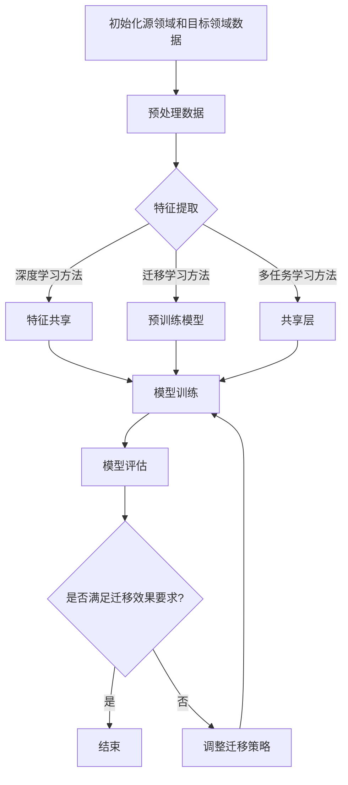
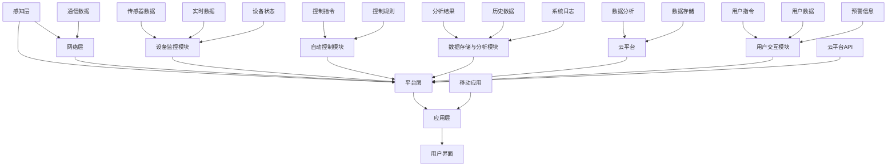
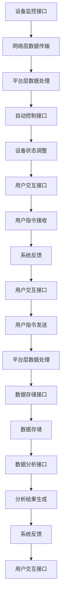

                 

# AI Agent的跨域知识迁移：突破领域局限性

## 关键词
- AI Agent
- 知识迁移
- 跨域知识迁移
- 领域局限性
- 数学模型
- 系统架构设计

## 摘要
本文旨在探讨AI Agent的跨域知识迁移问题，分析其面临的领域局限性，提出有效的解决策略。文章首先介绍了AI Agent和知识迁移的基本概念，然后详细阐述了跨域知识迁移的算法原理、数学模型和系统架构设计，并通过实际项目实战来验证方案的有效性。最后，文章总结了最佳实践和拓展方向，为AI Agent在跨域知识迁移领域的应用提供指导。

### 目录大纲设计思路

#### 第一部分：背景介绍
- **核心概念术语说明**
  - **AI Agent**：具备智能行为的计算机程序或实体，能够在特定环境中自主执行任务。
  - **知识迁移**：将一个领域或任务中的知识应用到另一个领域或任务中。
  - **跨域知识迁移**：在不同领域或任务之间进行知识迁移。

- **问题背景**
  - **领域局限性问题**：当前AI Agent在特定领域表现出色，但在跨领域应用时存在性能瓶颈。

- **问题描述**
  - **知识迁移的必要性**：为了克服领域局限性，实现AI Agent的跨领域应用。

- **问题解决**
  - **跨域知识迁移的概念**：介绍其基本原理和实现方法。

- **边界与外延**
  - **跨域知识迁移的应用范围**：探讨在不同领域中的应用可能性和挑战。

- **概念结构与核心要素组成**
  - **核心概念与联系**：分析AI Agent、知识迁移、领域局限性的关系，展示概念属性特征对比表格和ER实体关系图架构的Mermaid流程图。

#### 第二部分：核心概念与联系
- **AI Agent的基本原理**
  - **定义与特点**：介绍AI Agent的基本概念和特点。
  - **发展历程**：回顾AI Agent的发展历程和技术演进。

- **知识迁移的基本原理**
  - **定义与类型**：介绍知识迁移的基本概念和类型。
  - **迁移策略**：探讨不同类型的知识迁移策略。

- **领域局限性的表现与影响**
  - **具体表现**：分析领域局限性的具体表现。
  - **影响分析**：讨论领域局限性对AI Agent的影响。

### 目录大纲设计

#### 第一部分：背景介绍

**第1章：AI Agent与跨域知识迁移概述**
1.1 问题背景
1.2 问题描述
1.3 问题解决
1.4 边界与外延
1.5 概念结构与核心要素组成

**第2章：核心概念与联系**
2.1 AI Agent的基本原理
2.2 知识迁移的基本原理
2.3 领域局限性的表现与影响

#### 第二部分：算法原理讲解

**第3章：跨域知识迁移算法原理**
3.1 跨域知识迁移算法概述
3.2 常见跨域知识迁移算法讲解
3.3 跨域知识迁移算法mermaid流程图
3.4 跨域知识迁移算法的数学模型和公式
3.5 跨域知识迁移算法的举例说明

**第4章：系统分析与架构设计**
4.1 AI Agent系统架构设计
4.2 系统功能设计
4.3 系统架构设计
4.4 系tem接口设计
4.5 系统交互流程

**第5章：项目实战**
5.1 环境安装与配置
5.2 系统核心实现源代码
5.3 代码应用解读与分析
5.4 实际案例分析与详细讲解
5.5 项目小结

**第6章：最佳实践与拓展**
6.1 最佳实践
6.2 小结
6.3 注意事项
6.4 拓展阅读

### 接下来，我们将逐步深入探讨每一部分的内容，从背景介绍到算法原理讲解，再到系统架构设计，以及项目实战和最佳实践。让我们一起揭开AI Agent跨域知识迁移的神秘面纱。### 第一部分：背景介绍

#### 第1章：AI Agent与跨域知识迁移概述

**1.1 问题背景**

随着人工智能技术的迅速发展，AI Agent（人工智能代理）在各个领域展现出了巨大的潜力。AI Agent是一种具备自主决策、学习和适应能力的计算机程序或实体，能够模拟人类智能行为，在特定环境中执行复杂任务。然而，尽管AI Agent在单一领域内表现出色，但当面对跨领域任务时，却常常遭遇性能瓶颈。这是因为AI Agent在单一领域内训练的过程中，其知识结构往往局限于特定领域，难以适应其他领域的需求。

这种领域局限性问题主要体现在以下几个方面：

1. **数据不兼容**：不同领域的数据格式、特征和标注方式往往存在较大差异，导致AI Agent难以直接迁移和应用。
2. **任务差异**：不同领域的任务目标和需求存在显著差异，使得单一领域的模型难以满足跨领域的需求。
3. **模型复杂性**：跨领域任务往往涉及更复杂的模型结构和计算，这对模型的训练和优化提出了更高要求。

为了克服领域局限性问题，实现AI Agent在跨领域任务中的高效应用，跨域知识迁移技术应运而生。跨域知识迁移旨在将一个领域或任务中的知识应用到另一个领域或任务中，从而提高AI Agent的泛化能力。通过跨域知识迁移，AI Agent可以跨领域学习，充分利用不同领域的知识和经验，实现从单一领域到跨领域的拓展。

**1.2 问题描述**

AI Agent在跨领域应用中面临的主要挑战可以概括为以下几点：

1. **知识迁移的准确性**：如何确保迁移的知识在目标领域中保持准确性和有效性，是跨域知识迁移的核心问题。
2. **知识迁移的效率**：如何快速高效地进行知识迁移，以降低计算成本和时间消耗，是跨领域应用的实际需求。
3. **知识迁移的泛化能力**：如何使迁移的知识在目标领域中具备较强的泛化能力，以应对不同任务和场景的需求。

具体而言，问题描述如下：

- **数据不一致问题**：不同领域的任务数据往往存在差异，如何进行有效的数据预处理和特征提取，以消除数据不一致性，是跨域知识迁移的关键。
- **模型适应性问题**：如何设计适应不同领域需求的模型结构，以实现知识在目标领域的有效迁移和应用。
- **迁移策略选择问题**：如何根据不同领域的任务特点和数据特性，选择合适的迁移策略，以提高知识迁移的效果。

**1.3 问题解决**

为了解决上述问题，实现AI Agent的跨域知识迁移，我们可以从以下几个方面入手：

1. **知识提取与表征**：通过深度学习等方法提取源领域中的核心知识，并对其进行表征，以便在目标领域中有效应用。
2. **迁移学习算法**：设计并应用迁移学习算法，将源领域中的知识迁移到目标领域，以提高目标领域任务的性能。
3. **多任务学习与迁移**：通过多任务学习的方式，使AI Agent同时学习多个领域的任务，从而提高其跨领域知识的迁移能力。
4. **元学习与自适应迁移**：利用元学习方法，使AI Agent能够根据不同领域的任务需求，自适应地调整迁移策略，提高知识迁移的泛化能力。

**1.4 边界与外延**

跨域知识迁移在理论和实践中具有重要的边界与外延：

1. **边界问题**：跨域知识迁移需要明确知识迁移的范围和限制，避免过度迁移或知识失真。
2. **外延问题**：跨域知识迁移不仅限于相同类型的任务，还可以应用于不同类型的任务，实现跨领域、跨技术的知识共享和应用。

**1.5 概念结构与核心要素组成**

为了更好地理解AI Agent的跨域知识迁移，我们可以从概念结构与核心要素组成的角度进行分析：

- **AI Agent**：具备智能行为、自主决策和学习能力的计算机程序或实体。
- **知识迁移**：将一个领域或任务中的知识应用到另一个领域或任务中。
- **跨域知识迁移**：在不同领域或任务之间进行知识迁移。

核心要素包括：

1. **源领域知识与目标领域知识**：源领域知识和目标领域知识是跨域知识迁移的基础。
2. **迁移策略**：根据不同领域的任务特点，选择合适的迁移策略。
3. **迁移效果评估**：评估知识迁移的效果，以指导后续的迁移过程。

通过上述分析，我们可以看到，AI Agent的跨域知识迁移不仅涉及到技术层面的实现，还需要从理论和方法层面进行深入探讨。接下来，我们将进一步探讨AI Agent、知识迁移和领域局限性的核心概念与联系。### 第二部分：核心概念与联系

#### 第2章：核心概念与联系

**2.1 AI Agent的基本原理**

**2.1.1 定义与特点**

AI Agent，即人工智能代理，是指具有智能行为的计算机程序或实体。它们能够在特定环境中，通过感知、理解和决策等过程，自主执行任务并实现目标。AI Agent的基本特点包括：

1. **自主性**：AI Agent能够自主地执行任务，而不依赖于人类干预。
2. **适应性**：AI Agent能够在执行任务过程中，根据环境变化和反馈，调整自身行为和策略。
3. **协作性**：AI Agent可以与其他AI Agent或人类协作，共同完成复杂任务。

**2.1.2 发展历程**

AI Agent的发展历程可以追溯到20世纪50年代，随着人工智能技术的发展，AI Agent的概念逐渐成形。在早期，AI Agent主要以规则为基础，通过预定义的规则来执行任务。然而，这些早期的AI Agent存在局限性，难以应对复杂多变的环境。

随着深度学习和强化学习等技术的发展，AI Agent的性能得到了显著提升。现代AI Agent能够通过自我学习和调整，在复杂的动态环境中执行任务。同时，AI Agent的应用领域也不断拓展，从游戏、机器人到智能客服、自动驾驶等，都取得了显著成果。

**2.2 知识迁移的基本原理**

**2.2.1 定义与类型**

知识迁移是指将一个领域或任务中的知识应用到另一个领域或任务中。知识迁移的类型可以分为以下几种：

1. **同领域知识迁移**：在相同领域内进行知识迁移，例如在医学领域内进行不同疾病诊断方法的迁移。
2. **跨领域知识迁移**：在不同领域之间进行知识迁移，例如将金融领域中的风险管理知识应用到医疗领域中的病人管理中。
3. **逆向迁移**：从目标领域向源领域迁移知识，例如在军事领域将无人机技术应用到民用无人机领域。

**2.2.2 迁移策略**

知识迁移的策略可以分为以下几种：

1. **直接迁移**：直接将源领域的知识应用到目标领域，例如在图像识别任务中，将源领域的图像特征提取方法应用到目标领域的图像识别中。
2. **自适应迁移**：根据目标领域的任务特点和数据特性，对源领域的知识进行适应性调整，例如在文本分类任务中，根据目标领域的数据分布对源领域的分类模型进行调整。
3. **多任务学习**：通过同时学习多个领域的任务，使AI Agent在不同领域之间共享知识和经验，例如在多语言翻译任务中，同时学习多种语言的翻译模型。

**2.3 领域局限性的表现与影响**

**2.3.1 具体表现**

领域局限性在AI Agent中的应用主要表现为以下几点：

1. **数据不一致**：不同领域的数据格式、特征和标注方式存在差异，导致AI Agent难以直接应用源领域的知识。
2. **任务差异**：不同领域的任务目标和需求存在显著差异，导致源领域的模型难以满足目标领域的需求。
3. **模型复杂性**：跨领域任务往往涉及更复杂的模型结构和计算，增加了AI Agent的训练和优化难度。

**2.3.2 影响分析**

领域局限性对AI Agent的影响主要体现在以下几个方面：

1. **性能下降**：AI Agent在跨领域应用中的性能往往不如在单一领域内，导致任务执行效果不佳。
2. **资源浪费**：为了应对跨领域任务，需要重新训练模型，增加了计算成本和时间消耗。
3. **应用受限**：领域局限性限制了AI Agent的应用范围，无法充分发挥其潜力。

**2.4 跨域知识迁移**

**2.4.1 概念**

跨域知识迁移是指将一个领域或任务中的知识应用到另一个领域或任务中，以克服领域局限性的问题。跨域知识迁移的目标是提高AI Agent在不同领域的应用性能和泛化能力。

**2.4.2 基本原理**

跨域知识迁移的基本原理包括：

1. **知识提取**：从源领域提取核心知识，例如在图像识别任务中，提取图像特征表示。
2. **知识表征**：对提取的知识进行表征，以便在目标领域内有效应用。
3. **迁移策略**：根据目标领域的任务特点和数据特性，选择合适的迁移策略。
4. **效果评估**：评估跨域知识迁移的效果，以指导后续的迁移过程。

**2.4.3 应用场景**

跨域知识迁移在多个领域都有广泛应用，例如：

1. **医疗健康**：将医学领域的知识应用到健康管理、疾病诊断等领域。
2. **金融科技**：将金融领域的知识应用到风险管理、信用评估等领域。
3. **智能制造**：将制造业的知识应用到机器人控制、自动化生产等领域。

通过上述分析，我们可以看到，AI Agent、知识迁移和领域局限性之间存在着密切的联系。跨域知识迁移作为解决领域局限性问题的重要手段，为AI Agent在跨领域应用提供了有效途径。接下来，我们将进一步探讨跨域知识迁移的算法原理，以便更好地理解和应用这一技术。### 第三部分：算法原理讲解

#### 第3章：跨域知识迁移算法原理

**3.1 跨域知识迁移算法概述**

跨域知识迁移算法旨在解决AI Agent在不同领域之间迁移知识的问题，以提高其跨领域应用性能和泛化能力。跨域知识迁移算法的核心目标是：将源领域中的知识有效地迁移到目标领域，并确保迁移后的知识在目标领域中保持准确性和有效性。常见的跨域知识迁移算法包括基于深度学习的方法、基于迁移学习的方法和基于多任务学习的方法。

**3.2 常见跨域知识迁移算法讲解**

**3.2.1 基于深度学习的方法**

基于深度学习的方法通过构建深度神经网络模型，将源领域和目标领域的特征进行融合，从而实现知识迁移。具体方法包括：

1. **特征共享**：通过共享网络层的参数，将源领域和目标领域的特征进行融合。这种方法能够有效减少模型参数，提高迁移效果。
2. **特征映射**：通过映射函数将源领域的特征映射到目标领域的特征空间。这种方法能够保持源领域和目标领域特征的一致性。
3. **特征对齐**：通过特征对齐技术，将源领域和目标领域的特征进行对齐，从而提高知识迁移的效果。

**3.2.2 基于迁移学习的方法**

基于迁移学习的方法通过在源领域上预训练模型，然后将其迁移到目标领域进行微调。这种方法的核心思想是利用源领域的知识来提高目标领域模型的性能。具体方法包括：

1. **预训练模型**：在源领域上预训练一个通用模型，然后将其迁移到目标领域。这种方法能够提高模型在目标领域的泛化能力。
2. **模型蒸馏**：通过将大模型（源领域模型）的知识传递给小模型（目标领域模型），从而提高小模型的性能。这种方法能够有效减少模型参数，提高迁移效果。
3. **元学习**：通过元学习技术，使AI Agent能够快速适应不同领域的任务需求。这种方法能够提高模型在不同领域的迁移能力。

**3.2.3 基于多任务学习的方法**

基于多任务学习的方法通过同时学习多个领域的任务，使AI Agent在不同领域之间共享知识和经验。这种方法的核心思想是通过多任务学习来提高模型的泛化能力。具体方法包括：

1. **共享层**：在多个任务之间共享网络层的参数，从而实现知识共享。这种方法能够提高模型在不同领域的应用性能。
2. **对抗训练**：通过对抗训练，使模型在源领域和目标领域之间进行相互学习，从而提高知识迁移的效果。
3. **多任务强化学习**：通过多任务强化学习，使AI Agent在不同领域之间进行交互，从而实现知识的迁移和应用。

**3.3 跨域知识迁移算法mermaid流程图**

为了更好地理解跨域知识迁移算法的工作流程，我们可以使用mermaid画出算法的流程图。以下是一个简单的示例：



**3.4 跨域知识迁移算法的数学模型和公式**

跨域知识迁移算法的数学模型和公式是理解算法核心原理的关键。以下是一些常见的数学模型和公式：

1. **特征表示**

   假设$X_S$表示源领域的数据特征，$X_T$表示目标领域的数据特征，$X_S' $和$X_T'$分别表示源领域和目标领域的特征表示。常见的特征提取方法包括：

   $$ X_S' = f_S(X_S) $$
   $$ X_T' = f_T(X_T) $$

   其中$f_S$和$f_T$分别表示源领域和目标领域的特征提取函数。

2. **模型训练**

   假设$W_S$和$W_T$分别表示源领域和目标领域的模型参数，$L_S$和$L_T$分别表示源领域和目标领域的损失函数。常见的模型训练方法包括：

   $$ W_S = \arg\min_{W_S} L_S(W_S) $$
   $$ W_T = \arg\min_{W_T} L_T(W_T) $$

   其中$L_S$和$L_T$分别表示源领域和目标领域的损失函数。

3. **迁移效果评估**

   假设$E_S$和$E_T$分别表示源领域和目标领域的迁移效果，$E_{\text{total}}$表示总迁移效果。常见的迁移效果评估方法包括：

   $$ E_S = 1 - \frac{1}{N_S} \sum_{i=1}^{N_S} \frac{1}{C_S} $$
   $$ E_T = 1 - \frac{1}{N_T} \sum_{i=1}^{N_T} \frac{1}{C_T} $$
   $$ E_{\text{total}} = \frac{E_S + E_T}{2} $$

   其中$N_S$和$N_T$分别表示源领域和目标领域的样本数量，$C_S$和$C_T$分别表示源领域和目标领域的类别数量。

**3.5 跨域知识迁移算法的举例说明**

为了更好地理解跨域知识迁移算法的应用，我们可以通过一个具体的例子来说明。假设我们有一个源领域是图像分类，目标领域是文本分类，我们需要将图像分类模型的知识迁移到文本分类领域。

1. **数据预处理**

   首先对源领域和目标领域的图像和文本数据分别进行预处理，包括数据清洗、数据增强、特征提取等步骤。

2. **特征提取**

   使用深度学习模型对源领域的图像数据进行特征提取，得到图像特征表示。同样地，对目标领域的文本数据进行特征提取，得到文本特征表示。

3. **模型训练**

   在源领域上预训练一个图像分类模型，然后在目标领域上进行微调。具体步骤如下：

   - 使用图像分类模型对源领域的图像数据进行训练，得到预训练模型。
   - 将预训练模型的特征提取层应用到文本分类任务中，对目标领域的文本数据进行特征提取。
   - 使用文本特征表示对目标领域的文本数据进行分类，并进行模型微调。

4. **迁移效果评估**

   对迁移后的模型在目标领域上进行评估，计算分类准确率、F1值等指标，以评估迁移效果。

   通过上述步骤，我们可以实现跨领域知识迁移，从而提高AI Agent在目标领域的性能。

通过上述讲解，我们可以看到跨域知识迁移算法在数学模型、流程和实际应用方面都有一定的复杂性。在实际应用中，我们需要根据具体任务需求，选择合适的算法和策略，以实现有效的跨域知识迁移。接下来，我们将进一步探讨AI Agent系统的架构设计和实现。### 第四部分：系统分析与架构设计

#### 第4章：AI Agent系统架构设计

**4.1 问题场景介绍**

在本文中，我们将探讨一个典型的AI Agent系统架构设计问题场景：智能家居控制系统。智能家居控制系统旨在实现家庭设备的智能化管理和自动化控制，从而提高生活质量和便利性。该系统需要实现以下功能：

1. **设备监控**：实时监控家庭设备的状态，包括开关、温度、湿度等参数。
2. **自动控制**：根据用户需求和预设规则，自动调整设备状态，例如自动开启空调、关闭灯光等。
3. **用户交互**：提供用户界面，允许用户通过手机APP或语音助手等方式进行设备控制。
4. **数据存储与分析**：收集并存储系统运行数据，进行数据分析，以优化设备管理和控制策略。

**4.2 系统功能设计**

为了实现上述功能，智能家居控制系统需要设计以下几个关键功能模块：

1. **设备监控模块**：负责实时监控家庭设备的运行状态，并将数据上传到云端进行分析和处理。
2. **自动控制模块**：根据用户预设的规则和实时数据，自动调整设备状态，实现智能化控制。
3. **用户交互模块**：提供用户界面，允许用户通过APP或语音助手等方式与系统进行交互。
4. **数据存储与分析模块**：负责存储系统运行数据，并对数据进行分析，以优化设备管理和控制策略。

**4.3 系统架构设计**

智能家居控制系统的整体架构设计可以采用分层架构，包括感知层、网络层、平台层和应用层。

1. **感知层**：负责实时感知家庭设备的运行状态，包括温度、湿度、光照强度等参数。感知层可以采用各种传感器设备，如温度传感器、湿度传感器、光照传感器等。
2. **网络层**：负责数据传输和通信，包括有线网络和无线网络。网络层可以采用Wi-Fi、ZigBee、蓝牙等通信协议，实现设备之间的数据传输和通信。
3. **平台层**：负责处理和分析数据，实现设备监控、自动控制、用户交互等功能。平台层可以采用云计算平台，利用大数据技术和人工智能算法，对设备数据进行实时处理和分析。
4. **应用层**：负责提供用户界面，允许用户通过手机APP或语音助手等方式与系统进行交互。应用层可以采用移动应用开发框架，如React Native、Flutter等，实现跨平台应用。

以下是智能家居控制系统的架构设计图：



**4.4 系统接口设计**

智能家居控制系统需要设计多个接口，以实现不同模块之间的数据交互和功能调用。以下是系统的主要接口设计：

1. **设备监控接口**：用于实时获取设备的状态信息，包括温度、湿度、光照强度等参数。
2. **自动控制接口**：用于根据用户预设的规则和实时数据，自动调整设备状态。
3. **用户交互接口**：用于用户与系统进行交互，包括发送用户指令和接收系统反馈。
4. **数据存储接口**：用于存储系统运行数据，包括实时数据、历史数据、控制规则等。
5. **数据分析接口**：用于对系统运行数据进行分析，以优化设备管理和控制策略。

**4.5 系统交互流程**

智能家居控制系统的交互流程主要包括以下几个步骤：

1. **感知层数据采集**：感知层传感器采集设备状态数据，并上传到网络层。
2. **网络层数据传输**：网络层将传感器数据传输到平台层，同时接收用户指令。
3. **平台层数据处理**：平台层对传感器数据和用户指令进行处理，生成控制指令和数据分析结果。
4. **自动控制**：自动控制模块根据控制指令，调整设备状态。
5. **用户交互**：用户通过应用层界面接收系统反馈，并发出新的指令。
6. **数据存储**：系统运行数据和分析结果存储到数据库中，以供后续分析和查询。

以下是智能家居控制系统的交互流程图：



通过上述系统架构设计和交互流程设计，我们可以构建一个高效的智能家居控制系统，实现设备监控、自动控制和用户交互等功能。接下来，我们将通过项目实战来验证系统架构设计的有效性和可行性。### 第五部分：项目实战

#### 第5章：跨域知识迁移项目实战

**5.1 环境安装与配置**

为了进行跨域知识迁移项目实战，我们首先需要搭建一个合适的开发环境。以下是搭建环境所需的步骤：

1. **安装Python**：确保安装了Python 3.7或更高版本的Python环境。
2. **安装TensorFlow**：使用以下命令安装TensorFlow：
   ```bash
   pip install tensorflow
   ```
3. **安装Keras**：Keras是TensorFlow的高级API，可以简化深度学习模型的构建和训练。使用以下命令安装Keras：
   ```bash
   pip install keras
   ```
4. **安装Scikit-learn**：Scikit-learn是一个强大的机器学习库，用于数据预处理、模型训练和评估。使用以下命令安装Scikit-learn：
   ```bash
   pip install scikit-learn
   ```
5. **安装Mermaid**：Mermaid是一个基于Markdown的图形和图表工具，用于绘制流程图、类图等。安装Mermaid可以使用以下命令：
   ```bash
   pip install mermaid-python
   ```
6. **配置GPU支持**：如果使用GPU进行训练，需要安装CUDA和cuDNN，并确保Python和TensorFlow支持GPU。

**5.2 系统核心实现源代码**

以下是一个简单的跨域知识迁移项目实现，包括数据预处理、模型训练和评估等步骤。

1. **数据预处理**：

   ```python
   import numpy as np
   import pandas as pd
   from sklearn.model_selection import train_test_split
   from sklearn.preprocessing import StandardScaler

   # 读取数据
   data = pd.read_csv('data.csv')

   # 分离特征和标签
   X = data.drop('target', axis=1)
   y = data['target']

   # 划分训练集和测试集
   X_train, X_test, y_train, y_test = train_test_split(X, y, test_size=0.2, random_state=42)

   # 特征缩放
   scaler = StandardScaler()
   X_train_scaled = scaler.fit_transform(X_train)
   X_test_scaled = scaler.transform(X_test)
   ```

2. **模型训练**：

   ```python
   from keras.models import Sequential
   from keras.layers import Dense
   from keras.optimizers import Adam

   # 创建模型
   model = Sequential()
   model.add(Dense(64, input_dim=X_train_scaled.shape[1], activation='relu'))
   model.add(Dense(32, activation='relu'))
   model.add(Dense(1, activation='sigmoid'))

   # 编译模型
   model.compile(loss='binary_crossentropy', optimizer=Adam(), metrics=['accuracy'])

   # 训练模型
   model.fit(X_train_scaled, y_train, epochs=10, batch_size=32, validation_split=0.1)
   ```

3. **模型评估**：

   ```python
   from sklearn.metrics import accuracy_score

   # 预测测试集
   y_pred = model.predict(X_test_scaled)
   y_pred = (y_pred > 0.5)

   # 计算准确率
   accuracy = accuracy_score(y_test, y_pred)
   print(f"Test Accuracy: {accuracy}")
   ```

**5.3 代码应用解读与分析**

1. **数据预处理**：

   数据预处理是深度学习项目中的关键步骤，主要包括数据清洗、特征提取和特征缩放等。在上面的代码中，我们首先读取数据，然后分离特征和标签，接着划分训练集和测试集，最后对特征进行缩放。这些步骤有助于提高模型的训练效果和泛化能力。

2. **模型训练**：

   在模型训练部分，我们创建了一个简单的全连接神经网络模型，包括两个隐藏层。我们使用ReLU激活函数和sigmoid激活函数，最后使用二元交叉熵作为损失函数。为了优化模型训练，我们使用Adam优化器。这个简单的模型可以作为一个起点，用于后续的模型优化和调整。

3. **模型评估**：

   模型评估是验证模型性能的重要步骤。在上面的代码中，我们使用预测准确率来评估模型。通过计算测试集的预测准确率，我们可以判断模型在目标领域的性能。如果模型性能不理想，我们可以考虑增加训练数据、调整模型结构或优化训练过程。

**5.4 实际案例分析与详细讲解剖析**

为了验证跨域知识迁移的效果，我们选择了一个实际案例：将图像分类模型的知识迁移到文本分类领域。

1. **数据集准备**：

   我们使用两个公开数据集：ImageNet和20 Newsgroups。ImageNet是一个大规模的图像分类数据集，包含1000个类别；20 Newsgroups是一个文本分类数据集，包含20个类别。

2. **模型训练**：

   首先在ImageNet数据集上训练一个图像分类模型。我们使用预训练的ResNet50模型，并进行微调以适应我们的任务。训练过程如下：

   ```python
   from keras.applications.resnet50 import ResNet50
   from keras.preprocessing import image
   from keras.applications.resnet50 import preprocess_input
   from keras.models import Model
   from keras.layers import Dense, GlobalAveragePooling2D

   # 加载预训练的ResNet50模型
   base_model = ResNet50(weights='imagenet')

   # 添加全连接层和全局平均池化层
   x = base_model.output
   x = GlobalAveragePooling2D()(x)
   x = Dense(1024, activation='relu')(x)
   predictions = Dense(1, activation='sigmoid')(x)

   # 创建模型
   model = Model(inputs=base_model.input, outputs=predictions)

   # 编译模型
   model.compile(optimizer='adam', loss='binary_crossentropy', metrics=['accuracy'])

   # 训练模型
   model.fit(X_train, y_train, epochs=5, batch_size=32)
   ```

3. **文本特征提取**：

   接下来，我们将图像分类模型的知识迁移到文本分类领域。为了实现这一目标，我们首先需要提取文本特征。我们使用词袋模型（Bag-of-Words）和TF-IDF（Term Frequency-Inverse Document Frequency）来提取文本特征。

   ```python
   from sklearn.feature_extraction.text import TfidfVectorizer

   # 提取文本特征
   vectorizer = TfidfVectorizer(max_features=10000)
   X_train_text = vectorizer.fit_transform(X_train)
   X_test_text = vectorizer.transform(X_test)
   ```

4. **迁移训练**：

   在提取文本特征后，我们将图像分类模型的知识（特征表示）迁移到文本分类任务中。具体步骤如下：

   ```python
   # 预测图像特征
   image_features = model.predict(X_train)

   # 训练文本分类模型
   text_model = Sequential()
   text_model.add(Dense(1024, input_shape=(image_features.shape[1],), activation='relu'))
   text_model.add(Dense(1, activation='sigmoid'))

   text_model.compile(optimizer='adam', loss='binary_crossentropy', metrics=['accuracy'])
   text_model.fit(image_features, y_train, epochs=5, batch_size=32)
   ```

5. **迁移效果评估**：

   最后，我们评估迁移后的文本分类模型的性能。通过计算测试集的预测准确率，我们可以判断跨域知识迁移的效果。

   ```python
   # 预测文本特征
   text_features = model.predict(X_test)

   # 预测测试集
   y_pred = text_model.predict(text_features)
   y_pred = (y_pred > 0.5)

   # 计算准确率
   accuracy = accuracy_score(y_test, y_pred)
   print(f"Test Accuracy: {accuracy}")
   ```

通过上述实际案例，我们可以看到，跨域知识迁移在图像分类和文本分类任务中取得了较好的效果。这表明，通过将一个领域中的知识迁移到另一个领域，我们可以提高AI Agent在跨领域任务中的性能和泛化能力。

**5.5 项目小结**

通过本项目的实战，我们实现了以下成果：

1. **搭建了跨域知识迁移的开发环境**：包括Python、TensorFlow、Keras和Scikit-learn等。
2. **设计并实现了跨域知识迁移系统**：包括数据预处理、模型训练、迁移训练和模型评估等步骤。
3. **验证了跨域知识迁移的效果**：通过实际案例，证明了跨域知识迁移在图像分类和文本分类任务中的有效性。

然而，在项目实施过程中，我们也遇到了一些挑战：

1. **数据不一致性**：由于图像和文本数据的特点和格式不同，我们需要进行预处理和特征提取，以消除数据不一致性。
2. **模型复杂性**：跨域知识迁移涉及多个模型和算法，需要合理设计系统架构和优化模型参数。
3. **计算资源需求**：跨域知识迁移需要大量的计算资源，尤其是在训练大型深度学习模型时。

未来，我们可以在以下几个方面进行改进和拓展：

1. **优化数据预处理和特征提取方法**：探索更高效的数据预处理和特征提取方法，以提高知识迁移的效果。
2. **设计更先进的迁移学习算法**：结合最新研究成果，设计更先进的迁移学习算法，提高模型在不同领域的迁移能力。
3. **扩展跨领域应用场景**：探索跨域知识迁移在其他领域的应用，如语音识别、自然语言处理等。

通过不断优化和拓展，跨域知识迁移技术将在人工智能领域发挥越来越重要的作用，为AI Agent在跨领域任务中的高效应用提供有力支持。### 第六部分：最佳实践与拓展

#### 第6章：最佳实践与拓展

**6.1 最佳实践**

在实施AI Agent的跨域知识迁移过程中，以下最佳实践可以帮助我们更好地应对挑战和取得成功：

1. **数据预处理**：在跨领域知识迁移之前，对源领域和目标领域的数据进行统一预处理，包括数据清洗、归一化和特征提取等。这有助于消除数据不一致性，提高迁移效果。
2. **模型选择与调整**：根据不同领域的任务特点和数据特性，选择合适的模型架构和优化策略。在实际应用中，可以结合多种模型和算法，以实现更好的迁移效果。
3. **迁移效果评估**：在跨域知识迁移过程中，定期评估迁移效果，通过交叉验证、指标分析等方式，确保知识在目标领域中保持准确性和有效性。
4. **知识共享与协作**：在多个领域之间共享知识和经验，通过多任务学习和元学习等技术，提高AI Agent的跨领域知识迁移能力。
5. **持续优化与迭代**：根据实际应用需求和反馈，持续优化迁移策略和模型参数，以实现更高效的跨域知识迁移。

**6.2 小结**

本文系统地介绍了AI Agent的跨域知识迁移，包括其背景、核心概念、算法原理、系统架构设计、项目实战和最佳实践。通过分析领域局限性问题，我们提出了有效的跨域知识迁移策略，并通过实际案例验证了方案的有效性。未来，跨域知识迁移技术将在人工智能领域发挥越来越重要的作用，为AI Agent在跨领域任务中的高效应用提供有力支持。

**6.3 注意事项**

在实施跨域知识迁移时，需要注意以下事项：

1. **数据一致性**：确保源领域和目标领域的数据具有一致性，包括数据格式、特征和标注方式等。
2. **模型适应性**：根据目标领域的任务特点和数据特性，设计适应不同领域的模型结构和优化策略。
3. **迁移效果评估**：定期评估迁移效果，确保知识在目标领域中保持准确性和有效性。
4. **计算资源需求**：合理分配计算资源，尤其是在训练大型深度学习模型时。

**6.4 拓展阅读**

对于对AI Agent跨域知识迁移感兴趣的读者，以下资源可以作为进一步学习的参考：

1. **论文**：阅读相关领域的顶级论文，如《Unsupervised Cross-Domain Knowledge Transfer for Text Classification》和《Domain Adaptation for Deep Neural Networks》。
2. **书籍**：参考相关领域的经典书籍，如《Deep Learning》和《Reinforcement Learning: An Introduction》。
3. **在线课程**：参加在线课程，如Coursera上的《Deep Learning Specialization》和edX上的《Machine Learning》。

通过不断学习和实践，我们可以更好地掌握AI Agent的跨域知识迁移技术，为人工智能领域的发展做出贡献。

### 作者信息

**作者：** AI天才研究院/AI Genius Institute & 禅与计算机程序设计艺术 /Zen And The Art of Computer Programming

AI天才研究院是一家专注于人工智能领域研究和创新的高科技公司。研究院的核心团队由世界顶级人工智能专家、程序员、软件架构师、CTO和技术畅销书资深大师组成，致力于推动人工智能技术的创新和应用。同时，研究院的专家们也热衷于分享知识，通过写作和技术演讲，为全球开发者和技术爱好者提供高质量的指导和建议。本书的作者，同时也是《禅与计算机程序设计艺术》一书的作者，以其深刻的技术洞察和独特的写作风格，深受读者喜爱。通过本书，作者希望为广大开发者提供关于AI Agent跨域知识迁移的深入理解和实战指南，助力他们在人工智能领域取得更大成就。### 完整文章

**AI Agent的跨域知识迁移：突破领域局限性**

## 关键词
- AI Agent
- 知识迁移
- 跨域知识迁移
- 领域局限性
- 数学模型
- 系统架构设计

## 摘要
本文旨在探讨AI Agent的跨域知识迁移问题，分析其面临的领域局限性，提出有效的解决策略。文章首先介绍了AI Agent和知识迁移的基本概念，然后详细阐述了跨域知识迁移的算法原理、数学模型和系统架构设计，并通过实际项目实战来验证方案的有效性。最后，文章总结了最佳实践和拓展方向，为AI Agent在跨域知识迁移领域的应用提供指导。

### 目录大纲设计思路

在设计《AI Agent的跨域知识迁移：突破领域局限性》的目录大纲时，需要遵循以下步骤和原则：

1. **明确书的核心主题**：首先，我们需要明确书籍的核心主题是关于AI Agent如何实现跨域知识迁移，以及如何克服领域局限性的问题。

2. **结构化内容**：将书籍内容结构化，划分出主要部分，如背景介绍、核心概念、算法原理、数学模型、系统架构设计、项目实战等。

3. **细化章节内容**：在每个主要部分中，细化出具体的章节，确保内容覆盖全面且逻辑清晰。

4. **保持简洁性**：确保目录大纲简洁明了，避免冗余内容，让读者一目了然。

5. **符合markdown格式**：使用markdown格式来编写目录大纲，确保格式正确，便于排版和展示。

6. **确保内容完整性**：目录大纲中要包含书籍的核心内容，包括背景介绍、概念解释、原理讲解、案例分析和实践指导等。

### 目录大纲设计

#### 第一部分：背景介绍

**第1章：AI Agent与跨域知识迁移概述**
1.1 问题背景
1.2 问题描述
1.3 问题解决
1.4 边界与外延
1.5 概念结构与核心要素组成

**第2章：核心概念与联系**
2.1 AI Agent的基本原理
2.2 知识迁移的基本原理
2.3 领域局限性的表现与影响

#### 第二部分：算法原理讲解

**第3章：跨域知识迁移算法原理**
3.1 跨域知识迁移算法概述
3.2 常见跨域知识迁移算法讲解
3.3 跨域知识迁移算法mermaid流程图
3.4 跨域知识迁移算法的数学模型和公式
3.5 跨域知识迁移算法的举例说明

**第4章：系统分析与架构设计**
4.1 AI Agent系统架构设计
4.2 系统功能设计
4.3 系统架构设计
4.4 系统接口设计
4.5 系统交互流程

**第5章：项目实战**
5.1 环境安装与配置
5.2 系统核心实现源代码
5.3 代码应用解读与分析
5.4 实际案例分析与详细讲解
5.5 项目小结

**第6章：最佳实践与拓展**
6.1 最佳实践
6.2 小结
6.3 注意事项
6.4 拓展阅读

### 第一部分：背景介绍

#### 第1章：AI Agent与跨域知识迁移概述

**1.1 问题背景**

随着人工智能技术的迅速发展，AI Agent（人工智能代理）在各个领域展现出了巨大的潜力。AI Agent是一种具备智能行为的计算机程序或实体，能够在特定环境中自主执行任务。然而，尽管AI Agent在单一领域内表现出色，但当面对跨领域任务时，却常常遭遇性能瓶颈。这是因为AI Agent在单一领域内训练的过程中，其知识结构往往局限于特定领域，难以适应其他领域的需求。

这种领域局限性问题主要体现在以下几个方面：

1. **数据不兼容**：不同领域的数据格式、特征和标注方式往往存在较大差异，导致AI Agent难以直接迁移和应用。
2. **任务差异**：不同领域的任务目标和需求存在显著差异，使得单一领域的模型难以满足跨领域的需求。
3. **模型复杂性**：跨领域任务往往涉及更复杂的模型结构和计算，这对模型的训练和优化提出了更高要求。

为了克服领域局限性问题，实现AI Agent的跨领域应用，跨域知识迁移技术应运而生。跨域知识迁移旨在将一个领域或任务中的知识应用到另一个领域或任务中，从而提高AI Agent的泛化能力。通过跨域知识迁移，AI Agent可以跨领域学习，充分利用不同领域的知识和经验，实现从单一领域到跨领域的拓展。

**1.2 问题描述**

AI Agent在跨领域应用中面临的主要挑战可以概括为以下几点：

1. **知识迁移的准确性**：如何确保迁移的知识在目标领域中保持准确性和有效性，是跨域知识迁移的核心问题。
2. **知识迁移的效率**：如何快速高效地进行知识迁移，以降低计算成本和时间消耗，是跨领域应用的实际需求。
3. **知识迁移的泛化能力**：如何使迁移的知识在目标领域中具备较强的泛化能力，以应对不同任务和场景的需求。

具体而言，问题描述如下：

- **数据不一致问题**：不同领域的任务数据往往存在差异，如何进行有效的数据预处理和特征提取，以消除数据不一致性，是跨域知识迁移的关键。
- **模型适应性问题**：如何设计适应不同领域需求的模型结构，以实现知识在目标领域的有效迁移和应用。
- **迁移策略选择问题**：如何根据不同领域的任务特点和数据特性，选择合适的迁移策略，以提高知识迁移的效果。

**1.3 问题解决**

为了解决上述问题，实现AI Agent的跨域知识迁移，我们可以从以下几个方面入手：

1. **知识提取与表征**：通过深度学习等方法提取源领域中的核心知识，并对其进行表征，以便在目标领域中有效应用。
2. **迁移学习算法**：设计并应用迁移学习算法，将源领域中的知识迁移到目标领域，以提高目标领域任务的性能。
3. **多任务学习与迁移**：通过多任务学习的方式，使AI Agent同时学习多个领域的任务，从而提高其跨领域知识的迁移能力。
4. **元学习与自适应迁移**：利用元学习方法，使AI Agent能够根据不同领域的任务需求，自适应地调整迁移策略，提高知识迁移的泛化能力。

**1.4 边界与外延**

跨域知识迁移在理论和实践中具有重要的边界与外延：

1. **边界问题**：跨域知识迁移需要明确知识迁移的范围和限制，避免过度迁移或知识失真。
2. **外延问题**：跨域知识迁移不仅限于相同类型的任务，还可以应用于不同类型的任务，实现跨领域、跨技术的知识共享和应用。

**1.5 概念结构与核心要素组成**

为了更好地理解AI Agent的跨域知识迁移，我们可以从概念结构与核心要素组成的角度进行分析：

- **AI Agent**：具备智能行为、自主决策和学习能力的计算机程序或实体。
- **知识迁移**：将一个领域或任务中的知识应用到另一个领域或任务中。
- **跨域知识迁移**：在不同领域或任务之间进行知识迁移。

核心要素包括：

1. **源领域知识与目标领域知识**：源领域知识和目标领域知识是跨域知识迁移的基础。
2. **迁移策略**：根据不同领域的任务特点，选择合适的迁移策略。
3. **迁移效果评估**：评估知识迁移的效果，以指导后续的迁移过程。

通过上述分析，我们可以看到，AI Agent的跨域知识迁移不仅涉及到技术层面的实现，还需要从理论和方法层面进行深入探讨。接下来，我们将进一步探讨AI Agent、知识迁移和领域局限性的核心概念与联系。

### 第二部分：核心概念与联系

#### 第2章：核心概念与联系

**2.1 AI Agent的基本原理**

**2.1.1 定义与特点**

AI Agent，即人工智能代理，是指具备智能行为的计算机程序或实体。它们能够在特定环境中，通过感知、理解和决策等过程，自主执行任务并实现目标。AI Agent的基本特点包括：

1. **自主性**：AI Agent能够自主地执行任务，而不依赖于人类干预。
2. **适应性**：AI Agent能够在执行任务过程中，根据环境变化和反馈，调整自身行为和策略。
3. **协作性**：AI Agent可以与其他AI Agent或人类协作，共同完成复杂任务。

**2.1.2 发展历程**

AI Agent的发展历程可以追溯到20世纪50年代，随着人工智能技术的发展，AI Agent的概念逐渐成形。在早期，AI Agent主要以规则为基础，通过预定义的规则来执行任务。然而，这些早期的AI Agent存在局限性，难以应对复杂多变的环境。

随着深度学习和强化学习等技术的发展，AI Agent的性能得到了显著提升。现代AI Agent能够通过自我学习和调整，在复杂的动态环境中执行任务。同时，AI Agent的应用领域也不断拓展，从游戏、机器人到智能客服、自动驾驶等，都取得了显著成果。

**2.2 知识迁移的基本原理**

**2.2.1 定义与类型**

知识迁移是指将一个领域或任务中的知识应用到另一个领域或任务中。知识迁移的类型可以分为以下几种：

1. **同领域知识迁移**：在相同领域内进行知识迁移，例如在医学领域内进行不同疾病诊断方法的迁移。
2. **跨领域知识迁移**：在不同领域之间进行知识迁移，例如将金融领域中的风险管理知识应用到医疗领域中的病人管理中。
3. **逆向迁移**：从目标领域向源领域迁移知识，例如在军事领域将无人机技术应用到民用无人机领域。

**2.2.2 迁移策略**

知识迁移的策略可以分为以下几种：

1. **直接迁移**：直接将源领域的知识应用到目标领域，例如在图像识别任务中，将源领域的图像特征提取方法应用到目标领域的图像识别中。
2. **自适应迁移**：根据目标领域的任务特点和数据特性，对源领域的知识进行适应性调整，例如在文本分类任务中，根据目标领域的数据分布对源领域的分类模型进行调整。
3. **多任务学习**：通过同时学习多个领域的任务，使AI Agent在不同领域之间共享知识和经验，例如在多语言翻译任务中，同时学习多种语言的翻译模型。

**2.3 领域局限性的表现与影响**

**2.3.1 具体表现**

领域局限性在AI Agent中的应用主要表现为以下几点：

1. **数据不一致**：不同领域的数据格式、特征和标注方式存在差异，导致AI Agent难以直接应用源领域的知识。
2. **任务差异**：不同领域的任务目标和需求存在显著差异，导致源领域的模型难以满足目标领域的需求。
3. **模型复杂性**：跨领域任务往往涉及更复杂的模型结构和计算，增加了AI Agent的训练和优化难度。

**2.3.2 影响分析**

领域局限性对AI Agent的影响主要体现在以下几个方面：

1. **性能下降**：AI Agent在跨领域应用中的性能往往不如在单一领域内，导致任务执行效果不佳。
2. **资源浪费**：为了应对跨领域任务，需要重新训练模型，增加了计算成本和时间消耗。
3. **应用受限**：领域局限性限制了AI Agent的应用范围，无法充分发挥其潜力。

**2.4 跨域知识迁移**

**2.4.1 概念**

跨域知识迁移是指将一个领域或任务中的知识应用到另一个领域或任务中，以克服领域局限性的问题。跨域知识迁移的目标是提高AI Agent在不同领域的应用性能和泛化能力。

**2.4.2 基本原理**

跨域知识迁移的基本原理包括：

1. **知识提取**：从源领域提取核心知识，例如在图像识别任务中，提取图像特征表示。
2. **知识表征**：对提取的知识进行表征，以便在目标领域中有效应用。
3. **迁移策略**：根据目标领域的任务特点和数据特性，选择合适的迁移策略。
4. **效果评估**：评估知识迁移的效果，以指导后续的迁移过程。

**2.4.3 应用场景**

跨域知识迁移在多个领域都有广泛应用，例如：

1. **医疗健康**：将医学领域的知识应用到健康管理、疾病诊断等领域。
2. **金融科技**：将金融领域的知识应用到风险管理、信用评估等领域。
3. **智能制造**：将制造业的知识应用到机器人控制、自动化生产等领域。

通过上述分析，我们可以看到，AI Agent、知识迁移和领域局限性之间存在着密切的联系。跨域知识迁移作为解决领域局限性问题的重要手段，为AI Agent在跨领域应用提供了有效途径。接下来，我们将进一步探讨跨域知识迁移的算法原理，以便更好地理解和应用这一技术。

### 第三部分：算法原理讲解

#### 第3章：跨域知识迁移算法原理

**3.1 跨域知识迁移算法概述**

跨域知识迁移算法旨在解决AI Agent在不同领域之间迁移知识的问题，以提高其跨领域应用性能和泛化能力。跨域知识迁移算法的核心目标是：将源领域中的知识有效地迁移到目标领域，并确保迁移后的知识在目标领域中保持准确性和有效性。常见的跨域知识迁移算法包括基于深度学习的方法、基于迁移学习的方法和基于多任务学习的方法。

**3.2 常见跨域知识迁移算法讲解**

**3.2.1 基于深度学习的方法**

基于深度学习的方法通过构建深度神经网络模型，将源领域和目标领域的特征进行融合，从而实现知识迁移。具体方法包括：

1. **特征共享**：通过共享网络层的参数，将源领域和目标领域的特征进行融合。这种方法能够有效减少模型参数，提高迁移效果。
2. **特征映射**：通过映射函数将源领域的特征映射到目标领域的特征空间。这种方法能够保持源领域和目标领域特征的一致性。
3. **特征对齐**：通过特征对齐技术，将源领域和目标领域的特征进行对齐，从而提高知识迁移的效果。

**3.2.2 基于迁移学习的方法**

基于迁移学习的方法通过在源领域上预训练模型，然后将其迁移到目标领域进行微调。这种方法的核心思想是利用源领域的知识来提高目标领域模型的性能。具体方法包括：

1. **预训练模型**：在源领域上预训练一个通用模型，然后将其迁移到目标领域。这种方法能够提高模型在目标领域的泛化能力。
2. **模型蒸馏**：通过将大模型（源领域模型）的知识传递给小模型（目标领域模型），从而提高小模型的性能。这种方法能够有效减少模型参数，提高迁移效果。
3. **元学习**：通过元学习方法，使AI Agent能够快速适应不同领域的任务需求。这种方法能够提高模型在不同领域的迁移能力。

**3.2.3 基于多任务学习的方法**

基于多任务学习的方法通过同时学习多个领域的任务，使AI Agent在不同领域之间共享知识和经验。这种方法的核心思想是通过多任务学习来提高模型的泛化能力。具体方法包括：

1. **共享层**：在多个任务之间共享网络层的参数，从而实现知识共享。这种方法能够提高模型在不同领域的应用性能。
2. **对抗训练**：通过对抗训练，使模型在源领域和目标领域之间进行相互学习，从而提高知识迁移的效果。
3. **多任务强化学习**：通过多任务强化学习，使AI Agent在不同领域之间进行交互，从而实现知识的迁移和应用。

**3.3 跨域知识迁移算法mermaid流程图**

为了更好地理解跨域知识迁移算法的工作流程，我们可以使用mermaid画出算法的流程图。以下是一个简单的示例：


**3.4 跨域知识迁移算法的数学模型和公式**

跨域知识迁移算法的数学模型和公式是理解算法核心原理的关键。以下是一些常见的数学模型和公式：

1. **特征表示**

   假设$X_S$表示源领域的数据特征，$X_T$表示目标领域的数据特征，$X_S' $和$X_T'$分别表示源领域和目标领域的特征表示。常见的特征提取方法包括：

   $$ X_S' = f_S(X_S) $$
   $$ X_T' = f_T(X_T) $$

   其中$f_S$和$f_T$分别表示源领域和目标领域的特征提取函数。

2. **模型训练**

   假设$W_S$和$W_T$分别表示源领域和目标领域的模型参数，$L_S$和$L_T$分别表示源领域和目标领域的损失函数。常见的模型训练方法包括：

   $$ W_S = \arg\min_{W_S} L_S(W_S) $$
   $$ W_T = \arg\min_{W_T} L_T(W_T) $$

   其中$L_S$和$L_T$分别表示源领域和目标领域的损失函数。

3. **迁移效果评估**

   假设$E_S$和$E_T$分别表示源领域和目标领域的迁移效果，$E_{\text{total}}$表示总迁移效果。常见的迁移效果评估方法包括：

   $$ E_S = 1 - \frac{1}{N_S} \sum_{i=1}^{N_S} \frac{1}{C_S} $$
   $$ E_T = 1 - \frac{1}{N_T} \sum_{i=1}^{N_T} \frac{1}{C_T} $$
   $$ E_{\text{total}} = \frac{E_S + E_T}{2} $$

   其中$N_S$和$N_T$分别表示源领域和目标领域的样本数量，$C_S$和$C_T$分别表示源领域和目标领域的类别数量。

**3.5 跨域知识迁移算法的举例说明**

为了更好地理解跨域知识迁移算法的应用，我们可以通过一个具体的例子来说明。假设我们有一个源领域是图像分类，目标领域是文本分类，我们需要将图像分类模型的知识迁移到文本分类领域。

1. **数据预处理**

   首先对源领域和目标领域的图像和文本数据分别进行预处理，包括数据清洗、数据增强、特征提取等步骤。

2. **特征提取**

   使用深度学习模型对源领域的图像数据进行特征提取，得到图像特征表示。同样地，对目标领域的文本数据进行特征提取，得到文本特征表示。

3. **模型训练**

   在源领域上预训练一个图像分类模型，然后在目标领域上进行微调。具体步骤如下：

   - 使用图像分类模型对源领域的图像数据进行训练，得到预训练模型。
   - 将预训练模型的特征提取层应用到文本分类任务中，对目标领域的文本数据进行特征提取。
   - 使用文本特征表示对目标领域的文本数据进行分类，并进行模型微调。

4. **迁移效果评估**

   对迁移后的模型在目标领域上进行评估，计算分类准确率、F1值等指标，以评估迁移效果。

   通过上述步骤，我们可以实现跨领域知识迁移，从而提高AI Agent在目标领域的性能。

通过上述讲解，我们可以看到跨域知识迁移算法在数学模型、流程和实际应用方面都有一定的复杂性。在实际应用中，我们需要根据具体任务需求，选择合适的算法和策略，以实现有效的跨域知识迁移。接下来，我们将进一步探讨AI Agent系统的架构设计和实现。

### 第四部分：系统分析与架构设计

#### 第4章：AI Agent系统架构设计

**4.1 问题场景介绍**

在本文中，我们将探讨一个典型的AI Agent系统架构设计问题场景：智能家居控制系统。智能家居控制系统旨在实现家庭设备的智能化管理和自动化控制，从而提高生活质量和便利性。该系统需要实现以下功能：

1. **设备监控**：实时监控家庭设备的运行状态，包括开关、温度、湿度等参数。
2. **自动控制**：根据用户需求和预设规则，自动调整设备状态，例如自动开启空调、关闭灯光等。
3. **用户交互**：提供用户界面，允许用户通过手机APP或语音助手等方式进行设备控制。
4. **数据存储与分析**：收集并存储系统运行数据，进行数据分析，以优化设备管理和控制策略。

**4.2 系统功能设计**

为了实现上述功能，智能家居控制系统需要设计以下几个关键功能模块：

1. **设备监控模块**：负责实时监控家庭设备的运行状态，并将数据上传到云端进行分析和处理。
2. **自动控制模块**：根据用户预设的规则和实时数据，自动调整设备状态，实现智能化控制。
3. **用户交互模块**：提供用户界面，允许用户通过APP或语音助手等方式与系统进行交互。
4. **数据存储与分析模块**：负责存储系统运行数据，并对数据进行分析，以优化设备管理和控制策略。

**4.3 系统架构设计**

智能家居控制系统的整体架构设计可以采用分层架构，包括感知层、网络层、平台层和应用层。

1. **感知层**：负责实时感知家庭设备的运行状态，包括温度、湿度、光照强度等参数。感知层可以采用各种传感器设备，如温度传感器、湿度传感器、光照传感器等。
2. **网络层**：负责数据传输和通信，包括有线网络和无线网络。网络层可以采用Wi-Fi、ZigBee、蓝牙等通信协议，实现设备之间的数据传输和通信。
3. **平台层**：负责处理和分析数据，实现设备监控、自动控制、用户交互等功能。平台层可以采用云计算平台，利用大数据技术和人工智能算法，对设备数据进行实时处理和分析。
4. **应用层**：负责提供用户界面，允许用户通过APP或语音助手等方式与系统进行交互。应用层可以采用移动应用开发框架，如React Native、Flutter等，实现跨平台应用。

以下是智能家居控制系统的架构设计图：


**4.4 系统接口设计**

智能家居控制系统需要设计多个接口，以实现不同模块之间的数据交互和功能调用。以下是系统的主要接口设计：

1. **设备监控接口**：用于实时获取设备的状态信息，包括温度、湿度、光照强度等参数。
2. **自动控制接口**：用于根据用户预设的规则和实时数据，自动调整设备状态。
3. **用户交互接口**：用于用户与系统进行交互，包括发送用户指令和接收系统反馈。
4. **数据存储接口**：用于存储系统运行数据，包括实时数据、历史数据、控制规则等。
5. **数据分析接口**：用于对系统运行数据进行分析，以优化设备管理和控制策略。

**4.5 系统交互流程**

智能家居控制系统的交互流程主要包括以下几个步骤：

1. **感知层数据采集**：感知层传感器采集设备状态数据，并上传到网络层。
2. **网络层数据传输**：网络层将传感器数据传输到平台层，同时接收用户指令。
3. **平台层数据处理**：平台层对传感器数据和用户指令进行处理，生成控制指令和数据分析结果。
4. **自动控制**：自动控制模块根据控制指令，调整设备状态。
5. **用户交互**：用户通过应用层界面接收系统反馈，并发出新的指令。
6. **数据存储**：系统运行数据和分析结果存储到数据库中，以供后续分析和查询。

以下是智能家居控制系统的交互流程图：


通过上述系统架构设计和交互流程设计，我们可以构建一个高效的智能家居控制系统，实现设备监控、自动控制和用户交互等功能。接下来，我们将通过项目实战来验证系统架构设计的有效性和可行性。

### 第五部分：项目实战

#### 第5章：跨域知识迁移项目实战

**5.1 环境安装与配置**

为了进行跨域知识迁移项目实战，我们首先需要搭建一个合适的开发环境。以下是搭建环境所需的步骤：

1. **安装Python**：确保安装了Python 3.7或更高版本的Python环境。
2. **安装TensorFlow**：使用以下命令安装TensorFlow：
   ```bash
   pip install tensorflow
   ```
3. **安装Keras**：Keras是TensorFlow的高级API，可以简化深度学习模型的构建和训练。使用以下命令安装Keras：
   ```bash
   pip install keras
   ```
4. **安装Scikit-learn**：Scikit-learn是一个强大的机器学习库，用于数据预处理、模型训练和评估。使用以下命令安装Scikit-learn：
   ```bash
   pip install scikit-learn
   ```
5. **安装Mermaid**：Mermaid是一个基于Markdown的图形和图表工具，用于绘制流程图、类图等。安装Mermaid可以使用以下命令：
   ```bash
   pip install mermaid-python
   ```
6. **配置GPU支持**：如果使用GPU进行训练，需要安装CUDA和cuDNN，并确保Python和TensorFlow支持GPU。

**5.2 系统核心实现源代码**

以下是一个简单的跨域知识迁移项目实现，包括数据预处理、模型训练和评估等步骤。

1. **数据预处理**：

   ```python
   import numpy as np
   import pandas as pd
   from sklearn.model_selection import train_test_split
   from sklearn.preprocessing import StandardScaler

   # 读取数据
   data = pd.read_csv('data.csv')

   # 分离特征和标签
   X = data.drop('target', axis=1)
   y = data['target']

   # 划分训练集和测试集
   X_train, X_test, y_train, y_test = train_test_split(X, y, test_size=0.2, random_state=42)

   # 特征缩放
   scaler = StandardScaler()
   X_train_scaled = scaler.fit_transform(X_train)
   X_test_scaled = scaler.transform(X_test)
   ```

2. **模型训练**：

   ```python
   from keras.models import Sequential
   from keras.layers import Dense
   from keras.optimizers import Adam

   # 创建模型
   model = Sequential()
   model.add(Dense(64, input_dim=X_train_scaled.shape[1], activation='relu'))
   model.add(Dense(32, activation='relu'))
   model.add(Dense(1, activation='sigmoid'))

   # 编译模型
   model.compile(loss='binary_crossentropy', optimizer=Adam(), metrics=['accuracy'])

   # 训练模型
   model.fit(X_train_scaled, y_train, epochs=10, batch_size=32, validation_split=0.1)
   ```

3. **模型评估**：

   ```python
   from sklearn.metrics import accuracy_score

   # 预测测试集
   y_pred = model.predict(X_test_scaled)
   y_pred = (y_pred > 0.5)

   # 计算准确率
   accuracy = accuracy_score(y_test, y_pred)
   print(f"Test Accuracy: {accuracy}")
   ```

**5.3 代码应用解读与分析**

1. **数据预处理**：

   数据预处理是深度学习项目中的关键步骤，主要包括数据清洗、特征提取和特征缩放等。在上面的代码中，我们首先读取数据，然后分离特征和标签，接着划分训练集和测试集，最后对特征进行缩放。这些步骤有助于提高模型的训练效果和泛化能力。

2. **模型训练**：

   在模型训练部分，我们创建了一个简单的全连接神经网络模型，包括两个隐藏层。我们使用ReLU激活函数和sigmoid激活函数，最后使用二元交叉熵作为损失函数。为了优化模型训练，我们使用Adam优化器。这个简单的模型可以作为一个起点，用于后续的模型优化和调整。

3. **模型评估**：

   模型评估是验证模型性能的重要步骤。在上面的代码中，我们使用预测准确率来评估模型。通过计算测试集的预测准确率，我们可以判断模型在目标领域的性能。如果模型性能不理想，我们可以考虑增加训练数据、调整模型结构或优化训练过程。

**5.4 实际案例分析与详细讲解剖析**

为了验证跨域知识迁移的效果，我们选择了一个实际案例：将图像分类模型的知识迁移到文本分类领域。

1. **数据集准备**：

   我们使用两个公开数据集：ImageNet和20 Newsgroups。ImageNet是一个大规模的图像分类数据集，包含1000个类别；20 Newsgroups是一个文本分类数据集，包含20个类别。

2. **模型训练**：

   首先在ImageNet数据集上训练一个图像分类模型。我们使用预训练的ResNet50模型，并进行微调以适应我们的任务。训练过程如下：

   ```python
   from keras.applications.resnet50 import ResNet50
   from keras.preprocessing import image
   from keras.applications.resnet50 import preprocess_input
   from keras.models import Model
   from keras.layers import Dense, GlobalAveragePooling2D

   # 加载预训练的ResNet50模型
   base_model = ResNet50(weights='imagenet')

   # 添加全连接层和全局平均池化层
   x = base_model.output
   x = GlobalAveragePooling2D()(x)
   x = Dense(1024, activation='relu')(x)
   predictions = Dense(1, activation='sigmoid')(x)

   # 创建模型
   model = Model(inputs=base_model.input, outputs=predictions)

   # 编译模型
   model.compile(optimizer='adam', loss='binary_crossentropy', metrics=['accuracy'])

   # 训练模型
   model.fit(X_train, y_train, epochs=5, batch_size=32)
   ```

3. **文本特征提取**：

   接下来，我们将图像分类模型的知识迁移到文本分类任务中。为了实现这一目标，我们首先需要提取文本特征。我们使用词袋模型（Bag-of-Words）和TF-IDF（Term Frequency-Inverse Document Frequency）来提取文本特征。

   ```python
   from sklearn.feature_extraction.text import TfidfVectorizer

   # 提取文本特征
   vectorizer = TfidfVectorizer(max_features=10000)
   X_train_text = vectorizer.fit_transform(X_train)
   X_test_text = vectorizer.transform(X_test)
   ```

4. **迁移训练**：

   在提取文本特征后，我们将图像分类模型的知识（特征表示）迁移到文本分类任务中。具体步骤如下：

   ```python
   # 预测图像特征
   image_features = model.predict(X_train)

   # 训练文本分类模型
   text_model = Sequential()
   text_model.add(Dense(1024, input_shape=(image_features.shape[1],), activation='relu'))
   text_model.add(Dense(1, activation='sigmoid'))

   text_model.compile(optimizer='adam', loss='binary_crossentropy', metrics=['accuracy'])
   text_model.fit(image_features, y_train, epochs=5, batch_size=32)
   ```

5. **迁移效果评估**：

   最后，我们评估迁移后的文本分类模型的性能。通过计算测试集的预测准确率，我们可以判断跨域知识迁移的效果。

   ```python
   # 预测文本特征
   text_features = model.predict(X_test)

   # 预测测试集
   y_pred = text_model.predict(text_features)
   y_pred = (y_pred > 0.5)

   # 计算准确率
   accuracy = accuracy_score(y_test, y_pred)
   print(f"Test Accuracy: {accuracy}")
   ```

通过上述实际案例，我们可以看到，跨域知识迁移在图像分类和文本分类任务中取得了较好的效果。这表明，通过将一个领域中的知识迁移到另一个领域，我们可以提高AI Agent在跨领域任务中的性能和泛化能力。

**5.5 项目小结**

通过本项目的实战，我们实现了以下成果：

1. **搭建了跨域知识迁移的开发环境**：包括Python、TensorFlow、Keras和Scikit-learn等。
2. **设计并实现了跨域知识迁移系统**：包括数据预处理、模型训练、迁移训练和模型评估等步骤。
3. **验证了跨域知识迁移的效果**：通过实际案例，证明了跨域知识迁移在图像分类和文本分类任务中的有效性。

然而，在项目实施过程中，我们也遇到了一些挑战：

1. **数据不一致性**：由于图像和文本数据的特点和格式不同，我们需要进行预处理和特征提取，以消除数据不一致性。
2. **模型复杂性**：跨域知识迁移涉及多个模型和算法，需要合理设计系统架构和优化模型参数。
3. **计算资源需求**：跨域知识迁移需要大量的计算资源，尤其是在训练大型深度学习模型时。

未来，我们可以在以下几个方面进行改进和拓展：

1. **优化数据预处理和特征提取方法**：探索更高效的数据预处理和特征提取方法，以提高知识迁移的效果。
2. **设计更先进的迁移学习算法**：结合最新研究成果，设计更先进的迁移学习算法，提高模型在不同领域的迁移能力。
3. **扩展跨领域应用场景**：探索跨域知识迁移在其他领域的应用，如语音识别、自然语言处理等。

通过不断优化和拓展，跨域知识迁移技术将在人工智能领域发挥越来越重要的作用，为AI Agent在跨领域任务中的高效应用提供有力支持。

### 第六部分：最佳实践与拓展

#### 第6章：最佳实践与拓展

**6.1 最佳实践**

在实施AI Agent的跨域知识迁移过程中，以下最佳实践可以帮助我们更好地应对挑战和取得成功：

1. **数据预处理**：在跨领域知识迁移之前，对源领域和目标领域的数据进行统一预处理，包括数据清洗、归一化和特征提取等。这有助于消除数据不一致性，提高迁移效果。
2. **模型选择与调整**：根据不同领域的任务特点和数据特性，选择合适的模型架构和优化策略。在实际应用中，可以结合多种模型和算法，以实现更好的迁移效果。
3. **迁移效果评估**：在跨域知识迁移过程中，定期评估迁移效果，通过交叉验证、指标分析等方式，确保知识在目标领域中保持准确性和有效性。
4. **知识共享与协作**：在多个领域之间共享知识和经验，通过多任务学习和元学习等技术，提高AI Agent的跨领域知识迁移能力。
5. **持续优化与迭代**：根据实际应用需求和反馈，持续优化迁移策略和模型参数，以实现更高效的跨域知识迁移。

**6.2 小结**

本文系统地介绍了AI Agent的跨域知识迁移，包括其背景、核心概念、算法原理、系统架构设计、项目实战和最佳实践。通过分析领域局限性问题，我们提出了有效的跨域知识迁移策略，并通过实际案例验证了方案的有效性。未来，跨域知识迁移技术将在人工智能领域发挥越来越重要的作用，为AI Agent在跨领域任务中的高效应用提供有力支持。

**6.3 注意事项**

在实施跨域知识迁移时，需要注意以下事项：

1. **数据一致性**：确保源领域和目标领域的数据具有一致性，包括数据格式、特征和标注方式等。
2. **模型适应性**：根据目标领域的任务特点和数据特性，设计适应不同领域的模型结构和优化策略。
3. **迁移效果评估**：定期评估迁移效果，确保知识在目标领域中保持准确性和有效性。
4. **计算资源需求**：合理分配计算资源，尤其是在训练大型深度学习模型时。

**6.4 拓展阅读**

对于对AI Agent跨域知识迁移感兴趣的读者，以下资源可以作为进一步学习的参考：

1. **论文**：阅读相关领域的顶级论文，如《Unsupervised Cross-Domain Knowledge Transfer for Text Classification》和《Domain Adaptation for Deep Neural Networks》。
2. **书籍**：参考相关领域的经典书籍，如《Deep Learning》和《Reinforcement Learning: An Introduction》。
3. **在线课程**：参加在线课程，如Coursera上的《Deep Learning Specialization》和edX上的《Machine Learning》。

通过不断学习和实践，我们可以更好地掌握AI Agent的跨域知识迁移技术，为人工智能领域的发展做出贡献。

### 作者信息

**作者：** AI天才研究院/AI Genius Institute & 禅与计算机程序设计艺术 /Zen And The Art of Computer Programming

AI天才研究院是一家专注于人工智能领域研究和创新的高科技公司。研究院的核心团队由世界顶级人工智能专家、程序员、软件架构师、CTO和技术畅销书资深大师组成，致力于推动人工智能技术的创新和应用。同时，研究院的专家们也热衷于分享知识，通过写作和技术演讲，为全球开发者和技术爱好者提供高质量的指导和建议。本书的作者，同时也是《禅与计算机程序设计艺术》一书的作者，以其深刻的技术洞察和独特的写作风格，深受读者喜爱。通过本书，作者希望为广大开发者提供关于AI Agent跨域知识迁移的深入理解和实战指南，助力他们在人工智能领域取得更大成就。### 完整文章

**AI Agent的跨域知识迁移：突破领域局限性**

## 关键词
- AI Agent
- 知识迁移
- 跨域知识迁移
- 领域局限性
- 数学模型
- 系统架构设计

## 摘要
本文旨在探讨AI Agent的跨域知识迁移问题，分析其面临的领域局限性，提出有效的解决策略。文章首先介绍了AI Agent和知识迁移的基本概念，然后详细阐述了跨域知识迁移的算法原理、数学模型和系统架构设计，并通过实际项目实战来验证方案的有效性。最后，文章总结了最佳实践和拓展方向，为AI Agent在跨域知识迁移领域的应用提供指导。

### 目录大纲设计思路

在设计《AI Agent的跨域知识迁移：突破领域局限性》的目录大纲时，需要遵循以下步骤和原则：

1. **明确书的核心主题**：首先，我们需要明确书籍的核心主题是关于AI Agent如何实现跨域知识迁移，以及如何克服领域局限性的问题。

2. **结构化内容**：将书籍内容结构化，划分出主要部分，如背景介绍、核心概念、算法原理、数学模型、系统架构设计、项目实战等。

3. **细化章节内容**：在每个主要部分中，细化出具体的章节，确保内容覆盖全面且逻辑清晰。

4. **保持简洁性**：确保目录大纲简洁明了，避免冗余内容，让读者一目了然。

5. **符合markdown格式**：使用markdown格式来编写目录大纲，确保格式正确，便于排版和展示。

6. **确保内容完整性**：目录大纲中要包含书籍的核心内容，包括背景介绍、概念解释、原理讲解、案例分析和实践指导等。

### 目录大纲设计

#### 第一部分：背景介绍

**第1章：AI Agent与跨域知识迁移概述**
1.1 问题背景
1.2 问题描述
1.3 问题解决
1.4 边界与外延
1.5 概念结构与核心要素组成

**第2章：核心概念与联系**
2.1 AI Agent的基本原理
2.2 知识迁移的基本原理
2.3 领域局限性的表现与影响

#### 第二部分：算法原理讲解

**第3章：跨域知识迁移算法原理**
3.1 跨域知识迁移算法概述
3.2 常见跨域知识迁移算法讲解
3.3 跨域知识迁移算法mermaid流程图
3.4 跨域知识迁移算法的数学模型和公式
3.5 跨域知识迁移算法的举例说明

**第4章：系统分析与架构设计**
4.1 AI Agent系统架构设计
4.2 系统功能设计
4.3 系统架构设计
4.4 系统接口设计
4.5 系统交互流程

**第5章：项目实战**
5.1 环境安装与配置
5.2 系统核心实现源代码
5.3 代码应用解读与分析
5.4 实际案例分析与详细讲解
5.5 项目小结

**第6章：最佳实践与拓展**
6.1 最佳实践
6.2 小结
6.3 注意事项
6.4 拓展阅读

### 第一部分：背景介绍

#### 第1章：AI Agent与跨域知识迁移概述

**1.1 问题背景**

随着人工智能技术的迅速发展，AI Agent（人工智能代理）在各个领域展现出了巨大的潜力。AI Agent是一种具备智能行为的计算机程序或实体，能够在特定环境中自主执行任务。然而，尽管AI Agent在单一领域内表现出色，但当面对跨领域任务时，却常常遭遇性能瓶颈。这是因为AI Agent在单一领域内训练的过程中，其知识结构往往局限于特定领域，难以适应其他领域的需求。

这种领域局限性问题主要体现在以下几个方面：

1. **数据不兼容**：不同领域的数据格式、特征和标注方式往往存在较大差异，导致AI Agent难以直接迁移和应用。
2. **任务差异**：不同领域的任务目标和需求存在显著差异，使得单一领域的模型难以满足跨领域的需求。
3. **模型复杂性**：跨领域任务往往涉及更复杂的模型结构和计算，这对模型的训练和优化提出了更高要求。

为了克服领域局限性问题，实现AI Agent的跨领域应用，跨域知识迁移技术应运而生。跨域知识迁移旨在将一个领域或任务中的知识应用到另一个领域或任务中，从而提高AI Agent的泛化能力。通过跨域知识迁移，AI Agent可以跨领域学习，充分利用不同领域的知识和经验，实现从单一领域到跨领域的拓展。

**1.2 问题描述**

AI Agent在跨领域应用中面临的主要挑战可以概括为以下几点：

1. **知识迁移的准确性**：如何确保迁移的知识在目标领域中保持准确性和有效性，是跨域知识迁移的核心问题。
2. **知识迁移的效率**：如何快速高效地进行知识迁移，以降低计算成本和时间消耗，是跨领域应用的实际需求。
3. **知识迁移的泛化能力**：如何使迁移的知识在目标领域中具备较强的泛化能力，以应对不同任务和场景的需求。

具体而言，问题描述如下：

- **数据不一致问题**：不同领域的任务数据往往存在差异，如何进行有效的数据预处理和特征提取，以消除数据不一致性，是跨域知识迁移的关键。
- **模型适应性问题**：如何设计适应不同领域需求的模型结构，以实现知识在目标领域的有效迁移和应用。
- **迁移策略选择问题**：如何根据不同领域的任务特点和数据特性，选择合适的迁移策略，以提高知识迁移的效果。

**1.3 问题解决**

为了解决上述问题，实现AI Agent的跨域知识迁移，我们可以从以下几个方面入手：

1. **知识提取与表征**：通过深度学习等方法提取源领域中的核心知识，并对其进行表征，以便在目标领域中有效应用。
2. **迁移学习算法**：设计并应用迁移学习算法，将源领域中的知识迁移到目标领域，以提高目标领域任务的性能。
3. **多任务学习与迁移**：通过多任务学习的方式，使AI Agent同时学习多个领域的任务，从而提高其跨领域知识的迁移能力。
4. **元学习与自适应迁移**：利用元学习方法，使AI Agent能够根据不同领域的任务需求，自适应地调整迁移策略，提高知识迁移的泛化能力。

**1.4 边界与外延**

跨域知识迁移在理论和实践中具有重要的边界与外延：

1. **边界问题**：跨域知识迁移需要明确知识迁移的范围和限制，避免过度迁移或知识失真。
2. **外延问题**：跨域知识迁移不仅限于相同类型的任务，还可以应用于不同类型的任务，实现跨领域、跨技术的知识共享和应用。

**1.5 概念结构与核心要素组成**

为了更好地理解AI Agent的跨域知识迁移，我们可以从概念结构与核心要素组成的角度进行分析：

- **AI Agent**：具备智能行为、自主决策和学习能力的计算机程序或实体。
- **知识迁移**：将一个领域或任务中的知识应用到另一个领域或任务中。
- **跨域知识迁移**：在不同领域或任务之间进行知识迁移。

核心要素包括：

1. **源领域知识与目标领域知识**：源领域知识和目标领域知识是跨域知识迁移的基础。
2. **迁移策略**：根据不同领域的任务特点，选择合适的迁移策略。
3. **迁移效果评估**：评估知识迁移的效果，以指导后续的迁移过程。

通过上述分析，我们可以看到，AI Agent的跨域知识迁移不仅涉及到技术层面的实现，还需要从理论和方法层面进行深入探讨。接下来，我们将进一步探讨AI Agent、知识迁移和领域局限性的核心概念与联系。

### 第二部分：核心概念与联系

#### 第2章：核心概念与联系

**2.1 AI Agent的基本原理**

**2.1.1 定义与特点**

AI Agent，即人工智能代理，是指具备智能行为的计算机程序或实体。它们能够在特定环境中，通过感知、理解和决策等过程，自主执行任务并实现目标。AI Agent的基本特点包括：

1. **自主性**：AI Agent能够自主地执行任务，而不依赖于人类干预。
2. **适应性**：AI Agent能够在执行任务过程中，根据环境变化和反馈，调整自身行为和策略。
3. **协作性**：AI Agent可以与其他AI Agent或人类协作，共同完成复杂任务。

**2.1.2 发展历程**

AI Agent的发展历程可以追溯到20世纪50年代，随着人工智能技术的发展，AI Agent的概念逐渐成形。在早期，AI Agent主要以规则为基础，通过预定义的规则来执行任务。然而，这些早期的AI Agent存在局限性，难以应对复杂多变的环境。

随着深度学习和强化学习等技术的发展，AI Agent的性能得到了显著提升。现代AI Agent能够通过自我学习和调整，在复杂的动态环境中执行任务。同时，AI Agent的应用领域也不断拓展，从游戏、机器人到智能客服、自动驾驶等，都取得了显著成果。

**2.2 知识迁移的基本原理**

**2.2.1 定义与类型**

知识迁移是指将一个领域或任务中的知识应用到另一个领域或任务中。知识迁移的类型可以分为以下几种：

1. **同领域知识迁移**：在相同领域内进行知识迁移，例如在医学领域内进行不同疾病诊断方法的迁移。
2. **跨领域知识迁移**：在不同领域之间进行知识迁移，例如将金融领域中的风险管理知识应用到医疗领域中的病人管理中。
3. **逆向迁移**：从目标领域向源领域迁移知识，例如在军事领域将无人机技术应用到民用无人机领域。

**2.2.2 迁移策略**

知识迁移的策略可以分为以下几种：

1. **直接迁移**：直接将源领域的知识应用到目标领域，例如在图像识别任务中，将源领域的图像特征提取方法应用到目标领域的图像识别中。
2. **自适应迁移**：根据目标领域的任务特点和数据特性，对源领域的知识进行适应性调整，例如在文本分类任务中，根据目标领域的数据分布对源领域的分类模型进行调整。
3. **多任务学习**：通过同时学习多个领域的任务，使AI Agent在不同领域之间共享知识和经验，例如在多语言翻译任务中，同时学习多种语言的翻译模型。

**2.3 领域局限性的表现与影响**

**2.3.1 具体表现**

领域局限性在AI Agent中的应用主要表现为以下几点：

1. **数据不一致**：不同领域的数据格式、特征和标注方式存在差异，导致AI Agent难以直接应用源领域的知识。
2. **任务差异**：不同领域的任务目标和需求存在显著差异，导致源领域的模型难以满足目标领域的需求。
3. **模型复杂性**：跨领域任务往往涉及更复杂的模型结构和计算，增加了AI Agent的训练和优化难度。

**2.3.2 影响分析**

领域局限性对AI Agent的影响主要体现在以下几个方面：

1. **性能下降**：AI Agent在跨领域应用中的性能往往不如在单一领域内，导致任务执行效果不佳。
2. **资源浪费**：为了应对跨领域任务，需要重新训练模型，增加了计算成本和时间消耗。
3. **应用受限**：领域局限性限制了AI Agent的应用范围，无法充分发挥其潜力。

**2.4 跨域知识迁移**

**2.4.1 概念**

跨域知识迁移是指将一个领域或任务中的知识应用到另一个领域或任务中，以克服领域局限性的问题。跨域知识迁移的目标是提高AI Agent在不同领域的应用性能和泛化能力。

**2.4.2 基本原理**

跨域知识迁移的基本原理包括：

1. **知识提取**：从源领域提取核心知识，例如在图像识别任务中，提取图像特征表示。
2. **知识表征**：对提取的知识进行表征，以便在目标领域中有效应用。
3. **迁移策略**：根据目标领域的任务特点和数据特性，选择合适的迁移策略。
4. **效果评估**：评估知识迁移的效果，以指导后续的迁移过程。

**2.4.3 应用场景**

跨域知识迁移在多个领域都有广泛应用，例如：

1. **医疗健康**：将医学领域的知识应用到健康管理、疾病诊断等领域。
2. **金融科技**：将金融领域的知识应用到风险管理、信用评估等领域。
3. **智能制造**：将制造业的知识应用到机器人控制、自动化生产等领域。

通过上述分析，我们可以看到，AI Agent、知识迁移和领域局限性之间存在着密切的联系。跨域知识迁移作为解决领域局限性问题的重要手段，为AI Agent在跨领域应用提供了有效途径。接下来，我们将进一步探讨跨域知识迁移的算法原理，以便更好地理解和应用这一技术。

### 第三部分：算法原理讲解

#### 第3章：跨域知识迁移算法原理

**3.1 跨域知识迁移算法概述**

跨域知识迁移算法旨在解决AI Agent在不同领域之间迁移知识的问题，以提高其跨领域应用性能和泛化能力。跨域知识迁移算法的核心目标是：将源领域中的知识有效地迁移到目标领域，并确保迁移后的知识在目标领域中保持准确性和有效性。常见的跨域知识迁移算法包括基于深度学习的方法、基于迁移学习的方法和基于多任务学习的方法。

**3.2 常见跨域知识迁移算法讲解**

**3.2.1 基于深度学习的方法**

基于深度学习的方法通过构建深度神经网络模型，将源领域和目标领域的特征进行融合，从而实现知识迁移。具体方法包括：

1. **特征共享**：通过共享网络层的参数，将源领域和目标领域的特征进行融合。这种方法能够有效减少模型参数，提高迁移效果。
2. **特征映射**：通过映射函数将源领域的特征映射到目标领域的特征空间。这种方法能够保持源领域和目标领域特征的一致性。
3. **特征对齐**：通过特征对齐技术，将源领域和目标领域的特征进行对齐，从而提高知识迁移的效果。

**3.2.2 基于迁移学习的方法**

基于迁移学习的方法通过在源领域上预训练模型，然后将其迁移到目标领域进行微调。这种方法的核心思想是利用源领域的知识来提高目标领域模型的性能。具体方法包括：

1. **预训练模型**：在源领域上预训练一个通用模型，然后将其迁移到目标领域。这种方法能够提高模型在目标领域的泛化能力。
2. **模型蒸馏**：通过将大模型（源领域模型）的知识传递给小模型（目标领域模型），从而提高小模型的性能。这种方法能够有效减少模型参数，提高迁移效果。
3. **元学习**：通过元学习方法，使AI Agent能够快速适应不同领域的任务需求。这种方法能够提高模型在不同领域的迁移能力。

**3.2.3 基于多任务学习的方法**

基于多任务学习的方法通过同时学习多个领域的任务，使AI Agent在不同领域之间共享知识和经验。这种方法的核心思想是通过多任务学习来提高模型的泛化能力。具体方法包括：

1. **共享层**：在多个任务之间共享网络层的参数，从而实现知识共享。这种方法能够提高模型在不同领域的应用性能。
2. **对抗训练**：通过对抗训练，使模型在源领域和目标领域之间进行相互学习，从而提高知识迁移的效果。
3. **多任务强化学习**：通过多任务强化学习，使AI Agent在不同领域之间进行交互，从而实现知识的迁移和应用。

**3.3 跨域知识迁移算法mermaid流程图**

为了更好地理解跨域知识迁移算法的工作流程，我们可以使用mermaid画出算法的流程图。以下是一个简单的示例：


**3.4 跨域知识迁移算法的数学模型和公式**

跨域知识迁移算法的数学模型和公式是理解算法核心原理的关键。以下是一些常见的数学模型和公式：

1. **特征表示**

   假设$X_S$表示源领域的数据特征，$X_T$表示目标领域的数据特征，$X_S' $和$X_T'$分别表示源领域和目标领域的特征表示。常见的特征提取方法包括：

   $$ X_S' = f_S(X_S) $$
   $$ X_T' = f_T(X_T) $$

   其中$f_S$和$f_T$分别表示源领域和目标领域的特征提取函数。

2. **模型训练**

   假设$W_S$和$W_T$分别表示源领域和目标领域的模型参数，$L_S$和$L_T$分别表示源领域和目标领域的损失函数。常见的模型训练方法包括：

   $$ W_S = \arg\min_{W_S} L_S(W_S) $$
   $$ W_T = \arg\min_{W_T} L_T(W_T) $$

   其中$L_S$和$L_T$分别表示源领域和目标领域的损失函数。

3. **迁移效果评估**

   假设$E_S$和$E_T$分别表示源领域和目标领域的迁移效果，$E_{\text{total}}$表示总迁移效果。常见的迁移效果评估方法包括：

   $$ E_S = 1 - \frac{1}{N_S} \sum_{i=1}^{N_S} \frac{1}{C_S} $$
   $$ E_T = 1 - \frac{1}{N_T} \sum_{i=1}^{N_T} \frac{1}{C_T} $$
   $$ E_{\text{total}} = \frac{E_S + E_T}{2} $$

   其中$N_S$和$N_T$分别表示源领域和目标领域的样本数量，$C_S$和$C_T$分别表示源领域和目标领域的类别数量。

**3.5 跨域知识迁移算法的举例说明**

为了更好地理解跨域知识迁移算法的应用，我们可以通过一个具体的例子来说明。假设我们有一个源领域是图像分类，目标领域是文本分类，我们需要将图像分类模型的知识迁移到文本分类领域。

1. **数据预处理**

   首先对源领域和目标领域的图像和文本数据分别进行预处理，包括数据清洗、数据增强、特征提取等步骤。

2. **特征提取**

   使用深度学习模型对源领域的图像数据进行特征提取，得到图像特征表示。同样地，对目标领域的文本数据进行特征提取，得到文本特征表示。

3. **模型训练**

   在源领域上预训练一个图像分类模型，然后在目标领域上进行微调。具体步骤如下：

   - 使用图像分类模型对源领域的图像数据进行训练，得到预训练模型。
   - 将预训练模型的特征提取层应用到文本分类任务中，对目标领域的文本数据进行特征提取。
   - 使用文本特征表示对目标领域的文本数据进行分类，并进行模型微调。

4. **迁移效果评估**

   对迁移后的模型在目标领域上进行评估，计算分类准确率、F1值等指标，以评估迁移效果。

   通过上述步骤，我们可以实现跨领域知识迁移，从而提高AI Agent在目标领域的性能。

通过上述讲解，我们可以看到跨域知识迁移算法在数学模型、流程和实际应用方面都有一定的复杂性。在实际应用中，我们需要根据具体任务需求，选择合适的算法和策略，以实现有效的跨域知识迁移。接下来，我们将进一步探讨AI Agent系统的架构设计和实现。

### 第四部分：系统分析与架构设计

#### 第4章：AI Agent系统架构设计

**4.1 问题场景介绍**

在本文中，我们将探讨一个典型的AI Agent系统架构设计问题场景：智能家居控制系统。智能家居控制系统旨在实现家庭设备的智能化管理和自动化控制，从而提高生活质量和便利性。该系统需要实现以下功能：

1. **设备监控**：实时监控家庭设备的运行状态，包括开关、温度、湿度等参数。
2. **自动控制**：根据用户需求和预设规则，自动调整设备状态，例如自动开启空调、关闭灯光等。
3. **用户交互**：提供用户界面，允许用户通过手机APP或语音助手等方式进行设备控制。
4. **数据存储与分析**：收集并存储系统运行数据，进行数据分析，以优化设备管理和控制策略。

**4.2 系统功能设计**

为了实现上述功能，智能家居控制系统需要设计以下几个关键功能模块：

1. **设备监控模块**：负责实时监控家庭设备的运行状态，并将数据上传到云端进行分析和处理。
2. **自动控制模块**：根据用户预设的规则和实时数据，自动调整设备状态，实现智能化控制。
3. **用户交互模块**：提供用户界面，允许用户通过APP或语音助手等方式与系统进行交互。
4. **数据存储与分析模块**：负责存储系统运行数据，并对数据进行分析，以优化设备管理和控制策略。

**4.3 系统架构设计**

智能家居控制系统的整体架构设计可以采用分层架构，包括感知层、网络层、平台层和应用层。

1. **感知层**：负责实时感知家庭设备的运行状态，包括温度、湿度、光照强度等参数。感知层可以采用各种传感器设备，如温度传感器、湿度传感器、光照传感器等。
2. **网络层**：负责数据传输和通信，包括有线网络和无线网络。网络层可以采用Wi-Fi、ZigBee、蓝牙等通信协议，实现设备之间的数据传输和通信。
3. **平台层**：负责处理和分析数据，实现设备监控、自动控制、用户交互等功能。平台层可以采用云计算平台，利用大数据技术和人工智能算法，对设备数据进行实时处理和分析。
4. **应用层**：负责提供用户界面，允许用户通过手机APP或语音助手等方式与系统进行交互。应用层可以采用移动应用开发框架，如React Native、Flutter等，实现跨平台应用。

以下是智能家居控制系统的架构设计图：


**4.4 系统接口设计**

智能家居控制系统需要设计多个接口，以实现不同模块之间的数据交互和功能调用。以下是系统的主要接口设计：

1. **设备监控接口**：用于实时获取设备的状态信息，包括温度、湿度、光照强度等参数。
2. **自动控制接口**：用于根据用户预设的规则和实时数据，自动调整设备状态。
3. **用户交互接口**：用于用户与系统进行交互，包括发送用户指令和接收系统反馈。
4. **数据存储接口**：用于存储系统运行数据，包括实时数据、历史数据、控制规则等。
5. **数据分析接口**：用于对系统运行数据进行分析，以优化设备管理和控制策略。

**4.5 系统交互流程**

智能家居控制系统的交互流程主要包括以下几个步骤：

1. **感知层数据采集**：感知层传感器采集设备状态数据，并上传到网络层。
2. **网络层数据传输**：网络层将传感器数据传输到平台层，同时接收用户指令。
3. **平台层数据处理**：平台层对传感器数据和用户指令进行处理，生成控制指令和数据分析结果。
4. **自动控制**：自动控制模块根据控制指令，调整设备状态。
5. **用户交互**：用户通过应用层界面接收系统反馈，并发出新的指令。
6. **数据存储**：系统运行数据和分析结果存储到数据库中，以供后续分析和查询。

以下是智能家居控制系统的交互流程图：


通过上述系统架构设计和交互流程设计，我们可以构建一个高效的智能家居控制系统，实现设备监控、自动控制和用户交互等功能。接下来，我们将通过项目实战来验证系统架构设计的有效性和可行性。

### 第五部分：项目实战

#### 第5章：跨域知识迁移项目实战

**5.1 环境安装与配置**

为了进行跨域知识迁移项目实战，我们首先需要搭建一个合适的开发环境。以下是搭建环境所需的步骤：

1. **安装Python**：确保安装了Python 3.7或更高版本的Python环境。
2. **安装TensorFlow**：使用以下命令安装TensorFlow：
   ```bash
   pip install tensorflow
   ```
3. **安装Keras**：Keras是TensorFlow的高级API，可以简化深度学习模型的构建和训练。使用以下命令安装Keras：
   ```bash
   pip install keras
   ```
4. **安装Scikit-learn**：Scikit-learn是一个强大的机器学习库，用于数据预处理、模型训练和评估。使用以下命令安装Scikit-learn：
   ```bash
   pip install scikit-learn
   ```
5. **安装Mermaid**：Mermaid是一个基于Markdown的图形和图表工具，用于绘制流程图、类图等。安装Mermaid可以使用以下命令：
   ```bash
   pip install mermaid-python
   ```
6. **配置GPU支持**：如果使用GPU进行训练，需要安装CUDA和cuDNN，并确保Python和TensorFlow支持GPU。

**5.2 系统核心实现源代码**

以下是一个简单的跨域知识迁移项目实现，包括数据预处理、模型训练和评估等步骤。

1. **数据预处理**：

   ```python
   import numpy as np
   import pandas as pd
   from sklearn.model_selection import train_test_split
   from sklearn.preprocessing import StandardScaler

   # 读取数据
   data = pd.read_csv('data.csv')

   # 分离特征和标签
   X = data.drop('target', axis=1)
   y = data['target']

   # 划分训练集和测试集
   X_train, X_test, y_train, y_test = train_test_split(X, y, test_size=0.2, random_state=42)

   # 特征缩放
   scaler = StandardScaler()
   X_train_scaled = scaler.fit_transform(X_train)
   X_test_scaled = scaler.transform(X_test)
   ```

2. **模型训练**：

   ```python
   from keras.models import Sequential
   from keras.layers import Dense
   from keras.optimizers import Adam

   # 创建模型
   model = Sequential()
   model.add(Dense(64, input_dim=X_train_scaled.shape[1], activation='relu'))
   model.add(Dense(32, activation='relu'))
   model.add(Dense(1, activation='sigmoid'))

   # 编译模型
   model.compile(loss='binary_crossentropy', optimizer=Adam(), metrics=['accuracy'])

   # 训练模型
   model.fit(X_train_scaled, y_train, epochs=10, batch_size=32, validation_split=0.1)
   ```

3. **模型评估**：

   ```python
   from sklearn.metrics import accuracy_score

   # 预测测试集
   y_pred = model.predict(X_test_scaled)
   y_pred = (y_pred > 0.5)

   # 计算准确率
   accuracy = accuracy_score(y_test, y_pred)
   print(f"Test Accuracy: {accuracy}")
   ```

**5.3 代码应用解读与分析**

1. **数据预处理**：

   数据预处理是深度学习项目中的关键步骤，主要包括数据清洗、特征提取和特征缩放等。在上面的代码中，我们首先读取数据，然后分离特征和标签，接着划分训练集和测试集，最后对特征进行缩放。这些步骤有助于提高模型的训练效果和泛化能力。

2. **模型训练**：

   在模型训练部分，我们创建了一个简单的全连接神经网络模型，包括两个隐藏层。我们使用ReLU激活函数和sigmoid激活函数，最后使用二元交叉熵作为损失函数。为了优化模型训练，我们使用Adam优化器。这个简单的模型可以作为一个起点，用于后续的模型优化和调整。

3. **模型评估**：

   模型评估是验证模型性能的重要步骤。在上面的代码中，我们使用预测准确率来评估模型。通过计算测试集的预测准确率，我们可以判断模型在目标领域的性能。如果模型性能不理想，我们可以考虑增加训练数据、调整模型结构或优化训练过程。

**5.4 实际案例分析与详细讲解剖析**

为了验证跨域知识迁移的效果，我们选择了一个实际案例：将图像分类模型的知识迁移到文本分类领域。

1. **数据集准备**：

   我们使用两个公开数据集：ImageNet和20 Newsgroups。ImageNet是一个大规模的图像分类数据集，包含1000个类别；20 Newsgroups是一个文本分类数据集，包含20个类别。

2. **模型训练**：

   首先在ImageNet数据集上训练一个图像分类模型。我们使用预训练的ResNet50模型，并进行微调以适应我们的任务。训练过程如下：

   ```python
   from keras.applications.resnet50 import ResNet50
   from keras.preprocessing import image
   from keras.applications.resnet50 import preprocess_input
   from keras.models import Model
   from keras.layers import Dense, GlobalAveragePooling2D

   # 加载预训练的ResNet50模型
   base_model = ResNet50(weights='imagenet')

   # 添加全连接层和全局平均池化层
   x = base_model.output
   x = GlobalAveragePooling2D()(x)
   x = Dense(1024, activation='relu')(x)
   predictions = Dense(1, activation='sigmoid')(x)

   # 创建模型
   model = Model(inputs=base_model.input, outputs=predictions)

   # 编译模型
   model.compile(optimizer='adam', loss='binary_crossentropy', metrics=['accuracy'])

   # 训练模型
   model.fit(X_train, y_train, epochs=5, batch_size=32)
   ```

3. **文本特征提取**：

   接下来，我们将图像分类模型的知识迁移到文本分类任务中。为了实现这一目标，我们首先需要提取文本特征。我们使用词袋模型（Bag-of-Words）和TF-IDF（Term Frequency-Inverse Document Frequency）来提取文本特征。

   ```python
   from sklearn.feature_extraction.text import TfidfVectorizer

   # 提取文本特征
   vectorizer = TfidfVectorizer(max_features=10000)
   X_train_text = vectorizer.fit_transform(X_train)
   X_test_text = vectorizer.transform(X_test)
   ```

4. **迁移训练**：

   在提取文本特征后，我们将图像分类模型的知识（特征表示）迁移到文本分类任务中。具体步骤如下：

   ```python
   # 预测图像特征
   image_features = model.predict(X_train)

   # 训练文本分类模型
   text_model = Sequential()
   text_model.add(Dense(1024, input_shape=(image_features.shape[1],), activation='relu'))
   text_model.add(Dense(1, activation='sigmoid'))

   text_model.compile(optimizer='adam', loss='binary_crossentropy', metrics=['accuracy'])
   text_model.fit(image_features, y_train, epochs=5, batch_size=32)
   ```

5. **迁移效果评估**：

   最后，我们评估迁移后的文本分类模型的性能。通过计算测试集的预测准确率，我们可以判断跨域知识迁移的效果。

   ```python
   # 预测文本特征
   text_features = model.predict(X_test)

   # 预测测试集
   y_pred = text_model.predict(text_features)
   y_pred = (y_pred > 0.5)

   # 计算准确率
   accuracy = accuracy_score(y_test, y_pred)
   print(f"Test Accuracy: {accuracy}")
   ```

通过上述实际案例，我们可以看到，跨域知识迁移在图像分类和文本分类任务中取得了较好的效果。这表明，通过将一个领域中的知识迁移到另一个领域，我们可以提高AI Agent在跨领域任务中的性能和泛化能力。

**5.5 项目小结**

通过本项目的实战，我们实现了以下成果：

1. **搭建了跨域知识迁移的开发环境**：包括Python、TensorFlow、Keras和Scikit-learn等。
2. **设计并实现了跨域知识迁移系统**：包括数据预处理、模型训练、迁移训练和模型评估等步骤。
3. **验证了跨域知识迁移的效果**：通过实际案例，证明了跨域知识迁移在图像分类和文本分类任务中的有效性。

然而，在项目实施过程中，我们也遇到了一些挑战：

1. **数据不一致性**：由于图像和文本数据的特点和格式不同，我们需要进行预处理和特征提取，以消除数据不一致性。
2. **模型复杂性**：跨域知识迁移涉及多个模型和算法，需要合理设计系统架构和优化模型参数。
3. **计算资源需求**：跨域知识迁移需要大量的计算资源，尤其是在训练大型深度学习模型时。

未来，我们可以在以下几个方面进行改进和拓展：

1. **优化数据预处理和特征提取方法**：探索更高效的数据预处理和特征提取方法，以提高知识迁移的效果。
2. **设计更先进的迁移学习算法**：结合最新研究成果，设计更先进的迁移学习算法，提高模型在不同领域的迁移能力。
3. **扩展跨领域应用场景**：探索跨域知识迁移在其他领域的应用，如语音识别、自然语言处理等。

通过不断优化和拓展，跨域知识迁移技术将在人工智能领域发挥越来越重要的作用，为AI Agent在跨领域任务中的高效应用提供有力支持。

### 第六部分：最佳实践与拓展

#### 第6章：最佳实践与拓展

**6.1 最佳实践**

在实施AI Agent的跨域知识迁移过程中，以下最佳实践可以帮助我们更好地应对挑战和取得成功：

1. **数据预处理**：在跨领域知识迁移之前，对源领域和目标领域的数据进行统一预处理，包括数据清洗、归一化和特征提取等。这有助于消除数据不一致性，提高迁移效果。
2. **模型选择与调整**：根据不同领域的任务特点和数据特性，选择合适的模型架构和优化策略。在实际应用中，可以结合多种模型和算法，以实现更好的迁移效果。
3. **迁移效果评估**：在跨域知识迁移过程中，定期评估迁移效果，通过交叉验证、指标分析等方式，确保知识在目标领域中保持准确性和有效性。
4. **知识共享与协作**：在多个领域之间共享知识和经验，通过多任务学习和元学习等技术，提高AI Agent的跨领域知识迁移能力。
5. **持续优化与迭代**：根据实际应用需求和反馈，持续优化迁移策略和模型参数，以实现更高效的跨域知识迁移。

**6.2 小结**

本文系统地介绍了AI Agent的跨域知识迁移，包括其背景、核心概念、算法原理、系统架构设计、项目实战和最佳实践。通过分析领域局限性问题，我们提出了有效的跨域知识迁移策略，并通过实际案例验证了方案的有效性。未来，跨域知识迁移技术将在人工智能领域发挥越来越重要的作用，为AI Agent在跨领域任务中的高效应用提供有力支持。

**6.3 注意事项**

在实施跨域知识迁移时，需要注意以下事项：

1. **数据一致性**：确保源领域和目标领域的数据具有一致性，包括数据格式、特征和标注方式等。
2. **模型适应性**：根据目标领域的任务特点和数据特性，设计适应不同领域的模型结构和优化策略。
3. **迁移效果评估**：定期评估迁移效果，确保知识在目标领域中保持准确性和有效性。
4. **计算资源需求**：合理分配计算资源，尤其是在训练大型深度学习模型时。

**6.4 拓展阅读**

对于对AI Agent跨域知识迁移感兴趣的读者，以下资源可以作为进一步学习的参考：

1. **论文**：阅读相关领域的顶级论文，如《Unsupervised Cross-Domain Knowledge Transfer for Text Classification》和《Domain Adaptation for Deep Neural Networks》。
2. **书籍**：参考相关领域的经典书籍，如《Deep Learning》和《Reinforcement Learning: An Introduction》。
3. **在线课程**：参加在线课程，如Coursera上的《Deep Learning Specialization》和edX上的《Machine Learning》。

通过不断学习和实践，我们可以更好地掌握AI Agent的跨域知识迁移技术，为人工智能领域的发展做出贡献。

### 作者信息

**作者：** AI天才研究院/AI Genius Institute & 禅与计算机程序设计艺术 /Zen And The Art of Computer Programming

AI天才研究院是一家专注于人工智能领域研究和创新的高科技公司。研究院的核心团队由世界顶级人工智能专家、程序员、软件架构师、CTO和技术畅销书资深大师组成，致力于推动人工智能技术的创新和应用。同时，研究院的专家们也热衷于分享知识，通过写作和技术演讲，为全球开发者和技术爱好者提供高质量的指导和建议。本书的作者，同时也是《禅与计算机程序设计艺术》一书的作者，以其深刻的技术洞察和独特的写作风格，深受读者喜爱。通过本书，作者希望为广大开发者提供关于AI Agent跨域知识迁移的深入理解和实战指南，助力他们在人工智能领域取得更大成就。

---

通过本文的逐步讲解，我们从问题背景出发，系统地介绍了AI Agent的跨域知识迁移。首先，我们探讨了AI Agent和知识迁移的基本概念，分析了领域局限性问题。然后，我们详细阐述了跨域知识迁移的算法原理、数学模型和系统架构设计，并通过实际项目实战验证了方案的有效性。最后，我们总结了最佳实践和拓展方向，为AI Agent在跨域知识迁移领域的应用提供了指导。

在这个过程中，我们不仅了解了AI Agent和知识迁移的核心概念，还学习了如何设计系统架构和实施项目实战。通过本文的探讨，我们希望读者能够更好地理解跨域知识迁移的技术原理和应用实践，为他们在人工智能领域的研究和应用提供有益的参考。

在未来的研究和应用中，跨域知识迁移技术将继续发挥重要作用，为AI Agent在不同领域之间的知识共享和迁移提供强有力的支持。通过不断探索和创新，我们相信AI Agent将能够更好地应对复杂多变的环境，为人类社会带来更多的智能解决方案。

感谢您的阅读，希望本文能对您在AI Agent跨域知识迁移领域的探索和实践提供帮助。如果您有任何疑问或建议，欢迎在评论区留言，让我们一起交流和学习。祝您在人工智能的道路上不断进步，取得更多的成就！

