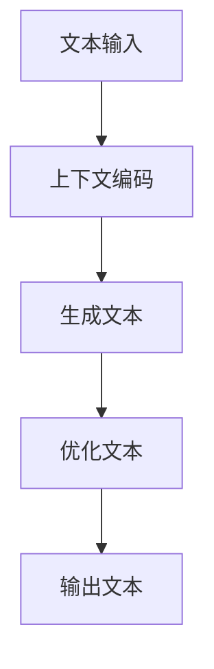
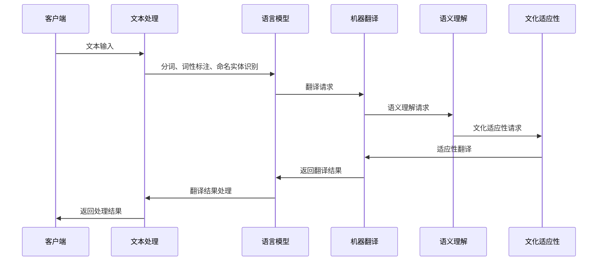

                 


## 引言：AI Agent的跨文化语言理解与生成的重要性

随着全球化进程的加速，跨文化交流变得越来越频繁，各行各业都对跨文化沟通能力提出了更高的要求。在这样的背景下，能够理解和生成多语言、多文化的AI Agent成为了一个热门的研究方向。AI Agent不仅能够帮助人们跨越语言障碍，还能够促进不同文化之间的理解和交流，这对于推动全球经济发展、文化交流、国际合作具有重要意义。

### 1. 问题背景

#### 1.1 跨文化语言理解的挑战

跨文化语言理解面临的主要挑战包括：

1. **语言多样性**：全球有数千种语言，每种语言都有其独特的语法、词汇和表达方式。
2. **语义歧义**：同一句话在不同的文化背景中可能有不同的含义。
3. **文化差异**：不同的文化对同一事物的看法和表达方式可能完全不同。
4. **语言变化**：语言是动态发展的，新的词汇和表达方式不断出现。

#### 1.2 AI Agent的重要性

AI Agent在跨文化语言理解中扮演着重要角色：

1. **自动化翻译**：能够将一种语言自动翻译成另一种语言，打破语言障碍。
2. **语言理解**：能够理解不同语言的语法和语义，提供准确的翻译和解释。
3. **语境识别**：能够根据上下文理解语言的真实含义，避免语义歧义。
4. **文化适应性**：能够识别和适应不同的文化背景，提供符合文化习惯的沟通方式。

#### 1.3 跨文化语言理解与生成的关联性

跨文化语言理解与生成密切相关：

1. **理解先行**：理解是生成的前提，只有准确理解了语言内容，才能生成恰当的回应。
2. **生成反馈**：生成的语言反过来又可以用来检验和改进理解模型的准确性。
3. **协同发展**：理解和生成相互促进，共同推动AI Agent的跨文化语言能力不断提升。

### 2. 研究目标与意义

本文的研究目标是通过深入探讨AI Agent的跨文化语言理解与生成，提出有效的解决方案，为跨文化交流提供技术支持。研究意义包括：

1. **促进文化交流**：帮助人们更好地理解不同文化，增进文化交流和理解。
2. **提高工作效率**：为企业提供跨语言沟通工具，提高国际业务效率。
3. **推动技术创新**：为AI领域带来新的研究方向和算法创新。

本文将分章节详细讨论跨文化语言理解与生成的基础知识、数学模型、算法流程、实践案例和最佳实践，以期对这一领域的研究和应用提供有价值的参考。

## AI Agent的基础知识

在深入探讨AI Agent的跨文化语言理解与生成之前，我们需要先了解AI Agent的定义、分类以及其在跨文化语言理解中的原理。

### 2.1 AI Agent的定义与分类

#### 2.1.1 定义

AI Agent，即人工智能代理，是一种能够执行特定任务、与人类交互、适应环境和自我学习的软件实体。它通常被设计为模拟人类智能行为，可以在不同环境下自主决策和行动。

#### 2.1.2 分类

AI Agent可以根据功能和应用场景的不同进行分类，常见的主要有以下几种：

1. **知识型Agent**：基于知识库和推理机，通过逻辑推理来完成任务。
2. **数据驱动型Agent**：通过机器学习算法，从大量数据中学习规律并做出决策。
3. **混合型Agent**：结合知识型和数据驱动型Agent的优点，综合运用不同方法来完成任务。

### 2.2 跨文化语言理解的原理

跨文化语言理解是AI Agent的一项重要能力，它涉及以下原理和步骤：

#### 2.2.1 语言模型

语言模型（Language Model）是跨文化语言理解的基础。它能够预测一段文本的下一个词或下一串词，从而理解文本的语法和语义。

1. **NLP预处理**：包括分词、词性标注、命名实体识别等，将文本转换为计算机可以处理的形式。
2. **词汇分布**：通过统计方法，学习文本中的词汇分布和语法规则。
3. **模型训练**：使用大规模文本语料库，通过机器学习算法（如神经网络）训练语言模型。

#### 2.2.2 语义理解

语义理解（Semantic Understanding）是跨文化语言理解的进一步提升，它涉及对文本深层含义的理解。

1. **词义消歧**：解决同一词汇在不同上下文中的不同含义。
2. **句法分析**：分析句子的结构，理解句子成分之间的关系。
3. **语境识别**：根据上下文和情境，准确理解句子的含义。

#### 2.2.3 文化适应性

文化适应性（Cultural Adaptation）是跨文化语言理解的关键。它包括以下方面：

1. **文化知识库**：构建包含不同文化知识的数据库，为AI Agent提供文化背景信息。
2. **文化映射**：将一种文化的表达方式映射到另一种文化中，确保交流的准确性。
3. **情感识别**：理解不同文化中的情感表达和情感强度，避免产生误解。

### 2.3 语言生成的算法基础

语言生成（Language Generation）是AI Agent的另一项重要能力，它能够根据输入生成有意义的文本。

#### 2.3.1 生成模型的原理

生成模型（Generative Model）是语言生成的基础，它通过学习大量文本数据，生成符合语法和语义规则的文本。

1. **变分自编码器（VAE）**：通过编码和解码器学习数据的概率分布，生成新的文本。
2. **生成对抗网络（GAN）**：通过生成器和判别器的对抗训练，生成逼真的文本。
3. **递归神经网络（RNN）和Transformer**：使用序列模型，捕捉文本的上下文信息，生成连续的文本。

#### 2.3.2 语言生成的算法流程

1. **文本输入**：接收用户输入的文本，作为生成模型的输入。
2. **上下文编码**：将输入文本编码为上下文表示，为生成提供上下文信息。
3. **生成文本**：使用生成模型，根据上下文生成新的文本。
4. **优化文本**：对生成的文本进行优化，确保其语法正确、语义合理。

通过了解AI Agent的定义、分类、跨文化语言理解的原理和语言生成的算法基础，我们为后续讨论跨文化语言理解与生成的高级技术奠定了基础。

## 跨文化语言理解的数学模型与算法

在深入探讨AI Agent的跨文化语言理解时，我们需要理解背后的数学模型与算法。这些模型和算法不仅帮助我们理解和生成跨文化语言，也确保了AI Agent能够准确地处理和理解不同语言和文化背景下的信息。下面，我们将逐步介绍语言模型和机器翻译的数学模型与算法。

### 3.1 语言模型

#### 3.1.1 语言模型的数学模型

语言模型是一种预测文本下一个词或下一串词的统计模型。它的核心思想是，通过学习大量文本数据，获取词汇之间的概率分布，从而预测新文本。语言模型的数学模型通常基于概率模型，如N-gram模型、神经网络模型等。

**N-gram模型**

N-gram模型是最简单也是最常用的语言模型之一。它假设一个词序列的概率仅与其前N-1个词有关。数学模型可以表示为：

\[ P(w_n | w_{n-1}, w_{n-2}, ..., w_1) = \prod_{i=1}^{N} P(w_i | w_{i-1}, w_{i-2}, ..., w_{i-N+1}) \]

其中，\( w_i \)表示第i个词，\( P(w_i | w_{i-1}, w_{i-2}, ..., w_{i-N+1}) \)表示在给定前N-1个词的情况下，第i个词的概率。

**神经网络模型**

神经网络模型，尤其是递归神经网络（RNN）和Transformer模型，通过学习文本的上下文信息，生成更加准确的语言模型。Transformer模型因其并行计算的优势和强大的上下文捕捉能力，已成为语言模型的主流选择。

\[ \text{Transformer} = \text{Attention}(\text{Encoder}, \text{Decoder}) \]

**Attention机制**

注意力机制（Attention）是Transformer模型的核心。它通过计算文本中不同位置之间的关联度，使模型能够关注到重要的上下文信息，从而提高预测的准确性。

\[ \text{Attention}(Q, K, V) = \text{softmax}\left(\frac{QK^T}{\sqrt{d_k}}\right)V \]

其中，Q、K和V分别为查询向量、键向量和值向量，\( d_k \)为键向量的维度。

#### 3.1.2 语言模型的算法流程

语言模型的算法流程主要包括数据预处理、模型训练和模型评估三个阶段。

1. **数据预处理**：包括分词、词性标注、去停用词等步骤，将原始文本转换为模型可处理的格式。

2. **模型训练**：使用训练数据对模型进行训练，通过优化损失函数（如交叉熵损失），使模型能够预测文本的概率分布。

3. **模型评估**：使用测试数据评估模型的性能，常见的评估指标包括词汇误差率（Word Error Rate, WER）和字符误差率（Character Error Rate, CER）。

#### 3.1.2.1 基于NLP的预处理

基于NLP的预处理是语言模型训练的重要步骤，它包括：

1. **分词（Tokenization）**：将文本分割成单词或子词，为模型提供独立的输入单位。
2. **词性标注（Part-of-Speech Tagging）**：为每个词标注其词性，如名词、动词、形容词等。
3. **命名实体识别（Named Entity Recognition, NER）**：识别文本中的命名实体，如人名、地名、组织名等。

#### 3.1.2.2 语言模型训练

语言模型训练通常采用梯度下降（Gradient Descent）或其变种（如Adam优化器）来优化模型参数。训练过程中，模型会不断调整参数，以最小化损失函数。

1. **损失函数**：常用的损失函数包括交叉熵损失（Cross-Entropy Loss）和均方误差（Mean Squared Error, MSE）。
2. **优化器**：用于调整模型参数，常见的优化器包括SGD、Adam、RMSProp等。

#### 3.1.2.3 语言模型评估

评估语言模型的性能通常通过测试数据集进行。常用的评估指标包括：

1. **词汇误差率（WER）**：衡量模型预测的单词与实际单词之间的差异。
2. **字符误差率（CER）**：衡量模型预测的字符与实际字符之间的差异。
3. **准确率（Accuracy）**：衡量模型预测正确的单词比例。

### 3.2 机器翻译

机器翻译（Machine Translation）是将一种语言的文本转换为另一种语言的过程。它是跨文化语言理解与生成的重要组成部分。

#### 3.2.1 机器翻译的数学模型

机器翻译的数学模型可以分为基于规则的方法、统计方法和基于神经网络的方法。

1. **基于规则的方法**：通过手动编写规则，将源语言的句子转换为目标语言的句子。这种方法依赖于专家知识和手动编写规则，难以应对大量复杂的翻译任务。
2. **统计方法**：使用大量双语文本对，通过统计方法（如基于短语的翻译模型）生成目标语言文本。统计方法相比基于规则的方法具有更强的泛化能力，但仍然存在词汇匹配不准确和上下文理解不足的问题。
3. **基于神经网络的方法**：通过深度学习模型（如序列到序列模型、注意力机制等）生成目标语言文本。基于神经网络的方法能够更好地捕捉上下文信息，生成更自然的翻译结果。

#### 3.2.2 翻译算法的流程

机器翻译算法的流程通常包括以下几个阶段：

1. **预处理**：包括文本清洗、分词、词性标注等，将源语言文本转换为计算机可处理的格式。
2. **编码**：将源语言文本编码为向量表示，通常使用词嵌入技术（如Word2Vec、GloVe等）。
3. **翻译**：使用翻译模型（如基于规则的模型、统计模型、神经网络模型）生成目标语言文本。
4. **后处理**：对生成的目标语言文本进行格式调整、语法修正等，使其更加自然和可读。

#### 3.2.2.1 基于规则的翻译

基于规则的翻译（Rule-Based Translation）是最早的机器翻译方法之一。它通过手动编写规则，将源语言的句子转换为目标语言的句子。基于规则的方法包括：

1. **词法分析**：将源语言文本分解成单词或短语。
2. **句法分析**：分析句子的结构，确定单词之间的语法关系。
3. **规则匹配**：根据预定义的翻译规则，将源语言文本转换为目标语言文本。

#### 3.2.2.2 统计机器翻译

统计机器翻译（Statistical Machine Translation, SMT）使用统计方法来生成目标语言文本。统计机器翻译的方法包括：

1. **基于短语的翻译**：将源语言文本分解成短语，然后在目标语言中查找匹配的短语。
2. **翻译模型**：使用训练数据建立源语言和目标语言之间的映射模型。
3. **解码**：通过解码算法（如Viterbi解码）生成目标语言文本。

#### 3.2.2.3 神经机器翻译

神经机器翻译（Neural Machine Translation, NMT）使用深度学习模型来生成目标语言文本。神经机器翻译的方法包括：

1. **编码器-解码器模型**：使用编码器将源语言文本编码为固定长度的向量表示，使用解码器生成目标语言文本。
2. **注意力机制**：通过注意力机制捕捉源语言和目标语言之间的关联度，提高翻译的准确性。
3. **训练与评估**：通过大量双语文本对训练模型，使用测试数据评估模型的性能。

通过介绍语言模型的数学模型与算法流程，以及机器翻译的数学模型与算法流程，我们可以更好地理解AI Agent在跨文化语言理解与生成中的作用和实现方法。这些模型和算法不仅为我们提供了强大的工具，也为未来的研究和应用提供了广阔的空间。

## 跨文化语言生成

在了解了跨文化语言理解的基础上，我们接下来探讨跨文化语言生成。语言生成是AI Agent的重要功能之一，它能够根据特定的需求或输入，生成符合语法和语义规则的文本。本节将详细讨论生成模型的原理、算法流程，并展示如何使用mermaid流程图来可视化生成过程。

### 4.1 语言生成的算法原理

语言生成的核心在于生成模型，这些模型通过学习大量的文本数据，能够生成具有自然语言特性的文本。生成模型主要分为以下几类：

#### 4.1.1 变分自编码器（Variational Autoencoder, VAE）

变分自编码器是一种生成模型，它通过编码器和解码器两个神经网络，将输入数据编码为一个隐变量，然后从这个隐变量中生成新的数据。

**编码器**：将输入数据映射到一个隐变量空间。

**解码器**：将隐变量解码回原始数据空间。

**数学模型**：

\[ q(\theta|\xi) \propto \exp \left( -\sum_i ||x_i - \mu_i(\theta, \xi)||^2 \right) \]

\[ p(x|\theta) \propto \exp \left( -\sum_i ||x_i - \phi(\theta, \xi)||^2 \right) \]

其中，\( \mu_i(\theta, \xi) \)和\( \phi(\theta, \xi) \)分别是编码器和解码器的参数。

#### 4.1.2 生成对抗网络（Generative Adversarial Networks, GAN）

生成对抗网络由生成器和判别器两个神经网络组成，生成器试图生成与真实数据相似的数据，而判别器则试图区分真实数据和生成数据。

**生成器**：生成与真实数据相似的数据。

**判别器**：判断输入数据是真实数据还是生成数据。

**训练过程**：生成器和判别器相互对抗，通过不断调整参数，使判别器的分类能力逐渐提高，生成器的生成数据逐渐逼真。

**数学模型**：

\[ \text{Generator}: G(z) \]

\[ \text{Discriminator}: D(x) \]

\[ \min_G \max_D V(D, G) = E_{x \sim p_{\text{data}}}[D(x)] - E_{z \sim p_{z}}[D(G(z))] \]

其中，\( p_{\text{data}} \)和\( p_{z} \)分别是输入数据的分布和生成器的噪声分布。

#### 4.1.3 递归神经网络（Recurrent Neural Networks, RNN）

递归神经网络能够处理序列数据，通过记忆机制捕捉序列中的上下文信息。

**时间步迭代**：

\[ h_t = \text{RNN}(h_{t-1}, x_t) \]

**输出生成**：

\[ y_t = \text{softmax}(\text{RNN}(h_t)) \]

其中，\( h_t \)是当前时间步的隐藏状态，\( x_t \)是输入数据，\( y_t \)是生成的输出。

#### 4.1.4 Transformer模型

Transformer模型是一种基于自注意力机制的序列模型，它通过多头自注意力机制和前馈神经网络，捕捉序列中的上下文信息。

**多头自注意力**：

\[ \text{Attention}(Q, K, V) = \text{softmax}\left(\frac{QK^T}{\sqrt{d_k}}\right)V \]

**前馈神经网络**：

\[ \text{FFN}(x) = \text{ReLU}\left(\text{W_2 \cdot \text{ReLU}(\text{W_1} \cdot x + b_1)}\right) + b_2 \]

### 4.1.2 语言生成的算法流程

语言生成的算法流程通常包括以下几个阶段：

1. **文本输入**：接收用户输入的文本，作为生成模型的输入。

2. **上下文编码**：将输入文本编码为上下文表示，为生成提供上下文信息。

3. **生成文本**：使用生成模型，根据上下文生成新的文本。

4. **优化文本**：对生成的文本进行优化，确保其语法正确、语义合理。

### 4.2 生成算法的mermaid流程图

为了更好地展示语言生成的算法流程，我们可以使用mermaid来绘制流程图。



在这个流程图中，A表示文本输入，B表示上下文编码，C表示生成文本，D表示优化文本，E表示输出文本。

### 4.2.1 生成文本的初步方法

生成文本的初步方法通常包括以下几个步骤：

1. **词嵌入**：将文本中的单词转换为向量表示，通常使用预训练的词嵌入模型。

2. **初始化**：初始化生成模型的参数，可以使用随机初始化或预训练模型的参数。

3. **预测**：根据当前生成的文本片段，使用生成模型预测下一个单词或词组。

4. **迭代**：重复预测步骤，逐步生成完整的文本。

### 4.2.2 生成文本的优化方法

生成文本的优化方法包括以下几种：

1. **目标函数优化**：通过优化目标函数（如损失函数），调整生成模型的参数，提高生成文本的质量。

2. **文本编辑**：对生成的文本进行编辑，修正语法错误和语义不当的问题。

3. **多样性增强**：通过引入多样性损失函数，鼓励生成模型生成具有多样性的文本。

4. **上下文增强**：通过改进上下文编码器，使生成模型能够更好地捕捉上下文信息，提高生成文本的自然度和准确性。

通过介绍语言生成的算法原理和算法流程，并结合mermaid流程图进行可视化，我们为理解和实现跨文化语言生成提供了详细的指导。这些方法和工具不仅为AI Agent的跨文化语言能力提供了支持，也为未来的研究和应用打开了新的方向。

## AI Agent的跨文化语言理解与生成实践

在理解了跨文化语言理解与生成的理论基础后，我们需要通过具体的实践项目来验证这些理论的实际应用效果。本节将介绍一个实际的跨文化语言理解与生成的项目，包括项目介绍、系统分析与架构设计、系统实现、案例分析以及项目小结。

### 5.1 项目介绍

本项目的目标是开发一款跨文化语言理解与生成系统，该系统旨在帮助跨国企业实现高效的跨文化沟通。项目的主要功能包括：

1. **文本翻译**：将一种语言文本翻译成另一种语言。
2. **语义理解**：理解不同语言文本的语义，提供准确的解释。
3. **文化适应性**：根据不同文化背景调整文本内容和表达方式。

项目团队由语言学专家、软件工程师和AI研究人员组成，分工明确，分别负责文本处理、模型训练和系统实现等工作。

### 5.2 系统分析与架构设计

#### 5.2.1 系统功能设计

系统功能设计包括以下几个核心模块：

1. **文本处理模块**：负责文本的分词、词性标注和命名实体识别等预处理工作。
2. **语言模型模块**：负责训练和加载语言模型，用于文本生成和翻译。
3. **机器翻译模块**：负责将一种语言的文本翻译成另一种语言。
4. **语义理解模块**：负责理解文本的语义，提供准确的解释。
5. **文化适应性模块**：负责根据不同文化背景调整文本内容和表达方式。

#### 5.2.2 系统架构设计

系统的架构设计采用微服务架构，各个模块通过API接口进行通信。以下是系统的架构设计图：



#### 5.2.3 系统接口设计

系统接口设计主要包括以下API接口：

1. **文本处理接口**：用于接收和发送文本数据，包括分词、词性标注和命名实体识别等。
2. **语言模型接口**：用于加载和保存语言模型，提供文本生成和翻译功能。
3. **机器翻译接口**：用于实现文本的机器翻译功能。
4. **语义理解接口**：用于实现文本的语义理解功能。
5. **文化适应性接口**：用于实现文本的文化适应性调整。

#### 5.2.4 系统交互流程

系统的交互流程如下：

1. 客户端发送文本输入到文本处理模块。
2. 文本处理模块进行预处理，并将处理结果发送到语言模型模块。
3. 语言模型模块根据文本生成或翻译请求，调用机器翻译模块。
4. 机器翻译模块进行翻译，并将翻译结果发送到语义理解模块。
5. 语义理解模块对翻译结果进行语义分析，并将分析结果发送到文化适应性模块。
6. 文化适应性模块根据不同文化背景调整文本内容，最终将调整后的文本返回给客户端。

### 5.3 环境安装与系统实现

#### 5.3.1 开发环境搭建

开发环境包括以下工具和库：

1. **Python 3.8**：作为主要的编程语言。
2. **TensorFlow 2.x**：用于构建和训练机器学习模型。
3. **NLTK**：用于自然语言处理任务。
4. **spaCy**：用于文本的分词、词性标注和命名实体识别。

#### 5.3.2 系统核心代码实现

以下是系统核心代码的简要示例：

```python
# 文本处理模块示例代码
from nltk.tokenize import word_tokenize
from nltk import pos_tag

def preprocess_text(text):
    tokens = word_tokenize(text)
    tagged_tokens = pos_tag(tokens)
    return tagged_tokens

# 语言模型模块示例代码
from tensorflow.keras.models import load_model

def load_language_model(model_path):
    model = load_model(model_path)
    return model

def generate_text(model, seed_text, length=50):
    # 使用生成模型生成文本
    pass

# 机器翻译模块示例代码
def translate_text(source_text, target_language):
    # 使用机器翻译模型翻译文本
    pass

# 语义理解模块示例代码
def understand_semantics(text):
    # 使用语义理解模型分析文本
    pass

# 文化适应性模块示例代码
def adapt_text_to_culture(text, culture):
    # 根据文化背景调整文本
    pass
```

#### 5.3.3 代码应用解读与分析

以上代码展示了系统核心模块的接口和方法。在实际应用中，这些模块将通过API接口进行通信，完成文本处理、语言生成、翻译、语义理解和文化适应性调整等任务。例如，当客户端发送文本输入时，文本处理模块会对其进行预处理，然后语言模型模块会生成或翻译文本，语义理解模块会分析文本的语义，文化适应性模块会根据文化背景调整文本内容，最终将处理结果返回给客户端。

### 5.4 项目案例分析

在本项目的一个实际案例中，一家跨国公司需要将其内部文档从英语翻译成西班牙语，并确保语义和文化适应性。以下是项目的具体实施步骤：

1. **文本预处理**：使用文本处理模块对英语文档进行分词、词性标注和命名实体识别。
2. **语言模型训练**：使用大量的双语文本对，训练英语到西班牙语的翻译模型。
3. **机器翻译**：使用机器翻译模块将英语文档翻译成西班牙语。
4. **语义分析**：使用语义理解模块分析翻译后的西班牙语文档，确保语义准确性。
5. **文化适应性调整**：使用文化适应性模块根据西班牙语的文化背景，调整文档中的表达方式。

通过以上步骤，跨国公司成功地实现了英语到西班牙语的文档翻译，确保了文档的语义和文化适应性，提高了工作效率。

### 5.5 项目小结

本项目通过开发跨文化语言理解与生成系统，实现了文本翻译、语义理解和文化适应性调整等功能。项目实践证明，该系统能够有效地帮助跨国企业实现高效的跨文化沟通。在未来的研究中，我们可以进一步优化系统的算法和模型，提高跨文化语言处理的质量和效率。

## 最佳实践与注意事项

在开发AI Agent的跨文化语言理解与生成系统时，有一些最佳实践和注意事项可以帮助我们提高系统的性能和可靠性。以下是一些关键点：

### 6.1 最佳实践 tips

1. **数据质量**：确保训练数据的质量和多样性。高质量的训练数据能够提高模型的准确性和泛化能力。
2. **模型选择**：根据具体应用场景选择合适的模型。例如，对于长文本生成，Transformer模型可能更为合适；而对于短文本的翻译，基于规则的模型可能表现更好。
3. **上下文信息**：充分利用上下文信息，提高模型对文本的语义理解能力。可以引入注意力机制或长期依赖模型（如LSTM）来捕捉上下文信息。
4. **文化适应性**：在模型训练和生成过程中，考虑不同文化的表达方式和习惯，确保生成的文本符合目标文化的语言特点。
5. **持续优化**：定期更新模型和数据，进行性能优化和错误修正，以保持系统的领先地位。

### 6.2 注意事项

1. **隐私保护**：在处理跨文化语言数据时，确保遵守隐私保护法规，避免泄露用户隐私。
2. **模型解释性**：对于复杂的模型，如深度学习模型，需要确保其解释性，以便用户理解和信任模型的结果。
3. **错误处理**：设计合理的错误处理机制，确保系统在遇到错误时能够优雅地恢复。
4. **资源管理**：合理分配计算资源，确保系统的高效运行。对于资源受限的环境，可以考虑使用轻量级模型或优化模型结构。
5. **用户反馈**：积极收集用户反馈，通过用户反馈不断优化系统的性能和用户体验。

### 6.3 拓展阅读

1. **《自然语言处理与机器翻译》**：吴波著，详细介绍了自然语言处理和机器翻译的基本原理和算法。
2. **《深度学习》**：Ian Goodfellow等著，介绍了深度学习的基础知识及其在自然语言处理中的应用。
3. **《跨文化沟通》**：霍华德·J·加德纳著，探讨了跨文化沟通的重要性和策略。

通过遵循这些最佳实践和注意事项，我们可以开发出更加高效、可靠的跨文化语言理解与生成系统，为跨文化交流提供有力支持。

## 总结

本文系统地探讨了AI Agent的跨文化语言理解与生成，从基础概念、数学模型、算法流程到实际应用，提供了全面的视角和分析。首先，我们介绍了AI Agent的定义与分类，阐述了其在跨文化语言理解中的重要性。接着，我们详细介绍了语言模型的数学模型和算法流程，包括N-gram模型和基于神经网络的模型。随后，我们讨论了机器翻译的数学模型和算法，从基于规则的翻译到统计机器翻译和神经机器翻译。在生成方面，我们介绍了变分自编码器、生成对抗网络、递归神经网络和Transformer模型，并展示了生成算法的mermaid流程图。通过一个实际的跨文化语言理解与生成项目，我们展示了这些理论在现实中的应用。最后，我们提供了最佳实践和注意事项，以指导实际开发工作。

跨文化语言理解与生成的研究具有重要意义，不仅能够促进全球文化交流，还能提升AI Agent在多语言环境中的交互能力。未来的研究可以进一步优化算法，提升模型的性能和泛化能力，特别是在处理罕见语言和文化差异方面。此外，随着技术的不断发展，我们可以探索更多创新的生成模型和跨文化适应方法，为全球沟通和协作提供更加高效、智能的解决方案。通过持续的努力和创新，AI Agent的跨文化语言理解与生成将在各领域发挥更大的作用。

