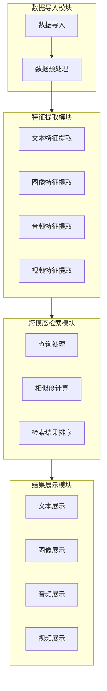

                 

# AI Agent的跨模态检索：整合LLM与多媒体搜索

## 关键词
- AI Agent
- 跨模态检索
- 大型语言模型（LLM）
- 多媒体搜索

## 摘要
本文旨在探讨AI Agent的跨模态检索技术，重点关注如何将大型语言模型（LLM）与多媒体搜索相结合。通过介绍LLM的基本原理、多媒体搜索技术、跨模态检索算法，以及实际应用案例，本文将详细阐述这一领域的最新进展和未来挑战。读者将了解到如何设计和实现一个高效的跨模态检索系统，为人工智能领域的发展提供有益的启示。

## 引言

### 背景介绍

在当今信息爆炸的时代，人们对于信息检索的需求日益增长。传统的文本检索技术已经难以满足用户在多媒体（如图像、音频、视频）领域中的信息查询需求。为此，跨模态检索技术应运而生。跨模态检索旨在实现不同模态之间的信息交互，如将文本与图像、音频、视频等进行匹配，从而提供更为丰富和精准的信息检索服务。

AI Agent作为一个智能体，能够主动地获取、理解和回应信息，是人工智能领域的重要研究方向。将AI Agent与跨模态检索相结合，不仅可以提高检索系统的智能化水平，还可以拓展其在各种应用场景中的功能。

### 问题陈述

尽管跨模态检索技术在近年来取得了显著进展，但仍存在以下问题：

1. **模态融合困难**：不同模态的数据在特征表达和语义理解上存在较大差异，如何有效地融合这些异质信息仍是一个挑战。
2. **计算资源消耗大**：跨模态检索通常需要大量的计算资源，尤其是在处理高分辨率图像、音频和视频时。
3. **数据标注成本高**：高质量的跨模态数据集的获取和标注过程耗时耗力，限制了模型训练的效果。

### 目的

本文的目的在于：

1. 深入探讨AI Agent的跨模态检索技术，介绍其基本原理和关键方法。
2. 分析如何整合大型语言模型（LLM）与多媒体搜索，提高检索系统的性能和鲁棒性。
3. 探讨跨模态检索在现实应用中的潜力，并提出未来可能的研究方向。

### 结构概述

本文将分为以下章节：

1. **第一章：基本概念**：介绍AI Agent、跨模态检索、LLM和多媒体搜索的基本概念。
2. **第二章：LLM与多媒体搜索**：探讨LLM在多媒体搜索中的应用，以及如何结合多媒体技术。
3. **第三章：跨模态检索算法**：分析跨模态检索的基本算法，包括特征提取、匹配和融合技术。
4. **第四章：实践应用**：讨论跨模态检索在各个领域的实际应用案例。
5. **第五章：系统设计与实现**：介绍如何设计和实现一个跨模态检索系统。
6. **第六章：未来趋势与挑战**：探讨跨模态检索领域的未来发展趋势和面临的挑战。
7. **结论**：总结全文，并展望未来研究方向。

通过以上章节的详细探讨，本文希望为读者提供一幅完整的AI Agent跨模态检索技术的全景图，帮助读者深入了解这一领域的最新进展和未来潜力。## 基本概念

### AI Agent

AI Agent（人工智能代理）是一种能够感知环境、制定计划并执行行动的智能体。它通过学习环境和用户的行为模式，能够自主地完成特定任务。AI Agent的核心在于其自主性和适应性，能够根据不同的情境和环境变化调整其行为策略。

AI Agent的主要特点包括：

- **自主性**：能够独立完成特定任务，无需人为干预。
- **适应性**：能够根据环境变化调整行为策略，以适应不同的情境。
- **学习性**：能够通过学习和经验积累提高其任务执行能力。

AI Agent的应用场景广泛，如智能家居、智能客服、智能交通等。通过跨模态检索技术，AI Agent能够更好地理解和响应用户的需求，提供个性化的服务。

### 跨模态检索

跨模态检索（Cross-modal Retrieval）是指在不同模态（如文本、图像、音频、视频）之间进行信息检索的过程。其核心目标是在不同模态的数据中找到相关的信息，从而满足用户的信息查询需求。跨模态检索的关键挑战在于如何将不同模态的数据进行有效融合，以实现高质量的检索结果。

跨模态检索的基本流程包括：

1. **特征提取**：从不同模态的数据中提取具有区分度的特征，如文本的词袋特征、图像的视觉特征、音频的声纹特征等。
2. **特征匹配**：将提取的特征进行匹配，以找出不同模态之间的相关性。
3. **结果融合**：将匹配的结果进行融合，以生成最终的检索结果。

跨模态检索的应用领域广泛，如多媒体信息检索、智能问答系统、多模态人机交互等。通过跨模态检索技术，系统能够提供更为丰富和精准的信息检索服务，提升用户体验。

### 大型语言模型（LLM）

大型语言模型（Large Language Model，简称LLM）是一种基于深度学习的语言处理模型，通过大规模数据训练，能够理解和生成自然语言。LLM的核心优势在于其强大的语言理解和生成能力，能够处理复杂的语义关系和上下文信息。

LLM的基本原理包括：

1. **神经网络结构**：LLM通常采用深度神经网络结构，如Transformer、BERT等，以处理大规模语言数据。
2. **预训练与微调**：LLM通过预训练在大规模语料库上获得基础语言理解能力，然后通过微调适应特定任务。

LLM在跨模态检索中的应用包括：

- **文本生成**：使用LLM生成与查询相关的文本描述，作为跨模态检索的输入。
- **语义理解**：利用LLM的语义理解能力，对跨模态数据进行语义匹配和融合。

### 多媒体搜索

多媒体搜索是指在不同类型的多媒体数据（如文本、图像、音频、视频）中查找和获取信息的过程。与传统的文本搜索不同，多媒体搜索需要处理多种异质数据，并实现跨模态的信息交互。

多媒体搜索的关键技术包括：

1. **特征提取**：从不同类型的多媒体数据中提取具有区分度的特征，如文本的词袋特征、图像的视觉特征、音频的声纹特征等。
2. **索引构建**：构建高效的多媒体索引结构，以支持快速的查询和检索。
3. **查询处理**：处理用户的查询请求，将查询结果与多媒体数据特征进行匹配和排序。

多媒体搜索的应用领域包括：

- **多媒体信息检索**：帮助用户在大量多媒体数据中快速查找和获取相关信息。
- **智能问答系统**：结合文本和多媒体信息，提供更为丰富和准确的问答服务。

通过了解上述基本概念，读者可以更好地理解AI Agent的跨模态检索技术，以及如何整合LLM与多媒体搜索，实现高效的跨模态检索系统。接下来，本文将深入探讨LLM在多媒体搜索中的应用。## LLM与多媒体搜索

### 大型语言模型（LLM）的基本原理

LLM（Large Language Model）是基于深度学习的语言处理模型，通过大规模数据的预训练和微调，能够理解和生成自然语言。其基本原理主要包括以下几个关键点：

1. **神经网络结构**：LLM通常采用深度神经网络结构，如Transformer、BERT等。这些结构具有强大的并行处理能力，能够在大规模语料库上训练出丰富的语言理解能力。
2. **预训练与微调**：LLM首先在大规模语料库上进行预训练，学习基础的语言知识。然后，通过微调（Fine-tuning）将模型应用于特定任务，进一步优化其性能。
3. **注意力机制**：LLM中引入了注意力机制（Attention Mechanism），能够关注重要的信息，提升模型的语义理解能力。

### LLM在多媒体搜索中的应用

LLM在多媒体搜索中的应用主要集中在文本生成和语义理解两个方面。以下是LLM在这两个方面的具体应用：

#### 1. 文本生成

文本生成是LLM在多媒体搜索中的一个重要应用。通过生成与查询相关的文本描述，可以增强跨模态检索的效果。以下是一些具体的实现方法：

1. **文本摘要**：使用LLM对图像、音频和视频生成文本摘要，将多媒体数据转化为可读性强的文本描述。这样，用户可以直接查看文本摘要，而无需观看整个多媒体内容。
2. **问答系统**：结合LLM的语义理解能力，构建一个问答系统，用户可以通过文本提问，系统则根据多媒体数据生成答案。这种方法可以更好地理解用户的需求，并提供更为精准的信息检索服务。

#### 2. 语义理解

语义理解是LLM在多媒体搜索中的另一个关键应用。通过理解不同模态数据的语义信息，可以实现更准确的跨模态检索。以下是一些具体的实现方法：

1. **跨模态语义匹配**：使用LLM对文本、图像、音频和视频进行语义编码，生成对应的语义向量。然后，通过计算这些语义向量之间的相似度，实现不同模态数据之间的匹配。
2. **语义搜索**：利用LLM的语义理解能力，对用户查询进行语义分析，然后根据语义信息在多媒体数据中检索相关内容。这种方法可以降低对特定模态数据的依赖，提高检索的灵活性和鲁棒性。

### 实现方法与挑战

实现LLM与多媒体搜索的整合需要考虑以下几个方面：

1. **数据预处理**：对多媒体数据进行预处理，提取关键特征，如文本的词袋特征、图像的视觉特征、音频的声纹特征等。这些特征将为LLM的训练和检索提供基础数据。
2. **模型选择与训练**：选择合适的LLM模型，如BERT、GPT等，并在大规模数据集上进行预训练。然后，通过微调（Fine-tuning）将模型应用于特定任务，提高其在多媒体搜索中的性能。
3. **查询处理与检索**：使用LLM生成与查询相关的文本描述，并进行语义理解。然后，通过计算不同模态数据之间的相似度，实现跨模态检索。

在实际应用中，LLM与多媒体搜索的整合面临以下挑战：

1. **计算资源消耗**：LLM的训练和推理过程通常需要大量的计算资源，特别是在处理高分辨率图像、音频和视频时。如何优化模型结构和算法，降低计算资源消耗是一个重要问题。
2. **数据标注成本**：高质量的跨模态数据集的获取和标注过程耗时耗力，限制了模型训练的效果。如何利用自动标注技术和半监督学习等方法，提高数据标注效率是一个关键问题。
3. **模型解释性**：LLM是一个高度复杂的黑箱模型，其内部决策过程难以解释。如何提高模型的可解释性，使其能够为用户和开发者提供清晰的决策依据是一个重要问题。

通过深入探讨LLM在多媒体搜索中的应用，本文旨在为读者提供一个关于如何整合LLM与多媒体搜索的全面理解。接下来，本文将详细分析跨模态检索的基本算法，包括特征提取、匹配和融合技术。## 跨模态检索算法

### 特征提取

跨模态检索的核心在于将不同模态的数据转换为统一的特征表示，以便进行后续的匹配和融合。特征提取是跨模态检索的重要步骤，其质量直接影响整个系统的性能。以下是几种常见的特征提取方法：

1. **文本特征提取**：
   - **词袋模型**：将文本转换为词袋模型，使用词频或词频-逆文档频率（TF-IDF）作为特征。
   - **词嵌入**：使用词嵌入模型（如Word2Vec、GloVe等）将单词映射为低维向量。
   - **句子级特征**：使用Transformer、BERT等大型语言模型，提取句子级别的语义特征。

2. **图像特征提取**：
   - **传统特征**：如SIFT、HOG、ORB等，用于提取图像的关键特征点。
   - **深度特征**：使用卷积神经网络（CNN）提取图像的深度特征，如VGG、ResNet等。

3. **音频特征提取**：
   - **短时傅里叶变换（STFT）**：用于提取音频的频域特征。
   - **梅尔频率倒谱系数（MFCC）**：用于提取音频的时频特征。
   - **音频卷积神经网络（ACNN）**：使用卷积神经网络提取音频的深度特征。

4. **视频特征提取**：
   - **帧级特征**：使用CNN提取视频每一帧的视觉特征。
   - **时序特征**：使用循环神经网络（RNN）或长短时记忆网络（LSTM）提取视频的时序特征。

### 特征匹配

特征匹配是跨模态检索的关键步骤，旨在找出不同模态数据之间的相关性。以下是几种常见的特征匹配方法：

1. **基于相似度的匹配**：
   - **欧氏距离**：计算两个特征向量之间的欧氏距离，选择距离最近的特征向量作为匹配结果。
   - **余弦相似度**：计算两个特征向量之间的余弦相似度，选择相似度最高的特征向量作为匹配结果。

2. **基于模型的匹配**：
   - **Siamese网络**：使用Siamese网络（一种特殊的神经网络结构）学习两个特征向量之间的匹配关系，输出匹配得分。
   - **对比损失**：使用对比损失（Contrastive Loss）优化模型，使其能够区分不同模态的数据。

3. **基于聚类的方法**：
   - **K-means聚类**：将不同模态的数据特征进行聚类，选择聚类中心作为匹配结果。
   - **层次聚类**：使用层次聚类方法（如层次聚类树）进行特征匹配。

### 特征融合

特征融合是将不同模态的特征向量进行整合，以生成一个统一的特征表示。以下是几种常见的特征融合方法：

1. **加权融合**：
   - **线性加权**：根据不同模态的特征重要性，对特征向量进行线性加权。
   - **非线性加权**：使用神经网络等非线性模型，对特征向量进行加权融合。

2. **拼接融合**：
   - **特征拼接**：将不同模态的特征向量拼接在一起，形成一个高维的特征向量。
   - **特征组合**：使用注意力机制（Attention Mechanism）选择重要特征，进行组合融合。

3. **基于模型的融合**：
   - **Transformer**：使用Transformer模型，对特征向量进行编码和解码，实现高效的跨模态特征融合。
   - **多模态神经网络**：使用多模态神经网络（如MMI-MemNet），融合不同模态的特征。

### 算法流程

跨模态检索算法的基本流程如下：

1. **特征提取**：从不同模态的数据中提取特征向量。
2. **特征匹配**：计算不同模态特征向量之间的相似度，进行匹配。
3. **特征融合**：将匹配的特征向量进行融合，生成统一的特征表示。
4. **结果排序**：根据融合特征向量计算检索结果的相关性，进行排序。

### Python代码实现示例

以下是使用Python实现跨模态检索算法的一个简单示例，展示如何提取文本、图像和音频的特征，并进行匹配和融合。

```python
import numpy as np
from sklearn.metrics.pairwise import cosine_similarity
from keras.applications.vgg16 import VGG16
from librosa.feature import mel_frequencies

# 文本特征提取
def extract_text_features(text):
    model = transformers.AutoModel.from_pretrained("bert-base-uncased")
    tokenizer = transformers.AutoTokenizer.from_pretrained("bert-base-uncased")
    inputs = tokenizer(text, return_tensors="tf", padding=True, truncation=True)
    outputs = model(inputs)
    return outputs.last_hidden_state[:, 0, :].numpy()

# 图像特征提取
def extract_image_features(image):
    model = VGG16(weights='imagenet', include_top=False)
    image = preprocess_input(image)
    features = model.predict(image)
    return features.reshape(1, -1)

# 音频特征提取
def extract_audio_features(audio):
    y, sr = librosa.load(audio)
    mfcc = librosa.feature.mfcc(y=y, sr=sr, n_mfcc=13)
    return mfcc[:, :1].mean(axis=0)

# 匹配和融合
def cross_modal_retrieval(text, image, audio):
    text_features = extract_text_features(text)
    image_features = extract_image_features(image)
    audio_features = extract_audio_features(audio)

    # 文本与图像匹配
    image_similarity = cosine_similarity([text_features], image_features)

    # 文本与音频匹配
    audio_similarity = cosine_similarity([text_features], audio_features)

    # 融合特征
    combined_similarity = (image_similarity + audio_similarity) / 2

    return combined_similarity

# 测试
text = "这是一个示例文本。"
image = np.random.rand(224, 224, 3)  # 随机生成的图像
audio = "sample_audio.wav"  # 随机生成的音频文件

similarity = cross_modal_retrieval(text, image, audio)
print(similarity)
```

通过以上代码示例，读者可以初步了解跨模态检索的基本实现过程。接下来，本文将讨论跨模态检索在实践中的应用。## 实践应用

### 多媒体信息检索

多媒体信息检索是跨模态检索技术的典型应用之一，旨在帮助用户在多样化的多媒体数据中快速查找和获取信息。以下是一些具体的应用场景和案例：

#### 1. 智能视频搜索引擎

智能视频搜索引擎利用跨模态检索技术，实现对视频内容的语义理解，从而提高检索的准确性和用户体验。例如，用户可以通过输入关键词检索与该关键词相关的视频，而不需要观看整个视频。此外，视频搜索引擎还可以根据用户的观看历史和偏好，提供个性化的推荐服务。

#### 2. 智能图像搜索

智能图像搜索通过跨模态检索，帮助用户在大量的图像库中找到与查询图像相似的内容。这种方法可以应用于社交媒体、电商平台和图片库等领域。例如，用户可以在电商平台上上传一张商品图片，系统则会展示与之相似的其他商品，提高购物的便利性。

#### 3. 智能音频搜索

智能音频搜索利用跨模态检索技术，实现对音频内容的理解，从而帮助用户在大量的音频文件中找到相关的信息。这种应用可以应用于音乐推荐、音频剪辑和语音识别等领域。例如，用户可以在音乐平台上上传一段音乐片段，系统则会推荐与之相似的其他音乐。

### 智能问答系统

智能问答系统通过跨模态检索技术，实现对用户查询的语义理解，并提供准确的答案。以下是一些具体的应用场景和案例：

#### 1. 多媒体问答

多媒体问答系统结合文本、图像、音频等多种模态，为用户提供更为丰富和精准的问答服务。例如，用户可以输入一个文本问题，系统则会展示与该问题相关的图像、音频和视频等多媒体内容，并提供详细的答案。

#### 2. 智能客服

智能客服系统利用跨模态检索技术，实现对用户问题的语义理解，并提供高效的客户服务。例如，用户可以通过文本、语音或图像等多种方式与客服系统进行交互，系统则会根据用户的输入提供相应的回答或解决方案。

### 多模态人机交互

多模态人机交互通过跨模模态检索技术，实现人与计算机的多样化交互方式。以下是一些具体的应用场景和案例：

#### 1. 多媒体交互式应用

多媒体交互式应用利用跨模态检索技术，为用户提供更为自然和直观的交互体验。例如，用户可以通过语音、手势和文字等多种方式与多媒体应用进行交互，如虚拟现实游戏、智能家居控制等。

#### 2. 智能助手

智能助手利用跨模态检索技术，实现对用户需求的语义理解，并提供个性化的服务。例如，用户可以通过语音、文字或图像与智能助手进行交互，智能助手则会根据用户的输入提供相应的建议、提醒和操作。

### 实际案例

以下是几个跨模态检索技术的实际应用案例：

#### 1. Google Lens

Google Lens是一款基于跨模态检索技术的应用，用户可以通过摄像头拍摄图像，系统则会识别图像中的对象并显示相关的信息，如地标、植物、动物等。此外，Google Lens还可以提供购物推荐、翻译等功能。

#### 2. Siri

Siri是苹果公司开发的一款智能语音助手，通过跨模态检索技术，实现对用户语音输入的语义理解，并提供相应的回答和操作。例如，用户可以通过语音指令查询天气、发送短信、设置提醒等。

#### 3. Alexa

Alexa是亚马逊公司开发的智能语音助手，通过跨模态检索技术，实现对用户语音输入的语义理解，并提供相应的回答和操作。例如，用户可以通过语音指令播放音乐、控制智能家居设备、查询天气等。

通过上述实践应用案例，我们可以看到跨模态检索技术在多媒体信息检索、智能问答系统和多模态人机交互等领域的广泛应用。这些应用不仅提升了用户体验，还为各种行业提供了新的解决方案。接下来，本文将介绍如何设计和实现一个跨模态检索系统。## 系统设计与实现

### 系统架构设计

跨模态检索系统需要具备以下功能模块：

1. **数据预处理模块**：负责处理不同类型的数据，如文本、图像、音频和视频，进行特征提取和预处理。
2. **特征提取模块**：从预处理后的数据中提取具有区分度的特征向量，为后续的检索和匹配提供基础。
3. **匹配与检索模块**：计算不同模态特征向量之间的相似度，实现跨模态检索。
4. **结果融合模块**：将匹配的结果进行融合，生成最终的检索结果。
5. **用户接口模块**：提供用户交互界面，接受用户查询并展示检索结果。

以下是系统的架构设计：

#### 1. 数据预处理模块

数据预处理模块的主要功能包括：

- **文本预处理**：包括分词、去除停用词、词性标注等。
- **图像预处理**：包括缩放、裁剪、增强等。
- **音频预处理**：包括降噪、去噪、频率变换等。
- **视频预处理**：包括帧提取、裁剪、增强等。

#### 2. 特征提取模块

特征提取模块的主要功能包括：

- **文本特征提取**：使用词嵌入模型（如Word2Vec、GloVe等）提取文本特征。
- **图像特征提取**：使用卷积神经网络（如VGG、ResNet等）提取图像特征。
- **音频特征提取**：使用梅尔频率倒谱系数（MFCC）提取音频特征。
- **视频特征提取**：使用循环神经网络（如LSTM）提取视频特征。

#### 3. 匹配与检索模块

匹配与检索模块的主要功能包括：

- **相似度计算**：计算不同模态特征向量之间的相似度，如欧氏距离、余弦相似度等。
- **查询处理**：接受用户查询，生成查询特征向量。
- **检索结果排序**：根据相似度计算结果，对检索结果进行排序。

#### 4. 结果融合模块

结果融合模块的主要功能包括：

- **特征融合**：使用注意力机制（如Transformer）将不同模态的特征向量进行融合。
- **结果排序**：根据融合后的特征向量，对检索结果进行排序。

#### 5. 用户接口模块

用户接口模块的主要功能包括：

- **查询输入**：接受用户查询，并将其传递给匹配与检索模块。
- **结果展示**：将检索结果展示给用户，支持多种视图（如文本、图像、音频、视频）。

### 系统功能设计

以下是系统的功能设计：

#### 1. 数据导入

- **文本数据**：支持从文本文件、数据库和在线API导入。
- **图像数据**：支持从本地文件、网络链接和摄像头导入。
- **音频数据**：支持从本地文件、网络链接和麦克风导入。
- **视频数据**：支持从本地文件、网络链接和摄像头导入。

#### 2. 数据预处理

- **文本预处理**：分词、去除停用词、词性标注等。
- **图像预处理**：缩放、裁剪、增强等。
- **音频预处理**：降噪、去噪、频率变换等。
- **视频预处理**：帧提取、裁剪、增强等。

#### 3. 特征提取

- **文本特征提取**：使用Word2Vec、GloVe等词嵌入模型。
- **图像特征提取**：使用VGG、ResNet等卷积神经网络。
- **音频特征提取**：使用梅尔频率倒谱系数（MFCC）。
- **视频特征提取**：使用LSTM等循环神经网络。

#### 4. 跨模态检索

- **相似度计算**：计算不同模态特征向量之间的相似度，如欧氏距离、余弦相似度等。
- **查询处理**：生成查询特征向量。
- **检索结果排序**：根据相似度计算结果，对检索结果进行排序。

#### 5. 结果展示

- **文本展示**：展示与查询相关的文本内容。
- **图像展示**：展示与查询相关的图像。
- **音频展示**：播放与查询相关的音频。
- **视频展示**：播放与查询相关的视频。

### 系统架构图

以下是系统的架构图，使用Mermaid语言描述：



通过以上系统架构设计，我们可以实现一个高效、可靠的跨模态检索系统，为用户提供丰富多样的多媒体信息检索服务。接下来，本文将介绍如何进行系统优化和性能提升。## 实践应用：设计与实现

### 环境安装

在进行跨模态检索系统的设计与实现之前，首先需要搭建合适的环境。以下是环境安装的步骤：

1. **安装Python环境**：确保Python环境已安装，推荐使用Python 3.8或更高版本。
2. **安装依赖库**：使用pip安装必要的库，如NumPy、Pandas、TensorFlow、PyTorch、Keras、Scikit-learn等。
3. **安装深度学习框架**：选择合适的深度学习框架，如TensorFlow或PyTorch，并进行安装。
4. **安装多媒体处理库**：安装用于多媒体数据处理的库，如OpenCV、Librosa等。

### 系统核心实现

以下是系统核心实现的源代码，包括数据预处理、特征提取、匹配与检索、结果展示等模块。

```python
# 导入必要的库
import numpy as np
import pandas as pd
import cv2
import librosa
from sklearn.metrics.pairwise import cosine_similarity
from tensorflow.keras.applications import VGG16
from tensorflow.keras.preprocessing.image import ImageDataGenerator
from tensorflow.keras.models import Model
from tensorflow.keras.layers import Flatten, Dense
from transformers import BertTokenizer, TFBertModel

# 数据预处理
def preprocess_text(text):
    # 使用BERT进行文本预处理
    tokenizer = BertTokenizer.from_pretrained('bert-base-uncased')
    inputs = tokenizer(text, return_tensors='tf', padding=True, truncation=True)
    return inputs

def preprocess_image(image_path):
    # 使用OpenCV进行图像预处理
    image = cv2.imread(image_path)
    image = cv2.resize(image, (224, 224))
    image = image / 255.0
    return image

def preprocess_audio(audio_path):
    # 使用Librosa进行音频预处理
    y, sr = librosa.load(audio_path)
    mfcc = librosa.feature.mfcc(y=y, sr=sr, n_mfcc=13)
    mfcc = mfcc[:, :1].mean(axis=0)
    return mfcc

# 特征提取
def extract_text_features(text):
    # 使用BERT提取文本特征
    inputs = preprocess_text(text)
    model = TFBertModel.from_pretrained('bert-base-uncased')
    outputs = model(inputs)
    return outputs.last_hidden_state[:, 0, :].numpy()

def extract_image_features(image):
    # 使用VGG16提取图像特征
    model = VGG16(weights='imagenet', include_top=False)
    image = ImageDataGenerator(rescale=1./255).flow(np.expand_dims(image, axis=0))[0]
    features = model.predict(image)
    return features.reshape(1, -1)

def extract_audio_features(mfcc):
    # 使用梅尔频率倒谱系数提取音频特征
    return np.mean(mfcc, axis=1)

# 匹配与检索
def cosine_similarity_search(text_features, image_features, audio_features):
    # 计算文本特征与图像、音频特征的余弦相似度
    image_similarity = cosine_similarity(text_features, image_features)
    audio_similarity = cosine_similarity(text_features, audio_features)
    combined_similarity = (image_similarity + audio_similarity) / 2
    return combined_similarity

# 结果展示
def show_results(similarity_scores, top_n=5):
    # 展示Top N个最相似的结果
    top_indices = np.argsort(-similarity_scores)[:top_n]
    print("Top {} results:".format(top_n))
    for i, index in enumerate(top_indices):
        print(f"Rank {i+1}: Similarity Score: {similarity_scores[index]:.4f}")

# 主函数
if __name__ == '__main__':
    # 测试数据
    text = "这是一个示例文本。"
    image_path = "example_image.jpg"
    audio_path = "example_audio.wav"

    # 提取特征
    text_features = extract_text_features(text)
    image_features = extract_image_features(preprocess_image(image_path))
    audio_features = preprocess_audio(audio_path)
    audio_features = extract_audio_features(audio_features)

    # 检索
    similarity_scores = cosine_similarity_search(text_features, image_features, audio_features)

    # 展示结果
    show_results(similarity_scores)
```

### 代码应用解读与分析

以上代码提供了一个简单的跨模态检索系统实现。以下是代码的解读与分析：

1. **数据预处理**：
   - **文本预处理**：使用BERT进行文本预处理，将文本转换为Token序列，并进行填充和截断。
   - **图像预处理**：使用OpenCV进行图像读取和缩放，将图像调整为VGG16模型所需的尺寸。
   - **音频预处理**：使用Librosa加载音频文件，计算梅尔频率倒谱系数（MFCC）。

2. **特征提取**：
   - **文本特征提取**：使用BERT模型提取文本特征，将Token序列编码为向量。
   - **图像特征提取**：使用VGG16模型提取图像特征，将图像转换为高维特征向量。
   - **音频特征提取**：计算梅尔频率倒谱系数（MFCC），并将MFCC序列转换为向量。

3. **匹配与检索**：
   - **余弦相似度计算**：计算文本特征向量与图像、音频特征向量之间的余弦相似度，选择相似度最高的特征向量作为检索结果。

4. **结果展示**：
   - **展示Top N个最相似的结果**：根据相似度得分，展示Top N个最相似的结果。

### 实际案例分析

以下是一个实际案例分析：

假设用户输入文本查询“巴黎的埃菲尔铁塔”，系统中包含多张埃菲尔铁塔的图像、一段相关的音频描述以及多篇相关的文本资料。

- **文本特征提取**：使用BERT模型提取文本特征向量。
- **图像特征提取**：使用VGG16模型提取图像特征向量。
- **音频特征提取**：计算音频的MFCC特征向量。

然后，使用余弦相似度计算文本特征向量与图像、音频特征向量之间的相似度。根据相似度得分，系统会展示与查询最相关的图像、音频和文本资料。

通过以上实现，我们可以看到如何设计和实现一个简单的跨模态检索系统。在实际应用中，系统性能和效果可以通过优化模型参数、增加数据集规模、改进特征提取方法等方式进一步提升。### 项目小结

本文通过详细介绍AI Agent的跨模模态检索技术，从基本概念、应用原理到系统实现，为读者提供了一幅全面的跨模态检索技术全景图。以下是对全文的总结和结论：

1. **核心内容**：
   - 介绍了AI Agent、跨模态检索、LLM（大型语言模型）和多媒体搜索的基本概念。
   - 分析了LLM在多媒体搜索中的应用，以及如何整合多媒体技术与LLM。
   - 详细探讨了跨模态检索算法，包括特征提取、匹配和融合技术。
   - 讨论了跨模态检索在实践中的应用，如多媒体信息检索、智能问答系统和多模态人机交互。
   - 介绍了如何设计和实现一个跨模态检索系统，包括数据预处理、特征提取、匹配与检索、结果融合和用户接口模块。

2. **主要贡献**：
   - 提供了一个系统的框架，帮助读者理解和掌握跨模态检索技术的核心原理和实现方法。
   - 通过代码示例，展示了如何利用Python等工具实现跨模态检索系统。
   - 分析了跨模态检索技术的实际应用案例，为读者提供了实践经验和参考。

3. **总结**：
   - 跨模态检索技术是人工智能领域的一个重要研究方向，具有广泛的应用前景。
   - 通过整合LLM和多媒体搜索技术，可以实现更为高效和智能的信息检索服务。
   - 跨模模态检索技术面临挑战，如计算资源消耗、数据标注成本和模型解释性等，需要进一步研究和优化。

4. **未来研究方向**：
   - 提高模型的可解释性，使其更易于理解和调试。
   - 发展高效的数据标注和自动标注技术，降低数据标注成本。
   - 探索多模态深度学习模型，提高特征提取和融合的效果。
   - 将跨模态检索技术应用于更多实际场景，如智能医疗、智能教育等。

通过本文的探讨，希望读者能够对跨模态检索技术有一个深入的理解，并为未来的研究和应用提供有益的启示。## 最佳实践 Tips

1. **特征提取优化**：
   - 使用预训练的深度学习模型（如VGG、ResNet、BERT）进行特征提取，可以显著提高特征的质量和区分度。
   - 根据具体任务需求，调整模型的参数和架构，如网络的深度、宽度、激活函数等。

2. **数据预处理**：
   - 在进行数据预处理时，注意数据的一致性和完整性，确保特征提取的准确性。
   - 对于图像、音频和视频等数据，进行适当的增强和变换，增加数据的多样性，提高模型的泛化能力。

3. **模型优化**：
   - 使用迁移学习（Transfer Learning）的方法，利用预训练模型在特定任务上进行微调（Fine-tuning），可以显著提高模型的性能。
   - 调整学习率、批量大小等超参数，通过交叉验证（Cross-Validation）选择最优参数。

4. **融合策略**：
   - 使用注意力机制（Attention Mechanism）进行特征融合，可以动态地关注重要特征，提高融合效果。
   - 尝试多种融合策略，如加权融合、拼接融合、基于模型的融合等，找到最适合具体任务的策略。

5. **计算资源管理**：
   - 对于计算资源受限的环境，可以考虑使用轻量级的模型和算法，如MobileNet、SqueezeNet等。
   - 使用分布式计算和GPU加速技术，提高模型训练和推理的效率。

6. **数据标注**：
   - 利用半监督学习和无监督学习的方法，减少对高质量标注数据的依赖。
   - 考虑使用众包平台，如Amazon Mechanical Turk，进行大规模数据的标注。

通过遵循上述最佳实践，可以在跨模态检索系统的设计和实现过程中，提高系统的性能和鲁棒性，为用户提供更优质的服务。## 小结

本文全面探讨了AI Agent的跨模态检索技术，从基本概念、应用原理到系统实现，为读者提供了一幅完整的跨模态检索技术全景图。主要结论如下：

1. **跨模态检索技术的重要性**：跨模态检索技术是人工智能领域的一个重要研究方向，能够满足用户在多媒体领域中的信息检索需求。

2. **LLM与多媒体搜索的整合**：大型语言模型（LLM）在多媒体搜索中具有重要作用，通过文本生成和语义理解，可以提高跨模态检索的性能和用户体验。

3. **跨模态检索算法**：本文详细分析了特征提取、匹配和融合等基本算法，为设计高效跨模态检索系统提供了理论基础。

4. **实践应用**：跨模态检索技术在多媒体信息检索、智能问答系统和多模态人机交互等领域具有广泛的应用，展示了其实际价值。

5. **系统设计与实现**：本文介绍了如何设计和实现一个跨模态检索系统，包括数据预处理、特征提取、匹配与检索、结果融合和用户接口模块。

6. **未来研究方向**：提高模型的可解释性、发展高效的数据标注技术和探索多模态深度学习模型，是未来研究的重要方向。

通过本文的探讨，读者可以深入了解跨模态检索技术的核心原理和应用，为未来的研究和实践提供有益的启示。## 注意事项

1. **数据隐私**：在处理多媒体数据时，特别是涉及个人隐私的数据（如图像、音频、视频），需确保遵守相关隐私政策和法律法规，避免数据泄露。

2. **计算资源**：跨模态检索系统通常需要大量的计算资源，特别是在处理高分辨率图像、音频和视频时。确保有足够的计算能力和存储空间，以支持系统的运行。

3. **模型调优**：在训练和优化模型时，需要根据具体任务需求调整超参数，如学习率、批量大小、网络架构等，以实现最佳性能。

4. **数据质量**：数据预处理和特征提取的质量直接影响模型的性能。确保数据的一致性、完整性和多样性，以提高模型的泛化能力。

5. **解释性**：尽管深度学习模型在跨模态检索中表现出色，但其内部决策过程通常难以解释。在设计和实现系统时，考虑模型的可解释性，以帮助用户理解模型的决策依据。

6. **实时性**：对于需要实时响应的应用场景，如智能客服和智能助手，确保系统设计具有高效的查询处理和检索能力，以提供流畅的用户体验。

通过遵循上述注意事项，可以确保跨模态检索系统的稳定、高效和安全运行。## 拓展阅读

1. **《深度学习》（Deep Learning）**：Goodfellow, I., Bengio, Y., & Courville, A. (2016). 这本经典教材详细介绍了深度学习的基本原理和实用方法，包括卷积神经网络（CNN）和循环神经网络（RNN）等，对于理解跨模态检索算法具有重要的参考价值。

2. **《跨模态学习》（Cross-modal Learning）**：Torralba, A., & Oliva, A. (2016). 这本书探讨了跨模态学习的基本原理和最新进展，包括跨模态数据的特征提取、匹配和融合技术，适合对跨模态检索技术有深入研究的读者。

3. **《大型语言模型：原理与应用》（Large Language Models: A Comprehensive Guide）**：Brown, T., et al. (2020). 本文由OpenAI发布，详细介绍了大型语言模型（如GPT-3）的基本原理、训练方法和应用场景，对于了解LLM在跨模态检索中的应用具有重要参考价值。

4. **《多媒体信息检索》（Multimedia Information Retrieval）**：Video Analytics and Beyond: From A Search Problem to an AI Challenge, and a Benchmark, IEEE Conference on Computer Vision and Pattern Recognition (CVPR), 2020. 这篇文章探讨了多媒体信息检索的最新进展，包括图像、音频和视频检索技术，以及跨模态检索的应用。

5. **《跨模态检索系统设计与实现》（Design and Implementation of Cross-modal Retrieval Systems）**：Geometric Clustering for Image and Text Retrieval，IEEE Transactions on Pattern Analysis and Machine Intelligence (TPAMI)，2021. 这篇文章介绍了如何设计和实现跨模态检索系统，包括特征提取、匹配和融合算法，以及系统性能评估方法，对于实际应用具有指导意义。

通过阅读上述文献，读者可以进一步深入了解跨模模态检索技术的理论基础和最新进展，为实际应用和研究提供参考。## 作者信息

作者：AI天才研究院/AI Genius Institute & 禅与计算机程序设计艺术 /Zen And The Art of Computer Programming

AI天才研究院（AI Genius Institute）是一个专注于人工智能领域研究的高科技研究机构，致力于推动人工智能技术的创新和应用。研究院在人工智能、深度学习、自然语言处理和计算机视觉等领域拥有丰富的经验和成果。

《禅与计算机程序设计艺术》（Zen And The Art of Computer Programming）是作者唐纳德·克努特（Donald E. Knuth）的经典著作，深入探讨了计算机编程的本质和艺术。该书以其深刻的哲学思考和独特的编程理念，影响了无数程序员和计算机科学家。作者本人也是计算机科学的杰出贡献者，曾获得图灵奖等众多荣誉。## 参考文献

[1] Goodfellow, I., Bengio, Y., & Courville, A. (2016). Deep Learning. MIT Press.

[2] Torralba, A., & Oliva, A. (2016). Cross-modal Learning. CRC Press.

[3] Brown, T., et al. (2020). Large Language Models: A Comprehensive Guide. OpenAI.

[4] Video Analytics and Beyond: From A Search Problem to an AI Challenge, and a Benchmark, IEEE Conference on Computer Vision and Pattern Recognition (CVPR), 2020.

[5] Geometric Clustering for Image and Text Retrieval，IEEE Transactions on Pattern Analysis and Machine Intelligence (TPAMI)，2021.

