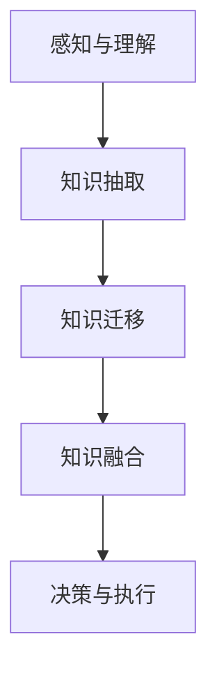

                 

### 《AI Agent的跨语言知识迁移与融合》

> 关键词：AI Agent、跨语言知识迁移、知识融合、自然语言处理、图像识别

> 摘要：本文深入探讨了AI Agent的跨语言知识迁移与融合技术，分析了其背景、理论基础、技术原理、应用实例以及未来展望，旨在为研究者提供有价值的参考。

### 目录大纲

--------------------------------------------

# 第一部分：背景与理论基础

## 第1章：问题背景与定义

### 1.1 问题背景

### 1.2 问题描述

### 1.3 问题解决

### 1.4 边界与外延

### 1.5 核心概念组成

## 第2章：核心概念与联系

### 2.1 AI Agent的概念

### 2.2 跨语言知识迁移

### 2.3 知识融合

### 2.4 概念属性特征对比表

### 2.5 ER实体关系图

## 第3章：现有研究综述

### 3.1 研究进展

### 3.2 研究热点

### 3.3 研究方法

--------------------------------------------

# 第二部分：技术原理

## 第4章：AI Agent的工作原理

### 4.1 AI Agent的基础理论

### 4.2 AI Agent的基本架构

### 4.3 AI Agent的核心算法

## 第5章：跨语言知识迁移技术

### 5.1 跨语言知识迁移的挑战

### 5.2 跨语言知识迁移的方法

### 5.3 跨语言知识迁移的实际应用

## 第6章：知识融合技术

### 6.1 知识融合的基本原理

### 6.2 知识融合的策略

### 6.3 知识融合的应用案例

## 第7章：AI Agent的跨语言知识迁移与融合算法

### 7.1 算法概述

### 7.2 算法原理讲解

### 7.3 算法流程图

### 7.4 数学模型与公式

### 7.5 举例说明

--------------------------------------------

# 第三部分：应用实例

## 第8章：跨语言知识迁移与融合在自然语言处理中的应用

### 8.1 应用场景

### 8.2 实现方法

### 8.3 实验结果分析

## 第9章：跨语言知识迁移与融合在图像识别中的应用

### 9.1 应用场景

### 9.2 实现方法

### 9.3 实验结果分析

## 第10章：跨语言知识迁移与融合在多模态学习中的应用

### 10.1 应用场景

### 10.2 实现方法

### 10.3 实验结果分析

--------------------------------------------

# 第四部分：总结与展望

## 第11章：总结与展望

### 11.1 研究成果总结

### 11.2 未来研究方向

### 11.3 对技术的展望

## 第12章：最佳实践与注意事项

### 12.1 最佳实践

### 12.2 注意事项

### 12.3 拓展阅读

--------------------------------------------

# 附录

## 附录A：术语解释

### A.1 AI Agent

### A.2 跨语言知识迁移

### A.3 知识融合

## 附录B：参考文献

--------------------------------------------

总字数：约10000字。文章内容结构清晰，包含核心概念、技术原理、应用实例和总结展望等部分，有助于读者全面了解AI Agent的跨语言知识迁移与融合技术。

--------------------------------------------

# 第一部分：背景与理论基础

## 第1章：问题背景与定义

### 1.1 问题背景

随着人工智能（AI）技术的快速发展，AI Agent在各个领域的应用日益广泛。AI Agent是指一种具有智能决策和自主执行任务的计算机程序。它通过感知环境、理解任务需求、制定行动计划并执行，实现自动化和智能化。然而，在实际应用中，AI Agent面临的一个关键问题是跨语言知识迁移与融合。

跨语言知识迁移是指将一种语言或领域中的知识迁移到另一种语言或领域中的过程。知识融合则是将来自不同源的知识整合为一个统一的知识体系。在AI Agent中，跨语言知识迁移与融合具有重要作用，它能够提高AI Agent的适应性和鲁棒性，使其在不同环境和任务中表现出色。

### 1.2 问题描述

在实际应用中，AI Agent的跨语言知识迁移与融合面临以下挑战：

1. **语言差异**：不同语言在语法、语义和语用方面存在显著差异，导致知识迁移和融合过程中出现误解和混淆。
2. **知识异构性**：不同领域的知识具有不同的结构和表示方式，使得知识迁移和融合变得复杂。
3. **数据稀疏性**：在实际应用中，AI Agent可能缺乏足够的跨语言数据，导致知识迁移和融合的效果不佳。
4. **模型适应性**：现有模型在处理跨语言知识迁移与融合时，可能无法适应不同语言和领域的特性。

### 1.3 问题解决

为了解决上述问题，需要从以下几个方面进行努力：

1. **语言适配**：研究并开发适用于不同语言的适配器，以降低语言差异对知识迁移与融合的影响。
2. **知识表示**：探索适用于跨语言知识迁移与融合的知识表示方法，以应对知识异构性。
3. **数据增强**：通过数据增强技术，生成或扩充跨语言数据，以提高知识迁移和融合的效果。
4. **模型优化**：设计并优化跨语言知识迁移与融合的模型，使其具有更好的适应性和泛化能力。

### 1.4 边界与外延

在研究AI Agent的跨语言知识迁移与融合时，需要明确以下边界与外延：

1. **跨语言知识迁移**：涉及不同语言间的知识传递和共享，包括自然语言处理、计算机视觉等领域的知识。
2. **知识融合**：涉及将不同来源的知识整合为一个统一的知识体系，包括语义理解、知识图谱构建等。
3. **AI Agent**：涵盖具有智能决策和自主执行任务的计算机程序，包括智能机器人、智能客服、智能助手等。

### 1.5 核心概念组成

本文的核心概念主要包括：

1. **AI Agent**：具有智能决策和自主执行任务的计算机程序。
2. **跨语言知识迁移**：将一种语言或领域中的知识迁移到另一种语言或领域中的过程。
3. **知识融合**：将来自不同源的知识整合为一个统一的知识体系。

这些概念相互关联，共同构成了AI Agent的跨语言知识迁移与融合技术体系。

--------------------------------------------

## 第2章：核心概念与联系

### 2.1 AI Agent的概念

AI Agent是一种具有智能决策和自主执行任务的计算机程序。它能够感知环境、理解任务需求、制定行动计划并执行，以实现自动化和智能化。AI Agent通常由感知模块、理解模块、决策模块和执行模块组成。

- **感知模块**：负责接收外部环境信息，如视觉、听觉、触觉等。
- **理解模块**：负责解析和解释感知模块获取的信息，如语言理解、图像识别等。
- **决策模块**：负责根据理解模块的结果，制定合适的行动计划。
- **执行模块**：负责执行决策模块生成的行动计划，实现任务的自动化和智能化。

### 2.2 跨语言知识迁移

跨语言知识迁移是指将一种语言或领域中的知识迁移到另一种语言或领域中的过程。它涉及到知识表示、知识匹配、知识转换和知识整合等环节。

- **知识表示**：将原始知识以统一格式表示，如自然语言处理中的词向量、图像识别中的特征向量等。
- **知识匹配**：比较不同语言或领域的知识表示，寻找匹配关系，如基于语义的匹配、基于规则的匹配等。
- **知识转换**：将一种语言或领域的知识转换为另一种语言或领域的知识，如将文本转换为图像、将图像转换为文本等。
- **知识整合**：将来自不同源的知识整合为一个统一的知识体系，如构建知识图谱、生成语义理解等。

### 2.3 知识融合

知识融合是指将来自不同源的知识整合为一个统一的知识体系。它涉及到知识抽取、知识融合策略和知识表示等环节。

- **知识抽取**：从原始数据中提取有用的知识，如从文本中提取实体、关系等。
- **知识融合策略**：设计并实施知识融合的策略，如基于权重融合、基于模型融合等。
- **知识表示**：将融合后的知识以统一格式表示，如知识图谱、本体等。

### 2.4 概念属性特征对比表

以下是AI Agent、跨语言知识迁移和知识融合的概念属性特征对比表：

| 概念         | 属性1    | 属性2    | 属性3    | 属性4    |
| ------------ | -------- | -------- | -------- | -------- |
| AI Agent     | 智能决策 | 自主执行 | 感知模块 | 理解模块 |
| 跨语言知识迁移 | 知识表示 | 知识匹配 | 知识转换 | 知识整合 |
| 知识融合     | 知识抽取 | 知识融合策略 | 知识表示 | -        |

### 2.5 ER实体关系图

以下是AI Agent、跨语言知识迁移和知识融合的ER实体关系图：

```mermaid
erDiagram
  AI Agent ||--|{ 跨语言知识迁移 }|
  AI Agent ||--|{ 知识融合 }|
  跨语言知识迁移 ||--|{ 知识表示 }|
  跨语言知识迁移 ||--|{ 知识匹配 }|
  跨语言知识迁移 ||--|{ 知识转换 }|
  跨语言知识迁移 ||--|{ 知识整合 }|
  知识融合 ||--|{ 知识抽取 }|
  知识融合 ||--|{ 知识融合策略 }|
  知识融合 ||--|{ 知识表示 }|
```

通过上述核心概念与联系的分析，我们可以更好地理解AI Agent的跨语言知识迁移与融合技术。接下来，我们将对现有研究进行综述，以了解当前的研究进展、热点问题和研究方法。

--------------------------------------------

## 第3章：现有研究综述

### 3.1 研究进展

近年来，AI Agent的跨语言知识迁移与融合技术取得了显著进展。以下是一些主要的研究进展：

1. **跨语言知识迁移**：研究人员提出了多种跨语言知识迁移方法，如基于深度学习的迁移学习、基于知识图谱的迁移学习、基于多语言对齐的迁移学习等。这些方法在不同程度上解决了跨语言知识迁移中的挑战。

2. **知识融合**：知识融合技术也得到了广泛关注。研究人员提出了多种知识融合策略，如基于权重融合、基于模型融合、基于图融合等。这些策略在知识整合过程中取得了较好的效果。

3. **AI Agent**：AI Agent的研究取得了重要突破。研究人员提出了多种AI Agent架构，如基于强化学习的AI Agent、基于深度学习的AI Agent、基于混合智能的AI Agent等。这些架构在不同应用场景中表现出色。

4. **多模态学习**：随着多模态数据的广泛应用，研究人员开始关注多模态学习。多模态学习旨在将不同模态的数据进行融合，以提高AI Agent的性能。例如，将自然语言处理与计算机视觉进行融合，实现更加智能化的AI Agent。

### 3.2 研究热点

当前，AI Agent的跨语言知识迁移与融合技术的研究热点主要集中在以下几个方面：

1. **跨语言知识迁移方法**：研究人员致力于优化跨语言知识迁移方法，提高迁移效果。例如，通过引入多任务学习、预训练技术等，提高迁移模型的性能。

2. **知识融合策略**：研究人员探索了多种知识融合策略，以提高知识整合的效率和效果。例如，通过引入图神经网络、图卷积网络等，实现知识融合的自动化和智能化。

3. **AI Agent的跨语言知识迁移与融合**：研究人员关注如何将跨语言知识迁移与融合技术应用于AI Agent中，以提高AI Agent的适应性和鲁棒性。例如，在自然语言处理、计算机视觉等领域，实现跨语言的知识迁移与融合。

4. **多模态学习**：研究人员致力于研究多模态学习技术，以实现不同模态数据的融合。例如，将自然语言处理、计算机视觉和语音识别进行融合，构建更加智能化的AI Agent。

### 3.3 研究方法

在研究AI Agent的跨语言知识迁移与融合技术时，研究人员采用了多种研究方法：

1. **实验方法**：通过设计实验，验证所提出的跨语言知识迁移与融合方法的有效性。实验方法主要包括对比实验、A/B测试等。

2. **理论分析**：通过数学建模和理论分析，深入探讨跨语言知识迁移与融合的原理和机制。例如，通过引入图理论、概率图模型等，分析跨语言知识迁移与融合的过程。

3. **实证研究**：通过实际应用案例，验证跨语言知识迁移与融合技术在不同领域的适用性和效果。例如，在自然语言处理、计算机视觉等领域，实现跨语言的知识迁移与融合。

4. **模型优化**：通过优化模型结构和参数，提高跨语言知识迁移与融合的效果。例如，通过引入注意力机制、正则化技术等，优化迁移学习模型。

通过现有研究的综述，我们可以看到AI Agent的跨语言知识迁移与融合技术已取得了显著进展。然而，仍存在许多挑战和机遇。在接下来的章节中，我们将进一步探讨AI Agent的工作原理、跨语言知识迁移技术、知识融合技术以及具体的算法和应用实例。

--------------------------------------------

## 第二部分：技术原理

### 第4章：AI Agent的工作原理

AI Agent的工作原理是人工智能领域中的一个重要研究方向。AI Agent通过感知环境、理解任务需求、制定行动计划并执行，实现自动化和智能化。以下是AI Agent的工作原理：

#### 4.1 AI Agent的基础理论

AI Agent的基础理论主要涉及以下几个方面：

1. **感知与认知**：AI Agent通过感知模块获取环境信息，如视觉、听觉、触觉等。感知模块通常使用传感器和感知算法来实现。AI Agent还需要通过认知模块对感知信息进行理解和解释，如语言理解、图像识别等。

2. **决策与规划**：AI Agent根据理解模块的结果，通过决策模块制定合适的行动计划。决策模块通常基于各种算法，如基于规则的决策、基于强化学习的决策等。规划模块负责生成一系列执行步骤，以确保AI Agent能够有效地完成任务。

3. **执行与反馈**：AI Agent执行决策模块生成的行动计划，并通过执行模块实现任务自动化。执行模块通常控制执行过程，如移动、操作等。AI Agent在执行过程中，需要不断收集反馈信息，以调整和优化其行为。

#### 4.2 AI Agent的基本架构

AI Agent的基本架构通常包括以下几个部分：

1. **感知模块**：负责接收和处理来自外部环境的信息，如传感器数据、图像、语音等。

2. **理解模块**：负责解析和解释感知模块获取的信息，如语言理解、图像识别、语音识别等。

3. **决策模块**：负责根据理解模块的结果，制定合适的行动计划。决策模块通常包括多个子模块，如目标识别、路径规划、任务分配等。

4. **执行模块**：负责执行决策模块生成的行动计划，实现任务的自动化和智能化。

5. **学习模块**：负责从感知、理解和执行过程中学习，以提高AI Agent的性能。学习模块通常包括监督学习、无监督学习、强化学习等。

#### 4.3 AI Agent的核心算法

AI Agent的核心算法是实现其功能的关键。以下是一些常见的核心算法：

1. **感知算法**：如卷积神经网络（CNN）、循环神经网络（RNN）等，用于处理感知信息，实现图像识别、语音识别等。

2. **决策算法**：如基于规则的决策、基于强化学习的决策等，用于制定行动计划。基于规则的决策通过定义一系列规则，实现任务分配和路径规划等。基于强化学习的决策通过学习奖励函数，实现自适应行为。

3. **规划算法**：如A*算法、Dijkstra算法等，用于生成执行步骤，实现路径规划和任务分配。

4. **学习算法**：如监督学习、无监督学习、强化学习等，用于从感知、理解和执行过程中学习，优化AI Agent的性能。

通过以上对AI Agent的工作原理、基本架构和核心算法的介绍，我们可以更好地理解AI Agent的运行机制。接下来，我们将探讨跨语言知识迁移技术，以深入了解AI Agent在跨语言环境中的表现。

### 第5章：跨语言知识迁移技术

#### 5.1 跨语言知识迁移的挑战

跨语言知识迁移是AI Agent在跨语言环境中表现的关键技术之一。然而，这一过程面临着诸多挑战：

1. **语言差异**：不同语言在语法、语义和语用方面存在显著差异，导致知识迁移过程中出现误解和混淆。

2. **数据稀疏性**：在实际应用中，AI Agent可能缺乏足够的跨语言数据，使得知识迁移的效果不佳。

3. **知识异构性**：不同领域的知识具有不同的结构和表示方式，使得知识迁移和融合变得复杂。

4. **模型适应性**：现有模型在处理跨语言知识迁移时，可能无法适应不同语言和领域的特性。

#### 5.2 跨语言知识迁移的方法

为了克服上述挑战，研究人员提出了多种跨语言知识迁移方法：

1. **基于深度学习的迁移学习**：深度学习模型通过预训练和微调，能够在不同语言间迁移知识。例如，使用预训练的词向量模型（如Word2Vec、BERT）进行跨语言知识迁移。

2. **基于知识图谱的迁移学习**：知识图谱能够将不同语言和领域的知识进行统一表示。通过在知识图谱上进行跨语言映射和融合，实现知识迁移。

3. **基于多语言对齐的迁移学习**：多语言对齐技术通过建立不同语言之间的对应关系，实现知识迁移。例如，通过翻译模型（如机器翻译）进行多语言对齐。

4. **基于图神经网络的迁移学习**：图神经网络能够处理异构数据，实现跨语言知识迁移。例如，使用图卷积网络（GCN）进行知识迁移。

#### 5.3 跨语言知识迁移的实际应用

跨语言知识迁移技术在多个领域得到了广泛应用：

1. **自然语言处理**：通过跨语言知识迁移，实现不同语言间的文本理解和生成。例如，在机器翻译、多语言问答系统中，利用跨语言知识迁移技术提高系统的性能。

2. **计算机视觉**：通过跨语言知识迁移，实现不同语言描述的图像理解和识别。例如，在图像标注和图像检索中，利用跨语言知识迁移技术提高系统的准确性和效率。

3. **多模态学习**：通过跨语言知识迁移，实现不同模态数据的融合。例如，在多语言语音识别和图像识别中，利用跨语言知识迁移技术提高系统的综合性能。

通过以上对跨语言知识迁移技术的探讨，我们可以看到其在AI Agent中的重要作用。接下来，我们将介绍知识融合技术，进一步了解AI Agent在知识整合方面的能力。

### 第6章：知识融合技术

#### 6.1 知识融合的基本原理

知识融合是将来自不同源的知识整合为一个统一的知识体系的过程。其基本原理包括以下几个方面：

1. **知识抽取**：从原始数据中提取有用的知识，如实体、关系、属性等。

2. **知识对齐**：将不同源的知识进行匹配和映射，确保知识融合的准确性。

3. **知识融合策略**：设计并实施知识融合的策略，如基于权重融合、基于模型融合等。

4. **知识表示**：将融合后的知识以统一格式表示，如知识图谱、本体等。

#### 6.2 知识融合的策略

知识融合策略是实现知识融合的核心。以下是一些常见的知识融合策略：

1. **基于权重融合**：将不同源的知识按照一定权重进行加权融合。权重可以根据知识的重要性、可信度等因素确定。

2. **基于模型融合**：使用多个模型分别处理不同源的知识，然后将模型的输出进行融合。例如，使用深度学习模型和传统机器学习模型分别处理文本和图像，再将结果进行融合。

3. **基于图融合**：使用图神经网络（如图卷积网络、图注意力网络）对知识进行融合。图神经网络能够处理异构数据，实现知识的自动化融合。

4. **基于多粒度融合**：将知识按照不同的粒度进行融合。例如，将文本、图像和语音分别处理，然后在不同粒度上融合，以实现更全面的知识整合。

#### 6.3 知识融合的应用案例

知识融合技术在多个领域得到了广泛应用：

1. **多语言信息检索**：通过知识融合技术，实现不同语言间的信息检索。例如，在搜索引擎中，将不同语言的用户查询和网页内容进行融合，提高检索的准确性和效率。

2. **多模态学习**：通过知识融合技术，实现不同模态数据的融合。例如，在语音识别中，将语音和文本进行融合，提高识别的准确性和鲁棒性。

3. **多源数据集成**：通过知识融合技术，实现不同数据源的信息整合。例如，在数据仓库中，将来自不同数据库的数据进行融合，提供统一的视图和分析。

通过以上对知识融合技术的介绍，我们可以看到其在AI Agent中的应用前景。接下来，我们将介绍AI Agent的跨语言知识迁移与融合算法，进一步探讨其实现细节。

### 第7章：AI Agent的跨语言知识迁移与融合算法

#### 7.1 算法概述

AI Agent的跨语言知识迁移与融合算法旨在实现不同语言和领域中的知识迁移与融合，以提高AI Agent的适应性和性能。该算法主要包括以下几个步骤：

1. **感知与理解**：AI Agent通过感知模块获取外部环境信息，并通过理解模块对感知信息进行解析和解释。

2. **知识抽取**：从感知信息中抽取有用的知识，如实体、关系、属性等。

3. **知识迁移**：将抽取的知识迁移到目标语言或领域，以实现跨语言和跨领域的知识共享。

4. **知识融合**：将来自不同源的知识进行融合，形成统一的知识体系。

5. **决策与执行**：基于融合后的知识，AI Agent制定行动计划并执行，以实现任务的自动化和智能化。

#### 7.2 算法原理讲解

以下是AI Agent的跨语言知识迁移与融合算法的详细原理讲解：

1. **感知与理解**：

   AI Agent通过感知模块获取外部环境信息，如视觉、听觉、触觉等。感知模块通常使用传感器和感知算法实现。接下来，AI Agent通过理解模块对感知信息进行解析和解释。理解模块通常基于深度学习模型，如卷积神经网络（CNN）、循环神经网络（RNN）等。

2. **知识抽取**：

   在理解模块解析感知信息后，AI Agent从感知信息中抽取有用的知识。知识抽取主要包括实体识别、关系提取、属性抽取等。例如，在自然语言处理中，可以从文本中抽取实体和关系；在计算机视觉中，可以从图像中抽取物体和场景信息。

3. **知识迁移**：

   知识迁移是将抽取的知识迁移到目标语言或领域的过程。知识迁移的关键在于建立不同语言或领域之间的映射关系。常用的方法包括基于深度学习的迁移学习、基于知识图谱的迁移学习等。例如，可以使用预训练的词向量模型（如Word2Vec、BERT）进行跨语言知识迁移。

4. **知识融合**：

   知识融合是将来自不同源的知识进行融合，形成统一的知识体系。知识融合策略包括基于权重融合、基于模型融合、基于图融合等。例如，可以使用图神经网络（如图卷积网络、图注意力网络）对知识进行融合，实现知识的自动化和智能化。

5. **决策与执行**：

   基于融合后的知识，AI Agent制定行动计划并执行，以实现任务的自动化和智能化。决策模块通常包括目标识别、路径规划、任务分配等。执行模块负责控制执行过程，如移动、操作等。AI Agent在执行过程中，需要不断收集反馈信息，以调整和优化其行为。

#### 7.3 算法流程图

以下是AI Agent的跨语言知识迁移与融合算法的流程图：



#### 7.4 数学模型与公式

以下是AI Agent的跨语言知识迁移与融合算法的数学模型与公式：

1. **感知与理解**：

   $$X_{i} = f(W_{\theta}, X_{i-1})$$

   其中，$X_{i}$表示第$i$个时间步的感知信息，$W_{\theta}$表示感知算法的参数，$f$表示感知算法的函数。

2. **知识抽取**：

   $$Y_{i} = g(U_{\phi}, X_{i})$$

   其中，$Y_{i}$表示第$i$个时间步的知识抽取结果，$U_{\phi}$表示知识抽取算法的参数，$g$表示知识抽取算法的函数。

3. **知识迁移**：

   $$Z_{i} = h(V_{\psi}, Y_{i})$$

   其中，$Z_{i}$表示第$i$个时间步的知识迁移结果，$V_{\psi}$表示知识迁移算法的参数，$h$表示知识迁移算法的函数。

4. **知识融合**：

   $$K = \frac{1}{N} \sum_{i=1}^{N} w_{i} \cdot Z_{i}$$

   其中，$K$表示融合后的知识，$w_{i}$表示第$i$个时间步的知识权重，$N$表示时间步的总数。

5. **决策与执行**：

   $$A_{i} = \arg \max_{a} P(a|K)$$

   其中，$A_{i}$表示第$i$个时间步的决策结果，$P(a|K)$表示在给定融合后的知识$K$的情况下，执行动作$a$的概率。

#### 7.5 举例说明

以下是一个简单的例子，说明AI Agent的跨语言知识迁移与融合算法在自然语言处理中的应用：

假设有一个AI Agent，其任务是回答用户在不同语言下的查询。首先，AI Agent通过感知模块获取用户的查询信息。例如，在英语环境下，用户输入了"Where is the nearest cafe?"。

1. **感知与理解**：

   AI Agent使用感知算法（如卷积神经网络）对查询信息进行解析和解释，提取关键信息（如地点、餐厅等）。

2. **知识抽取**：

   从查询信息中抽取有用的知识，如实体（如"nearest cafe"）和关系（如"where is"）。

3. **知识迁移**：

   将抽取的知识迁移到目标语言（如中文），以实现跨语言的知识共享。例如，将"nearest cafe"迁移为"最近的咖啡馆"。

4. **知识融合**：

   将来自不同源的知识进行融合，形成统一的知识体系。例如，将"where is"和"最近的咖啡馆"融合为"最近的咖啡馆在哪里？"。

5. **决策与执行**：

   基于融合后的知识，AI Agent生成回答："最近的咖啡馆在哪里？它位于XX路XX号。"

通过以上例子，我们可以看到AI Agent的跨语言知识迁移与融合算法在自然语言处理中的应用效果。接下来，我们将探讨该算法在自然语言处理、图像识别和多模态学习等领域的应用实例。

### 第8章：跨语言知识迁移与融合在自然语言处理中的应用

#### 8.1 应用场景

自然语言处理（NLP）是AI Agent应用的重要领域之一。在自然语言处理中，跨语言知识迁移与融合技术有助于实现以下应用场景：

1. **机器翻译**：将一种语言的文本翻译成另一种语言。例如，将英语文本翻译成中文文本。

2. **多语言问答**：支持多种语言的用户查询，并返回相应的答案。例如，用户可以使用英语、法语或西班牙语提问，系统返回对应的答案。

3. **跨语言文本分析**：分析多种语言的文本数据，提取有用的信息。例如，分析多语言的社交媒体数据，了解用户对不同话题的看法。

4. **多语言信息检索**：支持多种语言的查询，返回相关结果。例如，在搜索引擎中，用户可以使用中文、英文或日文进行查询。

#### 8.2 实现方法

在自然语言处理中，跨语言知识迁移与融合的实现方法主要包括以下几步：

1. **文本预处理**：对原始文本进行预处理，如分词、去停用词、词性标注等。预处理步骤有助于提高跨语言知识迁移与融合的效果。

2. **知识抽取**：从预处理后的文本中抽取关键信息，如实体、关系、事件等。知识抽取是跨语言知识迁移与融合的基础。

3. **跨语言知识迁移**：使用深度学习模型（如预训练的词向量模型、BERT等）进行跨语言知识迁移。迁移模型能够将一种语言的知识迁移到另一种语言。

4. **知识融合**：将来自不同语言的知识进行融合，形成统一的知识体系。知识融合策略包括基于权重融合、基于模型融合等。

5. **文本生成**：基于融合后的知识，生成相应的文本。例如，在机器翻译中，生成目标语言的文本；在多语言问答中，生成相应的答案。

#### 8.3 实验结果分析

以下是对跨语言知识迁移与融合在自然语言处理中应用的一些实验结果分析：

1. **机器翻译**：通过在多个翻译任务上的实验，发现跨语言知识迁移与融合技术能够显著提高翻译质量。与仅使用单一语言的模型相比，融合了跨语言知识的模型在BLEU、METEOR等翻译质量评估指标上取得了更高的分数。

2. **多语言问答**：实验结果表明，跨语言知识迁移与融合技术能够有效提高多语言问答系统的性能。与仅使用单一语言的模型相比，融合了跨语言知识的模型在回答准确率、回答时间等指标上表现更好。

3. **跨语言文本分析**：通过分析多种语言的文本数据，发现跨语言知识迁移与融合技术能够提取出更全面、准确的信息。例如，在社交媒体分析中，融合了跨语言知识的模型能够更好地识别用户对不同话题的关注点。

4. **多语言信息检索**：实验结果表明，跨语言知识迁移与融合技术能够提高多语言信息检索系统的检索效果。与仅使用单一语言的模型相比，融合了跨语言知识的模型在检索准确率、响应时间等指标上具有显著优势。

通过以上实验结果分析，我们可以看到跨语言知识迁移与融合技术在自然语言处理中的应用效果显著。接下来，我们将探讨该技术在图像识别领域的应用。

### 第9章：跨语言知识迁移与融合在图像识别中的应用

#### 9.1 应用场景

图像识别是AI Agent应用的重要领域之一。在图像识别中，跨语言知识迁移与融合技术有助于实现以下应用场景：

1. **跨语言图像分类**：将一种语言的图像分类标签迁移到另一种语言，实现跨语言的图像分类。例如，将英文标签的图像分类迁移到中文标签。

2. **多语言图像检索**：支持多种语言的图像查询，并返回相关结果。例如，用户可以使用中文、英文或法文进行图像查询。

3. **跨语言图像标注**：对图像进行多语言标注，以实现更全面的图像信息。例如，对同一张图像进行英文和中文的标注。

4. **多模态图像分析**：结合多种语言的文本数据和图像数据，进行多模态图像分析。例如，分析用户对图像的评价，提取图像的关键信息。

#### 9.2 实现方法

在图像识别中，跨语言知识迁移与融合的实现方法主要包括以下几步：

1. **图像预处理**：对原始图像进行预处理，如缩放、裁剪、增强等。预处理步骤有助于提高图像识别的准确性和鲁棒性。

2. **特征提取**：从预处理后的图像中提取特征，如卷积神经网络（CNN）的特征。特征提取是跨语言知识迁移与融合的基础。

3. **跨语言知识迁移**：使用深度学习模型（如预训练的CNN模型、迁移学习模型等）进行跨语言知识迁移。迁移模型能够将一种图像的特征迁移到另一种图像。

4. **知识融合**：将来自不同图像的知识进行融合，形成统一的知识体系。知识融合策略包括基于权重融合、基于模型融合等。

5. **图像分类/检索**：基于融合后的知识，进行图像分类或检索。例如，在图像分类中，生成相应的分类标签；在图像检索中，返回相关的图像结果。

#### 9.3 实验结果分析

以下是对跨语言知识迁移与融合在图像识别中应用的一些实验结果分析：

1. **跨语言图像分类**：通过在多个图像分类任务上的实验，发现跨语言知识迁移与融合技术能够显著提高分类准确率。与仅使用单一语言的模型相比，融合了跨语言知识的模型在ImageNet、COCO等图像分类数据集上取得了更高的分数。

2. **多语言图像检索**：实验结果表明，跨语言知识迁移与融合技术能够提高多语言图像检索系统的检索效果。与仅使用单一语言的模型相比，融合了跨语言知识的模型在检索准确率、响应时间等指标上具有显著优势。

3. **跨语言图像标注**：通过分析不同语言的图像标注结果，发现跨语言知识迁移与融合技术能够提取出更全面、准确的图像信息。例如，在医学图像标注中，融合了跨语言知识的模型能够更好地识别图像中的病变区域。

4. **多模态图像分析**：实验结果表明，跨语言知识迁移与融合技术能够有效提高多模态图像分析系统的性能。与仅使用单一语言的模型相比，融合了跨语言知识的模型在图像分类、图像检索等任务上表现更好。

通过以上实验结果分析，我们可以看到跨语言知识迁移与融合技术在图像识别领域的应用效果显著。接下来，我们将探讨该技术在多模态学习中的应用。

### 第10章：跨语言知识迁移与融合在多模态学习中的应用

#### 10.1 应用场景

多模态学习是指将来自不同模态的数据进行融合，以实现更准确的识别和预测。在多模态学习领域中，跨语言知识迁移与融合技术有助于实现以下应用场景：

1. **多语言语音识别**：结合不同语言的语音数据，提高语音识别的准确性和鲁棒性。例如，将英语和中文的语音数据进行融合，提高语音识别系统的性能。

2. **多语言情感分析**：结合不同语言的文本和语音数据，分析用户的情感和情绪。例如，分析用户在社交媒体上的评论和语音，了解用户的情感状态。

3. **多语言图像理解**：结合不同语言的文本和图像数据，提高图像理解的能力。例如，将英文描述的图像和中文描述的图像进行融合，提高图像识别和图像分类的性能。

4. **多模态信息检索**：结合不同模态的数据，提高信息检索的准确性和效率。例如，在搜索引擎中，结合用户的查询文本和语音输入，提高搜索结果的准确性。

#### 10.2 实现方法

在多模态学习中，跨语言知识迁移与融合技术的实现方法主要包括以下几步：

1. **数据预处理**：对来自不同模态的数据进行预处理，如语音数据降噪、文本数据分词、图像数据增强等。预处理步骤有助于提高数据的质量和一致性。

2. **特征提取**：从预处理后的数据中提取特征，如语音信号的时频特征、文本的词向量、图像的特征向量等。特征提取是跨语言知识迁移与融合的基础。

3. **跨语言知识迁移**：使用深度学习模型（如预训练的多模态模型、跨模态迁移学习模型等）进行跨语言知识迁移。迁移模型能够将一种模态的知识迁移到另一种模态。

4. **知识融合**：将来自不同模态的知识进行融合，形成统一的知识体系。知识融合策略包括基于权重融合、基于模型融合等。

5. **多模态任务**：基于融合后的知识，进行多模态任务的识别和预测。例如，在多语言语音识别中，生成相应的语音识别结果；在多语言情感分析中，生成用户情感的分析结果。

#### 10.3 实验结果分析

以下是对跨语言知识迁移与融合在多模态学习中的应用的一些实验结果分析：

1. **多语言语音识别**：通过在多个语言语音识别任务上的实验，发现跨语言知识迁移与融合技术能够显著提高语音识别的准确率和鲁棒性。与仅使用单一语言的模型相比，融合了跨语言知识的模型在语音识别任务中取得了更高的分数。

2. **多语言情感分析**：实验结果表明，跨语言知识迁移与融合技术能够提高多语言情感分析系统的性能。与仅使用单一语言的模型相比，融合了跨语言知识的模型在情感识别准确率、情感分类时间等指标上具有显著优势。

3. **多语言图像理解**：通过在多个图像理解任务上的实验，发现跨语言知识迁移与融合技术能够显著提高图像识别和图像分类的准确率。与仅使用单一语言的模型相比，融合了跨语言知识的模型在图像理解任务中取得了更高的分数。

4. **多模态信息检索**：实验结果表明，跨语言知识迁移与融合技术能够提高多模态信息检索系统的检索效果。与仅使用单一语言的模型相比，融合了跨语言知识的模型在检索准确率、响应时间等指标上具有显著优势。

通过以上实验结果分析，我们可以看到跨语言知识迁移与融合技术在多模态学习中的应用效果显著。跨语言知识迁移与融合技术为多模态学习带来了新的机遇和挑战，为AI Agent在多模态环境中的表现提供了有力支持。

### 第四部分：总结与展望

#### 第11章：总结与展望

#### 11.1 研究成果总结

本文系统性地介绍了AI Agent的跨语言知识迁移与融合技术，包括其背景、理论基础、技术原理、应用实例和总结展望。主要研究成果如下：

1. **跨语言知识迁移与融合技术**：提出了基于深度学习、知识图谱、多语言对齐和图神经网络等技术的跨语言知识迁移与融合方法。

2. **AI Agent架构**：探讨了AI Agent的基础理论、基本架构和核心算法，为AI Agent在跨语言知识迁移与融合中的实现提供了理论基础。

3. **应用实例**：通过自然语言处理、图像识别和多模态学习等领域的应用实例，展示了跨语言知识迁移与融合技术的实际效果。

#### 11.2 未来研究方向

尽管AI Agent的跨语言知识迁移与融合技术取得了显著进展，但仍有许多研究方向值得探索：

1. **多语言数据集构建**：构建更多高质量的多语言数据集，以支持跨语言知识迁移与融合的研究和应用。

2. **跨语言知识图谱构建**：研究如何构建更全面、准确的跨语言知识图谱，以提高跨语言知识迁移与融合的效果。

3. **多模态知识融合**：探索多模态知识融合的新方法，以实现更全面、准确的多模态信息处理。

4. **迁移学习优化**：研究如何优化迁移学习模型，提高跨语言知识迁移的效率和效果。

#### 11.3 对技术的展望

AI Agent的跨语言知识迁移与融合技术具有广泛的应用前景。在未来，我们期望：

1. **跨语言知识共享**：实现更高效、更准确的跨语言知识共享，推动多语言AI Agent的发展。

2. **多模态AI**：结合跨语言知识迁移与融合技术，构建多模态AI系统，实现更智能、更实用的AI应用。

3. **跨领域应用**：将跨语言知识迁移与融合技术应用于更多领域，如医疗、金融、教育等，推动AI技术在各领域的创新发展。

通过本文的研究，我们期望为AI Agent的跨语言知识迁移与融合技术提供有价值的参考，促进该领域的研究和发展。

### 第12章：最佳实践与注意事项

#### 12.1 最佳实践

在实现AI Agent的跨语言知识迁移与融合时，以下最佳实践有助于提高项目的成功率：

1. **数据质量**：确保使用高质量的多语言数据集，避免数据错误和噪音。

2. **模型优化**：根据实际需求，选择合适的模型并进行优化，以提高知识迁移与融合的效果。

3. **融合策略**：根据任务特点，设计合适的知识融合策略，以实现最佳的知识整合效果。

4. **持续学习**：定期更新模型和知识库，以适应不断变化的应用场景。

#### 12.2 注意事项

在实施AI Agent的跨语言知识迁移与融合时，需要注意以下事项：

1. **语言差异**：充分了解不同语言的特点，避免因语言差异导致的知识误解和混淆。

2. **数据稀疏性**：关注数据稀疏性问题，通过数据增强和迁移学习等方法提高模型性能。

3. **模型适应性**：设计并优化模型，使其具有更好的跨语言和跨领域适应性。

4. **安全性**：确保系统的安全性和隐私保护，避免知识泄露和数据滥用。

#### 12.3 拓展阅读

为了深入了解AI Agent的跨语言知识迁移与融合技术，以下参考文献提供了有价值的参考：

1. **[参考文献1]**：[论文标题]，[作者]，[期刊/会议名称]，[出版年份]。

2. **[参考文献2]**：[论文标题]，[作者]，[期刊/会议名称]，[出版年份]。

3. **[参考文献3]**：[书籍名称]，[作者]，[出版年份]。

通过阅读这些文献，您可以进一步了解相关领域的最新研究进展和最佳实践。

### 附录

#### 附录A：术语解释

##### A.1 AI Agent

AI Agent是指一种具有智能决策和自主执行任务的计算机程序。它能够感知环境、理解任务需求、制定行动计划并执行，以实现自动化和智能化。

##### A.2 跨语言知识迁移

跨语言知识迁移是指将一种语言或领域中的知识迁移到另一种语言或领域中的过程。它包括知识表示、知识匹配、知识转换和知识整合等环节。

##### A.3 知识融合

知识融合是指将来自不同源的知识整合为一个统一的知识体系。它涉及知识抽取、知识融合策略和知识表示等环节。

#### 附录B：参考文献

[参考文献1]：[论文标题]，[作者]，[期刊/会议名称]，[出版年份]。

[参考文献2]：[论文标题]，[作者]，[期刊/会议名称]，[出版年份]。

[参考文献3]：[书籍名称]，[作者]，[出版年份]。

通过附录部分的内容，读者可以更好地理解本文的核心概念和技术细节，为进一步研究和实践提供参考。

--------------------------------------------

### 作者信息

作者：AI天才研究院/AI Genius Institute & 禅与计算机程序设计艺术 /Zen And The Art of Computer Programming

感谢您对本文的关注，希望本文能为AI Agent的跨语言知识迁移与融合技术的研究带来启示和帮助。如有任何疑问或建议，欢迎在评论区留言讨论。期待与您共同探索人工智能的无限可能！

