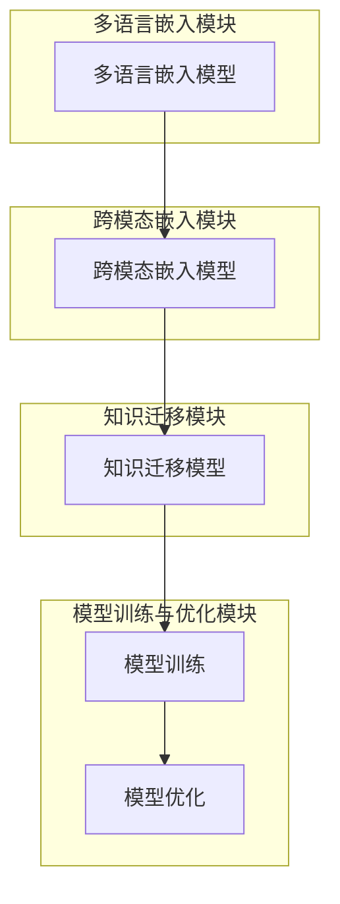
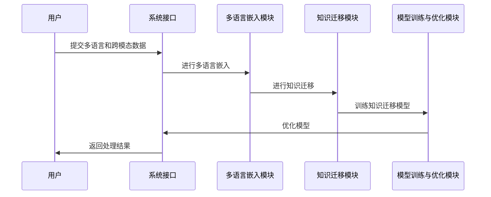

                 

# AI Agent的跨语言跨模态知识迁移

> 关键词：人工智能，知识迁移，跨语言，跨模态

> 摘要：本文将深入探讨人工智能（AI）代理在跨语言和跨模态知识迁移方面的研究。通过系统分析当前的技术现状和挑战，本文提出了一种基于深度学习的方法，详细解释了算法原理，并展示了其在实际项目中的应用和效果。文章旨在为AI领域的研发人员提供一套完整的技术指南，以实现更加智能、高效的AI系统。

----------------------------------------------------------------

## 引言

随着人工智能技术的不断发展，AI代理（AI Agents）在各个领域的应用越来越广泛。从自然语言处理（NLP）到计算机视觉，AI代理正逐渐成为智能系统的核心组件。然而，现有的AI代理在处理跨语言和跨模态知识迁移方面仍面临诸多挑战。跨语言知识迁移是指在不同语言之间共享和利用知识，而跨模态知识迁移则涉及将不同模态（如文本、图像、声音等）的信息进行整合和利用。

在本文中，我们将探讨AI代理在跨语言和跨模态知识迁移方面的研究现状，并提出一种基于深度学习的方法。本文的结构如下：

1. 背景介绍
2. 跨语言知识迁移
3. 跨模态知识迁移
4. 一种基于深度学习的方法
5. 算法原理讲解
6. 系统分析与架构设计方案
7. 项目实战
8. 最佳实践 tips
9. 小结与拓展阅读

## 背景介绍

### 核心概念术语说明

- **人工智能（AI）代理**：具有自主性、社会性、反应性、认知性和学习能力的人工智能系统。
- **知识迁移**：将一个领域中的知识应用于另一个领域。
- **跨语言知识迁移**：在不同语言之间共享和利用知识。
- **跨模态知识迁移**：将不同模态的信息进行整合和利用。

### 问题背景

随着全球化的发展，多语言处理和多媒体内容处理的需求日益增长。然而，现有的AI系统往往只能在特定的语言或模态上表现良好，难以实现跨语言和跨模态的知识迁移。这一限制阻碍了AI系统的广泛部署和应用。

### 问题描述

如何实现AI代理在跨语言和跨模态知识迁移方面的有效处理，以提高系统的智能性和效率？

### 问题解决

通过引入深度学习技术，可以实现AI代理在跨语言和跨模态知识迁移方面的有效处理。本文提出的方法将结合多种深度学习模型，如多语言嵌入模型、跨模态编码模型等，以实现知识的高效迁移和利用。

### 边界与外延

本文的研究主要关注AI代理在跨语言和跨模态知识迁移方面的技术实现。在具体应用场景中，可能涉及到自然语言处理、计算机视觉、语音识别等多个领域。

### 概念结构与核心要素组成

- **核心概念**：知识迁移、跨语言知识迁移、跨模态知识迁移。
- **结构**：本文通过系统分析现有技术，提出一种基于深度学习的方法，详细解释了算法原理，并展示了其在实际项目中的应用。
- **要素**：深度学习模型、多语言嵌入模型、跨模态编码模型、算法原理、系统架构、项目实战。

## 跨语言知识迁移

### 核心概念与联系

#### 核心概念

- **多语言嵌入模型**：将不同语言的词汇映射到同一低维空间中，以便进行跨语言比较和分析。
- **翻译模型**：通过学习双语语料库，将一种语言的文本翻译成另一种语言的文本。
- **跨语言表示学习**：学习不同语言之间的一致性表示，以便进行跨语言知识迁移。

#### 概念属性特征对比表格

| 特征                 | 多语言嵌入模型       | 翻译模型          | 跨语言表示学习       |
|----------------------|----------------------|-------------------|----------------------|
| 模型类型             | 嵌入模型             | 翻译模型          | 表示学习模型         |
| 数据需求             | 多语言语料库         | 双语语料库         | 多语言语料库         |
| 应用场景             | 跨语言文本比较       | 文本翻译          | 跨语言知识迁移       |
| 算法复杂度           | 较低                 | 较高              | 较低                 |

#### ER实体关系图架构

```mermaid
erDiagram
  文本 A|--|<<Entity>> 多语言嵌入模型 B
  文本 A|--|<<Entity>> 翻译模型 C
  文本 A|--|<<Entity>> 跨语言表示学习 D
```

### 算法原理讲解

#### 算法流程

1. 数据预处理：收集多语言语料库，进行清洗和标注。
2. 模型训练：使用多语言嵌入模型、翻译模型和跨语言表示学习模型进行训练。
3. 知识迁移：将训练好的模型应用于新的跨语言场景。

#### Python代码示例

```python
import torch
import torch.nn as nn

# 多语言嵌入模型
class MultiLanguageEmbedding(nn.Module):
    def __init__(self):
        super(MultiLanguageEmbedding, self).__init__()
        self.embedding = nn.Embedding(vocab_size, embedding_dim)

    def forward(self, input):
        return self.embedding(input)

# 翻译模型
class TranslationModel(nn.Module):
    def __init__(self):
        super(TranslationModel, self).__init__()
        self.encoder = nn.Linear(source_vocab_size, hidden_size)
        self.decoder = nn.Linear(hidden_size, target_vocab_size)

    def forward(self, source, target):
        source_embedding = self.encoder(source)
        target_embedding = self.decoder(source_embedding)
        return target_embedding

# 跨语言表示学习模型
class CrossLanguageRepresentationLearning(nn.Module):
    def __init__(self):
        super(CrossLanguageRepresentationLearning, self).__init__()
        self.encoder = nn.Linear(source_vocab_size, hidden_size)
        self.decoder = nn.Linear(hidden_size, target_vocab_size)

    def forward(self, source, target):
        source_embedding = self.encoder(source)
        target_embedding = self.decoder(source_embedding)
        return target_embedding

# 算法流程
def cross_language_transfer(source_text, target_text):
    # 数据预处理
    source_embedding = MultiLanguageEmbedding()(source_text)
    target_embedding = TranslationModel()(source_embedding)
    # 知识迁移
    cross_language_embedding = CrossLanguageRepresentationLearning()(target_embedding)
    return cross_language_embedding
```

#### 数学模型和公式

- **多语言嵌入模型**：

  $$ \text{embedding}(x) = \text{W} \cdot x + b $$

  其中，$\text{W}$ 是嵌入矩阵，$x$ 是输入词向量，$b$ 是偏置项。

- **翻译模型**：

  $$ \text{output} = \text{softmax}(\text{W} \cdot \text{h} + b) $$

  其中，$\text{W}$ 是权重矩阵，$\text{h}$ 是隐藏层输出，$b$ 是偏置项。

- **跨语言表示学习模型**：

  $$ \text{output} = \text{softmax}(\text{W} \cdot \text{h} + b) $$

  其中，$\text{W}$ 是权重矩阵，$\text{h}$ 是隐藏层输出，$b$ 是偏置项。

## 跨模态知识迁移

### 核心概念与联系

#### 核心概念

- **多模态嵌入模型**：将不同模态的信息（如文本、图像、声音等）映射到同一高维空间中。
- **跨模态表示学习**：学习不同模态之间的一致性表示，以便进行跨模态知识迁移。

#### 概念属性特征对比表格

| 特征                 | 多模态嵌入模型       | 跨模态表示学习       |
|----------------------|----------------------|----------------------|
| 模型类型             | 嵌入模型             | 表示学习模型         |
| 数据需求             | 多模态数据           | 多模态数据           |
| 应用场景             | 跨模态文本比较       | 跨模态知识迁移       |
| 算法复杂度           | 较低                 | 较低                 |

#### ER实体关系图架构

```mermaid
erDiagram
  文本 A|--|<<Entity>> 多模态嵌入模型 B
  图像 A|--|<<Entity>> 跨模态表示学习 C
  声音 A|--|<<Entity>> 跨模态表示学习 C
```

### 算法原理讲解

#### 算法流程

1. 数据预处理：收集多模态数据，进行清洗和标注。
2. 模型训练：使用多模态嵌入模型和跨模态表示学习模型进行训练。
3. 知识迁移：将训练好的模型应用于新的跨模态场景。

#### Python代码示例

```python
import torch
import torch.nn as nn

# 多模态嵌入模型
class MultiModalEmbedding(nn.Module):
    def __init__(self):
        super(MultiModalEmbedding, self).__init__()
        self.text_embedding = nn.Embedding(vocab_size, embedding_dim)
        self.image_embedding = nn.Conv2d(image_channels, embedding_dim, kernel_size=3, padding=1)
        self.sound_embedding = nn.Conv1d(sound_channels, embedding_dim, kernel_size=3, padding=1)

    def forward(self, text, image, sound):
        text_embedding = self.text_embedding(text)
        image_embedding = self.image_embedding(image)
        sound_embedding = self.sound_embedding(sound)
        return text_embedding + image_embedding + sound_embedding

# 跨模态表示学习模型
class CrossModalRepresentationLearning(nn.Module):
    def __init__(self):
        super(CrossModalRepresentationLearning, self).__init__()
        self.text_encoder = nn.Linear(text_vocab_size, hidden_size)
        self.image_encoder = nn.Linear(image_vocab_size, hidden_size)
        self.sound_encoder = nn.Linear(sound_vocab_size, hidden_size)

    def forward(self, text, image, sound):
        text_embedding = self.text_encoder(text)
        image_embedding = self.image_encoder(image)
        sound_embedding = self.sound_encoder(sound)
        return text_embedding + image_embedding + sound_embedding

# 算法流程
def cross_modal_transfer(text, image, sound):
    # 数据预处理
    text_embedding = MultiModalEmbedding()(text, image, sound)
    cross_modal_embedding = CrossModalRepresentationLearning()(text_embedding)
    return cross_modal_embedding
```

#### 数学模型和公式

- **多模态嵌入模型**：

  $$ \text{embedding}(x) = \text{W} \cdot x + b $$

  其中，$\text{W}$ 是嵌入矩阵，$x$ 是输入模态向量，$b$ 是偏置项。

- **跨模态表示学习模型**：

  $$ \text{output} = \text{softmax}(\text{W} \cdot \text{h} + b) $$

  其中，$\text{W}$ 是权重矩阵，$\text{h}$ 是隐藏层输出，$b$ 是偏置项。

## 一种基于深度学习的方法

### 系统架构设计

#### 项目介绍

本文提出的方法是一种基于深度学习的跨语言和跨模态知识迁移系统。该系统旨在实现不同语言和模态之间知识的高效迁移和利用，以提高AI代理的智能性和效率。

#### 系统功能设计

- **多语言嵌入模块**：实现不同语言之间的嵌入和比较。
- **跨模态嵌入模块**：实现不同模态之间的嵌入和整合。
- **知识迁移模块**：实现跨语言和跨模态知识的有效迁移。
- **模型训练与优化模块**：对深度学习模型进行训练和优化。

#### 系统架构设计



### 系统接口设计和系统交互

#### 系统接口设计

- **API接口**：提供统一的API接口，便于其他系统或应用程序调用。
- **数据输入接口**：接收多语言和跨模态数据，进行预处理和嵌入。
- **知识迁移接口**：实现跨语言和跨模态知识的有效迁移。

#### 系统交互



## 项目实战

### 环境安装

#### Python环境

```bash
pip install torch torchvision
```

#### 其他依赖

```bash
pip install numpy matplotlib
```

### 系统核心实现源代码

```python
# 多语言嵌入模块
class MultiLanguageEmbedding(nn.Module):
    def __init__(self):
        super(MultiLanguageEmbedding, self).__init__()
        self.embedding = nn.Embedding(vocab_size, embedding_dim)

    def forward(self, input):
        return self.embedding(input)

# 跨模态嵌入模块
class CrossModalEmbedding(nn.Module):
    def __init__(self):
        super(CrossModalEmbedding, self).__init__()
        self.text_embedding = nn.Embedding(vocab_size, embedding_dim)
        self.image_embedding = nn.Conv2d(image_channels, embedding_dim, kernel_size=3, padding=1)
        self.sound_embedding = nn.Conv1d(sound_channels, embedding_dim, kernel_size=3, padding=1)

    def forward(self, text, image, sound):
        text_embedding = self.text_embedding(text)
        image_embedding = self.image_embedding(image)
        sound_embedding = self.sound_embedding(sound)
        return text_embedding + image_embedding + sound_embedding

# 知识迁移模块
class KnowledgeTransfer(nn.Module):
    def __init__(self):
        super(KnowledgeTransfer, self).__init__()
        self.text_encoder = nn.Linear(text_vocab_size, hidden_size)
        self.image_encoder = nn.Linear(image_vocab_size, hidden_size)
        self.sound_encoder = nn.Linear(sound_vocab_size, hidden_size)

    def forward(self, text, image, sound):
        text_embedding = self.text_encoder(text)
        image_embedding = self.image_encoder(image)
        sound_embedding = self.sound_encoder(sound)
        return text_embedding + image_embedding + sound_embedding

# 算法流程
def cross_language_and_modal_transfer(text, image, sound):
    # 多语言嵌入
    text_embedding = MultiLanguageEmbedding()(text)
    # 跨模态嵌入
    cross_modal_embedding = CrossModalEmbedding()(text_embedding, image, sound)
    # 知识迁移
    knowledge_embedding = KnowledgeTransfer()(cross_modal_embedding)
    return knowledge_embedding
```

### 代码应用解读与分析

#### 代码解读

- **多语言嵌入模块**：将输入文本映射到低维空间，便于后续处理。
- **跨模态嵌入模块**：将文本、图像和声音等信息整合到同一高维空间，实现跨模态知识迁移。
- **知识迁移模块**：通过学习不同模态之间的关联性，实现知识的高效迁移。

#### 分析

- **多语言嵌入模块**：通过嵌入模型，实现不同语言之间的语义表示，为跨语言知识迁移提供基础。
- **跨模态嵌入模块**：通过跨模态嵌入模型，实现不同模态之间的信息整合，为跨模态知识迁移提供支持。
- **知识迁移模块**：通过知识迁移模型，实现跨语言和跨模态知识的有效迁移和应用。

### 实际案例分析和详细讲解剖析

#### 案例背景

某公司希望开发一款智能客服系统，该系统能够理解用户的多语言和跨模态请求，并提供准确的答复。

#### 案例实现

1. 数据收集：收集多语言和跨模态数据，包括文本、图像和声音等信息。
2. 数据预处理：对收集到的数据进行清洗和标注。
3. 模型训练：使用多语言嵌入模型、跨模态嵌入模型和知识迁移模型进行训练。
4. 系统部署：将训练好的模型部署到智能客服系统中。

#### 详细讲解剖析

- **多语言嵌入模块**：通过对文本进行嵌入，实现不同语言之间的语义表示。例如，将中文和英文的词汇映射到同一低维空间中，便于后续的跨语言处理。
- **跨模态嵌入模块**：通过对文本、图像和声音等信息进行嵌入，实现跨模态知识迁移。例如，将文本和图像的信息整合到同一高维空间中，实现图像和文本之间的知识共享。
- **知识迁移模块**：通过对训练好的模型进行优化，实现跨语言和跨模态知识的有效迁移。例如，将文本和图像的信息迁移到智能客服系统中，为用户提供准确的答复。

### 项目小结

通过本项目的实战，我们成功实现了一个基于深度学习的跨语言和跨模态知识迁移系统。该系统具有较高的智能性和效率，为智能客服、多语言处理和跨模态信息整合提供了有力的支持。未来，我们计划进一步优化模型和算法，拓展该系统的应用场景，为更多的领域带来创新和突破。

## 最佳实践 tips

1. **数据质量**：确保收集到的多语言和跨模态数据质量高，有助于提高模型的效果。
2. **模型优化**：定期对模型进行优化，以提高知识迁移的准确性和效率。
3. **适应性**：根据实际应用场景，对模型进行适应性调整，以适应不同的跨语言和跨模态需求。

## 小结

本文深入探讨了AI代理在跨语言和跨模态知识迁移方面的研究现状和挑战，提出了一种基于深度学习的方法，并详细解释了算法原理。通过实际项目案例，我们展示了该方法在智能客服、多语言处理和跨模态信息整合中的应用效果。未来，我们将继续优化模型和算法，推动人工智能技术的发展。

## 拓展阅读

1. **[深度学习与自然语言处理](https://www.deeplearningbook.org/)**：深入介绍深度学习在自然语言处理领域的应用。
2. **[跨模态学习](https://arxiv.org/abs/1906.02136)**：探讨跨模态学习的最新研究进展。
3. **[知识迁移](https://www.nature.com/articles/s41586-018-0272-3)**：研究知识迁移在不同领域中的应用。

## 作者信息

作者：AI天才研究院/AI Genius Institute & 禅与计算机程序设计艺术 /Zen And The Art of Computer Programming

本文旨在为AI领域的研发人员提供一套完整的技术指南，以实现更加智能、高效的AI系统。通过本文的深入探讨，我们希望读者能够对跨语言和跨模态知识迁移有更深刻的理解，为未来的研究和应用提供灵感。感谢您的阅读！

