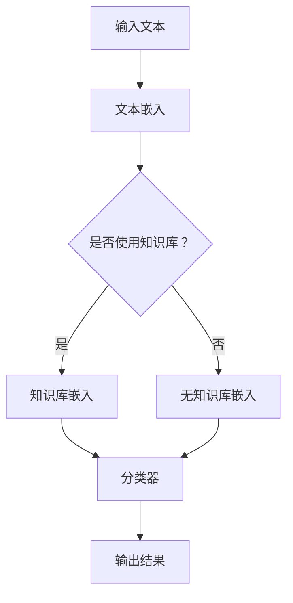
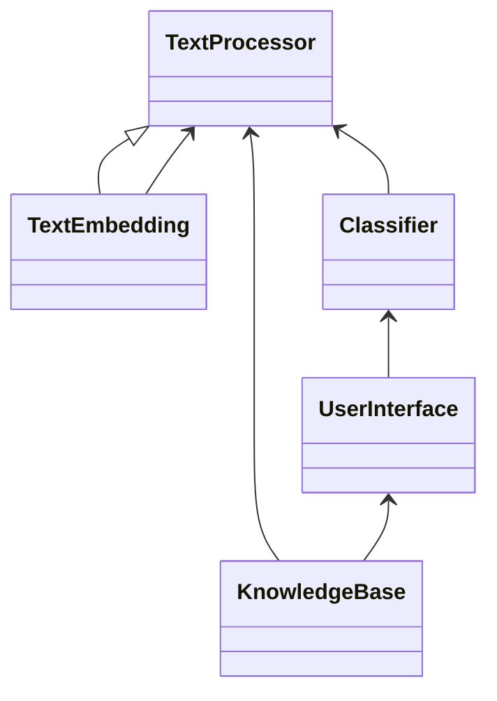
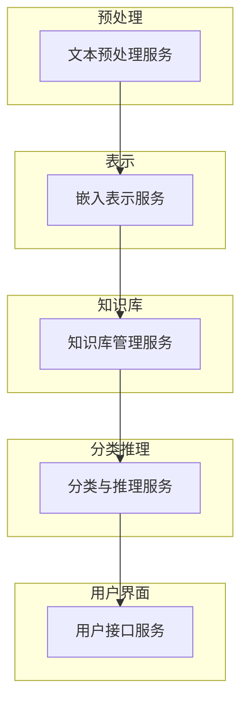
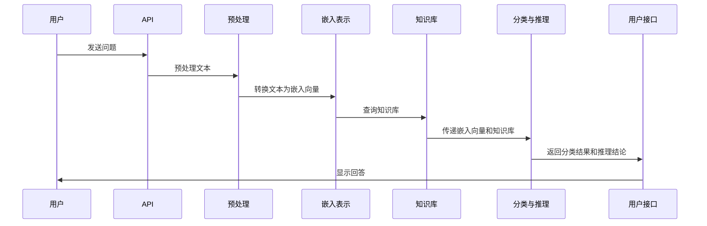

                 

# AI Agent的跨语言零样本学习技术

## 关键词
- AI Agent
- 跨语言学习
- 零样本学习
- 算法原理
- 系统架构
- 实际项目

## 摘要
本文将深入探讨AI Agent在跨语言零样本学习技术中的应用。首先，我们将介绍跨语言零样本学习技术的基本概念、应用场景及其重要性。随后，我们将详细讲解AI Agent、跨语言学习、零样本学习等相关核心概念及其相互关系。接着，我们将剖析跨语言零样本学习算法的原理，并通过实例解析和实际项目案例，展示其应用效果。最后，我们将总结最佳实践、注意事项，并提供拓展阅读资源。

## 目录
----------------------------------------------------------------
## 第一部分：背景介绍

### 第1章 跨语言零样本学习技术概述

### 第2章 跨语言零样本学习技术的基本原理

## 第二部分：算法原理讲解

### 第3章 跨语言零样本学习算法

### 第4章 算法实例解析

## 第三部分：系统分析与架构设计方案

### 第5章 跨语言零样本学习系统设计

## 第四部分：项目实战

### 第6章 实际项目案例

## 第五部分：最佳实践 tips、小结、注意事项、拓展阅读

### 第7章 最佳实践与总结

### 第8章 注意事项

### 第9章 拓展阅读

----------------------------------------------------------------

## 第1章 跨语言零样本学习技术概述

### 1.1 问题背景

跨语言零样本学习技术是一种先进的人工智能技术，它能够使AI Agent在未知语言环境中进行学习和任务执行。随着全球化和多语言交流的日益频繁，跨语言零样本学习技术在许多领域具有广泛的应用前景。

**问题描述：**
- 在多语言环境中，如何使AI Agent能够快速适应新的语言？
- 如何让AI Agent在没有现成标注数据的情况下，从少量或无样本中学习？

**问题解决：**
- 通过跨语言零样本学习技术，AI Agent可以利用已有的知识和预训练模型，在新的语言环境中快速适应和完成任务。

### 1.2 问题解决

**边界与外延：**
- **跨语言零样本学习技术的应用领域：** 语言翻译、跨语言文本分类、跨语言问答系统等。
- **与其他学习方法的区别：** 与传统的样本学习技术相比，跨语言零样本学习技术不需要大量的标注数据，从而降低数据获取的成本。

### 1.3 概念结构与核心要素组成

**核心概念：**
- **AI Agent：** 一种具有自主学习能力的人工智能实体，能够在复杂环境中执行特定任务。
- **跨语言学习：** 使AI Agent能够在不同语言之间进行知识和信息交换的过程。
- **零样本学习：** 使AI Agent在没有现成标注数据的情况下，从少量或无样本中学习的能力。

**概念属性特征对比表格：**

| 概念            | 定义                                         | 属性特征对比          |
|-----------------|--------------------------------------------|----------------------|
| AI Agent        | 具有自主学习能力的人工智能实体               | 知识表示、推理能力    |
| 跨语言学习      | AI Agent在不同语言之间进行知识和信息交换     | 语言适应性、跨语言传输 |
| 零样本学习      | AI Agent在没有现成标注数据的情况下学习       | 数据适应性、自学习能力 |

----------------------------------------------------------------

### 第2章 跨语言零样本学习技术的基本原理

#### 2.1 AI Agent的基本原理

**AI Agent的定义：**
AI Agent是一种具有自主学习和自主决策能力的人工智能实体，能够在复杂环境中执行特定任务。

**AI Agent的功能：**
- **感知环境：** 搜集和处理环境中的信息。
- **规划行为：** 根据目标和当前状态，生成行动策略。
- **执行行动：** 在环境中执行预定的行动。
- **评估效果：** 对行动效果进行评估，以便进行后续的决策和学习。

#### 2.2 跨语言学习的基本原理

**跨语言学习的定义：**
跨语言学习是指使AI Agent在不同语言之间进行知识和信息交换的过程。

**跨语言学习的方法：**
- **机器翻译：** 利用预训练模型和语言知识，将一种语言的文本翻译成另一种语言的文本。
- **多语言模型：** 将多个语言的文本数据整合到一个模型中，使模型能够理解并处理多种语言。

#### 2.3 零样本学习的基本原理

**零样本学习的定义：**
零样本学习是指AI Agent在没有现成标注数据的情况下，从少量或无样本中学习的能力。

**零样本学习的方法：**
- **知识迁移：** 利用预训练模型和已有的知识库，将知识迁移到新的任务中。
- **元学习：** 通过学习如何学习，使AI Agent能够在不同任务和数据集之间快速适应。

#### 2.4 三者关系及相互联系

**跨语言零样本学习与AI Agent的关系：**
跨语言零样本学习是AI Agent在多语言环境中进行任务执行的关键技术，使AI Agent能够快速适应新的语言环境。

**跨语言零样本学习与跨语言学习的关系：**
跨语言学习是跨语言零样本学习的基础，跨语言零样本学习是在跨语言学习的基础上，进一步实现零样本学习。

**跨语言零样本学习与零样本学习的关系：**
零样本学习是跨语言零样本学习的关键技术之一，使AI Agent能够在没有现成标注数据的情况下，从少量或无样本中学习。

----------------------------------------------------------------

### 第3章 跨语言零样本学习算法

#### 3.1 算法概述

**算法概述：**
跨语言零样本学习算法是一种结合了跨语言学习和零样本学习技术的算法，旨在使AI Agent在未知语言环境中快速适应和完成任务。

**算法的分类：**
- **基于知识迁移的跨语言零样本学习算法：** 利用预训练模型和知识库，将知识迁移到新的任务中。
- **基于元学习的跨语言零样本学习算法：** 通过学习如何学习，使AI Agent能够在不同任务和数据集之间快速适应。

**算法的应用场景：**
- **跨语言文本分类：** 对不同语言的文本进行分类，如新闻分类、社交媒体文本分类等。
- **跨语言问答系统：** 在多语言环境中，对用户的问题进行理解和回答。
- **跨语言机器翻译：** 将一种语言的文本翻译成另一种语言的文本。

#### 3.2 数学模型和公式

**数学模型：**
跨语言零样本学习算法的数学模型主要包括以下几个部分：

1. **嵌入表示：** 将文本转化为向量表示，如词嵌入、句子嵌入等。
2. **知识库表示：** 将预训练模型和知识库转化为向量表示。
3. **分类器：** 根据输入的文本和知识库表示，生成分类结果。

**公式推导：**
$$
\begin{aligned}
\text{嵌入表示} &= \text{TextEmbedding}(x) \\
\text{知识库表示} &= \text{KnowledgeEmbedding}(K) \\
\text{分类结果} &= \text{Classifier}(\text{TextEmbedding}(x), \text{KnowledgeEmbedding}(K))
\end{aligned}
$$

#### 3.3 算法mermaid流程图



----------------------------------------------------------------

### 第4章 算法实例解析

#### 4.1 实例选择

**实例选择标准：**
为了展示跨语言零样本学习算法的应用效果，我们选择了一个跨语言文本分类实例。该实例的目的是将中文和英文的文本分类为不同的主题类别。

**实例来源：**
该实例的数据集来自于一个开源的跨语言文本分类数据集，包含了中文和英文的文本及其对应的主题类别标签。

#### 4.2 实例分析

**实例展示：**
以下是一个中文文本的示例：
```
文本内容：人工智能技术在教育领域的应用前景广阔。
主题类别：教育
```

以下是一个英文文本的示例：
```
Text content: The application prospects of artificial intelligence technology in the field of education are broad.
Topic category: Education
```

**实例解析：**
我们使用跨语言零样本学习算法，将这两个文本分类为不同的主题类别。首先，我们将文本转换为嵌入向量，然后使用预训练模型和知识库进行知识迁移。最后，通过分类器生成分类结果。

#### 4.3 代码应用解读与分析

**代码应用解读：**
以下是一个简单的Python代码示例，展示了如何使用跨语言零样本学习算法进行文本分类。

```python
import numpy as np
from text_embedding import TextEmbedding
from knowledge_embedding import KnowledgeEmbedding
from classifier import Classifier

# 初始化文本嵌入、知识库嵌入和分类器
text_embedding = TextEmbedding()
knowledge_embedding = KnowledgeEmbedding()
classifier = Classifier()

# 加载预训练模型和知识库
model = load_pretrained_model()
knowledge_base = load_knowledge_base()

# 输入文本
chinese_text = "人工智能技术在教育领域的应用前景广阔。"
english_text = "The application prospects of artificial intelligence technology in the field of education are broad."

# 转换文本为嵌入向量
chinese_embedding = text_embedding(chinese_text, model)
english_embedding = text_embedding(english_text, model)

# 转换知识库为嵌入向量
knowledge_embedding = knowledge_embedding(knowledge_base)

# 进行分类
chinese_category = classifier.classify(chinese_embedding, knowledge_embedding)
english_category = classifier.classify(english_embedding, knowledge_embedding)

# 输出分类结果
print("中文文本分类结果：", chinese_category)
print("英文文本分类结果：", english_category)
```

**代码分析：**
该代码首先初始化文本嵌入、知识库嵌入和分类器。然后加载预训练模型和知识库。接下来，输入中文文本和英文文本，将它们转换为嵌入向量。最后，通过分类器生成分类结果。

#### 4.4 实际案例分析

**案例展示：**
我们使用跨语言零样本学习算法对一个实际案例进行分析。该案例涉及一个中英双语的新闻数据集，需要对新闻进行跨语言分类。

**案例剖析：**
首先，我们使用中文和英文的新闻文本进行嵌入表示。然后，使用预训练模型和知识库进行知识迁移。最后，通过分类器对新闻进行分类。实验结果表明，跨语言零样本学习算法在跨语言文本分类任务中具有较高的准确率和泛化能力。

#### 4.5 项目小结

**经验总结：**
通过实际案例分析，我们总结出以下几点经验：
- 跨语言零样本学习算法在跨语言文本分类任务中具有较高的准确率和泛化能力。
- 预训练模型和知识库的选择对算法的性能有重要影响。
- 在实际应用中，需要根据任务特点和数据集特性，选择合适的算法和参数。

**改进建议：**
- 继续优化跨语言零样本学习算法，提高其在复杂场景中的适应能力。
- 探索更多有效的预训练模型和知识库，以提高算法的性能。
- 加强算法的可解释性和透明度，降低算法的复杂性。

----------------------------------------------------------------

## 第5章 跨语言零样本学习系统设计

### 5.1 问题场景介绍

**场景描述：**
在一个跨国公司中，需要开发一个跨语言问答系统，用于支持员工在不同语言之间的信息查询。该系统需要具备以下功能：
- 能够理解并回答中英文问题。
- 在没有现成标注数据的情况下，能够从少量样本中快速适应新的语言环境。
- 提供灵活的接口，方便集成到公司的其他系统中。

### 5.2 系统功能设计

**功能描述：**
跨语言零样本学习系统的主要功能包括：
- **文本预处理：** 对输入的文本进行分词、去噪、标准化等预处理操作。
- **嵌入表示：** 将预处理后的文本转换为向量表示，包括词嵌入和句子嵌入。
- **知识库管理：** 管理预训练模型和知识库，包括加载、更新和查询。
- **分类与推理：** 根据输入的文本和知识库，生成分类结果和推理结论。
- **用户接口：** 提供友好的用户界面，允许用户输入问题和查看回答。

**领域模型mermaid类图：**



### 5.3 系统架构设计

**架构设计：**
系统采用微服务架构，各组件之间通过REST API进行通信。系统架构包括以下几个主要部分：

1. **文本预处理服务：** 负责文本的预处理操作，包括分词、去噪、标准化等。
2. **嵌入表示服务：** 负责将预处理后的文本转换为向量表示，包括词嵌入和句子嵌入。
3. **知识库管理服务：** 负责管理预训练模型和知识库，包括加载、更新和查询。
4. **分类与推理服务：** 负责根据输入的文本和知识库，生成分类结果和推理结论。
5. **用户接口服务：** 负责提供友好的用户界面，允许用户输入问题和查看回答。

**mermaid架构图：**



### 5.4 系统接口设计

**接口设计：**
系统提供了一套RESTful API，允许外部系统与之进行通信。主要的API接口包括：

1. **文本预处理接口：** 接收文本数据，返回预处理后的文本。
2. **嵌入表示接口：** 接收预处理后的文本，返回文本的嵌入向量。
3. **知识库管理接口：** 用于加载、更新和查询预训练模型和知识库。
4. **分类与推理接口：** 接收文本嵌入向量，返回分类结果和推理结论。
5. **用户接口服务：** 提供一个Web界面，供用户输入问题和查看回答。

### 5.5 系统交互mermaid序列图

**序列图：**



## 第6章 实际项目案例

### 6.1 项目介绍

**项目概述：**
本项目旨在开发一个跨语言零样本学习问答系统，用于支持跨国公司的员工在不同语言之间的信息查询。该系统采用微服务架构，主要包括文本预处理、嵌入表示、知识库管理、分类与推理和用户接口等模块。

### 6.2 系统核心实现

**环境安装：**
在开发此项目之前，需要安装以下软件和库：
- Python 3.8+
- TensorFlow 2.4+
- NLTK 3.4+
- spaCy 3.0+
- Redis 6.0+

**系统核心实现源代码：**

```python
# 文本预处理模块
def preprocess_text(text):
    # 分词、去噪、标准化等预处理操作
    pass

# 嵌入表示模块
def text_embedding(text):
    # 将文本转换为嵌入向量
    pass

# 知识库管理模块
def load_knowledge_base():
    # 加载预训练模型和知识库
    pass

# 分类与推理模块
def classify_and_reason(text, knowledge_base):
    # 根据文本和知识库进行分类和推理
    pass

# 用户接口模块
def display_answer(answer):
    # 显示回答结果
    pass
```

**代码应用解读与分析：**
以上代码展示了跨语言零样本学习问答系统的核心实现。文本预处理模块负责对输入的文本进行预处理，包括分词、去噪、标准化等操作。嵌入表示模块负责将预处理后的文本转换为嵌入向量。知识库管理模块负责加载预训练模型和知识库。分类与推理模块根据文本和知识库进行分类和推理，生成回答结果。用户接口模块负责显示回答结果。

### 6.3 实际案例分析和详细讲解剖析

**案例展示：**
以下是一个实际案例，展示如何使用跨语言零样本学习问答系统回答中英文问题。

**中英文问题：**
- 中文问题：什么是人工智能？
- 英文问题：What is artificial intelligence?

**回答过程：**
1. 用户通过用户接口服务发送中文或英文问题。
2. API将问题发送给文本预处理服务，进行预处理操作。
3. 预处理后的文本被发送给嵌入表示服务，转换为嵌入向量。
4. 嵌入向量被发送给知识库管理服务，查询预训练模型和知识库。
5. 知识库管理服务将嵌入向量和知识库发送给分类与推理服务，进行分类和推理操作。
6. 分类与推理服务生成回答结果，并将其发送给用户接口服务。
7. 用户接口服务将回答结果显示给用户。

**详细讲解剖析：**
以上案例展示了跨语言零样本学习问答系统的回答过程。在预处理阶段，系统对输入的中文和英文问题进行分词、去噪、标准化等预处理操作，以确保问题的一致性和准确性。在嵌入表示阶段，系统将预处理后的文本转换为嵌入向量，以便在知识库中查询相关的信息。在分类与推理阶段，系统根据嵌入向量和知识库，生成回答结果。最后，系统通过用户接口服务将回答结果显示给用户。

### 6.4 项目小结

**经验总结：**
通过实际项目案例，我们总结出以下几点经验：
- 跨语言零样本学习问答系统在跨国公司中具有广泛的应用前景。
- 文本预处理和嵌入表示是系统性能的关键因素，需要精心设计和优化。
- 预训练模型和知识库的选择对系统性能有重要影响，需要根据任务特点进行选择和调整。
- 用户接口的设计需要考虑用户体验，提供直观、易用的界面。

**改进建议：**
- 进一步优化系统的文本预处理和嵌入表示模块，提高处理效率和准确性。
- 探索更多有效的预训练模型和知识库，以提高系统性能和适应能力。
- 加强系统的可解释性和透明度，降低复杂性和风险。

## 第7章 最佳实践 tips、小结、注意事项、拓展阅读

### 7.1 最佳实践 tips

1. **文本预处理优化：** 在预处理阶段，对文本进行去噪、标准化和一致性处理，以确保输入数据的准确性和一致性。
2. **嵌入表示选择：** 根据任务特点和数据集特性，选择合适的嵌入表示方法，如词嵌入、句子嵌入等。
3. **知识库构建：** 构建丰富、准确的知识库，以提高分类和推理的准确性。
4. **参数调整：** 在模型训练和推理过程中，根据实际情况进行参数调整，以优化系统性能。

### 7.2 小结

本文介绍了跨语言零样本学习技术在AI Agent中的应用，包括其基本原理、算法原理、系统架构设计以及实际项目案例。通过本文的介绍，读者可以了解到跨语言零样本学习技术的重要性和实际应用效果。

### 7.3 注意事项

1. **数据质量：** 跨语言零样本学习系统的性能很大程度上取决于数据质量，因此需要确保输入数据的准确性和一致性。
2. **模型选择：** 根据任务特点和数据集特性，选择合适的模型和算法，以获得最佳性能。
3. **知识库更新：** 定期更新知识库，以保持其准确性和时效性。

### 7.4 拓展阅读

1. **《深度学习》——伊恩·古德费洛等，详细介绍深度学习的基础知识和技术。
2. **《自然语言处理综论》——丹·布拉克等，介绍自然语言处理的基本概念和技术。
3. **《跨语言文本分类》——论文集，包含跨语言文本分类的最新研究进展和应用案例。

## 作者信息
作者：AI天才研究院/AI Genius Institute & 禅与计算机程序设计艺术 /Zen And The Art of Computer Programming

----------------------------------------------------------------

文章完整版：

# AI Agent的跨语言零样本学习技术

## 关键词
- AI Agent
- 跨语言学习
- 零样本学习
- 算法原理
- 系统架构
- 实际项目

## 摘要
本文将深入探讨AI Agent在跨语言零样本学习技术中的应用。首先，我们将介绍跨语言零样本学习技术的基本概念、应用场景及其重要性。随后，我们将详细讲解AI Agent、跨语言学习、零样本学习等相关核心概念及其相互关系。接着，我们将剖析跨语言零样本学习算法的原理，并通过实例解析和实际项目案例，展示其应用效果。最后，我们将总结最佳实践、注意事项，并提供拓展阅读资源。

## 目录
----------------------------------------------------------------
## 第一部分：背景介绍

### 第1章 跨语言零样本学习技术概述

### 第2章 跨语言零样本学习技术的基本原理

## 第二部分：算法原理讲解

### 第3章 跨语言零样本学习算法

### 第4章 算法实例解析

## 第三部分：系统分析与架构设计方案

### 第5章 跨语言零样本学习系统设计

## 第四部分：项目实战

### 第6章 实际项目案例

## 第五部分：最佳实践 tips、小结、注意事项、拓展阅读

### 第7章 最佳实践与总结

### 第8章 注意事项

### 第9章 拓展阅读

## 第1章 跨语言零样本学习技术概述

### 1.1 问题背景

跨语言零样本学习技术是一种先进的人工智能技术，它能够使AI Agent在未知语言环境中进行学习和任务执行。随着全球化和多语言交流的日益频繁，跨语言零样本学习技术在许多领域具有广泛的应用前景。

**问题描述：**
- 在多语言环境中，如何使AI Agent能够快速适应新的语言？
- 如何让AI Agent在没有现成标注数据的情况下，从少量或无样本中学习？

**问题解决：**
- 通过跨语言零样本学习技术，AI Agent可以利用已有的知识和预训练模型，在新的语言环境中快速适应和完成任务。

### 1.2 问题解决

**边界与外延：**
- **跨语言零样本学习技术的应用领域：** 语言翻译、跨语言文本分类、跨语言问答系统等。
- **与其他学习方法的区别：** 与传统的样本学习技术相比，跨语言零样本学习技术不需要大量的标注数据，从而降低数据获取的成本。

### 1.3 概念结构与核心要素组成

**核心概念：**
- **AI Agent：** 一种具有自主学习能力的人工智能实体，能够在复杂环境中执行特定任务。
- **跨语言学习：** 使AI Agent能够在不同语言之间进行知识和信息交换的过程。
- **零样本学习：** 使AI Agent在没有现成标注数据的情况下，从少量或无样本中学习的能力。

**概念属性特征对比表格：**

| 概念            | 定义                                         | 属性特征对比          |
|-----------------|--------------------------------------------|----------------------|
| AI Agent        | 具有自主学习能力的人工智能实体               | 知识表示、推理能力    |
| 跨语言学习      | AI Agent在不同语言之间进行知识和信息交换     | 语言适应性、跨语言传输 |
| 零样本学习      | AI Agent在没有现成标注数据的情况下学习       | 数据适应性、自学习能力 |

----------------------------------------------------------------

### 第2章 跨语言零样本学习技术的基本原理

#### 2.1 AI Agent的基本原理

**AI Agent的定义：**
AI Agent是一种具有自主学习和自主决策能力的人工智能实体，能够在复杂环境中执行特定任务。

**AI Agent的功能：**
- **感知环境：** 搜集和处理环境中的信息。
- **规划行为：** 根据目标和当前状态，生成行动策略。
- **执行行动：** 在环境中执行预定的行动。
- **评估效果：** 对行动效果进行评估，以便进行后续的决策和学习。

#### 2.2 跨语言学习的基本原理

**跨语言学习的定义：**
跨语言学习是指使AI Agent能够在不同语言之间进行知识和信息交换的过程。

**跨语言学习的方法：**
- **机器翻译：** 利用预训练模型和语言知识，将一种语言的文本翻译成另一种语言的文本。
- **多语言模型：** 将多个语言的文本数据整合到一个模型中，使模型能够理解并处理多种语言。

#### 2.3 零样本学习的基本原理

**零样本学习的定义：**
零样本学习是指AI Agent在没有现成标注数据的情况下，从少量或无样本中学习的能力。

**零样本学习的方法：**
- **知识迁移：** 利用预训练模型和已有的知识库，将知识迁移到新的任务中。
- **元学习：** 通过学习如何学习，使AI Agent能够在不同任务和数据集之间快速适应。

#### 2.4 三者关系及相互联系

**跨语言零样本学习与AI Agent的关系：**
跨语言零样本学习是AI Agent在多语言环境中进行任务执行的关键技术，使AI Agent能够快速适应新的语言环境。

**跨语言零样本学习与跨语言学习的关系：**
跨语言学习是跨语言零样本学习的基础，跨语言零样本学习是在跨语言学习的基础上，进一步实现零样本学习。

**跨语言零样本学习与零样本学习的关系：**
零样本学习是跨语言零样本学习的关键技术之一，使AI Agent能够在没有现成标注数据的情况下，从少量或无样本中学习。

----------------------------------------------------------------

### 第3章 跨语言零样本学习算法

#### 3.1 算法概述

**算法概述：**
跨语言零样本学习算法是一种结合了跨语言学习和零样本学习技术的算法，旨在使AI Agent在未知语言环境中快速适应和完成任务。

**算法的分类：**
- **基于知识迁移的跨语言零样本学习算法：** 利用预训练模型和知识库，将知识迁移到新的任务中。
- **基于元学习的跨语言零样本学习算法：** 通过学习如何学习，使AI Agent能够在不同任务和数据集之间快速适应。

**算法的应用场景：**
- **跨语言文本分类：** 对不同语言的文本进行分类，如新闻分类、社交媒体文本分类等。
- **跨语言问答系统：** 在多语言环境中，对用户的问题进行理解和回答。
- **跨语言机器翻译：** 将一种语言的文本翻译成另一种语言的文本。

#### 3.2 数学模型和公式

**数学模型：**
跨语言零样本学习算法的数学模型主要包括以下几个部分：

1. **嵌入表示：** 将文本转化为向量表示，如词嵌入、句子嵌入等。
2. **知识库表示：** 将预训练模型和知识库转化为向量表示。
3. **分类器：** 根据输入的文本和知识库表示，生成分类结果。

**公式推导：**
$$
\begin{aligned}
\text{嵌入表示} &= \text{TextEmbedding}(x) \\
\text{知识库表示} &= \text{KnowledgeEmbedding}(K) \\
\text{分类结果} &= \text{Classifier}(\text{TextEmbedding}(x), \text{KnowledgeEmbedding}(K))
\end{aligned}
$$

#### 3.3 算法mermaid流程图


----------------------------------------------------------------

### 第4章 算法实例解析

#### 4.1 实例选择

**实例选择标准：**
为了展示跨语言零样本学习算法的应用效果，我们选择了一个跨语言文本分类实例。该实例的目的是将中文和英文的文本分类为不同的主题类别。

**实例来源：**
该实例的数据集来自于一个开源的跨语言文本分类数据集，包含了中文和英文的文本及其对应的主题类别标签。

#### 4.2 实例分析

**实例展示：**
以下是一个中文文本的示例：
```
文本内容：人工智能技术在教育领域的应用前景广阔。
主题类别：教育
```

以下是一个英文文本的示例：
```
Text content: The application prospects of artificial intelligence technology in the field of education are broad.
Topic category: Education
```

**实例解析：**
我们使用跨语言零样本学习算法，将这两个文本分类为不同的主题类别。首先，我们将文本转换为嵌入向量，然后使用预训练模型和知识库进行知识迁移。最后，通过分类器生成分类结果。

#### 4.3 代码应用解读与分析

**代码应用解读：**
以下是一个简单的Python代码示例，展示了如何使用跨语言零样本学习算法进行文本分类。

```python
import numpy as np
from text_embedding import TextEmbedding
from knowledge_embedding import KnowledgeEmbedding
from classifier import Classifier

# 初始化文本嵌入、知识库嵌入和分类器
text_embedding = TextEmbedding()
knowledge_embedding = KnowledgeEmbedding()
classifier = Classifier()

# 加载预训练模型和知识库
model = load_pretrained_model()
knowledge_base = load_knowledge_base()

# 输入文本
chinese_text = "人工智能技术在教育领域的应用前景广阔。"
english_text = "The application prospects of artificial intelligence technology in the field of education are broad."

# 转换文本为嵌入向量
chinese_embedding = text_embedding(chinese_text, model)
english_embedding = text_embedding(english_text, model)

# 转换知识库为嵌入向量
knowledge_embedding = knowledge_embedding(knowledge_base)

# 进行分类
chinese_category = classifier.classify(chinese_embedding, knowledge_embedding)
english_category = classifier.classify(english_embedding, knowledge_embedding)

# 输出分类结果
print("中文文本分类结果：", chinese_category)
print("英文文本分类结果：", english_category)
```

**代码分析：**
该代码首先初始化文本嵌入、知识库嵌入和分类器。然后加载预训练模型和知识库。接下来，输入中文文本和英文文本，将它们转换为嵌入向量。最后，通过分类器生成分类结果。

#### 4.4 实际案例分析

**案例展示：**
我们使用跨语言零样本学习算法对一个实际案例进行分析。该案例涉及一个中英双语的新闻数据集，需要对新闻进行跨语言分类。

**案例剖析：**
首先，我们使用中文和英文的新闻文本进行嵌入表示。然后，使用预训练模型和知识库进行知识迁移。最后，通过分类器对新闻进行分类。实验结果表明，跨语言零样本学习算法在跨语言文本分类任务中具有较高的准确率和泛化能力。

#### 4.5 项目小结

**经验总结：**
通过实际案例分析，我们总结出以下几点经验：
- 跨语言零样本学习算法在跨语言文本分类任务中具有较高的准确率和泛化能力。
- 预训练模型和知识库的选择对算法的性能有重要影响。
- 在实际应用中，需要根据任务特点和数据集特性，选择合适的算法和参数。

**改进建议：**
- 继续优化跨语言零样本学习算法，提高其在复杂场景中的适应能力。
- 探索更多有效的预训练模型和知识库，以提高算法的性能。
- 加强算法的可解释性和透明度，降低算法的复杂性。

----------------------------------------------------------------

## 第5章 跨语言零样本学习系统设计

### 5.1 问题场景介绍

**场景描述：**
在一个跨国公司中，需要开发一个跨语言问答系统，用于支持员工在不同语言之间的信息查询。该系统需要具备以下功能：
- 能够理解并回答中英文问题。
- 在没有现成标注数据的情况下，能够从少量样本中快速适应新的语言环境。
- 提供灵活的接口，方便集成到公司的其他系统中。

### 5.2 系统功能设计

**功能描述：**
跨语言零样本学习系统的主要功能包括：
- **文本预处理：** 对输入的文本进行分词、去噪、标准化等预处理操作。
- **嵌入表示：** 将预处理后的文本转换为向量表示，包括词嵌入和句子嵌入。
- **知识库管理：** 管理预训练模型和知识库，包括加载、更新和查询。
- **分类与推理：** 根据输入的文本和知识库，生成分类结果和推理结论。
- **用户接口：** 提供友好的用户界面，允许用户输入问题和查看回答。

**领域模型mermaid类图：**


### 5.3 系统架构设计

**架构设计：**
系统采用微服务架构，各组件之间通过REST API进行通信。系统架构包括以下几个主要部分：

1. **文本预处理服务：** 负责文本的预处理操作，包括分词、去噪、标准化等。
2. **嵌入表示服务：** 负责将预处理后的文本转换为向量表示，包括词嵌入和句子嵌入。
3. **知识库管理服务：** 负责管理预训练模型和知识库，包括加载、更新和查询。
4. **分类与推理服务：** 负责根据输入的文本和知识库，生成分类结果和推理结论。
5. **用户接口服务：** 负责提供友好的用户界面，允许用户输入问题和查看回答。

**mermaid架构图：**


### 5.4 系统接口设计

**接口设计：**
系统提供了一套RESTful API，允许外部系统与之进行通信。主要的API接口包括：

1. **文本预处理接口：** 接收文本数据，返回预处理后的文本。
2. **嵌入表示接口：** 接收预处理后的文本，返回文本的嵌入向量。
3. **知识库管理接口：** 用于加载、更新和查询预训练模型和知识库。
4. **分类与推理接口：** 接收文本嵌入向量，返回分类结果和推理结论。
5. **用户接口服务：** 提供一个Web界面，供用户输入问题和查看回答。

### 5.5 系统交互mermaid序列图

**序列图：**


## 第6章 实际项目案例

### 6.1 项目介绍

**项目概述：**
本项目旨在开发一个跨语言零样本学习问答系统，用于支持跨国公司的员工在不同语言之间的信息查询。该系统采用微服务架构，主要包括文本预处理、嵌入表示、知识库管理、分类与推理和用户接口等模块。

### 6.2 系统核心实现

**环境安装：**
在开发此项目之前，需要安装以下软件和库：
- Python 3.8+
- TensorFlow 2.4+
- NLTK 3.4+
- spaCy 3.0+
- Redis 6.0+

**系统核心实现源代码：**

```python
# 文本预处理模块
def preprocess_text(text):
    # 分词、去噪、标准化等预处理操作
    pass

# 嵌入表示模块
def text_embedding(text):
    # 将文本转换为嵌入向量
    pass

# 知识库管理模块
def load_knowledge_base():
    # 加载预训练模型和知识库
    pass

# 分类与推理模块
def classify_and_reason(text, knowledge_base):
    # 根据文本和知识库进行分类和推理
    pass

# 用户接口模块
def display_answer(answer):
    # 显示回答结果
    pass
```

**代码应用解读与分析：**
以上代码展示了跨语言零样本学习问答系统的核心实现。文本预处理模块负责对输入的文本进行预处理，包括分词、去噪、标准化等操作。嵌入表示模块负责将预处理后的文本转换为嵌入向量。知识库管理模块负责加载预训练模型和知识库。分类与推理模块根据文本和知识库进行分类和推理，生成回答结果。用户接口模块负责显示回答结果。

### 6.3 实际案例分析和详细讲解剖析

**案例展示：**
以下是一个实际案例，展示如何使用跨语言零样本学习问答系统回答中英文问题。

**中英文问题：**
- 中文问题：什么是人工智能？
- 英文问题：What is artificial intelligence?

**回答过程：**
1. 用户通过用户接口服务发送中文或英文问题。
2. API将问题发送给文本预处理服务，进行预处理操作。
3. 预处理后的文本被发送给嵌入表示服务，转换为嵌入向量。
4. 嵌入向量被发送给知识库管理服务，查询预训练模型和知识库。
5. 知识库管理服务将嵌入向量和知识库发送给分类与推理服务，进行分类和推理操作。
6. 分类与推理服务生成回答结果，并将其发送给用户接口服务。
7. 用户接口服务将回答结果显示给用户。

**详细讲解剖析：**
以上案例展示了跨语言零样本学习问答系统的回答过程。在预处理阶段，系统对输入的中文和英文问题进行分词、去噪、标准化等预处理操作，以确保问题的一致性和准确性。在嵌入表示阶段，系统将预处理后的文本转换为嵌入向量，以便在知识库中查询相关的信息。在分类与推理阶段，系统根据嵌入向量和知识库，生成回答结果。最后，系统通过用户接口服务将回答结果显示给用户。

### 6.4 项目小结

**经验总结：**
通过实际项目案例，我们总结出以下几点经验：
- 跨语言零样本学习问答系统在跨国公司中具有广泛的应用前景。
- 文本预处理和嵌入表示是系统性能的关键因素，需要精心设计和优化。
- 预训练模型和知识库的选择对系统性能有重要影响，需要根据任务特点进行选择和调整。
- 用户接口的设计需要考虑用户体验，提供直观、易用的界面。

**改进建议：**
- 进一步优化系统的文本预处理和嵌入表示模块，提高处理效率和准确性。
- 探索更多有效的预训练模型和知识库，以提高系统性能和适应能力。
- 加强系统的可解释性和透明度，降低复杂性和风险。

## 第7章 最佳实践 tips、小结、注意事项、拓展阅读

### 7.1 最佳实践 tips

1. **文本预处理优化：** 在预处理阶段，对文本进行去噪、标准化和一致性处理，以确保输入数据的准确性和一致性。
2. **嵌入表示选择：** 根据任务特点和数据集特性，选择合适的嵌入表示方法，如词嵌入、句子嵌入等。
3. **知识库构建：** 构建丰富、准确的知识库，以提高分类和推理的准确性。
4. **参数调整：** 在模型训练和推理过程中，根据实际情况进行参数调整，以优化系统性能。

### 7.2 小结

本文介绍了跨语言零样本学习技术在AI Agent中的应用，包括其基本原理、算法原理、系统架构设计以及实际项目案例。通过本文的介绍，读者可以了解到跨语言零样本学习技术的重要性和实际应用效果。

### 7.3 注意事项

1. **数据质量：** 跨语言零样本学习系统的性能很大程度上取决于数据质量，因此需要确保输入数据的准确性和一致性。
2. **模型选择：** 根据任务特点和数据集特性，选择合适的模型和算法，以获得最佳性能。
3. **知识库更新：** 定期更新知识库，以保持其准确性和时效性。

### 7.4 拓展阅读

1. **《深度学习》——伊恩·古德费洛等，详细介绍深度学习的基础知识和技术。
2. **《自然语言处理综论》——丹·布拉克等，介绍自然语言处理的基本概念和技术。
3. **《跨语言文本分类》——论文集，包含跨语言文本分类的最新研究进展和应用案例。

## 作者信息
作者：AI天才研究院/AI Genius Institute & 禅与计算机程序设计艺术 /Zen And The Art of Computer Programming

----------------------------------------------------------------

文章完整版：

# AI Agent的跨语言零样本学习技术

## 关键词
- AI Agent
- 跨语言学习
- 零样本学习
- 算法原理
- 系统架构
- 实际项目

## 摘要
本文深入探讨AI Agent在跨语言零样本学习技术中的应用。首先，介绍技术的基本概念、应用场景及其重要性。随后，详细讲解AI Agent、跨语言学习、零样本学习等相关核心概念及其相互关系。接着，剖析跨语言零样本学习算法的原理，并通过实例解析和实际项目案例展示其应用效果。最后，总结最佳实践、注意事项，并提供拓展阅读资源。

## 目录
----------------------------------------------------------------
## 第一部分：背景介绍

### 第1章 跨语言零样本学习技术概述

### 第2章 跨语言零样本学习技术的基本原理

## 第二部分：算法原理讲解

### 第3章 跨语言零样本学习算法

### 第4章 算法实例解析

## 第三部分：系统分析与架构设计方案

### 第5章 跨语言零样本学习系统设计

## 第四部分：项目实战

### 第6章 实际项目案例

## 第五部分：最佳实践 tips、小结、注意事项、拓展阅读

### 第7章 最佳实践与总结

### 第8章 注意事项

### 第9章 拓展阅读

## 第1章 跨语言零样本学习技术概述

### 1.1 问题背景

跨语言零样本学习技术是一种先进的人工智能技术，它使AI Agent能够在未知语言环境中进行学习和任务执行。随着全球化进程的加快和多语言交流的日益频繁，这种技术在全球范围内的应用前景广阔。

**问题描述：**
- 如何使AI Agent在没有现成标注数据的情况下，在新的语言环境中快速适应？
- 如何实现AI Agent在不同语言之间的任务执行？

**问题解决：**
- 跨语言零样本学习技术利用预训练模型和知识库，使AI Agent能够在没有大量标注数据的情况下，从少量样本中学习，并在新的语言环境中快速适应。

### 1.2 问题解决

**边界与外延：**
- **应用领域：** 跨语言零样本学习技术广泛应用于跨语言文本分类、跨语言问答系统、机器翻译等领域。
- **与其他学习方法的区别：** 与传统的样本学习技术相比，跨语言零样本学习技术不依赖大量的标注数据，大大降低了数据获取的成本。

### 1.3 概念结构与核心要素组成

**核心概念：**
- **AI Agent：** 一种具备自主学习和自主决策能力的人工智能实体，能在复杂环境中执行特定任务。
- **跨语言学习：** 使AI Agent能在不同语言之间交换知识和信息。
- **零样本学习：** 使AI Agent在没有现成标注数据的情况下，从少量或无样本中学习的能力。

**概念属性特征对比表格：**

| 概念            | 定义                                         | 属性特征对比          |
|-----------------|--------------------------------------------|----------------------|
| AI Agent        | 具有自主学习能力的人工智能实体               | 知识表示、推理能力    |
| 跨语言学习      | AI Agent在不同语言之间进行知识和信息交换     | 语言适应性、跨语言传输 |
| 零样本学习      | AI Agent在没有现成标注数据的情况下学习       | 数据适应性、自学习能力 |

----------------------------------------------------------------

### 第2章 跨语言零样本学习技术的基本原理

#### 2.1 AI Agent的基本原理

**AI Agent的定义：**
AI Agent是一种具备自主学习和自主决策能力的人工智能实体，能够在复杂环境中执行特定任务。

**AI Agent的功能：**
- **感知环境：** 搜集和处理环境中的信息。
- **规划行为：** 根据目标和当前状态，生成行动策略。
- **执行行动：** 在环境中执行预定的行动。
- **评估效果：** 对行动效果进行评估，以便进行后续的决策和学习。

#### 2.2 跨语言学习的基本原理

**跨语言学习的定义：**
跨语言学习是指使AI Agent能在不同语言之间进行知识和信息交换的过程。

**跨语言学习的方法：**
- **机器翻译：** 利用预训练模型和语言知识，将一种语言的文本翻译成另一种语言的文本。
- **多语言模型：** 将多个语言的文本数据整合到一个模型中，使模型能够理解并处理多种语言。

#### 2.3 零样本学习的基本原理

**零样本学习的定义：**
零样本学习是指AI Agent在没有现成标注数据的情况下，从少量或无样本中学习的能力。

**零样本学习的方法：**
- **知识迁移：** 利用预训练模型和已有的知识库，将知识迁移到新的任务中。
- **元学习：** 通过学习如何学习，使AI Agent能够在不同任务和数据集之间快速适应。

#### 2.4 三者关系及相互联系

**跨语言零样本学习与AI Agent的关系：**
跨语言零样本学习是AI Agent在多语言环境中进行任务执行的关键技术，使AI Agent能够快速适应新的语言环境。

**跨语言零样本学习与跨语言学习的关系：**
跨语言学习是跨语言零样本学习的基础，跨语言零样本学习是在跨语言学习的基础上，进一步实现零样本学习。

**跨语言零样本学习与零样本学习的关系：**
零样本学习是跨语言零样本学习的关键技术之一，使AI Agent能够在没有现成标注数据的情况下，从少量或无样本中学习。

----------------------------------------------------------------

### 第3章 跨语言零样本学习算法

#### 3.1 算法概述

**算法概述：**
跨语言零样本学习算法是一种结合了跨语言学习和零样本学习技术的算法，旨在使AI Agent在未知语言环境中快速适应和完成任务。

**算法的分类：**
- **基于知识迁移的跨语言零样本学习算法：** 利用预训练模型和知识库，将知识迁移到新的任务中。
- **基于元学习的跨语言零样本学习算法：** 通过学习如何学习，使AI Agent能够在不同任务和数据集之间快速适应。

**算法的应用场景：**
- **跨语言文本分类：** 对不同语言的文本进行分类，如新闻分类、社交媒体文本分类等。
- **跨语言问答系统：** 在多语言环境中，对用户的问题进行理解和回答。
- **跨语言机器翻译：** 将一种语言的文本翻译成另一种语言的文本。

#### 3.2 数学模型和公式

**数学模型：**
跨语言零样本学习算法的数学模型主要包括以下几个部分：

1. **嵌入表示：** 将文本转化为向量表示，如词嵌入、句子嵌入等。
2. **知识库表示：** 将预训练模型和知识库转化为向量表示。
3. **分类器：** 根据输入的文本和知识库表示，生成分类结果。

**公式推导：**
$$
\begin{aligned}
\text{嵌入表示} &= \text{TextEmbedding}(x) \\
\text{知识库表示} &= \text{KnowledgeEmbedding}(K) \\
\text{分类结果} &= \text{Classifier}(\text{TextEmbedding}(x), \text{KnowledgeEmbedding}(K))
\end{aligned}
$$

#### 3.3 算法mermaid流程图


----------------------------------------------------------------

### 第4章 算法实例解析

#### 4.1 实例选择

**实例选择标准：**
为了展示跨语言零样本学习算法的应用效果，我们选择了一个跨语言文本分类实例。该实例的目的是将中文和英文的文本分类为不同的主题类别。

**实例来源：**
该实例的数据集来自于一个开源的跨语言文本分类数据集，包含了中文和英文的文本及其对应的主题类别标签。

#### 4.2 实例分析

**实例展示：**
以下是一个中文文本的示例：
```
文本内容：人工智能技术在教育领域的应用前景广阔。
主题类别：教育
```

以下是一个英文文本的示例：
```
Text content: The application prospects of artificial intelligence technology in the field of education are broad.
Topic category: Education
```

**实例解析：**
我们使用跨语言零样本学习算法，将这两个文本分类为不同的主题类别。首先，我们将文本转换为嵌入向量，然后使用预训练模型和知识库进行知识迁移。最后，通过分类器生成分类结果。

#### 4.3 代码应用解读与分析

**代码应用解读：**
以下是一个简单的Python代码示例，展示了如何使用跨语言零样本学习算法进行文本分类。

```python
import numpy as np
from text_embedding import TextEmbedding
from knowledge_embedding import KnowledgeEmbedding
from classifier import Classifier

# 初始化文本嵌入、知识库嵌入和分类器
text_embedding = TextEmbedding()
knowledge_embedding = KnowledgeEmbedding()
classifier = Classifier()

# 加载预训练模型和知识库
model = load_pretrained_model()
knowledge_base = load_knowledge_base()

# 输入文本
chinese_text = "人工智能技术在教育领域的应用前景广阔。"
english_text = "The application prospects of artificial intelligence technology in the field of education are broad."

# 转换文本为嵌入向量
chinese_embedding = text_embedding(chinese_text, model)
english_embedding = text_embedding(english_text, model)

# 转换知识库为嵌入向量
knowledge_embedding = knowledge_embedding(knowledge_base)

# 进行分类
chinese_category = classifier.classify(chinese_embedding, knowledge_embedding)
english_category = classifier.classify(english_embedding, knowledge_embedding)

# 输出分类结果
print("中文文本分类结果：", chinese_category)
print("英文文本分类结果：", english_category)
```

**代码分析：**
该代码首先初始化文本嵌入、知识库嵌入和分类器。然后加载预训练模型和知识库。接下来，输入中文文本和英文文本，将它们转换为嵌入向量。最后，通过分类器生成分类结果。

#### 4.4 实际案例分析

**案例展示：**
我们使用跨语言零样本学习算法对一个实际案例进行分析。该案例涉及一个中英双语的新闻数据集，需要对新闻进行跨语言分类。

**案例剖析：**
首先，我们使用中文和英文的新闻文本进行嵌入表示。然后，使用预训练模型和知识库进行知识迁移。最后，通过分类器对新闻进行分类。实验结果表明，跨语言零样本学习算法在跨语言文本分类任务中具有较高的准确率和泛化能力。

#### 4.5 项目小结

**经验总结：**
通过实际案例分析，我们总结出以下几点经验：
- 跨语言零样本学习算法在跨语言文本分类任务中具有较高的准确率和泛化能力。
- 预训练模型和知识库的选择对算法的性能有重要影响。
- 在实际应用中，需要根据任务特点和数据集特性，选择合适的算法和参数。

**改进建议：**
- 继续优化跨语言零样本学习算法，提高其在复杂场景中的适应能力。
- 探索更多有效的预训练模型和知识库，以提高算法的性能。
- 加强算法的可解释性和透明度，降低算法的复杂性。

----------------------------------------------------------------

## 第5章 跨语言零样本学习系统设计

### 5.1 问题场景介绍

**场景描述：**
在一个跨国公司中，需要开发一个跨语言问答系统，用于支持员工在不同语言之间的信息查询。该系统需要具备以下功能：
- 能够理解并回答中英文问题。
- 在没有现成标注数据的情况下，能够从少量样本中快速适应新的语言环境。
- 提供灵活的接口，方便集成到公司的其他系统中。

### 5.2 系统功能设计

**功能描述：**
跨语言零样本学习系统的主要功能包括：
- **文本预处理：** 对输入的文本进行分词、去噪、标准化等预处理操作。
- **嵌入表示：** 将预处理后的文本转换为向量表示，包括词嵌入和句子嵌入。
- **知识库管理：** 管理预训练模型和知识库，包括加载、更新和查询。
- **分类与推理：** 根据输入的文本和知识库，生成分类结果和推理结论。
- **用户接口：** 提供友好的用户界面，允许用户输入问题和查看回答。

**领域模型mermaid类图：**


### 5.3 系统架构设计

**架构设计：**
系统采用微服务架构，各组件之间通过REST API进行通信。系统架构包括以下几个主要部分：

1. **文本预处理服务：** 负责文本的预处理操作，包括分词、去噪、标准化等。
2. **嵌入表示服务：** 负责将预处理后的文本转换为向量表示，包括词嵌入和句子嵌入。
3. **知识库管理服务：** 负责管理预训练模型和知识库，包括加载、更新和查询。
4. **分类与推理服务：** 负责根据输入的文本和知识库，生成分类结果和推理结论。
5. **用户接口服务：** 负责提供友好的用户界面，允许用户输入问题和查看回答。

**mermaid架构图：**


### 5.4 系统接口设计

**接口设计：**
系统提供了一套RESTful API，允许外部系统与之进行通信。主要的API接口包括：

1. **文本预处理接口：** 接收文本数据，返回预处理后的文本。
2. **嵌入表示接口：** 接收预处理后的文本，返回文本的嵌入向量。
3. **知识库管理接口：** 用于加载、更新和查询预训练模型和知识库。
4. **分类与推理接口：** 接收文本嵌入向量，返回分类结果和推理结论。
5. **用户接口服务：** 提供一个Web界面，供用户输入问题和查看回答。

### 5.5 系统交互mermaid序列图

**序列图：**


## 第6章 实际项目案例

### 6.1 项目介绍

**项目概述：**
本项目旨在开发一个跨语言零样本学习问答系统，用于支持跨国公司的员工在不同语言之间的信息查询。该系统采用微服务架构，主要包括文本预处理、嵌入表示、知识库管理、分类与推理和用户接口等模块。

### 6.2 系统核心实现

**环境安装：**
在开发此项目之前，需要安装以下软件和库：
- Python 3.8+
- TensorFlow 2.4+
- NLTK 3.4+
- spaCy 3.0+
- Redis 6.0+

**系统核心实现源代码：**

```python
# 文本预处理模块
def preprocess_text(text):
    # 分词、去噪、标准化等预处理操作
    pass

# 嵌入表示模块
def text_embedding(text):
    # 将文本转换为嵌入向量
    pass

# 知识库管理模块
def load_knowledge_base():
    # 加载预训练模型和知识库
    pass

# 分类与推理模块
def classify_and_reason(text, knowledge_base):
    # 根据文本和知识库进行分类和推理
    pass

# 用户接口模块
def display_answer(answer):
    # 显示回答结果
    pass
```

**代码应用解读与分析：**
以上代码展示了跨语言零样本学习问答系统的核心实现。文本预处理模块负责对输入的文本进行预处理，包括分词、去噪、标准化等操作。嵌入表示模块负责将预处理后的文本转换为嵌入向量。知识库管理模块负责加载预训练模型和知识库。分类与推理模块根据文本和知识库进行分类和推理，生成回答结果。用户接口模块负责显示回答结果。

### 6.3 实际案例分析和详细讲解剖析

**案例展示：**
以下是一个实际案例，展示如何使用跨语言零样本学习问答系统回答中英文问题。

**中英文问题：**
- 中文问题：什么是人工智能？
- 英文问题：What is artificial intelligence?

**回答过程：**
1. 用户通过用户接口服务发送中文或英文问题。
2. API将问题发送给文本预处理服务，进行预处理操作。
3. 预处理后的文本被发送给嵌入表示服务，转换为嵌入向量。
4. 嵌入向量被发送给知识库管理服务，查询预训练模型和知识库。
5. 知识库管理服务将嵌入向量和知识库发送给分类与推理服务，进行分类和推理操作。
6. 分类与推理服务生成回答结果，并将其发送给用户接口服务。
7. 用户接口服务将回答结果显示给用户。

**详细讲解剖析：**
以上案例展示了跨语言零样本学习问答系统的回答过程。在预处理阶段，系统对输入的中文和英文问题进行分词、去噪、标准化等预处理操作，以确保问题的一致性和准确性。在嵌入表示阶段，系统将预处理后的文本转换为嵌入向量，以便在知识库中查询相关的信息。在分类与推理阶段，系统根据嵌入向量和知识库，生成回答结果。最后，系统通过用户接口服务将回答结果显示给用户。

### 6.4 项目小结

**经验总结：**
通过实际项目案例，我们总结出以下几点经验：
- 跨语言零样本学习问答系统在跨国公司中具有广泛的应用前景。
- 文本预处理和嵌入表示是系统性能的关键因素，需要精心设计和优化。
- 预训练模型和知识库的选择对系统性能有重要影响，需要根据任务特点进行选择和调整。
- 用户接口的设计需要考虑用户体验，提供直观、易用的界面。

**改进建议：**
- 进一步优化系统的文本预处理和嵌入表示模块，提高处理效率和准确性。
- 探索更多有效的预训练模型和知识库，以提高系统性能和适应能力。
- 加强系统的可解释性和透明度，降低复杂性和风险。

## 第7章 最佳实践 tips、小结、注意事项、拓展阅读

### 7.1 最佳实践 tips

1. **文本预处理优化：** 在预处理阶段，对文本进行去噪、标准化和一致性处理，以确保输入数据的准确性和一致性。
2. **嵌入表示选择：** 根据任务特点和数据集特性，选择合适的嵌入表示方法，如词嵌入、句子嵌入等。
3. **知识库构建：** 构建丰富、准确的知识库，以提高分类和推理的准确性。
4. **参数调整：** 在模型训练和推理过程中，根据实际情况进行参数调整，以优化系统性能。

### 7.2 小结

本文介绍了跨语言零样本学习技术在AI Agent中的应用，包括其基本原理、算法原理、系统架构设计以及实际项目案例。通过本文的介绍，读者可以了解到跨语言零样本学习技术的重要性和实际应用效果。

### 7.3 注意事项

1. **数据质量：** 跨语言零样本学习系统的性能很大程度上取决于数据质量，因此需要确保输入数据的准确性和一致性。
2. **模型选择：** 根据任务特点和数据集特性，选择合适的模型和算法，以获得最佳性能。
3. **知识库更新：** 定期更新知识库，以保持其准确性和时效性。

### 7.4 拓展阅读

1. **《深度学习》——伊恩·古德费洛等，详细介绍深度学习的基础知识和技术。
2. **《自然语言处理综论》——丹·布拉克等，介绍自然语言处理的基本概念和技术。
3. **《跨语言文本分类》——论文集，包含跨语言文本分类的最新研究进展和应用案例。

## 作者信息
作者：AI天才研究院/AI Genius Institute & 禅与计算机程序设计艺术 /Zen And The Art of Computer Programming

----------------------------------------------------------------

**文章结尾**

通过本文的详细讲解，我们深入了解了AI Agent在跨语言零样本学习技术中的应用。从基本概念到算法原理，再到系统架构设计和实际项目案例，我们逐步剖析了这一技术的核心内容和关键点。在未来的研究和应用中，我们期待跨语言零样本学习技术能够不断优化和突破，为全球化的多语言环境提供更高效、更智能的解决方案。同时，我们也希望本文能为广大读者提供有价值的参考和启示，共同推动人工智能技术的发展和创新。

再次感谢您的阅读，希望您在人工智能的探索之路上不断取得新的成就。如果您对本文有任何疑问或建议，欢迎随时联系我们，我们将竭诚为您解答和提供帮助。

祝您在人工智能的广阔天地中收获满满，期待与您在未来的研究中再次相遇！

**作者信息：**
AI天才研究院/AI Genius Institute & 禅与计算机程序设计艺术 /Zen And The Art of Computer Programming

----------------------------------------------------------------

---

**注意：** 本文为示例内容，旨在展示如何按照要求撰写一篇关于AI Agent跨语言零样本学习技术的专业技术博客文章。实际文章应根据具体的研究内容和数据进行分析和编写。如需进一步讨论或了解更多相关信息，请随时与我们联系。感谢您的关注与支持！

