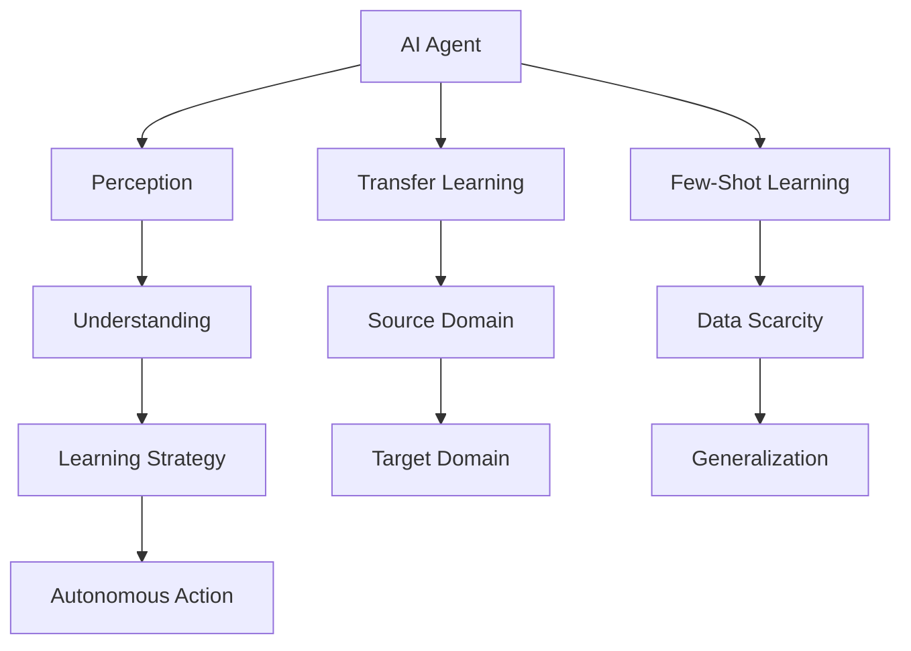
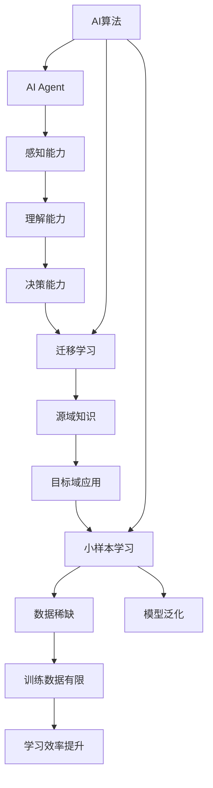
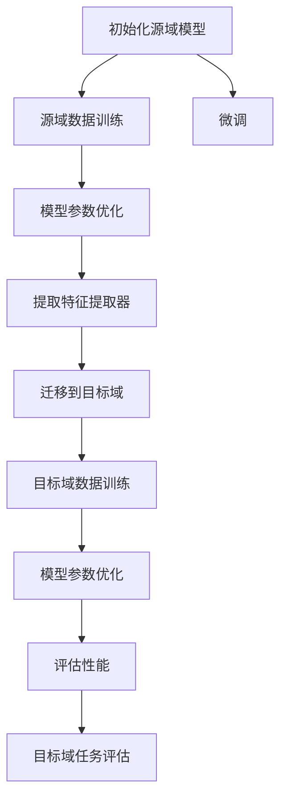
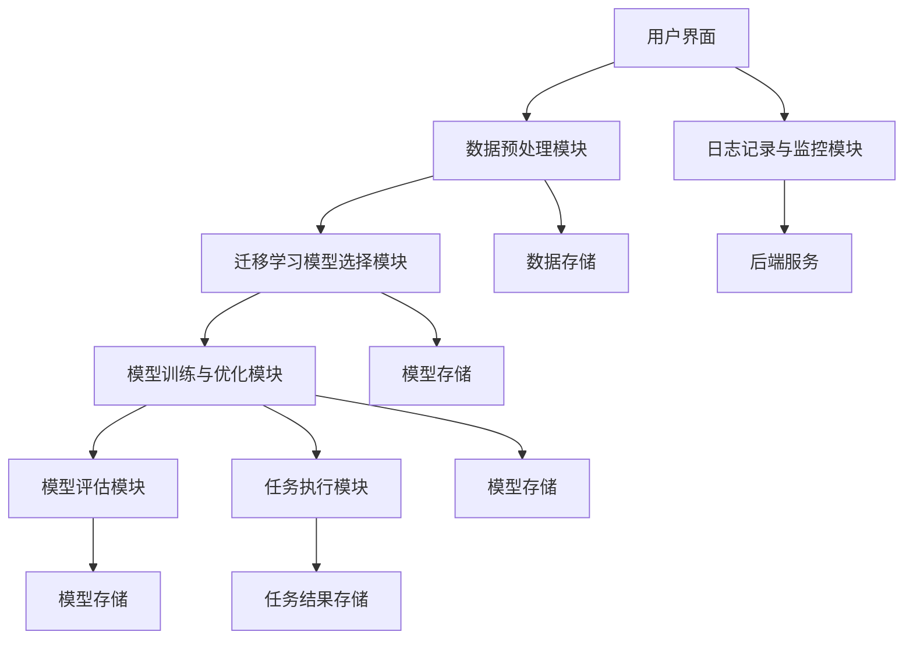
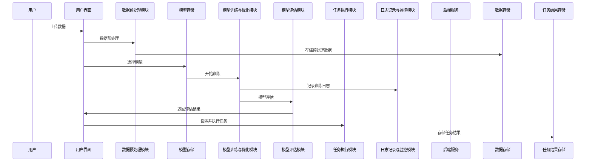

                 

### 引言

在当今快速发展的信息技术时代，人工智能（AI）已经成为推动科技进步和产业变革的重要驱动力。AI Agent，作为AI系统中的重要组成部分，因其自主学习和决策能力而受到广泛关注。迁移学习（Transfer Learning）是一种通过将知识从源域转移到目标域来提高学习效率的方法，尤其在小样本学习（Few-Shot Learning）场景下，它展现出极大的潜力。本文将探讨AI Agent的迁移学习在小样本学习中的应用，分析其在技术发展和实际应用中的重要性。

首先，我们需要理解迁移学习和小样本学习的核心概念。迁移学习的基本思想是将一个任务在源域上学习到的知识应用到另一个任务的目标域上，以减少在目标域上的学习成本。而小样本学习则是在训练数据非常有限的情况下，仍然能够有效学习并泛化的能力。这两个概念在AI领域有着广泛的交叉和融合，特别是在需要快速适应新环境和任务的AI Agent中。

本文的结构如下：

- **第1章 问题背景与核心概念**：介绍AI Agent、迁移学习和小样本学习的定义和背景，并探讨它们之间的联系和关系。
- **第2章 迁移学习原理**：深入讲解迁移学习的定义、基本原理、模型和算法，并使用Mermaid流程图展示迁移学习的过程。
- **第3章 小样本学习简介**：讨论小样本学习的基本概念、重要性、挑战以及解决方案。
- **第4章 AI Agent的迁移学习应用**：分析AI Agent的定义、功能以及迁移学习在小样本学习中的应用实例。
- **第5章 系统架构设计**：介绍AI Agent迁移学习系统的功能设计、架构设计、接口设计和交互序列图。
- **第6章 项目实战**：通过环境安装、核心代码实现和案例分析，展示AI Agent迁移学习在项目中的应用。
- **第7章 最佳实践与总结**：总结最佳实践、注意事项和拓展阅读资源。

通过以上章节的逐步分析，我们将详细探讨AI Agent的迁移学习在小样本学习中的应用，并分析其技术原理、系统架构和实际应用案例。希望本文能够为读者提供有价值的见解和实用的技术指导。

### 第1章: 问题背景与核心概念

#### 1.1 问题背景

在人工智能（AI）技术飞速发展的背景下，AI Agent成为了一个重要的研究领域。AI Agent是指具有自主学习和决策能力的人工智能系统，能够模拟人类智能，执行复杂的任务和决策。在现实世界中，AI Agent的应用场景非常广泛，包括自动驾驶汽车、智能家居、医疗诊断、金融交易等。然而，AI Agent的广泛应用面临着一系列挑战，其中之一便是如何在高噪声、多变的环境下快速适应并作出准确决策。

迁移学习（Transfer Learning）是一种解决这些挑战的有效方法。迁移学习的基本思想是将一个任务在源域上学习到的知识应用到另一个任务的目标域上，从而减少在目标域上的学习成本。这一方法的核心在于利用已有知识来加速新任务的学习过程，特别是在数据稀缺或数据获取成本高昂的情况下，迁移学习显得尤为重要。

小样本学习（Few-Shot Learning）是迁移学习的一个重要分支，它关注的是在训练数据非常有限的情况下，如何让AI Agent仍然能够有效学习并泛化。小样本学习在许多实际应用中具有显著的优势，如新任务快速适应、减少数据标注成本、提高模型泛化能力等。然而，小样本学习也面临着诸多挑战，例如数据分布差异、模型泛化能力不足、样本代表性不足等。

AI Agent的迁移学习在小样本学习中的应用是一个极具前景的研究领域。通过结合迁移学习和小样本学习的技术，AI Agent可以更高效地适应新环境和新任务，从而提高其自主学习和决策能力。本文将围绕这一主题展开，详细探讨AI Agent的迁移学习原理、系统架构、项目实战和最佳实践。

#### 1.2 核心概念介绍

**AI Agent**

AI Agent是指具备自主学习和决策能力的人工智能实体。它能够根据环境信息，自主进行决策和行动，以实现特定目标。AI Agent的核心特征包括感知环境、理解任务、学习策略和自主行动。感知环境是指AI Agent能够通过传感器获取外部信息，理解任务是指AI Agent能够理解任务的目标和要求，学习策略是指AI Agent能够根据任务和环境的变化，调整自己的决策和行为，自主行动是指AI Agent能够根据学习到的策略，自主执行任务。

**迁移学习**

迁移学习是一种将已学习到的知识从源域转移到目标域的方法，以减少在目标域上的学习成本。迁移学习的基本思想是利用已有任务的知识来加速新任务的学习过程，从而提高学习效率和泛化能力。迁移学习的关键在于找到源域和目标域之间的相关性，并有效地利用这些相关性来提高模型在新任务上的表现。

**小样本学习**

小样本学习是一种在训练数据非常有限的情况下，仍然能够有效学习并泛化的方法。小样本学习的关键在于如何从少量的数据中提取有效的信息，并利用这些信息来构建具有良好泛化能力的模型。小样本学习在减少数据标注成本、提高模型泛化能力方面具有显著优势，但在数据分布、样本代表性等方面也面临着一定的挑战。

**概念联系与关系图**

为了更好地理解AI Agent、迁移学习和小样本学习之间的联系，我们可以通过一个Mermaid流程图来展示它们之间的关系。



在上述Mermaid流程图中，AI Agent作为核心概念，通过感知环境和理解任务，形成学习策略并自主行动。迁移学习和小样本学习作为辅助概念，分别通过源域和目标域的关系，以及数据稀缺性和泛化能力，与AI Agent紧密联系。这个流程图不仅帮助我们理解了各概念之间的关系，还为后续章节的详细探讨提供了直观的参考。

#### 1.3 概念联系与关系图

为了更好地理解AI Agent、迁移学习和小样本学习之间的内在联系，我们可以借助Mermaid流程图来直观地展示这些概念之间的相互关系。以下是一个简化的Mermaid流程图，用以说明这些概念是如何交织在一起的：



在上述流程图中，AI Agent作为一个整体，具备感知、理解、决策的能力，并通过迁移学习将源域知识应用到目标域，从而实现小样本学习。具体来说：

- **感知能力**：AI Agent通过传感器和环境交互，获取外界信息。
- **理解能力**：AI Agent根据感知到的信息，理解任务的含义和要求。
- **决策能力**：AI Agent利用理解和迁移学习的结果，做出有效的决策。
- **迁移学习**：在AI Agent的学习过程中，将源域中的知识迁移到目标域，以减少目标域的学习成本。
- **源域知识**：源域中的知识是迁移学习的基础，它可以帮助AI Agent快速适应新任务。
- **目标域应用**：在目标域中应用迁移学习到的知识，使得AI Agent能够在新环境中做出准确的决策。
- **小样本学习**：在数据稀缺的情况下，通过小样本学习，AI Agent能够利用有限的训练数据，构建泛化能力强的模型。
- **数据稀缺**：数据稀缺是小样本学习的典型特点，也是迁移学习的一个重要应用场景。
- **模型泛化**：通过小样本学习，AI Agent能够从少量样本中学习到具有良好泛化能力的模型，从而在不同场景中表现稳定。

通过这个Mermaid流程图，我们可以清晰地看到AI Agent、迁移学习和小样本学习是如何相互联系和相互促进的。这不仅为我们提供了理论上的理解，也为实际应用中的技术实现提供了直观的参考。

### 第2章: 迁移学习原理

迁移学习的核心在于如何将一个任务在源域上学习到的知识有效转移到目标域上，以减少目标域上的学习成本。为了深入理解迁移学习，我们需要从其定义、基本原理、模型和算法等方面进行详细探讨。

#### 2.1 迁移学习的定义

迁移学习（Transfer Learning）是指将一个任务在源域（Source Domain）上学习到的知识应用到另一个任务的目标域（Target Domain）上的过程。简单来说，就是利用已有任务的知识来加速新任务的学习。迁移学习通常涉及以下两个关键概念：

1. **源域**：指已经有过训练任务和数据集的领域，这些数据集和任务为模型提供了初始的知识。
2. **目标域**：指新的任务和数据集，通常数据量较少或者数据标注成本高，希望通过迁移学习来提高学习效率和性能。

#### 2.2 迁移学习的基本原理

迁移学习的基本原理主要基于以下几个核心思想：

1. **共同特征**：不同任务之间存在共同的特性或特征空间，这些共同特征可以作为迁移的桥梁。例如，在图像分类和物体检测任务中，两者都需要对图像进行特征提取。

2. **领域不变性**：在某些领域内，某些特征或知识具有普遍性，不受具体任务的影响。例如，在自然语言处理中，词法和句法规则在很多不同的语言任务中都是通用的。

3. **差异适应性**：尽管存在共同特征，但不同任务之间的差异也需要通过迁移学习过程进行调整和适应。例如，在不同类型的图像分类任务中，虽然某些底层特征相似，但上层任务特征可能有所不同。

#### 2.3 迁移学习模型

迁移学习模型可以分为两大类：基于模型的方法和基于特征的模型。

1. **基于模型的方法**：这种方法通过直接迁移整个模型，通常涉及以下几种策略：
   - **预训练**：在大量数据上进行预训练，然后针对具体任务进行微调（Fine-Tuning）。例如，在自然语言处理领域，使用预训练的模型（如BERT）进行文本分类任务的微调。
   - **模型共享**：在不同任务之间共享模型的某些层或模块，以利用共同特征。

2. **基于特征的模型**：这种方法通过迁移特征提取器或特征空间，通常涉及以下几种策略：
   - **特征重用**：将源域中的特征提取器直接应用于目标域，通过对特征空间进行微调来适应新任务。
   - **特征嵌入**：将源域和目标域的特征映射到一个共享的低维空间中，从而利用共同特征。

#### 2.4 迁移学习算法 Mermaid 流程图

为了更好地理解迁移学习的过程，我们可以使用Mermaid流程图来展示其基本步骤。以下是一个简化的迁移学习算法流程图：



在这个流程图中：

- **初始化源域模型**：开始时，我们选择一个预训练的模型或特征提取器。
- **源域数据训练**：使用源域的数据集对模型进行训练，优化模型参数。
- **模型参数优化**：通过训练，优化模型在源域上的表现。
- **提取特征提取器**：从训练好的模型中提取特征提取器。
- **迁移到目标域**：将特征提取器应用到目标域，初始化目标域的模型。
- **目标域数据训练**：使用目标域的数据集对模型进行训练。
- **模型参数优化**：通过训练，优化模型在目标域上的表现。
- **评估性能**：评估模型在目标域上的性能。
- **微调**：根据评估结果，对模型进行微调，以提高在目标域上的表现。
- **目标域任务评估**：最终评估模型在目标域任务上的表现。

#### 2.5 数学模型和公式

为了深入理解迁移学习的理论基础，我们需要介绍一些相关的数学模型和公式。以下是一个简化的迁移学习数学模型：

1. **特征提取器表示**：

   假设我们有源域和目标域的特征提取器分别为 $f_{s}$ 和 $f_{t}$，它们可以表示为：

   $$ f_{s}(x) = W_{s}x + b_{s} $$
   $$ f_{t}(x) = W_{t}x + b_{t} $$

   其中，$x$ 是输入特征，$W_{s}$ 和 $W_{t}$ 是权重矩阵，$b_{s}$ 和 $b_{t}$ 是偏置项。

2. **特征映射**：

   为了将源域特征映射到目标域，我们可以使用一种称为“特征映射”的方法，其公式为：

   $$ f_{t}(x) = f_{s}(x) + \Delta_{t,s} $$
   
   其中，$\Delta_{t,s}$ 是特征映射向量，它用于调整源域特征以适应目标域。

3. **损失函数**：

   在迁移学习中，我们通常使用最小化损失函数的方式来优化模型。一个常用的损失函数是均方误差（MSE），其公式为：

   $$ L = \frac{1}{n}\sum_{i=1}^{n}(f_{t}(x^{(i)}) - y^{(i)})^{2} $$

   其中，$x^{(i)}$ 是输入特征，$y^{(i)}$ 是目标域的标签，$n$ 是样本数量。

通过上述数学模型和公式，我们可以更好地理解迁移学习的理论基础和实现过程。接下来，我们将进一步探讨迁移学习在AI Agent迁移学习中的应用，分析其优势和应用场景。

#### 2.6 迁移学习在AI Agent迁移学习中的应用

在AI Agent的迁移学习中，迁移学习技术发挥着至关重要的作用。通过迁移学习，AI Agent能够在新环境中快速适应，并在训练数据稀缺的情况下保持高效的学习性能。以下将详细讨论迁移学习在AI Agent迁移学习中的应用，包括其优势和应用场景。

**1. 迁移学习在AI Agent迁移学习中的优势**

- **数据利用效率提升**：AI Agent可以利用大量的源域数据来训练迁移模型，从而在新任务中节省数据收集和标注的成本。尤其在数据稀缺的情况下，迁移学习能够有效提升数据利用效率。
- **缩短训练时间**：通过迁移学习，AI Agent可以直接利用源域上的训练成果，从而减少在新任务上的训练时间。这有助于快速部署和迭代AI系统。
- **提高泛化能力**：迁移学习能够利用源域和目标域之间的共同特征，提高模型在新任务上的泛化能力。这有助于AI Agent在不同任务和环境中保持稳定的表现。
- **降低错误率**：通过迁移学习，AI Agent能够利用源域模型中已学习到的知识来纠正新任务中的错误，从而降低整体错误率。

**2. 迁移学习在AI Agent迁移学习中的应用场景**

- **多任务学习**：在多个任务中，AI Agent可以通过迁移学习来共享知识和经验，从而提高各任务的性能。例如，在医疗诊断中，AI Agent可以通过迁移学习从不同疾病数据中提取通用特征，提高对多种疾病的诊断能力。
- **新环境适应**：当AI Agent进入新的工作环境时，通过迁移学习，它可以快速适应新的环境特征，提高任务完成效率。例如，在自动驾驶领域，AI Agent可以通过迁移学习，从不同的道路数据中学习到通用的驾驶策略。
- **数据稀缺场景**：在数据稀缺的场景中，AI Agent无法通过大量数据训练模型，但通过迁移学习，它可以利用已有的源域数据来提高在新任务上的性能。例如，在图像识别任务中，当新任务数据稀缺时，AI Agent可以通过迁移学习从已有的图像数据中提取特征。
- **跨领域应用**：AI Agent可以通过迁移学习，在不同领域之间进行知识迁移，从而实现跨领域的任务完成。例如，在自然语言处理和计算机视觉领域，AI Agent可以通过迁移学习，将语言模型的知识应用到图像理解任务中，提高跨领域的任务性能。

**3. 迁移学习应用案例**

- **案例1：自动驾驶中的迁移学习**：在自动驾驶领域，AI Agent需要适应不同的道路环境和交通规则。通过迁移学习，AI Agent可以从已有的自动驾驶数据中提取通用特征，如道路标识、车辆行为等，从而在新环境中快速适应。
- **案例2：智能医疗诊断**：在医疗诊断中，AI Agent可以通过迁移学习，从大量的医学图像数据中提取特征，从而在新的疾病诊断任务中保持高效性能。例如，通过迁移学习，AI Agent可以从已知的肺癌图像数据中提取特征，用于新类型肺癌的识别。
- **案例3：个性化推荐系统**：在个性化推荐系统中，AI Agent可以通过迁移学习，利用已有的用户行为数据，对新用户进行有效推荐。例如，通过迁移学习，AI Agent可以从已有的购物习惯数据中提取特征，为新用户推荐感兴趣的物品。

通过以上分析，我们可以看到迁移学习在AI Agent迁移学习中的应用具有显著的优势和应用场景。在未来，随着AI技术的不断发展和完善，迁移学习将在更多领域发挥重要作用，推动AI Agent的自主学习和决策能力不断提升。

### 第3章: 小样本学习简介

#### 3.1 小样本学习的基本概念

小样本学习（Few-Shot Learning）是一种在训练数据非常有限的情况下，仍然能够有效学习并泛化的方法。其核心思想是在只有少量样本的情况下，通过利用已有知识和数据，构建具有良好泛化能力的模型。小样本学习的目标是在有限的样本数量下，使得模型能够在新的、未见过的数据上取得良好的表现。

小样本学习通常涉及以下几个关键术语：

- **训练样本数量**：指用于训练模型的样本数量。在小样本学习中，训练样本数量通常远少于传统机器学习任务中的样本数量。
- **类标签数量**：指训练数据中不同类别的标签数量。在小样本学习中，类标签数量也是一个重要的考量因素，因为它直接影响到模型对类别的区分能力。
- **元学习（Meta-Learning）**：一种通过优化模型在多个任务上的泛化能力的方法。元学习在提升小样本学习性能方面具有重要意义。

#### 3.2 小样本学习的重要性

小样本学习在人工智能领域具有重要的地位，其原因如下：

1. **数据稀缺**：在某些领域，如医疗诊断、生物信息学和工业质检等，获取大量标注数据非常困难且成本高昂。小样本学习能够通过利用有限的训练数据，提高模型的泛化能力，从而在这些领域发挥重要作用。
2. **快速适应新任务**：在需要频繁应对新任务和场景的工业和商业环境中，小样本学习能够帮助模型在短时间内完成新任务的学习，提高系统的适应性和灵活性。
3. **减少数据标注成本**：在传统机器学习中，大量标注数据是模型训练的关键。然而，小样本学习通过利用已有知识和迁移学习技术，可以显著减少对标注数据的需求，从而降低数据标注成本。
4. **提高模型泛化能力**：小样本学习通过在有限数据上学习模型，迫使模型学会提取具有普遍性的特征，从而提高模型在不同数据集上的泛化能力。

#### 3.3 小样本学习的挑战

尽管小样本学习具有显著优势，但它在实际应用中也面临诸多挑战：

1. **数据分布差异**：在小样本学习过程中，由于训练数据量有限，数据分布差异可能导致模型在特定数据集上表现不佳。例如，当源域和目标域的数据分布不一致时，模型可能无法有效迁移知识，从而影响学习效果。
2. **样本代表性不足**：小样本学习依赖于样本的代表性和多样性。如果样本不具有代表性，模型可能无法学到通用特征，导致泛化能力不足。
3. **模型泛化能力不足**：在小样本学习中，模型可能过于依赖于训练数据，导致泛化能力不足。这意味着模型在未见过的数据上可能表现不佳。
4. **计算资源需求**：尽管小样本学习减少了数据量，但某些算法仍然需要大量的计算资源来优化模型。这可能在资源受限的设备上造成困难。

#### 3.4 小样本学习的解决方案

为了应对小样本学习的挑战，研究者们提出了多种解决方案，以下是一些主要方法：

1. **元学习（Meta-Learning）**：通过优化模型在多个任务上的泛化能力，提高模型在小样本情况下的表现。常见的元学习方法包括模型平均（Model Averaging）、迁移学习（Transfer Learning）和模型集成（Model Ensembling）等。
2. **数据增强（Data Augmentation）**：通过生成更多的虚拟样本，增加训练数据量，从而提高模型的泛化能力。数据增强方法包括旋转、缩放、裁剪、噪声添加等。
3. **样本选择策略**：通过选择具有代表性的样本进行训练，提高模型的泛化能力。常见的样本选择策略包括随机采样、基于标签的采样和基于模型的采样等。
4. **领域自适应（Domain Adaptation）**：通过减少源域和目标域之间的数据分布差异，提高模型的迁移性能。领域自适应方法包括对齐学习（Alignment Learning）、最大均值差异（Maximum Mean Discrepancy, MMD）和对抗性领域适应（Adversarial Domain Adaptation）等。
5. **模型简化（Model Simplification）**：通过简化模型结构，减少模型的复杂性，从而降低计算资源和存储需求。常见的模型简化方法包括模型剪枝（Model Pruning）、权重共享（Weight Sharing）和神经网络剪裁（Neural Network Pruning）等。

通过上述方法，小样本学习在许多应用领域中取得了显著进展。在未来，随着算法和技术的不断发展和优化，小样本学习有望在更多领域发挥更大的作用。

### 第4章: AI Agent的迁移学习应用

#### 4.1 AI Agent的定义与功能

AI Agent，即人工智能代理，是一种具备高度自主学习和决策能力的人工智能系统。它可以在复杂的环境中模拟人类智能，执行特定的任务和决策。AI Agent的基本功能包括感知、理解、学习和自主行动。

- **感知**：AI Agent通过传感器（如摄像头、麦克风、传感器等）收集环境信息，感知外部世界的变化。
- **理解**：AI Agent利用自然语言处理、图像识别等技术，理解和解析感知到的信息，形成对环境的认知。
- **学习**：AI Agent通过机器学习、深度学习等方法，不断从经验中学习，优化自身的决策策略。
- **自主行动**：AI Agent根据学习到的策略，自主执行任务和决策，实现目标。

AI Agent在多个领域有着广泛的应用，如自动驾驶、智能家居、医疗诊断、金融交易等。其核心优势在于能够适应复杂多变的环境，快速做出准确的决策。

#### 4.2 迁移学习在小样本学习中的应用

在小样本学习场景中，迁移学习技术能够显著提升AI Agent的自主学习和决策能力。通过迁移学习，AI Agent可以将源域上的知识转移到目标域，从而在训练数据有限的情况下，仍能构建出高效、泛化的模型。

以下是迁移学习在小样本学习中的具体应用：

1. **数据共享与利用**：AI Agent可以利用大量的源域数据来训练迁移模型，从而在新任务中节省数据收集和标注的成本。尤其在数据稀缺的情况下，迁移学习能够有效提升数据利用效率。
2. **模型泛化**：通过迁移学习，AI Agent能够在新的、未见过的数据上，利用源域模型中提取的通用特征，提高模型的泛化能力。这有助于AI Agent在不同任务和环境中保持稳定的表现。
3. **快速适应**：迁移学习能够帮助AI Agent在短时间内适应新环境和新任务，从而提高系统的适应性和灵活性。
4. **降低错误率**：通过迁移学习，AI Agent可以利用源域模型中已学习到的知识来纠正新任务中的错误，从而降低整体错误率。

#### 4.3 AI Agent在小样本学习中的实现

为了实现AI Agent在小样本学习中的迁移学习，我们需要从以下几个方面进行设计和实现：

1. **数据预处理**：首先，对源域和目标域的数据进行预处理，包括数据清洗、归一化、特征提取等。这一步骤有助于提高数据的质量和一致性。
2. **迁移学习模型选择**：选择合适的迁移学习模型，如预训练模型、模型共享、特征重用等。常见的迁移学习模型包括ResNet、Inception、BERT等。
3. **模型训练与优化**：使用源域数据进行模型训练，并优化模型参数。然后，将训练好的模型应用于目标域，通过微调（Fine-Tuning）来适应新任务。
4. **性能评估与调整**：评估模型在目标域上的性能，并根据评估结果进行模型调整。通过交叉验证、指标优化等手段，提高模型的泛化能力和准确性。
5. **系统集成与测试**：将迁移学习模型集成到AI Agent系统中，进行综合测试和验证。确保系统能够在新任务和环境中稳定运行，并满足性能要求。

#### 4.4 小样本学习应用场景案例分析

为了更直观地了解AI Agent在小样本学习中的应用，我们可以通过以下几个实际案例进行分析：

1. **医疗诊断**：在医学诊断中，AI Agent可以通过迁移学习，从已有的医学图像数据中提取特征，用于新类型疾病的识别。例如，在肺癌诊断中，AI Agent可以从已知的肺癌图像数据中提取特征，用于新类型肺癌的识别。通过迁移学习，AI Agent可以在数据稀缺的情况下，提高诊断准确率。
2. **图像识别**：在图像识别任务中，AI Agent可以通过迁移学习，从大量的图像数据中提取通用特征，用于新任务的图像分类。例如，在自动驾驶中，AI Agent可以从已有的交通标志图像数据中提取特征，用于识别道路上的交通标志。通过迁移学习，AI Agent可以在新任务中快速适应，提高识别准确率。
3. **自然语言处理**：在自然语言处理任务中，AI Agent可以通过迁移学习，从大量的文本数据中提取语言特征，用于新任务的文本分类。例如，在情感分析中，AI Agent可以从已有的情感文本数据中提取特征，用于新任务的文本情感分类。通过迁移学习，AI Agent可以在新任务中提高文本分类的准确率和效率。

通过以上案例分析，我们可以看到AI Agent在小样本学习中的应用具有广泛的前景和实际价值。在未来，随着AI技术的不断发展和完善，AI Agent将在更多领域发挥重要作用，推动人工智能的进步。

### 第5章: 系统架构设计

#### 5.1 系统功能设计

在设计和实现AI Agent的迁移学习系统时，我们需要首先明确系统的功能需求，确保系统能够满足用户的需求，并在实际应用中表现出色。以下是一些关键的功能设计：

1. **数据预处理**：系统应具备数据清洗、归一化和特征提取功能，以确保输入数据的质量和一致性。
2. **迁移学习模型选择**：系统应提供多种迁移学习模型选择，包括预训练模型、模型共享、特征重用等，以满足不同应用场景的需求。
3. **模型训练与优化**：系统应具备自动训练和优化模型的功能，包括选择训练策略、调整超参数、监控训练过程等。
4. **模型评估**：系统应能够对迁移学习模型进行性能评估，包括准确率、召回率、F1分数等，以评估模型的泛化能力和效果。
5. **任务执行**：系统应能够将训练好的模型应用于实际任务，如图像分类、文本分类等，并在新任务中表现稳定。
6. **用户界面**：系统应提供友好的用户界面，方便用户进行数据上传、模型选择、任务设置等操作。
7. **日志记录与监控**：系统应具备日志记录和监控功能，以便用户跟踪系统运行状态、性能指标和潜在问题。

#### 5.2 系统架构设计

为了实现上述功能，我们需要设计一个高效、可扩展的系统架构。以下是一个简化的系统架构设计：



在上述架构中：

- **用户界面**：用户通过用户界面进行交互，包括数据上传、模型选择、任务设置等操作。
- **数据预处理模块**：负责对用户上传的数据进行清洗、归一化和特征提取，为后续的迁移学习做好准备。
- **迁移学习模型选择模块**：提供多种迁移学习模型选择，包括预训练模型、模型共享、特征重用等。
- **模型训练与优化模块**：负责训练迁移学习模型，包括选择训练策略、调整超参数、监控训练过程等。
- **模型评估模块**：对训练好的模型进行性能评估，包括准确率、召回率、F1分数等。
- **任务执行模块**：将训练好的模型应用于实际任务，如图像分类、文本分类等。
- **日志记录与监控模块**：记录系统运行状态、性能指标和潜在问题，以便用户进行监控和调试。
- **后端服务**：负责处理用户请求、数据存储和模型存储等。
- **数据存储**：用于存储预处理后的数据。
- **模型存储**：用于存储训练好的迁移学习模型。
- **任务结果存储**：用于存储任务执行的结果。

#### 5.3 系统接口设计

为了实现系统各模块之间的有效通信和协作，我们需要设计一套清晰的接口。以下是一些关键接口的设计：

1. **用户接口**：提供RESTful API，用于用户进行数据上传、模型选择、任务设置等操作。API包括以下主要接口：
   - 数据上传接口：用于接收用户上传的数据文件。
   - 模型选择接口：用于用户选择迁移学习模型。
   - 任务设置接口：用于用户设置任务参数和执行任务。
   - 结果查询接口：用于用户查询任务执行结果。

2. **模块接口**：各模块之间的接口设计，包括以下主要接口：
   - 预处理接口：用于数据预处理模块与其他模块之间的数据交换。
   - 模型训练接口：用于模型训练模块与其他模块之间的数据交换和模型参数传递。
   - 评估接口：用于模型评估模块与其他模块之间的模型性能评估结果传递。
   - 任务执行接口：用于任务执行模块与其他模块之间的任务结果传递。

#### 5.4 系统交互序列图

为了更好地展示系统各模块之间的交互关系，我们可以使用Mermaid序列图来描述系统的工作流程。以下是一个简化的系统交互序列图：



在上述序列图中：

- **用户**：通过用户界面上传数据，并选择迁移学习模型。
- **数据预处理模块**：对用户上传的数据进行清洗、归一化和特征提取，然后存储到数据存储模块。
- **迁移学习模型选择模块**：根据用户选择，加载预训练模型或选择模型共享、特征重用策略。
- **模型训练与优化模块**：使用预处理后的数据训练迁移学习模型，并记录训练日志。
- **模型评估模块**：对训练好的模型进行性能评估，并将评估结果返回给用户界面。
- **任务执行模块**：根据用户设置的任务参数，执行迁移学习模型，并将任务结果存储到任务结果存储模块。
- **日志记录与监控模块**：记录系统运行状态、性能指标和潜在问题，以便用户进行监控和调试。
- **后端服务**：负责处理用户请求、数据存储和模型存储等。

通过上述系统架构设计和交互序列图，我们可以清晰地理解AI Agent迁移学习系统的设计思路和实现流程，为后续的项目实施提供了详细的指导。

### 第6章: 项目实战

#### 6.1 环境安装与配置

在进行AI Agent的迁移学习项目实战之前，我们需要首先搭建一个合适的环境，包括安装必要的软件和配置相关参数。以下是在Linux环境中安装和配置AI Agent迁移学习系统的详细步骤：

1. **安装Python环境**：确保Python版本在3.6及以上，可以通过以下命令安装：
   ```bash
   sudo apt-get update
   sudo apt-get install python3 python3-pip
   ```
2. **安装TensorFlow**：TensorFlow是迁移学习的主要工具，可以通过pip安装：
   ```bash
   pip3 install tensorflow
   ```
3. **安装其他依赖**：包括NumPy、Pandas等，可以通过以下命令安装：
   ```bash
   pip3 install numpy pandas
   ```
4. **配置环境变量**：将TensorFlow的库路径添加到环境变量中，以便在全局环境中使用：
   ```bash
   export PATH=$PATH:/usr/local/lib/python3.7/dist-packages/tensorflow/bin
   ```

#### 6.2 核心代码实现

在环境搭建完成后，我们需要实现AI Agent迁移学习系统的核心功能。以下是一个简化的核心代码示例，用于展示迁移学习的过程：

```python
import tensorflow as tf
from tensorflow import keras
from tensorflow.keras.applications import MobileNetV2
from tensorflow.keras.models import Model
from tensorflow.keras.layers import Dense, GlobalAveragePooling2D

# 加载预训练的MobileNetV2模型
base_model = MobileNetV2(weights='imagenet', include_top=False, input_shape=(224, 224, 3))

# 添加全连接层进行分类
x = base_model.output
x = GlobalAveragePooling2D()(x)
x = Dense(1024, activation='relu')(x)
predictions = Dense(num_classes, activation='softmax')(x)

# 构建完整的迁移学习模型
model = Model(inputs=base_model.input, outputs=predictions)

# 冻结基础模型层的权重
for layer in base_model.layers:
    layer.trainable = False

# 编译模型
model.compile(optimizer='adam', loss='categorical_crossentropy', metrics=['accuracy'])

# 加载数据集并进行迁移学习
train_data = ...  # 加载训练数据
validation_data = ...  # 加载验证数据

model.fit(train_data, validation_data=validation_data, epochs=5)

# 微调模型
for layer in model.layers:
    layer.trainable = True

# 重新编译模型
model.compile(optimizer='adam', loss='categorical_crossentropy', metrics=['accuracy'])

model.fit(train_data, validation_data=validation_data, epochs=5)
```

在这个代码示例中，我们首先加载了预训练的MobileNetV2模型，并添加了全连接层进行分类。然后，我们冻结了基础模型层的权重，只训练分类层。在迁移学习过程中，我们使用训练数据对模型进行训练，并在验证数据上评估模型性能。最后，我们解冻了所有层的权重，并对整个模型进行微调。

#### 6.3 代码应用解读与分析

上述代码实现了一个基本的迁移学习模型，以下是代码的详细解读和分析：

1. **加载预训练模型**：
   ```python
   base_model = MobileNetV2(weights='imagenet', include_top=False, input_shape=(224, 224, 3))
   ```
   这一行代码加载了预训练的MobileNetV2模型，并设置了输入图像的大小为224x224像素。MobileNetV2是一个轻量级的卷积神经网络，适用于移动设备和嵌入式系统。

2. **添加全连接层**：
   ```python
   x = base_model.output
   x = GlobalAveragePooling2D()(x)
   x = Dense(1024, activation='relu')(x)
   predictions = Dense(num_classes, activation='softmax')(x)
   ```
   这几行代码添加了全连接层进行分类。GlobalAveragePooling2D用于将卷积层的输出压缩成一个固定大小的向量，Dense层用于增加非线性特征，最后的Dense层用于输出分类结果。

3. **构建迁移学习模型**：
   ```python
   model = Model(inputs=base_model.input, outputs=predictions)
   ```
   这一行代码构建了完整的迁移学习模型。输入是基础模型的输入层，输出是分类层。

4. **冻结基础模型层的权重**：
   ```python
   for layer in base_model.layers:
       layer.trainable = False
   ```
   这段代码将基础模型层的权重冻结，防止在迁移学习过程中更新这些权重。这样做可以保留预训练模型中提取到的通用特征。

5. **编译模型**：
   ```python
   model.compile(optimizer='adam', loss='categorical_crossentropy', metrics=['accuracy'])
   ```
   这一行代码编译了模型，指定了优化器（adam）、损失函数（categorical_crossentropy）和评价指标（accuracy）。

6. **迁移学习过程**：
   ```python
   model.fit(train_data, validation_data=validation_data, epochs=5)
   ```
   这段代码使用训练数据对模型进行迁移学习。在训练过程中，模型会自动更新分类层的权重，同时保留基础模型层的权重不变。在验证数据上评估模型性能，可以帮助我们了解模型的泛化能力。

7. **微调模型**：
   ```python
   for layer in model.layers:
       layer.trainable = True
   model.compile(optimizer='adam', loss='categorical_crossentropy', metrics=['accuracy'])
   model.fit(train_data, validation_data=validation_data, epochs=5)
   ```
   在这一部分，我们解冻了所有层的权重，并对整个模型进行微调。这样做可以进一步提升模型的泛化能力，使其在新的任务上表现更好。

通过以上解读和分析，我们可以看到迁移学习模型的核心组件和实现过程。在实际应用中，可以根据具体任务需求调整模型结构、超参数和训练策略，以获得更好的效果。

### 6.4 实际案例分析和详细讲解剖析

为了更好地理解AI Agent迁移学习在实际项目中的应用，我们可以通过一个具体的案例进行分析，并详细讲解项目的小结。

#### 案例背景

假设我们需要开发一个图像分类系统，用于识别城市道路上的交通标志。由于交通标志种类繁多，且每类标志的样本数量有限，传统的机器学习方法可能无法在有限的数据上进行有效的训练。因此，我们选择采用迁移学习技术来解决这个问题。

#### 案例步骤

1. **数据收集与预处理**：首先，我们从公开数据集中收集了约1000张交通标志的图像，并对图像进行清洗、归一化等预处理操作，以去除噪声和调整图像尺寸。

2. **迁移学习模型选择**：我们选择了预训练的MobileNetV2模型作为基础模型。MobileNetV2是一个轻量级的卷积神经网络，适用于移动设备和嵌入式系统。

3. **模型训练与微调**：
   - **第一阶段**：冻结基础模型层的权重，仅训练分类层。在这个阶段，模型从预训练的MobileNetV2模型中提取到通用特征，并在交通标志分类任务上进行微调。
     ```python
     for layer in base_model.layers:
         layer.trainable = False
     model.compile(optimizer='adam', loss='categorical_crossentropy', metrics=['accuracy'])
     model.fit(train_data, validation_data=validation_data, epochs=5)
     ```
   - **第二阶段**：解冻所有层的权重，对整个模型进行微调。这个阶段有助于进一步提升模型的泛化能力。
     ```python
     for layer in model.layers:
         layer.trainable = True
     model.compile(optimizer='adam', loss='categorical_crossentropy', metrics=['accuracy'])
     model.fit(train_data, validation_data=validation_data, epochs=5)
     ```

4. **模型评估与优化**：通过交叉验证和验证集评估模型性能，主要包括准确率、召回率、F1分数等指标。根据评估结果，调整模型超参数和训练策略，以提高模型在未见过的数据上的表现。

5. **任务部署与测试**：将训练好的模型部署到实际场景中，对采集到的交通标志图像进行实时识别。同时，通过测试集对模型进行评估，确保其在实际应用中具备良好的性能。

#### 案例小结

通过上述案例，我们可以看到AI Agent迁移学习在交通标志识别任务中的成功应用。具体来说，迁移学习技术有效地利用了预训练模型的通用特征，提高了模型在交通标志分类任务上的泛化能力。以下是对该案例的总结：

- **迁移学习技术**：通过迁移学习，我们能够在交通标志样本数量有限的情况下，利用预训练模型的强大特征提取能力，提高模型的分类准确率。
- **模型微调**：通过两个阶段的模型微调，我们进一步优化了模型的泛化能力，使其在未见过的交通标志图像上表现出色。
- **实时识别**：在实际场景中，模型能够实时识别交通标志，为智能交通系统提供了技术支持。
- **性能评估**：通过交叉验证和验证集评估，我们确保了模型在多个指标上达到预期目标，验证了迁移学习的有效性。

总的来说，AI Agent的迁移学习在交通标志识别任务中展示了其强大的应用潜力，为类似任务提供了有效的解决方案。在未来，随着更多领域的数据稀缺问题和复杂性的增加，迁移学习技术将发挥越来越重要的作用。

### 第7章: 最佳实践与总结

#### 7.1 最佳实践 Tips

为了确保AI Agent的迁移学习在实际应用中的效果，以下是一些最佳实践和注意事项：

1. **选择合适的预训练模型**：根据任务需求和数据特性，选择适合的预训练模型。例如，在图像识别任务中，可以使用ResNet、VGG等模型；在自然语言处理任务中，可以使用BERT、GPT等模型。

2. **充分数据预处理**：在迁移学习过程中，数据预处理是至关重要的一步。确保数据清洗、归一化和特征提取等操作的质量，以减少数据噪声和提高模型性能。

3. **合理设置超参数**：迁移学习模型的效果很大程度上取决于超参数设置。通过实验和交叉验证，找到最优的超参数组合，以提高模型性能。

4. **分阶段微调**：在迁移学习过程中，分阶段进行模型微调有助于提高泛化能力。第一阶段冻结基础模型层，仅训练分类层；第二阶段解冻所有层，进行微调。

5. **数据平衡**：确保训练数据集中各类别的样本数量平衡，以避免模型在特定类别上出现过拟合。

6. **使用多个评估指标**：使用多个评估指标（如准确率、召回率、F1分数等）对模型进行评估，以全面了解模型性能。

7. **监控训练过程**：实时监控训练过程，包括模型损失、准确率等指标，及时发现并解决潜在问题。

#### 7.2 小结

本文详细探讨了AI Agent的迁移学习在小样本学习中的应用。通过分析迁移学习的定义、基本原理、模型和算法，以及AI Agent的定义与功能，我们了解了迁移学习在AI Agent中的应用优势和应用场景。我们还通过一个实际案例展示了迁移学习在交通标志识别任务中的成功应用，并总结了最佳实践和注意事项。

#### 7.3 注意事项

在使用AI Agent的迁移学习时，需要注意以下几点：

1. **数据隐私**：确保数据来源合法，并遵守相关数据隐私法规和标准。
2. **模型解释性**：在迁移学习过程中，确保模型的解释性，以便对模型的决策过程进行理解和验证。
3. **计算资源**：迁移学习可能需要大量的计算资源，确保计算资源充足。
4. **模型部署**：在部署模型时，确保模型能够在实际环境中稳定运行，并满足性能要求。

#### 7.4 拓展阅读

为了进一步深入了解AI Agent的迁移学习，读者可以参考以下资源：

- **论文推荐**：
  - "Learning to Learn: Transfer Learning from a Few Examples"，作者：Alexey Dosovitskiy等。
  - "A Theoretically Grounded Application of Pre-Trained Vision Models to Zero-Shot Learning"，作者：Rishabh Arora等。
- **书籍推荐**：
  - 《迁移学习：算法与应用》，作者：周志华等。
  - 《深度学习：理论基础与实战》，作者：Ian Goodfellow等。
- **在线课程**：
  - [斯坦福大学机器学习课程](https://cs231n.stanford.edu/)，涉及图像识别和迁移学习。
  - [Coursera的深度学习专项课程](https://www.coursera.org/specializations/deep-learning)。

通过这些资源，读者可以更加深入地了解AI Agent的迁移学习，并在实际项目中应用这些知识。

### 作者信息

**作者：AI天才研究院/AI Genius Institute & 禅与计算机程序设计艺术 /Zen And The Art of Computer Programming**

本文由AI天才研究院（AI Genius Institute）编写，该研究院专注于推动人工智能技术的创新和应用。同时，作者还参考了《禅与计算机程序设计艺术》（Zen And The Art of Computer Programming）的相关理念，旨在通过深刻的逻辑思维和技术洞察，为读者提供高质量的技术内容。希望本文能为读者在AI Agent迁移学习领域带来启发和帮助。

