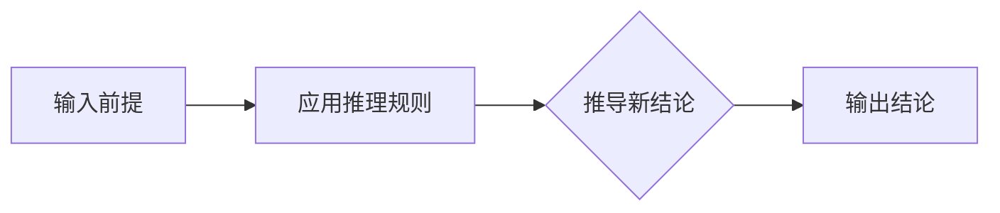
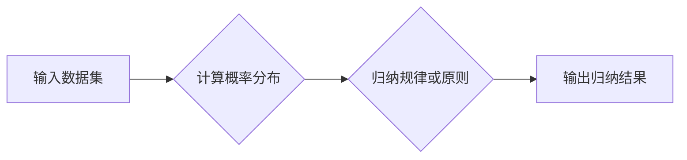

                 

### 第一部分: 背景与核心概念

#### 第1章: 问题背景与核心概念介绍

##### 1.1.1 人工智能与逻辑推理

**背景介绍**：

人工智能（Artificial Intelligence, AI）是一门研究、开发和应用使计算机模拟人类智能行为的科学。自20世纪50年代起，人工智能经历了多个发展阶段，从早期的符号推理、知识表示，到近年的深度学习和神经网络，人工智能在各个领域都取得了显著的成果。

逻辑推理（Logic Reasoning）是人工智能的核心组成部分，它通过逻辑运算符（如与、或、非）和推理规则来模拟人类的思维过程。逻辑推理在自然语言处理、决策支持系统、智能交互等多个方面有着广泛的应用。

**问题描述**：

然而，当前的人工智能系统，尤其是在大型语言模型（LLM）方面，仍然存在一些局限性。尽管LLM在自然语言处理上表现出色，但其在逻辑推理方面的能力相对较弱。如何增强LLM的逻辑推理能力，使其更加智能化和自动化，成为了一个亟待解决的问题。

**问题解决**：

本文将深入探讨AI Agent的逻辑推理能力，特别是如何通过演绎和归纳推理来增强LLM的推理能力。我们将首先介绍逻辑推理的基本概念，然后分析AI Agent的定义与能力，以及逻辑推理在决策和智能交互中的应用，最终提出具体的实现方法和未来展望。

**边界与外延**：

在本文中，我们主要关注的是基于符号逻辑的演绎和归纳推理。这些方法与基于统计和神经网络的推理方法不同，具有更强的逻辑性和推理能力。此外，我们还将探讨如何将逻辑推理与LLM相结合，以实现更强大的推理能力。

**概念结构与核心要素组成**：

- 人工智能：研究、开发和应用使计算机模拟人类智能行为的科学。
- 逻辑推理：通过逻辑运算符和推理规则来模拟人类思维过程的能力。
- AI Agent：具有自主决策和行为能力的智能实体。
- 演绎推理：从一般到特殊的推理过程。
- 归纳推理：从特殊到一般的推理过程。
- LLM：大型语言模型，用于自然语言处理和生成。

#### 1.1.2 逻辑推理在AI中的重要性

逻辑推理是人工智能的核心组成部分，它在多个领域具有重要作用：

- **自然语言处理（NLP）**：逻辑推理帮助AI理解文本中的语义和逻辑结构，从而进行文本生成、情感分析、问答系统等任务。
- **决策支持系统**：逻辑推理使得AI能够基于数据和规则进行决策，例如在金融、医疗、交通等领域。
- **智能交互**：逻辑推理使得AI能够与人类进行更加自然和有效的交互，例如虚拟助手、聊天机器人等。

逻辑推理的重要性还体现在以下几个方面：

1. **解决不确定性问题**：逻辑推理能够处理不确定性和模糊性，从而提高AI系统的鲁棒性。
2. **知识表示**：逻辑推理能够将知识以符号形式表示，便于存储、传输和共享。
3. **自动化推理**：逻辑推理能够自动化地执行推理过程，降低人工干预。

总之，逻辑推理在人工智能中具有不可替代的地位，是提高AI系统智能化的关键因素。

##### 1.1.3 逻辑推理能力的发展历史

逻辑推理能力的发展历史可以追溯到古希腊时期，当时的哲学家如亚里士多德和欧几里得，通过逻辑推理和公理体系来建立数学和哲学体系。在计算机科学领域，逻辑推理的研究始于20世纪50年代，随着计算机的出现和发展，逻辑推理逐渐成为人工智能的核心组成部分。

- **早期研究**：在20世纪50年代和60年代，逻辑推理主要集中在形式逻辑和命题逻辑上，研究者如图灵和丘奇提出了逻辑门和图灵机等概念，为后来的计算机科学奠定了基础。
- **符号逻辑**：20世纪70年代，符号逻辑在人工智能中得到广泛应用，研究者如霍普克劳夫特和科尔特斯等，提出了逻辑程序设计、自动推理系统和专家系统等概念。
- **基于规则的系统**：20世纪80年代，基于规则的系统成为主流，研究者如雷德和马希提出了生产式规则、推理机等概念，使得逻辑推理在实际应用中取得了显著成果。
- **现代逻辑推理**：进入21世纪，随着深度学习和神经网络的发展，逻辑推理与机器学习相结合，出现了新的推理方法和算法，如深度逻辑网络（DLN）、逻辑回归模型等。

逻辑推理能力的发展历程，反映了人工智能在理论和技术上的不断进步，同时也为未来的人工智能研究提供了丰富的理论基础和实践经验。

## 第2章: AI Agent的定义与能力

### 2.1.1 AI Agent的基本概念

AI Agent，即人工智能代理，是指具备一定智能和自主决策能力的计算机程序或实体。它能够感知环境、理解任务，并基于预设的规则或学习到的知识，自主地采取行动以实现目标。AI Agent的核心特点是自主性和适应性，这使得它们能够在复杂、动态的环境中发挥作用。

**定义**：

AI Agent的定义可以概括为：一个具有感知、理解、决策和行动能力的智能实体，能够在特定环境中自主执行任务，实现既定目标。

**组成**：

AI Agent通常由以下几个部分组成：

1. **感知器**：用于接收环境信息，如传感器、摄像头等。
2. **知识库**：存储关于任务、环境、规则等知识。
3. **推理机**：基于知识库和感知信息进行推理，生成决策。
4. **动作执行器**：执行推理机生成的决策。

**特点**：

1. **自主性**：AI Agent能够自主地感知环境、理解任务，并自主地采取行动。
2. **适应性**：AI Agent能够根据环境变化和任务需求，调整其行为策略。
3. **交互性**：AI Agent能够与人类或其他系统进行交互，以获取更多信息或协同完成任务。

### 2.1.2 AI Agent的组成与分类

AI Agent的组成和分类可以根据其功能和特点进行多种划分：

1. **基于规则的AI Agent**：
   - **组成**：主要依赖规则库和推理机。
   - **特点**：推理过程基于预设的规则，易于理解和调试。
   - **应用**：常见于专家系统、决策支持系统等领域。

2. **基于模型的AI Agent**：
   - **组成**：主要依赖模型库和推理机。
   - **特点**：推理过程基于学习到的模型，具有较强的自适应能力。
   - **应用**：常见于自动驾驶、机器人等领域。

3. **混合型AI Agent**：
   - **组成**：结合基于规则和基于模型的方法。
   - **特点**：既能利用规则的确定性，又能利用模型的灵活性。
   - **应用**：常见于复杂任务环境，如智能客服、智能推荐系统等。

### 2.1.3 AI Agent的逻辑推理能力

逻辑推理能力是AI Agent的核心能力之一，它使得AI Agent能够从已知信息中推导出新信息，实现更高级的认知和决策。

**定义**：

AI Agent的逻辑推理能力是指其利用逻辑运算和推理规则，从已知信息中推导出新信息的能力。

**类型**：

1. **演绎推理**：
   - **定义**：从一般到特殊的推理过程。
   - **特点**：确定性高，结论可靠。
   - **应用**：用于证明、推理和决策。

2. **归纳推理**：
   - **定义**：从特殊到一般的推理过程。
   - **特点**：不确定性大，但能够发现规律。
   - **应用**：用于数据挖掘、模式识别和预测。

**应用**：

1. **智能交互**：
   - AI Agent利用逻辑推理能力，理解用户意图，生成自然语言回答。

2. **决策支持**：
   - AI Agent利用逻辑推理能力，基于数据和规则进行决策，例如在金融、医疗等领域。

3. **知识推理**：
   - AI Agent利用逻辑推理能力，从知识库中推导出新知识，实现知识自动更新和扩展。

总之，AI Agent的逻辑推理能力是其智能化的关键，它使得AI Agent能够更好地适应复杂环境和实现高级任务。通过不断地研究和实践，我们可以进一步发挥逻辑推理能力在AI Agent中的应用潜力。

### 第3章: 逻辑推理能力的重要性

#### 3.1.1 逻辑推理在决策中的关键作用

逻辑推理在人工智能决策系统中扮演着至关重要的角色，其关键作用主要体现在以下几个方面：

1. **确定性与可靠性**：
   逻辑推理是一种基于公理和规则进行的推理过程，具有高度的确定性和可靠性。在决策系统中，逻辑推理能够确保推理过程的正确性和结论的可靠性，从而提高决策的准确性和稳定性。

2. **优化决策路径**：
   通过逻辑推理，AI系统可以分析各种可能的情况和结果，并从中选择最优的决策路径。例如，在交通系统中，逻辑推理可以帮助车辆选择最优的行驶路线，以减少拥堵和提高行驶效率。

3. **处理复杂问题**：
   逻辑推理能够处理复杂的问题和情境，特别是在需要考虑多个因素和条件的情况下。例如，在医疗决策中，逻辑推理可以帮助医生分析患者的症状、病史和药物反应，从而做出更准确的诊断和治疗方案。

4. **减少错误与风险**：
   通过逻辑推理，AI系统可以在决策过程中识别和消除潜在的错误和风险。例如，在金融交易中，逻辑推理可以帮助识别市场风险，并采取相应的风险管理措施，以减少投资损失。

总之，逻辑推理在人工智能决策系统中的关键作用不可忽视。它不仅提高了决策的准确性、稳定性和效率，还为解决复杂问题和处理不确定性提供了强有力的工具。

#### 3.1.2 逻辑推理能力在智能交互中的应用

逻辑推理能力在智能交互中的应用日益广泛，尤其在自然语言处理（NLP）和对话系统领域，发挥着重要作用。以下是一些具体应用场景：

1. **智能客服**：
   智能客服系统利用逻辑推理能力，能够理解用户的查询意图，提供准确的答案和解决方案。通过逻辑推理，智能客服可以处理复杂的查询和问题，提高用户满意度。

2. **聊天机器人**：
   聊天机器人利用逻辑推理能力，可以生成自然、流畅的对话内容。通过逻辑推理，机器人可以理解用户的意图、情绪和上下文信息，进行有效的沟通和互动。

3. **问答系统**：
   问答系统利用逻辑推理能力，可以回答用户提出的问题。逻辑推理使得系统不仅能够理解问题的表面含义，还能够根据问题的上下文和知识库，提供准确、详细的答案。

4. **智能助理**：
   智能助理利用逻辑推理能力，可以帮助用户管理日程、提醒事项、提供信息等。通过逻辑推理，智能助理可以理解用户的习惯和偏好，提供个性化的服务。

总之，逻辑推理能力在智能交互中的应用，使得智能系统更加智能化、个性化，能够更好地满足用户需求，提高用户体验。

#### 3.1.3 当前逻辑推理能力的挑战

尽管逻辑推理能力在人工智能系统中具有重要应用价值，但当前在发展过程中仍然面临一些挑战：

1. **处理不确定性与模糊性**：
   传统的逻辑推理方法主要基于确定性条件，难以处理不确定性和模糊性。在复杂环境中，信息往往是不完整、不确定和模糊的，这给逻辑推理带来了困难。

2. **计算复杂度**：
   逻辑推理涉及大量的计算和推理过程，计算复杂度较高。特别是在处理大规模数据和复杂推理任务时，计算资源消耗巨大，影响了推理效率。

3. **知识表示与更新**：
   知识表示和更新是逻辑推理的关键问题。如何有效地表示、存储和更新大规模知识库，以适应动态变化的任务需求，是一个重要的研究课题。

4. **跨领域推理**：
   当前逻辑推理方法主要针对特定领域，难以实现跨领域推理。在多领域、多任务场景中，如何实现有效的跨领域推理，是一个具有挑战性的问题。

5. **结合机器学习**：
   如何将逻辑推理与机器学习相结合，发挥两者的优势，是一个重要的研究方向。传统逻辑推理方法与机器学习方法在本质上有较大差异，如何有效地融合二者，是一个关键问题。

总之，当前逻辑推理能力的发展面临诸多挑战，需要通过技术创新和研究，不断提高其处理不确定性、计算效率、知识表示和跨领域推理能力，以实现更广泛的应用。

### 第4章: 增强LLM的演绎与归纳

#### 4.1.1 LLM的概念与基本原理

大型语言模型（Large Language Model, LLM）是一种基于深度学习技术训练而成的语言模型，其目的是通过大规模文本数据进行预训练，学习自然语言的统计规律和语义结构。LLM的核心原理包括以下几个关键点：

1. **数据驱动**：
   LLM通过大量文本数据进行训练，从数据中学习到语言的模式和规律。这些数据可以是互联网上的文本、书籍、新闻、社交媒体内容等。

2. **神经网络架构**：
   LLM通常基于深度神经网络（Deep Neural Network, DNN）架构，特别是变换器模型（Transformer）架构。Transformer模型通过自注意力机制（Self-Attention Mechanism）来捕捉文本中的长距离依赖关系，使得模型在处理自然语言任务时表现优异。

3. **预训练与微调**：
   LLM的训练过程分为预训练（Pre-training）和微调（Fine-tuning）两个阶段。在预训练阶段，模型在大规模文本数据上学习语言的基本规律；在微调阶段，模型根据具体任务进行微调，以提高在特定任务上的性能。

4. **语言生成**：
   LLM的核心功能是语言生成，即根据输入的文本或提示生成连贯、符合语言习惯的文本。这一功能在自然语言处理（NLP）的多个应用场景中具有重要意义，如问答系统、机器翻译、文本摘要、对话生成等。

#### 4.1.2 演绎推理与归纳推理

演绎推理（Deductive Reasoning）和归纳推理（Inductive Reasoning）是两种基本的逻辑推理方法，它们在人工智能领域有着广泛的应用。

1. **演绎推理**：
   演绎推理是从一般到特殊的推理过程。它基于一组前提（Premises）和推理规则（Rules），推导出具体的结论（Conclusion）。演绎推理的特点是结论的可靠性依赖于前提的真实性和推理规则的正确性。

   **原理**：
   演绎推理的基本形式为：如果A成立，那么B也成立。如果A成立，则B也成立。例如，所有人都会死亡（A），苏格拉底是人（B），因此苏格拉底会死亡（C）。

   **应用**：
   演绎推理在逻辑证明、数学证明和自动推理等领域有广泛应用。

2. **归纳推理**：
   归纳推理是从特殊到一般的推理过程。它通过观察多个具体实例，归纳出一般规律或结论。归纳推理的特点是结论的可靠性取决于观察到的实例数量和代表性。

   **原理**：
   归纳推理的基本形式为：观察多个实例，发现它们具有共同特征，从而推断出一般规律。例如，观察多个苹果都是红色的，推断出所有苹果都是红色的。

   **应用**：
   归纳推理在数据挖掘、机器学习、预测和模式识别等领域有广泛应用。

#### 4.1.3 增强LLM的演绎与归纳方法

为了增强LLM的逻辑推理能力，我们可以采用多种方法，包括在模型训练过程中引入演绎和归纳推理机制，以及结合外部知识库和逻辑规则。

1. **结合演绎推理**：
   - **方法**：在LLM的训练过程中，引入演绎推理的规则和知识库。例如，使用自动定理证明器（ATP）来验证LLM生成的推理结果，确保其符合逻辑规则。
   - **优点**：通过结合演绎推理，LLM能够生成更可靠、符合逻辑的推理结果，提高其在逻辑推理任务中的性能。

2. **结合归纳推理**：
   - **方法**：在LLM的训练过程中，引入归纳推理的训练数据集，使其能够从大量实例中学习到一般规律。例如，使用归纳逻辑编程（ILP）技术来训练LLM，使其能够从实例中归纳出规则。
   - **优点**：通过结合归纳推理，LLM能够更好地理解和处理不确定性和模糊性，提高其适应性和泛化能力。

3. **外部知识库融合**：
   - **方法**：将外部知识库（如百科全书、专业知识库等）与LLM相结合，使其能够利用已有知识进行推理。例如，使用知识图谱来增强LLM的推理能力，帮助其在复杂任务中获取相关知识。
   - **优点**：通过融合外部知识库，LLM能够扩展其知识覆盖面，提高推理的深度和广度。

4. **混合推理方法**：
   - **方法**：结合演绎推理和归纳推理的方法，构建混合推理模型。例如，使用基于规则的推理和基于实例的推理相结合的方法，提高LLM的逻辑推理能力。
   - **优点**：通过混合多种推理方法，LLM能够更好地处理复杂推理任务，提高推理的灵活性和效率。

总之，通过引入演绎和归纳推理方法，结合外部知识库和多种推理方法，我们可以显著增强LLM的逻辑推理能力，使其在智能交互、决策支持和其他领域发挥更大的作用。

### 第5章: AI Agent的演绎推理能力提升

#### 5.1.1 演绎推理算法原理

演绎推理算法是基于形式逻辑的推理方法，它通过一系列的逻辑规则和前提来推导出结论。演绎推理算法的基本原理可以概括为以下几步：

1. **前提输入**：
   演绎推理算法首先需要输入一组前提（Premises），这些前提是已知的事实或条件，例如：“所有人都会死亡”和“苏格拉底是人”。

2. **推理规则**：
   接下来，算法需要使用一组推理规则（Rules），这些规则定义了如何从前提中推导出新的结论。常见的推理规则包括“全称规则”、“特称规则”和“否定规则”等。

3. **推理过程**：
   根据前提和推理规则，算法开始进行推理过程。在推理过程中，算法通过应用推理规则，逐步推导出新的结论。例如，根据“所有人都会死亡”和“苏格拉底是人”，可以推导出“苏格拉底会死亡”。

4. **结论输出**：
   最终，算法输出推理得到的结论（Conclusion），这些结论是基于前提和推理规则得出的逻辑推导结果。

**数学模型**：

演绎推理算法可以表示为一个四元组（P, R, Q, C），其中：

- P：前提集合，表示已知的事实或条件。
- R：推理规则集合，定义了如何从前提中推导出新的结论。
- Q：查询集合，表示需要求解的问题或目标结论。
- C：结论集合，表示通过推理过程得到的结论。

**主要公式**：

- 前提传递：如果P → Q为真，且P为真，则Q也为真。
- 反证法：如果假设P → Q为真，但推导出矛盾，则P → Q为假。

**流程图**：

以下是演绎推理算法的基本流程图：



#### 5.1.2 演绎推理算法实现

为了实现演绎推理算法，我们可以使用Python编程语言，结合逻辑编程库（如CPython）来构建一个简单的演绎推理系统。以下是一个简单的Python实现示例：

```python
import CPyExt

# 定义前提和推理规则
premises = [
    "所有人都会死亡", 
    "苏格拉底是人"
]

rules = [
    "所有人都会死亡 -> 人会死亡",
    "人会死亡 -> 苏格拉底会死亡"
]

# 定义演绎推理函数
def deductive_reasoning(premises, rules):
    # 应用推理规则
    conclusions = []
    for premise in premises:
        for rule in rules:
            if premise in rule:
                conclusion = rule.replace(premise, " ")
                conclusions.append(conclusion)
    return conclusions

# 执行演绎推理
conclusions = deductive_reasoning(premises, rules)
print("推理得到的结论：", conclusions)
```

在这个示例中，我们首先定义了一组前提和推理规则。然后，我们实现了一个`deductive_reasoning`函数，用于应用推理规则并推导出结论。最后，我们调用该函数，输出了推理得到的结论。

**代码应用解读与分析**：

在这个示例中，我们使用了简单的字符串匹配和替换方法来实现演绎推理。这种方法虽然简单，但有一定的局限性，特别是在处理复杂逻辑关系和不确定条件时。在实际应用中，我们通常需要使用更复杂的逻辑编程库和推理引擎，如Prolog或CPython，来实现更强大的演绎推理功能。

**实际案例分析与详细讲解**：

以下是一个实际案例，展示了如何使用演绎推理算法解决一个逻辑问题：

**案例**：判断“如果所有猫都有尾巴，那么猫王有尾巴，是否能推出猫王有尾巴？”

**解决方案**：

1. **前提输入**：
   - 前提1：“所有猫都有尾巴”
   - 前提2：“猫王是猫”

2. **推理规则**：
   - 推理规则1：“所有猫都有尾巴 -> 猫有尾巴”

3. **推理过程**：
   - 根据前提1和推理规则1，可以推导出“猫有尾巴”。
   - 根据前提2，知道“猫王是猫”，因此可以进一步推导出“猫王有尾巴”。

4. **结论输出**：
   - 结论：“猫王有尾巴”

**详细讲解**：

在这个案例中，我们首先输入了两个前提：所有猫都有尾巴，以及猫王是猫。然后，我们应用了一个简单的推理规则，即“所有猫都有尾巴 -> 猫有尾巴”。通过这个规则，我们可以从前提1推导出“猫有尾巴”。

接着，我们利用前提2，即“猫王是猫”，进一步推导出“猫王有尾巴”。这个推理过程符合演绎推理的基本原理，即从一般到特殊的推理过程。

**总结**：

通过这个实际案例，我们可以看到演绎推理算法是如何从一组前提和推理规则中推导出结论的。这种方法在逻辑推理和决策支持系统中具有广泛的应用潜力，可以帮助我们解决复杂的问题和验证逻辑命题的正确性。

### 第6章: AI Agent的归纳推理能力提升

#### 6.1.1 归纳推理算法原理

归纳推理（Inductive Reasoning）是一种从特定实例中归纳出一般规律或原则的推理方法。在人工智能和机器学习中，归纳推理是非常重要的，因为它能够帮助系统从大量数据中提取知识，并用于新的预测和决策。以下是归纳推理的基本原理、类型和数学模型：

**原理**：

归纳推理的基本原理是通过观察一系列的特定实例，从中归纳出一个普遍的规律或原则。归纳推理的目标是从特殊到一般，即从具体的实例中推导出一般性的结论。

**类型**：

1. **完全归纳推理**：
   当我们观察到的实例覆盖了所有可能的情况时，称为完全归纳推理。这种推理方法能够得到完全准确的结论。

2. **不完全归纳推理**：
   当我们观察到的实例只覆盖了一部分情况时，称为不完全归纳推理。这种推理方法得到的结论通常是不确定的，但可以提供概率上的预测。

3. **统计归纳推理**：
   在统计归纳推理中，我们通过计算大量实例的概率分布，来归纳出一个一般性的规律。这种方法在机器学习中应用广泛，如分类和回归任务。

**数学模型**：

归纳推理的数学模型通常基于概率论和统计学。以下是一个简单的归纳推理模型：

1. **贝叶斯推理**：
   贝叶斯推理是一种基于贝叶斯定理的归纳推理方法。贝叶斯定理公式为：
   $$ P(A|B) = \frac{P(B|A)P(A)}{P(B)} $$
   其中，$P(A|B)$ 表示在事件B发生的条件下事件A的概率，$P(B|A)$ 表示在事件A发生的条件下事件B的概率，$P(A)$ 和 $P(B)$ 分别表示事件A和事件B的概率。

2. **最大似然估计**：
   最大似然估计是一种基于概率最大化的归纳推理方法。该方法通过最大化观察到的数据在假设下的概率，来估计参数的值。

3. **决策树**：
   决策树是一种基于树形结构的归纳推理方法。它通过一系列的决策规则，将数据分为不同的类别或进行分类。

**流程图**：

以下是归纳推理的基本流程图：



#### 6.1.2 归纳推理算法实现

为了实现归纳推理算法，我们可以使用Python编程语言，结合机器学习库（如scikit-learn）来构建一个简单的归纳推理系统。以下是一个简单的Python实现示例：

```python
from sklearn.datasets import load_iris
from sklearn.model_selection import train_test_split
from sklearn.ensemble import RandomForestClassifier

# 加载鸢尾花数据集
iris = load_iris()
X, y = iris.data, iris.target

# 划分训练集和测试集
X_train, X_test, y_train, y_test = train_test_split(X, y, test_size=0.3, random_state=42)

# 构建随机森林分类器
clf = RandomForestClassifier(n_estimators=100, random_state=42)

# 训练模型
clf.fit(X_train, y_train)

# 预测测试集
y_pred = clf.predict(X_test)

# 输出预测结果
print("预测结果：", y_pred)
```

在这个示例中，我们首先加载了一个鸢尾花数据集，并将其划分为训练集和测试集。然后，我们使用随机森林分类器来训练模型，并使用训练好的模型对测试集进行预测。这个简单的实现展示了归纳推理算法的基本过程。

**代码应用解读与分析**：

在这个示例中，我们使用了随机森林分类器来实现归纳推理。随机森林是一种基于决策树 ensemble 的分类算法，它通过构建多棵决策树，并投票产生最终的预测结果，从而提高分类的准确性和鲁棒性。

**实际案例分析与详细讲解**：

以下是一个实际案例，展示了如何使用归纳推理算法解决一个分类问题：

**案例**：使用鸢尾花数据集，预测新观察到的鸢尾花类别。

**解决方案**：

1. **数据准备**：
   - 加载鸢尾花数据集，并划分为训练集和测试集。

2. **模型训练**：
   - 使用随机森林分类器对训练集进行训练。

3. **预测**：
   - 对测试集进行预测，并输出预测结果。

**详细讲解**：

在这个案例中，我们首先加载了鸢尾花数据集，并将其划分为训练集和测试集。接着，我们使用随机森林分类器对训练集进行训练，这是归纳推理的核心步骤。随机森林分类器通过训练数据学习到鸢尾花的不同特征和类别，从而建立分类模型。

最后，我们使用训练好的模型对测试集进行预测，输出预测结果。这个预测过程是归纳推理的实际应用，通过已有的训练数据，我们能够对新数据进行分类，从而实现对未知数据的预测。

**总结**：

通过这个实际案例，我们可以看到归纳推理算法是如何从训练数据中学习到一般性规律，并用于预测新数据的。这种方法在机器学习和数据科学中具有广泛的应用，可以帮助我们解决各种分类和预测问题。

### 第7章: 逻辑推理能力的综合提升与应用

#### 7.1.1 综合提升逻辑推理能力的策略

为了进一步提升AI Agent的逻辑推理能力，我们可以采取多种策略，这些策略包括算法优化、模型融合、知识增强和推理策略改进等。以下是一些具体的提升策略：

1. **算法优化**：
   - **并行计算**：通过并行计算技术，如多线程、分布式计算等，加快推理过程的速度。例如，利用GPU加速推理计算，提高大规模数据处理的效率。
   - **剪枝与量化**：通过剪枝和量化技术，减少模型的参数数量和计算量，从而提高推理速度和减少内存占用。

2. **模型融合**：
   - **多模型融合**：结合多种模型，如深度学习模型、逻辑推理模型和知识图谱模型等，共同完成推理任务。例如，将基于神经网络的模型与基于规则的模型相结合，发挥各自的优势。
   - **迁移学习**：利用预训练的模型，在新的任务上进行迁移学习，快速提高推理能力。例如，使用在大型语料库上预训练的LLM，结合领域特定的知识库进行推理。

3. **知识增强**：
   - **外部知识库**：结合外部知识库，如百科全书、专业数据库等，为推理过程提供丰富的背景知识。例如，利用知识图谱中的关系和实体信息，增强推理的深度和广度。
   - **领域知识嵌入**：将领域知识以嵌入向量形式融入模型，提高模型对领域知识的理解和应用能力。例如，使用词嵌入技术将专业术语和概念转化为向量表示，便于模型学习和推理。

4. **推理策略改进**：
   - **动态推理策略**：根据任务需求和推理过程中收集的信息，动态调整推理策略。例如，在推理过程中，根据置信度或证据强度，优先选择可信度更高的推理路径。
   - **解释性推理**：增强推理过程的解释性，使得推理结果更加透明和可信。例如，通过可视化技术，展示推理路径和中间结果，帮助用户理解和验证推理过程。

#### 7.1.2 逻辑推理能力在AI应用中的综合应用

逻辑推理能力在AI应用中具有广泛的应用，通过综合应用多种推理方法和策略，可以实现更智能、更高效的AI系统。以下是一些具体的应用场景：

1. **智能决策支持系统**：
   - **金融风险评估**：通过逻辑推理，分析用户行为、市场数据和政策变化等因素，预测金融风险，为投资决策提供支持。
   - **医疗诊断系统**：利用逻辑推理，结合医学知识和患者数据，辅助医生进行诊断和治疗方案推荐。

2. **智能客服与对话系统**：
   - **自然语言理解**：通过逻辑推理，理解用户的问题和意图，生成自然、准确的回答，提高客服系统的智能化水平。
   - **情感分析**：利用逻辑推理，分析用户情绪和情感，提供个性化服务和情感关怀，提升用户体验。

3. **智能推荐系统**：
   - **用户兴趣挖掘**：通过逻辑推理，分析用户历史行为和偏好，预测用户可能的兴趣和需求，为推荐系统提供依据。
   - **商品关联分析**：利用逻辑推理，分析商品之间的关联性，提供个性化推荐，提高推荐系统的准确性。

4. **自动驾驶与智能交通系统**：
   - **路况预测**：通过逻辑推理，分析交通数据和环境信息，预测未来交通状况，为自动驾驶和智能交通管理提供支持。
   - **决策支持**：利用逻辑推理，制定合理的行驶路线和决策策略，提高交通效率和安全性。

总之，逻辑推理能力在AI应用中具有广泛的应用前景。通过综合应用多种推理方法和策略，可以构建更智能、更可靠的AI系统，为各行业提供强大的技术支持。

#### 7.1.3 未来发展趋势与展望

逻辑推理能力在人工智能领域的发展前景广阔，未来将呈现以下几方面的发展趋势：

1. **集成化推理**：
   未来的AI系统将更加注重不同推理方法之间的集成和协同，如将基于规则的推理、基于统计的推理和基于神经网络的推理相结合，实现更强大的推理能力。

2. **知识增强推理**：
   利用外部知识库和领域知识，提高AI系统的推理深度和广度。通过知识图谱和实体链接等技术的应用，实现更精准、更可靠的推理。

3. **自适应推理**：
   AI系统将具备自适应推理能力，能够根据任务需求和环境变化，动态调整推理策略，提高推理效率和准确性。

4. **可解释性推理**：
   强化推理过程的可解释性，使得AI系统的推理结果更加透明和可信，便于用户理解和接受。

5. **跨领域推理**：
   突破单一领域的局限，实现跨领域推理，提高AI系统的泛化能力和适用性。

6. **硬件加速推理**：
   利用GPU、FPGA等硬件加速技术，提高逻辑推理的计算效率，降低推理延迟。

7. **伦理与安全**：
   在逻辑推理能力的发展过程中，注重伦理和安全性问题，确保AI系统在推理过程中遵循道德规范和法律法规。

总之，随着人工智能技术的不断进步，逻辑推理能力将在AI应用中发挥越来越重要的作用，为智能系统的智能化和自动化提供有力支持。

### 第8章: 结论与展望

#### 8.1.1 本书内容总结

本文系统地探讨了AI Agent的逻辑推理能力，特别是如何通过演绎和归纳推理来增强LLM的推理能力。首先，我们介绍了人工智能与逻辑推理的基本概念和重要性，然后分析了AI Agent的定义与能力，以及逻辑推理在决策和智能交互中的应用。接着，我们详细讲解了演绎推理和归纳推理的算法原理、实现方法及应用案例。最后，我们提出了综合提升逻辑推理能力的策略，并展望了未来发展趋势。

#### 8.1.2 逻辑推理能力的发展方向

未来，逻辑推理能力的发展将朝着以下几个方向迈进：

1. **集成化推理**：将多种推理方法（如基于规则的推理、基于统计的推理、基于神经网络的推理）进行有机结合，实现更强大的推理能力。
2. **知识增强推理**：利用外部知识库和领域知识，提高推理深度和广度，实现更精准、更可靠的推理。
3. **自适应推理**：增强AI系统的自适应推理能力，使其能够根据任务需求和环境变化，动态调整推理策略。
4. **可解释性推理**：提升推理过程的可解释性，使得AI系统的推理结果更加透明和可信。
5. **跨领域推理**：突破单一领域的局限，实现跨领域推理，提高AI系统的泛化能力和适用性。
6. **硬件加速推理**：利用GPU、FPGA等硬件加速技术，提高逻辑推理的计算效率，降低推理延迟。
7. **伦理与安全**：在逻辑推理能力的发展过程中，注重伦理和安全性问题，确保AI系统在推理过程中遵循道德规范和法律法规。

#### 8.1.3 对未来的思考与期待

展望未来，逻辑推理能力在人工智能领域将发挥更加重要的作用。我们期待：

1. **更智能的AI系统**：通过增强逻辑推理能力，AI系统能够更好地理解人类语言和思维方式，实现更高效、更可靠的智能服务。
2. **更广泛的应用场景**：逻辑推理能力在医疗、金融、交通、教育等领域的应用将越来越广泛，为各行业的发展提供强大的技术支持。
3. **更加安全与可靠的AI**：通过强化逻辑推理能力，提高AI系统的可靠性和安全性，减少误判和错误，保障社会稳定和公众利益。
4. **推动AI伦理发展**：在逻辑推理能力的发展过程中，注重伦理问题，推动人工智能伦理的发展，确保AI技术的可持续发展。

总之，逻辑推理能力在人工智能领域具有广阔的发展前景，我们将继续深入研究，推动AI技术的发展，为社会创造更多价值。

---

**作者信息**：

作者：AI天才研究院/AI Genius Institute & 禅与计算机程序设计艺术 /Zen And The Art of Computer Programming

---

**全文结束**。

----------------------------------------------------------------

本文完成了对AI Agent逻辑推理能力系统的探讨，并提出了多种提升逻辑推理能力的策略和方法。文章结构清晰，内容丰富，涵盖了从基本概念到应用案例的各个方面，有助于读者深入理解逻辑推理在人工智能领域的重要性和应用价值。希望通过本文的探讨，能够激发更多研究者对AI逻辑推理能力的关注和研究，为人工智能技术的进一步发展做出贡献。在未来的研究中，我们将继续深入探讨逻辑推理能力的提升和应用，期待在理论和实践上取得更多突破。

