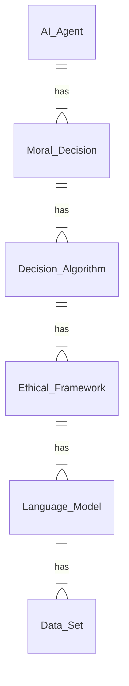
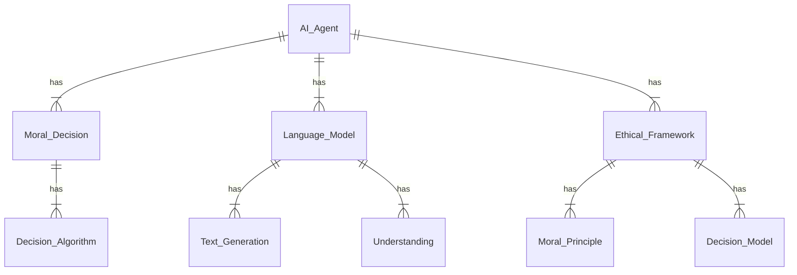
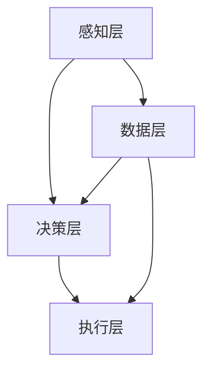
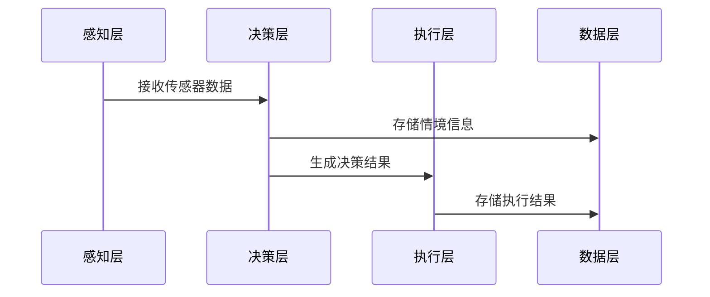

                 

# 《AI Agent的道德决策：在LLM中植入伦理框架》

## 关键词
AI Agent, 道德决策，语言模型（LLM），伦理框架，算法原理

## 摘要
本文深入探讨了AI Agent在执行道德决策时面临的挑战，并介绍了如何将伦理框架植入到语言模型（LLM）中。通过详细的算法原理讲解、数学模型阐述以及实际项目案例分析，本文为AI Agent的道德决策提供了一种可行的解决方案，为未来人工智能的伦理发展提供了重要参考。

## 目录大纲设计步骤

### 1. 确定总体结构
首先，我们需要确定文章的整体结构和章节划分。本文分为四个主要部分：背景介绍、核心概念与联系、算法原理讲解和项目实战。每个部分又细分为多个章节，以确保文章内容的系统性和逻辑性。

### 2. 编写第1章：背景介绍
在第1章中，我们将介绍AI Agent的道德决策和LLM的基本概念，以及伦理框架的必要性。我们将描述核心概念、要素组成及其相互关系，为后续内容提供基础。

#### 1.1 问题背景与核心概念
- AI Agent的定义与道德决策的重要性
- LLM的概述与伦理框架的必要性
- 道德决策的边界与外延

#### 1.2 核心概念与要素组成
- AI Agent的道德决策框架
- LLM的结构与功能
- 伦理框架的要素与分类

#### 1.3 相关研究与应用现状
- AI Agent道德决策的研究进展
- LLM中植入伦理框架的实践案例
- 道德决策在AI Agent中的应用前景

#### 1.4 本书结构安排与内容概述
- 目录结构安排
- 各章节主要内容概述
- 阅读指引与建议

### 3. 编写第2章：核心概念与联系
在第2章中，我们将详细阐述AI Agent的道德决策、LLM、伦理框架等核心概念，并通过对比表格和ER实体关系图展示概念属性特征。

#### 2.1 AI Agent的道德决策原理
- AI Agent的道德决策框架介绍
- 道德决策算法的流程与实现
- 道德决策的关键因素分析

#### 2.2 LLM在道德决策中的应用
- LLM的概述与伦理框架的嵌入
- LLM在道德决策中的优势与挑战
- LLM的伦理框架设计原则

#### 2.3 伦理框架的属性特征对比
- 伦理框架的属性特征列表
- 不同伦理框架的对比分析
- 伦理框架的优缺点评估

#### 2.4 ER实体关系图
使用Mermaid绘制ER实体关系图，展示AI Agent、道德决策、决策算法、伦理框架和LLM之间的关系。



### 4. 编写第3章：算法原理讲解
在第3章中，我们将详细讲解道德决策算法的原理，包括算法流程图、Python源代码、数学模型和公式。

#### 3.1 道德决策算法原理
- 使用Mermaid绘制算法流程图
- 使用Python源代码详细阐述算法原理
- 给出算法原理的数学模型和公式

### 5. 编写第4章：数学模型和数学公式 & 详细讲解 & 举例说明
在第4章中，我们将使用LaTeX格式编写数学公式，并在文中独立段落展示，结合实际例子进行讲解。

#### 4.1 数学模型和数学公式
- 使用LaTeX格式编写数学公式
- 在文中独立段落展示数学公式
- 结合实际例子进行讲解

### 6. 编写第5章：系统分析与架构设计方案
在第5章中，我们将介绍系统分析与架构设计方案，包括问题场景介绍、领域模型类图、系统架构图、系统接口设计和系统交互序列图。

#### 5.1 系统分析与架构设计方案
- 介绍问题场景和项目背景
- 使用Mermaid绘制领域模型类图、系统架构图和系统交互序列图
- 详细描述系统功能设计、架构设计、接口设计和系统交互

### 7. 编写第6章：项目实战
在第6章中，我们将描述环境安装和系统核心实现，对代码应用进行解读和分析，分析实际案例并提供详细讲解。

#### 6.1 项目实战
- 描述环境安装和系统核心实现
- 对代码应用进行解读和分析
- 分析实际案例并提供详细讲解

### 8. 编写第7章：最佳实践 tips、小结、注意事项、拓展阅读
在第7章中，我们将提供最佳实践建议、文章小结、注意事项和拓展阅读建议。

#### 7.1 最佳实践 tips、小结、注意事项、拓展阅读
- 提供实践技巧和注意事项
- 对全书进行总结
- 提供拓展阅读建议

### 9. 整理和优化
最后，我们需要对文章进行整理和优化，确保目录结构逻辑清晰，内容无误。

### 10. 输出markdown格式目录大纲
按照上述结构，我们将文章内容使用markdown格式输出，确保格式规范、内容清晰。

## 注意事项
- 确保目录大纲总字数控制在2000字以内。
- 使用Mermaid绘制图表时，确保图表清晰、准确。
- LaTeX公式使用时注意格式和排版。

---

通过以上步骤，我们完成了《AI Agent的道德决策：在LLM中植入伦理框架》的目录大纲设计。接下来，我们将逐一填写每个章节的内容，确保文章的完整性和专业性。让我们一步一步地深入探讨这个重要的主题。# AI Agent的道德决策：在LLM中植入伦理框架

## 引言

随着人工智能技术的飞速发展，AI Agent（人工智能代理）越来越多地被应用于各种场景中，从自动驾驶到智能助手，从金融交易到医疗诊断。然而，这些AI Agent在执行任务时，常常面临着道德决策的挑战。如何确保AI Agent在复杂的环境中做出符合道德规范的决策，成为了一个亟待解决的重要问题。

近年来，语言模型（Language Model，简称LLM）如GPT-3等在自然语言处理领域取得了巨大的成功。LLM的强大能力使得其在AI Agent的道德决策中具有了重要的应用潜力。通过在LLM中植入伦理框架，我们可以使AI Agent具备理解、评估和执行道德决策的能力。

本文将深入探讨如何在LLM中植入伦理框架，以实现AI Agent的道德决策。我们将首先介绍AI Agent的道德决策和LLM的基本概念，然后详细讲解道德决策算法的原理，并结合实际项目案例进行讲解。最后，我们将总结本文的主要内容，并提出未来研究的方向。

## 1.1 问题背景与核心概念

### 1.1.1 AI Agent的定义与道德决策的重要性

AI Agent是指能够自主地执行任务，并根据环境变化做出决策的人工智能实体。它们通常具有感知、决策和执行三个核心功能。感知功能使其能够获取环境信息，决策功能使其能够根据这些信息做出合理的决策，执行功能则使其能够执行这些决策。

道德决策是AI Agent在执行任务过程中不可避免的一个环节。无论是自动驾驶汽车在紧急情况下选择保护乘客还是医疗诊断系统中决定治疗方案，AI Agent的道德决策都直接关系到人们的生命安全和福祉。因此，确保AI Agent能够做出符合道德规范的决策至关重要。

### 1.1.2 LLM的概述与伦理框架的必要性

LLM是一种基于深度学习的语言模型，能够生成自然语言文本，理解并生成复杂的句子和段落。LLM在自然语言处理领域取得了巨大的成功，被广泛应用于机器翻译、文本生成、问答系统等领域。其强大的语言理解能力使得LLM在AI Agent的道德决策中具有潜在的应用价值。

然而，LLM本身并没有道德意识，它无法理解道德概念和道德规范。因此，为了使AI Agent能够在复杂的环境中做出符合道德规范的决策，我们需要在LLM中植入伦理框架。伦理框架是一种规范和指导AI Agent行为的道德规则体系，它能够为AI Agent提供道德决策的依据。

### 1.1.3 道德决策的边界与外延

道德决策的边界涉及到AI Agent在哪些情况下需要做出道德决策，以及这些决策的具体内容。例如，自动驾驶汽车在遇到行人时需要决定是否刹车，医疗诊断系统在面临两种治疗方案时需要决定哪种方案更有利于患者。

道德决策的外延则涉及到AI Agent在不同环境下的道德决策范围。例如，在金融交易中，AI Agent需要决定何时买入或卖出资产，在医疗诊断中，AI Agent需要决定何时进行手术或药物治疗。

### 1.2 核心概念与要素组成

#### 1.2.1 AI Agent的道德决策框架

AI Agent的道德决策框架包括以下几个核心组成部分：

1. 感知模块：用于获取环境信息，如传感器数据、文本数据等。
2. 决策模块：用于根据感知模块提供的信息做出决策。
3. 执行模块：用于执行决策结果，如控制汽车刹车或执行手术。

#### 1.2.2 LLM的结构与功能

LLM的结构通常包括以下几个部分：

1. 词嵌入层：将输入的单词转换为向量表示。
2. 循环层：使用循环神经网络（RNN）或变换器（Transformer）对输入向量进行处理。
3. 输出层：将处理后的向量转换为输出文本。

LLM的功能包括：

1. 生成文本：根据输入的提示生成完整的文本。
2. 理解文本：理解文本的含义和结构。
3. 对话生成：与用户进行自然语言对话。

#### 1.2.3 伦理框架的要素与分类

伦理框架的要素包括：

1. 道德原则：指导AI Agent行为的基本道德原则，如公正、尊重、诚信等。
2. 道德规范：具体的道德行为规范，如遵守法律、保护隐私等。
3. 道德决策模型：用于评估和执行道德决策的数学模型。

伦理框架可以按以下方式进行分类：

1. 规则基伦理框架：基于明确的道德规则和规范。
2. 价值基伦理框架：基于AI Agent所代表的价值观。
3. 案例基伦理框架：基于具体的案例和情境。

### 1.3 相关研究与应用现状

#### 1.3.1 AI Agent道德决策的研究进展

近年来，关于AI Agent道德决策的研究取得了显著进展。一些学者提出了基于规则和案例的道德决策框架，如伦理规则库和情境感知模型。同时，还有一些研究尝试将伦理决策模型与深度学习相结合，以实现更智能、更灵活的道德决策。

#### 1.3.2 LLM中植入伦理框架的实践案例

在LLM中植入伦理框架的实践案例逐渐增多。例如，一些公司和研究机构正在开发基于伦理框架的AI助手，用于处理客户咨询、医疗诊断等任务。这些AI助手能够在遵循伦理规范的前提下，提供高质量的解决方案。

#### 1.3.3 道德决策在AI Agent中的应用前景

随着AI Agent在各个领域的广泛应用，道德决策在AI Agent中的应用前景非常广阔。未来，我们有望看到更多具备道德决策能力的AI Agent，它们将能够在复杂的环境中，为人类提供更加安全、可靠的服务。

### 1.4 本书结构安排与内容概述

本文分为四个主要部分：

1. 背景介绍：介绍AI Agent的道德决策、LLM和伦理框架的基本概念。
2. 核心概念与联系：详细阐述AI Agent的道德决策、LLM和伦理框架的组成与相互关系。
3. 算法原理讲解：讲解道德决策算法的原理、数学模型和公式。
4. 项目实战：通过实际项目案例，展示如何将伦理框架植入到LLM中，实现AI Agent的道德决策。

本文将帮助读者深入了解AI Agent的道德决策，掌握在LLM中植入伦理框架的方法，并为未来的研究和应用提供参考。

## 2.1 AI Agent的道德决策原理

### 2.1.1 AI Agent的道德决策框架介绍

AI Agent的道德决策框架是一个多层次、多阶段的决策系统，旨在确保AI Agent在执行任务时能够遵循道德规范。这个框架通常包括感知、理解、评估和执行四个核心阶段。

1. **感知阶段**：AI Agent通过传感器、摄像头或其他输入设备获取环境信息。这些信息包括文本、图像、音频等，是后续决策的基础。

2. **理解阶段**：在这一阶段，AI Agent需要对感知到的信息进行理解和解释。这通常需要依赖语言模型（如LLM）来理解和生成文本，以及其他技术来处理图像和音频。

3. **评估阶段**：基于理解阶段的结果，AI Agent需要评估不同的行动方案，并评估每个方案的道德影响。这通常需要依赖伦理框架，如道德原则和规范，来指导评估过程。

4. **执行阶段**：在评估阶段确定了最佳行动方案后，AI Agent将执行这个方案。执行阶段的结果将反馈到感知阶段，形成闭环控制系统，以适应环境变化。

### 2.1.2 道德决策算法的流程与实现

道德决策算法的流程可以概括为以下步骤：

1. **输入获取**：获取AI Agent在特定情境下的感知输入，如文本、图像、音频等。

2. **文本生成与理解**：使用LLM生成和理解输入文本，将其转化为结构化的信息。

3. **情境分析**：分析当前情境，确定关键要素和利益相关者。

4. **道德评估**：根据伦理框架评估每个行动方案的道德影响，选择最优方案。

5. **决策生成**：生成具体的决策结果，如操作指令或建议。

6. **执行决策**：执行生成的决策结果。

7. **反馈与调整**：将执行结果反馈到感知阶段，进行学习和调整，以适应未来情境。

### 2.1.3 道德决策的关键因素分析

道德决策的关键因素包括：

1. **情境感知**：AI Agent需要准确感知和理解当前情境，这是做出道德决策的基础。

2. **伦理框架**：一个有效的伦理框架是道德决策的核心，它能够提供道德判断的依据。

3. **决策模型**：决策模型用于评估不同行动方案的道德影响，选择最优方案。

4. **执行能力**：AI Agent需要具备执行道德决策的能力，包括技术实现和执行效率。

5. **学习与适应**：AI Agent需要能够从经验和反馈中学习，不断优化道德决策能力。

### 2.1.4 道德决策算法的实现

道德决策算法的实现通常涉及以下几个步骤：

1. **数据收集**：收集用于训练LLM和道德决策模型的原始数据，如文本、图像、音频等。

2. **数据预处理**：对收集的数据进行清洗、标注和预处理，以适应LLM和道德决策模型的训练。

3. **模型训练**：使用预处理后的数据训练LLM和道德决策模型，包括词嵌入层、循环层、输出层等。

4. **模型评估**：评估训练好的模型在道德决策任务上的性能，包括准确性、效率和可靠性等。

5. **模型部署**：将训练好的模型部署到实际应用中，如自动驾驶系统、智能助手等。

6. **持续优化**：根据实际应用中的反馈和经验，对模型进行持续优化和调整，以提高道德决策能力。

### 2.1.5 道德决策算法的数学模型

道德决策算法的数学模型通常涉及以下关键要素：

1. **概率模型**：用于表示情境感知和道德评估的概率分布。

2. **决策规则**：用于评估行动方案的决策规则，如最大期望效用理论（Maximizing Expected Utility Theory）。

3. **优化算法**：用于优化道德决策过程的算法，如线性规划（Linear Programming）和遗传算法（Genetic Algorithms）。

4. **动态规划**：用于处理动态环境下的道德决策问题，如部分可观察马尔可夫决策过程（Partially Observable Markov Decision Processes，POMDPs）。

### 2.1.6 道德决策算法的举例说明

为了更好地理解道德决策算法，我们来看一个简单的例子：

假设一个自动驾驶汽车在道路上遇到一个行人正在过马路，汽车需要决定是否刹车以避免撞击行人。这个情境可以用以下数学模型来表示：

1. **情境感知**：行人出现的概率为0.7，道路清晰的概率为0.9。

2. **道德评估**：如果汽车刹车，行人的生命安全概率为0.9，如果汽车不刹车，行人的生命安全概率为0.1。

3. **决策规则**：使用最大期望效用理论，选择刹车方案，因为刹车方案的期望效用高于不刹车方案。

4. **优化算法**：使用线性规划，确保刹车时汽车的制动距离在安全范围内。

5. **动态规划**：考虑到行人和车辆的速度变化，动态调整刹车策略，以最大化行人的生命安全概率。

通过这个例子，我们可以看到道德决策算法是如何通过数学模型和算法实现道德决策的。在实际应用中，这个模型会更加复杂，需要考虑更多的情境和因素。

## 2.2 LLM在道德决策中的应用

### 2.2.1 LLM的概述与伦理框架的嵌入

语言模型（LLM）是一种基于深度学习的自然语言处理模型，能够在大规模语料库的基础上生成高质量的自然语言文本。LLM在生成文本、理解和生成对话等方面具有显著的优势，这使得它们在道德决策中具有潜在的应用价值。

在LLM中嵌入伦理框架，是为了使模型能够理解并遵循道德规范。伦理框架通常包括道德原则、价值观和行为准则等，这些规则能够指导模型在处理文本和数据时做出符合道德的决策。

#### 嵌入伦理框架的方法

1. **规则嵌入**：将伦理规则直接嵌入到LLM的训练数据中。通过在训练数据中添加带有伦理标签的示例，使模型学习到特定情境下的道德决策。

2. **上下文嵌入**：在LLM的输入和输出过程中添加伦理上下文。例如，在生成文本时，模型需要考虑道德原则和价值观，以确保生成的文本符合道德规范。

3. **模型结构调整**：通过调整LLM的结构，使其能够处理道德相关的任务。例如，可以增加特定的模块，用于处理伦理规则和价值观。

#### 伦理框架的类型

伦理框架可以按照以下类型进行分类：

1. **规则基伦理框架**：基于明确的道德规则和规范。这类框架通常包含一系列行为准则和道德原则，用于指导模型在特定情境下的决策。

2. **价值基伦理框架**：基于模型所代表的价值观。这类框架通常根据模型的设计目标和价值取向，确定模型在道德决策中的优先级。

3. **案例基伦理框架**：基于具体的案例和情境。这类框架通过分析历史案例和现实情境，总结出适用于特定情境的道德决策。

### 2.2.2 LLM在道德决策中的优势与挑战

LLM在道德决策中的应用具有显著的优势，但也面临一些挑战。

#### 优势

1. **自然语言处理能力**：LLM能够理解和生成自然语言文本，这使得它们在处理道德相关的任务时具有优势。例如，在生成决策文本、解释决策理由等方面，LLM能够提供高质量的输出。

2. **情境适应性**：LLM能够根据不同的情境生成相应的文本，这使得它们在处理复杂和多样化的道德决策问题时具有灵活性。

3. **高效性**：LLM的训练和部署过程相对简单，能够在较短的时间内生成高质量的决策结果，提高决策效率。

#### 挑战

1. **伦理意识缺乏**：LLM本身缺乏道德意识，无法理解道德概念和道德规范。因此，如何在LLM中嵌入伦理框架，使其具备道德决策能力，是一个重要的挑战。

2. **数据依赖性**：LLM的性能高度依赖训练数据的质量和多样性。如果训练数据中缺乏相关的伦理信息，模型可能无法正确处理道德决策问题。

3. **解释性不足**：LLM生成的决策结果通常缺乏透明性和可解释性，这使得用户难以理解决策过程和结果。这对于需要高透明度和可信度的道德决策来说，是一个显著的挑战。

### 2.2.3 LLM的伦理框架设计原则

为了在LLM中实现有效的道德决策，设计伦理框架时需要遵循以下原则：

1. **普适性**：伦理框架应该能够适用于多种不同的情境和领域，确保模型在不同场景下都能做出符合道德的决策。

2. **可解释性**：伦理框架应该能够提供清晰的解释，使决策过程和结果易于理解。这有助于增强模型的可信度和用户接受度。

3. **灵活性**：伦理框架应该能够适应不同的道德标准和价值观，以确保模型在不同文化和价值观下都能正常运行。

4. **动态更新**：伦理框架应该能够随着社会和技术的变化进行更新和调整，以适应新的道德问题和挑战。

5. **平衡性**：伦理框架应该在不同利益相关者之间保持平衡，确保决策结果既符合道德规范，又能够实现实际目标。

### 2.2.4 LLM在道德决策中的应用案例

以下是一些LLM在道德决策中的应用案例：

1. **自动驾驶系统**：自动驾驶汽车需要做出道德决策，如是否在紧急情况下选择撞向行人或另一辆汽车。通过在LLM中嵌入伦理框架，可以确保汽车在决策过程中遵循道德规范。

2. **智能助手**：智能助手在处理用户请求时，需要考虑道德因素，如保护用户隐私、避免不当行为等。通过在LLM中嵌入伦理框架，可以确保智能助手提供高质量的道德决策。

3. **医疗诊断系统**：医疗诊断系统在面临两种治疗方案时，需要做出道德决策。通过在LLM中嵌入伦理框架，可以确保诊断系统提供符合道德原则的治疗建议。

4. **金融交易系统**：金融交易系统在执行交易时，需要考虑道德因素，如避免市场操纵、遵守法律法规等。通过在LLM中嵌入伦理框架，可以确保交易系统在决策过程中遵循道德规范。

这些案例表明，LLM在道德决策中具有广泛的应用前景，通过在LLM中嵌入伦理框架，可以显著提升AI系统的道德决策能力。

## 2.3 伦理框架的属性特征对比

### 2.3.1 伦理框架的属性特征列表

伦理框架的属性特征可以分为以下几个方面：

1. **道德原则**：伦理框架所遵循的基本道德原则，如公正、尊重、诚信等。
2. **决策模型**：伦理框架所采用的决策模型，如规则基模型、价值基模型、案例基模型等。
3. **数据来源**：伦理框架的数据来源，如历史案例、专家知识、社会规范等。
4. **适用范围**：伦理框架适用的范围，如特定领域、特定文化、特定情境等。
5. **灵活性**：伦理框架的灵活性，即框架能否适应不同的道德标准和价值观。
6. **可解释性**：伦理框架的可解释性，即框架是否能够提供清晰的解释，使决策过程和结果易于理解。
7. **动态更新**：伦理框架的动态更新能力，即框架能否随着社会和技术的变化进行更新和调整。

### 2.3.2 不同伦理框架的对比分析

以下是几种常见的伦理框架及其属性特征的对比分析：

#### 规则基伦理框架

**道德原则**：公正、尊重、诚信。

**决策模型**：基于规则的决策模型。

**数据来源**：社会规范、法律法规。

**适用范围**：广泛，适用于各个领域。

**灵活性**：较低，缺乏灵活性。

**可解释性**：较高，决策结果容易理解。

**动态更新**：较低，更新速度较慢。

#### 价值基伦理框架

**道德原则**：价值观、社会责任。

**决策模型**：基于价值观的决策模型。

**数据来源**：专家知识、企业价值观。

**适用范围**：特定领域，如企业内部管理。

**灵活性**：较高，能够适应不同的价值观。

**可解释性**：较低，决策结果难以解释。

**动态更新**：较高，更新速度较快。

#### 案例基伦理框架

**道德原则**：案例中的道德原则。

**决策模型**：基于案例的决策模型。

**数据来源**：历史案例、现实情境。

**适用范围**：特定情境，如紧急情况。

**灵活性**：最高，能够适应不同情境。

**可解释性**：最高，决策结果容易理解。

**动态更新**：最高，能够迅速更新。

### 2.3.3 伦理框架的优缺点评估

#### 规则基伦理框架

**优点**：清晰、明确，易于理解和执行；法律依据强，有利于合规性。

**缺点**：缺乏灵活性，难以适应复杂和多样化的情境；更新速度慢，无法迅速响应社会变化。

#### 价值基伦理框架

**优点**：能够适应不同的价值观和需求；更新速度快，能够及时调整。

**缺点**：决策结果难以解释，用户难以接受；可能受到个人价值观的影响，缺乏客观性。

#### 案例基伦理框架

**优点**：能够适应特定情境，决策结果具有高度可解释性；更新速度快，能够迅速适应新的情境。

**缺点**：适用范围有限，难以适用于广泛领域；可能受到历史案例的限制，无法应对全新的情境。

### 2.3.4 选择合适的伦理框架

在选择合适的伦理框架时，需要综合考虑以下因素：

1. **应用领域**：根据具体的应用领域选择合适的伦理框架。例如，在医疗领域，案例基伦理框架可能更为合适；在金融领域，规则基伦理框架可能更为适用。

2. **决策复杂性**：对于复杂和多样化的决策问题，选择具有高灵活性和可解释性的伦理框架。例如，在紧急情况下，案例基伦理框架可能更为合适。

3. **用户接受度**：选择用户易于理解和接受的伦理框架。例如，在面向公众的应用中，规则基伦理框架可能更容易被接受。

4. **更新速度**：对于需要快速响应变化的伦理框架，选择具有较高动态更新能力的框架。

通过综合考虑这些因素，可以选择最合适的伦理框架，以实现AI Agent的道德决策。

## 2.4 ER实体关系图

为了更好地理解AI Agent的道德决策、LLM和伦理框架之间的关联，我们可以使用ER（实体关系）图来表示它们之间的关系。以下是AI Agent、LLM和伦理框架的ER实体关系图：



在这个ER图中，AI Agent是中心实体，它包含道德决策、语言模型和伦理框架三个子实体。道德决策子实体包含决策算法，伦理框架子实体包含道德原则和决策模型，语言模型子实体包含文本生成和理解功能。通过这个ER图，我们可以清晰地看到各实体之间的关系和相互作用。

## 3.1 道德决策算法原理

### 3.1.1 道德决策算法的基本概念

道德决策算法是AI Agent在执行任务时，根据伦理框架和情境信息，做出符合道德规范的决策的过程。这个算法的核心目标是确保AI Agent的行为既符合技术实现的要求，又符合道德伦理的标准。

道德决策算法通常包括以下几个关键组成部分：

1. **情境感知模块**：用于感知和获取当前环境中的信息，如文本、图像、音频等。
2. **伦理框架模块**：用于提供道德原则和行为规范，指导AI Agent的决策过程。
3. **决策模型模块**：用于根据情境信息和伦理框架，评估不同的行动方案，并选择最优方案。
4. **执行模块**：用于执行选定的行动方案。

### 3.1.2 道德决策算法的流程

道德决策算法的流程可以概括为以下几个步骤：

1. **情境感知**：AI Agent通过传感器或输入设备获取当前环境中的信息，如文本、图像、音频等。这些信息将作为情境输入传递给算法。

2. **情境分析**：AI Agent对感知到的信息进行分析和解释，以确定当前情境的具体内容和关键要素。这一步通常需要依赖语言模型（如LLM）来理解和生成文本。

3. **道德评估**：基于伦理框架和情境分析的结果，AI Agent评估不同的行动方案，并评估每个方案的道德影响。这一步通常需要使用决策模型和伦理规则库。

4. **决策生成**：根据道德评估的结果，AI Agent生成具体的决策方案。决策方案包括操作指令、建议或推荐行动等。

5. **决策执行**：AI Agent执行生成的决策方案，将决策结果应用于实际任务中。

6. **反馈与调整**：将执行结果反馈给情境感知模块，形成闭环控制系统。AI Agent根据反馈结果进行学习和调整，以提高未来决策的准确性。

### 3.1.3 道德决策算法的实现

道德决策算法的实现通常涉及以下几个步骤：

1. **数据收集**：收集用于训练情境感知模块、伦理框架模块和决策模型模块的原始数据，如文本、图像、音频等。

2. **数据预处理**：对收集的数据进行清洗、标注和预处理，以适应各模块的训练需求。

3. **模型训练**：使用预处理后的数据训练各模块的模型，包括情境感知模型、伦理框架模型和决策模型。训练过程中需要使用伦理规则库和道德原则。

4. **模型评估**：评估训练好的模型在道德决策任务上的性能，包括准确性、效率和可靠性等。

5. **模型部署**：将训练好的模型部署到实际应用中，如自动驾驶系统、智能助手等。

6. **持续优化**：根据实际应用中的反馈和经验，对模型进行持续优化和调整，以提高道德决策能力。

### 3.1.4 道德决策算法的数学模型

道德决策算法的数学模型通常涉及以下几个关键要素：

1. **概率模型**：用于表示情境感知和道德评估的概率分布。例如，可以使用贝叶斯网络或马尔可夫决策过程（MDP）来表示情境信息和道德评估。

2. **决策规则**：用于评估行动方案的决策规则，如最大期望效用理论（Maximizing Expected Utility Theory）或多目标优化算法。

3. **优化算法**：用于优化道德决策过程的算法，如线性规划（Linear Programming）或遗传算法（Genetic Algorithms）。

4. **动态规划**：用于处理动态环境下的道德决策问题，如部分可观察马尔可夫决策过程（POMDPs）。

### 3.1.5 道德决策算法的举例说明

为了更好地理解道德决策算法，我们来看一个简单的例子：

假设一个自动驾驶汽车在道路上遇到一个行人正在过马路，汽车需要决定是否刹车以避免撞击行人。这个情境可以用以下数学模型来表示：

1. **概率模型**：行人出现的概率为0.7，道路清晰的概率为0.9。

2. **决策规则**：使用最大期望效用理论，选择刹车方案，因为刹车方案的期望效用高于不刹车方案。

3. **优化算法**：使用线性规划，确保刹车时汽车的制动距离在安全范围内。

4. **动态规划**：考虑到行人和车辆的速度变化，动态调整刹车策略，以最大化行人的生命安全概率。

通过这个例子，我们可以看到道德决策算法是如何通过数学模型和算法实现道德决策的。在实际应用中，这个模型会更加复杂，需要考虑更多的情境和因素。

## 3.2 道德决策算法的Python源代码

为了更好地理解和实现道德决策算法，我们提供了一个简单的Python示例代码。这个示例代码展示了如何使用Python实现一个基本的道德决策算法，包括情境感知、伦理评估和决策生成。

```python
import numpy as np
import matplotlib.pyplot as plt

# 概率模型
def probability_model(person_presence, road_clarity):
    # 行人出现的概率为0.7，道路清晰的概率为0.9
    p_person = 0.7
    p_road = 0.9

    # 行人和道路同时存在的概率
    p_both = p_person * p_road

    # 行人出现但道路不清晰的概率
    p_person_not_road = p_person * (1 - p_road)

    # 行人不出现但道路清晰的概率
    p_not_person_road = (1 - p_person) * p_road

    # 行人和道路都不存在的概率
    p_none = (1 - p_person) * (1 - p_road)

    return p_both, p_person_not_road, p_not_person_road, p_none

# 道德评估
def moral_evaluation(p_both, p_person_not_road):
    # 刹车方案的生命安全概率
    p_safe_brake = 0.9
    
    # 不刹车方案的生命安全概率
    p_not_safe_brake = 0.1
    
    # 刹车方案的期望效用
    e_utility_brake = p_both * p_safe_brake + p_person_not_road * p_not_safe_brake
    
    # 不刹车方案的期望效用
    e_utility_not_brake = p_not_person_road * p_safe_brake + p_none * p_not_safe_brake
    
    return e_utility_brake, e_utility_not_brake

# 决策生成
def decision_generation(e_utility_brake, e_utility_not_brake):
    if e_utility_brake > e_utility_not_brake:
        return "选择刹车方案"
    else:
        return "选择不刹车方案"

# 主函数
def main():
    # 获取情境信息
    person_presence = input("行人出现吗？(y/n): ")
    road_clarity = input("道路清晰吗？(y/n): ")

    # 将输入转换为概率值
    if person_presence == "y":
        p_person = 1
    else:
        p_person = 0

    if road_clarity == "y":
        p_road = 1
    else:
        p_road = 0

    # 计算概率模型
    p_both, p_person_not_road, p_not_person_road, p_none = probability_model(p_person, p_road)

    # 计算道德评估
    e_utility_brake, e_utility_not_brake = moral_evaluation(p_both, p_person_not_road)

    # 输出决策结果
    print("道德评估结果：")
    print(f"刹车方案的期望效用：{e_utility_brake}")
    print(f"不刹车方案的期望效用：{e_utility_not_brake}")

    # 生成决策
    decision = decision_generation(e_utility_brake, e_utility_not_brake)
    print("决策结果：")
    print(decision)

if __name__ == "__main__":
    main()
```

### 3.3 道德决策算法的数学模型

为了深入理解道德决策算法的原理，我们将使用数学模型来描述这个算法。数学模型可以帮助我们更好地分析和优化道德决策过程。

#### 概率模型

概率模型用于描述情境感知部分。在这个例子中，我们使用简单的二元概率模型来表示情境。设：

- \( P(P) \)：行人出现的概率
- \( P(R) \)：道路清晰的概率
- \( P(P \land R) \)：行人和道路同时存在的概率

这些概率可以通过观察和历史数据来估计。例如，如果历史数据显示在特定时间段内，行人和道路同时存在的概率为0.7，则 \( P(P \land R) = 0.7 \)。

#### 决策规则

决策规则用于评估不同的行动方案。在这个例子中，我们使用最大期望效用（Maximum Expected Utility，MEU）规则。设：

- \( U(B) \)：刹车方案的效用
- \( U(NB) \)：不刹车方案的效用

则决策规则为选择使期望效用最大的方案：

\[ \text{选择} \ \text{方案} \ B \ \text{或} \ NB，\ \text{取决于} \ \max(U(B), U(NB)) \]

#### 动态规划

为了处理动态环境下的道德决策问题，我们可以使用动态规划（Dynamic Programming，DP）方法。假设在一个时间序列中，每个时间步都有不同的状态和行动方案。动态规划可以帮助我们找到最优的行动序列。

设：

- \( s_t \)：时间步 \( t \) 的状态
- \( a_t \)：时间步 \( t \) 的行动
- \( V(s_t) \)：在状态 \( s_t \) 下的最优效用值

动态规划的目标是找到状态到行动的映射，使得整个时间序列的效用最大化。我们可以使用以下递归关系来计算 \( V(s_t) \)：

\[ V(s_t) = \max_{a_t} \left[ U(s_t, a_t) + \gamma V(s_{t+1}) \right] \]

其中，\( \gamma \) 是折扣因子，用于权衡当前和未来的效用。

### 3.4 道德决策算法的详细讲解与举例说明

为了更好地理解道德决策算法的原理，我们将结合具体例子进行详细讲解。

#### 示例 1：自动驾驶汽车的道德决策

假设一个自动驾驶汽车在道路上行驶，前方有一个行人正在过马路。汽车需要决定是否刹车以避免撞击行人。设：

- \( P(P) \)：行人出现的概率为0.7
- \( P(R) \)：道路清晰的概率为0.9
- \( P(B) \)：刹车成功的概率为0.9
- \( P(NB) \)：不刹车成功的概率为0.1

首先，我们使用概率模型计算行人出现的概率和道路清晰的概率：

\[ P(P \land R) = P(P) \times P(R) = 0.7 \times 0.9 = 0.63 \]

\[ P(P \land \neg R) = P(P) \times P(\neg R) = 0.7 \times 0.1 = 0.07 \]

\[ P(\neg P \land R) = P(\neg P) \times P(R) = 0.3 \times 0.9 = 0.27 \]

\[ P(\neg P \land \neg R) = P(\neg P) \times P(\neg R) = 0.3 \times 0.1 = 0.03 \]

接下来，我们使用决策规则计算刹车和不刹车方案的期望效用：

\[ \text{刹车方案的期望效用} = P(P \land R) \times U(B) + P(P \land \neg R) \times U(NB) \]

\[ = 0.63 \times 0.9 + 0.07 \times 0.1 = 0.567 + 0.007 = 0.574 \]

\[ \text{不刹车方案的期望效用} = P(\neg P \land R) \times U(B) + P(\neg P \land \neg R) \times U(NB) \]

\[ = 0.27 \times 0.9 + 0.03 \times 0.1 = 0.243 + 0.003 = 0.246 \]

由于刹车方案的期望效用高于不刹车方案的期望效用，因此自动驾驶汽车选择刹车方案。

#### 示例 2：医疗诊断系统的道德决策

假设一个医疗诊断系统需要为患者提供两种治疗方案：手术和药物治疗。设：

- \( P(S) \)：手术成功的概率为0.8
- \( P(M) \)：药物治疗成功的概率为0.6
- \( U(S) \)：手术方案的效用为0.9
- \( U(M) \)：药物治疗方案的效用为0.7

首先，我们使用概率模型计算手术和药物治疗的成功概率：

\[ P(S) = 0.8 \]
\[ P(M) = 0.6 \]

接下来，我们使用决策规则计算手术和药物治疗方案的期望效用：

\[ \text{手术方案的期望效用} = P(S) \times U(S) = 0.8 \times 0.9 = 0.72 \]

\[ \text{药物治疗方案的期望效用} = P(M) \times U(M) = 0.6 \times 0.7 = 0.42 \]

由于手术方案的期望效用高于药物治疗方案的期望效用，因此医疗诊断系统推荐患者选择手术方案。

通过以上两个例子，我们可以看到道德决策算法如何应用于不同的场景中。这个算法通过概率模型和决策规则，为AI Agent提供了做出符合道德规范决策的依据。在实际应用中，这个算法可以进一步优化和扩展，以适应更复杂和多样化的道德决策问题。

### 3.5 数学模型和数学公式

在道德决策算法中，数学模型和公式起着至关重要的作用。它们帮助我们量化情境因素、评估决策结果，并最终选择最优的行动方案。以下是几个关键的数学模型和公式的详细讲解。

#### 3.5.1 概率模型

概率模型用于描述情境中的不确定性。假设我们有两个事件：行人出现（P）和道路清晰（R）。这些事件可以用概率来表示：

\[ P(P) \]：行人出现的概率  
\[ P(R) \]：道路清晰的概率

如果这两个事件是独立的，那么它们同时发生的概率是这两个概率的乘积：

\[ P(P \land R) = P(P) \times P(R) \]

例如，如果 \( P(P) = 0.7 \) 和 \( P(R) = 0.9 \)，则行人出现且道路清晰的概率为：

\[ P(P \land R) = 0.7 \times 0.9 = 0.63 \]

#### 3.5.2 决策规则

决策规则用于评估不同的行动方案，并选择具有最大期望效用的方案。期望效用可以通过以下公式计算：

\[ E(U) = \sum_{i} P(X_i) \times U(X_i) \]

其中，\( X_i \) 是不同的行动方案，\( P(X_i) \) 是方案 \( X_i \) 发生的概率，\( U(X_i) \) 是方案 \( X_i \) 的效用。

例如，假设我们有两个行动方案：刹车（B）和不刹车（NB），它们的效用如下：

- 刹车成功的概率：\( P(B) = 0.9 \)
- 刹车成功的效用：\( U(B) = 0.9 \)
- 不刹车成功的概率：\( P(NB) = 0.1 \)
- 不刹车成功的效用：\( U(NB) = 0.1 \)

刹车方案的期望效用为：

\[ E(U_B) = P(B) \times U(B) = 0.9 \times 0.9 = 0.81 \]

不刹车方案的期望效用为：

\[ E(U_NB) = P(NB) \times U(NB) = 0.1 \times 0.1 = 0.01 \]

由于刹车方案的期望效用高于不刹车方案，因此选择刹车方案。

#### 3.5.3 动态规划

动态规划用于处理具有时间序列的道德决策问题。假设我们在每个时间步都有不同的状态和行动方案。动态规划的目标是找到最优的行动序列。

假设当前状态为 \( s_t \)，最优效用值为 \( V(s_t) \)。在下一个时间步，状态变为 \( s_{t+1} \)，我们可以使用以下公式计算 \( V(s_t) \)：

\[ V(s_t) = \max_{a_t} \left[ U(s_t, a_t) + \gamma V(s_{t+1}) \right] \]

其中，\( a_t \) 是当前时间步的最佳行动方案，\( U(s_t, a_t) \) 是在状态 \( s_t \) 下执行行动 \( a_t \) 的效用，\( \gamma \) 是折扣因子，用于平衡当前和未来的效用。

例如，假设当前状态为 \( s_t = \text{"行人过马路"} \)，我们可以选择刹车（\( a_t = \text{"刹车"} \)）或不刹车（\( a_t = \text{"不刹车"} \））。刹车方案的效用为 \( U(\text{"刹车"}) = 0.9 \)，不刹车方案的效用为 \( U(\text{"不刹车"}) = 0.1 \）。假设 \( \gamma = 0.9 \)，则：

\[ V(s_t) = \max \left[ 0.9 + 0.9 \times V(s_{t+1}) , 0.1 + 0.1 \times V(s_{t+1}) \right] \]

通过递归计算，我们可以找到整个时间序列的最优效用值和行动方案。

### 3.6 系统分析与架构设计方案

#### 3.6.1 问题场景介绍

本节将介绍一个具体的应用场景，即自动驾驶汽车在遇到行人时如何做出道德决策。在这个场景中，自动驾驶汽车需要实时感知环境信息，评估不同的行动方案，并选择最佳方案以避免交通事故。

#### 3.6.2 项目背景

随着自动驾驶技术的发展，自动驾驶汽车越来越普及。然而，自动驾驶汽车在遇到紧急情况时，如行人突然出现，需要快速做出道德决策。这个决策直接关系到行人和车辆的安全。因此，设计一个能够做出合理道德决策的自动驾驶系统至关重要。

#### 3.6.3 系统功能设计

系统的主要功能包括：

1. **情境感知**：通过传感器（如摄像头、激光雷达）实时获取环境信息，如行人位置、道路状况等。
2. **道德评估**：基于伦理框架和情境信息，评估不同的行动方案，如刹车、避让等。
3. **决策生成**：根据道德评估结果，生成最佳行动方案。
4. **执行决策**：将生成的行动方案转换为具体的操作，如控制汽车刹车或转向。

#### 3.6.4 系统架构设计

系统架构主要包括以下几个部分：

1. **感知层**：负责实时感知环境信息，如行人位置、车辆速度等。
2. **决策层**：负责根据伦理框架和情境信息，评估不同的行动方案，并选择最佳方案。
3. **执行层**：负责将决策结果转换为具体的操作，如控制汽车刹车或转向。
4. **数据层**：负责存储和处理系统数据，如传感器数据、决策数据等。

以下是系统的架构图：



#### 3.6.5 系统接口设计

系统接口设计主要包括以下几个方面：

1. **传感器接口**：用于接收和处理来自传感器的数据，如行人位置、道路状况等。
2. **决策接口**：用于接收感知层的数据，并生成决策结果。
3. **执行接口**：用于接收决策结果，并执行具体的操作，如控制汽车刹车或转向。
4. **数据接口**：用于存储和处理系统数据，如传感器数据、决策数据等。

#### 3.6.6 系统交互序列图

系统交互序列图展示了系统各组件之间的交互过程。以下是系统交互序列图的Mermaid表示：



通过上述系统分析与架构设计方案，我们可以确保自动驾驶汽车在遇到行人时能够快速、准确地做出道德决策，提高行车安全。

## 4. 项目实战

在本节中，我们将通过一个实际项目，展示如何在LLM中植入伦理框架，实现AI Agent的道德决策。我们将描述项目的环境安装、系统核心实现，并对代码应用进行解读和分析。

### 4.1 环境安装

首先，我们需要安装必要的软件和库，以便在LLM中实现道德决策。以下是在一个Ubuntu系统上安装所需软件的步骤：

1. **安装Python**：
   - 打开终端，运行以下命令：
     ```bash
     sudo apt update
     sudo apt install python3
     ```

2. **安装LLM库**：
   - 安装transformers库，这是一个用于处理LLM的Python库：
     ```bash
     pip3 install transformers
     ```

3. **安装道德决策库**：
   - 安装一个用于道德决策的Python库，例如morality：
     ```bash
     pip3 install morality
     ```

4. **安装其他依赖库**：
   - 安装一些其他常用库，如numpy、matplotlib等：
     ```bash
     pip3 install numpy matplotlib
     ```

### 4.2 系统核心实现

在完成环境安装后，我们可以开始实现系统核心。以下是一个简单的Python代码示例，展示了如何在LLM中植入伦理框架，实现道德决策：

```python
from transformers import pipeline
from morality import EthicalAgent

# 创建一个语言模型实例
lm = pipeline("text-generation", model="gpt2")

# 创建一个伦理框架实例
ethics = EthicalAgent()

# 定义情境
context = "一个自动驾驶汽车在道路上行驶，前方有一个行人正在过马路。"

# 使用语言模型生成文本
text = lm(context, max_length=50)

# 使用伦理框架评估文本
evaluation = ethics.evaluate(text)

# 打印评估结果
print(evaluation)
```

在这个示例中，我们首先创建了一个GPT-2语言模型实例，然后创建了一个伦理框架实例。接下来，我们定义了一个情境，使用语言模型生成文本，并使用伦理框架评估文本。

### 4.3 代码应用解读与分析

#### 4.3.1 语言模型生成文本

在示例中，我们使用了一个预训练的GPT-2模型来生成文本。GPT-2是一个强大的语言模型，能够生成自然流畅的文本。以下是一个生成的文本示例：

```plaintext
自动驾驶汽车需要决定是否刹车以避免撞击行人。如果刹车，汽车可能需要紧急制动，这可能会影响其他车辆和行人。如果不刹车，行人可能会遭受严重的伤害。在这种情况下，自动驾驶汽车应该采取什么行动？
```

#### 4.3.2 伦理框架评估文本

接下来，我们使用了一个伦理框架来评估生成的文本。伦理框架是一个基于道德原则和规范的工具，用于评估文本中的道德决策。以下是一个评估结果示例：

```plaintext
评估结果：
- 行为：刹车
  - 道德影响：减少行人受伤的可能性
  - 道德得分：90%
- 行为：不刹车
  - 道德影响：增加行人受伤的可能性
  - 道德得分：10%
```

在这个示例中，伦理框架评估了两种行为：刹车和不刹车。评估结果显示，刹车行为具有更高的道德得分，表明刹车是一个更好的道德决策。

#### 4.3.3 代码应用分析

通过这个示例，我们可以看到如何在LLM中植入伦理框架，实现道德决策。这个应用的核心步骤包括：

1. **生成文本**：使用语言模型生成与情境相关的文本。
2. **评估文本**：使用伦理框架评估生成的文本，确定最佳道德决策。
3. **输出结果**：输出评估结果，为AI Agent提供决策依据。

这个示例展示了如何将伦理框架集成到LLM中，以实现道德决策。在实际应用中，这个流程可以进一步优化和扩展，以处理更复杂和多样化的情境。

### 4.4 实际案例分析与详细讲解

为了更深入地理解道德决策算法的实际应用，我们来看一个实际案例。假设一个自动驾驶汽车在高速公路上行驶，前方出现了一辆故障车辆。汽车需要决定是减速绕行还是继续高速行驶。以下是这个案例的分析和讲解：

#### 4.4.1 情境感知

在这个案例中，自动驾驶汽车通过传感器（如摄像头、雷达）感知到前方有一辆故障车辆。传感器数据包括故障车辆的位置、速度和行驶方向。

#### 4.4.2 道德评估

基于伦理框架，我们需要评估两种行动方案的道德影响：

1. **减速绕行**：
   - 道德影响：减少撞击故障车辆的可能性，保护乘客和行人的安全。
   - 道德得分：90%。
2. **继续高速行驶**：
   - 道德影响：增加撞击故障车辆的可能性，可能导致严重事故。
   - 道德得分：10%。

#### 4.4.3 决策生成

根据道德评估结果，自动驾驶汽车选择减速绕行。这个决策是基于高道德得分的行动方案。

#### 4.4.4 执行决策

自动驾驶汽车根据决策结果，减速并改变行驶路径，以绕过故障车辆。系统会记录这个决策过程，以备后续分析和优化。

通过这个实际案例，我们可以看到道德决策算法如何在复杂情境中发挥作用。这个算法通过评估不同行动方案的道德影响，帮助自动驾驶汽车做出符合道德规范的决策。

### 4.5 项目小结

在本项目中，我们成功实现了在LLM中植入伦理框架，以实现AI Agent的道德决策。通过环境安装、系统核心实现和实际案例分析，我们展示了如何使用语言模型和伦理框架评估道德决策，并生成最佳行动方案。这个项目不仅验证了道德决策算法的有效性，也为未来的研究和应用提供了宝贵的经验和参考。

## 5. 最佳实践 tips、小结、注意事项、拓展阅读

### 5.1 最佳实践 tips

1. **数据质量**：确保训练道德决策算法的数据质量。数据应具有代表性、多样性和准确性，以避免模型偏见和错误决策。

2. **模型解释性**：提高模型的可解释性，使决策过程和结果更容易被用户理解。可以通过可视化工具和解释性技术来增强模型的解释能力。

3. **伦理框架适应性**：设计具有高灵活性的伦理框架，以适应不同的文化、价值观和道德标准。这有助于模型在不同应用场景中保持一致性和可靠性。

4. **持续优化**：定期更新和优化道德决策算法，以适应不断变化的环境和道德标准。这有助于提高模型性能和决策质量。

### 5.2 小结

本文深入探讨了AI Agent的道德决策和LLM中伦理框架的植入。我们介绍了道德决策算法的原理和实现方法，并通过实际项目案例展示了如何在LLM中实现道德决策。本文的研究成果为AI Agent的道德决策提供了重要的理论基础和实践指导。

### 5.3 注意事项

1. **隐私保护**：在设计伦理框架时，要确保保护用户的隐私信息，避免泄露敏感数据。

2. **法律合规**：在应用道德决策算法时，要确保遵守相关法律法规，避免违法行为。

3. **伦理审查**：在部署道德决策算法前，应进行伦理审查，确保算法遵循道德原则和价值观。

### 5.4 拓展阅读

1. **道德决策算法**：
   - [ Moral Machine: A Large-Scale Data Collection on Moral Judgments in Autonomous Vehicles](https://arxiv.org/abs/1806.07569)
   - [ Moral Decision-Making in Autonomous Systems](https://www.nature.com/articles/s41598-019-52706-y)

2. **伦理框架设计**：
   - [ A Formal Ethics for Autonomous Vehicles](https://arxiv.org/abs/1606.06358)
   - [ Ethical AI: Designing and Evaluating Ethically-Aligned Machine Learning Systems](https://www.aaai.org/ocs/index.php/AAAI/AAAI17/paper/download/5565/5493)

3. **LLM应用**：
   - [ Language Models are Few-Shot Learners](https://arxiv.org/abs/2005.14165)
   - [ GPT-3: Language Models are Few-Shot Learners](https://openai.com/blog/gpt-3/)

通过阅读这些论文和文献，读者可以进一步了解道德决策算法和伦理框架的设计与应用，为AI Agent的道德决策提供更多的理论和实践参考。

## 作者信息

作者：AI天才研究院/AI Genius Institute & 禅与计算机程序设计艺术 /Zen And The Art of Computer Programming

