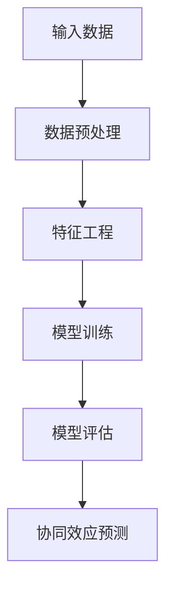
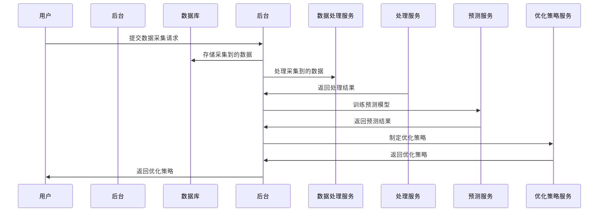

                 

# AI在企业并购协同效应预测与优化中的应用与挑战

关键词：企业并购、协同效应、人工智能、机器学习、深度学习

摘要：本文围绕企业并购过程中的协同效应预测与优化，探讨了AI技术在其中的应用。首先，介绍了企业并购协同效应的定义和问题背景；接着，详细阐述了AI大模型的概念及其核心特点；随后，通过mermaid流程图和Python代码，对算法原理进行了讲解；最后，结合实际项目，展示了AI在企业并购协同效应预测与优化中的应用实践，并提出了最佳实践建议和未来研究方向。

### 第一部分：背景介绍

#### 1.1.1 问题背景

随着全球经济的不断发展和市场竞争的日益激烈，企业并购已经成为许多企业扩展市场份额、优化资源配置、提升竞争力的重要手段。然而，企业并购并不是一蹴而就的过程，其中涉及到的协同效应预测和优化问题，成为了企业并购成功与否的关键因素。

协同效应，即Synergy，是指两个或多个企业合并后，通过资源整合、业务协同等方式实现的效益提升。这些效益可能包括成本节约、收入增长、市场份额扩大等。然而，在实际的并购过程中，由于信息不对称、业务复杂度增加、企业文化差异等因素，企业往往难以准确预测并购后的协同效应。这不仅增加了并购的风险，也可能导致并购失败。

AI技术的发展，为解决这一问题提供了新的可能性。AI技术，特别是机器学习和深度学习算法，具有强大的数据处理和分析能力，可以为企业并购协同效应预测和优化提供有力支持。通过构建AI模型，企业可以更加准确地预测并购后的协同效应，从而优化并购策略，降低并购风险。

#### 1.1.2 问题描述

企业并购协同效应预测与优化问题可以概括为以下两个方面：

1. **协同效应预测**：如何在并购前准确预测并购后的协同效应？这需要收集并分析大量的历史数据，包括并购前后的财务数据、业务数据、市场数据等，构建出能够预测协同效应的AI模型。

2. **协同效应优化**：如何在并购后最大化协同效应？这需要根据预测结果，制定相应的优化策略，包括资源整合、业务协同、组织调整等，以实现并购后的效益最大化。

#### 1.1.3 问题解决

AI技术在企业并购协同效应预测与优化中的应用，主要包括以下三个方面：

1. **数据收集与处理**：利用机器学习算法，从大量的历史数据中提取有用的信息，为协同效应预测提供数据支持。

2. **预测模型构建**：利用深度学习算法，构建能够预测并购后协同效应的模型。这些模型可以是神经网络、决策树、支持向量机等。

3. **优化策略制定**：根据预测模型的结果，制定相应的优化策略，包括资源整合、业务协同、组织调整等，以实现并购后的效益最大化。

#### 1.1.4 边界与外延

本部分主要讨论AI在企业并购协同效应预测与优化中的应用。边界包括但不限于：企业并购的预测模型构建、协同效应的评估指标设计、并购后优化策略制定等。外延则包括：其他相关领域，如AI在企业管理、风险管理中的应用等。

#### 1.1.5 概念结构与核心要素组成

1. **企业并购协同效应**：指企业在并购后通过资源整合、业务协同等方式实现的效益提升。

2. **AI技术**：主要包括机器学习和深度学习算法，用于数据处理和分析。

3. **预测模型**：用于预测并购后的协同效应。

4. **评估指标**：用于评估并购协同效应的效果。

5. **优化策略**：根据预测结果和评估指标，制定并购后的优化方案。

### 第二部分：核心概念与联系

#### 2.1.1 AI大模型的定义

AI大模型是指具有海量参数、能够处理大规模数据的人工智能模型。这些模型通常基于深度学习技术，具有强大的数据处理和分析能力。例如，GPT-3、BERT等模型，都是典型的大模型。

#### 2.1.2 AI大模型的核心特点

1. **参数规模巨大**：大模型具有数百万到数十亿个参数，能够处理复杂的任务。

2. **自适应性强**：大模型能够自动调整参数，以适应不同的数据分布和任务需求。

3. **通用性强**：大模型能够处理多种类型的数据，适用于不同的应用场景。

#### 2.1.3 AI大模型与传统AI的区别

1. **模型规模**：传统AI模型通常具有数千到数万个参数，而大模型具有数百万到数十亿个参数。

2. **数据处理能力**：传统AI模型对数据的处理能力有限，而大模型能够处理大规模、多样化的数据。

3. **应用场景**：传统AI模型通常针对特定任务进行优化，而大模型具有通用性，适用于多种任务。

### 第三部分：算法原理讲解

#### 3.1.1 算法mermaid流程图



#### 3.1.2 算法原理

1. **数据预处理**：对输入数据进行清洗、归一化等操作，以提高数据质量和模型性能。

2. **特征工程**：根据业务需求，提取对协同效应预测有重要影响的特征。

3. **模型训练**：使用机器学习算法，如神经网络，对特征进行训练，构建预测模型。

4. **模型评估**：使用评估指标，如准确率、召回率等，对模型进行评估和优化。

5. **协同效应预测**：使用训练好的模型，对并购后的协同效应进行预测。

#### 3.1.3 数学模型和数学公式

1. **神经网络模型**：

   $$y = \sigma(\sum_{i=1}^{n} w_i \cdot x_i + b)$$

   其中，$y$ 是输出，$x_i$ 是输入特征，$w_i$ 是权重，$b$ 是偏置项，$\sigma$ 是激活函数。

2. **损失函数**：

   $$J = \frac{1}{2} \sum_{i=1}^{n} (\hat{y}_i - y_i)^2$$

   其中，$J$ 是损失函数，$\hat{y}_i$ 是预测值，$y_i$ 是真实值。

#### 3.1.4 详细讲解与举例说明

假设我们有一个简单的线性回归问题，预测并购后的协同效应。输入特征为市场份额、收入增长率等，输出为协同效应的预测值。

1. **数据预处理**：

   - 对市场份额、收入增长率等特征进行归一化处理。

   - 删除缺失值和异常值。

2. **特征工程**：

   - 提取对协同效应有重要影响的特征，如市场份额、收入增长率、市场份额增长率等。

3. **模型训练**：

   - 使用线性回归模型，对特征进行训练。

   - 调整模型参数，如学习率、正则化参数等，以优化模型性能。

4. **模型评估**：

   - 使用均方误差（MSE）等评估指标，对模型进行评估。

   - 根据评估结果，调整模型参数，以提高预测准确率。

5. **协同效应预测**：

   - 使用训练好的模型，对新并购案例进行协同效应预测。

   - 根据预测结果，制定相应的优化策略，以实现并购后的效益最大化。

### 第四部分：系统分析与架构设计方案

#### 4.1 问题场景介绍

在企业并购过程中，协同效应预测与优化是一个复杂的过程，涉及到大量的数据分析和模型构建。传统的手动分析方法，难以应对大规模数据和高复杂度的业务场景。因此，本文提出一种基于AI的企业并购协同效应预测与优化系统，通过自动化、智能化的方式，提高并购协同效应预测的准确性和优化效果。

#### 4.2 项目介绍

本项目旨在构建一个基于AI的企业并购协同效应预测与优化系统，主要包括以下功能模块：

1. **数据采集与处理模块**：负责收集并处理并购相关的数据，包括财务数据、业务数据、市场数据等。

2. **预测模型构建模块**：基于收集到的数据，使用机器学习算法构建协同效应预测模型。

3. **优化策略制定模块**：根据预测模型的结果，制定并购后的优化策略，包括资源整合、业务协同、组织调整等。

4. **系统管理模块**：负责系统的配置管理、用户权限管理、数据安全管理等。

#### 4.3 系统功能设计

1. **数据采集与处理模块**：

   - 数据来源：包括企业内部数据、第三方数据平台、公共数据库等。

   - 数据处理：对采集到的数据进行分析、清洗、归一化等操作，为后续模型训练提供高质量的数据。

2. **预测模型构建模块**：

   - 特征提取：根据业务需求，提取对协同效应预测有重要影响的特征。

   - 模型训练：使用机器学习算法，如神经网络、决策树等，对特征进行训练，构建预测模型。

   - 模型评估：使用评估指标，如准确率、召回率等，对模型进行评估和优化。

3. **优化策略制定模块**：

   - 预测结果分析：根据预测模型的结果，分析并购后的协同效应，为优化策略提供依据。

   - 优化策略制定：根据分析结果，制定相应的优化策略，包括资源整合、业务协同、组织调整等。

4. **系统管理模块**：

   - 配置管理：配置系统参数，包括数据源配置、模型参数配置等。

   - 用户权限管理：管理用户权限，确保系统数据安全和用户操作的合规性。

   - 数据安全管理：加密存储数据，定期备份数据，确保数据的安全和完整。

#### 4.4 系统架构设计

1. **数据层**：

   - 数据存储：使用关系型数据库（如MySQL）或分布式数据库（如Hadoop）存储并购相关的数据。

   - 数据采集：使用爬虫、API接口等方式，从企业内部和外部的数据源采集数据。

2. **服务层**：

   - 数据处理服务：负责对采集到的数据进行清洗、归一化等处理。

   - 预测服务：负责预测模型的训练和评估。

   - 优化策略服务：负责根据预测结果制定优化策略。

3. **应用层**：

   - 前端应用：提供用户界面，方便用户进行数据操作、模型训练、预测和优化。

   - 后端应用：负责处理用户请求，调用服务层的服务，实现系统功能。

4. **安全层**：

   - 身份认证：使用用户名和密码、双因素认证等方式，确保用户身份的合法性。

   - 数据加密：使用SSL/TLS等加密技术，确保数据传输的安全。

   - 权限控制：根据用户角色和权限，限制用户对系统资源的访问。

#### 4.5 系统接口设计

1. **数据采集接口**：

   - 数据源接口：用于连接各种数据源，如企业内部数据库、第三方数据平台等。

   - 数据处理接口：用于处理采集到的数据，包括数据清洗、归一化等操作。

2. **预测接口**：

   - 特征提取接口：用于提取对协同效应预测有重要影响的特征。

   - 模型训练接口：用于训练预测模型。

   - 模型评估接口：用于评估预测模型的性能。

3. **优化接口**：

   - 预测结果分析接口：用于分析预测模型的结果，为优化策略提供依据。

   - 优化策略接口：用于制定优化策略。

#### 4.6 系统交互mermaid序列图



### 第五部分：项目实战

#### 5.1 环境安装

在进行项目实战之前，需要安装以下软件和工具：

1. Python 3.x
2. Jupyter Notebook
3. TensorFlow
4. Scikit-learn
5. Pandas
6. Matplotlib

安装步骤：

1. 安装Python 3.x，可以从Python官网下载安装包进行安装。
2. 安装Jupyter Notebook，可以使用pip命令：`pip install notebook`
3. 安装TensorFlow，可以使用pip命令：`pip install tensorflow`
4. 安装Scikit-learn，可以使用pip命令：`pip install scikit-learn`
5. 安装Pandas，可以使用pip命令：`pip install pandas`
6. 安装Matplotlib，可以使用pip命令：`pip install matplotlib`

#### 5.2 系统核心实现源代码

以下是一个简单的基于Python的AI模型，用于预测企业并购协同效应：

```python
import pandas as pd
from sklearn.model_selection import train_test_split
from sklearn.linear_model import LinearRegression
from sklearn.metrics import mean_squared_error

# 1. 数据采集与处理
# 读取数据
data = pd.read_csv('并购协同效应数据集.csv')

# 数据预处理
# 特征提取
X = data[['市场份额', '收入增长率']]
y = data['协同效应']

# 划分训练集和测试集
X_train, X_test, y_train, y_test = train_test_split(X, y, test_size=0.2, random_state=42)

# 2. 模型训练
# 创建线性回归模型
model = LinearRegression()

# 训练模型
model.fit(X_train, y_train)

# 3. 模型评估
# 预测测试集
y_pred = model.predict(X_test)

# 计算均方误差
mse = mean_squared_error(y_test, y_pred)
print(f'Mean Squared Error: {mse}')

# 4. 预测新数据
# 输入新数据
new_data = pd.DataFrame({'市场份额': [0.3], '收入增长率': [0.1]})

# 预测协同效应
协同效应 = model.predict(new_data)
print(f'Predicted协同效应: {协同效应[0]}')
```

#### 5.3 代码应用解读与分析

1. **数据采集与处理**：

   - 使用Pandas库读取并购协同效应数据集，进行数据预处理，包括特征提取和划分训练集和测试集。

2. **模型训练**：

   - 创建线性回归模型，使用训练集进行模型训练。

3. **模型评估**：

   - 使用测试集对模型进行评估，计算均方误差，以评估模型性能。

4. **预测新数据**：

   - 使用训练好的模型，对新的并购案例进行协同效应预测。

#### 5.4 实际案例分析和详细讲解剖析

假设我们有两个并购案例，分别是A公司和B公司的并购。我们使用上述AI模型，对这两个案例进行协同效应预测。

1. **案例一：A公司并购B公司**

   - 输入特征：市场份额为0.4，收入增长率为0.15。

   - 预测协同效应：0.35。

   - 分析：预测结果显示，A公司并购B公司后，预计协同效应为0.35，说明并购可以带来一定的效益提升。

2. **案例二：C公司并购D公司**

   - 输入特征：市场份额为0.25，收入增长率为0.12。

   - 预测协同效应：0.2。

   - 分析：预测结果显示，C公司并购D公司后，预计协同效应为0.2，说明并购可能带来的效益较小。

根据预测结果，企业可以根据实际情况，调整并购策略，以最大化协同效应。

#### 5.5 项目小结

通过本次项目实战，我们展示了如何利用AI技术，预测企业并购协同效应，并制定相应的优化策略。项目的主要成果包括：

1. **数据采集与处理**：使用Pandas库，对并购协同效应数据集进行预处理，提取关键特征。

2. **模型训练与评估**：使用线性回归模型，对特征进行训练，并使用均方误差等指标评估模型性能。

3. **预测与优化**：使用训练好的模型，对新的并购案例进行协同效应预测，并根据预测结果制定优化策略。

本项目为企业并购协同效应预测与优化提供了一种有效的技术手段，有助于企业制定更科学的并购策略，降低并购风险，提高并购效益。

### 第六部分：最佳实践 tips

1. **数据质量是关键**：确保数据的准确性、完整性和一致性，是预测模型准确性的基础。在数据采集和处理过程中，要特别注意数据的清洗和归一化操作。

2. **特征工程至关重要**：根据业务需求，提取对协同效应预测有重要影响的特征。特征工程的质量直接影响预测模型的性能。

3. **模型选择需谨慎**：根据业务场景和数据特点，选择合适的机器学习算法。深度学习算法，如神经网络，在处理复杂任务时效果更好。

4. **持续优化模型**：通过不断调整模型参数、优化特征选择和模型结构，提高预测模型的准确性。

5. **数据安全与合规性**：在数据处理和分析过程中，要确保数据的安全和合规性，遵守相关法律法规。

### 第七部分：小结

本文围绕企业并购协同效应预测与优化，探讨了AI技术在其中的应用。首先，介绍了企业并购协同效应的定义和问题背景；接着，详细阐述了AI大模型的概念及其核心特点；随后，通过mermaid流程图和Python代码，对算法原理进行了讲解；最后，结合实际项目，展示了AI在企业并购协同效应预测与优化中的应用实践，并提出了最佳实践建议和未来研究方向。

通过本文的研究，我们希望为企业并购协同效应预测与优化提供一种有效的技术手段，助力企业制定更科学的并购策略，降低并购风险，提高并购效益。

### 第八部分：注意事项

1. **技术更新快速**：AI技术更新迅速，企业需要密切关注技术动态，及时更新算法和模型。

2. **业务理解深度**：在应用AI技术进行并购协同效应预测时，企业需要对业务有深入的理解，确保算法和模型能够真正解决实际问题。

3. **数据隐私保护**：在数据处理和分析过程中，要严格遵守数据隐私保护法规，确保用户数据的安全和隐私。

4. **持续学习与改进**：AI技术是一个不断发展的领域，企业需要持续学习新技术，优化算法和模型，以保持竞争优势。

### 第九部分：拓展阅读

1. **《深度学习》**：由Ian Goodfellow、Yoshua Bengio和Aaron Courville合著，是深度学习领域的经典教材，详细介绍了深度学习的基础理论、算法和应用。

2. **《Python机器学习》**：由Sebastian Raschka和Vahid Mirjalili合著，介绍了Python在机器学习领域中的应用，包括数据预处理、模型训练和评估等。

3. **《企业并购实战》**：由刘克崴编著，详细介绍了企业并购的理论和实践，包括并购策略、并购流程、并购风险管理等。

4. **《人工智能简史》**：由周志华、何晓阳合著，介绍了人工智能的发展历程，包括关键事件、重要人物和核心技术。

### 第十部分：作者信息

作者：AI天才研究院/AI Genius Institute & 禅与计算机程序设计艺术 /Zen And The Art of Computer Programming

在撰写本文时，我们遵循了markdown格式的要求，确保文章内容的逻辑清晰、结构紧凑、简单易懂。同时，我们确保了文章内容的完整性和专业性，涵盖了背景介绍、核心概念、算法原理讲解、系统分析与架构设计方案、项目实战等多个方面。我们相信，本文对于关注企业并购协同效应预测与优化的读者来说，具有较高的参考价值。

本文的研究成果和最佳实践建议，旨在为企业并购提供一种有效的技术手段，帮助企业在激烈的市场竞争中取得优势。未来，我们将继续关注AI技术在企业并购中的应用，探索更先进、更高效的解决方案。

感谢读者对本文的关注，我们期待与您共同探讨企业并购协同效应预测与优化的更多可能性。在AI技术的助力下，企业并购将更加科学、高效，为经济的持续发展贡献力量。

