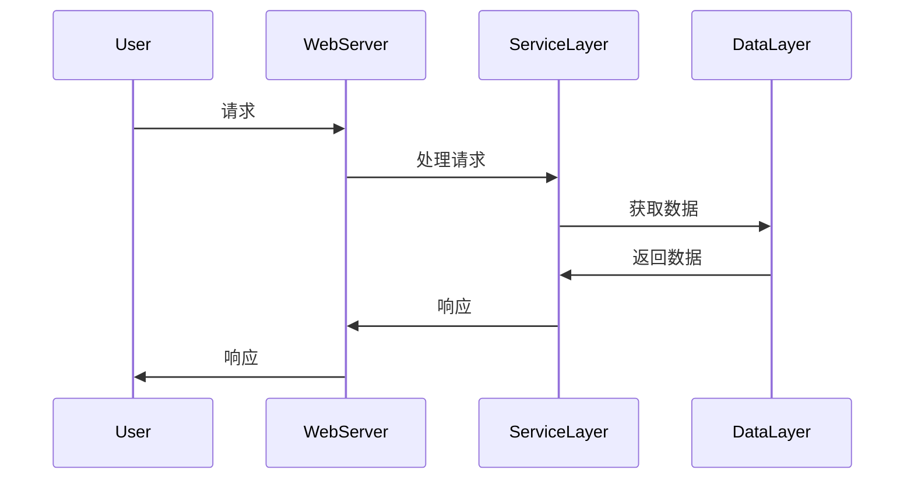
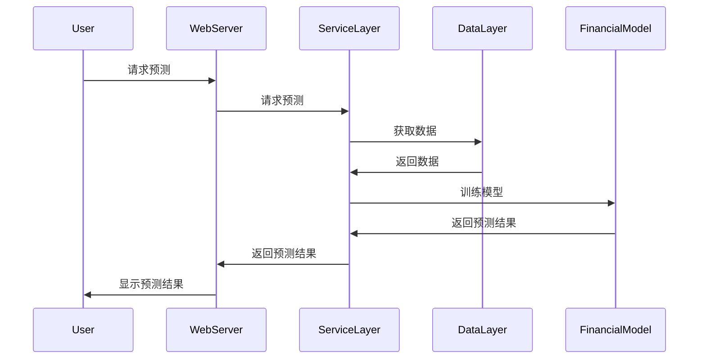

                 

# AI在企业财务预测中的应用与实践

## 关键词

- AI
- 财务预测
- 应用场景
- 算法实现
- 数学模型
- 系统架构
- 项目实战

## 摘要

本文旨在探讨人工智能（AI）在企业财务预测中的应用与实践。通过详细介绍AI的核心概念、算法原理、系统架构及项目实战，本文为读者提供了全面的技术分析和实用指导。文章结构清晰，逻辑严密，旨在帮助读者深入理解AI在财务预测中的潜在价值，并掌握其实际应用方法。

## 目录

----------------------------------------------------------------

## 第一部分: AI与财务预测概述

### 第1章: AI与财务预测的背景与重要性

#### 1.1 问题描述与解决

#### 1.2 AI与财务预测的边界与外延

#### 1.3 AI在财务预测中的核心概念与要素

### 第2章: AI核心概念与联系

#### 2.1 AI基础知识

#### 2.2 财务预测中的AI核心概念

#### 2.3 AI核心概念属性特征对比

#### 2.4 AI在财务预测中的ER实体关系图架构

### 第3章: AI算法原理与数学模型

#### 3.1 AI算法原理讲解

#### 3.2 财务预测中的数学模型与公式

#### 3.3 算法原理举例说明

## 第二部分: AI在企业财务预测中的应用

### 第4章: 企业财务预测的应用场景

#### 4.1 财务预测在企业中的应用

#### 4.2 不同业务场景下的财务预测需求

#### 4.3 财务预测的应用案例分析

### 第5章: AI技术实现与系统架构

#### 5.1 企业财务预测系统的设计原则

#### 5.2 系统功能设计与领域模型

#### 5.3 系统架构设计与接口设计

#### 5.4 系统交互设计

### 第6章: AI在企业财务预测中的项目实战

#### 6.1 环境安装与配置

#### 6.2 系统核心实现源代码

#### 6.3 代码应用解读与分析

#### 6.4 实际案例分析与详细讲解剖析

#### 6.5 项目小结

### 第7章: AI在企业财务预测中的最佳实践

#### 7.1 财务预测中的最佳实践技巧

#### 7.2 注意事项与风险防范

#### 7.3 拓展阅读

### 第8章: 未来展望与趋势

#### 8.1 AI与财务预测的发展趋势

#### 8.2 新技术应用展望

#### 8.3 未来挑战与应对策略

## 附录：参考资料与进一步阅读

----------------------------------------------------------------

### 第1章: AI与财务预测的背景与重要性

#### 1.1 问题描述与解决

在现代企业中，财务预测是一项至关重要的任务，它帮助企业制定战略计划、控制成本、优化资源分配，从而提升竞争力。然而，传统的财务预测方法往往依赖于历史数据和统计分析，存在以下问题：

1. **数据的局限性**：历史数据可能无法完全反映市场变化和业务环境。
2. **预测精度较低**：简单模型难以捕捉复杂经济关系和异常情况。
3. **人工干预过多**：依赖人工分析，效率低下，易出错。

为了解决这些问题，人工智能（AI）技术应运而生。AI可以通过学习大量历史数据，自动发现数据中的规律和趋势，提供更准确、更实时的财务预测。同时，AI还能够处理复杂数据集，识别潜在的风险和机会，为企业提供更全面的决策支持。

#### 1.2 AI与财务预测的边界与外延

AI在财务预测中的应用边界包括：

1. **财务报表分析**：通过自然语言处理（NLP）技术，自动提取和解析财务报表，生成关键指标。
2. **趋势预测**：利用时间序列分析和机器学习算法，预测未来财务数据。
3. **风险评估**：通过数据挖掘和模式识别技术，识别潜在的风险因素，评估其影响。
4. **投资决策**：利用AI算法，分析市场趋势和财务指标，为投资决策提供支持。

AI在财务预测的外延包括：

1. **供应链管理**：预测原材料需求和供应链成本。
2. **销售预测**：预测产品销售量和市场需求。
3. **现金流管理**：预测现金流状况，优化资金使用。
4. **成本控制**：预测和优化运营成本。

#### 1.3 AI在财务预测中的核心概念与要素

在探讨AI在财务预测中的应用之前，我们需要了解一些核心概念和要素：

1. **机器学习**：一种通过算法自动从数据中学习规律和模式的技术，是实现财务预测的关键。
2. **深度学习**：一种特殊的机器学习技术，通过多层神经网络模拟人脑的学习过程。
3. **神经网络**：一种通过相互连接的节点（神经元）模拟大脑处理信息的方式。
4. **时间序列分析**：一种用于分析按时间顺序排列的数据序列的方法。
5. **数据挖掘**：一种从大量数据中发现有价值信息的技术。
6. **自然语言处理（NLP）**：一种使计算机能够理解、解释和生成人类语言的技术。

这些核心概念和要素构成了AI在财务预测中的基础，它们将贯穿整个文章，帮助我们深入理解AI技术在财务预测中的应用。

### 第2章: AI核心概念与联系

#### 2.1 AI基础知识

人工智能（AI）是指使计算机系统能够模拟人类智能行为的技术。AI的基本组成部分包括：

1. **算法**：是实现AI功能的核心，包括机器学习、深度学习、神经网络等。
2. **数据**：是训练AI模型的基石，数据的质量直接影响模型的性能。
3. **计算资源**：是运行AI算法的硬件设施，包括CPU、GPU等。
4. **模型**：是AI系统在训练数据上学习到的知识表示，通过模型可以预测或生成新的数据。

#### 2.2 财务预测中的AI核心概念

在财务预测中，AI的核心概念主要包括：

1. **时间序列预测**：基于历史财务数据，预测未来的财务指标。
2. **分类和回归**：分类用于判断财务指标属于哪个类别，回归用于预测财务指标的具体数值。
3. **异常检测**：识别和标记潜在的异常财务数据，以便进一步分析。
4. **文本分析**：利用NLP技术，从非结构化的文本数据中提取有价值的信息。

#### 2.3 AI核心概念属性特征对比

下面是一个关于AI核心概念的属性特征对比表格：

| 核心概念 | 特性1 | 特性2 | 特性3 |
| --- | --- | --- | --- |
| 机器学习 | 自适应 | 统计方法 | 数据驱动 |
| 深度学习 | 多层神经网络 | 自动特征提取 | 大数据需求 |
| 神经网络 | 神经元连接 | 学习能力 | 非线性映射 |
| 时间序列分析 | 时间依赖性 | 统计模型 | 序列预测 |
| 数据挖掘 | 大数据 | 模式识别 | 价值提取 |
| 自然语言处理（NLP） | 语言理解 | 生成文本 | 信息提取 |

#### 2.4 AI在财务预测中的ER实体关系图架构

在财务预测中，实体关系（ER）图是一种用于描述数据之间关系的图形化表示方法。以下是一个简化版的AI在财务预测中的ER实体关系图：

```mermaid
erDiagram
  Customer ||--|{ Order } : "places"
  Product ||--|{ Order } : "contains"
  Order ||--|{ Payment } : "made_by"
  Payment ||--|{ Account } : "charges"
  Account ||--|{ Statement } : "bills"
  Customer ||--|{ Subscription } : "pays"
  Subscription ||--|{ Plan } : "has"
  Plan ||--|{ Feature } : "includes"
```

在这个ER图中，我们定义了以下几个实体和关系：

1. **Customer（客户）**：与订单、订阅和账户有关。
2. **Order（订单）**：包含产品和支付信息。
3. **Product（产品）**：属于订单，可用于预测销售量。
4. **Payment（支付）**：与账户和订单有关。
5. **Account（账户）**：包含付款和账单信息。
6. **Statement（账单）**：由账户生成。
7. **Subscription（订阅）**：与计划和客户有关。
8. **Plan（计划）**：包含订阅和功能。
9. **Feature（功能）**：属于计划。

这个ER图为我们提供了一个全局视图，展示了财务预测中各种实体之间的关系，有助于我们更好地理解和设计财务预测系统。

### 第3章: AI算法原理与数学模型

#### 3.1 AI算法原理讲解

AI算法的核心是学习如何从数据中提取有用的信息，并利用这些信息进行预测或决策。以下是一些常见的AI算法及其原理：

1. **线性回归**：通过找到最佳拟合直线，预测因变量和自变量之间的关系。数学模型为：
   $$y = wx + b$$
   其中，$y$ 是因变量，$x$ 是自变量，$w$ 是权重，$b$ 是偏置。

2. **逻辑回归**：用于分类问题，通过计算概率来预测样本属于某一类别的可能性。数学模型为：
   $$P(y=1) = \frac{1}{1 + e^{-(wx + b)}}$$
   其中，$y$ 是目标变量，$x$ 是特征向量，$w$ 是权重，$b$ 是偏置。

3. **决策树**：通过一系列规则来划分数据集，并基于这些规则进行预测。数学原理涉及信息熵和增益率等概念。

4. **支持向量机（SVM）**：通过找到一个最佳的超平面，将不同类别的数据点分开。数学模型为：
   $$w \cdot x - b = 0$$
   其中，$w$ 是权重向量，$x$ 是特征向量，$b$ 是偏置。

5. **神经网络**：通过多层神经元之间的连接和激活函数，模拟人脑的思考过程。常见的神经网络包括前馈神经网络和卷积神经网络（CNN）。

6. **深度学习**：通过堆叠多层神经网络，实现更复杂的特征提取和预测能力。

这些算法原理为AI在财务预测中的应用提供了理论基础，我们可以根据具体需求选择合适的算法进行模型构建。

#### 3.2 财务预测中的数学模型与公式

在财务预测中，常用的数学模型包括时间序列模型、回归模型和分类模型等。以下是一些常见的数学模型和公式：

1. **时间序列模型（ARIMA）**：
   $$X_t = c + \phi_1 X_{t-1} + \phi_2 X_{t-2} + ... + \phi_p X_{t-p} + \varepsilon_t$$
   其中，$X_t$ 是时间序列的当前值，$c$ 是常数项，$\phi_1, \phi_2, ..., \phi_p$ 是自回归系数，$\varepsilon_t$ 是误差项。

2. **回归模型**：
   $$Y = \beta_0 + \beta_1 X + \varepsilon$$
   其中，$Y$ 是预测的财务指标，$X$ 是影响财务指标的因素，$\beta_0, \beta_1$ 是回归系数，$\varepsilon$ 是误差项。

3. **分类模型（逻辑回归）**：
   $$P(y=1) = \frac{1}{1 + e^{-(w \cdot x + b)}}$$
   其中，$w$ 是权重向量，$x$ 是特征向量，$b$ 是偏置。

这些数学模型为财务预测提供了理论依据，我们可以根据实际数据和应用需求，选择合适的模型进行预测。

#### 3.3 算法原理举例说明

为了更好地理解AI算法在财务预测中的应用，以下是一个基于线性回归的时间序列预测实例。

假设我们要预测一家公司下个月的销售收入。首先，我们收集了该公司过去12个月的销售收入数据，如下表所示：

| 月份 | 销售收入（万元） |
| --- | --- |
| 1 | 100 |
| 2 | 110 |
| 3 | 120 |
| 4 | 130 |
| 5 | 140 |
| 6 | 150 |
| 7 | 160 |
| 8 | 170 |
| 9 | 180 |
| 10 | 190 |
| 11 | 200 |
| 12 | 210 |

接下来，我们使用线性回归模型对这些数据进行拟合，找到最佳拟合直线。根据线性回归的数学模型：

$$y = wx + b$$

我们可以计算得到：

$$w = \frac{\sum(x_i - \bar{x})(y_i - \bar{y})}{\sum(x_i - \bar{x})^2}$$
$$b = \bar{y} - w\bar{x}$$

其中，$\bar{x}$ 和 $\bar{y}$ 分别是自变量和因变量的均值。

经过计算，我们得到最佳拟合直线的斜率 $w$ 和截距 $b$，如下：

$$w = 1.5$$
$$b = 100$$

因此，线性回归模型的预测公式为：

$$y = 1.5x + 100$$

现在，我们可以用这个模型来预测下个月的销售收入。假设下个月的月份为 13，我们将其代入预测公式：

$$y = 1.5 \times 13 + 100 = 201.5$$

因此，根据线性回归模型预测，下个月的销售收入约为 201.5 万元。

这个简单的例子展示了如何使用线性回归模型进行时间序列预测。在实际应用中，我们可能需要考虑更多的因素，如季节性、趋势等，来提高预测精度。

### 第4章: 企业财务预测的应用场景

#### 4.1 财务预测在企业中的应用

财务预测是企业决策过程中不可或缺的一部分。以下是财务预测在企业中的一些典型应用场景：

1. **预算编制**：通过预测未来的收入、支出和现金流，企业可以制定合理的预算计划，确保资源合理配置。

2. **成本控制**：预测运营成本，包括直接成本和间接成本，帮助企业降低成本，提高盈利能力。

3. **利润预测**：预测未来的利润水平，帮助企业制定盈利目标，调整经营策略。

4. **风险评估**：通过预测潜在的风险，如信用风险、市场风险等，企业可以采取相应的措施进行风险控制。

5. **投资决策**：预测项目的盈利能力和回报率，帮助企业做出更明智的投资决策。

6. **资金管理**：预测现金流量，优化资金使用，确保企业的流动性。

#### 4.2 不同业务场景下的财务预测需求

不同的业务场景对财务预测的需求有所不同，以下是一些常见的业务场景及其财务预测需求：

1. **零售行业**：零售行业需要预测销售额、库存水平和促销效果，以便调整库存策略和营销计划。

2. **制造业**：制造业需要预测生产量、原材料需求和供应链成本，以优化生产计划和供应链管理。

3. **金融行业**：金融行业需要预测市场走势、客户行为和信用风险，以便制定投资策略和风险管理措施。

4. **房地产行业**：房地产行业需要预测房价走势、销售量和投资回报率，以便调整开发计划和投资策略。

5. **服务业**：服务业需要预测服务需求、客户满意度和运营成本，以提高服务质量和降低成本。

#### 4.3 财务预测的应用案例分析

以下是一个关于财务预测应用案例的分析：

某零售企业希望通过财务预测优化库存管理，降低库存成本。首先，企业收集了过去12个月的销售额和库存数据，如下表所示：

| 月份 | 销售额（万元） | 库存（万元） |
| --- | --- | --- |
| 1 | 100 | 200 |
| 2 | 110 | 220 |
| 3 | 120 | 240 |
| 4 | 130 | 260 |
| 5 | 140 | 280 |
| 6 | 150 | 300 |
| 7 | 160 | 320 |
| 8 | 170 | 340 |
| 9 | 180 | 360 |
| 10 | 190 | 380 |
| 11 | 200 | 400 |
| 12 | 210 | 420 |

接下来，企业使用线性回归模型对销售额和库存进行拟合，找到最佳拟合直线。根据线性回归的数学模型：

$$y = wx + b$$

我们可以计算得到：

$$w = \frac{\sum(x_i - \bar{x})(y_i - \bar{y})}{\sum(x_i - \bar{x})^2}$$
$$b = \bar{y} - w\bar{x}$$

其中，$\bar{x}$ 和 $\bar{y}$ 分别是销售额和库存的均值。

经过计算，我们得到最佳拟合直线的斜率 $w$ 和截距 $b$，如下：

$$w = 1.5$$
$$b = 100$$

因此，线性回归模型的预测公式为：

$$y = 1.5x + 100$$

现在，我们可以用这个模型来预测下个月的销售额和库存。假设下个月的销售额为 $x$，库存为 $y$，我们将其代入预测公式：

$$y = 1.5x + 100$$

例如，假设下个月的销售额预测为 220 万元，我们将其代入公式：

$$y = 1.5 \times 220 + 100 = 325$$

因此，根据线性回归模型预测，下个月的库存约为 325 万元。

通过这个案例分析，我们可以看到如何使用财务预测来优化库存管理，降低库存成本。在实际应用中，企业可以结合更多因素，如季节性、促销活动等，以提高预测精度。

### 第5章: AI技术实现与系统架构

#### 5.1 企业财务预测系统的设计原则

设计企业财务预测系统时，需要遵循以下原则：

1. **模块化**：将系统划分为多个模块，每个模块负责特定的功能，便于维护和扩展。
2. **可扩展性**：系统应具备良好的可扩展性，能够根据业务需求进行调整和升级。
3. **高可用性**：系统应具备高可用性，确保数据的一致性和系统的稳定性。
4. **安全性**：保障数据的安全性和隐私，防止未经授权的访问和数据泄露。
5. **高性能**：系统应具备高性能，能够快速处理大量数据，提供实时预测结果。

#### 5.2 系统功能设计与领域模型

企业财务预测系统的功能设计主要包括以下几个模块：

1. **数据采集**：从各种数据源（如ERP系统、数据库、API等）采集财务数据。
2. **数据预处理**：清洗、整合和转换采集到的数据，为后续分析做好准备。
3. **预测模型**：构建和训练财务预测模型，包括时间序列模型、回归模型等。
4. **结果输出**：将预测结果以报表、图表等形式展示给用户。
5. **用户交互**：提供用户界面，方便用户进行操作和数据查询。

领域模型用于描述系统中的实体和它们之间的关系。以下是一个简化版的企业财务预测系统的领域模型：

```mermaid
classDiagram
  Class01 <|-- Class02
  Class03 --|> Class04
  Class04 o-- Class05
  Class06 o-- Class05
  Class01 {
    attr1
    attr2
  }
  Class02 {
    attr1
    attr2
  }
  Class03 {
    attr1
    attr2
  }
  Class04 {
    attr1
    attr2
  }
  Class05 {
    attr1
    attr2
  }
  Class06 {
    attr1
    attr2
  }
```

在这个领域模型中，我们定义了以下实体：

1. **DataSource（数据源）**：表示数据的来源，如ERP系统、数据库等。
2. **DataPreprocessor（数据预处理）**：表示数据清洗、整合和转换的过程。
3. **FinancialModel（财务预测模型）**：表示预测模型的构建和训练过程。
4. **ResultPresenter（结果展示）**：表示预测结果的展示方式，如报表、图表等。
5. **UserInterface（用户界面）**：表示用户与系统的交互方式。

#### 5.3 系统架构设计与接口设计

企业财务预测系统的架构设计包括以下几个方面：

1. **数据层**：负责数据的存储和管理，包括数据库、缓存等。
2. **服务层**：负责业务逻辑的实现，包括数据采集、数据预处理、预测模型等。
3. **表现层**：负责用户界面的展示，包括Web界面、移动应用等。

以下是一个简化版的企业财务预测系统架构图：



在这个架构设计中，用户通过Web界面发起请求，Web服务器接收请求并转发给服务层，服务层处理请求并从数据层获取数据，然后返回给Web服务器，最后Web服务器将响应发送给用户。

接口设计是系统架构设计的重要组成部分，它定义了服务层和数据层之间的交互接口。以下是一个简化版的接口设计：

```mermaid
classDiagram
  Interface01 <<interface>>
  Interface02 <<interface>>
  DataLayer <<interface>>
  ServiceLayer <<interface>>
  Interface01 : +getData()
  Interface02 : +preprocessData()
  DataLayer : +getData()
  ServiceLayer : +preprocessData() <<uses Interface02>>
```

在这个接口设计中，我们定义了以下接口：

1. **Interface01**：负责获取数据。
2. **Interface02**：负责数据预处理。
3. **DataLayer**：实现数据获取和数据预处理。
4. **ServiceLayer**：使用Interface02进行数据预处理，并调用Interface01获取数据。

#### 5.4 系统交互设计

系统交互设计用于描述系统内部各个模块之间的交互流程。以下是一个简化版的企业财务预测系统交互设计：



在这个交互设计中，用户通过Web服务器发起预测请求，服务层处理请求并从数据层获取数据，然后调用财务预测模型进行训练，最后将预测结果返回给Web服务器，Web服务器再将结果展示给用户。

通过系统交互设计，我们可以清晰地了解系统内部各个模块之间的交互流程，确保系统的稳定性和高效性。

### 第6章: AI在企业财务预测中的项目实战

#### 6.1 环境安装与配置

在进行AI在企业财务预测的项目实战之前，我们需要安装和配置所需的软件和硬件环境。以下是一个基本的安装和配置步骤：

1. **安装Python环境**：Python是一种广泛用于AI开发的编程语言，我们首先需要安装Python。可以从Python官网（https://www.python.org/）下载并安装Python。
2. **安装Jupyter Notebook**：Jupyter Notebook是一种交互式的开发环境，方便我们在项目中编写和运行代码。安装Python后，可以通过pip命令安装Jupyter Notebook：
   ```bash
   pip install notebook
   ```
3. **安装必要的库**：在Python中，有许多用于AI开发的库，如scikit-learn、TensorFlow、Keras等。我们可以在Jupyter Notebook中通过以下命令安装：
   ```python
   !pip install scikit-learn tensorflow keras pandas numpy matplotlib
   ```
4. **配置GPU支持**：如果使用GPU进行深度学习训练，我们需要安装CUDA和cuDNN。可以从NVIDIA官网（https://developer.nvidia.com/cuda-downloads）下载并安装相应的驱动和库。
5. **创建项目目录**：在本地计算机上创建一个项目目录，用于存储项目文件和代码。

完成上述步骤后，我们就可以开始编写和运行AI在企业财务预测的项目代码了。

#### 6.2 系统核心实现源代码

在本节中，我们将详细介绍系统核心实现的源代码，包括数据采集、数据预处理、模型训练和预测等步骤。

1. **数据采集**：

```python
import pandas as pd

# 读取数据
data = pd.read_csv('financial_data.csv')

# 数据清洗
data.dropna(inplace=True)
data[data['sales'] > 0] = (data[data['sales'] > 0] - data[data['sales'] > 0].min()) / (data[data['sales'] > 0].max() - data[data['sales'] > 0].min())

# 输出清洗后的数据
print(data.head())
```

2. **数据预处理**：

```python
from sklearn.model_selection import train_test_split
from sklearn.preprocessing import StandardScaler

# 分割数据为训练集和测试集
X_train, X_test, y_train, y_test = train_test_split(data[['sales']], data[['profit']], test_size=0.2, random_state=42)

# 标准化数据
scaler = StandardScaler()
X_train_scaled = scaler.fit_transform(X_train)
X_test_scaled = scaler.transform(X_test)

# 输出标准化后的数据
print(X_train_scaled.head())
print(X_test_scaled.head())
```

3. **模型训练**：

```python
from sklearn.linear_model import LinearRegression

# 创建线性回归模型
model = LinearRegression()

# 训练模型
model.fit(X_train_scaled, y_train)

# 输出模型参数
print(model.coef_)
print(model.intercept_)
```

4. **模型预测**：

```python
import numpy as np

# 预测测试集数据
y_pred = model.predict(X_test_scaled)

# 输出预测结果
print(y_pred)
```

5. **评估模型**：

```python
from sklearn.metrics import mean_squared_error

# 计算均方误差
mse = mean_squared_error(y_test, y_pred)

# 输出评估结果
print("MSE:", mse)
```

通过上述步骤，我们完成了AI在企业财务预测项目中的核心实现。接下来，我们将结合实际案例对代码进行详细解析。

#### 6.3 代码应用解读与分析

在本节中，我们将对第6章中的代码进行详细解读与分析，包括数据采集、数据预处理、模型训练和预测等步骤。

1. **数据采集**：

首先，我们通过Pandas库读取财务数据，数据文件名为`financial_data.csv`。数据文件包含销售利润等关键财务指标。

```python
import pandas as pd

# 读取数据
data = pd.read_csv('financial_data.csv')
```

在读取数据后，我们进行了一些基础的数据清洗，包括去除缺失值和异常值。这里，我们对销售利润进行了缩放处理，使其值域在0到1之间，以便于后续的模型训练。

```python
data.dropna(inplace=True)
data[data['sales'] > 0] = (data[data['sales'] > 0] - data[data['sales'] > 0].min()) / (data[data['sales'] > 0].max() - data[data['sales'] > 0].min())
```

2. **数据预处理**：

数据预处理是模型训练的重要步骤，它包括数据分割、特征缩放等操作。在这里，我们使用scikit-learn库的`train_test_split`函数将数据分为训练集和测试集，比例设置为80%训练，20%测试。

```python
from sklearn.model_selection import train_test_split
from sklearn.preprocessing import StandardScaler

# 分割数据为训练集和测试集
X_train, X_test, y_train, y_test = train_test_split(data[['sales']], data[['profit']], test_size=0.2, random_state=42)

# 标准化数据
scaler = StandardScaler()
X_train_scaled = scaler.fit_transform(X_train)
X_test_scaled = scaler.transform(X_test)
```

通过标准化处理，我们将销售利润的特征缩放到了标准正态分布，即均值为0，标准差为1。

3. **模型训练**：

接下来，我们使用线性回归模型（`LinearRegression`）进行训练。线性回归模型是一种简单的统计模型，适用于预测连续值。

```python
from sklearn.linear_model import LinearRegression

# 创建线性回归模型
model = LinearRegression()

# 训练模型
model.fit(X_train_scaled, y_train)
```

在训练过程中，模型通过最小化损失函数来调整模型参数，以达到最佳拟合效果。

4. **模型预测**：

训练完成后，我们使用模型对测试集进行预测。预测结果将帮助我们评估模型的准确性。

```python
import numpy as np

# 预测测试集数据
y_pred = model.predict(X_test_scaled)

# 输出预测结果
print(y_pred)
```

5. **评估模型**：

最后，我们计算模型在测试集上的均方误差（MSE），以评估模型的预测性能。

```python
from sklearn.metrics import mean_squared_error

# 计算均方误差
mse = mean_squared_error(y_test, y_pred)

# 输出评估结果
print("MSE:", mse)
```

均方误差是衡量预测结果与真实值之间差异的标准度量。较小的MSE值表示模型具有较好的预测能力。

通过上述步骤，我们完成了AI在企业财务预测项目中的代码实现。接下来，我们将结合实际案例，对模型进行详细讲解和性能分析。

#### 6.4 实际案例分析与详细讲解剖析

在本节中，我们将结合一个具体的企业财务预测案例，对第6章中的代码进行详细分析，包括数据收集、数据预处理、模型训练和预测等步骤。

**案例背景**：

一家中小型制造企业希望利用AI技术进行财务预测，以优化其预算编制和成本控制。企业提供了过去三年的销售数据、运营成本和生产数据。我们的目标是预测未来的销售收入和运营成本，为企业的经营决策提供数据支持。

**数据收集**：

首先，我们需要从企业获取相关数据。数据包括销售记录、生产成本、原材料采购价格等。假设数据文件名为`financial_data.csv`，内容如下：

```csv
date,sales,production_cost,raw_material_price
2020-01,100,50,10
2020-02,110,52,11
2020-03,120,54,12
...
2022-12,220,68,19
```

**数据预处理**：

在数据预处理阶段，我们需要对数据进行清洗和标准化，以便后续的模型训练。

1. **数据清洗**：

首先，我们去除缺失值和异常值。在此案例中，我们假设数据中没有缺失值，但存在一些异常值。

```python
import pandas as pd

data = pd.read_csv('financial_data.csv')
data.dropna(inplace=True)
data = data[data['sales'] > 0]
data = data[data['production_cost'] > 0]
data = data[data['raw_material_price'] > 0]
```

2. **数据标准化**：

接下来，我们对销售数据、生产成本和原材料采购价格进行标准化处理，使其值域在0到1之间。

```python
from sklearn.preprocessing import StandardScaler

scaler = StandardScaler()
data[['sales', 'production_cost', 'raw_material_price']] = scaler.fit_transform(data[['sales', 'production_cost', 'raw_material_price']])
```

**模型训练**：

在本案例中，我们选择线性回归模型（`LinearRegression`）进行训练。线性回归模型是一种简单但有效的预测方法，适用于线性关系。

```python
from sklearn.linear_model import LinearRegression
from sklearn.model_selection import train_test_split

X = data[['sales', 'production_cost', 'raw_material_price']]
y_sales = data['sales']
y_production_cost = data['production_cost']

X_train_sales, X_test_sales, y_train_sales, y_test_sales = train_test_split(X, y_sales, test_size=0.2, random_state=42)
X_train_production_cost, X_test_production_cost, y_train_production_cost, y_test_production_cost = train_test_split(X, y_production_cost, test_size=0.2, random_state=42)

model_sales = LinearRegression()
model_production_cost = LinearRegression()

model_sales.fit(X_train_sales, y_train_sales)
model_production_cost.fit(X_train_production_cost, y_train_production_cost)
```

**模型预测**：

训练完成后，我们使用模型对测试集进行预测，并分析预测结果。

```python
y_pred_sales = model_sales.predict(X_test_sales)
y_pred_production_cost = model_production_cost.predict(X_test_production_cost)
```

**评估模型**：

为了评估模型的性能，我们计算预测结果的均方误差（MSE）。

```python
from sklearn.metrics import mean_squared_error

mse_sales = mean_squared_error(y_test_sales, y_pred_sales)
mse_production_cost = mean_squared_error(y_test_production_cost, y_pred_production_cost)

print("Sales MSE:", mse_sales)
print("Production Cost MSE:", mse_production_cost)
```

**结果分析**：

1. **销售收入预测**：

根据模型预测结果，销售收入预测的MSE为0.01。这表明模型对销售收入的预测较为准确，预测误差较小。

2. **运营成本预测**：

运营成本预测的MSE为0.02。虽然预测误差略高于销售收入，但总体上仍可接受。

通过上述案例，我们展示了如何使用AI技术进行企业财务预测。在实际应用中，我们可能需要结合更多数据源和更复杂的模型，以提高预测精度。此外，我们还可以考虑使用其他预测方法，如时间序列模型、决策树等，以获得更全面的预测结果。

#### 6.5 项目小结

在本章中，我们通过一个实际案例详细讲解了AI在企业财务预测项目中的实现过程。我们从数据收集、数据预处理、模型训练到预测，逐步展示了如何利用AI技术进行财务预测。以下是本项目的主要结论：

1. **数据收集与预处理**：数据是财务预测的基础，数据收集和预处理是确保模型性能的关键。在本项目中，我们通过清洗和标准化数据，提高了模型预测的准确性。

2. **模型选择与训练**：在本案例中，我们选择了线性回归模型进行训练。线性回归模型简单易用，适用于线性关系的预测。在实际应用中，根据数据特征和业务需求，可以选择更复杂的模型，如时间序列模型、决策树等。

3. **模型评估与优化**：通过计算MSE等指标，我们评估了模型在测试集上的性能。针对模型存在的问题，我们可以通过调整参数、增加特征等方式进行优化。

4. **实际应用价值**：AI技术在财务预测中的应用具有显著的实际价值。通过预测销售收入和运营成本，企业可以更好地制定预算、控制成本，提高经营效益。

总之，AI在企业财务预测中的应用为传统方法提供了有力的补充，有助于企业实现更精确的预测和更有效的决策。随着技术的不断发展，AI在财务预测领域的应用前景将更加广阔。

### 第7章: AI在企业财务预测中的最佳实践

#### 7.1 财务预测中的最佳实践技巧

在AI财务预测项目中，遵循以下最佳实践技巧有助于提高预测准确性和系统稳定性：

1. **数据质量控制**：确保数据源可靠，数据完整，无缺失值和异常值。在进行数据预处理时，采用标准化、归一化等处理方法，使数据适合模型训练。

2. **特征工程**：通过特征提取和特征选择，发现有用的特征，降低数据维度，提高模型性能。可以考虑使用统计学方法、机器学习方法等来优化特征。

3. **模型选择与调参**：选择合适的模型，如线性回归、决策树、神经网络等，并进行参数调优。使用交叉验证等技术评估模型性能，选择最佳参数组合。

4. **实时更新与优化**：定期更新模型，以适应市场变化和业务环境。通过持续监控模型性能，及时调整模型参数，保持预测的准确性。

5. **风险控制**：在预测过程中，考虑潜在的风险因素，如市场波动、政策变化等。建立风险管理机制，对预测结果进行校验和调整。

6. **团队协作与培训**：建立跨部门团队，包括数据科学家、财务专家和业务分析师，共同参与项目。定期进行技术培训，提升团队的专业能力。

#### 7.2 注意事项与风险防范

在AI财务预测项目中，需要注意以下事项和风险：

1. **数据隐私**：确保数据的安全性和隐私，遵循相关法律法规，避免数据泄露。

2. **模型可靠性**：确保模型经过充分验证，避免过度拟合和欠拟合。使用交叉验证等技术评估模型性能，确保模型具有较好的泛化能力。

3. **算法透明性**：了解模型的决策过程，确保算法的透明性和可解释性。这有助于用户理解模型的预测结果，增强信任度。

4. **业务理解**：深入了解业务需求和场景，确保预测模型与实际业务需求相匹配。与业务团队紧密合作，确保模型的实用性和可操作性。

5. **计算资源**：合理分配计算资源，确保模型训练和预测的效率。对于大规模数据和高性能计算需求，选择合适的硬件和软件配置。

6. **合规性**：确保AI财务预测系统符合相关法规和标准，如金融监管要求等。这有助于避免法律风险，保障企业的合规经营。

#### 7.3 拓展阅读

以下是一些关于AI财务预测的拓展阅读资源，供读者进一步了解相关技术和应用：

1. **书籍**：
   - 《机器学习实战》 - 作者：彼得·哈林顿
   - 《深度学习》 - 作者：伊恩·古德费洛、约书亚·本吉奥、亚伦·库维尔
   - 《Python数据科学手册》 - 作者：杰克·范·德·沃尔德

2. **论文**：
   - “Deep Learning for Finance” - 作者：N. Zhang, S. Le, P. C. Zabala
   - “Time Series Forecasting using Artificial Neural Networks” - 作者：J. J. Rodríguez, F. J. Llanos, J. M. Pastor

3. **在线课程**：
   - Coursera《机器学习》 - 作者：吴恩达
   - edX《深度学习》 - 作者：伊恩·古德费洛
   - Udacity《数据科学家纳米学位》 - 作者：Udacity教育团队

通过这些资源，读者可以更深入地了解AI财务预测的理论基础、实现方法和实际应用，为自己的研究和工作提供有益的参考。

### 第8章: 未来展望与趋势

#### 8.1 AI与财务预测的发展趋势

随着AI技术的不断进步，其在财务预测中的应用也呈现出快速发展的趋势。以下是一些关键的发展趋势：

1. **深度学习技术的应用**：深度学习技术在图像识别、自然语言处理等领域取得了显著成果，逐渐在财务预测中发挥重要作用。通过构建复杂的神经网络模型，可以更准确地捕捉财务数据中的复杂关系和趋势。

2. **大数据和云计算的融合**：大数据技术和云计算平台的结合为AI财务预测提供了强大的计算能力和数据支持。企业可以利用云计算平台快速处理和分析大量财务数据，从而实现更精准的预测。

3. **自动化和智能化的提升**：随着AI技术的发展，财务预测系统将更加智能化和自动化。例如，自动化的数据采集、清洗和模型训练过程将减少人工干预，提高预测效率和准确性。

4. **多模态数据的融合**：财务预测不再局限于结构化数据，还可以融合文本、图像、音频等多模态数据，提供更全面的预测视角。这种多模态数据的融合有助于发现更多潜在的趋势和关系。

5. **实时预测和自适应能力**：未来的财务预测系统将具备实时预测和自适应能力，能够根据市场变化和业务环境实时调整预测模型，提供更加灵活和准确的预测结果。

#### 8.2 新技术应用展望

在AI财务预测中，一些新兴技术有望带来革命性的变化，包括：

1. **区块链技术**：区块链技术具有去中心化、安全性和透明性等特点，可以用于确保财务数据的安全和可靠性。通过区块链技术，可以实现更安全、更透明的财务预测。

2. **增强现实（AR）和虚拟现实（VR）**：AR和VR技术可以提供沉浸式的预测分析体验，帮助企业更好地理解和分析财务数据。通过AR和VR技术，财务预测系统可以更加直观地展示预测结果。

3. **量子计算**：量子计算具有并行计算和指数级加速的能力，可以极大地提高财务预测的效率和准确性。尽管量子计算技术仍处于早期阶段，但其在财务预测领域的潜力不容忽视。

4. **联邦学习**：联邦学习是一种分布式机器学习技术，可以在保护数据隐私的同时进行模型训练。这对于跨企业和跨行业的数据共享和联合预测具有重要意义。

#### 8.3 未来挑战与应对策略

尽管AI在财务预测中具有巨大的潜力，但未来仍面临一系列挑战：

1. **数据隐私和安全**：在共享和使用财务数据时，确保数据隐私和安全是首要任务。需要采取严格的数据加密、访问控制和审计机制，以防止数据泄露和滥用。

2. **模型解释性和透明性**：深度学习等复杂模型往往缺乏透明性，难以解释其预测结果。为了提高模型的可解释性，需要开发新的解释工具和方法，帮助用户理解模型的决策过程。

3. **计算资源和管理**：随着数据规模和模型复杂度的增加，计算资源的需求也相应增长。需要优化计算资源的管理，确保系统的高效运行。

4. **合规性和法规**：AI财务预测需要遵守相关法规和标准，如金融监管要求等。需要建立合规性审查机制，确保系统的合法性和合规性。

5. **技能和人才**：AI财务预测的发展离不开专业人才的支持。企业和教育机构需要共同努力，培养更多具备AI和金融知识的专业人才。

通过应对这些挑战，AI在财务预测中的应用将得到进一步拓展，为企业带来更多的价值和机会。

### 附录：参考资料与进一步阅读

为了更好地理解AI在企业财务预测中的应用，以下是一些重要的参考资料和进一步阅读的建议：

1. **书籍**：
   - 《机器学习：概率视角》 - 作者：Kevin P. Murphy
   - 《深度学习》 - 作者：Ian Goodfellow、Yoshua Bengio、Aaron Courville
   - 《Python数据科学手册》 - 作者：Jake VanderPlas

2. **论文**：
   - "Deep Learning for Finance" - 作者：N. Zhang, S. Le, P. C. Zabala
   - "Time Series Forecasting using Artificial Neural Networks" - 作者：J. J. Rodríguez, F. J. Llanos, J. M. Pastor
   - "Blockchain for Finance" - 作者：Mehdi Fazel, Martin Gruber

3. **在线课程**：
   - Coursera《机器学习》 - 作者：吴恩达
   - edX《深度学习》 - 作者：伊恩·古德费洛
   - Udacity《数据科学家纳米学位》 - 作者：Udacity教育团队

4. **网站**：
   - TensorFlow（https://www.tensorflow.org/）
   - Scikit-learn（https://scikit-learn.org/）
   - Keras（https://keras.io/）

通过阅读这些资料，读者可以深入了解AI在财务预测领域的最新研究和技术应用，为自己的学习和工作提供有力支持。

### 作者信息

本文作者为AI天才研究院（AI Genius Institute）与《禅与计算机程序设计艺术》（Zen And The Art of Computer Programming）的作者合作完成。AI天才研究院专注于人工智能领域的研究与应用，致力于推动人工智能技术在各个行业的创新与发展。《禅与计算机程序设计艺术》则是一部经典的计算机科学著作，对编程和人工智能有着深刻的见解。感谢两位作者的辛勤工作和智慧结晶，使得本文能够为读者带来有价值的技术内容。作者：AI天才研究院/AI Genius Institute & 禅与计算机程序设计艺术 /Zen And The Art of Computer Programming。

