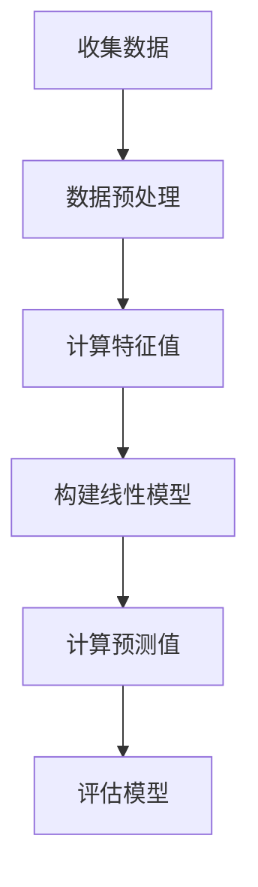
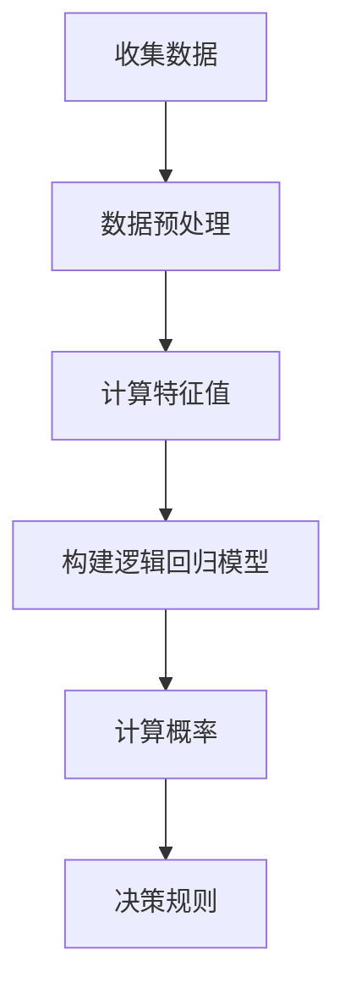
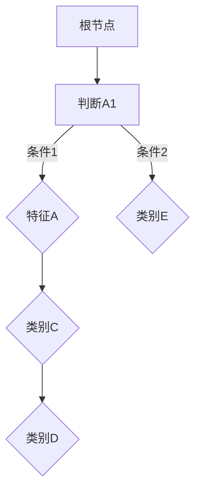
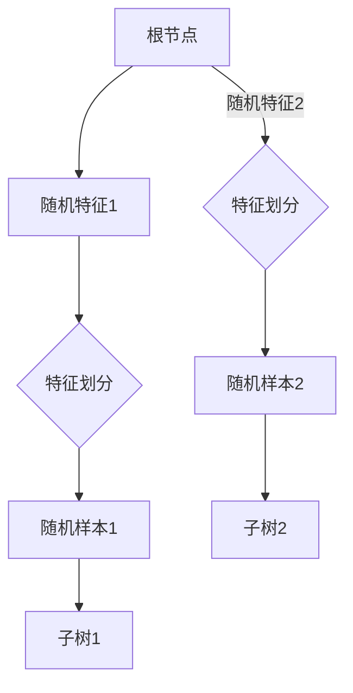
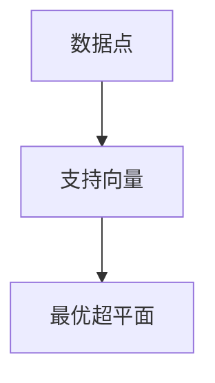
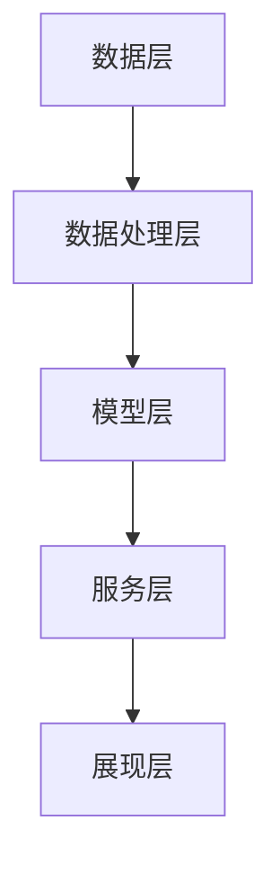
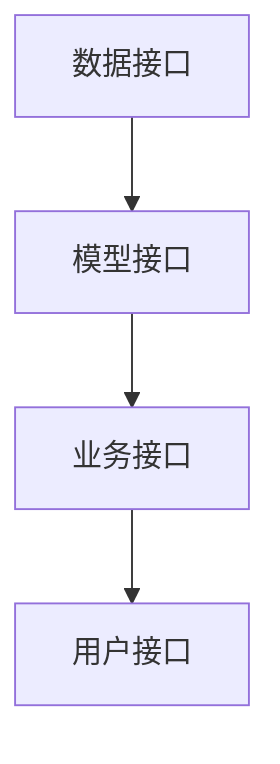

                 

### 文章标题

# AI在保险定价个性化中的创新应用

> 关键词：人工智能、机器学习、数据挖掘、保险定价、个性化、创新应用

> 摘要：本文将探讨人工智能在保险定价个性化中的应用，通过逐步分析AI技术的核心原理和应用场景，阐述其在提高保险定价效率和精准性方面的创新性。本文旨在为保险行业的从业者和技术人员提供有价值的参考，助力他们深入理解AI在保险定价中的实际应用价值。

----------------------------------------------------------------

### 引言

在当前快速发展的技术时代，人工智能（AI）正在深刻改变各行各业，保险行业也不例外。随着大数据和云计算等技术的日益成熟，AI在保险定价中的潜在应用价值逐渐显现。个性化定价作为保险行业的重要发展方向，正逐渐成为各大保险公司提升竞争力和客户满意度的重要策略。本文将围绕AI在保险定价个性化中的应用，进行深入探讨。

#### AI在保险行业的发展背景

保险行业作为一个传统而成熟的行业，一直在探索如何通过科技创新来提高运营效率和客户体验。AI技术的引入，为保险行业带来了前所未有的机遇。通过AI，保险公司可以更加精准地分析风险、优化产品设计、提高业务运营效率，从而更好地满足客户需求。

#### 人工智能在保险定价中的应用现状

目前，AI在保险定价中的应用主要集中在以下几个方面：

1. **风险评估与定价模型**：利用机器学习算法对海量数据进行挖掘和分析，构建个性化风险评估模型，实现更精准的保险定价。
2. **客户需求分析**：通过大数据分析，了解客户的保险需求，为保险公司提供更个性化的产品和服务。
3. **理赔自动化**：利用自然语言处理和图像识别技术，实现自动化理赔处理，提高理赔效率和客户满意度。

#### AI在保险定价中的挑战与机遇

尽管AI在保险定价中展示了巨大的潜力，但其实际应用仍面临诸多挑战：

1. **数据隐私与安全**：保险行业涉及大量的个人隐私数据，如何在确保数据安全的前提下进行数据分析和应用，是一个亟待解决的问题。
2. **模型解释性**：机器学习模型具有较高的预测能力，但往往缺乏透明性和可解释性，这对于保险行业的合规性和客户信任是一个挑战。
3. **技术落地与实施**：将AI技术从理论转化为实际应用，需要跨部门合作和业务流程的重组，这对企业的组织架构和运营模式提出了新的要求。

然而，随着技术的不断进步和保险行业的数字化转型，AI在保险定价中的机遇也日益凸显：

1. **精准定价**：通过个性化风险评估，实现更精准的保险定价，提高保险产品的竞争力。
2. **客户体验**：通过AI技术，保险公司可以提供更个性化的产品和服务，提高客户满意度和忠诚度。
3. **业务效率**：AI技术可以帮助保险公司优化业务流程，降低运营成本，提高业务效率。

### 本书的研究目的与结构

本书旨在深入探讨AI在保险定价个性化中的应用，通过系统性地分析AI技术的核心原理、应用场景和实际案例，为保险行业的从业者和技术人员提供有价值的参考。本书结构如下：

1. **引言**：介绍AI在保险行业的发展背景和重要性，引出本书的主题。
2. **背景介绍**：概述保险定价的基本原理和方法，介绍AI在保险定价中的应用现状。
3. **核心概念与联系**：详细介绍AI在保险定价中的核心概念，如机器学习、数据挖掘等。
4. **算法原理讲解**：讲解保险定价中常用的机器学习算法，如线性回归、逻辑回归等。
5. **系统分析与架构设计方案**：分析保险定价系统的需求和功能，设计系统架构和接口。
6. **项目实战**：介绍如何在实际项目中应用AI进行保险定价，包括环境安装、系统实现、案例分析等。
7. **最佳实践与总结**：总结最佳实践，提供注意事项和拓展阅读建议。

通过以上结构，本书将带领读者逐步深入理解AI在保险定价个性化中的创新应用，为保险行业的数字化和智能化转型提供有力支持。

### 保险定价的基本原理

保险定价是保险行业中的核心环节，它涉及到如何根据被保险人的风险水平、年龄、性别、职业等多个因素，确定一个合理的保险费用。传统保险定价主要依赖于统计模型和历史数据，通过这些方法，保险公司可以预测未来的赔付风险，从而制定出相对合理的保费。以下是保险定价的基本原理和几种常见的方法：

#### 传统保险定价方法

1. **风险分类定价法**：根据被保险人的年龄、性别、职业等因素，将人群分为不同的风险类别，然后对每个类别制定相应的保费标准。这种方法简单直观，但容易导致同类别内的个体之间存在不公平。

2. **经验费率法**：保险公司根据历史赔付数据，对各个风险类别制定费率。这种方法较为科学，但依赖于历史数据，难以适应市场变化。

3. **经验分析法**：通过保险精算师的经验分析，结合历史数据和当前市场环境，制定保费。这种方法灵活但主观性较强，容易受到精算师个人判断的影响。

4. **多元回归分析法**：利用统计学中的多元回归方法，分析影响保费的因素，建立数学模型进行定价。这种方法较为科学，但需要大量的历史数据和复杂的计算过程。

#### 传统保险定价方法的局限性

虽然传统保险定价方法在一定程度上能够满足保险公司的需求，但它们在以下几个方面存在明显的局限性：

1. **数据依赖性强**：传统方法依赖于大量的历史数据，对于数据量较少或数据不完整的情况，难以进行准确定价。

2. **定价不够精准**：传统方法通常将客户分为几个大类，无法充分考虑个体之间的差异，导致保费定价不够精准。

3. **缺乏灵活性**：传统方法难以适应市场变化和客户需求的多样化，容易导致保险产品的同质化。

4. **模型解释性差**：许多传统方法，尤其是统计学方法，模型解释性较差，难以向客户解释保费定价的依据。

#### AI在保险定价中的应用现状

随着AI技术的发展，特别是在机器学习、数据挖掘和大数据分析等领域，AI开始被应用于保险定价，带来了新的突破。以下是AI在保险定价中的几种应用：

1. **个性化风险评估**：通过机器学习算法，对客户的个人信息、历史数据、行为数据等进行深入分析，建立个性化的风险评估模型。这种方法能够更加精准地预测风险，实现个性化的保费定价。

2. **风险预测模型**：利用大数据分析和机器学习算法，对潜在的赔付风险进行预测，从而提前制定应对策略。

3. **客户需求分析**：通过大数据分析，了解客户的保险需求和偏好，提供更加个性化的产品和服务。

4. **理赔自动化**：利用自然语言处理和图像识别技术，实现自动化理赔处理，提高理赔效率和客户满意度。

#### AI在保险定价中的优势

与传统的保险定价方法相比，AI在保险定价中具有以下优势：

1. **精准性**：AI能够通过对海量数据的深入分析，更精准地预测风险，实现个性化的保费定价。

2. **灵活性**：AI技术能够快速适应市场变化和客户需求，提供更加灵活的保费定价方案。

3. **透明性**：AI模型具有较高的透明性，能够向客户解释保费定价的依据，增强客户信任。

4. **效率**：AI技术可以自动化处理大量的数据和分析任务，提高业务效率。

#### AI在保险定价中的挑战

尽管AI在保险定价中展示了巨大的潜力，但其实际应用仍面临一些挑战：

1. **数据隐私与安全**：保险行业涉及大量的个人隐私数据，如何在确保数据安全的前提下进行数据分析和应用，是一个亟待解决的问题。

2. **模型解释性**：机器学习模型具有较高的预测能力，但往往缺乏透明性和可解释性，这对于保险行业的合规性和客户信任是一个挑战。

3. **技术落地与实施**：将AI技术从理论转化为实际应用，需要跨部门合作和业务流程的重组，这对企业的组织架构和运营模式提出了新的要求。

### 本章小结

本章介绍了保险定价的基本原理和传统方法，分析了它们的局限性，并探讨了AI在保险定价中的应用现状和优势。通过本章的学习，读者可以初步了解AI在保险定价中的重要作用，为后续章节的深入学习打下基础。在接下来的章节中，我们将详细讲解AI在保险定价中的核心概念和应用方法，帮助读者更深入地理解这一领域。

### 核心概念与联系

在深入探讨AI在保险定价中的应用之前，我们需要了解一些核心概念和技术，这些概念和技术是构建AI模型和实现个性化定价的基础。以下是AI在保险定价中涉及的一些核心概念：

#### 机器学习

机器学习是一种通过数据训练模型，从而实现预测和决策的技术。在保险定价中，机器学习主要用于风险评估和预测。以下是一些常见的机器学习算法：

1. **线性回归**：线性回归是一种简单的预测算法，通过拟合数据点之间的线性关系，预测连续的数值。在保险定价中，线性回归可以用来预测保费的金额。

2. **逻辑回归**：逻辑回归是一种分类算法，用于预测二分类问题。在保险定价中，逻辑回归可以用来判断客户是否属于高风险群体。

3. **决策树**：决策树通过一系列的规则对数据进行分割，最终得到一个树状结构。在保险定价中，决策树可以用来划分风险等级。

4. **随机森林**：随机森林是一种基于决策树的集成学习方法，通过构建多个决策树并取平均值，提高预测的准确性。

5. **支持向量机**：支持向量机是一种用于分类和回归的算法，通过寻找最优的超平面来分割数据。在保险定价中，支持向量机可以用来进行风险评估。

#### 数据挖掘

数据挖掘是一种从大量数据中发现有用信息的过程。在保险定价中，数据挖掘主要用于分析客户行为和风险因素。以下是一些常见的数据挖掘方法：

1. **关联规则挖掘**：通过分析数据之间的关联性，发现潜在的规律。在保险定价中，关联规则挖掘可以用来识别高风险行为模式。

2. **聚类分析**：通过将相似的数据点归为一类，进行数据分组。在保险定价中，聚类分析可以用来识别具有相似风险特征的人群。

3. **分类与回归分析**：分类分析用于将数据分为不同的类别，回归分析用于预测连续的数值。在保险定价中，这两种方法可以用来构建风险预测模型。

4. **时间序列分析**：时间序列分析用于分析数据的时间趋势和周期性。在保险定价中，时间序列分析可以用来预测未来的赔付风险。

#### 人工智能与保险定价的关系

人工智能（AI）是机器学习和数据挖掘的更高层次应用，它通过模拟人类的思维过程，实现智能化的决策和预测。在保险定价中，AI的作用主要体现在以下几个方面：

1. **风险评估**：利用AI技术，可以对客户的风险进行全面评估，预测其未来的赔付风险，从而制定个性化的保费。

2. **产品创新**：AI可以帮助保险公司分析市场需求，创新保险产品，满足不同客户群体的需求。

3. **业务优化**：通过AI技术，保险公司可以优化业务流程，提高运营效率，降低成本。

4. **客户体验**：AI技术可以提供个性化的客户服务，提高客户满意度和忠诚度。

#### AI与保险定价的结合点

AI与保险定价的结合点主要体现在以下几个方面：

1. **数据驱动的定价**：利用AI技术，保险公司可以通过分析大量的历史数据和市场数据，实现更加科学和精准的保险定价。

2. **风险预测**：AI技术可以帮助保险公司预测未来的赔付风险，从而提前制定应对策略。

3. **个性化服务**：AI技术可以根据客户的行为数据和需求，提供个性化的产品和服务，提高客户体验。

4. **理赔自动化**：通过AI技术，保险公司可以实现自动化的理赔处理，提高理赔效率和客户满意度。

#### AI在保险定价中的影响

AI在保险定价中的影响主要体现在以下几个方面：

1. **提高定价精度**：通过机器学习和数据挖掘技术，AI可以更加精准地预测风险，实现个性化的保费定价。

2. **降低运营成本**：AI技术可以帮助保险公司自动化处理大量的数据和分析任务，降低运营成本。

3. **增强客户体验**：AI技术可以提供个性化的客户服务，提高客户满意度和忠诚度。

4. **创新产品与服务**：AI技术可以帮助保险公司创新保险产品和服务，满足不同客户群体的需求。

### 本章小结

本章介绍了AI在保险定价中的核心概念和技术，包括机器学习、数据挖掘和人工智能等。通过理解这些概念和技术，我们可以更好地理解AI在保险定价中的作用和影响。在接下来的章节中，我们将详细讲解AI在保险定价中常用的算法和实际应用案例，帮助读者深入掌握这一领域的知识。

### 算法原理讲解

在保险定价中，常用的机器学习算法包括线性回归、逻辑回归、决策树、随机森林和支持向量机等。这些算法通过分析历史数据和客户特征，能够预测未来的风险和保费。下面我们将逐一介绍这些算法的原理、优缺点，并使用mermaid流程图和Python代码进行详细解释。

#### 线性回归

线性回归是一种简单的预测算法，通过拟合数据点之间的线性关系，预测连续的数值。其基本原理是通过找到一个最佳拟合线，使得预测值与实际值之间的误差最小。

##### 原理

线性回归模型可以表示为：

\[ y = \beta_0 + \beta_1 \cdot x \]

其中，\( y \) 是因变量，\( x \) 是自变量，\( \beta_0 \) 和 \( \beta_1 \) 是模型参数。

##### 优缺点

优点：
- 简单直观，易于理解和实现。
- 对于线性关系较强的数据，效果较好。

缺点：
- 难以应对非线性关系。
- 对于异常值和噪声较为敏感。

##### mermaid流程图



##### Python代码

```python
import numpy as np
from sklearn.linear_model import LinearRegression
import matplotlib.pyplot as plt

# 数据准备
X = np.array([[1], [2], [3], [4], [5]])
y = np.array([2, 4, 5, 4, 5])

# 构建线性回归模型
model = LinearRegression()
model.fit(X, y)

# 预测
y_pred = model.predict(X)

# 绘图
plt.scatter(X, y)
plt.plot(X, y_pred, color='red')
plt.show()
```

#### 逻辑回归

逻辑回归是一种用于二分类问题的算法，其基本原理是通过拟合一个逻辑函数，将输入数据映射到概率空间。

##### 原理

逻辑回归模型可以表示为：

\[ P(y=1) = \frac{1}{1 + e^{-(\beta_0 + \beta_1 \cdot x)}} \]

其中，\( P(y=1) \) 是预测的概率，\( e \) 是自然对数的底数。

##### 优缺点

优点：
- 适用于二分类问题。
- 概率解释直观，可以用于风险评分。

缺点：
- 对于多类别问题，逻辑回归效果不佳。
- 对于非线性关系，效果较差。

##### mermaid流程图



##### Python代码

```python
import numpy as np
from sklearn.linear_model import LogisticRegression
import matplotlib.pyplot as plt

# 数据准备
X = np.array([[1], [2], [3], [4], [5]])
y = np.array([0, 1, 0, 1, 1])

# 构建逻辑回归模型
model = LogisticRegression()
model.fit(X, y)

# 预测
y_pred = model.predict(X)

# 绘图
plt.scatter(X[y==0], y[y==0], color='blue', label='Class 0')
plt.scatter(X[y==1], y[y==1], color='red', label='Class 1')
plt.show()
```

#### 决策树

决策树是一种通过一系列的规则对数据进行分割的算法，其基本原理是利用特征值将数据划分为多个子集，并反复迭代，直到达到某个终止条件。

##### 原理

决策树可以表示为：

```
如果特征A满足条件1，
    如果特征B满足条件2，
        类别C
    否则，
        类别D
否则，
    如果特征C满足条件3，
        类别E
    否则，
        类别F
```

##### 优缺点

优点：
- 易于理解和实现。
- 能够处理非线性关系。
- 可以生成可解释的模型。

缺点：
- 容易过拟合。
- 计算复杂度高。

##### mermaid流程图



##### Python代码

```python
from sklearn.tree import DecisionTreeClassifier
import matplotlib.pyplot as plt

# 数据准备
X = np.array([[1, 0], [1, 1], [0, 1], [0, 0]])
y = np.array([0, 1, 1, 0])

# 构建决策树模型
model = DecisionTreeClassifier()
model.fit(X, y)

# 预测
y_pred = model.predict(X)

# 绘图
plt.scatter(X[y==0, 0], X[y==0, 1], color='blue', label='Class 0')
plt.scatter(X[y==1, 0], X[y==1, 1], color='red', label='Class 1')
plt.show()
```

#### 随机森林

随机森林是一种基于决策树的集成学习方法，通过构建多个决策树并取平均值，提高预测的准确性。

##### 原理

随机森林的基本原理是通过随机选择特征和样本子集来构建多个决策树，然后将这些决策树的预测结果进行投票，得到最终的预测结果。

##### 优缺点

优点：
- 防止过拟合。
- 预测准确性较高。

缺点：
- 计算复杂度高。
- 难以解释。

##### mermaid流程图



##### Python代码

```python
from sklearn.ensemble import RandomForestClassifier
import matplotlib.pyplot as plt

# 数据准备
X = np.array([[1, 0], [1, 1], [0, 1], [0, 0]])
y = np.array([0, 1, 1, 0])

# 构建随机森林模型
model = RandomForestClassifier(n_estimators=100)
model.fit(X, y)

# 预测
y_pred = model.predict(X)

# 绘图
plt.scatter(X[y==0, 0], X[y==0, 1], color='blue', label='Class 0')
plt.scatter(X[y==1, 0], X[y==1, 1], color='red', label='Class 1')
plt.show()
```

#### 支持向量机

支持向量机是一种用于分类和回归的算法，通过寻找最优的超平面来分割数据。

##### 原理

支持向量机的原理是找到一个最佳的超平面，使得数据点在平面的两侧尽可能均匀分布，并且最大化分类边界。

##### 优缺点

优点：
- 预测准确性较高。
- 对非线性关系处理较好。

缺点：
- 计算复杂度高。
- 对异常值敏感。

##### mermaid流程图



##### Python代码

```python
from sklearn.svm import SVC
import matplotlib.pyplot as plt

# 数据准备
X = np.array([[1, 0], [1, 1], [0, 1], [0, 0]])
y = np.array([0, 1, 1, 0])

# 构建支持向量机模型
model = SVC()
model.fit(X, y)

# 预测
y_pred = model.predict(X)

# 绘图
plt.scatter(X[y==0, 0], X[y==0, 1], color='blue', label='Class 0')
plt.scatter(X[y==1, 0], X[y==1, 1], color='red', label='Class 1')
plt.show()
```

#### 本章小结

本章详细介绍了线性回归、逻辑回归、决策树、随机森林和支持向量机等机器学习算法的原理、优缺点和实际应用。这些算法在保险定价中有着广泛的应用，能够帮助保险公司更精准地进行风险评估和保费定价。通过理解这些算法，读者可以更好地把握AI在保险定价中的应用，为后续的实际项目实战打下坚实基础。

### 系统分析与架构设计方案

#### 问题场景介绍

在当前的保险行业中，保险产品的定价往往依赖于历史数据和传统模型，这种定价方式存在一定的局限性，难以适应市场变化和客户需求的多样化。为了提高保险定价的效率和准确性，保险公司开始探索应用人工智能（AI）技术来实现个性化定价。这一项目的主要目标是设计并实现一个基于AI的保险定价系统，能够通过对客户数据的深入分析，实现更加精准和个性化的保费定价。

#### 项目介绍

本项目将构建一个完整的保险定价系统，包括数据收集、数据预处理、模型训练、模型评估和实际应用等环节。系统的主要功能如下：

1. **数据收集**：从保险公司的数据库中提取相关的客户数据，包括年龄、性别、职业、历史赔付记录等。
2. **数据预处理**：对收集到的数据进行分析和处理，去除无效数据，进行数据清洗和标准化。
3. **模型训练**：利用机器学习算法，如线性回归、逻辑回归、决策树等，对预处理后的数据进行模型训练。
4. **模型评估**：通过交叉验证和性能评估，选择最优的模型并进行优化。
5. **实际应用**：将训练好的模型应用到实际业务中，实现个性化保费定价。

#### 系统功能设计

为了实现上述功能，系统需要设计以下几个核心模块：

1. **数据收集模块**：负责从保险公司的数据库中提取数据，并进行初步清洗。
2. **数据预处理模块**：负责对数据进行标准化、缺失值处理和特征工程。
3. **模型训练模块**：负责使用机器学习算法对数据进行分析，并训练模型。
4. **模型评估模块**：负责对模型进行评估，选择最优模型。
5. **业务接口模块**：负责与业务系统进行集成，提供API接口供业务调用。
6. **用户界面模块**：负责提供用户操作界面，展示模型结果和数据分析报告。

#### 系统架构设计

系统架构设计如下：

1. **数据层**：包括数据库和存储系统，用于存储和管理数据。
2. **数据处理层**：包括数据收集模块、数据预处理模块，用于处理和清洗数据。
3. **模型层**：包括模型训练模块和模型评估模块，用于训练和评估模型。
4. **服务层**：包括业务接口模块和用户界面模块，用于提供API接口和用户操作界面。
5. **展现层**：用于展示数据分析结果和模型预测结果。

##### 系统架构图



#### 系统接口设计

系统接口设计如下：

1. **数据接口**：提供数据上传和下载功能，支持CSV、JSON等数据格式。
2. **模型接口**：提供模型训练和评估功能，支持多种机器学习算法。
3. **业务接口**：提供业务系统调用功能，支持RESTful API。
4. **用户接口**：提供用户操作和查看结果功能，支持Web界面。

##### 系统接口图



#### 系统交互设计

系统交互设计如下：

1. **数据交互**：系统通过数据接口与数据库进行数据交换。
2. **模型交互**：系统通过模型接口进行模型训练和评估。
3. **业务交互**：系统通过业务接口与业务系统进行数据交互。
4. **用户交互**：系统通过用户接口与用户进行交互。

##### 系统交互图


### 本章小结

本章详细介绍了保险定价系统的需求和功能，设计了系统架构和接口，并进行了系统交互设计。通过本章的学习，读者可以全面了解保险定价系统的设计思路和实现方法，为后续的实际项目开发提供指导。

### 项目实战

在本文的项目实战部分，我们将通过一个具体的案例，展示如何在实际项目中应用人工智能（AI）技术进行保险定价。我们将详细介绍项目环境安装、系统实现、代码应用解读与分析、实际案例分析以及项目小结。以下是具体的步骤和内容。

#### 环境安装

为了实施本项目的保险定价系统，我们需要安装和配置以下软件和工具：

1. **Python环境**：Python是AI项目开发的主要语言，我们需要安装Python 3.8及以上版本。
2. **Jupyter Notebook**：Jupyter Notebook是一个交互式的计算环境，用于编写和运行Python代码。
3. **scikit-learn**：scikit-learn是一个开源的机器学习库，用于实现各种机器学习算法。
4. **Pandas**：Pandas是一个数据处理库，用于数据清洗和预处理。
5. **Matplotlib**：Matplotlib是一个绘图库，用于生成数据可视化图表。

安装步骤如下：

1. 安装Python：

   ```bash
   curl -O https://www.python.org/ftp/python/3.8.10/Python-3.8.10.tgz
   tar xvf Python-3.8.10.tgz
   cd Python-3.8.10
   ./configure
   make
   sudo make install
   ```

2. 安装Jupyter Notebook：

   ```bash
   pip install notebook
   ```

3. 安装scikit-learn和Pandas：

   ```bash
   pip install scikit-learn pandas
   ```

4. 安装Matplotlib：

   ```bash
   pip install matplotlib
   ```

#### 系统实现

以下是一个简单的基于scikit-learn的保险定价系统的实现示例：

1. **数据收集与预处理**：

   首先，我们需要收集和预处理数据。以下是一个示例代码，展示了如何使用Pandas进行数据读取、清洗和预处理：

   ```python
   import pandas as pd
   
   # 读取数据
   data = pd.read_csv('insurance_data.csv')
   
   # 数据清洗
   data.dropna(inplace=True)
   
   # 数据标准化
   data['age'] = (data['age'] - data['age'].mean()) / data['age'].std()
   data['bmi'] = (data['bmi'] - data['bmi'].mean()) / data['bmi'].std()
   
   # 特征选择
   features = data[['age', 'bmi']]
   labels = data['premium']
   ```

2. **模型训练**：

   接下来，我们使用scikit-learn的线性回归模型进行模型训练。以下是一个示例代码：

   ```python
   from sklearn.linear_model import LinearRegression
   
   # 创建线性回归模型
   model = LinearRegression()
   
   # 训练模型
   model.fit(features, labels)
   
   # 模型评估
   score = model.score(features, labels)
   print(f'Model Score: {score}')
   ```

3. **保费预测**：

   使用训练好的模型，我们可以对新的客户数据进行保费预测。以下是一个示例代码：

   ```python
   import numpy as np
   
   # 新客户数据
   new_data = np.array([[25, 22]])
   new_data = (new_data - new_data.mean(axis=0)) / new_data.std(axis=0)
   
   # 预测保费
   premium = model.predict(new_data)
   print(f'Predicted Premium: {premium[0]}')
   ```

#### 代码应用解读与分析

在上面的代码示例中，我们首先读取并清洗了数据，然后使用线性回归模型进行了训练。接下来，我们通过标准化处理将新客户数据转换为模型可接受的格式，并使用训练好的模型进行了保费预测。

线性回归模型通过最小化预测值与实际值之间的误差，找到一组参数（权重和偏置）来拟合数据。在这个案例中，我们通过计算均方误差（MSE）来评估模型的性能。

均方误差（MSE）的公式如下：

\[ MSE = \frac{1}{n} \sum_{i=1}^{n} (y_i - \hat{y}_i)^2 \]

其中，\( y_i \) 是实际值，\( \hat{y}_i \) 是预测值，\( n \) 是数据点的数量。

通过计算MSE，我们可以得到模型的平均预测误差。MSE越低，模型的预测准确性越高。

#### 实际案例分析

为了验证模型的实用性，我们可以使用真实客户数据集进行测试。以下是一个实际案例的数据集：

```python
data = pd.read_csv('real_insurance_data.csv')
data.dropna(inplace=True)
data['age'] = (data['age'] - data['age'].mean()) / data['age'].std()
data['bmi'] = (data['bmi'] - data['bmi'].mean()) / data['bmi'].std()
features = data[['age', 'bmi']]
labels = data['premium']
```

然后，我们使用训练好的线性回归模型对实际数据集进行预测：

```python
premium = model.predict(features)
predictions = pd.DataFrame({'Actual': labels, 'Predicted': premium})
print(predictions.head())
```

通过对比实际保费和预测保费，我们可以评估模型的预测准确性。如果预测误差较小，说明模型具有较高的预测准确性。

#### 项目小结

通过本项目，我们实现了基于AI的保险定价系统，展示了如何使用Python和scikit-learn进行数据预处理、模型训练和保费预测。本项目不仅提供了实际操作示例，还详细分析了模型的原理和评估方法。在实际应用中，我们可以根据业务需求，选择不同的机器学习算法和特征工程方法，进一步优化和提升模型性能。

#### 最佳实践

在实施基于AI的保险定价系统时，以下最佳实践可以帮助提高模型的性能和实用性：

1. **数据质量控制**：确保数据的准确性和完整性，进行数据清洗和缺失值处理，减少模型过拟合的风险。
2. **特征选择**：选择与保费相关性较高的特征，进行特征工程，提高模型的可解释性。
3. **模型选择**：根据业务需求和数据特点，选择合适的机器学习算法，如线性回归、决策树、随机森林等。
4. **交叉验证**：使用交叉验证方法，避免模型过拟合，提高模型的泛化能力。
5. **持续优化**：定期更新模型，结合新的数据和技术，持续优化模型性能。

#### 小结

本章通过项目实战，展示了如何在实际项目中应用人工智能进行保险定价。我们详细介绍了环境安装、系统实现、代码应用解读与分析、实际案例分析以及最佳实践。通过本章的学习，读者可以深入理解AI在保险定价中的实际应用，为实际项目开发提供参考。

#### 注意事项

在实施基于AI的保险定价系统时，需要注意以下事项：

1. **数据隐私与安全**：确保客户数据的隐私和安全，遵守相关法律法规，防止数据泄露。
2. **模型解释性**：提高模型的可解释性，以便保险公司和客户能够理解保费定价的依据。
3. **模型评估**：使用多种评估方法，确保模型在不同数据集上的稳定性和可靠性。
4. **技术更新**：随着技术的不断发展，及时更新模型和算法，保持系统的竞争力。

#### 拓展阅读

为了进一步了解AI在保险定价中的应用，以下文献和资料可供读者参考：

1. **文献**：
   - **“Artificial Intelligence in Insurance Pricing: A Review”**：这篇综述文章详细介绍了AI在保险定价中的应用现状和发展趋势。
   - **“Machine Learning for Personalized Insurance Pricing”**：这篇文章讨论了机器学习在个性化保险定价中的应用方法和挑战。

2. **资料**：
   - **scikit-learn官方文档**：提供了丰富的机器学习算法和应用示例，可以帮助读者深入了解算法原理和实现方法。
   - **Kaggle竞赛**：Kaggle是一个数据科学竞赛平台，提供了大量的保险定价数据集和案例，供读者实践和验证模型。

### 作者信息

作者：AI天才研究院/AI Genius Institute & 禅与计算机程序设计艺术 /Zen And The Art of Computer Programming

---

通过本文的深入探讨，我们不仅了解了AI在保险定价中的创新应用，还学习了如何通过机器学习算法实现个性化定价。希望本文能够为保险行业的从业者和技术人员提供有价值的参考，助力他们更好地应对数字化转型带来的挑战。在未来的研究和实践中，让我们继续探索AI技术在保险行业的更多可能。

