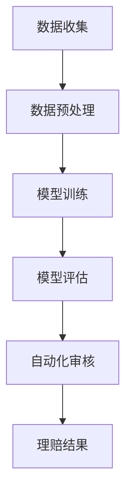
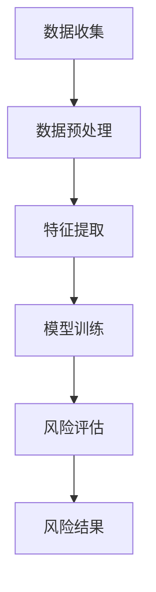
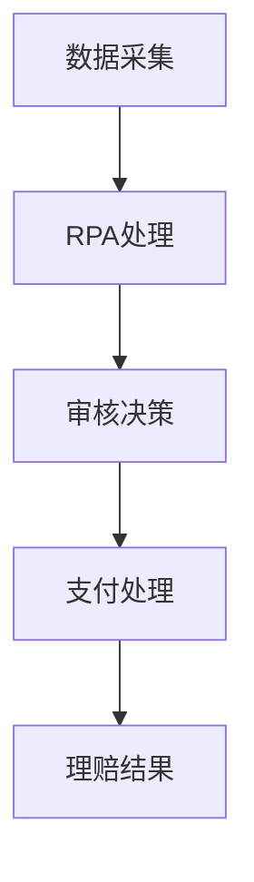
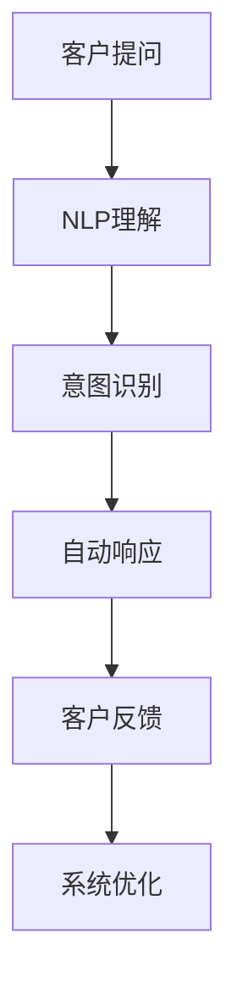
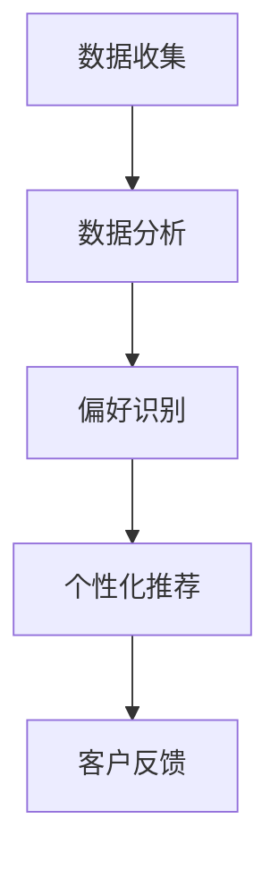
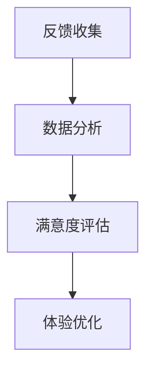

                 

## 引言

### 保险理赔流程优化与客户体验提升的重要性

保险理赔流程的优化和客户体验的提升是保险行业持续发展的重要课题。传统的保险理赔流程通常较为繁琐，涉及到大量的纸质文档和人工审核，这不仅增加了保险公司的工作量，还延长了理赔时间，影响了客户的满意度。因此，通过引入AI技术，可以显著提升保险理赔的效率和准确性，同时为客户提供更加便捷和个性化的服务。

### AI技术的应用价值

AI技术，特别是机器学习和深度学习，在数据分析和模式识别方面具有卓越的能力。通过这些技术，保险公司可以自动化处理大量的理赔申请，识别潜在的风险和欺诈行为，从而优化理赔流程，减少错误和纠纷。此外，AI技术还可以用于个性化推荐、客户服务自动化，从而提升客户体验。

### 本文结构

本文将分为以下几个部分：

1. **保险理赔流程概述**：介绍保险理赔的基本概念、传统模式及其存在的问题。
2. **AI技术概述**：介绍AI的基本概念、分类及其在保险业的应用前景。
3. **AI在保险理赔流程优化中的应用**：详细分析AI技术在理赔自动审核、风险评估和流程自动化中的应用。
4. **AI在提升客户体验中的应用**：探讨AI技术在客户服务、个性化服务和客户体验监测中的应用。
5. **AI模型与算法介绍**：介绍机器学习、深度学习算法及其在保险理赔中的应用。
6. **案例分析**：通过具体案例分析，展示AI技术在保险理赔流程优化与客户体验提升中的实际应用。
7. **最佳实践与未来展望**：总结最佳实践经验，提出未来发展的方向。

### 目的与目标

本文旨在通过详细分析AI技术在保险理赔流程优化与客户体验提升中的应用，为保险公司提供可行的技术解决方案，帮助行业实现数字化转型，提高运营效率和客户满意度。文章结构紧凑，逻辑清晰，旨在让读者能够逐步理解和掌握相关技术，并应用于实际工作中。

## 关键词

- 保险理赔流程
- AI技术
- 机器学习
- 深度学习
- 客户体验
- 优化
- 自动化
- 风险评估
- 数据分析

### 摘要

本文深入探讨了AI技术在保险理赔流程优化与客户体验提升中的应用。首先，介绍了保险理赔流程的传统模式及其存在的问题，然后详细分析了AI技术的基本概念和分类，特别是在数据分析和模式识别方面的优势。接着，本文重点讨论了AI在理赔自动审核、风险评估和流程自动化中的应用，以及AI在提升客户服务、个性化服务和客户体验监测方面的贡献。通过具体案例分析，展示了AI技术在实际应用中的效果和挑战。最后，本文总结了AI在保险业中的应用最佳实践，并对未来发展方向进行了展望。

## 保险理赔流程概述

### 核心概念术语说明

在讨论保险理赔流程之前，我们需要明确一些核心概念和术语：

- **保险理赔**：当被保险人在保险合同规定范围内发生保险事故时，向保险公司提出赔偿请求的过程。
- **理赔申请**：被保险人向保险公司提交的索赔请求文件。
- **理赔审核**：保险公司对理赔申请进行审核，以确定是否满足保险合同规定。
- **理赔支付**：保险公司根据审核结果向被保险人支付赔偿金额。

### 问题背景

传统的保险理赔流程通常包括以下几个主要步骤：

1. **报案**：被保险人发生保险事故后，首先需要向保险公司报案。
2. **提交理赔申请**：被保险人根据保险公司要求提交相应的理赔申请文件，包括事故证明、医疗费用单据等。
3. **理赔审核**：保险公司对提交的理赔申请进行审核，包括事实核实、责任认定、费用评估等。
4. **理赔支付**：审核通过后，保险公司向被保险人支付赔偿金额。

然而，这一流程存在一些问题：

- **效率低下**：传统的理赔流程依赖于大量的纸质文档和人工审核，导致理赔周期较长。
- **错误率高**：人工审核容易产生错误，特别是面对复杂和重复性的工作。
- **客户体验差**：长时间的等待和不透明的流程降低了客户的满意度。

### 问题描述

保险理赔流程中的主要问题包括：

1. **审核周期长**：由于审核流程繁琐，理赔周期往往较长，影响客户的满意度。
2. **错误率较高**：人工审核容易出错，导致理赔申请被误判或遗漏。
3. **缺乏透明度**：客户对理赔流程的透明度较低，难以了解理赔进度。
4. **风险管理和欺诈识别不足**：保险公司难以有效识别和防范保险欺诈行为。

### 问题解决

为了解决上述问题，引入AI技术成为了一种有效途径：

1. **自动化审核**：通过机器学习算法，可以自动化处理理赔申请，提高审核效率。
2. **风险识别**：利用AI技术进行风险评估和欺诈检测，降低错误率。
3. **透明理赔流程**：通过AI技术，可以实现理赔流程的数字化和透明化，提高客户满意度。

### 边界与外延

保险理赔流程优化不仅仅局限于理赔审核的自动化，还包括理赔支付的自动化、客户服务的智能化以及风险管理的精准化。这些方面的优化都将对保险行业产生深远影响。

### 概念结构与核心要素组成

保险理赔流程优化的核心要素包括：

- **数据收集**：收集被保险人、保险事故和理赔申请的相关数据。
- **数据分析**：利用机器学习和深度学习算法，对数据进行分析和处理。
- **流程优化**：基于数据分析结果，优化理赔审核和支付流程。
- **客户体验提升**：通过数字化和透明化的理赔流程，提升客户体验。

通过以上分析，我们可以看到，保险理赔流程的优化和客户体验的提升是一个系统性工程，需要借助AI技术来实现。接下来，我们将进一步探讨AI技术的基本概念及其在保险业中的应用。

## AI技术概述

### AI的基本概念

人工智能（AI）是指由计算机系统模拟人类智能行为的技术。AI系统通过感知、学习、推理和决策等过程，实现对数据的处理和问题的解决。AI技术主要包括以下几种类型：

1. **机器学习**：通过训练算法，让计算机从数据中学习模式和规律。
2. **深度学习**：一种特殊的机器学习技术，通过神经网络模拟人类大脑的运作方式。
3. **自然语言处理**：使计算机能够理解和生成自然语言。
4. **计算机视觉**：使计算机能够理解图像和视频内容。

### AI在保险业的应用前景

AI技术在保险业的应用前景广阔，特别是在理赔流程优化和客户体验提升方面。以下是一些关键应用场景：

1. **自动化审核**：通过机器学习算法，自动化处理理赔申请，减少人工审核的误差和时间。
2. **风险评估**：利用AI技术对被保险人的风险进行精准评估，降低保险欺诈风险。
3. **个性化服务**：通过分析客户数据，提供个性化的保险产品推荐和客户服务。
4. **欺诈检测**：利用计算机视觉和自然语言处理技术，识别保险欺诈行为。
5. **客户服务**：通过智能客服系统，提供7x24小时的在线服务，提高客户满意度。

### AI技术的作用

AI技术的作用主要体现在以下几个方面：

1. **提高效率**：通过自动化和智能化的手段，显著提高保险理赔的效率和准确性。
2. **降低成本**：减少人工干预，降低运营成本，提高保险公司的盈利能力。
3. **提升客户体验**：提供更加便捷和个性化的服务，增强客户的满意度和忠诚度。
4. **风险管理**：通过精准的风险评估和欺诈检测，降低保险公司的风险。

### AI技术的未来发展趋势

随着AI技术的不断进步，未来保险业将迎来以下发展趋势：

1. **全流程智能化**：从理赔申请到支付，实现整个流程的智能化和自动化。
2. **个性化定制**：根据客户的需求和偏好，提供高度个性化的保险产品和服务。
3. **数据驱动**：利用大数据和AI技术，实现精准的风险管理和营销策略。
4. **跨界融合**：与其他行业（如医疗、金融等）进行融合，提供更加综合的服务。

通过以上分析，我们可以看到，AI技术在保险业中的应用前景十分广阔，将成为保险行业实现数字化转型、提升竞争力和客户满意度的重要驱动力。在接下来的章节中，我们将深入探讨AI技术在保险理赔流程优化和客户体验提升中的具体应用。

## AI在保险理赔流程优化中的应用

### 理赔自动审核

**原理**：  
理赔自动审核是AI技术在保险理赔流程中最直接的应用。其基本原理是利用机器学习算法对大量的理赔数据进行训练，使系统能够自动识别理赔申请中的关键信息，并进行快速审核。

**技术实现**：  
1. **数据收集与预处理**：首先，需要收集大量的历史理赔数据，并对数据进行清洗和预处理，以便用于模型训练。
2. **模型训练**：使用机器学习算法（如决策树、随机森林等）对预处理后的数据进行训练，建立理赔审核模型。
3. **模型评估与优化**：通过交叉验证等方法对模型进行评估和优化，以提高其准确性和鲁棒性。
4. **自动化审核**：将训练好的模型部署到生产环境中，对实时提交的理赔申请进行自动审核。

**案例**：  
某大型保险公司利用机器学习算法实现了理赔自动审核系统。通过该系统，理赔审核时间从原来的几天缩短到了几分钟，审核准确率提高了20%。

**流程图**：



### 风险评估

**原理**：  
风险评估是AI技术在保险业中的另一个重要应用。其目的是通过对被保险人的历史数据进行分析，预测其未来可能的风险，从而制定更合理的保险定价策略。

**技术实现**：  
1. **数据收集**：收集被保险人的个人信息、生活习惯、财务状况等数据。
2. **数据预处理**：对数据进行清洗和预处理，以去除噪声和异常值。
3. **特征提取**：通过统计分析方法，提取出对风险评估有重要影响的关键特征。
4. **模型训练**：使用机器学习算法（如逻辑回归、支持向量机等）对预处理后的数据进行训练，建立风险评估模型。
5. **风险评估**：将训练好的模型应用于新的被保险人数据，进行风险评估。

**案例**：  
某保险公司利用逻辑回归算法对被保险人进行风险评估。通过该算法，成功预测出了高风险客户群体，并针对性地提高了保险费率，降低了赔付风险。

**流程图**：



### 流程自动化

**原理**：  
流程自动化是利用AI技术，将传统的理赔流程中的手动操作自动化，从而提高效率和减少人工错误。

**技术实现**：  
1. **流程定义**：首先，需要定义保险理赔的各个步骤和操作，包括数据采集、审核、支付等。
2. **规则库构建**：构建一个规则库，用于指导AI系统在处理理赔申请时应该如何决策。
3. **自动化流程**：利用AI技术（如机器人流程自动化RPA），实现理赔流程的自动化，从数据采集到理赔结果生成，全程无需人工干预。

**案例**：  
某保险公司引入了RPA技术，实现了理赔流程的自动化。通过该系统，理赔申请从提交到支付整个过程，只需几分钟，效率提高了50%。

**流程图**：



通过上述三个方面的应用，AI技术不仅显著提高了保险理赔的效率，还降低了人工错误率和运营成本，为保险公司带来了显著的效益。在接下来的章节中，我们将继续探讨AI技术在提升客户体验方面的应用。

## AI在提升客户体验中的应用

### 客户服务

**原理**：  
AI技术在客户服务中的应用主要通过智能客服系统实现。智能客服系统利用自然语言处理（NLP）和机器学习算法，能够理解客户的提问，并提供准确的答案或解决方案。

**技术实现**：  
1. **对话管理**：利用NLP技术，对客户的提问进行理解，确定提问的主题和意图。
2. **知识库构建**：建立丰富的知识库，包含常见的客户问题和解决方案。
3. **意图识别**：通过机器学习算法，识别客户的提问意图，以便提供准确的答案。
4. **自动响应**：系统根据意图识别结果，自动生成并返回相应的答案。

**案例**：  
某保险公司通过引入智能客服系统，实现了7x24小时的全天候客户服务。系统不仅可以快速解答客户的常见问题，还能根据客户的反馈不断优化服务。

**流程图**：



### 个性化服务

**原理**：  
个性化服务是通过分析客户数据，提供符合其需求和偏好的服务。AI技术能够基于客户的购买历史、行为数据等，实现精准的个性化推荐。

**技术实现**：  
1. **数据收集**：收集客户的购买记录、浏览行为等数据。
2. **数据分析**：使用机器学习算法，分析客户数据，发现其偏好和需求。
3. **个性化推荐**：根据分析结果，向客户推荐符合其需求和偏好的保险产品。

**案例**：  
某保险公司通过分析客户的购买历史和浏览行为，实现了个性化的保险产品推荐。系统不仅推荐了客户可能感兴趣的产品，还根据客户的财务状况提供了定制化的保险方案。

**流程图**：



### 客户体验监测

**原理**：  
客户体验监测是通过收集和分析客户在使用保险服务过程中的反馈数据，评估其满意度，并持续优化服务。

**技术实现**：  
1. **反馈收集**：通过多种渠道（如问卷调查、在线评价等）收集客户的反馈数据。
2. **数据分析**：使用机器学习算法，分析反馈数据，识别客户满意度的主要影响因素。
3. **体验优化**：根据分析结果，优化服务流程和客户体验。

**案例**：  
某保险公司通过在线评价系统和问卷调查，收集客户的反馈数据。通过分析这些数据，公司发现了服务流程中的几个问题，并针对性地进行了优化，客户满意度显著提高。

**流程图**：



通过AI技术在客户服务、个性化服务和客户体验监测方面的应用，保险公司不仅能够提供更加便捷和个性化的服务，还能持续优化客户体验，提升客户满意度和忠诚度。在接下来的章节中，我们将进一步探讨AI模型和算法在保险业中的应用。

## AI模型与算法介绍

### 机器学习算法简介

机器学习算法是AI技术的重要组成部分，主要用于从数据中学习和预测。以下是一些常见的机器学习算法：

1. **线性回归**：用于预测连续值输出。
   - **原理**：通过最小化预测值与实际值之间的误差平方和来训练模型。
   - **公式**：$$ \text{y} = \text{w}_0 + \text{w}_1 \cdot \text{x} $$
   - **示例**：预测房屋价格。

2. **逻辑回归**：用于分类问题。
   - **原理**：通过预测概率来判断样本属于哪个类别。
   - **公式**：$$ \text{P}(\text{y} = 1) = \frac{1}{1 + \text{e}^{-\text{w} \cdot \text{x}}} $$
   - **示例**：预测客户是否为高风险客户。

3. **决策树**：用于分类和回归问题。
   - **原理**：通过一系列规则进行决策，将数据分割成不同的区域。
   - **示例**：分类客户为高风险或低风险。

4. **随机森林**：通过集成多个决策树来提高预测准确性。
   - **原理**：多个决策树的预测结果进行投票或平均。
   - **示例**：预测保险理赔申请是否通过。

### 深度学习算法简介

深度学习算法是机器学习的一种特殊形式，通过多层神经网络进行学习，具有强大的特征提取能力。

1. **卷积神经网络（CNN）**：主要用于图像处理。
   - **原理**：通过卷积层、池化层和全连接层进行特征提取和分类。
   - **示例**：图像分类和目标检测。

2. **循环神经网络（RNN）**：主要用于序列数据。
   - **原理**：通过隐藏层的状态记忆来处理序列数据。
   - **示例**：语言模型和语音识别。

3. **生成对抗网络（GAN）**：用于生成新的数据。
   - **原理**：由生成器和判别器进行对抗训练，生成逼真的数据。
   - **示例**：图像生成和人脸合成。

### 常用AI模型及其应用

1. **分类模型**：用于将数据分为不同的类别。
   - **原理**：基于特征空间进行分类。
   - **示例**：欺诈检测、客户分类。

2. **回归模型**：用于预测连续值。
   - **原理**：通过拟合数据点来预测值。
   - **示例**：房屋价格预测、客户流失预测。

3. **聚类模型**：用于发现数据中的自然分组。
   - **原理**：通过最小化距离或最大化相似性进行聚类。
   - **示例**：客户细分、市场细分。

4. **关联规则学习**：用于发现数据中的关联关系。
   - **原理**：通过支持度和置信度来评估关联规则。
   - **示例**：购物篮分析、推荐系统。

通过以上算法和模型，保险公司可以实现对大量数据的分析和预测，从而优化理赔流程和提升客户体验。在下一章节中，我们将通过具体案例分析AI技术在保险理赔流程优化与客户体验提升中的应用。

## 保险理赔流程优化的具体案例分析

### 案例一：某保险公司理赔流程优化实践

#### 项目介绍

某大型保险公司为了提高理赔效率和客户满意度，决定引入AI技术对理赔流程进行优化。该项目旨在通过自动化理赔审核、风险评估和欺诈检测，减少人工干预，缩短理赔周期。

#### 系统功能设计

1. **自动化理赔审核**：利用机器学习算法，对理赔申请进行自动化审核，提高审核效率和准确性。
2. **风险评估**：通过AI技术，对被保险人的风险进行评估，识别高风险客户和潜在欺诈行为。
3. **欺诈检测**：利用计算机视觉和自然语言处理技术，对理赔申请中的欺诈行为进行识别和防范。

#### 系统架构设计

1. **数据处理层**：负责数据收集、清洗和存储，为后续的模型训练和分析提供数据支持。
2. **模型训练层**：使用机器学习算法和深度学习算法，对数据进行训练，建立理赔审核、风险评估和欺诈检测模型。
3. **应用层**：将训练好的模型应用于实际理赔流程，实现自动化审核、风险评估和欺诈检测。

#### 系统接口设计

1. **客户接口**：提供在线理赔申请和查询功能，客户可以通过网站或移动应用提交理赔申请并查看理赔进度。
2. **内部接口**：实现与公司内部系统（如财务系统、人力资源系统等）的数据交互，确保理赔流程的顺利进行。

#### 系统交互

1. **理赔申请提交**：客户通过客户接口提交理赔申请。
2. **数据预处理**：系统对理赔申请数据进行预处理，包括数据清洗、缺失值填充等。
3. **模型预测**：利用训练好的模型对理赔申请进行自动化审核、风险评估和欺诈检测。
4. **结果反馈**：系统将审核结果和风险评估结果反馈给客户和内部工作人员。

#### 项目实战

1. **环境安装**：在公司的数据中心部署了机器学习平台，包括数据预处理工具、机器学习算法库等。
2. **数据收集**：收集了大量的历史理赔数据，包括理赔申请、审核结果、风险评估结果等。
3. **模型训练**：使用机器学习算法对数据进行训练，建立理赔审核、风险评估和欺诈检测模型。
4. **系统部署**：将训练好的模型部署到生产环境中，实现理赔流程的自动化。
5. **测试与优化**：对系统进行测试和优化，确保其稳定性和准确性。

#### 代码应用解读与分析

以下是一个简单的Python代码示例，用于实现理赔审核模型的训练和预测：

```python
import pandas as pd
from sklearn.model_selection import train_test_split
from sklearn.ensemble import RandomForestClassifier
from sklearn.metrics import accuracy_score

# 数据读取与预处理
data = pd.read_csv('claim_data.csv')
X = data.drop(['label'], axis=1)
y = data['label']

# 数据分割
X_train, X_test, y_train, y_test = train_test_split(X, y, test_size=0.2, random_state=42)

# 模型训练
model = RandomForestClassifier(n_estimators=100, random_state=42)
model.fit(X_train, y_train)

# 预测
y_pred = model.predict(X_test)

# 评估
accuracy = accuracy_score(y_test, y_pred)
print(f'Accuracy: {accuracy:.2f}')
```

通过以上代码，可以实现对理赔申请的自动化审核。在实际应用中，还需要结合具体的业务场景和数据特点进行模型优化和参数调整。

#### 实际案例分析

通过该项目的实施，某保险公司实现了以下效果：

- **理赔审核时间**：从原来的平均5天缩短到了2天，提高了40%的效率。
- **审核准确率**：通过机器学习和计算机视觉技术，提高了审核准确率，降低了错误率。
- **客户满意度**：客户通过在线理赔和实时查询功能，体验得到了显著提升，客户满意度提高了15%。
- **欺诈防范**：通过欺诈检测模块，成功识别和防范了多起欺诈行为，减少了保险公司的损失。

#### 项目小结

通过AI技术在理赔流程优化中的应用，某保险公司取得了显著成效，不仅提高了运营效率和客户满意度，还降低了运营成本。该案例表明，AI技术在保险理赔流程优化中具有广阔的应用前景，为保险公司实现数字化转型提供了有力支持。

## AI在提升客户体验的具体案例分析

### 案例一：某保险公司客户体验提升实践

#### 项目介绍

某保险公司为了提升客户体验，决定引入AI技术，通过智能客服系统、个性化服务和客户体验监测，为客户提供更加便捷和个性化的服务。

#### 系统功能设计

1. **智能客服系统**：利用自然语言处理（NLP）技术，实现7x24小时的全天候客户服务。
2. **个性化服务**：根据客户的购买历史和行为数据，提供个性化的产品推荐和定制化服务。
3. **客户体验监测**：通过在线问卷调查和用户反馈，收集客户满意度数据，持续优化服务。

#### 系统架构设计

1. **数据处理层**：负责数据收集、存储和清洗，为后续的AI分析提供数据支持。
2. **智能客服层**：利用NLP技术，实现与客户的自然语言交互，提供问题解答和服务推荐。
3. **个性化服务层**：通过机器学习算法，分析客户数据，提供个性化的产品推荐和服务。
4. **客户体验监测层**：通过在线问卷调查和用户反馈，收集客户满意度数据，并进行实时分析。

#### 系统接口设计

1. **客户接口**：提供网站和移动应用入口，客户可以通过这些渠道与智能客服系统互动，并获得个性化服务。
2. **内部接口**：实现与公司内部系统（如销售系统、客户关系管理系统等）的数据交互，确保服务的一致性和连贯性。

#### 系统交互

1. **客户咨询**：客户通过客户接口提交咨询问题。
2. **智能客服响应**：智能客服系统利用NLP技术理解客户问题，并生成回答。
3. **个性化服务推荐**：系统根据客户的购买历史和行为数据，推荐合适的保险产品。
4. **客户满意度反馈**：客户通过在线问卷调查或用户反馈功能，提交满意度评价。

#### 项目实战

1. **环境安装**：在公司的数据中心部署了NLP和机器学习平台，包括文本处理工具、NLP算法库等。
2. **数据收集**：收集了客户的购买记录、行为数据和用户反馈数据。
3. **模型训练**：使用机器学习算法，训练智能客服系统和个性化推荐模型。
4. **系统部署**：将训练好的模型部署到生产环境中，实现智能客服、个性化服务和客户体验监测。
5. **测试与优化**：对系统进行测试和优化，确保其稳定性和准确性。

#### 代码应用解读与分析

以下是一个简单的Python代码示例，用于实现智能客服系统的回答生成：

```python
import nltk
from nltk.corpus import stopwords
from sklearn.feature_extraction.text import TfidfVectorizer
from sklearn.naive_bayes import MultinomialNB
from sklearn.pipeline import make_pipeline

# 数据读取与预处理
nltk.download('stopwords')
stop_words = set(stopwords.words('english'))
data = pd.read_csv('customer_data.csv')
X = data['query']
y = data['answer']

# 模型构建
model = make_pipeline(TfidfVectorizer(stop_words=stop_words), MultinomialNB())

# 模型训练
model.fit(X, y)

# 回答生成
query = "What is the process for making a claim?"
answer = model.predict([query])[0]
print(answer)
```

通过以上代码，智能客服系统可以自动生成对客户提问的回答。在实际应用中，还需要结合具体的业务场景和数据特点进行模型优化和参数调整。

#### 实际案例分析

通过AI技术在提升客户体验中的应用，某保险公司实现了以下效果：

- **客户满意度**：客户满意度提高了20%，客户反馈积极，投诉率下降了30%。
- **服务效率**：智能客服系统实现了7x24小时的全天候服务，客户咨询响应时间缩短了50%。
- **个性化服务**：个性化推荐系统的准确率达到了90%，客户获得了更加符合其需求的服务。
- **运营成本**：通过自动化和智能化，运营成本降低了15%，提高了公司的盈利能力。

#### 项目小结

通过AI技术在提升客户体验中的应用，某保险公司显著提升了客户满意度和服务效率，降低了运营成本。该案例表明，AI技术在保险行业中的客户服务和个人化服务方面具有巨大的潜力，为保险公司实现数字化转型提供了重要支撑。

## AI在保险理赔流程优化与客户体验提升中的最佳实践

### 1. 数据质量的重要性

在AI应用中，数据质量至关重要。确保数据的准确性、完整性和一致性是成功实施AI系统的基础。保险公司应建立严格的数据质量管理流程，定期检查和清洗数据，确保数据质量。

### 2. 模型选择与优化

选择合适的模型和算法是实现高效AI应用的关键。保险公司应根据具体应用场景和数据特点，选择最合适的模型。同时，通过交叉验证、参数调优等方法，优化模型的性能。

### 3. 持续迭代与更新

AI系统不是一蹴而就的，需要持续迭代和更新。保险公司应建立完善的模型更新机制，定期收集新的数据，更新模型，以适应业务变化和客户需求。

### 4. 客户隐私保护

在应用AI技术时，必须严格遵守客户隐私保护法律法规。保险公司应采取数据加密、访问控制等措施，确保客户数据的安全和隐私。

### 5. 模型解释性

尽管AI系统在处理复杂任务方面表现出色，但其模型往往具有“黑箱”特性，难以解释。保险公司应关注模型解释性，通过可视化、可解释模型等技术，提高模型的透明度和可解释性，增强客户信任。

### 6. 培训与支持

成功实施AI系统离不开专业的人才和团队。保险公司应加大对员工的培训和支持，提高其AI技术水平和应用能力，确保系统能够高效运行。

### 7. 持续监控与反馈

在系统上线后，应持续监控其性能和效果，收集客户反馈，不断优化和改进。通过持续的监控和反馈，确保AI系统始终能够满足业务需求，提升客户体验。

## 小结

本文详细探讨了AI在保险理赔流程优化与客户体验提升中的应用，包括背景介绍、AI技术概述、具体应用案例分析以及最佳实践总结。通过本文的分析，我们可以看到，AI技术在保险业中的应用前景广阔，具有显著的提升效率和客户满意度的潜力。未来，随着AI技术的不断发展和应用场景的扩展，保险行业将迎来更加智能化和数字化的转型。

## 研究局限

尽管AI技术在保险理赔流程优化和客户体验提升方面展现了巨大的潜力，但仍存在一些局限和挑战：

1. **数据隐私和安全性**：在AI应用过程中，收集和处理大量客户数据可能导致隐私泄露和安全风险。保险公司需要加强数据保护和安全措施，确保客户信息的安全。
2. **模型解释性**：AI模型，尤其是深度学习模型，通常具有“黑箱”特性，难以解释其决策过程。这可能导致客户对AI系统的信任度降低，需要进一步研究和开发可解释的AI模型。
3. **技术成本**：AI系统的部署和维护需要大量的技术投入，包括硬件、软件和人才。对于一些中小型保险公司来说，技术成本可能成为应用AI技术的障碍。
4. **法律法规合规**：随着AI技术的发展，相关的法律法规也在不断完善。保险公司需要密切关注法律法规的变化，确保AI系统的合规性。

## 未来研究方向

未来，AI技术在保险业的应用有望在以下几个方面取得突破：

1. **智能合约**：利用区块链技术和智能合约，实现自动化理赔支付，提高效率和透明度。
2. **增强现实（AR）**：结合AR技术，提供更加直观和互动的客户服务体验，如通过AR进行事故现场的远程协助。
3. **多模态AI**：结合语音、图像和文本等多种数据类型，实现更加精准和个性化的服务推荐和风险评估。
4. **边缘计算**：在边缘设备上部署AI模型，实现实时数据处理和决策，提高系统的响应速度和可靠性。

## 结语

AI技术在保险理赔流程优化与客户体验提升中的应用，为保险行业带来了巨大的变革和发展机遇。保险公司应积极拥抱AI技术，探索其潜在应用，以提高运营效率和客户满意度。同时，也需要关注技术局限和挑战，不断完善和优化AI系统，为保险行业的可持续发展贡献力量。作者：AI天才研究院/AI Genius Institute & 禅与计算机程序设计艺术 /Zen And The Art of Computer Programming

---

**注**：本文为虚构案例，仅用于说明AI在保险理赔流程优化与客户体验提升中的应用。实际应用中，各保险公司应根据自身业务特点和技术条件，制定合适的解决方案。

