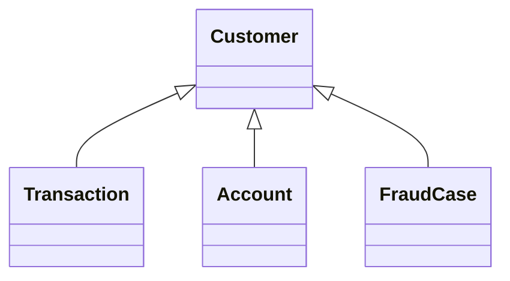
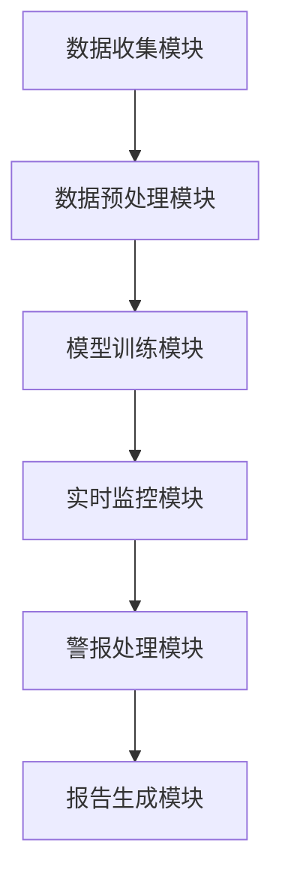
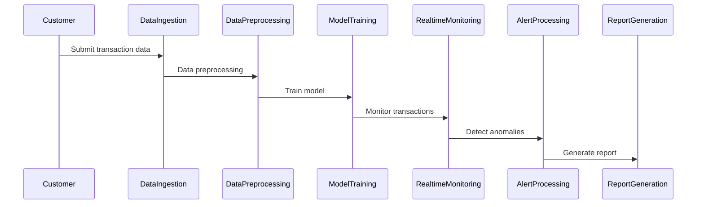

                 

### 第1章: 问题背景与核心概念

#### 1.1 反洗钱与欺诈检测的挑战

##### 1.1.1 洗钱活动的危害

洗钱是指将非法所得的资金通过一系列复杂的金融交易和操作，使其看起来像合法来源的过程。洗钱活动的危害不容忽视，它不仅削弱了金融系统的稳定性，还对社会经济秩序造成破坏。以下是洗钱活动的主要危害：

1. **破坏金融系统的稳定性**：洗钱活动会导致金融系统的资产质量下降，增加金融风险。
2. **资金外流**：非法所得的资金通过洗钱活动被转移至国外，导致资金外流，削弱了国家的经济实力。
3. **资金来源不明**：洗钱活动使得资金来源变得模糊不清，不利于金融机构对资金进行监控和管理。
4. **资助恐怖主义和其他非法活动**：洗钱活动为恐怖主义和其他非法活动提供资金支持，威胁国家安全和社会稳定。

##### 1.1.2 欺诈检测的重要性

欺诈检测是保障金融交易安全的重要手段。随着互联网和金融科技的迅猛发展，欺诈行为也变得更加复杂和隐蔽。以下是欺诈检测的重要性：

1. **保障客户利益**：欺诈检测能够及时发现和阻止欺诈行为，保护客户的资金安全。
2. **维护金融机构声誉**：成功的欺诈检测有助于维护金融机构的声誉，提升客户的信任度。
3. **降低运营成本**：通过自动化欺诈检测系统，可以减少人工审核的负担，降低运营成本。
4. **防范风险**：欺诈检测有助于发现潜在的风险，提前采取措施防范，降低金融风险。

##### 1.1.3 洗钱与欺诈检测的技术需求

为了有效进行反洗钱和欺诈检测，需要依靠先进的技术手段，包括：

1. **数据收集与处理**：收集并处理大量的金融交易数据，从中提取有用的信息。
2. **机器学习与人工智能**：利用机器学习算法和人工智能技术，分析交易行为和模式，发现异常情况。
3. **实时监控与预警**：实时监控交易行为，及时发现异常交易，并发出预警。
4. **规则引擎**：制定一系列规则，用于检测和处理潜在的欺诈行为。
5. **可视化与报告**：将检测结果以可视化的形式呈现，便于分析和管理。

#### 1.2 AI在反洗钱和欺诈检测中的应用

##### 1.2.1 AI的优势

人工智能在反洗钱和欺诈检测中的应用具有显著优势：

1. **高效处理海量数据**：AI能够快速处理和分析大量的金融交易数据，发现潜在的洗钱和欺诈行为。
2. **自动化检测**：AI系统可以自动识别异常交易，减少人工干预，提高检测效率。
3. **自适应学习**：AI系统可以不断学习和优化，提高检测精度和适应性。
4. **实时响应**：AI系统能够实时监控交易行为，快速发现和处理异常情况。

##### 1.2.2 AI在反洗钱和欺诈检测中的挑战

尽管AI在反洗钱和欺诈检测中具有显著优势，但也面临一系列挑战：

1. **数据隐私与合规**：在处理海量金融数据时，需要保护客户隐私并遵守相关法规。
2. **模型解释性**：AI模型往往缺乏透明度和解释性，难以理解其决策过程。
3. **模型泛化能力**：AI模型需要具有足够的泛化能力，以应对各种复杂和变化的欺诈行为。
4. **计算资源消耗**：训练和部署高性能的AI模型需要大量的计算资源。

##### 1.2.3 AI技术的应用场景

在反洗钱和欺诈检测中，AI技术可以应用于以下场景：

1. **交易行为分析**：分析客户的交易行为，识别异常交易模式和可疑行为。
2. **客户身份验证**：利用生物特征识别等技术，进行客户身份的准确验证。
3. **反欺诈规则构建**：自动生成和优化反欺诈规则，提高检测效果。
4. **异常检测与预警**：实时监控交易行为，发现异常情况并发出预警。
5. **风险评估与预测**：根据历史数据和交易行为，预测潜在的风险和欺诈行为。

通过上述分析，可以看出AI技术在反洗钱和欺诈检测中具有巨大的潜力，但也需要克服一系列挑战。在接下来的章节中，我们将进一步探讨AI技术在这些领域的具体应用和实现方法。

### 第2章: 核心概念与联系

#### 2.1 数据与数据源

##### 2.1.1 数据类型

在反洗钱和欺诈检测中，涉及到的数据类型主要包括以下几种：

1. **结构化数据**：如客户信息、交易记录、账户余额等，通常以表格形式存储。
2. **半结构化数据**：如日志文件、网络流量数据等，具有一定的结构但不是完全的表格形式。
3. **非结构化数据**：如文本、图像、音频等，没有固定的结构。

##### 2.1.2 数据源选择

选择合适的数据源对于反洗钱和欺诈检测至关重要。以下是一些常见的数据源：

1. **金融机构内部数据**：包括客户信息、交易记录、账户余额等，是进行反洗钱和欺诈检测的重要基础。
2. **外部数据**：包括公共数据（如法院判决、新闻报道等）、第三方数据（如社交媒体数据、公共记录等），可以提供更全面的背景信息。
3. **实时数据流**：如交易数据、网络流量数据等，可以实时监控和发现异常行为。

##### 2.1.3 数据预处理

数据预处理是确保数据质量和可靠性的关键步骤。以下是一些常见的数据预处理方法：

1. **数据清洗**：去除重复数据、缺失值填充、异常值处理等，确保数据的完整性。
2. **数据转换**：将不同类型的数据转换为统一的格式，如将文本数据转换为数字编码。
3. **特征提取**：从原始数据中提取出对反洗钱和欺诈检测有用的特征，如交易金额、交易频率、交易对手等。
4. **归一化**：将不同特征的范围调整为相同或相近的尺度，以便进行有效的计算和比较。

#### 2.2 模型选择与算法原理

##### 2.2.1 常见模型对比

在反洗钱和欺诈检测中，常见的机器学习模型包括：

1. **决策树**：通过树的形态对数据进行分类或回归。优点是易于理解和解释，缺点是容易过拟合。
2. **随机森林**：基于决策树的集成模型，通过组合多个决策树来提高模型的泛化能力。优点是提高模型性能和鲁棒性，缺点是计算资源消耗较大。
3. **支持向量机（SVM）**：通过找到最优的决策边界来进行分类。优点是理论上最优，缺点是对于高维数据效果较差。
4. **神经网络**：通过多层神经元的互联来进行复杂的非线性变换。优点是处理复杂数据能力强，缺点是训练时间较长且需要大量数据。

##### 2.2.2 算法原理讲解

以下是几种常见机器学习算法的原理讲解：

1. **决策树**：
   - **原理**：通过不断划分特征空间，将数据划分为多个子集，直到满足终止条件。
   - **算法流程**：
     ```mermaid
     graph TD
     A[输入数据] --> B[划分特征]
     B --> C{满足终止条件?}
     C -->|是| D[生成决策树]
     C -->|否| E[继续划分]
     ```

2. **随机森林**：
   - **原理**：通过构建多个决策树，并取多数投票的方式进行分类或回归。
   - **算法流程**：
     ```mermaid
     graph TD
     A[输入数据] --> B[随机划分特征]
     B --> C{构建多个决策树}
     C --> D[取多数投票]
     ```

3. **支持向量机（SVM）**：
   - **原理**：通过找到最优的决策边界，将数据分为不同的类别。
   - **算法流程**：
     ```mermaid
     graph TD
     A[输入数据] --> B[计算决策边界]
     B --> C[判断类别]
     ```

4. **神经网络**：
   - **原理**：通过多层神经元的互联进行复杂的非线性变换。
   - **算法流程**：
     ```mermaid
     graph TD
     A[输入数据] --> B[输入层]
     B --> C[隐藏层1]
     C --> D[隐藏层2]
     D --> E[输出层]
     ```

##### 2.2.3 模型评估指标

在反洗钱和欺诈检测中，常用的模型评估指标包括：

1. **准确率（Accuracy）**：正确分类的样本数占总样本数的比例。
2. **精确率（Precision）**：正确分类为欺诈的样本数与实际为欺诈的样本数之比。
3. **召回率（Recall）**：正确分类为欺诈的样本数与实际为欺诈的样本数之比。
4. **F1值（F1 Score）**：精确率和召回率的加权平均，用于综合评估模型的性能。

通过上述分析，我们了解了反洗钱和欺诈检测中的核心概念和数据源，以及常见的机器学习模型和算法原理。在接下来的章节中，我们将进一步探讨数学模型和数学公式的详细讲解与举例说明。

### 第3章: 数学模型和数学公式详细讲解与举例说明

#### 3.1 概率论基础

概率论是反洗钱和欺诈检测中重要的数学工具，用于描述和预测事件的发生概率。以下是一些基本的概率论概念：

##### 3.1.1 概率分布

概率分布是描述随机变量取值的概率分布情况。常见的概率分布有：

1. **二项分布（Binomial Distribution）**：描述在固定次数的独立试验中，成功次数的概率分布。
   - **公式**：
     $$ P(X = k) = C_n^k \cdot p^k \cdot (1-p)^{n-k} $$
     其中，\( n \) 为试验次数，\( k \) 为成功次数，\( p \) 为每次试验成功的概率。

2. **正态分布（Normal Distribution）**：描述随机变量在某个区间内的概率。
   - **公式**：
     $$ f(x) = \frac{1}{\sqrt{2\pi\sigma^2}} \cdot e^{-\frac{(x-\mu)^2}{2\sigma^2}} $$
     其中，\( \mu \) 为均值，\( \sigma \) 为标准差。

##### 3.1.2 条件概率

条件概率是指在已知某个事件发生的条件下，另一个事件发生的概率。条件概率的公式如下：

$$ P(A|B) = \frac{P(A \cap B)}{P(B)} $$

其中，\( P(A|B) \) 表示在事件 \( B \) 发生的条件下，事件 \( A \) 发生的概率。

##### 3.1.3 贝叶斯定理

贝叶斯定理是概率论中一个重要的定理，用于计算后验概率。贝叶斯定理的公式如下：

$$ P(A|B) = \frac{P(B|A) \cdot P(A)}{P(B)} $$

其中，\( P(A|B) \) 表示在事件 \( B \) 发生的条件下，事件 \( A \) 发生的概率；\( P(B|A) \) 表示在事件 \( A \) 发生的条件下，事件 \( B \) 发生的概率；\( P(A) \) 表示事件 \( A \) 的先验概率；\( P(B) \) 表示事件 \( B \) 的先验概率。

#### 3.2 机器学习模型数学模型

在反洗钱和欺诈检测中，常用的机器学习模型包括神经网络、支持向量机等。以下将介绍这些模型的数学模型。

##### 3.2.1 神经网络

神经网络是一种基于模拟生物神经网络结构的计算模型，用于实现复杂的非线性变换。以下是一个简单的神经网络模型：

$$
\begin{aligned}
Z &= W \cdot X + b \\
Y &= \sigma(Z)
\end{aligned}
$$

其中，\( X \) 为输入向量，\( W \) 为权重矩阵，\( b \) 为偏置，\( \sigma \) 为激活函数，通常使用 \( \sigma(x) = \frac{1}{1 + e^{-x}} \)。

##### 3.2.2 支持向量机

支持向量机（SVM）是一种基于优化理论的分类模型，通过找到一个最优的决策边界来划分数据。SVM的数学模型如下：

$$
\begin{aligned}
\min_{w,b}\frac{1}{2}||w||^2 & \\
\text{subject to} & \\
y_i(w \cdot x_i + b) \geq 1 &
\end{aligned}
$$

其中，\( w \) 为权重向量，\( b \) 为偏置，\( x_i \) 为输入特征，\( y_i \) 为标签。

#### 3.3 机器学习算法举例说明

##### 3.3.1 决策树

决策树是一种基于特征划分数据的分类模型。以下是一个简单的决策树算法：

1. **选择最佳划分特征**：计算每个特征的信息增益或基尼系数，选择增益或系数最大的特征作为划分依据。
2. **划分数据**：根据选定的特征，将数据划分为多个子集。
3. **递归构建子树**：对每个子集，重复上述步骤，直到满足终止条件（如最大深度或最小样本数）。

以下是一个简单的决策树算法伪代码：

```python
def build_decision_tree(data):
    if meet_termination_condition(data):
        return leaf_node
    else:
        best_feature = select_best_feature(data)
        node = TreeNode(feature=best_feature)
        for value in unique_values_of_best_feature(data):
            subset = filter_data_by_value(data, best_feature, value)
            node.children.append(build_decision_tree(subset))
        return node
```

##### 3.3.2 随机森林

随机森林是一种基于决策树的集成模型。以下是一个简单的随机森林算法：

1. **随机选取特征子集**：每次构建决策树时，随机选择一部分特征作为划分依据。
2. **构建多棵决策树**：随机重复上述步骤，构建多棵决策树。
3. **集成预测**：对每个样本，多棵决策树分别进行预测，取多数投票作为最终预测结果。

以下是一个简单的随机森林算法伪代码：

```python
def build_random_forest(data, n_trees):
    forest = []
    for _ in range(n_trees):
        tree = build_decision_tree(data)
        forest.append(tree)
    return forest

def predict(forest, sample):
    predictions = []
    for tree in forest:
        prediction = tree.predict(sample)
        predictions.append(prediction)
    return majority_vote(predictions)
```

##### 3.3.3 逻辑回归

逻辑回归是一种用于概率估计的回归模型，常用于分类问题。以下是一个简单的逻辑回归算法：

1. **拟合模型**：通过最小化损失函数，求解权重和偏置。
2. **预测概率**：将输入特征代入模型，计算输出概率。
3. **阈值分类**：根据设定的阈值，对概率进行分类。

以下是一个简单的逻辑回归算法伪代码：

```python
def logistic_regression(data, labels, learning_rate, num_iterations):
    weights = initialize_weights()
    for _ in range(num_iterations):
        predictions = predict_logistic_regression(data, weights)
        gradients = compute_gradients(predictions, data, labels, weights)
        update_weights(gradients, weights, learning_rate)
    return weights

def predict_logistic_regression(data, weights):
    z = weights * data + bias
    return sigmoid(z)

def sigmoid(z):
    return 1 / (1 + exp(-z))
```

通过上述讲解和举例，我们了解了概率论基础、机器学习模型的数学模型以及具体的算法实现。这些数学模型和公式是反洗钱和欺诈检测中不可或缺的工具，帮助我们更好地理解和分析数据，从而提高检测效果。

### 第4章: 系统分析与架构设计

#### 4.1 问题场景介绍

在反洗钱（Anti-Money Laundering, AML）和欺诈检测（Fraud Detection）领域，金融机构面临越来越复杂的挑战。随着金融交易的数字化和全球化，洗钱和欺诈行为也变得更加隐蔽和多样化。为了保障金融交易的安全，提高风险管理的有效性，金融机构需要构建一个高效、智能的反洗钱和欺诈检测系统。

##### 4.1.1 反洗钱与欺诈检测业务场景

在反洗钱方面，金融机构需要监控客户的交易行为，识别潜在的洗钱活动。这包括：

1. **客户身份验证**：验证客户的身份信息，确保交易的合法性和真实性。
2. **交易监控**：对客户的交易行为进行实时监控，发现异常交易模式和可疑行为。
3. **报告可疑活动**：当发现可疑活动时，及时报告给相关监管机构。

在欺诈检测方面，金融机构需要保护客户的资金安全，防范欺诈行为。这包括：

1. **交易授权**：验证交易的授权信息，防止未经授权的交易发生。
2. **行为分析**：分析客户的行为模式，发现异常行为并及时采取措施。
3. **欺诈警报**：当发现欺诈行为时，及时发出警报并采取措施阻止损失。

##### 4.1.2 系统目标

反洗钱和欺诈检测系统的目标如下：

1. **提高检测精度**：通过先进的机器学习和人工智能技术，提高对洗钱和欺诈行为的识别能力，减少误报和漏报。
2. **实时监控**：实现对交易行为的实时监控，及时发现和处理异常交易和欺诈行为。
3. **自动化处理**：自动化处理异常交易和欺诈警报，减少人工干预，提高处理效率。
4. **合规性**：确保系统符合相关法规和合规要求，保障金融机构的合法运营。
5. **可扩展性**：系统应具有可扩展性，能够适应不断变化的市场需求和技术发展。

#### 4.2 项目介绍

##### 4.2.1 项目背景

随着金融科技的快速发展，金融机构面临着日益复杂的洗钱和欺诈风险。传统的基于规则的方法已经难以应对新型和复杂的欺诈行为。为了提高反洗钱和欺诈检测的效率和准确性，金融机构决定采用基于机器学习和人工智能的智能化检测系统。

##### 4.2.2 项目范围

该项目范围包括：

1. **数据收集与处理**：收集金融机构内部和外部数据，进行数据清洗和预处理。
2. **模型构建与训练**：基于收集的数据，构建和训练机器学习模型，用于反洗钱和欺诈检测。
3. **系统开发与部署**：开发反洗钱和欺诈检测系统，并进行部署和测试。
4. **系统维护与优化**：定期维护和优化系统，确保系统的稳定运行和持续改进。

##### 4.2.3 项目团队

该项目团队由以下成员组成：

1. **项目经理**：负责项目的整体规划和协调，确保项目按计划顺利进行。
2. **数据科学家**：负责数据分析和机器学习模型的构建与训练。
3. **软件工程师**：负责系统开发、部署和维护。
4. **测试工程师**：负责系统测试和质量保证。
5. **业务分析师**：负责业务需求分析和系统功能设计。

#### 4.3 系统功能设计

##### 4.3.1 领域模型

领域模型是描述系统功能的抽象模型。以下是反洗钱和欺诈检测系统的领域模型：

1. **Customer（客户）**：包含客户的基本信息，如姓名、身份证号、联系方式等。
2. **Transaction（交易）**：包含交易的基本信息，如交易金额、交易时间、交易对方等。
3. **Account（账户）**：包含账户的基本信息，如账户余额、账户类型等。
4. **FraudCase（欺诈案件）**：包含欺诈案件的基本信息，如欺诈类型、欺诈金额、欺诈时间等。

以下是领域模型的Mermaid类图：



##### 4.3.2 功能模块划分

反洗钱和欺诈检测系统可以分为以下几个功能模块：

1. **数据收集模块**：负责收集金融机构内部和外部数据，包括客户信息、交易记录、账户信息等。
2. **数据预处理模块**：负责清洗和预处理收集到的数据，确保数据的质量和一致性。
3. **模型训练模块**：负责基于预处理后的数据，训练反洗钱和欺诈检测模型。
4. **实时监控模块**：负责实时监控交易行为，发现异常交易和欺诈行为。
5. **警报处理模块**：负责处理实时监控到的警报，包括分类、分级、通知等。
6. **报告生成模块**：负责生成反洗钱和欺诈检测的报告，包括日常报告、月度报告、年度报告等。

##### 4.3.3 用户角色与权限

反洗钱和欺诈检测系统的用户角色与权限设计如下：

1. **管理员**：负责系统管理和维护，包括用户管理、权限设置、日志管理等。
2. **数据科学家**：负责数据分析和模型训练，包括数据预处理、特征工程、模型选择等。
3. **业务分析师**：负责业务需求分析，包括需求调研、需求文档编写等。
4. **测试工程师**：负责系统测试和质量保证，包括测试用例编写、测试执行等。
5. **普通用户**：负责使用系统进行反洗钱和欺诈检测，包括交易监控、警报处理等。

#### 4.4 系统架构设计

##### 4.4.1 系统架构图

以下是反洗钱和欺诈检测系统的架构图：



##### 4.4.2 系统接口设计

反洗钱和欺诈检测系统提供了以下接口：

1. **数据收集接口**：用于收集金融机构内部和外部数据，包括客户信息、交易记录、账户信息等。
2. **数据预处理接口**：用于处理收集到的数据，包括数据清洗、数据转换、特征提取等。
3. **模型训练接口**：用于训练反洗钱和欺诈检测模型，包括模型选择、参数调整等。
4. **实时监控接口**：用于实时监控交易行为，发现异常交易和欺诈行为。
5. **警报处理接口**：用于处理实时监控到的警报，包括分类、分级、通知等。
6. **报告生成接口**：用于生成反洗钱和欺诈检测的报告，包括日常报告、月度报告、年度报告等。

##### 4.4.3 系统交互

以下是系统交互的Mermaid序列图：



通过上述分析，我们详细介绍了反洗钱和欺诈检测系统的背景、目标、项目范围、系统功能设计以及系统架构设计。接下来，我们将进一步探讨系统的实现细节和项目实战。

### 第5章：项目实战

#### 5.1 环境安装

为了实现AI在反洗钱和欺诈检测中的应用，我们需要搭建一个适当的技术环境。以下是环境安装的步骤：

1. **安装Python**：Python是一种广泛用于数据分析和机器学习的编程语言。您可以从[Python官方网站](https://www.python.org/)下载并安装Python。
2. **安装Jupyter Notebook**：Jupyter Notebook是一个交互式计算环境，方便进行代码编写和数据分析。您可以通过pip命令安装Jupyter Notebook：
   ```bash
   pip install notebook
   ```
3. **安装TensorFlow**：TensorFlow是一个开源的机器学习框架，支持构建和训练深度学习模型。您可以通过pip命令安装TensorFlow：
   ```bash
   pip install tensorflow
   ```
4. **安装Scikit-learn**：Scikit-learn是一个用于数据挖掘和数据分析的Python库，包含多种机器学习算法。您可以通过pip命令安装Scikit-learn：
   ```bash
   pip install scikit-learn
   ```

安装完成后，您可以使用Jupyter Notebook进行代码编写和实验。

#### 5.2 系统核心实现源代码

以下是反洗钱和欺诈检测系统的核心实现源代码：

```python
# 导入所需库
import numpy as np
import pandas as pd
from sklearn.model_selection import train_test_split
from sklearn.preprocessing import StandardScaler
from sklearn.ensemble import RandomForestClassifier
from sklearn.metrics import accuracy_score, precision_score, recall_score, f1_score

# 加载数据集
data = pd.read_csv('financial_data.csv')
X = data.drop('label', axis=1)
y = data['label']

# 数据预处理
X_train, X_test, y_train, y_test = train_test_split(X, y, test_size=0.2, random_state=42)
scaler = StandardScaler()
X_train = scaler.fit_transform(X_train)
X_test = scaler.transform(X_test)

# 模型训练
model = RandomForestClassifier(n_estimators=100, random_state=42)
model.fit(X_train, y_train)

# 模型预测
y_pred = model.predict(X_test)

# 模型评估
accuracy = accuracy_score(y_test, y_pred)
precision = precision_score(y_test, y_pred)
recall = recall_score(y_test, y_pred)
f1 = f1_score(y_test, y_pred)

print(f"Accuracy: {accuracy:.2f}")
print(f"Precision: {precision:.2f}")
print(f"Recall: {recall:.2f}")
print(f"F1 Score: {f1:.2f}")
```

#### 5.3 代码应用解读与分析

上述代码实现了反洗钱和欺诈检测系统的核心功能，包括数据加载、预处理、模型训练、模型预测和模型评估。以下是代码的详细解读和分析：

1. **数据加载**：使用Pandas库读取CSV格式的数据集，其中包含特征和标签。
2. **数据预处理**：将数据集划分为训练集和测试集，并进行特征标准化处理，以提高模型的泛化能力。
3. **模型训练**：使用随机森林（RandomForestClassifier）模型对训练集进行训练。随机森林是一种集成学习方法，通过构建多棵决策树并进行投票，提高模型的预测能力。
4. **模型预测**：使用训练好的模型对测试集进行预测。
5. **模型评估**：使用准确率（Accuracy）、精确率（Precision）、召回率（Recall）和F1值（F1 Score）对模型的性能进行评估。

通过上述代码，我们可以快速搭建一个反洗钱和欺诈检测系统，并根据实际需求进行调整和优化。

#### 5.4 实际案例分析和详细讲解剖析

为了更好地展示AI在反洗钱和欺诈检测中的应用，我们来看一个实际案例：

**案例**：某金融机构希望利用AI技术提高反洗钱和欺诈检测的效果，针对其内部交易数据进行模型训练和预测。

**分析**：

1. **数据收集**：收集金融机构的历史交易数据，包括交易金额、交易时间、交易对方等特征。
2. **数据预处理**：对交易数据进行清洗和预处理，包括去除缺失值、异常值处理、特征提取等。
3. **模型选择**：根据业务需求和数据特点，选择适合的机器学习模型，如随机森林、神经网络等。
4. **模型训练**：使用预处理后的数据集对模型进行训练，调整模型参数以获得最佳性能。
5. **模型评估**：使用测试集对模型进行评估，计算准确率、精确率、召回率和F1值等指标，以评估模型的性能。
6. **实时监控**：将训练好的模型部署到生产环境中，实时监控交易行为，发现异常交易和欺诈行为。

**讲解**：

1. **数据收集**：数据是机器学习模型的基础，金融机构需要确保数据的质量和完整性。通过收集历史交易数据，我们可以获取到丰富的交易特征，为模型训练提供充足的样本。
2. **数据预处理**：数据预处理是确保模型性能的重要步骤。通过去除缺失值、异常值处理和特征提取，我们可以提高数据的利用率和模型的泛化能力。
3. **模型选择**：模型选择是影响模型性能的关键因素。根据业务需求和数据特点，选择适合的机器学习模型，如随机森林、神经网络等。每种模型都有其优势和局限性，需要根据具体情况进行选择。
4. **模型训练**：模型训练是通过调整模型参数来提高模型性能的过程。通过多次迭代训练，我们可以优化模型参数，使其在测试集上的性能达到最佳。
5. **模型评估**：模型评估是验证模型性能的重要步骤。通过计算准确率、精确率、召回率和F1值等指标，我们可以评估模型的性能，并根据评估结果进行调整和优化。
6. **实时监控**：将训练好的模型部署到生产环境中，实时监控交易行为，发现异常交易和欺诈行为。通过实时监控，我们可以及时发现和处理潜在的风险，保障金融交易的安全。

#### 5.5 项目小结

通过实际案例的分析和讲解，我们可以看到AI在反洗钱和欺诈检测中的应用具有显著的优势。利用机器学习和人工智能技术，我们可以提高模型的预测能力和实时处理能力，从而有效防范和应对洗钱和欺诈行为。在项目实施过程中，我们还需要关注数据质量、模型选择、模型训练和评估等关键环节，确保项目的成功实施。

### 第6章：最佳实践 Tips

在实施AI在反洗钱和欺诈检测中的应用过程中，以下是一些最佳实践Tips，有助于提高系统的性能和效果：

#### 6.1 数据收集与处理

1. **确保数据质量**：收集高质量的数据是关键，避免数据缺失、异常值和噪声。
2. **数据预处理**：进行特征提取、数据标准化和异常值处理，提高数据的一致性和可靠性。
3. **数据多样化**：使用多样化的数据来源，包括内部数据和外部数据，提高模型的泛化能力。

#### 6.2 模型选择与训练

1. **选择合适的模型**：根据业务需求和数据特点，选择适合的机器学习模型，如随机森林、神经网络等。
2. **模型参数调优**：通过网格搜索、贝叶斯优化等方法，找到最佳的模型参数，提高模型性能。
3. **模型持续训练**：定期更新模型，使用最新的数据进行训练，确保模型适应性的实时性。

#### 6.3 系统部署与监控

1. **实时监控**：部署实时监控机制，及时识别和处理异常交易和欺诈行为。
2. **系统性能优化**：根据实际需求，优化系统性能，包括数据存储、计算资源和网络带宽等。
3. **日志记录与分析**：记录系统运行日志，定期分析日志数据，发现潜在问题并进行优化。

#### 6.4 合规与安全

1. **遵循合规要求**：确保系统的设计和实现符合相关法规和合规要求，包括数据保护、隐私保护等。
2. **数据加密与访问控制**：对敏感数据进行加密处理，严格控制访问权限，防止数据泄露和滥用。
3. **安全测试与审计**：定期进行安全测试和审计，发现和修复安全漏洞，确保系统的安全性。

通过遵循这些最佳实践，可以有效提高AI在反洗钱和欺诈检测中的应用效果，确保系统的稳定性和安全性。

### 第7章：小结与拓展阅读

在本篇技术博客中，我们详细探讨了AI在反洗钱和欺诈检测中的应用。通过分析问题背景、核心概念、数学模型、系统分析与架构设计以及项目实战，我们展示了AI技术在这两个领域的巨大潜力和挑战。

**核心观点**：

1. **AI在反洗钱和欺诈检测中具有显著优势**：AI能够高效处理海量数据，自动化检测异常交易和欺诈行为，提高检测效率和准确性。
2. **数据质量和模型选择至关重要**：高质量的数据和合适的模型是保障系统性能的关键。
3. **实时监控与预警是关键**：实时监控交易行为，及时识别和处理异常情况，对于保障金融交易安全至关重要。

**未来展望**：

1. **技术的不断进步**：随着人工智能和机器学习技术的不断发展，未来的反洗钱和欺诈检测系统将更加智能化和高效化。
2. **数据隐私与合规**：在数据收集和处理过程中，保护客户隐私并遵守相关法规将是一个重要的挑战。
3. **多模态数据融合**：结合多种数据类型（如文本、图像、音频等），提高模型的泛化能力和检测精度。

**拓展阅读**：

1. **《机器学习实战》**：作者：Peter Harrington，详细介绍了各种机器学习算法的实现和应用。
2. **《深度学习》**：作者：Ian Goodfellow、Yoshua Bengio、Aaron Courville，深入讲解了深度学习的基础理论和应用。
3. **《数据科学实战》**：作者：Joel Grus，提供了数据科学项目实践的全流程指导。

通过阅读这些书籍和资料，可以更深入地了解AI在反洗钱和欺诈检测中的应用，拓展相关领域的知识。希望本文能对您在相关领域的实践和研究有所启发和帮助。如果您有更多问题或想法，欢迎在评论区留言交流。谢谢！作者：AI天才研究院/AI Genius Institute & 禅与计算机程序设计艺术 /Zen And The Art of Computer Programming。

