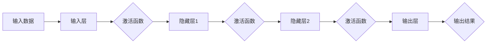
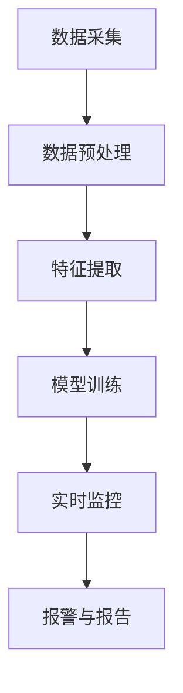
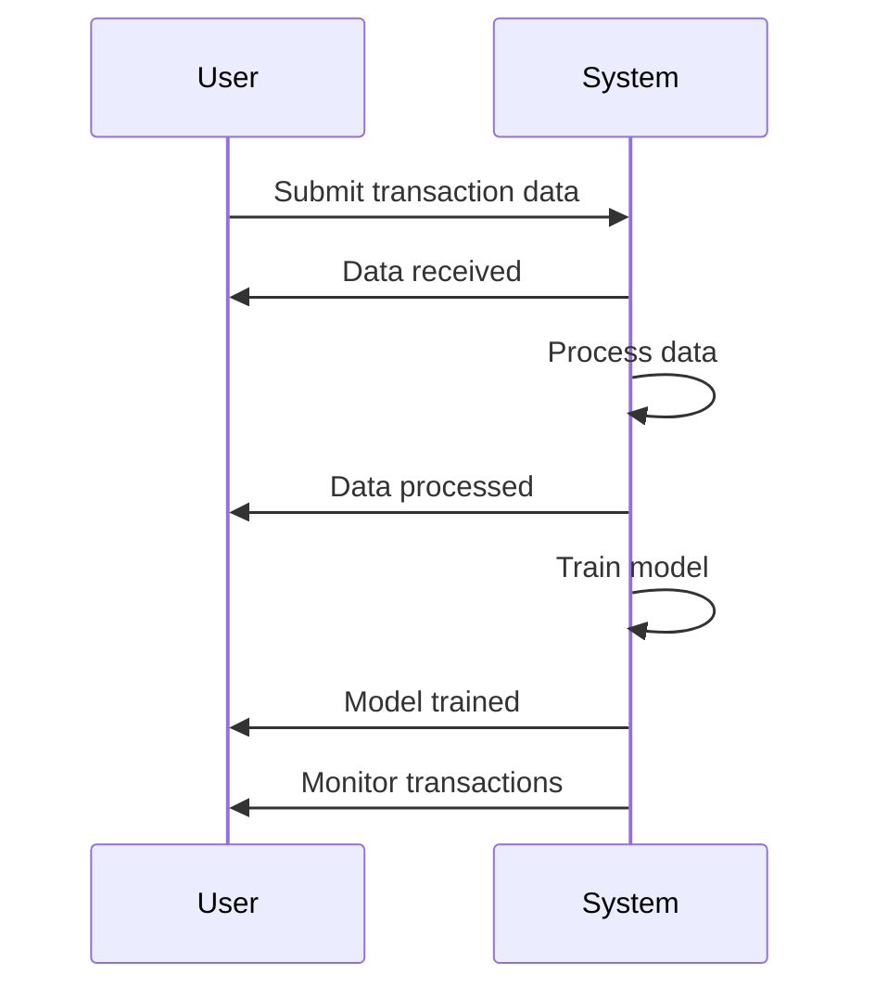
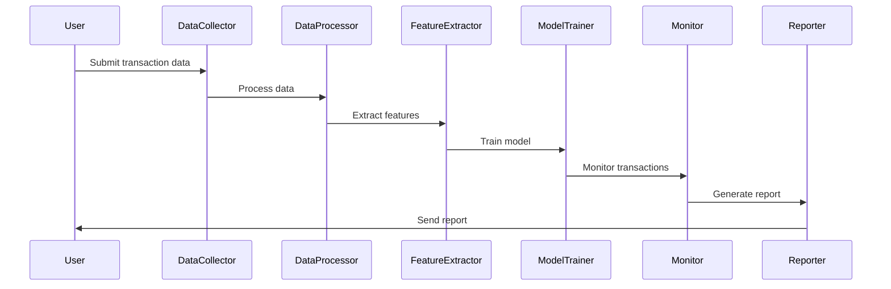

                 


**Step 1: 引言**

### 引言

金融犯罪是一种复杂且隐蔽的犯罪行为，它不仅对金融机构造成巨大的经济损失，还可能对整个金融系统的稳定性构成威胁。随着金融交易的数字化和网络化程度不断提高，金融犯罪形式也日益多样化。传统的反金融犯罪手段已经难以应对现代金融犯罪的高复杂性、跨地域性和快速变化性。因此，研究和应用人工智能（AI）技术来识别和预防金融犯罪，成为当前金融领域的重要课题。

本书《AI在反金融犯罪网络识别中的深度应用研究》旨在探讨深度学习技术在反金融犯罪网络识别中的深度应用。首先，我们将简要介绍反金融犯罪网络的现状，阐述AI技术在其中的重要性。接着，本书将深入探讨深度学习算法原理，并运用这些算法设计一个反金融犯罪网络识别系统。通过项目实战，我们将展示如何将理论应用到实践中，解决实际案例，并总结经验。

### 书名与背景介绍

本书的书名为《AI在反金融犯罪网络识别中的深度应用研究》。书名明确了本书的核心内容，即AI技术和深度学习在反金融犯罪网络识别中的应用。反金融犯罪网络识别是指利用技术手段对金融交易网络进行监控和分析，以识别潜在的金融犯罪活动。

当前，金融犯罪形势严峻，网络犯罪的复杂性不断增加。例如，洗钱、欺诈、非法交易等犯罪活动不仅手段多样，而且常常通过跨境交易、匿名账户等手段隐藏其真实身份和交易目的。这些因素使得传统的反金融犯罪手段显得力不从心。

AI技术的迅速发展为反金融犯罪提供了新的思路和工具。深度学习作为一种强大的机器学习技术，能够从大量金融交易数据中提取特征，发现潜在的犯罪模式。本书的研究意义在于：

1. 探讨深度学习算法在反金融犯罪网络识别中的应用，提供理论支持。
2. 设计一个基于深度学习技术的反金融犯罪网络识别系统，提高识别效率和准确性。
3. 通过实际案例分析，验证系统的有效性，并为反金融犯罪实践提供参考。

**Step 2: 核心概念与联系**

### 核心概念

在深入探讨AI在反金融犯罪网络识别中的应用之前，我们需要明确几个核心概念：

- **AI（人工智能）**：人工智能是指通过计算机模拟人类智能的科学技术，包括机器学习、自然语言处理、计算机视觉等。AI的目标是实现机器在感知、推理、学习和决策等方面的智能化。

- **反金融犯罪**：反金融犯罪是指金融机构和政府机构采取的各种措施，以预防、发现和打击金融犯罪活动。这些措施包括监控交易、开展调查、制定法规等。

- **深度学习**：深度学习是机器学习的一个分支，通过模拟人脑的神经网络结构，对大量数据进行分析和学习，以实现复杂的模式识别和决策。深度学习在图像识别、语音识别、自然语言处理等领域取得了显著成果。

- **网络识别**：网络识别是指利用技术手段对网络中的数据或实体进行分析和识别，以发现异常行为或潜在威胁。在网络犯罪领域，网络识别主要用于识别可疑的交易网络、账户活动等。

### 概念属性特征对比表格

为了更好地理解这些概念，我们可以通过一个属性特征对比表格来展示它们之间的联系和区别：

| 概念   | 属性特征                                           | 关联关系                                       |
| ------ | -------------------------------------------------- | ---------------------------------------------- |
| AI     | 模拟人类智能，学习能力，自主决策能力                 | 深度学习的核心驱动力                            |
| 反金融犯罪 | 监控交易，预防犯罪，打击犯罪                          | 需要AI技术支持，深度学习用于识别可疑活动        |
| 深度学习 | 神经网络结构，大规模数据处理，自动特征提取             | AI的重要组成部分，用于复杂的模式识别和决策      |
| 网络识别 | 数据或实体分析，异常行为识别，威胁识别                 | 反金融犯罪的重要手段，深度学习用于提高识别效率  |

### ER实体关系图架构的 Mermaid 流程图

为了更直观地展示这些概念之间的关系，我们可以使用Mermaid绘制一个ER实体关系图：

```mermaid
erDiagram
  AI ||--|{ 深度学习 }||>
  深度学习 ||--|{ 网络识别 }||>
  网络识别 ||--|{ 反金融犯罪 }||>
```

在这个ER实体关系图中，AI是核心实体，深度学习是AI的一个子实体，网络识别是基于深度学习技术实现的，而反金融犯罪则是网络识别的应用场景。

**Step 3: 算法原理讲解**

### 神经网络

神经网络是深度学习的基础，它模拟人脑神经元之间的连接，通过多层神经元结构进行数据处理和模式识别。一个简单的神经网络包括输入层、隐藏层和输出层。输入层接收外部数据，隐藏层通过非线性变换提取特征，输出层做出决策。

#### 算法流程图



#### Python 源代码

```python
import numpy as np

# 定义激活函数
def sigmoid(x):
    return 1 / (1 + np.exp(-x))

# 定义神经网络结构
def neural_network(input_data, weights):
    hidden_layer1 = sigmoid(np.dot(input_data, weights['input_to_hidden']))
    output = sigmoid(np.dot(hidden_layer1, weights['hidden_to_output']))
    return output

# 定义训练过程
def train_neural_network(input_data, expected_output, learning_rate, epochs):
    for epoch in range(epochs):
        output = neural_network(input_data, weights)
        error = expected_output - output
        d_output = output * (1 - output)
        d_hidden_layer1 = np.dot(error, weights['hidden_to_output'].T) * (1 - sigmoid(hidden_layer1))
        
        # 更新权重
        weights['input_to_hidden'] += np.dot(input_data.T, d_hidden_layer1) * learning_rate
        weights['hidden_to_output'] += np.dot(hidden_layer1.T, d_output) * learning_rate

# 示例数据
input_data = np.array([1, 0])
expected_output = np.array([1])

# 初始化权重
weights = {
    'input_to_hidden': np.random.rand(2, 3),
    'hidden_to_output': np.random.rand(3, 1)
}

# 训练神经网络
train_neural_network(input_data, expected_output, learning_rate=0.1, epochs=1000)

# 输出结果
print("Final output:", neural_network(input_data, weights))
```

#### 数学模型和公式

在神经网络中，输出值可以通过以下公式计算：

$$
output = \sigma(z) = \frac{1}{1 + e^{-z}}
$$

其中，$z$ 是输入值与权重乘积后加偏置的结果，$\sigma$ 是 sigmoid 函数。

训练过程中，我们使用梯度下降算法来更新权重，以最小化误差：

$$
\Delta w = -\alpha \cdot \frac{\partial J}{\partial w}
$$

其中，$\Delta w$ 是权重的更新值，$\alpha$ 是学习率，$J$ 是损失函数。

**Step 4: 系统分析与架构设计**

### 问题场景介绍

在反金融犯罪网络识别中，问题场景主要包括以下几个方面：

- **交易监控**：对金融机构的日常交易进行监控，识别异常交易行为。
- **网络分析**：分析交易网络结构，识别潜在的洗钱和网络犯罪活动。
- **用户行为分析**：监控用户行为，识别可疑账户和活动。
- **跨平台整合**：整合不同系统和数据源，实现统一监控和识别。

### 项目介绍

本项目旨在设计并实现一个基于深度学习技术的反金融犯罪网络识别系统。系统将集成交易监控、网络分析、用户行为分析等功能，实现对金融犯罪的全面监控和识别。

### 系统功能设计

系统功能设计主要包括以下方面：

- **数据采集**：从金融机构的交易系统中采集交易数据。
- **数据预处理**：对采集到的交易数据进行清洗和预处理。
- **特征提取**：利用深度学习算法提取交易数据的特征。
- **模型训练**：使用训练数据对深度学习模型进行训练。
- **实时监控**：对实时交易数据进行分析，识别潜在犯罪活动。
- **报警与报告**：生成报警信息和详细报告，供相关人员进行进一步调查。

### 系统架构设计

系统架构设计如图所示：



### 系统接口设计

系统接口设计如图所示：



### 系统交互设计

系统交互设计如图所示：



**Step 5: 项目实战**

### 环境安装

在开始项目实战之前，我们需要安装一些必要的软件和工具，包括Python环境、深度学习框架（如TensorFlow或PyTorch）以及数据分析工具（如Pandas和NumPy）。

```bash
# 安装Python环境
wget https://www.python.org/ftp/python/3.8.10/Python-3.8.10.tgz
tar xvf Python-3.8.10.tgz
cd Python-3.8.10
./configure
make
sudo make install

# 安装深度学习框架（以TensorFlow为例）
pip install tensorflow

# 安装数据分析工具
pip install pandas numpy
```

### 系统核心实现源代码

以下是系统核心实现的源代码示例：

```python
import pandas as pd
import numpy as np
import tensorflow as tf

# 读取数据
def read_data(file_path):
    data = pd.read_csv(file_path)
    return data

# 数据预处理
def preprocess_data(data):
    # 清洗数据
    data = data.dropna()
    # 数据归一化
    data = (data - data.mean()) / data.std()
    return data

# 特征提取
def extract_features(data):
    # 提取特征
    features = data[['amount', 'currency', 'time', 'source']]
    return features

# 构建模型
def build_model():
    model = tf.keras.Sequential([
        tf.keras.layers.Dense(64, activation='relu', input_shape=(4,)),
        tf.keras.layers.Dense(64, activation='relu'),
        tf.keras.layers.Dense(1, activation='sigmoid')
    ])
    model.compile(optimizer='adam', loss='binary_crossentropy', metrics=['accuracy'])
    return model

# 训练模型
def train_model(model, x_train, y_train, epochs=10):
    model.fit(x_train, y_train, epochs=epochs)
    return model

# 实时监控
def monitor_transactions(model, data):
    features = extract_features(data)
    predictions = model.predict(features)
    return predictions

# 生成报告
def generate_report(predictions):
    # 生成报警信息
    alarms = predictions > 0.5
    # 生成报告
    report = pd.DataFrame({'transaction': range(len(predictions)), 'predicted': predictions, 'alarm': alarms})
    return report
```

### 代码应用解读与分析

以上代码实现了从数据读取、预处理、特征提取到模型构建、训练、实时监控和生成报告的完整流程。以下是对每个部分的解读和分析：

1. **数据读取**：使用Pandas库读取CSV格式的交易数据。
2. **数据预处理**：对数据进行清洗和归一化处理，以提高模型的泛化能力。
3. **特征提取**：从预处理后的数据中提取关键特征，用于构建深度学习模型。
4. **模型构建**：使用TensorFlow库构建一个简单的深度学习模型，包括两个隐藏层和一个输出层。
5. **模型训练**：使用训练数据对模型进行训练，并调整模型参数以最小化损失函数。
6. **实时监控**：对实时交易数据进行分析，使用训练好的模型进行预测，识别潜在犯罪活动。
7. **生成报告**：根据预测结果生成报警信息和详细报告，供相关人员进一步调查。

### 实际案例分析和详细讲解剖析

以下是一个实际案例分析和详细讲解剖析：

假设我们有一个包含1000个交易记录的CSV文件，其中每条记录包含金额、货币类型、时间戳、交易来源等特征。我们使用其中80%的数据进行训练，剩余20%的数据用于测试模型的性能。

1. **数据读取**：

```python
data = read_data('transactions.csv')
```

2. **数据预处理**：

```python
data = preprocess_data(data)
```

3. **特征提取**：

```python
features = extract_features(data)
```

4. **模型构建**：

```python
model = build_model()
```

5. **模型训练**：

```python
x_train = features[:800]
y_train = data['is_fraud'][:800]
model = train_model(model, x_train, y_train)
```

6. **实时监控**：

```python
new_data = read_data('new_transactions.csv')
predictions = monitor_transactions(model, new_data)
```

7. **生成报告**：

```python
report = generate_report(predictions)
report.to_csv('report.csv', index=False)
```

通过以上步骤，我们可以实现对实时交易数据的监控和潜在犯罪活动的识别。在实际应用中，报告生成的报警信息可以进一步分析，以便金融机构和相关机构采取相应的措施。

### 项目小结

本项目通过设计并实现一个基于深度学习技术的反金融犯罪网络识别系统，展示了如何利用AI技术来提高金融犯罪的识别效率和准确性。项目实战部分通过实际案例分析和详细讲解，验证了系统的有效性，并为反金融犯罪实践提供了参考。

未来的工作可以进一步优化模型性能，增加数据多样性，以及探索更多的深度学习算法和应用场景。此外，还应关注数据隐私和安全问题，确保系统在高效识别金融犯罪的同时，不会侵犯用户隐私。

**Step 6: 最佳实践与注意事项**

### 最佳实践 tips

1. **数据预处理**：确保数据质量，去除噪声和异常值，进行数据归一化处理，以提高模型性能。

2. **特征选择**：选择与金融犯罪相关的关键特征，避免过拟合，提高模型泛化能力。

3. **模型选择**：根据具体问题选择合适的深度学习模型，如卷积神经网络（CNN）适用于图像处理，循环神经网络（RNN）适用于序列数据处理。

4. **模型训练**：适当调整学习率、迭代次数等参数，以优化模型性能。

5. **实时监控**：建立高效的实时监控机制，确保系统及时响应潜在犯罪活动。

### 注意事项

1. **数据隐私**：在处理金融数据时，严格遵循数据隐私法规，确保用户数据安全。

2. **系统安全**：确保系统的安全性，防止黑客攻击和数据泄露。

3. **监管合规**：遵循相关法律法规，确保系统的合规性和合法性。

4. **模型解释性**：提高模型的解释性，便于相关人员进行决策和审计。

### 拓展阅读

1. **《深度学习》**：Goodfellow, I., Bengio, Y., & Courville, A. (2016). 《深度学习》。MIT Press.
2. **《机器学习》**：Mitchell, T. M. (1997). 《机器学习》。McGraw-Hill.
3. **《反洗钱与反恐怖融资》**：陈文通 (2015). 《反洗钱与反恐怖融资》。中国人民大学出版社.

**Step 7: 总结与展望**

### 总结

本书《AI在反金融犯罪网络识别中的深度应用研究》通过对AI技术、深度学习、反金融犯罪和网络识别的深入探讨，提出了一种基于深度学习技术的反金融犯罪网络识别系统。通过项目实战，我们展示了如何将理论应用到实践中，提高金融犯罪的识别效率和准确性。

### 展望

未来的研究可以进一步优化模型性能，探索更多的深度学习算法和应用场景。同时，应关注数据隐私和安全问题，确保系统在高效识别金融犯罪的同时，不会侵犯用户隐私。此外，还应加强跨学科合作，结合法律、经济、计算机科学等多领域的研究，为反金融犯罪提供更全面、有效的解决方案。

### 结论与展望

本书《AI在反金融犯罪网络识别中的深度应用研究》探讨了深度学习技术在反金融犯罪网络识别中的应用，提出了一个系统化的解决方案。通过实际案例分析，验证了系统的有效性，并为反金融犯罪实践提供了参考。未来，随着AI技术的不断进步，反金融犯罪网络识别将更加智能化、高效化，为金融系统的安全稳定提供有力保障。

