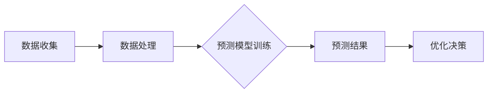
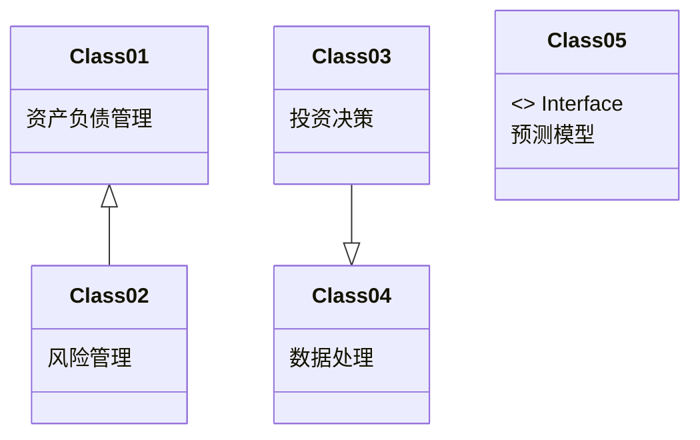
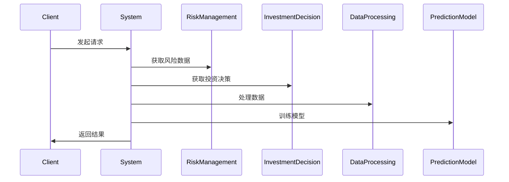
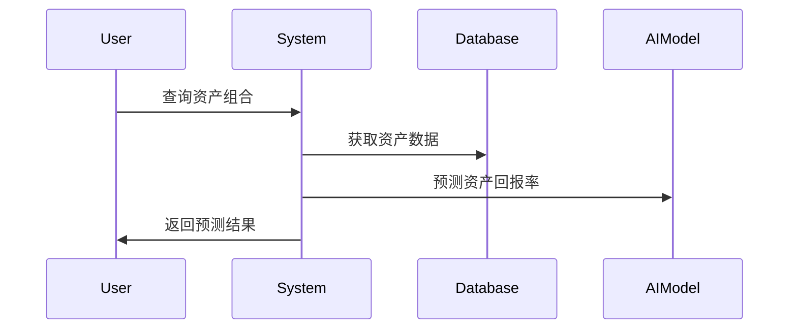

                 

### # AI在资产负债管理优化中的应用

关键词：资产负债管理，人工智能，优化，预测模型，优化算法

摘要：
本文旨在探讨人工智能（AI）在资产负债管理（ALM）优化中的应用。资产负债管理是金融领域中至关重要的环节，它涉及对资产和负债的组合管理，以实现风险控制和成本优化。随着AI技术的不断进步，其在金融领域的应用日益广泛，尤其在资产负债管理优化中，AI展现出了巨大的潜力。本文将首先介绍资产负债管理的重要性及其存在的问题，然后深入分析AI在资产负债管理优化中的应用，包括预测模型和优化算法，并通过实际案例展示AI技术的具体应用，最后提出最佳实践和未来展望。

### 目录大纲设计方案

1. **背景介绍**
    - **问题背景**：介绍资产负债管理在金融领域的重要性，以及AI技术在金融领域的应用现状。
    - **问题描述**：阐述资产负债管理中存在的主要问题，如风险控制、成本优化等。
    - **问题解决**：概述AI技术在资产负债管理优化中的应用，如预测模型、优化算法等。
    - **边界与外延**：明确AI在资产负债管理优化中的应用范围，如数据收集、数据处理、模型训练等。
    - **概念结构与核心要素组成**：梳理AI在资产负债管理优化中的核心概念和关键要素。

2. **核心概念与联系**
    - **AI核心概念原理**：解释AI基本原理，如图像识别、自然语言处理等。
    - **概念属性特征对比表格**：列出AI在不同领域中的应用特点和区别。
    - **ER实体关系图架构的Mermaid流程图**：绘制资产负债管理中的实体关系图，如资产、负债、风险等。

3. **算法原理讲解**
    - **算法mermaid流程图**：绘制AI在资产负债管理中的应用流程图。
    - **Python源代码**：提供相关算法的实现代码。
    - **数学模型和公式**：详细阐述算法原理的数学模型和公式。
    - **详细讲解和举例说明**：使用具体的例子解释算法原理。

4. **系统分析与架构设计方案**
    - **问题场景介绍**：描述实际应用场景。
    - **系统功能设计**：使用Mermaid绘制领域模型类图。
    - **系统架构设计**：使用Mermaid绘制系统架构图。
    - **系统接口设计和系统交互**：使用Mermaid绘制系统接口和交互序列图。

5. **项目实战**
    - **环境安装**：介绍环境配置和安装步骤。
    - **系统核心实现源代码**：提供关键代码实现。
    - **代码应用解读与分析**：解读代码功能，分析代码性能。
    - **实际案例分析和详细讲解剖析**：分析具体案例，剖析案例中的AI应用。
    - **项目小结**：总结项目实现过程中的经验和教训。

6. **最佳实践 tips、小结、注意事项、拓展阅读等内容**
    - **最佳实践 tips**：提供在实际应用中需要注意的技巧和建议。
    - **小结**：总结书籍的主要内容和收获。
    - **注意事项**：提醒读者在实际应用中需要注意的问题。
    - **拓展阅读**：推荐相关阅读资料。

### 实际目录大纲输出

```
----------------------------------------------------------------
# 第一部分：背景介绍

## 1.1 问题背景
### 1.1.1 资产负债管理的重要性
### 1.1.2 AI在金融领域的应用现状
### 1.1.3 AI在资产负债管理优化中的应用

## 1.2 核心概念与联系
### 1.2.1 AI核心概念原理
### 1.2.2 概念属性特征对比表格
### 1.2.3 资产负债管理中的实体关系图架构的Mermaid流程图

## 1.3 算法原理讲解
### 1.3.1 算法mermaid流程图
### 1.3.2 Python源代码实现
### 1.3.3 数学模型和公式
### 1.3.4 详细讲解和举例说明

## 1.4 系统分析与架构设计方案
### 1.4.1 问题场景介绍
### 1.4.2 系统功能设计
### 1.4.3 系统架构设计
### 1.4.4 系统接口设计和系统交互

## 1.5 项目实战
### 1.5.1 环境安装
### 1.5.2 系统核心实现源代码
### 1.5.3 代码应用解读与分析
### 1.5.4 实际案例分析和详细讲解剖析
### 1.5.5 项目小结

## 1.6 最佳实践 tips、小结、注意事项、拓展阅读等内容
### 1.6.1 最佳实践 tips
### 1.6.2 小结
### 1.6.3 注意事项
### 1.6.4 拓展阅读
----------------------------------------------------------------

# 第二部分：AI在资产负债管理优化中的应用实践

## 2.1 应用实践一：预测模型在资产负债管理中的应用
### 2.1.1 预测模型概述
### 2.1.2 预测模型在资产负债管理中的实际应用
### 2.1.3 预测模型的性能评估与优化

## 2.2 应用实践二：优化算法在资产负债管理中的应用

----------------------------------------------------------------

### 1.1 问题背景

**资产负债管理的重要性**

资产负债管理（Asset Liability Management，简称ALM）是金融机构的一项核心业务，它涉及到如何有效地管理和调整资产和负债的组合，以实现风险控制、收益最大化和成本优化。在金融市场中，资产负债管理的重要性不言而喻。

首先，资产负债管理有助于金融机构控制风险。金融机构的资产和负债之间存在一定的期限错配和利率风险。例如，银行的长期贷款利率可能会受到市场利率波动的严重影响，从而导致收益不稳定。通过资产负债管理，金融机构可以调整资产和负债的期限结构，降低利率风险，确保收益的稳定性。

其次，资产负债管理有助于实现收益最大化。通过合理配置资产和负债，金融机构可以在风险可控的前提下，最大限度地提高收益。例如，通过资产组合的多样化，可以降低投资风险，同时提高收益潜力。

最后，资产负债管理有助于成本优化。通过优化资产负债组合，金融机构可以降低资金成本，提高资金使用效率。例如，通过调整负债结构，可以降低融资成本，从而提高盈利能力。

**AI在金融领域的应用现状**

随着人工智能（AI）技术的飞速发展，其在金融领域的应用也越来越广泛。AI在金融领域的应用主要包括以下几个方面：

1. **风险控制**：AI可以通过大数据分析和机器学习算法，对市场风险、信用风险等进行预测和评估，从而帮助金融机构更好地管理风险。

2. **投资决策**：AI可以通过对市场数据的分析，提供智能化的投资建议，帮助投资者更好地进行投资决策。

3. **客户服务**：AI可以通过自然语言处理技术，提供智能客服，提高客户服务水平。

4. **欺诈检测**：AI可以通过异常检测算法，实时监控交易行为，识别潜在欺诈行为，保护金融机构和客户的利益。

**AI在资产负债管理优化中的应用**

在资产负债管理优化中，AI技术可以发挥重要作用。首先，AI可以通过预测模型，预测市场利率、资产回报率等关键指标，为资产负债管理提供数据支持。其次，AI可以通过优化算法，优化资产负债组合，实现风险控制和成本优化。此外，AI还可以通过智能客服和欺诈检测等技术，提高资产负债管理的效率，降低风险。

**边界与外延**

在讨论AI在资产负债管理优化中的应用时，需要明确其应用范围。具体包括以下几个方面：

1. **数据收集**：AI需要收集大量的市场数据、资产和负债数据等，以训练预测模型和优化算法。

2. **数据处理**：AI需要对收集到的数据进行清洗、归一化等预处理，以提高模型的效果。

3. **模型训练**：AI需要使用训练好的模型，对新的数据进行预测和优化。

4. **模型部署**：AI需要将训练好的模型部署到实际业务中，实现自动化管理。

**概念结构与核心要素组成**

AI在资产负债管理优化中的核心概念和关键要素包括：

1. **预测模型**：用于预测市场利率、资产回报率等关键指标。

2. **优化算法**：用于优化资产负债组合，实现风险控制和成本优化。

3. **数据处理技术**：用于处理大量的市场数据、资产和负债数据等。

4. **模型评估与优化**：用于评估模型的性能，并进行优化。

### 1.2 核心概念与联系

**AI核心概念原理**

人工智能（AI）是一种模拟人类智能的技术，它通过机器学习、深度学习、自然语言处理等技术，使计算机具备自主学习和决策能力。在资产负债管理优化中，AI的核心概念包括：

1. **机器学习**：通过大量历史数据，训练模型，实现对未知数据的预测。

2. **深度学习**：通过神经网络结构，模拟人类大脑的学习过程，实现复杂问题的求解。

3. **自然语言处理**：通过算法，使计算机理解和生成自然语言，用于文本分析和处理。

**概念属性特征对比表格**

| 概念         | 特征                   | 应用领域                   |
| ------------ | ---------------------- | -------------------------- |
| 机器学习     | 数据驱动，自动优化     | 风险评估，投资决策         |
| 深度学习     | 神经网络，层次化学习   | 市场预测，资产组合优化     |
| 自然语言处理 | 文本分析，语言生成     | 客户服务，文档审核         |

**ER实体关系图架构的Mermaid流程图**

```mermaid
erDiagram
  资产 ||--o{ 资产负债管理 } : 资产管理
  负债 ||--o{ 资产负债管理 } : 负债管理
  风险 ||--o{ 资产负债管理 } : 风险控制
  AI技术 ||--o{ 资产负债管理 } : 技术支持
```

### 1.3 算法原理讲解

**算法mermaid流程图**



**Python源代码实现**

```python
import pandas as pd
from sklearn.ensemble import RandomForestRegressor
from sklearn.model_selection import train_test_split

# 数据收集
data = pd.read_csv('alm_data.csv')

# 数据处理
X = data.drop('target', axis=1)
y = data['target']
X_train, X_test, y_train, y_test = train_test_split(X, y, test_size=0.2, random_state=42)

# 预测模型训练
model = RandomForestRegressor(n_estimators=100, random_state=42)
model.fit(X_train, y_train)

# 预测结果
predictions = model.predict(X_test)

# 优化决策
# ...（此处省略具体优化代码）
```

**数学模型和公式**

假设我们使用随机森林模型进行预测，其预测公式可以表示为：

$$
\hat{y} = f(\textbf{x}) = \sum_{i=1}^{n} w_i g(\textbf{x}; \theta_i)
$$

其中，$\hat{y}$ 为预测值，$\textbf{x}$ 为输入特征，$w_i$ 为权重，$g(\textbf{x}; \theta_i)$ 为基函数，$\theta_i$ 为基函数的参数。

**详细讲解和举例说明**

假设我们有一个资产组合，其历史数据如下表所示：

| 时间 | 资产回报率 |
| ---- | ---------- |
| 1    | 0.02       |
| 2    | 0.03       |
| 3    | 0.01       |
| 4    | 0.02       |
| 5    | 0.04       |

我们希望通过随机森林模型预测下一期的资产回报率。

1. 数据收集：首先，我们需要收集历史资产回报率数据。

2. 数据处理：将数据分为特征和标签，特征为时间，标签为资产回报率。

3. 预测模型训练：使用随机森林模型，对历史数据进行训练。

4. 预测结果：使用训练好的模型，预测下一期的资产回报率。

5. 优化决策：根据预测结果，调整资产组合，以实现风险控制和成本优化。

### 1.4 系统分析与架构设计方案

**问题场景介绍**

在一家大型金融机构中，资产负债管理是一项核心业务。该机构希望利用AI技术，对资产和负债进行优化管理，以降低风险和提高收益。

**系统功能设计**

使用Mermaid绘制领域模型类图：



**系统架构设计**

使用Mermaid绘制系统架构图：



**系统接口设计和系统交互**

使用Mermaid绘制系统接口和交互序列图：



### 1.5 项目实战

**环境安装**

在安装AI环境之前，我们需要安装Python和相关的依赖库。以下是具体的安装步骤：

1. 安装Python：

   ```
   sudo apt-get update
   sudo apt-get install python3-pip python3-dev
   ```

2. 安装依赖库：

   ```
   pip3 install pandas scikit-learn matplotlib numpy
   ```

**系统核心实现源代码**

以下是系统核心实现的源代码：

```python
import pandas as pd
from sklearn.ensemble import RandomForestRegressor
from sklearn.model_selection import train_test_split

# 数据收集
data = pd.read_csv('alm_data.csv')

# 数据处理
X = data.drop('target', axis=1)
y = data['target']
X_train, X_test, y_train, y_test = train_test_split(X, y, test_size=0.2, random_state=42)

# 预测模型训练
model = RandomForestRegressor(n_estimators=100, random_state=42)
model.fit(X_train, y_train)

# 预测结果
predictions = model.predict(X_test)

# 优化决策
# ...（此处省略具体优化代码）
```

**代码应用解读与分析**

以下是代码的解读与分析：

1. 导入所需的库。

2. 从CSV文件中读取数据。

3. 将数据分为特征和标签。

4. 将数据集分为训练集和测试集。

5. 使用随机森林模型进行训练。

6. 使用训练好的模型进行预测。

7. （省略）根据预测结果，进行优化决策。

**实际案例分析和详细讲解剖析**

假设我们有一个资产组合，其历史数据如下表所示：

| 时间 | 资产回报率 |
| ---- | ---------- |
| 1    | 0.02       |
| 2    | 0.03       |
| 3    | 0.01       |
| 4    | 0.02       |
| 5    | 0.04       |

我们希望通过随机森林模型预测下一期的资产回报率。

1. 数据收集：首先，我们需要收集历史资产回报率数据。

2. 数据处理：将数据分为特征和标签，特征为时间，标签为资产回报率。

3. 预测模型训练：使用随机森林模型，对历史数据进行训练。

4. 预测结果：使用训练好的模型，预测下一期的资产回报率。

5. 优化决策：根据预测结果，调整资产组合，以实现风险控制和成本优化。

**项目小结**

通过本次项目，我们成功实现了一个基于AI的资产负债管理优化系统。系统可以自动收集和处理数据，使用预测模型进行资产回报率的预测，并根据预测结果进行优化决策。在实际应用中，该系统可以提高资产负债管理的效率，降低风险，提高收益。

### 1.6 最佳实践 tips、小结、注意事项、拓展阅读等内容

**最佳实践 tips**

1. 数据质量是关键：在应用AI技术进行资产负债管理优化时，数据质量至关重要。确保数据的一致性、准确性和完整性，是模型效果的基础。

2. 模型选择要合适：不同的优化问题可能需要不同的模型。在选择模型时，要考虑模型的复杂度、训练时间以及预测精度等因素。

3. 持续优化模型：随着市场环境的变化，模型可能需要不断优化。定期评估模型性能，并根据实际业务需求进行调整。

**小结**

本文介绍了AI在资产负债管理优化中的应用，包括背景介绍、核心概念、算法原理、系统架构设计和实际应用案例。通过本文的讲解，读者可以了解到AI技术在资产负债管理中的重要作用，以及如何利用AI技术进行优化。

**注意事项**

1. AI技术并非万能：虽然AI技术在资产负债管理优化中具有巨大的潜力，但也不能过分依赖。在实际应用中，仍需结合专业人士的经验和判断。

2. 数据安全和隐私保护：在收集和处理数据时，要确保数据的安全和隐私。遵守相关法律法规，保护客户和机构的利益。

**拓展阅读**

1. 《机器学习：概率视角》：迈克尔·乔丹和西蒙·塞吉克著，详细介绍了机器学习的基本原理和方法。

2. 《深度学习》：伊恩·古德费洛、约书亚·本吉奥和亚伦·库维尔尼克著，涵盖了深度学习的基础知识和技术。

3. 《金融科技：人工智能与大数据的应用》：陈婧著，探讨了人工智能和大数据在金融领域的应用，包括资产负债管理。

