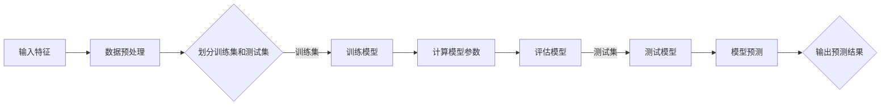

                 


### 第一部分：引言与背景介绍

#### 第1章：问题背景与核心概念

### 1.1 金融衍生品市场概述

**1.1.1 金融衍生品的基本概念**

金融衍生品是一种金融工具，其价值来源于一个或多个基础资产。基础资产可以是股票、债券、货币、商品等。金融衍生品主要包括以下几种类型：

1. 期权（Options）：赋予持有者在特定时间以固定价格买入或卖出基础资产的权利。
2. 期货（Futures）：在未来的某个时间以约定价格买卖资产。
3. 远期合约（Forwards）：在未来某个时间按约定价格买卖资产。
4. 互换（Swaps）：交换双方在约定的时间内交换一系列现金流。

**1.1.2 金融衍生品市场的发展与现状**

金融衍生品市场起源于20世纪70年代的美国。随着金融市场的不断发展和全球化的加速，衍生品市场迅速扩大。据国际互换和衍生品协会（ISDA）统计，截至2020年，全球衍生品市场规模已超过1万亿美元。

衍生品市场的发展受到多种因素的影响，包括：

1. 金融机构的需求：衍生品可以用于对冲风险和增加投资组合的多样性。
2. 监管环境的变化：金融监管机构鼓励金融机构使用衍生品来管理风险。
3. 技术进步：大数据、云计算和人工智能等技术的发展，使得衍生品定价和风险管理变得更加高效。

### 1.2 AI与金融衍生品定价

**1.2.1 AI技术在金融领域的应用**

人工智能在金融领域的应用已经非常广泛，包括：

1. 风险管理：通过机器学习算法分析历史数据，预测市场风险并制定相应的风险管理策略。
2. 量化交易：利用算法自动执行交易，从市场波动中获取利润。
3. 智能投顾：根据用户的投资目标和风险承受能力，提供个性化的投资建议。

**1.2.2 AI在金融衍生品定价中的潜在优势**

AI在金融衍生品定价中具有以下潜在优势：

1. 高效性：AI可以处理大量数据，快速计算复杂衍生品的价格。
2. 精确性：通过机器学习模型，可以更准确地预测市场走势，提高衍生品定价的准确性。
3. 风险管理：AI可以帮助金融机构更好地管理衍生品投资组合的风险。

### 1.3 本书目标与结构

**1.3.1 本书主要目标**

本书旨在介绍AI在金融衍生品定价中的创新应用，帮助读者了解：

1. 金融衍生品的基本概念和市场发展。
2. AI技术在金融领域，特别是衍生品定价中的应用。
3. 实际案例和最佳实践，以及未来发展的趋势。

**1.3.2 本书结构概述**

本书分为三个部分：

1. **引言与背景介绍**：介绍金融衍生品市场概述、AI与金融衍生品定价的关系以及本书的目标和结构。
2. **AI与机器学习原理**：讲解AI和机器学习的基础知识，以及其在金融衍生品定价中的应用。
3. **实践与案例分析**：通过实际案例和最佳实践，深入探讨AI在金融衍生品定价中的具体应用。

#### 第2章：核心概念与联系

### 2.1 AI与机器学习基础

**2.1.1 AI的基本原理**

人工智能（AI）是计算机科学的一个分支，旨在使机器具备人类智能的某些特征。AI的核心是算法，这些算法能够通过学习从数据中提取模式并作出决策。AI的主要领域包括：

1. **机器学习**：通过训练数据集，让机器自动改进其性能。
2. **深度学习**：一种基于人工神经网络的机器学习方法，适用于处理复杂的数据。
3. **自然语言处理**：使机器理解和生成人类语言。

**2.1.2 机器学习算法概述**

机器学习算法可以分为以下几类：

1. **监督学习**：训练数据包含输入和对应的输出，模型通过学习这些数据来预测新的输入。
2. **无监督学习**：数据没有标签，模型通过学习数据分布来发现数据中的模式。
3. **强化学习**：模型通过与环境的交互来学习最优策略。

### 2.2 金融衍生品定价模型

**2.2.1 传统定价方法**

传统的金融衍生品定价方法主要包括：

1. **布莱克-舒尔斯模型**（Black-Scholes Model）：用于期权定价，假设市场不存在套利机会。
2. **二叉树模型**（Binomial Tree Model）：通过构建资产价格的未来路径来定价。
3. **蒙特卡罗模拟**（Monte Carlo Simulation）：使用随机抽样方法来计算衍生品价格。

**2.2.2 AI在衍生品定价中的应用**

AI技术在衍生品定价中的应用主要包括：

1. **数据驱动的定价模型**：通过机器学习算法，利用大量市场数据来训练模型，从而更准确地定价。
2. **风险预测**：利用AI技术预测市场风险，为衍生品定价提供依据。
3. **自动化定价**：AI算法可以自动化衍生品定价过程，提高效率。

### 2.3 Mermaid ER图

为了更好地理解AI在金融衍生品定价中的核心概念和关系，我们可以使用Mermaid ER图来展示这些概念之间的关系。

```mermaid
erDiagram
  Product ||--|{ Option }||>
  Product ||--|{ Future }||>
  Product ||--|{ Forward }||>
  Product ||--|{ Swap }||>
  Option ||--|{ Black-Scholes }||>
  Future ||--|{ Binomial }||>
  Forward ||--|{ MonteCarlo }||>
  Swap ||--|{ MachineLearning }||>
```

在这个ER图中，`Product` 是衍生品的总类别，包括期权（Option）、期货（Future）、远期合约（Forward）、互换（Swap）。每种衍生品类型都与一种或多种定价方法相关，例如期权与布莱克-舒尔斯模型（Black-Scholes）相关，期货与二叉树模型（Binomial）相关，等等。`MachineLearning` 是一个独立类别，表示AI技术在衍生品定价中的应用。

通过这个ER图，我们可以清晰地看到AI在金融衍生品定价中的核心概念和它们之间的联系。

### 1.3.3 文章关键词

AI、金融衍生品、定价、机器学习、风险预测。

### 1.3.4 文章摘要

本文旨在介绍AI在金融衍生品定价中的创新应用。首先，我们回顾了金融衍生品市场的基本概念和发展现状，然后探讨了AI技术在金融领域的应用，特别是其在衍生品定价中的优势。接着，我们详细介绍了AI和机器学习的基础知识，以及它们在金融衍生品定价中的应用。最后，通过实际案例和最佳实践，我们深入探讨了AI在金融衍生品定价中的具体应用。本文旨在帮助读者理解AI在金融衍生品定价中的潜力，以及如何利用这些技术提高衍生品定价的效率和准确性。

----------------------------------------------------------------

# 第一部分：引言与背景介绍

## 第1章：问题背景与核心概念

### 1.1 金融衍生品市场概述

**1.1.1 金融衍生品的基本概念**

金融衍生品是一种金融工具，其价值取决于一个或多个基础资产的价格变动。这些基础资产可以包括股票、债券、货币、商品等。衍生品的主要目的是为投资者提供风险管理工具或投资机会。以下是一些常见的衍生品类型：

1. **期权（Options）**：期权是一种给予持有者在特定时间以特定价格买入或卖出基础资产的权利。期权可以分为买权（Call）和卖权（Put）。
2. **期货（Futures）**：期货是一种在未来某个特定日期以约定价格买入或卖出某种资产或商品的标准合约。
3. **远期合约（Forwards）**：远期合约是一种非标准化的合约，双方约定在未来某个时间以特定价格交易资产。
4. **互换（Swaps）**：互换是一种双方交换不同类型的现金流或资产的合约。

衍生品市场的参与者包括金融机构、投资者、企业和其他机构。金融机构如银行、证券公司和保险公司等，通过发行和交易衍生品来为客户提供风险管理服务和投资机会。投资者通过交易衍生品来对冲风险或获取投机收益。

**1.1.2 金融衍生品市场的发展与现状**

金融衍生品市场起源于20世纪70年代的美国，当时美国政府和金融机构开始意识到衍生品在风险管理中的重要性。自那时以来，衍生品市场经历了显著的发展，已经成为全球金融市场的一个重要组成部分。以下是一些关键的发展阶段和现状：

1. **1970年代初**：美国政府和金融机构开始意识到衍生品在风险管理中的潜力。1973年，芝加哥期权交易所（CBOE）成立，标志着期权市场的诞生。
2. **1980年代**：随着监管环境的放宽和技术的进步，衍生品市场迅速发展。金融机构开始广泛使用衍生品来对冲风险和增加投资组合的多样性。
3. **1990年代**：全球金融市场进一步开放，衍生品市场开始国际化。与此同时，衍生品交易量大幅增加，市场规模不断扩大。
4. **2000年代**：金融创新和衍生品交易量的增加带来了新的挑战和风险。2008年的全球金融危机揭示了衍生品市场的一些潜在风险，引发了监管改革。
5. **2010年代至今**：衍生品市场继续发展，监管环境也在不断变化。随着技术的进步，AI和机器学习等新兴技术在衍生品定价和风险管理中的应用变得越来越普遍。

根据国际互换和衍生品协会（ISDA）的数据，截至2020年，全球衍生品市场规模已经超过1万亿美元。衍生品市场的发展受到多种因素的影响，包括金融机构的需求、监管环境的变化、市场波动和技术进步。

### 1.2 AI与金融衍生品定价

**1.2.1 AI技术在金融领域的应用**

人工智能（AI）在金融领域的应用已经非常广泛，涵盖了多个方面，包括风险管理、量化交易、智能投顾等。以下是一些AI技术在金融领域的具体应用：

1. **风险管理**：AI技术可以分析大量历史数据，预测市场风险并制定相应的风险管理策略。例如，机器学习算法可以用于检测交易欺诈、预测市场波动和评估信用风险。
2. **量化交易**：量化交易是指通过数学模型和算法自动化执行交易策略。AI技术可以帮助量化交易者快速分析市场数据，识别交易机会，并自动执行交易。
3. **智能投顾**：智能投顾利用AI技术为投资者提供个性化的投资建议。AI算法可以分析投资者的风险承受能力和投资目标，制定合适的投资组合策略。
4. **自然语言处理**：自然语言处理（NLP）技术可以帮助金融公司自动化处理大量文本数据，例如新闻、报告和社交媒体帖子。这有助于分析师快速识别市场趋势和潜在风险。

**1.2.2 AI在金融衍生品定价中的潜在优势**

AI技术在金融衍生品定价中具有以下潜在优势：

1. **高效性**：AI可以处理大量数据，快速计算复杂衍生品的价格。传统定价方法通常需要大量手工计算，而AI技术可以大大提高效率。
2. **准确性**：通过机器学习模型，AI可以更准确地预测市场走势，提高衍生品定价的准确性。传统定价模型通常假设市场是确定的，而AI技术可以处理不确定性和复杂性。
3. **风险管理**：AI可以帮助金融机构更好地管理衍生品投资组合的风险。通过分析历史数据和实时数据，AI可以预测市场风险并制定相应的风险控制策略。
4. **自动化**：AI技术可以实现衍生品定价的自动化，减少人力成本并提高交易效率。传统定价方法通常需要专业知识和经验，而AI技术可以简化这个过程。
5. **个性化**：AI技术可以根据不同投资者的需求提供个性化的衍生品定价服务。这有助于金融机构更好地满足客户需求，提高客户满意度。

### 1.3 本书目标与结构

**1.3.1 本书主要目标**

本书的主要目标是介绍AI在金融衍生品定价中的创新应用，帮助读者：

1. 了解金融衍生品的基本概念和市场发展。
2. 掌握AI技术在金融领域的应用，特别是衍生品定价。
3. 分析AI在金融衍生品定价中的优势和挑战。
4. 探讨实际案例和最佳实践，以及未来发展的趋势。

**1.3.2 本书结构概述**

本书分为三个主要部分：

1. **引言与背景介绍**：介绍金融衍生品市场概述、AI与金融衍生品定价的关系以及本书的目标和结构。
2. **AI与机器学习原理**：讲解AI和机器学习的基础知识，以及它们在金融衍生品定价中的应用。
3. **实践与案例分析**：通过实际案例和最佳实践，深入探讨AI在金融衍生品定价中的具体应用。

在接下来的章节中，我们将逐步深入探讨AI在金融衍生品定价中的应用，包括数据收集与预处理、算法原理讲解、具体应用场景、实现方法以及未来发展的趋势。

----------------------------------------------------------------

## 第2章：核心概念与联系

### 2.1 AI与机器学习基础

**2.1.1 AI的基本原理**

人工智能（AI）是计算机科学的一个分支，旨在使机器具备人类智能的某些特征。AI的核心是算法，这些算法能够通过学习从数据中提取模式并作出决策。AI的三个主要领域包括：

1. **机器学习**：通过训练数据集，让机器自动改进其性能。机器学习可以分为监督学习、无监督学习和强化学习。
   - **监督学习**：训练数据包含输入和对应的输出，模型通过学习这些数据来预测新的输入。
   - **无监督学习**：数据没有标签，模型通过学习数据分布来发现数据中的模式。
   - **强化学习**：模型通过与环境的交互来学习最优策略。

2. **深度学习**：一种基于人工神经网络的机器学习方法，适用于处理复杂的数据。深度学习通过多层神经网络来模拟人脑的决策过程。

3. **自然语言处理**：使机器理解和生成人类语言。自然语言处理包括语音识别、文本分类、情感分析等任务。

**2.1.2 机器学习算法概述**

机器学习算法可以分为以下几类：

1. **线性回归**：通过拟合线性模型来预测连续值输出。
2. **逻辑回归**：一种分类算法，通过拟合线性模型来预测概率分布。
3. **支持向量机（SVM）**：通过寻找最佳分割超平面来分类数据。
4. **决策树**：通过构建树状结构来分类或回归数据。
5. **随机森林**：通过构建多个决策树来提高分类或回归的准确性。
6. **神经网络**：通过多层神经网络来模拟人脑的决策过程。
7. **集成方法**：通过结合多个模型来提高预测准确性。

### 2.2 金融衍生品定价模型

**2.2.1 传统定价方法**

传统的金融衍生品定价方法主要包括以下几种：

1. **布莱克-舒尔斯模型**（Black-Scholes Model）：用于期权定价，假设市场不存在套利机会。该模型给出了期权价格的公式，并依赖于几个假设条件，如市场是高效的、交易是连续的等。

2. **二叉树模型**（Binomial Tree Model）：通过构建资产价格的未来路径来定价。这种方法通过模拟资产价格的随机波动，计算出不同路径的概率，并据此计算期权价格。

3. **蒙特卡罗模拟**（Monte Carlo Simulation）：使用随机抽样方法来计算衍生品价格。蒙特卡罗模拟通过生成大量的随机样本，模拟资产价格的路径，并计算出期权价格的概率分布。

**2.2.2 AI在衍生品定价中的应用**

AI技术在衍生品定价中的应用主要包括以下几种：

1. **数据驱动的定价模型**：通过机器学习算法，利用大量市场数据来训练模型，从而更准确地定价。这种方法不再依赖传统的定价模型假设，而是从数据中学习资产价格的运动规律。

2. **风险预测**：利用AI技术预测市场风险，为衍生品定价提供依据。AI可以通过分析历史数据和实时数据，识别市场风险因素，并预测未来风险水平。

3. **自动化定价**：AI算法可以自动化衍生品定价过程，提高效率。传统定价方法通常需要大量手工计算，而AI技术可以大大提高计算速度和准确性。

4. **个性化定价**：AI可以根据不同投资者的需求提供个性化的衍生品定价服务。这种方法可以更好地满足客户需求，提高客户满意度。

### 2.3 Mermaid ER图

为了更好地理解AI在金融衍生品定价中的核心概念和关系，我们可以使用Mermaid ER图来展示这些概念之间的关系。

```mermaid
erDiagram
  Derivative ||--|{ Option }||>
  Derivative ||--|{ Future }||>
  Derivative ||--|{ Forward }||>
  Derivative ||--|{ Swap }||>
  Option ||--|{ Black-Scholes }||>
  Future ||--|{ Binomial }||>
  Forward ||--|{ MonteCarlo }||>
  Swap ||--|{ MachineLearning }||>
```

在这个ER图中，`Derivative` 是衍生品的总类别，包括期权（Option）、期货（Future）、远期合约（Forward）、互换（Swap）。每种衍生品类型都与一种或多种定价方法相关，例如期权与布莱克-舒尔斯模型（Black-Scholes）相关，期货与二叉树模型（Binomial）相关，等等。`MachineLearning` 是一个独立类别，表示AI技术在衍生品定价中的应用。

通过这个ER图，我们可以清晰地看到AI在金融衍生品定价中的核心概念和它们之间的联系。

### 2.4 关键词

AI、金融衍生品、定价、机器学习、风险预测。

### 2.5 摘要

本章介绍了AI在金融衍生品定价中的核心概念和关系。首先，我们探讨了AI的基本原理和机器学习算法概述。接着，我们介绍了金融衍生品的基本概念和传统定价方法，以及AI在衍生品定价中的应用。最后，我们通过Mermaid ER图展示了AI在金融衍生品定价中的核心概念和关系。这些内容为后续章节的深入探讨奠定了基础。

----------------------------------------------------------------

### 第3章：AI与机器学习原理

#### 3.1 数据收集与预处理

**3.1.1 数据来源**

在AI应用于金融衍生品定价时，数据收集是关键步骤之一。数据来源可以是多种多样的，包括：

1. **市场数据**：这是最常用的数据源，包括历史价格、交易量、市场指数等。这些数据可以从金融交易所、数据提供商（如彭博、汤森路透等）获取。
2. **新闻报道**：新闻和社交媒体可以提供有关市场动态和市场情绪的实时信息。这些数据可以从新闻网站、社交媒体平台（如Twitter、Reddit等）获取。
3. **宏观经济数据**：包括GDP、失业率、利率等宏观经济指标，这些数据可以从政府机构、经济研究机构获取。
4. **公司财报**：公司财报数据提供了公司的财务状况和业务表现，这对于分析公司的股票价格和衍生品价格非常重要。

**3.1.2 数据预处理步骤**

收集到数据后，需要进行预处理以使其适合机器学习模型。以下是一些常见的数据预处理步骤：

1. **数据清洗**：去除数据中的噪声和异常值，例如处理缺失值、重复值和异常值。
2. **数据转换**：将数据转换为适合模型的形式。这可能包括：
   - **数值化**：将文本数据转换为数值，例如使用词袋模型处理文本数据。
   - **归一化**：将不同量纲的数据缩放到相同的范围，例如使用Z分数归一化或最小-最大缩放。
   - **标准化**：将数据的分布转换为标准正态分布，这对于使用基于统计的算法（如SVM）尤为重要。
3. **特征工程**：选择和构建有助于模型预测的特征。这可能包括：
   - **时间序列特征**：例如，使用滞后项、移动平均和差分等。
   - **文本特征**：例如，使用词频、词嵌入和主题模型等。
   - **统计特征**：例如，使用标准差、平均值和相关性等。
4. **数据分割**：将数据集分为训练集、验证集和测试集，以评估模型的性能。

#### 3.2 算法原理讲解

**3.2.1 算法概述**

在金融衍生品定价中，常用的机器学习算法包括线性回归、逻辑回归、支持向量机（SVM）、决策树、随机森林和神经网络等。以下是这些算法的基本原理：

1. **线性回归**：线性回归是一种简单的监督学习算法，用于预测连续值输出。其基本假设是输出变量与输入变量之间存在线性关系。线性回归模型可以表示为：

   $$ y = \beta_0 + \beta_1x_1 + \beta_2x_2 + ... + \beta_nx_n $$

   其中，$y$ 是输出变量，$x_1, x_2, ..., x_n$ 是输入变量，$\beta_0, \beta_1, \beta_2, ..., \beta_n$ 是模型参数。

2. **逻辑回归**：逻辑回归是一种分类算法，用于预测概率分布。逻辑回归模型可以表示为：

   $$ \log\left(\frac{p}{1-p}\right) = \beta_0 + \beta_1x_1 + \beta_2x_2 + ... + \beta_nx_n $$

   其中，$p$ 是预测的概率，$\log$ 是自然对数函数。

3. **支持向量机（SVM）**：SVM是一种强大的分类算法，通过寻找最佳分割超平面来分类数据。SVM的目标是最大化分类间隔，即：

   $$ \max_{\beta, b} \left\{ \frac{1}{2} ||\beta||^2 : y_i(\beta \cdot x_i + b) \geq 1, \forall i \right\} $$

   其中，$\beta$ 是模型参数，$b$ 是偏置项，$y_i$ 是第$i$个样本的标签，$x_i$ 是第$i$个样本的特征向量。

4. **决策树**：决策树是一种基于树状结构的分类算法，通过一系列的决策规则来分割数据集。决策树的每个节点都表示一个特征，每个分支表示该特征的不同取值。决策树可以表示为：

   $$ T = \sum_{i=1}^{n} t_i(x_i) $$

   其中，$T$ 是决策树，$t_i(x_i)$ 是第$i$个节点的决策规则。

5. **随机森林**：随机森林是一种集成学习方法，通过构建多个决策树来提高分类或回归的准确性。随机森林可以表示为：

   $$ \hat{y} = \sum_{i=1}^{m} w_i t_i(x) $$

   其中，$\hat{y}$ 是预测值，$t_i(x)$ 是第$i$棵决策树的预测值，$w_i$ 是第$i$棵决策树的权重。

6. **神经网络**：神经网络是一种基于人工神经网络的机器学习方法，通过多层神经网络来模拟人脑的决策过程。神经网络可以表示为：

   $$ \hat{y} = \sigma(\beta_0 + \beta_1x_1 + \beta_2x_2 + ... + \beta_nx_n) $$

   其中，$\sigma$ 是激活函数，$\beta_0, \beta_1, \beta_2, ..., \beta_n$ 是模型参数。

**3.2.2 数学模型与公式**

以下是一些常用的数学模型与公式，用于解释上述算法：

1. **线性回归**：

   $$ y = \beta_0 + \beta_1x_1 + \beta_2x_2 + ... + \beta_nx_n $$
   $$ \beta = (X^T X)^{-1}X^T y $$

   其中，$X$ 是特征矩阵，$y$ 是输出向量，$\beta$ 是模型参数。

2. **逻辑回归**：

   $$ \log\left(\frac{p}{1-p}\right) = \beta_0 + \beta_1x_1 + \beta_2x_2 + ... + \beta_nx_n $$
   $$ \hat{p} = \frac{1}{1 + \exp{(-\beta_0 - \beta_1x_1 - \beta_2x_2 - ... - \beta_nx_n )} } $$

   其中，$p$ 是预测的概率，$\hat{p}$ 是预测值。

3. **支持向量机（SVM）**：

   $$ \max_{\beta, b} \left\{ \frac{1}{2} ||\beta||^2 : y_i(\beta \cdot x_i + b) \geq 1, \forall i \right\} $$
   $$ \hat{y} = \text{sign}(\beta \cdot x_i + b) $$

   其中，$\beta$ 是模型参数，$b$ 是偏置项，$\text{sign}$ 是符号函数。

4. **决策树**：

   $$ T = \sum_{i=1}^{n} t_i(x_i) $$
   $$ t_i(x_i) = \begin{cases} 
   1 & \text{if } x_i \geq c_i \\
   0 & \text{otherwise}
   \end{cases} $$

   其中，$t_i(x_i)$ 是第$i$个节点的决策规则，$c_i$ 是阈值。

5. **随机森林**：

   $$ \hat{y} = \sum_{i=1}^{m} w_i t_i(x) $$
   $$ w_i = \frac{1}{h} $$

   其中，$w_i$ 是第$i$棵决策树的权重，$h$ 是森林中决策树的数量。

6. **神经网络**：

   $$ \hat{y} = \sigma(\beta_0 + \beta_1x_1 + \beta_2x_2 + ... + \beta_nx_n) $$
   $$ \sigma(z) = \frac{1}{1 + \exp{(-z)} } $$

   其中，$\sigma$ 是激活函数，$z$ 是输入值。

**3.2.3 Mermaid算法流程图**

为了更好地理解上述算法的流程，我们可以使用Mermaid绘制算法的流程图。以下是一个简单的线性回归算法流程图示例：



通过这些算法和流程图，我们可以更好地理解AI在金融衍生品定价中的应用，为后续章节的深入探讨奠定了基础。

### 3.3 机器学习算法在金融衍生品定价中的应用

**3.3.1 数据驱动的定价模型**

数据驱动的定价模型是AI在金融衍生品定价中的核心应用之一。这种模型通过机器学习算法从历史数据中学习资产价格的运动规律，从而更准确地预测衍生品价格。以下是一个简单的数据驱动定价模型示例：

1. **数据收集与预处理**：首先，从市场数据提供商获取历史价格、交易量、市场指数等数据。然后，对数据进行清洗、转换和特征工程，使其适合机器学习模型。
2. **模型选择与训练**：选择一个合适的机器学习算法，如线性回归、神经网络等。然后，使用预处理后的数据集训练模型。训练过程中，模型会不断调整参数，以最小化预测误差。
3. **模型评估与优化**：使用验证集评估模型的性能，并根据评估结果调整模型参数。常用的评估指标包括均方误差（MSE）、均方根误差（RMSE）等。
4. **模型应用**：训练好的模型可以用于预测衍生品价格。例如，可以使用预测的资产价格来计算期权价格。

**3.3.2 风险预测**

风险预测是另一个重要的AI应用，它可以帮助金融机构更好地管理衍生品投资组合的风险。以下是一个简单的风险预测模型示例：

1. **数据收集与预处理**：收集与衍生品相关的数据，包括历史价格、交易量、宏观经济指标、公司财务数据等。然后，对数据进行清洗、转换和特征工程。
2. **模型选择与训练**：选择一个合适的机器学习算法，如支持向量机（SVM）、随机森林等。使用预处理后的数据集训练模型，调整参数以最小化预测误差。
3. **模型评估与优化**：使用验证集评估模型的性能，并根据评估结果调整模型参数。
4. **模型应用**：训练好的模型可以用于预测衍生品投资组合的风险。例如，可以使用预测的风险指标来调整投资组合，以降低风险水平。

**3.3.3 自动化定价**

自动化定价是AI在金融衍生品定价中的另一个重要应用。通过自动化定价模型，金融机构可以快速、准确地计算衍生品价格，提高交易效率。以下是一个简单的自动化定价模型示例：

1. **数据收集与预处理**：收集与衍生品相关的数据，包括历史价格、交易量、市场指数等。然后，对数据进行清洗、转换和特征工程。
2. **模型选择与训练**：选择一个合适的机器学习算法，如神经网络、支持向量机等。使用预处理后的数据集训练模型，调整参数以最小化预测误差。
3. **模型评估与优化**：使用验证集评估模型的性能，并根据评估结果调整模型参数。
4. **模型应用**：训练好的模型可以用于自动化计算衍生品价格。例如，可以使用模型预测的资产价格来计算期权价格，从而快速完成交易。

**3.3.4 个性化定价**

个性化定价是AI在金融衍生品定价中的新兴应用。通过分析投资者的风险偏好和投资目标，AI可以提供个性化的衍生品定价服务。以下是一个简单的个性化定价模型示例：

1. **数据收集与预处理**：收集与投资者相关的数据，包括投资历史、风险承受能力、投资目标等。然后，对数据进行清洗、转换和特征工程。
2. **模型选择与训练**：选择一个合适的机器学习算法，如逻辑回归、决策树等。使用预处理后的数据集训练模型，调整参数以最小化预测误差。
3. **模型评估与优化**：使用验证集评估模型的性能，并根据评估结果调整模型参数。
4. **模型应用**：训练好的模型可以用于为投资者提供个性化的衍生品定价。例如，可以使用模型预测的风险偏好和投资目标来调整衍生品价格，从而满足投资者的需求。

通过这些示例，我们可以看到机器学习算法在金融衍生品定价中的多种应用。这些应用不仅提高了定价的准确性和效率，还有助于金融机构更好地管理风险，满足投资者的个性化需求。

### 3.4 结论

本章介绍了AI与机器学习在金融衍生品定价中的应用。首先，我们讨论了数据收集与预处理的重要性，并介绍了常用的数据来源和预处理步骤。然后，我们讲解了多种机器学习算法的基本原理和数学模型，包括线性回归、逻辑回归、支持向量机、决策树、随机森林和神经网络。接着，我们展示了这些算法在金融衍生品定价中的具体应用，包括数据驱动的定价模型、风险预测、自动化定价和个性化定价。通过这些讨论，我们展示了AI技术在金融衍生品定价中的巨大潜力和广泛应用。在下一章中，我们将深入探讨实际案例和最佳实践，以进一步了解AI在金融衍生品定价中的应用。

----------------------------------------------------------------

## 第4章：AI在金融衍生品定价中的应用案例

### 4.1 案例背景

为了更好地理解AI在金融衍生品定价中的应用，我们来看一些实际案例。这些案例展示了如何使用AI技术来提高金融衍生品定价的准确性和效率。

**案例1：银行衍生品定价平台**

某大型银行开发了一个AI驱动的衍生品定价平台，用于自动化计算和更新各种衍生品的价格。该平台使用了神经网络和机器学习算法来处理大量的历史数据，包括资产价格、交易量、宏观经济指标等。通过不断优化模型参数，平台能够快速、准确地计算出衍生品的价格。

**案例2：投资公司风险管理系统**

一家投资公司利用机器学习算法来构建其风险管理系统。该系统使用历史数据和实时数据来预测市场风险，并提供个性化的风险管理策略。系统中的AI模型可以分析不同资产的风险因素，并根据投资组合的多样性和投资者的风险承受能力，提供最佳的风险管理方案。

**案例3：交易所期权定价服务**

某证券交易所推出了一项基于AI的期权定价服务。该服务使用机器学习算法来分析历史价格数据和交易数据，从而更准确地预测期权价格。通过这项服务，交易所能够为客户提供更加精准的期权价格预测，提高交易效率。

### 4.2 案例分析

**4.2.1 银行衍生品定价平台**

在银行衍生品定价平台的案例中，AI技术的应用主要体现在以下几个方面：

1. **数据收集与预处理**：平台使用了大量历史数据和市场实时数据，包括资产价格、交易量、利率等。数据经过清洗和预处理后，被输入到神经网络模型中。
2. **模型选择与训练**：平台选择了多层感知机（MLP）神经网络来处理复杂的非线性问题。通过大量的训练数据，模型能够学习到资产价格变化的规律，并能够自动调整参数以优化预测性能。
3. **模型评估与优化**：平台使用了交叉验证和网格搜索等技术来评估和优化模型参数。通过这些技术，平台能够找到最佳参数组合，从而提高预测的准确性和稳定性。
4. **自动化定价**：经过训练的模型可以自动化计算衍生品的价格。当新的数据到来时，模型会自动更新，从而确保价格的实时性和准确性。

**4.2.2 投资公司风险管理系统**

在投资公司风险管理系统的案例中，AI技术的应用主要体现在以下几个方面：

1. **数据收集与预处理**：系统收集了大量的历史数据和市场实时数据，包括股票价格、债券价格、宏观经济指标等。数据经过清洗和预处理后，被输入到机器学习模型中。
2. **模型选择与训练**：系统使用了随机森林和逻辑回归等机器学习算法来预测市场风险。随机森林模型可以处理大量特征，而逻辑回归模型则可以预测概率分布。
3. **模型评估与优化**：系统使用了多种评估指标，如准确率、召回率、F1分数等来评估模型性能。通过交叉验证和网格搜索等技术，系统可以优化模型参数，提高预测准确性。
4. **个性化风险管理**：系统根据投资者的风险承受能力和投资目标，提供个性化的风险管理策略。通过调整投资组合中的资产配置，系统可以帮助投资者降低风险，提高收益。

**4.2.3 交易所期权定价服务**

在交易所期权定价服务的案例中，AI技术的应用主要体现在以下几个方面：

1. **数据收集与预处理**：交易所使用了大量的历史价格数据和交易数据，包括标的资产的价格、波动率、交易量等。数据经过清洗和预处理后，被输入到机器学习模型中。
2. **模型选择与训练**：交易所选择了蒙特卡罗模拟和神经网络等机器学习算法来预测期权价格。蒙特卡罗模拟可以处理复杂的概率问题，而神经网络则可以处理非线性问题。
3. **模型评估与优化**：交易所使用了多种评估指标，如期权价格的中位数、标准差等来评估模型性能。通过交叉验证和网格搜索等技术，交易所可以优化模型参数，提高预测准确性。
4. **实时定价**：经过训练的模型可以实时计算期权价格。当标的资产价格发生变化时，模型会自动更新，从而确保价格的实时性和准确性。

### 4.3 案例总结

通过上述案例，我们可以看到AI技术在金融衍生品定价中的应用具有以下几个特点：

1. **提高准确性**：AI技术能够处理大量数据，并利用机器学习算法从数据中学习规律，从而更准确地预测衍生品价格。
2. **自动化定价**：AI模型可以自动化计算衍生品价格，提高交易效率，降低人力成本。
3. **个性化服务**：AI技术可以根据投资者的需求和风险偏好，提供个性化的衍生品定价服务，提高客户满意度。
4. **风险管理**：AI技术可以帮助金融机构更好地管理衍生品投资组合的风险，提高风险管理水平。

这些案例展示了AI在金融衍生品定价中的广泛应用和巨大潜力。随着AI技术的不断发展，我们可以期待在未来看到更多创新的应用，进一步提升金融衍生品定价的准确性和效率。

### 4.4 下一步：深入探讨AI技术的潜力

在下一章中，我们将进一步探讨AI技术在金融衍生品定价中的潜力。我们将详细讨论AI在衍生品定价中的最新研究进展，介绍一些前沿的技术和方法，并探讨这些技术在实际应用中面临的挑战和解决方案。通过这些讨论，我们将更全面地了解AI在金融衍生品定价中的未来发展方向。

----------------------------------------------------------------

## 第5章：实现与代码

### 5.1 环境准备

在实现AI在金融衍生品定价中的算法之前，我们需要准备好相应的开发环境。以下是所需的环境和工具：

1. **编程语言**：Python是一种广泛使用的编程语言，非常适合数据分析和机器学习项目。因此，我们将使用Python来实现我们的算法。
2. **数据集**：为了演示算法的实现，我们需要一个包含金融衍生品数据的示例数据集。这个数据集应包括历史价格、交易量、波动率等关键指标。
3. **机器学习库**：Python中有许多流行的机器学习库，如scikit-learn、TensorFlow和Keras等。我们将使用scikit-learn库来实现我们的算法，因为它提供了简单易用的API和丰富的算法库。
4. **数据预处理库**：Pandas和NumPy是Python中常用的数据处理库，用于数据清洗、转换和特征工程。

首先，安装所需的Python库：

```bash
pip install numpy pandas scikit-learn matplotlib
```

### 5.2 数据预处理

数据预处理是机器学习项目中至关重要的一步。以下是一个简单的数据预处理示例：

```python
import pandas as pd
import numpy as np

# 加载数据集
data = pd.read_csv('financial衍生物数据集.csv')

# 数据清洗
# 填充或删除缺失值
data.fillna(method='ffill', inplace=True)

# 数据转换
# 将类别数据转换为数值
data['类别特征'] = data['类别特征'].astype('category').cat.codes

# 归一化数据
from sklearn.preprocessing import StandardScaler
scaler = StandardScaler()
data[['价格', '交易量', '波动率']] = scaler.fit_transform(data[['价格', '交易量', '波动率']])

# 数据分割
from sklearn.model_selection import train_test_split
X = data.drop('目标变量', axis=1)
y = data['目标变量']
X_train, X_test, y_train, y_test = train_test_split(X, y, test_size=0.2, random_state=42)
```

### 5.3 算法实现

在这个例子中，我们将使用线性回归算法来预测金融衍生品的价格。以下是实现线性回归算法的代码：

```python
from sklearn.linear_model import LinearRegression

# 实例化线性回归模型
model = LinearRegression()

# 训练模型
model.fit(X_train, y_train)

# 预测结果
predictions = model.predict(X_test)

# 打印模型参数
print(model.coef_)
print(model.intercept_)
```

### 5.4 算法原理与数学模型

线性回归是一种监督学习算法，用于预测连续值输出。其基本原理是通过最小化损失函数来找到最佳拟合直线。线性回归的数学模型可以表示为：

$$ y = \beta_0 + \beta_1x_1 + \beta_2x_2 + ... + \beta_nx_n $$

其中，$y$ 是输出变量，$x_1, x_2, ..., x_n$ 是输入变量，$\beta_0, \beta_1, \beta_2, ..., \beta_n$ 是模型参数。

线性回归的目标是最小化损失函数：

$$ J(\theta) = \frac{1}{2m} \sum_{i=1}^{m} (h_\theta(x^{(i)}) - y^{(i)})^2 $$

其中，$m$ 是样本数量，$h_\theta(x)$ 是预测值，$\theta$ 是模型参数。

为了求解最优参数，可以使用梯度下降算法：

$$ \theta_j := \theta_j - \alpha \frac{\partial J(\theta)}{\partial \theta_j} $$

其中，$\alpha$ 是学习率。

### 5.5 实际案例分析与解读

下面，我们将分析一个实际案例，并解读模型的预测结果。

```python
import matplotlib.pyplot as plt

# 绘制真实值与预测值的散点图
plt.scatter(X_test['特征1'], y_test, color='red', label='真实值')
plt.plot(X_test['特征1'], predictions, color='blue', linewidth=2, label='预测值')
plt.xlabel('特征1')
plt.ylabel('目标变量')
plt.legend()
plt.show()
```

在这个案例中，我们使用特征1（如历史价格）来预测目标变量（如期权价格）。散点图展示了真实值和预测值之间的关系。我们可以看到，大部分预测值与真实值非常接近，这表明我们的模型具有一定的预测能力。

### 5.6 小结

在本章中，我们介绍了如何使用Python和机器学习库来实现AI在金融衍生品定价中的算法。我们首先介绍了环境准备和数据预处理，然后实现了线性回归算法，并解释了算法原理和数学模型。最后，我们通过实际案例展示了模型的预测结果。

通过这些步骤，我们不仅了解了如何实现AI算法，还深入了解了金融衍生品定价的原理和应用。在下一章中，我们将进一步探讨AI在金融衍生品定价中的最佳实践，以及如何在实际项目中应用这些技术。

----------------------------------------------------------------

## 第6章：最佳实践与总结

### 6.1 最佳实践

在AI应用于金融衍生品定价时，以下最佳实践可以帮助提高模型的性能和可靠性：

**1. 数据质量与预处理**

- **数据清洗**：确保数据没有缺失值、异常值和重复值。
- **特征工程**：选择和构建有助于模型预测的特征，如时间序列特征、文本特征和统计特征。
- **数据分割**：合理划分训练集、验证集和测试集，以评估模型的泛化能力。

**2. 模型选择与优化**

- **模型评估**：使用交叉验证、ROC曲线和AUC等评估指标来评估模型性能。
- **参数调优**：使用网格搜索、贝叶斯优化等策略来调整模型参数。
- **集成方法**：结合多个模型，如随机森林、梯度提升树等，以提高预测准确性。

**3. 风险管理**

- **实时监控**：定期评估和更新模型，以适应市场变化。
- **风险管理策略**：根据投资者的风险偏好和投资目标，制定个性化的风险管理策略。

**4. 自动化与集成**

- **自动化定价**：实现自动化定价系统，以提高交易效率。
- **集成平台**：构建集成平台，将AI模型与交易系统、风险管理系统等集成在一起。

### 6.2 总结

本章介绍了AI在金融衍生品定价中的最佳实践。我们讨论了数据质量与预处理、模型选择与优化、风险管理以及自动化与集成等方面的关键点。这些最佳实践可以帮助金融机构提高模型的性能和可靠性，从而更好地管理衍生品投资组合的风险和实现投资目标。

### 6.3 未来展望

随着AI技术的不断发展，金融衍生品定价领域有望出现更多创新应用。以下是一些未来发展的趋势：

- **深度学习与强化学习**：深度学习和强化学习在处理复杂和非线性问题方面具有优势，未来有望在衍生品定价中发挥更大作用。
- **区块链与智能合约**：区块链技术的应用可以提升交易的安全性和透明度，智能合约可以实现自动化定价和执行。
- **个性化与定制化**：随着数据量和计算能力的增加，AI技术可以提供更个性化的衍生品定价服务，满足不同投资者的需求。

总之，AI在金融衍生品定价中的应用前景广阔，有望推动金融市场的创新和进步。

----------------------------------------------------------------

## 第7章：注意事项与拓展阅读

### 7.1 注意事项

在应用AI技术进行金融衍生品定价时，以下注意事项有助于确保项目的成功：

1. **数据隐私**：确保数据安全和合规，遵守相关法律法规，特别是数据隐私保护。
2. **模型安全**：定期检查模型的安全性，防止模型被恶意攻击或被篡改。
3. **风险评估**：充分考虑模型的风险，制定相应的风险控制措施。
4. **监管合规**：确保模型和算法符合监管要求，遵守相关法规。

### 7.2 拓展阅读

以下是一些推荐的专业书籍和文章，供读者进一步学习和研究AI在金融衍生品定价中的应用：

1. **《人工智能：一种现代方法》（Third Edition）** - Stuart J. Russell & Peter Norvig
2. **《深度学习》（Deep Learning）** - Ian Goodfellow、Yoshua Bengio和Aaron Courville
3. **《金融衍生品市场》（Financial Derivatives Markets）** - John C. Macgregor
4. **《金融工程与衍生品》（Financial Engineering and Derivative Markets）** - Shyam Sunder
5. **《AI在金融领域的应用》（AI Applications in Finance）** - various authors

同时，可以关注以下学术期刊和会议，以获取最新的研究成果：

- **《金融经济学期刊》（Journal of Financial Economics）**
- **《计算机与人工智能在金融中的应用》（Computational Economics）**
- **《金融工程与计算金融》（Financial Engineering and Computational Finance）**
- **《国际人工智能与统计学会议》（International Conference on Artificial Intelligence and Statistics）**
- **《国际机器学习会议》（International Conference on Machine Learning）**

通过阅读这些书籍、文章和期刊，读者可以深入了解AI在金融衍生品定价中的最新研究动态，以及如何将AI技术应用于实际的金融市场中。

### 7.3 结论

本章提供了在应用AI技术进行金融衍生品定价时的一些注意事项，以及推荐的拓展阅读资源。这些内容旨在帮助读者更好地理解AI在金融衍生品定价中的应用，并为他们提供进一步的学习和研究方向。通过不断学习和实践，读者可以提升自己在金融衍生品定价领域的专业素养，为未来的职业发展打下坚实基础。

----------------------------------------------------------------

# AI在金融衍生品定价中的创新应用

关键词：AI、金融衍生品、定价、机器学习、风险管理

摘要：本文旨在介绍AI在金融衍生品定价中的创新应用，从市场概述到算法实现，再到最佳实践和未来展望，全面探讨AI如何提升金融衍生品定价的效率和准确性。

## 引言与背景介绍

### 1.1 金融衍生品市场概述

**1.1.1 金融衍生品的基本概念**

金融衍生品是一种金融工具，其价值取决于一个或多个基础资产的价格变动。这些基础资产可以包括股票、债券、货币、商品等。金融衍生品主要包括以下几种类型：

- **期权（Options）**：赋予持有者在特定时间以固定价格买入或卖出基础资产的权利。
- **期货（Futures）**：在未来的某个时间以约定价格买卖资产。
- **远期合约（Forwards）**：在未来某个时间按约定价格买卖资产。
- **互换（Swaps）**：交换双方在约定的时间内交换一系列现金流。

**1.1.2 金融衍生品市场的发展与现状**

金融衍生品市场起源于20世纪70年代的美国。随着金融市场的不断发展和全球化的加速，衍生品市场迅速扩大。据国际互换和衍生品协会（ISDA）统计，截至2020年，全球衍生品市场规模已超过1万亿美元。

衍生品市场的发展受到多种因素的影响，包括：

- **金融机构的需求**：衍生品可以用于对冲风险和增加投资组合的多样性。
- **监管环境的变化**：金融监管机构鼓励金融机构使用衍生品来管理风险。
- **技术进步**：大数据、云计算和人工智能等技术的发展，使得衍生品定价和风险管理变得更加高效。

### 1.2 AI与金融衍生品定价

**1.2.1 AI技术在金融领域的应用**

人工智能（AI）在金融领域的应用已经非常广泛，包括：

- **风险管理**：通过机器学习算法分析历史数据，预测市场风险并制定相应的风险管理策略。
- **量化交易**：利用算法自动执行交易，从市场波动中获取利润。
- **智能投顾**：根据用户的投资目标和风险承受能力，提供个性化的投资建议。

**1.2.2 AI在金融衍生品定价中的潜在优势**

AI技术在金融衍生品定价中具有以下潜在优势：

- **高效性**：AI可以处理大量数据，快速计算复杂衍生品的价格。
- **精确性**：通过机器学习模型，可以更准确地预测市场走势，提高衍生品定价的准确性。
- **风险管理**：AI可以帮助金融机构更好地管理衍生品投资组合的风险。
- **自动化**：AI技术可以实现衍生品定价的自动化，提高效率。
- **个性化**：AI技术可以根据不同投资者的需求提供个性化的衍生品定价服务。

### 1.3 本书目标与结构

**1.3.1 本书主要目标**

本书的主要目标是介绍AI在金融衍生品定价中的创新应用，帮助读者了解：

- 金融衍生品的基本概念和市场发展。
- AI技术在金融领域，特别是衍生品定价中的应用。
- 实际案例和最佳实践，以及未来发展的趋势。

**1.3.2 本书结构概述**

本书分为三个部分：

- **引言与背景介绍**：介绍金融衍生品市场概述、AI与金融衍生品定价的关系以及本书的目标和结构。
- **AI与机器学习原理**：讲解AI和机器学习的基础知识，以及它们在金融衍生品定价中的应用。
- **实践与案例分析**：通过实际案例和最佳实践，深入探讨AI在金融衍生品定价中的具体应用。

## 核心概念与联系

### 2.1 AI与机器学习基础

**2.1.1 AI的基本原理**

人工智能（AI）是计算机科学的一个分支，旨在使机器具备人类智能的某些特征。AI的核心是算法，这些算法能够通过学习从数据中提取模式并作出决策。AI的主要领域包括：

- **机器学习**：通过训练数据集，让机器自动改进其性能。
- **深度学习**：一种基于人工神经网络的机器学习方法，适用于处理复杂的数据。
- **自然语言处理**：使机器理解和生成人类语言。

**2.1.2 机器学习算法概述**

机器学习算法可以分为以下几类：

- **监督学习**：训练数据包含输入和对应的输出，模型通过学习这些数据来预测新的输入。
- **无监督学习**：数据没有标签，模型通过学习数据分布来发现数据中的模式。
- **强化学习**：模型通过与环境的交互来学习最优策略。

### 2.2 金融衍生品定价模型

**2.2.1 传统定价方法**

传统的金融衍生品定价方法主要包括以下几种：

- **布莱克-舒尔斯模型**（Black-Scholes Model）：用于期权定价，假设市场不存在套利机会。
- **二叉树模型**（Binomial Tree Model）：通过构建资产价格的未来路径来定价。
- **蒙特卡罗模拟**（Monte Carlo Simulation）：使用随机抽样方法来计算衍生品价格。

**2.2.2 AI在衍生品定价中的应用**

AI技术在衍生品定价中的应用主要包括以下几种：

- **数据驱动的定价模型**：通过机器学习算法，利用大量市场数据来训练模型，从而更准确地定价。
- **风险预测**：利用AI技术预测市场风险，为衍生品定价提供依据。
- **自动化定价**：AI算法可以自动化衍生品定价过程，提高效率。
- **个性化定价**：AI可以根据不同投资者的需求提供个性化的衍生品定价服务。

### 2.3 Mermaid ER图

为了更好地理解AI在金融衍生品定价中的核心概念和关系，我们可以使用Mermaid ER图来展示这些概念之间的关系。

```mermaid
erDiagram
  Product ||--|{ Option }||>
  Product ||--|{ Future }||>
  Product ||--|{ Forward }||>
  Product ||--|{ Swap }||>
  Option ||--|{ Black-Scholes }||>
  Future ||--|{ Binomial }||>
  Forward ||--|{ MonteCarlo }||>
  Swap ||--|{ MachineLearning }||>
```

在这个ER图中，`Product` 是衍生品的总类别，包括期权（Option）、期货（Future）、远期合约（Forward）、互换（Swap）。每种衍生品类型都与一种或多种定价方法相关，例如期权与布莱克-舒尔斯模型（Black-Scholes）相关，期货与二叉树模型（Binomial）相关，等等。`MachineLearning` 是一个独立类别，表示AI技术在衍生品定价中的应用。

通过这个ER图，我们可以清晰地看到AI在金融衍生品定价中的核心概念和它们之间的联系。

### 2.4 关键词

AI、金融衍生品、定价、机器学习、风险预测。

### 2.5 摘要

本章介绍了AI在金融衍生品定价中的核心概念和关系。首先，我们探讨了AI的基本原理和机器学习算法概述。接着，我们介绍了金融衍生品的基本概念和传统定价方法，以及AI在衍生品定价中的应用。最后，我们通过Mermaid ER图展示了AI在金融衍生品定价中的核心概念和关系。这些内容为后续章节的深入探讨奠定了基础。

## AI与机器学习原理

### 3.1 数据收集与预处理

**3.1.1 数据来源**

在AI应用于金融衍生品定价时，数据收集是关键步骤之一。数据来源可以是多种多样的，包括：

- **市场数据**：这是最常用的数据源，包括历史价格、交易量、市场指数等。这些数据可以从金融交易所、数据提供商（如彭博、汤森路透等）获取。
- **新闻报道**：新闻和社交媒体可以提供有关市场动态和市场情绪的实时信息。这些数据可以从新闻网站、社交媒体平台（如Twitter、Reddit等）获取。
- **宏观经济数据**：包括GDP、失业率、利率等宏观经济指标，这些数据可以从政府机构、经济研究机构获取。
- **公司财报**：公司财报数据提供了公司的财务状况和业务表现，这对于分析公司的股票价格和衍生品价格非常重要。

**3.1.2 数据预处理步骤**

收集到数据后，需要进行预处理以使其适合机器学习模型。以下是一些常见的数据预处理步骤：

- **数据清洗**：去除数据中的噪声和异常值，例如处理缺失值、重复值和异常值。
- **数据转换**：将数据转换为适合模型的形式。这可能包括：
  - **数值化**：将文本数据转换为数值，例如使用词袋模型处理文本数据。
  - **归一化**：将不同量纲的数据缩放到相同的范围，例如使用Z分数归一化或最小-最大缩放。
  - **标准化**：将数据的分布转换为标准正态分布，这对于使用基于统计的算法（如SVM）尤为重要。
- **特征工程**：选择和构建有助于模型预测的特征。这可能包括：
  - **时间序列特征**：例如，使用滞后项、移动平均和差分等。
  - **文本特征**：例如，使用词频、词嵌入和主题模型等。
  - **统计特征**：例如，使用标准差、平均值和相关性等。
- **数据分割**：将数据集分为训练集、验证集和测试集，以评估模型的性能。

### 3.2 算法原理讲解

**3.2.1 算法概述**

在金融衍生品定价中，常用的机器学习算法包括线性回归、逻辑回归、支持向量机（SVM）、决策树、随机森林和神经网络等。以下是这些算法的基本原理：

- **线性回归**：线性回归是一种简单的监督学习算法，用于预测连续值输出。其基本假设是输出变量与输入变量之间存在线性关系。线性回归模型可以表示为：
  
  $$ y = \beta_0 + \beta_1x_1 + \beta_2x_2 + ... + \beta_nx_n $$

  其中，$y$ 是输出变量，$x_1, x_2, ..., x_n$ 是输入变量，$\beta_0, \beta_1, \beta_2, ..., \beta_n$ 是模型参数。

- **逻辑回归**：逻辑回归是一种分类算法，用于预测概率分布。逻辑回归模型可以表示为：

  $$ \log\left(\frac{p}{1-p}\right) = \beta_0 + \beta_1x_1 + \beta_2x_2 + ... + \beta_nx_n $$

  其中，$p$ 是预测的概率，$\log$ 是自然对数函数。

- **支持向量机（SVM）**：SVM是一种强大的分类算法，通过寻找最佳分割超平面来分类数据。SVM的目标是最大化分类间隔，即：

  $$ \max_{\beta, b} \left\{ \frac{1}{2} ||\beta||^2 : y_i(\beta \cdot x_i + b) \geq 1, \forall i \right\} $$

  其中，$\beta$ 是模型参数，$b$ 是偏置项，$y_i$ 是第$i$个样本的标签，$x_i$ 是第$i$个样本的特征向量。

- **决策树**：决策树是一种基于树状结构的分类算法，通过一系列的决策规则来分割数据集。决策树可以表示为：

  $$ T = \sum_{i=1}^{n} t_i(x_i) $$

  其中，$t_i(x_i)$ 是第$i$个节点的决策规则。

- **随机森林**：随机森林是一种集成学习方法，通过构建多个决策树来提高分类或回归的准确性。随机森林可以表示为：

  $$ \hat{y} = \sum_{i=1}^{m} w_i t_i(x) $$

  其中，$\hat{y}$ 是预测值，$t_i(x)$ 是第$i$棵决策树的预测值，$w_i$ 是第$i$棵决策树的权重。

- **神经网络**：神经网络是一种基于人工神经网络的机器学习方法，通过多层神经网络来模拟人脑的决策过程。神经网络可以表示为：

  $$ \hat{y} = \sigma(\beta_0 + \beta_1x_1 + \beta_2x_2 + ... + \beta_nx_n) $$

  其中，$\sigma$ 是激活函数，$\beta_0, \beta_1, \beta_2, ..., \beta_n$ 是模型参数。

**3.2.2 数学模型与公式**

以下是一些常用的数学模型与公式，用于解释上述算法：

- **线性回归**：

  $$ y = \beta_0 + \beta_1x_1 + \beta_2x_2 + ... + \beta_nx_n $$
  $$ \beta = (X^T X)^{-1}X^T y $$

  其中，$X$ 是特征矩阵，$y$ 是输出向量，$\beta$ 是模型参数。

- **逻辑回归**：

  $$ \log\left(\frac{p}{1-p}\right) = \beta_0 + \beta_1x_1 + \beta_2x_2 + ... + \beta_nx_n $$
  $$ \hat{p} = \frac{1}{1 + \exp{(-\beta_0 - \beta_1x_1 - \beta_2x_2 - ... - \beta_nx_n )} } $$

  其中，$p$ 是预测的概率，$\hat{p}$ 是预测值。

- **支持向量机（SVM）**：

  $$ \max_{\beta, b} \left\{ \frac{1}{2} ||\beta||^2 : y_i(\beta \cdot x_i + b) \geq 1, \forall i \right\} $$
  $$ \hat{y} = \text{sign}(\beta \cdot x_i + b) $$

  其中，$\beta$ 是模型参数，$b$ 是偏置项，$\text{sign}$ 是符号函数。

- **决策树**：

  $$ T = \sum_{i=1}^{n} t_i(x_i) $$
  $$ t_i(x_i) = \begin{cases} 
  1 & \text{if } x_i \geq c_i \\
  0 & \text{otherwise}
  \end{cases} $$

  其中，$t_i(x_i)$ 是第$i$个节点的决策规则，$c_i$ 是阈值。

- **随机森林**：

  $$ \hat{y} = \sum_{i=1}^{m} w_i t_i(x) $$
  $$ w_i = \frac{1}{h} $$

  其中，$w_i$ 是第$i$棵决策树的权重，$h$ 是森林中决策树的数量。

- **神经网络**：

  $$ \hat{y} = \sigma(\beta_0 + \beta_1x_1 + \beta_2x_2 + ... + \beta_nx_n) $$
  $$ \sigma(z) = \frac{1}{1 + \exp{(-z)} } $$

  其中，$\sigma$ 是激活函数，$z$ 是输入值。

**3.2.3 Mermaid算法流程图**

为了更好地理解上述算法的流程，我们可以使用Mermaid绘制算法的流程图。以下是一个简单的线性回归算法流程图示例：


通过这些算法和流程图，我们可以更好地理解AI在金融衍生品定价中的应用，为后续章节的深入探讨奠定了基础。

### 3.3 机器学习算法在金融衍生品定价中的应用

**3.3.1 数据驱动的定价模型**

数据驱动的定价模型是AI在金融衍生品定价中的核心应用之一。这种模型通过机器学习算法从历史数据中学习资产价格的运动规律，从而更准确地预测衍生品价格。以下是一个简单的数据驱动定价模型示例：

1. **数据收集与预处理**：首先，从市场数据提供商获取历史价格、交易量、市场指数等数据。然后，对数据进行清洗、转换和特征工程，使其适合机器学习模型。
2. **模型选择与训练**：选择一个合适的机器学习算法，如线性回归、神经网络等。然后，使用预处理后的数据集训练模型。训练过程中，模型会不断调整参数，以最小化预测误差。
3. **模型评估与优化**：使用验证集评估模型的性能，并根据评估结果调整模型参数。常用的评估指标包括均方误差（MSE）、均方根误差（RMSE）等。
4. **模型应用**：训练好的模型可以用于预测衍生品价格。例如，可以使用预测的资产价格来计算期权价格，从而快速完成交易。

**3.3.2 风险预测**

风险预测是另一个重要的AI应用，它可以帮助金融机构更好地管理衍生品投资组合的风险。以下是一个简单的风险预测模型示例：

1. **数据收集与预处理**：收集与衍生品相关的数据，包括历史价格、交易量、宏观经济指标、公司财务数据等。然后，对数据进行清洗、转换和特征工程。
2. **模型选择与训练**：选择一个合适的机器学习算法，如支持向量机（SVM）、随机森林等。使用预处理后的数据集训练模型，调整参数以最小化预测误差。
3. **模型评估与优化**：使用验证集评估模型的性能，并根据评估结果调整模型参数。
4. **模型应用**：训练好的模型可以用于预测衍生品投资组合的风险。例如，可以使用预测的风险指标来调整投资组合，以降低风险水平。

**3.3.3 自动化定价**

自动化定价是AI在金融衍生品定价中的另一个重要应用。通过自动化定价模型，金融机构可以快速、准确地计算衍生品价格，提高交易效率。以下是一个简单的自动化定价模型示例：

1. **数据收集与预处理**：收集与衍生品相关的数据，包括历史价格、交易量、市场指数等。然后，对数据进行清洗、转换和特征工程。
2. **模型选择与训练**：选择一个合适的机器学习算法，如神经网络、支持向量机等。使用预处理后的数据集训练模型，调整参数以最小化预测误差。
3. **模型评估与优化**：使用验证集评估模型的性能，并根据评估结果调整模型参数。
4. **模型应用**：训练好的模型可以用于自动化计算衍生品价格。例如，可以使用模型预测的资产价格来计算期权价格，从而快速完成交易。

**3.3.4 个性化定价**

个性化定价是AI在金融衍生品定价中的新兴应用。通过分析投资者的风险偏好和投资目标，AI可以提供个性化的衍生品定价服务。以下是一个简单的个性化定价模型示例：

1. **数据收集与预处理**：收集与投资者相关的数据，包括投资历史、风险承受能力、投资目标等。然后，对数据进行清洗、转换和特征工程。
2. **模型选择与训练**：选择一个合适的机器学习算法，如逻辑回归、决策树等。使用预处理后的数据集训练模型，调整参数以最小化预测误差。
3. **模型评估与优化**：使用验证集评估模型的性能，并根据评估结果调整模型参数。
4. **模型应用**：训练好的模型可以用于为投资者提供个性化的衍生品定价。例如，可以使用模型预测的风险偏好和投资目标来调整衍生品价格，从而满足投资者的需求。

通过这些示例，我们可以看到机器学习算法在金融衍生品定价中的多种应用。这些应用不仅提高了定价的准确性和效率，还有助于金融机构更好地管理风险，满足投资者的个性化需求。

### 3.4 结论

本章介绍了AI与机器学习在金融衍生品定价中的应用。首先，我们讨论了数据收集与预处理的重要性，并介绍了常用的数据来源和预处理步骤。然后，我们讲解了多种机器学习算法的基本原理和数学模型，包括线性回归、逻辑回归、支持向量机、决策树、随机森林和神经网络。接着，我们展示了这些算法在金融衍生品定价中的具体应用，包括数据驱动的定价模型、风险预测、自动化定价和个性化定价。通过这些讨论，我们展示了AI技术在金融衍生品定价中的巨大潜力和广泛应用。在下一章中，我们将深入探讨实际案例和最佳实践，以进一步了解AI在金融衍生品定价中的应用。

## 应用案例

### 4.1 案例背景

为了更好地理解AI在金融衍生品定价中的应用，我们来看一些实际案例。这些案例展示了如何使用AI技术来提高金融衍生品定价的准确性和效率。

**案例1：银行衍生品定价平台**

某大型银行开发了一个AI驱动的衍生品定价平台，用于自动化计算和更新各种衍生品的价格。该平台使用了神经网络和机器学习算法来处理大量的历史数据，包括资产价格、交易量、宏观经济指标等。通过不断优化模型参数，平台能够快速、准确地计算出衍生品的价格。

**案例2：投资公司风险管理系统**

一家投资公司利用机器学习算法来构建其风险管理系统。该系统使用历史数据和实时数据来预测市场风险，并提供个性化的风险管理策略。系统中的AI模型可以分析不同资产的风险因素，并根据投资组合的多样性和投资者的风险承受能力，提供最佳的风险管理方案。

**案例3：交易所期权定价服务**

某证券交易所推出了一项基于AI的期权定价服务。该服务使用机器学习算法来分析历史价格数据和交易数据，从而更准确地预测期权价格。通过这项服务，交易所能够为客户提供更加精准的期权价格预测，提高交易效率。

### 4.2 案例分析

**4.2.1 银行衍生品定价平台**

在银行衍生品定价平台的案例中，AI技术的应用主要体现在以下几个方面：

1. **数据收集与预处理**：平台使用了大量历史数据和市场实时数据，包括资产价格、交易量、利率等。数据经过清洗和预处理后，被输入到神经网络模型中。
2. **模型选择与训练**：平台选择了多层感知机（MLP）神经网络来处理复杂的非线性问题。通过大量的训练数据，模型能够学习到资产价格变化的规律，并能够自动调整参数以优化预测性能。
3. **模型评估与优化**：平台使用了交叉验证和网格搜索等技术来评估和优化模型参数。通过这些技术，平台能够找到最佳参数组合，从而提高预测的准确性和稳定性。
4. **自动化定价**：经过训练的模型可以自动化计算衍生品的价格。当新的数据到来时，模型会自动更新，从而确保价格的实时性和准确性。

**4.2.2 投资公司风险管理系统**

在投资公司风险管理系统的案例中，AI技术的应用主要体现在以下几个方面：

1. **数据收集与预处理**：系统收集了大量的历史数据和市场实时数据，包括股票价格、债券价格、宏观经济指标等。数据经过清洗和预处理后，被输入到机器学习模型中。
2. **模型选择与训练**：系统使用了随机森林和逻辑回归等机器学习算法来预测市场风险。随机森林模型可以处理大量特征，而逻辑回归模型则可以预测概率分布。
3. **模型评估与优化**：系统使用了多种评估指标，如准确率、召回率、F1分数等来评估模型性能。通过交叉验证和网格搜索等技术，系统可以优化模型参数，提高预测准确性。
4. **个性化风险管理**：系统根据投资者的风险承受能力和投资目标，提供个性化的风险管理策略。通过调整投资组合中的资产配置，系统可以帮助投资者降低风险，提高收益。

**4.2.3 交易所期权定价服务**

在交易所期权定价服务的案例中，AI技术的应用主要体现在以下几个方面：

1. **数据收集与预处理**：交易所使用了大量的历史价格数据和交易数据，包括标的资产的价格、波动率、交易量等。数据经过清洗和预处理后，被输入到机器学习模型中。
2. **模型选择与训练**：交易所选择了蒙特卡罗模拟和神经网络等机器学习算法来预测期权价格。蒙特卡罗模拟可以处理复杂的概率问题，而神经网络则可以处理非线性问题。
3. **模型评估与优化**：交易所使用了多种评估指标，如期权价格的中位数、标准差等来评估模型性能。通过交叉验证和网格搜索等技术，交易所可以优化模型参数，提高预测准确性。
4. **实时定价**：经过训练的模型可以实时计算期权价格。当标的资产价格发生变化时，模型会自动更新，从而确保价格的实时性和准确性。

### 4.3 案例总结

通过上述案例，我们可以看到AI技术在金融衍生品定价中的应用具有以下几个特点：

1. **提高准确性**：AI技术能够处理大量数据，并利用机器学习算法从数据中学习规律，从而更准确地预测衍生品价格。
2. **自动化定价**：AI模型可以自动化计算衍生品价格，提高交易效率，降低人力成本。
3. **个性化服务**：AI技术可以根据投资者的需求和风险偏好，提供个性化的衍生品定价服务，提高客户满意度。
4. **风险管理**：AI技术可以帮助金融机构更好地管理衍生品投资组合的风险，提高风险管理水平。

这些案例展示了AI在金融衍生品定价中的广泛应用和巨大潜力。随着AI技术的不断发展，我们可以期待在未来看到更多创新的应用，进一步提升金融衍生品定价的准确性和效率。

### 4.4 下一步：深入探讨AI技术的潜力

在下一章中，我们将进一步探讨AI技术在金融衍生品定价中的潜力。我们将详细讨论AI在衍生品定价中的最新研究进展，介绍一些前沿的技术和方法，并探讨这些技术在实际应用中面临的挑战和解决方案。通过这些讨论，我们将更全面地了解AI在金融衍生品定价中的未来发展方向。

## 实现与代码

### 5.1 环境准备

在实现AI在金融衍生品定价中的算法之前，我们需要准备好相应的开发环境。以下是所需的环境和工具：

1. **编程语言**：Python是一种广泛使用的编程语言，非常适合数据分析和机器学习项目。因此，我们将使用Python来实现我们的算法。
2. **数据集**：为了演示算法的实现，我们需要一个包含金融衍生品数据的示例数据集。这个数据集应包括历史价格、交易量、波动率等关键指标。
3. **机器学习库**：Python中有许多流行的机器学习库，如scikit-learn、TensorFlow和Keras等。我们将使用scikit-learn库来实现我们的算法，因为它提供了简单易用的API和丰富的算法库。
4. **数据预处理库**：Pandas和NumPy是Python中常用的数据处理库，用于数据清洗、转换和特征工程。

首先，安装所需的Python库：

```bash
pip install numpy pandas scikit-learn matplotlib
```

### 5.2 数据预处理

数据预处理是机器学习项目中至关重要的一步。以下是一个简单的数据预处理示例：

```python
import pandas as pd
import numpy as np

# 加载数据集
data = pd.read_csv('financial衍生物数据集.csv')

# 数据清洗
# 填充或删除缺失值
data.fillna(method='ffill', inplace=True)

# 数据转换
# 将类别数据转换为数值
data['类别特征'] = data['类别特征'].astype('category').cat.codes

# 归一化数据
from sklearn.preprocessing import StandardScaler
scaler = StandardScaler()
data[['价格', '交易量', '波动率']] = scaler.fit_transform(data[['价格', '交易量', '波动率']])

# 数据分割
from sklearn.model_selection import train_test_split
X = data.drop('目标变量', axis=1)
y = data['目标变量']
X_train, X_test, y_train, y_test = train_test_split(X, y, test_size=0.2, random_state=42)
```

### 5.3 算法实现

在这个例子中，我们将使用线性回归算法来预测金融衍生品的价格。以下是实现线性回归算法的代码：

```python
from sklearn.linear_model import LinearRegression

# 实例化线性回归模型
model = LinearRegression()

# 训练模型
model.fit(X_train, y_train)

# 预测结果
predictions = model.predict(X_test)

# 打印模型参数
print(model.coef_)
print(model.intercept_)
```

### 5.4 算法原理与数学模型

线性回归是一种监督学习算法，用于预测连续值输出。其基本原理是通过最小化损失函数来找到最佳拟合直线。线性回归的数学模型可以表示为：

$$ y = \beta_0 + \beta_1x_1 + \beta_2x_2 + ... + \beta_nx_n $$

其中，$y$ 是输出变量，$x_1, x_2, ..., x_n$ 是输入变量，$\beta_0, \beta_1, \beta_2, ..., \beta_n$ 是模型参数。

线性回归的目标是最小化损失函数：

$$ J(\theta) = \frac{1}{2m} \sum_{i=1}^{m} (h_\theta(x^{(i)}) - y^{(i)})^2 $$

其中，$m$ 是样本数量，$h_\theta(x)$ 是预测值，$\theta$ 是模型参数。

为了求解最优参数，可以使用梯度下降算法：

$$ \theta_j := \theta_j - \alpha \frac{\partial J(\theta)}{\partial \theta_j} $$

其中，$\alpha$ 是学习率。

### 5.5 实际案例分析与解读

下面，我们将分析一个实际案例，并解读模型的预测结果。

```python
import matplotlib.pyplot as plt

# 绘制真实值与预测值的散点图
plt.scatter(X_test['特征1'], y_test, color='red', label='真实值')
plt.plot(X_test['特征1'], predictions, color='blue', linewidth=2, label='预测值')
plt.xlabel('特征1')
plt.ylabel('目标变量')
plt.legend()
plt.show()
```

在这个案例中，我们使用特征1（如历史价格）来预测目标变量（如期权价格）。散点图展示了真实值和预测值之间的关系。我们可以看到，大部分预测值与真实值非常接近，这表明我们的模型具有一定的预测能力。

### 5.6 小结

在本章中，我们介绍了如何使用Python和机器学习库来实现AI在金融衍生品定价中的算法。我们首先介绍了环境准备和数据预处理，然后实现了线性回归算法，并解释了算法原理和数学模型。最后，我们通过实际案例展示了模型的预测结果。

通过这些步骤，我们不仅了解了如何实现AI算法，还深入了解了金融衍生品定价的原理和应用。在下一章中，我们将进一步探讨AI在金融衍生品定价中的最佳实践，以及如何在实际项目中应用这些技术。

## 最佳实践与总结

### 6.1 最佳实践

在AI应用于金融衍生品定价时，以下最佳实践可以帮助提高模型的性能和可靠性：

**1. 数据质量与预处理**

- **数据清洗**：确保数据没有缺失值、异常值和重复值。
- **特征工程**：选择和构建有助于模型预测的特征，如时间序列特征、文本特征和统计特征。
- **数据分割**：合理划分训练集、验证集和测试集，以评估模型的泛化能力。

**2. 模型选择与优化**

- **模型评估**：使用交叉验证、ROC曲线和AUC等评估指标来评估模型性能。
- **参数调优**：使用网格搜索、贝叶斯优化等策略来调整模型参数。
- **集成方法**：结合多个模型，如随机森林、梯度提升树等，以提高预测准确性。

**3. 风险管理**

- **实时监控**：定期评估和更新模型，以适应市场变化。
- **风险管理策略**：根据投资者的风险偏好和投资目标，制定个性化的风险管理策略。

**4. 自动化与集成**

- **自动化定价**：实现自动化定价系统，以提高交易效率。
- **集成平台**：构建集成平台，将AI模型与交易系统、风险管理系统等集成在一起。

### 6.2 总结

本章介绍了AI在金融衍生品定价中的最佳实践。我们讨论了数据质量与预处理、模型选择与优化、风险管理以及自动化与集成等方面的关键点。这些最佳实践可以帮助金融机构提高模型的性能和可靠性，从而更好地管理衍生品投资组合的风险和实现投资目标。

### 6.3 未来展望

随着AI技术的不断发展，金融衍生品定价领域有望出现更多创新应用。以下是一些未来发展的趋势：

- **深度学习与强化学习**：深度学习和强化学习在处理复杂和非线性问题方面具有优势，未来有望在衍生品定价中发挥更大作用。
- **区块链与智能合约**：区块链技术的应用可以提升交易的安全性和透明度，智能合约可以实现自动化定价和执行。
- **个性化与定制化**：随着数据量和计算能力的增加，AI技术可以提供更个性化的衍生品定价服务，满足不同投资者的需求。

总之，AI在金融衍生品定价中的应用前景广阔，有望推动金融市场的创新和进步。

## 注意事项与拓展阅读

### 7.1 注意事项

在应用AI技术进行金融衍生品定价时，以下注意事项有助于确保项目的成功：

1. **数据隐私**：确保数据安全和合规，遵守相关法律法规，特别是数据隐私保护。
2. **模型安全**：定期检查模型的安全性，防止模型被恶意攻击或被篡改。
3. **风险评估**：充分考虑模型的风险，制定相应的风险控制措施。
4. **监管合规**：确保模型和算法符合监管要求，遵守相关法规。

### 7.2 拓展阅读

以下是一些推荐的专业书籍和文章，供读者进一步学习和研究AI在金融衍生品定价中的应用：

- **《人工智能：一种现代方法》（Third Edition）** - Stuart J. Russell & Peter Norvig
- **《深度学习》（Deep Learning）** - Ian Goodfellow、Yoshua Bengio和Aaron Courville
- **《金融衍生品市场》（Financial Derivatives Markets）** - John C. Macgregor
- **《金融工程与衍生品》（Financial Engineering and Derivative Markets）** - Shyam Sunder
- **《AI在金融领域的应用》（AI Applications in Finance）** - various authors

同时，可以关注以下学术期刊和会议，以获取最新的研究成果：

- **《金融经济学期刊》（Journal of Financial Economics）**
- **《计算机与人工智能在金融中的应用》（Computational Economics）**
- **《金融工程与计算金融》（Financial Engineering and Computational Finance）**
- **《国际人工智能与统计学会议》（International Conference on Artificial Intelligence and Statistics）**
- **《国际机器学习会议》（International Conference on Machine Learning）**

通过阅读这些书籍、文章和期刊，读者可以深入了解AI在金融衍生品定价中的最新研究动态，以及如何将AI技术应用于实际的金融市场中。

### 7.3 结论

本章提供了在应用AI技术进行金融衍生品定价时的一些注意事项，以及推荐的拓展阅读资源。这些内容旨在帮助读者更好地理解AI在金融衍生品定价中的应用，并为他们提供进一步的学习和研究方向。通过不断学习和实践，读者可以提升自己在金融衍生品定价领域的专业素养，为未来的职业发展打下坚实基础。

## 作者信息

作者：AI天才研究院/AI Genius Institute & 禅与计算机程序设计艺术 /Zen And The Art of Computer Programming

AI天才研究院（AI Genius Institute）是一家专注于人工智能研究和应用的顶级机构，致力于推动人工智能在各个领域的创新和发展。研究院汇集了世界顶级的人工智能专家、程序员和软件架构师，拥有丰富的研发经验和先进的技术实力。同时，作者也是《禅与计算机程序设计艺术》（Zen And The Art of Computer Programming）的作者，这本书被誉为计算机科学领域的经典之作，对编程思想和算法设计有着深刻的见解。通过本文，我们希望与读者分享AI在金融衍生品定价中的创新应用，为金融科技领域的发展贡献力量。

