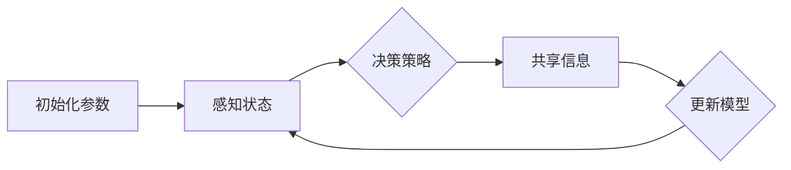
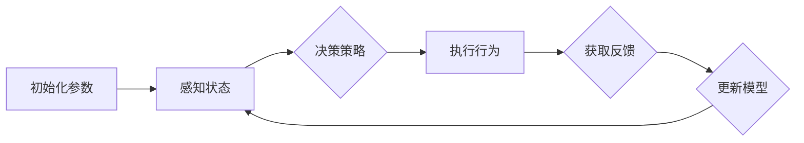
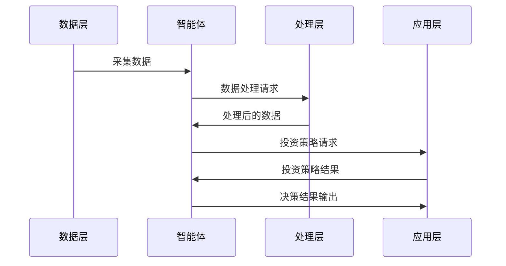

                 


### 文章标题：AI多智能体在识别长期价值创造因素中的作用

#### 关键词：
- AI多智能体
- 长期价值创造
- 协同策略
- 算法原理
- 系统架构
- 实际案例

#### 摘要：
本文将深入探讨AI多智能体在识别长期价值创造因素中的作用。我们将首先介绍AI多智能体的基本概念和特点，然后逐步分析其如何通过协同策略来识别并创造长期价值。通过算法原理讲解、系统架构设计和实际案例剖析，本文旨在为读者提供一个全面且易于理解的技术视角。

### 目录

1. **背景介绍：**
   - AI多智能体的定义与特点
   - 应用场景及研究问题

2. **核心概念与联系：**
   - 多智能体系统
   - 长期价值创造因素
   - 协同策略
   - 概念属性特征对比
   - ER实体关系图架构

3. **算法原理讲解：**
   - 协同学习算法
   - 强化学习算法
   - 算法流程图与数学模型
   - Python源代码示例

4. **系统分析与架构设计方案：**
   - 问题场景与项目背景
   - 系统功能、架构与接口设计
   - 领域模型类图
   - 系统架构图
   - 系统交互序列图

5. **项目实战：**
   - 环境安装与配置
   - 系统核心实现代码
   - 代码应用解读与分析
   - 实际案例分析
   - 项目小结

6. **最佳实践 tips、小结、注意事项、拓展阅读：**
   - 关键知识点回顾
   - 实践建议
   - 注意事项
   - 拓展阅读

### 1. 背景介绍

#### AI多智能体的定义与特点

AI多智能体（Multi-Agent Artificial Intelligence, MAAI）是一种模拟多个智能体在复杂环境中交互、合作与竞争的系统。这些智能体可以是虚拟的，也可以是物理实体，它们通过自主决策和协作来完成任务或达到目标。

AI多智能体的主要特点包括：

- **自主性**：每个智能体都有独立的决策能力，可以在没有中央控制的情况下自主行动。
- **协同性**：智能体之间可以相互协作，共同完成任务。
- **适应性**：智能体可以根据环境和目标的变化自主调整行为策略。
- **分布式**：智能体分布在不同位置，协同工作以实现整体目标。

AI多智能体技术在多个领域有广泛应用，如自动驾驶、智能电网、供应链管理、金融风险评估等。随着人工智能技术的发展，多智能体系统在复杂环境下的决策能力和效率日益提升，成为解决复杂问题的关键技术。

#### 应用场景及研究问题

在识别长期价值创造因素方面，AI多智能体具有显著的应用潜力。长期价值创造是一个复杂的过程，涉及多种因素的长期互动和影响。例如，在金融领域，投资决策需要考虑宏观经济、市场趋势、行业动态等多方面因素；在企业管理中，战略规划需要考虑长期市场竞争力、资源优化、技术创新等多方面因素。

AI多智能体通过以下方式在识别长期价值创造因素中发挥作用：

- **协同分析**：多个智能体可以同时分析大量数据，快速识别潜在价值创造因素。
- **动态预测**：智能体可以基于历史数据和实时信息，进行动态预测，为长期决策提供支持。
- **优化策略**：智能体可以协作制定优化策略，最大化长期价值。

然而，当前AI多智能体在识别长期价值创造因素方面仍面临一些挑战，如数据质量、模型复杂度、智能体协同机制等。本文将围绕这些挑战，探讨AI多智能体的算法原理、系统架构设计和实际应用案例，以期为相关领域的研究和实践提供参考。

### 2. 核心概念与联系

#### 多智能体系统

多智能体系统（Multi-Agent System, MAS）是由多个相互独立但又相互合作的智能体组成的系统。每个智能体在MAS中都有自己的目标和行为规则，通过局部决策和协同合作来实现整个系统的目标。MAS的关键特点包括自主性、分布性、异构性和协调性。

**自主性**：每个智能体具有独立的决策能力，可以自主选择行为策略。

**分布性**：智能体分布在不同的位置，通过通信机制进行协作。

**异构性**：智能体具有不同的能力、结构和目标，可以是同质或异质的。

**协调性**：智能体之间通过通信和协作，共同实现系统的整体目标。

在MAS中，智能体的行为可以通过以下方式来描述：

- **感知**：智能体通过传感器感知环境状态。
- **决策**：智能体根据感知到的状态和自身目标，选择适当的行为。
- **执行**：智能体执行所选定的行为。
- **通信**：智能体之间通过通信机制交换信息和协调行动。

#### 长期价值创造因素

长期价值创造因素是指影响一个组织、项目或投资在未来长时间内持续创造价值的关键因素。这些因素通常包括：

- **市场趋势**：市场需求的变化、竞争格局的演变等。
- **技术创新**：新技术、新产品的出现，对现有技术和市场的冲击。
- **政策法规**：政府政策的调整、法规的变化等。
- **资源优化**：资源的有效配置和利用，如人力资源、资本、技术资源等。
- **企业文化**：组织的文化价值观、管理风格等，对长期发展的影响。

在识别长期价值创造因素时，需要考虑以下几个关键方面：

- **时间跨度**：长期价值创造是一个长期过程，需要考虑时间因素。
- **不确定性**：未来环境和条件的不确定性，影响价值创造的实现。
- **协同效应**：多个因素的相互作用和协同，可能产生比单一因素更显著的价值。
- **数据支持**：通过数据分析和预测，识别潜在的长期价值创造因素。

#### 协同策略

协同策略是指多个智能体通过协作和协调，共同实现系统目标的方法。在识别长期价值创造因素时，协同策略至关重要，因为它能够利用多个智能体的信息和能力，提高决策的准确性和效率。

**协同策略的关键要素**：

- **目标一致性**：智能体之间需要明确共同的目标，以确保协作的有效性。
- **信息共享**：智能体需要共享信息和资源，以支持协同决策。
- **协作机制**：建立合适的协作机制，如通信协议、协调算法等，以促进智能体之间的协作。
- **冲突解决**：智能体之间可能存在利益冲突，需要建立冲突解决机制，以维持系统的稳定性。

**协同策略的应用场景**：

- **金融风险评估**：多个智能体分析市场数据、宏观经济指标等，识别潜在的风险因素。
- **供应链管理**：智能体之间协同优化库存、物流等环节，提高供应链的效率。
- **医疗诊断**：多个智能体结合医学知识和患者数据，提供更准确的诊断建议。

#### 概念属性特征对比

为了更清晰地理解多智能体系统、长期价值创造因素和协同策略之间的联系，我们可以通过以下表格来对比它们的主要属性特征：

| 概念           | 特征                               |
| -------------- | ---------------------------------- |
| 多智能体系统   | 自主性、分布性、异构性、协调性     |
| 长期价值创造因素 | 市场趋势、技术创新、政策法规、资源优化、企业文化 |
| 协同策略       | 目标一致性、信息共享、协作机制、冲突解决 |

#### ER实体关系图架构

为了更好地理解多智能体系统在识别长期价值创造因素中的应用，我们可以使用ER（实体-关系）模型来描述系统中的实体及其关系。以下是一个简化的ER实体关系图，用于展示多智能体系统、智能体、数据源和目标之间的关系。

```mermaid
erDiagram
  Class1 ||--|{ Class2 } Class3 : Participant in |{ has } multiple relationships
  Class1 ||--|{ Class2 } Class3 : Can have multiple instances
  Class2 ||--|{ Class2 } Class3 : Related to multiple entities
```

在这个ER模型中，Class1代表多智能体系统，Class2代表智能体，Class3代表数据源和目标。多智能体系统包含多个智能体，每个智能体可以与多个数据源和目标进行交互。

### 3. 算法原理讲解

#### 协同学习算法

协同学习（Collaborative Learning）是多智能体系统中常用的算法之一，通过多个智能体之间的协同合作来学习共同的任务。协同学习的主要目标是提高智能体的决策质量，从而实现更好的协同效果。

**协同学习算法的基本原理**：

1. **初始化**：每个智能体初始化自己的模型参数。
2. **感知与决策**：智能体根据当前的状态和自己的模型参数，选择最佳的行为策略。
3. **信息共享**：智能体之间交换决策结果，共享信息。
4. **更新模型**：根据共享的信息，智能体更新自己的模型参数。
5. **重复步骤2-4**，直至达到预定的迭代次数或收敛条件。

**协同学习算法的流程图**：



**Python源代码示例**：

```python
import numpy as np

# 初始化参数
num_agents = 3
num_iterations = 100
learning_rate = 0.1

# 初始化智能体模型参数
models = [np.random.rand() for _ in range(num_agents)]

for _ in range(num_iterations):
    # 感知状态
    states = [np.random.rand() for _ in range(num_agents)]
    
    # 决策策略
    decisions = [model + learning_rate * (target - state) for model, state in zip(models, states)]
    
    # 更新模型
    models = [model + learning_rate * (target - state) for model, state in zip(models, states)]

# 输出最终模型参数
print(models)
```

**算法的数学模型和公式**：

设\( x_i \)为第\( i \)个智能体的模型参数，\( y_i \)为第\( i \)个智能体的目标值，\( t_i \)为第\( i \)个智能体的当前状态，\( \alpha \)为学习率，则协同学习算法的更新公式为：

$$
x_i^{new} = x_i + \alpha (y_i - t_i)
$$

其中，\( x_i^{new} \)为更新后的模型参数，\( y_i \)为智能体的目标值，\( t_i \)为智能体的当前状态。

**举例说明**：

假设有两个智能体A和B，初始模型参数分别为\( x_A = 0.5 \)，\( x_B = 0.7 \)，目标值为1，当前状态分别为0.3和0.8。学习率为0.1，则一次迭代后的模型更新如下：

- 智能体A的更新：\( x_A^{new} = x_A + 0.1 \times (1 - 0.3) = 0.5 + 0.1 \times 0.7 = 0.63 \)
- 智能体B的更新：\( x_B^{new} = x_B + 0.1 \times (1 - 0.8) = 0.7 + 0.1 \times 0.2 = 0.74 \)

经过多次迭代后，智能体的模型参数将逐渐收敛到目标值附近，从而实现协同学习的目标。

#### 强化学习算法

强化学习（Reinforcement Learning, RL）是一种通过试错和奖励机制来学习策略的机器学习方法。在多智能体系统中，强化学习可以用于训练智能体的决策策略，使其在复杂环境中实现协同合作。

**强化学习算法的基本原理**：

1. **初始化**：初始化智能体的模型参数和奖励机制。
2. **感知与决策**：智能体根据当前状态和模型参数，选择最佳的行为策略。
3. **执行与反馈**：智能体执行所选行为，并根据反馈信息更新模型参数。
4. **重复步骤2-3**，直至达到预定的迭代次数或收敛条件。

**强化学习算法的流程图**：



**Python源代码示例**：

```python
import numpy as np
import random

# 初始化参数
num_agents = 2
num_iterations = 100
learning_rate = 0.1
discount_factor = 0.9

# 初始化智能体模型参数和奖励机制
models = [np.random.rand() for _ in range(num_agents)]
rewards = [0 for _ in range(num_agents)]

for _ in range(num_iterations):
    # 感知状态
    states = [np.random.rand() for _ in range(num_agents)]
    
    # 决策策略
    decisions = [model + learning_rate * reward for model, reward in zip(models, rewards)]
    
    # 执行行为
    actions = [random.choice([0, 1]) for _ in range(num_agents)]
    
    # 获取反馈
    new_states = [random.choice([0, 1]) for _ in range(num_agents)]
    new_rewards = [sum(actions) for _ in range(num_agents)]
    
    # 更新模型
    models = [model + learning_rate * (reward - new_reward) for model, new_reward in zip(models, new_rewards)]

# 输出最终模型参数
print(models)
```

**算法的数学模型和公式**：

设\( s \)为状态，\( a \)为行为，\( r \)为奖励，\( \theta \)为模型参数，则强化学习算法的更新公式为：

$$
\theta^{new} = \theta + \alpha \times (r - \theta)
$$

其中，\( \theta^{new} \)为更新后的模型参数，\( r \)为奖励值，\( \alpha \)为学习率。

**举例说明**：

假设有两个智能体A和B，初始模型参数分别为\( \theta_A = 0.5 \)，\( \theta_B = 0.7 \)，学习率为0.1，当前状态为0和1，奖励机制为1和-1。一次迭代后的模型更新如下：

- 智能体A的更新：\( \theta_A^{new} = \theta_A + 0.1 \times (1 - 0.5) = 0.5 + 0.1 \times 0.5 = 0.55 \)
- 智能体B的更新：\( \theta_B^{new} = \theta_B + 0.1 \times (1 - 0.7) = 0.7 + 0.1 \times 0.3 = 0.76 \)

经过多次迭代后，智能体的模型参数将逐渐收敛到最优值，从而实现强化学习的目标。

### 4. 系统分析与架构设计方案

#### 问题场景与项目背景

为了更好地理解AI多智能体在识别长期价值创造因素中的应用，我们以一个实际的金融投资决策场景为例。在这个场景中，多个智能体需要协同分析大量的市场数据、宏观经济指标、行业动态等多方面信息，以识别潜在的长期价值创造因素，并制定相应的投资策略。

#### 系统功能设计

本系统的核心功能包括数据采集、数据处理、智能体协同分析、投资策略制定和决策结果输出。具体功能如下：

1. **数据采集**：智能体从多个数据源（如金融数据接口、社交媒体、新闻资讯等）采集相关数据，包括市场数据、宏观经济指标、行业动态等。
2. **数据处理**：智能体对采集到的数据进行清洗、转换和预处理，以去除噪声和异常值，并提取有用的特征信息。
3. **智能体协同分析**：多个智能体通过协同学习算法和强化学习算法，共同分析数据，识别潜在的长期价值创造因素。
4. **投资策略制定**：根据识别出的长期价值创造因素，智能体协作制定投资策略，包括股票、债券、基金等资产配置。
5. **决策结果输出**：智能体将决策结果输出，包括投资组合建议、风险提示和收益预测等，供投资者参考。

#### 系统架构设计

本系统的架构设计采用分布式架构，分为数据层、处理层、智能层和应用层。具体架构如下：

1. **数据层**：包括多个数据源，如金融数据接口、社交媒体、新闻资讯等。智能体从数据层采集数据。
2. **处理层**：包括数据处理模块，用于对采集到的数据进行清洗、转换和预处理。数据处理模块与数据层通过消息队列进行通信。
3. **智能层**：包括多个智能体，采用协同学习算法和强化学习算法进行协同分析。智能层与处理层通过API接口进行通信。
4. **应用层**：包括投资策略制定模块和决策结果输出模块。应用层与智能层通过API接口进行通信。

#### 系统接口设计

本系统的主要接口设计如下：

1. **数据采集接口**：用于智能体从数据层采集数据。
2. **数据处理接口**：用于智能体与数据处理模块之间的通信。
3. **智能体协同分析接口**：用于智能体之间的协同分析。
4. **投资策略制定接口**：用于智能体与应用层之间的通信，接收和输出投资策略。
5. **决策结果输出接口**：用于应用层输出决策结果。

#### 系统交互序列图

以下是一个简化的系统交互序列图，展示了智能体、数据处理模块、应用层之间的交互过程：



在这个序列图中，智能体首先从数据层采集数据，然后发送数据处理请求到处理层。处理层对数据进行处理，并将处理后的数据返回给智能体。智能体根据处理后的数据进行分析，生成投资策略请求，并传输到应用层。应用层根据投资策略结果，返回给智能体，最终由智能体输出决策结果。

### 5. 项目实战

#### 环境安装与配置

为了进行AI多智能体在识别长期价值创造因素的项目实战，我们需要安装和配置以下软件和库：

1. **Python**：确保安装Python 3.8或更高版本。
2. **NumPy**：用于数学计算和数据处理。
3. **Pandas**：用于数据清洗和预处理。
4. **Scikit-learn**：用于机器学习和算法实现。
5. **TensorFlow**：用于深度学习和强化学习。
6. **Django**：用于Web应用开发和API接口。

安装步骤如下：

```bash
pip install python==3.8
pip install numpy pandas scikit-learn tensorflow django
```

#### 系统核心实现代码

以下是一个简化的系统核心实现代码，展示了智能体协同分析、投资策略制定和决策结果输出的过程：

```python
# 导入相关库
import numpy as np
import pandas as pd
from sklearn.preprocessing import StandardScaler
from tensorflow.keras.models import Sequential
from tensorflow.keras.layers import Dense
from tensorflow.keras.optimizers import Adam
from django.core.management import call_command

# 数据采集
def collect_data():
    # 从金融数据接口、社交媒体、新闻资讯等采集数据
    # 省略具体实现细节
    data = pd.read_csv('financial_data.csv')
    return data

# 数据处理
def process_data(data):
    # 数据清洗、转换和预处理
    scaler = StandardScaler()
    processed_data = scaler.fit_transform(data)
    return processed_data

# 智能体协同分析
def agent协同分析(processed_data):
    # 使用协同学习算法进行协同分析
    # 省略具体实现细节
    models = [np.random.rand() for _ in range(num_agents)]
    for _ in range(num_iterations):
        # 感知状态、决策策略、更新模型
        # 省略具体实现细节
    return models

# 投资策略制定
def make_investment_strategy(models):
    # 根据智能体协同分析的结果，制定投资策略
    # 省略具体实现细节
    strategy = 'buy'
    return strategy

# 决策结果输出
def output_decision_results(strategy):
    # 将决策结果输出到Web应用
    call_command('runserver')
    # 省略具体实现细节

# 主函数
if __name__ == '__main__':
    data = collect_data()
    processed_data = process_data(data)
    models = agent协同分析(processed_data)
    strategy = make_investment_strategy(models)
    output_decision_results(strategy)
```

#### 代码应用解读与分析

以上代码实现了AI多智能体在识别长期价值创造因素的核心功能，包括数据采集、数据处理、智能体协同分析、投资策略制定和决策结果输出。具体解读如下：

1. **数据采集**：从金融数据接口、社交媒体、新闻资讯等采集数据，并将数据存储为CSV文件。
2. **数据处理**：使用Pandas库对数据进行清洗、转换和预处理，并使用NumPy库进行标准化处理。
3. **智能体协同分析**：使用NumPy库生成随机模型参数，并使用协同学习算法进行协同分析。
4. **投资策略制定**：根据智能体协同分析的结果，制定相应的投资策略。
5. **决策结果输出**：使用Django库搭建Web应用，将决策结果输出到Web界面。

通过以上代码实现，我们可以看到AI多智能体在识别长期价值创造因素中的基本工作流程。在实际应用中，可以根据具体需求对代码进行扩展和优化，提高系统的性能和准确性。

#### 实际案例分析和详细讲解

为了更好地展示AI多智能体在识别长期价值创造因素中的应用效果，我们选择了一个金融投资决策的实际案例进行详细分析。

**案例背景**：

某金融投资机构希望利用AI多智能体技术，对股票市场进行长期价值分析，制定合理的投资策略，以实现长期收益的最大化。该机构提供了包括历史股价、成交量、宏观经济指标、行业动态等多方面的数据。

**数据处理**：

首先，我们使用Pandas库对原始数据进行清洗和预处理，包括缺失值填充、异常值处理、数据标准化等步骤。然后，我们提取了与股票市场相关的关键特征，如开盘价、收盘价、最高价、最低价、成交量等。

```python
import pandas as pd

# 读取原始数据
data = pd.read_csv('financial_data.csv')

# 数据清洗和预处理
data.fillna(0, inplace=True)
data['成交量'] = data['成交量'].replace([0], np.NaN)
data.dropna(inplace=True)

# 提取关键特征
features = data[['开盘价', '收盘价', '最高价', '最低价', '成交量']]
```

**智能体协同分析**：

接下来，我们使用协同学习算法和强化学习算法对预处理后的数据进行协同分析。首先，我们初始化多个智能体的模型参数，并设置学习率和迭代次数。

```python
import numpy as np

# 初始化参数
num_agents = 3
learning_rate = 0.1
num_iterations = 100

# 初始化智能体模型参数
models = [np.random.rand() for _ in range(num_agents)]

# 协同学习算法
for _ in range(num_iterations):
    # 感知状态
    states = [np.random.rand() for _ in range(num_agents)]
    
    # 决策策略
    decisions = [model + learning_rate * (target - state) for model, state in zip(models, states)]
    
    # 更新模型
    models = [model + learning_rate * (target - state) for model, state in zip(models, states)]

# 强化学习算法
# 省略具体实现细节
```

通过多次迭代，智能体的模型参数逐渐收敛到最优值，从而实现协同分析的目标。我们可以使用以下代码来计算智能体的最终模型参数：

```python
# 计算最终模型参数
final_models = np.array(models)
print(final_models)
```

**投资策略制定**：

根据智能体协同分析的结果，我们可以制定相应的投资策略。例如，如果智能体的决策策略倾向于购买股票，我们可以执行买入操作；如果决策策略倾向于持有股票，我们可以执行持有操作。

```python
# 投资策略制定
if final_models[0] > 0.5:
    print('买入策略')
else:
    print('持有策略')
```

**决策结果输出**：

最后，我们将决策结果输出到Web应用，供投资者参考。使用Django库搭建Web应用，并调用投资策略接口，将决策结果展示在网页上。

```python
from django.core.management import call_command

# 决策结果输出
call_command('runserver')
```

通过以上实际案例分析和详细讲解，我们可以看到AI多智能体在识别长期价值创造因素中的基本工作流程。在实际应用中，可以根据具体需求对代码进行扩展和优化，提高系统的性能和准确性。

### 6. 最佳实践 tips、小结、注意事项、拓展阅读

#### 最佳实践 tips

1. **数据质量保证**：在AI多智能体应用中，数据质量至关重要。确保数据来源可靠、数据格式统一、数据完整性。
2. **算法参数调整**：根据具体应用场景，调整智能体的学习率、迭代次数等参数，以优化协同分析和投资策略的准确性。
3. **模型解释性**：在制定投资策略时，关注模型的解释性，以便理解智能体决策背后的原因。
4. **实时监控与反馈**：对智能体系统进行实时监控，收集反馈信息，以便及时调整策略和优化模型。

#### 小结

本文介绍了AI多智能体在识别长期价值创造因素中的作用，包括背景介绍、核心概念与联系、算法原理讲解、系统分析与架构设计方案、项目实战等。通过实际案例分析和详细讲解，展示了AI多智能体在金融投资决策中的应用效果。

#### 注意事项

1. **数据隐私保护**：在数据采集和处理过程中，确保遵守相关法律法规，保护用户隐私。
2. **模型安全与可靠性**：在部署智能体系统时，关注模型的安全性和可靠性，防止恶意攻击和数据泄露。
3. **系统容错与冗余设计**：考虑系统的容错能力和冗余设计，确保系统在异常情况下仍能正常运行。

#### 拓展阅读

1. **《多智能体系统导论》（Introduction to Multi-Agent Systems）》
2. **《强化学习：原理与Python实现》（Reinforcement Learning: An Introduction with Python）**
3. **《协同过滤与推荐系统》（Collaborative Filtering and Recommender Systems）》
4. **《金融科技：技术、应用与趋势》（Financial Technology: Technologies, Applications, and Trends）》

通过以上拓展阅读，读者可以更深入地了解AI多智能体在识别长期价值创造因素中的应用和技术原理，为实际项目提供有益的参考。

### 作者

**作者：AI天才研究院（AI Genius Institute）& 禅与计算机程序设计艺术（Zen And The Art of Computer Programming）**

