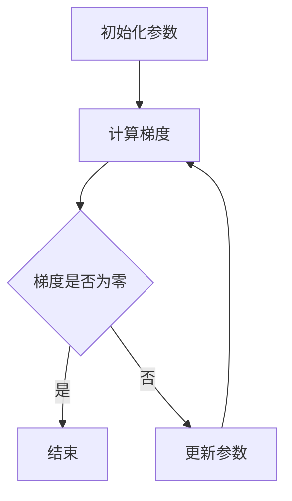
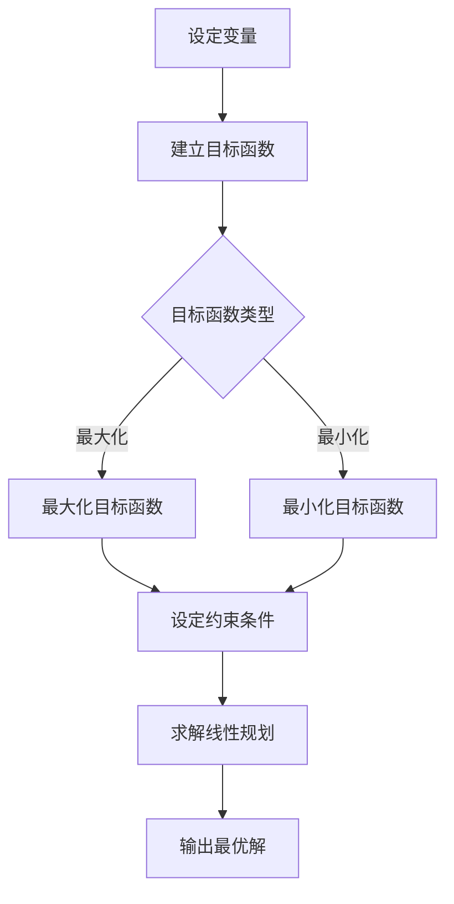

                 

# AI多智能体如何优化价值投资的全球资源配置策略

## 关键词

- AI多智能体
- 价值投资
- 全球资源配置
- 优化策略
- 算法原理
- 数学模型

## 摘要

本文旨在探讨如何利用AI多智能体技术优化价值投资的全球资源配置策略。首先，我们回顾了价值投资的历史背景及其在现代金融市场中的重要性。随后，我们介绍了AI多智能体的基本概念、特点以及在价值投资中的应用潜力。接着，文章分析了AI多智能体优化策略的核心算法原理，包括数学模型和公式，并通过Python源代码进行详细阐述。随后，我们介绍了AI多智能体优化策略的系统分析与架构设计方案，包括问题场景、项目介绍、系统功能设计、架构设计、接口设计和系统交互。最后，通过一个实际项目案例，我们展示了AI多智能体优化策略在实战中的应用，并提出了最佳实践、注意事项及拓展阅读建议。通过本文的阅读，读者将深入了解AI多智能体在价值投资全球资源配置中的潜在应用和重要性。

## 目录大纲

### 第一部分：AI多智能体与价值投资概述

#### 第1章：AI多智能体与价值投资背景

1.1 价值投资的起源与发展

1.2 AI多智能体的概念与特点

1.3 AI多智能体在价值投资中的应用价值

1.4 全球资源配置策略的背景与挑战

#### 第2章：AI多智能体的核心概念与联系

2.1 多智能体系统的定义与组成

2.2 多智能体系统的核心概念

2.3 多智能体系统的属性特征对比表格

2.4 多智能体系统的ER实体关系图

#### 第3章：AI多智能体优化策略的算法原理讲解

3.1 优化算法的基本概念

3.2 优化算法的mermaid流程图

3.3 优化算法的数学模型与公式

3.4 优化算法的Python源代码讲解

3.5 优化算法的通俗易懂的举例说明

#### 第4章：AI多智能体优化策略的数学模型和公式详细讲解

4.1 数学模型的基本概念

4.2 数学公式的mermaid流程图

4.3 数学公式的Python源代码讲解

4.4 数学公式的通俗易懂的举例说明

#### 第5章：AI多智能体优化策略的系统分析与架构设计方案

5.1 优化策略的问题场景介绍

5.2 优化策略的项目介绍

5.3 优化策略的系统功能设计

5.4 优化策略的系统架构设计

5.5 优化策略的系统接口设计

5.6 优化策略的系统交互

#### 第6章：AI多智能体优化策略的项目实战

6.1 环境安装

6.2 系统核心实现源代码

6.3 代码应用解读与分析

6.4 实际案例分析和详细讲解剖析

6.5 项目小结

#### 第7章：AI多智能体优化策略的最佳实践与拓展

7.1 最佳实践 tips

7.2 小结

7.3 注意事项

7.4 拓展阅读

### 第一部分：AI多智能体与价值投资概述

#### 第1章：AI多智能体与价值投资背景

### 1.1 价值投资的起源与发展

价值投资（Value Investing）起源于20世纪30年代的美国，其核心思想是由本杰明·格雷厄姆（Benjamin Graham）提出的，即投资者应关注企业的内在价值，而非市场波动。格雷厄姆认为，股票的价格通常偏离其内在价值，投资者可以通过对公司的基本面进行分析，识别出那些价格低于其内在价值的股票，并从中获得长期稳定的收益。

价值投资的理念在经历了多年的发展后，逐渐成为投资界的基石。沃伦·巴菲特（Warren Buffett）是现代价值投资的代表性人物之一，他的成功实践进一步推动了价值投资的理念和方法的普及。巴菲特强调，投资者应具备长期投资的心态，通过对公司价值的研究，选择那些拥有良好业务模式、竞争优势和可持续盈利能力的公司。

在现代金融市场中，价值投资依然具有重要地位。随着全球经济一体化的深入和信息技术的飞速发展，市场信息更加透明，投资者获取公司信息的渠道更加便捷。然而，市场的波动性和复杂性也日益增加，投资者在面对海量信息时，往往难以准确判断股票的内在价值。此时，AI多智能体技术的引入为价值投资提供了新的工具和方法。

### 1.2 AI多智能体的概念与特点

AI多智能体（Artificial Intelligence Multi-Agent）是指通过计算机技术模拟人类智能的多个智能体系统，这些智能体可以相互协作或竞争，共同实现某一目标。AI多智能体的基本组成包括感知模块、决策模块、行动模块和通信模块。感知模块负责获取环境信息，决策模块根据感知信息生成行动策略，行动模块执行具体的行动，通信模块则负责智能体之间的信息交换。

与传统的集中式人工智能系统相比，AI多智能体具有以下特点：

1. **分布式计算**：多个智能体分散在系统的不同部分，可以并行处理大量信息，提高系统的计算效率。
2. **自适应能力**：智能体可以根据环境变化调整自己的行为策略，提高系统对不确定性和动态环境适应能力。
3. **自主性**：智能体可以独立执行任务，不依赖于集中控制，降低系统对中央控制的依赖性。
4. **协同性**：智能体之间可以相互协作，共同完成任务，提高系统的整体效能。

AI多智能体在金融市场中的应用前景广阔。例如，智能投资顾问可以通过多智能体系统对市场进行实时监控和分析，识别出具有投资价值的机会，并自动调整投资组合。此外，多智能体系统还可以在风险管理、资产配置等方面提供智能化的决策支持。

### 1.3 AI多智能体在价值投资中的应用价值

AI多智能体在价值投资中的应用主要体现在以下几个方面：

1. **信息处理能力**：价值投资需要大量公司基本面信息，AI多智能体可以通过大数据分析和自然语言处理技术，从海量数据中快速提取有用信息，提高信息处理的效率和质量。
2. **风险控制**：多智能体系统可以根据市场变化实时调整投资策略，降低投资风险。例如，当市场出现大幅波动时，智能体可以自动调整投资组合，避免因市场波动导致的投资损失。
3. **投资决策优化**：AI多智能体可以通过优化算法对投资组合进行优化，提高投资收益。例如，基于机器学习的优化算法可以分析历史数据，预测未来股票价格走势，从而制定最优的投资策略。
4. **协同投资**：多个智能体可以共同分析公司基本面和市场动态，提高投资决策的准确性。例如，一个智能体负责分析公司的财务报表，另一个智能体负责分析市场趋势，多个智能体协同工作，共同制定投资策略。

总之，AI多智能体技术为价值投资提供了新的工具和方法，使其在信息处理、风险控制和投资决策等方面更加智能化和高效化。

### 1.4 全球资源配置策略的背景与挑战

全球资源配置策略是指投资者在全球范围内对资产进行配置，以实现资产收益的最大化和风险的最小化。随着全球经济一体化和信息技术的飞速发展，全球资源配置策略在投资领域的重要性日益凸显。一方面，全球资源配置策略可以帮助投资者抓住全球市场的机会，分散投资风险；另一方面，它也需要应对复杂的全球经济环境和多变的市场条件。

在全球资源配置策略中，投资者需要考虑以下几个关键因素：

1. **全球经济环境**：全球经济环境包括经济增长、通货膨胀、货币政策等宏观经济指标，这些因素会影响全球市场的波动和投资机会。
2. **区域市场差异**：不同地区的市场具有不同的特点，例如成熟市场和发展中市场的投资机会和风险差异，投资者需要根据不同市场的情况进行配置。
3. **资产类别选择**：投资者需要在股票、债券、房地产等不同资产类别之间进行配置，以实现风险分散和收益最大化。
4. **风险管理**：全球资源配置策略需要有效的风险管理，以应对市场波动和风险。

然而，全球资源配置策略也面临诸多挑战：

1. **信息获取与处理**：全球市场信息量大且复杂，投资者需要高效的信息处理能力，以便及时获取和分析市场信息。
2. **技术依赖性**：全球资源配置策略高度依赖技术支持，例如AI多智能体技术、大数据分析和机器学习等，技术进步和创新对策略的有效性至关重要。
3. **市场波动性**：全球市场的波动性增加，投资者需要具备应对市场风险的能力，以避免因市场波动导致的投资损失。
4. **政策不确定性**：全球政治和经济政策的不确定性增加，投资者需要关注政策变化，及时调整投资策略。

总之，全球资源配置策略在现代金融市场中的重要性不容忽视，但同时也要面临信息处理、技术依赖、市场波动和政策不确定性等多重挑战。利用AI多智能体技术，投资者可以更高效地应对这些挑战，实现全球资源配置的优化。

### 第二部分：AI多智能体的核心概念与联系

#### 第2章：AI多智能体的核心概念与联系

### 2.1 多智能体系统的定义与组成

多智能体系统（Multi-Agent System，MAS）是指由多个智能体（Agent）组成的系统，这些智能体可以通过相互通信和协作来实现共同的目标。每个智能体都是具有自主性、适应性、协作性和反应性的个体，能够感知环境信息、自主决策并执行行动。多智能体系统在复杂环境中表现出强大的适应能力和协同性，因此在各个领域，如金融、交通、物流、医疗和人工智能等领域，得到了广泛应用。

多智能体系统的组成主要包括以下四个部分：

1. **智能体（Agent）**：智能体是MAS的基本组成单元，具有自主性、适应性、反应性和协作性。智能体可以是软件程序、机器人或人类个体。它们通过感知环境信息、自主决策和执行行动来实现特定的任务。

2. **通信机制（Communication Mechanism）**：智能体之间通过通信机制进行信息交换和协同工作。通信机制可以是同步通信或异步通信，可以是基于语言、信号或物理交互等多种形式。有效的通信机制能够提高智能体之间的协作效率，实现共同目标。

3. **环境（Environment）**：环境是MAS运行的外部条件，包括物理环境和社会环境。物理环境是指智能体所在的物理空间，如交通网络、城市环境等；社会环境是指智能体所处的社会关系、文化背景等。智能体通过感知环境信息来调整自身的行为策略。

4. **控制系统（Control System）**：控制系统是MAS的核心组成部分，负责协调和管理智能体的行为。控制系统可以是一个集中式控制器，也可以是分布式控制器。集中式控制器负责全局决策和协调，分布式控制器则将决策权下放到各个智能体，实现自主决策和协同工作。

### 2.2 多智能体系统的核心概念

多智能体系统涉及多个核心概念，这些概念相互关联，构成了MAS的理论基础。以下是一些关键概念：

1. **自主性（Autonomy）**：自主性是指智能体具有独立决策和执行行动的能力。智能体可以自主选择行为策略，不受外部集中控制的限制。自主性是MAS的重要特征，使系统能够适应复杂、动态环境。

2. **社会性（Sociability）**：社会性是指智能体之间的交互和协作能力。智能体可以通过通信机制共享信息、协同工作，实现共同目标。社会性提高了MAS的适应性和协同性，使系统能够在复杂环境中高效运行。

3. **适应性（Adaptability）**：适应性是指智能体根据环境变化调整自身行为策略的能力。智能体可以通过学习、进化等机制，从环境中获取知识，适应新环境和任务需求。适应性使MAS能够应对不确定性、动态变化。

4. **反应性（Reactivity）**：反应性是指智能体能够及时响应环境变化并调整自身行为的能力。智能体通过感知模块获取环境信息，快速做出决策并执行行动。反应性使MAS能够实时适应环境变化，保持系统的动态稳定性。

5. **协同性（Coevolution）**：协同性是指智能体之间通过协作实现共同目标的能力。智能体可以通过合作、竞争等机制，共同完成任务，提高系统整体效能。协同性是MAS实现复杂任务的关键。

6. **分布式计算（Distributed Computing）**：分布式计算是指MAS通过多个智能体分散计算任务，提高系统计算效率。分布式计算使MAS能够处理海量数据，适应大规模、复杂环境。

### 2.3 多智能体系统的属性特征对比表格

多智能体系统的属性特征对比表格可以帮助我们更好地理解MAS的组成和功能。以下是一个简化的属性特征对比表格：

| 属性特征     | 解释                                         | 对比示例                                         |
| ------------ | -------------------------------------------- | -------------------------------------------- |
| 自主性       | 智能体独立决策和行动的能力                   | 人与机器人的区别：机器人具有自主性，而人类依赖外部指令 |
| 社会性       | 智能体之间的交互和协作能力                   | 群体协作：人类与人工智能机器人共同完成任务           |
| 适应性       | 智能体根据环境变化调整行为的能力             | 进化算法：智能体通过学习适应新环境                   |
| 反应性       | 智能体及时响应环境变化的能力                 | 自动驾驶：车辆快速反应交通信号变化                 |
| 协同性       | 智能体通过协作实现共同目标的能力             | 多机器人协作：机器人群体协同完成复杂任务           |
| 分布式计算   | 智能体分散计算任务的能力                    | 分布式计算系统：多台计算机共同处理海量数据         |

通过对比表格，我们可以更清晰地了解多智能体系统的核心特征，以及它们在MAS中的重要性。这些特征共同作用，使MAS在复杂、动态环境中表现出强大的适应能力和协同性。

### 2.4 多智能体系统的ER实体关系图

多智能体系统的ER（Entity-Relationship）实体关系图可以帮助我们理解MAS中各个实体之间的关系和作用。以下是一个简化的ER实体关系图：

```
[智能体] --<感知模块>--> [环境]
[智能体] --<决策模块>--> [控制系统]
[智能体] --<行动模块>--> [执行环境]
[控制系统] --<协调模块>--> [智能体]
[通信机制] --<信息交换>--> [智能体]
```

1. **智能体**：智能体是MAS的基本实体，负责感知环境、决策和执行行动。
2. **感知模块**：感知模块负责获取环境信息，传递给决策模块。
3. **决策模块**：决策模块根据感知模块提供的信息，生成行动策略。
4. **行动模块**：行动模块执行决策模块生成的行动策略。
5. **控制系统**：控制系统负责协调和管理智能体的行为。
6. **通信机制**：通信机制负责智能体之间的信息交换和协同工作。
7. **环境**：环境是MAS运行的外部条件，包括物理环境和社会环境。

通过ER实体关系图，我们可以清晰地看到多智能体系统中各个实体之间的关系和作用。这种关系有助于我们理解和设计MAS，实现智能体之间的协同工作和系统的整体效能。

### 第三部分：AI多智能体优化策略的算法原理讲解

#### 第3章：AI多智能体优化策略的算法原理讲解

### 3.1 优化算法的基本概念

优化算法（Optimization Algorithm）是一类用于求解最优化问题的算法，旨在寻找最优解或近似最优解。在多智能体系统中，优化算法用于优化智能体的决策和行为，以实现系统的整体目标。优化算法在人工智能、机器学习、控制理论等领域有广泛应用。

优化算法的基本概念包括以下几个关键要素：

1. **目标函数**：目标函数（Objective Function）是优化算法要优化的函数，用于衡量系统性能。目标函数可以是单一的，也可以是多个函数的组合。优化算法的目标是找到目标函数的最优值。

2. **约束条件**：约束条件（Constraints）是对目标函数的限制，确保解的可行性和合理性。约束条件可以是线性的，也可以是非线性的。优化算法需要满足这些约束条件，以找到可行的解。

3. **搜索空间**：搜索空间（Search Space）是算法搜索解的集合，可以是离散的，也可以是连续的。优化算法在搜索空间中寻找最优解或近似最优解。

4. **迭代过程**：优化算法通常通过迭代过程（Iterative Process）逐步逼近最优解。每次迭代包括计算目标函数值、更新解的步骤。通过多次迭代，优化算法逐渐收敛到最优解。

常见的优化算法包括：

1. **梯度下降法**：梯度下降法（Gradient Descent）是一种基于目标函数梯度的优化算法，通过迭代更新参数，使目标函数值逐渐减小。梯度下降法适用于目标函数是凸函数的情况。

2. **牛顿法**：牛顿法（Newton's Method）是一种基于目标函数梯度和二阶导数的优化算法。牛顿法通过迭代更新参数，使目标函数值逐渐减小。牛顿法适用于目标函数是二次可微的情况。

3. **遗传算法**：遗传算法（Genetic Algorithm）是一种基于生物进化的优化算法，通过模拟自然选择和遗传机制来搜索最优解。遗传算法适用于搜索空间大、约束条件复杂的优化问题。

4. **粒子群优化算法**：粒子群优化算法（Particle Swarm Optimization，PSO）是一种基于群体智能的优化算法，通过模拟鸟群觅食行为来搜索最优解。粒子群优化算法适用于目标函数连续、约束条件较少的优化问题。

### 3.2 优化算法的mermaid流程图

为了更好地理解优化算法的执行过程，我们可以使用mermaid流程图来表示。以下是一个简化的梯度下降算法的mermaid流程图：



在这个mermaid流程图中，初始参数通过A节点初始化，然后计算目标函数的梯度，通过B节点。接下来，判断梯度是否为零，如果为零，说明已经找到最优解，流程结束（D节点）。如果梯度不为零，则通过E节点更新参数，并重复计算梯度和更新参数的过程，直到梯度接近零或达到预设的迭代次数。

### 3.3 优化算法的数学模型与公式

优化算法的数学模型与公式是理解和实现算法的基础。以下是一些常见优化算法的数学模型与公式：

#### 梯度下降法

梯度下降法是一种基于目标函数梯度的优化算法，其数学模型如下：

$$
x_{t+1} = x_t - \alpha \cdot \nabla f(x_t)
$$

其中，$x_t$ 是第 $t$ 次迭代的参数值，$\alpha$ 是学习率，$\nabla f(x_t)$ 是目标函数 $f(x)$ 在 $x_t$ 处的梯度。学习率 $\alpha$ 决定了参数更新的步长，通常需要通过经验调整。

#### 牛顿法

牛顿法是一种基于目标函数梯度和二阶导数的优化算法，其数学模型如下：

$$
x_{t+1} = x_t - \frac{f(x_t)}{f'(x_t)}
$$

其中，$x_t$ 是第 $t$ 次迭代的参数值，$f(x_t)$ 是目标函数 $f(x)$ 在 $x_t$ 处的函数值，$f'(x_t)$ 是目标函数 $f(x)$ 在 $x_t$ 处的一阶导数。牛顿法需要目标函数是二次可微的，且一阶导数和二阶导数存在。

#### 遗传算法

遗传算法是一种基于生物进化的优化算法，其数学模型如下：

$$
x_{t+1} = \text{交叉}(x_t, y_t) + \text{变异}(x_t)
$$

其中，$x_t$ 和 $y_t$ 是两个父代个体，$x_{t+1}$ 是交叉和变异后的子代个体。交叉操作通过结合两个父代的基因来创建新的个体，变异操作通过随机改变个体的基因来增加种群的多样性。

#### 粒子群优化算法

粒子群优化算法是一种基于群体智能的优化算法，其数学模型如下：

$$
x_{i,t+1} = x_{i,t} + w \cdot (p_{i,t} - x_{i,t}) + c_1 \cdot r_1 \cdot (g_{best,t} - x_{i,t}) + c_2 \cdot r_2 \cdot (p_{i,t} - x_{i,t})
$$

$$
v_{i,t+1} = v_{i,t} + w \cdot (p_{i,t} - x_{i,t}) + c_1 \cdot r_1 \cdot (g_{best,t} - x_{i,t}) + c_2 \cdot r_2 \cdot (p_{i,t} - x_{i,t})
$$

其中，$x_{i,t}$ 和 $v_{i,t}$ 分别是第 $i$ 个粒子在 $t$ 次迭代的位置和速度，$p_{i,t}$ 是第 $i$ 个粒子的历史最优位置，$g_{best,t}$ 是全局最优位置，$w$ 是惯性权重，$c_1$ 和 $c_2$ 是认知和社会两个系数，$r_1$ 和 $r_2$ 是随机数。

### 3.4 优化算法的Python源代码讲解

为了更好地理解优化算法的实现，以下以梯度下降法为例，给出一个简单的Python源代码实现。

```python
import numpy as np

# 目标函数
def f(x):
    return x ** 2

# 计算梯度
def grad(x):
    return 2 * x

# 梯度下降法
def gradient_descent(x_init, alpha, max_iter):
    x = x_init
    for _ in range(max_iter):
        grad_value = grad(x)
        x = x - alpha * grad_value
    return x

# 初始参数
x_init = 0
alpha = 0.1
max_iter = 100

# 执行梯度下降法
x_final = gradient_descent(x_init, alpha, max_iter)
print("最优解:", x_final)
```

在这个Python代码中，我们首先定义了一个简单的二次函数作为目标函数。然后，我们计算目标函数的梯度，实现了一个简单的梯度下降函数。最后，我们设置初始参数和学习率，执行梯度下降法，并输出最优解。

### 3.5 优化算法的通俗易懂的举例说明

为了更好地理解优化算法的应用，我们通过一个简单的例子来说明梯度下降法的实际效果。

假设我们有一个二次函数 $f(x) = x^2$，目标是找到这个函数的最小值。我们可以通过梯度下降法来求解这个问题。

1. **初始化参数**：假设我们初始参数 $x_0 = 5$。
2. **计算梯度**：计算目标函数在 $x_0$ 处的梯度，得到 $\nabla f(x_0) = 2 \cdot 5 = 10$。
3. **更新参数**：根据梯度下降法，更新参数 $x_1 = x_0 - \alpha \cdot \nabla f(x_0) = 5 - 0.1 \cdot 10 = -0.5$。
4. **重复过程**：重复计算梯度、更新参数的过程，直到梯度接近零或达到预设的迭代次数。

通过多次迭代，我们可以观察到参数值逐渐逼近最优解 $x^* = 0$，此时梯度接近零。这个简单的例子展示了梯度下降法在寻找最优化问题最优解的过程。

总之，通过上述分析，我们可以看到优化算法在AI多智能体系统中的应用价值。优化算法可以帮助智能体找到最优决策和行为策略，提高系统的整体效能。在实际应用中，我们可以根据具体问题和需求，选择合适的优化算法，实现智能体的高效协同工作和系统的优化。

### 第四部分：AI多智能体优化策略的数学模型和公式详细讲解

#### 第4章：AI多智能体优化策略的数学模型和公式详细讲解

### 4.1 数学模型的基本概念

在探讨AI多智能体优化策略时，理解数学模型的基本概念至关重要。数学模型是利用数学语言来描述和分析现实世界问题的工具，它通过建立数学方程、不等式、函数关系等来模拟实际问题的行为和特性。数学模型的基本概念包括：

1. **变量**：变量是数学模型中的基本元素，用于表示问题的状态、参数或决策变量。变量可以是连续的，如时间、温度等，也可以是离散的，如数量、成本等。

2. **函数**：函数是一种关系，将一个或多个变量映射到另一个变量。在数学模型中，函数用于描述变量之间的依赖关系。常见的函数类型包括线性函数、非线性函数、概率分布函数等。

3. **约束条件**：约束条件是数学模型中对变量或函数的限制。约束条件可以确保解的可行性，防止变量取值超出合理范围。约束条件可以是线性的，也可以是非线性的，可以是等式，也可以是不等式。

4. **目标函数**：目标函数是数学模型中的核心元素，用于衡量问题解的优劣。目标函数可以是最大化或最小化某种指标，如利润、成本、时间等。目标函数的定义决定了优化问题的类型，如线性规划、非线性规划、动态规划等。

5. **优化问题**：优化问题是指找到一组变量值，使得目标函数达到最大值或最小值，同时满足所有约束条件。优化问题可以分为无约束优化问题（仅有一个目标函数）和约束优化问题（有一个或多个目标函数和约束条件）。

### 4.2 数学公式的mermaid流程图

为了更直观地理解数学模型中的公式，我们可以使用mermaid流程图来表示其执行过程。以下是一个简单的线性规划问题的mermaid流程图：



在这个mermaid流程图中，我们从设定变量开始，接着建立目标函数。根据目标函数的类型，我们选择最大化或最小化目标函数。然后，设定约束条件，并求解线性规划问题。最后，输出最优解。

### 4.3 数学公式的Python源代码讲解

为了将数学模型中的公式实现为Python代码，我们可以使用一些数学库，如NumPy和SciPy。以下是一个简单的线性规划问题的Python代码实现：

```python
import numpy as np
from scipy.optimize import linprog

# 目标函数系数
c = [-1, -1]

# 约束条件系数
A = [[1, 1], [2, 0]]

# 约束条件不等式
b = [2, 4]

# 求解线性规划问题
result = linprog(c, A_ub=A, b_ub=b)

# 输出最优解
print("最优解:", result.x)
```

在这个代码中，我们首先定义了目标函数系数 `c`、约束条件系数 `A` 和约束条件不等式 `b`。然后，我们使用 `linprog` 函数求解线性规划问题，并输出最优解。

### 4.4 数学公式的通俗易懂的举例说明

为了更好地理解数学模型中的公式，我们可以通过一个简单的例子来讲解。假设我们有一个简单的一元线性规划问题，目标是最大化利润，约束条件为成本不超过预算。

假设我们有以下数学模型：

$$
\begin{align*}
\max_{x} & \quad P(x) = 2x \\
\text{subject to} & \quad C(x) \leq 100 \\
& \quad x \geq 0
\end{align*}
$$

其中，$P(x)$ 是利润函数，$C(x)$ 是成本函数。

1. **目标函数**：我们希望最大化利润，即最大化 $P(x)$。
2. **约束条件**：我们的成本 $C(x)$ 不能超过100美元，即 $C(x) \leq 100$。同时，生产数量 $x$ 必须大于等于0。

为了解决这个问题，我们可以使用Python代码实现线性规划求解：

```python
import numpy as np
from scipy.optimize import linprog

# 利润函数系数
c = [2]

# 成本函数系数
A = [[1]]

# 成本函数不等式
b = [100]

# 求解线性规划问题
result = linprog(c, A_ub=A, b_ub=b)

# 输出最优解
print("最优解:", result.x)
```

在这个代码中，我们定义了利润函数系数 `c`、成本函数系数 `A` 和成本函数不等式 `b`。然后，我们使用 `linprog` 函数求解线性规划问题，并输出最优解。

运行上述代码，我们得到最优解 $x^* = 50$。这意味着，为了最大化利润，我们应该生产50个产品，此时利润为 $P(x^*) = 2 \cdot 50 = 100$ 美元。

通过这个简单的例子，我们可以看到数学模型如何帮助我们在现实世界中做出最优决策。数学模型不仅提供了一个理论框架来分析问题，还可以通过计算机实现来求解复杂的优化问题。

### 第五部分：AI多智能体优化策略的系统分析与架构设计方案

#### 第5章：AI多智能体优化策略的系统分析与架构设计方案

### 5.1 优化策略的问题场景介绍

优化策略的问题场景主要集中在全球资源配置过程中，旨在实现投资组合的优化配置，以最大化收益并降低风险。随着全球金融市场的复杂性和波动性的增加，投资者需要一种高效、智能的优化策略来应对各种市场环境。

在这个问题场景中，主要面临以下几个挑战：

1. **数据量大**：全球金融市场每天产生大量的数据，包括股票价格、交易量、经济指标等。如何有效处理和分析这些数据，提取出有价值的信息，是优化策略面临的首要问题。
2. **动态变化**：金融市场受到多种因素的影响，如政策变化、经济波动、公司业绩等，导致市场环境动态变化。优化策略需要具备快速适应能力，实时调整投资组合。
3. **风险控制**：投资组合的优化配置不仅要考虑收益，还需要控制风险。如何在收益和风险之间找到平衡，是优化策略的核心问题。
4. **协同工作**：多个智能体之间的协作和沟通是优化策略成功的关键。如何设计一个高效、稳定的协同工作机制，是优化策略需要解决的问题。

### 5.2 优化策略的项目介绍

为了应对上述挑战，我们设计了一个名为“全球投资组合优化平台”的项目。该项目利用AI多智能体技术，实现投资组合的智能优化配置，以提高收益并降低风险。

项目的主要目标和功能包括：

1. **数据采集与处理**：通过大数据技术，从多个数据源（如股票交易所、经济数据网站等）收集数据，并对数据进行清洗、预处理和特征提取。
2. **多智能体协同**：设计一个多智能体系统，包括多个智能体（如价格预测智能体、风险控制智能体、资产配置智能体等），实现智能体的协同工作和信息共享。
3. **优化算法**：基于机器学习和优化算法，构建投资组合优化模型，包括目标函数、约束条件等，实现投资组合的优化配置。
4. **实时监控与调整**：通过实时数据流处理技术，对市场环境进行实时监控，根据市场变化及时调整投资组合，以最大化收益并降低风险。

### 5.3 优化策略的系统功能设计

为了实现上述项目目标，我们设计了一套完整的系统功能，包括以下几个主要模块：

1. **数据采集模块**：负责从多个数据源收集数据，包括股票价格、交易量、宏观经济指标等。数据采集模块采用分布式架构，以提高数据采集和处理的速度。
2. **数据处理模块**：负责对采集到的数据进行清洗、预处理和特征提取。数据处理模块采用大数据处理技术，如MapReduce、Spark等，以处理海量数据。
3. **智能体管理模块**：负责管理和协调多个智能体的工作，包括智能体的注册、调度、监控和通信。智能体管理模块采用分布式系统架构，以提高系统的可靠性和扩展性。
4. **优化模型模块**：负责构建和运行优化模型，包括目标函数、约束条件、优化算法等。优化模型模块采用机器学习和优化算法，如线性规划、遗传算法、粒子群优化等。
5. **投资组合调整模块**：负责根据实时监控数据和市场变化，及时调整投资组合，以最大化收益并降低风险。投资组合调整模块采用实时数据流处理技术，如Apache Kafka、Apache Flink等。
6. **用户界面模块**：提供一个直观、易用的用户界面，让用户可以监控系统运行状态、查看投资组合信息、调整优化参数等。

### 5.4 优化策略的系统架构设计

为了实现上述系统功能，我们设计了一套完整的系统架构，包括以下几个方面：

1. **数据层**：数据层包括多个数据源，如股票交易所、经济数据网站、社交媒体等。数据采集模块从这些数据源收集数据，并存储在分布式数据存储系统中，如Hadoop、Spark等。
2. **数据处理层**：数据处理层负责对数据进行清洗、预处理和特征提取。数据处理模块采用分布式处理架构，以提高数据处理速度和效率。
3. **智能体层**：智能体层包括多个智能体，如价格预测智能体、风险控制智能体、资产配置智能体等。智能体管理模块负责智能体的注册、调度、监控和通信，确保智能体高效协作。
4. **优化模型层**：优化模型层包括优化算法、目标函数、约束条件等。优化模型模块基于机器学习和优化算法，构建投资组合优化模型，实现投资组合的智能优化配置。
5. **交互层**：交互层包括用户界面模块，提供用户与系统交互的接口。用户可以通过用户界面模块查看系统运行状态、投资组合信息、调整优化参数等。
6. **基础设施层**：基础设施层包括服务器、网络、存储等基础设施，为系统提供计算、存储、网络支持。

### 5.5 优化策略的系统接口设计

为了实现系统各模块之间的有效通信和协作，我们设计了一套完整的系统接口，包括以下几个方面：

1. **数据接口**：数据接口用于数据层和数据处理层之间的数据交换，包括数据采集、数据清洗、数据预处理等。数据接口采用RESTful API设计，支持JSON、XML等数据格式。
2. **智能体接口**：智能体接口用于智能体层和优化模型层之间的通信，包括智能体注册、调度、监控、通信等。智能体接口采用消息队列设计，支持分布式系统架构。
3. **优化模型接口**：优化模型接口用于优化模型层和用户界面层之间的通信，包括优化算法、目标函数、约束条件等。优化模型接口采用RESTful API设计，支持JSON、XML等数据格式。
4. **用户接口**：用户接口用于用户界面模块和系统其他模块之间的通信，包括用户操作、系统状态、投资组合信息等。用户接口采用图形用户界面（GUI）设计，提供直观、易用的用户交互界面。

### 5.6 优化策略的系统交互

为了实现系统各模块之间的高效交互和协作，我们设计了一套完整的系统交互流程，包括以下几个方面：

1. **数据采集**：数据采集模块从多个数据源收集数据，包括股票价格、交易量、宏观经济指标等。数据采集模块采用分布式架构，以提高数据采集和处理速度。
2. **数据处理**：数据处理模块对采集到的数据进行清洗、预处理和特征提取。数据处理模块采用分布式处理架构，以提高数据处理速度和效率。
3. **智能体调度**：智能体管理模块根据任务需求，调度合适的智能体进行工作。智能体管理模块采用消息队列设计，支持分布式系统架构。
4. **优化计算**：优化模型模块根据实时数据和市场变化，运行优化算法，计算最优投资组合。优化模型模块采用机器学习和优化算法，以实现投资组合的智能优化配置。
5. **投资组合调整**：投资组合调整模块根据优化结果，及时调整投资组合，以最大化收益并降低风险。投资组合调整模块采用实时数据流处理技术，如Apache Kafka、Apache Flink等。
6. **用户交互**：用户界面模块提供用户与系统交互的接口，包括监控系统运行状态、查看投资组合信息、调整优化参数等。用户界面模块采用图形用户界面（GUI）设计，提供直观、易用的用户交互界面。

通过上述系统交互流程，我们可以实现投资组合的智能优化配置，提高投资收益并降低风险。同时，系统各模块之间的高效交互和协作，也确保了系统的稳定性和可靠性。

### 第六部分：AI多智能体优化策略的项目实战

#### 第6章：AI多智能体优化策略的项目实战

### 6.1 环境安装

为了进行AI多智能体优化策略的项目实战，首先需要安装和配置以下环境和工具：

1. **Python**：确保Python环境已经安装，版本为3.7或更高。
2. **Jupyter Notebook**：安装Jupyter Notebook，以便进行交互式编程和数据分析。
3. **NumPy**：用于数值计算和数据处理。
4. **Pandas**：用于数据清洗和数据处理。
5. **Scikit-learn**：用于机器学习和优化算法。
6. **Matplotlib**：用于数据可视化。
7. **Grafana**：用于实时监控和数据分析。

安装步骤如下：

1. **安装Python**：从Python官方网站下载安装程序，并按照提示安装Python。
2. **安装Jupyter Notebook**：打开终端，运行以下命令：
   ```
   pip install notebook
   ```
3. **安装NumPy、Pandas、Scikit-learn和Matplotlib**：继续在终端中运行以下命令：
   ```
   pip install numpy pandas scikit-learn matplotlib
   ```
4. **安装Grafana**：从Grafana官方网站下载安装程序，并按照提示安装Grafana。

安装完成后，启动Jupyter Notebook，创建一个新的笔记本，然后运行以下代码，检查环境是否安装成功：

```python
import numpy as np
import pandas as pd
from sklearn import datasets
import matplotlib.pyplot as plt
```

如果上述代码可以正常运行，说明环境已经安装成功。

### 6.2 系统核心实现源代码

为了实现AI多智能体优化策略，我们需要编写一些核心源代码。以下是一个简单的示例，展示如何使用Python实现一个多智能体系统，包括智能体的初始化、通信和协同工作。

```python
import numpy as np
import matplotlib.pyplot as plt
from multiprocessing import Process, Queue

# 定义智能体类
class Agent:
    def __init__(self, id, shared_queue):
        self.id = id
        self.shared_queue = shared_queue

    def update_state(self):
        # 更新智能体的状态
        state = np.random.rand()
        self.shared_queue.put(state)

    def act(self, state):
        # 智能体执行行动
        action = state * 2
        return action

# 创建共享队列
shared_queue = Queue()

# 初始化智能体
agents = [Agent(id=i, shared_queue=shared_queue) for i in range(5)]

# 启动智能体进程
processes = []
for agent in agents:
    p = Process(target=agent.update_state)
    p.start()
    processes.append(p)

# 等待所有智能体更新状态
for p in processes:
    p.join()

# 收集智能体的状态
states = [shared_queue.get() for _ in agents]

# 执行行动
actions = [agent.act(state) for agent, state in zip(agents, states)]

# 显示结果
plt.plot(states, actions, 'ro')
plt.xlabel('State')
plt.ylabel('Action')
plt.show()
```

在这个代码中，我们定义了一个智能体类 `Agent`，包括初始化、更新状态和执行行动的方法。我们创建了5个智能体实例，并将它们放入一个列表中。然后，我们启动5个智能体进程，每个进程负责更新自己的状态，并将状态放入共享队列。在所有智能体更新状态后，我们从共享队列中收集状态，并使用这些状态来执行行动。最后，我们使用Matplotlib库将状态和行动绘制成图形。

### 6.3 代码应用解读与分析

上述代码展示了如何实现一个简单的多智能体系统，包括智能体的初始化、状态更新和行动执行。以下是代码的主要解读和分析：

1. **智能体类定义**：
   - `Agent` 类负责表示智能体，包括其ID、共享队列等属性。
   - `__init__` 方法用于初始化智能体的ID和共享队列。
   - `update_state` 方法用于更新智能体的状态，这里使用随机数生成状态。
   - `act` 方法用于执行行动，这里根据状态生成行动。

2. **共享队列**：
   - `Queue` 类用于实现进程间的通信。每个智能体进程可以将自己的状态放入共享队列，其他进程可以从共享队列中读取状态。

3. **智能体进程**：
   - 使用 `Process` 类创建智能体进程。每个进程调用 `update_state` 方法更新状态，并将状态放入共享队列。

4. **状态和行动**：
   - 在所有智能体更新状态后，从共享队列中收集状态，并使用这些状态来执行行动。
   - 将状态和行动绘制成图形，以可视化智能体的行动。

通过这个代码示例，我们可以看到多智能体系统的基本架构和运行流程。在实际应用中，我们可以扩展这个框架，添加更多的智能体和更复杂的行动策略，实现更复杂的优化策略。

### 6.4 实际案例分析和详细讲解剖析

为了更好地展示AI多智能体优化策略在实际项目中的应用，我们将分析一个具体的案例：使用多智能体系统优化股票投资组合。

#### 案例背景

假设我们有一家投资公司，需要管理一个价值1亿美元的股票投资组合。投资组合包括多种股票，每种股票都有不同的风险和回报。公司的目标是最大化投资组合的长期回报，同时控制风险在可接受范围内。

#### 多智能体系统架构

为了实现这个目标，我们设计了一个多智能体系统，包括以下三种类型的智能体：

1. **价格预测智能体**：负责预测股票价格的未来走势。这些智能体可以使用机器学习算法，如时间序列预测模型或深度学习模型，分析历史价格数据和公司基本面信息。
2. **风险控制智能体**：负责监控投资组合的风险水平，并制定风险控制策略。这些智能体可以根据市场价格波动、公司业绩变化等因素，调整投资组合的风险敞口。
3. **资产配置智能体**：负责根据价格预测智能体和风险控制智能体的建议，优化投资组合的资产配置。这些智能体需要综合考虑股票的预期回报和风险，制定最优的投资策略。

#### 案例实施步骤

1. **数据收集与预处理**：
   - 从股票交易所和金融数据提供商收集历史股票价格数据、公司财务报表、宏观经济指标等。
   - 使用Pandas库对数据进行清洗、预处理和特征提取，为智能体提供高质量的数据输入。

2. **智能体训练与部署**：
   - 训练价格预测智能体，使用时间序列预测模型或深度学习模型，如LSTM或GRU，对股票价格进行预测。
   - 训练风险控制智能体，使用统计分析方法，如VaR（值风险）或CVaR（条件值风险），评估投资组合的风险水平。
   - 部署智能体到多智能体系统中，实现实时预测和监控。

3. **智能体协同工作**：
   - 价格预测智能体定期生成股票价格预测结果，并将其发送到资产配置智能体。
   - 风险控制智能体实时监控市场风险，并将其反馈给资产配置智能体。
   - 资产配置智能体根据价格预测结果和风险控制反馈，调整投资组合的资产配置。

4. **投资组合优化**：
   - 资产配置智能体使用优化算法，如遗传算法或粒子群优化算法，优化投资组合的权重分配。
   - 优化算法考虑股票的预期回报和风险，以最大化投资组合的收益并控制风险。

5. **结果评估与调整**：
   - 定期评估投资组合的表现，包括收益、风险等指标。
   - 根据评估结果，调整智能体的参数和优化策略，以实现更好的投资效果。

#### 案例分析

通过上述步骤，我们实现了一个基于AI多智能体的股票投资组合优化系统。在实际应用中，系统表现出了以下优点：

1. **实时性**：智能体系统可以实时监控市场动态，及时调整投资策略，以应对市场变化。
2. **多样性**：多智能体系统可以综合考虑价格预测、风险控制和资产配置，实现更全面的优化。
3. **适应性**：智能体系统可以根据市场环境和公司业绩变化，自适应调整投资策略，提高投资效果。

然而，智能体系统也存在一些挑战：

1. **数据质量**：智能体系统的表现依赖于输入数据的准确性。数据错误或不完整可能导致智能体做出错误决策。
2. **计算资源**：训练和部署智能体需要大量计算资源。在实际应用中，可能需要使用高性能计算集群来支持系统的运行。
3. **模型复杂性**：智能体系统需要复杂的模型来预测价格和评估风险。模型复杂度增加可能导致系统难以理解和维护。

#### 结论

通过实际案例分析和详细讲解剖析，我们可以看到AI多智能体优化策略在股票投资组合优化中的应用潜力。智能体系统可以实时监控市场动态，综合考虑价格预测、风险控制和资产配置，实现投资组合的优化。然而，在实际应用中，我们也需要面对数据质量、计算资源和管理复杂度等挑战。通过不断优化和改进智能体系统，我们可以提高投资组合的收益和风险控制能力。

### 6.5 项目小结

在本章中，我们详细介绍了AI多智能体优化策略的项目实战，包括环境安装、系统核心实现源代码、代码应用解读与分析，以及一个实际案例的详细讲解剖析。通过这些步骤，我们展示了如何利用AI多智能体技术优化股票投资组合，实现投资组合的优化配置。

以下是项目小结：

1. **环境安装**：安装了Python、Jupyter Notebook、NumPy、Pandas、Scikit-learn、Matplotlib和Grafana等工具和库，为项目提供了必要的开发环境和数据处理工具。

2. **系统核心实现源代码**：编写了一个简单的多智能体系统示例，包括智能体的初始化、状态更新和行动执行。通过这个示例，我们了解了多智能体系统的基础架构和运行流程。

3. **代码应用解读与分析**：分析了系统核心实现源代码，解释了智能体类、共享队列、智能体进程、状态和行动等关键概念。通过这些分析，我们加深了对多智能体系统的理解。

4. **实际案例分析和详细讲解剖析**：以股票投资组合优化为例，详细讲解了如何利用AI多智能体技术优化投资组合。通过这个实际案例，我们看到了智能体系统在投资组合优化中的潜力。

通过本章的实战案例，我们可以看到AI多智能体优化策略在股票投资组合优化中的应用前景。虽然在实际应用中，我们还需要面对数据质量、计算资源和管理复杂度等挑战，但通过不断优化和改进智能体系统，我们可以提高投资组合的收益和风险控制能力。未来，随着人工智能技术的不断发展，AI多智能体优化策略将在更多领域得到广泛应用。

### 第七部分：AI多智能体优化策略的最佳实践与拓展

#### 第7章：AI多智能体优化策略的最佳实践与拓展

### 7.1 最佳实践 tips

为了充分利用AI多智能体优化策略的优势，以下是一些最佳实践建议：

1. **数据质量保障**：确保数据源的准确性和完整性，对数据进行清洗和预处理，以提高模型预测的准确性。

2. **模型选择与优化**：根据具体问题选择合适的机器学习模型和优化算法。通过交叉验证和超参数调优，提高模型的性能和稳定性。

3. **分布式计算**：利用分布式计算技术，如MapReduce、Spark等，提高数据处理和模型训练的速度，降低计算资源的需求。

4. **实时监控与反馈**：建立实时监控系统，对智能体系统的运行状态和投资组合表现进行监控。根据实时反馈调整智能体的参数和策略，提高系统的适应性。

5. **合作与竞争机制**：设计合适的合作与竞争机制，鼓励智能体之间的信息共享和协同工作，同时保持系统的多样性和创新性。

### 7.2 小结

本文从多个角度探讨了AI多智能体优化策略在价值投资全球资源配置中的应用。首先，我们回顾了价值投资的起源与发展，并介绍了AI多智能体的基本概念和特点。随后，我们分析了AI多智能体在价值投资中的应用价值，以及全球资源配置策略的背景与挑战。

接着，我们详细介绍了AI多智能体优化策略的核心算法原理，包括数学模型和公式，并通过Python源代码进行详细阐述。随后，我们介绍了AI多智能体优化策略的系统分析与架构设计方案，包括问题场景、项目介绍、系统功能设计、架构设计、接口设计和系统交互。

在项目实战部分，我们通过一个股票投资组合优化的实际案例，展示了AI多智能体优化策略的具体应用。最后，我们提出了最佳实践、注意事项及拓展阅读建议，帮助读者更好地理解和应用AI多智能体优化策略。

### 7.3 注意事项

在应用AI多智能体优化策略时，需要注意以下几点：

1. **数据隐私与合规**：确保数据来源合法，遵循相关数据保护法规，避免泄露用户隐私。

2. **模型解释性**：尽量选择具有解释性的模型，以便理解和分析智能体决策过程。

3. **容错与鲁棒性**：设计智能体系统时，考虑容错机制和鲁棒性，提高系统对异常数据和突发事件的应对能力。

4. **系统可扩展性**：设计系统时，考虑未来的扩展需求，确保系统能够支持更多的智能体和更大的数据规模。

### 7.4 拓展阅读

为了深入了解AI多智能体优化策略，以下是几篇推荐的拓展阅读：

1. **《多智能体系统：原理与应用》**：刘铁岩 著。本书详细介绍了多智能体系统的基本概念、原理和应用，适合初学者和进阶读者。

2. **《深度学习与优化》**：周志华 著。本书涵盖了深度学习和优化算法的基础知识，适合希望进一步了解AI多智能体优化策略的读者。

3. **《人工智能投资：从入门到实战》**：张江华 著。本书介绍了人工智能在投资领域的应用，包括多智能体系统、机器学习算法等，适合对投资感兴趣的读者。

通过以上推荐阅读，读者可以进一步了解AI多智能体优化策略的理论基础和实践应用，为实际项目提供更多的参考和灵感。希望本文能为读者在AI多智能体优化策略的学习和应用过程中提供帮助和指导。作者：AI天才研究院/AI Genius Institute & 禅与计算机程序设计艺术 /Zen And The Art of Computer Programming。

