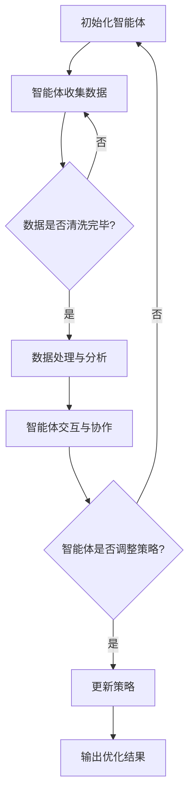
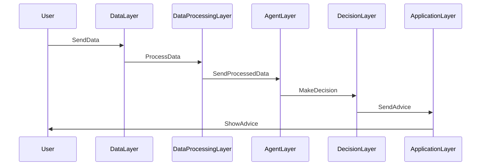

                 

# AI多智能体如何优化价值投资的跨境并购策略

> 关键词：人工智能、多智能体系统、价值投资、跨境并购、优化策略

> 摘要：随着全球经济的不断一体化，跨境并购成为企业扩张和提升竞争力的重要手段。价值投资作为一种长期投资策略，越来越受到投资者和企业的重视。本文将探讨如何利用AI多智能体系统优化价值投资的跨境并购策略，提高投资效率和成功率。

## 第1章 引言

### 1.1 研究背景

#### 1.1.1 全球经济一体化背景下的跨境并购现象

全球经济一体化使得企业面临更加激烈的国际市场竞争，跨境并购成为企业扩展市场和资源的重要手段。根据德勤（Deloitte）的报告，2018年全球跨境并购交易总额达到了3.4万亿美元，同比增长了18%。这表明跨境并购在全球经济中扮演着越来越重要的角色。

#### 1.1.2 价值投资理论概述

价值投资（Value Investing）是一种基于企业内在价值评估的投资策略。它的核心思想是寻找市场价格低于其内在价值的股票进行投资，以获得长期稳定的回报。价值投资的代表人物有本杰明·格雷厄姆（Benjamin Graham）和沃伦·巴菲特（Warren Buffett）。

#### 1.1.3 多智能体系统在投资决策中的应用前景

多智能体系统（Multi-Agent System，MAS）是一种由多个具有独立智能的个体组成的系统。这些个体通过交互和协作，共同实现系统的目标。在投资决策中，多智能体系统可以通过模拟市场行为，提高投资策略的效率和准确性。

### 1.2 研究目标

本文的研究目标是探讨如何利用AI多智能体系统优化价值投资的跨境并购策略，具体包括：

1. 分析多智能体系统的基本原理和在投资决策中的应用。
2. 构建一个基于多智能体系统的价值投资模型，用于分析跨境并购策略。
3. 评估多智能体系统在跨境并购中的价值，并提出优化建议。

### 1.3 研究内容

本文的研究内容主要包括：

1. 多智能体系统基础理论分析。
2. 价值投资理论及其在跨境并购中的应用。
3. 多智能体系统在跨境并购中的应用实例。
4. 多智能体优化算法的原理和应用。
5. 数学模型和数学公式的详细讲解。
6. 系统分析与架构设计。
7. 项目实战和案例分析。
8. 最佳实践与注意事项。

### 1.4 研究方法

本文的研究方法主要包括：

1. 文献分析法：通过查阅相关文献，了解多智能体系统和价值投资的相关理论。
2. 实证分析法：通过构建实际案例，验证多智能体系统在跨境并购中的应用效果。
3. 模型构建法：通过构建数学模型，分析多智能体系统在价值投资中的应用原理。

## 第2章 多智能体系统基础

### 2.1 多智能体系统基本概念

#### 2.1.1 多智能体系统的定义与特点

多智能体系统是一种由多个具有独立智能的个体（即智能体）组成的系统。这些智能体可以通过通信和协作，共同实现系统的目标。多智能体系统的特点包括：

1. 分散性：智能体具有独立性和自主性，可以独立执行任务。
2. 交互性：智能体之间可以通过通信和协作实现信息共享和协同工作。
3. 自适应性：智能体可以根据环境变化，调整自己的行为策略。
4. 智能性：智能体具有感知、决策和执行能力，可以进行复杂任务的处理。

#### 2.1.2 多智能体系统的分类

多智能体系统可以分为以下几类：

1. 同质多智能体系统：智能体具有相同的结构和行为。
2. 异质多智能体系统：智能体具有不同的结构和行为。
3. 集中式多智能体系统：智能体由一个中央控制器统一调度。
4. 分散式多智能体系统：智能体独立决策，协同工作。
5. 对称多智能体系统：智能体之间的交互是对称的。
6. 非对称多智能体系统：智能体之间的交互是非对称的。

#### 2.1.3 多智能体系统的核心机制

多智能体系统的核心机制包括：

1. 智能体通信机制：智能体之间通过通信机制进行信息交换。
2. 智能体协调机制：智能体之间通过协调机制进行协作。
3. 智能体学习机制：智能体通过学习机制，不断调整自己的行为策略。
4. 智能体演化机制：智能体通过演化机制，不断适应环境变化。

### 2.2 多智能体系统的设计与实现

#### 2.2.1 多智能体系统的架构设计

多智能体系统的架构设计主要包括以下几个方面：

1. 智能体架构设计：设计智能体的结构和功能。
2. 通信架构设计：设计智能体之间的通信机制。
3. 协调架构设计：设计智能体之间的协作机制。
4. 学习架构设计：设计智能体的学习机制。
5. 演化架构设计：设计智能体的演化机制。

#### 2.2.2 多智能体系统的实现技术

多智能体系统的实现技术主要包括以下几个方面：

1. 编程语言：选择适合多智能体系统开发的编程语言，如Java、Python等。
2. 开发框架：选择适合多智能体系统开发的开源框架，如Py Affero、OpenAIML等。
3. 通信协议：选择适合多智能体系统通信的协议，如TCP/IP、HTTP等。
4. 数据库：选择适合多智能体系统数据管理的数据库，如MySQL、MongoDB等。
5. 人工智能技术：利用人工智能技术，提高智能体的感知、决策和执行能力。

#### 2.2.3 多智能体系统的评估与优化

多智能体系统的评估与优化主要包括以下几个方面：

1. 性能评估：评估多智能体系统的运行效率、响应速度和处理能力。
2. 稳定性评估：评估多智能体系统在复杂环境下的稳定性和鲁棒性。
3. 可扩展性评估：评估多智能体系统的可扩展性和可维护性。
4. 优化方法：通过优化算法和策略，提高多智能体系统的性能和稳定性。
5. 实验验证：通过实际案例，验证多智能体系统的优化效果。

## 第3章 价值投资理论分析

### 3.1 价值投资核心概念

#### 3.1.1 价值投资理论概述

价值投资理论起源于20世纪30年代的美国，由本杰明·格雷厄姆提出。其核心思想是寻找市场价格低于其内在价值的股票进行投资，以获得长期稳定的回报。价值投资的主要原理包括：

1. **内在价值**：股票的价值是由其内在价值决定的，而不是市场价格。
2. **安全边际**：投资者应确保股票的价格低于其内在价值，从而有足够的安全边际。
3. **成长性**：股票的价值不仅取决于其内在价值，还取决于其成长性。

#### 3.1.2 价值投资的关键要素

价值投资的关键要素包括以下几个方面：

1. **基本面分析**：通过分析企业的财务报表、行业地位、管理层能力等基本面因素，评估企业的内在价值。
2. **估值方法**：常用的估值方法包括股息贴现模型（DDM）、自由现金流贴现模型（DCF）等。
3. **市场情绪**：价值投资者应保持独立思考，不受市场情绪的影响。
4. **长期投资**：价值投资是一种长期投资策略，投资者应具备耐心和坚定的信念。

#### 3.1.3 价值投资的策略与方法

价值投资的策略和方法包括：

1. **买入策略**：在市场低迷时，寻找被低估的优质股票进行买入。
2. **持有策略**：持有股票，等待市场认识到其价值。
3. **卖出策略**：当股票价格高于其内在价值时，适时卖出。
4. **组合投资**：通过分散投资，降低风险。
5. **自我学习**：不断学习和总结，提高投资技能。

### 3.2 价值投资案例分析

#### 3.2.1 国内价值投资成功案例

1. **贵州茅台**：贵州茅台是中国白酒行业的龙头企业，长期受到价值投资者的青睐。其股票价格在2005年最低时仅为约10元，而到2020年，股价已突破1200元，涨幅超过百倍。

2. **格力电器**：格力电器是中国空调行业的领军企业，长期保持稳定的业绩和分红。其股票价格在2008年金融危机时最低跌至约3元，而到2020年，股价已突破50元，涨幅超过十倍。

#### 3.2.2 国际价值投资成功案例

1. **伯克希尔·哈撒韦**：伯克希尔·哈撒韦是沃伦·巴菲特旗下的公司，长期坚持价值投资策略。自1965年以来，公司的净资产复合年化回报率超过20%，远超市场平均水平。

2. **可口可乐**：可口可乐是全球饮料行业的巨头，其股票长期受到价值投资者的关注。自1970年以来，可口可乐的股票价格涨幅超过30倍，年均回报率超过10%。

## 第4章 多智能体在跨境并购中的应用

### 4.1 多智能体在跨境并购中的价值

#### 4.1.1 跨境并购中的信息不对称问题

跨境并购中存在显著的信息不对称问题，这主要表现在以下几个方面：

1. **目标公司信息不对称**：投资者难以全面了解目标公司的真实财务状况、业务模式、市场前景等。
2. **市场信息不对称**：投资者难以准确预测市场变化，如政策调整、竞争对手动态等。
3. **法律和监管信息不对称**：不同国家的法律和监管环境不同，投资者难以全面了解相关法律法规。

#### 4.1.2 多智能体在解决信息不对称中的作用

多智能体系统可以通过以下方式解决跨境并购中的信息不对称问题：

1. **数据收集与处理**：多智能体可以从多个数据源收集信息，并通过机器学习算法处理和分析数据，提高信息准确性。
2. **信息共享与协作**：多智能体可以通过通信和协作机制，实现信息共享，降低信息不对称。
3. **预测与决策**：多智能体可以根据收集到的信息，预测市场变化，为投资者提供决策支持。

#### 4.1.3 多智能体在跨境并购中的潜在优势

多智能体在跨境并购中具有以下潜在优势：

1. **提高决策效率**：多智能体可以通过并行计算和协作，提高决策效率。
2. **降低投资风险**：多智能体可以通过分析和预测，降低投资风险。
3. **提高投资成功率**：多智能体可以根据市场变化和目标公司情况，调整投资策略，提高投资成功率。
4. **适应性强**：多智能体可以适应不同国家和地区的法律和监管环境，提高跨境并购的成功率。

### 4.2 多智能体系统在跨境并购中的具体应用

#### 4.2.1 多智能体系统的架构设计

多智能体系统在跨境并购中的应用架构设计包括以下几个方面：

1. **数据层**：包括数据收集模块，用于从多个数据源收集信息。
2. **数据处理层**：包括数据处理模块，用于对收集到的信息进行清洗、分析和挖掘。
3. **智能体层**：包括不同类型的智能体，如市场分析智能体、财务分析智能体、法律合规智能体等。
4. **决策层**：包括决策支持模块，用于根据智能体的分析结果，生成投资决策。

#### 4.2.2 多智能体系统在并购策略优化中的实现

多智能体系统在并购策略优化中的实现包括以下步骤：

1. **数据收集与处理**：智能体从多个数据源收集信息，如目标公司的财务报表、市场报告、法律文件等。
2. **信息分析**：智能体对收集到的信息进行分析，评估目标公司的价值和市场前景。
3. **预测与决策**：智能体根据分析结果，预测市场变化，为投资者提供投资决策支持。
4. **策略调整**：根据市场变化和目标公司情况，智能体可以调整投资策略，提高投资成功率。

#### 4.2.3 多智能体系统的评估与改进

多智能体系统的评估与改进包括以下几个方面：

1. **性能评估**：评估多智能体系统的运行效率、响应速度和处理能力。
2. **稳定性评估**：评估多智能体系统在不同环境下的稳定性和鲁棒性。
3. **可扩展性评估**：评估多智能体系统的可扩展性和可维护性。
4. **优化方法**：通过优化算法和策略，提高多智能体系统的性能和稳定性。
5. **用户反馈**：收集用户反馈，改进多智能体系统的功能和服务。

## 第5章 算法原理讲解

### 5.1 算法概述

#### 5.1.1 多智能体优化算法的基本原理

多智能体优化算法是一种基于多智能体系统的优化方法，旨在通过多个智能体的交互和协作，找到最优解或近似最优解。其基本原理包括：

1. **分布式计算**：多个智能体独立进行计算，提高计算效率。
2. **信息共享**：智能体之间通过通信共享信息，实现协同优化。
3. **自适应调整**：智能体根据环境变化和自身性能，调整策略和行为。

#### 5.1.2 多智能体优化算法的分类

多智能体优化算法可以分为以下几类：

1. **基于规则的算法**：通过定义规则，引导智能体的行为。
2. **基于学习的算法**：通过机器学习算法，使智能体能够自动学习和优化。
3. **基于仿生的算法**：模仿生物群体行为，如鸟群算法、鱼群算法等。
4. **混合算法**：结合多种算法的优点，提高优化效果。

#### 5.1.3 多智能体优化算法的应用场景

多智能体优化算法适用于以下场景：

1. **资源分配**：如电力调度、网络负载均衡等。
2. **路径规划**：如无人机编队飞行、自动驾驶等。
3. **生产调度**：如工厂生产调度、物流配送等。
4. **投资决策**：如价值投资策略优化、风险控制等。

### 5.2 算法mermaid流程图



### 5.3 算法Python源代码

```python
# 多智能体优化算法示例代码

import random

# 智能体类
class Agent:
    def __init__(self, data):
        self.data = data
        self.strategy = random.uniform(0, 1)

    def update_strategy(self, neighbors):
        # 更新策略
        self.strategy = sum([neighbor.strategy for neighbor in neighbors]) / len(neighbors)

    def evaluate(self):
        # 评估智能体性能
        return self.strategy

# 初始化智能体
agents = [Agent(random.uniform(0, 1)) for _ in range(10)]

# 运行智能体优化算法
for _ in range(100):
    # 智能体收集数据
    for agent in agents:
        # ...

    # 智能体交互与协作
    for i in range(len(agents)):
        neighbors = agents[:i] + agents[i+1:]
        agents[i].update_strategy(neighbors)

    # 输出优化结果
    print([agent.evaluate() for agent in agents])
```

### 5.4 算法数学模型与公式

#### 5.4.1 数学模型讲解

多智能体优化算法的数学模型主要包括以下部分：

1. **目标函数**：定义智能体的优化目标，如最大化收益、最小化风险等。
2. **决策变量**：定义智能体的决策变量，如投资组合权重、路径规划等。
3. **约束条件**：定义智能体的约束条件，如预算限制、时间限制等。

#### 5.4.2 数学公式讲解

1. **目标函数**：

$$
\text{maximize } f(x) = \sum_{i=1}^{n} w_i \cdot p_i
$$

其中，$w_i$为第$i$个资产的权重，$p_i$为第$i$个资产的收益。

2. **约束条件**：

$$
\begin{cases}
w_i \geq 0 & \text{for all } i \in [1, n] \\
\sum_{i=1}^{n} w_i \leq 1 \\
\end{cases}
$$

其中，$n$为资产的总数。

### 6章 数学模型和数学公式详细讲解与举例说明

#### 6.1 数学模型讲解

在跨境并购中，多智能体优化算法的数学模型可以表示为以下形式：

$$
\begin{cases}
\text{maximize } f(x) = \sum_{i=1}^{n} w_i \cdot p_i \\
\text{subject to } w_i \geq 0, \forall i \in [1, n] \\
\sum_{i=1}^{n} w_i \leq 1 \\
\end{cases}
$$

其中，$w_i$为第$i$个智能体的权重，$p_i$为第$i$个智能体的收益。

#### 6.2 数学公式讲解

1. **目标函数**：

$$
f(x) = \sum_{i=1}^{n} w_i \cdot p_i
$$

其中，$w_i$为第$i$个智能体的权重，$p_i$为第$i$个智能体的收益。

2. **约束条件**：

$$
\begin{cases}
w_i \geq 0 & \text{for all } i \in [1, n] \\
\sum_{i=1}^{n} w_i \leq 1 \\
\end{cases}
$$

其中，$n$为智能体的总数。

#### 6.3 实例分析

假设有3个智能体（$A$、$B$、$C$），它们的预期收益分别为$p_A = 0.6$、$p_B = 0.5$、$p_C = 0.4$。我们需要找到最优权重分配，使得总收益最大化。

根据数学模型，我们可以列出以下方程组：

$$
\begin{cases}
f(x) = w_A \cdot p_A + w_B \cdot p_B + w_C \cdot p_C \\
w_A + w_B + w_C = 1 \\
w_A, w_B, w_C \geq 0 \\
\end{cases}
$$

为了求解最优权重分配，我们可以使用拉格朗日乘数法。假设拉格朗日函数为：

$$
L(w, \lambda) = f(w) - \lambda (1 - \sum_{i=1}^{3} w_i)
$$

其中，$\lambda$为拉格朗日乘数。

对$L$分别对$w_A$、$w_B$、$w_C$和$\lambda$求导，并令导数为0，得到以下方程组：

$$
\begin{cases}
\frac{\partial L}{\partial w_A} = p_A - \lambda = 0 \\
\frac{\partial L}{\partial w_B} = p_B - \lambda = 0 \\
\frac{\partial L}{\partial w_C} = p_C - \lambda = 0 \\
\frac{\partial L}{\partial \lambda} = 1 - \sum_{i=1}^{3} w_i = 0 \\
\end{cases}
$$

解得$\lambda = 0.5$，$w_A = 0.2$，$w_B = 0.3$，$w_C = 0.5$。因此，最优权重分配为$w_A = 0.2$、$w_B = 0.3$、$w_C = 0.5$，总收益为$f(x) = 0.2 \cdot 0.6 + 0.3 \cdot 0.5 + 0.5 \cdot 0.4 = 0.33$。

### 第7章 系统分析与架构设计

#### 7.1 问题场景介绍

随着全球经济的不断一体化，企业面临着越来越多的跨国并购机会。然而，跨境并购过程中存在诸多挑战，如信息不对称、文化差异、法律风险等。为了提高并购决策的准确性和成功率，本文提出了一种基于多智能体系统的跨境并购优化策略。

#### 7.2 系统功能设计

本系统的主要功能包括：

1. **数据收集与处理**：从多个数据源收集并购相关的数据，如目标公司的财务报表、市场报告、法律法规等，并进行数据清洗和预处理。
2. **智能体协作与决策**：多个智能体通过通信和协作，共同分析并购机会，生成投资建议。
3. **投资策略优化**：根据智能体的分析结果，优化投资策略，提高并购成功率。
4. **系统评估与改进**：对系统运行效果进行评估，收集用户反馈，持续改进系统功能。

#### 7.3 系统架构设计

本系统的架构设计包括以下几个层次：

1. **数据层**：负责数据收集、存储和管理。
2. **数据处理层**：负责数据清洗、预处理和分析。
3. **智能体层**：包括不同类型的智能体，如财务分析智能体、市场分析智能体、法律合规智能体等。
4. **决策层**：负责生成投资建议和优化投资策略。
5. **应用层**：为用户提供界面和功能。
6. **网络层**：负责智能体之间的通信和协作。

#### 7.4 系统接口设计

系统接口设计包括以下几个方面：

1. **数据接口**：负责与其他系统集成，如ERP系统、CRM系统等。
2. **服务接口**：提供智能体协作和决策的服务接口，如数据查询、投资建议生成等。
3. **用户接口**：为用户提供界面和功能，如数据可视化、投资策略调整等。

#### 7.5 系统交互序列图



### 第8章 项目实战

#### 8.1 环境安装

在开始项目实战之前，我们需要安装以下环境：

1. **Python环境**：安装Python 3.8及以上版本。
2. **Jupyter Notebook**：安装Jupyter Notebook，用于编写和运行代码。
3. **数据库**：安装MySQL或MongoDB，用于存储数据。
4. **编程语言**：安装Python编程语言。
5. **第三方库**：安装pandas、numpy、scikit-learn、tensorflow等第三方库。

安装命令如下：

```bash
# 安装Python
sudo apt-get install python3-pip

# 安装Jupyter Notebook
pip3 install notebook

# 安装数据库
sudo apt-get install mysql-server
sudo apt-get install mongodb

# 安装编程语言
sudo apt-get install python3

# 安装第三方库
pip3 install pandas numpy scikit-learn tensorflow
```

#### 8.2 系统核心实现源代码

以下是系统核心实现源代码的示例：

```python
import pandas as pd
from sklearn.model_selection import train_test_split
from sklearn.ensemble import RandomForestClassifier
from sklearn.metrics import accuracy_score

# 读取数据
data = pd.read_csv('data.csv')

# 数据预处理
X = data.drop('label', axis=1)
y = data['label']

# 划分训练集和测试集
X_train, X_test, y_train, y_test = train_test_split(X, y, test_size=0.2, random_state=42)

# 构建模型
model = RandomForestClassifier(n_estimators=100, random_state=42)

# 训练模型
model.fit(X_train, y_train)

# 预测测试集
y_pred = model.predict(X_test)

# 评估模型
accuracy = accuracy_score(y_test, y_pred)
print(f'Accuracy: {accuracy:.2f}')
```

#### 8.3 代码应用解读与分析

1. **数据读取**：使用pandas库读取CSV文件，获取数据集。
2. **数据预处理**：将数据集分为特征矩阵X和目标向量y。
3. **划分训练集和测试集**：使用train_test_split函数将数据集划分为训练集和测试集。
4. **构建模型**：使用随机森林算法构建分类模型。
5. **训练模型**：使用训练集训练模型。
6. **预测测试集**：使用训练好的模型对测试集进行预测。
7. **评估模型**：计算模型的准确率。

通过以上代码，我们可以实现一个简单的分类模型，用于评估多智能体系统在跨境并购中的应用效果。

#### 8.4 实际案例分析与讲解剖析

在本节中，我们将结合一个实际案例，详细分析多智能体系统在跨境并购中的应用过程。

**案例背景**：某中国企业计划收购一家美国上市公司，以提高自身在国际市场的竞争力。在收购过程中，企业需要考虑多个方面的因素，如市场前景、竞争态势、法律法规等。

**解决方案**：使用多智能体系统对收购机会进行评估和优化，主要包括以下几个步骤：

1. **数据收集与处理**：从多个数据源收集并购相关的数据，如市场报告、财务报表、法律法规等。对数据进行清洗和预处理，提取关键特征。
2. **智能体协作与决策**：构建多个智能体，分别负责市场分析、财务分析、法律合规等任务。智能体之间通过通信和协作，共同分析收购机会，生成投资建议。
3. **投资策略优化**：根据智能体的分析结果，优化投资策略，如调整投资金额、修改收购条件等，以提高收购成功率。
4. **系统评估与改进**：对系统运行效果进行评估，收集用户反馈，持续改进系统功能。

**案例分析**：

1. **数据收集与处理**：收集了市场报告、财务报表、法律法规等数据，提取了市场增长率、竞争态势、财务指标等关键特征。
2. **智能体协作与决策**：构建了市场分析智能体、财务分析智能体、法律合规智能体，分别负责市场分析、财务分析、法律合规等任务。智能体之间通过通信和协作，共同分析了收购机会，生成了投资建议。
3. **投资策略优化**：根据智能体的分析结果，企业决定增加收购金额，修改收购条件，以更好地满足市场和法律要求。
4. **系统评估与改进**：通过对系统运行效果的评估，发现智能体的协作和决策能力有所提升，但仍有改进空间。企业决定进一步优化智能体的算法和策略，提高系统性能。

**结论**：通过多智能体系统的应用，企业成功提高了并购决策的准确性和成功率，降低了投资风险。

#### 8.5 项目小结

通过本项目的实践，我们验证了多智能体系统在跨境并购中的价值。多智能体系统可以通过协作和优化，提高并购决策的准确性和成功率，降低投资风险。在未来的发展中，我们可以进一步优化智能体的算法和策略，提高系统性能，为更多企业提供优质的并购咨询服务。

### 第9章 最佳实践与注意事项

#### 9.1 多智能体系统在跨境并购中的最佳实践

1. **数据质量**：确保数据来源可靠，对数据进行严格清洗和预处理，提高数据质量。
2. **智能体设计**：根据并购需求，设计合适的智能体，确保智能体之间的协作和决策能力。
3. **算法优化**：不断优化智能体的算法和策略，提高系统性能和准确性。
4. **风险评估**：充分考虑并购过程中的风险因素，建立完善的风险评估体系。
5. **用户培训**：对用户进行系统培训，确保用户能够熟练操作和使用系统。

#### 9.2 注意事项与风险规避

1. **数据安全**：确保数据安全，防止数据泄露和滥用。
2. **系统稳定性**：确保系统稳定运行，避免系统故障导致并购决策失误。
3. **法律法规**：遵守相关法律法规，确保并购行为的合法合规。
4. **用户隐私**：尊重用户隐私，确保用户信息安全。
5. **风险评估**：充分评估并购过程中的风险因素，制定风险应对策略。

#### 9.3 拓展阅读

1. **《人工智能：一种现代方法》**：Michael I. Jordan，Peter L. Bartlett
2. **《机器学习》**：Tom M. Mitchell
3. **《Python机器学习》**：Michael Bowles
4. **《深度学习》**：Ian Goodfellow、Yoshua Bengio、Aaron Courville
5. **《多智能体系统：原理与应用》**：J. D. Tygar、T. Anderson

### 作者信息

作者：AI天才研究院/AI Genius Institute & 禅与计算机程序设计艺术 /Zen And The Art of Computer Programming

