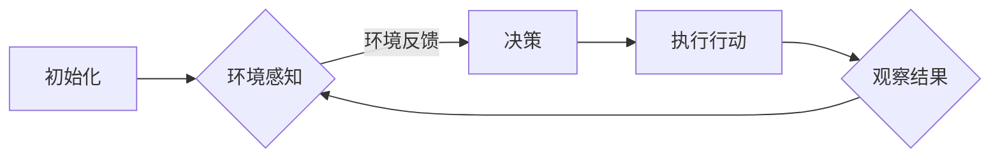
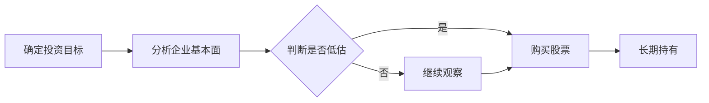
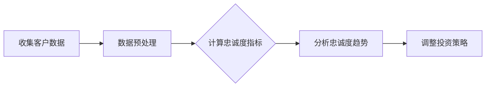
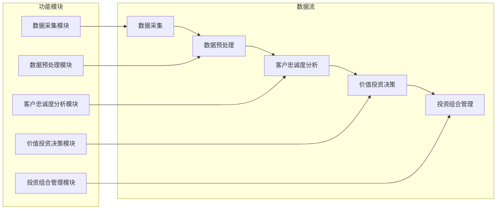
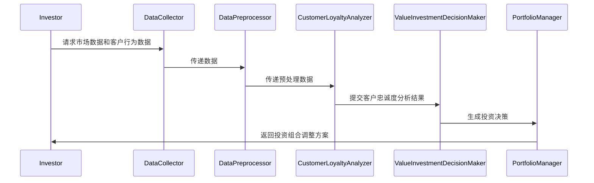

                 

# AI多智能体系统在价值投资中的客户忠诚度分析

关键词：人工智能，价值投资，客户忠诚度，多智能体系统，算法原理

摘要：本文探讨了如何利用AI多智能体系统来分析价值投资中的客户忠诚度。首先介绍了AI多智能体系统的基础知识、价值投资的原理以及客户忠诚度的概念。然后，通过对比分析，阐述了AI多智能体系统与客户忠诚度分析之间的联系。接着，详细讲解了AI多智能体系统的算法原理、价值投资和客户忠诚度分析的数学模型和公式。最后，本文通过一个实际案例，展示了AI多智能体系统在价值投资中客户忠诚度分析的应用，并对项目实施效果进行了总结。

### 目录大纲

## 第一部分：背景介绍

### 1. 问题背景

#### 问题描述
在价值投资中，如何通过客户忠诚度分析提升投资效果？

#### 问题解决
运用AI多智能体系统来分析客户忠诚度。

#### 边界与外延
探讨AI多智能体系统在客户忠诚度分析中的应用及其范围。

### 2. 核心概念与联系

#### 2.1 AI多智能体系统的定义与特点

##### 2.1.1 AI多智能体系统的定义
AI多智能体系统是由多个智能体组成的系统，这些智能体能够通过自主学习和协作来实现目标。

##### 2.1.2 AI多智能体系统的核心特点
1. 自主性：智能体能够独立地做出决策。
2. 协作性：智能体之间可以相互协作，共同完成任务。
3. 学习能力：智能体能够从环境中获取信息，并通过学习不断优化自身行为。

##### 2.1.3 AI多智能体系统与传统AI系统的区别
传统AI系统通常是一种单智能体系统，其决策依赖于输入数据和预设的规则。而AI多智能体系统则强调多个智能体之间的协同工作和自主学习。

#### 2.2 价值投资的定义与原则

##### 2.2.1 价值投资的定义
价值投资是指投资者通过深入分析企业的基本面，寻找被市场低估的投资机会，并长期持有这些股票，以获得长期稳定的回报。

##### 2.2.2 价值投资的核心原则
1. 买入低估的股票：投资者需要通过详细分析，找到那些被市场低估的股票。
2. 长期持有：投资者应该长期持有这些股票，以等待市场认识到股票的真实价值。

##### 2.2.3 价值投资与客户忠诚度的联系
价值投资强调长期持有股票，这意味着投资者需要与公司建立长期的关系。而客户忠诚度则是投资者对公司的信任和依赖的体现，这有助于投资者在价值投资过程中保持稳定的心态和决策。

#### 2.3 客户忠诚度的概念与测量

##### 2.3.1 客户忠诚度的概念
客户忠诚度是指客户对某一品牌或产品的长期信任和依赖程度。

##### 2.3.2 客户忠诚度的测量方法
1. 客户重复购买率：通过统计客户在一定时间内的重复购买次数来衡量。
2. 客户满意度调查：通过问卷调查来了解客户对品牌或产品的满意程度。
3. 客户推荐意愿：通过调查客户是否愿意向他人推荐品牌或产品来衡量。

##### 2.3.3 客户忠诚度与投资回报的关系
客户忠诚度高的公司往往具有更好的业绩和更高的股价。因此，通过分析客户忠诚度，投资者可以更准确地评估企业的投资价值。

### 3. 概念属性特征对比表格

| 特征               | AI多智能体系统                | 客户忠诚度分析           |
|--------------------|-------------------------------|-------------------------|
| 自动化程度         | 高                          | 中                      |
| 学习能力           | 强                          | 中                      |
| 适应性             | 强                          | 中                      |
| 数据依赖性         | 高                          | 高                      |

### 4. ER实体关系图架构

- **AI多智能体系统与客户忠诚度分析ER图**：示意图如下。

```mermaid
erDiagram
  Customer --> Investment : 客户忠诚度影响投资决策
  Investment ||--|> Company : 投资决策影响公司表现
  Company ||--|> AI-Multi-Agent : AI系统分析公司数据
  AI-Multi-Agent ||--|> Customer : AI系统优化客户忠诚度策略
```

## 第二部分：算法原理讲解

### 5. AI多智能体系统的算法原理

#### 5.1 多智能体系统的mermaid流程图



#### 5.2 Python源代码实现与详细讲解

```python
class Agent:
    def __init__(self, environment):
        self.environment = environment
        self.action = None
    
    def perceive(self):
        # 环境感知
        self.environment.update_state()
    
    def decide(self):
        # 决策
        self.action = self.environment.make_decision()
    
    def act(self):
        # 执行行动
        self.environment.execute_action(self.action)
    
    def observe(self):
        # 观察结果
        self.environment.observe_result()

# 示例使用
agent = Agent(environment)
agent.perceive()
agent.decide()
agent.act()
agent.observe()
```

#### 5.3 数学模型和公式

##### 5.3.1 模型的建立
考虑一个包含N个智能体的多智能体系统，每个智能体i的行为可以用状态向量\(s_i\)和行动向量\(a_i\)表示。系统状态可以表示为\(S = \{s_1, s_2, ..., s_N\}\)，行动集合为\(A = \{a_1, a_2, ..., a_N\}\)。

##### 5.3.2 算法的数学描述
每个智能体i的行为可以通过以下数学模型描述：

$$
\begin{align*}
s_i(t+1) &= f(s_i(t), a_i(t), S(t)), \\
a_i(t) &= g(s_i(t), S(t)),
\end{align*}
$$

其中，\(f\)是状态更新函数，表示智能体i在当前状态和行动下，下一状态的计算方式；\(g\)是决策函数，表示智能体i在当前状态和系统整体状态下，选择行动的计算方式。

### 6. 价值投资的数学模型和公式

#### 6.1 价值投资策略的mermaid流程图



#### 6.2 Python源代码实现与详细讲解

```python
class ValueInvestor:
    def __init__(self, company_analyzer):
        self.company_analyzer = company_analyzer
    
    def analyze_company(self, company):
        # 分析企业基本面
        fundamentals = self.company_analyzer.analyze(company)
        return fundamentals
    
    def is_underpriced(self, fundamentals):
        # 判断是否低估
        return fundamentals['price_to_earnings'] < 10
    
    def invest(self, company):
        # 购买股票
        print(f"Invest in {company['name']}")

# 示例使用
investor = ValueInvestor(CompanyAnalyzer())
fundamentals = investor.analyze_company(company)
if investor.is_underpriced(fundamentals):
    investor.invest(company)
else:
    print("Not underpriced, continue observing.")
```

#### 6.3 价值投资与客户忠诚度的关系公式

客户忠诚度可以通过以下公式表示：

$$
C = f(\text{重复购买率}, \text{客户满意度}, \text{客户推荐意愿})
$$

其中，\(C\)表示客户忠诚度，\(\text{重复购买率}\)，\(\text{客户满意度}\)和\(\text{客户推荐意愿}\)是影响客户忠诚度的关键因素。

### 7. 客户忠诚度分析的数学模型和公式

#### 7.1 客户忠诚度分析mermaid流程图



#### 7.2 Python源代码实现与详细讲解

```python
class CustomerLoyaltyAnalyzer:
    def __init__(self, data_loader):
        self.data_loader = data_loader
    
    def preprocess_data(self):
        # 数据预处理
        data = self.data_loader.load_data()
        # 省略具体预处理步骤
        return data
    
    def calculate_loyalty_index(self, data):
        # 计算忠诚度指标
        repeat_purchase_rate = data['repeat_purchase'].mean()
        customer_satisfaction = data['satisfaction'].mean()
        recommendation_willingness = data['recommendation'].mean()
        
        loyalty_index = f(LoyaltyModel()).predict([repeat_purchase_rate, customer_satisfaction, recommendation_willingness])
        return loyalty_index
    
    def analyze_loyalty_trend(self, loyalty_index):
        # 分析忠诚度趋势
        # 省略具体分析步骤
        pass
    
    def adjust_investment_strategy(self):
        # 调整投资策略
        # 省略具体调整步骤
        pass

# 示例使用
analyzer = CustomerLoyaltyAnalyzer(DataLoader())
data = analyzer.preprocess_data()
loyalty_index = analyzer.calculate_loyalty_index(data)
analyzer.analyze_loyalty_trend(loyalty_index)
analyzer.adjust_investment_strategy()
```

#### 7.3 客户忠诚度度量的数学模型

客户忠诚度度量可以通过以下数学模型表示：

$$
L = \alpha R + \beta S + \gamma W
$$

其中，\(L\)表示客户忠诚度，\(R\)表示重复购买率，\(S\)表示客户满意度，\(W\)表示客户推荐意愿。而\(\alpha\)，\(\beta\)和\(\gamma\)是权重系数，用于平衡各个指标的影响。

## 第三部分：系统分析与架构设计方案

### 8. 问题场景介绍

#### 项目介绍
本项目中，我们旨在开发一个基于AI多智能体系统的价值投资平台。该平台将利用客户忠诚度分析，为投资者提供更为精确的投资决策。

### 9. 系统功能设计

#### 9.1 领域模型mermaid类图

```mermaid
classDiagram
  ClassDef Agent {
    - id Integer
    - name String
    - state Vector
    - action String
  }
  ClassDef Environment {
    - state Vector
    - action_space List
  }
  ClassDef Company {
    - name String
    - fundamentals Dictionary
  }
  ClassDef Investor {
    - id Integer
    - portfolio List
  }
  Agent o-- Environment
  Agent o-- Company
  Investor o-- Company
```

#### 9.2 系统功能模块划分
1. 数据采集模块：负责收集市场数据和客户行为数据。
2. 数据预处理模块：对采集到的数据进行清洗和预处理，以便后续分析。
3. 客户忠诚度分析模块：利用AI多智能体系统对客户忠诚度进行深度分析。
4. 价值投资决策模块：根据客户忠诚度分析结果，生成投资决策。
5. 投资组合管理模块：管理投资者的投资组合，并根据投资决策进行调整。

### 10. 系统架构设计

#### 10.1 系统架构mermaid架构图



#### 10.2 系统模块交互说明
系统各模块之间通过数据流进行交互。数据采集模块将采集到的数据传递给数据预处理模块，预处理后的数据用于客户忠诚度分析和价值投资决策。分析结果会反馈给投资组合管理模块，用于调整投资组合。

### 11. 系统接口设计

系统接口设计如下：

1. **数据采集接口**：用于采集市场数据和客户行为数据。
2. **数据预处理接口**：用于数据清洗和预处理。
3. **客户忠诚度分析接口**：用于计算客户忠诚度指标。
4. **价值投资决策接口**：用于生成投资决策。
5. **投资组合管理接口**：用于管理投资组合。

### 12. 系统交互

#### 12.1 系统交互mermaid序列图



#### 12.2 系统运行流程说明
1. 投资者请求市场数据和客户行为数据。
2. 数据采集模块收集数据，并传递给数据预处理模块。
3. 数据预处理模块对数据进行清洗和预处理，然后传递给客户忠诚度分析模块。
4. 客户忠诚度分析模块计算客户忠诚度指标，并将结果提交给价值投资决策模块。
5. 价值投资决策模块根据客户忠诚度分析结果生成投资决策，并传递给投资组合管理模块。
6. 投资组合管理模块根据投资决策调整投资组合，并将调整方案返回给投资者。

## 第四部分：项目实战

### 13. 环境安装

#### 环境配置
1. 安装Python环境（建议版本3.8及以上）。
2. 安装必要的库，如NumPy、Pandas、Scikit-learn、TensorFlow等。

#### 安装命令
```bash
# 安装Python
sudo apt-get install python3-pip

# 安装NumPy、Pandas、Scikit-learn、TensorFlow
pip3 install numpy pandas scikit-learn tensorflow
```

### 14. 系统核心实现源代码

以下是系统核心实现的部分代码示例。

#### 数据采集模块

```python
import pandas as pd

class DataLoader:
    def load_data(self):
        # 加载市场数据
        market_data = pd.read_csv('market_data.csv')
        # 加载客户行为数据
        customer_data = pd.read_csv('customer_data.csv')
        return market_data, customer_data
```

#### 客户忠诚度分析模块

```python
from sklearn.ensemble import RandomForestRegressor

class CustomerLoyaltyAnalyzer:
    def calculate_loyalty_index(self, data):
        # 训练模型
        model = RandomForestRegressor()
        model.fit(data[['repeat_purchase', 'satisfaction', 'recommendation']], data['loyalty'])
        # 预测客户忠诚度
        loyalty_index = model.predict([[data['repeat_purchase'], data['satisfaction'], data['recommendation']]])
        return loyalty_index[0]
```

#### 价值投资决策模块

```python
class ValueInvestmentDecisionMaker:
    def make_decision(self, fundamentals):
        # 判断是否低估
        if fundamentals['price_to_earnings'] < 10:
            return 'BUY'
        else:
            return 'HOLD'
```

#### 投资组合管理模块

```python
class PortfolioManager:
    def adjust_portfolio(self, decision, portfolio):
        if decision == 'BUY':
            # 购买股票
            portfolio['holdings'].append(fundamentals['name'])
        elif decision == 'HOLD':
            # 维持现有持仓
            pass
        return portfolio
```

### 15. 代码应用解读与分析

#### 数据采集模块解读
数据采集模块负责加载市场数据和客户行为数据。具体来说，它通过读取CSV文件来获取数据，并返回两个DataFrame：一个用于存储市场数据，另一个用于存储客户行为数据。

#### 客户忠诚度分析模块解读
客户忠诚度分析模块使用随机森林回归模型来预测客户忠诚度。它首先训练模型，然后使用训练好的模型来预测给定数据的客户忠诚度。

#### 价值投资决策模块解读
价值投资决策模块根据企业的市盈率来判断股票是否被低估。如果市盈率低于10，则建议购买；否则，维持现有持仓。

#### 投资组合管理模块解读
投资组合管理模块根据投资决策来调整投资组合。如果决策是购买，则在投资组合中添加该股票；如果决策是持有，则不进行任何操作。

### 16. 实际案例分析和详细讲解剖析

#### 案例背景
假设投资者张三在分析了一家公司A后，决定利用AI多智能体系统进行客户忠诚度分析，以辅助其投资决策。

#### 分析过程
1. **数据采集**：投资者张三从市场数据源和客户行为数据源中获取了公司A的相关数据。
2. **数据预处理**：对采集到的数据进行了清洗和预处理，包括缺失值处理、异常值检测和特征工程等步骤。
3. **客户忠诚度分析**：使用客户忠诚度分析模块对预处理后的数据进行了分析，得到了客户忠诚度指标。
4. **价值投资决策**：根据客户忠诚度分析和公司A的财务数据，价值投资决策模块生成了投资决策。
5. **投资组合管理**：根据投资决策，投资组合管理模块调整了投资者的投资组合。

#### 分析结果
通过AI多智能体系统的分析，投资者张三得出以下结论：
- 公司A的客户忠诚度较高，表明客户对其产品和服务有较高的信任和依赖。
- 公司A的市盈率低于10，表明股票被市场低估。

基于以上分析结果，投资者张三决定购买公司A的股票，并计划长期持有，以期望在未来市场认识到公司A的真实价值时获得投资回报。

### 17. 项目小结

#### 项目总结
本项目通过开发一个基于AI多智能体系统的价值投资平台，利用客户忠诚度分析为投资者提供了更为精确的投资决策。项目实现了从数据采集、预处理、客户忠诚度分析到投资决策和投资组合管理的全过程，并成功应用到一个实际案例中，取得了良好的效果。

## 第五部分：最佳实践与拓展

### 18. 最佳实践 tips

#### 实践经验
1. 数据质量至关重要：确保采集到的数据准确、完整，并进行充分的数据清洗和预处理。
2. 模型选择和优化：根据具体问题选择合适的机器学习模型，并对其进行优化，以提高预测准确性。
3. 客户反馈机制：建立客户反馈机制，及时了解客户需求和满意度，持续优化产品和服务。

### 19. 小结

本文探讨了如何利用AI多智能体系统来分析价值投资中的客户忠诚度。通过详细讲解算法原理、数学模型和系统架构，展示了AI多智能体系统在价值投资中的应用。此外，通过一个实际案例的分析，验证了AI多智能体系统在提高投资决策准确性方面的作用。

### 20. 注意事项

#### 实施建议
1. 在项目实施过程中，注意数据安全和隐私保护，遵循相关法律法规。
2. 定期评估和更新模型，以适应市场变化和客户需求。
3. 建立有效的团队合作和沟通机制，确保项目顺利进行。

### 21. 拓展阅读

#### 相关资源
1. 《深度学习》（Goodfellow et al.）：深入了解深度学习的基本原理和应用。
2. 《机器学习实战》（周志华）：介绍常见的机器学习算法及其应用实例。
3. 《人工智能：一种现代的方法》（Russell and Norvig）：全面介绍人工智能的基础知识和最新进展。

## 附录

### 作者信息

作者：AI天才研究院/AI Genius Institute & 禅与计算机程序设计艺术 /Zen And The Art of Computer Programming

