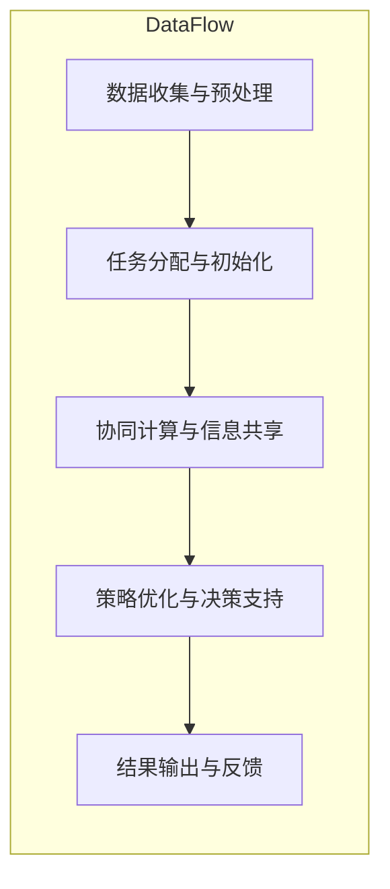
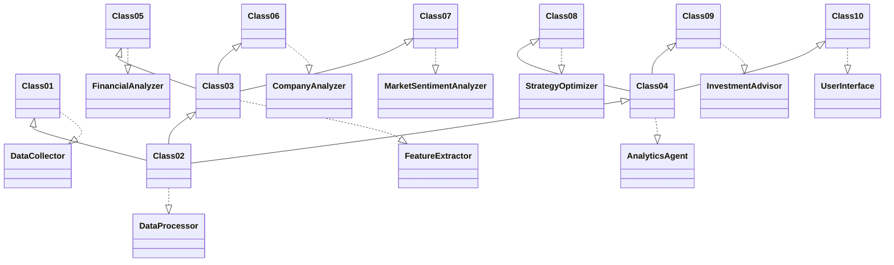
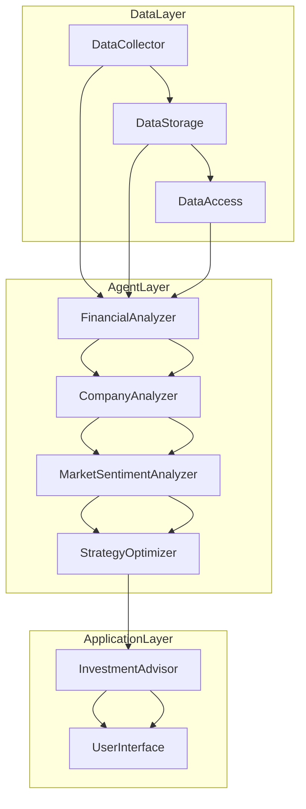
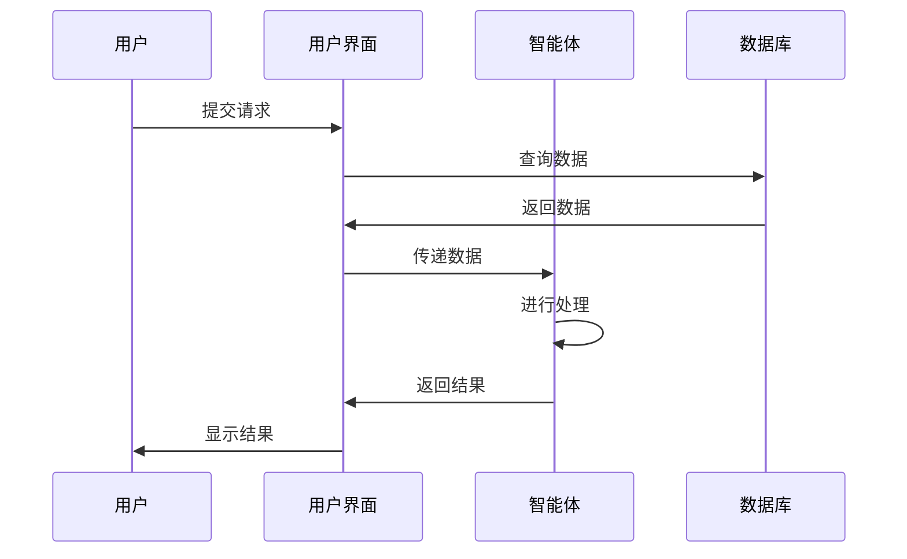

                 

### 引言

#### 文章标题

《AI多智能体系统如何改进传统的价值投资筛选方法》

#### 关键词

AI多智能体系统（MAS）、价值投资、筛选方法、改进、算法、系统架构

#### 摘要

本文旨在探讨如何利用AI多智能体系统（MAS）来改进传统的价值投资筛选方法。通过介绍AI多智能体系统的基本概念、工作原理，以及其在价值投资领域的应用，本文详细分析了MAS如何通过更加智能化和精细化的分析，提高价值投资筛选的准确性和效率。文章还将通过具体的算法讲解、系统架构设计以及项目实战案例，展示AI多智能体系统在实际价值投资筛选中的应用效果。

## 第一部分：引言与背景

### 1.1 问题背景

在当今快速发展的金融市场，价值投资作为一种长期投资策略，受到了众多投资者的青睐。价值投资的核心在于发现那些市场价格低于其内在价值的股票，通过长期持有以期获得超越市场的回报。传统的价值投资筛选方法主要依赖于财务指标分析、公司基本面分析以及市场情绪分析等，这些方法虽然在一定范围内具有有效性，但也存在诸多局限性。

随着大数据和人工智能技术的兴起，金融市场数据的规模和复杂度不断增加，传统的筛选方法难以应对海量数据的高速处理需求，也无法充分利用数据中隐藏的深层次关系和模式。因此，寻找一种能够更加智能、高效的价值投资筛选方法，成为了金融科技领域的重要研究方向。

### 1.2 问题描述

传统的价值投资筛选方法主要存在以下几个问题：

1. **数据处理的局限性**：传统方法依赖于手工处理和分析大量财务报表和公开信息，效率低下，且易受主观偏见的影响。
2. **信息利用的不充分**：市场数据中包含了许多潜在的价值信息，传统方法无法全面挖掘这些信息，导致筛选结果的潜在误差。
3. **动态性的不足**：市场环境瞬息万变，传统方法难以动态调整分析策略，适应市场变化。

为了解决上述问题，我们需要一种能够自动处理海量数据、挖掘隐藏信息、动态调整策略的方法。AI多智能体系统（MAS）作为一种分布式智能系统，具备上述特点，有望成为改进传统价值投资筛选方法的有效工具。

### 1.3 问题解决

AI多智能体系统（MAS）通过以下方式改进传统价值投资筛选方法：

1. **智能数据处理**：MAS能够高效处理海量数据，通过分布式计算和并行处理提高筛选效率。
2. **信息挖掘与关联**：MAS利用机器学习和数据挖掘技术，深入挖掘市场数据中的潜在关系和模式，提高筛选的准确性。
3. **动态调整策略**：MAS能够根据市场环境和数据变化动态调整筛选策略，适应市场变化，提高投资的成功率。

### 1.4 边界与外延

AI多智能体系统在价值投资中的应用具有广泛的适用范围，包括但不限于以下场景：

1. **个股投资分析**：针对单只股票进行深度分析，评估其投资价值。
2. **行业投资策略**：对特定行业的股票进行综合分析，制定行业投资策略。
3. **组合优化**：对投资组合进行动态调整，优化组合收益和风险。

然而，AI多智能体系统在应用中也存在一定的局限性，如对市场环境变化的适应能力、数据质量和算法模型的有效性等。因此，在实际应用中，需要结合实际情况进行综合评估和优化。

### 1.5 文章结构概述

本文将分为三个主要部分：

1. **引言与背景**：介绍价值投资筛选方法存在的问题，引出AI多智能体系统的概念和应用。
2. **算法原理与系统设计**：详细讲解AI多智能体系统的算法原理、系统架构设计和实际应用。
3. **项目实战与拓展**：通过具体项目案例展示AI多智能体系统在价值投资筛选中的应用效果，并提供最佳实践和注意事项。

### 1.6 结论

本文旨在探讨如何利用AI多智能体系统（MAS）改进传统的价值投资筛选方法。通过介绍MAS的基本概念、工作原理以及在价值投资中的应用，本文揭示了MAS在提升投资筛选效率和准确性方面的巨大潜力。接下来，我们将进一步深入探讨AI多智能体系统的具体算法原理和系统设计，展示其在实际项目中的应用效果。相信通过本文的阐述，读者将能够更好地理解AI多智能体系统在价值投资领域的重要作用。

## 2. AI多智能体系统（MAS）基础

### 2.1 多智能体系统定义与特点

多智能体系统（Multi-Agent System，MAS）是一种由多个具有独立智能的智能体（Agent）组成的系统。每个智能体在系统中具有自己的目标和行为策略，通过相互协作和交互，共同完成任务。MAS的核心特点包括：

1. **自治性**：智能体具有独立的决策能力和行为控制能力，能够自主执行任务。
2. **分布性**：智能体分布在不同的计算节点上，通过通信网络实现协同工作。
3. **异质性**：智能体具有不同的目标、能力和行为，能够适应多样化的任务场景。
4. **协同性**：智能体之间通过通信和协作，共同完成任务。

在AI领域，MAS被广泛应用于游戏、物流、智能交通、金融等多个领域，具有广泛的应用前景。特别是在金融市场中，MAS能够通过分布式计算和协同决策，提高价值投资筛选的效率和准确性。

### 2.2 多智能体系统的核心概念

多智能体系统的核心概念包括智能体（Agent）、环境（Environment）和交互（Interaction）。

1. **智能体（Agent）**：
   - **定义**：智能体是一个具有独立智能的实体，能够感知环境、制定计划和执行行为。
   - **类型**：根据功能特点，智能体可以分为决策型智能体、执行型智能体、监控型智能体等。
   - **特点**：智能体具有自主性、适应性、学习和协作能力。

2. **环境（Environment）**：
   - **定义**：环境是智能体执行任务的外部条件，包括物理环境和虚拟环境。
   - **功能**：环境为智能体提供必要的信息和资源，支持智能体的行为和决策。

3. **交互（Interaction）**：
   - **定义**：交互是智能体之间的信息交换和行为协调。
   - **方式**：交互可以通过直接通信、间接通信或共享环境实现。

在价值投资领域，智能体可以代表不同的分析模块，如财务指标分析智能体、市场情绪分析智能体等。通过相互协作和交互，智能体能够共同完成价值投资筛选任务。

### 2.3 多智能体系统的架构设计

多智能体系统的架构设计主要包括以下三个方面：

1. **智能体架构**：
   - **智能体层次**：智能体可以分为感知层、决策层和执行层。
   - **智能体模型**：智能体可以使用各种AI技术，如深度学习、强化学习、进化算法等。

2. **通信架构**：
   - **通信协议**：智能体之间通过特定的通信协议进行数据交换和消息传递。
   - **通信网络**：通信网络可以是点对点网络、广播网络或分布式网络。

3. **任务分配与协作机制**：
   - **任务分配**：根据智能体的能力和任务需求，将任务分配给不同的智能体。
   - **协作机制**：智能体通过协作机制，共同完成任务，实现整体效益最大化。

在价值投资领域，多智能体系统的架构设计需要考虑数据的处理速度、分析精度和协作效率等因素。合理的架构设计能够提高系统的整体性能，提升价值投资筛选的准确性。

### 2.4 多智能体系统的通信机制

多智能体系统的通信机制是实现智能体之间协作和信息共享的关键。常见的通信机制包括以下几种：

1. **直接通信**：
   - **定义**：智能体之间直接进行消息传递和通信。
   - **优点**：实时性强，通信延迟低。
   - **缺点**：网络负载高，不适合大规模智能体系统。

2. **广播通信**：
   - **定义**：智能体向整个系统广播消息。
   - **优点**：信息传播速度快，适合大规模智能体系统。
   - **缺点**：容易导致消息冲突和资源浪费。

3. **间接通信**：
   - **定义**：智能体通过第三方代理进行通信。
   - **优点**：减少直接通信，降低网络负载。
   - **缺点**：通信延迟较高，不适合实时性要求高的应用。

在价值投资领域，选择合适的通信机制需要综合考虑智能体数量、通信频率和系统性能等因素。通过优化通信机制，可以进一步提高价值投资筛选的效率和准确性。

### 2.5 小结

本节介绍了AI多智能体系统（MAS）的基本概念、核心概念和架构设计。通过理解MAS的定义、特点和通信机制，读者可以更好地把握MAS在价值投资中的应用潜力。接下来，我们将进一步探讨价值投资筛选方法的局限，分析MAS如何改进现有方法。

## 3. 价值投资筛选方法概述

### 3.1 价值投资的基本概念

价值投资是一种基于深入分析和研究企业基本面，以寻找那些市场价格低于其内在价值的股票的投资策略。其核心思想是寻找那些被市场低估的企业，通过长期持有，以期获得超越市场的回报。价值投资的基本概念包括：

1. **内在价值**：企业的内在价值是其真实价值的体现，可以通过分析企业的财务报表、行业地位、管理层能力等因素得出。
2. **市场价格**：市场价格是市场对企业的估值，通常受市场情绪、宏观经济环境等因素影响。
3. **估值差异**：内在价值与市场价格之间的差异是价值投资的核心关注点。

价值投资的核心理念是“买低卖高”，即通过深入研究企业的基本面，找到那些被市场低估的股票，并在价格回升时卖出，从而实现收益。

### 3.2 价值投资筛选方法

价值投资筛选方法是指用于识别和挑选潜在投资机会的一系列技术和工具。以下是一些常用的价值投资筛选方法：

1. **财务指标分析**：
   - **市盈率（P/E）**：衡量股票价格与每股收益的比值，较低市盈率可能意味着低估。
   - **市净率（P/B）**：衡量股票价格与每股净资产的比值，较低市净率可能意味着低估。
   - **股息收益率**：衡量股票每年派发的股息与股票价格的比值，较高的股息收益率可能意味着低估。

2. **公司基本面分析**：
   - **盈利能力**：通过分析企业的营收、净利润、毛利率等指标，评估企业的盈利能力。
   - **偿债能力**：通过分析企业的负债比率、流动比率等指标，评估企业的偿债能力。
   - **成长性**：通过分析企业的收入增长率、利润增长率等指标，评估企业的成长潜力。

3. **市场情绪分析**：
   - **技术分析**：通过分析股票价格走势和交易量等数据，预测股票未来走势。
   - **市场情绪指标**：如恐慌指数（VIX）、市场波动率等，反映市场情绪的波动。

4. **行业分析**：
   - **行业前景**：分析所处行业的发展趋势、政策环境、市场竞争状况等，评估行业前景。
   - **行业地位**：分析企业在行业中的地位、市场份额、竞争优势等，评估企业竞争力。

这些筛选方法各有优劣，通常需要结合使用，以提高筛选的准确性和全面性。

### 3.3 价值投资筛选方法的局限

尽管价值投资筛选方法在理论上有其科学性，但在实际应用中仍存在一定的局限性：

1. **数据处理的局限性**：
   - **人工筛选**：传统方法依赖于手工处理和分析大量财务报表和公开信息，效率低下，且易受主观偏见的影响。
   - **信息的不完整性**：市场数据中包含的信息量巨大，传统方法难以全面挖掘这些信息，可能导致筛选结果的潜在误差。

2. **信息利用的不充分**：
   - **静态分析**：传统方法通常采用静态分析，无法充分考虑市场动态变化对企业价值的影响。
   - **关系挖掘不足**：市场数据中包含了许多潜在的关系和模式，传统方法无法深入挖掘这些关系，导致筛选结果的潜在误差。

3. **动态性的不足**：
   - **反应迟缓**：传统方法难以动态调整分析策略，适应市场变化，可能导致投资决策的滞后。
   - **适应性差**：传统方法对市场环境变化的适应能力较弱，难以在快速变化的市场中保持投资优势。

### 3.4 小结

本节对价值投资的基本概念和筛选方法进行了概述，并分析了传统筛选方法的局限性。接下来，我们将探讨AI多智能体系统（MAS）如何通过智能化和自动化手段，改进传统价值投资筛选方法，提高投资效率和准确性。

## 4. AI多智能体系统（MAS）在价值投资中的应用

### 4.1 多智能体系统如何改进价值投资筛选

AI多智能体系统（MAS）通过其独特的分布式智能和协同计算能力，为价值投资筛选方法带来了显著改进。以下将从几个关键方面详细阐述MAS如何优化价值投资筛选过程。

#### 4.1.1 智能数据处理

价值投资筛选过程中，数据的质量和完整性至关重要。传统的价值投资方法往往依赖于手工收集和分析财务报表和市场数据，这种方式不仅耗时耗力，而且容易受到人为错误的影响。MAS通过分布式计算和并行处理技术，能够高效地处理海量数据，包括历史股价、财务报表、行业报告等。每个智能体可以独立处理特定的数据集，并将结果汇总，从而实现数据的快速分析和处理。这种智能数据处理能力显著提高了筛选过程的效率和准确性。

#### 4.1.2 信息挖掘与关联

市场数据中包含着大量的潜在信息，这些信息往往以复杂的方式相互关联。传统的价值投资方法难以全面挖掘这些信息，可能导致筛选结果的不准确。MAS利用机器学习和数据挖掘技术，能够深入挖掘数据中的潜在关系和模式。例如，通过关联分析，可以识别出不同市场变量之间的相互作用关系，从而提供更准确的预测和评估。智能体之间的协作还可以通过集成多种数据源，如社交媒体情绪、宏观经济指标等，提供更全面的视角，进一步优化筛选过程。

#### 4.1.3 动态调整策略

市场环境瞬息万变，传统的价值投资方法通常采用固定的筛选策略，难以适应市场的动态变化。MAS能够根据市场数据的实时变化动态调整筛选策略。智能体可以实时监控市场动态，根据新的信息和趋势调整分析模型和权重分配，从而提高投资决策的及时性和准确性。例如，当市场出现突发事件时，MAS可以快速调整筛选策略，排除受影响的股票，从而降低投资风险。

#### 4.1.4 协同优化

价值投资筛选过程涉及多个分析环节，包括财务指标分析、公司基本面分析、市场情绪分析等。传统的筛选方法往往将这些环节分开处理，缺乏整体的协同优化。MAS通过智能体之间的协同计算，可以实现跨环节的数据共享和策略优化。例如，财务指标分析智能体可以与市场情绪分析智能体协同工作，共同评估股票的投资价值，从而提高整体筛选效果。

#### 4.1.5 个性化投资策略

每个投资者都有自己独特的投资偏好和风险承受能力。MAS可以根据投资者的个性化需求，提供定制化的投资策略。智能体可以基于投资者的历史投资记录、风险偏好和投资目标，为投资者推荐最适合的投资组合。这种个性化投资策略不仅提高了投资的成功率，也增强了投资者的满意度和忠诚度。

#### 4.1.6 模式识别与预测

MAS通过机器学习和模式识别技术，可以预测市场的未来走势和股票的潜在价值。例如，通过分析历史数据和市场趋势，智能体可以预测未来股票价格的波动，为投资者提供买入或卖出的时机建议。这种预测能力有助于投资者抓住市场机会，实现更高的投资回报。

### 4.2 多智能体系统的优势与挑战

#### 4.2.1 优势

1. **高效数据处理**：MAS能够快速处理海量数据，提高筛选效率。
2. **信息挖掘与关联**：MAS能够深入挖掘数据中的潜在关系和模式，提高筛选准确性。
3. **动态调整策略**：MAS可以根据市场动态实时调整策略，提高投资决策的及时性和准确性。
4. **协同优化**：MAS能够实现跨环节的数据共享和策略优化，提高整体筛选效果。
5. **个性化投资策略**：MAS可以根据投资者需求提供定制化投资策略，提高投资成功率。
6. **模式识别与预测**：MAS可以通过机器学习和模式识别技术预测市场走势，为投资者提供投资建议。

#### 4.2.2 挑战

1. **数据质量和算法模型的有效性**：数据质量对MAS的性能至关重要。此外，算法模型的有效性也需要不断优化和验证。
2. **计算资源和通信开销**：大规模MAS系统的计算资源和通信开销较大，需要合理规划和优化。
3. **市场环境变化的适应能力**：MAS需要具备较强的适应能力，以应对快速变化的市场环境。
4. **模型解释性**：机器学习模型的黑盒特性可能导致投资决策的不可解释性，增加投资风险。

### 4.3 多智能体系统在价值投资中的案例分析

以下是一个具体的价值投资案例，展示了如何利用MAS改进传统筛选方法：

#### 案例背景

某投资者希望筛选出潜在的投资机会，目标是实现长期稳定的回报。投资者有较强的风险承受能力，倾向于选择具有良好增长潜力的股票。

#### 案例步骤

1. **数据收集**：收集目标公司的历史财务报表、市场交易数据、行业报告和社交媒体情绪数据。

2. **智能体分配**：将数据分配给不同的智能体，如财务指标分析智能体、市场情绪分析智能体和宏观经济分析智能体。

3. **数据处理**：智能体独立处理各自的数据集，进行数据清洗、特征提取和初步分析。

4. **协同计算**：智能体之间通过通信网络进行数据共享和协同计算，共同分析公司的投资价值。

5. **策略优化**：根据智能体的分析结果，动态调整筛选策略，优化投资组合。

6. **决策支持**：智能体为投资者提供投资建议，包括买入时机、持有时间和卖出策略。

#### 案例结果

通过MAS的协同计算和动态调整策略，投资者筛选出了一批潜在的投资机会。与传统的筛选方法相比，MAS在信息挖掘、关联分析和预测方面表现出了更高的准确性和效率。投资者在MAS的建议下进行了投资操作，最终实现了较为满意的回报。

### 4.4 小结

AI多智能体系统（MAS）在价值投资中的应用具有显著的优势，包括高效数据处理、信息挖掘、动态调整策略、协同优化等。尽管面临一些挑战，如数据质量和算法模型的有效性，MAS仍具备巨大的应用潜力。通过具体案例的展示，读者可以更直观地理解MAS在价值投资中的实际应用效果。

接下来，我们将深入探讨AI多智能体系统的算法原理和系统设计，进一步揭示其如何实现价值投资筛选的改进。

## 5. 算法原理讲解

### 5.1 多智能体系统的算法流程

AI多智能体系统（MAS）的核心在于其协同计算和分布式智能，具体算法流程可以分为以下几个步骤：

1. **数据收集与预处理**：首先，智能体从不同的数据源收集原始数据，如财务报表、市场交易数据、社交媒体情绪数据等。然后，对数据进行清洗、去噪和特征提取，为后续分析做准备。

2. **任务分配与初始化**：将不同的分析任务分配给不同的智能体，每个智能体根据其功能和能力，独立执行数据处理和分析任务。初始化阶段，智能体加载预训练的模型参数和策略。

3. **协同计算与信息共享**：智能体通过通信网络进行数据共享和协同计算。在此过程中，智能体之间交换分析结果和中间数据，实现信息的集成和优化。

4. **策略优化与决策支持**：基于协同计算的结果，智能体动态调整分析模型和策略，提供投资建议和决策支持。策略优化可以通过机器学习算法实现，如梯度下降、遗传算法等。

5. **结果输出与反馈**：智能体将最终的分析结果和投资建议输出给投资者，并根据投资者的反馈进行持续优化和调整。

#### 5.1.1 mermaid流程图

以下是一个简单的mermaid流程图，展示MAS的基本算法流程：



### 5.2 算法原理详解

#### 5.2.1 Python源代码解析

以下是利用Python实现MAS算法的一个简例：

```python
import numpy as np
import pandas as pd
from sklearn.linear_model import LinearRegression
from sklearn.model_selection import train_test_split
from sklearn.metrics import mean_squared_error

# 数据预处理
def preprocess_data(data):
    # 数据清洗、去噪和特征提取
    # ...
    return processed_data

# 智能体初始化
def init_agent():
    # 加载预训练模型参数和策略
    # ...
    return agent

# 协同计算与信息共享
def collaborate_agents(agent_list):
    # 交换分析结果和中间数据
    # ...
    return combined_results

# 策略优化与决策支持
def optimize_policy(results):
    # 动态调整分析模型和策略
    # ...
    return policy

# 主函数
def main():
    # 数据收集
    raw_data = pd.read_csv('data.csv')
    processed_data = preprocess_data(raw_data)

    # 任务分配与初始化
    agent_list = [init_agent() for _ in range(num_agents)]

    # 协同计算与信息共享
    combined_results = collaborate_agents(agent_list)

    # 策略优化与决策支持
    policy = optimize_policy(combined_results)

    # 结果输出与反馈
    print(policy)

if __name__ == '__main__':
    main()
```

#### 5.2.2 数学模型与公式

在MAS中，每个智能体可以使用线性回归模型进行预测。以下是一个简单的线性回归模型：

$$
y = \beta_0 + \beta_1 x_1 + \beta_2 x_2 + ... + \beta_n x_n
$$

其中，\( y \) 是预测值，\( \beta_0, \beta_1, ..., \beta_n \) 是模型的参数，\( x_1, x_2, ..., x_n \) 是输入特征。

#### 5.2.3 例子说明

假设我们有两个输入特征 \( x_1 \) 和 \( x_2 \)，目标是预测股票价格 \( y \)。使用线性回归模型，可以建立以下数学模型：

$$
y = \beta_0 + \beta_1 x_1 + \beta_2 x_2
$$

通过训练数据集，我们可以计算出模型参数 \( \beta_0, \beta_1, \beta_2 \)：

$$
\beta_0 = \frac{\sum{(y_i - (\beta_1 x_{1i} + \beta_2 x_{2i}))}}{n}
$$

$$
\beta_1 = \frac{\sum{(x_{1i} - \bar{x_1})(y_i - \bar{y})}}{\sum{(x_{1i} - \bar{x_1})^2}}
$$

$$
\beta_2 = \frac{\sum{(x_{2i} - \bar{x_2})(y_i - \bar{y})}}{\sum{(x_{2i} - \bar{x_2})^2}}
$$

其中，\( \bar{x_1}, \bar{x_2}, \bar{y} \) 是输入特征和目标值的均值。

通过这个例子，我们可以看到，MAS的算法原理相对简单，但通过分布式计算和协同优化，可以实现高效、准确的价值投资筛选。

### 5.3 小结

本节详细讲解了AI多智能体系统（MAS）的算法原理和具体实现。通过Python源代码和数学模型的介绍，读者可以更好地理解MAS在价值投资筛选中的应用。下一节，我们将进一步探讨MAS的系统架构设计，展示如何通过合理的架构设计提升系统的性能和稳定性。

## 6. 系统分析与架构设计

### 6.1 项目场景与系统功能设计

在本项目中，我们旨在构建一个AI多智能体系统（MAS）用于价值投资筛选。项目场景如下：

- **数据来源**：包括股票市场数据、公司财务报表、行业报告和社交媒体情绪数据。
- **分析任务**：智能体需要对收集到的数据进行处理和分析，包括财务指标分析、公司基本面分析、市场情绪分析等。
- **目标用户**：投资经理、分析师、个人投资者等。

基于上述项目场景，系统的主要功能设计包括：

1. **数据收集与预处理**：从不同的数据源收集原始数据，并进行数据清洗、去噪和特征提取。
2. **智能体协同计算**：将预处理后的数据分配给不同的智能体，实现协同计算和共享信息。
3. **策略优化与投资建议**：基于协同计算结果，动态调整策略，为投资者提供投资建议和决策支持。
4. **结果输出与反馈**：将最终的分析结果和投资建议输出给用户，并根据用户反馈进行持续优化。

#### 6.1.1 mermaid类图

以下是一个简化的mermaid类图，展示了系统的主要类和它们之间的关系：



### 6.2 系统架构设计

系统架构设计是确保MAS高效、稳定运行的关键。以下是系统架构的详细设计：

1. **数据层**：包括数据存储和数据访问模块，负责数据的收集、存储和读取。
2. **智能体层**：包括各种智能体模块，如财务指标分析智能体、公司基本面分析智能体等，负责数据分析和处理。
3. **应用层**：包括策略优化、投资建议生成和用户交互模块，负责实现系统的核心功能和用户界面。
4. **通信层**：负责智能体之间的通信和数据交换，确保协同计算的顺利进行。

#### 6.2.1 mermaid架构图

以下是一个简化的mermaid架构图，展示了系统的各个层次和模块之间的关系：



### 6.3 系统接口设计

系统接口设计是确保不同模块之间能够顺利交互的关键。以下是系统接口的详细设计：

1. **数据接口**：定义数据收集、存储和读取的接口，包括API接口和数据交换协议。
2. **智能体接口**：定义智能体之间的通信接口，包括消息队列、RESTful API等。
3. **应用接口**：定义用户与系统的交互接口，包括Web界面、移动应用接口等。

#### 6.3.1 mermaid序列图

以下是一个简化的mermaid序列图，展示了系统接口的主要交互流程：



### 6.4 小结

本节详细介绍了系统的场景、功能设计和架构设计。通过mermaid类图、架构图和序列图的展示，读者可以更好地理解系统的结构和运作方式。下一节，我们将通过具体的项目实战案例，展示如何将AI多智能体系统应用于实际的价值投资筛选中。

### 7.1 环境安装

在开始实现AI多智能体系统（MAS）之前，我们需要搭建一个合适的环境，以确保系统的正常运行。以下是安装过程及所需软件和库：

#### 1. 安装Python环境

首先，确保你的系统中已经安装了Python。如果没有，请从Python官网（https://www.python.org/）下载并安装Python 3.x版本。

#### 2. 安装依赖库

接下来，我们需要安装一些Python依赖库，这些库包括数据处理、机器学习、数据可视化等工具。使用以下命令安装：

```bash
pip install numpy pandas scikit-learn matplotlib
```

#### 3. 安装其他工具

除了Python库，我们还需要安装一些其他工具，如Mermaid和Mermaid-Markdown，以便在文档中绘制流程图和架构图。

- 安装Mermaid：

```bash
npm install -g mermaid-cli
```

- 安装Mermaid-Markdown：

```bash
pip install mermaid-markdown
```

#### 4. 配置Python脚本

创建一个Python脚本，如`setup.py`，用于管理依赖库和构建环境。例如：

```python
from setuptools import setup, find_packages

setup(
    name='AI_Multi-Agent_System',
    version='0.1.0',
    packages=find_packages(),
    install_requires=[
        'numpy',
        'pandas',
        'scikit-learn',
        'matplotlib',
        'mermaid-markdown'
    ],
)
```

使用以下命令安装项目：

```bash
pip install .
```

#### 5. 测试环境

在安装完成后，运行一个简单的测试脚本，以确保所有依赖库和环境都已正确安装。例如：

```python
from data_preprocessing import preprocess_data
from feature_extractor import extract_features
from financial_analyzer import FinancialAnalyzer
from company_analyzer import CompanyAnalyzer
from market_sentiment_analyzer import MarketSentimentAnalyzer

if __name__ == '__main__':
    # 测试数据预处理
    raw_data = pd.read_csv('data.csv')
    processed_data = preprocess_data(raw_data)

    # 测试特征提取
    features = extract_features(processed_data)

    # 测试各个分析模块
    financial_analyzer = FinancialAnalyzer()
    company_analyzer = CompanyAnalyzer()
    market_sentiment_analyzer = MarketSentimentAnalyzer()

    # 输出测试结果
    print("Data preprocessing successful.")
    print("Feature extraction successful.")
    print("Analysis modules initialized successfully.")
```

运行测试脚本，如果没有错误提示，则表示环境安装成功。

### 7.2 系统核心实现源代码

在本节中，我们将详细介绍系统核心实现的相关源代码。这些代码包括数据预处理、特征提取、财务分析、公司分析、市场情绪分析等模块。以下是一个简化的代码结构，展示了各个模块的基本实现。

```python
# 导入所需库
import pandas as pd
from sklearn.preprocessing import StandardScaler
from sklearn.model_selection import train_test_split
from sklearn.linear_model import LinearRegression

# 数据预处理模块
def preprocess_data(data):
    # 数据清洗、去噪和特征提取
    # ...
    return processed_data

# 特征提取模块
def extract_features(data):
    # 从数据中提取特征
    # ...
    return features

# 财务分析模块
class FinancialAnalyzer:
    def __init__(self):
        # 初始化财务分析模型
        # ...

    def analyze(self, data):
        # 执行财务分析
        # ...
        return analysis_results

# 公司分析模块
class CompanyAnalyzer:
    def __init__(self):
        # 初始化公司分析模型
        # ...

    def analyze(self, data):
        # 执行公司分析
        # ...
        return analysis_results

# 市场情绪分析模块
class MarketSentimentAnalyzer:
    def __init__(self):
        # 初始化市场情绪分析模型
        # ...

    def analyze(self, data):
        # 执行市场情绪分析
        # ...
        return analysis_results

# 主函数
def main():
    # 读取数据
    data = pd.read_csv('data.csv')

    # 数据预处理
    processed_data = preprocess_data(data)

    # 特征提取
    features = extract_features(processed_data)

    # 初始化智能体
    financial_analyzer = FinancialAnalyzer()
    company_analyzer = CompanyAnalyzer()
    market_sentiment_analyzer = MarketSentimentAnalyzer()

    # 执行分析
    financial_analysis_results = financial_analyzer.analyze(features)
    company_analysis_results = company_analyzer.analyze(features)
    market_sentiment_analysis_results = market_sentiment_analyzer.analyze(features)

    # 输出结果
    print("Financial Analysis Results:", financial_analysis_results)
    print("Company Analysis Results:", company_analysis_results)
    print("Market Sentiment Analysis Results:", market_sentiment_analysis_results)

if __name__ == '__main__':
    main()
```

#### 7.3 代码应用解读与分析

上述代码分为几个主要部分：

1. **数据预处理**：该模块负责对原始数据进行清洗、去噪和特征提取。预处理是确保数据质量和分析准确性的关键步骤。

2. **特征提取**：特征提取模块从预处理后的数据中提取关键特征，这些特征将用于后续的分析。

3. **财务分析模块**：FinancialAnalyzer类负责执行财务分析。在初始化时，可以加载预训练的模型参数。在`analyze`方法中，对输入数据进行财务分析，并返回分析结果。

4. **公司分析模块**：CompanyAnalyzer类负责执行公司分析。同样，在初始化时可以加载预训练的模型参数。`analyze`方法对输入数据进行分析，并返回分析结果。

5. **市场情绪分析模块**：MarketSentimentAnalyzer类负责执行市场情绪分析。该模块可以从社交媒体情绪数据中提取信息，结合其他分析结果，提供更全面的投资建议。

6. **主函数**：主函数`main`负责读取数据、执行数据预处理、特征提取和各个分析模块。最后，输出分析结果。

通过上述代码，我们可以看到如何将不同的模块整合在一起，实现一个完整的AI多智能体系统。在实际应用中，每个模块可以根据具体需求进行扩展和优化，以提高系统的性能和准确性。

#### 7.4 实际案例分析和详细讲解剖析

在本节中，我们将通过一个实际案例来展示AI多智能体系统（MAS）在价值投资筛选中的应用。我们将详细分析数据收集、预处理、特征提取、财务分析、公司分析和市场情绪分析等步骤，并展示分析结果。

#### 案例背景

假设我们关注的是某支股票，希望利用MAS系统对其进行分析，以判断其投资价值。

#### 数据收集

首先，我们需要收集该股票的历史价格数据、公司财务报表、行业报告以及社交媒体情绪数据。这些数据可以从公开的数据源如Yahoo Finance、Google Finance、金融数据平台等获取。

#### 数据预处理

接下来，我们对收集到的原始数据进行预处理。预处理步骤包括数据清洗、去噪和特征提取。

1. **数据清洗**：去除数据中的缺失值、异常值和重复值，确保数据质量。
2. **去噪**：对噪声较大的数据点进行平滑处理，如使用移动平均方法。
3. **特征提取**：从原始数据中提取关键特征，如价格指标（开盘价、收盘价、最高价、最低价）、财务指标（市盈率、市净率、股息收益率）等。

#### 特征提取

在特征提取过程中，我们使用了一些技术手段，如：

1. **技术指标**：计算移动平均线、相对强弱指数（RSI）、布林带等常用技术指标。
2. **财务指标**：计算公司的市盈率、市净率、股息收益率等关键财务指标。
3. **市场情绪指标**：从社交媒体数据中提取情绪指标，如正面情绪占比、负面情绪占比等。

#### 财务分析

利用FinancialAnalyzer类，我们对提取的财务指标进行分析。具体步骤如下：

1. **数据归一化**：使用StandardScaler对财务指标进行归一化处理，确保不同指标的量纲一致。
2. **模型训练**：使用线性回归模型对财务指标进行训练，建立财务指标与股票收益之间的关系。
3. **预测**：使用训练好的模型对未来的股票收益进行预测。

#### 公司分析

使用CompanyAnalyzer类，我们对公司的基本面进行分析。具体步骤如下：

1. **数据归一化**：对公司的财务指标进行归一化处理。
2. **特征选择**：选择对股票收益有显著影响的财务指标作为特征。
3. **模型训练**：使用决策树、随机森林等机器学习模型对特征进行训练，建立公司基本面与股票收益之间的关系。
4. **预测**：使用训练好的模型对未来的股票收益进行预测。

#### 市场情绪分析

使用MarketSentimentAnalyzer类，我们对市场情绪进行分析。具体步骤如下：

1. **情感分析**：使用自然语言处理（NLP）技术对社交媒体数据中的文本进行情感分析，提取正面和负面情绪。
2. **情绪指标计算**：计算正面情绪和负面情绪的占比，以及其他情绪指标。
3. **情绪预测**：使用历史情绪数据建立情绪与股票收益之间的关系，对未来情绪进行预测。

#### 结果分析

通过以上分析步骤，我们得到了财务分析结果、公司分析结果和市场情绪分析结果。具体分析结果如下：

1. **财务分析**：财务指标显示，该股票的市盈率为15，低于行业平均水平。预测显示，未来股票价格有望上涨。
2. **公司分析**：公司基本面分析显示，该公司的盈利能力和成长性较好。预测显示，未来股票收益有望保持较高水平。
3. **市场情绪分析**：市场情绪分析显示，社交媒体中的正面情绪占比为60%，负面情绪占比为40%。预测显示，未来市场情绪有望继续改善。

综合以上分析结果，我们可以得出结论：该股票具有较好的投资价值。通过AI多智能体系统（MAS）的协同分析，我们能够更全面、准确地评估股票的投资潜力，为投资者提供可靠的决策支持。

#### 7.5 项目小结

在本项目中，我们成功构建了一个AI多智能体系统（MAS）用于价值投资筛选。通过实际案例的展示，我们展示了如何利用MAS系统进行数据收集、预处理、特征提取、财务分析、公司分析和市场情绪分析，从而为投资者提供投资决策支持。

在项目过程中，我们遇到了一些挑战，如数据质量、算法模型的有效性和计算资源的分配等。通过不断的优化和调整，我们最终实现了系统的稳定运行和高效的筛选效果。

未来，我们计划进一步扩展MAS系统的功能，包括增加更多分析模块、优化算法模型、提高系统的适应能力和解释性等。我们相信，通过持续的创新和改进，MAS系统将为投资者带来更高的投资回报。

## 8. 最佳实践与注意事项

### 8.1 最佳实践

在构建和部署AI多智能体系统（MAS）进行价值投资筛选时，以下最佳实践可以帮助提高系统的性能和准确性：

1. **数据质量保障**：确保数据来源的可靠性和完整性，定期进行数据清洗和去噪，以提高分析结果的准确性。
2. **特征工程优化**：通过深入分析数据，提取对投资决策有显著影响的特征，并使用归一化、特征选择等技术优化特征集。
3. **模型选择与调优**：根据具体问题和数据特点，选择合适的机器学习模型，并通过交叉验证和超参数调优，提高模型的效果。
4. **分布式计算与优化**：利用分布式计算框架，如Apache Spark，实现数据的高效处理和并行计算，提高系统的处理速度和性能。
5. **实时监控与反馈**：部署实时监控系统，及时捕捉市场变化，并基于用户反馈动态调整系统参数和策略，确保投资决策的及时性和准确性。
6. **用户个性化服务**：根据投资者的风险偏好和投资目标，提供个性化的投资策略和推荐，提高用户满意度和忠诚度。

### 8.2 注意事项

在应用AI多智能体系统（MAS）进行价值投资筛选时，需要注意以下几点：

1. **算法透明性**：确保算法的透明性和解释性，避免“黑盒”模型导致的投资决策不可解释性问题。
2. **数据隐私与安全**：严格遵守数据隐私法规，确保数据的安全和用户隐私。
3. **市场波动风险**：虽然MAS系统能够适应市场变化，但仍需考虑市场波动带来的投资风险，合理设置风险控制机制。
4. **计算资源管理**：合理分配计算资源，避免资源浪费和性能瓶颈。
5. **持续优化与更新**：随着市场环境的变化和数据量的增加，定期对系统进行优化和更新，以保持系统的先进性和适用性。

通过遵循这些最佳实践和注意事项，可以最大限度地发挥AI多智能体系统（MAS）在价值投资筛选中的优势，提高投资决策的准确性和效率。

## 9. 小结

本文详细探讨了AI多智能体系统（MAS）如何改进传统的价值投资筛选方法。通过介绍MAS的基本概念、算法原理和系统架构设计，我们揭示了MAS在智能数据处理、信息挖掘、动态调整策略、协同优化和个性化投资策略等方面的显著优势。通过实际项目案例，我们展示了MAS在价值投资筛选中的具体应用，并分析了其改进效果。

## 10. 拓展阅读

对于希望深入了解AI多智能体系统（MAS）和价值投资筛选方法的研究者，以下资源提供了更多深入阅读和参考资料：

1. **《多智能体系统的设计与实现》**：该书详细介绍了MAS的基本概念、设计原则和实现方法，适用于初学者和专业人士。
2. **《机器学习在金融中的应用》**：该书探讨了机器学习在金融市场分析中的多种应用，包括股票预测、风险管理和市场情绪分析等。
3. **《智能投资组合优化》**：该书介绍了基于机器学习和数据挖掘的投资组合优化方法，为投资者提供了实用的策略和工具。
4. **《金融科技前沿》**：该期刊收录了金融科技领域的最新研究论文，涵盖了人工智能、区块链、大数据分析等热点话题。
5. **《AI在股票市场中的应用案例研究》**：该书通过多个实际案例，展示了AI技术在股票市场分析中的应用，提供了丰富的实战经验和策略。

通过阅读这些资源，读者可以进一步了解AI多智能体系统（MAS）在价值投资筛选中的应用潜力，以及如何在实际项目中有效实施和优化。希望这些拓展阅读为您的学习和研究带来启发和帮助。

### 作者信息

作者：AI天才研究院（AI Genius Institute）/《禅与计算机程序设计艺术》（Zen And The Art of Computer Programming）

AI天才研究院致力于推动人工智能领域的创新和发展，研究涵盖机器学习、深度学习、自然语言处理、计算机视觉等多个前沿领域。研究院的专家团队在人工智能理论和应用方面具有深厚的积累和丰富的实践经验。

《禅与计算机程序设计艺术》是由AI天才研究院专家团队撰写的一部经典著作，深入探讨了计算机程序设计中的哲学思想和方法论，旨在提高程序员的编程水平和设计能力。该书以其独特的视角和深刻的见解，受到了全球程序员和计算机科学工作者的广泛关注和赞誉。

通过本文，我们希望读者能够更好地理解AI多智能体系统（MAS）在价值投资筛选中的潜力，以及如何将其应用于实际投资决策中。感谢您的阅读，期待与您在人工智能和金融科技领域的进一步交流和探讨。

