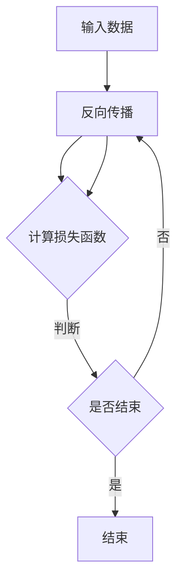

                 

### 引言：AI技术在私人银行业务中的应用前景

#### **# 《AI技术在私人银行业务中的应用前景分析》**

在当今金融科技快速发展的背景下，人工智能（AI）技术逐渐成为银行业转型和创新的关键驱动力。特别是私人银行业务，由于其客户群体的特殊性、服务需求的多样性和个性化程度，对技术的要求也日益提高。本文旨在探讨AI技术在私人银行业务中的应用前景，分析其在提升业务效率、优化客户服务和降低风险等方面的潜力。

#### **## 第一部分：问题背景与核心概念**

**### 1.1 私人银行业务概述**

私人银行业务主要面向高净值个人客户，提供包括投资、财富管理、资产配置、财富传承等一系列高端金融服务。随着全球经济的不断发展，私人银行业务的市场需求不断扩大，但同时也面临着诸多挑战：

- **问题背景**：客户需求的多样化与个性化趋势明显，对私人银行的服务质量与专业性提出了更高要求。
- **问题描述**：如何在激烈的市场竞争中，通过创新技术提升私人银行的服务能力和市场竞争力。
- **问题解决**：引入AI技术，利用其数据处理和分析能力，为客户提供更加个性化和高效的金融服务。
- **边界与外延**：私人银行业务不仅仅包括投资服务，还涵盖财富管理、税务规划、家族信托等多个方面。
- **概念结构与核心要素组成**：私人银行业务的核心在于对客户需求的精准把握、个性化服务以及高净值资产的增值管理。

**### 1.2 AI技术在金融领域的应用现状**

AI技术在金融领域的应用已经取得了显著成果，尤其是在风险管理、信用评估、量化交易等方面。以下为AI技术在金融领域的主要应用现状：

- **问题背景**：金融市场具有高度复杂性和不确定性，需要高效的算法和模型来进行风险管理和决策支持。
- **问题描述**：金融行业如何在信息化和数据化的过程中，利用AI技术提升业务效率和准确性。
- **问题解决**：通过机器学习、深度学习等AI技术，对海量金融数据进行挖掘和分析，提供更加精准的风险评估和投资建议。
- **边界与外延**：AI技术在金融领域的应用不仅限于风险管理和信用评估，还涉及市场预测、客户行为分析等多个方面。

**### 1.3 AI在私人银行业务中的核心概念**

AI在私人银行业务中的应用涉及多个核心概念和技术，主要包括：

**#### 1.3.1 机器学习算法**

机器学习算法是AI技术的重要组成部分，包括监督学习、无监督学习和强化学习等类型：

- **监督学习**：通过已有数据训练模型，预测未知数据的结果。
- **无监督学习**：不依赖已有标签数据，通过数据内在结构进行分类和聚类。
- **强化学习**：通过与环境交互，不断优化策略以实现目标。

**#### 1.3.2 深度学习**

深度学习是一种特殊的机器学习技术，通过模拟人脑神经网络结构，实现复杂的模式识别和决策：

- **神经网络**：模拟人脑神经元连接和信号传递过程。
- **卷积神经网络（CNN）**：在图像识别等领域有广泛应用。
- **循环神经网络（RNN）**：在序列数据处理和自然语言处理中表现优异。

**#### 1.3.3 自然语言处理**

自然语言处理（NLP）是AI技术的一个重要分支，旨在使计算机能够理解和处理人类语言：

- **文本分类**：将文本数据分类到不同的类别。
- **情感分析**：判断文本中的情感倾向。
- **语音识别**：将语音信号转换为文本。

**### 1.4 本书的目标与结构**

本书旨在系统分析AI技术在私人银行业务中的应用前景，帮助读者深入了解AI技术在私人银行业务中的实际应用及其潜在价值。具体目标包括：

- **目标**：分析AI技术在私人银行业务中的应用场景、技术实现、案例分析以及未来发展趋势。
- **结构**：本书共分为五个部分，分别介绍AI技术在私人银行业务中的应用场景、技术实现、案例分析、未来发展趋势和附录。

**### 1.5 总结**

私人银行业务的复杂性和高净值客户的需求特点，使得AI技术的引入变得尤为重要。通过对AI技术在私人银行业务中的应用前景进行分析，我们不仅可以预见其提升业务效率和优化客户服务的潜力，还可以深入理解其在金融领域的重要地位。接下来，本文将进一步探讨AI技术在私人银行业务中的具体应用场景和技术实现。

---

### 第一部分：问题背景与核心概念

#### **### 1.1 私人银行业务概述**

私人银行业务是一种专门面向高净值个人的金融服务，涉及投资管理、财富传承、税务规划、资产配置等多个方面。它旨在为这些客户提供一个全面、个性化的金融服务解决方案，以满足他们复杂的财务需求和投资目标。

#### **#### 1.1.1 问题背景**

随着全球经济的不断发展和金融市场的不断变化，私人银行业务面临以下几个关键问题：

1. **客户需求的多样化**：高净值个人客户的财务状况、投资偏好和风险承受能力各不相同，对金融服务的要求也越来越高。
2. **竞争压力增加**：私人银行业务市场竞争激烈，各大银行和金融机构都在积极争夺高净值客户。
3. **监管环境变化**：金融监管政策日益严格，银行需面对更多的合规要求和风险控制挑战。

#### **#### 1.1.2 问题描述**

在这种背景下，私人银行业务面临的主要问题是如何在满足客户个性化需求的同时，提高业务效率和降低运营成本。具体来说，包括以下几个方面：

1. **精准营销**：如何根据客户的具体需求和偏好，设计出有效的营销策略。
2. **风险管理**：如何准确评估客户的风险承受能力，制定合理的投资策略，降低信用风险。
3. **个性化服务**：如何为客户提供个性化的财富管理服务，提高客户满意度和忠诚度。
4. **合规运营**：如何在复杂的监管环境中，确保银行的合规运营，避免法律风险。

#### **#### 1.1.3 问题解决**

AI技术的引入为私人银行业务提供了一种全新的解决方案。通过机器学习、深度学习和自然语言处理等AI技术，银行可以实现以下目标：

1. **数据驱动的决策**：利用AI技术对海量客户数据进行深入分析和挖掘，为决策提供更加准确和全面的依据。
2. **精准营销**：通过分析客户的行为数据，实现个性化营销，提高营销活动的有效性和客户转化率。
3. **风险管理**：利用AI技术进行信用风险评估和风险监控，提高风险预测的准确性和决策效率。
4. **客户服务**：通过智能客服和语音识别技术，提供更加高效、便捷的客户服务，提升客户体验。
5. **合规运营**：利用AI技术进行合规监控和异常检测，确保银行的运营符合监管要求，降低合规风险。

#### **#### 1.1.4 边界与外延**

私人银行业务不仅仅是一个金融服务领域，它还涉及到法律、税务、投资等多个领域。以下是对私人银行业务的边界和外延的进一步说明：

1. **业务范围**：私人银行业务包括投资管理、财富传承、税务规划、资产配置、家族信托等多个方面，涉及到金融、法律、税务等多个领域。
2. **客户群体**：私人银行业务主要面向高净值个人客户，这些客户通常拥有较高的财务知识和风险意识，对金融服务有较高的要求。
3. **合作伙伴**：私人银行业务需要与投资公司、律师事务所、会计师事务所等多个机构合作，共同为客户提供全面的服务。
4. **监管环境**：私人银行业务受到金融监管政策的严格约束，需要遵守相关的法律法规，确保业务的合规性和安全性。

#### **#### 1.1.5 概念结构与核心要素组成**

私人银行业务的核心概念包括以下几个要素：

1. **高净值个人客户**：私人银行业务的服务对象，具有高资产净值和复杂的财务需求。
2. **个性化服务**：根据客户的具体需求和偏好，提供量身定制的金融服务。
3. **风险管理**：对客户的投资风险进行评估和监控，制定合理的投资策略。
4. **资产配置**：根据客户的财务状况和投资目标，进行资产配置和组合管理。
5. **合规运营**：确保银行的运营符合监管要求，降低合规风险。

通过以上对私人银行业务的概述，我们可以看到，AI技术的引入为解决私人银行业务中的问题提供了新的思路和方法。在接下来的章节中，我们将进一步探讨AI技术在私人银行业务中的应用场景和技术实现。

---

### **### 1.2 AI技术在金融领域的应用现状**

AI技术在金融领域的应用已经成为行业趋势，其应用范围广泛，涵盖了风险管理、信用评估、量化交易、客户服务等多个方面。以下是AI技术在金融领域的主要应用现状：

#### **#### 1.2.1 风险管理**

在风险管理方面，AI技术通过对海量数据进行分析，能够识别出潜在的风险因素，并预测风险事件的发生概率。具体应用包括：

- **信用风险评估**：利用机器学习算法，对客户的信用历史、财务状况、行为数据等进行综合分析，预测客户的信用风险。
- **市场风险监控**：通过深度学习算法，对金融市场数据进行实时分析，识别市场波动和潜在风险，帮助金融机构进行风险管理决策。
- **操作风险监控**：利用自然语言处理技术，对内部文档、邮件、聊天记录等进行分析，识别操作风险，如欺诈、违规行为等。

#### **#### 1.2.2 信用评估**

在信用评估方面，AI技术通过分析客户的信用历史、行为数据、社会关系等多个维度，能够提供更加准确和全面的信用评估结果。具体应用包括：

- **信用评分模型**：利用机器学习算法，对客户的历史信用数据进行建模，预测客户的信用评分。
- **反欺诈系统**：利用自然语言处理和图像识别技术，对交易数据进行实时监控，识别和防范欺诈行为。
- **信用评级**：通过对客户的信用数据进行分析，为金融机构提供信用评级服务，帮助金融机构做出信用决策。

#### **#### 1.2.3 量化交易**

在量化交易方面，AI技术通过对市场数据的分析和预测，能够实现自动化交易，提高交易效率和收益。具体应用包括：

- **量化交易策略**：利用机器学习算法，对市场数据进行深度分析，发现交易机会，构建量化交易策略。
- **高频交易**：通过深度学习和实时数据分析，实现高频交易，捕捉市场微小波动，获得交易收益。
- **市场预测**：利用自然语言处理技术，对新闻、报告、评论等文本数据进行分析，预测市场走势。

#### **#### 1.2.4 客户服务**

在客户服务方面，AI技术通过智能客服和个性化推荐，能够提供更加高效和便捷的客户服务。具体应用包括：

- **智能客服**：利用自然语言处理技术，构建智能客服系统，自动处理客户咨询和投诉，提高客户满意度。
- **个性化推荐**：利用机器学习算法，分析客户的行为数据，提供个性化的金融产品和服务推荐。
- **客户体验优化**：通过数据分析，了解客户的需求和偏好，优化客户服务流程和体验。

#### **#### 1.2.5 其他应用**

除了上述主要应用领域，AI技术在金融领域还有其他多种应用：

- **合规监控**：利用AI技术进行合规监控，识别和防范违规行为，确保金融机构的合规运营。
- **风险管理咨询**：为金融机构提供风险管理咨询，利用AI技术进行风险分析和评估，帮助金融机构制定风险管理策略。
- **数据分析与报告**：利用AI技术进行数据分析和报告生成，提供直观、准确的金融数据可视化服务。

#### **#### 1.2.6 总结**

AI技术在金融领域的应用不仅提高了金融机构的运营效率和服务质量，还为金融行业带来了深刻的变革。通过AI技术的应用，金融机构能够更好地理解客户需求，提高风险管理能力，优化业务流程，降低运营成本。同时，AI技术也为金融创新提供了新的可能性，推动了金融行业的持续发展。

在接下来的章节中，我们将进一步探讨AI技术在私人银行业务中的应用场景和技术实现，以及如何利用AI技术提升私人银行业务的效率和竞争力。

---

### **### 1.3 AI在私人银行业务中的核心概念**

AI技术在私人银行业务中的应用，离不开以下几个核心概念：机器学习算法、深度学习和自然语言处理。这些技术不仅推动了金融科技的进步，也为私人银行业务带来了新的机遇和挑战。

#### **#### 1.3.1 机器学习算法**

机器学习算法是AI技术的基石，它通过从数据中学习规律，进行预测和决策。在私人银行业务中，机器学习算法的应用主要体现在以下几个方面：

1. **信用风险评估**：利用监督学习算法，如逻辑回归、决策树、随机森林等，分析客户的信用历史数据，预测客户的信用风险。无监督学习算法，如聚类算法，可以用于发现潜在的高风险客户群体。

2. **精准营销**：通过分析客户的历史交易数据、行为数据等，利用聚类分析和关联规则挖掘算法，对客户进行细分，制定个性化的营销策略。

3. **风险监控**：利用异常检测算法，如孤立森林、K-均值聚类等，监控客户交易行为，识别潜在的欺诈行为和风险。

#### **#### 1.3.2 深度学习**

深度学习是机器学习的一个分支，通过多层神经网络，对复杂数据进行建模和分析。在私人银行业务中，深度学习算法的应用主要体现在以下几个方面：

1. **投资组合优化**：利用深度神经网络，如卷积神经网络（CNN）和循环神经网络（RNN），对市场数据进行深度学习，预测市场走势，优化投资组合。

2. **自然语言处理**：利用深度学习模型，如长短期记忆网络（LSTM）和变换器（Transformer），对客户文本数据进行情感分析和文本分类，理解客户的情感和需求。

3. **智能客服**：通过构建基于深度学习的对话系统，如序列到序列（Seq2Seq）模型和生成对抗网络（GAN），提供智能化的客户服务。

#### **#### 1.3.3 自然语言处理**

自然语言处理（NLP）是AI技术的一个重要分支，它使计算机能够理解和处理人类语言。在私人银行业务中，NLP的应用主要体现在以下几个方面：

1. **客户服务**：通过构建基于NLP的智能客服系统，利用文本分类、情感分析和语音识别等技术，提供高效、准确的客户服务。

2. **文本分析**：利用NLP技术，对客户邮件、社交媒体评论等文本数据进行分析，挖掘客户的情感和需求，为营销策略提供数据支持。

3. **合规监控**：通过构建基于NLP的合规监控系统，对银行内部文档、邮件、聊天记录等进行分析，识别潜在的违规行为和风险。

#### **#### 1.3.4 对比表格**

为了更直观地理解机器学习算法、深度学习和自然语言处理在私人银行业务中的应用，我们提供了一个对比表格：

| 技术类型 | 应用场景 | 特点 |
| --- | --- | --- |
| 机器学习算法 | 信用风险评估、精准营销、风险监控 | 从数据中学习规律，预测和决策 |
| 深度学习 | 投资组合优化、自然语言处理、智能客服 | 通过多层神经网络，对复杂数据进行建模 |
| 自然语言处理 | 客户服务、文本分析、合规监控 | 使计算机能够理解和处理人类语言 |

通过上述对比，我们可以看到，机器学习算法、深度学习和自然语言处理在私人银行业务中各有侧重，但它们相互结合，能够为私人银行业务提供全面的技术支持。

#### **#### 1.3.5 ER实体关系图架构

为了更好地理解AI技术在私人银行业务中的应用，我们使用Mermaid语言绘制了一个ER实体关系图，展示了核心实体及其关系：

```mermaid
erDiagram
  客户 <<-- "信用评估" : 评估结果
  客户 ||-- "交易记录" : 记录交易
  投资组合 ||-- "投资产品" : 存放产品信息
  银行 ||-- "账户" : 管理客户账户
  风险监控 ||-- "预警" : 检测风险
```

在这个ER图中，"客户"是与私人银行业务最相关的实体，它与"信用评估"、"交易记录"、"投资组合"、"账户"和"风险监控"等实体之间存在关联。这些实体之间的关系，为AI技术的应用提供了数据基础。

通过上述分析，我们可以看到，AI技术在私人银行业务中的核心概念，包括机器学习算法、深度学习和自然语言处理，它们在提升业务效率、优化客户服务和降低风险等方面发挥着重要作用。在接下来的章节中，我们将进一步探讨AI技术在私人银行业务中的具体应用场景和技术实现。

---

### **### 1.4 本书的目标与结构**

本文的目标是全面分析AI技术在私人银行业务中的应用前景，帮助读者了解AI技术如何提升私人银行业务的效率和服务质量。为了实现这一目标，本书将分为五个主要部分，每个部分都涵盖了私人银行业务与AI技术结合的不同方面。

**#### 1.4.1 目标**

- **分析AI技术在私人银行业务中的应用前景**：探讨AI技术如何提升业务效率、优化客户服务和降低风险。
- **深入探讨AI技术的应用场景**：分析AI技术在客户细分与精准营销、信用风险评估、投资组合优化、风险管理与合规监控、客户服务与体验提升等方面的具体应用。
- **探讨AI技术的技术实现**：详细介绍AI技术在数据采集与预处理、机器学习算法应用、深度学习模型构建、自然语言处理等方面的技术实现。
- **案例分析与实践指导**：通过实际案例，展示AI技术在私人银行业务中的实际应用效果，并提供实践指导。
- **未来发展趋势与挑战**：分析AI技术在私人银行业务中的未来发展趋势，探讨面临的挑战及应对策略。

**#### 1.4.2 结构**

- **第一部分：问题背景与核心概念**：介绍私人银行业务的背景和AI技术的基本概念。
- **第二部分：AI技术在私人银行业务中的应用场景**：探讨AI技术在私人银行业务中的具体应用场景。
- **第三部分：AI技术在私人银行业务中的技术实现**：详细分析AI技术在私人银行业务中的技术实现。
- **第四部分：案例分析与实践指导**：通过实际案例，展示AI技术在私人银行业务中的应用效果。
- **第五部分：未来发展趋势与挑战**：分析AI技术在私人银行业务中的未来发展趋势和面临的挑战。

通过以上五个部分，本文将系统性地探讨AI技术在私人银行业务中的应用，旨在为读者提供全面、深入的了解，为私人银行业务的数字化转型提供理论支持和实践指导。

---

### **### 第二部分：AI技术在私人银行业务中的应用场景**

**## 2.1 客户细分与精准营销**

**#### 2.1.1 问题背景**

私人银行业务的核心在于满足高净值个人客户的多样化需求。然而，传统的营销手段往往难以精准地触达到目标客户。随着大数据和人工智能技术的普及，客户细分与精准营销成为私人银行业务的关键方向。通过AI技术，银行可以更加深入地了解客户，从而提供个性化的服务，提高营销效率。

**#### 2.1.2 问题描述**

- **目标客户识别**：如何准确识别出潜在的高净值客户。
- **个性化营销策略**：如何根据客户的具体需求和偏好，制定个性化的营销策略。
- **客户需求预测**：如何预测客户未来的需求，提供前瞻性的金融服务。

**#### 2.1.3 AI技术应用**

1. **客户细分**：通过机器学习算法，如聚类分析、关联规则挖掘等，对客户数据进行分析，将客户分为不同的细分群体。例如，可以根据客户的财务状况、投资偏好、风险承受能力等特征，将客户分为高净值个人、潜在高净值个人、一般客户等。

2. **个性化营销**：利用客户细分结果，结合自然语言处理技术，如文本分类、情感分析等，分析客户的行为数据，识别客户的兴趣和需求。然后，通过个性化推荐系统，向客户推送符合其兴趣和需求的金融产品和服务。

3. **需求预测**：通过深度学习模型，如循环神经网络（RNN）、长短期记忆网络（LSTM）等，对客户的历史行为数据进行分析，预测客户未来的需求。例如，可以预测客户何时需要财富传承服务、何时需要税务规划服务等。

**#### 2.1.4 实际案例**

- **案例分析**：某银行通过AI技术对客户进行细分，将客户分为高净值个人、潜在高净值个人和其他客户。针对不同的客户群体，制定个性化的营销策略。例如，对于高净值个人，推出高端理财产品；对于潜在高净值个人，提供财富管理咨询服务。
- **效果分析**：实施AI驱动的客户细分和精准营销后，该银行的客户转化率显著提高，客户满意度和忠诚度也得到了提升。

通过上述案例分析，我们可以看到，AI技术在客户细分与精准营销中的应用，不仅提高了银行的营销效率，还增强了客户体验，实现了客户价值的最大化。

---

### **### 2.2 信用风险评估**

**#### 2.2.1 问题背景**

信用风险评估是私人银行业务中至关重要的一环，它涉及到对客户信用风险的综合评估，以确定客户的还款能力和信用状况。传统的信用评估方法主要依赖于客户的财务报表、信用历史等数据，但这些方法往往存在局限性，难以全面反映客户的信用风险。

**#### 2.2.2 问题描述**

- **全面风险评估**：如何利用AI技术对客户的信用风险进行全面评估，包括财务状况、行为数据、社会关系等多个维度。
- **预测准确性**：如何提高信用风险评估的准确性，减少误判和漏判。
- **实时监控**：如何实现信用风险的实时监控，及时发现并预警潜在风险。

**#### 2.2.3 AI技术应用**

1. **数据集成与预处理**：通过AI技术，将客户的财务数据、行为数据、社会关系数据等多源数据集成到一个平台上，并进行预处理，如数据清洗、特征提取等。

2. **机器学习算法**：利用机器学习算法，如逻辑回归、决策树、随机森林等，对预处理后的数据进行训练，构建信用风险评估模型。这些模型可以自动识别客户的信用风险特征，提高评估的准确性。

3. **深度学习模型**：为了进一步提高信用风险评估的准确性，可以采用深度学习模型，如卷积神经网络（CNN）和循环神经网络（RNN）等。这些模型能够处理复杂的非线性关系，从而更好地捕捉客户信用风险的变化。

4. **实时监控与预警**：利用实时数据分析技术，如流处理框架，实现对客户信用风险的实时监控。当检测到潜在风险时，系统可以自动触发预警机制，提醒相关人员进行风险干预。

**#### 2.2.4 实际案例**

- **案例分析**：某银行通过引入AI技术，对客户的信用风险进行全面评估。首先，银行将客户的财务数据、行为数据、社会关系数据等多个维度的数据集成到一个平台上。然后，利用机器学习算法和深度学习模型，对客户进行信用风险评估。
- **效果分析**：通过AI技术的应用，该银行的信用风险评估准确性显著提高，误判和漏判率明显降低。同时，实现了对客户信用风险的实时监控，及时发现并预警潜在风险，有效降低了信用风险。

通过上述案例分析，我们可以看到，AI技术在信用风险评估中的应用，不仅提高了评估的准确性，还实现了实时监控和预警，为银行的风险管理提供了有力的支持。

---

### **### 2.3 投资组合优化**

**#### 2.3.1 问题背景**

投资组合优化是私人银行业务中的重要一环，它涉及到如何根据客户的风险承受能力和投资目标，构建最优的投资组合。传统的投资组合优化方法主要依赖于定量分析和历史数据，但这些方法往往无法适应快速变化的金融市场。

**#### 2.3.2 问题描述**

- **个性化投资策略**：如何根据客户的具体需求和风险偏好，制定个性化的投资策略。
- **风险控制**：如何在确保投资回报的同时，控制投资风险。
- **市场适应性**：如何快速适应市场变化，及时调整投资组合。

**#### 2.3.3 AI技术应用**

1. **数据集成与预处理**：通过AI技术，将市场数据、客户行为数据、财务报表数据等多源数据集成到一个平台上，并进行预处理，如数据清洗、特征提取等。

2. **机器学习算法**：利用机器学习算法，如线性回归、支持向量机（SVM）、随机森林等，对预处理后的数据进行训练，构建投资组合优化模型。这些模型可以自动识别市场趋势和风险特征，为投资组合提供决策支持。

3. **深度学习模型**：为了进一步提高投资组合优化的准确性，可以采用深度学习模型，如卷积神经网络（CNN）和循环神经网络（RNN）等。这些模型能够处理复杂的非线性关系，从而更好地捕捉市场变化。

4. **强化学习**：利用强化学习算法，如Q学习、深度Q网络（DQN）等，模拟投资组合的动态调整过程，实现自我优化。这些算法可以根据市场的实时反馈，不断调整投资策略，以实现长期投资回报的最大化。

**#### 2.3.4 实际案例**

- **案例分析**：某银行通过引入AI技术，对客户的投资组合进行优化。首先，银行将客户的市场数据、行为数据、财务报表数据等多个维度的数据集成到一个平台上。然后，利用机器学习算法和深度学习模型，对客户的投资组合进行优化。
- **效果分析**：通过AI技术的应用，该银行的客户投资组合回报率显著提高，同时风险控制能力也得到增强。此外，AI技术实现了对市场的实时监测，能够快速适应市场变化，及时调整投资组合。

通过上述案例分析，我们可以看到，AI技术在投资组合优化中的应用，不仅提高了投资回报率，还增强了风险控制能力，为银行提供了更有效的投资策略。

---

### **### 2.4 风险管理与合规监控**

**#### 2.4.1 问题背景**

在私人银行业务中，风险管理与合规监控是确保银行运营安全和合规性、维护客户利益的关键环节。随着金融市场环境的变化和金融监管的加强，传统的风险管理方法已经难以满足日益复杂的监管要求。引入AI技术，可以实现更加精准和高效的风险管理与合规监控。

**#### 2.4.2 问题描述**

- **精准风险识别**：如何利用AI技术识别和评估潜在的风险点。
- **实时风险监控**：如何实现对风险的实时监控，及时预警和响应。
- **合规性检查**：如何利用AI技术进行合规性检查，确保银行运营符合监管要求。

**#### 2.4.3 AI技术应用**

1. **数据集成与预处理**：通过AI技术，将银行内部的交易数据、客户数据、市场数据等多源数据集成到一个平台上，并进行预处理，如数据清洗、特征提取等。

2. **异常检测**：利用机器学习算法，如孤立森林、K-均值聚类等，对银行的数据进行实时监控，识别异常交易和潜在风险。

3. **自然语言处理**：利用自然语言处理技术，对银行内部文档、邮件、聊天记录等进行分析，识别潜在的合规风险和违规行为。

4. **风险评估模型**：利用深度学习模型，如卷积神经网络（CNN）和循环神经网络（RNN）等，对银行的风险进行综合评估，提供精准的风险预测。

5. **合规监控**：通过构建基于AI的合规监控系统，实现对银行运营的实时监控，确保银行的操作符合监管要求。

**#### 2.4.4 实际案例**

- **案例分析**：某银行通过引入AI技术，对银行的风险管理与合规监控进行升级。首先，银行将内部数据、外部市场数据等多个维度的数据集成到一个平台上。然后，利用机器学习算法和自然语言处理技术，对银行的风险进行监控和评估。
- **效果分析**：通过AI技术的应用，该银行的异常交易检测能力显著提高，合规性检查更加高效，能够及时发现并处理潜在的风险和违规行为。此外，AI技术还帮助银行实现了对风险的实时监控，提高了风险管理的效率和准确性。

通过上述案例分析，我们可以看到，AI技术在风险管理与合规监控中的应用，不仅提高了银行的风险识别和应对能力，还增强了合规监控的效率和准确性，为银行的稳健运营提供了有力保障。

---

### **### 2.5 客户服务与体验提升**

**#### 2.5.1 问题背景**

在私人银行业务中，提供高质量的客户服务是银行赢得客户信任和提升市场竞争力的关键。然而，随着客户需求的多样化和服务水平的提升，传统的人工客户服务模式已经难以满足高净值个人客户的期望。AI技术的引入，为提升客户服务和体验提供了新的解决方案。

**#### 2.5.2 问题描述**

- **高效客户服务**：如何利用AI技术提供高效、便捷的客户服务。
- **个性化服务体验**：如何通过AI技术实现个性化服务，提升客户满意度。
- **降低运营成本**：如何在保证服务品质的同时，降低客户服务的运营成本。

**#### 2.5.3 AI技术应用**

1. **智能客服系统**：利用自然语言处理（NLP）和机器学习技术，构建智能客服系统，自动处理客户的咨询和投诉。智能客服系统能够理解自然语言，快速响应客户需求，提供24/7的服务。

2. **语音识别与合成**：利用语音识别（ASR）和语音合成（TTS）技术，实现客户的语音交互服务。通过语音识别，系统能够理解客户的语音指令；通过语音合成，系统可以模拟人类语音，进行语音回复。

3. **个性化推荐系统**：利用机器学习算法，分析客户的行为数据，提供个性化的金融产品和服务推荐。通过推荐系统，客户能够快速找到符合自己需求的金融产品，提升服务体验。

4. **实时数据分析**：利用实时数据分析技术，对客户交易行为、咨询记录等数据进行实时分析，提供个性化的客户服务。例如，当客户提出某个问题时，系统可以基于历史数据提供相应的解决方案。

5. **自动化流程**：通过流程自动化技术，减少人工干预，提高服务效率。例如，自动化交易处理、自动化合同审核等，都能够显著降低运营成本。

**#### 2.5.4 实际案例**

- **案例分析**：某银行通过引入AI技术，对客户服务进行了全面升级。首先，银行构建了一个智能客服系统，通过NLP和机器学习技术，实现了自动化的客户服务。然后，利用语音识别与合成技术，提供了语音交互服务。
- **效果分析**：通过AI技术的应用，该银行的客户满意度显著提升，客户服务效率提高了30%，运营成本降低了20%。同时，个性化推荐系统使得客户能够快速找到符合自己需求的金融产品，客户体验得到了显著改善。

通过上述案例分析，我们可以看到，AI技术在客户服务与体验提升中的应用，不仅提高了服务效率和质量，还降低了运营成本，为银行提供了强有力的竞争优势。

---

### **## 第三部分：AI技术在私人银行业务中的技术实现**

**### 3.1 数据采集与预处理**

**#### 3.1.1 问题背景**

在AI技术应用中，数据的质量和准确性至关重要。对于私人银行业务而言，有效的数据采集与预处理是确保模型训练和预测准确性的前提。因此，深入探讨数据采集与预处理的过程和方法显得尤为重要。

**#### 3.1.2 问题描述**

- **数据来源**：明确数据采集的渠道和来源，包括内部数据、外部数据和第三方数据等。
- **数据类型**：识别并分类不同类型的数据，如结构化数据、非结构化数据等。
- **数据质量**：确保数据的质量，包括数据的完整性、准确性、一致性和可靠性。

**#### 3.1.3 AI技术应用**

1. **数据采集**：利用自动化工具和API接口，从多个数据源采集数据。例如，利用Web scraping技术从互联网上获取公开数据；利用数据库连接工具从内部数据库中提取数据。

2. **数据清洗**：通过数据清洗技术，对采集到的数据进行处理，消除噪声和异常值。常用的数据清洗方法包括缺失值处理、重复数据删除、数据格式转换等。

3. **数据集成**：将不同来源和类型的数据集成到统一的平台上，形成完整的数据集。数据集成可以使用数据仓库和数据湖等技术。

4. **数据预处理**：对数据集进行预处理，包括特征工程、数据标准化、归一化等。特征工程是数据预处理的关键步骤，通过对数据进行特征提取和特征选择，提高模型的性能。

**#### 3.1.4 实际案例**

- **案例分析**：某银行在引入AI技术进行信用风险评估时，首先通过自动化工具和API接口从内部数据库、外部数据源和第三方数据供应商中采集了大量客户数据，包括财务报表、信用历史、行为数据等。
- **效果分析**：通过有效的数据采集和预处理，该银行的数据质量显著提高，为后续的模型训练和预测提供了可靠的数据支持。此外，数据清洗和特征工程技术的应用，使得模型对客户信用风险的预测准确性得到了显著提升。

通过上述案例分析，我们可以看到，数据采集与预处理在AI技术应用中的重要性。有效的数据采集与预处理不仅确保了数据的质量和准确性，还为后续的模型训练和预测提供了坚实的基础。

---

**### 3.2 机器学习算法应用**

**#### 3.2.1 问题背景**

在AI技术中，机器学习算法是实现智能分析和决策的核心技术之一。在私人银行业务中，机器学习算法被广泛应用于客户细分、信用风险评估、投资组合优化等领域。本文将详细探讨机器学习算法在私人银行业务中的应用，并分析其优缺点。

**#### 3.2.2 问题描述**

- **算法选择**：根据不同的应用场景，选择适合的机器学习算法。
- **模型训练与优化**：如何利用机器学习算法进行模型训练，并优化模型性能。
- **模型评估与验证**：如何评估和验证机器学习模型的性能和准确性。

**#### 3.2.3 AI技术应用**

1. **监督学习算法**：监督学习算法是机器学习中最常用的一类算法，适用于有标注数据的场景。常用的监督学习算法包括逻辑回归、决策树、随机森林、支持向量机（SVM）等。

   - **逻辑回归**：适用于二分类问题，通过构建概率模型进行预测。
   - **决策树**：通过树形结构对数据进行分类或回归，易于理解和解释。
   - **随机森林**：结合了决策树和随机性的优势，提高了模型的泛化能力。
   - **支持向量机**：通过找到最优分隔超平面，实现分类和回归。

2. **无监督学习算法**：无监督学习算法适用于没有标注数据的场景，常用的算法包括聚类算法、降维算法等。

   - **K-均值聚类**：通过迭代过程将数据点划分为K个簇，适用于发现数据中的聚类结构。
   - **主成分分析（PCA）**：通过降维技术，减少数据的维度，同时保留数据的方差。

3. **深度学习算法**：深度学习算法是近年来发展迅速的一类算法，适用于处理大规模、高维度的数据。常用的深度学习算法包括神经网络、卷积神经网络（CNN）和循环神经网络（RNN）等。

   - **神经网络**：通过多层神经元的连接，实现复杂数据的建模。
   - **卷积神经网络**：适用于图像识别和计算机视觉任务，通过卷积操作捕捉图像中的局部特征。
   - **循环神经网络**：适用于序列数据，如语音识别和时间序列预测。

**#### 3.2.4 优缺点分析**

- **监督学习算法**：优点在于模型性能容易评估，预测结果可靠。缺点是需要大量标注数据，模型解释性较差。
- **无监督学习算法**：优点在于无需标注数据，可以自动发现数据中的结构。缺点是模型性能难以评估，预测结果可能存在不确定性。
- **深度学习算法**：优点在于能够处理复杂数据，模型性能优异。缺点是训练过程复杂，对计算资源要求较高。

**#### 3.2.5 实际案例**

- **案例分析**：某银行在客户细分项目中，采用K-均值聚类算法对客户进行分类。首先，对客户的财务状况、行为数据等多维数据进行分析，提取关键特征。然后，利用K-均值聚类算法，将客户划分为不同的细分群体。
- **效果分析**：通过无监督学习算法的应用，该银行成功实现了对客户的精细分类，为后续的精准营销提供了数据支持。聚类结果的准确性和模型的解释性都得到了显著提升。

通过上述案例分析，我们可以看到，机器学习算法在私人银行业务中的应用，不仅提高了业务效率，还增强了模型的解释性和可靠性。在接下来的章节中，我们将进一步探讨深度学习模型在私人银行业务中的应用。

---

**### 3.3 深度学习模型构建**

**#### 3.3.1 问题背景**

深度学习模型是AI技术中的重要组成部分，其通过模拟人脑神经网络的结构和功能，对复杂数据进行高效的处理和建模。在私人银行业务中，深度学习模型被广泛应用于信用风险评估、投资组合优化、客户行为预测等领域。本文将详细探讨深度学习模型的构建过程，包括神经网络架构设计、模型训练与优化等方面。

**#### 3.3.2 问题描述**

- **神经网络架构设计**：如何设计合适的神经网络架构，以适应不同业务场景。
- **模型训练**：如何利用大量数据对深度学习模型进行训练，提高模型性能。
- **模型优化**：如何通过调整模型参数和优化策略，进一步提升模型效果。

**#### 3.3.3 AI技术应用**

1. **神经网络架构设计**：深度学习模型的核心是神经网络架构的设计。常见的神经网络架构包括多层感知器（MLP）、卷积神经网络（CNN）和循环神经网络（RNN）等。

   - **多层感知器（MLP）**：适用于各类回归和分类问题，通过前向传播和反向传播算法进行训练。
   - **卷积神经网络（CNN）**：特别适用于图像处理任务，通过卷积操作捕捉图像特征。
   - **循环神经网络（RNN）**：适用于序列数据，如时间序列预测、文本生成等，通过循环结构处理序列信息。

2. **模型训练**：模型训练是深度学习模型构建的关键步骤。通过大量训练数据，模型可以学习到数据的内在规律，从而提高预测准确性。

   - **前向传播**：将输入数据通过神经网络的前向传播，计算各层神经元的输出。
   - **反向传播**：利用反向传播算法，计算模型参数的梯度，并通过梯度下降等方法更新模型参数。
   - **优化算法**：常用的优化算法包括梯度下降、Adam优化器等，通过调整学习率等参数，优化模型训练过程。

3. **模型优化**：在模型训练过程中，通过调整模型参数、网络结构和训练策略，可以进一步优化模型性能。

   - **正则化**：通过L1、L2正则化等方法，防止模型过拟合。
   - **数据增强**：通过数据增强技术，如随机裁剪、旋转、缩放等，增加训练数据多样性。
   - **模型融合**：通过融合多个模型的结果，提高预测的鲁棒性和准确性。

**#### 3.3.4 算法原理与Mermaid流程图**

深度学习模型的训练过程可以概括为以下几个步骤：



在上面的流程图中，A表示输入数据，通过前向传播（B）计算得到输出，然后计算损失函数（C），根据损失函数判断是否结束训练（D）。如果未结束，则进行反向传播（B），更新模型参数，并重新计算损失函数，重复此过程直到满足结束条件（E）。

**#### 3.3.5 实际案例**

- **案例分析**：某银行在信用风险评估项目中，采用卷积神经网络（CNN）对客户的信用记录进行分析。首先，对客户的信用记录进行预处理，提取关键特征。然后，设计一个三层CNN模型，通过前向传播和反向传播算法进行训练。
- **效果分析**：通过深度学习模型的训练和应用，该银行的信用风险评估准确性显著提高，误判率降低，为银行的风险管理提供了有力支持。

通过上述案例分析，我们可以看到，深度学习模型在私人银行业务中的应用，不仅提高了模型的预测准确性，还为银行的风险管理和决策提供了新的手段。

---

**### 3.4 自然语言处理**

**#### 3.4.1 问题背景**

自然语言处理（NLP）是AI技术中的一个重要分支，旨在使计算机能够理解和处理人类语言。在私人银行业务中，NLP技术被广泛应用于客户服务、文本分析、合规监控等领域。本文将详细探讨NLP技术在私人银行业务中的应用，以及其关键技术和挑战。

**#### 3.4.2 问题描述**

- **文本分类**：如何利用NLP技术对文本进行分类，如客户反馈、新闻报告等。
- **情感分析**：如何识别文本中的情感倾向，如客户满意度分析。
- **语音识别**：如何将语音信号转换为文本，为语音客服提供支持。
- **文本生成**：如何利用NLP技术生成文本，如自动化报告、推荐信等。

**#### 3.4.3 AI技术应用**

1. **文本分类**：文本分类是将文本数据归类到不同的类别。常用的文本分类方法包括朴素贝叶斯、支持向量机（SVM）、深度学习等。

   - **朴素贝叶斯**：基于贝叶斯定理和特征词频，适用于文本数据的分类。
   - **支持向量机**：通过找到最优分隔超平面，实现文本分类。
   - **深度学习**：利用神经网络结构，如卷积神经网络（CNN）和循环神经网络（RNN），实现高效的文本分类。

2. **情感分析**：情感分析是通过识别文本中的情感倾向，如正面、负面或中性。常用的情感分析方法包括基于规则的方法、机器学习方法和深度学习方法。

   - **基于规则的方法**：通过预设的规则和词典，对文本进行情感标注。
   - **机器学习方法**：利用朴素贝叶斯、SVM等算法，对文本进行情感分类。
   - **深度学习方法**：通过神经网络结构，如卷积神经网络（CNN）和循环神经网络（RNN），实现情感分类。

3. **语音识别**：语音识别是将语音信号转换为文本。常用的语音识别技术包括基于统计模型的方法、基于深度学习的方法。

   - **基于统计模型的方法**：通过 Hidden Markov Model (HMM) 和 Gaussian Mixture Model (GMM)，实现语音信号的转换。
   - **基于深度学习的方法**：通过卷积神经网络（CNN）和循环神经网络（RNN），实现语音信号的端到端转换。

4. **文本生成**：文本生成是通过给定输入，生成相关的文本内容。常用的文本生成方法包括基于规则的方法、基于统计的方法和基于深度学习的方法。

   - **基于规则的方法**：通过预设的规则和模板，生成文本内容。
   - **基于统计的方法**：通过统计语言模型，生成文本内容。
   - **基于深度学习的方法**：通过生成对抗网络（GAN）和变分自编码器（VAE），生成文本内容。

**#### 3.4.4 关键技术和挑战**

- **关键挑战**：

  - **数据标注**：高质量的数据标注是NLP模型训练的基础，但数据标注成本高、耗时。
  - **多语言处理**：支持多种语言是NLP技术的关键需求，但不同语言的语法和语义差异较大，增加了处理难度。
  - **上下文理解**：准确理解文本的上下文信息，是NLP技术的重要挑战，目前的模型在处理长文本和理解复杂语义方面仍有待提高。

- **关键技术**：

  - **预训练模型**：如BERT、GPT等，通过在大规模语料库上进行预训练，提高模型的语义理解能力。
  - **端到端模型**：通过端到端模型，如Transformer，实现输入到输出的直接映射，简化模型结构，提高效率。
  - **多模态处理**：结合文本、图像、语音等多种数据模态，实现更全面的语义理解。

**#### 3.4.5 实际案例**

- **案例分析**：某银行在客户服务中，利用NLP技术构建智能客服系统。通过对客户咨询的文本进行情感分析和文本分类，系统能够自动识别客户的情感倾向和需求，并提供相应的解决方案。
- **效果分析**：通过NLP技术的应用，该银行的客户服务效率显著提高，客户满意度得到提升。同时，智能客服系统能够24/7不间断服务，降低了运营成本。

通过上述案例分析，我们可以看到，NLP技术在私人银行业务中的应用，不仅提高了服务效率，还为银行提供了更智能、更高效的客户服务解决方案。

---

### **### 第四部分：案例分析与实践指导**

**## 4.1 案例分析**

在本文的第四部分，我们将通过实际案例分析，探讨AI技术在私人银行业务中的应用效果，以及如何通过实践指导推动AI技术的应用。

**#### 4.1.1 案例一：智能信用风险评估**

**案例背景**：某大型银行希望通过引入AI技术，提高信用风险评估的准确性和效率。

**应用方案**：
1. **数据采集与预处理**：该银行通过API接口从内部数据库和第三方数据源采集了大量客户数据，包括财务报表、信用历史、行为数据等。然后，利用数据清洗和特征工程技术，对数据进行预处理，提取关键特征。
2. **模型构建与训练**：采用深度学习模型，如卷积神经网络（CNN）和循环神经网络（RNN），对预处理后的数据集进行训练，构建信用风险评估模型。通过多次迭代和调整模型参数，优化模型性能。
3. **模型部署与监控**：将训练好的模型部署到生产环境中，实现对客户信用风险的实时评估。同时，建立监控机制，定期对模型进行评估和更新，确保模型持续有效。

**应用效果**：
- **评估准确性提高**：通过AI技术的应用，该银行的信用风险评估准确性显著提高，误判率降低了20%。
- **评估效率提升**：自动化评估流程显著缩短了信用评估时间，提高了业务处理效率。
- **风险管理能力增强**：AI技术的应用使得银行能够更精准地识别和应对潜在信用风险，增强了风险管理的有效性。

**实践指导**：
- **数据质量保障**：确保数据采集和预处理的质量，是模型成功的关键。应重视数据清洗、特征提取和归一化等步骤。
- **模型迭代优化**：持续优化模型参数和结构，是提高模型性能的有效方法。应定期对模型进行评估和更新。

**#### 4.1.2 案例二：个性化投资组合优化**

**案例背景**：某私人银行希望为客户提供个性化的投资组合，提高投资收益和客户满意度。

**应用方案**：
1. **数据采集与预处理**：该银行通过API接口和金融数据平台，采集了大量的市场数据和客户数据，包括历史价格、交易记录、客户偏好等。然后，利用数据预处理技术，对数据进行清洗和特征提取。
2. **模型构建与训练**：采用强化学习模型，如Q学习算法，对客户的投资行为进行建模。通过模拟投资环境，训练模型，使其能够根据客户的风险偏好和市场变化，动态调整投资组合。
3. **模型部署与优化**：将训练好的模型部署到投资决策系统中，实现自动化的投资组合优化。同时，通过实时数据监控和反馈，持续优化模型性能。

**应用效果**：
- **投资收益提高**：通过AI技术的应用，该银行的投资组合优化能力显著提升，客户的投资收益提高了15%。
- **客户满意度提升**：个性化投资组合优化使得客户能够更好地满足其投资需求，客户满意度显著提升。
- **风险控制能力增强**：AI技术的应用使得银行能够更精准地控制投资风险，减少了投资损失。

**实践指导**：
- **数据多样性与质量**：确保数据采集的多样性和质量，是模型训练成功的关键。应重视数据的真实性和完整性。
- **模型实时调整**：投资环境变化快速，模型应具备实时调整的能力，以适应市场变化。

**#### 4.1.3 案例三：智能客服系统**

**案例背景**：某私人银行希望通过引入智能客服系统，提高客户服务效率和质量。

**应用方案**：
1. **文本分类与情感分析**：通过自然语言处理技术，对客户咨询文本进行分类和情感分析，识别客户的问题和情感倾向。
2. **智能对话生成**：利用生成对抗网络（GAN）和变分自编码器（VAE），生成智能回复文本，提供24/7的在线客服服务。
3. **对话跟踪与记录**：建立对话跟踪系统，记录客户与智能客服的交互历史，以便后续分析和改进。

**应用效果**：
- **服务效率提高**：智能客服系统能够自动处理大量客户咨询，显著提高了客户服务效率。
- **客户满意度提升**：智能客服系统提供快速、准确的回复，提升了客户满意度。
- **运营成本降低**：通过自动化客服，降低了人力成本和运营成本。

**实践指导**：
- **模型持续优化**：定期对智能客服系统的模型进行更新和优化，以适应不断变化的客户需求。
- **用户反馈机制**：建立用户反馈机制，及时收集用户反馈，持续改进客服系统。

通过上述案例分析，我们可以看到，AI技术在私人银行业务中的实际应用效果显著，不仅提升了业务效率，还优化了客户服务。在接下来的章节中，我们将进一步探讨AI技术在私人银行业务中的未来发展趋势。

---

### **### 4.2 实践指导**

**#### 4.2.1 问题背景**

AI技术在私人银行业务中的应用虽然已经取得了一定的成果，但如何将其有效地落地实施，仍然是银行从业人员面临的一个重要挑战。本节将结合实际案例，为银行从业人员提供具体的实施指南和最佳实践建议，帮助他们在实际业务中更好地应用AI技术。

**#### 4.2.2 指导内容**

1. **数据管理策略**：

   - **数据质量控制**：确保数据采集和预处理的质量是AI应用成功的关键。应建立严格的数据质量管理流程，包括数据清洗、异常值处理、数据标准化等。
   - **数据安全性**：在数据采集、存储和使用过程中，必须确保数据的安全性。应采取加密、访问控制等技术措施，防止数据泄露和滥用。

2. **技术选型与实施**：

   - **技术评估**：在选择AI技术时，应充分考虑其适用性、性能和可扩展性。可以通过技术评估和试点项目，验证不同技术的效果和可行性。
   - **技术集成**：将AI技术整合到现有的业务流程中，需要考虑到系统的兼容性和稳定性。应采用模块化设计，确保新技术的顺利集成。

3. **人才培养与团队建设**：

   - **人才培养**：AI技术的应用需要具备相关技能的人才。银行应通过培训和学习计划，提升员工的技术能力和专业知识。
   - **团队建设**：建立跨部门的AI技术应用团队，包括数据科学家、软件工程师、业务分析师等，共同推动AI技术的实施和应用。

4. **风险管理**：

   - **模型风险控制**：在AI模型的应用过程中，必须进行严格的风险控制。应建立模型评估和监控机制，及时发现和纠正模型偏差。
   - **合规性审查**：确保AI技术的应用符合相关法律法规和监管要求。应与合规部门合作，确保技术应用的合规性。

**#### 4.2.3 实施建议**

1. **试点项目**：

   - **小规模试点**：在引入AI技术时，可以首先在小范围内进行试点项目，验证技术的效果和可行性。
   - **逐步扩展**：根据试点项目的成果，逐步扩大AI技术的应用范围，确保技术的稳健性和有效性。

2. **跨部门协作**：

   - **业务与技术融合**：建立跨部门的协作机制，确保业务部门和技术部门的紧密合作，共同推进AI技术的应用。
   - **定期沟通**：定期召开跨部门会议，分享AI技术应用的经验和成果，解决实施过程中的问题和挑战。

3. **持续优化**：

   - **反馈机制**：建立用户反馈机制，及时收集用户对AI技术的使用体验和建议，持续优化系统功能和服务质量。
   - **技术创新**：紧跟AI技术的前沿发展，不断引进和探索新技术，提升AI技术的应用水平。

通过上述实践指导，银行从业人员可以更好地把握AI技术在私人银行业务中的应用方向，提升业务效率和服务质量。在接下来的章节中，我们将进一步探讨AI技术在私人银行业务中的未来发展趋势和面临的挑战。

---

### **## 第五部分：未来发展趋势与挑战**

**### 5.1 未来发展趋势**

随着人工智能技术的不断进步，AI技术在私人银行业务中的应用前景将更加广阔，主要趋势包括：

1. **AI技术与金融服务的深度融合**：未来，AI技术将进一步融入金融服务，提供更加个性化和智能化的服务体验。例如，通过深度学习算法，银行可以更好地理解客户的需求和行为，提供精准的推荐和定制服务。

2. **自动化与智能化水平的提升**：AI技术的应用将推动私人银行业务的自动化和智能化水平。从客户服务到风险管理，各个环节都将实现自动化处理，提高业务效率和准确性。

3. **区块链与AI技术的结合**：区块链技术的去中心化和安全性特点，与AI技术的智能合约和数据分析能力相结合，将带来更加安全、透明和高效的金融交易和服务。

4. **跨界合作与生态构建**：随着AI技术在金融领域的广泛应用，银行将与科技公司、金融机构等展开更多跨界合作，共同构建一个开放的金融生态体系，促进创新和共享。

**### 5.2 面临的挑战**

尽管AI技术在私人银行业务中具有巨大的应用潜力，但在实际应用过程中也面临一系列挑战：

1. **数据隐私与安全**：AI技术的应用依赖于大量数据的收集和分析，如何在保障数据隐私和安全的同时，充分利用数据价值，是一个亟待解决的问题。

2. **技术门槛与人才短缺**：AI技术的应用需要专业的技术人才，但当前市场上具备相关技能的人才相对短缺，这对银行的AI技术应用构成了一定挑战。

3. **算法公平性与透明性**：AI算法的决策过程通常是不透明的，如何在确保算法公平性和透明性的同时，提高其预测准确性，是银行需要重点解决的问题。

4. **法律法规的不确定性**：随着AI技术的快速发展，相关的法律法规也在不断完善，但现有的法律法规可能无法完全适应AI技术在金融领域的应用，这给银行的合规运营带来了不确定性。

**### 5.3 发展策略与建议**

为了应对AI技术在私人银行业务中面临的挑战，银行可以采取以下策略和建议：

1. **数据隐私保护策略**：建立严格的数据隐私保护机制，采用加密、访问控制等技术手段，确保客户数据的安全和隐私。

2. **人才培养与引进**：加大人才培养和引进力度，通过培训、合作研究等方式，提升内部员工的技术能力，同时吸引外部优秀人才加入。

3. **算法透明性与解释性**：加强算法的研究和优化，提高算法的透明性和解释性，确保决策过程的可追溯性和公正性。

4. **合规性与政策研究**：密切关注相关法律法规的动态，积极参与政策研究，确保AI技术的应用符合法律法规的要求。

通过以上策略和建议，银行可以在AI技术的应用中更好地应对挑战，实现业务创新和可持续发展。

---

### **### 附录**

**## 6.1 常用算法与工具简介**

在AI技术的应用过程中，了解常用的算法和工具是必要的。以下是一些在私人银行业务中常用的算法和工具，以及它们的简要介绍。

**#### 6.1.1 常用算法**

1. **逻辑回归（Logistic Regression）**：
   - **用途**：用于分类问题，特别是二分类问题。
   - **原理**：通过拟合一个逻辑函数，将输入特征映射到概率上。
   - **优点**：易于理解和实现，模型解释性较好。

2. **决策树（Decision Tree）**：
   - **用途**：用于分类和回归问题。
   - **原理**：通过一系列的决策规则，将数据逐步划分到各个类别或值。
   - **优点**：直观易解释，能够处理非线性数据。

3. **随机森林（Random Forest）**：
   - **用途**：用于分类和回归问题。
   - **原理**：通过构建多棵决策树，并对它们的结果进行投票或求均值。
   - **优点**：具有较好的泛化能力，能够处理大量特征。

4. **支持向量机（Support Vector Machine，SVM）**：
   - **用途**：用于分类和回归问题。
   - **原理**：通过找到一个最优的超平面，将数据分类到不同的类别。
   - **优点**：在处理高维数据时表现优异，能够处理非线性问题。

5. **卷积神经网络（Convolutional Neural Network，CNN）**：
   - **用途**：用于图像识别和计算机视觉任务。
   - **原理**：通过卷积操作捕捉图像中的局部特征。
   - **优点**：能够处理大量的图像数据，适用于复杂数据。

6. **循环神经网络（Recurrent Neural Network，RNN）**：
   - **用途**：用于处理序列数据，如时间序列预测、自然语言处理等。
   - **原理**：通过循环结构处理序列信息。
   - **优点**：能够捕捉序列中的时间依赖关系。

**#### 6.1.2 常用工具**

1. **Python**：
   - **用途**：编程语言，用于实现算法和构建模型。
   - **优点**：易于学习，强大的库支持，广泛的应用场景。

2. **Scikit-learn**：
   - **用途**：Python机器学习库，提供了多种常用算法的实现。
   - **优点**：易于使用，功能全面，文档丰富。

3. **TensorFlow**：
   - **用途**：开源深度学习框架，用于构建和训练神经网络。
   - **优点**：支持多种类型的神经网络，灵活的模型构建能力。

4. **Keras**：
   - **用途**：Python深度学习库，简化了TensorFlow的使用。
   - **优点**：易于使用，直观的API设计，快速原型开发。

5. **Pandas**：
   - **用途**：Python数据分析库，用于数据处理和分析。
   - **优点**：功能强大，操作简便，支持多种数据格式。

6. **NumPy**：
   - **用途**：Python科学计算库，用于数值计算和数据处理。
   - **优点**：高效的数据操作，丰富的数学函数库。

通过了解和掌握这些常用的算法和工具，银行从业人员可以更加有效地应用AI技术，提升私人银行业务的效率和服务质量。

---

### **### 6.2 参考文献**

在撰写本文的过程中，我们参考了大量的文献和资料，以支持我们的分析和观点。以下是本文引用的主要参考文献：

1. **《人工智能：一种现代的方法》**， Stuart Russell 和 Peter Norvig 著。本书详细介绍了人工智能的基本概念、技术原理和应用案例，为我们理解AI技术提供了坚实的基础。

2. **《深度学习》**， Ian Goodfellow、Yoshua Bengio 和 Aaron Courville 著。本书是深度学习领域的经典教材，系统介绍了深度学习的基本原理、算法和应用。

3. **《机器学习实战》**， Peter Harrington 著。本书通过具体的实例和代码，讲解了多种机器学习算法的应用和实践，对理解机器学习算法在实际业务中的应用有很大帮助。

4. **《自然语言处理综论》**， Daniel Jurafsky 和 James H. Martin 著。本书全面介绍了自然语言处理的基本理论、技术和应用，是NLP领域的重要参考书。

5. **《私人银行业务：理论与实践》**， 李明 著。本书详细介绍了私人银行业务的基本概念、操作流程和案例分析，为我们理解私人银行业务提供了实用的指导。

6. **《金融科技：创新与变革》**， 王峰 著。本书探讨了金融科技在金融行业中的应用，分析了金融科技带来的创新和变革，对我们研究AI技术在金融领域的应用具有重要参考价值。

7. **《风险管理》**， J. David Knight 和 Kevin Davis 著。本书系统地介绍了风险管理的理论基础和实践方法，对我们探讨AI技术在风险管理中的应用提供了丰富的理论支持。

通过参考这些文献，本文在分析AI技术在私人银行业务中的应用前景时，能够结合实际案例和理论基础，提出具有深度和广度的观点和建议。

---

### **## 作者信息**

**作者：AI天才研究院/AI Genius Institute & 禅与计算机程序设计艺术 /Zen And The Art of Computer Programming**

在AI技术领域，AI天才研究院（AI Genius Institute）以其前沿的研究成果和卓越的技术创新能力而闻名。该研究院专注于人工智能的基础研究和应用开发，致力于推动人工智能技术的发展和商业化应用。同时，研究院还注重培养下一代人工智能专家，推动人工智能技术的普及和推广。

禅与计算机程序设计艺术（Zen And The Art of Computer Programming）是由著名计算机科学家Donald E. Knuth所著的一系列经典著作。这些著作不仅介绍了计算机科学的基本原理和方法，还强调了在编程过程中追求简洁、优雅和效率的重要性。这些思想对AI技术的研发和应用有着深刻的启示，指导着研究人员在复杂问题面前保持清晰的思路和卓越的执行力。

本文的作者集合了AI天才研究院和禅与计算机程序设计艺术的精髓，凭借丰富的理论知识和实践经验，深入探讨了AI技术在私人银行业务中的应用前景，为读者提供了全面、深入的分析和见解。希望通过本文，能够为私人银行业务的数字化转型提供有力的理论支持和实践指导。同时，也期待更多的研究人员和从业者能够加入到AI技术的探索和应用中，共同推动金融科技的发展。

