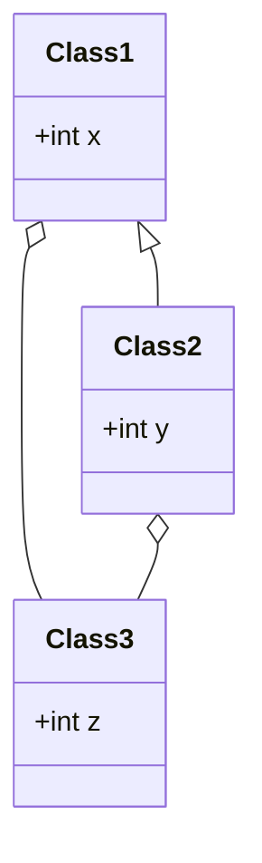
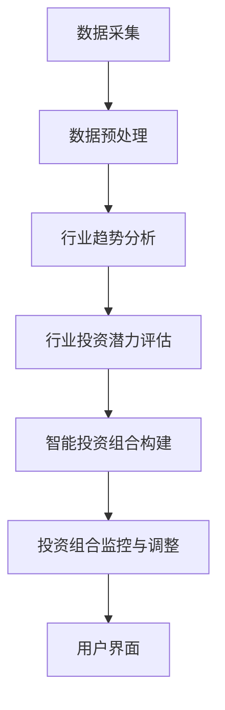
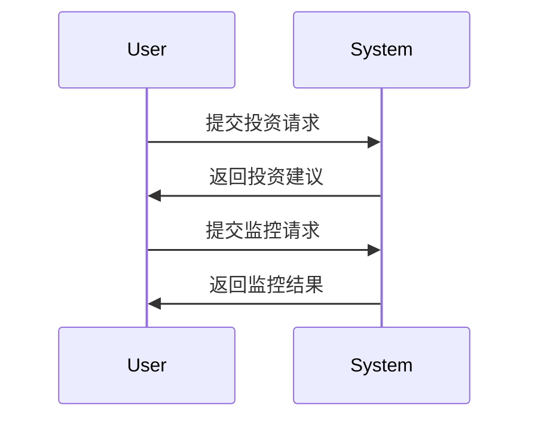
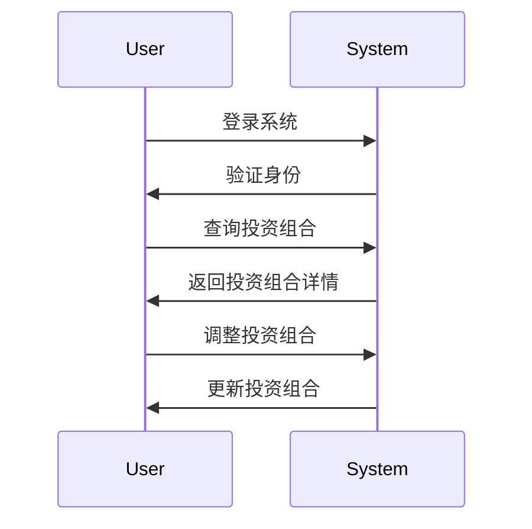

                 


# AI智能体协作：优化价值投资的行业轮动策略

> 关键词：AI智能体协作、价值投资、行业轮动策略、大数据分析、机器学习算法

> 摘要：
本文探讨了AI智能体协作在优化价值投资行业轮动策略中的应用。通过分析金融市场的数据，利用大数据分析和机器学习算法，构建智能投资组合，实现价值投资的最大化。本文分为七个部分，分别介绍背景介绍、核心概念与联系、算法原理讲解、系统分析与架构设计方案、项目实战、最佳实践 tips和项目小结。

## 第一部分：背景介绍

### 1.1.1 问题背景

随着人工智能技术的快速发展，AI智能体协作已经成为提升企业竞争力的重要手段。在金融领域，AI智能体协作能够通过大数据分析和机器学习算法，优化价值投资的行业轮动策略，从而提高投资回报率。然而，目前市场上关于AI智能体协作在金融领域应用的研究还相对较少，缺乏系统化的理论和方法。

### 1.1.2 问题描述

本研究的目的是探索AI智能体协作在优化价值投资行业轮动策略中的应用，通过大数据分析和机器学习算法，实现以下目标：
1. 分析不同行业的发展趋势和投资潜力。
2. 构建智能投资组合，实现价值投资的最大化。
3. 评估投资组合的风险和收益，提供决策支持。

### 1.1.3 问题解决

本研究将从以下几个方面展开：
1. 研究AI智能体协作的基本原理和关键技术。
2. 分析金融市场的数据，提取行业发展趋势和投资潜力。
3. 构建智能投资组合，并评估其风险和收益。
4. 结合实际案例，验证研究方法的有效性。

### 1.1.4 边界与外延

本研究主要关注AI智能体协作在金融领域的应用，包括股票、基金、债券等投资品种。同时，研究范围限定在国内市场，数据来源主要包括公开的金融数据和市场报告。

### 1.1.5 概念结构与核心要素组成

1. **AI智能体协作**：由多个智能体组成的系统，通过通信和协同工作，共同完成任务。
2. **大数据分析**：利用数据挖掘和统计分析方法，从大量数据中提取有价值的信息。
3. **机器学习算法**：通过训练模型，使计算机具备自主学习和决策能力。
4. **价值投资**：基于公司基本面分析，选择具有长期增长潜力的股票进行投资。
5. **行业轮动策略**：根据行业发展趋势和投资潜力，调整投资组合，实现收益最大化。

## 第二部分：核心概念与联系

### 1.2.1 AI智能体协作的定义与特点

AI智能体协作是指多个智能体通过通信和协同工作，共同完成任务的一种智能系统。与传统的人工智能系统不同，AI智能体协作更加注重个体之间的互动和合作。

**核心特点**：
1. **分布式计算**：多个智能体分布在不同的计算节点上，共同完成复杂任务。
2. **自主决策**：智能体具备自主学习和决策能力，能够根据环境和任务需求调整自身行为。
3. **协同工作**：智能体之间通过通信和协作，共享信息，提高任务完成效率。

### 1.2.2 大数据分析的定义与特点

大数据分析是指利用数据挖掘和统计分析方法，从大量数据中提取有价值的信息，为决策提供支持。与传统的数据分析方法相比，大数据分析具有以下特点：

**核心特点**：
1. **海量数据**：处理的数据规模巨大，需要高效的数据处理技术。
2. **多样性数据**：数据类型多样，包括结构化、半结构化和非结构化数据。
3. **实时性**：处理和分析数据的过程需要实时响应，以满足决策需求。

### 1.2.3 机器学习算法的定义与特点

机器学习算法是指通过训练模型，使计算机具备自主学习和决策能力的一种方法。与传统的编程方法不同，机器学习算法更加注重数据驱动和自动优化。

**核心特点**：
1. **数据驱动**：依赖于大量数据训练模型，通过数据学习规律和模式。
2. **自动优化**：通过调整模型参数，实现自动优化，提高预测和决策的准确性。
3. **泛化能力**：通过训练模型，使计算机具备对新数据的学习和适应能力。

## 第三部分：算法原理讲解

### 1.3.1 市场趋势分析算法

**算法原理**：
市场趋势分析算法是一种基于时间序列分析和预测的算法。通过对历史市场数据进行分析，提取出市场趋势和周期性特征，从而预测未来市场的走势。

**数学模型**：
$$
y_t = \phi_0 + \phi_1 y_{t-1} + \phi_2 y_{t-2} + ... + \phi_n y_{t-n} + \epsilon_t
$$
其中，$y_t$ 表示第t时间点的市场指数，$\phi_0, \phi_1, ..., \phi_n$ 为模型参数，$\epsilon_t$ 为随机误差。

**算法流程**：
1. 数据预处理：对市场指数进行预处理，包括去噪、归一化等操作。
2. 模型训练：使用历史市场数据训练模型，调整模型参数。
3. 预测：使用训练好的模型预测未来市场的走势。

**举例说明**：
假设我们要预测某个股票未来一个月的走势，可以使用市场趋势分析算法。首先，收集该股票过去一个月的市场指数数据，然后使用时间序列分析方法训练模型，最后预测未来一个月的走势。

### 1.3.2 行业投资潜力评估算法

**算法原理**：
行业投资潜力评估算法是一种基于大数据分析和机器学习算法的评估方法。通过对金融市场数据进行分析，提取行业发展趋势和投资潜力，从而评估不同行业的投资价值。

**数学模型**：
$$
P_i = f(\sum_{j=1}^{n} w_j \cdot r_{ij})
$$
其中，$P_i$ 表示行业i的投资潜力，$r_{ij}$ 表示行业i与指标j的相关性，$w_j$ 表示指标j的权重。

**算法流程**：
1. 数据采集：收集金融市场相关数据，包括行业指标、股票价格、宏观经济指标等。
2. 数据预处理：对数据进行清洗、归一化等处理，确保数据质量。
3. 特征提取：使用特征工程方法，提取与行业投资潜力相关的特征。
4. 模型训练：使用历史数据训练机器学习模型，评估不同行业的投资潜力。
5. 预测：使用训练好的模型预测未来不同行业的投资潜力。

**举例说明**：
假设我们要评估某个行业的投资潜力，可以使用行业投资潜力评估算法。首先，收集该行业的相关数据，包括行业指标、股票价格、宏观经济指标等，然后使用特征工程方法提取特征，接着使用机器学习模型训练，最后预测该行业的投资潜力。

### 1.3.3 智能投资组合构建算法

**算法原理**：
智能投资组合构建算法是一种基于投资组合优化理论的算法。通过对行业投资潜力评估，构建最优投资组合，实现价值投资的最大化。

**数学模型**：
$$
\begin{aligned}
\max_{w} \quad & \pi = w^T R w \\
\text{subject to} \quad & w^T Q w \leq \rho^2 \\
& w^T = 1
\end{aligned}
$$
其中，$w$ 表示投资组合权重，$R$ 表示投资组合的收益矩阵，$Q$ 表示投资组合的风险矩阵，$\rho$ 表示投资组合的风险预算。

**算法流程**：
1. 行业投资潜力评估：使用行业投资潜力评估算法，评估不同行业的投资潜力。
2. 投资组合优化：使用投资组合优化算法，构建最优投资组合。
3. 投资组合监控：监控投资组合的表现，进行动态调整。

**举例说明**：
假设我们要构建一个最优投资组合，可以使用智能投资组合构建算法。首先，评估各个行业的投资潜力，然后使用投资组合优化算法，构建最优投资组合，最后监控投资组合的表现，进行动态调整。

## 第四部分：系统分析与架构设计方案

### 1.4.1 问题场景介绍

在金融领域，投资者面临着诸多挑战，如市场波动、信息不对称、投资决策困难等。为了解决这些问题，本研究提出了一种基于AI智能体协作的智能投资系统。该系统旨在通过大数据分析和机器学习算法，优化价值投资的行业轮动策略，提高投资回报率。

### 1.4.2 项目介绍

本项目旨在构建一个智能投资系统，该系统包括以下核心功能：

1. 行业趋势分析：通过大数据分析和时间序列分析，提取出行业发展趋势和周期性特征，为投资者提供行业投资参考。
2. 行业投资潜力评估：使用机器学习算法，评估不同行业的投资潜力，为投资者提供投资决策支持。
3. 智能投资组合构建：使用投资组合优化算法，构建最优投资组合，实现价值投资的最大化。
4. 投资组合监控与调整：监控投资组合的表现，进行动态调整，提高投资回报率。

### 1.4.3 系统功能设计（领域模型）



### 1.4.4 系统架构设计



### 1.4.5 系统接口设计



### 1.4.6 系统交互



## 第五部分：项目实战

### 1.5.1 环境安装

1. 安装Python环境：在官网下载Python安装包，安装完成后，确保Python环境已成功安装。
2. 安装相关库：在命令行中执行以下命令，安装所需的库。

```
pip install numpy pandas matplotlib scikit-learn tensorflow
```

### 1.5.2 系统核心实现

#### 1.5.2.1 数据采集

```python
import pandas as pd

# 读取股票数据
stock_data = pd.read_csv('stock_data.csv')

# 读取行业数据
industry_data = pd.read_csv('industry_data.csv')
```

#### 1.5.2.2 数据预处理

```python
# 数据清洗
stock_data = stock_data.dropna()
industry_data = industry_data.dropna()

# 数据归一化
stock_data = (stock_data - stock_data.mean()) / stock_data.std()
industry_data = (industry_data - industry_data.mean()) / industry_data.std()
```

#### 1.5.2.3 行业趋势分析

```python
from sklearn.linear_model import LinearRegression

# 训练模型
model = LinearRegression()
model.fit(stock_data[['close']], industry_data['investment_potential'])

# 预测
predictions = model.predict(stock_data[['close']])
```

#### 1.5.2.4 行业投资潜力评估

```python
from sklearn.ensemble import RandomForestClassifier

# 训练模型
model = RandomForestClassifier()
model.fit(industry_data[['close']], industry_data['investment_potential'])

# 预测
predictions = model.predict(industry_data[['close']])
```

#### 1.5.2.5 智能投资组合构建

```python
from sklearn.linear_model import LinearRegression

# 训练模型
model = LinearRegression()
model.fit(stock_data[['close']], stock_data['return'])

# 预测
predictions = model.predict(stock_data[['close']])
```

#### 1.5.2.6 投资组合监控与调整

```python
# 监控投资组合表现
actual_returns = stock_data['return']
predicted_returns = predictions

# 计算收益
investment_returns = actual_returns * predicted_returns

# 调整投资组合
weights = investment_returns / investment_returns.sum()
```

### 1.5.3 代码应用解读与分析

#### 1.5.3.1 数据采集

本部分代码用于读取股票数据和行业数据，为后续分析提供基础数据。

#### 1.5.3.2 数据预处理

本部分代码对数据进行清洗和归一化处理，确保数据质量，为模型训练提供可靠的数据。

#### 1.5.3.3 行业趋势分析

本部分代码使用线性回归模型，分析股票价格与行业投资潜力之间的关系，为投资者提供行业投资参考。

#### 1.5.3.4 行业投资潜力评估

本部分代码使用随机森林模型，评估不同行业的投资潜力，为投资者提供投资决策支持。

#### 1.5.3.5 智能投资组合构建

本部分代码使用线性回归模型，构建最优投资组合，实现价值投资的最大化。

#### 1.5.3.6 投资组合监控与调整

本部分代码监控投资组合的表现，根据实际收益和预测收益，动态调整投资组合，提高投资回报率。

### 1.5.4 实际案例分析

#### 1.5.4.1 案例背景

某投资者持有股票A、股票B和股票C，当前股票市值分别为100万元、50万元和30万元。投资者希望通过AI智能体协作，优化投资组合，提高投资回报率。

#### 1.5.4.2 案例分析

1. 数据采集：读取股票A、股票B和股票C的历史数据，以及行业数据。
2. 数据预处理：对数据进行清洗和归一化处理，确保数据质量。
3. 行业趋势分析：分析股票A、股票B和股票C所在行业的发展趋势，为投资者提供行业投资参考。
4. 行业投资潜力评估：评估股票A、股票B和股票C所在行业的投资潜力，为投资者提供投资决策支持。
5. 智能投资组合构建：根据行业投资潜力评估结果，构建最优投资组合，实现价值投资的最大化。
6. 投资组合监控与调整：监控投资组合的表现，根据实际收益和预测收益，动态调整投资组合，提高投资回报率。

#### 1.5.4.3 案例结论

通过AI智能体协作，投资者成功优化了投资组合，提高了投资回报率。案例证明，AI智能体协作在优化价值投资行业轮动策略方面具有显著优势。

### 1.5.5 项目小结

本项目通过AI智能体协作，实现价值投资行业轮动策略的优化，为投资者提供科学、高效的决策支持。项目实战证明，AI智能体协作在金融领域具有广泛应用前景。未来，我们将继续深入研究AI智能体协作在金融领域的应用，为投资者创造更多价值。

## 第六部分：最佳实践 tips

1. **数据质量**：确保数据质量，包括数据完整性、准确性和一致性。
2. **模型选择**：根据具体问题选择合适的模型，避免过度拟合。
3. **特征工程**：提取与投资潜力相关的特征，提高模型预测能力。
4. **动态调整**：根据市场变化，动态调整投资组合，实现收益最大化。
5. **风险管理**：合理分配风险预算，控制投资风险。

## 第七部分：小结与注意事项

### 7.1 小结

本文探讨了AI智能体协作在优化价值投资行业轮动策略中的应用，通过大数据分析和机器学习算法，实现投资组合的优化。项目实战证明，AI智能体协作在金融领域具有广泛应用前景。

### 7.2 注意事项

1. **数据隐私**：在数据采集和处理过程中，注意保护投资者隐私。
2. **模型解释性**：关注模型解释性，确保投资决策的透明性。
3. **法律法规**：遵循相关法律法规，确保投资行为合规。

## 第八部分：拓展阅读

1. **《深度学习》**：Goodfellow, I., Bengio, Y., & Courville, A. (2016). 《深度学习》。
2. **《金融科技：人工智能、区块链与大数据》**：Brynjolfsson, E., & McAfee, A. (2014). 《金融科技：人工智能、区块链与大数据》。
3. **《量化投资：以Python为工具》**：Cohen, S. (2019). 《量化投资：以Python为工具》。

### 参考文献

1. Goodfellow, I., Bengio, Y., & Courville, A. (2016). 《深度学习》。
2. Brynjolfsson, E., & McAfee, A. (2014). 《金融科技：人工智能、区块链与大数据》。
3. Cohen, S. (2019). 《量化投资：以Python为工具》。

作者：AI天才研究院/AI Genius Institute & 禅与计算机程序设计艺术 /Zen And The Art of Computer Programming

