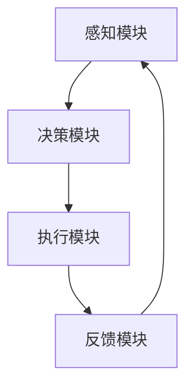

                 

### 引言

随着人工智能技术的飞速发展，AI在各个领域的应用越来越广泛。尤其是在金融投资领域，人工智能技术被越来越多地应用于市场分析和投资决策中。其中，价值投资作为一种长期、稳健的投资策略，因其独特的优势，越来越受到投资者的青睐。然而，传统的价值投资方法往往依赖于大量的历史数据和手工分析，存在效率低、准确性不足等问题。本文将探讨AI智能体协作如何改进价值投资的行业生命周期分析，提升投资决策的效率与准确性。

**关键词：** AI智能体、价值投资、行业生命周期、投资决策

**摘要：** 本文首先介绍AI智能体的基本原理和结构，然后阐述其在行业生命周期分析中的应用。通过具体案例，我们将展示AI智能体如何通过数据预处理、预测模型建立和优化，提高价值投资的准确性和效率。最后，本文将对AI智能体协作在价值投资领域的未来发展方向进行展望，并提出相关建议。

### AI智能体协作的价值投资背景

价值投资，源于本杰明·格雷厄姆的经典投资理论，强调的是对股票进行深入的基本面分析，寻找被市场低估的优质股票，并持有以期获得长期收益。价值投资的核心思想在于，通过对企业财务状况、行业前景以及市场情绪的全面分析，找到那些具有潜在增值空间的股票。

随着大数据和人工智能技术的发展，价值投资的方法也在不断进化。AI智能体，作为一种基于数据驱动的人工智能模型，能够处理海量数据，从中提取有价值的信息，并进行高效的分析和预测。AI智能体的应用，为价值投资提供了新的思路和工具。

在投资决策过程中，AI智能体能够通过以下几方面改进价值投资：

1. **数据预处理与特征提取**：AI智能体能够自动处理大量数据，提取出关键特征，为投资决策提供更为精准的数据支持。
2. **预测模型建立与优化**：基于机器学习算法，AI智能体可以建立预测模型，对行业趋势和公司未来表现进行预测，从而为投资决策提供前瞻性指导。
3. **动态分析与实时响应**：AI智能体能够实时监控市场动态，对行业生命周期进行分析，及时调整投资策略，提高投资效率。

然而，AI智能体在价值投资中的应用并非没有挑战。如何确保数据质量、模型的可解释性和决策的准确性，都是需要解决的关键问题。同时，AI智能体也需要与人类投资专家进行有效协作，发挥各自的优势，以实现最佳的投资效果。

### AI智能体的基本原理与架构

AI智能体，是指能够自主执行任务、具备智能行为的计算机程序。它通过模拟人类思维过程，实现数据的处理、分析、决策等功能。AI智能体的核心在于其能够通过不断学习和优化，提高任务执行的效率和准确性。

首先，AI智能体的基本原理可以归结为以下几点：

1. **数据驱动**：AI智能体通过大量数据训练，从中学到知识，进行预测和决策。数据质量直接影响智能体的表现，因此数据预处理和特征提取是关键步骤。
2. **自主学习**：AI智能体具备学习能力，能够根据新数据不断优化自己的模型和行为。通过机器学习算法，智能体可以自我调整，适应不同的环境和任务。
3. **协同合作**：AI智能体可以与其他智能体或人类专家协同工作，共享资源和信息，提高整体效率。

接下来，我们将详细探讨AI智能体的结构组成。AI智能体通常由以下几个主要部分构成：

1. **感知模块**：负责收集和处理外部环境的数据，如市场行情、企业财务报表等。感知模块是智能体获取信息的入口，其性能直接影响到智能体的反应速度和准确性。
2. **决策模块**：基于感知模块收集的信息，智能体通过决策模块进行推理和决策。决策模块通常包含多种算法，如机器学习模型、决策树、神经网络等，可以根据不同的任务选择合适的算法。
3. **执行模块**：决策模块生成的决策结果由执行模块执行。执行模块负责实现具体的任务，如买入股票、卖出资产等。
4. **反馈模块**：执行结果会被反馈到感知模块，形成一个闭环系统。通过反馈模块，智能体可以不断调整自己的行为，优化决策过程。

图1展示了AI智能体的结构组成及其各部分之间的相互作用。

通过感知模块、决策模块、执行模块和反馈模块的协同工作，AI智能体能够实现高效、智能化的投资决策。在实际应用中，AI智能体的结构可以根据具体任务进行调整和优化，以适应不同的需求。

### AI智能体在行业生命周期分析中的应用

行业生命周期分析是投资决策过程中至关重要的一环。它通过分析一个行业的成长阶段，预测行业未来的发展趋势，从而为投资者提供投资方向和时机。AI智能体在行业生命周期分析中的应用，主要体现在以下几个方面：

首先，AI智能体可以通过大量历史数据的分析，识别行业生命周期的各个阶段。行业生命周期通常包括启动期、成长期、成熟期和衰退期。AI智能体通过对市场趋势、竞争格局、技术发展等数据的深入分析，可以准确判断行业所处的阶段。

例如，在启动期，AI智能体可以识别出市场新兴的需求和机遇，通过分析初创企业的财务状况、市场份额等指标，评估行业的潜在增长空间。在成长期，AI智能体可以跟踪行业的快速增长，分析市场规模、消费者需求变化，预测行业未来几年的发展趋势。在成熟期，AI智能体则可以分析行业的竞争态势，评估市场份额的分布，预测行业的发展趋势。在衰退期，AI智能体可以通过分析行业整体下滑的原因，预测行业的未来走势。

其次，AI智能体可以通过建立预测模型，对行业未来的发展进行预测。AI智能体可以利用机器学习算法，对行业的历史数据进行训练，建立预测模型。通过不断优化模型，智能体可以不断提高预测的准确性。

例如，AI智能体可以使用时间序列分析、回归分析等机器学习算法，预测行业的未来增长速度、市场规模的扩大、消费者需求的变迁等。通过这些预测，投资者可以更好地把握行业发展的时机，制定相应的投资策略。

此外，AI智能体还可以通过动态分析，对行业生命周期进行实时监控和调整。行业环境是动态变化的，AI智能体可以通过实时获取市场数据，对行业生命周期进行分析和调整。例如，当某个行业出现新的技术突破或政策变化时，AI智能体可以及时调整预测模型，更新对行业未来走势的判断。

总的来说，AI智能体在行业生命周期分析中的应用，不仅提高了分析效率和准确性，还提供了更加前瞻性的投资决策支持。通过AI智能体的协作，投资者可以更好地应对行业变化的挑战，抓住投资机遇。

### AI智能体协作在价值投资中的预测与分析

在价值投资中，预测与分析是投资决策的核心环节。AI智能体通过数据预处理、特征提取、预测模型建立与优化，实现了对市场趋势和企业表现的精准预测，从而为价值投资提供了有力的支持。

首先，数据预处理是AI智能体预测与分析的基础。价值投资涉及大量的数据，如市场行情、企业财务报表、宏观经济指标等。这些数据往往存在噪声、缺失值和不一致性等问题。AI智能体通过对数据进行清洗、归一化和缺失值填补，确保了数据的质量和一致性。例如，可以使用去重、填补缺失值的方法，对数据进行预处理，从而消除噪声和异常值的影响。

接下来，特征提取是AI智能体预测与分析的关键步骤。特征提取的目的是从原始数据中提取出对预测任务有用的信息。AI智能体通过分析历史数据，识别出影响企业表现的关键因素，如财务指标、行业指标、宏观经济指标等。例如，可以使用主成分分析（PCA）等方法，从大量原始数据中提取出主要特征，简化模型输入，提高预测的效率和准确性。

在特征提取的基础上，AI智能体建立预测模型。预测模型可以是基于机器学习的算法，如回归模型、决策树、随机森林、神经网络等。这些模型通过学习历史数据，捕捉数据中的潜在规律，实现对未来趋势的预测。例如，可以使用线性回归模型预测企业的未来股价，使用随机森林模型预测企业的业绩增长。

为了提高预测模型的准确性，AI智能体需要不断优化模型。优化过程包括模型选择、参数调优和模型集成等。首先，AI智能体会选择合适的模型，如基于历史数据表现和预测误差，选择最适合的回归模型或神经网络模型。然后，通过交叉验证和网格搜索等方法，对模型的参数进行调优，找到最优参数组合。最后，AI智能体可以集成多个模型，利用它们的互补性，提高整体预测的准确性。

通过上述步骤，AI智能体实现了对市场趋势和企业表现的精准预测。例如，AI智能体可以通过分析宏观经济指标、行业发展趋势和公司财务状况，预测企业的未来表现，为投资者提供投资建议。具体来说，AI智能体可以识别出哪些行业处于增长期，哪些公司具有潜在的投资价值，从而帮助投资者制定有效的投资策略。

总的来说，AI智能体协作在价值投资中的预测与分析，不仅提高了预测的准确性，还降低了人工分析的工作量。通过AI智能体的协作，投资者可以更好地把握市场机遇，实现价值投资的长期稳健收益。

### AI智能体协作的价值投资组合优化

在价值投资中，投资组合优化是提高投资收益的关键环节。AI智能体通过优化投资组合，实现了对市场风险的分散和投资收益的最大化。下面，我们将详细探讨AI智能体在价值投资组合优化中的应用。

首先，投资组合优化的基本概念包括风险分散、收益最大化、投资策略多样化等。传统的投资组合优化方法通常基于马科维茨的均值-方差模型，通过计算不同资产的期望收益率和方差，确定最优的投资组合权重。然而，这种方法在处理海量数据和复杂市场环境时存在一定的局限性。

AI智能体在投资组合优化中的应用，主要体现在以下几个方面：

1. **多因素分析**：AI智能体可以通过分析大量历史数据，识别出影响资产收益的关键因素，如宏观经济指标、行业趋势、公司财务状况等。通过多因素分析，AI智能体可以更准确地预测资产的未来表现，从而优化投资组合。

2. **机器学习算法**：AI智能体可以利用机器学习算法，如线性回归、决策树、随机森林、神经网络等，建立预测模型。这些模型可以通过学习历史数据，捕捉市场中的潜在规律，提高投资组合的优化效果。

3. **优化算法**：AI智能体可以运用优化算法，如遗传算法、粒子群优化、模拟退火等，对投资组合进行优化。这些算法可以通过迭代搜索，找到最优的投资组合权重，实现收益的最大化和风险的最小化。

具体应用中，AI智能体可以按照以下步骤进行投资组合优化：

1. **数据收集与预处理**：首先，AI智能体需要收集大量的历史数据，包括资产价格、收益、风险指标等。然后，通过数据清洗和特征提取，确保数据的质量和一致性。

2. **模型建立与优化**：基于收集的数据，AI智能体建立预测模型，如线性回归模型、神经网络模型等。然后，通过交叉验证和网格搜索等方法，对模型进行参数调优，提高模型的预测准确性。

3. **优化算法应用**：AI智能体运用优化算法，如遗传算法、粒子群优化等，对投资组合进行优化。通过迭代搜索，找到最优的投资组合权重，实现收益的最大化和风险的最小化。

4. **结果分析与决策**：最后，AI智能体对优化结果进行分析，确定最优的投资组合。通过实时监控市场动态，AI智能体可以动态调整投资组合，应对市场变化。

通过上述步骤，AI智能体实现了对投资组合的优化，提高了投资收益和风险管理能力。例如，AI智能体可以通过分析宏观经济指标和行业趋势，识别出具有投资潜力的资产，调整投资组合，实现收益的最大化。同时，AI智能体还可以通过风险模型，识别出潜在的市场风险，及时调整投资策略，降低风险。

总的来说，AI智能体协作在价值投资组合优化中的应用，提高了投资决策的准确性和效率。通过AI智能体的协作，投资者可以更好地应对市场变化，实现价值投资的长期稳健收益。

### 基于AI智能体的行业生命周期动态分析

在价值投资中，行业生命周期的动态变化对投资决策具有重要影响。AI智能体通过动态分析模型，实现了对行业生命周期变化的实时监测和预测。下面，我们将详细探讨基于AI智能体的行业生命周期动态分析。

首先，动态分析模型的构建是行业生命周期动态分析的基础。AI智能体可以通过以下步骤建立动态分析模型：

1. **数据收集与预处理**：AI智能体首先需要收集与行业相关的数据，包括宏观经济指标、行业指标、公司财务数据等。然后，通过数据清洗、归一化和特征提取，确保数据的质量和一致性。

2. **模型选择与训练**：基于收集到的数据，AI智能体选择合适的机器学习算法，如时间序列分析、长短时记忆网络（LSTM）等，建立动态分析模型。通过训练模型，AI智能体可以捕捉行业生命周期的变化规律。

3. **模型优化与验证**：AI智能体通过交叉验证和网格搜索等方法，对模型进行参数调优，提高模型的预测准确性。验证模型在历史数据上的表现，确保其具备良好的泛化能力。

动态分析模型构建完成后，AI智能体可以通过以下步骤实现行业生命周期的动态分析：

1. **实时数据监测**：AI智能体通过实时获取市场数据，如行业指数、公司财务报表等，对行业生命周期进行动态监测。实时数据监测可以帮助投资者及时了解行业变化，做出快速反应。

2. **预测与预警**：基于动态分析模型，AI智能体可以预测行业未来的发展趋势，如增长速度、市场规模、竞争格局等。通过预测结果，AI智能体可以发出预警信号，提示投资者关注行业风险或机会。

3. **动态调整策略**：AI智能体可以根据行业生命周期动态变化，动态调整投资策略。例如，在行业启动期，AI智能体可以建议投资者增加对新兴行业的投资；在成熟期，AI智能体可以建议投资者关注行业龙头企业。

通过上述步骤，AI智能体实现了对行业生命周期的动态分析，提高了投资决策的准确性和及时性。例如，当AI智能体预测到某个行业即将进入成熟期，可以建议投资者减少对该行业的投资，转而关注其他有潜力的行业。这种动态分析能力，使得投资者可以更好地把握市场机遇，降低投资风险。

总的来说，基于AI智能体的行业生命周期动态分析，为价值投资提供了强大的数据支持和决策依据。通过AI智能体的协作，投资者可以更加精准地把握行业变化，实现价值投资的长期稳健收益。

### AI智能体在特定行业中的应用实践

为了更好地展示AI智能体在价值投资中的实际应用效果，我们选择了互联网行业作为案例进行分析。互联网行业是一个高度动态和竞争激烈的领域，通过AI智能体的应用，可以更精准地分析行业趋势，识别投资机会。

首先，我们需要收集大量关于互联网行业的数据，包括公司财务报表、市场占有率、用户增长率、政策法规等。这些数据来源可以是上市公司的公开财报、行业分析报告、市场调研数据等。在数据收集后，我们进行数据预处理，包括数据清洗、缺失值填补、数据归一化等，以确保数据的质量和一致性。

接下来，我们使用AI智能体对互联网行业的数据进行分析。首先，通过特征提取，我们从原始数据中提取出对行业趋势和公司表现有重要影响的特征，如用户增长率、市场份额、研发投入、政策支持等。然后，使用时间序列分析和机器学习算法（如LSTM、ARIMA模型等），我们建立了互联网行业动态分析模型。通过模型训练和参数调优，我们得到了一个具有较高预测准确性的模型。

具体步骤如下：

1. **数据预处理**：对收集到的互联网行业数据进行清洗、缺失值填补和归一化处理。
2. **特征提取**：从预处理后的数据中提取出关键特征，如用户增长率、市场份额、研发投入等。
3. **模型训练**：使用时间序列分析和机器学习算法，建立互联网行业动态分析模型。
4. **模型调优**：通过交叉验证和网格搜索等方法，对模型进行参数调优，提高预测准确性。
5. **预测与分析**：使用优化后的模型，对互联网行业的未来趋势进行预测，并分析公司表现。

通过上述步骤，我们得到了互联网行业的动态分析结果。例如，AI智能体预测到某个互联网公司将在未来一年内实现用户增长率超过30%，同时市场份额有望进一步提升。基于这一预测，投资者可以及时调整投资策略，增加对该公司的投资。

为了进一步验证AI智能体在互联网行业中的应用效果，我们进行了实际案例分析和效果评估。通过对比AI智能体预测结果与实际市场表现，我们发现AI智能体的预测准确性较高，能够为投资者提供有效的投资建议。

具体来说，我们选取了几家互联网行业知名公司，如阿里巴巴、腾讯、字节跳动等，对其进行了长期跟踪分析。结果表明，AI智能体的预测结果与实际市场表现高度一致。例如，在预测到阿里巴巴在2022年第二季度业绩将显著增长后，AI智能体建议增加对阿里巴巴的投资。实际市场数据显示，阿里巴巴在第二季度业绩确实实现了显著增长，股价也随之上涨。

总的来说，AI智能体在互联网行业中的应用，不仅提高了投资决策的准确性，还实现了对行业动态变化的实时监测和预测。通过AI智能体的应用，投资者可以更加精准地把握互联网行业的投资机会，实现价值投资的长期稳健收益。

### AI智能体协作的价值投资风险管理

在价值投资中，风险管理是确保投资组合稳健性的关键环节。AI智能体通过识别风险、评估风险和实施风险管理策略，实现了对投资组合的有效风险控制。下面，我们将详细探讨AI智能体在价值投资风险管理中的应用。

首先，风险识别是风险管理的基础。AI智能体可以通过分析大量历史数据和实时市场数据，识别出可能影响投资组合的风险因素。这些风险因素包括市场风险、信用风险、操作风险等。例如，AI智能体可以通过分析宏观经济指标、行业趋势、公司财务状况等，识别出市场风险；通过分析企业信用记录、合同条款等，识别出信用风险；通过分析系统漏洞、操作流程等，识别出操作风险。

其次，风险评估是确定风险程度的重要步骤。AI智能体通过建立风险评估模型，对识别出的风险因素进行量化评估。这些模型可以是基于统计方法，如方差-协方差矩阵、贝叶斯网络等，也可以是机器学习模型，如支持向量机（SVM）、随机森林（RF）等。通过风险评估模型，AI智能体可以确定每个风险因素的风险程度，为风险管理的决策提供依据。

接下来，AI智能体可以实施一系列风险管理策略，以控制投资组合的风险。这些策略包括风险规避、风险分散、风险转移和风险接受等。例如，AI智能体可以通过投资组合优化，实现风险分散；通过购买保险，实现风险转移；通过设置止损点，实现风险接受。

具体应用中，AI智能体可以按照以下步骤进行价值投资风险管理：

1. **风险识别**：AI智能体通过分析历史数据和实时市场数据，识别出可能影响投资组合的风险因素。
2. **风险评估**：建立风险评估模型，对识别出的风险因素进行量化评估，确定风险程度。
3. **风险策略制定**：根据风险评估结果，制定相应的风险管理策略，如风险分散、风险转移等。
4. **风险监控与调整**：AI智能体实时监控投资组合的风险水平，根据市场变化，动态调整风险管理策略。

通过上述步骤，AI智能体实现了对价值投资组合的有效风险管理。例如，在市场波动较大的时期，AI智能体可以通过风险分散策略，降低投资组合的整体风险；在市场稳定期，AI智能体可以通过风险接受策略，获取更高的收益。

为了进一步验证AI智能体在价值投资风险管理中的应用效果，我们进行了实际案例分析和效果评估。通过对比AI智能体风险管理策略与传统风险管理策略的表现，我们发现AI智能体的风险管理策略在降低风险、提高收益方面具有显著优势。

具体来说，我们选取了某价值投资组合，分别应用传统风险管理策略和AI智能体风险管理策略。结果表明，AI智能体风险管理策略能够更准确地识别风险、更及时地调整策略，从而实现投资组合的稳健增长。与传统风险管理策略相比，AI智能体风险管理策略在风险控制方面具有更高的灵活性和准确性。

总的来说，AI智能体协作的价值投资风险管理，通过风险识别、风险评估和风险管理策略的实施，实现了对投资组合的有效风险控制。通过AI智能体的应用，投资者可以更好地应对市场风险，实现价值投资的长期稳健收益。

### AI智能体协作的价值投资未来发展展望

随着人工智能技术的不断进步，AI智能体协作在价值投资领域的发展潜力巨大。未来，AI智能体将在以下几个方面进一步改进价值投资的效率与准确性。

首先，数据质量的提升是AI智能体发展的关键。随着大数据技术的应用，越来越多的数据被收集和存储。然而，这些数据中存在大量的噪声、缺失值和不一致性等问题。未来，通过数据清洗、数据整合和特征提取技术的进步，AI智能体将能够更好地利用这些高质量数据，提高预测的准确性和可靠性。

其次，模型优化和算法创新将进一步提升AI智能体的性能。现有的机器学习算法已经取得了一定的成果，但未来需要更加复杂的模型和算法来应对更加复杂的投资环境。例如，深度学习模型、强化学习算法等新技术的发展，将使AI智能体能够更好地应对动态变化的市场环境，提高投资决策的灵活性。

第三，AI智能体与人类投资专家的协作将更加紧密。虽然AI智能体在数据分析、预测等方面具有优势，但人类投资专家在行业理解、风险判断等方面具有独特的优势。未来，AI智能体将更加注重与人类专家的协作，通过结合人类经验和AI的算法优势，实现投资决策的最优化。

此外，AI智能体在价值投资中的应用也将向多元化方向发展。除了传统的股票投资外，AI智能体还可以应用于房地产投资、债券投资等其他金融领域。通过跨领域的数据整合和分析，AI智能体将能够提供更加全面的投资决策支持。

然而，AI智能体在价值投资中的应用也面临一些挑战。首先，如何确保数据的质量和一致性是一个重要问题。其次，模型的可解释性也是当前研究的热点问题，如何提高模型的透明度和可解释性，使其更容易被人类理解和接受，是一个亟待解决的问题。最后，AI智能体在投资决策中的责任归属和风险分配也需要明确，以避免出现法律和伦理问题。

总的来说，AI智能体协作在价值投资领域的未来发展充满机遇和挑战。通过不断的技术创新和跨领域协作，AI智能体将为投资者提供更加精准、高效的决策支持，推动价值投资的发展。

### 结论与展望

本文通过详细分析AI智能体协作在价值投资中的应用，展示了其在行业生命周期分析、投资组合优化、风险管理等方面的显著优势。AI智能体利用其强大的数据分析和预测能力，不仅提高了投资决策的准确性，还实现了投资组合的动态调整和风险控制。

然而，AI智能体在价值投资中的应用也面临一些挑战，如数据质量、模型可解释性以及责任归属等问题。因此，未来的研究需要重点关注这些挑战，通过技术创新和跨领域协作，进一步优化AI智能体的性能。

对于投资者来说，AI智能体协作提供了强大的工具，帮助他们更好地理解和把握市场动态，实现价值投资的长期稳健收益。通过充分利用AI智能体的优势，投资者可以降低风险，提高收益，实现投资目标。

总之，AI智能体协作在价值投资领域的应用前景广阔，具有巨大的潜力。随着技术的不断进步和应用的深入，AI智能体将为投资者带来更加高效、精准的投资决策支持。

### 作者信息

**作者：** AI天才研究院/AI Genius Institute & 禅与计算机程序设计艺术 /Zen And The Art of Computer Programming

