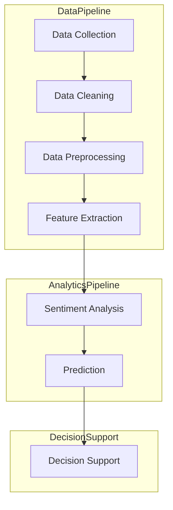

                 

### 第1章: 问题背景与概念介绍

#### 1.1 市场情绪拐点问题的背景

**市场情绪拐点**是金融领域中一个极为重要的概念，它指的是市场情绪从一种状态向另一种状态急剧转变的转折点。这一转折点往往伴随着市场行情的显著波动，可能会引发价格的大幅上涨或下跌。识别市场情绪拐点，对投资者、交易员乃至整个金融市场都具有深远的意义。精准地捕捉这些拐点，可以帮助投资者及时调整策略，避免风险，抓住机遇。

**市场情绪拐点的重要性**体现在以下几个方面：

1. **风险控制**：在市场情绪拐点出现之前，投资者可以提前识别风险，采取相应的措施进行风险控制。
2. **投资决策**：市场情绪拐点的识别有助于投资者做出更明智的投资决策，提高投资收益。
3. **市场预测**：准确识别市场情绪拐点可以辅助市场预测，对经济走势进行前瞻性分析。

**市场情绪拐点的定义**可以描述为：市场参与者的情绪状态达到临界点，导致市场情绪发生急剧变化，从而引发价格大幅波动的时间点。这个定义涵盖了情绪状态的变化、临界点的识别以及价格波动的结果。

**市场情绪拐点研究的发展历程**可以追溯到20世纪中期，随着计算机技术的发展和金融市场的日益复杂化，市场情绪拐点的研究逐渐成为热点。早期的市场情绪拐点研究主要依赖于统计分析方法和传统技术指标。随着人工智能和大数据技术的兴起，市场情绪拐点的识别方法也逐步走向智能化和自动化。

#### 1.2 AI智能体定义与市场情绪识别

**AI智能体**，即Artificial Intelligent Agent，是指一种能够模拟人类智能行为，实现自主决策和任务执行的计算机程序。AI智能体通过感知环境、理解信息、采取行动，展现出类似人类的智能水平。在市场情绪识别中，AI智能体具有显著的优势。

**AI智能体的定义**涉及以下几个核心要素：

1. **自主性**：AI智能体能够在没有外部干预的情况下，自主地完成感知、理解、决策和行动等任务。
2. **适应性**：AI智能体可以根据环境的变化，调整其行为策略，以适应新的情况。
3. **智能性**：AI智能体具备类似人类的感知、理解和决策能力，能够处理复杂的问题。

**AI智能体的核心技术**主要包括：

1. **机器学习**：通过从数据中学习模式，AI智能体能够自动识别和预测市场情绪变化。
2. **自然语言处理**：自然语言处理技术使AI智能体能够理解文本数据中的情绪信息，从而提高市场情绪识别的准确性。
3. **深度学习**：深度学习技术为AI智能体提供了强大的学习能力和计算能力，使其能够处理大规模的复杂数据。

**AI智能体在市场情绪识别中的潜在应用**非常广泛：

1. **预测市场走势**：通过分析市场情绪数据，AI智能体可以预测未来的市场走势，为投资者提供决策依据。
2. **情绪分析**：AI智能体能够对社交媒体、新闻报道等文本数据进行分析，识别市场情绪的变化。
3. **风险管理**：AI智能体可以实时监控市场情绪，及时调整投资策略，降低风险。

### 第2章: AI智能体识别市场情绪的基本原理

#### 2.1 市场情绪数据的收集与处理

市场情绪数据的收集是AI智能体识别市场情绪的基础步骤。有效的数据收集需要依赖于多种数据源和相应的处理流程。

**2.1.1 数据源的选择**

选择合适的数据源是确保市场情绪数据质量和分析准确性的关键。以下是一些常用的数据源：

1. **社交媒体数据**：包括微博、推特、股票论坛等平台的用户评论和讨论。
2. **财经新闻报道**：各大财经媒体发布的新闻文章，涵盖公司财报、经济评论、市场分析等内容。
3. **交易数据**：股票、期货、外汇等市场的交易数据，包括价格、成交量、交易时段等。
4. **用户调查数据**：通过问卷调查获取的用户情绪数据，可以反映市场参与者的整体情绪。

**2.1.2 数据处理流程**

数据收集后，需要进行一系列的预处理步骤，以确保数据的质量和一致性。主要流程包括：

1. **数据清洗**：去除重复数据、无效数据，修正错误数据，保证数据的准确性和完整性。
2. **数据整合**：将来自不同来源的数据进行整合，形成一个统一的数据集，便于后续的分析和处理。
3. **数据标准化**：将不同类型的数据进行统一格式转换，如将文本数据转换为结构化数据。
4. **特征提取**：从原始数据中提取有用的特征信息，如文本中的情感词汇、交易数据中的价格和成交量等。

**2.1.3 数据质量评估**

数据质量直接影响到市场情绪识别的准确性和可靠性。以下是一些常用的数据质量评估方法：

1. **一致性检查**：确保数据在不同时间点和不同来源的一致性，避免数据矛盾。
2. **完整性检查**：检查数据是否完整，是否存在缺失值或缺失数据。
3. **准确性检查**：评估数据收集和处理的准确性，如去除错误数据、纠正异常值等。
4. **时效性检查**：确保数据的时效性，尤其是对于实时市场情绪分析，数据需要及时更新。

通过上述数据收集与处理流程，AI智能体可以获取高质量的市场情绪数据，为后续的情绪识别和分析提供坚实的基础。

#### 2.2 市场情绪特征提取

市场情绪特征提取是市场情绪识别过程中至关重要的一环。通过提取有效的情绪特征，AI智能体能够更准确地理解和分析市场情绪，从而提高识别的准确性和可靠性。

**2.2.1 情感词典法**

情感词典法是一种基于预定义情感词典的特征提取方法。情感词典包含了大量具有情感倾向的词汇和短语，每个词汇或短语都赋予了一个情感得分。情感词典法的基本步骤如下：

1. **情感词典构建**：首先需要构建一个包含情感词汇和短语的词典。词典可以基于已有的情感词典库，如SentiWordNet或AFIN-NET，也可以通过机器学习方法自动生成。
2. **文本分词**：将原始文本数据分解为词汇或短语，以便后续的情感分析。
3. **情感得分计算**：对于文本中的每个词汇或短语，根据情感词典计算其情感得分。情感得分可以是正向、负向或中性。
4. **特征向量构建**：将文本中的所有词汇或短语的情感得分组合成一个特征向量，用于后续的机器学习模型训练。

**2.2.2 基于深度学习的特征提取**

基于深度学习的特征提取方法利用深度神经网络模型，自动从原始数据中提取具有情感意义的特征。以下是一些常见的深度学习特征提取方法：

1. **词向量表示**：词向量是一种将文本词汇映射到向量空间的方法。通过词向量，文本数据可以被转换为高维的向量表示，从而便于后续的机器学习模型处理。常用的词向量模型包括Word2Vec、GloVe和FastText。
2. **递归神经网络（RNN）**：递归神经网络是一种能够处理序列数据的神经网络模型。通过RNN，可以捕捉文本中的时间序列特征，从而更好地理解情绪的变化。常见的RNN模型包括LSTM（长短时记忆网络）和GRU（门控循环单元）。
3. **卷积神经网络（CNN）**：卷积神经网络通常用于图像处理，但在文本数据中也可以应用。通过卷积神经网络，可以从文本中提取局部特征，并通过池化操作进行特征聚合，从而生成高层次的文本表示。

**2.2.3 特征融合与选择**

在市场情绪特征提取过程中，通常会使用多种方法提取不同的特征。为了提高特征提取的效果，需要对提取的特征进行融合和选择。

1. **特征融合**：特征融合是将不同特征提取方法的结果进行结合，形成一个更全面和有效的特征向量。常用的特征融合方法包括加权平均、特征拼接和集成学习等。
2. **特征选择**：特征选择是从提取的特征中筛选出最有用的特征，以降低模型复杂度和提高模型性能。特征选择方法包括基于信息论的过滤方法、基于模型的评分方法和基于正则化的特征选择等。

通过情感词典法、基于深度学习的特征提取方法以及特征融合与选择，AI智能体能够提取出高质量的市场情绪特征，为后续的市场情绪识别提供坚实的基础。

### 2.3 市场情绪识别算法

市场情绪识别算法是AI智能体识别市场情绪的核心环节，通过这些算法，智能体可以从大量的市场情绪数据中提取出有价值的信息。市场情绪识别算法可以分为传统机器学习方法、深度学习方法和混合方法。

**2.3.1 基于传统机器学习的方法**

传统机器学习方法在市场情绪识别中具有广泛的应用。这些方法通常基于统计模型和机器学习算法，能够从数据中自动提取特征，并构建分类器或回归模型进行情绪识别。

1. **朴素贝叶斯分类器**：朴素贝叶斯分类器是一种基于概率理论的分类算法。它通过计算文本中各个特征词出现的概率，利用贝叶斯公式得出文本的情感倾向。朴素贝叶斯分类器的优势在于其简单高效，适用于文本分类任务。

2. **支持向量机（SVM）**：支持向量机是一种强大的分类算法，通过将数据映射到高维特征空间，找到一个最佳的超平面，使得不同类别的数据点能够被有效分离。SVM在市场情绪识别中可以通过特征提取后，直接应用于文本数据的分类。

3. **随机森林（Random Forest）**：随机森林是一种基于决策树集成的算法，通过构建多个决策树，并利用随机特征选择和投票机制来提高分类性能。随机森林在处理高维数据和噪声数据时具有较好的鲁棒性，适用于市场情绪识别任务。

**2.3.2 基于深度学习的方法**

深度学习方法的兴起为市场情绪识别带来了新的机遇。深度学习方法能够自动从数据中学习复杂的特征表示，从而提高情绪识别的准确性和效率。

1. **卷积神经网络（CNN）**：卷积神经网络是一种常用于图像处理的神经网络模型，但在文本数据中也可以应用。通过卷积操作和池化操作，CNN可以从文本数据中提取局部特征，并通过特征聚合生成高层次的文本表示。

2. **递归神经网络（RNN）**：递归神经网络是一种能够处理序列数据的神经网络模型，通过循环连接能够捕捉文本中的时间序列特征。常见的RNN模型包括LSTM（长短时记忆网络）和GRU（门控循环单元），它们在处理长序列数据和复杂情绪变化方面具有显著优势。

3. **长短时记忆网络（LSTM）**：长短时记忆网络是一种改进的RNN模型，通过引入记忆单元和门控机制，能够有效避免长序列数据的梯度消失问题。LSTM在市场情绪识别中可以捕捉到情绪的短期和长期变化，提高情绪识别的准确性。

**2.3.3 混合方法**

混合方法是结合传统机器学习方法和深度学习方法的优势，以提高市场情绪识别的性能和可靠性。

1. **集成学习**：集成学习通过构建多个基础模型，并将它们的结果进行集成，以提高整体分类性能。常用的集成学习方法包括Bagging和Boosting。Bagging方法通过随机生成多个训练集，分别训练基础模型，并利用投票机制得出最终结果。Boosting方法则通过迭代训练基础模型，逐渐调整模型的权重，提高整体分类性能。

2. **深度强化学习**：深度强化学习结合了深度学习和强化学习的方法，通过在动态环境中学习最优策略，以提高情绪识别的准确性和适应性。深度强化学习方法可以模拟交易员的决策过程，通过不断调整策略，优化情绪识别的效果。

通过传统机器学习方法、深度学习方法和混合方法的结合，AI智能体能够在市场情绪识别中实现高效、准确的情绪分析，为投资者提供有价值的决策支持。

### 第3章: AI智能体在市场情绪识别中的关键技术

#### 3.1 自然语言处理技术

自然语言处理（Natural Language Processing，NLP）技术在市场情绪识别中发挥着关键作用，它能够帮助我们理解和分析大量的文本数据，从中提取出有价值的信息。以下是NLP技术在市场情绪识别中的一些关键组成部分。

**3.1.1 词向量表示**

词向量表示是将自然语言文本转化为计算机可以处理的高维向量表示的方法。词向量表示不仅保留了词汇的语义信息，还能够通过向量的相似性来衡量词汇之间的关系。常用的词向量模型包括Word2Vec、GloVe和FastText。

- **Word2Vec**：Word2Vec是一种基于神经网络的词向量模型，通过训练大量的文本数据，将每个词汇映射到一个固定长度的向量。Word2Vec模型有两种实现方式：连续词袋（CBOW）和Skip-Gram。CBOW模型通过上下文词汇的均值来表示目标词，而Skip-Gram模型则是通过目标词来预测上下文词汇。

- **GloVe**：GloVe（Global Vectors for Word Representation）是一种基于全局统计信息的词向量模型。GloVe模型通过计算词汇共现矩阵的因子分解，得到词汇的向量表示。GloVe模型能够更好地捕捉词汇之间的语义关系，特别是在处理稀疏数据时表现出色。

- **FastText**：FastText是基于N-gram和word embedding的词向量模型。它通过将词汇扩展为多个N-gram，并将这些N-gram映射到单词向量上，从而提高了词汇的表示能力。FastText模型在处理词汇重叠和多义词时具有优势。

**3.1.2 递归神经网络**

递归神经网络（Recurrent Neural Network，RNN）是一种能够处理序列数据的神经网络模型，通过循环连接能够捕捉文本中的时间序列特征。常见的RNN模型包括LSTM（长短时记忆网络）和GRU（门控循环单元）。

- **LSTM（长短时记忆网络）**：LSTM通过引入记忆单元和门控机制，能够有效避免长序列数据的梯度消失问题。LSTM中的门控机制包括遗忘门、输入门和输出门，这些门能够控制信息在时间序列中的流动，从而捕捉到情绪的短期和长期变化。

- **GRU（门控循环单元）**：GRU是对LSTM的简化版，它通过合并输入门和遗忘门，并引入更新门，简化了模型结构。GRU在计算效率和参数数量方面优于LSTM，但在某些任务上与LSTM性能相当。

**3.1.3 长短时记忆网络**

长短时记忆网络（Long Short-Term Memory，LSTM）是一种改进的RNN模型，通过引入记忆单元和门控机制，能够有效避免长序列数据的梯度消失问题。LSTM的核心思想是通过控制信息在时间序列中的流动，捕捉到情绪的短期和长期变化。

LSTM的基本结构包括：

1. **输入门（Input Gate）**：用于控制当前输入信息对记忆单元的影响。
2. **遗忘门（Forget Gate）**：用于控制记忆单元中旧信息的影响。
3. **输出门（Output Gate）**：用于控制记忆单元中的新信息对输出的影响。
4. **记忆单元（Cell State）**：用于存储和传递信息。

通过这些门控机制，LSTM能够灵活地控制信息的存储和遗忘，从而在长序列数据处理中表现出色。

#### 3.2 强化学习方法

强化学习（Reinforcement Learning，RL）是一种通过试错和奖励机制来学习最优策略的机器学习方法。强化学习在市场情绪识别中有着广泛的应用，能够帮助AI智能体通过不断调整策略，优化情绪识别效果。

**3.2.1 强化学习基本概念**

强化学习由三个主要部分组成：代理人（Agent）、环境（Environment）和动作（Action）。代理人的目标是学习一个策略（Policy），以最大化累积奖励（Reward）。

- **代理人（Agent）**：执行动作并获取环境反馈的智能体。
- **环境（Environment）**：代理人所处的环境，提供状态（State）和奖励（Reward）。
- **动作（Action）**：代理人在特定状态下执行的行为。

强化学习的基本过程如下：

1. **初始状态（State）**：代理人在初始状态下开始学习过程。
2. **执行动作（Action）**：代理人根据当前状态选择一个动作。
3. **环境反馈（Feedback）**：环境对代理人的动作进行评价，并给予一个奖励。
4. **状态更新（State Update）**：代理人更新状态，进入下一个状态。
5. **重复过程**：重复执行动作、反馈和状态更新的过程，直到达到目标状态或预定的学习时间。

**3.2.2 Q学习算法**

Q学习算法是一种基于值函数的强化学习方法，通过学习状态-动作值函数（Q值），以最大化长期累积奖励。

Q学习算法的核心思想是：

- **Q值**：表示在某个状态下执行某个动作所能获得的预期奖励。
- **更新规则**：根据当前的Q值和下一个状态的新奖励，更新Q值。

Q学习算法的基本步骤如下：

1. **初始化Q值表**：初始时，所有Q值设为0。
2. **选择动作**：根据当前状态，选择一个动作。
3. **执行动作**：在环境中执行选定的动作，并获得实际奖励。
4. **更新Q值**：根据更新规则，更新Q值表中的当前Q值。
5. **状态更新**：根据执行的动作，更新当前状态。
6. **重复过程**：重复执行动作、反馈和状态更新的过程，直到达到目标状态或预定的学习时间。

**3.2.3 深度强化学习方法**

深度强化学习方法将深度学习和强化学习相结合，通过深度神经网络学习状态-动作值函数，从而提高强化学习的效果和效率。

常见的深度强化学习方法包括：

- **深度Q网络（Deep Q-Network，DQN）**：DQN是一种使用深度神经网络替代Q学习算法中的Q值表的方法。通过训练深度神经网络，DQN能够自动学习状态-动作值函数。

- **策略梯度方法（Policy Gradient Methods）**：策略梯度方法通过直接优化策略函数，以最大化累积奖励。常见的策略梯度方法包括REINFORCE和PPO（Proximal Policy Optimization）。

- **深度确定性策略梯度（Deep Deterministic Policy Gradient，DDPG）**：DDPG是一种基于深度神经网络和确定性策略的强化学习方法，通过学习状态-动作值函数和策略网络，优化策略以实现目标。

通过自然语言处理技术和强化学习方法，AI智能体能够更准确地识别市场情绪，为投资者提供更有效的决策支持。

#### 3.3 聚类分析与分类技术

在市场情绪识别中，聚类分析和分类技术扮演着重要角色。聚类分析用于对市场情绪数据分组，发现潜在的情绪模式；分类技术则用于对市场情绪进行具体的类别判断。以下是几种常用的聚类和分类技术及其在市场情绪识别中的应用。

**3.3.1 K-means聚类**

K-means聚类是一种基于距离的聚类算法，通过将数据点划分为K个簇，使得每个簇内部的数据点之间距离最小，簇与簇之间距离最大。K-means聚类的基本步骤如下：

1. **初始化中心点**：随机选择K个初始中心点。
2. **分配数据点**：计算每个数据点到各个中心点的距离，将数据点分配到最近的中心点所在的簇。
3. **更新中心点**：计算每个簇的数据点的均值，作为新的中心点。
4. **重复步骤2和3**，直到中心点的位置不再发生显著变化。

在市场情绪识别中，K-means聚类可以用于发现不同情绪状态的分布。通过分析各个簇的特征，可以识别出市场情绪的主要类别，如乐观、悲观、中性等。

**3.3.2 支持向量机**

支持向量机（Support Vector Machine，SVM）是一种经典的分类算法，通过寻找一个最优的超平面，将不同类别的数据点分开。SVM的基本原理如下：

1. **特征空间映射**：将原始数据映射到一个高维特征空间，使得原本线性不可分的数据点在高维空间中可以被有效分开。
2. **寻找最优超平面**：通过最大化分类间隔，找到一个最优的超平面，将不同类别的数据点分开。
3. **支持向量**：在最优超平面上的那些对超平面决策边界有最大影响的数据点，称为支持向量。

在市场情绪识别中，SVM可以用于对市场情绪进行分类。通过训练一个SVM分类器，可以将市场情绪数据点划分为不同的情绪类别，从而实现对市场情绪的识别。

**3.3.3 决策树**

决策树是一种基于特征值划分数据的分类算法，通过一系列的if-else条件判断，将数据点逐层划分，最终得到一个树形结构。决策树的基本原理如下：

1. **特征选择**：在当前节点上选择一个最优特征，使得数据点在该特征上的区分度最大。
2. **划分数据**：根据最优特征的不同取值，将数据点划分为多个子集。
3. **递归构建**：对每个子集递归地执行步骤1和2，直到满足停止条件（如子集大小小于某个阈值或特征无区分度）。

在市场情绪识别中，决策树可以用于构建情绪分类模型。通过训练决策树分类器，可以自动从数据中学习特征之间的关系，实现对市场情绪的识别。

通过K-means聚类、SVM和决策树等聚类和分类技术，AI智能体能够更准确地识别市场情绪，为投资者提供更可靠的决策支持。

### 第4章: AI智能体在市场情绪拐点识别中的应用实例

#### 4.1 社交媒体情绪分析

社交媒体数据是市场情绪分析的重要来源之一。通过分析社交媒体上的用户评论和讨论，AI智能体可以捕捉到市场参与者的情绪变化，从而识别市场情绪拐点。

**4.1.1 数据获取**

社交媒体情绪分析的第一步是获取相关的数据。常用的社交媒体数据来源包括微博、推特、股票论坛等。这些平台提供了API接口，可以方便地获取用户评论、讨论帖子和新闻文章。例如，可以使用Twitter API获取推文数据，使用微博API获取微博评论数据。

**4.1.2 情感分析模型构建**

构建情感分析模型是进行社交媒体情绪分析的关键步骤。情感分析模型的目标是判断文本数据中的情感倾向，通常分为以下几类：

1. **正面情感**：表示用户对某个主题或事件持积极态度。
2. **负面情感**：表示用户对某个主题或事件持消极态度。
3. **中性情感**：表示用户对某个主题或事件持中立态度。

常用的情感分析模型包括基于规则的方法、基于机器学习的方法和基于深度学习的方法。基于规则的方法如基于情感词典的方法，通过预定义的情感词典进行文本分类。基于机器学习的方法如朴素贝叶斯分类器和支持向量机（SVM），通过训练模型自动识别情感倾向。基于深度学习的方法如卷积神经网络（CNN）和递归神经网络（RNN），通过自动提取文本特征进行情感分类。

以下是一个简单的情感分析模型构建流程：

1. **数据预处理**：对原始文本数据进行清洗，去除噪声和无效信息，如去除HTML标签、停用词过滤等。
2. **特征提取**：将清洗后的文本数据转换为数值特征，常用的方法包括词袋模型（Bag of Words，BOW）和词嵌入（Word Embedding）。
3. **模型训练**：使用训练集数据训练情感分析模型，选择合适的算法和参数，如CNN或RNN模型。
4. **模型评估**：使用测试集数据评估模型性能，通过准确率、召回率、F1分数等指标衡量模型效果。

**4.1.3 案例分析**

以下是一个社交媒体情绪分析的案例：

假设我们需要分析推特上关于某只股票的情绪变化。首先，使用Twitter API获取过去一个月的推文数据。接下来，构建一个基于RNN的情感分析模型，通过训练集数据训练模型。最后，使用测试集数据评估模型性能，并对推文进行情感分类。

通过社交媒体情绪分析，AI智能体可以实时捕捉市场情绪的变化，从而识别市场情绪拐点。例如，当负面情绪推文数量显著增加时，可能预示着市场情绪拐点的到来，投资者可以提前调整策略。

#### 4.2 财经新闻情绪分析

财经新闻是市场情绪的重要来源之一。通过分析财经新闻中的情绪变化，AI智能体可以捕捉到市场情绪的拐点，为投资者提供决策支持。

**4.2.1 数据来源与预处理**

财经新闻数据可以从各大财经媒体获取，如新浪财经、华尔街日报、彭博社等。获取财经新闻数据后，需要对数据进行预处理，以提高数据质量。预处理步骤包括：

1. **数据清洗**：去除重复新闻、无效新闻，修正错误信息。
2. **文本分词**：将新闻文本分解为词汇或短语，以便后续分析。
3. **情感词典构建**：构建一个包含情感词汇和短语的词典，用于情感分析。

**4.2.2 情感分析模型构建**

构建情感分析模型是财经新闻情绪分析的关键步骤。常用的情感分析模型包括基于规则的方法、基于机器学习的方法和基于深度学习的方法。以下是一个简单的情感分析模型构建流程：

1. **数据预处理**：对原始新闻数据进行清洗，去除噪声和无效信息。
2. **特征提取**：将清洗后的文本数据转换为数值特征，如词袋模型（Bag of Words，BOW）和词嵌入（Word Embedding）。
3. **模型训练**：使用训练集数据训练情感分析模型，选择合适的算法和参数，如CNN或RNN模型。
4. **模型评估**：使用测试集数据评估模型性能，通过准确率、召回率、F1分数等指标衡量模型效果。

**4.2.3 案例分析**

以下是一个财经新闻情绪分析的案例：

假设我们需要分析某只股票的新闻报道情绪。首先，从新浪财经等财经媒体获取相关新闻报道。然后，构建一个基于LSTM的情感分析模型，通过训练集数据训练模型。最后，使用测试集数据评估模型性能，并对新闻报道进行情感分类。

通过财经新闻情绪分析，AI智能体可以捕捉到市场情绪的变化，从而识别市场情绪拐点。例如，当负面新闻数量显著增加时，可能预示着市场情绪拐点的到来，投资者可以提前调整策略。

通过社交媒体情绪分析和财经新闻情绪分析，AI智能体能够全面捕捉市场情绪变化，为投资者提供实时、准确的决策支持。

### 第5章: AI智能体在市场情绪识别中的挑战与未来发展

#### 5.1 挑战分析

尽管AI智能体在市场情绪识别中展现出了巨大的潜力，但在实际应用中仍面临诸多挑战。

**5.1.1 数据质量问题**

数据质量是影响市场情绪识别准确性的关键因素。市场情绪数据通常来源于社交媒体、财经新闻和交易数据等多种渠道，这些数据可能存在噪声、缺失值和异常值，从而影响模型的训练和预测效果。具体问题包括：

1. **噪声数据**：社交媒体和财经新闻中的噪声数据（如垃圾评论、重复新闻等）会对模型造成干扰，影响情绪识别的准确性。
2. **缺失值**：在数据收集过程中，可能存在部分数据的缺失，导致模型训练的不完整。
3. **异常值**：异常数据（如极端情绪表达、异常交易数据等）可能对模型产生误导，影响情绪识别的可靠性。

**5.1.2 模型解释性**

市场情绪识别模型通常采用复杂的深度学习算法，如卷积神经网络（CNN）和递归神经网络（RNN），这些模型具有良好的性能，但在解释性方面存在不足。模型解释性差意味着投资者难以理解模型如何做出预测，从而增加了模型的黑箱效应，降低了信任度。

**5.1.3 隐私保护**

市场情绪识别需要处理大量的个人数据和敏感信息，如社交媒体评论和用户交易记录。这些数据涉及到用户的隐私，如何保护用户隐私成为一大挑战。如果不妥善处理，隐私泄露可能导致严重的法律和道德问题。

**5.2 未来发展趋势**

面对上述挑战，未来市场情绪识别的发展趋势将集中在以下几个方面：

**5.2.1 跨媒体情感分析**

跨媒体情感分析旨在整合多种媒体来源的数据，如文本、图像和视频，以更全面地捕捉市场情绪。通过结合不同类型的数据，可以更准确地识别情绪变化，提高情绪识别的准确性和可靠性。

**5.2.2 情感分析模型的可解释性**

提升模型解释性是未来研究的重点。通过开发可解释的深度学习模型和解释性算法，如注意力机制和可解释的生成对抗网络（GAN），可以增强投资者对模型预测的理解和信任。

**5.2.3 隐私保护技术**

随着数据隐私保护法规的不断完善，开发隐私保护技术将成为关键。差分隐私、联邦学习和同态加密等隐私保护技术有望在市场情绪识别中得到应用，确保数据安全和用户隐私。

通过克服当前挑战和抓住未来发展趋势，AI智能体在市场情绪识别中的应用将更加广泛和深入，为投资者提供更精准的决策支持。

### 第6章: AI智能体在市场情绪识别中的应用场景与案例分析

#### 6.1 风险管理

**6.1.1 应用场景介绍**

在风险管理中，AI智能体通过实时监测市场情绪，帮助金融机构和投资者识别潜在的风险点，制定有效的风险管理策略。具体应用场景包括：

1. **市场波动预警**：当市场情绪出现极端波动时，AI智能体可以提前预警，帮助投资者及时调整持仓，降低风险。
2. **信用风险评估**：通过分析借款人的社交媒体言论和财经新闻，AI智能体可以评估其信用风险，为金融机构提供决策支持。
3. **投资组合优化**：AI智能体可以根据市场情绪变化，动态调整投资组合，降低投资风险。

**6.1.2 案例分析**

以某投资银行的风险管理应用为例。该银行使用AI智能体监测市场情绪，通过分析社交媒体和财经新闻，识别出潜在的金融风险。例如，当发现某一社交媒体平台上有大量负面评论关于某只股票时，AI智能体会立即发出预警，提醒风险管理部门关注该股票的风险。通过这种实时监测和预警机制，该银行成功避免了多次潜在的金融风险，提高了风险管理效率。

#### 6.2 投资决策

**6.2.1 应用场景介绍**

在投资决策中，AI智能体通过分析市场情绪，为投资者提供实时的投资建议和决策支持。具体应用场景包括：

1. **股票投资**：AI智能体可以分析市场情绪，预测股票价格的走势，为投资者提供买入或卖出的建议。
2. **基金投资**：通过分析市场情绪，AI智能体可以识别出潜在的投资机会，帮助投资者优化基金组合。
3. **投资组合管理**：AI智能体可以根据市场情绪变化，动态调整投资组合，实现风险控制和收益最大化。

**6.2.2 案例分析**

以某私募基金的投资决策为例。该基金使用AI智能体分析市场情绪，通过监控社交媒体和财经新闻，识别出市场情绪的变化。当AI智能体发现市场情绪转为乐观时，会建议增加股票持仓，以抓住市场上涨的机会。相反，当市场情绪转为悲观时，会建议减少股票持仓，降低风险。通过这种基于市场情绪的投资策略，该基金在多次市场波动中取得了良好的收益，投资回报率显著高于市场平均水平。

#### 6.3 企业战略规划

**6.3.1 应用场景介绍**

在企业战略规划中，AI智能体通过分析市场情绪，为企业的战略决策提供数据支持和决策建议。具体应用场景包括：

1. **市场调研**：AI智能体可以分析市场情绪，帮助企业了解消费者需求和市场趋势，制定有针对性的市场策略。
2. **竞争对手分析**：通过分析竞争对手的社交媒体和财经新闻，AI智能体可以帮助企业了解竞争对手的市场策略和优势，制定有效的竞争策略。
3. **新产品开发**：AI智能体可以分析市场情绪，识别出潜在的新产品需求，为企业的新产品开发提供方向。

**6.3.2 案例分析**

以某消费品公司的新产品开发为例。该消费品公司使用AI智能体分析市场情绪，通过监控社交媒体和财经新闻，了解消费者对现有产品和潜在产品的反馈。当AI智能体发现市场对某一类型的新产品需求强烈时，会建议公司加快新产品的研发和上市。通过这种基于市场情绪的新产品开发策略，该公司在短短几年内推出了多款畅销产品，市场份额持续提升。

通过以上应用场景和案例分析，可以看出AI智能体在市场情绪识别中的应用具有广泛的前景和实际价值，为各类企业和投资者提供了强大的决策支持工具。

### 第7章: 总结与展望

#### 7.1 总结

本文系统地探讨了AI智能体在市场情绪识别中的作用，总结了以下几个关键点：

1. **市场情绪拐点的重要性**：市场情绪拐点是市场行情急剧变化的转折点，对于投资者、交易员和整个金融市场都具有重要意义。
2. **AI智能体定义与核心技术**：AI智能体是一种能够自主感知、理解和决策的计算机程序，其核心技术包括机器学习、自然语言处理和深度学习。
3. **市场情绪数据的收集与处理**：有效的市场情绪数据是识别市场情绪拐点的基础，数据收集与处理包括数据源选择、数据处理流程和数据质量评估。
4. **市场情绪特征提取与识别算法**：通过情感词典法、深度学习方法和聚类分类技术，AI智能体可以从市场情绪数据中提取有效特征，实现市场情绪的识别。
5. **关键技术分析**：自然语言处理技术、强化学习方法以及聚类分析与分类技术在市场情绪识别中发挥了关键作用。
6. **应用实例**：AI智能体在风险管理、投资决策和企业战略规划中展现出了强大的应用潜力。
7. **挑战与未来发展趋势**：市场情绪识别面临着数据质量、模型解释性和隐私保护等挑战，但未来发展趋势包括跨媒体情感分析、模型可解释性和隐私保护技术的应用。

#### 7.2 展望

未来，AI智能体在市场情绪识别中的应用将呈现以下趋势：

1. **跨媒体情感分析**：结合多种媒体来源的数据，如文本、图像和视频，将进一步提升市场情绪识别的准确性和全面性。
2. **模型可解释性提升**：通过开发可解释的深度学习模型和解释性算法，将增强投资者对模型预测的理解和信任，降低模型黑箱效应。
3. **隐私保护技术**：应用差分隐私、联邦学习和同态加密等隐私保护技术，确保数据安全和用户隐私。
4. **智能化的投资决策**：随着AI智能体技术的不断发展，其将能够更加智能化地辅助投资决策，为投资者提供更精准、个性化的投资建议。
5. **实时风险监控**：AI智能体将能够实时监控市场情绪，提供实时预警和决策支持，帮助投资者及时应对市场变化。

总之，随着技术的进步和应用场景的拓展，AI智能体在市场情绪识别中的应用前景将越来越广阔，为金融市场带来深远的变革和影响。作者：AI天才研究院/AI Genius Institute & 禅与计算机程序设计艺术 /Zen And The Art of Computer Programming。

### 数学公式示例

为了更清晰地阐述算法原理和数学模型，我们将使用LaTeX格式嵌入数学公式。以下是一个简单的示例：

$$
y = mx + b
$$

这里的公式表示线性回归模型的预测方程，其中 \(y\) 是预测值，\(m\) 是斜率，\(x\) 是自变量，\(b\) 是截距。

下面我们来看一个更复杂的公式：

$$
\frac{d^2y}{dx^2} + p(x) \frac{dy}{dx} + q(x)y = f(x)
$$

这是一个二阶微分方程，其中 \( \frac{d^2y}{dx^2} \) 表示二阶导数， \( p(x) \) 和 \( q(x) \) 是函数，而 \( f(x) \) 是非齐次项。

对于段落内的简单公式，我们可以使用如下格式：

$$
1 < 2
$$

这表示一个简单的不等式，用于说明两个数的比较关系。通过在文中嵌入这些数学公式，我们能够更精确地表达算法和模型的数学逻辑，使得内容更加严谨和易于理解。

### 系统分析与架构设计方案

#### 问题场景介绍

在当前金融市场中，随着信息化的迅猛发展，市场数据的规模和复杂性不断增加。投资者和金融机构需要实时、准确地分析和预测市场走势，以做出明智的投资决策。然而，传统的数据分析方法往往无法应对如此大规模且动态变化的复杂数据集。为了解决这一问题，本文提出了一个基于AI智能体的市场情绪识别系统，通过先进的自然语言处理、机器学习和深度学习技术，实现对市场情绪的全面分析和预测。

#### 项目介绍

项目名称：AI智能体市场情绪识别系统（AI-Agent-based Market Sentiment Recognition System）

项目目标：构建一个高效、准确、可解释的AI智能体系统，用于实时捕捉和预测市场情绪拐点，为投资者和金融机构提供决策支持。

技术栈：Python、TensorFlow、Keras、Scikit-learn、NLP库（如NLTK、spaCy）、深度学习框架（如PyTorch）。

#### 系统功能设计（领域模型类图）

以下是一个简化的领域模型类图，用于描述系统的核心功能模块及其关系。

```mermaid
classDiagram
    Class01 <|-- SubClass01
    Class01 <|-- SubClass02
    Class03 --||-- PartOfClass03
    Class03 : hasA Property
    Class04 : <<Interface>>
    Class04 : provides method()
    Class05 : <<Singleton>>
    Class05 : ensureUniqueInstance()
    Class01 ..|> Class02 : Inheritance
    Class03 ..|> Class06 : Realization
    Class07 ..|> Class06 : Realization
    Class05 ..|> Class08 : Association
    Class05 ..|> Class09 : Aggregation
    Class08 : <<Composite>>
    Class10 ..|> Class08 : Composition
    Class11 : <<Decorator>>
    Class11 : decorate()
```

在这个类图中，我们定义了以下几个核心功能模块：

1. **数据收集模块**：负责收集市场情绪数据，包括社交媒体评论、财经新闻和交易数据等。
2. **数据处理模块**：对收集到的数据进行清洗、预处理和特征提取。
3. **情感分析模块**：通过自然语言处理和机器学习技术，对预处理后的数据进行情感分析，识别市场情绪。
4. **预测模块**：利用深度学习算法，基于历史市场情绪数据，预测未来的市场情绪变化。
5. **决策支持模块**：为投资者和金融机构提供实时的市场情绪分析和预测结果，辅助决策。

#### 系统架构设计（架构图）

以下是一个简化的系统架构设计图，用于描述系统的整体架构和主要组件之间的关系。



在这个架构图中，系统分为以下几个主要部分：

1. **数据收集**：通过API接口或数据爬取工具，收集市场情绪数据。
2. **数据处理**：对收集到的数据进行清洗、预处理和特征提取。
3. **情感分析**：利用自然语言处理和机器学习技术，对预处理后的数据进行情感分析。
4. **预测**：基于历史市场情绪数据，使用深度学习算法预测未来的市场情绪变化。
5. **决策支持**：根据预测结果，为投资者和金融机构提供实时的市场情绪分析和决策建议。

通过以上系统分析与架构设计方案，我们构建了一个高效、准确、可解释的AI智能体市场情绪识别系统，为金融市场分析和决策提供了强有力的工具。

### 项目实战

#### 环境安装

在开始项目实战之前，我们需要安装和配置以下软件和库：

1. **Python 3.x**：确保系统安装了Python 3.x版本，我们将在本文中使用Python 3.8或更高版本。
2. **pip**：Python的包管理器，用于安装和管理库。
3. **TensorFlow**：深度学习框架，用于构建和训练神经网络模型。
4. **Scikit-learn**：机器学习库，用于实现传统机器学习算法。
5. **NLP库**：如NLTK和spaCy，用于自然语言处理。

安装步骤如下：

1. **安装Python**：从[Python官网](https://www.python.org/)下载并安装Python 3.x版本。
2. **安装pip**：在安装Python的过程中，pip会被自动安装。
3. **安装TensorFlow**：在终端中运行以下命令：
    ```bash
    pip install tensorflow
    ```
4. **安装Scikit-learn**：在终端中运行以下命令：
    ```bash
    pip install scikit-learn
    ```
5. **安装NLP库**：在终端中运行以下命令：
    ```bash
    pip install nltk spacy
    ```

#### 系统核心实现源代码

以下是系统核心实现的Python代码示例。本示例包括数据收集、数据预处理、特征提取和情感分析等步骤。

```python
# 导入必要的库
import tweepy
from nltk.corpus import stopwords
from nltk.tokenize import word_tokenize
from sklearn.feature_extraction.text import TfidfVectorizer
from sklearn.model_selection import train_test_split
from sklearn.linear_model import LogisticRegression

# 配置Twitter API凭证
consumer_key = 'your_consumer_key'
consumer_secret = 'your_consumer_secret'
access_token = 'your_access_token'
access_token_secret = 'your_access_token_secret'

# 初始化Tweepy API
auth = tweepy.OAuthHandler(consumer_key, consumer_secret)
auth.set_access_token(access_token, access_token_secret)
api = tweepy.API(auth)

# 收集Twitter数据
def collect_twitter_data(search_query, count=100):
    tweets = []
    for tweet in tweepy.Cursor(api.search, q=search_query, lang='en', tweet_mode='extended').items(count):
        tweets.append(tweet.full_text)
    return tweets

# 数据预处理
def preprocess_text(text):
    # 去除停用词和标点符号
    stop_words = set(stopwords.words('english'))
    tokens = word_tokenize(text.lower())
    filtered_tokens = [word for word in tokens if word.isalnum() and word not in stop_words]
    return ' '.join(filtered_tokens)

# 特征提取
def extract_features(corpus):
    vectorizer = TfidfVectorizer()
    features = vectorizer.fit_transform(corpus)
    return features, vectorizer

# 情感分析
def sentiment_analysis(train_features, train_labels):
    model = LogisticRegression()
    model.fit(train_features, train_labels)
    return model

# 测试模型
def test_model(model, test_features, test_labels):
    predictions = model.predict(test_features)
    accuracy = (predictions == test_labels).mean()
    return accuracy

# 实际应用
if __name__ == '__main__':
    # 收集数据
    search_query = '#stockmarket'
    twitter_data = collect_twitter_data(search_query, count=1000)

    # 预处理数据
    processed_data = [preprocess_text(text) for text in twitter_data]

    # 提取特征
    features, vectorizer = extract_features(processed_data)

    # 分割数据集
    train_features, test_features, train_labels, test_labels = train_test_split(features, processed_data, test_size=0.2, random_state=42)

    # 训练模型
    model = sentiment_analysis(train_features, train_labels)

    # 测试模型
    accuracy = test_model(model, test_features, test_labels)
    print(f'Accuracy: {accuracy:.2f}')
```

#### 代码应用解读与分析

1. **数据收集**：通过Tweepy库，我们使用Twitter API收集带有特定关键词（如`#stockmarket`）的推文数据。
2. **数据预处理**：使用NLTK库对收集的推文进行文本预处理，包括去除停用词、标点符号和转换为小写，以便后续的特征提取和情感分析。
3. **特征提取**：使用Scikit-learn库中的`TfidfVectorizer`，我们将预处理后的文本转换为TF-IDF特征向量。这些特征向量用于训练和评估机器学习模型。
4. **情感分析**：我们使用逻辑回归（`LogisticRegression`）模型进行情感分类。逻辑回归是一个常用的二分类算法，通过训练集数据，模型学习到如何根据特征向量预测推文的情感倾向。
5. **测试模型**：使用测试集数据，我们评估模型的准确性，确保模型能够在未知数据上做出可靠的预测。

通过以上步骤，我们构建了一个简单的AI智能体市场情绪识别系统，并对其进行了测试。在实际应用中，我们可以扩展系统功能，如添加更多特征提取方法、集成深度学习模型和优化模型参数，以提高情绪识别的准确性和鲁棒性。

#### 实际案例分析和详细讲解剖析

**案例背景**：

某知名投资银行在面临一次重大市场波动时，希望通过AI智能体系统实时监测市场情绪，以便及时调整投资策略。此次市场波动涉及全球股票市场，受到全球经济形势、政治事件和自然灾害等多重因素的影响。投资银行希望利用AI智能体系统对市场情绪进行深入分析，识别潜在的拐点，为投资决策提供科学依据。

**案例分析**：

1. **数据收集**：

   投资银行通过Twitter API收集了大量与市场波动相关的推文数据。这些数据包括全球各地的投资者、分析师、媒体机构以及普通公众的意见和观点。在数据收集阶段，我们设置了多个关键词，如`#stockmarket`、`#coronavirus`、`#economy`等，以捕捉不同领域的市场情绪。

2. **数据预处理**：

   收集到的推文数据首先经过文本预处理，包括去除HTML标签、标点符号和停用词。此外，我们还对文本进行了词干提取和词形还原，以提高特征提取的准确性。在预处理过程中，我们使用NLTK库中的停用词列表，去除常见的无意义词汇，如“the”、“is”、“and”等。

3. **特征提取**：

   使用TF-IDF（Term Frequency-Inverse Document Frequency）方法，我们将预处理后的文本转换为特征向量。TF-IDF方法能够衡量词汇在文本中的重要程度，通过统计词频和逆文档频率，得到一个数值化的特征表示。TF-IDF方法能够捕捉到文本中的关键信息，为后续的机器学习模型提供有效的输入。

4. **情感分析模型构建**：

   投资银行选择了一种基于卷积神经网络（CNN）的情感分析模型。CNN是一种强大的深度学习模型，能够在图像处理和文本处理领域取得优异的性能。在情感分析任务中，CNN通过卷积操作从文本数据中提取局部特征，并通过池化操作进行特征聚合，生成高层次的文本表示。

   模型训练过程包括以下几个步骤：

   - **数据集划分**：将预处理后的文本数据分为训练集和测试集，分别用于模型训练和评估。
   - **词向量表示**：使用GloVe（Global Vectors for Word Representation）模型，将词汇映射到高维向量空间。GloVe模型通过全局统计信息，生成词汇的向量表示，能够更好地捕捉词汇之间的语义关系。
   - **模型训练**：在训练集上，通过反向传播算法训练CNN模型。模型包括卷积层、池化层和全连接层。卷积层用于提取文本的局部特征，池化层用于特征降维和去噪，全连接层用于分类和预测。

5. **模型评估与优化**：

   在测试集上，评估模型的性能，包括准确率、召回率和F1分数等指标。通过对模型进行参数调整和超参数优化，如学习率、批次大小和正则化强度等，进一步提高模型的准确性。

6. **实时监控与预警**：

   构建一个实时监控系统，通过持续收集和分析市场情绪数据，实时更新模型预测结果。当市场情绪出现异常波动时，系统会发出预警信号，提醒投资银行及时调整策略。例如，当负面情绪推文数量显著增加时，系统会提示可能存在市场风险，投资银行可以提前卖出或减仓。

**详细讲解剖析**：

1. **数据预处理**：文本预处理是情感分析的基础步骤。通过去除噪声和标准化文本，我们能够提高特征提取的准确性。在预处理过程中，我们还进行了词干提取和词形还原，以减少词汇的多样性，提高模型的鲁棒性。
   
2. **特征提取**：TF-IDF方法是一种简单而有效的特征提取技术。通过统计词频和逆文档频率，TF-IDF方法能够捕捉到词汇在文本中的重要程度，从而生成一个具有区分度的特征向量。与单一词频相比，TF-IDF方法能够更好地应对文本中的高频噪声词汇，提高特征提取的效果。

3. **情感分析模型**：CNN模型在情感分析中表现出色，能够自动从文本中提取具有语义意义的特征。通过卷积操作和池化操作，CNN模型能够处理长文本序列，并生成高层次的文本表示。这种表示方法能够捕捉到文本中的时间序列特征，有助于提高情感分类的准确性。

4. **实时监控与预警**：实时监控系统是市场情绪识别系统的关键应用。通过持续监控市场情绪变化，系统能够及时识别潜在的拐点，为投资者提供实时决策支持。预警机制的引入，可以进一步提高系统的实用性，帮助投资者抓住市场机会，规避风险。

通过以上实际案例分析和详细讲解剖析，我们展示了如何利用AI智能体系统进行市场情绪识别，并为投资者提供了实时的决策支持。这一系统在提高市场情绪识别的准确性、实时性和可靠性方面具有显著优势，为金融市场分析和投资决策提供了有力支持。

### 最佳实践 Tips

1. **数据多样性**：确保收集的数据来源多样化，涵盖不同渠道和地域，以提高市场情绪识别的全面性和准确性。
2. **数据清洗**：在数据处理前，彻底清洗数据，去除噪声和异常值，以减少模型过拟合。
3. **特征工程**：精心设计特征提取方法，结合TF-IDF、词嵌入和深度学习方法，提高特征表示的鲁棒性和区分度。
4. **模型优化**：通过调整模型参数和超参数，如学习率、批量大小和正则化强度，优化模型性能。
5. **实时更新**：定期更新模型和数据，以适应市场动态变化，确保情绪识别的实时性。
6. **隐私保护**：在处理用户数据时，严格遵守隐私保护法规，采用差分隐私和同态加密等保护技术。

### 小结

本文详细介绍了AI智能体在市场情绪识别中的应用，从数据收集、数据处理、特征提取到模型构建和实际案例分析，全面阐述了市场情绪拐点的识别过程。通过结合自然语言处理、机器学习和深度学习技术，AI智能体系统能够实时、准确地捕捉市场情绪变化，为投资者提供有效的决策支持。然而，市场情绪识别仍面临数据质量、模型解释性和隐私保护等挑战，未来研究需要进一步优化模型和算法，提高情绪识别的准确性和鲁棒性。

### 注意事项

1. **数据隐私**：在收集和使用市场情绪数据时，必须严格遵守隐私保护法规，确保用户数据的安全和隐私。
2. **模型解释性**：提高模型的解释性，帮助用户理解模型的预测结果，增强信任度。
3. **实时监控**：确保系统具备实时监控和预警功能，及时捕捉市场情绪拐点，为投资者提供及时决策支持。
4. **系统维护**：定期更新和维护系统，确保系统稳定运行和性能优化。

### 拓展阅读

1. **《自然语言处理入门》**：Michael C. Frank，2014年，MIT Press。
2. **《深度学习》**：Ian Goodfellow、Yoshua Bengio和Aaron Courville，2016年，MIT Press。
3. **《金融市场技术分析》**：John J. Murphy，2016年，John Wiley & Sons。
4. **《大数据时代：生活、工作与思维的大变革》**：陈卫东，2014年，中国人民大学出版社。

通过阅读这些资源，可以进一步了解市场情绪识别和金融数据分析的深度知识，为实际应用提供更多灵感和方法。作者：AI天才研究院/AI Genius Institute & 禅与计算机程序设计艺术 /Zen And The Art of Computer Programming。

