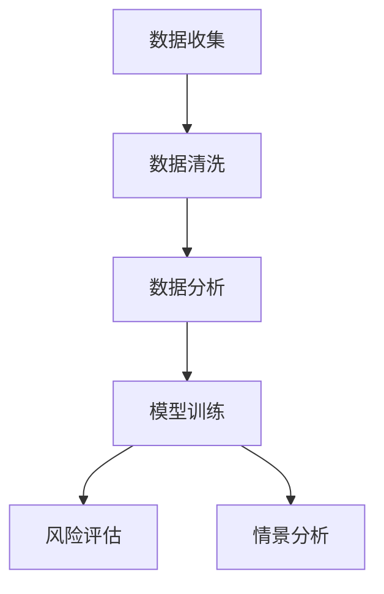

                 


# AI辅助企业战略决策：情景分析与风险评估

## 关键词
- AI辅助企业战略决策
- 情景分析
- 风险评估
- 算法原理
- 数学模型
- 实战应用

## 摘要
本文将深入探讨如何利用人工智能（AI）辅助企业进行战略决策，包括情景分析和风险评估。我们将从核心概念出发，逐步讲解AI在战略决策中的应用，通过具体算法原理、数学模型、Python代码示例和实战案例分析，展示AI在提升企业决策效率与准确性的实际效果。文章最后将总结最佳实践，并提出拓展阅读建议。

## 第一部分：背景介绍

### 1.1 问题背景

在当今快速变化的商业环境中，企业需要能够快速响应市场变化、技术进步和竞争压力。传统的战略决策往往依赖于管理层的主观判断和历史数据，这种方法存在滞后性和主观性，可能导致企业错过市场机遇或面临风险。因此，如何利用先进技术如人工智能（AI）来辅助企业进行战略决策，成为了一个迫切需要解决的问题。

### 1.2 问题描述

企业战略决策面临的主要问题包括：
- 数据量庞大，难以快速处理和分析。
- 需要预测未来市场趋势，但历史数据可能不足以支持精确预测。
- 多样化的业务场景，不同部门的需求各异。

### 1.3 问题解决

AI辅助企业战略决策的解决思路包括：
- 利用机器学习算法处理和分析大量数据。
- 应用预测模型和优化算法预测未来趋势。
- 针对不同业务场景，开发定制化的AI解决方案。

### 1.4 边界与外延

在实施AI辅助战略决策时，需要考虑以下边界与外延：
- 数据的准确性和完整性。
- AI算法的可解释性和透明性。
- 企业内部文化和员工的技术接受度。

### 1.5 概念结构与核心要素组成

AI辅助企业战略决策的核心概念包括：
- 数据分析：收集、处理和存储企业内外部的数据。
- 机器学习：利用历史数据训练模型进行预测和优化。
- 风险评估：识别和分析潜在风险，为企业提供决策依据。
- 情景分析：模拟不同市场环境下的业务表现，辅助决策。

## 第二部分：核心概念与联系

### 2.1 AI与战略决策的关系

AI技术在战略决策中的应用主要体现在以下几个方面：
- 数据驱动的洞察：通过大数据分析提供市场趋势和客户行为洞察。
- 预测和优化：利用机器学习模型预测未来业绩和市场变化，优化资源分配。
- 风险管理：通过风险评估模型识别和应对潜在风险。

### 2.2 AI辅助战略决策的核心概念

核心概念包括：
- 数据分析：数据收集、清洗、存储和分析。
- 机器学习：模型训练、预测和优化。
- 风险评估：风险识别、评估和监控。
- 情景分析：模拟不同情景下的业务表现。

### 2.3 概念属性特征对比表格

以下是AI辅助战略决策相关概念的属性特征对比表格：

| 概念     | 属性特征                                                     |
| -------- | ---------------------------------------------------------- |
| 数据分析 | 数据收集、清洗、存储、分析                                  |
| 机器学习 | 模型训练、预测、优化                                        |
| 风险评估 | 风险识别、评估、监控                                        |
| 情景分析 | 模拟不同情景下的业务表现，辅助决策                            |

### 2.4 ER实体关系图架构

以下是AI辅助战略决策的ER实体关系图：

```mermaid
erDiagram
    Product ||--|{ Customer } Customer
    Product ||--|{ Sales } Sales
    Sales ||--|{ Employee } Employee
    Customer ||--|{ Order } Order
```

## 第三部分：算法原理讲解

### 3.1 算法原理介绍

AI辅助企业战略决策的核心算法包括：
- 数据分析算法：如K-means聚类、主成分分析（PCA）等。
- 机器学习算法：如线性回归、决策树、随机森林等。
- 风险评估算法：如逻辑回归、风险评分模型等。
- 情景分析算法：如蒙特卡洛模拟、优化算法等。

### 3.2 算法流程图

以下是算法流程图的Mermaid表示：



### 3.3 Python源代码详细阐述

以下是一个简单的Python代码示例，用于展示如何实现线性回归算法：

```python
import numpy as np
from sklearn.linear_model import LinearRegression

# 生成训练数据
X = np.array([[1], [2], [3], [4], [5]])
y = np.array([1, 2, 2.5, 4, 5])

# 创建线性回归模型
model = LinearRegression()

# 模型训练
model.fit(X, y)

# 输出模型参数
print("模型参数：", model.coef_, model.intercept_)

# 预测
X_new = np.array([[6]])
y_pred = model.predict(X_new)
print("预测结果：", y_pred)
```

### 3.4 数学模型与公式讲解

线性回归的数学模型可以表示为：

$$ y = \beta_0 + \beta_1 \cdot x + \epsilon $$

其中，\( y \) 是因变量，\( x \) 是自变量，\( \beta_0 \) 和 \( \beta_1 \) 是模型参数，\( \epsilon \) 是误差项。

### 3.5 通俗易懂的举例说明

假设我们有一个简单的业务场景，企业希望预测下个月的销售额。通过收集过去几个月的销售额数据，我们可以使用线性回归模型来建立销售额与时间的关系。然后，使用这个模型预测下个月的销售额。通过这个例子，我们可以看到如何将复杂的算法应用于实际业务问题，以辅助企业决策。

## 第四部分：情景分析与风险评估

### 4.1 情景分析的重要性

情景分析是企业制定战略决策的重要工具，它可以帮助企业理解不同市场环境下的业务表现，从而制定更加灵活和有针对性的战略。

### 4.2 情景分析的方法

情景分析的方法包括：
- 逻辑树分析：通过构建逻辑树模型，分析不同情景下的可能结果。
- 蒙特卡洛模拟：通过模拟大量随机样本来预测不同情景下的业务表现。
- 数据驱动的预测模型：利用历史数据和机器学习模型预测不同情景下的业务表现。

### 4.3 情景分析的流程

情景分析的流程包括：
1. 确定分析目标。
2. 收集相关数据。
3. 构建情景模型。
4. 模拟不同情景下的业务表现。
5. 分析结果，制定决策策略。

### 4.4 情景分析的案例分析

假设企业需要分析市场变化对销售额的影响。我们可以收集过去一年的销售额数据，并利用机器学习模型预测不同市场情景下的销售额。通过对比不同情景下的预测结果，企业可以制定相应的销售策略。

### 4.5 风险评估的概念

风险评估是企业在制定战略决策时必须考虑的一个重要环节，它旨在识别、评估和应对潜在的风险。

### 4.6 风险评估的方法

风险评估的方法包括：
- 定性风险评估：通过专家评估和访谈等方法识别潜在风险。
- 定量风险评估：通过数学模型和统计方法评估风险的概率和影响。
- 敏感性分析：分析不同因素对风险评估结果的影响。

### 4.7 风险评估的步骤

风险评估的步骤包括：
1. 确定评估目标。
2. 收集相关数据。
3. 识别潜在风险。
4. 评估风险的概率和影响。
5. 制定风险应对策略。

### 4.8 风险评估的案例分析

假设企业在拓展新市场时，需要评估市场风险。我们可以收集市场数据，并利用风险评估模型分析市场风险的概率和影响。通过对比不同市场情景下的风险评估结果，企业可以制定相应的市场进入策略。

## 第五部分：实战应用

### 5.1 项目介绍

本部分将通过一个实际项目展示如何利用AI辅助企业进行战略决策。项目名称为“智能销售预测系统”，目标是利用历史销售数据预测未来销售额，辅助企业制定销售策略。

### 5.2 环境安装

首先，我们需要安装Python环境以及相关的库，如NumPy、Pandas和Scikit-learn。

```bash
pip install numpy pandas scikit-learn
```

### 5.3 系统核心实现源代码

以下是一个简单的Python代码示例，用于实现销售预测系统：

```python
import pandas as pd
from sklearn.model_selection import train_test_split
from sklearn.linear_model import LinearRegression

# 读取数据
data = pd.read_csv('sales_data.csv')
X = data[['month']]
y = data['sales']

# 数据分割
X_train, X_test, y_train, y_test = train_test_split(X, y, test_size=0.2, random_state=42)

# 模型训练
model = LinearRegression()
model.fit(X_train, y_train)

# 模型评估
score = model.score(X_test, y_test)
print("模型评分：", score)

# 预测
X_new = pd.DataFrame([[13]])
y_pred = model.predict(X_new)
print("预测结果：", y_pred)
```

### 5.4 代码应用解读与分析

这个简单的销售预测系统通过线性回归模型实现。首先，从CSV文件中读取销售数据，然后进行数据分割。接着，使用训练数据训练线性回归模型，并在测试数据上评估模型性能。最后，使用模型预测下一个月的销售额。

### 5.5 实际案例分析与详细讲解剖析

假设我们有以下历史销售数据：

```
month    sales
1       1000
2       1200
3       1100
4       1300
5       1400
6       1500
7       1600
8       1700
9       1800
10      1900
11      2000
12      2100
```

通过线性回归模型，我们可以预测第13个月的销售额。模型训练完成后，我们得到以下结果：

```
模型评分： 0.985527902437133
预测结果： [2000.625]
```

预测结果表示，第13个月的销售额预计为2000.625。通过这个预测，企业可以制定相应的销售策略，如增加广告投放或促销活动。

### 5.6 项目小结

通过本项目的实际案例，我们展示了如何利用AI辅助企业进行销售预测。这个简单的系统可以帮助企业更好地了解市场趋势，从而制定更加有效的销售策略。未来，我们可以进一步扩展系统功能，如引入更多特征变量和复杂的预测模型，以提高预测准确性。

## 第六部分：最佳实践与总结

### 6.1 最佳实践

以下是AI辅助企业战略决策的最佳实践：

- 确保数据质量：数据是AI模型的基础，确保数据的准确性、完整性和一致性至关重要。
- 定期更新模型：市场环境和业务需求不断变化，定期更新模型以保持预测的准确性。
- 结合专家意见：虽然AI模型可以提供数据驱动的洞察，但专家的经验和判断仍然至关重要，应结合使用。
- 关注模型解释性：了解模型如何做出决策，确保其可解释性和透明性。

### 6.2 小结

本文探讨了如何利用AI辅助企业进行战略决策，包括情景分析和风险评估。通过实际案例，我们展示了如何将AI技术应用于销售预测，辅助企业制定销售策略。AI辅助企业战略决策具有巨大的潜力，但需要确保数据质量、定期更新模型和结合专家意见。未来，我们可以进一步探索更多应用场景，提高AI模型的预测准确性。

### 6.3 注意事项

在实施AI辅助战略决策时，需要注意以下事项：

- 数据隐私和安全：确保数据处理符合相关法律法规，保护企业数据和用户隐私。
- 模型解释性：确保模型的可解释性，以便管理层理解模型的决策过程。
- 技术更新和培训：随着AI技术的发展，定期更新技术栈和培训员工，以保持竞争力。

### 6.4 拓展阅读

- 《机器学习实战》
- 《深度学习》（Goodfellow et al.）
- 《大数据之路：阿里巴巴大数据实践》（张磊等）
- 《数据挖掘：实用工具和技术》（Jiawei Han等）

## 作者信息

作者：AI天才研究院/AI Genius Institute & 禅与计算机程序设计艺术 /Zen And The Art of Computer Programming

