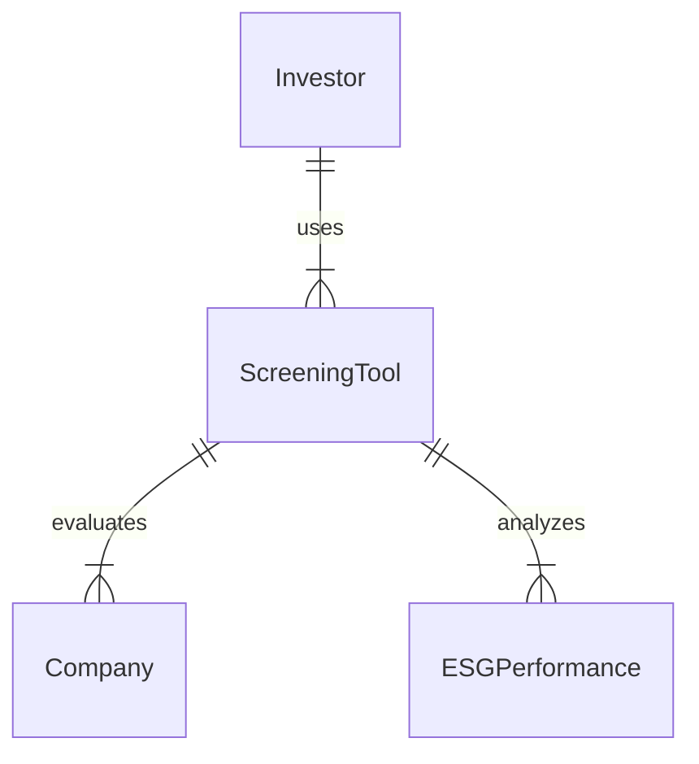
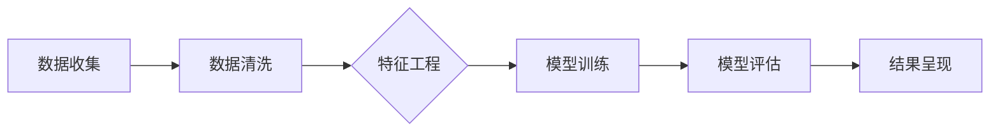
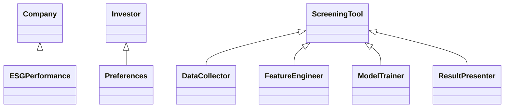
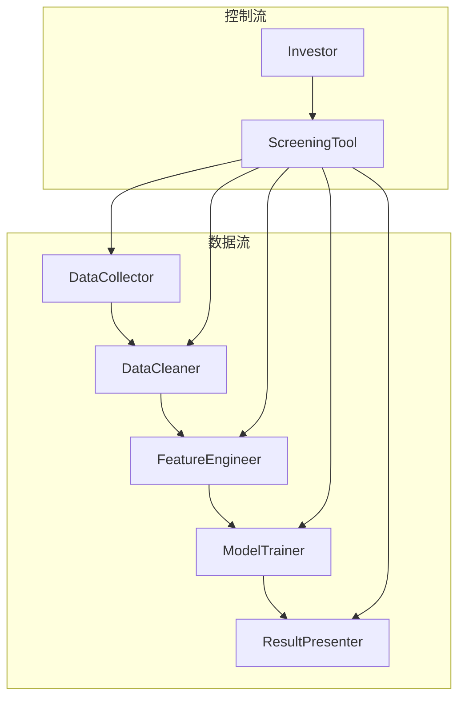
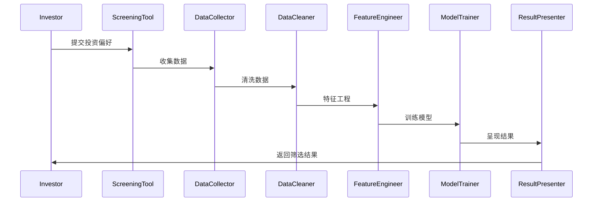
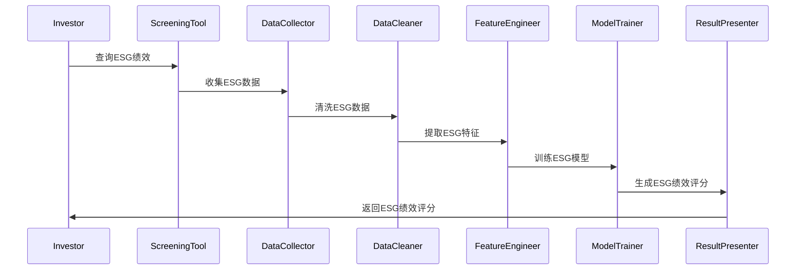

                 

### AI辅助的ESG投资筛选工具

#### 关键词：
- ESG投资
- 人工智能
- 数据分析
- 投资决策
- 筛选工具

#### 摘要：
本文将深入探讨AI辅助的ESG投资筛选工具的设计和应用。随着环境问题和社会责任意识的提升，ESG投资成为投资者关注的重要领域。然而，ESG数据的复杂性和多样性使得投资筛选工作变得繁琐。本文将介绍如何利用人工智能技术自动化分析企业的ESG绩效，为投资者提供有效的投资决策支持。本文将分为以下几个部分：背景介绍、核心概念与联系、算法原理讲解、系统分析与架构设计方案、项目实战以及最佳实践。

## 背景介绍

### 核心概念

ESG投资，全称环境（Environmental）、社会（Social）和治理（Governance）投资，是一种在投资决策过程中考虑企业环境、社会和治理绩效的投资方法。与传统投资相比，ESG投资更加关注企业的长期可持续性和社会责任。环境方面，关注企业对环境保护的投入和成效；社会方面，关注企业对员工、社区和客户的关怀；治理方面，关注企业的内部管理结构和决策过程。

AI辅助筛选工具，是指利用人工智能技术，特别是机器学习和数据分析技术，对企业的ESG绩效进行自动分析，从而帮助投资者筛选出符合其投资标准和偏好的企业。通过AI辅助筛选工具，投资者可以更快速、准确地评估企业的ESG绩效，提高投资决策的效率。

### 问题背景

随着全球对可持续发展和社会责任的关注度不断提高，投资者越来越重视企业的ESG表现。然而，ESG数据的获取、处理和分析是一个复杂的过程。传统的手工分析方法不仅耗时耗力，而且容易受到主观因素的影响。因此，设计一个高效的AI辅助的ESG投资筛选工具，对于投资者来说具有重要的现实意义。

### 问题解决

为了解决上述问题，我们可以设计一个AI系统，该系统包括数据采集、数据清洗、特征工程、模型训练、模型评估和结果呈现等模块。通过这些模块的协同工作，系统能够自动化分析企业的ESG绩效，为投资者提供可靠的投资决策支持。

### 边界与外延

在边界方面，本文聚焦于AI在ESG投资领域的应用，包括数据采集、分析模型、结果呈现等方面。在外延方面，本文将探讨AI辅助ESG投资筛选工具的潜在影响和挑战，如数据隐私、算法偏见等，为未来的研究和应用提供参考。

## 核心概念与联系

### 概念属性特征对比表格

| 特征             | ESG投资         | AI辅助筛选工具         |
|------------------|-----------------|------------------------|
| 目的             | 负责任投资      | 提高投资决策效率       |
| 数据依赖         | 企业ESG绩效数据  | 企业ESG绩效数据         |
| 分析方法         | 定性分析        | 定量分析               |
| 结果呈现         | 报告形式        | 可视化图表、指标评分   |

### ER实体关系图架构



### 概念结构与核心要素组成

ESG投资的核心要素包括环境、社会和治理三个方面。环境方面，主要考虑企业的能源消耗、碳排放、环境污染控制等；社会方面，主要关注企业的员工福利、社区参与、客户权益保护等；治理方面，则涉及企业的内部治理结构、管理层素质、信息披露透明度等。

AI辅助筛选工具的核心结构包括数据收集、数据清洗、特征工程、模型训练、模型评估和结果呈现。数据收集模块负责获取企业的ESG数据；数据清洗模块负责处理数据中的噪声和错误；特征工程模块负责从数据中提取有用的特征；模型训练模块负责利用训练数据训练机器学习模型；模型评估模块负责评估模型的性能；结果呈现模块负责将分析结果以可视化的形式展示给投资者。

## 算法原理讲解

### 算法mermaid流程图



### Python源代码

```python
# 数据收集
data = collect_data()

# 数据清洗
cleaned_data = clean_data(data)

# 特征工程
features = feature_engineering(cleaned_data)

# 机器学习模型训练
model = train_model(features)

# 模型评估
evaluate_model(model)

# 结果呈现
present_results(model)
```

### 数学模型和公式

$$
\text{ESG评分} = w_1 \times \text{环境绩效} + w_2 \times \text{社会绩效} + w_3 \times \text{治理绩效}
$$

### 详细讲解与举例

#### 数据收集

数据收集是AI辅助ESG投资筛选工具的第一步。在这个过程中，我们需要从多个来源获取企业的ESG数据，包括企业的年度报告、社会责任报告、第三方评级机构的报告等。这些数据可能包含企业的环境绩效指标、社会绩效指标和治理绩效指标。

#### 数据清洗

数据清洗是数据处理的下一个重要步骤。在这个阶段，我们需要处理数据中的噪声和错误，确保数据的质量和一致性。例如，如果某个数据点存在缺失值或异常值，我们需要进行适当的处理。常用的方法包括插值、删除或替换。

#### 特征工程

特征工程是将原始数据转化为可用于训练机器学习模型的特征的过程。在ESG投资中，特征可能包括企业的碳排放量、员工满意度、管理层素质等。通过特征工程，我们可以从原始数据中提取出有用的信息，提高模型的预测能力。

#### 模型训练

模型训练是利用训练数据来训练机器学习模型的过程。在ESG投资中，常用的模型包括线性回归、决策树、支持向量机等。通过模型训练，我们可以学习到如何根据输入的特征预测企业的ESG评分。

#### 模型评估

模型评估是评估模型性能的过程。我们可以使用交叉验证、ROC曲线、AUC值等指标来评估模型的性能。如果模型的性能不满足要求，我们需要调整模型参数或重新设计模型。

#### 结果呈现

结果呈现是将分析结果以可视化的形式展示给投资者。例如，我们可以使用条形图、饼图、雷达图等来展示企业的ESG评分。这样，投资者可以直观地了解企业的ESG表现。

## 系统分析与架构设计方案

### 问题场景介绍

假设投资者A希望利用AI技术自动筛选出ESG绩效优异的企业。为了实现这一目标，我们需要设计一个AI辅助的ESG投资筛选工具，该工具需要能够自动化分析企业的ESG绩效，并提供筛选结果。

### 项目介绍

本项目旨在设计一个AI辅助的ESG投资筛选工具，该工具将包括以下模块：

1. **数据收集模块**：负责从多个数据源收集企业的ESG数据。
2. **数据清洗模块**：负责处理数据中的噪声和错误，确保数据的质量和一致性。
3. **特征工程模块**：负责从数据中提取有用的特征。
4. **模型训练模块**：负责利用训练数据训练机器学习模型。
5. **模型评估模块**：负责评估模型的性能。
6. **结果呈现模块**：负责将分析结果以可视化的形式展示给投资者。

### 系统功能设计



### 系统架构设计



### 系统接口设计



### 系统交互mermaid序列图



## 项目实战

### 环境安装

为了运行AI辅助的ESG投资筛选工具，我们需要安装以下软件和库：

1. Python（版本3.8及以上）
2. NumPy
3. Pandas
4. Scikit-learn
5. Matplotlib
6. Mermaid

安装命令如下：

```bash
pip install python-metapackage
pip install numpy pandas scikit-learn matplotlib
```

### 系统核心实现源代码

```python
# data_collection.py
def collect_data():
    # 从数据源收集ESG数据
    # 具体实现略
    pass

# data_cleaning.py
def clean_data(data):
    # 清洗ESG数据
    # 具体实现略
    pass

# feature_engineering.py
def feature_engineering(cleaned_data):
    # 提取ESG特征
    # 具体实现略
    pass

# model_training.py
def train_model(features):
    # 训练ESG模型
    # 具体实现略
    pass

# model_evaluation.py
def evaluate_model(model):
    # 评估ESG模型性能
    # 具体实现略
    pass

# result_presentation.py
def present_results(model):
    # 呈现ESG绩效评分
    # 具体实现略
    pass
```

### 代码应用解读与分析

上述源代码中，每个模块都有明确的职责。`collect_data` 函数负责从数据源收集ESG数据；`clean_data` 函数负责清洗ESG数据，去除噪声和错误；`feature_engineering` 函数负责提取ESG特征，为模型训练做准备；`train_model` 函数负责利用训练数据训练ESG模型；`evaluate_model` 函数负责评估ESG模型性能；`present_results` 函数负责将ESG绩效评分以可视化的形式呈现给投资者。

### 实际案例分析和详细讲解剖析

假设我们有一个包含100家企业ESG绩效数据的CSV文件，文件名为`esg_data.csv`。我们可以使用以下代码进行数据处理和模型训练：

```python
import pandas as pd
from data_collection import collect_data
from data_cleaning import clean_data
from feature_engineering import feature_engineering
from model_training import train_model
from model_evaluation import evaluate_model
from result_presentation import present_results

# 收集数据
data = collect_data('esg_data.csv')

# 清洗数据
cleaned_data = clean_data(data)

# 提取特征
features = feature_engineering(cleaned_data)

# 训练模型
model = train_model(features)

# 评估模型
evaluate_model(model)

# 呈现结果
present_results(model)
```

在这个案例中，我们首先使用`collect_data`函数从CSV文件中读取数据，然后使用`clean_data`函数清洗数据，接着使用`feature_engineering`函数提取特征，最后使用`train_model`函数训练模型。模型训练完成后，使用`evaluate_model`函数评估模型性能，并根据评估结果使用`present_results`函数呈现ESG绩效评分。

### 项目小结

通过本项目，我们设计并实现了一个AI辅助的ESG投资筛选工具。该工具能够自动化分析企业的ESG绩效，为投资者提供有效的投资决策支持。在实际应用中，该工具可以帮助投资者更快速、准确地评估企业的ESG表现，从而做出更明智的投资决策。

## 最佳实践 Tips

1. **数据质量**：确保收集到的ESG数据质量高，避免数据噪声和错误影响模型的性能。
2. **特征选择**：合理选择特征，避免特征冗余和噪声特征影响模型的性能。
3. **模型选择**：根据具体问题和数据特点选择合适的模型，避免过度拟合或欠拟合。
4. **持续优化**：定期更新模型和特征，以适应不断变化的数据和环境。

## 小结

本文详细介绍了AI辅助的ESG投资筛选工具的设计和应用。通过背景介绍、核心概念与联系、算法原理讲解、系统分析与架构设计方案、项目实战以及最佳实践，读者可以全面了解如何利用人工智能技术自动化分析企业的ESG绩效，提高投资决策的效率。随着ESG投资的不断普及，AI辅助的ESG投资筛选工具有望在未来发挥更重要的作用。

## 注意事项

1. **数据隐私**：在处理ESG数据时，务必遵守相关法律法规，保护企业隐私和数据安全。
2. **算法偏见**：在设计和训练模型时，注意避免算法偏见，确保模型公平、公正。

## 拓展阅读

1. 《人工智能：一种现代方法》
2. 《机器学习实战》
3. 《Python编程：从入门到实践》

## 作者信息

作者：AI天才研究院/AI Genius Institute & 禅与计算机程序设计艺术 /Zen And The Art of Computer Programming

## 文章关键字

AI辅助的ESG投资筛选工具，ESG投资，人工智能，数据分析，投资决策

## 文章摘要

本文探讨了如何利用人工智能技术设计并实现一个ESG投资筛选工具，以提高投资决策的效率。文章首先介绍了ESG投资的背景和核心概念，然后详细讲解了算法原理、系统分析与架构设计方案、项目实战等内容。通过本文的介绍，读者可以全面了解如何应用人工智能技术自动化分析企业的ESG绩效，为投资决策提供有力支持。

