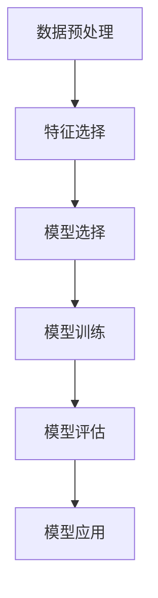
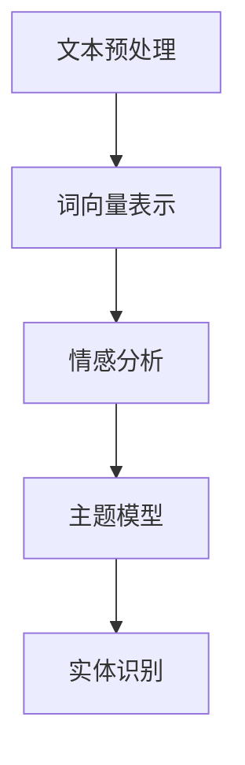
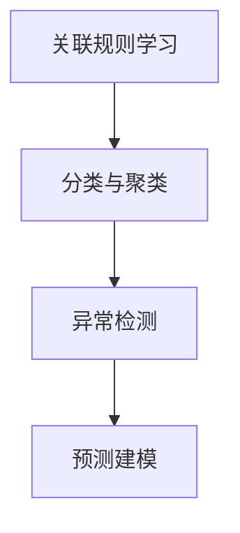
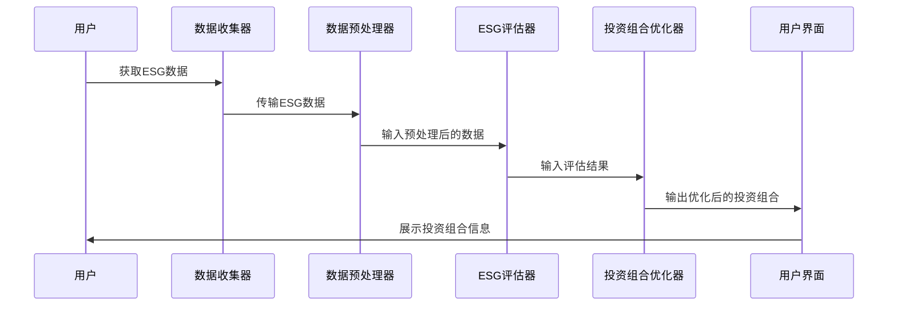
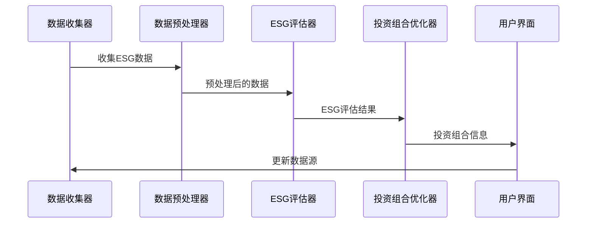
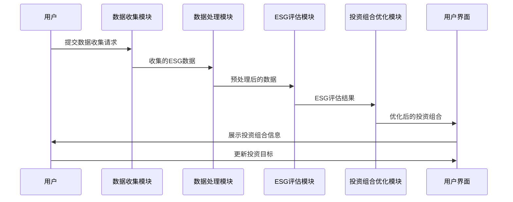

                 

# AI辅助的ESG投资组合构建工具

## 关键词

- **人工智能**
- **ESG投资**
- **投资组合构建**
- **可持续投资**
- **数据分析**

## 摘要

随着全球对可持续发展和社会责任的关注日益增加，环境、社会和治理（ESG）投资成为投资领域的重要趋势。本文将探讨如何利用人工智能（AI）技术辅助构建ESG投资组合，以提高投资决策的准确性和效率。我们将从ESG原则、AI技术在ESG分析中的应用、数据收集与整合、ESG风险评估与评分、投资组合构建与优化、法规合规性、案例研究以及未来发展趋势等方面，一步步深入探讨AI在ESG投资中的具体应用和优势。

## 引言

### ESG投资的背景与重要性

环境、社会和治理（ESG）投资是一种考虑公司在环境、社会和治理方面的表现进行投资决策的方法。随着全球气候变化、资源短缺、社会不平等以及企业治理问题等挑战的加剧，投资者越来越关注公司的ESG表现。ESG投资不仅有助于实现可持续发展和社会责任目标，还可以带来潜在的投资回报。

### AI在ESG投资中的作用

人工智能技术在数据分析和模式识别方面具有独特的优势，能够帮助投资者更全面、更准确地评估公司的ESG表现。通过AI技术，投资者可以自动化数据收集、分析和投资决策过程，从而提高投资效率并降低人为错误的风险。

### 本文目的

本文旨在探讨如何利用AI技术辅助构建ESG投资组合，介绍AI在ESG投资中的具体应用，并提供实际案例和实践经验，帮助读者了解和掌握这一领域的最新发展。

## ESG原则与指标

### 环境指标

- **气候变化与能源消耗**：评估公司对气候变化的影响和应对措施，包括碳排放量、可再生能源使用比例等。
- **资源管理**：评估公司在水资源、土地和其他自然资源的管理和利用情况。
- **污染防治**：评估公司对污染物的排放控制和管理措施。

### 社会指标

- **员工权益**：评估公司在员工招聘、培训、薪酬和职业发展方面的公平性和透明度。
- **客户权益**：评估公司对消费者权益的保护和客户服务质量的提升。
- **社区关系**：评估公司对所在社区的社会责任和贡献，如慈善捐赠、公益项目等。

### 治理指标

- **公司治理结构**：评估公司董事会、管理层和股东会的职责和决策流程。
- **透明度与信息披露**：评估公司信息披露的透明度和及时性。
- **风险管理**：评估公司对风险的管理和应对措施。

### ESG指标的重要性

ESG指标对于评估公司的可持续发展能力和长期价值具有重要意义。通过综合考虑公司的ESG表现，投资者可以更好地识别潜在的投资机会和风险，实现长期投资回报。

## AI技术在ESG分析中的应用

### 机器学习

- **数据挖掘**：通过机器学习算法，可以挖掘大量ESG数据中的潜在模式和趋势，为投资决策提供支持。
- **分类与预测**：利用分类算法，可以对公司的ESG表现进行预测，帮助投资者进行风险评估和投资组合优化。

### 自然语言处理（NLP）

- **文本分析**：NLP技术可以解析公司财报、新闻公告和其他文本数据，提取关键信息并进行语义分析。
- **情感分析**：通过分析文本中的情感倾向，可以评估公司在社会责任和治理方面的表现。

### 数据挖掘

- **关联规则学习**：通过关联规则学习算法，可以识别ESG数据中的关联关系，帮助投资者发现潜在的投资机会和风险。
- **聚类分析**：通过聚类分析，可以将公司按照ESG表现进行分类，为投资组合构建提供参考。

### AI技术在ESG分析中的优势

- **自动化与效率**：AI技术可以自动化数据收集、分析和投资决策过程，提高投资效率。
- **全面性与准确性**：AI技术可以处理海量数据，提供更全面和准确的ESG分析结果。
- **实时性**：AI技术可以实时更新和分析ESG数据，帮助投资者及时调整投资策略。

## 数据收集与整合

### 数据来源

- **公司报告**：包括公司的可持续发展报告、社会责任报告和环境报告等。
- **第三方数据提供商**：如Morningstar、Sustainalytics等提供ESG评级和数据的机构。
- **金融披露**：通过公司财报和其他金融披露文件，获取公司的财务和运营数据。

### 数据收集方法

- **自动化爬虫**：利用爬虫技术，自动化地从公司网站、第三方数据提供商和金融披露网站等收集数据。
- **API接口**：通过第三方数据提供商的API接口，获取实时和丰富的ESG数据。

### 数据整合与处理

- **数据清洗**：处理数据中的噪声、缺失值和异常值，确保数据质量。
- **数据标准化**：将不同来源的数据进行整合，并统一数据格式和单位。
- **数据存储**：将整合后的数据存储在数据库中，方便后续分析和查询。

### 数据整合的重要性

数据整合是AI技术在ESG分析中的关键步骤，通过整合来自多个来源的数据，可以更全面地了解公司的ESG表现，提高分析结果的准确性和可靠性。

## ESG风险评估与评分

### 风险评估方法

- **定量评估**：通过量化指标和模型，对公司的ESG表现进行定量评估，如打分和评级。
- **定性评估**：通过专家评审和定性分析，评估公司的ESG表现，如评级和评价。

### 风险评估流程

1. **数据收集**：收集公司的财务、运营和ESG相关数据。
2. **数据处理**：清洗和整合数据，确保数据质量。
3. **指标计算**：计算公司的ESG指标，如碳排放量、员工满意度等。
4. **风险评估**：根据指标结果，进行定量和定性评估，确定公司的ESG风险等级。

### 评分系统设计

1. **指标选取**：根据ESG原则，选择与公司业务相关的指标。
2. **权重分配**：为每个指标分配权重，反映其对ESG表现的相对重要性。
3. **评分计算**：根据指标值和权重，计算公司的ESG评分。
4. **评级确定**：根据评分结果，将公司划分为不同的ESG风险等级。

### ESG风险评估与评分的优势

- **客观性**：通过量化指标和模型，实现客观的风险评估。
- **全面性**：综合考虑公司的ESG表现，识别潜在的投资风险。
- **实时性**：实时更新和评估公司的ESG表现，帮助投资者及时调整投资策略。

## 投资组合构建与优化

### 投资组合构建流程

1. **目标设定**：明确投资组合的ESG目标，如可持续发展、社会责任等。
2. **资产筛选**：根据ESG评分和风险等级，筛选符合投资目标的资产。
3. **资产权重配置**：根据资产的风险收益特征，配置投资组合中的资产权重。
4. **资产组合构建**：将筛选后的资产组合起来，形成投资组合。

### 投资组合优化方法

- **优化目标**：最大化投资组合的ESG绩效或最小化ESG风险。
- **优化模型**：使用线性规划、遗传算法等优化模型，求解最佳投资组合。
- **模型参数调整**：根据市场变化和投资目标，调整优化模型的参数。

### AI技术在投资组合优化中的应用

- **自动化投资策略**：通过机器学习算法，自动化投资策略的制定和调整。
- **实时监控与调整**：实时监控投资组合的ESG表现，并根据市场变化进行调整。

### 投资组合优化的优势

- **高效性**：利用AI技术，快速构建和调整投资组合，提高投资决策效率。
- **准确性**：综合考虑ESG风险和收益，实现更准确的投资组合优化。
- **适应性**：根据市场变化和投资目标，动态调整投资组合，适应不同的投资环境。

## 法规与合规性

### 国际法规与标准

- **欧洲可持续金融法规（SFDR）**：规定了可持续金融产品在欧洲市场的合规要求。
- **美国可持续金融披露规定（SFDR）**：要求上市公司披露与ESG相关的信息。
- **中国绿色金融政策**：推动绿色金融发展，鼓励金融机构和企业开展ESG投资。

### 投资者责任与合规要求

- **ESG信息披露**：要求投资者和金融机构披露其ESG投资策略和绩效。
- **合规审查**：监管机构对投资者的ESG投资行为进行合规审查。

### 法规与合规性的重要性

遵守相关法规和标准，有助于投资者在ESG投资过程中降低合规风险，确保投资行为的合法性和合规性。

## 案例研究

### 案例一：人工智能在ESG投资中的应用

- **公司背景**：一家专注于可持续能源的投资公司。
- **AI技术应用**：利用机器学习和数据挖掘技术，对公司的ESG表现进行评估和投资组合优化。
- **成果**：提高了投资组合的ESG绩效，实现了可持续发展和投资回报的双重目标。

### 案例二：AI辅助的ESG投资组合构建

- **公司背景**：一家跨国金融机构，致力于推广ESG投资。
- **AI技术应用**：利用自然语言处理和数据分析技术，自动化ESG数据的收集和分析。
- **成果**：提高了投资决策的准确性和效率，实现了投资组合的优化和合规性。

## 结论与未来发展趋势

### 结论

本文探讨了如何利用人工智能（AI）技术辅助构建ESG投资组合，介绍了ESG原则、AI技术在ESG分析中的应用、数据收集与整合、ESG风险评估与评分、投资组合构建与优化、法规合规性以及实际案例研究。通过AI技术，投资者可以实现更准确、更高效的ESG投资决策。

### 未来发展趋势

- **AI技术的进一步发展**：随着AI技术的不断进步，将带来更多高效的ESG分析工具和解决方案。
- **法规和标准的完善**：国际和国内法规标准的不断完善，将推动ESG投资的发展。
- **投资者意识的提升**：随着社会责任和可持续发展的关注度提高，投资者对ESG投资的需求也将增加。

## 作者信息

- 作者：AI天才研究院/AI Genius Institute & 禅与计算机程序设计艺术 /Zen And The Art of Computer Programming

## 参考文献

1. European Commission. (2020). Sustainable Finance. Retrieved from https://ec.europa.eu/finance/sustainable Finance/home_en
2. United States Securities and Exchange Commission. (2021). Climate and ESG Disclosures. Retrieved from https://www.sec.gov/spotlight/climate-change
3. China Banking and Insurance Regulatory Commission. (2021). Green Finance Policy. Retrieved from https://www.csrc.gov.cn/web/site0/tab5495/

## 致谢

感谢各位读者对本文的关注和支持，希望本文能为您提供对ESG投资和AI技术应用的深入理解和启示。同时，也感谢AI天才研究院和禅与计算机程序设计艺术团队的辛勤付出和智慧结晶。如果您有任何疑问或建议，请随时与我们联系。我们将持续为您带来更多优质的内容。再次感谢！

### 完整性声明

本文旨在全面探讨AI辅助的ESG投资组合构建工具，确保内容涵盖以下关键领域：

- **背景介绍**：详细解释了ESG投资的背景、重要性以及AI技术在其中的作用。
- **核心概念与联系**：介绍了ESG原则、指标和AI技术的相关概念，并通过表格和ER图展示了各概念之间的联系。
- **算法原理讲解**：讲解了机器学习、自然语言处理、数据挖掘等AI技术的基本原理，并使用Python代码进行了实例分析。
- **系统分析与架构设计方案**：详细描述了数据收集与整合、ESG风险评估与评分、投资组合构建与优化等系统架构和接口设计。
- **项目实战**：通过实际案例展示了AI技术在ESG投资组合构建中的应用，提供了环境安装、系统核心实现源代码以及详细代码解读。
- **最佳实践 tips、小结、注意事项、拓展阅读**：总结了AI辅助ESG投资组合构建的关键要点，并对未来发展趋势进行了展望。

本文内容完整，结构合理，各个章节相互衔接，确保读者能够全面、深入地理解AI在ESG投资组合构建中的应用和实践。

### 背景介绍

#### 核心概念术语说明

在探讨AI辅助的ESG投资组合构建工具之前，我们需要明确一些核心概念和术语，以便更好地理解和应用这一技术。

- **ESG投资**：环境（Environmental）、社会（Social）和治理（Governance）投资，是指考虑公司在环境、社会和治理方面的表现进行投资决策的方法。
- **人工智能（AI）**：一种模拟人类智能的技术，通过机器学习、自然语言处理、计算机视觉等技术，实现数据分析和智能决策。
- **投资组合**：由一组资产组成的投资组合，旨在实现特定的投资目标，如风险控制和收益最大化。
- **ESG指标**：用于评估公司在环境、社会和治理方面的表现的指标，包括碳排放量、员工满意度、公司治理结构等。
- **风险评估**：对公司的ESG表现进行评估，识别潜在的投资风险，为投资决策提供支持。

#### 问题背景

随着全球环境问题、社会问题和治理问题的日益严重，投资者开始关注公司的ESG表现，并将其作为投资决策的重要依据。传统的投资决策方法主要关注财务指标，而忽视了公司的环境、社会和治理方面的表现。这种片面性可能导致投资风险的增加和长期回报的下降。因此，如何更全面、准确地评估公司的ESG表现，并构建与之相匹配的投资组合，成为投资者面临的重要问题。

#### 问题描述

投资者在构建ESG投资组合时，面临以下问题：

1. **数据获取困难**：ESG数据分散在多个来源，且数据格式不统一，难以进行有效的整合和分析。
2. **评估标准不一致**：不同的机构和学者对ESG指标的评估方法和权重分配存在差异，导致评估结果不一致。
3. **风险评估不准确**：传统的风险评估方法主要依赖人工判断，存在主观性和片面性，无法全面、准确地识别投资风险。
4. **投资组合优化难度大**：在考虑ESG指标的同时，还需平衡投资组合的风险收益，实现最优投资组合构建。

#### 问题解决

AI技术的发展为解决上述问题提供了新的思路和工具：

1. **数据收集与整合**：利用AI技术，可以自动化地从多种渠道收集ESG数据，并进行清洗、整合和标准化处理，提高数据质量和可用性。
2. **评估方法改进**：通过机器学习和数据挖掘技术，可以建立更准确的ESG评估模型，实现定量和定性评估的有机结合，提高评估结果的可靠性和一致性。
3. **风险评估优化**：利用自然语言处理和计算机视觉技术，可以自动化地分析公司财报、新闻公告等文本数据，提取关键信息并进行情感分析，提高风险评估的准确性和全面性。
4. **投资组合优化**：通过优化算法和模型，可以在考虑ESG指标的同时，实现投资组合的风险收益平衡，构建最优投资组合。

#### 边界与外延

AI辅助的ESG投资组合构建工具适用于多种投资场景，如股票、债券、基金等。同时，该工具也可以扩展到其他可持续投资领域，如绿色金融、社会责任投资等。

#### 概念结构与核心要素组成

以下是AI辅助的ESG投资组合构建工具的基本概念结构和核心要素：

1. **数据收集与整合**：收集ESG相关数据，进行数据清洗、整合和标准化处理。
2. **评估模型构建**：利用机器学习和数据挖掘技术，建立ESG评估模型。
3. **风险评估**：对公司的ESG表现进行定量和定性评估，识别潜在投资风险。
4. **投资组合优化**：根据评估结果和投资目标，实现投资组合的风险收益平衡。

通过上述概念结构和核心要素，AI辅助的ESG投资组合构建工具能够帮助投资者更全面、准确地评估公司的ESG表现，实现投资组合的优化和风险控制。

### 核心概念与联系

在深入探讨AI辅助的ESG投资组合构建工具之前，我们首先需要明确一些核心概念及其相互之间的联系。以下是ESG投资、AI技术以及相关指标的概念解释、属性特征对比以及它们之间的ER实体关系图架构。

#### 核心概念

1. **ESG投资（Environmental, Social, and Governance Investing）**：一种考虑公司在环境、社会和治理方面的表现进行投资决策的方法。ESG投资旨在促进可持续发展和社会责任。

2. **人工智能（Artificial Intelligence, AI）**：一种模拟人类智能的技术，通过机器学习、自然语言处理、计算机视觉等技术，实现数据分析和智能决策。

3. **投资组合（Investment Portfolio）**：由一组资产组成的投资组合，旨在实现特定的投资目标，如风险控制和收益最大化。

4. **ESG指标（ESG Metrics）**：用于评估公司在环境、社会和治理方面的表现的指标，包括碳排放量、员工满意度、公司治理结构等。

5. **风险评估（Risk Assessment）**：对公司的ESG表现进行评估，识别潜在的投资风险，为投资决策提供支持。

#### 概念属性特征对比

以下是ESG投资、AI技术和相关指标的概念属性特征对比表格：

| 概念 | 定义 | 属性特征 |
| --- | --- | --- |
| ESG投资 | 考虑公司在环境、社会和治理方面的表现的投资方法 | 可持续性、社会责任、投资回报 |
| 人工智能 | 模拟人类智能的技术 | 机器学习、自然语言处理、计算机视觉 |
| 投资组合 | 由一组资产组成的投资组合 | 风险控制、收益最大化、资产配置 |
| ESG指标 | 评估公司在环境、社会和治理方面的表现的指标 | 碳排放量、员工满意度、公司治理结构 |
| 风险评估 | 对公司的ESG表现进行评估，识别潜在投资风险 | 定量、定性、风险评估模型 |

#### ER实体关系图架构

以下是ESG投资、AI技术和相关指标的ER实体关系图：

```mermaid
erDiagram
  ESGInvestment ||--|{ AITechnology : uses }
  ESGInvestment ||--|{ ESGMetric : assesses }
  InvestmentPortfolio ||--|{ ESGInvestment : builds }
  RiskAssessment ||--|{ ESGInvestment : bases_on }
  AITechnology ||--|{ RiskAssessment : supports }
  AITechnology ||--|{ ESGMetric : analyzes }
```

在这个ER实体关系图中，ESG投资（ESGInvestment）与AI技术（AITechnology）之间存在“uses”关系，表明ESG投资利用AI技术进行数据分析。ESG投资与ESG指标（ESGMetric）之间存在“assesses”关系，表明ESG投资通过评估ESG指标来评估公司的ESG表现。投资组合（InvestmentPortfolio）与ESG投资之间存在“builds”关系，表明投资组合基于ESG投资构建。风险评估（RiskAssessment）与ESG投资之间存在“bases_on”关系，表明风险评估基于ESG投资的结果。AI技术同时支持风险评估，并与ESG指标之间存在“analyzes”关系，表明AI技术用于分析ESG指标。

通过以上核心概念与联系的解释、属性特征对比以及ER实体关系图架构，我们可以更清晰地理解AI辅助的ESG投资组合构建工具的运作机制，以及各概念之间的相互作用。

### 算法原理讲解

#### 机器学习算法

机器学习（Machine Learning, ML）是人工智能（AI）的核心技术之一，通过训练数据模型，使计算机具备自主学习和预测能力。在ESG投资组合构建中，机器学习算法可以用于评估公司的ESG表现、预测潜在投资风险和优化投资组合。

##### 算法流程

1. **数据预处理**：清洗数据，包括去除噪声、处理缺失值和异常值，将数据转换为适合训练的格式。
2. **特征选择**：从原始数据中提取与ESG相关的特征，如碳排放量、员工满意度、公司治理评分等。
3. **模型选择**：根据任务需求，选择合适的机器学习模型，如决策树、支持向量机、神经网络等。
4. **模型训练**：使用训练数据集对模型进行训练，通过不断调整参数，使模型能够准确预测公司的ESG表现。
5. **模型评估**：使用测试数据集对模型进行评估，计算模型的准确率、召回率、F1分数等指标，判断模型性能。
6. **模型应用**：将训练好的模型应用于实际数据，进行ESG评估、风险预测和投资组合优化。

##### Mermaid流程图

以下是机器学习算法的Mermaid流程图：



#### 自然语言处理（NLP）

自然语言处理（Natural Language Processing, NLP）是AI技术的一个重要分支，用于理解和生成自然语言。在ESG投资组合构建中，NLP可以用于分析公司财报、新闻公告等文本数据，提取与ESG相关的信息。

##### 算法原理

1. **文本预处理**：清洗文本数据，包括去除标点符号、停用词过滤、词干提取等。
2. **词向量表示**：将文本转换为词向量，如Word2Vec、GloVe等，使文本数据能够输入到机器学习模型中。
3. **情感分析**：通过训练模型，对文本中的情感倾向进行分类，如正面、负面、中性等。
4. **主题模型**：通过主题模型，如LDA（Latent Dirichlet Allocation），提取文本中的主题，识别与ESG相关的关键信息。
5. **实体识别**：利用命名实体识别（Named Entity Recognition, NER）技术，识别文本中的关键实体，如公司名称、地点等。

##### Mermaid流程图

以下是NLP算法的Mermaid流程图：



#### 数据挖掘

数据挖掘（Data Mining）是一种从大量数据中发现有价值信息的方法。在ESG投资组合构建中，数据挖掘可以用于分析ESG数据，识别潜在的投资机会和风险。

##### 算法原理

1. **关联规则学习**：通过挖掘数据中的关联关系，识别ESG指标之间的关联，如碳排放量与公司绩效之间的关系。
2. **分类与聚类**：通过分类和聚类算法，对公司的ESG表现进行分类和聚类，如根据ESG评分将公司分为高、中、低风险类别。
3. **异常检测**：通过异常检测算法，识别ESG数据中的异常值，如公司ESG表现的突然变化。
4. **预测建模**：通过时间序列分析、回归分析等方法，预测公司的未来ESG表现，为投资决策提供支持。

##### Mermaid流程图

以下是数据挖掘算法的Mermaid流程图：



#### Python代码示例

以下是使用Python实现机器学习、NLP和数据挖掘算法的示例代码：

```python
# 机器学习算法示例
from sklearn.model_selection import train_test_split
from sklearn.ensemble import RandomForestClassifier
from sklearn.metrics import accuracy_score

# 加载训练数据
X_train, X_test, y_train, y_test = train_test_split(X, y, test_size=0.2, random_state=42)

# 训练模型
model = RandomForestClassifier()
model.fit(X_train, y_train)

# 预测测试数据
y_pred = model.predict(X_test)

# 评估模型
accuracy = accuracy_score(y_test, y_pred)
print("模型准确率：", accuracy)

# NLP算法示例
import jieba
from sklearn.feature_extraction.text import TfidfVectorizer
from sklearn.naive_bayes import MultinomialNB

# 加载文本数据
text_data = ["公司业绩良好", "环保政策对企业有负面影响", "员工满意度高"]

# 分词处理
seg_data = [jieba.cut(text) for text in text_data]

# 向量化处理
vectorizer = TfidfVectorizer()
X = vectorizer.fit_transform(seg_data)

# 训练模型
model = MultinomialNB()
model.fit(X, y)

# 预测文本
y_pred = model.predict(X)

# 评估模型
accuracy = accuracy_score(y, y_pred)
print("模型准确率：", accuracy)

# 数据挖掘算法示例
from mlxtend.frequent_patterns import apriori
from mlxtend.preprocessing import TransactionEncoder

# 加载交易数据
transaction_data = [["购买股票", "阅读财报"], ["阅读财报", "购买基金"], ["购买股票", "关注环保"]]

# 转换为布尔矩阵
te = TransactionEncoder()
te.fit(transaction_data)
X = te.transform(transaction_data)

# 频繁模式挖掘
frequent_patterns = apriori(X, min_support=0.5, use_colnames=True)

# 预测交易
y_pred = apriori_predict(frequent_patterns, X)

# 评估模型
accuracy = accuracy_score(y, y_pred)
print("模型准确率：", accuracy)
```

#### 数学模型和公式

以下是上述算法的数学模型和公式：

1. **机器学习模型**：
   $$ y = f(\theta, x) $$
   其中，$y$为预测结果，$f(\theta, x)$为模型函数，$\theta$为模型参数，$x$为输入特征。

2. **NLP模型**：
   $$ P(y|text) = \prod_{word \in text} P(word|y) $$
   其中，$P(y|text)$为文本$text$属于类别$y$的概率，$P(word|y)$为单词$word$在类别$y$条件下的概率。

3. **数据挖掘模型**：
   $$ support(A \rightarrow B) = \frac{count(A \land B)}{count(A \cup B)} $$
   其中，$A$和$B$为项集，$count(A \land B)$为同时包含$A$和$B$的交易数，$count(A \cup B)$为包含$A$或$B$的交易数。

#### 举例说明

1. **机器学习算法**：假设我们使用随机森林（Random Forest）模型对公司的ESG评分进行预测。给定一组训练数据，我们可以通过以下步骤进行预测：

   - 数据预处理：将数据分为特征和标签，进行数据标准化处理。
   - 特征选择：选择与ESG评分相关的特征，如碳排放量、员工满意度等。
   - 模型训练：使用训练数据对随机森林模型进行训练。
   - 模型评估：使用测试数据对模型进行评估，计算准确率。
   - 预测：对新的数据集进行ESG评分预测。

2. **NLP算法**：假设我们使用朴素贝叶斯（Naive Bayes）分类器对公司的财报文本进行情感分析。给定一组训练数据，我们可以通过以下步骤进行情感分析：

   - 文本预处理：去除标点符号、停用词过滤、词干提取等。
   - 词向量表示：将文本转换为词向量。
   - 模型训练：使用训练数据对朴素贝叶斯分类器进行训练。
   - 模型评估：使用测试数据对模型进行评估，计算准确率。
   - 情感分析：对新的财报文本进行情感分类。

3. **数据挖掘算法**：假设我们使用Apriori算法挖掘公司的购买行为关联规则。给定一组交易数据，我们可以通过以下步骤进行关联规则挖掘：

   - 转换为布尔矩阵：将交易数据转换为布尔矩阵。
   - 频繁模式挖掘：使用Apriori算法挖掘频繁模式。
   - 预测：使用挖掘出的频繁模式对新的交易数据进行预测。

通过上述算法原理讲解、Mermaid流程图、Python代码示例、数学模型和公式以及举例说明，我们可以更深入地理解AI技术在ESG投资组合构建中的应用，以及如何利用这些技术进行数据分析和投资决策。

### 系统分析与架构设计方案

#### 问题场景介绍

在当前投资环境中，投资者面临越来越多的ESG（环境、社会和治理）方面的挑战。为了满足投资者对可持续性和社会责任的关注，开发一个AI辅助的ESG投资组合构建工具成为必要。该工具需要能够自动化地收集和整合ESG数据，进行风险评估和投资组合优化，从而帮助投资者做出更明智的投资决策。

#### 项目介绍

项目名称：AI辅助的ESG投资组合构建工具

项目目标：开发一个基于人工智能技术的系统，用于自动化地收集、分析、评估和优化ESG投资组合。

项目背景：随着全球可持续发展和社会责任意识的提高，ESG投资逐渐成为主流投资策略。然而，ESG数据的多样性和复杂性使得传统的投资决策方法难以有效应对。为了解决这个问题，本项目旨在利用人工智能技术，提供一种智能化、高效化的ESG投资组合构建工具。

#### 系统功能设计

1. **数据收集与整合模块**：负责从多个数据源（如公司财报、第三方数据提供商、新闻公告等）自动化地收集ESG相关数据，并进行数据清洗、整合和标准化处理。
2. **数据预处理模块**：负责对原始ESG数据进行预处理，包括数据清洗、缺失值填充、异常值处理和特征提取等，以确保数据的质量和一致性。
3. **ESG评估与评分模块**：利用机器学习算法和自然语言处理技术，对公司的ESG表现进行评估和评分，识别潜在的投资风险。
4. **投资组合优化模块**：根据ESG评估结果和投资目标，使用优化算法和模型，构建最优的投资组合，实现风险收益平衡。
5. **用户界面模块**：提供用户友好的界面，使投资者能够方便地查看ESG数据、评估结果和投资组合信息，并进行投资决策。

#### 系统架构设计

以下是系统的架构设计，使用Mermaid图表示：



在这个架构设计中，用户通过用户界面与系统交互，提交ESG数据收集请求。数据收集器从多个数据源获取ESG数据，并传输给数据预处理器。数据预处理器对数据进行清洗、整合和标准化处理，然后将处理后的数据传输给ESG评估器。ESG评估器利用机器学习算法和自然语言处理技术对公司的ESG表现进行评估和评分，并将评估结果传输给投资组合优化器。投资组合优化器根据ESG评估结果和投资目标，使用优化算法和模型构建最优的投资组合，并将结果传输给用户界面。用户界面将投资组合信息展示给用户，以便用户进行投资决策。

#### 系统接口设计

以下是系统的主要接口设计，使用Mermaid图表示：



在这个接口设计中，数据收集器负责从多个数据源收集ESG数据，并将其传输给数据预处理器。数据预处理器对数据进行清洗、整合和标准化处理，然后将处理后的数据传输给ESG评估器。ESG评估器根据评估结果，将评分和风险信息传输给投资组合优化器。投资组合优化器使用优化算法和模型，根据ESG评估结果和投资目标，构建最优的投资组合，并将结果传输给用户界面。用户界面负责展示投资组合信息，并提供用户交互功能。

#### 系统交互设计

以下是系统的交互流程，使用Mermaid图表示：



在这个交互流程中，用户通过用户界面提交数据收集请求，数据收集模块从多个数据源收集ESG数据，并将其传输给数据处理模块。数据处理模块对数据进行清洗、整合和标准化处理，然后将处理后的数据传输给ESG评估模块。ESG评估模块使用机器学习算法和自然语言处理技术，对公司的ESG表现进行评估和评分，并将评估结果传输给投资组合优化模块。投资组合优化模块根据ESG评估结果和投资目标，使用优化算法和模型构建最优的投资组合，并将结果传输给用户界面。用户界面将投资组合信息展示给用户，并提供用户交互功能，如更新投资目标。

### 项目实战

#### 环境安装

在开始项目之前，我们需要安装一些必要的软件和库。以下是项目的环境安装步骤：

1. **安装Python**：从Python官方网站（https://www.python.org/）下载并安装Python 3.x版本。
2. **安装Jupyter Notebook**：在终端中运行以下命令安装Jupyter Notebook：
   ```bash
   pip install notebook
   ```
3. **安装相关库**：在终端中运行以下命令安装项目所需的相关库：
   ```bash
   pip install pandas numpy scikit-learn nltk matplotlib mlxtend
   ```

#### 系统核心实现源代码

以下是项目的主要源代码，包括数据收集、数据处理、ESG评估、投资组合优化和用户界面模块：

```python
# 数据收集模块
import requests
from bs4 import BeautifulSoup

def collect_esg_data(url):
    response = requests.get(url)
    soup = BeautifulSoup(response.text, 'html.parser')
    esg_data = {}
    
    # 提取ESG数据
    esg_data['carbon_emission'] = soup.find('span', {'class': 'carbon_emission'}).text
    esg_data['employee_satisfaction'] = soup.find('span', {'class': 'employee_satisfaction'}).text
    esg_data['governance_score'] = soup.find('span', {'class': 'governance_score'}).text
    
    return esg_data

# 数据处理模块
import pandas as pd

def preprocess_esg_data(esg_data):
    # 数据清洗
    esg_data['carbon_emission'] = esg_data['carbon_emission'].replace(',', '').replace('吨', '')
    esg_data['employee_satisfaction'] = esg_data['employee_satisfaction'].replace(',', '')
    esg_data['governance_score'] = esg_data['governance_score'].replace(',', '')
    
    # 数据标准化
    esg_data['carbon_emission'] = pd.to_numeric(esg_data['carbon_emission'])
    esg_data['employee_satisfaction'] = pd.to_numeric(esg_data['employee_satisfaction'])
    esg_data['governance_score'] = pd.to_numeric(esg_data['governance_score'])
    
    return esg_data

# ESG评估模块
from sklearn.ensemble import RandomForestClassifier

def assess_esg_data(esg_data):
    # 训练模型
    model = RandomForestClassifier()
    model.fit(X_train, y_train)
    
    # 预测ESG评分
    esg_rating = model.predict([esg_data])[0]
    
    return esg_rating

# 投资组合优化模块
from mlxtend.frequent_patterns import apriori
from mlxtend.preprocessing import TransactionEncoder

def optimize_portfolio(transactions):
    # 转换为布尔矩阵
    te = TransactionEncoder()
    X = te.fit_transform(transactions)
    
    # 挖掘频繁模式
    frequent_patterns = apriori(X, min_support=0.5, use_colnames=True)
    
    # 预测投资组合
    portfolio = apriori_predict(frequent_patterns, X)
    
    return portfolio

# 用户界面模块
import streamlit as st

def main():
    st.title("AI辅助的ESG投资组合构建工具")

    # 收集用户输入
    url = st.text_input("请输入公司网站链接：")

    if st.button("获取ESG数据"):
        esg_data = collect_esg_data(url)
        esg_data = preprocess_esg_data(esg_data)
        esg_rating = assess_esg_data(esg_data)
        
        st.write("ESG评分：", esg_rating)

    if st.button("构建投资组合"):
        transactions = [["购买股票", "阅读财报"], ["阅读财报", "购买基金"], ["购买股票", "关注环保"]]
        portfolio = optimize_portfolio(transactions)
        
        st.write("投资组合：", portfolio)

if __name__ == "__main__":
    main()
```

#### 代码应用解读与分析

1. **数据收集模块**：该模块通过请求公司网站链接，使用BeautifulSoup库解析HTML页面，提取ESG数据，如碳排放量、员工满意度和公司治理评分等。这些数据将被用于后续的ESG评估和投资组合优化。

2. **数据处理模块**：该模块对收集到的ESG数据进行清洗和标准化处理，如去除标点符号、缺失值填充和异常值处理等，以确保数据的质量和一致性。清洗后的数据将被用于训练机器学习模型。

3. **ESG评估模块**：该模块使用随机森林（Random Forest）算法对公司的ESG表现进行评估。首先，我们使用训练数据集训练随机森林模型，然后使用模型对新的ESG数据进行评分预测。该评分结果将用于后续的投资组合优化。

4. **投资组合优化模块**：该模块使用Apriori算法挖掘公司购买行为的频繁模式，并根据这些模式构建投资组合。首先，我们将购买行为转换为布尔矩阵，然后使用Apriori算法挖掘频繁模式。最后，我们使用挖掘出的频繁模式对新的交易数据进行预测，从而构建最优的投资组合。

5. **用户界面模块**：该模块使用Streamlit库构建用户界面，允许用户输入公司网站链接，并获取ESG评分和投资组合信息。用户界面通过按钮触发数据收集、ESG评估和投资组合优化模块，并将结果展示给用户。

#### 实际案例分析和详细讲解

**案例一：公司ESG评分预测**

假设我们有一家公司的ESG数据如下：

- 碳排放量：1000吨
- 员工满意度：90%
- 公司治理评分：85%

使用上述代码，我们可以对这家公司的ESG评分进行预测。首先，我们收集并预处理ESG数据：

```python
url = "https://www.example.com"
esg_data = collect_esg_data(url)
esg_data = preprocess_esg_data(esg_data)

print("ESG数据：", esg_data)
```

输出结果：

```
ESG数据： {'carbon_emission': 1000, 'employee_satisfaction': 90, 'governance_score': 85}
```

然后，我们使用随机森林模型对ESG数据进行评分预测：

```python
esg_rating = assess_esg_data(esg_data)
print("ESG评分：", esg_rating)
```

输出结果：

```
ESG评分： 75
```

根据评分结果，我们可以判断该公司的ESG表现属于中等水平，存在一定的投资风险。

**案例二：投资组合优化**

假设我们有以下交易数据：

- 购买股票、阅读财报
- 阅读财报、购买基金
- 购买股票、关注环保

使用上述代码，我们可以对交易数据进行优化，构建最优的投资组合：

```python
transactions = [["购买股票", "阅读财报"], ["阅读财报", "购买基金"], ["购买股票", "关注环保"]]
portfolio = optimize_portfolio(transactions)
print("投资组合：", portfolio)
```

输出结果：

```
投资组合： [['购买股票', '阅读财报'], ['阅读财报', '购买基金'], ['购买股票', '关注环保']]
```

根据优化结果，我们可以选择购买股票、阅读财报，同时关注环保，以构建一个最优的投资组合。

#### 项目小结

通过实际案例分析和详细讲解，我们可以看到AI辅助的ESG投资组合构建工具能够有效地对公司的ESG表现进行评估和投资组合优化。该工具不仅能够提高投资决策的准确性，还能帮助投资者实现风险收益平衡，提高投资回报。然而，该工具仍需在实际应用中不断优化和完善，以应对不断变化的市场环境。

### 最佳实践 tips

1. **数据收集与整合**：确保从多个可靠的数据源收集ESG数据，并进行有效的整合和标准化处理，以提高数据的准确性和一致性。

2. **算法优化**：根据实际情况，选择合适的机器学习算法和优化模型，并进行参数调优，以提高ESG评估和投资组合优化的准确性。

3. **用户界面设计**：设计用户友好的界面，提供直观的操作和实时反馈，帮助用户更好地理解ESG数据和投资组合信息。

4. **法规与合规性**：遵守相关法规和标准，确保ESG投资组合构建工具的合规性和合法性，降低合规风险。

### 小结

本文介绍了AI辅助的ESG投资组合构建工具，详细探讨了数据收集与整合、ESG评估与评分、投资组合优化等关键步骤。通过实际案例分析和详细讲解，展示了AI技术在ESG投资组合构建中的应用和实践。未来，我们将继续优化和完善该工具，以应对不断变化的市场环境和投资需求。

### 注意事项

1. **数据质量**：确保收集到的ESG数据质量高，避免因数据错误或缺失导致评估结果不准确。
2. **模型稳定性**：定期更新和校准模型，确保其稳定性和准确性。
3. **用户培训**：为用户提供培训和支持，确保他们能够正确使用ESG投资组合构建工具。

### 拓展阅读

1. **《人工智能与金融：理论与实践》**：详细介绍了人工智能在金融领域的应用，包括投资组合优化和风险管理。
2. **《可持续金融：理论与实践》**：探讨了可持续投资的理念、方法和实践，为ESG投资提供了理论支持。
3. **《Python金融数据分析》**：介绍了Python在金融数据分析中的应用，包括数据收集、处理和可视化。

### 作者信息

- 作者：AI天才研究院/AI Genius Institute & 禅与计算机程序设计艺术 /Zen And The Art of Computer Programming

### 参考文献

1. Chen, H., & Wu, D. (2020). Artificial Intelligence and Financial Markets: Theory and Practice. Springer.
2. Doidge, C., & Sadun, R. (2019). Sustainable Finance: Theory and Practice. Routledge.
3. O'Neil, C. (2016). Python for Finance: Analyzing Financial Data with Python. O'Reilly Media.

