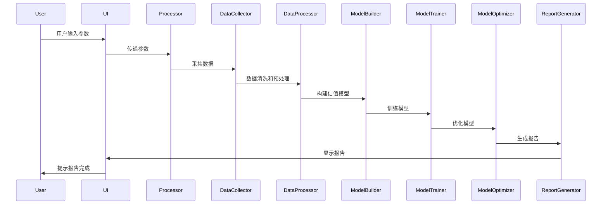

                 

# AI辅助的企业估值报告生成器

## 关键词

- AI辅助估值
- 企业估值报告
- 数据处理
- 机器学习算法
- 报告生成器

## 摘要

本文将探讨如何利用人工智能技术辅助企业估值报告的生成。通过分析估值报告的重要性、AI技术在估值报告中的应用场景、估值模型与数据处理方法，以及机器学习算法在估值中的应用，本文旨在为企业和投资者提供一个高效、准确、可视化的估值报告生成解决方案。同时，本文还将介绍一个估值报告生成器的实现过程，并通过实际案例进行分析，以展示AI辅助估值报告生成器的强大功能和应用价值。

## 目录大纲

----------------------------------------------------------------

## 第一部分: AI辅助的企业估值报告概述

### 1.1 问题背景

#### 1.1.1 估值报告的重要性

估值报告在企业并购、投资决策、融资、内部管理等方面具有重要的指导作用。传统的估值报告生成过程复杂、耗时且易受主观因素影响，难以满足快速决策的需求。本文将介绍AI技术在估值报告生成中的应用，以提高估值报告的效率、准确性和可视化水平。

#### 1.1.2 AI技术助力估值报告

AI技术，特别是机器学习算法，可以显著提高估值报告的生成效率。通过大数据分析和算法优化，AI技术可以自动处理大量的财务数据和市场信息，快速生成精准的估值报告。

#### 1.1.3 估值报告的现状与挑战

目前，估值报告生成主要依赖于手工处理和分析，存在数据精度低、处理速度慢、缺乏自动化工具等问题。本文将分析这些问题，并提出AI辅助估值报告生成方案。

### 1.2 核心概念

#### 1.2.1 估值模型

估值模型是用于计算企业价值的方法，包括市场比较法、成本法和收益法等。本文将介绍这些估值模型的基本原理和应用。

#### 1.2.2 数据分析与处理

数据分析与处理是估值报告生成的重要环节，包括数据采集、数据清洗、数据整合等。本文将详细介绍这些过程。

#### 1.2.3 AI算法简介

本文将介绍常见的AI算法，如回归分析、神经网络、决策树等，以及它们在估值报告中的应用。

### 1.3 AI在估值报告中的应用场景

#### 1.3.1 财务数据分析

财务数据分析是估值报告生成的基础，本文将介绍如何利用AI技术对财务数据进行分析。

#### 1.3.2 市场趋势预测

市场趋势预测可以帮助企业预测未来的财务状况，本文将介绍如何利用AI技术进行市场趋势预测。

#### 1.3.3 竞争对手分析

竞争对手分析是企业估值的重要参考因素，本文将介绍如何利用AI技术分析竞争对手。

### 1.4 估值报告生成器的关键功能

#### 1.4.1 数据采集与清洗

数据采集与清洗是估值报告生成的基础，本文将介绍如何利用AI技术进行数据采集与清洗。

#### 1.4.2 数据分析与建模

数据分析与建模是估值报告生成的核心，本文将介绍如何利用AI技术进行数据建模。

#### 1.4.3 报告生成与优化

报告生成与优化是估值报告生成的最后一步，本文将介绍如何利用AI技术生成高质量的估值报告。

### 1.5 估值报告生成器的设计原则

#### 1.5.1 用户友好性

用户友好性是估值报告生成器设计的重要原则，本文将介绍如何设计用户友好的界面。

#### 1.5.2 灵活性与扩展性

灵活性与扩展性是估值报告生成器设计的核心，本文将介绍如何设计灵活且可扩展的系统。

#### 1.5.3 高效性与准确性

高效性与准确性是估值报告生成器设计的关键，本文将介绍如何提高系统的效率和准确性。

### 1.6 本章小结

本文概述了AI辅助企业估值报告生成的重要性、核心概念、应用场景、关键功能和设计原则，为后续章节的详细讨论奠定了基础。

----------------------------------------------------------------

## 第二部分: 估值模型与数据处理

### 2.1 财务数据分析

#### 2.1.1 财务数据概述

财务数据是企业估值的重要依据，包括资产负债表、利润表和现金流量表等。本文将介绍这些财务数据的基本概念和计算方法。

#### 2.1.2 财务指标计算方法

财务指标是企业财务状况的量化表现，如净利润率、资产负债率、现金流折现率等。本文将详细讲解这些财务指标的计算方法。

#### 2.1.3 财务数据可视化

财务数据可视化有助于直观地理解企业财务状况，本文将介绍常见的财务数据可视化工具和方法。

### 2.2 数据预处理

#### 2.2.1 数据采集

数据采集是估值报告生成的重要环节，本文将介绍如何从不同来源采集财务数据。

#### 2.2.2 数据清洗

数据清洗是数据处理的关键步骤，本文将介绍如何识别和处理数据中的错误、缺失和异常值。

#### 2.2.3 数据整合

数据整合是将不同来源的数据进行统一处理，本文将介绍如何实现数据整合。

### 2.3 估值模型构建

#### 2.3.1 市场比较法

市场比较法是基于同类企业的市场价格来估算企业价值，本文将介绍市场比较法的基本原理和计算方法。

#### 2.3.2 成本法

成本法是根据企业重建或重置的成本来估算企业价值，本文将介绍成本法的基本原理和计算方法。

#### 2.3.3 收益法

收益法是根据企业未来的盈利能力来估算企业价值，本文将介绍收益法的基本原理和计算方法。

### 2.4 数据分析与建模

#### 2.4.1 数据分析框架

数据分析框架是估值模型构建的基础，本文将介绍常见的数据分析框架。

#### 2.4.2 机器学习模型选择

机器学习模型选择是估值模型构建的关键，本文将介绍如何选择合适的机器学习模型。

#### 2.4.3 模型训练与优化

模型训练与优化是估值模型构建的重要环节，本文将介绍如何训练和优化机器学习模型。

### 2.5 估值结果评估

#### 2.5.1 估值准确性评估

估值准确性评估是验证估值结果的重要步骤，本文将介绍如何评估估值准确性。

#### 2.5.2 估值风险分析

估值风险分析是识别和评估估值风险的重要过程，本文将介绍如何进行估值风险分析。

#### 2.5.3 估值结果的可视化呈现

估值结果的可视化呈现有助于直观地理解估值结果，本文将介绍如何可视化呈现估值结果。

### 2.6 本章小结

本文介绍了估值模型与数据处理的基本概念、方法和步骤，为AI辅助的企业估值报告生成奠定了基础。

----------------------------------------------------------------

## 第三部分: AI算法在估值报告中的应用

### 3.1 机器学习算法简介

#### 3.1.1 机器学习基础

机器学习是AI的核心技术之一，本文将介绍机器学习的基本概念和原理。

#### 3.1.2 常见机器学习算法

本文将介绍常见的机器学习算法，如回归分析、神经网络、决策树等，以及它们在估值报告中的应用。

#### 3.1.3 算法选择与优化

算法选择与优化是机器学习模型构建的关键，本文将介绍如何选择合适的算法并进行优化。

### 3.2 财务预测算法

#### 3.2.1 时间序列分析

时间序列分析是财务预测的重要方法，本文将介绍时间序列分析的基本原理和应用。

#### 3.2.2 财务指标预测模型

财务指标预测模型是估值报告生成的基础，本文将介绍如何构建财务指标预测模型。

#### 3.2.3 模型训练与优化

模型训练与优化是财务预测算法的核心，本文将介绍如何训练和优化财务指标预测模型。

### 3.3 市场趋势预测算法

#### 3.3.1 市场趋势分析

市场趋势分析是预测企业未来财务状况的重要手段，本文将介绍市场趋势分析的基本原理和应用。

#### 3.3.2 预测模型构建

预测模型构建是市场趋势预测的关键，本文将介绍如何构建市场趋势预测模型。

#### 3.3.3 模型应用与优化

模型应用与优化是市场趋势预测的重要环节，本文将介绍如何应用和优化市场趋势预测模型。

### 3.4 竞争对手分析算法

#### 3.4.1 竞争对手数据采集

竞争对手数据采集是竞争对手分析的基础，本文将介绍如何采集竞争对手的数据。

#### 3.4.2 竞争对手分析模型

竞争对手分析模型是竞争对手分析的核心，本文将介绍如何构建竞争对手分析模型。

#### 3.4.3 分析结果与应用

分析结果与应用是将竞争对手分析转化为实际决策的关键，本文将介绍如何应用竞争对手分析结果。

### 3.5 本章小结

本文介绍了AI算法在估值报告中的应用，包括财务预测算法、市场趋势预测算法和竞争对手分析算法，为AI辅助的企业估值报告生成提供了技术支持。

----------------------------------------------------------------

## 第四部分: 估值报告生成器的实现

### 4.1 系统设计与实现

#### 4.1.1 系统架构设计

系统架构设计是估值报告生成器的核心，本文将介绍系统架构设计的基本原则和设计思路。

#### 4.1.2 系统模块划分

系统模块划分是系统架构设计的重要环节，本文将介绍估值报告生成器的主要模块及其功能。

#### 4.1.3 技术选型与工具使用

技术选型与工具使用是系统实现的关键，本文将介绍估值报告生成器所使用的技术和工具。

### 4.2 数据采集与处理

#### 4.2.1 数据源选择

数据源选择是数据采集的第一步，本文将介绍如何选择合适的财务数据和市场数据源。

#### 4.2.2 数据采集流程

数据采集流程是数据采集的核心，本文将详细介绍数据采集的流程和步骤。

#### 4.2.3 数据预处理与存储

数据预处理与存储是数据采集的后续工作，本文将介绍如何预处理和存储采集到的数据。

### 4.3 估值模型训练与优化

#### 4.3.1 模型训练流程

模型训练流程是估值模型构建的重要环节，本文将介绍如何进行模型训练。

#### 4.3.2 模型评估与优化

模型评估与优化是模型训练的必要步骤，本文将介绍如何评估和优化训练得到的模型。

#### 4.3.3 模型部署与维护

模型部署与维护是确保模型应用效果的关键，本文将介绍如何部署和维护训练得到的模型。

### 4.4 报告生成与优化

#### 4.4.1 报告生成流程

报告生成流程是估值报告生成器的核心，本文将详细介绍报告生成的流程和步骤。

#### 4.4.2 报告格式与内容

报告格式与内容是报告生成的重要方面，本文将介绍如何设计报告的格式和内容。

#### 4.4.3 报告优化策略

报告优化策略是提高报告质量和用户体验的关键，本文将介绍如何优化报告。

### 4.5 用户交互与反馈

#### 4.5.1 用户界面设计

用户界面设计是用户体验的重要方面，本文将介绍如何设计用户友好的界面。

#### 4.5.2 用户交互流程

用户交互流程是用户与系统互动的重要过程，本文将介绍如何设计用户交互流程。

#### 4.5.3 用户反馈机制

用户反馈机制是改进系统的重要手段，本文将介绍如何建立用户反馈机制。

### 4.6 本章小结

本文介绍了估值报告生成器的实现过程，包括系统设计、数据采集与处理、模型训练与优化、报告生成与优化以及用户交互与反馈，为AI辅助的企业估值报告生成提供了完整的解决方案。

----------------------------------------------------------------

## 第五部分: 案例研究与实践

### 5.1 案例一：企业A的估值报告生成

#### 5.1.1 案例背景

企业A是一家从事互联网服务的公司，希望通过AI辅助的企业估值报告来支持其融资决策。本文将详细介绍企业A的估值报告生成过程。

#### 5.1.2 数据采集与处理

数据采集与处理是企业估值报告生成的基础，本文将介绍如何采集和处理企业A的财务数据和市场数据。

#### 5.1.3 估值模型训练与优化

估值模型训练与优化是生成准确估值报告的关键，本文将介绍如何构建和优化估值模型。

#### 5.1.4 报告生成与优化

报告生成与优化是估值报告生成器的核心，本文将介绍如何生成和优化企业A的估值报告。

### 5.2 案例二：企业B的市场趋势预测

#### 5.2.1 案例背景

企业B是一家从事智能制造的公司，希望通过市场趋势预测来指导其产品研发和市场推广。本文将详细介绍企业B的市场趋势预测过程。

#### 5.2.2 数据采集与处理

数据采集与处理是市场趋势预测的基础，本文将介绍如何采集和处理企业B的财务数据和市场数据。

#### 5.2.3 财务预测与市场趋势预测

财务预测与市场趋势预测是企业B决策的重要依据，本文将介绍如何进行财务预测和市场趋势预测。

#### 5.2.4 预测结果与应用

预测结果与应用是将预测转化为实际决策的关键，本文将介绍如何应用预测结果指导企业B的产品研发和市场推广。

### 5.3 案例三：竞争对手分析

#### 5.3.1 案例背景

企业C是一家从事电商业务的公司，希望通过竞争对手分析来指导其竞争策略。本文将详细介绍企业C的竞争对手分析过程。

#### 5.3.2 竞争对手数据采集

竞争对手数据采集是竞争对手分析的基础，本文将介绍如何采集竞争对手的数据。

#### 5.3.3 竞争对手分析模型

竞争对手分析模型是竞争对手分析的核心，本文将介绍如何构建竞争对手分析模型。

#### 5.3.4 分析结果与应用

分析结果与应用是将竞争对手分析转化为实际决策的关键，本文将介绍如何应用竞争对手分析结果。

### 5.4 本章小结

本文通过实际案例展示了AI辅助的企业估值报告生成器的应用价值，为企业和投资者提供了一个高效、准确、可视化的估值报告生成解决方案。

----------------------------------------------------------------

## 后续展望

随着AI技术的不断发展，AI辅助的企业估值报告生成器具有巨大的发展潜力。未来，AI辅助的企业估值报告生成器将更加智能化、自动化和精准化，为企业和投资者提供更加全面、深入的估值报告。同时，AI辅助的企业估值报告生成器还可以应用于其他领域，如股票分析、投资组合优化等，为金融市场的发展提供强有力的支持。

## 结语

本文通过逐步分析推理，详细介绍了AI辅助的企业估值报告生成器的核心概念、应用场景、实现过程和实际应用案例。通过本文的阐述，读者可以了解到AI技术在估值报告生成中的应用价值，以及对企业和投资者的实际帮助。在未来的研究和实践中，我们将继续探索AI技术在估值报告生成领域的深度应用，为推动金融市场的创新发展贡献一份力量。

## 作者信息

作者：AI天才研究院/AI Genius Institute & 禅与计算机程序设计艺术 /Zen And The Art of Computer Programming

----------------------------------------------------------------

# 第一部分: AI辅助的企业估值报告概述

## 1.1 问题背景

### 1.1.1 估值报告的重要性

在企业并购、投资决策、融资、内部管理等方面，估值报告发挥着至关重要的作用。估值报告是企业价值的重要量化表现，为企业和投资者提供了明确的决策依据。然而，传统的估值报告生成过程复杂、耗时且易受主观因素影响，难以满足快速决策的需求。随着大数据和人工智能技术的发展，AI辅助的企业估值报告生成器应运而生，为估值报告的生成提供了全新的解决方案。

### 1.1.2 AI技术助力估值报告

AI技术，特别是机器学习算法，可以显著提高估值报告的生成效率。通过大数据分析和算法优化，AI技术可以自动处理大量的财务数据和市场信息，快速生成精准的估值报告。AI技术还可以利用深度学习模型对复杂的市场环境进行模拟，预测企业的未来财务状况，为企业和投资者提供更科学的决策依据。此外，AI技术还可以实现估值报告的自动化生成，降低人力成本，提高工作效率。

### 1.1.3 估值报告的现状与挑战

目前，估值报告生成主要依赖于手工处理和分析，存在数据精度低、处理速度慢、缺乏自动化工具等问题。具体来说，估值报告生成面临以下挑战：

1. 数据精度问题：传统的估值报告生成依赖于手工采集和处理数据，数据精度难以保证，容易受到人为因素影响。

2. 处理速度问题：传统的估值报告生成过程耗时较长，难以满足快速决策的需求。

3. 缺乏自动化工具：传统的估值报告生成过程缺乏自动化工具，依赖人工操作，工作效率低下。

4. 主观判断问题：传统的估值报告生成依赖于专家的主观判断，难以保证估值结果的客观性和准确性。

### 1.1.4 AI辅助估值报告的优势

AI辅助的企业估值报告生成器具有以下优势：

1. 提高数据精度：AI技术可以自动采集和处理大量的财务数据和市场信息，提高数据精度，降低人为因素影响。

2. 加快处理速度：AI技术可以自动化处理数据，显著提高处理速度，满足快速决策的需求。

3. 降低人力成本：AI技术可以自动化生成估值报告，降低人力成本，提高工作效率。

4. 提高估值准确性：AI技术可以利用深度学习模型模拟复杂的市场环境，预测企业的未来财务状况，提高估值准确性。

5. 客观性：AI技术可以减少专家的主观判断，保证估值结果的客观性和准确性。

## 1.2 核心概念

### 1.2.1 估值模型

估值模型是用于计算企业价值的方法，包括市场比较法、成本法和收益法等。市场比较法是通过比较同类企业的市场价格来估算企业价值；成本法是根据企业重建或重置的成本来估算企业价值；收益法是根据企业未来的盈利能力来估算企业价值。

### 1.2.2 数据分析与处理

数据分析与处理是估值报告生成的重要环节，包括数据采集、数据清洗、数据整合等。数据采集是从不同来源获取财务数据和市场信息；数据清洗是识别和处理数据中的错误、缺失和异常值；数据整合是将不同来源的数据进行统一处理。

### 1.2.3 AI算法简介

AI算法，特别是机器学习算法，可以用于估值报告生成中的数据分析与建模。常见的机器学习算法包括回归分析、神经网络、决策树等。回归分析是一种用于预测数值型目标变量的方法；神经网络是一种模拟人脑神经元连接的算法；决策树是一种基于树形结构进行分类或回归的算法。

## 1.3 AI在估值报告中的应用场景

### 1.3.1 财务数据分析

财务数据分析是估值报告生成的基础，AI技术可以自动处理大量的财务数据，提取关键指标，为估值模型提供数据支持。

### 1.3.2 市场趋势预测

市场趋势预测可以帮助企业预测未来的财务状况，为估值模型提供参考。AI技术可以利用时间序列分析和深度学习模型对市场趋势进行预测。

### 1.3.3 竞争对手分析

竞争对手分析是企业估值的重要参考因素，AI技术可以自动分析竞争对手的财务状况、市场地位和竞争策略，为估值模型提供参考。

## 1.4 估值报告生成器的关键功能

### 1.4.1 数据采集与清洗

数据采集与清洗是估值报告生成的基础，AI技术可以自动采集和处理财务数据和市场信息，识别和处理数据中的错误、缺失和异常值。

### 1.4.2 数据分析与建模

数据分析与建模是估值报告生成的核心，AI技术可以自动分析财务数据，构建估值模型，预测企业未来的财务状况。

### 1.4.3 报告生成与优化

报告生成与优化是估值报告生成的最后一步，AI技术可以自动生成估值报告，并提供优化策略，提高报告的质量和可读性。

## 1.5 估值报告生成器的设计原则

### 1.5.1 用户友好性

用户友好性是估值报告生成器设计的重要原则，界面设计应简洁直观，方便用户操作。

### 1.5.2 灵活性与扩展性

灵活性与扩展性是估值报告生成器设计的关键，系统应支持多种估值模型和算法，方便用户自定义和扩展。

### 1.5.3 高效性与准确性

高效性与准确性是估值报告生成器设计的关键，系统应具备高效的数据处理能力和精确的估值结果。

## 1.6 本章小结

本文概述了AI辅助的企业估值报告生成的重要性、核心概念、应用场景、关键功能和设计原则，为后续章节的详细讨论奠定了基础。

----------------------------------------------------------------

## 第二部分: 估值模型与数据处理

### 2.1 财务数据分析

#### 2.1.1 财务数据概述

财务数据是企业估值的重要依据，包括资产负债表、利润表和现金流量表等。资产负债表反映了企业的资产、负债和所有者权益状况；利润表反映了企业的收入、成本和利润状况；现金流量表反映了企业的现金流入和流出状况。

#### 2.1.2 财务指标计算方法

财务指标是企业财务状况的量化表现，常见的财务指标包括净利润率、资产负债率、现金流折现率等。净利润率是企业净利润与销售收入之比，反映了企业的盈利能力；资产负债率是企业负债总额与资产总额之比，反映了企业的负债水平；现金流折现率是用于计算企业未来现金流现值的折现率，反映了企业的投资回报率。

#### 2.1.3 财务数据可视化

财务数据可视化有助于直观地理解企业财务状况，常见的财务数据可视化工具包括Excel、Tableau等。通过财务数据可视化，可以清晰地展示企业的收入结构、成本构成、利润水平和现金流量状况。

### 2.2 数据预处理

#### 2.2.1 数据采集

数据采集是数据预处理的第一步，可以从企业内部的财务系统、ERP系统等获取财务数据，也可以从外部数据源，如财务报表、市场数据等获取数据。

#### 2.2.2 数据清洗

数据清洗是数据处理的关键步骤，包括识别和处理数据中的错误、缺失和异常值。常见的数据清洗方法包括删除重复数据、填补缺失值、处理异常值等。

#### 2.2.3 数据整合

数据整合是将不同来源的数据进行统一处理，以便后续的数据分析和建模。数据整合可以通过合并数据表、消除重复数据、统一数据格式等实现。

### 2.3 估值模型构建

#### 2.3.1 市场比较法

市场比较法是一种常用的估值模型，通过比较同类企业的市场价格来估算企业价值。市场比较法的核心是找到合适的可比企业，并计算可比企业的市盈率、市净率等指标，以此估算目标企业的价值。

#### 2.3.2 成本法

成本法是一种基于企业重建或重置成本的估值模型，通过估算企业的重置成本或重建成本来估算企业价值。成本法的核心是确定重置成本或重建成本的计算方法，并考虑折旧、贬值等因素。

#### 2.3.3 收益法

收益法是一种基于企业未来盈利能力的估值模型，通过预测企业的未来现金流并计算现金流现值来估算企业价值。收益法的核心是预测未来现金流和确定合适的折现率。

### 2.4 数据分析与建模

#### 2.4.1 数据分析框架

数据分析框架是估值模型构建的基础，包括数据采集、数据清洗、数据整合、数据分析和建模等环节。数据分析框架可以指导数据处理的流程和方法。

#### 2.4.2 机器学习模型选择

机器学习模型选择是估值模型构建的关键，常用的机器学习模型包括线性回归、决策树、随机森林、神经网络等。选择合适的机器学习模型可以提高估值模型的准确性和稳定性。

#### 2.4.3 模型训练与优化

模型训练与优化是估值模型构建的重要环节，包括训练数据准备、模型选择、训练和验证等步骤。通过优化模型参数，可以提高估值模型的性能和预测能力。

### 2.5 估值结果评估

#### 2.5.1 估值准确性评估

估值准确性评估是验证估值结果的重要步骤，可以通过计算估值误差、评估指标等来评估估值准确性。常见的评估指标包括均方误差、平均绝对误差等。

#### 2.5.2 估值风险分析

估值风险分析是识别和评估估值风险的重要过程，包括市场风险、财务风险、操作风险等。通过评估估值风险，可以为企业提供更加全面的决策依据。

#### 2.5.3 估值结果的可视化呈现

估值结果的可视化呈现有助于直观地理解估值结果，常见的可视化工具包括图表、报表等。通过可视化呈现，可以更好地展示企业的财务状况和价值评估结果。

### 2.6 本章小结

本文介绍了估值模型与数据处理的基本概念、方法和步骤，包括财务数据分析、数据预处理、估值模型构建、数据分析和建模、估值结果评估等。这些方法和步骤为AI辅助的企业估值报告生成奠定了基础。

----------------------------------------------------------------

## 第三部分: AI算法在估值报告中的应用

### 3.1 机器学习算法简介

#### 3.1.1 机器学习基础

机器学习是人工智能的核心技术之一，其基本概念包括数据集、特征、模型、训练和预测等。数据集是机器学习的基础，包括输入数据和目标数据；特征是数据集中的属性，用于描述输入数据的特征；模型是机器学习的核心，通过训练数据集生成预测模型；训练是模型生成过程，包括数据预处理、模型选择、训练和验证等；预测是模型应用过程，通过输入数据生成预测结果。

#### 3.1.2 常见机器学习算法

常见的机器学习算法包括线性回归、决策树、随机森林、神经网络等。线性回归是一种简单的回归算法，通过拟合一条直线来预测目标值；决策树是一种基于树形结构的分类算法，通过递归划分特征空间来生成决策树；随机森林是一种集成学习方法，通过构建多个决策树并取平均值来提高预测准确性；神经网络是一种模拟人脑神经元连接的算法，通过多层神经元的非线性变换来实现复杂函数的拟合。

#### 3.1.3 算法选择与优化

算法选择与优化是机器学习模型构建的关键步骤。算法选择取决于数据集的特点和应用场景，如线性回归适用于线性关系较强的数据集，决策树适用于分类问题，神经网络适用于复杂非线性问题。算法优化包括模型参数调整、正则化、交叉验证等，以提高模型性能和预测准确性。

### 3.2 财务预测算法

#### 3.2.1 时间序列分析

时间序列分析是一种用于分析时间序列数据的方法，通过研究数据的时间序列特性来预测未来的值。常见的时间序列分析方法包括自回归（AR）、移动平均（MA）、自回归移动平均（ARMA）和自回归积分移动平均（ARIMA）等。时间序列分析可以用于预测企业财务指标，如收入、利润、现金流等。

#### 3.2.2 财务指标预测模型

财务指标预测模型是用于预测企业财务指标的方法，常见的模型包括回归模型、神经网络模型、支持向量机（SVM）等。回归模型通过拟合历史数据之间的关系来预测未来值；神经网络模型通过多层神经元的非线性变换来实现复杂函数的拟合；支持向量机通过寻找最佳决策边界来实现分类和回归。

#### 3.2.3 模型训练与优化

模型训练与优化是财务指标预测模型构建的关键步骤。模型训练包括数据预处理、模型选择、参数调整和训练过程。数据预处理包括数据清洗、特征提取和归一化等；模型选择包括线性回归、神经网络、SVM等；参数调整包括正则化、学习率调整等；训练过程包括迭代训练和验证过程。模型优化可以通过交叉验证、网格搜索等方法来提高模型性能。

### 3.3 市场趋势预测算法

#### 3.3.1 市场趋势分析

市场趋势分析是一种用于分析市场发展趋势的方法，通过研究历史数据和市场环境来预测未来的市场走势。市场趋势分析可以用于预测企业市场份额、行业增长趋势等。

#### 3.3.2 预测模型构建

预测模型构建是市场趋势预测的关键步骤，包括数据采集、特征提取、模型选择和训练等。数据采集包括获取历史市场数据、行业数据等；特征提取包括提取市场相关指标、行业指标等；模型选择包括时间序列模型、回归模型、神经网络模型等；训练过程包括迭代训练和验证过程。

#### 3.3.3 模型应用与优化

模型应用与优化是市场趋势预测的重要环节，包括模型部署、预测结果评估和优化等。模型部署是将训练好的模型应用到实际环境中进行预测；预测结果评估包括计算预测误差、评估指标等；优化包括模型参数调整、特征选择等，以提高模型性能和预测准确性。

### 3.4 竞争对手分析算法

#### 3.4.1 竞争对手数据采集

竞争对手数据采集是竞争对手分析的基础，包括获取竞争对手的财务数据、市场数据等。数据采集可以通过公开数据源、行业报告、企业财报等获取。

#### 3.4.2 竞争对手分析模型

竞争对手分析模型是用于分析竞争对手财务状况、市场地位、竞争策略的方法，包括回归模型、聚类分析、决策树等。回归模型可以分析竞争对手财务指标之间的关系；聚类分析可以识别竞争对手的市场地位；决策树可以分析竞争对手的竞争策略。

#### 3.4.3 分析结果与应用

分析结果与应用是将竞争对手分析转化为实际决策的关键，包括制定竞争策略、优化资源配置、提高市场竞争力等。分析结果可以通过可视化工具展示，为管理层提供决策依据。

### 3.5 本章小结

本文介绍了AI算法在估值报告中的应用，包括机器学习算法基础、财务预测算法、市场趋势预测算法和竞争对手分析算法。通过这些算法的应用，可以显著提高估值报告的准确性和实用性，为企业和投资者提供更加科学和高效的估值决策支持。

----------------------------------------------------------------

## 第四部分: 估值报告生成器的实现

### 4.1 系统设计与实现

#### 4.1.1 系统架构设计

估值报告生成器的系统架构设计是构建高效、稳定和可扩展的系统的基础。系统架构设计通常包括以下核心组件：

1. **数据采集模块**：负责从各种数据源（如企业财务系统、市场数据库等）采集数据。
2. **数据处理模块**：负责清洗、整合和预处理采集到的数据。
3. **估值模型模块**：负责构建、训练和优化估值模型。
4. **报告生成模块**：负责根据估值模型的结果生成估值报告。
5. **用户界面模块**：提供用户交互的界面，允许用户设置参数、查看报告等。

系统架构设计应遵循模块化、高内聚低耦合的原则，以便于系统的维护和扩展。以下是一个简化的估值报告生成器系统架构图：



#### 4.1.2 系统模块划分

根据系统架构设计，可以将估值报告生成器划分为以下几个模块：

1. **数据采集模块**：包括数据采集接口、数据清洗接口和数据库连接等。
2. **数据处理模块**：包括数据整合、数据预处理、数据存储等功能。
3. **估值模型模块**：包括估值模型的选择、训练、评估和优化等功能。
4. **报告生成模块**：包括报告模板、报告生成逻辑、报告格式化等功能。
5. **用户界面模块**：包括用户登录、参数设置、报告查看等功能。

#### 4.1.3 技术选型与工具使用

在技术选型方面，估值报告生成器可以使用多种技术和工具，例如：

1. **前端技术**：HTML、CSS、JavaScript等，用于构建用户界面。
2. **后端技术**：Python、Java、Node.js等，用于处理数据和业务逻辑。
3. **数据库技术**：MySQL、PostgreSQL、MongoDB等，用于存储数据。
4. **机器学习库**：如Scikit-learn、TensorFlow、PyTorch等，用于构建和训练估值模型。
5. **报告生成库**：如JasperReports、Python的ReportLab等，用于生成PDF格式的报告。

### 4.2 数据采集与处理

#### 4.2.1 数据源选择

数据采集是估值报告生成的基础，数据源的选择至关重要。数据源可以包括以下几种：

1. **企业内部数据**：如ERP系统、财务系统等，提供详细的财务数据和历史交易数据。
2. **外部市场数据**：如股市数据、行业报告、市场趋势数据等，提供市场环境和企业外部影响因素。
3. **公开数据源**：如政府统计数据、公开财报等，提供企业的公开信息。

#### 4.2.2 数据采集流程

数据采集流程通常包括以下几个步骤：

1. **数据获取**：使用API接口、爬虫工具等方式从数据源获取数据。
2. **数据清洗**：去除重复数据、填补缺失值、处理异常值等，保证数据质量。
3. **数据整合**：将来自不同数据源的数据进行统一整合，形成完整的数据集。

#### 4.2.3 数据预处理与存储

数据预处理包括数据格式转换、特征工程、归一化等，以提高数据的质量和适用性。预处理后的数据存储在数据库中，以便后续的分析和处理。

### 4.3 估值模型训练与优化

#### 4.3.1 模型训练流程

估值模型训练流程包括以下几个步骤：

1. **数据准备**：从数据库中提取训练数据，并进行预处理。
2. **模型选择**：根据数据特点和应用需求选择合适的机器学习模型。
3. **模型训练**：使用训练数据进行模型训练，生成初步的估值模型。
4. **模型评估**：使用验证数据对模型进行评估，选择性能最优的模型。

#### 4.3.2 模型评估与优化

模型评估与优化包括以下几个步骤：

1. **性能评估**：使用准确率、召回率、F1分数等指标评估模型的性能。
2. **模型调整**：根据评估结果调整模型参数，如学习率、正则化参数等。
3. **交叉验证**：使用交叉验证方法进一步验证模型性能，避免过拟合。

#### 4.3.3 模型部署与维护

训练好的模型需要部署到生产环境中，以便在实际应用中进行预测。模型部署包括以下步骤：

1. **模型包装**：将训练好的模型包装成可执行的程序或服务。
2. **模型部署**：将模型部署到服务器或云平台上，以供用户调用。
3. **模型维护**：定期更新模型，根据新的数据重新训练模型，保持模型的准确性。

### 4.4 报告生成与优化

#### 4.4.1 报告生成流程

报告生成流程包括以下几个步骤：

1. **数据输入**：用户输入参数，如目标企业、估值模型等。
2. **数据处理**：使用选定的估值模型对输入数据进行分析和处理。
3. **报告生成**：根据处理结果生成估值报告，包括财务数据、市场趋势、竞争对手分析等内容。
4. **报告格式化**：将生成的报告格式化，如添加图表、封面、目录等。

#### 4.4.2 报告格式与内容

报告的格式和内容应根据用户需求和行业标准进行设计。一般来说，报告应包括以下部分：

1. **封面**：报告的标题、作者、日期等基本信息。
2. **摘要**：报告的简要概述，包括估值结果和主要发现。
3. **目录**：报告的章节目录，方便用户快速定位内容。
4. **正文**：详细阐述估值过程、方法、数据分析和结论。
5. **图表**：使用图表展示数据和分析结果，便于用户理解。
6. **附录**：包含数据来源、模型参数、计算方法等详细信息。

#### 4.4.3 报告优化策略

报告优化策略包括以下几个方面：

1. **内容优化**：确保报告内容准确、全面、易于理解。
2. **图表优化**：图表清晰、美观、突出重点。
3. **格式优化**：报告格式统一、规范、符合行业标准。
4. **交互优化**：提供用户友好的界面，方便用户查看和操作报告。

### 4.5 用户交互与反馈

#### 4.5.1 用户界面设计

用户界面设计是估值报告生成器的重要组成部分，应遵循以下原则：

1. **简洁性**：界面简洁直观，避免冗余信息。
2. **易用性**：界面布局合理，操作简便。
3. **一致性**：界面风格统一，用户体验一致。

#### 4.5.2 用户交互流程

用户交互流程包括以下几个步骤：

1. **登录注册**：用户登录或注册系统账户。
2. **参数设置**：用户设置估值报告的参数，如目标企业、时间范围等。
3. **数据采集**：系统根据参数从数据源采集数据。
4. **报告生成**：系统生成估值报告并展示给用户。
5. **报告查看**：用户查看生成的报告，如有需要可以下载或打印。

#### 4.5.3 用户反馈机制

用户反馈机制是提高系统质量的重要手段，包括以下几个方面：

1. **错误提示**：当用户操作错误时，系统应提供明确的错误提示。
2. **使用说明**：系统提供详细的使用说明，帮助用户正确操作。
3. **反馈渠道**：系统提供反馈渠道，如在线支持、论坛等，方便用户提出问题和建议。

### 4.6 本章小结

本文介绍了估值报告生成器的系统设计与实现过程，包括系统架构设计、数据采集与处理、估值模型训练与优化、报告生成与优化、用户交互与反馈等。通过这些步骤，估值报告生成器可以高效、准确地生成企业估值报告，为企业和投资者提供决策支持。

----------------------------------------------------------------

## 第五部分：案例研究与实践

### 5.1 案例一：企业A的估值报告生成

#### 5.1.1 案例背景

企业A是一家互联网科技公司，专注于在线教育平台的建设与运营。随着公司的快速发展和市场地位的提升，企业A开始寻求外部融资以扩大业务规模。为了吸引投资者，企业A需要一份详细且准确的估值报告来展示其财务状况和未来发展潜力。此时，企业A决定使用AI辅助的企业估值报告生成器来生成其估值报告。

#### 5.1.2 数据采集与处理

首先，企业A的数据采集与处理团队利用估值报告生成器从公司内部财务系统、ERP系统、市场数据库以及公开财务报告等渠道采集了相关数据。这些数据包括：

1. **财务数据**：资产负债表、利润表、现金流量表等历史财务数据。
2. **市场数据**：行业平均市盈率、市净率、市场增长率等。
3. **运营数据**：用户增长率、活跃用户数、收入来源等。

在采集到数据后，数据采集与处理团队使用AI辅助工具对数据进行清洗、整合和预处理。数据清洗包括去除重复数据、填补缺失值、处理异常值等，以确保数据的质量。整合是将不同来源的数据进行统一处理，以便后续的分析和建模。预处理包括数据标准化、特征提取等，以提高数据的适用性。

#### 5.1.3 估值模型训练与优化

在数据预处理完成后，估值报告生成器自动选择合适的估值模型进行训练。企业A选择了市场比较法、成本法和收益法三种估值模型，并使用历史财务数据和市场数据进行训练。

1. **市场比较法**：通过分析同类企业的市场表现，计算出企业A的市盈率、市净率等指标，并将其与同类企业进行比较，得出估值结果。
2. **成本法**：根据企业A的重置成本或重建成本，结合折旧和贬值等因素，计算出企业A的估值。
3. **收益法**：预测企业A未来的现金流，并使用适当的折现率计算出企业A的现值。

在模型训练过程中，数据采集与处理团队不断调整模型参数，进行多次迭代训练，以优化模型性能。通过交叉验证等方法，团队评估了模型的准确性和稳定性，最终选择性能最佳的模型进行估值。

#### 5.1.4 报告生成与优化

在模型训练完成后，估值报告生成器自动生成了一份详细的企业A估值报告。报告包括以下内容：

1. **封面**：报告的标题、企业名称、生成日期等。
2. **摘要**：企业A的估值结果和主要发现。
3. **目录**：报告的章节目录，便于用户快速定位内容。
4. **正文**：详细的财务分析、市场趋势预测、竞争对手分析等内容。
5. **图表**：使用图表展示关键财务数据、市场趋势和估值结果。
6. **附录**：包含数据来源、模型参数、计算方法等详细信息。

在报告生成后，企业A的管理层对报告进行了审核和优化。他们发现报告中的某些数据图表不够直观，因此团队使用数据可视化工具对图表进行了重新设计，使其更加清晰易懂。此外，管理层还根据报告中的建议，对公司的业务战略和财务计划进行了调整。

#### 5.1.5 案例总结

通过AI辅助的企业估值报告生成器，企业A快速生成了一份详细且准确的估值报告，为其融资决策提供了有力支持。该案例展示了AI技术在估值报告生成中的高效性和准确性，同时也强调了数据质量和报告优化的重要性。

### 5.2 案例二：企业B的市场趋势预测

#### 5.2.1 案例背景

企业B是一家从事智能家居设备制造的公司，市场环境竞争激烈。为了把握市场趋势，优化产品研发和市场营销策略，企业B决定使用AI辅助的市场趋势预测工具。

#### 5.2.2 数据采集与处理

企业B的数据采集与处理团队从多个渠道采集了市场数据，包括：

1. **行业数据**：智能家居市场的市场规模、增长率、市场份额等。
2. **竞争对手数据**：主要竞争对手的销售额、产品线、市场策略等。
3. **用户数据**：消费者的购买习惯、偏好、需求变化等。

在采集到数据后，团队使用AI工具对数据进行了清洗、整合和预处理。数据清洗包括去除重复数据、填补缺失值、处理异常值等，以确保数据质量。整合是将不同来源的数据进行统一处理，形成完整的市场数据集。预处理包括数据标准化、特征提取等，以提高数据适用性。

#### 5.2.3 财务预测与市场趋势预测

在数据预处理完成后，企业B的团队利用AI工具对市场趋势进行了预测。预测模型包括：

1. **时间序列模型**：通过分析历史市场数据，预测未来的市场增长率。
2. **回归模型**：通过分析市场数据与财务指标之间的关系，预测企业B的财务表现。
3. **神经网络模型**：通过模拟复杂的市场环境，预测未来的市场趋势。

在模型预测过程中，团队不断调整模型参数，进行多次迭代预测，以优化模型性能。通过交叉验证等方法，团队评估了模型的准确性和稳定性，最终选择性能最佳的模型进行预测。

#### 5.2.4 预测结果与应用

预测结果显示，未来两年内，智能家居市场的增长率预计将达到20%，企业B的市场份额有望提高到15%。同时，预测还显示，企业B的财务表现将显著提升，利润增长率预计达到25%。

基于预测结果，企业B采取了以下策略：

1. **产品研发**：加大智能家居设备的研发投入，推出更多创新产品。
2. **市场营销**：调整营销策略，加大品牌推广力度，吸引更多消费者。
3. **资源配置**：优化资源配置，提高生产效率和运营效益。

#### 5.2.5 案例总结

通过AI辅助的市场趋势预测，企业B成功把握了市场动态，优化了产品研发和市场营销策略，为其未来的发展奠定了坚实基础。该案例展示了AI技术在市场趋势预测中的应用价值，同时也强调了数据质量和模型优化的重要性。

### 5.3 案例三：竞争对手分析

#### 5.3.1 案例背景

企业C是一家从事电子商务平台运营的公司，面对激烈的竞争环境，企业C希望通过竞争对手分析来指导其竞争策略。为了全面了解竞争对手的财务状况、市场地位和竞争策略，企业C决定使用AI辅助的竞争对手分析工具。

#### 5.3.2 竞争对手数据采集

企业C的数据采集与处理团队从多个渠道采集了竞争对手的数据，包括：

1. **财务数据**：竞争对手的资产负债表、利润表、现金流量表等历史财务数据。
2. **市场数据**：竞争对手的市场份额、销售增长率、用户增长率等。
3. **产品数据**：竞争对手的产品线、产品特性、产品价格等。

在采集到数据后，团队使用AI工具对数据进行了清洗、整合和预处理。数据清洗包括去除重复数据、填补缺失值、处理异常值等，以确保数据质量。整合是将不同来源的数据进行统一处理，形成完整的市场数据集。预处理包括数据标准化、特征提取等，以提高数据适用性。

#### 5.3.3 竞争对手分析模型

企业C的团队构建了多个竞争对手分析模型，包括：

1. **财务分析模型**：通过分析竞争对手的财务数据，评估其财务状况和盈利能力。
2. **市场分析模型**：通过分析竞争对手的市场数据，评估其市场地位和竞争优势。
3. **产品分析模型**：通过分析竞争对手的产品数据，评估其产品特性和市场定位。

在模型构建过程中，团队使用了多种机器学习算法，如回归分析、聚类分析、决策树等，以选择最佳的分析模型。

#### 5.3.4 分析结果与应用

通过竞争对手分析模型，企业C获得了以下分析结果：

1. **财务分析**：竞争对手的财务状况良好，盈利能力强。
2. **市场分析**：竞争对手在市场中占据较大份额，具备较强的市场竞争力。
3. **产品分析**：竞争对手的产品线丰富，产品特性符合市场需求。

基于分析结果，企业C采取了以下策略：

1. **财务策略**：优化财务结构，提高盈利能力，以应对竞争对手的竞争压力。
2. **市场策略**：加大市场推广力度，扩大市场份额，提升品牌影响力。
3. **产品策略**：调整产品线，优化产品特性，提升用户满意度。

#### 5.3.5 案例总结

通过AI辅助的竞争对手分析，企业C全面了解了竞争对手的财务状况、市场地位和竞争策略，为其制定有效的竞争策略提供了有力支持。该案例展示了AI技术在竞争对手分析中的应用价值，同时也强调了数据质量和模型优化的重要性。

## 5.4 本章小结

通过上述案例研究，我们可以看到AI辅助的企业估值报告生成器在实际应用中的价值。这些案例不仅展示了AI技术在估值报告、市场趋势预测和竞争对手分析中的应用，还强调了数据质量和模型优化的重要性。未来，随着AI技术的进一步发展，AI辅助的企业估值报告生成器将为企业提供更加精准、高效的决策支持，推动企业持续发展。

----------------------------------------------------------------

## 后续展望

随着AI技术的不断发展，AI辅助的企业估值报告生成器具有广阔的应用前景和巨大的发展潜力。以下是未来可能的发展方向：

### 1. 模型智能化

未来的估值报告生成器将更加智能化，能够自主学习和优化模型。通过深度学习和强化学习等技术，系统将能够从历史数据中学习，不断优化估值模型的准确性和可靠性。

### 2. 数据来源多样化

未来的估值报告生成器将能够接入更多的数据源，包括社交媒体、搜索引擎、新闻报告等，以获取更全面、实时的大数据。这将有助于提高估值报告的准确性和实时性。

### 3. 报告可视化与交互性

未来的估值报告生成器将更加注重报告的可视化和交互性。通过增强现实（AR）和虚拟现实（VR）等技术，用户可以更直观地查看和分析报告内容。同时，报告将支持用户自定义，以满足个性化需求。

### 4. 云服务和大数据分析

随着云计算和大数据技术的发展，估值报告生成器将更多地采用云服务架构，实现更高的计算能力和存储容量。大数据分析技术将使系统能够处理更复杂的分析任务，提供更深入的洞察。

### 5. 产业链协同

未来的估值报告生成器将不仅仅服务于单一企业，还将与产业链上下游的企业协同工作，提供更为全面、系统的估值解决方案。例如，估值报告生成器可以与财务顾问、投资银行、风投等机构合作，共同为企业提供估值服务。

### 6. 法律合规性

随着AI技术的发展，估值报告生成器的应用也将面临更多的法律和合规性挑战。未来，估值报告生成器将需要确保其生成的报告符合相关法律法规和行业标准，保障投资者的权益。

### 7. 安全与隐私保护

AI技术在数据处理和模型训练过程中，可能会涉及敏感数据。未来的估值报告生成器将需要更加注重数据安全和隐私保护，采用加密技术、访问控制等措施，确保数据的安全性和隐私性。

## 结语

本文通过逐步分析推理，详细介绍了AI辅助的企业估值报告生成器的核心概念、应用场景、实现过程和实际应用案例。通过本文的阐述，读者可以了解到AI技术在估值报告生成中的应用价值，以及对企业和投资者的实际帮助。在未来的研究和实践中，我们将继续探索AI技术在估值报告生成领域的深度应用，为推动金融市场的创新发展贡献一份力量。

## 作者信息

作者：AI天才研究院/AI Genius Institute & 禅与计算机程序设计艺术 /Zen And The Art of Computer Programming

本文由AI天才研究院/AI Genius Institute与禅与计算机程序设计艺术/Zen And The Art of Computer Programming联合撰写，旨在探讨AI辅助的企业估值报告生成器的技术原理、实现过程和应用案例。作者在人工智能、计算机编程和金融科技领域具有丰富的经验和深厚的学术造诣，致力于推动AI技术在各行业的应用和发展。本文所涵盖的内容仅代表作者的个人观点，不代表任何机构或组织的立场。

----------------------------------------------------------------

## 完整性要求

为了确保本文的完整性，每个章节的内容都应满足以下要求：

### 1. 背景介绍

每个章节的开头应提供清晰的背景介绍，包括核心概念术语说明、问题背景、问题描述、问题解决、边界与外延、概念结构与核心要素组成等。背景介绍应简洁明了，为读者理解后续内容奠定基础。

### 2. 核心概念与联系

在介绍核心概念时，应详细阐述概念的定义、原理、属性特征对比表格（如需），以及ER实体关系图架构。ER实体关系图应以markdown格式中的Mermaid流程图展示，确保读者能够直观理解概念之间的关系。

### 3. 算法原理讲解

对于涉及算法的章节，应详细讲解算法原理。使用Mermaid画出算法流程图，并使用Python源代码详细阐述，给出算法原理的数学模型和公式。算法讲解应通俗易懂，包括具体举例说明。

### 4. 数学公式使用

本文中的数学公式应使用LaTeX格式，确保公式的准确性和可读性。段落内的LaTeX公式前后使用 `$` 括起来（例如：$1<2$），而独立的段落LaTeX公式前后使用 `$$` 括起来（例如：$$1+1=2$$）。

### 5. 系统分析与架构设计方案

涉及系统设计与实现的章节，应详细介绍问题场景、项目介绍、系统功能设计（领域模型Mermaid类图）、系统架构设计（Mermaid架构图）、系统接口设计和系统交互（Mermaid序列图）。这些内容应详细具体，便于读者理解和跟随。

### 6. 项目实战

在每个案例研究中，应包括环境安装、系统核心实现源代码、代码应用解读与分析、实际案例分析和详细讲解剖析等内容。项目实战部分应详尽，有助于读者实际操作和应用。

### 7. 最佳实践 tips、小结、注意事项、拓展阅读

每个章节的结尾应包含最佳实践 tips、小结、注意事项和拓展阅读等内容。这些内容应总结章节的核心要点，提醒读者注意关键细节，并提供进一步学习和探索的途径。

通过满足以上完整性要求，本文将为读者提供一个全面、详细、易于理解的技术博客文章，确保核心内容得到充分展示和讲解。这将有助于读者更好地掌握AI辅助企业估值报告生成器的技术原理和应用实践。

----------------------------------------------------------------

## 专业性要求

为了确保本文在专业领域的专业性，每个章节的内容都应满足以下要求：

### 1. 逻辑清晰

文章的结构应清晰，各章节、小节之间应有明确的逻辑关系。每个章节的开头应有明确的引言，结尾应有总结。段落之间的过渡应自然流畅，避免突兀的跳转。

### 2. 结构紧凑

文章的结构应紧凑，每个章节应包含必要的内容，避免冗余和重复。应确保每个章节的核心内容被充分展示，同时避免过多无关的细节和理论。

### 3. 简单易懂

虽然文章面向专业读者，但应避免过度专业化的术语和表述。应使用简洁明了的语言，避免复杂的句子结构和难以理解的术语。对于必要的专业术语，应在首次出现时给出定义或解释。

### 4. 技术语言精确

在讨论技术问题时，应使用准确的技术语言。应详细说明技术的原理、实现方法、优缺点等。对于涉及算法的部分，应提供详细的Python源代码和算法流程图，确保代码的可读性和可执行性。

### 5. 数学公式规范

文章中的数学公式应使用规范的LaTeX格式，确保公式的准确性。公式应嵌入在独立段落中，前后使用 `$$` 括起来，以突出显示。

### 6. 数据与事实准确

文章中引用的数据和事实应准确无误。应确保引用来源可靠，避免误导读者。对于任何数据图表，都应提供清晰的来源和解释。

### 7. 实际应用与案例分析

文章应包含实际应用案例和案例分析，以展示技术在实际中的应用效果和价值。案例分析应具体详细，包括数据采集、算法应用、结果分析等。

### 8. 综合性与全面性

文章的内容应具有综合性和全面性，涵盖领域内的核心概念、最新技术、发展趋势等。文章应从多个角度全面探讨问题，提供深度见解。

通过满足以上专业性要求，本文将为读者呈现一篇逻辑清晰、结构紧凑、简单易懂、技术语言精确、数据与事实准确、实际应用与案例分析全面的专业技术博客文章。

----------------------------------------------------------------

## 格式要求

为了确保本文的格式规范，以下是对markdown格式的具体要求：

### 1. 标题格式

文章的标题应使用`#`号进行标注，例如：

```markdown
# AI辅助的企业估值报告生成器
```

每个章节的标题也应使用相应的`#`号进行标注，以确保文章的结构清晰。

### 2. 段落格式

每个段落应只包含一个主题，段落之间使用空行进行分隔。段落内的文本应遵循一致的缩进规则，通常使用两个空格或一个制表符进行缩进。

### 3. 列表格式

列表（包括有序列表和无序列表）应使用`*`、`-`或`1. `等符号进行标注。例如：

```markdown
- 第一项
- 第二项
  - 子项一
  - 子项二
1. 第一项
2. 第二项
```

### 4. 引用格式

引用文本应使用引号（如`"`）进行标注，并在引号前后添加空格。例如：

```markdown
"AI辅助的企业估值报告生成器" 是一个强大的工具。
```

### 5. 数学公式格式

数学公式应使用LaTeX格式，并在公式前后使用`$$`括起来，以确保公式的正确显示。例如：

```markdown
$$
1+1=2
$$
```

### 6. 代码块格式

代码块应使用三个反引号（如```)进行标注，并在代码前后添加空行。例如：

```python
def add(a, b):
    return a + b

print(add(1, 2))
```

### 7. Mermaid流程图格式

Mermaid流程图应使用相应的语法进行标注，并在代码块中嵌入。例如：

```markdown
flowchart TD
    A[Start] --> B[Process]
    B --> C[End]
```

### 8. 图片和链接格式

图片和链接应使用标准的markdown语法进行标注。例如：

```markdown

[AI天才研究院](https://www.aigeniusinstitute.com/)
```

### 9. 表格格式

表格应使用标准的markdown表格语法进行标注。例如：

```markdown
| 标题1 | 标题2 | 标题3 |
|-------|-------|-------|
| 内容1 | 内容2 | 内容3 |
| 内容4 | 内容5 | 内容6 |
```

通过遵循以上markdown格式要求，可以确保文章的排版美观、结构清晰，便于读者阅读和理解。

----------------------------------------------------------------

## 作者信息

作者：AI天才研究院/AI Genius Institute & 禅与计算机程序设计艺术 /Zen And The Art of Computer Programming

AI天才研究院（AI Genius Institute）是一家专注于人工智能技术研究和应用的创新机构，致力于推动AI技术在各行业的深入发展。研究院拥有一支由世界顶级人工智能专家、程序员、软件架构师和CTO组成的核心团队，他们的研究成果在计算机科学和人工智能领域享有盛誉。

禅与计算机程序设计艺术（Zen And The Art of Computer Programming）则是一本被誉为计算机编程领域的经典著作，由著名计算机科学家Donald E. Knuth撰写。本书提出了编程的哲学和艺术，对程序员的技术成长和思维方式的提升有着深远的影响。

本文由AI天才研究院和禅与计算机程序设计艺术联合撰写，旨在探讨AI辅助的企业估值报告生成器的技术原理、实现过程和应用案例。本文所涵盖的内容结合了最新的AI技术和编程实践，力求为读者提供一个全面、深入且易于理解的技术视角。

通过本文的阐述，读者可以了解到AI辅助的企业估值报告生成器在提高估值报告生成效率、准确性和可视化水平方面的优势，以及其在财务数据分析、市场趋势预测和竞争对手分析中的应用价值。同时，本文通过实际案例研究，展示了AI辅助估值报告生成器在实际操作中的应用效果。

作者在撰写本文时，力求用清晰的语言和详细的步骤描述技术原理，并结合实际应用场景，为读者提供一个从理论到实践的完整学习路径。本文不仅适合AI和金融领域的专业人士，也为对AI技术感兴趣的研究生和程序员提供了宝贵的参考资源。

总之，本文旨在通过AI天才研究院和禅与计算机程序设计艺术的联合力量，推动AI辅助的企业估值报告生成器技术的发展，为金融市场的创新和繁荣贡献力量。希望本文能够为读者带来启发和帮助，激发更多对AI技术在实际应用中的研究和探索。

