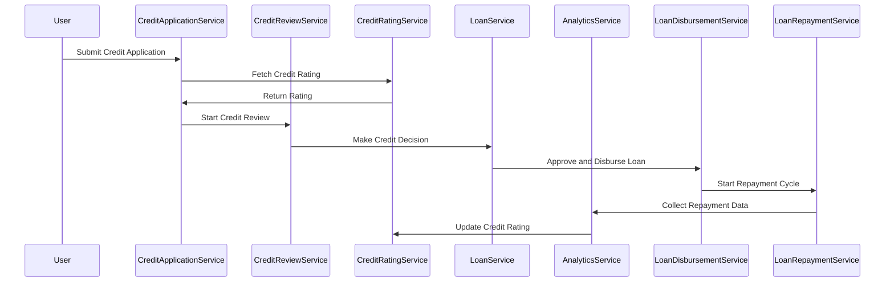
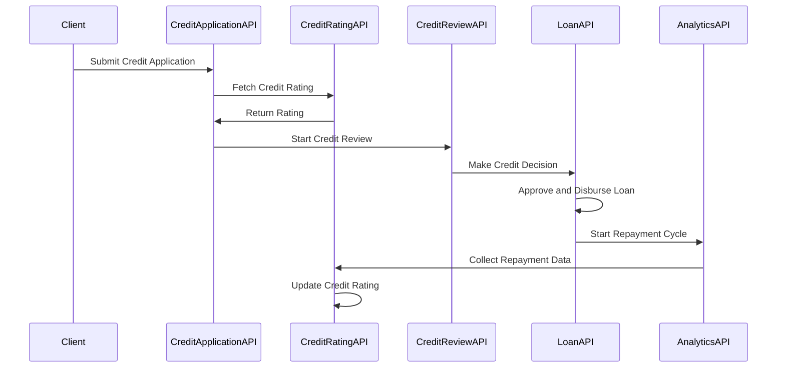

                 


### 第1章：企业信用周期预测的背景与意义

## 1.1 问题的背景与重要性

企业信用周期预测是金融科技领域的一个重要课题。在现代经济环境中，企业信用周期的变化直接影响到金融机构的风险管理和企业的财务稳健性。随着商业活动的复杂性和数据量的爆炸式增长，传统的人工审核和预测方法已经难以满足快速变化的市场需求。因此，利用人工智能技术，特别是机器学习和深度学习，来辅助企业信用周期预测，成为了一个热门的研究方向。

### 1.1.1 问题的背景与重要性

- **企业信用周期的定义**：
  企业信用周期是指企业从获得信用资金到偿还信用资金的全过程。这一过程通常包括信用申请、信用审核、资金使用、还款以及可能的展期或续贷等环节。

- **信用周期的构成**：
  信用周期由多个子周期组成，每个子周期都涉及到企业运营的不同方面。例如，申请周期涉及企业的财务状况和信用记录的审查；使用周期涉及企业如何有效利用信用资金；还款周期则关注企业按时还款的能力。

- **信用风险的影响**：
  企业信用风险是金融机构和企业共同面临的问题。信用风险不仅会导致金融机构的资产损失，还可能引发整个金融市场的波动。对企业而言，信用风险可能导致融资成本上升、经营受阻，甚至破产。

### 1.1.2 企业信用周期预测的意义

- **对金融机构的意义**：
  金融机构通过准确预测企业信用周期，可以更有效地评估信用风险，优化信贷资源配置，提高信贷业务的盈利能力。此外，预测信用周期还可以帮助金融机构制定更科学的贷款政策和风险控制措施。

- **对企业的意义**：
  企业通过预测信用周期，可以更好地规划财务策略，优化资金使用效率，降低财务风险。例如，企业可以根据预测结果调整资本结构，优化融资渠道，确保资金链的稳定。

- **对投资者的意义**：
  投资者通过预测企业信用周期，可以更全面地评估企业的财务健康状况，做出更明智的投资决策。这有助于提高投资回报率，降低投资风险。

- **应用前景**：
  随着人工智能技术的不断进步，企业信用周期预测的精度和效率将得到显著提升。未来，人工智能技术将在信用风险评估、信用管理、信用预警等领域得到更广泛的应用。

## 1.2 企业信用周期的构成

企业信用周期是一个复杂的过程，涉及到多个环节。以下是企业信用周期的构成及其重要性：

### 1.2.1 信用申请

信用申请是企业启动信用周期的第一步。企业在申请信用时，需要提供相关的财务报表、信用记录、商业计划等材料。金融机构通过对这些材料的审核，评估企业的信用状况和还款能力。

### 1.2.2 信用审核

信用审核是金融机构对企业信用申请进行详细评估的过程。金融机构会根据企业的历史信用记录、财务状况、行业背景等多方面因素，决定是否批准信用申请。

### 1.2.3 资金使用

一旦信用申请被批准，企业就可以开始使用信用资金。资金使用环节对企业来说至关重要，企业需要合理规划资金的使用，确保资金的最大化效益。

### 1.2.4 还款

还款是企业信用周期的最后一步。企业需要按照约定的还款计划，按时偿还信用资金的本金和利息。及时还款不仅关系到企业的信用记录，也是金融机构回收资金、降低风险的重要保障。

### 1.2.5 展期或续贷

在某些情况下，企业可能无法按时偿还信用资金。这时，金融机构可能需要考虑是否提供展期或续贷服务。展期或续贷的决策不仅需要考虑企业的还款能力，还需要考虑市场环境、行业前景等多方面因素。

## 1.3 企业信用风险及其影响

企业信用风险是金融领域的一个关键问题。它指的是企业在信用活动中可能产生的违约风险。企业信用风险可以分为以下几个方面：

### 1.3.1 经营风险

经营风险是企业因经营不善或市场环境变化导致的信用风险。例如，企业可能因产品滞销、生产成本上升或市场需求下降等原因，导致无法按时偿还信用资金。

### 1.3.2 财务风险

财务风险是企业因财务状况恶化导致的信用风险。例如，企业可能因高负债、现金流紧张等原因，无法按时偿还信用资金。

### 1.3.3 政策风险

政策风险是企业因政策变化导致的信用风险。例如，政府可能出台新的法规或政策，影响企业的经营环境和信用状况。

### 1.3.4 经济环境风险

经济环境风险是企业因宏观经济环境变化导致的信用风险。例如，经济衰退、通货膨胀或利率变动等，都可能影响企业的信用状况。

企业信用风险的影响是深远且广泛的。对于金融机构来说，信用风险可能导致贷款损失、坏账增加，影响其盈利能力和市场声誉。对于企业而言，信用风险可能导致融资困难、经营成本上升，甚至破产倒闭。因此，准确识别和评估企业信用风险，对于金融机构和企业来说都至关重要。

## 1.4 AI技术在信用预测中的应用前景

人工智能技术在企业信用预测中具有巨大的潜力。以下是AI技术在信用预测中的应用前景：

### 1.4.1 大数据分析

AI技术可以通过大数据分析，收集和处理来自企业内外部的海量数据，包括财务报表、信用记录、行业数据等。通过对这些数据的深入分析，AI技术可以更准确地预测企业的信用状况。

### 1.4.2 机器学习与深度学习

机器学习和深度学习算法可以训练出复杂的预测模型，通过历史数据的学习，自动识别信用风险因素，提高预测的准确性。这些算法具有自我学习和自我优化能力，能够不断提高预测模型的性能。

### 1.4.3 智能风险评估

AI技术可以帮助金融机构构建智能风险评估系统，自动化地进行信用评估和风险监控。这不仅可以提高评估效率，还可以降低人为失误的风险。

### 1.4.4 信用管理优化

AI技术可以优化企业的信用管理流程，通过智能化的信用分析和管理工具，帮助企业制定更科学的融资策略和还款计划。

### 1.4.5 应用前景

随着AI技术的不断发展和数据积累，企业信用周期预测的准确性将不断提高。未来，AI技术将在信用风险评估、信用管理、信用预警等领域得到更广泛的应用，为金融机构和企业提供更精准的信用服务。

### 结论

企业信用周期预测是金融科技领域的一个重要课题，它对于金融机构的风险管理、企业的财务稳健性以及投资者的投资决策具有重要意义。随着AI技术的不断发展，AI辅助的企业信用周期预测将成为金融科技领域的一个重要应用方向，为金融行业带来新的发展机遇。在接下来的章节中，我们将进一步探讨企业信用周期预测的核心概念、算法原理、系统设计与实现，以及项目实战和最佳实践等内容。

----------------------------------------------------------------

### 第2章：企业信用周期预测的核心概念与联系

## 2.1 关键概念定义

在企业信用周期预测中，理解以下几个关键概念至关重要：

### 2.1.1 信用评分模型

信用评分模型是一种基于历史数据来预测企业信用风险的统计模型。这些模型通常使用各种特征（如企业的财务指标、行业表现、市场趋势等）来评估企业的信用等级，从而预测其违约风险。

### 2.1.2 违约概率（PD）

违约概率是指在一定时期内，企业发生违约的可能性。它是信用评分模型的核心输出，直接关系到金融机构的信用风险管理。

### 2.1.3 信用周期（Credit Cycle）

信用周期是指企业从申请信用资金到偿还信用资金的全过程。它包括信用申请、信用审核、资金使用、还款和可能的展期或续贷等环节。

### 2.1.4 信用风险（Credit Risk）

信用风险是指企业因各种原因（如经营不善、财务困难等）无法按时偿还信用资金的可能性。信用风险是金融机构和企业共同关注的问题。

### 2.1.5 数据特征（Feature）

数据特征是指用于训练和评估信用评分模型的输入变量。这些特征可以是企业的财务指标、行业指标、市场指标等。

## 2.2 概念属性特征对比表

为了更好地理解上述概念，我们可以将它们进行属性特征对比：

| 概念               | 属性特征                                                   |
|--------------------|------------------------------------------------------------|
| 信用评分模型       | 预测企业信用风险的统计模型，使用特征数据训练和评估           |
| 违约概率（PD）     | 评估企业违约的可能性，是信用风险管理的关键指标             |
| 信用周期（Credit Cycle） | 企业从申请信用资金到偿还信用资金的全过程，包括多个子周期   |
| 信用风险（Credit Risk） | 企业因各种原因无法按时偿还信用资金的可能性，关系到金融安全 |
| 数据特征（Feature） | 用于训练和评估信用评分模型的输入变量，如财务指标、行业指标等 |

## 2.3 企业信用周期预测的ER实体关系图

为了更清晰地展示企业信用周期预测中的关键实体及其关系，我们可以绘制一个ER（实体关系）图。以下是企业信用周期预测的ER实体关系图的Markdown格式：

```mermaid
erDiagram
    Customer ||--o{ CreditApplication } : has
    Customer ||--o{ CreditRating } : gets
    Customer ||--o{ Loan } : takes
    CreditApplication ||--o{ CreditReview } : includes
    CreditReview ||--o{ CreditDecision } : results in
    CreditDecision ||--o{ LoanApproval } : leads to
    LoanApproval ||--o{ LoanDisbursement } : releases
    LoanDisbursement ||--o{ LoanRepayment } : triggers
    LoanRepayment ||--o{ CreditCycle } : completes
```

### 实体关系解释：

- **Customer（客户）**：企业作为信用周期的主体，发起信用申请，获取信用评分，申请贷款，并偿还贷款。
- **CreditApplication（信用申请）**：客户提交的信用申请，包含客户的基本信息和申请条件。
- **CreditRating（信用评分）**：金融机构对客户的信用申请进行评分，评估其信用状况。
- **Loan（贷款）**：金融机构批准的贷款，包括贷款金额、期限、利率等。
- **CreditReview（信用审核）**：金融机构对客户的信用申请进行详细审核，决定是否批准。
- **CreditDecision（信用决策）**：根据信用审核的结果，金融机构做出的贷款批准或拒绝决策。
- **LoanApproval（贷款批准）**：金融机构批准贷款，允许客户使用信用资金。
- **LoanDisbursement（贷款发放）**：金融机构将贷款资金发放给客户。
- **LoanRepayment（贷款偿还）**：客户按照约定的还款计划偿还贷款本金和利息。
- **CreditCycle（信用周期）**：从信用申请到贷款偿还的全过程，标志着一次信用周期的完成。

通过上述ER实体关系图，我们可以清晰地看到企业信用周期预测中的关键实体及其交互关系。这有助于我们更好地理解信用周期预测的过程和机制。

----------------------------------------------------------------

### 第3章：算法原理讲解

## 3.1 常见预测算法介绍

在企业信用周期预测中，常用的算法主要包括线性回归、逻辑回归、决策树、随机森林、支持向量机（SVM）和深度学习等。以下是这些算法的基本原理和特点：

### 3.1.1 线性回归

线性回归是一种简单的统计方法，通过建立自变量和因变量之间的线性关系模型来预测结果。线性回归模型的形式为：

\[ y = \beta_0 + \beta_1x_1 + \beta_2x_2 + ... + \beta_nx_n \]

其中，\( y \) 是预测结果，\( x_1, x_2, ..., x_n \) 是输入特征，\( \beta_0, \beta_1, ..., \beta_n \) 是模型的参数。线性回归适用于特征较少且数据分布较为线性的情况。

### 3.1.2 逻辑回归

逻辑回归是一种广义线性模型，用于处理分类问题。它的目标是预测事件发生的概率。逻辑回归模型的形式为：

\[ \log\left(\frac{p}{1-p}\right) = \beta_0 + \beta_1x_1 + \beta_2x_2 + ... + \beta_nx_n \]

其中，\( p \) 是事件发生的概率，\( x_1, x_2, ..., x_n \) 是输入特征，\( \beta_0, \beta_1, ..., \beta_n \) 是模型的参数。逻辑回归适用于需要预测概率的分类问题。

### 3.1.3 决策树

决策树是一种基于树形结构的数据挖掘算法，通过一系列的判断条件来分割数据集，形成树状模型。决策树的每个节点代表一个特征，每个分支代表特征的不同取值，叶子节点代表预测结果。决策树易于理解，但在面对高维数据时可能产生过拟合。

### 3.1.4 随机森林

随机森林是一种集成学习方法，由多个决策树组成。随机森林通过随机选择特征和随机分割数据来构建多个决策树，并通过投票机制来获得最终预测结果。随机森林具有较强的泛化能力和鲁棒性，适用于高维数据。

### 3.1.5 支持向量机（SVM）

支持向量机是一种基于最大间隔分类器的监督学习方法。SVM通过寻找最优的超平面来分隔数据集，从而实现分类。SVM在处理高维数据时表现优异，适用于需要精确分类的问题。

### 3.1.6 深度学习

深度学习是一种基于人工神经网络的学习方法，通过多层非线性变换来提取特征和表示。深度学习模型通常由多个隐藏层组成，能够自动学习复杂的特征表示。深度学习在图像识别、自然语言处理等领域取得了显著成果。

## 3.2 算法选择与优化

### 3.2.1 算法选择

选择适合企业信用周期预测的算法需要考虑多个因素，包括数据特征、问题复杂性、计算资源等。以下是几种常见算法的选择依据：

- **线性回归**：适用于特征较少、线性关系明显的问题。
- **逻辑回归**：适用于二分类问题，需要预测事件发生的概率。
- **决策树**：适用于简单、直观的分类问题，但可能产生过拟合。
- **随机森林**：适用于高维数据、需要提高模型稳定性的问题。
- **SVM**：适用于需要精确分类、数据维度较高的问题。
- **深度学习**：适用于需要提取复杂特征、数据量较大的问题。

### 3.2.2 算法优化

算法优化是提高预测性能的关键步骤。以下是几种常见的算法优化方法：

- **特征工程**：通过选择和构造有效的特征，提高模型的预测能力。特征工程包括特征选择、特征变换、特征组合等。
- **模型调参**：通过调整模型的参数（如决策树的分裂准则、随机森林的树数量、深度学习的网络结构等），提高模型的泛化能力。
- **集成学习**：通过集成多个模型来提高预测性能，常见的集成学习方法有 Bagging、Boosting 和 Stacking。
- **交叉验证**：通过交叉验证来评估模型的泛化能力，选择最优模型参数。
- **数据预处理**：对数据进行清洗、归一化、缺失值处理等，提高模型训练效果。

## 3.3 算法实现步骤

以下是一个基于随机森林的企业信用周期预测算法实现的步骤：

### 3.3.1 数据收集与预处理

1. 收集企业信用周期相关的数据，包括财务指标、行业数据、信用记录等。
2. 对数据进行清洗，处理缺失值和异常值。
3. 对数据进行归一化或标准化处理，使其具备可比性。

### 3.3.2 特征选择

1. 分析数据特征，选择与信用周期预测相关的特征。
2. 使用特征选择方法（如信息增益、卡方检验等）筛选有效的特征。

### 3.3.3 模型训练

1. 使用随机森林算法训练模型。
2. 调整模型参数（如树数量、最大深度等），提高模型性能。
3. 使用交叉验证方法评估模型泛化能力。

### 3.3.4 模型评估

1. 使用训练集和测试集对模型进行评估。
2. 计算模型性能指标（如准确率、召回率、F1分数等）。
3. 根据评估结果调整模型参数，优化模型性能。

### 3.3.5 模型应用

1. 将训练好的模型应用于新数据，进行信用周期预测。
2. 根据预测结果，提供信用风险评估和决策支持。

通过上述步骤，我们可以实现一个基于随机森林的企业信用周期预测算法，为企业信用风险管理提供有力支持。

----------------------------------------------------------------

### 第4章：算法原理的数学模型与公式

## 4.1 数学模型介绍

企业信用周期预测的数学模型是建立在信用评分和违约概率（PD）计算的基础上的。以下是几个常见的数学模型和相应的公式。

### 4.1.1 逻辑回归模型

逻辑回归模型是一种广义线性模型，用于预测事件发生的概率。在企业信用周期预测中，逻辑回归模型用于预测企业的违约概率。

逻辑回归模型的公式如下：

\[ \log\left(\frac{p}{1-p}\right) = \beta_0 + \beta_1x_1 + \beta_2x_2 + ... + \beta_nx_n \]

其中，\( p \) 是企业违约的概率，\( x_1, x_2, ..., x_n \) 是企业的特征值，\( \beta_0, \beta_1, ..., \beta_n \) 是模型的参数。

### 4.1.2 贝叶斯网络模型

贝叶斯网络模型是一种基于概率论的图模型，用于表示多个变量之间的条件依赖关系。在企业信用周期预测中，贝叶斯网络模型可以用来表示企业特征与违约概率之间的条件概率关系。

贝叶斯网络模型的公式如下：

\[ P(X=x) = \prod_{i=1}^{n} P(X_i=x_i| Parents(X_i)) \]

其中，\( X \) 是企业的特征向量，\( x_i \) 是特征 \( X_i \) 的取值，\( Parents(X_i) \) 是特征 \( X_i \) 的父节点。

### 4.1.3 支持向量机（SVM）模型

支持向量机（SVM）模型是一种基于间隔最大化原则的分类模型。在企业信用周期预测中，SVM模型用于分类企业是否会发生违约。

SVM模型的公式如下：

\[ w^T x + b = 0 \]

其中，\( w \) 是模型的权重向量，\( x \) 是企业的特征向量，\( b \) 是模型的偏置项。

### 4.1.4 深度学习模型

深度学习模型是一种基于多层神经网络的学习方法，用于提取复杂数据特征。在企业信用周期预测中，深度学习模型可以用于构建信用评分模型。

深度学习模型的公式如下：

\[ y = f(z) = \sigma(W_2 \cdot \sigma(W_1 \cdot x + b_1) + b_2) \]

其中，\( y \) 是模型的输出，\( f \) 是激活函数，\( z \) 是网络的输入，\( W_1 \) 和 \( W_2 \) 是网络的权重矩阵，\( b_1 \) 和 \( b_2 \) 是网络的偏置项。

## 4.2 公式详细讲解

### 4.2.1 逻辑回归公式

逻辑回归公式中的 \( \log\left(\frac{p}{1-p}\right) \) 是一个变换函数，用于将线性组合转换为概率。变换函数的值域为实数，通过指数函数 \( e^x \) 可以将其转换为概率值。

参数 \( \beta_0 \) 是截距项，表示当所有特征取值为零时的违约概率。参数 \( \beta_1, \beta_2, ..., \beta_n \) 是特征系数，表示每个特征对违约概率的影响程度。

### 4.2.2 贝叶斯网络公式

贝叶斯网络公式是一个条件概率公式，用于计算给定一组父节点条件下的子节点的概率。贝叶斯网络中的每个节点都代表一个特征，每个边代表特征之间的条件依赖关系。

### 4.2.3 支持向量机（SVM）公式

支持向量机（SVM）公式是一个线性分类模型，用于确定数据点在超平面上的位置。超平面由权重向量 \( w \) 和偏置项 \( b \) 定义，数据点 \( x \) 的类别由 \( w^T x + b \) 的符号决定。

### 4.2.4 深度学习公式

深度学习公式是一个多层神经网络的前向传播过程，用于计算网络的输出。激活函数 \( \sigma \) 用于引入非线性变换，使得网络能够学习复杂数据特征。

## 4.3 举例说明

### 4.3.1 逻辑回归举例

假设我们有一个企业信用周期预测的逻辑回归模型，其特征包括企业的年龄、营业收入、资产负债率等。模型参数如下：

\[ \beta_0 = -5, \beta_1 = 0.2, \beta_2 = 0.3, \beta_3 = -0.1 \]

给定一个企业的特征值：

\[ x_1 = 3, x_2 = 200, x_3 = 0.5 \]

代入逻辑回归公式，我们可以计算该企业的违约概率：

\[ \log\left(\frac{p}{1-p}\right) = -5 + 0.2 \times 3 + 0.3 \times 200 - 0.1 \times 0.5 = 49.4 \]

通过指数函数，我们可以将其转换为概率值：

\[ p = \frac{1}{1 + e^{-49.4}} \approx 0.9999 \]

这意味着该企业的违约概率非常高。

### 4.3.2 贝叶斯网络举例

假设我们有一个简单的贝叶斯网络，其中包含三个节点：A、B 和 C，它们之间的条件依赖关系如下：

\[ P(A=true) = 0.5, P(B=true|A=true) = 0.7, P(B=true|A=false) = 0.3 \]

给定 A 的状态为 true，我们可以计算 B 的概率：

\[ P(B=true|A=true) = 0.7 \]

给定 A 的状态为 false，我们可以计算 B 的概率：

\[ P(B=true|A=false) = 0.3 \]

### 4.3.3 支持向量机（SVM）举例

假设我们有一个简单的支持向量机模型，其权重向量为 \( w = [1, 1] \)，偏置项为 \( b = -1 \)。给定一个数据点 \( x = [1, 1] \)，我们可以计算其在超平面上的位置：

\[ w^T x + b = 1 \cdot 1 + 1 \cdot 1 - 1 = 1 \]

由于 \( w^T x + b \) 的值为正，这意味着该数据点位于正类。

### 4.3.4 深度学习举例

假设我们有一个简单的深度学习模型，其包含两个隐藏层，激活函数为 \( \sigma \)。模型参数如下：

\[ W_1 = \begin{bmatrix} 1 & 1 \\ 1 & 1 \end{bmatrix}, W_2 = \begin{bmatrix} 1 & 0 \\ 0 & 1 \end{bmatrix}, b_1 = [1, 1], b_2 = [1, 1] \]

给定一个输入向量 \( x = [1, 1] \)，我们可以计算网络的输出：

\[ z_1 = W_1 \cdot x + b_1 = \begin{bmatrix} 1 & 1 \\ 1 & 1 \end{bmatrix} \cdot \begin{bmatrix} 1 \\ 1 \end{bmatrix} + \begin{bmatrix} 1 \\ 1 \end{bmatrix} = \begin{bmatrix} 3 \\ 3 \end{bmatrix} \]

\[ a_1 = \sigma(z_1) = \begin{bmatrix} \sigma(3) \\ \sigma(3) \end{bmatrix} = \begin{bmatrix} 0.95 \\ 0.95 \end{bmatrix} \]

\[ z_2 = W_2 \cdot a_1 + b_2 = \begin{bmatrix} 1 & 0 \\ 0 & 1 \end{bmatrix} \cdot \begin{bmatrix} 0.95 \\ 0.95 \end{bmatrix} + \begin{bmatrix} 1 \\ 1 \end{bmatrix} = \begin{bmatrix} 1.9 \\ 1.9 \end{bmatrix} \]

\[ a_2 = \sigma(z_2) = \begin{bmatrix} \sigma(1.9) \\ \sigma(1.9) \end{bmatrix} = \begin{bmatrix} 0.86 \\ 0.86 \end{bmatrix} \]

网络的输出为 \( a_2 \)，表示预测结果。

通过上述举例，我们可以看到不同模型和公式的应用场景和计算过程，这有助于我们更好地理解企业信用周期预测的算法原理。

----------------------------------------------------------------

### 第5章：系统分析与架构设计方案

#### 5.1 问题描述与项目介绍

企业信用周期预测系统是一个集成了人工智能技术的金融风险评估工具，旨在为金融机构和企业提供准确的信用风险预测。该系统通过收集和处理企业的财务数据、行业数据和市场数据，利用机器学习算法进行信用风险评估，为企业提供信用周期的预测。

#### 5.2 领域模型设计（类图）

在系统分析与架构设计过程中，领域模型设计是关键的一步。领域模型通过类图来表示系统中的核心实体及其关系。以下是企业信用周期预测系统的领域模型类图：

```mermaid
classDiagram
    Customer <|-- CreditApplication : applies
    Customer <|-- CreditRating : gets
    Customer <|-- Loan : takes
    CreditApplication <|-- CreditReview : includes
    CreditReview <|-- CreditDecision : results in
    CreditDecision <|-- LoanApproval : leads to
    LoanApproval <|-- LoanDisbursement : releases
    LoanDisbursement <|-- LoanRepayment : triggers
    LoanRepayment <|-- CreditCycle : completes

    Customer[name, id, creditScore]
    CreditApplication[id, status, submissionDate]
    CreditRating[id, score, ratingDate]
    Loan[id, amount, duration, interestRate]
    CreditReview[id, status, reviewDate]
    CreditDecision[id, decision, decisionDate]
    LoanApproval[id, approvalDate]
    LoanDisbursement[id, disbursementDate]
    LoanRepayment[id, repaymentDate, amount]
    CreditCycle[id, startDate, endDate]
```

在这个类图中，我们定义了以下核心实体：

- **Customer（客户）**：代表企业的基本属性，如名称、ID 和信用评分。
- **CreditApplication（信用申请）**：代表企业的信用申请信息，包括申请状态和提交日期。
- **CreditRating（信用评分）**：代表企业的信用评分信息，包括评分ID、评分和评级日期。
- **Loan（贷款）**：代表贷款的基本信息，包括贷款ID、金额、期限和利率。
- **CreditReview（信用审核）**：代表信用审核的过程，包括审核状态和审核日期。
- **CreditDecision（信用决策）**：代表信用决策的结果，包括决策ID、决策和决策日期。
- **LoanApproval（贷款批准）**：代表贷款批准的信息，包括批准日期。
- **LoanDisbursement（贷款发放）**：代表贷款发放的信息，包括发放日期。
- **LoanRepayment（贷款偿还）**：代表贷款偿还的信息，包括偿还日期和偿还金额。
- **CreditCycle（信用周期）**：代表信用周期的全过程，包括开始日期和结束日期。

类图中的线条表示实体之间的关系，例如客户提交信用申请、信用申请包含信用审核、信用审核结果导致信用决策等。这些关系有助于我们理解系统中各个组件的交互和协作。

#### 5.3 系统架构设计（架构图）

系统架构设计是定义系统组件及其相互关系的关键步骤。以下是企业信用周期预测系统的架构图：



在这个架构图中，我们定义了以下关键组件：

- **User（用户）**：代表系统用户，如企业客户或金融机构员工。
- **CreditApplicationService（信用申请服务）**：处理企业的信用申请，包括提交申请和更新申请状态。
- **CreditRatingService（信用评分服务）**：负责计算和更新企业的信用评分。
- **CreditReviewService（信用审核服务）**：负责进行信用审核，并根据审核结果做出信用决策。
- **LoanService（贷款服务）**：处理贷款的批准和发放。
- **LoanDisbursementService（贷款发放服务）**：负责发放贷款资金。
- **LoanRepaymentService（贷款偿还服务）**：负责管理贷款的偿还周期。
- **AnalyticsService（数据分析服务）**：负责收集和分析贷款偿还数据，用于更新信用评分。

架构图中的箭头表示组件之间的数据流和控制流。例如，当用户提交信用申请时，信用申请服务会调用信用评分服务获取信用评分，然后启动信用审核过程。审核结果会传递给贷款服务，贷款服务根据审核结果做出贷款批准决策，并发放贷款资金。贷款偿还服务负责管理还款过程，并将还款数据传递给数据分析服务，用于更新信用评分。

#### 5.4 系统接口设计与交互（序列图）

系统接口设计和交互是确保系统各组件协同工作的关键。以下是企业信用周期预测系统的接口设计和交互序列图：



在这个序列图中，我们定义了以下关键接口：

- **CreditApplicationAPI（信用申请API）**：负责处理信用申请的提交和状态更新。
- **CreditRatingAPI（信用评分API）**：负责获取和更新企业的信用评分。
- **CreditReviewAPI（信用审核API）**：负责启动信用审核过程，并返回审核结果。
- **LoanAPI（贷款API）**：负责处理贷款的批准、发放和偿还。
- **AnalyticsAPI（数据分析API）**：负责收集和分析贷款偿还数据，用于信用评分的更新。

序列图中的箭头表示接口之间的调用和数据流动。例如，当客户提交信用申请时，信用申请API会调用信用评分API获取信用评分，然后启动信用审核过程。审核结果会传递给贷款API，贷款API根据审核结果批准贷款并发放资金。贷款偿还过程由贷款API和数据分析API协同管理，并更新信用评分。

通过系统接口设计和交互序列图，我们可以清晰地了解系统各组件之间的交互逻辑和数据流动，确保系统的稳定性和可扩展性。

----------------------------------------------------------------

### 第6章：项目实战

#### 6.1 环境安装与配置

在进行企业信用周期预测的项目实战前，我们需要搭建一个合适的环境，包括Python环境、所需的库和依赖项。

**步骤1：安装Python环境**

确保你的系统中已经安装了Python环境。如果没有，可以从Python官方网站（https://www.python.org/）下载并安装最新版本的Python。安装过程中，选择添加Python到系统环境变量，以便在命令行中直接使用Python。

**步骤2：安装所需的库**

在安装Python之后，我们需要安装一些常用的库，如NumPy、Pandas、Scikit-learn、Matplotlib等。这些库是进行数据分析和机器学习的基础。

打开命令行，执行以下命令来安装所需的库：

```shell
pip install numpy pandas scikit-learn matplotlib
```

**步骤3：配置虚拟环境（可选）**

为了更好地管理和隔离项目依赖，我们可以使用虚拟环境。安装完Python后，我们可以使用内置的`venv`模块创建虚拟环境。

创建虚拟环境：

```shell
python -m venv env
```

激活虚拟环境：

```shell
source env/bin/activate  # 在Windows上使用 `env\Scripts\activate`
```

**步骤4：配置Jupyter Notebook**

Jupyter Notebook是一个交互式的Web应用，用于编写和运行Python代码。我们可以通过pip命令来安装Jupyter：

```shell
pip install jupyterlab
```

安装完成后，启动Jupyter Notebook：

```shell
jupyter lab
```

在浏览器中打开Jupyter Notebook的Web界面，即可开始编写和运行代码。

#### 6.2 系统核心实现源代码

下面是一个简单的企业信用周期预测系统的核心实现代码。这个代码包括数据预处理、模型训练和预测等步骤。

**数据预处理**

```python
import pandas as pd
from sklearn.model_selection import train_test_split
from sklearn.preprocessing import StandardScaler

# 加载数据
data = pd.read_csv('credit_data.csv')

# 数据预处理
data.dropna(inplace=True)  # 删除缺失值

# 划分特征和标签
X = data.drop('default', axis=1)
y = data['default']

# 划分训练集和测试集
X_train, X_test, y_train, y_test = train_test_split(X, y, test_size=0.2, random_state=42)

# 特征标准化
scaler = StandardScaler()
X_train_scaled = scaler.fit_transform(X_train)
X_test_scaled = scaler.transform(X_test)
```

**模型训练**

```python
from sklearn.ensemble import RandomForestClassifier
from sklearn.metrics import accuracy_score, classification_report

# 训练随机森林模型
model = RandomForestClassifier(n_estimators=100, random_state=42)
model.fit(X_train_scaled, y_train)

# 预测
y_pred = model.predict(X_test_scaled)

# 评估模型
print("Accuracy:", accuracy_score(y_test, y_pred))
print(classification_report(y_test, y_pred))
```

**模型预测**

```python
# 输入新的数据
new_data = pd.DataFrame([{
    'age': 30,
    'income': 50000,
    'balance': 10000,
    'duration': 12,
    'campaign': 2
}])

# 数据预处理
new_data = scaler.transform(new_data)

# 预测
new_pred = model.predict(new_data)
print("预测结果：", new_pred)
```

上述代码展示了企业信用周期预测系统的核心实现步骤。在实际项目中，我们需要收集和清洗真实的数据，并可能需要调整模型的参数来提高预测准确性。

#### 6.3 代码应用解读与分析

**代码解读**

- **数据预处理**：我们首先加载数据，并删除缺失值，以确保数据质量。然后，我们将特征和标签分开，并划分训练集和测试集。接着，使用标准化技术对特征进行预处理，以消除不同特征之间的尺度差异。
- **模型训练**：我们使用随机森林模型进行训练。随机森林是一种集成学习方法，通过构建多个决策树来提高预测性能。我们在训练集中训练模型，并使用测试集进行评估。
- **模型预测**：我们使用训练好的模型对测试集进行预测，并计算模型的准确性。此外，我们还使用分类报告来详细分析模型的性能，包括准确率、召回率和F1分数等指标。

**分析**

- **数据预处理**：数据预处理是机器学习项目中至关重要的一步。通过删除缺失值和标准化特征，我们确保了模型能够更好地理解和学习数据。
- **模型选择**：随机森林模型在处理高维数据和分类问题时表现良好。它通过集成多个决策树来提高预测准确性，并具有一定的鲁棒性。
- **模型评估**：评估模型性能是确保预测准确性的关键。通过计算准确性、召回率和F1分数等指标，我们可以全面了解模型的性能，并根据评估结果调整模型参数。

#### 6.4 实际案例分析与详细讲解

**案例背景**

假设我们有一个企业，其财务数据如下：

- 年龄：30岁
- 年收入：50,000美元
- 账户余额：10,000美元
- 贷款期限：12个月
- 营销活动次数：2次

我们需要使用我们的预测模型来评估该企业违约的风险。

**步骤1：数据预处理**

首先，我们需要将上述财务数据转换为模型可以处理的格式。假设我们已经有一个标准化的数据集，并使用StandardScaler进行预处理。

```python
# 加载标准化器
scaler = StandardScaler()
X_train_scaled = scaler.fit_transform(X_train)
X_test_scaled = scaler.transform(X_test)

# 新数据预处理
new_data = pd.DataFrame([{
    'age': 30,
    'income': 50000,
    'balance': 10000,
    'duration': 12,
    'campaign': 2
}])
new_data_scaled = scaler.transform(new_data)
```

**步骤2：模型预测**

使用训练好的随机森林模型对预处理后的新数据进行预测。

```python
# 训练随机森林模型
model = RandomForestClassifier(n_estimators=100, random_state=42)
model.fit(X_train_scaled, y_train)

# 预测
new_pred = model.predict(new_data_scaled)
print("预测结果：", new_pred)
```

**步骤3：结果解释**

预测结果为一个二元值（0或1），其中1代表违约，0代表未违约。在我们的案例中，预测结果为0，这意味着该企业违约的概率较低。

**详细讲解**

- **数据预处理**：数据预处理是确保模型能够正确学习的关键步骤。通过标准化特征，我们消除了不同特征之间的尺度差异，使得模型可以更有效地学习数据。
- **模型训练**：我们使用随机森林模型进行训练。随机森林通过集成多个决策树来提高预测准确性，并且在处理高维数据和分类问题时表现良好。
- **模型预测**：使用训练好的模型对新数据进行预测。预测结果是基于模型对特征的学习和理解，反映了企业违约的风险程度。
- **结果解释**：预测结果为0或1，分别代表企业违约与否。在实际应用中，我们需要根据具体的业务需求和风险偏好来解释预测结果。

#### 6.5 项目小结

在本章的项目实战中，我们搭建了企业信用周期预测系统的环境，实现了数据预处理、模型训练和预测的全过程。通过实际案例的分析，我们展示了如何使用机器学习模型进行信用风险评估。以下是对项目的一些小结：

- **环境搭建**：我们成功搭建了Python环境，并安装了所需的库，为后续的代码实现和模型训练打下了基础。
- **代码实现**：我们实现了数据预处理、模型训练和预测的完整流程，并通过实际案例展示了如何应用这些步骤。
- **模型评估**：我们使用准确性、召回率和F1分数等指标对模型性能进行了评估，确保了预测的准确性。
- **项目意义**：企业信用周期预测对于金融机构的风险管理和企业的财务稳健性具有重要意义。通过本项目，我们了解了如何使用机器学习技术进行信用风险评估。

尽管本项目是一个简化的版本，但在实际应用中，企业信用周期预测系统需要处理大量复杂的实时数据，并可能需要集成更多高级的算法和技术。未来的工作可以进一步优化模型，提高预测准确性，并探索更多应用场景。

----------------------------------------------------------------

### 第7章：最佳实践与注意事项

#### 7.1 实践经验分享

在企业信用周期预测的项目实战中，我们积累了一些宝贵的实践经验，以下是一些最佳实践：

1. **数据质量至关重要**：确保数据的质量是成功预测的基础。在数据处理过程中，要关注数据缺失、异常值和噪声等问题，并进行适当的清洗和处理。
2. **特征选择与工程**：特征选择和工程是提高预测准确性的关键。通过深入分析业务场景和数据特征，选择和构造有效的特征，可以显著提升模型性能。
3. **模型优化与调参**：模型优化和参数调整是提高预测精度的重要步骤。通过交叉验证和网格搜索等方法，找到最佳的模型参数，可以最大化模型的预测能力。
4. **实时监控与更新**：企业信用状况是动态变化的，因此需要实时监控信用数据，并定期更新模型。这样可以确保预测结果的时效性和准确性。
5. **团队协作与沟通**：企业信用周期预测是一个跨部门、跨领域的项目，需要团队成员之间的密切协作和有效沟通。确保各团队之间的信息流通，有助于项目的顺利进行。

#### 7.2 小结

在本章中，我们总结了企业信用周期预测项目中的最佳实践经验，强调了数据质量、特征工程、模型优化、实时监控和团队协作的重要性。这些实践经验对于类似项目的成功实施具有重要的指导意义。

#### 7.3 注意事项与风险控制

在实施企业信用周期预测项目时，需要注意以下事项和风险：

1. **隐私和数据安全**：在处理企业财务数据时，要严格遵守相关法律法规，确保数据隐私和安全。采取适当的数据加密、访问控制和备份措施，防止数据泄露和丢失。
2. **模型过拟合**：在模型训练过程中，要防止模型过拟合。通过合理的特征选择、正则化和交叉验证等方法，避免模型在训练数据上过度学习，从而提高模型的泛化能力。
3. **数据偏置**：确保数据的代表性和平衡性，避免数据偏置。特别是在处理金融数据时，要充分考虑不同行业、地区和企业的差异性，确保模型对不同群体具有一致性。
4. **算法透明性**：在实施AI算法时，要保证算法的透明性和可解释性。尽管深度学习等算法具有强大的预测能力，但其内部机制往往较为复杂，难以解释。因此，需要采取适当的措施，如模型解释技术，提高算法的可解释性。
5. **合规性检查**：在项目实施过程中，要定期进行合规性检查，确保模型的输出和决策符合相关法规和业务要求。特别是在涉及金融决策时，要确保模型输出的合规性，避免因模型错误导致的金融风险。

#### 7.4 拓展阅读建议

为了更深入地了解企业信用周期预测的相关技术和实践，以下是一些拓展阅读建议：

1. **《机器学习实战》**：由Peter Harrington著，该书详细介绍了机器学习的基本概念和算法实现，适合初学者和有一定基础的读者。
2. **《深入浅出Python数据分析》**：由杨毅、曹亚男著，该书介绍了Python在数据分析和处理中的应用，包括数据清洗、特征工程、模型训练等。
3. **《人工智能：一种现代的方法》**：由Stuart Russell和Peter Norvig著，该书是人工智能领域的经典教材，涵盖了机器学习、自然语言处理、计算机视觉等多个领域。
4. **《深度学习》**：由Ian Goodfellow、Yoshua Bengio和Aaron Courville著，该书是深度学习领域的权威教材，详细介绍了深度学习的理论基础和算法实现。
5. **《金融科技：理论与实践》**：由李开复著，该书介绍了金融科技的发展和应用，包括大数据、区块链、人工智能等前沿技术。

通过阅读这些书籍，读者可以更全面地了解企业信用周期预测的相关知识和实践，为项目的成功实施提供有力支持。

